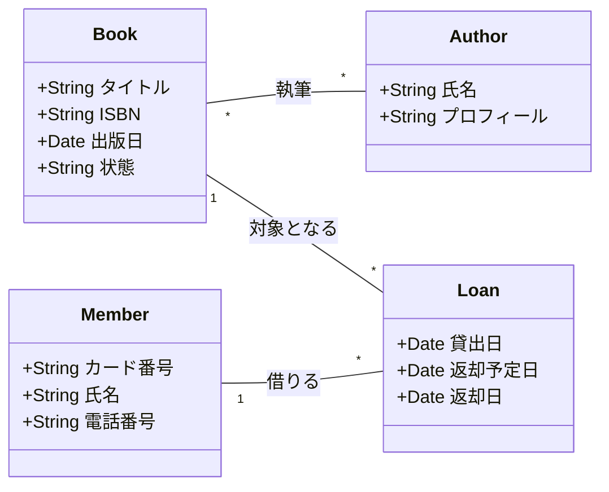
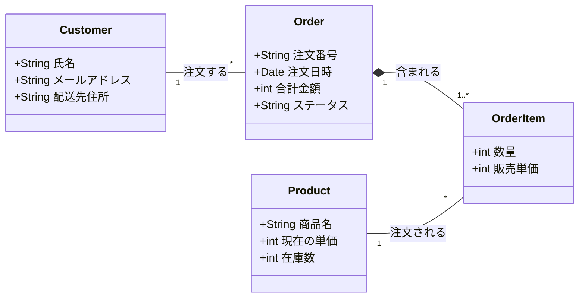
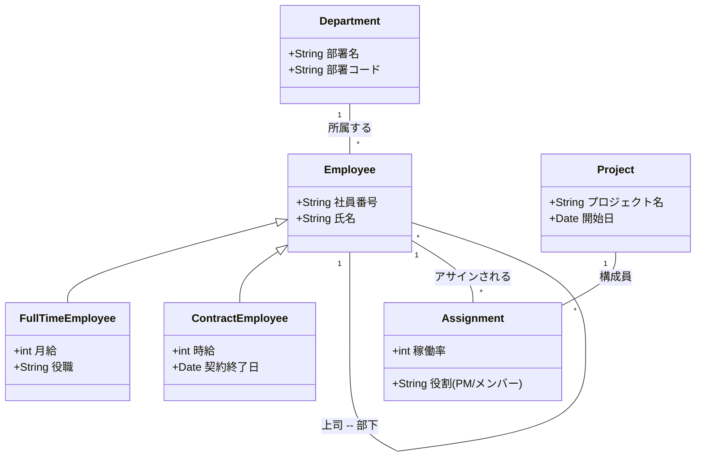

# 演習 1：図書館の蔵書管理システム

**【目標】 クラスの抽出、多重度、および「関連クラス」の考え方を理解する**

### 1. 概要

ある市立図書館では、紙の台帳で行っていた蔵書管理をデジタル化することになりました。システム化にあたって、まずは扱うデータの構造を整理するために、クラス図を作成してください。

### 2. ヒアリング内容（要件）

システム化の担当者にヒアリングしたところ、以下の情報が得られました。これらをクラス図で表現してください。

* **本と著者の管理:**
* 本には「タイトル」「ISBN」「出版日」を記録する。
* 著者には「氏名」「プロフィール」を記録する。
* 1冊の本には複数の著者が関わっていることがあり、1人の著者は複数の本を書いている。

* **利用者情報の管理:**
* 図書館の利用者は「カード番号」「氏名」「電話番号」で管理される。

* **貸出の管理:**
* いつ、誰が、どの本を借りたかを記録する必要がある。
* 貸出記録には「貸出日」「返却予定日」、そして実際に返却された「返却日」を記録する。
* 1人の利用者は同時に何冊も本を借りることができる。

### 3. モデリングのヒント

* **主要なクラス候補:**
* `本 (Book)`
* `著者 (Author)`
* `利用者 (Member)`
* `貸出記録 (Loan)`

* **考え方のポイント:**
* 「誰が」「何を」借りているかという事実は、どのクラスに持たせるのが適切でしょうか？
* 本と著者の関係（多重度）はどうなるでしょうか？

---

## ワークブック：解答欄の作成ガイド

（※受講者に渡す際の空欄イメージ）

* **Step 1:** 上記の要件から「名詞」を抜き出し、クラスを4つ配置しましょう。
* **Step 2:** 各クラスに必要な「属性」を書き込みましょう。
* **Step 3:** クラス同士を線（関連）で結び、その線の上に「多重度」を数字や記号で書き込みましょう。

---

### 講師向けアドバイス

この問題の最大のポイントは、**「本」と「利用者」の間に「貸出記録（Loan）」を置けるかどうか**です。

もし受講者が「本」と「利用者」を直接線で結んでしまった場合は、「それでは、過去に誰がその本を借りていたかという履歴はどうやって保存しますか？」と問いかけてみてください。「貸出日」などのデータを持たせる場所がないことに気づかせることが、データモデリングの第一歩になります。

次は、2つ目の「ECサイトの注文管理」についても同様の問題文を作成しましょうか？

## 図書館蔵書管理システムのクラス図（Mermaid）

---

## 記法のポイント解説（初学者向け）

このMermaidコードの中で、初学者に説明すべきポイントをまとめました。

* **クラスの定義:** `class クラス名 { ... }` の形式で記述します。属性（プロパティ）の前の `+` は「公開（public）」を意味しますが、初等研修では「データの項目名」とだけ説明しても十分です。
* **多重度の書き方:** 線の端にある `"1"` や `"*"` が多重度です。
* `"1"` ： 1つだけ
* `"*"` ： 0以上（複数）

* **関連の方向:** `direction LR`（Left to Right）を指定することで、図を横長に配置し、読みやすくしています。
* **関連名:** `--` の後の `:` 以降に文字を書くことで、その線が何を意味するのか（動詞など）を表現できます。

---

## 補足：さらに理解を深めるために

もし研修に余裕があれば、以下の「一歩進んだモデリング」についても触れてみてください。

1. **「本」と「蔵書」の分離:**
同じタイトルの本が3冊ある場合、ISBN（概念としての本）と管理ラベル（物理的な1冊）を分けるべきか？という議論。
2. **状態管理:**
`Book`クラスの「状態」属性を文字列ではなく、列挙型（Enum）や状態クラスとして定義する考え方。

次は、2つ目の例題である「ECサイトの注文管理」のMermaid図解も用意しましょうか？

 

---

# 演習 2：ECサイトの注文管理

**【目標】 コンポジション（合成）の概念と、履歴データの保持について理解する**

### 1. 概要

急成長中のECサイト「プロ・マーケット」では、注文処理のミスを防ぐため、注文管理機能のデータベース再設計を行うことになりました。商品の注文から配送状況の管理までをカバーするクラス図を作成してください。

### 2. ヒアリング内容（要件）

開発チームのリーダーから、設計に必要な以下の要件を提示されました。

* **顧客情報の管理:**
* 顧客の「氏名」「メールアドレス」「配送先住所」を管理する。
* 1人の顧客は、過去に何度も注文を行うことができる。

* **注文の基本構造:**
* 1回の注文（Order）には、「注文番号」「注文日時」「合計金額」「ステータス（受付中/発送済など）」を記録する。
* 1回の注文には、1種類以上の商品が含まれる。

* **注文明細（OrderItem）の役割:**
* 注文の中には、複数の「商品」が含まれる。商品ごとに「数量」と、その時の「販売単価」を記録する必要がある。
* **重要:** 注文がキャンセル・削除された場合、その中の明細データも同時にシステムから削除される必要がある。

* **商品マスター:**
* 取扱商品には「商品名」「現在の単価」「在庫数」を記録する。
* 商品の単価はセールなどで変動するが、過去の注文時の価格（販売単価）はそのまま残さなければならない。

### 3. モデリングのヒント

* **主要なクラス候補:**
* `顧客 (Customer)`
* `注文 (Order)`
* `注文明細 (OrderItem)`
* `商品 (Product)`

* **考え方のポイント:**
* 「注文」と「注文明細」の関係は、ただの線（関連）で良いでしょうか？それとも「全体と部分」を表す特殊な線が必要でしょうか？
* 「商品の単価」をどこに持たせるべきか、履歴管理の観点から考えてみましょう。

---

## ワークブック：解答欄の作成ガイド

* **Step 1:** 4つのクラスを配置し、属性を書き込みます。
* **Step 2:** 「注文」と「注文明細」の間に、コンポジション（塗りつぶしの菱形）の線を引いてみましょう。
* **Step 3:** 多重度を検討します。「1回の注文に、最低1つは商品が必要」という条件をどう表現しますか？

---

### 講師向けアドバイス（解説のポイント）

この演習では、受講生から「商品クラスに単価があるのに、なぜ注文明細にも単価が必要なのですか？」という質問が出ることがよくあります。

* **解説の切り口:** 「もし今日、100円のリンゴが明日から200円に値上げされたらどうなるか？」を想像させます。
* **結論:** 商品クラスの単価を書き換えたとき、過去の注文データの金額まで変わってしまったら困りますよね。だから「注文した瞬間の価格」をコピーして持っておく必要がある、と説明すると非常に納得感が高まります。

これが理解できると、実務レベルのデータモデリングに一歩近づきます。

## ECサイト注文管理のクラス図（Mermaid）

---

## このモデルの解説ポイント

初学者に説明する際、以下の3点を強調すると「単なるお絵描き」ではない、実務的な設計思想が伝わります。

### 1. コンポジション（塗りつぶしの菱形 `*--`）

* **概念:** `Order（注文）` と `OrderItem（注文明細）` の関係です。
* **解説:** 注文がキャンセルされて削除された場合、その中身である明細だけが残ることはありません。「全体」が消えれば「部分」も消えるという、非常に強い結びつきを表現しています。

### 2. 「現在の単価」と「販売単価」の違い

* **重要ポイント:** `Product` クラスにも `OrderItem` クラスにも「価格」に関連する属性があります。
* **解説:** 商品の価格は将来変わるかもしれません。しかし、「いつ、いくらで買ったか」という記録（OrderItem）には、購入時点の価格を保持しておく必要があります。これを「データの冗長化」ではなく「履歴の保持」として教えるのがコツです。

### 3. 多重度 `1..*` の意味

* **解説:** `Order` に対して `OrderItem` は `1..*`（1以上）となっています。これは「明細が1つもない注文（何も買っていない注文）」はシステム的に許容しない、というビジネスルールを表現しています。

---

## 研修でのアドバイス

この図を提示した後に、「もし、1つの注文で複数の配送先に送りたいという要望が出たら、どこを修正しますか？」と問いかけてみてください。

「`Order` と `OrderItem` の間に『配送グループ』というクラスが必要になるかも？」といった、一歩進んだディスカッションに繋げることができます。

次は、最後の例題である「3. 会社組織とプロジェクト管理」に進みますか？それともこのECサイトの例をさらに深掘りしますか？

 

---

3つ目の例題である「会社組織とプロジェクト管理」の演習問題文を作成しました。
この問題は、これまでの2つに比べて抽象度が上がり、「共通点をまとめる（汎化）」**や**「組織の階層構造（自己再帰）」といった、より高度で柔軟なモデリング手法を学ぶ内容になっています。

---

# 演習 3：会社組織とプロジェクト管理

**【目標】 汎化（継承）、自己再帰関連、および多対多の解消を理解する**

### 1. 概要

ITコンサルティング会社の「テック・パートナーズ」では、社員の所属部署や担当プロジェクトを正確に把握するための社内管理システムを構築することになりました。複雑な組織構造と、流動的なプロジェクトアサインを表現するクラス図を作成してください。

### 2. ヒアリング内容（要件）

人事部長とPMO（プロジェクト管理オフィス）から、以下の要件をヒアリングしました。

* **社員の区分:**
* 全ての社員には「社員番号」「氏名」がある。
* 社員は「正社員」と「契約社員」の2種類に分かれる。
* 正社員には「月給」と「役職」があり、契約社員には「時給」と「契約終了日」のデータがある。

* **部署と上司の管理:**
* 社員は必ず1つの「部署（部署名、部署コード）」に所属する。
* 社員には、直属の「上司」が一人つく。上司もまた、同じ会社の社員である。

* **プロジェクトへのアサイン:**
* 会社では複数の「プロジェクト（プロジェクト名、開始日）」が動いている。
* 1人の社員は複数のプロジェクトを兼務することがあり、1つのプロジェクトには多くの社員が参加する。
* 社員がプロジェクトに参加する際は、必ず「役割（PMやメンバーなど）」と「稼働率（そのプロジェクトに割く時間の割合）」を記録する。

### 3. モデリングのヒント

* **主要なクラス候補:**
* `部署 (Department)`
* `従業員 (Employee)`：正社員・契約社員の共通親クラス
* `正社員 (FullTimeEmployee)`、`契約社員 (ContractEmployee)`
* `プロジェクト (Project)`
* `割当情報 (Assignment)`：社員とプロジェクトを繋ぐクラス

* **考え方のポイント:**
* 正社員と契約社員の共通属性（氏名など）をどう整理しますか？（**汎化**）
* 「社員の上司も社員」という関係をどう線で結びますか？（**自己再帰関連**）
* 社員とプロジェクトの「多対多」を解消するために、どんな中間クラスが必要ですか？

---

## ワークブック：解答欄の作成ガイド

* **Step 1:** 「正社員」と「契約社員」の共通点を抜き出し、親クラスとなる「従業員」クラスを作成しましょう。
* **Step 2:** 「従業員」から自分自身に向かって線を戻し、上司・部下の関係を定義してみましょう。
* **Step 3:** 社員とプロジェクトを直接結ぶのではなく、その「関係のデータ（役割など）」を持つクラスを間に挟んでみましょう。

---

### 講師向けアドバイス（解説のポイント）

この演習は初学者にとって最大の難所となります。以下の2点を重点的に解説してください。

1. **「上司クラス」を作らせない:**
初心者は「上司クラス」と「部下クラス」を別に作りがちです。「部長も社長から見れば部下ですよね？」と問いかけ、同じ「従業員」という枠組みの中で役割（再帰関連）が変わるだけであることを伝えてください。
2. **多対多の分解:**
「社員」と「プロジェクト」を直接結ぶと、「AさんはこのプロジェクトではPMだけど、あっちではメンバー」という情報をどこに書けばいいか迷子になります。「AさんのプロジェクトBにおける役割」という「結びつきそのもの」をクラスにするという発想を伝授してください。

---

これで3つのステップアップ演習が揃いました！

1. **図書館（基本）**
2. **ECサイト（構造と履歴）**
3. **組織管理（抽象化と再帰）**

この順で進めることで、実務に必要なモデリングスキルの土台をしっかりと築けるはずです。資料作成、頑張ってください！

---

## このモデルの解説ポイント

この例題は少し情報量が多いので、以下の3ステップで解説すると受講者の頭が整理されます。

### 1. 汎化（白抜き三角の矢印 `<|--`）

* **概念:** `Employee（従業員）` を親、`FullTimeEmployee（正社員）` と `ContractEmployee（契約社員）` を子とする継承関係です。
* **解説:** 「氏名」や「社員番号」など共通する項目は親クラスにまとめ、雇用形態ごとに異なる項目（月給 vs 時給など）だけを子クラスに持たせます。これにより、**重複を排除した美しい設計**を学べます。

### 2. 自己再帰関連（自分自身への線）

* **概念:** `Employee` から `Employee` へ伸びる線です。
* **解説:** 「上司もまた一人の従業員である」という構造を表現しています。現実世界では当たり前のことですが、図解しようとすると初学者は「上司クラス」を別に作りたがります。**「役割」と「実体（クラス）」を分ける考え方**を伝えるチャンスです。

### 3. 多対多の解消（Assignment クラスの役割）

* **概念:** `Employee` と `Project` の間にある `Assignment（割当）` です。
* **解説:** 1人の社員は複数のプロジェクトを兼務し、1つのプロジェクトには複数の社員がいます。この「多対多」の間に、「PMなのかメンバーなのか」といったその関係性特有の情報（役割や稼働率）を持たせるために中間クラスを置くテクニックを伝えます。

