# 問題16-1：行パターンマッチング初歩の初歩１
### 難易度：★★★☆☆ (Lv.3)
## 問題
MATCH_RECOGNIZE句を使用して、HRスキーマの`COUNTRIES`テーブルから、`REGION_ID`が「20」のデータを取得してください。
なお、レコードの表示順序は問いません。

**【学習のポイント】**
通常、特定のIDを抽出するだけなら `WHERE region_id = 20` で十分ですが、ここではあえて `MATCH_RECOGNIZE` の基本作法を使い、以下のキーワードの役割を理解してください。
* **`PATTERN`**: 探したいパターンの並び順（正規表現のような書き方）。
* **`DEFINE`**: パターン内で使う変数の条件定義。
* **`ALL ROWS PER MATCH`**: 見つかったパターンに含まれるすべての行を表示する指定。

## 期待する結果
| REGION_ID | COUNTRY_ID | COUNTRY_NAME |
| --------- | ---------- | ------------------------ |
| 20 | CA | Canada |
| 20 | BR | Brazil |
| 20 | AR | Argentina |
| 20 | US | United States of America |
| 20 | MX | Mexico |

## 解答例
```sql
SELECT
    *
FROM
    hr.countries 
    MATCH_RECOGNIZE (
        ORDER BY
            region_id
        ALL ROWS PER MATCH
        PATTERN ( 
            group20+ 
        )
        DEFINE
            group20 AS region_id = 20
    )
```

## 解説
Oracle SQLの中でも比較的新しい機能、`MATCH_RECOGNIZE`句（行パターンマッチング）についてです。この機能は本来、株価の「V字回復」やログデータの「特定のエラーパターン」など、複数の行にまたがるシーケンス（連続性）を正規表現のように探すための強力な仕組みです。今回はその「初歩の初歩」として、単純なフィルタリングをこの構文でどう書くか、という問題です。

通常の`WHERE`句が「個々の行」を判定するのに対し、`MATCH_RECOGNIZE`は「並んだ行の中に、特定のパターンがあるか」を判定します。

| 記述 | 役割 |
| :--- | :--- |
| `PATTERN (group20+)` | `group20`という条件に合う行が1回以上連続するパターンを探す |
| `DEFINE group20 AS region_id = 20` | `group20`の正体（条件）を定義 |
| `ALL ROWS PER MATCH` | 一致した行をすべて出力（指定しないと1行に集約される） |

`PATTERN ( group20+ )`の`+`は正規表現でおなじみの記号で、「`group20`という条件に合う行が1回以上連続して出現するパターン」を探せ、という意味になります。`DEFINE group20 AS region_id = 20`で「`group20`とは何か」を定義しており、今回は単純に`REGION_ID`が20であること、としています。

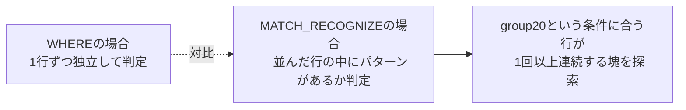

解答例にある各オプションの意味も整理しておきます。`ORDER BY region_id`は、パターンを探す前にデータをどの順番で並べるかを指定するもので、行パターンマッチングにおいて並び順は重要な要素です。`ALL ROWS PER MATCH`は、パターンに一致した行をすべて出力する指定です。これを指定しない（デフォルトの`ONE ROW PER MATCH`）と、一致した複数の行が1行に集約されてしまいます。今回は全データを見たいため、これが必要になります。

正直なところ、この問題のような単純な抽出なら`WHERE region_id = 20`と書くのが一番早く、行パターンマッチングを使う必要はありません。今回は構文の学習として、あえてこの書き方を使っています。「売上が3日連続で上がった直後に、1日だけ下がったパターン」や「ログイン失敗が1分以内に5回連続したパターン」のような複雑な条件が出てきたときに、この構文が活きてきます。これらを従来のSQL（自己結合や分析関数）で書くとクエリが複雑になりがちですが、`MATCH_RECOGNIZE`なら`PATTERN (UP UP UP DOWN)`のように直感的に記述できます。

結果には、アメリカ大陸（REGION_ID: 20）に属するカナダ、ブラジル、アルゼンチンなどの国々が正しく抽出されています。

:::message
### MATCH_RECOGNIZEの文法詳細
`MATCH_RECOGNIZE`は、Oracle 12cから導入された構文です。基本的な考え方は、「テーブル全体を1つの長い文字列のように見立てて、そこに正規表現で検索をかける」というイメージです。全体の構文図をもとに、主要な5つのパーツを分解して整理します。

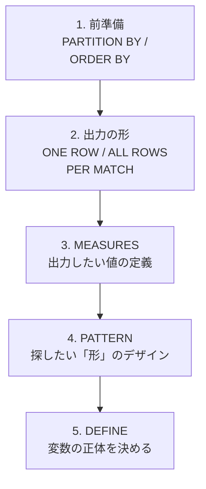

**1. 前準備：データの整理**
パターンを探す前に、データを「どの範囲で」「どの順番で」並べるかを決めます。`PARTITION BY`（任意）はデータをグループ化します（例：`cust_id`ごとにパターンを探す）。`ORDER BY`（必須）はパターンを判定する「時間順」や「ID順」を指定します。

**2. 出力の形：ONE ROW か ALL ROWS か**
マッチした結果をどう表示するかを決めます。`ONE ROW PER MATCH`（デフォルト）は1つのパターンに一致した複数行を1行にまとめて出力し集計に向いています。`ALL ROWS PER MATCH`はマッチした行をすべてそのまま出力し、詳細を確認するのに向いています。

**3. MEASURES：出力したい値の定義**
通常の`SELECT`句のように、結果に含めたい値を定義します。`MATCH_NUMBER()`は何番目のマッチかを表示し、`CLASSIFIER()`はその行がどの変数（`DEFINE`で決めた名前）に一致したかを表示します。`FINAL COUNT(A.id)`のように、マッチした「A」という区間の件数を集計することもできます。

**4. PATTERN：探したい「形」のデザイン**
正規表現の記号を使って、行の並び順を定義します。`PATTERN (A B+ C)`はAが1回、その次にBが1回以上、最後にCが1回という並びを探せという意味です。`PATTERN (UP{3,} DOWN)`は3回以上連続で上昇（UP）した後、下落（DOWN）したパターンを探せという意味です。

**5. DEFINE：変数の正体を決める**
`PATTERN`で使ったアルファベット（変数）が、具体的にどういう条件なのかを定義します。
```sql
DEFINE
  UP AS price > PREV(price),    -- 「UP」とは、前の行より価格が高いこと
  DOWN AS price < PREV(price)   -- 「DOWN」とは、前の行より価格が低いこと
```
ここで`PREV()`（前の行を参照）や`FIRST()`（マッチ区間の最初の行を参照）といったナビゲーション関数を使って条件を作ります。

| キーワード | 必須/任意 | 役割 |
| :--- | :---: | :--- |
| `PARTITION BY` | 任意 | データをどの「部署」や「ユーザー」ごとに探すかのグループ分け |
| `ORDER BY` | 必須 | 時系列順に並べる指定 |
| `MEASURES` | 任意 | パターンの開始日や変化率などの出力したい値の定義 |
| `PATTERN` | 必須 | `(UP+ DOWN+)`のような探したいパターンの形 |
| `DEFINE` | 必須 | パターンの各変数の定義 |

主要なキーワードをまとめると、`PARTITION BY`はデータをどの「部署」や「ユーザー」ごとに探すかのグループ分け、`ORDER BY`（必須）は時系列順に並べる指定、`MEASURES`はパターンの開始日や変化率などの出力したい値の定義、`PATTERN`（必須）は`(UP+ DOWN+)`のような正規表現に近い探したいパターンの形、`DEFINE`（必須）は「UPとは前の行より価格が高いこと」のようなパターンの各変数の定義、という役割になります。
:::

----
<br><br>
# 問題16-2：行パターンマッチング初歩の初歩２
### 難易度：★★★☆☆ (Lv.3)
## 問題
MATCH_RECOGNIZE句を使用して、HRスキーマの`COUNTRIES`テーブルから、`REGION_ID`が「20」のデータの件数を取得してください。

## 期待する結果
| REGION_ID | CNT |
| --------- | --- |
| 20 | 5 |

## 解答例
```sql
SELECT
    *
FROM
    hr.countries 
    MATCH_RECOGNIZE (
        ORDER BY
            region_id
        MEASURES
           region_id      AS region_id,
           COUNT(*)       AS cnt
        ONE ROW PER MATCH
        PATTERN ( 
            group20+ 
        )
        DEFINE
            group20 AS region_id = 20
    )
```

## 解説
前回（16-1）は「パターンに一致する行をすべて出す」という使い方でしたが、今回は「見つけたパターンを1行にまとめる」という、集計としての`MATCH_RECOGNIZE`です。「`GROUP BY`でいいのでは」という声が聞こえてきそうですが、この構文で集計を行う仕組みを理解しておくと、複雑な集計を扱う際に役立ちます。

今回のポイントは出力形式の切り替えです。

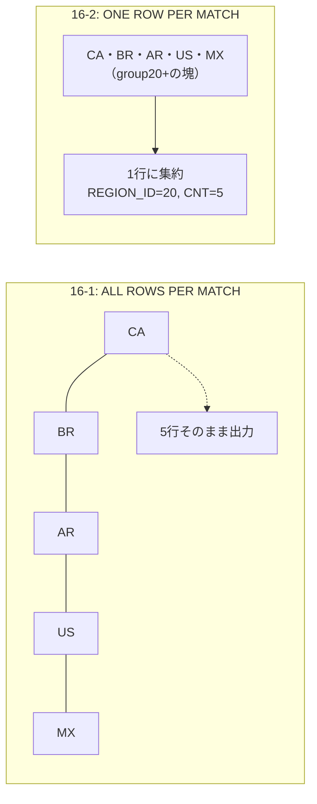

前回（ALL ROWS...）はパターンに一致した行をバラさずにそのまま表示していましたが、今回（ONE ROW...）はパターン（`group20`が1回以上連続する区間）を見つけたら、それを1つの塊（マッチ）として扱い、結果を1行に集約します。

`ONE ROW PER MATCH`を使う場合、その1行に「何を表示するか」を`MEASURES`で定義する必要があります。`COUNT(*)`は「そのマッチ（区間）の中に何行含まれていたか」を数え、`region_id`はマッチした区間の代表値として出力しています。

なぜ`GROUP BY`ではなくこれを使うのか、という点も考えてみましょう。

| 集計方式 | 「連続性」の扱い |
| :--- | :--- |
| `GROUP BY` | 条件に合う行を全部まとめて数える（連続性を区別しない） |
| `MATCH_RECOGNIZE` | 連続性が途切れたら別のマッチとして分けて集計 |

例えば、株価データで「3日連続上昇」というパターンが期間中に3回発生したとします。`GROUP BY`だと条件に合う日を全部まとめて数えてしまいますが、`MATCH_RECOGNIZE`は「1回目の3連騰（3日間）」「2回目の3連騰（3日間）」……というように、連続性が途切れたら別のマッチとして分けて集計できます。今回の問題では`REGION_ID=20`が一箇所に固まっている（ORDER BYされている）ため結果として1行になりますが、「連続性が切れたら別の行として出す」という挙動が、標準の集計関数との違いです。

結果を見ると、`REGION_ID`が20の国々が1つのパターンとして認識され、その中に含まれる5件という数字が`CNT`として算出されています。

----
<br><br>

# 【完全版】問題16-3：上昇・下降パターンの認識１
### 難易度：★★★★☆ (Lv.4)
## 問題
SHスキーマの`SALES`テーブルを使用し、月ごとの売上が「前月より高い」状態が3回以上続いた期間を特定してください。
なお、レコードはSTART_MONTHの昇順でソートしてください。


## 期待する結果
| START_MONTH | END_MONTH | DURATION |
| ----------- | --------- | -------- |
| 2019-06 | 2019-10 | 5 |
| 2020-07 | 2020-09 | 3 |
| 2020-12 | 2021-02 | 3 |
| 2022-10 | 2022-12 | 3 |

## 解答例
```sql
SELECT *
FROM (
    SELECT 
        TO_CHAR(time_id, 'YYYY-MM') AS month,
        SUM(amount_sold) AS total_rev
    FROM sh.sales
    GROUP BY TO_CHAR(time_id, 'YYYY-MM')
)
MATCH_RECOGNIZE (
    ORDER BY month
    MEASURES 
        FIRST(up.month) AS start_month,
        LAST(up.month) AS end_month,
        COUNT(up.month) AS duration
    ONE ROW PER MATCH
    AFTER MATCH SKIP TO LAST up
    -- パターン定義：最初の行(STRT)の後に、上昇(UP)が3回以上続く
    PATTERN (strt up{3,})
    DEFINE 
        up AS up.total_rev > prev(up.total_rev)
)
ORDER BY start_month;
```

## 解説
ここから`MATCH_RECOGNIZE`の本領が発揮される問題に入ります。これまでのSQLでは「前月比」を出すだけでも一苦労でしたが、この構文を使えば「3ヶ月連続上昇」といった時系列のトレンド（波形）を、言葉で説明するように記述できます。データ分析の実務で「V字回復」や「右肩下がり」を特定する際に役立つテクニックです。

今回のクエリの核となるのは`PATTERN`と`DEFINE`の連携です。

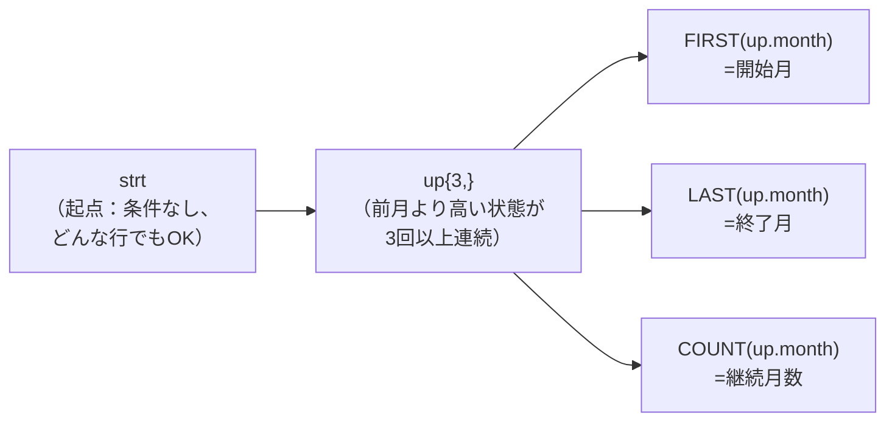

`PATTERN (strt up{3,})`の`strt`は起点となる行で、条件が定義されていない（`DEFINE`にない）変数は「どんな行でもOK」というワイルドカードとして機能します。`up{3,}`は`up`という条件に合う行が3回以上連続することを示します。`DEFINE up AS up.total_rev > prev(up.total_rev)`で「何をもって上昇（up）とするか」を定義しており、`prev(...)`は直前の行（この場合は1ヶ月前）の値を参照する関数です。つまり「今月の売上が、先月の売上より大きいこと」が`up`の正体です。

パターンが見つかった際、その塊の中から必要な情報を`MEASURES`で抽出します。`FIRST(up.month)`はマッチした連続上昇区間の中で最初の`up`行の月、`LAST(up.month)`は最後の`up`行（上昇が止まる直前）の月、`COUNT(up.month)`はこのパターンに含まれる`up`行の数を取得しています。なお、今回は`up`変数だけを対象に集計しているため、起点となる`strt`行そのものはこれらの集計値には含まれない点に注意してください。

`AFTER MATCH SKIP TO LAST up`という一文があるかどうかで結果は大きく変わります。

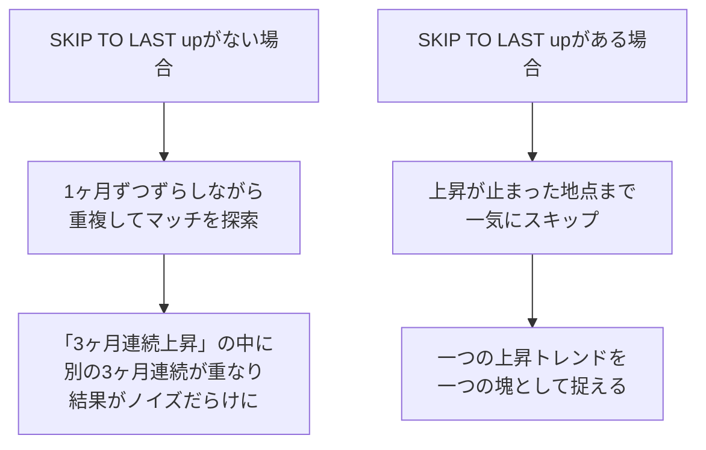

これは「マッチが見つかった後、次の探索をどこから始めるか」を指定するもので、これを書かないと1ヶ月ずつずらしながら重複してマッチを探してしまい、「3ヶ月連続上昇」の中に「別の3ヶ月連続」が重なって出力されるなど結果がノイズだらけになってしまいます。「一つの上昇トレンドを一つの塊として捉える」ために欠かせない設定です。

結果を見ると、2019-06から2019-10までの期間、5ヶ月連続で売上が伸び続けていたことが分かります。単なる「前月比プラス」の月を探すのではなく「勢いがついている期間」を特定することで、当時のキャンペーンの効果測定や、季節性の強いトレンドを客観的に確認する材料になります。

----
<br><br>

# 【完全版】問題16-4：上昇・下降パターンの認識２
### 難易度：★★★★☆ (Lv.4)
## 問題
HRスキーマの`EMPLOYEES`テーブルより、部門ごとに採用順（`HIRE_DATE`順）にデータを見たとき、「新しく入った従業員の給与が、直前に採用された従業員よりも高い状態が3回以上連続した期間」を特定してください。
なお、レコードは`CONSECUTIVE_INCREASES`の降順、次いで`START_HIRE_DATE`の昇順でソートしてください。

## 期待する結果
| DEPARTMENT_ID | START_HIRE_DATE | END_HIRE_DATE | CONSECUTIVE_INCREASES | START_SALARY | END_SALARY |
| ------------- | --------------- | ------------- | --------------------- | ------------ | ---------- |
| 50 | 2017-04-10 | 2017-11-16 | 4 | 2100 | 5800 |
| 50 | 2017-12-12 | 2018-02-03 | 4 | 2400 | 2800 |
| 80 | 2015-12-15 | 2016-03-23 | 3 | 7500 | 10000 |
| 80 | 2018-01-04 | 2018-01-29 | 3 | 6200 | 10500 |

## 解答例
```sql
SELECT
    department_id,
    start_hire_date,
    end_hire_date,
    consecutive_increases,
    start_salary,
    end_salary
FROM hr.EMPLOYEES
    MATCH_RECOGNIZE (
    PARTITION BY department_id
    ORDER BY hire_date
    MEASURES
        FIRST(hire_date) AS start_hire_date,
        LAST(hire_date) AS end_hire_date,
        COUNT(UP.employee_id) + 1 AS consecutive_increases,
        FIRST(salary) AS start_salary,
        LAST(salary) AS end_salary
    ONE ROW PER MATCH
    -- パターン定義：任意の開始点(STRT)から、給与が前回より高い状態(UP)が2回以上連続する
    PATTERN (STRT UP{2,}) 
    DEFINE
        UP AS salary > PREV(salary)
    )
ORDER BY consecutive_increases DESC, start_hire_date
```

## 解説
今回の問題は、前問の「売上トレンド」の応用ですが、「部署ごと（PARTITION BY）」の切り分けが加わり、「組織内の給与インフレ分析」のようなデータ抽出になっています。

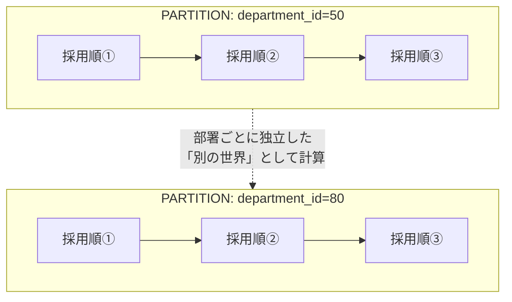

`PARTITION BY department_id`と`ORDER BY hire_date`は、行パターンマッチングにおいて「分析の舞台」を整えるために欠かせません。`PARTITION BY department_id`は部署ごとに「別の世界」として扱い、部署Aの採用順が部署Bの給与推移に影響を与えないようにします。`ORDER BY hire_date`は「採用された順」という時間の軸を作ります。この並び順が崩れると、パターンの意味がなくなってしまいます。

パターン定義には少し細かい調整があります。`PATTERN (STRT UP{2,})`の`STRT`は最初の1人目で特に条件がないため誰でも当てはまり、`UP{2,}`は「前の人より給与が高い」という事象が2回以上続くことを意味します。合計すると「最初の1人」＋「上昇した2人以上」＝合計3人以上の連続した期間を特定していることになります。

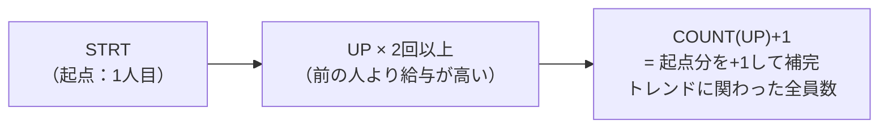

ここでの`COUNT(UP.employee_id) + 1`は、`COUNT(UP)`が「上昇した回数（人数）」だけを数えるため、起点となった`STRT`の1人を足すことで「その上昇トレンドに関わった全従業員数」を算出しています。前問（16-3）とは異なり、ここでは`+1`によって起点の分を明示的に補っている点が特徴です。

期待する結果のDepartment 50を見てみましょう。START_HIRE_DATE 2017-04-10からEND_HIRE_DATE 2017-11-16までの期間で、CONSECUTIVE_INCREASESが4、給与はSTART 2100からEND 5800まで上がっています。これは「2017年4月から11月にかけて採用された4名が、一人も欠かさず前の新入社員より高い初任給で入社してきた」という事実を示しています。このデータから、「この時期、この部署では採用市場が過熱しており、初任給を引き上げ続けないと人が採れなかった」といった当時の人事戦略や市場背景を推測することができます。

```sql
DEFINE UP AS salary > PREV(salary)
```
`PREV`関数が`MATCH_RECOGNIZE`句の中で使えるのがこの構文の強みです。通常、SQLで「一つ前の行」と比較するには`LAG`関数を使い、さらにその結果を外側で判定する必要がありますが、`MATCH_RECOGNIZE`なら「条件を定義する（DEFINE）」段階で前の行を参照できます。これにより、複雑な「波形」の定義がすっきり記述できます。

----
<br><br>

# 【完全版】問題16-5：階層構造のカウント
### 難易度：★★★★☆ (Lv.4)
## 問題
HRスキーマの`EMPLOYEES`テーブルを参照し、従業員と上司のリレーションをツリー構造で取得してください。また、各従業員の配下にいる全従業員（部下およびそのまた部下すべて）の数を取得してください。
出力にあたっては以下の条件を満たしてください。
* 最上位の従業員を「1」、その下位の従業員を「2」という形で、レベルに応じた番号を氏名に付与する。
* 階層が深くなるごとに、氏名の前に全角スペース2つ分（半角スペース4つ相当）のインデントを付与する。
（例）「1. Steven King」、「  2. Neena Kochhar」、「    3. Nancy Greenberg」
* なお、レコードは深さ優先探索順（兄弟間は氏名の昇順）で表示してください。

## 期待する結果
（社長Steven King（配下106人）を頂点に、各マネージャーとその配下人数がインデント付きの組織ツリー形式で表示される。例：Neena Yang配下11人、その下のNancy Gruenberg配下5人というように、階層を下るごとに配下人数が正しく減少する。詳細は元データを参照。）

## 解答例
```sql:例1（階層問い合わせ（START WITH / CONNECT BY）で解決）
select
   e.EMPLOYEE_ID
 , lpad(' ', 2*(level-1)) || level || '. ' || e.FIRST_NAME || ' ' || e.LAST_NAME as name
 , (
      select count(*)
      from HR.EMPLOYEES sub
      start with sub.MANAGER_ID = e.EMPLOYEE_ID
      connect by sub.MANAGER_ID = prior sub.EMPLOYEE_ID
   ) as subs
from HR.EMPLOYEES e
start with e.MANAGER_ID is null
connect by e.MANAGER_ID = prior e.EMPLOYEE_ID
order siblings by e.FIRST_NAME || ' ' || e.LAST_NAME;
```
```sql:例2（行パターンマッチングで解決）
with hierarchy as (
   select
      lvl, EMPLOYEE_ID as id,  name, rownum as rn
   from (
      select
         level as lvl, e.EMPLOYEE_ID, e.FIRST_NAME || ' ' || e.LAST_NAME as name
      from hr.employees e
      start with e.MANAGER_ID is null
      connect by e.MANAGER_ID = prior e.EMPLOYEE_ID
      order siblings by name
   )
)
select
   id
 ,  lpad(' ', 2 *(lvl -1)) || lvl || '. ' || name as name
 , subs
from hierarchy
match_recognize (
   order by rn
   measures
      strt.rn           as rn
    , strt.lvl          as lvl
    , strt.id           as id
    , strt.name         as name
    , count(higher.lvl) as subs
   one row per match
   after match skip to next row
   pattern (
      strt higher*
   )
   define
      higher as higher.lvl > strt.lvl
)
order by rn;
```
## 解説
これまでの問題（14-3など）でも「配下人数の集計」を扱いましたが、今回の解答例には「スカラー副問合せによる方法」と「行パターンマッチングによる方法」という、異なる2つのアプローチが示されています。特に例2の「深さ優先探索(DFS)順に並んだリストに対してパターンマッチングを行う」という発想は、なかなか高度なテクニックです。

階層構造のデータにおいて、「自分より下の階層（孫やひ孫まで含む）の数」を数えるのは、標準的な集計（`GROUP BY`）だけでは難しい問題です。なぜなら、「誰が誰の部下か」という情報はわかっても、「誰が誰の配下全体に含まれるか」はツリーを辿りきってみるまで確定しないからです。

| アプローチ | 仕組み | 特徴 |
| :--- | :--- | :--- |
| 例1：スカラー副問合せ | 1行表示するごとに新しいツリー探索を実行 | 直感的だが、人数分だけ繰り返し探索が必要 |
| 例2：行パターンマッチング | DFS順に並んだ名簿を1回スキャン | 効率的だが、発想がやや高度 |

例1は、直感的な「ループ的」な考え方です。メインクエリでまず普通に従業員のツリーを作り（`CONNECT BY`）、スカラー副問合せ（`subs`）で1行表示するごとに、その人を「起点」とした新しいツリー探索を裏側で実行し、その結果（行数）をカウントしています。コードが読みやすく直感的な反面、107人いれば107回、1万人いれば1万回新しくツリーを探索するため、大規模な組織図ではパフォーマンスが落ちる可能性があります。

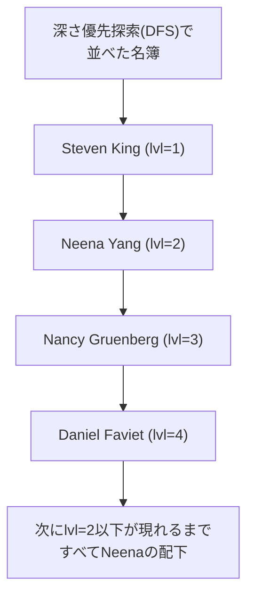

例2は、より実行効率を意識した解法です。ツリーを「深さ優先」で並べると、ある人の「配下全員」は、必ずその人のすぐ下の行から、「自分と同じか、より浅いレベル」が現れる直前までに固まって出現するという性質を利用しています。`PATTERN (strt higher*)`で「起点となる人（`strt`）」とその後に続く「自分よりレベルが深い（配下である）行（`higher`）」の連続を探し、`DEFINE higher AS higher.lvl > strt.lvl`で「自分のレベルより数字が大きい間は、すべて自分の部下（配下）である」と定義しています。`AFTER MATCH SKIP TO NEXT ROW`によって、全員に対してこの「配下探し」を行います。例1のように何度もツリーを検索し直すのではなく、一列に並んだ名簿を上から下へ一度スキャンするだけで全員の配下数を確定させているため、計算量がかなり少なくて済みます。

結果のトップにいるSteven King（ID 100）を見ると、SUBSが106人（自分以外の社員全員）です。Neena Yang（ID 101）は11人、その下のNancy Gruenbergは5人と、ツリーを下るにつれて「傘下」の人数が正しく減っていくのが確認できます。

:::message
### AFTER MATCH SKIP TO の種類と説明
`MATCH_RECOGNIZE`句において`AFTER MATCH SKIP TO`は重要な役割を果たします。「一つのマッチが見つかった後、次の検索をどこから再開するか」を制御するもので、これによってマッチの重複を許すかどうかが決まります。

| オプション | 再開位置 | 重複 |
| :--- | :--- | :---: |
| `PAST LAST ROW`（デフォルト） | 現在のマッチの最後の行の直後 | なし |
| `TO NEXT ROW` | 現在のマッチの最初の行の次の行 | 最大限あり |
| `TO FIRST variable` | 指定変数にマッチした最初の行 | あり |
| `TO LAST variable` | 指定変数にマッチした最後の行 | あり |

主要なオプションを整理すると、`PAST LAST ROW`（デフォルト）は現在のマッチの最後の行の直後から検索を再開し、重複はありません。`TO NEXT ROW`は現在のマッチの最初の行の次の行から検索を再開し、重複が最大限発生します。`TO FIRST variable`は指定した変数にマッチした最初の行から再開し、重複ありです。`TO LAST variable`は指定した変数にマッチした最後の行から再開し、重複ありです。`TO variable`は`TO LAST variable`と同じ動作をします。

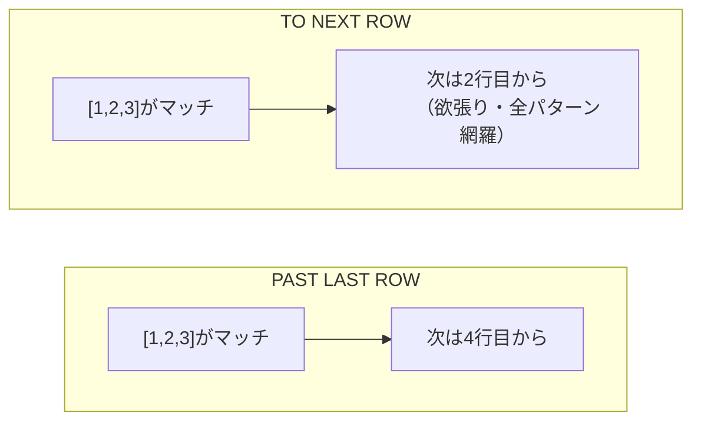

それぞれの用途を見ていきましょう。`PAST LAST ROW`（デフォルト）は最も一般的な設定で、一度マッチした行は次のマッチの開始点にはなり得ません。重複のない独立したイベントを抽出したい場合に使います。`[1, 2, 3]`がマッチしたら、次は`4`行目から探し始めます。

`TO NEXT ROW`は最も「欲張り」な検索です。重複を許容して考えられるすべてのパターンを網羅したい場合（例：移動平均のようなスライディングウィンドウ処理）に使います。`[1, 2, 3]`がマッチしたら、次は`2`行目から探し始めます。

`TO FIRST / LAST variable`は、特定の条件に合致した地点まで「戻る」または「進む」ことができます。複雑なステートマシンを実装する場合に使います。例えば「急騰（UP）」の後に「調整（DOWN）」が来た際、次の検索を「調整の開始地点」からやり直したい場合などに有効です。ただし`TO FIRST variable`を使う際、再開地点が現在のマッチの開始点と同じだと無限ループに陥る可能性があるため、実装（Oracle等）によっては「必ず1行は進む」などの制約があります。

具体的な使用例は次のようになります。
```sql
SELECT *
FROM Ticker
MATCH_RECOGNIZE (
    PARTITION BY Symbol
    ORDER BY Tstamp
    MEASURES ...
    -- ここで再開地点を指定
    AFTER MATCH SKIP TO PAST LAST ROW 
    PATTERN (START_UP UP+ DOWN+)
    DEFINE
        UP AS Price > PREV(Price),
        DOWN AS Price < PREV(Price)
)
```
`TO LAST variable`を使いこなせると、特定のイベントの「終点」を次のイベントの「起点」としてスムーズに繋げることができるようになります。
:::

----
<br>

# 【完全版】問題16-6：V字型売上回復パターンの検出
### 難易度：★★★★☆ (Lv.4)
## 問題
売上データ（`SALES`）を分析し、特定の製品（例：PRODUCT_ID = 13）において、売上が「連続して減少」した後に「連続して増加」した、いわゆる「V字回復」の期間を特定してください。
このデータは、一時的な需要の落ち込みから市場がいつ回復に転じたかを判断する材料になります。
SHスキーマの下記テーブルを使用して
* `sh.sales`
* `sh.products`
  
月ごとの売上合計を集計したデータに対して `MATCH_RECOGNIZE` を適用し、以下の条件を満たす「V字回復」パターンを抽出してください。
1. 集計単位は「月」とする。
2. パターン：1ヶ月以上の減少（`DOWN`）ののち、1ヶ月以上の増加（`UP`）が続くこと。
3. 結果には、パターンの開始月、底（最も売上が低かった月）、終了月、および底の売上金額を表示すること。

## 期待する結果
| START_MONTH | BOTTOM_MONTH | END_MONTH | BOTTOM_REVENUE |
| ----------- | ------------ | --------- | -------------- |
| 2019-02 | 2019-04 | 2019-05 | 17404.26 |
| 2019-06 | 2019-06 | 2019-07 | 20004 |
| 2019-08 | 2019-10 | 2020-01 | 112205.27 |
| 2020-02 | 2020-04 | 2020-05 | 6835.38 |
| 2020-06 | 2020-06 | 2020-07 | 18528.62 |
| 2020-08 | 2020-09 | 2020-10 | 39841.76 |
| 2020-12 | 2020-12 | 2021-02 | 79685.37 |
| 2021-03 | 2021-03 | 2021-04 | 160276.7 |
| 2021-05 | 2021-06 | 2021-08 | 152892.03 |
| 2021-09 | 2021-09 | 2021-10 | 163743.33 |
| 2021-11 | 2021-11 | 2021-12 | 150036.7 |
| 2022-01 | 2022-01 | 2022-02 | 149353.95 |
| 2022-03 | 2022-03 | 2022-04 | 172683.53 |
| 2022-05 | 2022-05 | 2022-07 | 145000.2 |
| 2022-08 | 2022-08 | 2022-10 | 186648.5 |
| 2022-11 | 2022-11 | 2022-12 | 197739.91 |

## 解答例
```sql
WITH monthly_sales AS (
    SELECT 
        p.prod_name,
        TO_CHAR(s.time_id, 'YYYY-MM') AS month,
        SUM(s.amount_sold) AS revenue
    FROM sh.sales s
    JOIN sh.products p ON s.prod_id = p.prod_id
    WHERE p.prod_id = 13 -- 特定の製品で分析
    GROUP BY p.prod_name, TO_CHAR(s.time_id, 'YYYY-MM')
)
SELECT *
FROM monthly_sales
MATCH_RECOGNIZE (
    ORDER BY month
    MEASURES 
        FIRST(down.month) AS start_month,
        LAST(down.month)  AS bottom_month,
        LAST(up.month)    AS end_month,
        LAST(down.revenue) AS bottom_revenue
    ONE ROW PER MATCH
    AFTER MATCH SKIP TO LAST up
    -- パターン：最初の1行の後、減少が1回以上、その後に増加が1回以上
    PATTERN (strt down+ up+)
    DEFINE 
        down AS revenue < PREV(revenue),
        up   AS revenue > PREV(revenue)
)
ORDER BY start_month
```

## 解説
通常の`GROUP BY`や分析関数を駆使しても、この「V字回復」のような「一連の流れ（シーケンス）」を特定しようとすると、クエリが何重にもなり複雑になります。これを正規表現のような感覚で記述できるのが、行パターンマッチングの利点です。

このクエリの核心は、テーブルを「行の集まり」ではなく「時間の流れ（シーケンス）」として定義している点にあります。

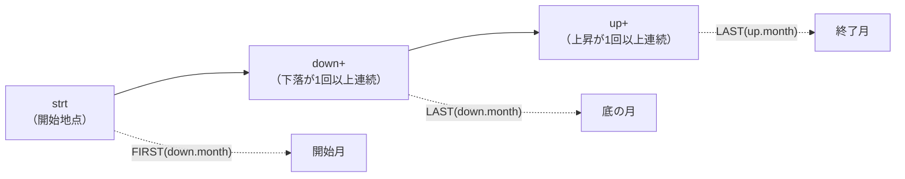

`PATTERN (strt down+ up+)`では、探したい「V字」の形を記号で定義しています。`strt`はパターンの開始地点、`down+`は`down`という条件を満たす行が1回以上連続すること、`up+`はその後に`up`という条件を満たす行が1回以上連続すること、という意味です。

```sql
DEFINE 
    down AS revenue < PREV(revenue),
    up   AS revenue > PREV(revenue)
```
`PREV(revenue)`は一つ前の行の売上と比較しており、前の行より下がれば`down`、上がれば`up`と判定されます。

パターン全体の中から特定の瞬間を抜き出すために`FIRST`や`LAST`関数を使います。`FIRST(down.month)`は下がり始めた最初の月（開始月）、`LAST(down.month)`は下がりきった最後の月（底）、`LAST(up.month)`は上がりきった最後の月（終了月）です。

```sql
AFTER MATCH SKIP TO LAST up
```
一つのV字回復を見つけた後、「次、どこから探し始めるか」を指定しています。これがないと、大きなV字の中に含まれる小さな波を重複して拾ってしまうことがありますが、`LAST up`（上がりきったところ）まで飛ばすことで、一つの大きな回復トレンドとして抽出できます。

`LAG`関数などでも「前月比」は出せますが、「いつまで下がり続け、いつから上がり始めたか」という「状態の遷移」を管理するには、フラグ立てや複雑な結合が必要になります。`MATCH_RECOGNIZE`は状態（State）を内部で保持しながらスキャンするため、比較的高速で読みやすいコードになります。

| 分野 | 検出したいパターン |
| :--- | :--- |
| 金融・株価分析 | ダブルボトム、ゴールデンクロス |
| 製造・IoT | 急激な電圧降下の後、不安定な挙動が続く故障予兆 |
| 不正検知 | 深夜の少額引き出し3回連続の直後に多額送金 |

この「行パターン一致」は、売上分析以外にも幅広い分野で活用できます。「ダブルボトム」や「ゴールデンクロス」といったテクニカル指標を検出する金融・株価分析、センサーデータの「急激な電圧降下」の後に「一定時間不安定な挙動」が続くといった故障予兆を検知する製造・IoT分野、「深夜に少額の引き出しが3回連続」した直後に「多額の送金」が行われるといった犯罪パターンを特定する不正検知など、応用範囲は広いです。

`MATCH_RECOGNIZE`は、SQLを「データの抽出」から「イベントの解析」へと拡張する機能です。構文は独特ですが、一度`PATTERN`と`DEFINE`の関係に慣れてしまえば、時系列データの分析で頼りになるツールになります。今回の「V字」を少し応用して、売上が一定期間「横ばい（FLAT）」になった後に急上昇するパターンなども、この構文を少し変えるだけで作れます。

----
<br>

# 【完全版】問題16-7：W字型（ダブルボトム）パターンの検出
### 難易度：★★★★☆ (Lv.4)
## 問題
マーケティング部門から、「一時的なリバウンド（だまし）に終わらず、二度の底を打って力強く回復した製品の売上推移を特定したい」との依頼がありました。
いわゆる「ダブルボトム（W字型）」は、市場の底堅い需要を確認できた重要なサインとみなされます。
SHスキーマの売上データから、この「W字」の波形を描いている期間を抽出してください。
`SALES` テーブルおよび `PRODUCTS` テーブルを使用し、**製品ID：13** について、月ごとの売上合計が以下のパターンを描いている期間を特定してください。

* **パターン定義**:
  1. 減少（`DOWN`）が1回以上
  2. その後に上昇（`UP`）が1回以上（これが「だまし」の回復）
  3. 再び減少（`DOWN`）が1回以上
  4. 最後に上昇（`UP`）が1回以上（これが「真の回復」）
* **期待する出力**:
  * パターンの「開始月」、「1度目の底の月」、「2度目の底の月」、「終了月」。
  * レコードは開始月の昇順でソートしてください。

## 期待する結果
| START_MONTH | BOTTOM_1 | BOTTOM_2 | END_MONTH |
| ----------- | -------- | -------- | --------- |
| 2019-02 | 2019-04 | 2019-06 | 2019-07 |
| 2019-08 | 2019-10 | 2020-04 | 2020-05 |
| 2020-06 | 2020-06 | 2020-09 | 2020-10 |
| 2020-12 | 2020-12 | 2021-03 | 2021-04 |
| 2021-05 | 2021-06 | 2021-09 | 2021-10 |
| 2021-11 | 2021-11 | 2022-01 | 2022-02 |
| 2022-03 | 2022-03 | 2022-05 | 2022-07 |
| 2022-08 | 2022-08 | 2022-11 | 2022-12 |

## 解答例
```sql
WITH monthly_sales AS (
    SELECT 
        TO_CHAR(s.time_id, 'YYYY-MM') AS month,
        SUM(s.amount_sold) AS revenue
    FROM sh.sales s
    WHERE s.prod_id = 13
    GROUP BY TO_CHAR(s.time_id, 'YYYY-MM')
)
SELECT *
FROM monthly_sales
MATCH_RECOGNIZE (
    ORDER BY month
    MEASURES 
        FIRST(d1.month) AS start_month,
        LAST(d1.month)  AS bottom_1,
        LAST(d2.month)  AS bottom_2,
        LAST(u2.month)  AS end_month
    ONE ROW PER MATCH
    AFTER MATCH SKIP TO LAST u2
    -- W字パターンの定義： 下落1 -> 上昇1 -> 下落2 -> 上昇2
    PATTERN (strt d1+ u1+ d2+ u2+)
    DEFINE 
        d1 AS revenue < PREV(revenue),
        u1 AS revenue > PREV(revenue),
        d2 AS revenue < PREV(revenue),
        u2 AS revenue > PREV(revenue)
)
ORDER BY start_month
```

## 解説
前回の「V字型」に続き、今回はさらに複雑な「W字型（ダブルボトム）」の検出です。この構文が書けるようになると、単なる集計にとどまらず、データから起きた出来事を読み解けるようになります。`MATCH_RECOGNIZE`の「連続する状態の変化」をどう定義しているか、掘り下げて見ていきましょう。

このクエリの中心は`PATTERN`句にあります。
```sql
PATTERN (strt d1+ u1+ d2+ u2+)
```

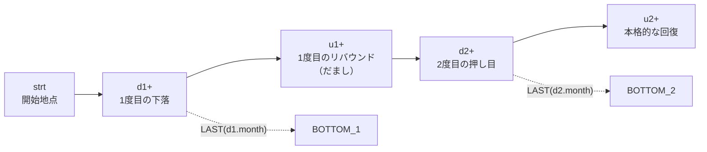

「W」の形を、一筆書きの順序で定義しています。`strt`は開始地点、`d1+`は1度目の下落（Down 1）、`u1+`は1度目のリバウンド（Up 1）、`d2+`は2度目の押し目（Down 2）、`u2+`は本格的な回復（Up 2）です。`+`（1回以上の繰り返し）という量化子を使うことで、「3ヶ月かけて下がり、1ヶ月だけ上がり、また2ヶ月下がる……」といった期間の変動を柔軟に吸収してパターンを特定できます。

```sql
DEFINE 
    d1 AS revenue < PREV(revenue),
    u1 AS revenue > PREV(revenue),
    ...
```
ここでは`d1`も`d2`も「前の行より売上が低い」という同じ条件ですが、あえて名前を分けています。これにより、`MEASURES`句で「1つ目の底（`LAST(d1.month)`）」と「2つ目の底（`LAST(d2.month)`）」を区別して抽出できます。

`MEASURES`句は、見つけたパターンの中から「どの瞬間の値をレポートに載せるか」を決める役割です。`FIRST(d1.month)`は下落が始まった瞬間（パターンの入り口）、`LAST(d1.month)`は1つ目の下落が終わった瞬間（1つ目の底）、`LAST(d2.month)`は2つ目の下落が終わった瞬間（2つ目の底）を取得しています。

```sql
AFTER MATCH SKIP TO LAST u2
```
W字のような複雑なパターンでは、「大きなW字の中に小さなV字」が隠れていることがあります。`SKIP TO LAST u2`と指定することで、「完全にW字が完成した（`u2`が終わった）ところまでスキップして、次を探す」という挙動になります。これにより、データの二重計上を防ぎ、最も大きなトレンドだけを拾い出すことができます。

「ダブルボトム」は投資の世界でも「底入れのサイン」として知られていますが、ビジネス分析でも応用できます。キャンペーンで一時的に売上が戻った（`u1`）が、終了後にまた落ち込み（`d2`）、その後口コミで再燃（`u2`）した、といった長期的な定着プロセスの可視化や、サーバーのレスポンス遅延が一度回復したように見えて再発し、最終的にパッチ適用で安定したという一連の障害パターンの特定などです。

`MATCH_RECOGNIZE`は一見難解ですが、「探したい波形をアルファベットで定義し、そのアルファベットの動きを`DEFINE`で決める」というパズルだと考えると、扱いやすくなると思います。

----
<br>

# 【完全版】問題16-8：給与の停滞（プラトー）期間の特定
### 難易度：★★★★☆ (Lv.4)
## 問題
人事部門から、「部門内において、採用順に見たときに初任給が前任者と全く同じ額で据え置かれている期間（プラトー）を特定したい」との依頼がありました。
同一の給与で複数名が連続して採用されている期間を抽出することで、当時の給与規定の硬直性や、採用市場の安定度を分析する材料とします。
HRスキーマの`employees` テーブルを使用し、部門（`department_id`）ごとに採用日（`hire_date`）の昇順でデータを見たとき、**「給与（`salary`）が直前に採用された従業員と同一である状態」が1回以上続いた期間**を特定してください。
出力には以下の情報を含めてください：
1. 部門ID
2. その停滞期間の開始採用日（1人目の採用日）
3. その停滞期間の終了採用日（最後の人の採用日）
4. その期間に採用された人数（据え置きが始まった1人目を含む）
5. その期間の給与額
なお、結果は `department_id` の昇順、次いで `start_date` の昇順でソートしてください。

## 期待する結果
| DEPARTMENT_ID | START_DATE | END_DATE | PLATEAU_COUNT | SALARY |
| ------------- | -------------------- | -------------------- | ------------- | ------ |
| 50 | 2016-07-11T00:00:00Z | 2016-08-26T00:00:00Z | 2 | 2900 |
| 50 | 2018-02-06T00:00:00Z | 2018-03-08T00:00:00Z | 2 | 2200 |

## 解答例
```sql
SELECT
    department_id,
    start_date,
    end_date,
    plateau_count,
    salary
FROM hr.employees
    MATCH_RECOGNIZE (
        PARTITION BY department_id
        ORDER BY hire_date
        MEASURES
            FIRST(hire_date) AS start_date,
            LAST(hire_date)  AS end_date,
            COUNT(*)         AS plateau_count,
            FIRST(salary)    AS salary
        ONE ROW PER MATCH
        AFTER MATCH SKIP TO LAST same
        -- パターン：最初の1行(STRT)の後に、同じ給与の行(SAME)が1回以上続く
        PATTERN (strt same+)
        DEFINE
            same AS salary = PREV(salary)
    )
ORDER BY department_id, start_date
```

## 解説
今回は`MATCH_RECOGNIZE`を使った「連続する同一値（停滞）の検出」です。前回の「V字」「W字」は「増減の変化」を捉えるものでしたが、今回は「変化しないこと」を捉えるパターンです。実務では「株価の横ばい」や「センサーデータの固着」などの異常検知にも使われる汎用性の高いテクニックです。

| これまでの問題 | 検出する変化 |
| :--- | :--- |
| 16-3, 16-4（連続上昇） | 増加し続ける状態 |
| 16-6, 16-7（V字・W字） | 増減を繰り返す状態 |
| 16-8（今回：プラトー） | 変化しない（横ばい）状態 |

このクエリは、各部門のタイムラインをスキャンし、給与が動かなくなった区間を「一つのイベント」として抽出しています。`PATTERN (strt same+)`の`strt`は停滞が始まる「起点」となる1行目で、条件（DEFINE）がないためどんな行でも起点になり得ます。`same+`は起点（または直前の行）と同じ給与を持つ行が1回以上続くことを意味し、2人以上のグループにならないと「停滞」とは呼べないため量化子`+`（1回以上）を使っています。

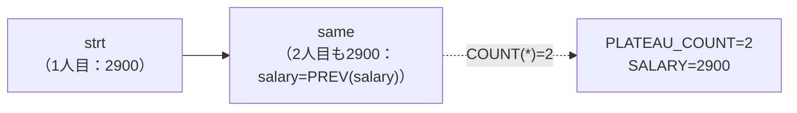

```sql
DEFINE same AS salary = PREV(salary)
```
`PREV(salary)`は「自分自身の1行前」の値を参照します。これにより、「前の人と給与が同じである」という状態が続いている間、ひとまとめのグループ（`same`）としてカウントされ続けます。

`ONE ROW PER MATCH`（一致したパターンを1行にまとめる）を指定しているため、`MEASURES`句でその期間の統計情報を定義します。`FIRST(hire_date)`はパターン全体の最初の行（`strt`）の日付、`LAST(hire_date)`はパターン全体の最後の行（最後の`same`）の日付、`COUNT(*)`は`strt`とすべての`same`を合わせた合計人数です。

```sql
AFTER MATCH SKIP TO LAST same
```
「一つの停滞期間を見つけたら、その期間の最後の人まで読み飛ばして、次の探索を始める」という指示です。これがないと、2人目、3人目をそれぞれ「起点」とした重複した結果が出てしまうため、期間を特定する問題では欠かせない設定です。

`PARTITION BY department_id`は部門が変わったら給与が同じでも「別のイベント」として扱う指定、`ORDER BY hire_date`は採用順という「時間の軸」を確定させる指定です。これらはWindow関数（分析関数）と同じ役割を果たしています。

| 業務分野 | 検出したい「停滞」 |
| :--- | :--- |
| 在庫管理 | 1週間以上、在庫数が1個も変動していない商品（死蔵在庫） |
| システム監視 | CPU使用率が10分間、同じ数値で張り付いている（フリーズ検知） |
| 不正検知 | 同一IPアドレスから1秒以内に連続アクセス |

このパターンマッチングは、「在庫数が1週間以上、1個も変動していない商品」を特定する在庫管理（死蔵在庫の検出）、「CPU使用率が10分間、全く同じ数値で張り付いている」状態を特定するシステム監視（プロセスのフリーズ検知）、「同一のIPアドレスから、1秒以内に連続してアクセスが来ている」パターンを抽出する不正検知など、幅広いビジネス要件で使われます。今回は`salary = PREV(salary)`と完全一致を見ましたが、実務では`ABS(salary - PREV(salary)) < 100`のように記述することで「ほぼ横ばい（誤差の範囲）」という柔軟な停滞パターンを定義することも可能です。

「起点（`strt`）を決め、その後の行が条件（`PREV`との比較）を満たし続ける間を一つの塊にする」というのが、`MATCH_RECOGNIZE`による期間抽出の基本形です。この構文をマスターすれば、複雑な自己結合や分析関数の組み合わせに頼らず、「どんな形を探したいか」を宣言的に記述できるようになります。

----
<br>

# 【完全版】問題16-9：移動平均を超え続ける「確変」期間の抽出
### 難易度：★★★★☆ (Lv.4)
## 問題
経営層から「単なる一過性の売上増ではなく、過去のトレンド（直近3ヶ月の平均）を継続的に上回り続けている、真の『好調期間（確変モード）』を特定してほしい」との高度な分析依頼がありました。
移動平均を基準とすることで、季節変動や一時的なスパイクに惑わされない、真に勢いのある期間を炙り出します。
SHスキーマの`sales` テーブルのデータを使用し、月ごとの合計売上高を算出してください。その結果に対して `MATCH_RECOGNIZE` 句を適用し、以下の条件を満たす期間を抽出してください。
1. **好調行（`HIGH_PERF`）の定義**:
その月の売上が、**「直近3ヶ月の売上平均」を上回っている**こと。
平均は「1ヶ月前・2ヶ月前・3ヶ月前の売上の合計を3で割った値」として算出する。
2. **パターンの定義**:
「好調行」が **3ヶ月以上連続** している期間を特定する。
3. **出力項目**:
   * 好調期間の開始月（`START_MONTH`）
   * 好調期間の終了月（`END_MONTH`）
   * その期間内の最大月間売上（`MAX_REV`）
   * その期間の継続月数（`DURATION`）
    
なお、集計対象は全製品の合計とし、結果は `START_MONTH` の昇順でソートしてください。

## 期待する結果
| START_MONTH | END_MONTH | MAX_REV | DURATION |
| ----------- | --------- | ---------- | -------- |
| 2019-06 | 2019-10 | 2236464.53 | 5 |
| 2020-07 | 2020-09 | 2030917.97 | 3 |
| 2020-12 | 2021-02 | 2118618.97 | 3 |
| 2021-07 | 2021-10 | 2164612.21 | 4 |
| 2022-01 | 2022-04 | 2379957.23 | 4 |
| 2022-06 | 2022-12 | 2547042.11 | 7 |

## 解答例
```sql
WITH monthly_sales AS (
    -- 月ごとの売上合計を算出
    SELECT 
        TO_CHAR(time_id, 'YYYY-MM') AS month,
        SUM(amount_sold) AS revenue
    FROM sh.sales
    GROUP BY TO_CHAR(time_id, 'YYYY-MM')
)
SELECT *
FROM monthly_sales
MATCH_RECOGNIZE (
    ORDER BY month
    MEASURES 
        FIRST(high.month)   AS start_month,
        LAST(high.month)    AS end_month,
        MAX(high.revenue)   AS max_rev,
        COUNT(high.month)   AS duration
    ONE ROW PER MATCH
    AFTER MATCH SKIP TO LAST high
    -- パターン：HIGH_PERFが3回以上連続
    PATTERN (high{3,})
    DEFINE 
        -- 直近3ヶ月の売上平均をPREV関数で計算し、それと比較する
        high AS revenue > (
            PREV(revenue, 1) + 
            PREV(revenue, 2) + 
            PREV(revenue, 3)
        ) / 3
)
ORDER BY start_month
```

## 解説
単に「先月より高い」ではなく、「過去3ヶ月のトレンドを上回り続けている」という動的な基準値をSQLだけで処理する、応用度の高い解法です。

このクエリの見どころは、「基準値が毎月変化する」中で、その壁を越え続けている区間を特定している点にあります。`PATTERN (high{3,})`は、条件を満たす行`high`が「3回以上（`{3,}`）連続する」ことを定義しています。

| 量化子 | 意味 |
| :--- | :--- |
| `{3}` | ちょうど3回 |
| `{3,5}` | 3〜5回 |
| `{3,}`（今回） | 3回以上ならいくらでも |

`{3}`なら「ちょうど3回」、`{3,5}`なら「3〜5回」、`{3,}`なら「3回以上ならいくらでも」という意味になり、長期的なトレンドを漏らさず捉えられます。

```sql
DEFINE high AS revenue > (
    PREV(revenue, 1) + PREV(revenue, 2) + PREV(revenue, 3)
) / 3
```

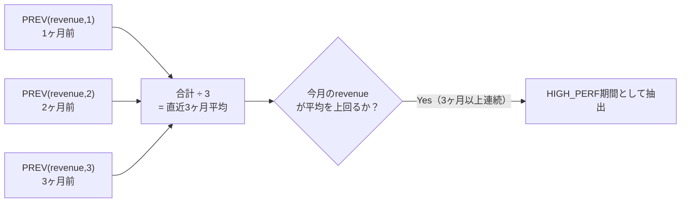

ここが最もテクニカルな部分です。通常、移動平均を出すには`AVG(...) OVER(...)`を使いますが、`MATCH_RECOGNIZE`内では`PREV`関数を使って直接過去の値を指定できます。`PREV(revenue, 1)`は1ヶ月前の売上、`PREV(revenue, 2)`は2ヶ月前の売上、`PREV(revenue, 3)`は3ヶ月前の売上です。これらを足して3で割ることで、Window関数を使わずにその場での「基準値」を作り出しています。

`MATCH_RECOGNIZE`は強力ですが、複雑な集計（`SUM`や`GROUP BY`）を同時に行うことはできません。そのため、解答例のように`WITH`句で「1月1行」の整理されたデータを作ってからパターンマッチをかけるのが、実務でのよくあるワークフローです。

```sql
MEASURES 
    MAX(high.revenue) AS max_rev,
    COUNT(high.month) AS duration
```
`MATCH_RECOGNIZE`内の`MEASURES`では、そのパターンに一致した区間だけを対象とした集計が可能です。これにより、「好調期間の中で、一番売れたのはいくらか」「結局、何ヶ月続いたのか」というサマリーを、サブクエリなしで一行に集約できます。

このロジックで注意が必要なのは、データの最初の3ヶ月間です。1ヶ月目のデータには「3ヶ月前」が存在しないため、`PREV`はNULLを返します。その結果、条件式全体がNULLとなり、最初の3ヶ月間は`high`と判定されません。実務では、この「ウォームアップ期間」を考慮して分析対象期間を設定する必要があります。

| 応用分野 | 検出できること |
| :--- | :--- |
| 広告効果の持続性分析 | キャンペーン終了後もトレンドを上回り続ける＝ブランドの底上げ成功 |
| 異常なバズの検知 | SNSで急激に注目され通常ではありえない成長が続く商品の早期発見 |
| 退職予兆の検知 | 給与・残業時間が過去の個人平均から一定期間外れ続けるパターン |

今回の「確変期間」の抽出は、マーケティング分析への応用も考えられます。キャンペーン終了後もトレンドを上回り続けている場合は一過性ではなく「ブランドの底上げ」に成功したと判断できる広告効果の持続性分析、SNS等で急激に注目を集め通常ではありえない期間成長し続けている商品を早期発見し在庫補充の判断に繋げる異常なバズの検知、給与や残業時間が「過去の個人平均」を一定期間外れ続けているパターンを検出しケアが必要なメンバーを特定する退職予兆の検知など、幅広い場面で使えるアイデアだと思います。