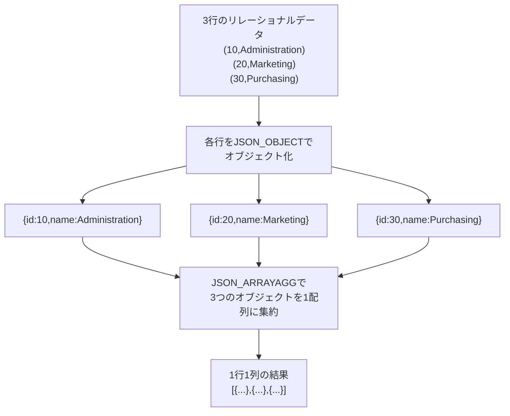
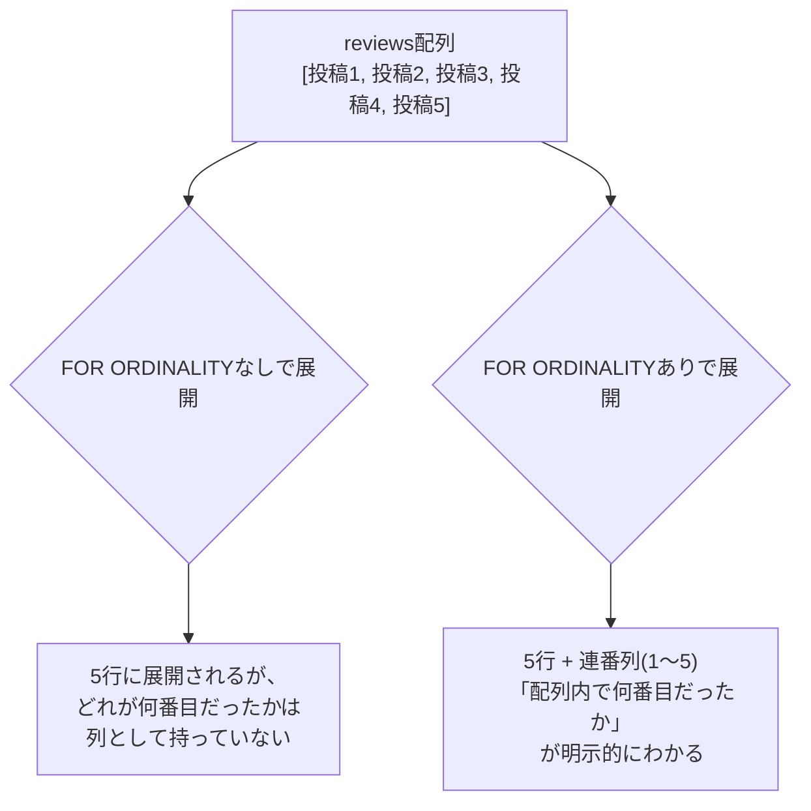

# 【完全版】問題17-9：JSON_ARRAYAGGとJSON_OBJECTのネストによる単一JSON配列の生成
### 難易度：★★★★☆ (Lv.4)
## 問題
HRスキーマの`DEPARTMENTS`テーブルのうち、`DEPARTMENT_ID`が10〜30の3部門を対象に、以下の構造を持つ**1つのJSON配列**を、SQLの実行結果として**1行1列**で生成してください（`GROUP BY`は使用しないでください）。

**【JSONの構造】**
* 配列の各要素は、以下のキーを持つオブジェクト
  * `id`: `department_id`
  * `name`: `department_name`

## 期待する結果
| DEPT_ARRAY_JSON                                                                                | 
| ---------------------------------------------------------------------------------------------- | 
| [{"id":10,"name":"Administration"},{"id":20,"name":"Marketing"},{"id":30,"name":"Purchasing"}] | 

## 解答例
```sql:失敗例：JSON_OBJECTAGGで代用しようとする
SELECT
    JSON_OBJECTAGG(department_id VALUE department_name) AS DEPT_ARRAY_JSON
FROM
    hr.departments
WHERE
    department_id BETWEEN 10 AND 30;
-- 結果：{"10":"Administration","20":"Marketing","30":"Purchasing"}
-- オブジェクト形式にはなるが、要求されている
-- [{"id":..,"name":..}, ...] という「配列の中にオブジェクトが並ぶ」構造にはならない
```

```sql:正解例：JSON_ARRAYAGGの中にJSON_OBJECTをネスト
SELECT
    JSON_ARRAYAGG(
        JSON_OBJECT(
            'id'   VALUE department_id,
            'name' VALUE department_name
        )
        ORDER BY department_id
    ) AS DEPT_ARRAY_JSON
FROM
    hr.departments
WHERE
    department_id BETWEEN 10 AND 30;
```

## 解説
今回は、17-3で学んだ「複数行を1つのJSONにまとめる」というテーマの、実務でより頻出する形を扱います。17-3では部門ごとに1行のJSON（`{"dept_name":...,"staff_list":[...]}`）を生成しましたが、Web APIのレスポンスとして返す場合、「複数件のデータをまとめて1つの配列」にしたいケースの方が圧倒的に多くあります。



失敗例では`JSON_OBJECTAGG`（17-6）を使い、`department_id`をキー、`department_name`を値にしていますが、これでは`{"10":"Administration", ...}`という「キーと値のペアの集まり（オブジェクト）」になってしまい、要求されている「オブジェクトが並んだ配列」という構造とは根本的に異なります。JSONにおいて`{}`（オブジェクト）と`[]`（配列）は明確に別のデータ構造であり、`JSON_OBJECTAGG`をいくら工夫しても配列は作れません。

正解例のポイントは、**集計関数（`JSON_ARRAYAGG`）の引数に、行単位の関数（`JSON_OBJECT`）をそのままネストさせている**点です。

```sql
JSON_ARRAYAGG(
    JSON_OBJECT( 'キー1' VALUE 列1, 'キー2' VALUE 列2, ... )
    ORDER BY ...
)
```

この処理の流れを整理すると、まず`JSON_OBJECT`が「1行ごと」に呼び出され、各行を`{"id":10,"name":"Administration"}`のような1つのオブジェクトに変換します。次に、その行単位で生成されたオブジェクトたちを、集計関数である`JSON_ARRAYAGG`が「複数行にまたがって」1つの配列にまとめ上げます。`JSON_OBJECT`が「横方向（1行の中の複数列）」の変換を担当し、`JSON_ARRAYAGG`が「縦方向（複数行）」の集約を担当する、という役割分担を意識すると理解しやすいと思います。

この問題文で「`GROUP BY`は使用しないでください」と指定している点にも注目してください。17-3では`GROUP BY d.department_id, d.department_name`を使って「部門ごとに1行」を作っていましたが、今回はグルーピングをせず、**対象範囲の全行を1つの結果（1行1列）にまとめている**点が異なります。`JSON_ARRAYAGG`は通常の集計関数（`SUM`や`COUNT`など）と同じ仕組みで動作するため、`GROUP BY`を書かなければ「`WHERE`句で絞り込んだ範囲全体」を1つのグループとして扱い、結果は必ず1行になります。

| 観点 | 17-3（部門ごとに1行） | 今回（全体で1行） |
| :--- | :--- | :--- |
| `GROUP BY`の有無 | あり（`department_id`など） | なし |
| 結果の行数 | 部門の件数分 | 常に1行 |
| ネスト構造 | 親（部門）1つに対し、子（従業員）の配列 | 全体で1つの配列。配列の要素が各部門のオブジェクト |
| 主な用途 | 部門明細を含んだレポート等 | API全体のレスポンスボディ全体の生成 |

`ORDER BY department_id`を`JSON_ARRAYAGG`の中に指定している点も忘れずに確認してください。これは17-3でも触れた通り、配列内の要素の並び順を制御するためのものです。集計関数である以上、`ORDER BY`を指定しない場合の行の順序はOracleの内部処理に依存し保証されないため、配列の並び順に意味を持たせたい場合は明示的に指定する必要があります。

:::message
### 実務では「配列そのもの」がAPIのレスポンスボディになる
今回生成した`[{"id":10,"name":"Administration"}, ...]`という形式は、多くのWeb APIやフロントエンドのライブラリ（JavaScriptの`fetch`が受け取るレスポンスボディなど）がそのまま扱える、標準的な「リスト形式のJSON」です。SQLの実行結果を1行1列のJSON配列として返せるということは、アプリケーション側でSQLの結果セット（複数行）をJSON配列へ変換するロジックを別途実装する必要がなくなることを意味します。大量データを扱う場合は、この変換処理をアプリケーション層で行うかデータベース層で行うかによって、ネットワーク転送量やアプリケーションサーバーの負荷が変わってくるため、システム全体の設計とあわせて判断するとよいでしょう。
:::

なお、17-3のように「部門ごとに従業員一覧を持たせつつ、全体を1つの配列にまとめる」という、今回と17-3を組み合わせた3階層構造（配列の中にオブジェクト、そのオブジェクトの中にさらに配列）を作ることも可能です。
```sql
SELECT
    JSON_ARRAYAGG(
        JSON_OBJECT(
            'dept_name'  VALUE d.department_name,
            'staff_list' VALUE (
                SELECT JSON_ARRAYAGG(e.last_name ORDER BY e.last_name)
                FROM hr.employees e
                WHERE e.department_id = d.department_id
            )
        )
        ORDER BY d.department_name
    )
FROM
    hr.departments d
WHERE
    d.department_id BETWEEN 10 AND 30;
```

---
<br><br>

# 【完全版】問題17-10：JSON_TABLEのFOR ORDINALITYによる配列内位置（連番）の取得
### 難易度：★★★☆☆ (Lv.3)
## 問題
以下の`WITH`句で用意した商品データを使用してください。各商品の`reviews`配列を、**配列内の登場順序（投稿順）を保持したまま**展開し、各商品につき **最初の2件のレビューのみ** を抽出してください。

結果には、そのレビューが商品内で何番目に投稿されたものかを示す`REVIEW_SEQ`列（1から始まる連番）を含めてください。

```sql:検証用データ（WITH句）
WITH products AS (
    SELECT 601 AS product_id,
        '{"brand":"NORDLINE", "reviews":[
            {"rating":3, "review":"最初の投稿。サイズがやや大きい。"},
            {"rating":8, "review":"2件目。満足度は高い。"},
            {"rating":5, "review":"3件目。可もなく不可もなく。"},
            {"rating":9, "review":"4件目。とても良い。"},
            {"rating":2, "review":"5件目。期待外れだった。"}
        ]}' AS product_details
    FROM dual
    UNION ALL
    SELECT 602,
        '{"brand":"CASCARA", "reviews":[
            {"rating":6, "review":"最初の投稿。普通に良い。"},
            {"rating":10, "review":"2件目。文句なしの満点。"},
            {"rating":4, "review":"3件目。少し値段が高い。"}
        ]}' AS product_details
    FROM dual
)
-- ここから先を作成してください
```

## 期待する結果
| PRODUCT_ID | REVIEW_SEQ | RATING | REVIEW                        |
| ---------- | ---------- | ------ | ------------------------------ |
| 601        | 1          | 3      | 最初の投稿。サイズがやや大きい。 |
| 601        | 2          | 8      | 2件目。満足度は高い。           |
| 602        | 1          | 6      | 最初の投稿。普通に良い。         |
| 602        | 2          | 10     | 2件目。文句なしの満点。          |

## 解答例
```sql:失敗例：ORDER BY NULLで代用しようとする（順序が保証されない）
WITH products AS (
    SELECT 601 AS product_id,
        '{"brand":"NORDLINE", "reviews":[
            {"rating":3, "review":"最初の投稿。サイズがやや大きい。"},
            {"rating":8, "review":"2件目。満足度は高い。"},
            {"rating":5, "review":"3件目。可もなく不可もなく。"},
            {"rating":9, "review":"4件目。とても良い。"},
            {"rating":2, "review":"5件目。期待外れだった。"}
        ]}' AS product_details
    FROM dual
    UNION ALL
    SELECT 602,
        '{"brand":"CASCARA", "reviews":[
            {"rating":6, "review":"最初の投稿。普通に良い。"},
            {"rating":10, "review":"2件目。文句なしの満点。"},
            {"rating":4, "review":"3件目。少し値段が高い。"}
        ]}' AS product_details
    FROM dual
)
SELECT
    product_id,
    review_seq,
    rating,
    review
FROM (
    SELECT
        p.product_id,
        ROW_NUMBER() OVER (PARTITION BY p.product_id ORDER BY NULL) AS review_seq,
        jt.rating,
        jt.review
    FROM
        products p,
        JSON_TABLE( p.product_details, '$.reviews[*]'
            COLUMNS (
                rating NUMBER(2)    PATH '$.rating',
                review VARCHAR2(200) PATH '$.review'
            )
        ) jt
)
WHERE
    review_seq <= 2;
-- 一見、期待通りの結果になることが多いが、"配列の登場順"であることをOracleは保証していない
-- ORDER BY NULLは「並び替えの基準がない」ことを明示しているに過ぎず、
-- 内部的な実行計画の変化によって行の出現順が変わる可能性がある
```

```sql:正解例：FOR ORDINALITYを使用
WITH products AS (
    SELECT 601 AS product_id,
        '{"brand":"NORDLINE", "reviews":[
            {"rating":3, "review":"最初の投稿。サイズがやや大きい。"},
            {"rating":8, "review":"2件目。満足度は高い。"},
            {"rating":5, "review":"3件目。可もなく不可もなく。"},
            {"rating":9, "review":"4件目。とても良い。"},
            {"rating":2, "review":"5件目。期待外れだった。"}
        ]}' AS product_details
    FROM dual
    UNION ALL
    SELECT 602,
        '{"brand":"CASCARA", "reviews":[
            {"rating":6, "review":"最初の投稿。普通に良い。"},
            {"rating":10, "review":"2件目。文句なしの満点。"},
            {"rating":4, "review":"3件目。少し値段が高い。"}
        ]}' AS product_details
    FROM dual
)
SELECT
    p.product_id,
    jt.review_seq,
    jt.rating,
    jt.review
FROM
    products p,
    JSON_TABLE( p.product_details, '$.reviews[*]'
        COLUMNS (
            review_seq FOR ORDINALITY,
            rating     NUMBER(2)     PATH '$.rating',
            review     VARCHAR2(200) PATH '$.review'
        )
    ) jt
WHERE
    jt.review_seq <= 2
ORDER BY
    p.product_id, jt.review_seq;
```

## 解説
今回は、17-2・17-7で学んだ配列の行展開に、「その要素が配列の何番目だったか」という位置情報を付加するテクニックです。これまでの問題では配列の中身（`rating`や`review`）を取り出すことに焦点を当ててきましたが、「投稿順」や「登場順」そのものが意味を持つデータ（レビュー、ログ、時系列データなど）では、位置情報自体が重要な分析対象になります。



失敗例では、`JSON_TABLE`で展開した後に、12章で学んだ`ROW_NUMBER() OVER (PARTITION BY product_id ORDER BY NULL)`を使って連番を付与しようとしています。`ORDER BY`に並び替えの基準となる列がないため、苦肮の策として`ORDER BY NULL`を指定していますが、これは「並び替えの基準を指定しない」という意味であり、**行が返される順序そのものを保証するものではありません**。多くの環境で試すと、配列の登場順と一致した結果が返ることが多いため、テスト時には正しく見えてしまいます。しかし、これはOracleの内部的な実行計画やデータ量、バージョンによって変化しうる「たまたま一致しているだけ」の挙動であり、正式に保証された順序ではない点に注意が必要です。将来的な実行計画の変化やOracleのバージョンアップによって、静かに（エラーも出さずに）結果の順序がずれてしまう可能性がある、典型的な「動いているように見えて実は正しくない」実装です。

正解例で使う`FOR ORDINALITY`は、`JSON_TABLE`の`COLUMNS`句の中で使える特別な列定義です。

```sql
COLUMNS (
    列名 FOR ORDINALITY,
    ...
)
```

これを指定すると、`PATH`句を書く必要もなく、Oracleが自動的に「その行が配列の何番目の要素から生成されたか」を1から始まる整数として払い出してくれます。この連番は、Oracleが配列を解釈する際の登場順そのものに基づいて機械的に採番されるものであり、`ROW_NUMBER()`のように別途「並び替えの基準」を用意する必要がありません。JSONの配列は本来、要素の並び順そのものに意味を持つデータ構造（JSON仕様上、配列の順序は保持されるべきものと定義されています）であるため、`FOR ORDINALITY`はその「配列が本来持っている順序」を、Oracleの保証付きでSQLの世界に取り込むための機能だと言えます。

失敗例と正解例の違いを整理すると、以下のようになります。

| 観点 | 失敗例（`ROW_NUMBER() ... ORDER BY NULL`） | 正解例（`FOR ORDINALITY`） |
| :--- | :--- | :--- |
| 連番の基準 | 明示的な基準なし（`NULL`） | 配列内の登場順（JSONの構造そのもの） |
| 順序の保証 | 保証されない（環境依存の挙動） | Oracleの機能として保証される |
| 記述の複雑さ | 追加の分析関数とサブクエリが必要 | `JSON_TABLE`の列定義に1行追加するだけ |

`FOR ORDINALITY`で得られる連番は、そのまま`WHERE`句で「最初のN件だけ欲しい」という絞り込みにも使えます。正解例では`WHERE jt.review_seq <= 2`とすることで、各商品の最初の2件のレビューだけを抽出しています。これは17-1で扱った`$.reviews[0]`のような固定インデックス指定（1件だけ取得）を、「N件」という柔軟な範囲に拡張したものだと捉えることができます。

:::message
### FOR ORDINALITYは1始まり、JSONパスの配列インデックスは0始まり
17-1・17-2で使った`$.reviews[0]`のようなJSONパスの配列インデックスは、多くのプログラミング言語と同様に**0から**数えます。一方、今回の`FOR ORDINALITY`が生成する連番は**1から**始まります。同じ「配列の1番目」を指しているつもりでも、`$.reviews[0]`と`review_seq = 1`が対応するという、基準のズレを意識しておかないと、集計条件を書く際に思わぬ1件のズレ（オフバイワンエラー）が発生しやすいので注意してください。
:::

`FOR ORDINALITY`はネストした`NESTED PATH`の内部でも使用可能です。例えば17-7の2階層ネスト（`items`と`options`）の場合、`items`側と`options`側のそれぞれに`FOR ORDINALITY`列を個別に定義することで、「何番目の商品の、何番目のオプションか」という2軸の位置情報を同時に取得することもできます。実務でログデータやイベントデータの発生順序を扱う際には、この`FOR ORDINALITY`を使って明示的に順序を確保しておくことを習慣にすると、今回の失敗例のような「たまたま動いている」状態を避けられます。

