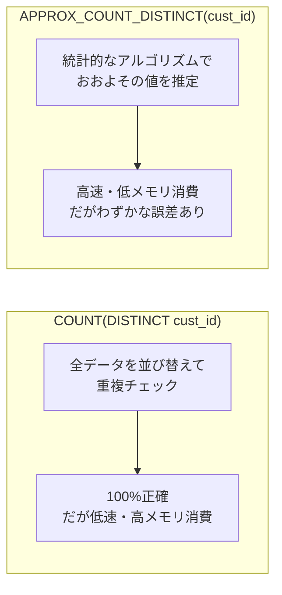
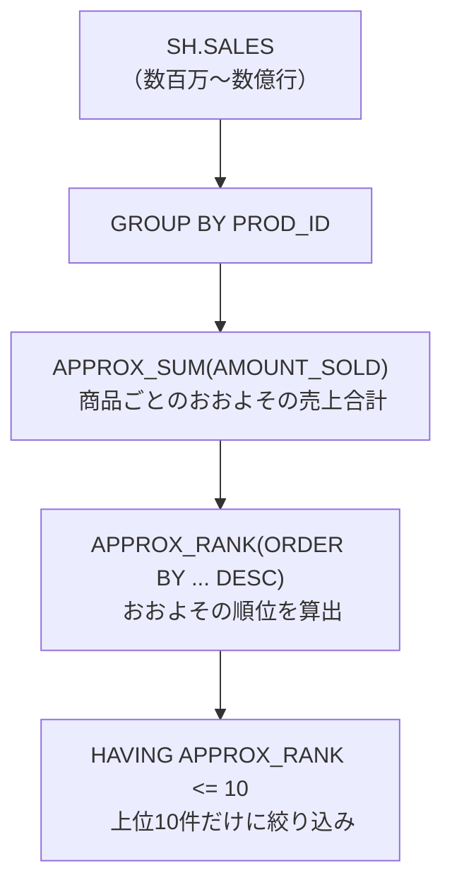

# 問題18-1：おおよその数
### 難易度：★★☆☆☆ (Lv.2)
## 問題
SHスキーマの`SALES`テーブルに存在する、重複を排除した`CUST_ID`のおおよその件数を取得してください。
なお、レコードの表示順序は問いません。

## 期待する結果
| APPROX_CUSTOMER_COUNT |
| ---------------------- |
| 7014 |

※ この値でない可能性あり

## 解答例
```sql
SELECT 
    APPROX_COUNT_DISTINCT(cust_id) AS approx_customer_count
FROM 
    sh.sales;
```
## 解説
今回は、Oracle Databaseの「ビッグデータ処理」に関するテクニック、近似関数についてです。

`APPROX_COUNT_DISTINCT`は、膨大なデータの中から「重複を除いた件数」を高速かつおおよそで算出するための関数です。
```sql
SELECT 
    APPROX_COUNT_DISTINCT([カラム名])
FROM 
    [テーブル名];
```
通常、重複を排除した件数を数えるには`COUNT(DISTINCT cust_id)`を使いますが、数百万〜数億行という巨大なテーブル（今回の`SH.SALES`など）でこれを実行すると、コンピュータは「すべての値を並び替えて重複をチェックする」という重い作業を強いられます。そこで登場するのがこの関数で、厳密な1件単位の正確さを一部犠牲にする代わりに、メモリ消費を抑え高速に結果を返します。



精度としては一般的に97%以上に収まることが多く、「正確な1円単位の決算」には向きませんが、「昨日の利用者はだいたい何万人くらいだったか」という傾向把握やダッシュボード表示には向いています。

実務でどちらを使うべきか迷ったときの判断基準を整理しておきます。

| 関数 | 精度 | 速度・リソース | 向いている場面 |
| :--- | :--- | :--- | :--- |
| `COUNT(DISTINCT ...)` | 100%正確 | データ量に比例して遅くなる、メモリ消費大 | 請求、監査、決算報告など厳密な正確性が必須な場面 |
| `APPROX_COUNT_DISTINCT(...)` | 近似値（わずかな誤差あり） | 非常に高速、リソース消費少 | 統計分析、リアルタイム監視などの傾向把握 |

`COUNT(DISTINCT ...)`は100%正確な値を返しますが、データ量に比例して実行速度が遅くなり、大量のメモリと一時領域を消費します。請求、監査、決算報告のような厳密な正確性が求められる場面に向いています。`APPROX_COUNT_DISTINCT(...)`は近似値（わずかな誤差あり）ですが、非常に高速でリソース消費も少なく、統計分析やリアルタイム監視のような場面に向いています。

今回使用している`SH`（Sales History）スキーマは、Oracleがデータウェアハウス（大量の蓄積データ分析）の練習用に提供しているものです。`SALES`テーブルは特にレコード数が多いため、こうした近似関数を試すのに向いた題材になっています。

なお、Oracleの設定（`APPROX_FOR_COUNT_DISTINCT`パラメータなど）を有効にすると、通常の`COUNT(DISTINCT)`と書いても内部で自動的に近似集計に置き換えて実行してくれる機能もあります。バッチ処理のクエリを一つひとつ書き換えなくても、セッションやシステムレベルの設定を変えるだけで近似集計の恩恵を受けられる、という使い方もできます。

----
<br><br>

# 問題18-2：近似集計によるランキングTOP10
### 難易度：★★★☆☆ (Lv.3)
## 問題
SHスキーマの `SALES` テーブルを利用して、商品（`PROD_ID`）ごとの売上合計とランキングを算出してください。ただし、データ量が膨大であることを想定し、**近似集計関数**を使用して以下の条件で取得してください。

**【条件】**
* **売上合計**: `AMOUNT_SOLD` の近似合計値を算出する。
* **ランキング**: 近似売上合計が高い順にランキングを付ける。
* **絞り込み**: ランキングが10位以内の商品のみを表示する。
* **ソート順**: 最終結果はランキングの数字が大きい順（10位 → 1位の順）に表示する。

## 期待する結果
| PROD_ID | TOTAL_SALES      | RANKING | 
| ------- | ---------------- | ------- | 
| 26      | 2572944.13000028 | 10      | 
| 28      | 3543725.89000017 | 9       | 
| 29      | 3845387.37999992 | 8       | 
| 21      | 5498727.80999995 | 7       | 
| 15      | 5635963.08000012 | 6       | 
| 13      | 6312268.40000004 | 5       | 
| 20      | 6691996.80999934 | 4       | 
| 14      | 7189171.77000039 | 3       | 
| 17      | 8314815.40000011 | 2       | 
| 18      | 15011642.520001  | 1       | 

※ この値でない可能性あり

## 解答例
```sql
SELECT
    PROD_ID,
    APPROX_SUM(AMOUNT_SOLD) AS TOTAL_SALES,
    APPROX_RANK(
        ORDER BY
            APPROX_SUM(AMOUNT_SOLD) DESC
    )                       AS RANKING
FROM
    SH.SALES
GROUP BY
    PROD_ID
HAVING
    APPROX_RANK(
        ORDER BY
            APPROX_SUM(AMOUNT_SOLD) DESC
    ) <= 10
ORDER BY
    RANKING DESC
```

## 解説
この問題は、Oracle Databaseの「近似集計（Approximate Aggregation）」に触れる内容です。数千万、数億といった大量のデータを相手にする際、1円単位の正確さよりも「上位10位をすばやく知りたい」というビジネスニーズに応えるためのテクニックです。

今回のクエリでは、2つの近似関数が使われています。



`APPROX_SUM`は`SUM`関数の近似版で、巨大なデータセットにおいて正確な合計を出すためのメモリ消費を抑え、高速に合計の目安を算出します。結果に`2572944.13000026`のような細かい端数が出ているのは、内部で浮動小数点を用いた近似計算が行われているためです。

`APPROX_RANK`は「〜の中で何位か」という順位を近似的に算出します。
```sql
APPROX_RANK(
    ORDER BY [集計関数] DESC
)
```
通常の`RANK()`関数は一度すべてのデータをソート（並び替え）する必要があるため重い処理になりがちですが、`APPROX_RANK`はソートを最小限に抑えて「上位層」を特定します。

通常、`RANK()`などの分析関数（ウィンドウ関数）の結果で絞り込みたい場合、SQLの実行順序の関係で「インラインビュー（サブクエリ）」を使う必要がありました。
```sql
-- 通常の書き方（重くなりがち）
SELECT * FROM (SELECT ..., RANK() OVER(...) as rnk ...) WHERE rnk <= 10
```

| 書き方 | 構造 | 特徴 |
| :--- | :--- | :--- |
| 通常のRANK() | サブクエリで一度絞り込む | 全データをソートしてから絞り込むため重くなりがち |
| APPROX_RANK() | HAVING句に直接条件を書ける | オプティマイザが「上位だけ出せばいい」と判断し無駄な計算を省ける |

しかし、Oracleの近似関数では`HAVING`句の中に直接ランキング条件を書くことができます。これにより、Oracleのオプティマイザは「上位10個だけをさっと出せばいい」と判断し、無駄な計算を省いた実行計画を立てることができます。

| 関数 | 役割 |
| :--- | :--- |
| `APPROX_SUM` | おおよその合計を出し、メモリ消費を抑えディスクI/Oを減らす |
| `APPROX_RANK` | おおよその順位を出し、巨大なソート処理を回避してTop-N抽出を高速化 |

このクエリが本領を発揮するのは、数億件の販売ログから「今、売れている商品TOP10」を数秒で表示したいECサイトのリアルタイムランキングや、膨大なログの中から異常なアクセス数の上位を即座にリストアップしたい不正検知など、ビッグデータ分析の場面です。`APPROX_SUM`はおおよその合計を出しメモリ消費を抑えディスクI/Oを減らす役割、`APPROX_RANK`はおおよその順位を出し巨大なソート処理を回避してTop-N抽出を高速化する役割、というように、それぞれ違った角度から処理の軽量化に貢献しています。

## 参考リンク
https://www.youtube.com/watch?v=6IfEiv52XBs