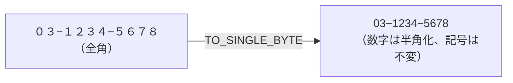
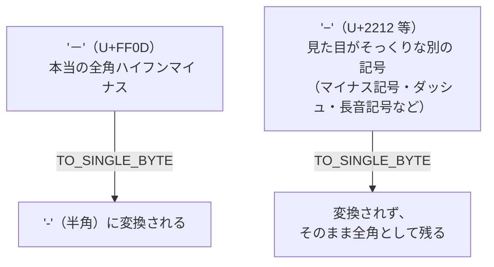
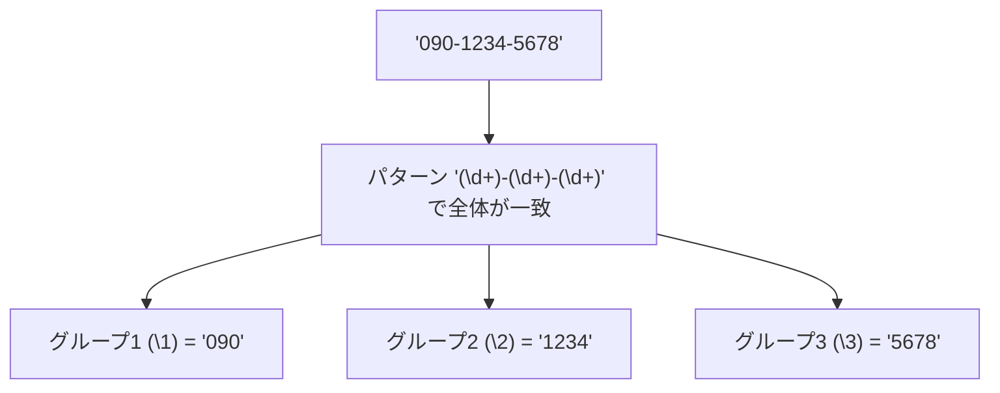
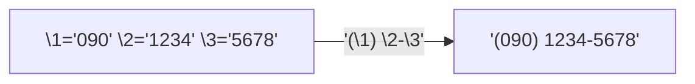
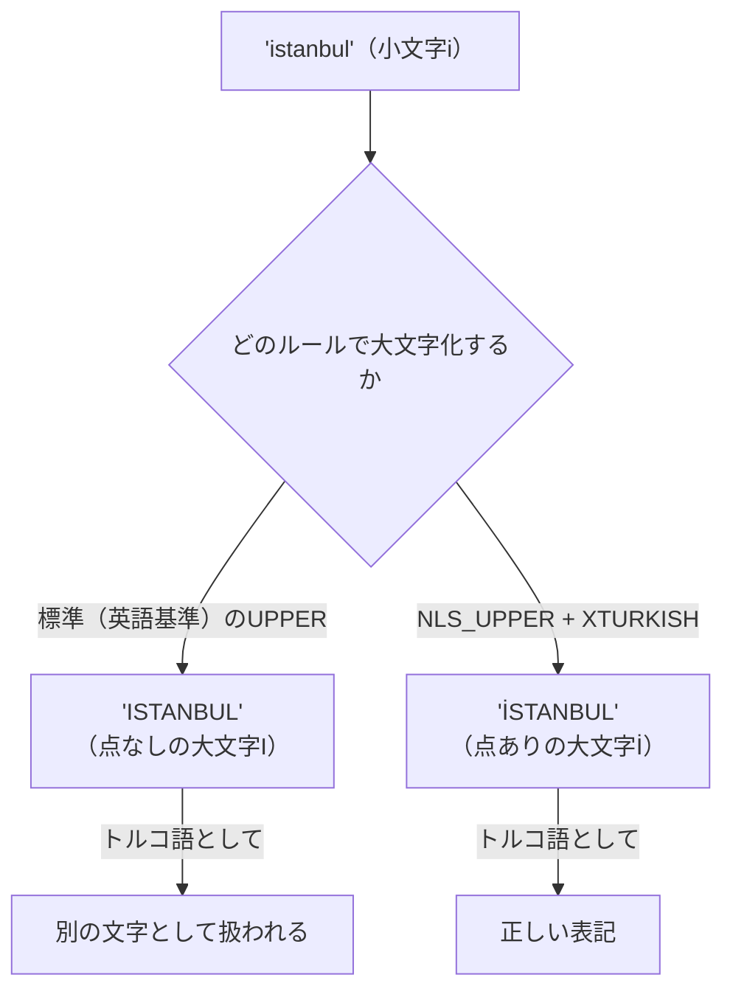
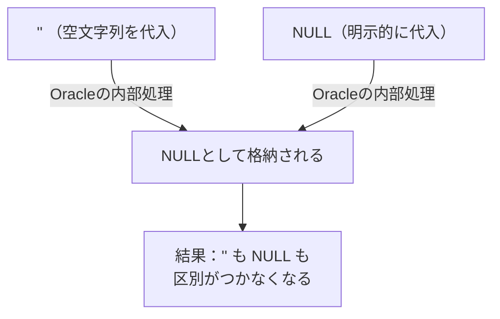
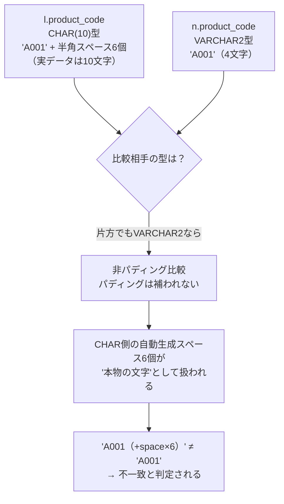
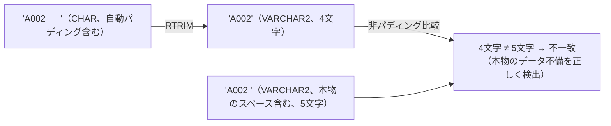
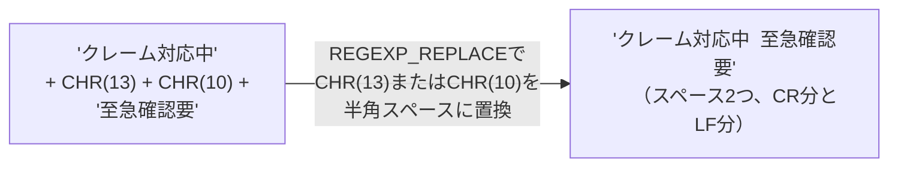
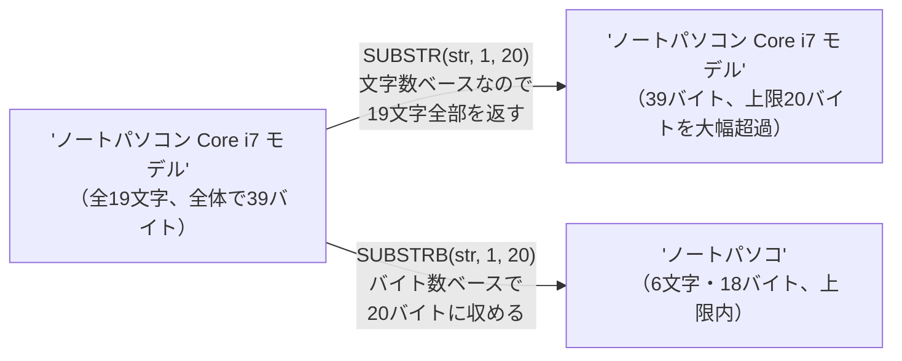

# 問題5-15：全角・半角の変換（TO_SINGLE_BYTE / TO_MULTI_BYTE）
### 難易度：★★☆☆☆ (Lv.2)

## 問題
ECサイトの会員登録フォームは自由入力のため、`PHONE_NUMBER`（電話番号）と `POSTAL_CODE`（郵便番号）に全角文字と半角文字が混在した状態で保存されてしまっています。

これらのデータをシステム間連携用に整形するため、以下のルールで変換した値を取得してください。

**【変換ルール】**
* **PHONE_NUMBER_H**：`PHONE_NUMBER` に含まれる英数字・記号を、すべて半角に統一する。
* **POSTAL_CODE_H**：`POSTAL_CODE` に含まれる英数字・記号を、すべて半角に統一する。

なお、結果の表示順は `MEMBER_ID` の昇順とします。

## サンプルデータ
```sql
WITH members AS (
    SELECT 1 AS member_id, '０３−１２３４−５６７８' AS phone_number, '１００−００１３' AS postal_code FROM DUAL UNION ALL
    SELECT 2, '090-2345-6789'       , '150-0002'         FROM DUAL UNION ALL
    SELECT 3, '０８０-3456-7890'    , '530−００１１'      FROM DUAL UNION ALL
    SELECT 4, '０７０ー４５６７ー８９０１', '460-0008'   FROM DUAL UNION ALL
    SELECT 5, '045-6789-0123'       , '２３１ー００２３'  FROM DUAL
)
SELECT * FROM members
```

## 期待する結果
| MEMBER_ID | PHONE_NUMBER               | PHONE_NUMBER_H  | POSTAL_CODE      | POSTAL_CODE_H | 
| --------- | -------------------------- | --------------- | ---------------- | ------------- | 
| 1         | ０３−１２３４−５６７８   | 03−1234−5678  | １００−００１３ | 100−0013     | 
| 2         | 090-2345-6789              | 090-2345-6789   | 150-0002         | 150-0002      | 
| 3         | ０８０-3456-7890           | 080-3456-7890   | 530−００１１    | 530−0011     | 
| 4         | ０７０ー４５６７ー８９０１ | 070ー4567ー8901 | 460-0008         | 460-0008      | 
| 5         | 045-6789-0123              | 045-6789-0123   | ２３１ー００２３ | 231ー0023     | 

数字部分はすべて半角に変換されている一方、区切りに使われている記号（「−」「ー」）は**全件とも変換されずに残る**という結果になります。

## NG例（よくある間違い）
```sql:NG例：TRANSLATEで全角数字だけを愚直に置換しようとした場合
WITH members AS (
    SELECT 1 AS member_id, '０３−１２３４−５６７８' AS phone_number, '１００−００１３' AS postal_code FROM DUAL UNION ALL
    SELECT 2, '090-2345-6789'       , '150-0002'         FROM DUAL UNION ALL
    SELECT 3, '０８０-3456-7890'    , '530−００１１'      FROM DUAL UNION ALL
    SELECT 4, '０７０ー４５６７ー８９０１', '460-0008'   FROM DUAL UNION ALL
    SELECT 5, '045-6789-0123'       , '２３１ー００２３'  FROM DUAL
)
SELECT
    member_id,
    phone_number,
    TRANSLATE(phone_number, '０１２３４５６７８９', '0123456789') AS phone_number_h
FROM
    members
```
一見動きそうですが、これでは**全角の「０〜９」しか対応できておらず、区切りに使われている全角記号は一切変換されずに残ってしまいます。** 数字の変換対応表を用意すること自体は間違いではありませんが、記号や長音記号まで含めた対応表を人力で網羅するのは非現実的です。「全角の文字種は無数にある」という前提に立つと、`TRANSLATE`で1文字ずつ対応表を作るアプローチには限界があることが分かります。

## 解答例
```sql
WITH members AS (
    SELECT 1 AS member_id, '０３−１２３４−５６７８' AS phone_number, '１００−００１３' AS postal_code FROM DUAL UNION ALL
    SELECT 2, '090-2345-6789'       , '150-0002'         FROM DUAL UNION ALL
    SELECT 3, '０８０-3456-7890'    , '530−００１１'      FROM DUAL UNION ALL
    SELECT 4, '０７０ー４５６７ー８９０１', '460-0008'   FROM DUAL UNION ALL
    SELECT 5, '045-6789-0123'       , '２３１ー００２３'  FROM DUAL
)
SELECT
    member_id,
    phone_number,
    TO_SINGLE_BYTE(phone_number) AS phone_number_h,
    postal_code,
    TO_SINGLE_BYTE(postal_code) AS postal_code_h
FROM
    members
ORDER BY
    member_id
```

## 解説
日本語を扱うシステム開発ならではの、地味ながら避けて通れない「全角・半角の統一」を扱う問題です。第4章の`:::message:::`ブロックで軽く触れた話題を、ここで正面から扱います。

`TO_SINGLE_BYTE`関数は、対象の文字列に含まれる**全角文字を、対応する半角文字へ一括変換**します。
```sql
TO_SINGLE_BYTE( [対象の文字列] )
```
逆に、半角文字を全角文字へ変換したい場合は`TO_MULTI_BYTE`関数を使います。この2つは対になる関数です。



NG例で見たように`TRANSLATE`でも似たようなことは実現できますが、`TRANSLATE`は「対応表に載っている文字だけ」を1文字ずつ変換する仕組みでした。全角の数字だけであれば10文字を対応表に書けば済みますが、全角の記号類まで含めると対応表はすぐに膨れ上がり、しかも「これで全部網羅できた」と自信を持って言い切るのは困難です。

一方`TO_SINGLE_BYTE`は、Oracleがあらかじめ持っている「全角文字と半角文字の対応関係（Unicode変換マッピング）」に基づいて変換してくれるため、対応表を自分で用意する必要がありません。

| 関数 | 変換の仕組み | 向いている用途 |
| :--- | :--- | :--- |
| `TRANSLATE`（第5-4問） | 自分で用意した対応表に基づき1文字ずつ変換 | 変換対象の文字種が少なく、限定的な場合 |
| `TO_SINGLE_BYTE` / `TO_MULTI_BYTE` | Oracle内蔵の全角⇔半角の対応関係で一括変換 | 全角・半角の統一全般（住所・電話番号・氏名など） |

ここで注目してほしいのが、期待する結果を見ると、**数字部分はすべて半角に変換されている一方、区切りに使われている記号（「−」や「ー」）は、5件すべての行で変換されずに残っている**という点です。

4件目・5件目に使われている「ー」は、日本語入力でよく使われる **長音記号（伸ばし棒）** です。これは半角のハイフンとは全く別の文字として扱われるため、`TO_SINGLE_BYTE`の変換対象になりません。ここまでは想定通りと言えます。

興味深いのは1件目・3件目です。「全角ハイフンのつもりで入力した『−』」も、実は`TO_SINGLE_BYTE`によって半角化されませんでした。これは、`TO_SINGLE_BYTE`が変換できる「本当の全角ハイフンマイナス」（Unicodeの U+FF0D）と、IMEの変換候補やコピー＆ペーストなどでよく紛れ込む「マイナス記号」（U+2212）や「全角ダッシュ」（U+2015）などが、**見た目はほぼ同じでも別の文字コードとして扱われる**ためです。人間の目にはどれも「全角の横棒」にしか見えませんが、Oracleにとっては全くの別の文字なのです。



実はこの現象は、今回のサンプルデータを作成する過程そのものでも起きています。「全角ハイフン」のつもりで用意した文字が、実際には変換対象外の記号だったというわけです。これは決して珍しい事故ではなく、**IMEでの日本語入力や、Excel・Webページなどからのコピー＆ペーストによって、意図しない「見た目そっくりの別文字」がデータに混入する**ことが実務でも頻繁に起こる、という何よりの実例だと思います。

:::message
### 「全角ハイフン」「全角マイナス」「長音記号」は別の文字
日本語入力でよく混同される文字に、全角ハイフンマイナス「－」（U+FF0D、`TO_SINGLE_BYTE`で変換される）、マイナス記号「−」（U+2212）、全角ダッシュ「―」（U+2014）、そして長音記号「ー」（U+30FC、伸ばし棒）があります。見た目がよく似ているため、ユーザーが手入力する自由記述欄では区別なく打ち込まれがちですし、**今回の演習で実際に確認した通り、意図的に「全角ハイフン」を用意したつもりのデータですら、変換対象外の別文字が紛れ込むことがあります**。`TO_SINGLE_BYTE`は多くのケースをカバーしてくれますが万能ではないため、電話番号や郵便番号のような「絶対に半角の数字とハイフンだけに統一したい」項目については、`TO_SINGLE_BYTE`をかけた後にさらに`REGEXP_REPLACE(col, '[^0-9-]', '-')`のような形で「数字とハイフン以外は一律ハイフンに寄せる」といった、正規表現による仕上げのバリデーションを重ねるのが実務では安全です。
:::

実務では、外部システムとのデータ連携やCSV出力の直前に、この`TO_SINGLE_BYTE`を通しておくバッチ処理がよく組まれます。特にフリー入力の住所・電話番号・氏名フリガナ欄などは、ユーザーの入力環境（IME設定）によって全角半角がバラバラになりがちなため、集計や照合をする前段階でのデータクレンジングとして欠かせない一手間です。今回の検証結果が示す通り、「変換したつもり」でも見た目の似た別文字が生き残ることがあるため、本当に厳密な統一が必要な項目では、変換後の値を目視だけでなく実データで確認する癖をつけておくと安心です。

---
<br><br>

# 【完全版】問題5-16：正規表現によるパターンの並べ替え（キャプチャグループとバックリファレンス）
### 難易度：★★★★☆ (Lv.4)

## 問題
基幹システムの電話番号は `090-1234-5678`（市外局番3桁-市内局番4桁-加入者番号4桁）の形式で統一されています。しかし、これから連携する2つの外部システムでは、電話番号の表示フォーマットがそれぞれ異なります。

以下のルールに従い、`PHONE_NUMBER` を2つの形式に変換してください。

**【変換ルール】**
* **FORMAT_A**：`(市外局番) 市内局番-加入者番号` の形式（例：`(090) 1234-5678`）
* **FORMAT_B**：`加入者番号-市内局番-市外局番` の形式、つまり**元の並び順を丸ごと逆転**させる（例：`5678-1234-090`）

## サンプルデータ
```sql
WITH customers AS (
    SELECT 1 AS customer_id, '090-1234-5678' AS phone_number FROM DUAL UNION ALL
    SELECT 2, '080-2345-6789' FROM DUAL UNION ALL
    SELECT 3, '070-3456-7890' FROM DUAL UNION ALL
    SELECT 4, '03-1234-5678'  FROM DUAL UNION ALL
    SELECT 5, '06-2345-6789'  FROM DUAL
)
SELECT * FROM customers
```
※4件目・5件目は市外局番が2桁（東京・大阪の固定電話）である点に注意してください。

## 期待する結果
| CUSTOMER_ID | PHONE_NUMBER  | FORMAT_A        | FORMAT_B      | 
| ----------- | ------------- | --------------- | ------------- | 
| 1           | 090-1234-5678 | (090) 1234-5678 | 5678-1234-090 | 
| 2           | 080-2345-6789 | (080) 2345-6789 | 6789-2345-080 | 
| 3           | 070-3456-7890 | (070) 3456-7890 | 7890-3456-070 | 
| 4           | 03-1234-5678  | (03) 1234-5678  | 5678-1234-03  | 
| 5           | 06-2345-6789  | (06) 2345-6789  | 6789-2345-06  | 

## NG例（よくある間違い）
```sql:NG例：REPLACEやSUBSTRの組み合わせで力技を試みた場合
WITH customers AS (
    SELECT 1 AS customer_id, '090-1234-5678' AS phone_number FROM DUAL UNION ALL
    SELECT 2, '080-2345-6789' FROM DUAL UNION ALL
    SELECT 3, '070-3456-7890' FROM DUAL UNION ALL
    SELECT 4, '03-1234-5678'  FROM DUAL UNION ALL
    SELECT 5, '06-2345-6789'  FROM DUAL
)
SELECT
    customer_id,
    phone_number,
    '(' || SUBSTR(phone_number, 1, 3) || ') ' || SUBSTR(phone_number, 5) AS format_a
FROM
    customers
```
1〜3件目（市外局番3桁）は `(090) 1234-5678` のように一見正しく見えますが、4・5件目（市外局番2桁）を見ると `(03-) 1234-5678` のように区切り位置がずれ、カッコの中にハイフンが混入してしまいます。**市外局番の桁数が2桁か3桁かでSUBSTRの開始位置がずれてしまう**ため、固定位置指定ではこの問題に対応しきれません。問題5-13で扱った「桁数が不定なデータ」の一種であり、今回のように「区切り文字（ハイフン）は共通だが、区切られる各パーツの長さがバラバラ」なケースでは、位置計算による力技はすぐに破綻します。

## 解答例
```sql
WITH customers AS (
    SELECT 1 AS customer_id, '090-1234-5678' AS phone_number FROM DUAL UNION ALL
    SELECT 2, '080-2345-6789' FROM DUAL UNION ALL
    SELECT 3, '070-3456-7890' FROM DUAL UNION ALL
    SELECT 4, '03-1234-5678'  FROM DUAL UNION ALL
    SELECT 5, '06-2345-6789'  FROM DUAL
)
SELECT
    customer_id,
    phone_number,
    REGEXP_REPLACE(phone_number, '(\d+)-(\d+)-(\d+)', '(\1) \2-\3') AS format_a,
    REGEXP_REPLACE(phone_number, '(\d+)-(\d+)-(\d+)', '\3-\2-\1')   AS format_b
FROM
    customers
```

## 解説
問題5-10・5-12でも`REGEXP_REPLACE`は登場しましたが、これまでの使い方は「一致した部分を固定の文字（空文字など）に置き換える」というシンプルなものでした。今回は`REGEXP_REPLACE`の中でも一段高度な、**「一致した部分を、パーツごとに分解した上で、好きな順序に並べ替えて置き換える」** というキャプチャグループ（グループ化）とバックリファレンス（後方参照）のテクニックを扱います。

### キャプチャグループとは
正規表現パターンの中で`( )`（丸カッコ）を使うと、その部分にマッチした文字列を**グループとして記憶**させることができます。
```sql
'(\d+)-(\d+)-(\d+)'
```
このパターンは、「数字の塊」「ハイフン」「数字の塊」「ハイフン」「数字の塊」という並びに一致するもの全体を探しつつ、`\d+`（1文字以上の数字）を3つのカッコで囲むことで、**1番目・2番目・3番目の数字の塊を個別に記憶**するよう指示しています。



### バックリファレンスで並べ替える
置換後の文字列を指定する第3引数の中では、`\1`・`\2`・`\3`という記法で「さきほど記憶したグループの中身」をそのまま呼び出すことができます。これが **バックリファレンス（後方参照）** です。

`FORMAT_A`の置換後パターン `'(\1) \2-\3'` は、「グループ1を丸カッコで囲み、スペースを挟んで、グループ2とグループ3をハイフンでつなぐ」という組み立て方の指示になります。



ここが今回の最大のポイントですが、`FORMAT_B`の `'\3-\2-\1'` のように、**グループを呼び出す順番は自由**です。マッチした順番（1→2→3）通りに使う必要はなく、`\3`を先に、`\1`を最後に、という完全な逆順の組み立ても可能です。これは、対象を消したり固定の文字に変えたりするだけの通常の`REPLACE`や、これまでの`REGEXP_REPLACE`の使い方（5-10・5-12）ではできなかった芸当です。

| 手法 | できること | 今回のケースでの限界 |
| :--- | :--- | :--- |
| `REPLACE`（5-3〜5-4） | 固定文字列の置換・削除 | 「並べ替え」はそもそも不可能 |
| `SUBSTR` + 固定位置（NG例） | 決まった位置からの切り出し | 桁数が不定だと破綻する |
| `REGEXP_REPLACE`（5-10・5-12） | パターンに一致した箇所を固定の文字へ置換・削除 | 「一致した部分を消す」だけで、並べ替えはできない |
| `REGEXP_REPLACE` + キャプチャグループ（今回） | 一致した部分をパーツに分解し、**任意の順序に並べ替えて再構成**できる | － |

`\d+`（1文字以上の数字）という「1文字以上」を意味する`+`のおかげで、市外局番が2桁（`03`）でも3桁（`090`）でも、そのグループが「何文字あるか」をOracle側が自動的に判断してくれます。問題5-13の`INSTR`や、NG例の`SUBSTR`のように「区切り文字が何文字目にあるか」を人間が計算してあげる必要がなくなるのが、正規表現ならではの強みです。

:::message
### バックリファレンスは日付や氏名の並べ替えにも応用できる
今回は電話番号を例にしましたが、同じ考え方は「`2024/01/15`のようなYYYY/MM/DD形式を、`15-01-2024`のようなDD-MM-YYYY形式に並べ替える」「CSVで送られてきた`姓,名`の並びを`名 姓`に入れ替える」といった、実務でよくある**フォーマット変換・項目の並べ替え**全般に応用できます。ポイントは「区切り文字を軸にグループを作り、置換後のパターンで呼び出す順番を変えるだけ」という点に尽きます。ただし、グループの数が多くなったり、パターンが複雑になったりすると可読性が急激に落ちるため、`\1`が何を指しているかコメントを添えるなどの配慮があると、後から読む人（未来の自分を含む）に親切です。
:::

## 参考リンク
https://www.shift-the-oracle.com/sql/functions/regexp_replace.html
https://www.shift-the-oracle.com/sql/functions/regexp_substr.html

---
<br><br>

# 【完全版】問題5-17：大文字小文字変換とロケールの落とし穴（NLS_UPPER）
### 難易度：★★★☆☆ (Lv.3)

## 問題
多国籍展開しているある企業では、各拠点の都市マスタ（`CITY_MASTER`）を一元管理しており、システム内では都市名の大文字表記が必要な帳票で共通して `UPPER` 関数を使用してきました。

ところが、トルコ・イスタンブール拠点の担当者から「大文字変換した都市名が、トルコ現地の正式な表記と一致しない」というクレームが上がってきました。原因を調査するため、通常の `UPPER` 関数の変換結果と、トルコ語の言語ルールを考慮した変換結果を並べて比較し、**両者の結果が食い違う都市を特定**してください。

**【抽出・編集ルール】**
* **CITY_UPPER**：`UPPER` 関数による通常の大文字変換結果
* **CITY_UPPER_TR**：トルコ語のロケールルール（`NLS_SORT=XTURKISH`）を考慮した大文字変換結果
* **IS_MISMATCH**：両者が一致しない場合は `'Y'`、一致する場合は `'N'`

## サンプルデータ
```sql
WITH city_master AS (
    SELECT 1 AS city_id, 'istanbul' AS city_name FROM DUAL UNION ALL
    SELECT 2, 'izmir'   FROM DUAL UNION ALL
    SELECT 3, 'ankara'  FROM DUAL UNION ALL
    SELECT 4, 'bursa'   FROM DUAL UNION ALL
    SELECT 5, 'antalya' FROM DUAL
)
SELECT * FROM city_master
```

## 期待する結果
| CITY_ID | CITY_NAME | CITY_UPPER | CITY_UPPER_TR | IS_MISMATCH |
| ------- | ---------- | ------------ | ---------------- | ------------- |
| 1       | istanbul   | ISTANBUL     | İSTANBUL          | Y             |
| 2       | izmir      | IZMIR        | İZMİR             | Y             |
| 3       | ankara     | ANKARA       | ANKARA            | N             |
| 4       | bursa      | BURSA        | BURSA             | N             |
| 5       | antalya    | ANTALYA      | ANTALYA           | N             |

## NG例（よくある間違い）
```sql:NG例：UPPERだけで全拠点共通処理をしてしまう
WITH city_master AS (
    SELECT 1 AS city_id, 'istanbul' AS city_name FROM DUAL UNION ALL
    SELECT 2, 'izmir'   FROM DUAL UNION ALL
    SELECT 3, 'ankara'  FROM DUAL UNION ALL
    SELECT 4, 'bursa'   FROM DUAL UNION ALL
    SELECT 5, 'antalya' FROM DUAL
)
SELECT
    city_id,
    city_name,
    UPPER(city_name) AS city_upper
FROM
    city_master
```
このSQL自体はエラーにはならず、一見どの拠点でも同じロジックで動いているように見えます。しかし`istanbul`や`izmir`のように「小文字のi」を含む都市名では、トルコ現地の正式な表記（`İSTANBUL`、`İZMİR`）とは異なる結果（`ISTANBUL`、`IZMIR`）になってしまいます。**「動いている」ことと「その地域にとって正しい」ことは別問題**であり、全拠点で1つの関数・1つの挙動を前提にしてしまうと、特定の言語圏でだけ静かに間違った結果を生み続けることになります。

## 解答例
```sql
WITH city_master AS (
    SELECT 1 AS city_id, 'istanbul' AS city_name FROM DUAL UNION ALL
    SELECT 2, 'izmir'   FROM DUAL UNION ALL
    SELECT 3, 'ankara'  FROM DUAL UNION ALL
    SELECT 4, 'bursa'   FROM DUAL UNION ALL
    SELECT 5, 'antalya' FROM DUAL
)
SELECT
    city_id,
    city_name,
    UPPER(city_name)                              AS city_upper,
    NLS_UPPER(city_name, 'NLS_SORT=XTURKISH')      AS city_upper_tr,
    CASE
        WHEN UPPER(city_name) <> NLS_UPPER(city_name, 'NLS_SORT=XTURKISH') THEN 'Y'
        ELSE 'N'
    END                                            AS is_mismatch
FROM
    city_master
```

## 解説
問題5-5では`INITCAP`の仕様上の癖（`McLagan`→`Mclagan`になる）を扱いましたが、今回は大文字小文字変換にまつわる、さらに一段深い落とし穴——**「言語（ロケール）によって、正しい大文字小文字変換のルールそのものが変わる」** という話です。ソフトウェア業界では古くから「トルコ語のI問題（Turkish I problem）」として知られる、有名なバグの原因の一つでもあります。

### 何が起きているのか
英語の感覚では、小文字の`i`を大文字にすると当然`I`（点のない大文字のI）になります。実際、Oracleの`UPPER`関数もこの標準的なルールに従って変換します。

ところがトルコ語には、英語にはない **2種類の「i」** が存在します。

| トルコ語の文字 | 読み | 大文字にすると |
| :--- | :--- | :--- |
| `i`（点あり小文字） | 通常のi | `İ`（点あり大文字） |
| `ı`（点なし小文字） | ドットのないウ音に近いi | `I`（点なし大文字） |

つまりトルコ語のルールでは、「点あり小文字i」は「点あり大文字İ」に対応するのが正しく、英語圏の感覚で単純に`I`（点なし）に変換してしまうと、トルコ語としては**文字として別物**になってしまうのです。



### NLS_UPPER関数の使い方
`NLS_UPPER`は、`UPPER`に「どの言語・地域のルールで変換するか」を追加で指定できるようにした関数です。
```sql
NLS_UPPER( [対象の文字列], 'NLS_SORT=[言語ルール]' )
```
第2引数に`'NLS_SORT=XTURKISH'`と指定することで、Oracleに対して「トルコ語の大文字小文字変換ルールを使ってほしい」と明示的に伝えています。`XTURKISH`のように先頭に`X`が付く言語ルールは、Oracleにおいて「大文字小文字の変換や照合順序について、その言語特有の例外規則を適用する」ことを示す命名規則です。

期待する結果を見ると、`i`を含まない`ankara`、`bursa`、`antalya`は`UPPER`と`NLS_UPPER`の結果が完全に一致しており、`IS_MISMATCH`は`'N'`のままです。一方、`i`を含む`istanbul`と`izmir`だけが食い違い、`IS_MISMATCH`が`'Y'`になります。この **「差分が出る行だけをあぶり出す」** という比較の考え方は、問題5-5のメール名と登録氏名の突合と同じ発想です。

| 関数 | 変換ルールの基準 | 使いどころ |
| :--- | :--- | :--- |
| `UPPER` / `LOWER`（問題5-5） | セッションのデフォルト設定（多くの場合、英語圏の標準ルール） | 特定言語に依存しない、一般的な大文字小文字変換 |
| `NLS_UPPER` / `NLS_LOWER` | 第2引数で明示的に指定した言語ルール | 特定の国・地域向けの表記を厳密に扱いたい場合 |

:::message
### セッションのNLS設定に依存する怖さ
実は`UPPER`関数自体も、内部的にはデータベースセッションの`NLS_SORT`パラメータの影響を受けることがあります。つまり、同じ`UPPER('istanbul')`というSQLでも、**接続してきたクライアントやセッションの設定次第で結果が変わりうる**のです。これは「同じSQLなのに環境によって結果が違う」という、原因究明が非常に難しい不具合につながります。特定の言語ルールに依存させたくない・させたい、という意図がある場合は、暗黙のセッション設定に頼らず、`NLS_UPPER`のように**変換ルールを明示的にコードへ書き込んでおく**のが安全です。
:::

実務でこの問題に遭遇する機会は多くはありませんが、グローバル展開しているシステムでユーザーIDやメールアドレスの大文字小文字を正規化して重複チェックを行うような場面では、この「地域によって変換ルールが変わりうる」という前提を知っているかどうかが、思わぬバグを防ぐ分かれ目になります。

## 参考リンク
https://www.shift-the-oracle.com/sql/functions/upper-lower-initcap.html
https://www.shift-the-oracle.com/sql/functions/nlssort.html

---
<br><br>

# 問題5-18：空文字列とNULLの等価性（Oracle特有の仕様）
### 難易度：★★★☆☆ (Lv.3)

## 問題
会員管理システムの `MEMBERS` テーブルには、`REMARKS`（備考欄）という自由入力の列があります。運用担当者から「備考欄が**完全に未入力**の会員だけを抽出してほしい」という依頼を受けました。

以下のデータを対象に、`REMARKS` が「何も入力されていない」会員を抽出してください。

## サンプルデータ
```sql
WITH members AS (
    SELECT 1 AS member_id, 'VIP会員' AS remarks FROM DUAL UNION ALL
    SELECT 2, ''            FROM DUAL UNION ALL
    SELECT 3, NULL          FROM DUAL UNION ALL
    SELECT 4, '退会検討中'   FROM DUAL UNION ALL
    SELECT 5, ' '           FROM DUAL
)
SELECT * FROM members
```
※5件目の `REMARKS` には、半角スペースが1文字だけ入力されている想定です。

## 期待する結果
| MEMBER_ID | REMARKS |
| --------- | ------- |
| 2         | (NULL) |
| 3         | (NULL) |

## NG例（よくある間違い）
```sql:NG例：「未入力」を'' で判定しようとした場合
WITH members AS (
    SELECT 1 AS member_id, 'VIP会員' AS remarks FROM DUAL UNION ALL
    SELECT 2, ''            FROM DUAL UNION ALL
    SELECT 3, NULL          FROM DUAL UNION ALL
    SELECT 4, '退会検討中'   FROM DUAL UNION ALL
    SELECT 5, ' '           FROM DUAL
)
SELECT
    member_id,
    remarks
FROM
    members
WHERE
    remarks = ''
```
このSQLは**構文エラーにはならず、実行できてしまいます**が、結果は**0件**になります。他のRDBMS（PostgreSQLやSQL Serverなど）の経験がある方ほど「空文字を検索したいなら`= ''`で当然ヒットするはず」と考えて書いてしまいがちですが、Oracleではこの直感が裏切られます。エラーで気づける間違いではなく、静かに0件が返ってくるだけなので、「対象データが存在しない」と誤って報告してしまう危険があります。

## 解答例
```sql
WITH members AS (
    SELECT 1 AS member_id, 'VIP会員' AS remarks FROM DUAL UNION ALL
    SELECT 2, ''            FROM DUAL UNION ALL
    SELECT 3, NULL          FROM DUAL UNION ALL
    SELECT 4, '退会検討中'   FROM DUAL UNION ALL
    SELECT 5, ' '           FROM DUAL
)
SELECT
    member_id,
    remarks
FROM
    members
WHERE
    remarks IS NULL
```

## 解説
Oracle SQLを学ぶ上で避けて通れない、非常に有名な仕様上の落とし穴です。標準SQLの考え方や多くのRDBMSでは「空文字列（長さ0の文字列）」と「NULL（値が存在しないこと）」は明確に区別されますが、**Oracleの`VARCHAR2`型は、この2つを内部的に同一のものとして扱います。**



そのため、`remarks = ''` という比較は、実質的に `remarks = NULL` と書いているのと同じことになります。しかし問題4-1などで扱った通り、SQLの**NULLは「不明」を表す特殊な値**であり、`=`（等価演算子）でNULLと比較すると、結果は真（TRUE）にも偽（FALSE）にもならず「不明（UNKNOWN）」になります。`WHERE`句は「不明」と評価された行を除外するため、`remarks = ''` はどんな行に対しても真になることがなく、常に0件という結果になるのです。

| 比較方法 | 標準SQL/他DBでの動作イメージ | Oracleでの実際の動作 |
| :--- | :--- | :--- |
| `col = ''` | 空文字列のデータにヒットする | **常に0件**（NULLとの比較は不明と評価される） |
| `col IS NULL` | NULLのデータにヒットする | 空文字列も含めてヒットする（''もNULL扱いのため） |

期待する結果を見ると、`REMARKS`列に明示的に`NULL`を入れた3件目だけでなく、空文字`''`を入れた2件目も、どちらも`IS NULL`で正しく抽出できています。なお、結果セットのREMARKS列を実際に見比べても、2件目（元は''）と3件目（元はNULL）はまったく同じ **空欄（NULL）** として表示され、両者を見た目で区別する方法はありません。「空文字列として保存したはずなのに、後から見るとNULLと見分けがつかない」というのは、まさにOracleが空文字列を独自の型として保持していない（''を代入した時点でNULLに変換してしまう）ことの直接的な帰結です。一方、5件目の半角スペース1文字`' '`は、**長さ1の「意味のある文字列」として扱われる**ため、`IS NULL`の対象にはなりません。「何も入力されていない（長さ0）」と「スペースだけ入力されている（長さ1）」は別物である、という点も合わせて押さえておくとよいでしょう。

:::message
### CHAR型ではさらに事情が変わる
この「空文字列＝NULL」という仕様は`VARCHAR2`型（可変長）の話です。次の問題5-19で扱う`CHAR`型（固定長）では、列の定義桁数に応じて末尾に自動で半角スペースが埋め込まれる仕様があるため、また違った形の落とし穴が存在します。「文字列が空かどうか」の判定は、対象の列がVARCHAR2かCHARかによっても意識しておくべきポイントが変わってきます。
:::

なお、この仕様は将来的に変わる可能性がある「未定義の動作」として、Oracle公式ドキュメントでも明記されている点には注意が必要です。実務でNULLと空文字列を明確に区別したいシステムを設計する場合、Oracle以外のRDBMSへの移行可能性も考慮し、安易に「空文字とNULLは同じもの」という前提でロジックを組まない方が安全です。

## 参考リンク
https://www.shift-the-oracle.com/sql/functions/nvl-coalesce.html

----
<br><br>


# 【完全版】問題5-19：CHAR型比較における「ブランクパディングの罠」
### 難易度：★★★★☆ (Lv.4)

## 問題
旧基幹システムから連携されてくる `PRODUCT_CODES_LEGACY`（商品コードマスタ）は、コード列が `CHAR(10)` という**固定長**の型で定義されています。これを、新システムの `PRODUCT_CODES_NEW`（`VARCHAR2`型で定義）と突き合わせて、**両システムでコードが一致する商品**を特定してください。

## サンプルデータ
```sql
WITH
    product_codes_legacy AS (
        SELECT 1 AS row_id, CAST('A001' AS CHAR(10)) AS product_code FROM DUAL UNION ALL
        SELECT 2, CAST('A002' AS CHAR(10)) FROM DUAL UNION ALL
        SELECT 3, CAST('A003' AS CHAR(10)) FROM DUAL
    ),
    product_codes_new AS (
        SELECT 1 AS row_id, 'A001' AS product_code FROM DUAL UNION ALL
        SELECT 2, 'A002 '        FROM DUAL UNION ALL  -- 末尾に半角スペースが1つ混入（データ入力ミスを想定）
        SELECT 3, 'A003'         FROM DUAL
    )
SELECT * FROM product_codes_legacy;
SELECT * FROM product_codes_new;
```
※旧システムの`product_code`は`CHAR(10)`で定義されているため、`'A001'`のように4文字しか代入していなくても、内部的には末尾に半角スペースが自動で埋められ、常に10文字として格納されます。
※新システムの2件目`'A002 '`は、入力ミスによって末尾に**本物の**半角スペースが1つ混入している想定です。

## 期待する結果
| ROW_ID | LEGACY_CODE | NEW_CODE | MATCH_RESULT | 
| ------ | ----------- | -------- | ------------ | 
| 1      | A001        | A001     | 一致         | 
| 2      | A002        | A002     | 不一致       | 
| 3      | A003        | A003     | 一致         | 

2件目だけは「新システム側の入力ミス」という**本当に検出すべき不一致**であり、これを正しく不一致として拾える状態がゴールです。

## NG例①：CHAR型なら自動でパディングされるはず、と思い込んで直接比較した場合
```sql
WITH
    product_codes_legacy AS (
        SELECT 1 AS row_id, CAST('A001' AS CHAR(10)) AS product_code FROM DUAL UNION ALL
        SELECT 2, CAST('A002' AS CHAR(10)) FROM DUAL UNION ALL
        SELECT 3, CAST('A003' AS CHAR(10)) FROM DUAL
    ),
    product_codes_new AS (
        SELECT 1 AS row_id, 'A001' AS product_code FROM DUAL UNION ALL
        SELECT 2, 'A002 '        FROM DUAL UNION ALL
        SELECT 3, 'A003'         FROM DUAL
    )
SELECT
    l.row_id,
    l.product_code AS legacy_code,
    n.product_code AS new_code,
    CASE
        WHEN l.product_code = n.product_code THEN '一致'
        ELSE '不一致'
    END AS match_result
FROM
    product_codes_legacy l
JOIN
    product_codes_new n
ON
    l.row_id = n.row_id
```
**実行結果はすべて「不一致」になります。** これは「CHAR型が絡む比較なら自動的にブランクパディングされて、末尾スペースの差は吸収されるはずだ」という思い込みによる間違いです。実際には、比較する片方が`VARCHAR2`型である時点で、Oracleは**非パディング比較（NONPADDED）**という別のルールに切り替えます。このルールでは、パディングが「補われる」ことはなく、`CHAR(10)`側にもとから埋め込まれている自動生成分のスペース6〜7個が**「本物の文字」として比較対象に含まれてしまう**ため、`'A001'`（4文字）とはどうやっても一致しなくなります。1件目・3件目のような、本来完全に一致すべきデータまで不一致扱いになってしまう点が、このNG例の危険なところです。

## 解答例
```sql
WITH
    product_codes_legacy AS (
        SELECT 1 AS row_id, CAST('A001' AS CHAR(10)) AS product_code FROM DUAL UNION ALL
        SELECT 2, CAST('A002' AS CHAR(10)) FROM DUAL UNION ALL
        SELECT 3, CAST('A003' AS CHAR(10)) FROM DUAL
    ),
    product_codes_new AS (
        SELECT 1 AS row_id, 'A001' AS product_code FROM DUAL UNION ALL
        SELECT 2, 'A002 '        FROM DUAL UNION ALL
        SELECT 3, 'A003'         FROM DUAL
    )
SELECT
    l.row_id,
    l.product_code AS legacy_code,
    n.product_code AS new_code,
    CASE
        WHEN RTRIM(l.product_code) = n.product_code THEN '一致'
        ELSE '不一致'
    END AS match_result
FROM
    product_codes_legacy l
JOIN
    product_codes_new n
ON
    l.row_id = n.row_id
```

## 解説
`CHAR`型と`VARCHAR2`型の比較は、表面的には「固定長か可変長か」という説明で終わってしまいがちですが、実務で本当に厄介なのは**比較（`=`）のルールそのものが、組み合わせによって変わる**という点です。

Oracleの文字列比較には、大きく分けて2つのルールが存在します。

| 比較ルール | 適用条件 | 挙動 |
| :--- | :--- | :--- |
| **ブランクパディング比較** | 比較する**両方**が`CHAR`型（または文字リテラル）である場合 | 短い方の末尾に自動でスペースが補われてから比較される |
| **非パディング比較** | どちらか**一方でも**`VARCHAR2`型（`NVARCHAR2`含む）である場合 | パディングは一切補われず、両者をあるがままの長さで比較する |

今回のポイントは、この判定が「列の定義」ではなく「比較する**両方の型の組み合わせ**」で決まるという点です。`l.product_code`が`CHAR(10)`型であっても、比較相手の`n.product_code`が`VARCHAR2`型である以上、Oracleは非パディング比較を選択します。



つまりNG例①で全件不一致になった原因は、**「CHAR型の自動パディングは、比較時に自動的に無視してもらえる」という思い込みが誤りだった**ことにあります。パディングが「補われる」のはCHAR同士の比較の時だけで、VARCHAR2が絡んだ瞬間、CHAR型自身の自動パディングはむしろ**邪魔な余分文字**として立ちはだかってきます。

そこで解答例では、`RTRIM`（問題5-7で既出）を使って、比較の**前に**`l.product_code`から自動生成された末尾スペースを明示的に取り除いています。
```sql
RTRIM(l.product_code) = n.product_code
```
`RTRIM`は`CHAR`型を渡しても戻り値は`VARCHAR2`型になるため、この時点で比較は「`VARCHAR2` 対 `VARCHAR2`」の非パディング比較として行われます。ここが今回のトリックです。CHAR由来の**余計な**自動パディングだけを`RTRIM`で確実に除去した上で、正真正銘の内容同士を非パディング（＝厳密）に比較することで、初めて「1件目・3件目は正しく一致、2件目（本物の入力ミス）だけを正しく不一致として検出する」という、意図通りの結果が得られます。



| アプローチ | 1件目・3件目（本来一致） | 2件目（本来不一致） | 評価 |
| :--- | :--- | :--- | :--- |
| 直接 `l.product_code = n.product_code`（NG例①） | 不一致と誤判定 | 不一致（結果的に正しいが理由が誤り） | ✗ CHAR由来のパディングをノイズとして拾ってしまう |
| `RTRIM(l.product_code) = n.product_code`（解答例） | 一致と正しく判定 | 不一致と正しく判定 | ◯ CHAR由来のパディングだけを狙って除去できている |

:::message
### 両方をCHAR型にキャストする「隠れたNG例」にも要注意
今回とは別に、「それなら比較の前に`n.product_code`側も`CAST(... AS CHAR(10))`してCHAR同士にしてしまえばいいのでは」という発想も一見成立しそうに見えます。しかしこれをやると、ブランクパディング比較が働いて**2件目の本物の末尾スペース（データ不備）まで吸収されて「一致」と誤判定されてしまいます**。CHAR型へのキャストは、パディングによる文字数の違いを一律に「なかったこと」にしてしまう諸刃の剣であり、今回のように「本物のデータ不備は検出したい」という要件とは相性が悪い点も覚えておいてください。
:::

実務でレガシーシステムとの連携データを扱う際は、「片方でもCHAR型が混ざっている比較は、パディングの扱いが直感に反する」という前提に立ち、比較前に`RTRIM`（またはORMやアプリケーション側でのトリム処理）を挟む習慣をつけておくと、今回のような静かな誤判定を防げます。

## 参考リンク
https://www.shift-the-oracle.com/sql/functions/rtrim.html

----
<br><br>

# 問題5-20：ASCII / CHRによる制御文字の除去
### 難易度：★★☆☆☆ (Lv.2)

## 問題
外部の顧客管理システムからCSV経由で取り込んだ `CUSTOMER_NOTES`（顧客メモ）に、目に見えない**改行コード**が混入していることが判明しました。このままレポートに出力すると、1件のメモのはずが複数行に見えてしまい、体裁が崩れてしまいます。

以下のデータについて、`NOTE`に含まれる改行コード（LF：`CHR(10)`、CR：`CHR(13)`）をすべて半角スペースに置き換えた `NOTE_CLEAN` 列を作成してください。

## サンプルデータ
```sql
WITH customer_notes AS (
    SELECT 1 AS customer_id, '対応済み。次回は来月連絡予定。' AS note FROM DUAL UNION ALL
    SELECT 2, '要フォロー' || CHR(10) || '担当:田中' FROM DUAL UNION ALL
    SELECT 3, 'クレーム対応中' || CHR(13) || CHR(10) || '至急確認要' FROM DUAL UNION ALL
    SELECT 4, '特になし' FROM DUAL
)
SELECT * FROM customer_notes
```

## 期待する結果
| CUSTOMER_ID | NOTE                           | NOTE_CLEAN                     | 
| ----------- | ------------------------------ | ------------------------------ | 
| 1           | 対応済み。次回は来月連絡予定。 | 対応済み。次回は来月連絡予定。 | 
| 2           | 要フォロー<br>担当:田中        | 要フォロー 担当:田中           | 
| 3           | クレーム対応中<br>至急確認要   | クレーム対応中  至急確認要     | 
| 4           | 特になし                       | 特になし                       | 

※3件目は「CR＋LF」の2文字連続のため、変換後は半角スペースが2つ連続する点に注意してください。

## NG例（よくある間違い）
```sql:NG例：改行文字をそのまま文字リテラルとして書こうとした場合
WITH customer_notes AS (
    SELECT 1 AS customer_id, '対応済み。次回は来月連絡予定。' AS note FROM DUAL UNION ALL
    SELECT 2, '要フォロー' || CHR(10) || '担当:田中' FROM DUAL UNION ALL
    SELECT 3, 'クレーム対応中' || CHR(13) || CHR(10) || '至急確認要' FROM DUAL UNION ALL
    SELECT 4, '特になし' FROM DUAL
)
SELECT
    customer_id,
    REPLACE(note, '
', ' ') AS note_clean
FROM
    customer_notes
```
SQL文の中に改行を直接埋め込んで「改行文字そのもの」を表現しようとする書き方ですが、環境やエディタの改行コード設定（LFかCRLFか）に依存してしまい、意図した通りに動くとは限りません。しかもコード自体が非常に読みにくくなり、レビューをする人が「何を置換しようとしているのか」を目で見て把握することも困難です。改行コードのような**制御文字（目に見えない文字）は、文字そのものを打ち込むのではなく、文字コードを指定して生成する**のが定石です。

## 解答例
```sql
WITH customer_notes AS (
    SELECT 1 AS customer_id, '対応済み。次回は来月連絡予定。' AS note FROM DUAL UNION ALL
    SELECT 2, '要フォロー' || CHR(10) || '担当:田中' FROM DUAL UNION ALL
    SELECT 3, 'クレーム対応中' || CHR(13) || CHR(10) || '至急確認要' FROM DUAL UNION ALL
    SELECT 4, '特になし' FROM DUAL
)
SELECT
    customer_id,
    note,
    REGEXP_REPLACE(note, CHR(13) || '|' || CHR(10), ' ') AS note_clean
FROM
    customer_notes
```

## 解説
これまでの問題では「A」や「,」のような目に見える文字を扱ってきましたが、実務のデータクレンジングでは**目に見えない制御文字**への対処が意外と頻繁に発生します。改行・タブ・NULL文字などがその代表です。

`CHR`関数は、指定した文字コード（数値）に対応する文字そのものを返します。
```sql
CHR( [文字コード] )
```
主要な制御文字のコードは以下の通りです。

| 文字コード | 意味 | 通称 |
| :---: | :--- | :--- |
| `CHR(9)` | タブ | TAB |
| `CHR(10)` | 改行（ラインフィード） | LF |
| `CHR(13)` | 復帰（キャリッジリターン） | CR |

WindowsのテキストファイルはCR＋LF（`CHR(13) || CHR(10)`）の2文字で改行を表現し、Unix/Linux系はLF（`CHR(10)`）のみで改行を表現することが多く、この違いがCSV取込時のトラブルの元になりがちです。今回のサンプルデータでは、2件目にLFのみ、3件目にCR＋LFの2文字を意図的に混在させています。



解答例では、`REPLACE`ではなく`REGEXP_REPLACE`（問題5-10・5-12・5-16）を使っています。理由は、**CRとLFという2種類の文字を「どちらか一方」まとめて対象にしたい**からです。
```sql
REGEXP_REPLACE(note, CHR(13) || '|' || CHR(10), ' ')
```
パターン部分の `CHR(13) || '|' || CHR(10)` は、正規表現の「または」を意味する`|`（パイプ）を使って、「CHR(13)（CR）か、CHR(10)（LF）のどちらかにマッチしたら置換する」という指定になっています。`REPLACE`だと1回の呼び出しでは1種類の文字しか指定できないため、CRとLFの両方に対応するには`REPLACE`を2回ネストする必要があり、正規表現を使った方がすっきり書けます。

`ASCII`関数は`CHR`の逆で、文字を渡すとその文字コードを数値で返します。
```sql
ASCII( [対象の1文字] )
```
例えば`ASCII(SUBSTR(note, 1, 1)) = 10`のような条件で「先頭が改行コードで始まっているデータ」を検出する、といった使い方ができます。`CHR`が「コードから文字を作る」、`ASCII`が「文字からコードを調べる」という対の関係にあると覚えておくとよいでしょう。

:::message
### TRANSLATEでも同じことは実現できる
今回のケースは、問題5-4で扱った`TRANSLATE`でも表現可能です（`TRANSLATE(note, CHR(13) || CHR(10), '  ')`）。`TRANSLATE`は1文字ずつ対応表に基づいて変換するため、CRとLFをそれぞれ別々にスペースへ変換でき、`REGEXP_REPLACE`より処理速度の面でわずかに有利な場合があります。ただし「CR＋LFの2文字セットをまとめて1つのスペースに正規化したい」といった、より複雑な変換ルールが必要な場合は、正規表現の`REGEXP_REPLACE`の方が柔軟に対応できます。
:::

実務では、CSVインポート直後のデータクレンジング処理や、改行を含むテキストをレポートの1セルに収めたい場合の整形処理として、この手のテクニックが頻繁に登場します。


----
<br><br>

# 問題5-21：SUBSTRB / INSTRBによるバイト単位の処理
### 難易度：★★★☆☆ (Lv.3)

## 問題
古い基幹システムとの連携用に、商品名を**全角・半角を問わず先頭から20バイト**で固定長に切り出したファイルを作成することになりました。

以下のデータについて、`PRODUCT_NAME`の**先頭20バイト分**を切り出した`NAME_20B`列を作成してください。

## サンプルデータ
```sql
WITH products AS (
    SELECT 1 AS product_id, 'ノートパソコン Core i7 モデル' AS product_name FROM DUAL UNION ALL
    SELECT 2, 'ワイヤレスマウス' AS product_name FROM DUAL UNION ALL
    SELECT 3, 'USBメモリ 64GB' AS product_name FROM DUAL UNION ALL
    SELECT 4, 'HDMIケーブル 2m' AS product_name FROM DUAL
)
SELECT * FROM products
```
※本演習環境（Oracle Free SQL、`AL32UTF8`キャラクタセット）では、全角文字（日本語）は**1文字3バイト**、半角英数字・記号は1文字1バイトとしてバイト数がカウントされます。

## 期待する結果
| PRODUCT_ID | PRODUCT_NAME                    | NAME_20B          |
| ---------- | --------------------------------- | -------------------- |
| 1          | ノートパソコン Core i7 モデル      | ノートパソコ          |
| 2          | ワイヤレスマウス                   | ワイヤレスマ          |
| 3          | USBメモリ 64GB                    | USBメモリ 64GB        |
| 4          | HDMIケーブル 2m                   | HDMIケーブル 2m       |

## NG例（よくある間違い）
```sql:NG例：文字数ベースのSUBSTRで「20文字」を切り出してしまった場合
WITH products AS (
    SELECT 1 AS product_id, 'ノートパソコン Core i7 モデル' AS product_name FROM DUAL UNION ALL
    SELECT 2, 'ワイヤレスマウス' AS product_name FROM DUAL UNION ALL
    SELECT 3, 'USBメモリ 64GB' AS product_name FROM DUAL UNION ALL
    SELECT 4, 'HDMIケーブル 2m' AS product_name FROM DUAL
)
SELECT
    product_id,
    product_name,
    SUBSTR(product_name, 1, 20) AS name_20
FROM
    products
```
「20バイトで切りたい」という要件に対して、うっかり見慣れた`SUBSTR`（文字数ベース）で「20文字」を切り出してしまう間違いです。1件目「ノートパソコン Core i7 モデル」は全体でも19文字しかないため、`SUBSTR(str, 1, 20)`は実質**切り詰めが発生せず、19文字すべて（39バイト）がそのまま返ってきてしまいます**。20バイトに収めたかったはずが、実際には約2倍の39バイトが出力される計算です。2件目「ワイヤレスマウス」（8文字・24バイト）も同様に、文字数だけを見ると20文字未満のため丸ごと返ってしまい、結果的に24バイトとなって上限を超過します。「文字数が20より少ないから収まるはず」という直感は、全角文字を多く含むデータではまったく通用しません。これを外部システムがバイト数で長さをチェックするような固定長ファイルにそのまま出力すると、後続のシステムでエラーになったり、想定外の位置でデータが切れたりする可能性があります。

## 解答例
```sql
WITH products AS (
    SELECT 1 AS product_id, 'ノートパソコン Core i7 モデル' AS product_name FROM DUAL UNION ALL
    SELECT 2, 'ワイヤレスマウス' AS product_name FROM DUAL UNION ALL
    SELECT 3, 'USBメモリ 64GB' AS product_name FROM DUAL UNION ALL
    SELECT 4, 'HDMIケーブル 2m' AS product_name FROM DUAL
)
SELECT
    product_id,
    product_name,
    SUBSTRB(product_name, 1, 20) AS name_20b
FROM
    products
```

## 解説
問題5-8で `LENGTH`（文字数）と `LENGTHB`（バイト数）の違いを扱いましたが、今回はその「切り出す」バージョンです。`SUBSTR`にも、文字数ではなく**バイト数**を基準に切り出す`SUBSTRB`という兄弟関数が存在します。
```sql
SUBSTRB( [対象の文字列], [開始バイト位置], [切り出すバイト数] )
```
使い方自体は`SUBSTR`と全く同じですが、第2引数・第3引数の単位が「文字数」ではなく「バイト数」になります。



1件目の商品名「ノートパソコン Core i7 モデル」で実際に確認してみます。この演習環境の`AL32UTF8`では全角文字は1文字3バイトのため、「ノートパソコン」の先頭6文字（ノ・ー・ト・パ・ソ・コ）だけで `6文字 × 3バイト = 18バイト` に達します。7文字目の「ン」まで含めると `18 + 3 = 21バイト` となり、20バイトの上限を超えてしまいます。そのため`SUBSTRB(str, 1, 20)`は、境界となる「ン」を含めずに、6文字目までの **「ノートパソコ」（18バイト）で打ち切ります** 。もし全角文字の「途中」でちょうど20バイト目に到達してしまう場合（＝マルチバイト文字の1バイト目・2バイト目だけが範囲に含まれてしまう場合）でも、Oracleは文字を丸ごと含めるか切り捨てるかを自動的に判断してくれるため、文字化けが起きるような中途半端な切断は発生しません。

2件目「ワイヤレスマウス」も同様に、「ワイヤレスマ」の6文字（18バイト）までで打ち切られています。7文字目「ウ」を含めると `18 + 3 = 21バイト` となり上限を超えるためです。3件目「USBメモリ 64GB」、4件目「HDMIケーブル 2m」は、全角文字の数が少なく文字列全体のバイト数がそもそも20バイト未満のため、`SUBSTRB`をかけても変化せず、元の文字列がそのまま返ってきます。

対応するバイト版の関数は`SUBSTRB`だけではありません。

| 文字数ベース（これまでの章で使用） | バイト数ベース（今回） | 役割 |
| :--- | :--- | :--- |
| `LENGTH`（問題5-8） | `LENGTHB` | 長さを調べる |
| `SUBSTR`（問題5-2ほか） | `SUBSTRB` | 部分文字列を切り出す |
| `INSTR`（問題5-13） | `INSTRB` | 文字の位置を探す |

つまり、これまでの章で登場した位置系の文字列関数には、ほぼすべて「バイト数版」の兄弟が存在すると考えて差し支えありません。`INSTRB`も同様に、「何バイト目に対象の文字があるか」を返してくれます。

:::message
### 文字コード（キャラクタセット）は環境ごとに確認が必要
「日本語は2バイト」という感覚は、Shift-JISやEUC-JPが主流だった時代の名残として根強く残っていますが、現在主流のUTF-8（Oracleでは`AL32UTF8`）では、日本語のような多くの全角文字は**3バイト**として扱われます（絵文字など一部の文字はさらに4バイトになることもあります）。`SUBSTRB`や固定長バイトファイルを扱う際は、「日本語＝2バイト」という思い込みで計算せず、`SELECT VALUE FROM NLS_DATABASE_PARAMETERS WHERE PARAMETER = 'NLS_CHARACTERSET'`（第20章のデータディクショナリで扱うテクニックです）などで、対象データベースの実際のキャラクタセットを事前に確認する習慣をつけることをお勧めします。同じ「全角1文字」でも、接続先のキャラクタセットによって必要バイト数が変わるため、バイト数を前提にした固定長処理では特に注意が必要です。
:::

現代のUnicode（AL32UTF8など）が主流のWebアプリケーション開発では、文字数ベースの`SUBSTR`・`LENGTH`を使う場面がほとんどで、`SUBSTRB`・`LENGTHB`の出番は限られています。しかし、全銀協フォーマットのような「1レコードNバイト固定」で設計された金融系・基幹系のレガシーな連携ファイルは今も現役で稼働しているシステムが多く、そうした環境と接続するバッチ処理を書く際には、`SUBSTRB`・`LENGTHB`の知識が今でも必要になります。また、バイト数の考え方はデータベースの列定義（`VARCHAR2(100 BYTE)`のようなバイト単位の桁数指定）にも直結するため、日本語を扱うOracle開発者として一度は理解しておいて損はないテーマです。
