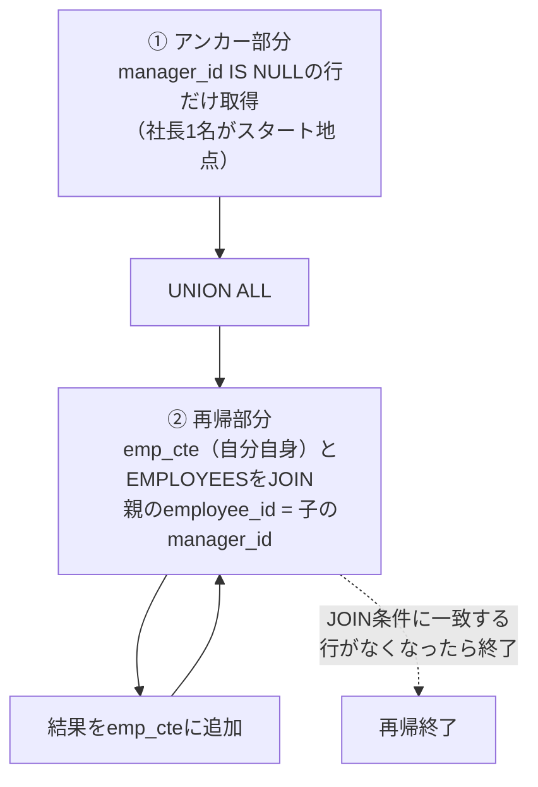
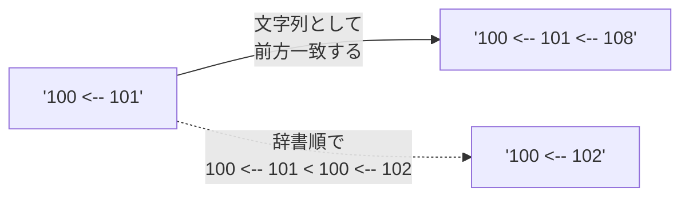
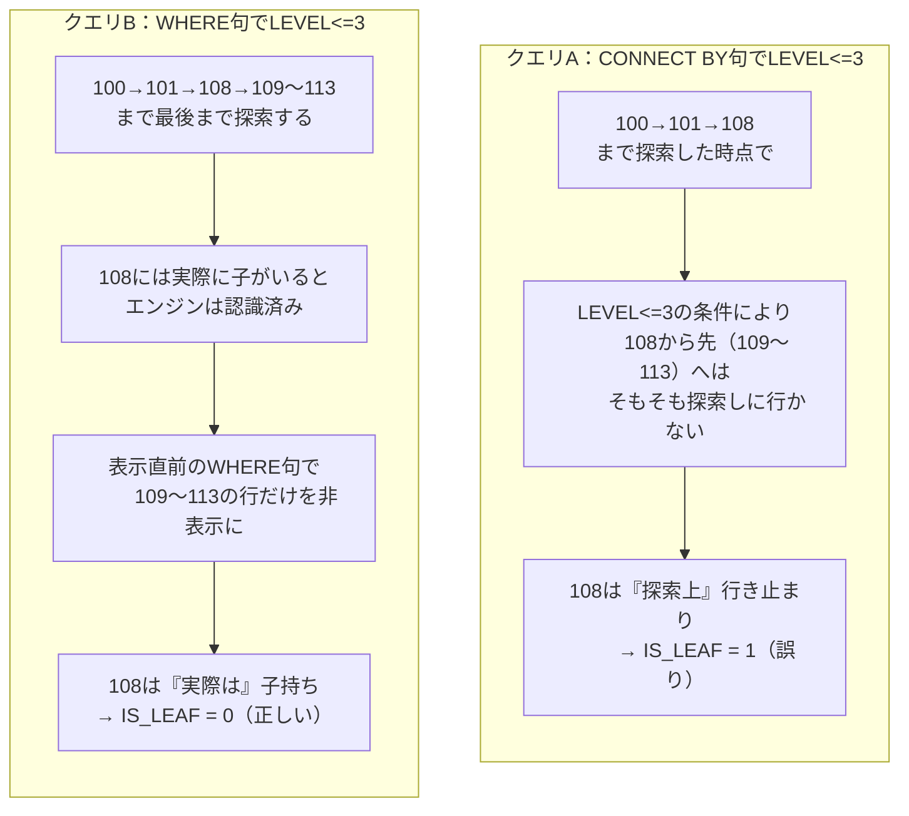
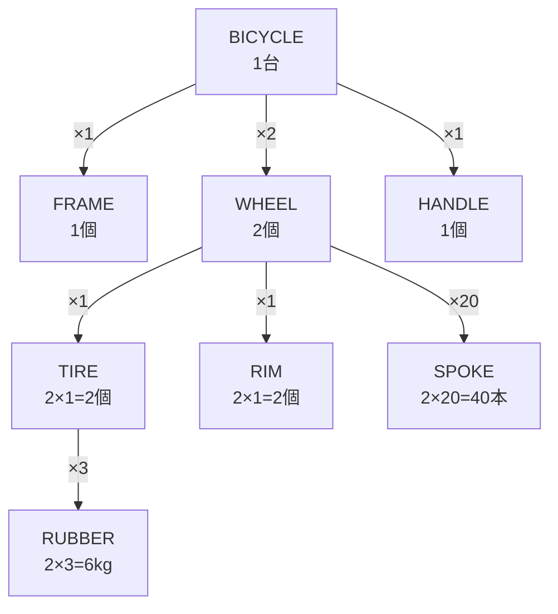
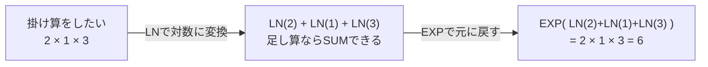
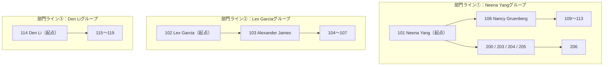

# 【完全版】問題14-8：再帰CTE（WITH句）による階層問い合わせへの書き換え
### 難易度：★★★★☆ (Lv.4)
## 問題
問題14-1では、HRスキーマの`EMPLOYEES`テーブルに対して`START WITH` / `CONNECT BY`（Oracle独自の階層問い合わせ）を使い、社長から末端の従業員までのツリー経路を`EMPLOYEE_TREE`列として取得しました。

今回は全く同じ出力を、**`CONNECT BY`句や`START WITH`句、`PRIOR`キーワードを一切使わず**、ANSI標準構文である「**再帰CTE（`WITH`句の再帰）**」だけを使って再現してください。

**【抽出・編集ルール】**
* **階層の表現**：問題14-1と同様、最上位の上司から現在の従業員までを「 <-- 」で繋いで表示してください。
* 例：`最上位上司 <-- 直属上司 <-- 従業員`
* **開始地点**：社長（`MANAGER_ID` が `NULL` の人物）をルート（根）として開始してください。
* **リレーション**：ある行の`EMPLOYEE_ID`が、次の行の`MANAGER_ID`と一致する関係で繋いでください。
* **禁止事項**：`CONNECT BY`、`START WITH`、`PRIOR`、`SYS_CONNECT_BY_PATH`は使用禁止です。`WITH`句による自己参照（`UNION ALL`）のみで組み立ててください。
* 出力順序は問題14-1の期待する結果と完全に一致させてください。

## 期待する結果
問題14-1と全く同じ結果になります。

| EMPLOYEE_TREE               | 
| --------------------------- | 
| 100                         | 
| 100 <-- 101                 | 
| 100 <-- 101 <-- 108         | 
| 100 <-- 101 <-- 108 <-- 109 | 
| 100 <-- 101 <-- 108 <-- 110 | 
| 100 <-- 101 <-- 108 <-- 111 | 
| 100 <-- 101 <-- 108 <-- 112 | 
| 100 <-- 101 <-- 108 <-- 113 | 
| 100 <-- 101 <-- 200         | 
| 100 <-- 101 <-- 203         | 
| 100 <-- 101 <-- 204         | 
| 100 <-- 101 <-- 205         | 
| 100 <-- 101 <-- 205 <-- 206 | 
| 100 <-- 102                 | 
| 100 <-- 102 <-- 103         | 
| 100 <-- 102 <-- 103 <-- 104 | 
| 100 <-- 102 <-- 103 <-- 105 | 
| 100 <-- 102 <-- 103 <-- 106 | 
| 100 <-- 102 <-- 103 <-- 107 | 
| 100 <-- 114                 | 
| 100 <-- 114 <-- 115         | 
| 100 <-- 114 <-- 116         | 
| 100 <-- 114 <-- 117         | 
| 100 <-- 114 <-- 118         | 
| 100 <-- 114 <-- 119         | 
| 100 <-- 120                 | 
| 100 <-- 120 <-- 125         | 
| 100 <-- 120 <-- 126         | 
| 100 <-- 120 <-- 127         | 
| 100 <-- 120 <-- 128         | 
| 100 <-- 120 <-- 180         | 
| 100 <-- 120 <-- 181         | 
| 100 <-- 120 <-- 182         | 
| 100 <-- 120 <-- 183         | 
| 100 <-- 121                 | 
| 100 <-- 121 <-- 129         | 
| 100 <-- 121 <-- 130         | 
| 100 <-- 121 <-- 131         | 
| 100 <-- 121 <-- 132         | 
| 100 <-- 121 <-- 184         | 
| 100 <-- 121 <-- 185         | 
| 100 <-- 121 <-- 186         | 
| 100 <-- 121 <-- 187         | 
| 100 <-- 122                 | 
| 100 <-- 122 <-- 133         | 
| 100 <-- 122 <-- 134         | 
| 100 <-- 122 <-- 135         | 
| 100 <-- 122 <-- 136         | 
| 100 <-- 122 <-- 188         | 
| 100 <-- 122 <-- 189         | 
| 100 <-- 122 <-- 190         | 
| 100 <-- 122 <-- 191         | 
| 100 <-- 123                 | 
| 100 <-- 123 <-- 137         | 
| 100 <-- 123 <-- 138         | 
| 100 <-- 123 <-- 139         | 
| 100 <-- 123 <-- 140         | 
| 100 <-- 123 <-- 192         | 
| 100 <-- 123 <-- 193         | 
| 100 <-- 123 <-- 194         | 
| 100 <-- 123 <-- 195         | 
| 100 <-- 124                 | 
| 100 <-- 124 <-- 141         | 
| 100 <-- 124 <-- 142         | 
| 100 <-- 124 <-- 143         | 
| 100 <-- 124 <-- 144         | 
| 100 <-- 124 <-- 196         | 
| 100 <-- 124 <-- 197         | 
| 100 <-- 124 <-- 198         | 
| 100 <-- 124 <-- 199         | 
| 100 <-- 145                 | 
| 100 <-- 145 <-- 150         | 
| 100 <-- 145 <-- 151         | 
| 100 <-- 145 <-- 152         | 
| 100 <-- 145 <-- 153         | 
| 100 <-- 145 <-- 154         | 
| 100 <-- 145 <-- 155         | 
| 100 <-- 146                 | 
| 100 <-- 146 <-- 156         | 
| 100 <-- 146 <-- 157         | 
| 100 <-- 146 <-- 158         | 
| 100 <-- 146 <-- 159         | 
| 100 <-- 146 <-- 160         | 
| 100 <-- 146 <-- 161         | 
| 100 <-- 147                 | 
| 100 <-- 147 <-- 162         | 
| 100 <-- 147 <-- 163         | 
| 100 <-- 147 <-- 164         | 
| 100 <-- 147 <-- 165         | 
| 100 <-- 147 <-- 166         | 
| 100 <-- 147 <-- 167         | 
| 100 <-- 148                 | 
| 100 <-- 148 <-- 168         | 
| 100 <-- 148 <-- 169         | 
| 100 <-- 148 <-- 170         | 
| 100 <-- 148 <-- 171         | 
| 100 <-- 148 <-- 172         | 
| 100 <-- 148 <-- 173         | 
| 100 <-- 149                 | 
| 100 <-- 149 <-- 174         | 
| 100 <-- 149 <-- 175         | 
| 100 <-- 149 <-- 176         | 
| 100 <-- 149 <-- 177         | 
| 100 <-- 149 <-- 178         | 
| 100 <-- 149 <-- 179         | 
| 100 <-- 201                 | 
| 100 <-- 201 <-- 202         | 

## 解答例
```sql
WITH emp_cte (employee_id, manager_id, employee_tree) AS (
    -- ① アンカー部分（非再帰）：ルート（社長）を起点にする
    SELECT
        employee_id,
        manager_id,
        TO_CHAR(employee_id) AS employee_tree
    FROM
        hr.employees
    WHERE
        manager_id IS NULL

    UNION ALL

    -- ② 再帰部分：直前までの結果（emp_cte自身）に「子」を1階層ずつ積み増す
    SELECT
        e.employee_id,
        e.manager_id,
        c.employee_tree || ' <-- ' || e.employee_id AS employee_tree
    FROM
        hr.employees e
    INNER JOIN
        emp_cte c ON e.manager_id = c.employee_id
)
SELECT
    employee_tree
FROM
    emp_cte
ORDER BY
    employee_tree
```

## 解説
問題14-1で扱った`CONNECT BY`による階層問い合わせを、今回は標準SQLの「**再帰CTE（Recursive Common Table Expression）**」で書き換えます。`CONNECT BY`はOracle独自構文ですが、再帰CTEはPostgreSQLやSQL Server、MySQLなど多くのDBでも使えるANSI標準構文なので、「他DBへの移行を見据えたコードを書きたい」「複数DBを横断するチームで共通言語のSQLを書きたい」といった場面で重宝します。



### 基本構造：アンカー部分と再帰部分
再帰CTEは、`UNION ALL`を境に「**アンカー部分（Anchor Member）**」と「**再帰部分（Recursive Member）**」の2つのSELECT文で構成されるのが基本です。

| 部分 | 役割 | 今回の該当箇所 |
| :--- | :--- | :--- |
| アンカー部分 | 再帰の出発点（1回だけ実行） | `manager_id IS NULL`（社長）を取得 |
| `UNION ALL` | 両者を積み上げる（`UNION`ではなく`UNION ALL`固定） | - |
| 再帰部分 | 自分自身（`emp_cte`）を参照し、1階層ずつ結果を積み増す | `EMPLOYEES`と`emp_cte`を`manager_id = employee_id`でJOIN |

再帰部分では、`emp_cte`という名前をまだ定義の途中であるにもかかわらず自分自身のFROM句で参照しています。これは「直前の再帰ステップまでに集まった結果セット」を指しており、Oracleは「アンカー部分の結果（1階層目）→それを使って2階層目を生成→それを使って3階層目を生成→…」というループ処理を、JOIN条件に一致する行がなくなるまで内部的に繰り返します。

### CONNECT BYとの対応関係
`CONNECT BY`の構文要素が、再帰CTEのどこに対応するかを整理すると理解が進みます。

| CONNECT BY構文 | 再帰CTEでの対応 |
| :--- | :--- |
| `START WITH manager_id IS NULL` | アンカー部分の`WHERE manager_id IS NULL` |
| `CONNECT BY PRIOR employee_id = manager_id` | 再帰部分の`JOIN`条件`e.manager_id = c.employee_id` |
| `SYS_CONNECT_BY_PATH(employee_id, ' <-- ')` | 再帰部分での文字列連結`c.employee_tree \|\| ' <-- ' \|\| e.employee_id` |
| `LEVEL` | アンカー部分で`1`を、再帰部分で`c.レベル列 + 1`を明示的に持たせる（今回は未使用） |

`SYS_CONNECT_BY_PATH`は「これまでの経路」を自動で保持してくれる便利な関数でしたが、再帰CTEにはこれに相当する専用関数がありません。そのため、`emp_cte`自身が持つ1つ前の`employee_tree`列に、自分の`employee_id`を手動で連結していく作業が必要になります。この「1つ前の計算結果を自分で引き継いで積み上げる」という発想が、再帰CTEを理解する最大のポイントです。

### 出力順序に関する注意点
`CONNECT BY`は、放っておいても「親の直後に子が並ぶ」深さ優先探索の順序で結果を返してくれますが、再帰CTEにはそのような自動整列機能がありません。何も指定しなければ、内部的な処理順（多くの場合レベルごとにまとまった順）で返ってくることがあり、問題14-1と同じ見た目のツリー順にはなりません。

今回は`ORDER BY employee_tree`を末尾に付けることで解決しています。これは、`EMPLOYEES`テーブルの`EMPLOYEE_ID`がすべて3桁の数値で統一されているため、`employee_tree`文字列を辞書順に並べ替えるだけで、結果的に「親の経路が子の経路の先頭一致になる（＝親は必ず子より手前に来る）」「同じ階層の兄弟同士は`EMPLOYEE_ID`の昇順に並ぶ」という、深さ優先探索と全く同じ順序が再現できるためです。



ただしこのテクニックは、桁数が揃った数値IDだからこそ機能する応用技である点に注意してください。もしID体系が桁数不揃い（例：`9`と`10`が混在）だったり英字を含んでいたりすると、辞書順と数値順がズレてしまい、正しいツリー順になりません。実務でこの手法を使う場合は、`LPAD`でゼロ埋めした固定長のIDを経路文字列に使う、あるいは階層ごとの通し番号を別列として持たせてその列でソートするなど、より頑健な方法を検討する必要があります。

### CONNECT BYと再帰CTEの使い分け
問題14-1の解説でも触れた比較表を、再帰CTEを実際に書いた今、改めて整理してみましょう。

| 観点 | `CONNECT BY`（Oracle独自） | 再帰CTE（ANSI標準） |
| :--- | :--- | :--- |
| 標準性 | Oracle専用 | 複数DBで共通利用可 |
| 記述量 | 少ない（`SYS_CONNECT_BY_PATH`等が便利） | やや多い（経路連結・順序を自前で組む） |
| デフォルトの出力順 | 自動で深さ優先順になる | 明示的な`ORDER BY`が必要 |
| 循環参照対策 | `CONNECT BY NOCYCLE`（問題14-7） | `CYCLE`句を自分で追加する必要あり |
| 兄弟間ソート | `ORDER SIBLINGS BY`（問題14-6） | 相当する専用構文はなく、経路文字列の設計で工夫が必要 |

なお、再帰CTEにも循環参照を検知するための`CYCLE`句（例：`CYCLE employee_id SET is_cycle TO 'Y' DEFAULT 'N'`）が用意されており、`NOCYCLE`と似た安全策を講じることができます。こちらはまた別の問題で詳しく扱う予定です。

「短く書きたいならCONNECT BY、複数DBへの移植性や標準SQLへの統一を優先するなら再帰CTE」という使い分けの感覚を、実際に手を動かして両方の構文で同じ結果を作ることで体感できたのではないでしょうか。

## 参考リンク
https://www.shift-the-oracle.com/sql/with.html#with-recursive

----
<br><br>

# 【完全版】問題14-9：階層の深さ制限（枝刈り）― CONNECT BY句とWHERE句によるLEVEL制限の違い
### 難易度：★★★★☆ (Lv.4)
## 問題
経営会議向けの資料として、「社長からマネージャー層まで（3階層だけ）」の簡易組織図を作成することになりました。あわせて、各行が「その系統における末端（それ以上部下がいないポジション）」かどうかを`IS_LEAF`列（1:末端／0:末端でない）として表示してください。

検証用に、HRスキーマの`EMPLOYEES`テーブルの一部を使用します。
```sql
-- 本問題の検証用データソース（クエリの先頭に配置します）
WITH test_employees AS (
    SELECT
        employee_id,
        manager_id,
        first_name,
        last_name
    FROM
        hr.employees
    WHERE
        employee_id IN (100, 101, 102, 103, 104, 105, 106, 107, 108, 109, 110, 111, 112, 113)
)
```
上記の`test_employees`をデータソースとし、`employee_id = 100`（社長）を`START WITH`として、以下の**2種類の方法**でクエリA・クエリBをそれぞれ作成してください。

**【共通ルール】**
* **表示列**：`EMPLOYEE_ID`、`LEVEL`、`EMPLOYEE_NAME`（`LPAD`で階層1つにつき半角スペース2個のインデントを付与した氏名）、`IS_LEAF`（`CONNECT_BY_ISLEAF`を使用）
* **絞り込み**：最終的な表示は「LEVELが3以下」の行のみに絞ってください。
* **並び順**：`ORDER SIBLINGS BY employee_id`で、階層構造を保ったまま深さ優先順に並べてください。

**【2つの絞り込み方法】**
1. **クエリA**：`CONNECT BY`句そのものに`LEVEL <= 3`の条件を加え、**探索自体をレベル3で打ち切る**方法
2. **クエリB**：`CONNECT BY`句には手を加えず最下層まで探索したうえで、`WHERE`句で**表示行だけをレベル3以下に絞り込む**方法

両クエリの`IS_LEAF`列の値を見比べ、どちらが実際の組織構造（108番・103番の配下に本当は部下がいる）を正しく反映しているか確認できるようにしてください。

## 期待する結果
**クエリA（CONNECT BY句でLEVEL制限＝探索そのものを打ち切る）**

| EMPLOYEE_ID | LEVEL | EMPLOYEE_NAME | IS_LEAF |
| ----------- | ----- | ------------------------- | ------- |
| 100 | 1 | Steven King | 0 |
| 101 | 2 | &nbsp;&nbsp;Neena Yang | 0 |
| 108 | 3 | &nbsp;&nbsp;&nbsp;&nbsp;Nancy Gruenberg | **1** |
| 102 | 2 | &nbsp;&nbsp;Lex Garcia | 0 |
| 103 | 3 | &nbsp;&nbsp;&nbsp;&nbsp;Alexander James | **1** |

**クエリB（WHERE句でLEVEL制限＝探索は最後まで行い表示だけ絞る）**

| EMPLOYEE_ID | LEVEL | EMPLOYEE_NAME | IS_LEAF |
| ----------- | ----- | ------------------------- | ------- |
| 100 | 1 | Steven King | 0 |
| 101 | 2 | &nbsp;&nbsp;Neena Yang | 0 |
| 108 | 3 | &nbsp;&nbsp;&nbsp;&nbsp;Nancy Gruenberg | **0** |
| 102 | 2 | &nbsp;&nbsp;Lex Garcia | 0 |
| 103 | 3 | &nbsp;&nbsp;&nbsp;&nbsp;Alexander James | **0** |

表示される行そのものは全く同じ5行ですが、108番（Nancy Gruenberg）と103番（Alexander James）の`IS_LEAF`だけが、クエリAとクエリBで真逆の値になっています。

## 解答例
```sql:クエリA（CONNECT BY句でLEVEL制限）
WITH test_employees AS (
    SELECT
        employee_id,
        manager_id,
        first_name,
        last_name
    FROM
        hr.employees
    WHERE
        employee_id IN (100, 101, 102, 103, 104, 105, 106, 107, 108, 109, 110, 111, 112, 113)
)
SELECT
    employee_id,
    LEVEL,
    LPAD(' ', 2 * (LEVEL - 1), ' ') || first_name || ' ' || last_name AS employee_name,
    CONNECT_BY_ISLEAF AS is_leaf
FROM
    test_employees
START WITH
    manager_id IS NULL
CONNECT BY
    PRIOR employee_id = manager_id
    -- ★探索そのものをレベル3で打ち切る
    AND LEVEL <= 3
ORDER SIBLINGS BY
    employee_id
```
```sql:クエリB（WHERE句でLEVEL制限）
WITH test_employees AS (
    SELECT
        employee_id,
        manager_id,
        first_name,
        last_name
    FROM
        hr.employees
    WHERE
        employee_id IN (100, 101, 102, 103, 104, 105, 106, 107, 108, 109, 110, 111, 112, 113)
)
SELECT
    employee_id,
    LEVEL,
    LPAD(' ', 2 * (LEVEL - 1), ' ') || first_name || ' ' || last_name AS employee_name,
    CONNECT_BY_ISLEAF AS is_leaf
FROM
    test_employees
-- ★探索は最下層まで行い、表示行だけをここで絞り込む
WHERE
    LEVEL <= 3
START WITH
    manager_id IS NULL
CONNECT BY
    PRIOR employee_id = manager_id
ORDER SIBLINGS BY
    employee_id
```
## 解説
問題14-1の解説で「初心者が陥りやすい落とし穴」として軽く触れた、`WHERE`句と`CONNECT BY`句の**効くタイミングの違い**を、今回は「階層の深さ制限（枝刈り）」というテーマで深掘りします。



### なぜ結果が変わるのか
`CONNECT BY`句に書いた条件と、`WHERE`句に書いた条件は、SQLエンジンが処理する**タイミングがまったく異なります**。

| 条件の書き場所 | 処理されるタイミング | 今回への影響 |
| :--- | :--- | :--- |
| `CONNECT BY ... AND LEVEL <= 3` | 木を**組み立てている最中**に効く | レベル4以降の行を**そもそも生成しない**。108・103の視点では「これ以上辿るべき子がない」ことになり、`CONNECT_BY_ISLEAF`が1になる |
| `WHERE LEVEL <= 3` | 木を**組み立て終わった後**に効く | 108・103の配下（109〜113、104〜107）まで内部的には正しく展開・認識された**うえで**、最後に表示行だけが間引かれる。`CONNECT_BY_ISLEAF`は本来の（正しい）値のまま |

クエリAは、いわば「そもそも3階層より下の存在を知らない」状態でツリーを作っているため、108番や103番は本当は部下がいるにもかかわらず、そのクエリの世界の中では「一番下の末端」に見えてしまいます。一方クエリBは、一度は全階層をきちんと辿ったうえで、最後に「見せる行」だけを絞り込んでいるため、`IS_LEAF`は実態を正しく反映します。

### 使い分けの指針
どちらが「正解」というわけではなく、**何を優先したいか**によって使い分けます。

| 優先したいこと | おすすめの方法 |
| :--- | :--- |
| **パフォーマンス**（数万件規模の巨大な組織・部品構成表で、深い階層はそもそも見る必要がない） | クエリA（`CONNECT BY`側でLEVEL制限）。探索範囲そのものを狭められるため高速 |
| **正確性**（表示は絞りつつも、「本当に末端かどうか」の情報は正しく残したい） | クエリB（`WHERE`句でLEVEL制限）。ただし巨大なツリーでは探索コストが下がらない点に注意 |

このように、`CONNECT BY`句の中にフィルタ条件を書くか、外側の`WHERE`句に書くかは、単なる書き方の好みではなく、**「探索の途中で打ち切るか」「探索し終えてから間引くか」という処理の本質そのものを変えてしまう**という点を覚えておいてください。問題14-1の落とし穴（部署を除外する`WHERE`条件がツリーを分断してしまう）と同様に、「階層問い合わせでは`WHERE`句の置き場所が結果に直結する」という原則の別バリエーションです。

なお、もし「探索コストは抑えつつ、`IS_LEAF`の正確性も担保したい」という欲張りな要件がある場合は、`CONNECT_BY_ISLEAF`に頼らず、`NOT EXISTS`を使った相関サブクエリ（`WHERE NOT EXISTS (SELECT 1 FROM test_employees c WHERE c.manager_id = p.employee_id)`）で独自に「本当に子がいるか」を判定する、という設計も実務では有効な選択肢です。

----
<br><br>

# 【完全版】問題14-10：部品表（BOM）データの数量展開 ― 階層を跨いだ累積乗算

### 難易度：★★★★☆ (Lv.4)
## 問題
製造業でよく使われる「部品表（BOM：Bill Of Materials）」を題材にした問題です。ある製品は複数の部品から構成され、その部品自体もさらに下位の部品から構成される、という**親子関係を持つ数量データ**を扱います。

検証用データとして、自転車（BICYCLE）の部品構成表を用意します。`QTY_PER_PARENT`は「**親部品1個を作るのに、この部品が何個（または何kg）必要か**」を表す数量です。
```sql
-- 本問題の検証用データソース（クエリの先頭に配置します）
WITH bom_master (part_id, parent_part_id, part_name, qty_per_parent) AS (
    SELECT 1, NULL, 'BICYCLE', 1 FROM dual UNION ALL  -- 完成品（自転車1台）
    SELECT 2, 1,    'FRAME',   1 FROM dual UNION ALL  -- 自転車1台につきフレーム1個
    SELECT 3, 1,    'WHEEL',   2 FROM dual UNION ALL  -- 自転車1台につき車輪2個
    SELECT 4, 1,    'HANDLE',  1 FROM dual UNION ALL  -- 自転車1台につきハンドル1個
    SELECT 5, 3,    'TIRE',    1 FROM dual UNION ALL  -- 車輪1個につきタイヤ1個
    SELECT 6, 3,    'RIM',     1 FROM dual UNION ALL  -- 車輪1個につきリム1個
    SELECT 7, 3,    'SPOKE',  20 FROM dual UNION ALL  -- 車輪1個につきスポーク20本
    SELECT 8, 5,    'RUBBER',  3 FROM dual            -- タイヤ1個につきゴム素材3kg
)
```
上記の`bom_master`をデータソースとして、以下のルールで**自転車を1台作るために最終的に何個（何kg）ずつの部品が必要か**を算出してください。

**【抽出・編集ルール】**
* **開始地点**：`PARENT_PART_ID`が`NULL`の部品（BICYCLE本体）をルートとして開始してください。
* **PART_TREE**：階層が1つ下がるごとに半角スペース2つのインデントを付与し、部品名を表示してください。
* **TOTAL_QTY**：**ルートから該当部品までの経路上にある`QTY_PER_PARENT`をすべて掛け合わせた、最終的な累積所要数**を算出してください。
  * 例：`SPOKE`は「自転車1台 → 車輪2個 → 車輪1個につきスポーク20本」なので、`2 × 20 = 40`本が正解です。
  * 例：`RUBBER`は「自転車1台 → 車輪2個 → タイヤ1個 → タイヤ1個につきゴム3kg」なので、`2 × 1 × 3 = 6`kgが正解です。
* **ソート順**：`PART_ID`昇順の深さ優先探索順で表示してください。

## 期待する結果
| PART_ID | PART_TREE | QTY_PER_PARENT | TOTAL_QTY |
| ------- | ------------------------- | --------------- | --------- |
| 1 | BICYCLE | 1 | 1 |
| 2 | &nbsp;&nbsp;FRAME | 1 | 1 |
| 3 | &nbsp;&nbsp;WHEEL | 2 | 2 |
| 5 | &nbsp;&nbsp;&nbsp;&nbsp;TIRE | 1 | 2 |
| 8 | &nbsp;&nbsp;&nbsp;&nbsp;&nbsp;&nbsp;RUBBER | 3 | 6 |
| 6 | &nbsp;&nbsp;&nbsp;&nbsp;RIM | 1 | 2 |
| 7 | &nbsp;&nbsp;&nbsp;&nbsp;SPOKE | 20 | 40 |
| 4 | &nbsp;&nbsp;HANDLE | 1 | 1 |

## 解答例
```sql:例1：再帰的WITH句を使用（積み上げ式の累積乗算）
WITH bom_master (part_id, parent_part_id, part_name, qty_per_parent) AS (
    SELECT 1, NULL, 'BICYCLE', 1 FROM dual UNION ALL
    SELECT 2, 1,    'FRAME',   1 FROM dual UNION ALL
    SELECT 3, 1,    'WHEEL',   2 FROM dual UNION ALL
    SELECT 4, 1,    'HANDLE',  1 FROM dual UNION ALL
    SELECT 5, 3,    'TIRE',    1 FROM dual UNION ALL
    SELECT 6, 3,    'RIM',     1 FROM dual UNION ALL
    SELECT 7, 3,    'SPOKE',  20 FROM dual UNION ALL
    SELECT 8, 5,    'RUBBER',  3 FROM dual
),
bom_cte (part_id, part_name, qty_per_parent, lvl, total_qty) AS (
    -- ① アンカー部分：ルート（BICYCLE本体）を起点にする
    SELECT
        part_id,
        part_name,
        qty_per_parent,
        1 AS lvl,
        qty_per_parent AS total_qty  -- ルートの累積量＝自分自身の数量
    FROM
        bom_master
    WHERE
        parent_part_id IS NULL

    UNION ALL

    -- ② 再帰部分：「親の累積所要数」×「自分の所要数」を積み上げる
    SELECT
        m.part_id,
        m.part_name,
        m.qty_per_parent,
        c.lvl + 1,
        c.total_qty * m.qty_per_parent AS total_qty
    FROM
        bom_cte c
    INNER JOIN
        bom_master m ON m.parent_part_id = c.part_id
)
    SEARCH DEPTH FIRST BY part_id SET ordering_col
SELECT
    part_id,
    LPAD(' ', 2 * (lvl - 1), ' ') || part_name AS part_tree,
    qty_per_parent,
    total_qty
FROM
    bom_cte
ORDER BY
    ordering_col
```
```sql:例2：CONNECT BY句とSYS_CONNECT_BY_PATHを使用（Oracle専用の裏技）
WITH bom_master (part_id, parent_part_id, part_name, qty_per_parent) AS (
    SELECT 1, NULL, 'BICYCLE', 1 FROM dual UNION ALL
    SELECT 2, 1,    'FRAME',   1 FROM dual UNION ALL
    SELECT 3, 1,    'WHEEL',   2 FROM dual UNION ALL
    SELECT 4, 1,    'HANDLE',  1 FROM dual UNION ALL
    SELECT 5, 3,    'TIRE',    1 FROM dual UNION ALL
    SELECT 6, 3,    'RIM',     1 FROM dual UNION ALL
    SELECT 7, 3,    'SPOKE',  20 FROM dual UNION ALL
    SELECT 8, 5,    'RUBBER',  3 FROM dual
),
bom_tree AS (
    SELECT
        part_id,
        part_name,
        qty_per_parent,
        LEVEL AS lvl,
        -- ルートから自分自身までの経路を「/1/3/5/8」のような文字列にしておく
        SYS_CONNECT_BY_PATH(part_id, '/') AS part_path
    FROM
        bom_master
    START WITH
        parent_part_id IS NULL
    CONNECT BY
        PRIOR part_id = parent_part_id
)
SELECT
    t.part_id,
    LPAD(' ', 2 * (t.lvl - 1), ' ') || t.part_name AS part_tree,
    t.qty_per_parent,
    -- 経路上に含まれる部品（＝先祖＋自分自身）のQTY_PER_PARENTだけを
    -- LN→SUM→EXPで「掛け算」に変換して合計する
    ROUND(
        EXP(
            (SELECT SUM(LN(m.qty_per_parent))
             FROM   bom_master m
             WHERE  INSTR(t.part_path || '/', '/' || m.part_id || '/') > 0)
        )
    ) AS total_qty
FROM
    bom_tree t
ORDER BY
    t.part_path
```
## 解説
今回は階層問い合わせを、組織図ではなく「**部品表（BOM）の数量展開**」に応用します。製造業の生産管理システムでは、「完成品を1台作るには、末端の原材料がそれぞれ何個・何kg必要か」を自動計算する必要があり、これはまさに階層問い合わせの主要な活用シーンの一つです。



### 累積「乗算」は、累積「加算」より一段厄介
問題14-3（配下の集計分析）などで扱った「配下の給与合計」は`SUM`で単純に足し合わせれば済みましたが、今回の`TOTAL_QTY`は**ルートから自分自身までの経路上にあるすべての`QTY_PER_PARENT`を掛け合わせる**必要があります。これが「累積加算」と「累積乗算」の決定的な違いです。

### 例1：再帰的WITH句 ―「その場で掛けながら積み上げる」
最も直感的なアプローチが、再帰CTEの中で「**親の累積所要数 × 自分の所要数**」をその場で計算し、次の階層へ引き継いでいく方法です。
```sql
c.total_qty * m.qty_per_parent AS total_qty
```
アンカー部分ではルート自身の`QTY_PER_PARENT`（＝1）がそのまま累積値になり、再帰が1階層進むたびに、直前までの累積値に新しい部品の所要数を掛け算していきます。`WHEEL`の累積値（2）が`TIRE`に引き継がれ、`TIRE`の累積値（2×1=2）が`RUBBER`に引き継がれて最終的に`2×3=6`になる、という「バケツリレー式」の掛け算が、再帰の1ステップごとに自然に実現できます。この方式は考え方がシンプルで、掛け算以外の複雑な計算（条件による倍率変更など）を組み込みたい場合にも柔軟に対応できます。

### 例2：CONNECT BYの場合 ―「掛け算」がないので「対数の足し算」で代用する
一方`CONNECT BY`には、再帰CTEのように「1階層ごとに値を引き継いで計算する」という仕組みがありません。かといって、Oracle SQLには残念ながら`SUM`はあっても **`PRODUCT`（総乗）を計算する集計関数が存在しません**。

そこで使われるのが、高校数学で習う対数の性質を利用した古典的なテクニックです。



`LN(x)`は自然対数、`EXP(x)`はその逆演算です。対数の性質上、「複数の数を掛け合わせた結果の対数」は「それぞれの数の対数を足し合わせたもの」と等しくなります（`LN(a×b) = LN(a) + LN(b)`）。この性質を利用し、①`SUM`が使えるように各数量をいったん`LN`で対数に変換して合計し、②最後に`EXP`で元の掛け算の結果に戻す、という2段階の変換で「集計関数がなくても掛け算の合計（総乗）を求める」ことができます。

もう1つのポイントは、「経路上の部品だけ」を`SUM`の対象に絞り込む部分です。
```sql
WHERE INSTR(t.part_path || '/', '/' || m.part_id || '/') > 0
```
`SYS_CONNECT_BY_PATH`で作った`/1/3/5/8`のような経路文字列の前後に`/`を補うことで、`/3/`のような形で`PART_ID`が経路の中に含まれているかを`INSTR`で判定しています。前後を`/`で挟んで比較しているのは、単純な文字列一致だと`PART_ID=1`が`PART_ID=13`の一部として誤検出されてしまう事故を防ぐためです。この「経路文字列＋`INSTR`」は、問題14-1で紹介した`SYS_CONNECT_BY_PATH`の応用テクニックとして覚えておくと、様々な場面（先祖・子孫判定など）に応用が利きます。

| | 例1：再帰的WITH句 | 例2：CONNECT BY + LN/EXP |
| :--- | :--- | :--- |
| 考え方 | 1階層ごとに値を引き継いで掛け算 | 経路全体をまとめて対数変換→合計→指数変換 |
| 可読性 | ◎（累積のロジックが直感的） | △（LN/EXPの意図を知らないと読みにくい） |
| 拡張性 | ◎（掛け算以外の複雑な計算にも対応しやすい） | △（あくまで「総乗」専用のテクニック） |
| 標準性 | ANSI標準（他DBでも同じ書き方が使える） | Oracle独自構文（`SYS_CONNECT_BY_PATH`）に依存 |

実務では、素直に書けて拡張性も高い「例1：再帰的WITH句」を選ぶ場面が多いはずですが、「Oracle SQLには総乗の集計関数がなく、`LN`・`EXP`で代用する」という知識自体は、`CONNECT BY`以外の集計処理（例えば`GROUP BY`で総乗を求めたい場合など）でも使える汎用的なテクニックなので、引き出しの一つとして覚えておいて損はありません。

なお、`QTY_PER_PARENT`に0以下の値が含まれると`LN`がエラーまたは未定義になってしまう（`LN(0)`は定義されず、負数は対数が取れない）ため、例2の手法は「数量は必ず正の数である」ことが保証されたデータでのみ安全に使えるという制約がある点にも注意してください。

こうしたBOMの数量展開は、実際の生産管理システムで「受注が入った際に、必要な原材料や部品の発注数量を自動計算する」処理（MRP：資材所要量計画）の中核ロジックとして使われています。

----
<br><br>

# 問題14-11：CONNECT_BY_ROOTによる「各従業員の最終決裁者」一括取得
### 難易度：★★★☆☆ (Lv.3)
## 問題
経費精算システムの改修プロジェクトから、次のような要件が届きました。

> 「弊社の経費精算は、社長（Steven King）まで回すような大掛かりな決裁フローではなく、**各部門のトップ（社長に直属するマネージャー）が最終決裁者**として承認する運用です。全従業員について、自分がどの部門ラインに属し、最終的に誰の承認で決裁が下りるのかを一覧化してください。」

検証用に、HRスキーマの`EMPLOYEES`テーブルの一部を使用します。
```sql
-- 本問題の検証用データソース（クエリの先頭に配置します）
WITH test_employees AS (
    SELECT
        employee_id,
        manager_id,
        first_name,
        last_name
    FROM
        hr.employees
    WHERE
        employee_id IN (
            101, 102, 103, 104, 105, 106, 107, 108, 109, 110, 111, 112, 113,
            114, 115, 116, 117, 118, 119, 200, 203, 204, 205, 206
        )
)
```
上記の`test_employees`をデータソースとし、以下のルールで一括取得するクエリを作成してください。

**【抽出・編集ルール】**
* **開始地点**：**社長（`EMPLOYEE_ID = 100`）に直属するマネージャー**（`MANAGER_ID = 100`の従業員）を、それぞれ独立した部門ラインの起点（ルート）としてください。
* **EMPLOYEE_TREE**：階層が1つ下がるごとに半角スペース2つのインデントを付与した氏名を表示してください（起点となった部門トップ自身は、インデント0の状態で1行表示してください）。
* **FINAL_APPROVER_NAME**：その従業員が最終的に決裁を仰ぐべき「部門トップ（起点となったマネージャー）」の氏名を、**1回の階層問い合わせだけで**全行に付与してください。
* **表示順**：部門（ルート）ごとにまとまるように、かつ各部門内は深さ優先探索の順序（`EMPLOYEE_ID`昇順）で表示してください。

## 期待する結果
| EMPLOYEE_ID | LEVEL | EMPLOYEE_TREE | FINAL_APPROVER_NAME |
| ----------- | ----- | -------------------------- | -------------------- |
| 101 | 1 | Neena Yang | Neena Yang |
| 108 | 2 | &nbsp;&nbsp;Nancy Gruenberg | Neena Yang |
| 109 | 3 | &nbsp;&nbsp;&nbsp;&nbsp;Daniel Faviet | Neena Yang |
| 110 | 3 | &nbsp;&nbsp;&nbsp;&nbsp;John Chen | Neena Yang |
| 111 | 3 | &nbsp;&nbsp;&nbsp;&nbsp;Ismael Sciarra | Neena Yang |
| 112 | 3 | &nbsp;&nbsp;&nbsp;&nbsp;Jose Manuel Urman | Neena Yang |
| 113 | 3 | &nbsp;&nbsp;&nbsp;&nbsp;Luis Popp | Neena Yang |
| 200 | 2 | &nbsp;&nbsp;Jennifer Whalen | Neena Yang |
| 203 | 2 | &nbsp;&nbsp;Susan Jacobs | Neena Yang |
| 204 | 2 | &nbsp;&nbsp;Hermann Brown | Neena Yang |
| 205 | 2 | &nbsp;&nbsp;Shelley Higgins | Neena Yang |
| 206 | 3 | &nbsp;&nbsp;&nbsp;&nbsp;William Gietz | Neena Yang |
| 102 | 1 | Lex Garcia | Lex Garcia |
| 103 | 2 | &nbsp;&nbsp;Alexander James | Lex Garcia |
| 104 | 3 | &nbsp;&nbsp;&nbsp;&nbsp;Bruce Miller | Lex Garcia |
| 105 | 3 | &nbsp;&nbsp;&nbsp;&nbsp;David Williams | Lex Garcia |
| 106 | 3 | &nbsp;&nbsp;&nbsp;&nbsp;Valli Jackson | Lex Garcia |
| 107 | 3 | &nbsp;&nbsp;&nbsp;&nbsp;Diana Nguyen | Lex Garcia |
| 114 | 1 | Den Li | Den Li |
| 115 | 2 | &nbsp;&nbsp;Alexander Khoo | Den Li |
| 116 | 2 | &nbsp;&nbsp;Shelli Baida | Den Li |
| 117 | 2 | &nbsp;&nbsp;Sigal Tobias | Den Li |
| 118 | 2 | &nbsp;&nbsp;Guy Himuro | Den Li |
| 119 | 2 | &nbsp;&nbsp;Karen Colmenares | Den Li |

## 解答例
```sql
WITH test_employees AS (
    SELECT
        employee_id,
        manager_id,
        first_name,
        last_name
    FROM
        hr.employees
    WHERE
        employee_id IN (
            101, 102, 103, 104, 105, 106, 107, 108, 109, 110, 111, 112, 113,
            114, 115, 116, 117, 118, 119, 200, 203, 204, 205, 206
        )
)
SELECT
    employee_id,
    LEVEL,
    LPAD(' ', 2 * (LEVEL - 1), ' ') || first_name || ' ' || last_name AS employee_tree,
    -- 起点（部門トップ）の氏名を、階層問い合わせ1回だけで全行にコピーする
    CONNECT_BY_ROOT(first_name || ' ' || last_name) AS final_approver_name
FROM
    test_employees
START WITH
    manager_id = 100
CONNECT BY
    PRIOR employee_id = manager_id
ORDER SIBLINGS BY
    employee_id
```
## 解説
今回のテーマは、問題14-5で紹介した`CONNECT_BY_ROOT`を、**本来の得意分野であるトップダウン探索**で使うとどれだけシンプルになるか、という「伏線回収」の問題です。



問題14-5では「末端の従業員（起点）から社長（終着点）に向かって遡る」というボトムアップ探索だったため、`CONNECT_BY_ROOT`で取れるのは「起点である自分自身」の情報にとどまり、本当に知りたかった「終着点（社長）」の情報は、`manager_id IS NULL`を条件にしたスカラ・サブクエリで別途取得する必要がありました。

今回は逆に、**探索の起点（`START WITH`）そのものを「知りたい情報（各部門のトップ）」に設定する**ことで、`CONNECT_BY_ROOT`だけで目的の値を一撃で取得できます。
```sql
START WITH
    manager_id = 100
CONNECT BY
    PRIOR employee_id = manager_id
```
`START WITH manager_id = 100`は、「社長に直属するマネージャー全員」を同時に複数の起点（ルート）として指定しています。`CONNECT_BY_ROOT`は「その行がどの起点から辿り着いたか」を記憶している擬似列（正確には演算子）なので、`101 Neena Yang`から辿り着いた行にはすべて`Neena Yang`が、`102 Lex Garcia`から辿り着いた行にはすべて`Lex Garcia`が、それぞれ自動的にコピーされます。

| 問題14-5（ボトムアップ） | 今回・問題14-11（トップダウン） |
| :--- | :--- |
| 起点＝末端の従業員、終着点＝社長 | 起点＝各部門のトップ、終着点＝末端の従業員 |
| `CONNECT_BY_ROOT`で取れるのは「起点（自分自身）」の情報 | `CONNECT_BY_ROOT`で取れるのが「まさに知りたかった情報（部門トップ）」と一致する |
| 終着点（社長）はサブクエリで別途取得が必要 | サブクエリ不要。`CONNECT_BY_ROOT`だけで完結 |

このように、`CONNECT_BY_ROOT`は「**探索を開始した行の情報を、末端の行にまで一括でコピーする**」という単純な機能ですが、`START WITH`に何を指定するか次第で「社長を全員に配る」「部門トップを全員に配る」「特定のプロジェクトリーダーを配下全員に配る」など、様々な「起点情報の一括配布」に応用できます。

### 補足：STARTWITHの行同士に親子関係がある場合の注意
今回は`START WITH manager_id = 100`で指定した101・102・114…といった複数の起点同士が、互いに上司・部下の関係になっていない（＝それぞれ独立したライン）ため、各従業員は必ずどこか1つの部門ラインにのみ属し、結果も重複なくきれいに出力されます。

もし仮に`START WITH`の条件が、指定した行同士に親子関係を含んでしまうケース（例えば「社長」と「社長直属のマネージャー」を両方`START WITH`の対象にしてしまった場合）だと、社長配下のマネージャー以下の従業員は「社長を起点とした系列」と「マネージャー自身を起点とした系列」の**両方**に二重に出現してしまいます。複数の起点を指定する際は、それらの起点同士が階層的に独立している（片方がもう片方の祖先・子孫になっていない）ことを事前に確認しておくのが安全です。

このテクニックは、今回の決裁権限の一括判定以外にも、「あるプロジェクトのリーダー（起点）を、そのプロジェクトに参加する全メンバーの行に一括表示する」プロジェクト管理システムの担当者表示、「各フランチャイズ本部（起点）を、そのグループに属する全店舗の行に一括表示する」フランチャイズ店舗管理システムなど、「起点の情報を配下全体にコピーしたい」場面全般で活用できます。


