# 問題13-1：列から行への変換（UNPIVOT）
### 難易度：★★★☆☆ (Lv.3)
## 問題
SHスキーマの`SUPPLEMENTARY_DEMOGRAPHICS`テーブルを使用して、顧客ごとの属性データ（居住年数、興味のあるスポーツなど）を縦持ち（行形式）に変換してください。

**【条件およびルール】**
* 変換後の列名は、項目名を **`ITEM`**、その内容を **`VALUE`** としてください。
* 対象項目：`YRS_RESIDENCE`, `AFFINITY_CARD`, `CRICKET`, `BASEBALL`, `TENNIS`, `SOCCER`, `GOLF`, `UNKNOWN`, `MISC`, `EDUCATION`, `OCCUPATION`, `HOUSEHOLD_SIZE`, `COMMENTS`
* 今回は `CUST_ID = 100005` のデータのみを取得対象とします。

## 期待する結果
| CUST_ID | ITEM            | VALUE                                                                                                       |
| ------- | ---------------- | -------------------------------------------------------------------------------------------------------------- |
| 100005    | AFFINITY_CARD      | 1                                                                                                              |
| 100005    | BASEBALL            | 0                                                                                                              |
| 100005    | COMMENTS            | Affinity card is a great idea. But your store is still too expensive. I am tired of your lousy junk mail.       |
| 100005    | CRICKET             | 0                                                                                                              |
| 100005    | EDUCATION           | Assoc-A                                                                                                          |
| 100005    | GOLF                | 1                                                                                                              |
| 100005    | HOUSEHOLD_SIZE      | 3                                                                                                              |
| 100005    | MISC                | 0                                                                                                              |
| 100005    | OCCUPATION          | Crafts                                                                                                           |
| 100005    | SOCCER              | 1                                                                                                              |
| 100005    | TENNIS              | 1                                                                                                              |
| 100005    | UNKNOWN             | 0                                                                                                              |
| 100005    | YRS_RESIDENCE       | 5                                                                                                              |

## 解答例
```sql
WITH sd AS ( -- unpivotするためにこのwith句で型を統一する
    SELECT
        cust_id,
        education,
        occupation,
        household_size,
        to_char(yrs_residence) AS yrs_residence,
        to_char(affinity_card) AS affinity_card,
        to_char(cricket)       AS cricket,
        to_char(baseball)      AS baseball,
        to_char(tennis)        AS tennis,
        to_char(soccer)        AS soccer,
        to_char(golf)          AS golf,
        to_char(unknown)       AS unknown,
        to_char(misc)          AS misc,
        comments
    FROM
        sh.supplementary_demographics
    WHERE
        cust_id = 100005
)
SELECT
    cust_id,
    item,
    value
FROM
    sd UNPIVOT ( value
        FOR item
    IN ( education AS 'EDUCATION',
         occupation AS 'OCCUPATION',
         household_size AS 'HOUSEHOLD_SIZE',
         yrs_residence AS 'YRS_RESIDENCE',
         affinity_card AS 'AFFINITY_CARD',
         cricket AS 'CRICKET',
         baseball AS 'BASEBALL',
         tennis AS 'TENNIS',
         soccer AS 'SOCCER',
         golf AS 'GOLF',
         unknown AS 'UNKNOWN',
         misc AS 'MISC',
         comments AS 'COMMENTS' ) )
ORDER BY
    cust_id,
    item
```
## 解説
今回は、テーブルの形を根本から変える「UNPIVOT（列から行への変換）」です。通常のテーブルは「1レコード＝1つの対象（顧客など）」ですが、分析の現場では「1レコード＝1つの属性」という形に変換したい場面があります。これを「横持ち（ワイド型）」から「縦持ち（ロング型）」への変換と呼びます。

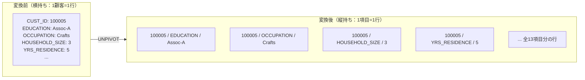

このクエリのポイントは、`UNPIVOT`を行う前段の`WITH`句（CTE）にあります。`UNPIVOT`で1つの列（今回の`VALUE`列）にまとめられるデータは、すべて同じデータ型でなければなりません。`YRS_RESIDENCE`は数値型、`EDUCATION`は文字列型、`COMMENTS`は長い文字列型と、そのままでは型がバラバラです。これらを混ぜようとすると、SQLは「型が違うものを同じ列に入れられない」とエラーを返します。そのため解答例では`TO_CHAR()`を使い、すべての項目を一旦「文字列」という同じ器に移し替えています。この下準備をできるかどうかが、このクエリの分かれ道です。

| 元の列 | 元のデータ型 | 変換後 |
| :--- | :--- | :--- |
| `YRS_RESIDENCE` | 数値型 | `TO_CHAR`で文字列化 |
| `EDUCATION` | 文字列型 | そのまま（既に文字列） |
| `COMMENTS` | 長い文字列型 | そのまま（既に文字列） |

`UNPIVOT`句の中身を分解してみましょう。
```sql
UNPIVOT (
    value        -- データそのものが入る列の名前
    FOR item     -- 元の「列名」が入る列の名前
    IN ( ... )   -- 行に変換したい「列」をリストアップ
)
```
`value`には元々の各セルに入っていた中身（Assoc-A, Crafts, 5など）が格納されます。`item`には「この値は元々どの列のものだったか」を示すラベルが入り、`IN`句で`education AS 'EDUCATION'`と書くことでラベル名を自由に指定できます。

この縦持ち変換は、いくつかの場面で役立ちます。「Q1, Q2, Q3...」と並んだアンケート結果の列を縦に並べ替えることで、「全設問を通して最も多い回答は何か」を1つの`GROUP BY`で集計できるようになります。属性が非常に多い（100列以上あるような）マスタを扱いやすくするために、ID・属性名・値という3列だけの形（EAVモデル）に変換して処理することもあります。また、多くのモダンな分析ツール（TableauやPower BIなど）は、横に長い表よりも縦に長い表の方が扱いやすい設計になっているため、BIツールへのデータ連携にも向いています。

CUST_ID = 100005の顧客一人に対し、元々は1行しかなかったデータが13行（13項目分）に増えています。「列をデータの種類としてではなく、1つのレコードとして扱う」ことで、SQLでのフィルタリングや並び替えの自由度が上がります。

## 参考リンク
https://www.youtube.com/watch?v=htZRVbSwEjw
https://codezine.jp/article/detail/4985

----
<br><br>

# 問題13-2：行から列への変換（PIVOT）
### 難易度：★★★☆☆ (Lv.3)
## 問題
COスキーマの`ORDERS`テーブルと`ORDER_ITEMS`テーブルを使用して、年度別の注文総額を算出してください。

**【条件および算出ルール】**
* **売上計算**：1注文あたりの金額は、`ORDER_ITEMS`テーブルの **`UNIT_PRICE`（単価） × `QUANTITY`（数量）** の合計とします。
* **年度の特定**：`ORDERS`テーブルの `ORDER_TMS` から年を抽出してください。
* **横持ち変換**：算出した年度ごとの総額を、「2021年（`Y2021`）」と「2022年（`Y2022`）」の**2つの列**に振り分けて表示してください。

## 期待する結果
| Y2021       | Y2022      |
| ------------ | ------------ |
| 222438.11      | 86160.42       |
## 解答例
```sql
SELECT
    *
FROM
    (
        WITH order_total AS (
            SELECT
                order_id,
                SUM(unit_price * quantity) AS total
            FROM
                co.order_items
            GROUP BY
                order_id
        )
        SELECT
            extract(YEAR FROM o.order_tms)  AS yr,
            SUM(ot.total)                   ttl
        FROM
            order_total ot
            LEFT JOIN co.orders   o ON ot.order_id = o.order_id
        GROUP BY
            extract(YEAR FROM o.order_tms)
    ) PIVOT (
        SUM(ttl)
        FOR yr
        IN ( 2021 AS y2021, 2022 AS y2022 )
    )
```

## 解説
前問（13-1）の`UNPIVOT`とは対照的に、今回は縦に並んだデータを横に広げる`PIVOT`（ピボット）のテクニックです。実務において、年次報告書やダッシュボード用のデータを作成する際、「年」や「月」を横に並べて比較しやすくする処理はよく行われます。

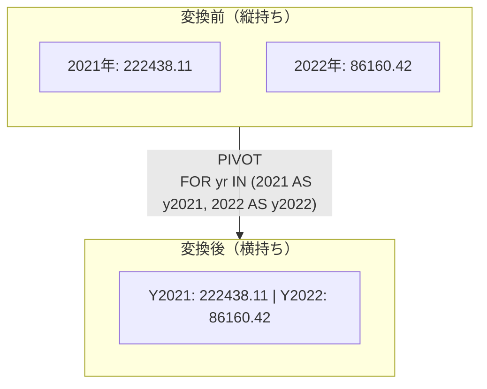

`PIVOT`は、集計した結果（行）を新しい「列名」として再定義する操作です。このクエリは、外側に向かって段階的にデータを作り上げています。内側の`WITH`句（`order_total`）でまずは明細単位の計算を行い、注文IDごとに「単価×個数」を合計して注文ごとの総額を出します。中間クエリで注文テーブルと結合し、「2021年」と「2022年」それぞれの合計金額を算出します。この時点ではまだデータは2行（縦）に並んでいます。外側の`PIVOT`句で、縦に並んでいた年（2021, 2022）を横に倒して列名に変換します。

`PIVOT`句の内側を見てみましょう。
```sql
PIVOT (
    SUM(ttl)                               -- 列の交差点に置きたい「値」
    FOR yr                                 -- 列名に変換したい「元の列」
    IN ( 2021 AS y2021, 2022 AS y2022 )    -- どの値を列にするか、その名前は何か
)
```
`FOR yr`で「どの列の値を横に並べたいか」を指定し、`IN (...)`で指定した値だけが列になります。`AS`を使うことで、期待する結果のような`Y2021`という見やすい列名に変更できます。

`PIVOT`はクロス集計表を作成するための代表的な手段です。行に「商品カテゴリ」、列に「1月、2月、3月...」を並べて月ごとの売上変化を見る売上推移表、行に「倉庫名」、列に「サイズ（S, M, L）」を並べてどこに何が何個あるかを見る在庫マトリックス、前問のように「居住年数」などの属性を列にしてセグメントごとの特徴を横並びで比較する分析など、応用範囲は広いです。

実は、`PIVOT`句が導入される前（あるいは`PIVOT`をサポートしない他のDB）では、次のように`SUM(CASE ...)`を使って手動でピボットするのが一般的でした。
```sql
SELECT
    SUM(CASE WHEN yr = 2021 THEN ttl ELSE 0 END) AS y2021,
    SUM(CASE WHEN yr = 2022 THEN ttl ELSE 0 END) AS y2022
FROM ...
```
この書き方も汎用性が高いので、`PIVOT`句とセットで覚えておくと、複雑な条件での列変換にも対応しやすくなります。

## 参考リンク
https://www.youtube.com/watch?v=smCBBgN8nEE&list=PLb1qVSx1k1VrBZkL9ROz1CvjnZ0lZe7pS

----
<br><br>

# 【完全版】問題13-3：行から列への変換（年度別の月次比較レポート）
### 難易度：★★★☆☆ (Lv.3)
## 問題
COスキーマの`ORDERS`テーブルと`ORDER_ITEMS`テーブルを使用して、月ごとの注文総額を「2021年」と「2022年」で並べて表示してください。

**【条件および算出ルール】**
* **売上計算**：1注文あたりの金額は、`ORDER_ITEMS`テーブルの **`UNIT_PRICE` × `QUANTITY`** の合計とします。
* **軸の定義**：
* **縦軸（行）**：注文月（`MT`）を 1〜12 の数値で表示します。
* **横軸（列）**：注文年（`YR`）を抽出し、2021年（`Y2021`）と2022年（`Y2022`）の列に変換します。
* **表示順**：月の昇順で並べてください。

## 期待する結果
| MT   | Y2021      | Y2022      |
| ---- | ----------- | ----------- |
| 1      |               | 33323.64       |
| 2      | 3256.22        | 24081.63       |
| 3      | 11405.42       | 23269.17       |
| 4      | 18317.39       | 5485.98        |
| 5      | 18254.94       |                |
| 6      | 20500.44       |                |
| 7      | 19884.46       |                |
| 8      | 23353.01       |                |
| 9      | 26362.46       |                |
| 10     | 25922.88       |                |
| 11     | 25412.36       |                |
| 12     | 29768.53       |                |

## 解答例
```sql
SELECT
    *
FROM
    (
        WITH order_total AS (
            SELECT
                order_id,
                SUM(unit_price * quantity) AS total
            FROM
                co.order_items
            GROUP BY
                order_id
        )
        SELECT
            extract(YEAR FROM o.order_tms)  AS yr,
            extract(MONTH FROM o.order_tms) AS mt,
            SUM(ot.total)                   ttl
        FROM
            order_total ot
            LEFT JOIN co.orders   o ON ot.order_id = o.order_id
        GROUP BY
            extract(YEAR FROM o.order_tms),
            extract(MONTH FROM o.order_tms)
    ) PIVOT (
        SUM(ttl)
        FOR yr
        IN ( 2021 AS y2021, 2022 AS y2022 )
    )
ORDER BY
    mt
```

## 解説
前問（13-2）は「年」を横に並べるだけでしたが、今回は「月」という時間軸を縦に残したまま「年」を横に広げる、月次報告書でよく使われる前年比較（YoY：Year over Year）レポートの形です。

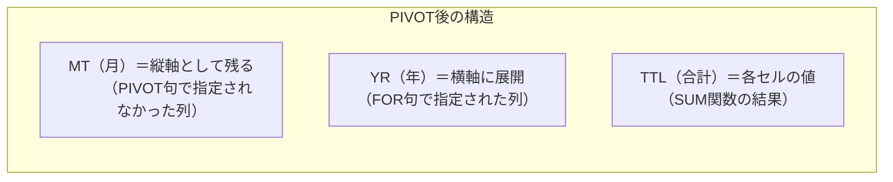

`PIVOT`句を使う際、重要なのは「PIVOT句の中で指定しなかった列がどうなるか」という点です。`FOR yr`で年は横に回転して「列」になり、`SUM(ttl)`の合計金額は新しい列の中身（値）になりますが、PIVOT句で指定されていない`mt`（月）はそのまま「行」の軸として残ります。これにより、1月〜12月という縦の並びを維持したまま、その横に2021年と2022年の数値を並べることができます。

このクエリは3階層の構造になっています。まず`WITH order_total`で注文明細から「注文ごとの合計金額」を計算します。次にサブクエリ内の`SELECT`で「年（`yr`）」「月（`mt`）」「その年月の合計（`ttl`）」という縦長（ロング型）の集計表を一度作ります。最後に`PIVOT`で、縦長の表から`yr`だけを横に倒して横長（ワイド型）の比較表に変換します。

この形式のデータはビジネスの意思決定に役立ちます。「毎年12月はギフト需要で売上が伸びる」といった季節性のトレンドが縦の推移で見えたり、同じ「3月」で横に比較したとき2021年（11,405）から2022年（23,269）へと倍増していることが即座に把握できたりします。

`PIVOT`した直後の結果は並び順が保証されません。レポートとして月がバラバラ（1月、10月、2月...）に出てくると読みづらいため、最後にしっかりソートすることで、期待する結果通りの見やすいカレンダー形式になります。

----
<br><br>

# 【完全版】問題13-4：2項目のクロス集計（PIVOT）
### 難易度：★★★☆☆ (Lv.3)
## 問題
SHスキーマの`SUPPLEMENTARY_DEMOGRAPHICS`テーブルをもとに、「学歴（`EDUCATION`）」を縦軸に、「世帯人数（`HOUSEHOLD_SIZE`）」を横軸に展開して、各セグメントごとの顧客数を算出してください。

**【条件およびルール】**
* **縦軸（行）**：`EDUCATION` を表示し、昇順で並べてください。
* **横軸（列）**：`HOUSEHOLD_SIZE` の各値（'1', '2', '3', '4-8', '9+'）を列として展開してください。
* **集計値**：各セグメントの顧客レコード数（`COUNT`）を表示してください。
※元のデータに馴染みがない場合でも、特定の「学歴」と「世帯人数」が交差するポイントの合計人数を出すイメージで作成してください。
  
## 期待する結果
| EDUCATION | SIZE_1 | SIZE_2 | SIZE_3 | SIZE_4_TO_8 | SIZE_9_PLUS |
| --------- | ------ | ------ | ------ | ----------- | ----------- |
| 10th        | 39       | 26       | 28       | 0             | 21            |
| 11th        | 47       | 15       | 34       | 0             | 16            |
| 12th        | 16       | 10       | 11       | 0             | 8             |
| 1st-4th     | 2        | 2        | 11       | 0             | 2             |
| 5th-6th     | 2        | 8        | 16       | 0             | 6             |
| 7th-8th     | 3        | 23       | 44       | 0             | 12            |
| 9th         | 5        | 17       | 33       | 0             | 9             |
| < Bach.     | 247      | 266      | 331      | 0             | 125           |
| Assoc-A     | 18       | 46       | 73       | 0             | 20            |
| Assoc-V     | 14       | 58       | 77       | 0             | 32            |
| Bach.       | 81       | 218      | 373      | 0             | 46            |
| HS-grad     | 209      | 378      | 563      | 0             | 179           |
| Masters     | 8        | 50       | 99       | 0             | 18            |
| PhD         | 1        | 8        | 33       | 0             | 5             |
| Presch.     | 0        | 1        | 0        | 0             | 1             |
| Profsc      | 0        | 23       | 61       | 0             | 5             |

## 解答例
```sql
SELECT
    *
FROM
    (
        SELECT
            education,
            household_size
        FROM
            sh.supplementary_demographics
    ) PIVOT (
        COUNT(*)
        FOR household_size
        IN ( '1' AS size_1, '2' AS size_2, '3' AS size_3, '4-8' AS size_4_to_8, '9+' AS size_9_plus )
    )
ORDER BY
    education;
```

## 解説
今回は「2項目によるクロス集計（マトリックス表）」です。これまでの`PIVOT`は「年月」などの時系列がメインでしたが、今回は「学歴」と「世帯人数」という完全に異なる2つの属性を掛け合わせています。統計分析やマーケティングリサーチでよく使われるクロス集計の形です。

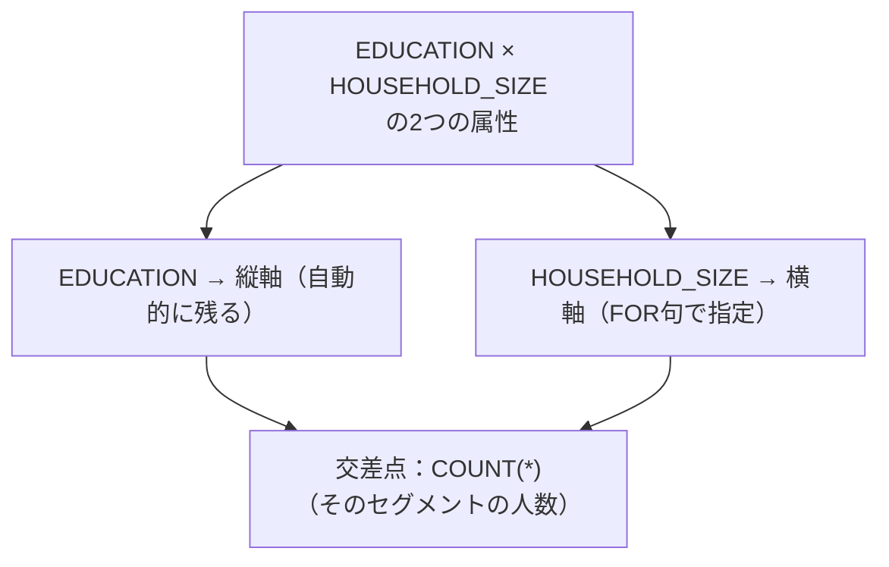

このクエリは、膨大な顧客データを「学歴（縦軸）」と「世帯人数（横軸）」という2つの座標で整理し、その交差点に「何人いるか」をマッピングしています。`PIVOT`句には「PIVOT句の中で指定しなかった列が、自動的に縦軸（行）になる」という性質があります。今回はサブクエリで`education`と`household_size`の2つだけを抽出し、`household_size`を横軸（`FOR`句）に指定したため、残った`education`が自動的に縦軸として採用されています。

交差点に置く値として`COUNT(*)`を指定しており、これにより各セグメントの顧客数が算出されます。
```sql
IN ( '1' AS size_1, '2' AS size_2, ... )
```
`IN`句の中で`'1'`などの値をそのまま列名にすることもできますが、SQLの列名として扱いやすくするために`AS`で名前を付けています。元のデータの`'4-8'`（ハイフンが含まれる文字列）を、変換後は`SIZE_4_TO_8`（プログラムや他のツールで扱いやすい形式）にする、という具合です。「人間が読みやすく、システムが扱いやすい」形に整えるのも実務では大事な工夫です。

このクロス集計表が完成すると、単なる平均値や合計値では見えなかった相関関係が浮き彫りになります。`HS-grad`（高校卒）は世帯人数「3」が563人と多く、ボリュームゾーンであることが分かります。`PhD`（博士号）は世帯人数「1」がわずか1人に対し「3」が33人と、高学歴層では一定規模の世帯を形成している傾向が見て取れます。

一点補足しておきます。期待する結果の`SIZE_4_TO_8`列がすべて0になっていますが、これは`SUPPLEMENTARY_DEMOGRAPHICS`テーブルの`HOUSEHOLD_SIZE`列に、実際には`'4-8'`という値を持つレコードが存在しない可能性を示しています。もし実行環境で確認してこの値が本当に存在しないのであれば、この列自体は今回のデータセットには該当者がいない、という結果になります。念のため、お使いの環境で実際のデータの分布を確認しておくことをおすすめします。

Oracleの`PIVOT`句では、該当する組み合わせがない場合デフォルトでNULLが入ります。もし「0」と表示させたい場合は出力時に`NVL`関数などを使って加工することもありますが、最近のBIツールでは「NULLは自動的に0として描画する」設定が多いため、まずはシンプルなPIVOTでデータを渡すのが分かりやすいと思います。

----
<br><br>

# 【完全版】問題13-5：PIVOTによる昨対比分析（減少顧客の特定＜問題9-5の別解＞）
### 難易度：★★★☆☆ (Lv.3)
## 問題
SHスキーマの`SALES`テーブルを利用し、**2020年に比べて2021年の購入額が減少している顧客**を特定してください。

**【抽出・フィルタリング条件】**
* **PIVOTの活用**：2020年と2021年の売上をそれぞれ `SALES_2020`、`SALES_2021` という列に展開してください。
* **減少判定**：2021年の購入額が、2020年の購入額よりも低いこと。
* **生存判定**：2021年の購入額が 0 より大きい（完全に離脱はしていない）こと。
* **対象範囲**：`cust_id` が 50 未満の顧客。

## 期待する結果
| CUST_ID | SALES_2020 | SALES_2021 |
| ------- | ----------- | ----------- |
| 7         | 555.93        | 117.5         |
| 27        | 29541.89      | 2849.03       |
| 32        | 15877.21      | 112.89        |
| 33        | 997.57        | 102.62        |
| 49        | 705.37        | 302.56        |
| 19        | 662.74        | 18.9          |
| 20        | 7263.94       | 77.98         |

## 解答例
```sql
SELECT
    cust_id,
    sales_2020,
    sales_2021
FROM
    (
        SELECT
            cust_id,
            TO_CHAR(time_id, 'YYYY') AS sales_year,
            amount_sold
        FROM
            sh.sales
        WHERE
            TO_CHAR(time_id, 'YYYY') IN ( '2020', '2021' )
    )
     PIVOT (
        SUM(amount_sold)
        FOR sales_year
        IN ( '2020' AS sales_2020, 
             '2021' AS sales_2021 )
    )
WHERE
    sales_2020 > sales_2021
    AND sales_2021 > 0
    AND cust_id < 50
```

## 解説
以前、問題9-5で自己結合や副問い合わせを使って解いたこの課題を、今回は`PIVOT`句を使って解き直します。実務において「去年の売上と今年の売上を比較して、調子が落ちている顧客を見つける」といった傾向分析は、マーケティング部門からよく依頼されるタスクの一つです。

SQLの基本は「行」単位の処理です。そのため、「2020年の行」と「2021年の行」を比較するのは本来少し手間がかかります。`PIVOT`を使う利点は「別の行にあったデータを、同じ行の隣の列に持ってくる」ことにあります。変換前は2020年の売上行と2021年の売上行がバラバラに存在していますが、変換後は1人の顧客に対し`SALES_2020`と`SALES_2021`という2つの列が横に並びます。これにより、`WHERE sales_2020 > sales_2021`という単純な比較で条件を書けるようになります。

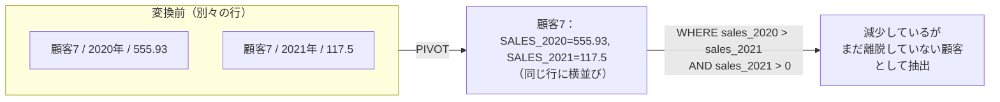

このクエリは「データが絞られ、形を変え、さらに選別される」という流れで構成されています。まずサブクエリで`sh.sales`から必要な2020年と2021年のデータだけを抜き出します。ここで`TO_CHAR`を使って「年」というラベル（`sales_year`）を作っているのがポイントです。次に`PIVOT`で縦に並んだ年度を横に倒し、`SUM(amount_sold)`を中身に入れて`sales_2020`と`sales_2021`という新しい列を生成します。最後に外側の`WHERE`で、横並びになった数値を見て「売上が減っているか（2020 > 2021）」「まだ完全に離脱していないか（2021 > 0）」といったビジネスルールを適用します。

このクエリの結果に出てくる顧客（ID: 7, 27, 32...）は、いわば「危険信号」が灯っている顧客です。全く買わなくなった「離脱客」を見つけるのは比較的簡単ですが、このクエリのように「買っている金額が減ってきた客」を見つけることで、完全に離脱する前に対策（クーポン配布やリマインドメールなど）を打つことができます。今回は「年」で比較しましたが、これを「直近3ヶ月」と「その前の3ヶ月」に変えれば、よりリアルタイムな離脱予備軍リストになります。

| 手法 | 特徴 |
| :--- | :--- |
| 問題9-5（自己結合） | テーブルを複数回つなげる必要があり複雑になりがち |
| 今回（PIVOT） | 「2020年を列Aに、2021年を列Bに」という意図が明確。年を増やしても`IN`句に追加するだけ |

問題9-5で扱った自己結合（テーブルを2回つなげる方法）と比べると、今回の`PIVOT`版には利点があります。「2020年を列Aに、2021年を列Bに」という意図が明確で読みやすく、もし「2019年も比較したい」となった場合も`IN`句に一つ追加するだけで済みます。自己結合だとテーブルを3回繋げることになり、クエリが複雑になりがちです。

----
<br><br>

# 【完全版】問題13-6：複数集計関数を同時に展開するマルチPIVOT
### 難易度：★★★★☆ (Lv.4)
## 問題
経営企画部から、「前回の月次売上レポート（問題13-3）は素晴らしかったが、売上金額の変動だけでなく、**『注文が何件あったか（販売数量・ヒット件数の推移）』**も同じ画面で並べて比較したい」と追加のリクエストがありました。
売上金額（SUM）と注文本数（COUNT）を同時にクロス集計することで、「売上は上がっているが、実は大口顧客が1件あっただけで、一般の注文本数は減っていないか？」といった、ビジネスの健康状態を測るための**客数・客単価分析**が可能になります。
COスキーマ`orders` テーブルと `order_items` テーブルを使用し、月ごとの「売上総額」と「注文明細の総件数」を、2021年と2022年の横並びで表示するクロス集計レポートを作成してください。

**【条件および算出ルール】**
* **縦軸（行）**: 注文月（`MT`）を 1〜12 の数値で表示し、月の昇順でソートしてください。
* **横軸（列）**: 2021年と2022年のデータを展開します。ただし、今回は各年に対して以下の**2つの情報**を内包させてください。
* **売上総額**: `unit_price * quantity` の合計。列名の末尾は `_SALES` とする。
* **注文明細件数**: 該当月に処理された明細行の総件数。列名の末尾は `_COUNT` とする。
* **列名の指定**: 最終的な出力列名は、期待する結果に合わせて `Y2021_SALES`, `Y2021_COUNT`, `Y2022_SALES`, `Y2022_COUNT` となるようにエイリアスを制御してください。

## 期待する結果
| MT   | Y2021_SALES | Y2021_COUNT | Y2022_SALES | Y2022_COUNT |
| ---- | ------------ | ------------ | ------------ | ------------ |
| 1      |                | 0              | 33323.64       | 413            |
| 2      | 3256.22        | 35             | 24081.63       | 309            |
| 3      | 11405.42       | 146            | 23269.17       | 312            |
| 4      | 18317.39       | 233            | 5485.98        | 69             |
| 5      | 18254.94       | 226            |                | 0              |
| 6      | 20500.44       | 256            |                | 0              |
| 7      | 19884.46       | 246            |                | 0              |
| 8      | 23353.01       | 288            |                | 0              |
| 9      | 26362.46       | 338            |                | 0              |
| 10     | 25922.88       | 340            |                | 0              |
| 11     | 25412.36       | 317            |                | 0              |
| 12     | 29768.53       | 386            |                | 0              |

## 解答例
```sql
SELECT
    mt,
    y2021_sales,
    y2021_count,
    y2022_sales,
    y2022_count
FROM
    (
        SELECT
            EXTRACT(YEAR FROM o.order_tms)  AS yr,
            EXTRACT(MONTH FROM o.order_tms) AS mt,
            (oi.unit_price * oi.quantity)   AS item_amt
        FROM
            co.order_items oi
            LEFT JOIN co.orders o ON oi.order_id = o.order_id
    ) PIVOT (
        SUM(item_amt) AS sales,
        COUNT(*)      AS count
        FOR yr
        IN ( 2021 AS y2021, 2022 AS y2022 )
    )
ORDER BY
    mt
```

## 解説
今回は「複数の集計関数を同時に展開するマルチPIVOT」です。実務のダッシュボードや経営報告資料を作る際、「売上金額だけ」「注文本数だけ」のレポートだと、「売上は増えているが、実は1件の大口注文のおかげで取引顧客数は減っている」といったビジネスの異常に気づけないことがあります。金額（SUM）と件数（COUNT）を同時に横並びにするこのテクニックは、そうした状態の変化を捉えるのに役立ちます。

このクエリの核は、`PIVOT`句の中で2つの集計関数を同時に指定している点にあります。
```sql
PIVOT (
    SUM(item_amt) AS sales,
    COUNT(*)      AS count
    FOR yr IN ( 2021 AS y2021, 2022 AS y2022 )
)
```
通常のPIVOTは「展開する値（今回は2年分）」の数だけ列が増えますが、集計関数を2つにすると「展開する値の数 × 集計関数の数」の分だけ列が増えます。今回は2×2=4列が自動生成されます。

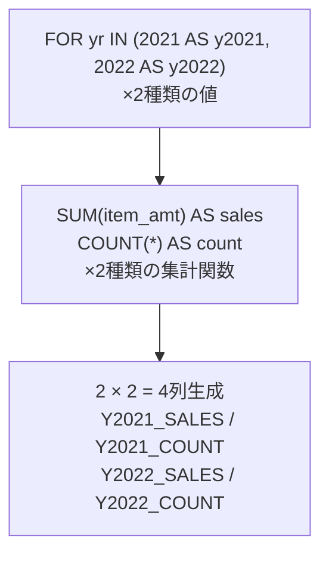

Oracle内部では、列名が次のように自動的に結合されます。`y2021`（年のエイリアス）＋`sales`（集計のエイリアス）＝`Y2021_SALES`、`y2021`＋`count`＝`Y2021_COUNT`、`y2022`＋`sales`＝`Y2022_SALES`、`y2022`＋`count`＝`Y2022_COUNT`という規則です。この規則を知っておくと、最外周の`SELECT`で迷わず正しい列名を指定できます。

`PIVOT`を使うときの注意点として、「PIVOT句に渡す前に、データを必要な列だけに絞り込んでおくこと」があります。もしサブクエリを使わずにテーブルを丸ごと`PIVOT`に渡すと、テーブルに含まれる`ORDER_STATUS`や`CUSTOMER_ID`など、集計に関係のないすべての列が自動的に「グループ化（GROUP BY）の軸」として扱われてしまいます。結果として月（`MT`）ごとに1行にまとまらず、データが細切れになってしまいます。「横軸にしたい列（`yr`）」「縦軸にしたい列（`mt`）」「集計したい列（`item_amt`）」の3種類だけをサブクエリで正確に切り出してから`PIVOT`に渡すのが安全です。

日付（TIMESTAMP型など）から「年」や「月」を数値として取り出すために、`EXTRACT(YEAR FROM ...)`や`EXTRACT(MONTH FROM ...)`を使用しています。`TO_CHAR(..., 'MM')`でも同じように月を抽出できますが、文字列（'01', '02'...）ではなく純粋な数値（1, 2...）として取り出せるため、レポートのソートや比較がしやすくなります。

今回の出力結果の2月と3月を見比べてみましょう。2021年2月は売上約3,256、件数35件で1件あたり約93ドル、2021年3月は売上約11,405、件数146件で1件あたり約78ドルです。3月は売上が3倍以上に跳ね上がっていますが、1件あたりの購入額（客単価）は下がっており、「客単価は落ちたが、注文数が増えたことで総売上が伸びた」という背景が見えてきます。マルチPIVOTを使うと、こうした数字の裏にある動きをクエリ一発で確認できます。

----
<br><br>

# 【完全版】問題13-7：単一年度における四半期別のマルチPIVOT
### 難易度：★★★★★ (Lv.4)
## 問題
経営陣から「2021年度の年間パフォーマンスを店舗ごとに振り返りたい」との補足要求がありました。ただし、単に年間の合計を見るのではなく、「第1四半期（Q1）から第4四半期（Q4）にかけて、売上と注文本数がどのように推移したか」を1つのマトリックス表で俯瞰したいとのことです。
売上金額（SUM）と明細件数（COUNT）を四半期ごとに並べることで、「特定の店舗がQ3に売上を急拡大させたのは、単価の高い商品が数件売れたから（件数は少ない）か、それとも顧客数そのものが増えたから（件数も多い）か」という、時期ごとの営業努力の成果を正しく評価できるようになります。
COスキーマの`orders` と `order_items` テーブルを使用し、**2021年のデータのみ**を対象として、店舗ID（`STORE_ID`）ごとに「四半期別の売上総額」と「注文明細の総件数」を横並びで表示するクロス集計レポートを作成してください。

**【条件および算出ルール】**
* **抽出範囲**: `co.orders.order_TMS` が **2021年** のデータのみを対象としてください。
* **縦軸（行）**: 店舗ID（`STORE_ID`）を表示し、IDの昇順でソートしてください。
* **横軸（列）**: 四半期（Q1、Q2、Q3、Q4）を展開します。各四半期に対して以下の**2つの情報**を内包させてください。
* **売上総額**: `unit_price * quantity` の合計。列名の末尾は `_SALES` とする。
* **注文明細件数**: 該当四半期に処理された明細行の総件数。列名の末尾は `_COUNT` とする。
* **列名の指定**: 最終的な出力列名は、期待する結果に合わせて `Q1_SALES`, `Q1_COUNT`, ..., `Q4_SALES`, `Q4_COUNT` となるようにエイリアスを制御してください。

## 期待する結果
| STORE_ID | Q1_SALES | Q1_COUNT | Q2_SALES | Q2_COUNT | Q3_SALES | Q3_COUNT | Q4_SALES | Q4_COUNT |
| -------- | --------- | --------- | --------- | --------- | --------- | --------- | --------- | --------- |
| 1          | 14410.46    | 177         | 54740.13    | 683         | 57874.4     | 727         | 52082.17    | 678         |
| 2          |             | 0           | 911.25      | 12          | 1326.69     | 17          | 1893.02     | 21          |
| 3          | 251.18      | 4           | 136.83      | 3           | 2551.34     | 35          | 779.71      | 9           |
| 4          |             | 0           | 334.76      | 7           | 1042.07     | 13          | 1653.57     | 24          |
| 5          |             | 0           | 346.84      | 5           | 1524.39     | 15          | 1421.34     | 19          |
| 6          |             | 0           | 408.16      | 3           | 446.82      | 9           | 2489.16     | 35          |
| 7          |             | 0           | 194.8       | 2           | 1481.91     | 16          | 1210.85     | 14          |
| 8          |             | 0           |             | 0           | 1347.06     | 16          | 1685.04     | 22          |
| 9          |             | 0           |             | 0           | 556.44      | 9           | 2221.4      | 29          |
| 10         |             | 0           |             | 0           | 388.13      | 5           | 2738.64     | 33          |
| 11         |             | 0           |             | 0           | 588.22      | 5           | 2169.07     | 29          |
| 12         |             | 0           |             | 0           | 472.46      | 5           | 2843.04     | 33          |
| 13         |             | 0           |             | 0           |             | 0           | 2056.32     | 25          |
| 14         |             | 0           |             | 0           |             | 0           | 1489.75     | 20          |
| 15         |             | 0           |             | 0           |             | 0           | 2535.69     | 29          |
| 16         |             | 0           |             | 0           |             | 0           | 838.82      | 12          |
| 17         |             | 0           |             | 0           |             | 0           | 763.53      | 6           |
| 18         |             | 0           |             | 0           |             | 0           | 232.65      | 5           |

## 解答例
```sql
SELECT
    store_id,
    q1_sales, q1_count,
    q2_sales, q2_count,
    q3_sales, q3_count,
    q4_sales, q4_count
FROM
    (
        SELECT
            o.store_id,
            -- 日付から四半期（1〜4）を文字列として抽出
            TO_CHAR(o.order_tms, 'Q')      AS qtr,
            (oi.unit_price * oi.quantity)  AS item_amt
        FROM
            co.order_items oi
            LEFT JOIN co.orders o ON oi.order_id = o.order_id
        WHERE
            -- 2021年のデータのみにフィルタリング
            o.order_tms >= TIMESTAMP '2021-01-01 00:00:00'
            AND o.order_tms < TIMESTAMP '2022-01-01 00:00:00'
    ) PIVOT (
        -- 2つの集計関数を同時に定義
        SUM(item_amt) AS sales,
        COUNT(*)      AS count
        FOR qtr
        -- 四半期(1〜4)をそれぞれ列として展開
        IN ( '1' AS q1, '2' AS q2, '3' AS q3, '4' AS q4 )
    )
ORDER BY
    store_id
```

## 解説
今回の課題は「単一年度における四半期（クォーター）別のマルチPIVOT」です。前回の年度別マルチPIVOTの応用編で、日付データから「四半期」を動的に切り出し、1年間の季節トレンドを店舗（`STORE_ID`）ごとに1枚のマトリックス表へ展開する、実践的なクエリです。

このクエリのポイントの1つが、サブクエリ（インラインビュー）の中で四半期（Q1〜Q4）へのデータ整形を完結させている点です。
```sql
TO_CHAR(o.order_tms, 'Q') AS qtr
```
日付やタイムスタンプから四半期を切り出す際、`CASE`式で「1月〜3月なら1、4月〜6月なら2……」と書くのは面倒です。Oracleには、フォーマットマスクに`'Q'`（Quarter）を指定するだけで自動的に`'1'`〜`'4'`の文字列を返してくれる機能があり、これだけでコードがすっきりします。

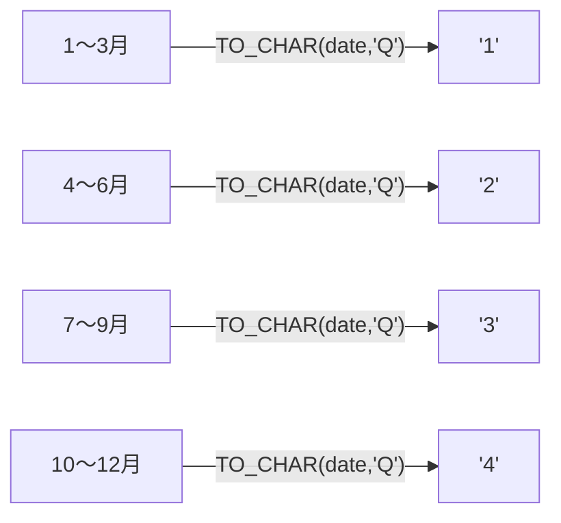

もう1つのポイントが、日付フィルタリングの書き方です。
```sql
WHERE o.order_tms >= TIMESTAMP '2021-01-01 00:00:00'
  AND o.order_tms < TIMESTAMP '2022-01-01 00:00:00'
```
「2021年のデータに絞る」というとき、つい`TO_CHAR(order_tms, 'YYYY') = '2021'`と書きたくなりますが、この書き方は問題7-8や8-2で扱った教えに沿ったものです。列に直接関数（`TO_CHAR`など）を適用してしまうと、`order_tms`列にインデックスが貼られていても機能しなくなります。生の日付のまま範囲指定（不等号）を行うことで、インデックスを活用して高速に処理できます。

今回も「4つの四半期（値）」×「2つの集計関数」によって、4×2=8個の列が生成されます。
```sql
PIVOT (
    SUM(item_amt) AS sales,
    COUNT(*)      AS count
    FOR qtr IN ( '1' AS q1, '2' AS q2, '3' AS q3, '4' AS q4 )
)
```
列名の結合規則は「[FOR句のエイリアス]_[集計関数のエイリアス]」となるため、自動生成される列名は第1四半期が`Q1_SALES`・`Q1_COUNT`、第2四半期が`Q2_SALES`・`Q2_COUNT`、第3四半期が`Q3_SALES`・`Q3_COUNT`、第4四半期が`Q4_SALES`・`Q4_COUNT`となります。最外周の`SELECT`文では、この規則に沿って生成された列名を指定するだけで、期待する結果通りの横並び表が完成します。

| 店舗 | Q1→Q2の売上変化 | Q1→Q2の件数変化 | 解釈 |
| :--- | :--- | :--- | :--- |
| 店舗1 | 約1.4万→約5.4万（約4倍） | 177→683（約4倍） | 客数・注文とも満遍なく成長 |
| 店舗2 | 911→1326（約1.45倍、Q2→Q3） | 12→17（約1.4倍） | 客単価の上昇が主要因の可能性 |

この出力結果の店舗1と店舗2を比較すると、マルチPIVOTならではの分析視点（客数と客単価の構造）が見えてきます。店舗1はQ1からQ2にかけて売上が約1.4万ドルから約5.4万ドルへ4倍近く増えていますが、件数（`COUNT`）も177から683へと同様に4倍近く増えているため、「満遍なく顧客と注文を増やした、店舗全体の成長」であると判断できます。一方店舗2は、Q2からQ3にかけて売上が911ドルから1326ドルへ約45%増加していますが、件数は12件から17件へとわずか5件の増加にとどまっています。こちらは「顧客が大量に増えたわけではなく、1件あたりの購入金額（客単価）が上がったのではないか」という仮説が立ちます。金額だけのクロス集計表では「どちらも売上が伸びていて順調」としか言えませんが、件数を横に添えるだけで「成長の質（客数増なのか、単価増なのか）」を評価できるようになります。

----
<br><br>

# 【完全版】問題13-8：IN句のハードコードを脱却する「PIVOT XML」
### 難易度：★★★★☆ (Lv.4)
## 問題
マーケティングリサーチ部門から、「世界各国の顧客（`country_id`）ごとの売上クロス集計レポートを作成してほしい」との依頼がありました。
しかし、通常の `PIVOT` 句では、対象となる国コード（'US', 'CA', 'UK', 'JP' ...）をすべて `IN` 句に手動でハードコーディングする必要があります。これでは、**「将来新しく進出した国が増えたときにクエリを書き直さなければならない」**、「国が多すぎて `IN` 句の記述が膨大になる」というメンテナンス上の重大な問題が発生します。
将来の国の追加・変更に自動で追従し、クエリの修正を一切不要にする「動的クロス集計クエリ」を、Oracle独自の `PIVOT XML` を使って構築してください。
SHスキーマ`sales`, `customers`, `countries` の3つのテーブルを使用し、縦軸を「売上年（`sales_year`）」、横軸を「国コード（`country_id`）」としたクロス集計を行ってください。

**【条件およびルール】**
* **動的展開の実現**: 通常の `PIVOT` ではなく **`PIVOT XML`** を使用してください。
* **サブクエリの利用**: `IN` 句の中には固定値を並べるのではなく、`sh.countries` テーブルから動的に国コードを取得する**サブクエリ**を記述してください。
* **集計値**: 各年・各国の売上合計（`SUM(amount_sold)`）を算出してください。

## 期待する結果
このクエリを実行すると、`SALES_YEAR`（2019〜2022年）ごとに1行、`COUNTRY_ID_XML`という1つの列にすべての国の集計結果がXML形式で格納された結果が返ります。`sh.countries`に登録されている国の数だけ`<item>`タグが繰り返される構造になるため、以下では2019年の結果から冒頭部分のみを抜粋して示します（実際の出力は、対象年ごとに全登録国の数だけ`<item>`が続きます）。
| SALES_YEAR | COUNTRY_ID_XML（抜粋） |
| ---------- | ------------------------ |
| 2019 | `<PivotSet><item><column name="COUNTRY_ID">52769</column><column name="AMOUNT_SOLD">763603.28</column></item><item><column name="COUNTRY_ID">52770</column><column name="AMOUNT_SOLD">1242664.15</column></item>...（以下、登録国数分続く）...</PivotSet>` |
| 2020 | （同様の構造で2020年分のデータ） |
| 2021 | （同様の構造で2021年分のデータ） |
| 2022 | （同様の構造で2022年分のデータ） |

## 解答例
```sql
SELECT
    sales_year,
    country_id_xml
FROM
    (
        SELECT
            TO_CHAR(s.time_id, 'YYYY') AS sales_year,
            c.country_id,
            s.amount_sold
        FROM
            sh.sales s
            JOIN sh.customers cu ON s.cust_id = cu.cust_id
            JOIN sh.countries c  ON cu.country_id = c.country_id
    )
    PIVOT XML (
        -- 集計関数を定義
        SUM(amount_sold) AS amount_sold
        FOR country_id
        -- 固定値ではなく、サブクエリで動的に国コードのリストを指定
        IN ( SELECT country_id FROM sh.countries )
    )
ORDER BY
    sales_year
```

## 解説
今回はクロス集計の応用形である`PIVOT XML`を扱います。通常の`PIVOT`を実務で使い始めると、多くの人が「`IN`句の中にいちいち固定値を手動で並べるのは手間がかかる、自動で国や店舗のリストを拾ってきてくれないか」という壁に当たります。この「SQLの制約（列名の事前確定）」を、出力をXMLにすることで回避する、Oracle独自のテクニックを解説します。

| 通常のPIVOT | PIVOT XML |
| :--- | :--- |
| `IN`句に固定値を手動で列挙 | `IN`句にサブクエリを記述可能 |
| 国が増えるたびにクエリ修正が必要 | マスタテーブルの更新だけで自動追従 |
| 結果は横に長い複数の列 | 結果は1つのXML（CLOB）列に集約 |

このクエリのポイントは、`PIVOT XML`句内の`IN`句に記述されたサブクエリです。
```sql
PIVOT XML (
    SUM(amount_sold) AS amount_sold
    FOR country_id
    -- 固定値ではなく、サブクエリで動的にリストを取得
    IN ( SELECT country_id FROM sh.countries )
)
```
通常の`PIVOT`では`IN ('US', 'CA', 'JP')`のように値をハードコーディングしなければなりません。そのため、新しい国（例：'FR'）が進出するたびに、本番稼働しているプログラムのSQLを書き換えて再リリースする必要が出てきます。しかし`PIVOT XML`を使ってマスターテーブル（`sh.countries`）から`SELECT`する形にしておけば、テーブルに新しい国が追加された瞬間、クエリを修正することなく自動的に新しい国がクロス集計の横軸に組み込まれます。

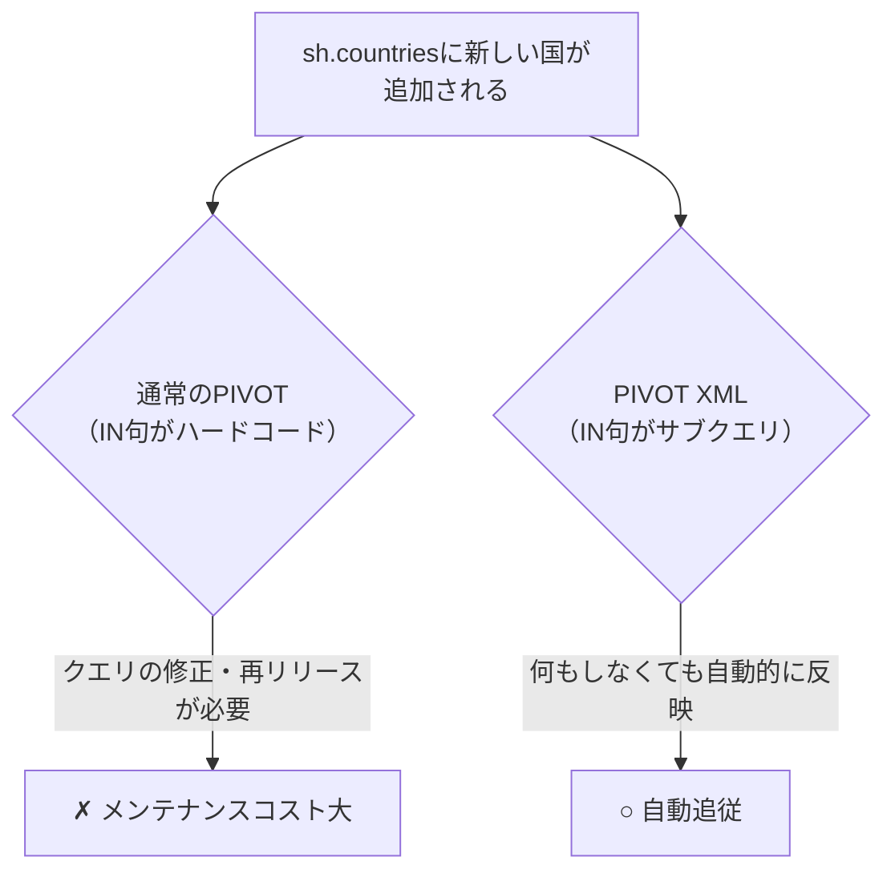

なぜ通常の`PIVOT`ではサブクエリが禁止されているのでしょうか。関係データベース（RDB）の基本ルールとして、「SQLの実行前に、出力される列の数と列名が決まっていなければならない」という原則があります。サブクエリを使うと、データの増減によって列数が変わってしまう（動的スキーマ）ため、通常の`PIVOT`ではサブクエリが文法エラーになります。この原則を突破するために生まれたのが`PIVOT XML`で、「列数を固定できないなら、1つの列（CLOB型）の中に、すべての集計結果をXML形式のテキストとして詰め込んで返せばいい」という発想です。

期待する結果を見ると、右側の列が`COUNTRY_ID_XML`という1つの列になっており、その中に次のようなタグ形式で全データが内包されています。
```xml
<PivotSet>
    <item>
        <column name = "COUNTRY_ID">52769</column>
        <column name = "AMOUNT_SOLD">763603.28</column>
    </item>
    ...内容がどれだけ増えても、この1列の中にすべて横並びで入る...
</PivotSet>
```
列名は「[FOR句の列名]_XML」という名前で自動生成されます。

「SQL一発で綺麗に横並びの表（Grid）が出ないなら、使いにくいのでは」と思うかもしれません。しかし実務のシステム開発（Java, Python, C#などのWebアプリケーション）では、この機能はよく活用されています。典型的な使い方としては、SQL側で`PIVOT XML`を使ってどんなに項目（国や商品）が増減してもエラーにならない堅牢なXMLデータを取得し、プログラム側（フロントエンド）で受け取ったXML（またはJSONに変換したもの）を画面表示ライブラリ（マトリックス形式のグリッドビューなど）に渡し、画面上でライブラリがXMLを自動解析してユーザーに動的クロス集計表が表示される、という流れです。画面を介さず直接Excelへ展開したい場合は、Oracleの`XMLTABLE`関数を使ってこのXMLを再度分解することも可能ですが、基本的には「アプリケーションのバックエンドAPI」として使われる関数だと捉えておくとよいと思います。

----
<br><br>

# 【完全版】問題13-9：小計・合計行を完全網羅する立体クロス集計（PIVOT × CUBE）
### 難易度：★★★★☆ (Lv.4)
## 問題
マーケティングリサーチ部門から、「顧客の学歴（`education`）と世帯人数（`household_size`）を掛け合わせた、詳細なデモグラフィック分析レポートを作成してほしい」との依頼がありました。
単にデータをクロス集計するだけでなく、縦軸・横軸の各小計、および全体の総合計までをすべて網羅した、見栄えの良い立体クロス集計レポートを構築する必要があります。
SHスキーマの`supplementary_demographics` テーブルを使用し、縦軸を「学歴（`education`）」、横軸を「世帯人数（`household_size`）」としたクロス集計を行ってください。

**【条件およびルール】**
* **全方位の集計**: `CUBE` 句を使用して、縦軸・横軸の各小計、および右下の総合計を含むすべての集計行・列を網羅してください。
* **NULLのラベル化**: 集計によって生じる `NULL` 部分（小計・合計行）は、`GROUPING` 関数と `CASE` 式を用いて `'TOTAL'` という文字列に置換してください。
* **横軸の展開**: `PIVOT` 句を使用し、世帯人数（`'1'`, `'2'`, `'3'`, `'4-8'`, `'9+'`）および新しく作成した `'TOTAL'` を列として展開してください。
* **ソート順**: 結果は `education` の昇順で並べ替えてください。ただし、学歴の総合計行（`education` が `'TOTAL'` の行）は必ず最終行（最下部）に表示されるようにソート順を制御してください。

## 期待する結果
| EDUCATION | SIZE_1 | SIZE_2 | SIZE_3 | SIZE_4_TO_8 | SIZE_9_PLUS | TOTAL  |
| --------- | ------ | ------ | ------ | ----------- | ----------- | ------ |
| 10th        | 39       | 26       | 28       |               | 21            | 122      |
| 11th        | 47       | 15       | 34       |               | 16            | 121      |
| 12th        | 16       | 10       | 11       |               | 8             | 52       |
| 1st-4th     | 2        | 2        | 11       |               | 2             | 17       |
| 5th-6th     | 2        | 8        | 16       |               | 6             | 39       |
| 7th-8th     | 3        | 23       | 44       |               | 12            | 87       |
| 9th         | 5        | 17       | 33       |               | 9             | 76       |
| < Bach.     | 247      | 266      | 331      |               | 125           | 1041     |
| Assoc-A     | 18       | 46       | 73       |               | 20            | 172      |
| Assoc-V     | 14       | 58       | 77       |               | 32            | 196      |
| Bach.       | 81       | 218      | 373      |               | 46            | 779      |
| HS-grad     | 209      | 378      | 563      |               | 179           | 1462     |
| Masters     | 8        | 50       | 99       |               | 18            | 190      |
| PhD         | 1        | 8        | 33       |               | 5             | 49       |
| Presch.     |          | 1        |          |               | 1             | 3        |
| Profsc      |          | 23       | 61       |               | 5             | 94       |
| TOTAL       | 692      | 1149     | 1787     |               | 505           | 4500     |

## 解答例
```sql
SELECT
    education,
    size_1,
    size_2,
    size_3,
    size_4_to_8,
    size_9_plus,
    total
FROM
    (
        SELECT
            -- GROUPING関数で集計行(NULL)を判定し、'TOTAL'に置換
            CASE WHEN GROUPING(education) = 1 THEN 'TOTAL' ELSE education END AS education,
            CASE WHEN GROUPING(household_size) = 1 THEN 'TOTAL' ELSE household_size END AS household_size,
            COUNT(*) AS cnt
        FROM
            sh.supplementary_demographics
        -- CUBEを使って「縦・横・総合計」のすべての組み合わせを網羅
        GROUP BY
            CUBE(education, household_size)
    )
    PIVOT (
        SUM(cnt)
        FOR household_size
        -- 横軸の展開項目に、新しく作った 'TOTAL' ラベルを組み込む
        IN ( 
            '1'     AS size_1, 
            '2'     AS size_2, 
            '3'     AS size_3, 
            '4-8'   AS size_4_to_8, 
            '9+'    AS size_9_plus, 
            'TOTAL' AS total 
        )
    )
ORDER BY
    -- 'TOTAL'行が必ず最下部に来るように並び替えを制御
    CASE WHEN education = 'TOTAL' THEN 1 ELSE 0 END,
    education
```

## 解説
このクエリは、多次元集計の`CUBE`と、クロス集計の`PIVOT`を組み合わせた、いわゆるBI（ビジネスインテリジェンス）レポートの典型例です。システムが自動生成する集計の隙間（NULL）をコントロールし、最終的な見栄えまで整えているこのクエリの仕組みを、4つのポイントに分けて解説します。

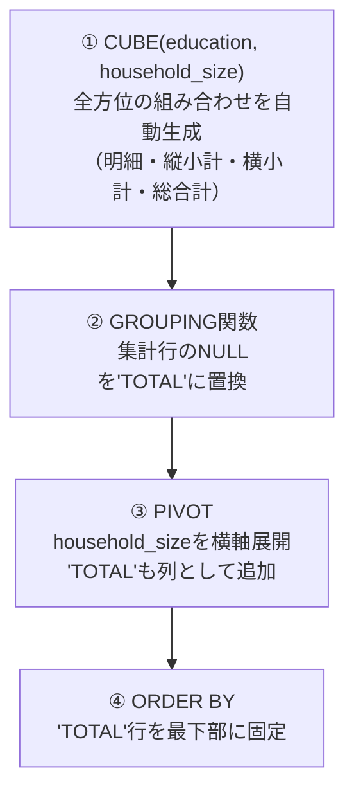

1つ目は`CUBE`句による全方位集計の自動生成です。
```sql
GROUP BY CUBE(education, household_size)
```
通常の`GROUP BY`は指定した組み合わせの明細しか出しませんが、`CUBE`を使うと指定された列の「ありとあらゆる組み合わせ（縦の合計・横の合計・右下の総合計）」をまとめて計算してくれます。明細（「10th」で「世帯人数1人」の件数）、横の小計（「10th」の全世帯人数の合計）、縦の小計（世帯人数「1人」の全学歴の合計）、右下の総合計（すべての学歴・すべての世帯人数の総計）が、これ1つで手に入ります。

2つ目は`GROUPING`関数による「意味のあるNULL」の判定です。`CUBE`が計算してくれた「小計」や「合計」の行には、システム上の目印としてNULLが入ります。そのまま`PIVOT`に流すと画面上でただの空欄になってしまうため、`GROUPING`関数を使って`'TOTAL'`というラベルに変換しています。
```sql
CASE WHEN GROUPING(education) = 1 THEN 'TOTAL' ELSE education END
```
`GROUPING(列名)`は、その行が「CUBEによって生み出された合計行」である場合にのみ1を返します。これを利用して、純粋なデータ不備のNULLと集計上のNULLを見分けて`'TOTAL'`に置換しています。

3つ目は`PIVOT`句での「TOTAL列」の動的な組み込みです。
```sql
PIVOT (
    SUM(cnt)
    FOR household_size
    IN ( ..., 'TOTAL' AS total )
)
```
前段で世帯人数が空欄（合計）の場所に`'TOTAL'`という名前を付けました。これを`PIVOT`の`IN`句の末尾に加えることで、本来はデータとして存在しないはずの`'TOTAL'`が横軸の列として展開され、「右端の合計列（`TOTAL`）」が生成されます。

4つ目は`ORDER BY`による総合計行の位置制御です。
```sql
ORDER BY 
    CASE WHEN education = 'TOTAL' THEN 1 ELSE 0 END, 
    education
```
普通に文字列（`education`）だけでソートすると、アルファベット順のルールによって`'TOTAL'`行が表の途中に紛れ込んでしまいます（`HS-grad`と`Masters`の間など）。「もし`'TOTAL'`なら1（後回し）、それ以外なら0（優先）」という重み付けをソート条件に加えることで、総合計行を確実に一番下に配置しています。

| 関数 | 軸の関係性 | 向いている用途 |
| :--- | :--- | :--- |
| `ROLLUP(A, B)` | 明確な上下関係（親子関係）がある | 「会社→本部→課」の階層的な小計積み上げ |
| `CUBE(A, B)` | 互いに独立した2軸 | 「学歴」×「世帯人数」のような網羅的な掛け合わせ |

実務での使い分けとして、`ROLLUP`と`CUBE`の違いも押さえておきましょう。`ROLLUP(A, B)`は「会社→本部→課」のように、データに明確な上下関係（親子関係）がある場合に使い、組織ごとの小計を積み上げます。`CUBE(A, B)`は、今回のように「学歴」と「世帯人数」といった互いに独立した2つの軸を網羅的に掛け合わせたい場合に向いています。

完成したクロス集計表を眺めると、集計を超えた顧客特性の傾向が見えてきます。全体（`TOTAL`）の4500名のうち、`HS-grad`（高校卒）が1462名、`< Bach.`（大学中退/未満）が1041名となっており、この2つの層だけで全体の半分以上を占めています。世帯人数別に見ると`SIZE_3`（3人世帯）が1787名と最も多く、ファミリー層がメインの顧客層になっている可能性がうかがえます。金額だけの集計ではなく、こうした顧客の属性の広がりを俯瞰できるのが、この立体クロス集計の使いどころです。

なお、13-4でも触れた通り`SIZE_4_TO_8`列がすべて空欄になっている点は、元データに`'4-8'`という値を持つレコードが存在しない可能性を示しています。実際のデータ分布については、お使いの環境で確認しておくことをおすすめします。

----
<br><br>

# 【完全版】問題13-10：UNPIVOTにおけるNULLの制御（INCLUDE NULLS）
### 難易度：★★★☆☆ (Lv.3)

## 問題
HRスキーマの`EMPLOYEES`テーブルを使用し、社員（`EMPLOYEE_ID`が100, 101, 145, 178）について、`MANAGER_ID`（上司ID）、`DEPARTMENT_ID`（部署ID）、`COMMISSION_PCT`（歩合給率）の3項目を縦持ち（行形式）に変換してください。

**【条件およびルール】**
* 変換後の列名は、項目名を **`ITEM`**、その内容を **`VALUE`** としてください。
* 各社員につき、対象の3項目は**値がNULLであっても必ず1行として出力**し、除外しないでください。
* 結果は`EMPLOYEE_ID`昇順、`ITEM`昇順で並べてください。

## 期待する結果
| EMPLOYEE_ID | ITEM           | VALUE | 
| ----------- | -------------- | ----- | 
| 100         | COMMISSION_PCT |       | 
| 100         | DEPARTMENT_ID  | 90    | 
| 100         | MANAGER_ID     |       | 
| 101         | COMMISSION_PCT |       | 
| 101         | DEPARTMENT_ID  | 90    | 
| 101         | MANAGER_ID     | 100   | 
| 145         | COMMISSION_PCT | 0.4   | 
| 145         | DEPARTMENT_ID  | 80    | 
| 145         | MANAGER_ID     | 100   | 
| 178         | COMMISSION_PCT | 0.15  | 
| 178         | DEPARTMENT_ID  |       | 
| 178         | MANAGER_ID     | 149   | 

## 解答例
```sql
SELECT
    employee_id,
    item,
    value
FROM
    (
        SELECT
            employee_id,
            manager_id,
            department_id,
            commission_pct
        FROM
            hr.employees
        WHERE
            employee_id IN ( 100, 101, 145, 178 )
    )
UNPIVOT INCLUDE NULLS ( value
    FOR item
    IN ( manager_id     AS 'MANAGER_ID',
         department_id  AS 'DEPARTMENT_ID',
         commission_pct AS 'COMMISSION_PCT' ) )
ORDER BY
    employee_id,
    item
```

## 解説
問題13-1では「UNPIVOTで型を揃える下準備」を学びましたが、今回は`UNPIVOT`が持つもう一つの重要な性質、**「NULLの扱い」** を掘り下げます。

まず、`INCLUDE NULLS`を付けずに、同じ社員・同じ3項目を素直に`UNPIVOT`してみるとどうなるでしょうか。

```sql
-- 【NG例】INCLUDE NULLSを付けない場合
SELECT
    employee_id, item, value
FROM
    (
        SELECT employee_id, manager_id, department_id, commission_pct
        FROM hr.employees
        WHERE employee_id IN (100, 101, 145, 178)
    )
UNPIVOT ( value FOR item
    IN ( manager_id AS 'MANAGER_ID',
         department_id AS 'DEPARTMENT_ID',
         commission_pct AS 'COMMISSION_PCT' ) )
ORDER BY employee_id, item
```

このクエリを実行すると、結果は12行ではなく**9行**にしかなりません。`EMPLOYEE_ID = 100`の`MANAGER_ID`行、`101`の`COMMISSION_PCT`行、`178`の`DEPARTMENT_ID`行が、こっそり消えてしまうのです。

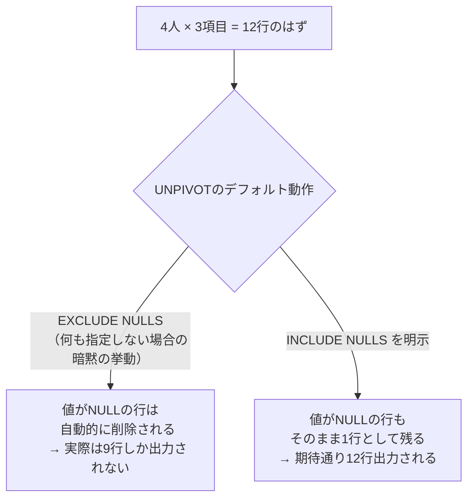

これは`UNPIVOT`の**デフォルト動作が`EXCLUDE NULLS`である**ためです。つまり、何も指定しなければOracleは「値がNULLの項目は、そもそも存在しなかったこと」として自動的に行を消してしまいます。13-1のように「元々ほとんどの項目に値が入っているデータ」を縦持ちにするだけなら気になりませんが、今回のように「項目によって値が入っていたりいなかったりする」データを扱う場合、この暗黙の削除は思わぬ罠になります。

これを回避するのが`INCLUDE NULLS`句です。

```sql
UNPIVOT INCLUDE NULLS ( value FOR item IN ( ... ) )
```

`UNPIVOT`の直後に`INCLUDE NULLS`と書くだけで、「NULLだった項目も、NULLという値を持った1行として出力する」という動作に切り替わります。

| 書き方 | 動作 |
| :--- | :--- |
| `UNPIVOT ( ... )` | デフォルト。`EXCLUDE NULLS`が暗黙的に適用され、値がNULLの行は消える |
| `UNPIVOT EXCLUDE NULLS ( ... )` | 上と同じ動作を明示的に記述したもの |
| `UNPIVOT INCLUDE NULLS ( ... )` | 値がNULLの行も残す |

なお、今回は`MANAGER_ID`・`DEPARTMENT_ID`・`COMMISSION_PCT`がいずれも`NUMBER`型で統一されているため、13-1で必要だった`TO_CHAR`による型合わせの下準備は不要でした。ただし、これは「たまたま型が揃っていたから」であり、文字列項目と数値項目を混在させる場合は、13-1同様の型変換が引き続き必要になる点は変わりません。

:::message
`VALUE`がNULLだからといって、必ずしも「データ不備」を意味するとは限りません。今回の例で`EMPLOYEE_ID = 100`（Steven King）の`MANAGER_ID`がNULLなのは、彼が組織の最上位（社長）であり「上司が存在しない」という**業務的に正しい状態**を表しています。一方で、一般社員の`COMMISSION_PCT`がNULLなのは「歩合給の対象外である」という意味かもしれませんし、単なる登録漏れかもしれません。NULLを機械的に「欠損」と決めつけず、列ごとの業務的な意味を踏まえて判断することが重要です。
:::

このテクニックは、実務では **データ完全性の監査（Data Completeness Audit）** で威力を発揮します。「どの社員の、どの項目が未入力なのか」を一覧化したい場合、`EXCLUDE NULLS`のままでは未入力の項目自体がレポートから消えてしまい、そもそも「何が欠けているか」を把握できません。`INCLUDE NULLS`で全項目を強制的に出力し、`WHERE value IS NULL`を組み合わせれば、「入力漏れ一覧」を簡単に作成できます。

```sql
-- 応用：欠損項目だけを一覧化する
... 
WHERE value IS NULL
```

横持ちのテーブルを眺めているだけでは、100件、1000件と社員が増えるにつれて「どの列が空欄か」を目視で追うのは困難になります。縦持ちに変換してから`IS NULL`で絞り込む、という組み合わせは、Excelのフィルタ機能に近い感覚でデータ品質チェックを行える、地味ながら実務価値の高いテクニックです。

---
<br><br>

# 【完全版】問題13-11：複数列ペアの同時UNPIVOT（Multi-column UNPIVOT）
### 難易度：★★★★☆ (Lv.4)

## 問題
経営企画部門から、「以前作成してもらった四半期別の店舗レポート（問題13-7の出力形式）を、別のBIツールに読み込ませたいので、**列持ち（ワイド型）から行持ち（ロング型）に戻してほしい**」との依頼がありました。

今回は状況を簡略化するため、以下のような**すでに集計済みの四半期別レポート**（店舗3件分）を`WITH`句で用意します。これを`STORE_ID`・`QTR`（四半期）・`SALES`（売上）・`CNT`（件数）という4列構成のロング型に変換してください。

**【条件およびルール】**
* 元データは店舗（`STORE_ID`）ごとに、四半期（Q1〜Q4）の「売上（`_SALES`）」と「件数（`_COUNT`）」がペアで横に並んでいます。
* 変換の際、**同じ四半期の「売上」と「件数」は必ずペアを保ったまま**、同じ行に展開してください（売上だけの行、件数だけの行に分かれてしまうのはNGです）。
* 列名は `QTR`（四半期ラベル：'Q1'〜'Q4'）、`SALES`（売上）、`CNT`（件数）としてください。
* 結果は`STORE_ID`昇順、`QTR`昇順で並べてください。

**【使用データ（WITH句）】**
```sql
WITH quarterly_report AS (
    SELECT 1 AS store_id, 14410.46 AS q1_sales, 177 AS q1_count,
           54740.13 AS q2_sales, 683 AS q2_count,
           57874.40 AS q3_sales, 727 AS q3_count,
           52082.17 AS q4_sales, 678 AS q4_count FROM dual
    UNION ALL
    SELECT 2, NULL, 0,
           911.25, 12,
           1326.69, 17,
           1893.02, 21 FROM dual
    UNION ALL
    SELECT 3, 251.18, 4,
           136.83, 3,
           2551.34, 35,
           779.71, 9 FROM dual
)
```

## 期待する結果
| STORE_ID | QTR | SALES    | CNT | 
| -------- | --- | -------- | --- | 
| 1        | Q1  | 14410.46 | 177 | 
| 1        | Q2  | 54740.13 | 683 | 
| 1        | Q3  | 57874.4  | 727 | 
| 1        | Q4  | 52082.17 | 678 | 
| 2        | Q1  |          | 0   | 
| 2        | Q2  | 911.25   | 12  | 
| 2        | Q3  | 1326.69  | 17  | 
| 2        | Q4  | 1893.02  | 21  | 
| 3        | Q1  | 251.18   | 4   | 
| 3        | Q2  | 136.83   | 3   | 
| 3        | Q3  | 2551.34  | 35  | 
| 3        | Q4  | 779.71   | 9   | 

## 解答例
```sql
WITH quarterly_report AS (
    SELECT 1 AS store_id, 14410.46 AS q1_sales, 177 AS q1_count,
           54740.13 AS q2_sales, 683 AS q2_count,
           57874.40 AS q3_sales, 727 AS q3_count,
           52082.17 AS q4_sales, 678 AS q4_count FROM dual
    UNION ALL
    SELECT 2, NULL, 0,
           911.25, 12,
           1326.69, 17,
           1893.02, 21 FROM dual
    UNION ALL
    SELECT 3, 251.18, 4,
           136.83, 3,
           2551.34, 35,
           779.71, 9 FROM dual
)
SELECT
    store_id,
    qtr,
    sales,
    cnt
FROM
    quarterly_report
UNPIVOT (
    -- 「売上」と「件数」をペア（複数列）として同時に展開する
    ( sales, cnt )
    FOR qtr
    IN (
        ( q1_sales, q1_count ) AS 'Q1',
        ( q2_sales, q2_count ) AS 'Q2',
        ( q3_sales, q3_count ) AS 'Q3',
        ( q4_sales, q4_count ) AS 'Q4'
    )
)
ORDER BY
    store_id,
    qtr
```

## 解説
13-1で扱った`UNPIVOT`は、「1つの列」を1行に変換する**シングルカラムUNPIVOT**でした。今回はその発展形である**マルチカラムUNPIVOT**を扱います。実務データは今回のように「売上と件数」「単価と数量」のように、**意味的にワンセットの値が複数列で横に並んでいる**ことが多く、これを正しく縦持ちに戻すには一工夫が必要です。

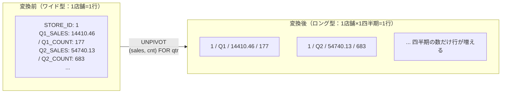

もし「売上」と「件数」を別々に`UNPIVOT`してしまうとどうなるでしょうか。
```sql
-- 【NG例】売上と件数を個別にUNPIVOTしてしまう
UNPIVOT ( sales FOR qtr IN ( q1_sales AS 'Q1', q2_sales AS 'Q2', ... ) )
```
この書き方では「売上」の行だけが4行、別クエリで「件数」の行だけが4行と、バラバラの結果セットになってしまいます。両者を1つの表にまとめるには、`STORE_ID`と`QTR`をキーにして2つの結果を`JOIN`し直す手間が発生し、せっかくの`UNPIVOT`のシンプルさが失われてしまいます。

これを避けるのが、`UNPIVOT`の括弧を使った**複数列同時指定**です。
```sql
UNPIVOT (
    ( sales, cnt )              -- ① 出力先の列を「組」として括弧でまとめる
    FOR qtr
    IN (
        ( q1_sales, q1_count ) AS 'Q1',  -- ② 元の列も同じ順序で「組」にする
        ...
    )
)
```
ポイントは、①の出力側`(sales, cnt)`と②の入力側`(q1_sales, q1_count)`の**列の並び順を対応させる**ことです。1番目の要素同士（`sales`と`q1_sales`）、2番目の要素同士（`cnt`と`q1_count`）がそれぞれ対応付けられ、「Q1の売上とQ1の件数」が確実に同じ行にセットで展開されます。これにより、`JOIN`のようなキー結合を一切書かずに、1回の`UNPIVOT`だけで「四半期・売上・件数」という理想的な形の表が完成します。

| 方式 | 書き方 | 出力される行の形 |
| :--- | :--- | :--- |
| シングルカラムUNPIVOT（13-1） | `UNPIVOT ( value FOR item IN ( col1 AS 'A', col2 AS 'B' ) )` | 1項目＝1行（ITEM, VALUEの2列） |
| マルチカラムUNPIVOT（今回） | `UNPIVOT ( (v1, v2) FOR item IN ( (col1a,col1b) AS 'A', ... ) )` | 1項目＝1行だが、複数の値を保ったまま展開（ITEM, V1, V2の3列以上） |

もう一つ、前問（13-10）で学んだ**NULLの扱い**もあわせて確認しておきましょう。今回のデータでは、店舗2の`Q1_SALES`が`NULL`（`Q1_COUNT`は`0`）ですが、期待する結果を見るとこの行はきちんと出力されています。マルチカラムUNPIVOTのデフォルト（`EXCLUDE NULLS`）は、**組にした列（今回は`sales`と`cnt`）が「両方ともNULL」の場合にのみ、その行を除外する**という判定を行います。今回は`cnt`が`0`（NULLではない）ため除外対象にならず、`sales`側だけが`NULL`のまま出力されています。もし「両方ともNULLの四半期は完全に除外したい」場合はデフォルトのままでよく、「片方でも値があれば残したうえで、さらにNULLの行も強制的に残したい」場合は前問同様`UNPIVOT INCLUDE NULLS`を併用することも可能です。

:::message
マルチカラムUNPIVOTを使う際の注意点として、組にする列同士の**データ型を揃えておく必要がある**点は13-1と同じです。加えて、`(sales, cnt)`と`(q1_sales, q1_count)`のように**組の要素数と順序を必ず一致させる**必要があります。順序を間違えると「売上の値が件数列に入ってしまう」といった事故につながるため、実装時は列の並びを指数のように丁寧に確認しましょう。
:::

今回はデータの用意しやすさを優先して`WITH`句で簡略化した3店舗分のサンプルを使いましたが、この技術は実務では「他システムから受け取ったExcel由来のワイド型データ（四半期や月が横に並ぶ集計済みファイル）を、DWH（データウェアハウス）に取り込む前段でロング型に正規化する」といった、データ連携（ETL）の場面でまさに活躍します。13-6・13-7で「PIVOTを使って縦長データを横長に集計する」流れを学びましたが、今回はその **逆方向（横長の集計データを縦長に戻す）** を学んだことになります。PIVOTとUNPIVOTを両方使いこなせると、データの見せ方を目的に応じて自在に組み替えられるようになります。
