# 問題5-1：文字列の結合
### 難易度：★☆☆☆☆ (Lv.1)
## 問題
HRスキーマの **`EMPLOYEES`** テーブルを使用します。
**`MANAGER_ID` が 101** である従業員の、**`FIRST_NAME`**（名）と **`LAST_NAME`**（姓）を結合して、1つの列 **「NAME」** として表示してください。
その際、名と姓の間には **半角スペース** を 1 つ入れてください。
なお、レコードの表示順序は問いません。

## 期待する結果
| EMPLOYEE_ID | NAME            | 
| ----------- | --------------- | 
| 200         | Jennifer Whalen | 
| 203         | Susan Jacobs    | 
| 204         | Hermann Brown   | 
| 205         | Shelley Higgins | 
| 108         | Nancy Gruenberg | 

## 解答例
```sql:例1：「||」演算子を使用
SELECT
    employee_id,
    first_name || ' ' || last_name AS NAME
FROM
    hr.employees
WHERE
    manager_id = 101
```
```sql:例2：CONCAT 関数を使用
SELECT
    employee_id,
    CONCAT(
        CONCAT(first_name, ' '),
        last_name
    ) AS NAME
FROM
    hr.employees
WHERE
    manager_id = 101
```

## 解説
複数の列や文字を1つにまとめる「文字列結合」の解説です。

Oracle SQLで文字列を結合するには、主に2つの方法があります。1つ目は `||`（垂直バー2本）演算子です。
```sql
first_name || ' ' || last_name
```
プログラミングでいう「+」のような感覚で、左右のデータを数珠つなぎに結合できます。今回のように半角スペースを間に入れたい場合は、`' '`（シングルクォーテーション）で囲んで書きます。

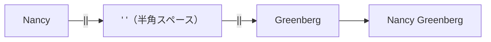

もう1つは `CONCAT` 関数ですが、Oracleの `CONCAT` には少しクセがあります。
```sql
CONCAT(文字列1, 文字列2)
```
Oracleの `CONCAT` は2つの引数しか受け取れません。そのため「名前 + スペース + 名字」のように3つを結合したい場合は、解答例2のようにCONCATの中にCONCATを書く入れ子構造が必要になります。

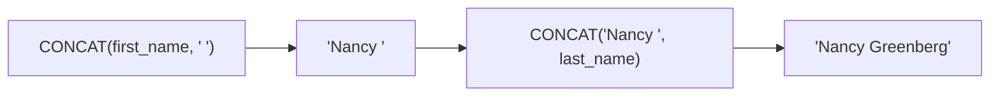

| 方法 | 3つ以上結合する場合 | 実務での使用頻度 |
| :--- | :--- | :--- |
| `\|\|` 演算子 | いくつでも `\|\|` でつなげるだけ | ◎ 圧倒的によく使われる |
| `CONCAT` 関数 | 2引数までなので入れ子が必要 | △ あまり使われない |

実務では、圧倒的に `||` 演算子の方が好まれます。私自身、`CONCAT`の入れ子を書いた記憶はほとんどなく、3つ以上を結合したい場面では最初から `||` で書いています。

Oracleならではの面白い挙動もあります。多くのデータベース（SQL ServerやPostgreSQLなど）では、文字列にNULLを結合すると結果全体がNULLになりますが、**Oracleの`||`演算子はNULLを「空文字」として扱います。**

| データベース | `'Nancy' \|\| NULL` の結果 |
| :--- | :--- |
| Oracle | `'Nancy'`（NULLは空文字扱い） |
| SQL Server / PostgreSQL 等 | `NULL`（結果全体がNULLになる） |

この仕様のおかげで、ミドルネームがある人とない人が混ざっているようなデータでも、エラーやデータ消失を気にせず結合できます。

なお、結合した結果には元のカラム名がないため、そのまま出力するとヘッダーが `FIRST_NAME||' '||LAST_NAME` のような不格好なものになってしまいます。今回のように `AS NAME` で別名を付けておくのを忘れないようにしてください。

## 参考リンク
https://www.shift-the-oracle.com/sql/functions/concat.html

----
<br><br>

# 問題5-2：文字列の分割（文字数で分割）
### 難易度：★☆☆☆☆ (Lv.1)
## 問題
HRスキーマの `employees` テーブルを使用します。
`manager_id` が「101」であり、かつ `phone_number` が「1.」から始まるデータを対象に、電話番号を4つの項目に分割して抽出してください。
なお、対象の電話番号は「1桁.3桁.3桁.4桁」の形式で格納されています。今回の演習では、デリミタ（区切り文字）ではなく、「文字数（開始位置と桁数）」を指定して分割してください。
* 分割後の列名は左から `PN1`, `PN2`, `PN3`, `PN4` とすること。
* 結果の並び順は問わない（順不同）。

## 期待する結果
| EMPLOYEE_ID | PHONE_NUMBER   | PN1 | PN2 | PN3 | PN4 | 
| ----------- | -------------- | --- | --- | --- | --- | 
| 200         | 1.515.555.0165 | 1   | 515 | 555 | 165 | 
| 203         | 1.515.555.0168 | 1   | 515 | 555 | 168 | 
| 204         | 1.515.555.0169 | 1   | 515 | 555 | 169 | 
| 205         | 1.515.555.0170 | 1   | 515 | 555 | 170 | 
| 108         | 1.515.555.0108 | 1   | 515 | 555 | 108 | 

## 解答例
```sql
SELECT
    employee_id,
    phone_number,
    SUBSTR(phone_number, 1, 1) AS PN1,
    SUBSTR(phone_number, 3, 3) AS PN2,
    SUBSTR(phone_number, 7, 3) AS PN3,
    SUBSTR(phone_number, 11, 4) AS PN4
FROM
    hr.employees
WHERE
    manager_id = 101
AND phone_number LIKE '1.%'
```

## 解説
前回の「結合」とは逆の操作、文字列の切り出し（分割）です。特定のルールで並んでいるデータから必要なパーツだけを抜き出す技術は、データのクリーニングや整形で必須のスキルになります。

文字列の一部を抽出するには `SUBSTR` 関数を使います。
```sql
SUBSTR( [対象の文字列], [開始位置], [抽出する文字数] )
```
第1引数は元となる文字列やカラム名、第2引数は何文字目からスタートするか（1文字目を「1」としてカウントします）、第3引数はそこから何文字分を切り取るかです。

電話番号 `1.515.555.0165` を文字位置で分解すると、次のようになります。

| 文字位置 | 1 | 2 | 3 | 4 | 5 | 6 | 7 | 8 | 9 | 10 | 11 | 12 | 13 | 14 |
| :---: | :---: | :---: | :---: | :---: | :---: | :---: | :---: | :---: | :---: | :---: | :---: | :---: | :---: | :---: |
| 文字 | 1 | . | 5 | 1 | 5 | . | 5 | 5 | 5 | . | 0 | 1 | 6 | 5 |
| 項目 | PN1 | (.) | PN2 | PN2 | PN2 | (.) | PN3 | PN3 | PN3 | (.) | PN4 | PN4 | PN4 | PN4 |

| 項目 | SUBSTR の書き方 | 開始位置 | 文字数 |
| :--- | :--- | :---: | :---: |
| PN1 | `SUBSTR(phone_number, 1, 1)` | 1文字目 | 1文字 |
| PN2 | `SUBSTR(phone_number, 3, 3)` | 3文字目 | 3文字 |
| PN3 | `SUBSTR(phone_number, 7, 3)` | 7文字目 | 3文字 |
| PN4 | `SUBSTR(phone_number, 11, 4)` | 11文字目 | 4文字 |

ピリオドの分だけ開始位置がずれていく、と考えると計算しやすいと思います。

`WHERE` 句の `phone_number LIKE '1.%'` は、「1」で始まり、その直後にピリオドが来るデータだけに絞り込むための条件です。これにより、今回想定している「1-3-3-4」の桁数ルールに合わないイレギュラーなデータを除外しています。

今回の解き方は「データの桁数が常に一定である」という前提に基づいた固定長分割です。書き方がシンプルで処理も速い一方、もし `1.50.555.0165` のように途中の桁数が変わるデータが混ざると、切り出し位置がズレてピリオドまで一緒に切り取ってしまう可能性があります。桁数がバラバラな場合は、`INSTR` 関数で「ピリオドが何文字目にあるか」を先に探してから `SUBSTR` を組み合わせる、というもう一段階高度なテクニックが必要になります。

:::message
### マジックナンバーには理由をコメントで残す
実務で `SUBSTR(..., 7, 3)` のように書くときは、「7文字目は市外局番の開始位置」のようにコメントを添えておくと、後から読む人（多くの場合は数ヶ月後の自分）が助かります。数字だけだと、なぜ7なのかがすぐに分からなくなるからです。
:::

## 参考リンク
https://www.shift-the-oracle.com/sql/functions/substr.html
https://www.shift-the-oracle.com/sql/functions/regexp_substr.html

----
<br><br>

# 問題5-3：文字列の置換（REPLACE関数）
### 難易度：★★☆☆☆ (Lv.2)
## 問題
HRスキーマの `departments` テーブルを使用します。
`department_id` が「100」より小さいデータを対象に、部署名（`department_name`）に含まれる**大文字の「A」を「X」に置換**して抽出してください。
* 置換後の列名は `department_name_a_to_x` とすること。
* 小文字の「a」は置換の対象に含めないでください。
* 結果の並び順は問わない（順不同）。

## 期待する結果
| DEPARTMENT_NAME  | DEPARTMENT_NAME_A_TO_X | 
| ---------------- | ---------------------- | 
| Administration   | Xdministration         | 
| Marketing        | Marketing              | 
| Purchasing       | Purchasing             | 
| Human Resources  | Human Resources        | 
| Shipping         | Shipping               | 
| IT               | IT                     | 
| Public Relations | Public Relations       | 
| Sales            | Sales                  | 
| Executive        | Executive              | 

## 解答例
```sql
SELECT
    department_name,
    REPLACE(department_name, 'A', 'X') AS department_name_a_to_x
FROM
    hr.departments
WHERE
    department_id < 100
```

## 解説
データクレンジング（データの整理）で最も頻繁に登場する関数の一つ、`REPLACE` 関数の解説です。「特定の文字を別の文字に入れ替える」というシンプルな操作ですが、大文字・小文字の扱いなど押さえておくべきポイントがいくつかあります。
```sql
REPLACE( [対象の文字列], [探したい文字], [置換後の文字] )
```
対象となる文字列を左から順番にスキャンし、探したい文字と一致する部分を見つけるたびに置換後の文字へ書き換えていきます。

今回の問題の最大のポイントは、Oracle SQLの `REPLACE` 関数が**大文字と小文字を「別の文字」として扱う**という点です。

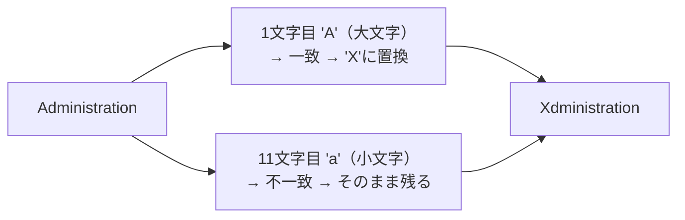

`REPLACE('Administration', 'A', 'X')` を実行すると、1文字目の大文字'A'は一致するので'X'に変わりますが、11文字目の小文字'a'は一致しないと判定されるためそのまま残ります。実際、期待する結果を見ても、先頭に大文字のAを持つ `Administration` だけが変化し、`Marketing` や `Purchasing` に含まれる小文字の'a'は無視されています。

| 部署名 | 大文字'A'の有無 | 置換結果 |
| :--- | :---: | :--- |
| Administration | あり（先頭） | Xdministration |
| Marketing | なし（'a'は小文字） | Marketing（変化なし） |
| Purchasing | なし（'a'は小文字） | Purchasing（変化なし） |

第3引数（置換後の文字）を省略するか空の文字列（`''`）を指定すると、特定の文字を削除できます。例えば `REPLACE('03-1234-5678', '-', '')` とすればハイフンが除去され `'0312345678'` になります。この使い方は実務でも頻出です。

実務でよく混同されるのが `TRANSLATE` 関数です。`REPLACE` は「文字列（塊）」で探すのに対し、`TRANSLATE` は「1文字ずつ」バラバラに変換します。詳しくは次の問題で扱います。もし「大文字のAも小文字のaも全部Xにしたい」という場合は、一度 `UPPER` 関数で大文字に揃えてから `REPLACE` するか、正規表現を使った `REGEXP_REPLACE` を使うのが一般的です。

## 参考リンク
https://www.shift-the-oracle.com/sql/functions/replace.html

----
<br><br>

# 問題5-4：文字列の置換２
### 難易度：★★☆☆☆ (Lv.2)
## 問題
HRスキーマの`DEPARTMENTS`テーブルより、`DEPARTMENT_ID`が100より小さいデータを選択してください。
その際、`DEPARTMENT_NAME`に含まれる文字「A」を「X」に、「a」を「x」に置換して表示してください（大文字・小文字の両方を置換すること）。なお、結果の表示順は問いません。

## 期待する結果
| DEPARTMENT_NAME  | DEPARTMENT_NAME_A_TO_X | 
| ---------------- | ---------------------- | 
| Administration   | Xdministrxtion         | 
| Marketing        | Mxrketing              | 
| Purchasing       | Purchxsing             | 
| Human Resources  | Humxn Resources        | 
| Shipping         | Shipping               | 
| IT               | IT                     | 
| Public Relations | Public Relxtions       | 
| Sales            | Sxles                  | 
| Executive        | Executive              | 

## 解答例
```sql
SELECT
    department_name,
    TRANSLATE(department_name, 'Aa', 'Xx') AS department_name_a_to_x
FROM
    hr.departments
WHERE
    department_id < 100
```

## 解説
前問（5-3）では `REPLACE` で「大文字のみ」を置換しましたが、今回は「大文字も小文字もまとめて」置換します。ここで登場するのが `TRANSLATE` 関数です。
```sql
TRANSLATE( [対象文字列], [置換前の文字リスト], [置換後の文字リスト] )
```
`TRANSLATE` は、2番目の引数と3番目の引数を「位置」で対応させ、文字列を1文字ずつ変換します。今回の `TRANSLATE(department_name, 'Aa', 'Xx')` では、内部的に「Aを見つけたらXに、aを見つけたらxに変換する」という対応表が作られています。

**対応表のイメージ**

| 置換前の文字（第2引数） | A | a |
| :---: | :---: | :---: |
| 置換後の文字（第3引数） | X | x |

`REPLACE` が「塊（単語）」で探すのに対し、`TRANSLATE` は「文字のリスト」として処理するのが最大の違いです。

| 関数 | 処理単位 | 得意なこと |
| :--- | :--- | :--- |
| `REPLACE` | 塊（単語）ごと | 「A」を「Apple」に変えるような長さの違う置換 |
| `TRANSLATE` | 1文字ずつ | 大文字・小文字の同時変換、複数文字の一括変換 |

`TRANSLATE` は「表記ゆれの修正」で特に力を発揮します。例えば全角英数字を半角にしたい場合、`TRANSLATE(col, '０１２３...', '0123...')` と書けば一度にすべての数字を変換できます。`REPLACE` で同じことをやろうとすると10回書く必要があるので、この差はかなり大きいです。私は以前、`REPLACE` を5重くらいに入れ子にしたコードをレビューで見かけたことがあり、`TRANSLATE` 1回で書き換えられると気づいたときはかなりすっきりした記憶があります。

:::message
### 暗号化やフォーマット変換の場面で真価を発揮する
実務では、全角英数を半角に直したり、特定の伏せ字（マスキング）を作ったりする場面で `TRANSLATE` がよく使われます。`REPLACE` を何重にも入れ子にするくらいなら、`TRANSLATE` 1回で済ませられないか検討してみる価値はあります。
:::

## 参考リンク
https://www.shift-the-oracle.com/sql/functions/translate.html

----
<br><br>

# 問題5-5：大文字・小文字変換
### 難易度：★★☆☆☆ (Lv.2)
## 問題
COスキーマの`CUSTOMERS`テーブルより、`FULL_NAME`と、`EMAIL_ADDRESS`を以下のルールで加工した値（`EMAIL_NAME`）を比較し、**両者が一致しないデータ**を取得してください。

**【EMAIL_ADDRESSの加工ルール】**
1. 文字列から「@internalmail」を削除する。
2. ドット「.」を半角スペースに置換する。
3. スペースで区切られた各単語の先頭文字を大文字、それ以外を小文字に変換する（INITCAP）。
結果は`CUSTOMER_ID`の昇順で表示してください。

## 期待する結果
| CUSTOMER_ID | EMAIL_ADDRESS                   | FULL_NAME             | EMAIL_NAME         | 
| ----------- | ------------------------------- | --------------------- | ------------------ | 
| 123         | erda.sheer@internalmail         | erda Sheer            | Erda Sheer         | 
| 194         | norman.s.lobregat@internalmail  | Norman Simon Lobregat | Norman S Lobregat  | 
| 195         | tim.d.blasingim@internalmail    | Tim Dominic Blasingim | Tim D Blasingim    | 
| 227         | son.mclagan@internalmail        | Son McLagan           | Son Mclagan        | 
| 251         | dannie.mccoin@internalmail      | Dannie McCoin         | Dannie Mccoin      | 
| 262         | kendrick.mcmurtrey@internalmail | Kendrick McMurtrey    | Kendrick Mcmurtrey |

## 解答例
```sql
SELECT
    CUSTOMER_ID,
    EMAIL_ADDRESS,
    FULL_NAME,
    INITCAP(replace(replace( EMAIL_ADDRESS ,'@internalmail', ''  ), '.', ' ')) as email_name
FROM
    CO.CUSTOMERS
where NOT(FULL_NAME = 
    INITCAP(replace(replace( EMAIL_ADDRESS ,'@internalmail', ''  ), '.', ' ')))
order by customer_id
```

## 解説
複数の関数を入れ子（ネスト）にして、「メールアドレスから氏名を推測し、登録されている正解の氏名と比較する」という、データの不整合をチェックする際によく使うテクニックです。

今回の主役は `INITCAP` 関数です。
```sql
INITCAP( [対象の文字列] )
```
`INITCAP` は "Initial Capital" の略で、各単語の先頭文字を大文字に、それ以外を小文字にします。単語の区切りはスペースだけでなく、ピリオド（`.`）やハイフン（`-`）なども認識されます（例：`tim.d.blasingim` → `Tim.D.Blasingim`）。

解答例の計算式は内側から順番に実行されます。
```sql
INITCAP( REPLACE( REPLACE( EMAIL_ADDRESS, '@internalmail', '' ), '.', ' ' ) )
```

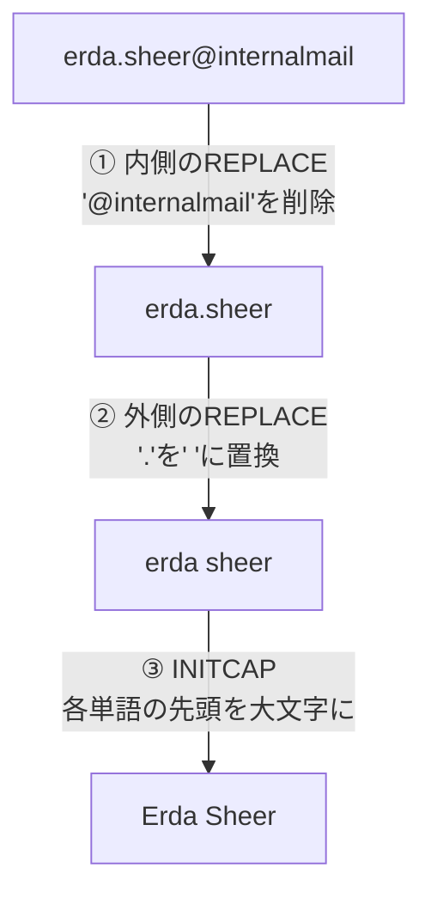

一番内側のREPLACEで `EMAIL_ADDRESS` から `@internalmail` を取り除き（`erda.sheer@internalmail` → `erda.sheer`）、外側のREPLACEでピリオドをスペースに置き換え（`erda.sheer` → `erda sheer`）、最後にINITCAPで各単語の先頭を大文字にします（`erda sheer` → `Erda Sheer`）。複雑な式に出会ったら、こうして一番内側から順に何が起きているかを追っていくのがコツです。

面白いのは、なぜ `FULL_NAME` と `EMAIL_NAME` が一致しないケースが存在するのかという点です。理由は大きく3つあります。

| 不一致の原因 | 具体例 | 内容 |
| :--- | :--- | :--- |
| ① 大文字・小文字の差 | `erda Sheer` vs `Erda Sheer` | FULL_NAMEの先頭が小文字のまま登録されている |
| ② データの欠落 | `Norman Simon Lobregat` vs `Norman S Lobregat` | メールにはイニシャル(`s`)しかないが、氏名にはフルネーム(`Simon`)が登録されている |
| ③ INITCAPの仕様 | `McLagan` vs `Mclagan` | INITCAPは先頭以外を強制的に小文字にするため、内部の大文字`L`が消える |

この3つ目のパターンに気づけるかどうかが、この問題の面白いところだと思います。

なお `WHERE NOT(A = B)` は `WHERE A <> B` と書いても同じ意味になりますが、複雑な条件式全体を否定したいときは `NOT(...)` で囲む書き方の方が視認性が上がることがあります。

## 参考リンク
https://www.shift-the-oracle.com/sql/functions/upper-lower-initcap.html

----
<br><br>

# 問題5-6：文字列のパディング
### 難易度：★★☆☆☆ (Lv.2)
## 問題
HRスキーマの`EMPLOYEES`テーブルより、`EMPLOYEE_ID`が200より大きいデータについて、以下の通り編集した値を取得してください。なお、結果の表示順は問いません。

**【編集ルール】**
* **EMP_ID6**：`EMPLOYEE_ID`を6桁にする。6桁に満たない場合は、左側を「0（ゼロ）」で埋めて表示すること。
* **EMAIL10**：`EMAIL`を10桁にする。10桁に満たない場合は、右側を「X」で埋めて表示すること。

## 期待する結果
| EMP_ID6 | EMAIL10    | 
| ------- | ---------- | 
| 201     | MMARTINEXX | 
| 202     | PDAVISXXXX | 
| 203     | SJACOBSXXX | 
| 204     | HBROWNXXXX | 
| 205     | SHIGGINSXX | 
| 206     | WGIETZXXXX | 

## 解答例
```sql
SELECT
    LPAD(employee_id, 6, '0') as "EMP_ID6",
    RPAD(email, 10, 'X') as "EMAIL10"
FROM
    hr.employees
WHERE
    employee_id > 200
```

## 解説
データの桁数を揃えて見た目やフォーマットを整える「パディング（穴埋め）」のテクニックです。システム間のデータ連携（CSV出力や固定長ファイル作成）では欠かせない、実用性の高い関数です。

`LPAD`（Left Pad）は文字列の左側を埋めます。主に数値を0埋め（ゼロパディング）したいときに使います。
```sql
LPAD( [対象], [全体の桁数], [埋める文字] )
```

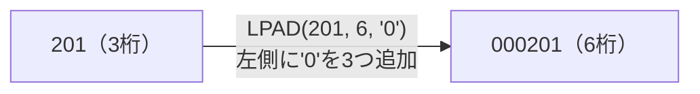

`RPAD`（Right Pad）は文字列の右側を埋めます。名称などのテキストを固定長にしたいときに使います。
```sql
RPAD( [対象], [全体の桁数], [埋める文字] )
```


| 関数 | 埋める方向 | 主な用途 |
| :--- | :--- | :--- |
| `LPAD` | 左側 | 数値のゼロパディング（例：201 → 000201） |
| `RPAD` | 右側 | テキストの固定長化（例：PFAY → PFAYXXXXXX） |

知っておくと得するポイントが2つあります。1つ目は、もし元のデータが指定桁数より長かった場合の挙動です。例えば `LPAD('1234567', 5, '0')` のように指定桁数（5）より元のデータ（7文字）が長いと、右側が切り捨てられて `'12345'` になります。「埋める」だけでなく「長さを強制的に固定する」という側面も持っている点は覚えておいて損はありません。2つ目は、埋める文字（第3引数）を省略した場合はデフォルトで半角スペースが使われる点です（`RPAD('HELLO', 10)` → `'HELLO     '`）。これは固定長形式のレポート作成でよく使われるパターンです。

実務では、コード体系を揃えて並び替えを正しく行う場面（`1`番と`100`番を`00001`と`00100`のように統一する）や、バーコード用データの生成、銀行振込データ（全銀フォーマット）のような決められた文字数での送信データ作成に、この2つの関数が使われます。

## 参考リンク
https://www.shift-the-oracle.com/sql/functions/lpad.html
https://www.shift-the-oracle.com/sql/functions/rpad.html

----
<br><br>

# 問題5-7：文字列のトリミング
### 難易度：★★☆☆☆ (Lv.2)
## 問題
COスキーマの`SHIPMENTS`テーブルより、`SHIPMENT_ID`が150から159のデータを選択し、`DELIVERY_ADDRESS`に対して以下の編集を行った値を取得してください。なお、結果の表示順は問いません。

**【編集ルール】**
* `DELIVERY_ADDRESS`の先頭部分から、文字列「Chatfield, 」を構成する文字を除去する。
* `DELIVERY_ADDRESS`の末尾部分から、文字列「 USA」を構成する文字を除去する。

## 期待する結果
| SHIPMENT_ID | DELIVERY_ADDRESS           | L_TRIM                     | R_TRIM                 | 
| ----------- | -------------------------- | -------------------------- | ---------------------- | 
| 150         | Boca Raton, FL 33433 USA   | Boca Raton, FL 33433 USA   | Boca Raton, FL 33433   | 
| 151         | Rutland, OH 45775 USA      | Rutland, OH 45775 USA      | Rutland, OH 45775      | 
| 153         | Lakeland, FL 33803 USA     | Lakeland, FL 33803 USA     | Lakeland, FL 33803     | 
| 154         | Falls Church, VA 22043 USA | Falls Church, VA 22043 USA | Falls Church, VA 22043 | 
| 155         | Chatfield, OH 44825 USA    | OH 44825 USA               | Chatfield, OH 44825    | 
| 156         | Chatfield, OH 44825 USA    | OH 44825 USA               | Chatfield, OH 44825    | 
| 157         | Dalmatia, PA 17017 USA     | Dalmatia, PA 17017 USA     | Dalmatia, PA 17017     | 
| 158         | Dalmatia, PA 17017 USA     | Dalmatia, PA 17017 USA     | Dalmatia, PA 17017     | 
| 159         | Fonda, NY 12068 USA        | Fonda, NY 12068 USA        | Fonda, NY 12068        |

## 解答例
```sql
SELECT
    shipment_id,
    delivery_address,
    LTRIM(delivery_address, 'Chatfield, ') AS "L_TRIM",
    RTRIM(delivery_address, ' USA')        AS "R_TRIM"
FROM
    co.shipments
WHERE
    shipment_id BETWEEN 150 AND 159
```

## 解説
文字列の端にある不要な部分を削り取る `TRIM` 系関数の解説です。データの入力ミスで紛れ込んだ不要なスペースや、特定のプレフィックス・サフィックスを一括で除去したいときに重宝します。

Oracleには削り取る方向に応じて2つの関数が用意されています。`LTRIM`（Left Trim）は文字列の左側（先頭）から指定した文字を取り除き、`RTRIM`（Right Trim）は右側（末尾）から取り除きます。
```sql
LTRIM( [対象], [削除したい文字の集合] )
RTRIM( [対象], [削除したい文字の集合] )
```

ここで一番の注意点があります。Oracleの `LTRIM` / `RTRIM` の第2引数は「ひとまとまりの文字列」ではなく、**「削除したい文字のセット」** として扱われます。

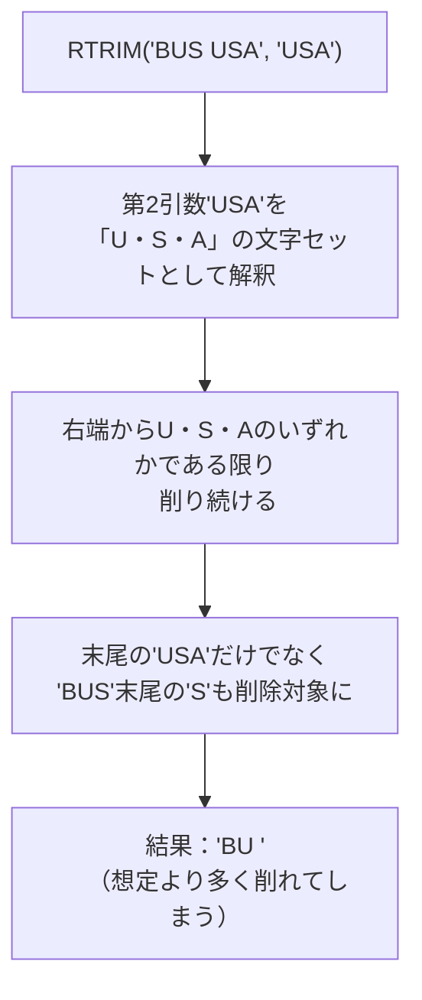

例えば `RTRIM('BUS USA', 'USA')` と書いた場合、Oracleは「USAという単語を探す」のではなく、「右端にUかSかAがある限り削り続ける」という動きをします。末尾の `USA` だけでなく、`BUS` の最後にある `S` も削除対象に含まれてしまうため、結果は `'BU '` になってしまいます。この仕様を知らずに使うと、想定より多くの文字が削られてしまうことがあるので気をつけてください。

| 関数 | 第2引数の意味 | 誤解しやすい点 |
| :--- | :--- | :--- |
| `LTRIM(col, 'ABC')` | 'A'・'B'・'C'のいずれかの文字を左から削り続ける | 「ABC」という単語を探すわけではない |
| `RTRIM(col, 'ABC')` | 'A'・'B'・'C'のいずれかの文字を右から削り続ける | 「ABC」という単語を探すわけではない |

実務で一番多いのは、第2引数を省略して `LTRIM(col)` や `RTRIM(col)` と書くパターンです。この場合はデフォルトで半角スペースが削除されます。それ以外にも、CSVデータの前後にあるダブルクォーテーションの除去や、商品コードの先頭に付いている「ID-」のようなプレフィックスの除去にも使われます。

期待する結果を見ると、`Chatfield,` で始まる住所（155番・156番）だけが左側を削られ、それ以外の住所（Boca Ratonなど）は対象の文字が先頭にないため何も削られずそのまま表示されています。この「一致しなければ何もしない」という挙動も、実際に使う上で押さえておきたいポイントです。

## 参考リンク
https://www.shift-the-oracle.com/sql/functions/ltrim.html
https://www.shift-the-oracle.com/sql/functions/rtrim.html
https://www.shift-the-oracle.com/sql/functions/trim.html

----
<br><br>

# 問題5-8：文字列の長さ
### 難易度：★★☆☆☆ (Lv.2)
## 問題
OEスキーマの`PRODUCT_INFORMATION`テーブルより、商品名（`PRODUCT_NAME`）の文字数が**ちょうど24文字**であるデータを取得してください。なお、結果の表示順は問いません。

## 期待する結果
| NAME_LENGTH              | 
| ------------------------ | 
| Laptop 128/12/56/v90/110 | 
| Plasma Monitor 10/LE/VGA | 
| Manual - Vision Tools2.0 | 
| Business Cards Box - 250 | 
| Business Cards - 1000/2L | 

## 解答例
```sql
SELECT
    product_name AS name_length
FROM
    oe.product_information
WHERE
    LENGTH(product_name) = 24
```

## 解説
文字列関数の基本でありながら、データのバリデーション（検証）や分析で重宝する「文字数のカウント」についての解説です。

`LENGTH` 関数は、文字列が何文字あるかを整数で返します。今回の問題では `WHERE` 句の中で使い、「名前の長さがちょうど24文字である行だけ」をフィルタリングしています。

実務、特に日本語環境の開発で知っておくべきなのが「長さ」の考え方が2種類あるという点です。

| 関数 | 数える単位 | 全角文字の扱い | 使いどころ |
| :--- | :--- | :--- | :--- |
| `LENGTH` | 文字数 | 1文字として数える | 画面の表示枠に収まるかを確認したいとき |
| `LENGTHB` | バイト数 | 2〜3バイトとして数える | データベースの定義サイズ（VARCHAR2(100)等）を超えないか確認したいとき |

`LENGTH` はほかにも、「郵便番号なのに7文字（ハイフンなし）でも8文字（ハイフンあり）でもないデータ」のような異常データの特定、`LENGTH(col) = 0` による実質空文字の判定、`ORDER BY LENGTH(product_name)` による名前の短い順での並び替えなど、幅広く使われます。期待する結果を見ると、`Laptop 128/12/56/v90/110` のように記号や数字が入り混じった複雑な名前でも、正確に24文字であるものだけが選ばれています。

## 参考リンク
https://www.shift-the-oracle.com/sql/functions/length.html

----
<br><br>

# 問題5-9：NULLの変換
### 難易度：★★☆☆☆ (Lv.2)
## 問題
HRスキーマの`DEPARTMENTS`テーブルより、`DEPARTMENT_ID`が100から150のデータについて、`DEPARTMENT_ID`とそれに対応する`MANAGER_ID`を取得してください。
ただし、`MANAGER_ID`がNULLの場合は「0」に変換して表示してください。なお、結果の表示順は問いません。

## 期待する結果
| DEPARTMENT_ID | MANAGER_ID | 
| ------------- | ---------- | 
| 100           | 108        | 
| 110           | 205        | 
| 120           | 0          | 
| 130           | 0          | 
| 140           | 0          | 
| 150           | 0          | 

## 解答例
```sql:例1：NVLを使用
SELECT
    department_id,
    NVL(manager_id, 0) AS "MANAGER_ID"
FROM
    hr.departments
WHERE
    department_id BETWEEN 100 AND 150
```
```sql:例2：NVL2を使用
SELECT
    department_id,
    NVL2(manager_id, manager_id ,0)  AS "MANAGER_ID"
FROM
    hr.departments
WHERE
    department_id BETWEEN 100 AND 150
```
```sql:例3：COALESCEを使用
SELECT
    department_id,
    COALESCE(manager_id ,0) AS "MANAGER_ID"
FROM
    hr.departments
WHERE
    department_id BETWEEN 100 AND 150
```
```sql:例4：DECODEを使用
SELECT
    department_id,
    DECODE(manager_id, null, 0, manager_id) AS "MANAGER_ID"
FROM
    hr.departments
WHERE
    department_id BETWEEN 100 AND 150
```
```sql:例5：CASE式を使用
SELECT
    department_id,
    CASE WHEN manager_id IS NULL THEN 0 ELSE manager_id END AS "MANAGER_ID"
FROM
    hr.departments
WHERE
    department_id BETWEEN 100 AND 150
```

## 解説
SQLの難所であり、実務で最も神経を使う場面の一つ、「NULL値の変換」です。「データがない（NULL）」という状態を、レポートや計算のために「0」などの具体的な値に置き換える処理は、システム開発において避けて通れません。解答例には5つの方法がありますが、それぞれの特徴を整理していきます。

| 方法 | 書き方 | 特徴 |
| :--- | :--- | :--- |
| `NVL` | `NVL(対象, NULLの時の値)` | Oracleの伝統的な書き方。シンプルで最もよく見る |
| `NVL2` | `NVL2(対象, NULLでない時の値, NULLの時の値)` | NULLかどうかで表示を完全に分けたいときに使う（三項演算子的） |
| `COALESCE` | `COALESCE(値1, 値2, 値3...)` | 標準SQL。引数を並べて最初のNULLでない値を返す |
| `DECODE` | `DECODE(対象, null, 0, 対象)` | Oracle独自のif-then-elseロジック |
| `CASE` | `CASE WHEN 対象 IS NULL THEN 0 ELSE 対象 END` | 最も読みやすく、複雑な条件にも対応できる万能選手 |

`NVL` 関数（例1）は「もしNULLならこれに変えて」という、非常にシンプルな指示です。

`NVL2` 関数（例2）は「NULLか、そうでないか」で表示を完全に分けたいときに使います。三項演算子のような動きをします。

`COALESCE` 関数（例3）は標準SQL（どのデータベースでも使える共通の書き方）で、現在最も推奨される書き方です。引数をいくつでも並べられ、「最初に見つかったNULLでない値」を返します。

`DECODE` 関数（例4）はOracle独自のif-then-elseロジックを持つ関数で、等価比較が得意ですが、NULL判定もこのように書けます。

`CASE` 式（例5）は最も読みやすく、どんな複雑な条件にも対応できる万能選手です。文法がプログラミングに近いため、可読性が高くなります。

実務で一番ハマりやすいのが、データ型の不一致です。`NVL(manager_id, 'なし')` のように書くと、Oracleに怒られます。`manager_id` が数値型なら、変換後の値も数値（0など）でなければなりません。もし「なし」という文字列にしたいなら、`NVL(TO_CHAR(manager_id), 'なし')` のように先に型を変換する必要があります。

**使い分けの目安**

| 状況 | おすすめ |
| :--- | :--- |
| 将来的に他DB（PostgreSQL等）への移行を意識する | `COALESCE`（標準SQL） |
| Oracle前提でとにかく短く書きたい | `NVL` |
| 複雑なロジックが混ざる | `CASE` |
| 既存の古いシステムを保守する（新規では非推奨） | `DECODE` |

期待する結果を見ると、本来はマネージャーがいないはずの `DEPARTMENT_ID` 120番以降に、しっかり「0」という数字が入っています。これで、この結果をそのままExcelに貼り付けて合計計算などをしても、エラーにならずに処理できるようになります。

## 参考リンク
https://www.youtube.com/watch?v=z-wOgiLz9Nk&t=296s
https://www.shift-the-oracle.com/sql/functions/nvl-coalesce.html
https://www.shift-the-oracle.com/sql/functions/nullif.html
https://www.shift-the-oracle.com/sql/functions/decode.html

----
<br><br>

# 問題5-10：文字列の分割（正規表現）
### 難易度：★★★☆☆ (Lv.3)
## 問題
OEスキーマの`CUSTOMERS`テーブルより、`CUSTOMER_ID`が150から159の顧客を対象として、所得レベル（`INCOME_LEVEL`）を「RANK」「LOWER」「UPPER」の3つの項目に分割して抽出してください。なお、結果の表示順は問いません。
分割のルールは以下の通りとします。

**【分割・変換ルール】**
| 元の表記パターン | RANK | LOWER（下限） | UPPER（上限） |
| --- | --- | --- | --- |
| **通常形式**（例：`A: 1000 - 2000`） | A | 1000 | 2000 |
| **～未満**（例：`A: Below 1000`） | A | **`<`** | 1000 |
| **～以上**（例：`A: 1000 and above`） | A | 1000 | **`>=`** |

※数値部分にカンマ（,）が含まれる場合はそのまま抽出し、「Below」や「and above」などの不要な文字列は取り除いてください。

## 期待する結果
| CUSTOMER_ID | INCOME_LEVEL         | RANK | LOWER   | UPPER   | 
| ----------- | -------------------- | ---- | ------- | ------- | 
| 150         | D: 70,000 - 89,999   | D    | 70,000  | 89,999  | 
| 151         | F: 110,000 - 129,999 | F    | 110,000 | 129,999 | 
| 152         | A: Below 30,000      | A    | <       | 30000   | 
| 153         | I: 170,000 - 189,999 | I    | 170,000 | 189,999 | 
| 154         | L: 300,000 and above | L    | 300000  | >=      | 
| 155         | E: 90,000 - 109,999  | E    | 90,000  | 109,999 | 
| 156         | F: 110,000 - 129,999 | F    | 110,000 | 129,999 | 
| 157         | G: 130,000 - 149,999 | G    | 130,000 | 149,999 | 
| 158         | J: 190,000 - 249,999 | J    | 190,000 | 249,999 | 
| 159         | G: 130,000 - 149,999 | G    | 130,000 | 149,999 | 

## 解答例
```sql
SELECT
    customer_id,
    income_level,
    -- 1番目の項目（レベル記号など）
    TRIM(REGEXP_SUBSTR(income_level, '[^:-]+', 1, 1)) AS rank,
    -- 2番目の項目（下限値など）
    CASE
        WHEN ( REGEXP_LIKE ( income_level,
                             'Below' ) ) THEN
            '<'
        WHEN ( REGEXP_LIKE ( income_level,
                             'above' ) ) THEN
            REGEXP_REPLACE(
                TRIM(REGEXP_SUBSTR(income_level, '[^:-]+', 1, 2)),
                '[^0-9]',
                ''
            )
        ELSE
            TRIM(REGEXP_SUBSTR(income_level, '[^:-]+', 1, 2))
    END                                               AS "LOWER",
    -- 3番目の項目（上限値など）
    CASE
        WHEN ( REGEXP_LIKE ( income_level,
                             'Below' ) ) THEN
            REGEXP_REPLACE(
                TRIM(REGEXP_SUBSTR(income_level, '[^:-]+', 1, 2)),
                '[^0-9]',
                ''
            )
        WHEN ( REGEXP_LIKE ( income_level,
                             'above' ) ) THEN
            '>='
        ELSE
            TRIM(REGEXP_SUBSTR(income_level, '[^:-]+', 1, 3))
    END                                               AS "UPPER"
FROM
    oe.customers
WHERE customer_id BETWEEN  150 AND 159
```

## 解説
不規則な形式で保存されている文字列から、正規表現（Regular Expression）を使って特定のパターンを抜き出す、比較的高度なデータ加工の問題です。実務でも「自由入力に近い備考欄から数値だけ抜き出す」といった場面でこのスキルが役立ちます。私も以前、コールセンターの対応メモから金額らしき数字だけを抽出する集計を頼まれたとき、最初は`SUBSTR`と位置計算でゴリ押ししようとして条件分岐が収拾つかなくなり、結局正規表現に書き直した経験があります。パターンさえ見えれば、正規表現の方が圧倒的にすっきり書けます。

今回の解答例では、Oracleが提供する3つの正規表現関数が使われています。

| 関数 | 役割 | 今回の使い方 |
| :--- | :--- | :--- |
| `REGEXP_SUBSTR` | パターンに一致する部分文字列を切り出す | コロンやハイフンで区切られた塊を順番に取り出す |
| `REGEXP_LIKE` | パターンに一致するかを真偽値で判定する | 「Below」や「above」が含まれるかを判定する |
| `REGEXP_REPLACE` | パターンに一致する部分を置換する | 数字以外を除去して純粋な数値だけ残す |

`REGEXP_SUBSTR` は、指定したパターンに一致する部分文字列を切り出します。`'[^:-]+'` は「コロン（`:`）でもハイフン（`-`）でもない文字が1つ以上続く塊」という意味で、`[^ ... ]` は「〜以外の文字」を表す記法です。第3引数・第4引数の `1, n` は「1文字目から探し始めて、n番目に見つかった塊を取得する」という指定で、これにより記号で区切られたパーツを順番に取り出せます。

**例：`D: 70,000 - 89,999` を `[^:-]+` で分解**

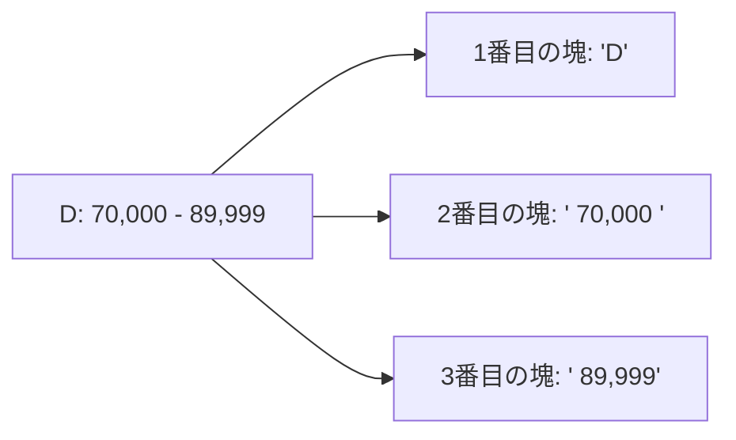

`REGEXP_LIKE` は `LIKE` の正規表現版です。`REGEXP_LIKE(income_level, 'Below')` は、文字列の中に「Below」というパターンが含まれているかを真偽値で返します。CASE式の条件分岐のトリガーとして使いやすい関数です。

`REGEXP_REPLACE` は、パターンに一致する部分を別の文字（または空）に置き換えます。`'[^0-9]'` は「数字以外」を意味し、これを空文字に置換することで「Below 30,000」から「30000」だけを取り出す、といった数値抽出を実現しています。

RANKは最初の区切り記号（`:`）の前にある文字を抜き出して空白を消すだけなので単純です。LOWERとUPPERはCASE式で3パターンに分岐させています。

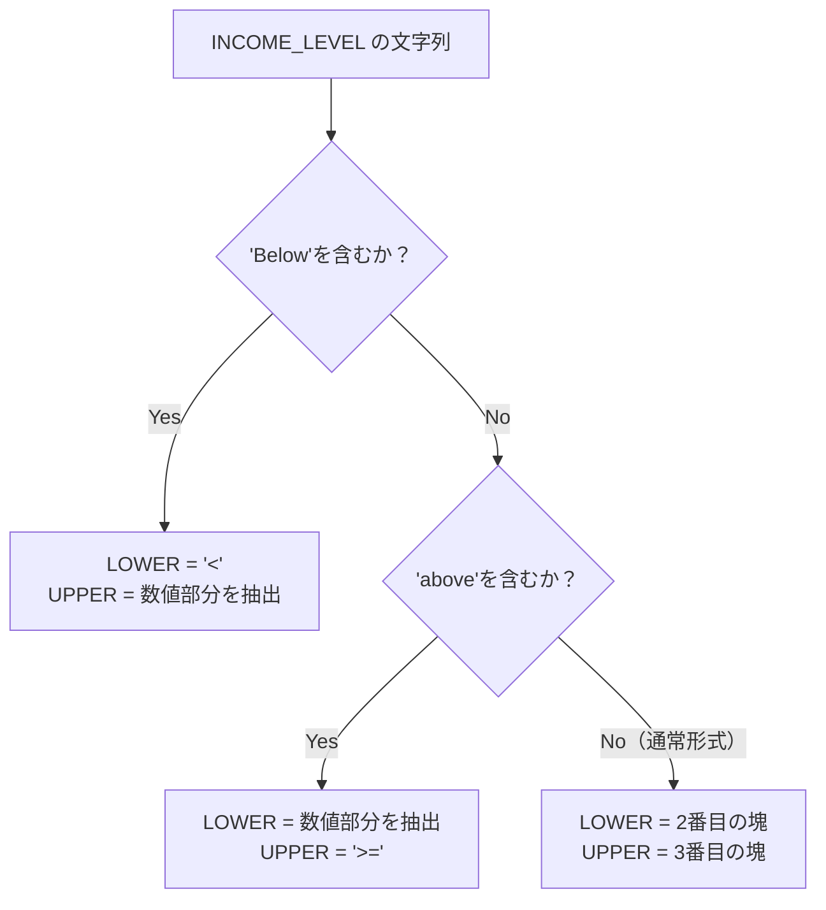

「Below X」の形式では`REGEXP_LIKE`で検知して固定文字`<`を表示し、「X and above」の形式では`REGEXP_REPLACE`で「and above」やカンマなどの数字以外を除去して純粋な数値だけを残し、通常形式では該当する塊をそのまま取得する、という流れです。

今回のように「数値の桁数がバラバラ」で「特定の単語が混ざる」データの場合、通常の関数だけで対応しようとすると`CASE`式や位置計算が何重にもなって読みづらくなりがちです。パターンの共通項を見つけ出し、正規表現でまとめて表現できるかどうかは、SQLを書き慣れているかどうかの分かれ目になると思います。

なお正規表現は非常に強力ですが、処理速度は通常の`SUBSTR`よりも少し遅くなる傾向があります。数百万件のデータをミリ秒単位で処理するような場面では注意が必要ですが、今回のようなレポート作成やデータ移行の場面では、読みやすさを優先して正規表現を選ぶ判断で問題ないと思います。

## 参考リンク
https://www.youtube.com/watch?v=K8xwIdkwtHg
https://www.shift-the-oracle.com/sql/functions/regexp_like.html
https://www.shift-the-oracle.com/sql/functions/regexp_substr.html
https://www.shift-the-oracle.com/sql/functions/regexp_replace.html

----
<br><br>

# 【完全版】問題5-11：文字列のマスキング（シーザー暗号風の変換）
### 難易度：★★★☆☆ (Lv.3)
## 問題
HRスキーマの`EMPLOYEES`テーブルより、`DEPARTMENT_ID`が100の従業員を対象に、`FIRST_NAME`、`LAST_NAME`、`EMAIL`、`PHONE_NUMBER`を取得してください。
ただし、取得する際には以下のルールに従って**マスキング**を施してください。
* 対象カラムの**先頭3文字**がアルファベットまたは数字の場合、その3文字をそれぞれ**2文字分後ろにずらす**。アルファベットまたは数字以外の場合は、変換しない。
* 2文字ずらした際、アルファベット（z/Z）や数字（9）の最後を超える場合は、**先頭（a/A/0）に戻る**。
  * （例1）**aBz**D → **cDb**D
  * （例2）**089**123 → **201**123

## 期待する結果
| EMPLOYEE_ID | FIRST_NAME  | LAST_NAME | EMAIL    | PHONE_NUMBER   | 
| ----------- | ----------- | --------- | -------- | -------------- | 
| 108         | Pcpcy       | Itwenberg | PITUENBE | 3.715.555.0108 | 
| 109         | Fcpiel      | Hcxiet    | FHCVIET  | 3.715.555.0109 | 
| 110         | Lqjn        | Ejgn      | LEJEN    | 3.715.555.0110 | 
| 111         | Kuoael      | Uekarra   | KUEIARRA | 3.715.555.0111 | 
| 112         | Lque Manuel | Wtoan     | LOWRMAN  | 3.715.555.0112 | 
| 113         | Nwks        | Rqrp      | NRQPP    | 3.715.555.0113 | 

## 解答例
```sql
WITH
    FUNCTION masking_value (
        p_value IN VARCHAR2
    ) RETURN VARCHAR2
        DETERMINISTIC
    IS
    BEGIN
        RETURN
            CASE
                WHEN REGEXP_LIKE ( SUBSTR(p_value, 1, 3),
                                   '[a-zA-Z0-9]' )THEN
                    TRANSLATE(
                        SUBSTR(p_value, 1, 3),
                        'abcdefghijklmnopqrstuvwxyzABCDEFGHIJKLMNOPQRSTUVWXYZ0123456789',
                        'cdefghijklmnopqrstuvwxyzabCDEFGHIJKLMNOPQRSTUVWXYZAB2345678901'
                    )
                    || SUBSTR(p_value,
                              4,
                              LENGTH(p_value))
                ELSE
                    p_value
            END;
    END;
SELECT
    employee_id,
    masking_value(first_name)   AS first_name,
    masking_value(last_name)    AS last_name,
    masking_value(email)        AS email,
    masking_value(phone_number) AS phone_number
FROM
    hr.employees
WHERE
    department_id = 100
```

## 解説
単なる文字列操作の域を超えて、シーザー暗号（シフト暗号）のようなロジックをSQLの中に組み込む、実践的で難易度の高い問題です。特に、Oracle 12c R1から導入された「WITH句内での関数定義（PL/SQL関数）」を使っている点が、実務でも通用するテクニックだと思います。

通常、関数はデータベースに`CREATE FUNCTION`して保存しますが、このクエリではSQL実行中だけ有効な、いわば使い捨ての関数を定義しています。
```sql
WITH
    FUNCTION masking_value ( p_value IN VARCHAR2 ) RETURN VARCHAR2 ...
SELECT ...
```

これを使うメリットは3つあります。

| メリット | 内容 |
| :--- | :--- |
| ① 再利用性 | `first_name`や`email`など複数カラムに同じ複雑なロジックを適用でき、SQL本体がすっきりする |
| ② メンテナンス性 | ロジックを一箇所にまとめられ、「3文字→4文字」等の変更にも即座に対応できる |
| ③ 権限の問題 | 永続的な関数を作成する権限がない環境でも、この方法なら実行可能 |

私自身、本番に近いデータベースで検証用の関数を作りたいのに権限がない、という場面に何度か出くわしたことがあり、この書き方を知ってからはかなり助けられています。

ロジックの中核は、問題5-4でも登場した`TRANSLATE`関数です。
```sql
TRANSLATE(
    SUBSTR(p_value, 1, 3),
    'abcdef...xyz...012...89',  -- 元の並び
    'cdefgh...zab...234...01'   -- 2文字ずらした並び
)
```
「先頭に戻る」仕組みがポイントで、アルファベットは`'...xyz'`に対して`'...zab'`を対応させることで`y`は`a`に、`z`は`b`にループ（ラップアラウンド）させています。数字も同様に`'...89'`に対して`'...01'`を対応させることで、`9`の次は2つずれて`1`になるように設計されています。

**2文字シフトのイメージ（アルファベット末尾のループ）**

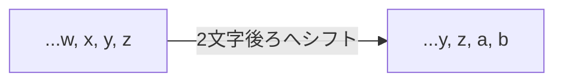

ここで気になるのが、「先頭3文字の中に、記号のようなアルファベットでも数字でもない文字が混ざっていたらどうなるのか」という点です。実はここに、`REGEXP_LIKE`と`TRANSLATE`のうまい役割分担があります。

`SUBSTR(p_value, 1, 3)` に対する正規表現 `[a-zA-Z0-9]` は、「先頭3文字の中にアルファベットか数字が少なくとも1文字でも含まれているか」を判定しています。つまりこの判定自体は「3文字すべてが英数字かどうか」までは見ていません。ではなぜ、記号が変換されずにそのまま残るのかというと、答えは`TRANSLATE`関数側の性質にあります。`TRANSLATE`は、変換前の文字リスト（`'abcdef...'`）に載っていない文字については、何もせずそのまま素通りさせるという仕様になっています。今回のマッピングにはアルファベットと数字しか登録されていないため、先頭3文字の中にピリオドやハイフンのような記号が含まれていても、その文字だけは変換の対象から自然に外れ、結果として「英数字だけが2文字分ずれて、記号はそのまま残る」という挙動になります。

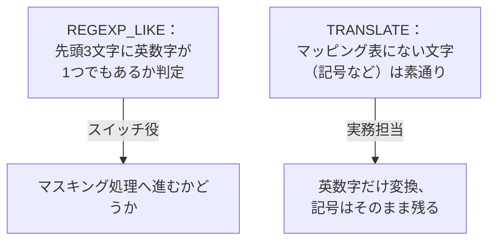

これが実際に効いているのが`PHONE_NUMBER`の例です。先頭3文字`1.5`のうち、英数字である`1`と`5`はそれぞれ`3`と`7`にずれますが、記号のピリオド`.`はマッピング表に存在しないため変換されず、そのまま残ります。結果として`1.5`は`3.7`になります。`REGEXP_LIKE`が「英数字が1文字でも含まれていればマスキング処理に進む」というスイッチの役割、`TRANSLATE`が「英数字だけを個別に変換し、それ以外は素通りさせる」という実務担当、という2段構えになっているわけです。

関数定義にある `DETERMINISTIC` は、「同じ入力値に対しては必ず同じ結果を返す」ことをデータベースに伝えるキーワードです。これを付けるとOracleが結果をキャッシュしてくれるため、大量データを処理する際にパフォーマンスが向上します（同じ「Steven」という名前が100人いても、計算は1回で済みます）。

結果セットを見ると、`Nancy Greenberg`（108番）の`FIRST_NAME`は先頭3文字`Nan`が`Pcp`に、`LAST_NAME`は先頭3文字`Gre`が`Itg`にずれ、それぞれ残りの文字（`cy`、`enberg`）はそのまま結合されて`Pcpcy`、`Itgenberg`になります。`PHONE_NUMBER`も同様に、先頭3文字`1.5`のうち英数字だけが`3.7`にずれ、記号のピリオドはそのまま残った上で、残りの`15.555.0108`が続くため`3.715.555.0108`となります。

:::message
### 可逆マスキングとハッシュ化の違い
このような「可逆的（ルールを知っていれば戻せる）」なマスキングは、開発環境で本番に近いデータを使ってテストしたい時によく使われます。完全に元の値を隠したい場合は、一方向の「ハッシュ化」など別の手法を検討してください。
:::

----
<br><br>

# 【完全版】問題5-12：文字列中の特定文字のカウント
### 難易度：★★★☆☆ (Lv.3)
## 問題
OEスキーマの`CUSTOMERS`テーブルより、メールアドレス（`CUST_EMAIL`）の中に文字列「**XI**」が1つ以上含まれるレコードを取得してください。
出力には、メールアドレス本体と、その中に「XI」がいくつ含まれているかを示すカウント数（`CNT`）を表示してください。なお、結果の表示順は問いません。
## 期待する結果
| CUST_EMAIL                             | CNT | 
| -------------------------------------- | --- | 
| Kelly.Quinlan@PYRRHULOXIA.EXAMPLE.COM  | 1   | 
| Sean.Stockwell@PYRRHULOXIA.EXAMPLE.COM | 1   | 
| Mary.Collins@PYRRHULOXIA.EXAMPLE.COM   | 1   | 
| Goldie.Slater@PYRRHULOXIA.EXAMPLE.COM  | 1   | 
| Bryan.Huston@PYRRHULOXIA.EXAMPLE.COM   | 1   | 

## 解答例
```sql:例1:LENGTH と REPLACE により算出
WITH co_num AS (
    SELECT
        cust_email,
        -- (元の長さ - 置換後の長さ) / 探したい単語の長さ
        (LENGTH(cust_email) - LENGTH(REPLACE(cust_email, 'XI', '')))/LENGTH('XI') cnt
    FROM
        oe.customers
)
SELECT
    *
FROM
    co_num
WHERE
    cnt > 0
```
```sql:例2:REGEXP_COUNTを使用
WITH co_num AS (
    SELECT
        cust_email,
        REGEXP_COUNT(cust_email, 'XI') cnt
    FROM
        oe.customers
)
SELECT
    *
FROM
    co_num
WHERE
    cnt > 0
```

## 解説
文字列の中に特定のワードが何個含まれているかを数えるテクニックです。

解答例1の考え方は、プログラミングや古いSQL環境でも使われる古典的なハックです。
```sql
(LENGTH(元の文字列) - LENGTH(REPLACE(元の文字列, '探したい文字', ''))) / LENGTH('探したい文字')
```
考え方は「ターゲットを消したことで、どれだけ短くなったか」を計算するというものです。

**例：`PYRRHULOXIA` の中の「XI」を数える（LENGTHとREPLACEの手法）**

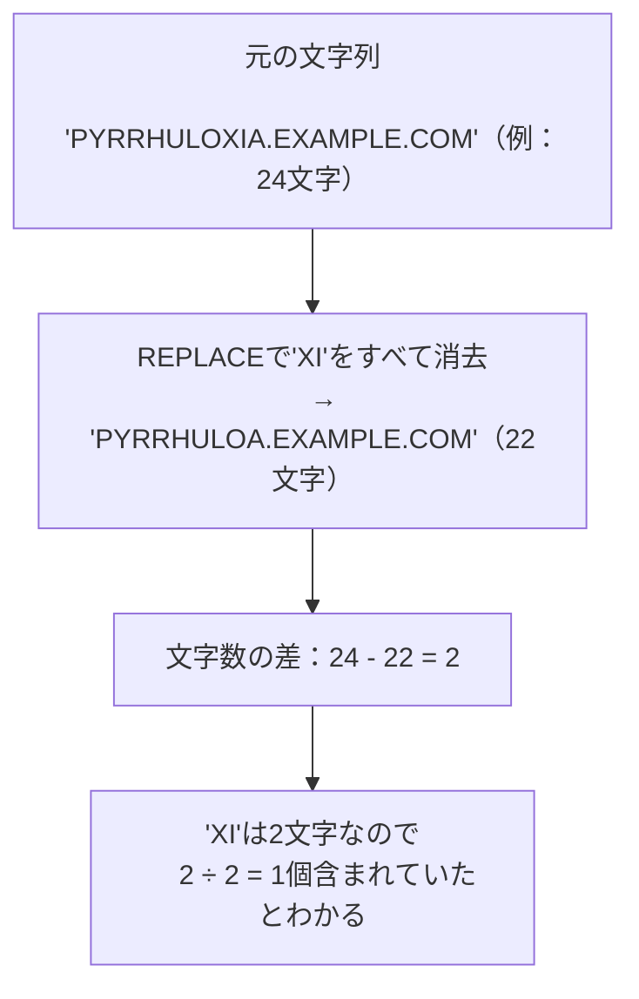

元の文字数から、`REPLACE`で「XI」をすべて消去した後の文字数を引くと、消えた文字の合計数が出ます。「XI」は2文字なので、その合計数を2で割れば「何個のXIが含まれていたか」がわかります。ロジックとしては面白いのですが、初見で読んだときにすぐ意図が伝わるかというと、少し立ち止まって考える必要があると思います。

解答例2は、Oracle 11gから導入された正規表現専用の関数`REGEXP_COUNT`です。
```sql
REGEXP_COUNT( [対象], [パターン] )
```
面倒な計算式を書く必要がなく、一発で個数を返してくれます。単なる文字だけでなく、「数字が何個あるか」「大文字が何個あるか」といった複雑なパターン（正規表現）のカウントも可能です。

| 方法 | 書き方の複雑さ | 対応バージョン | 移植性 |
| :--- | :--- | :--- | :--- |
| `LENGTH` + `REPLACE`（例1） | 計算式が長く、意図が伝わりにくい | 古いバージョンでも動く | MySQLなど他DBでも応用可 |
| `REGEXP_COUNT`（例2） | 短く、意図が一目瞭然 | Oracle 11g以降 | 複雑なパターンにも対応 |

実務での判断としては、基本的に`REGEXP_COUNT`を推奨します。コードが短くなることでバグが減り、他のエンジニアが読んだときにも意図がすぐ伝わるからです。`LENGTH`と`REPLACE`を使う古典的な書き方は、古いバージョンのデータベースや他の製品（MySQLなど）でも動くという利点はありますが、今のOracle環境であれば`REGEXP_COUNT`を選んでおいて困ることはまずないと思います。

解答例では両方とも`WITH`句（共通テーブル式）を使っています。まず`co_num`という仮のテーブルの中で`cnt`を計算し、その後のメインの`SELECT`で`cnt > 0`のものを絞り込む、という2段構えです。こうすることで、`WHERE`句の中で同じ長い計算式を二度書かずに済み、見た目もすっきりします。
## 参考リンク
https://www.shift-the-oracle.com/sql/functions/regexp_count.html