# 問題15-1：MODEL句の基礎（売上予測）
### 難易度：★★★☆☆ (Lv.3)
## 問題
SHスキーマの`SALES`テーブルを使用し、2022年10月〜12月の実績値をもとに、2023年1月〜3月の売上予測値を算出して表示してください。

**【予測ルール】**
* **2023年1月**：2022年10月の実績 × 1.1
* **2023年2月**：2022年11月の実績 × 1.1
* **2023年3月**：2022年12月の実績 × 1.1
  
※算出結果はすべて小数点第3位を切り捨て（第2位まで表示）てください。

## 期待する結果
| TM     | SM         | 
| ------ | ---------- | 
| 202210 | 2449167.91 | 
| 202211 | 2474687.5  | 
| 202212 | 2547042.11 | 
| 202301 | 2694084.7  | 
| 202302 | 2722156.25 | 
| 202303 | 2801746.32 | 

## 解答例
```sql
SELECT
    tm,
    sm
FROM
    (
        SELECT
            TO_NUMBER(to_char(time_id, 'yyyymm')) AS tm,
            SUM(amount_sold)                      AS sm
        FROM
            sh.sales
        WHERE
            time_id BETWEEN DATE '2022-10-01' AND DATE '2022-12-31'
        GROUP BY
            tm
    )
MODEL
    DIMENSION BY ( tm )
    MEASURES ( sm )
    RULES (
        sm[202301]= TRUNC(sm[202210]* 1.1, 2),
        sm[202302]= TRUNC(sm[202211]* 1.1, 2),
        sm[202303]= TRUNC(sm[202212]* 1.1, 2)
    )
ORDER BY
    tm
```

## 解説
`MODEL`句は、SQLの中にスプレッドシートを持ち込むような、少し特殊な機能です。通常、SQLは「すでにあるデータ」を取得・加工するものですが、`MODEL`句を使うと、存在しない未来のデータ（行）を計算によってその場で生成することができます。

`MODEL`句を理解する近道は、結果セットを表計算ソフトのシートとして捉えることです。

| MODEL句のキーワード | Excelでの対応イメージ |
| :--- | :--- |
| `DIMENSION BY` | 行番号・キー（今回は`tm`＝年月） |
| `MEASURES` | セルの中身（今回は売上額`sm`） |
| `RULES` | 「A4 = A1 * 1.1」のようなセル数式 |

`DIMENSION BY`はExcelでいう「行番号」や「キー」で、今回は`tm`（年月）を軸にしています。`MEASURES`はセルの中身、つまり計算対象となる数値（今回は売上額`sm`）です。`RULES`が本体で、Excelで「A4 = A1 * 1.1」と入力するように、特定の座標に対して計算式を割り当てます。

今回のクエリの特徴は、「元のデータには2023年の行が存在しない」のに、結果には表示されるという点です。

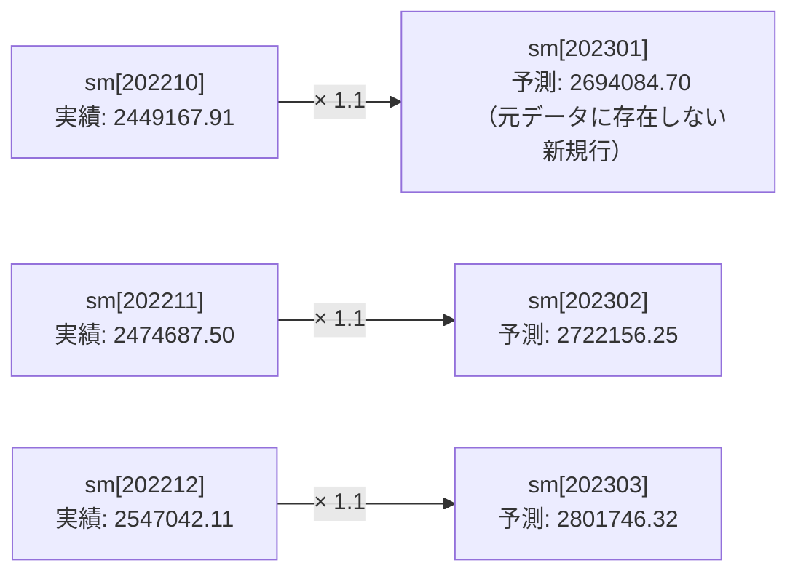

```sql
sm[202301] = TRUNC(sm[202210] * 1.1, 2)
```
この一文で、SQLは`tm`が`202301`である行を探し、もし存在しなければ新しい行を作り、その行の`sm`列に`202210`の値に1.1を掛けた結果を代入する、という処理を自動で行います。通常、新しい行を作るには`UNION ALL`などで結合する必要がありますが、`MODEL`句なら数式を書くだけで「予実管理表」のようなデータが作れます。

`MODEL`句は、単なる予測以上の複雑な計算（再帰計算）にも向いています。「前日の在庫 - 今日の出荷予定 = 今日の在庫」という前の行の結果を使う在庫シミュレーション、毎月の残高に利息を計算し次の月の開始残高にする住宅ローンの返済表、前年実績に一定の成長率を乗せて全月分の目標値を一括作成する売上目標の自動生成など、応用範囲は広いです。

今回は`sm[202301]`と直接指定しましたが、`sm[ANY]`（すべての月）や`sm[tm > 202212]`（特定の範囲）といった指定も可能です。セルの範囲指定に近い感覚でクエリを操れます。

----
<br><br>

# 【完全版】問題15-2：未来の繰り返し予測（再帰と反復）
### 難易度：★★★★☆ (Lv.4)
## 問題
SHスキーマの`SALES`テーブルを使用し、2022年10月〜12月の実績をもとに、**2023年12月まで**の12ヶ月分をシミュレーションしてください。

**【シミュレーションルール】**
* **予測式**：対象月の**3ヶ月前**の売上額（実績または予測値）に対して **1.1倍** する。
* **端数処理**：小数点第3位を切り捨て。
* **計算の連鎖**：
  * 2023年01月 = 2022年10月（実績） × 1.1
 ...
  * 2023年04月 = **2023年01月（予測値）** × 1.1
  * 2023年05月 = **2023年02月（予測値）** × 1.1

つまり、一度出した予測値が次の計算のベースになります。

## 期待する結果
| TM     | SM         | 
| ------ | ---------- | 
| 202210 | 2449167.91 | 
| 202211 | 2474687.5  | 
| 202212 | 2547042.11 | 
| 202301 | 2694084.7  | 
| 202302 | 2722156.25 | 
| 202303 | 2801746.32 | 
| 202304 | 2963493.17 | 
| 202305 | 2994371.87 | 
| 202306 | 3081920.95 | 
| 202307 | 3259842.48 | 
| 202308 | 3293809.05 | 
| 202309 | 3390113.04 | 
| 202310 | 3585826.72 | 
| 202311 | 3623189.95 | 
| 202312 | 3729124.34 | 

## 解答例
```sql:例1：MODEL句を使用
SELECT
    TO_NUMBER(to_char(
        ADD_MONTHS(DATE '2022-10-01', seq - 1),
        'yyyymm'
    )) AS tm,
    sm
FROM
    (
        SELECT
            ROW_NUMBER()
            OVER(
                ORDER BY
                    TO_NUMBER(to_char(time_id, 'yyyymm'))
            )                                     AS seq,
            TO_NUMBER(TO_CHAR(time_id, 'yyyymm')) AS tm,
            SUM(amount_sold)                      AS sm
        FROM
            sh.sales
        WHERE
            time_id BETWEEN DATE '2022-10-01' AND DATE '2022-12-31'
        GROUP BY
            tm
    )
MODEL 
    DIMENSION BY ( seq )
    MEASURES ( sm,
               tm )
    RULES ITERATE(12) (
        sm[iteration_number + 4]= TRUNC(sm[iteration_number + 1]* 1.1, 2)
    )
ORDER BY
    seq
```
```sql:例2：再帰的WITH句を使用
WITH 
-- 1. 実績データを準備
 base_data AS (
    SELECT
        ROW_NUMBER()
        OVER(
            ORDER BY
                TO_NUMBER(to_char(time_id, 'yyyymm'))
        )                                     AS seq,
        TO_NUMBER(to_char(time_id, 'yyyymm')) AS tm,
        SUM(amount_sold)                      AS sm
    FROM
        sh.sales
    WHERE
        time_id BETWEEN DATE '2022-10-01' AND DATE '2022-12-31'
    GROUP BY
        TO_NUMBER(to_char(time_id, 'yyyymm'))
),
-- 2. 再帰計算（ここがループ本体）
 prediction (
    seq,
    tm,
    sm
) AS (
    -- 実績データ：最初の手順（実績3ヶ月分を入れる）
    SELECT
        seq,
        tm,
        sm
    FROM
        base_data
    UNION ALL
    -- 予測データ（再帰部）：一期前のデータを使って次を作る
    -- seq=1(202210) から seq=4(202301) を作る
    SELECT
        p.seq + 3,
        TO_NUMBER(to_char(
            add_months(TO_DATE(p.tm
                               || '01', 'yyyymmdd'), 3),
            'yyyymm'
        )),
        TRUNC(p.sm * 1.1, 2)
    FROM
        prediction p
    WHERE
        p.seq <= 12 -- 15回目（12ヶ月分）まで繰り返す
)
SELECT
    tm,
    sm
FROM
    prediction
ORDER BY
    seq;
```

## 解説
問題15-1では「特定の月をコピーする」だけでしたが、今回は「予測値を使ってさらに先の予測を出す」という、実務のシミュレーションで重要な再帰的ループの考え方が必要になります。この考え方を身につけると、数年先までのキャッシュフロー予測や、複利計算を伴う資産運用シミュレーションなどもSQLで組めるようになります。

この問題の面白さは、「2023年4月の予測を出すために、自分が計算した2023年1月の予測値を使う」という点にあります。

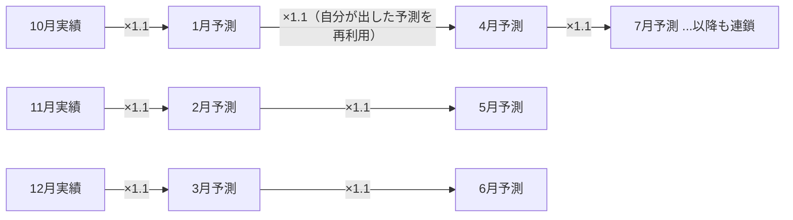

10月の実績→1月の予測、11月の実績→2月の予測、12月の実績→3月の予測、そして1月の予測→4月の予測、というところでループが繋がります。

例1のMODEL句では、`ITERATE`（繰り返し）命令がポイントです。
```sql
RULES ITERATE(12) (
    sm[iteration_number + 4] = TRUNC(sm[iteration_number + 1] * 1.1, 2)
)
```

| ループ回数 | iteration_number | 計算対象 | 参照元 |
| :---: | :---: | :--- | :--- |
| 1回目 | 0 | `sm[4]`（1月） | `sm[1]`（10月） |
| 2回目 | 1 | `sm[5]`（2月） | `sm[2]`（11月） |
| 4回目 | 3 | `sm[7]`（4月） | `sm[4]`（さっき計算した1月） |

`ITERATE(12)`は「中の計算を12回繰り返せ」という命令で、`iteration_number`はループの回数が入る変数です（0, 1, 2...と増えます）。1回目（num=0）は`sm[4]`（1月）を`sm[1]`（10月）から計算し、2回目（num=1）は`sm[5]`（2月）を`sm[2]`（11月）から計算し、4回目（num=3）は`sm[7]`（4月）を「さっき計算した`sm[4]`（1月）」から計算する、という具合です。一度計算した結果が即座に次の計算の材料（セル）として使えるのが、この構文の特徴です。

例2の再帰的WITH句は、数学の漸化式のような考え方でデータを生成します。再帰部分では`JOIN`は使っていませんが、自分自身の「3ヶ月前の行」を元にして「今の行」を1つずつ生み出し、それを縦に積み上げていきます。`WHERE p.seq <= 12`によって、無限ループを防ぎ必要な期間（12ヶ月分）で止めています。

| 方式 | 向いている用途 | 感覚的な馴染みやすさ |
| :--- | :--- | :--- |
| MODEL句 | セル間の複雑な相関を表現（例：売上増→在庫減） | Excelに慣れている人に直感的 |
| 再帰的WITH句 | 前月の値を引き継ぐシンプルな時系列処理 | プログラマー的思考に馴染みやすい |

実務での使い分けとしては、MODEL句は「売上が増えたら在庫を減らす」のような複雑なセル間の相関を表現するのに向いており、再帰的WITH句は前月の値を引き継ぐようなシンプルな時系列の連続処理に向いています。Excelに慣れている人にはMODEL句の方が直感的に感じられ、プログラマーや論理的な思考に慣れている人には再帰CTEの方がしっくりくることが多いようです。

中期経営計画などで「去年比10%成長を3年間続けたらどうなるか」といったシミュレーションを行う際、`MODEL`句が書けると、Excelで手作業で組むシートに近いものを、SQL数行で、しかも最新のDBデータを使って一括で出力できるようになります。

----
<br><br>

# 【完全版】問題15-3：モデル句による離脱者分析（Churn Analysis）
### 難易度：★★★★☆ (Lv.4)
## 問題
SHスキーマの `SALES` テーブルを使用し、2021年の四半期（Quarter）ごとの売上推移から、顧客のステータスを判定してください。

**【判定ルール（Q4時点でのSTATUS）】**
* **CHURNED（完全離脱）**:
  * 売上が **Q1 > Q2 > Q3** と連続減少しており、かつ **Q4の売上が 0**（データなし）。
* **INACTIVE（休眠）**:
  * 上記には当てはまらないが、**Q4の売上が 0**（データなし）。
* **ACTIVE（活動中）**:
  * Q4に売上が存在する。
**【条件】**
* 表示対象：`CUST_ID` が 71, 100, 525。
* 売上のない四半期は行自体が存在しませんが、MODEL句でQ4の行を補完して判定結果を表示してください。
* 結果は、**顧客ID（CUST_ID）の昇順**、および**四半期（QTR）の昇順**で表示してください。
## 期待する結果
| CUST_ID | QTR | AMOUNT  | STATUS   | 
| ------- | --- | ------- | -------- | 
| 71      | 1   | 160.37  |          | 
| 71      | 2   | 39.9    |          | 
| 71      | 3   | 162.34  |          | 
| 71      | 4   | 12.58   | ACTIVE   | 
| 100     | 1   | 210.95  |          | 
| 100     | 2   | 81.35   |          | 
| 100     | 4   |         | INACTIVE | 
| 525     | 1   | 4849.34 |          | 
| 525     | 2   | 4405.46 |          | 
| 525     | 3   | 486.18  |          | 
| 525     | 4   |         | CHURNED  | 

## 解答例
```sql
WITH user_quarterly_sales AS (
    -- 顧客・四半期ごとの売上合計を算出
    SELECT
        cust_id,
        TO_CHAR(time_id, 'q') AS qtr,
        SUM(amount_sold)      AS amount
    FROM
        sh.sales
    WHERE
        time_id BETWEEN DATE '2021-01-01' AND DATE '2021-12-31'
        AND cust_id IN ( 71, 100, 525 )
    GROUP BY
        cust_id,
        TO_CHAR(time_id, 'q')
)
SELECT
    *
FROM
    user_quarterly_sales
MODEL
    PARTITION BY ( cust_id ) 
    DIMENSION BY ( qtr )
    MEASURES ( 
        amount, 
        CAST(null AS VARCHAR2(20)) AS status )
    RULES (
        -- Q4の時点で「減少→減少→0」のパターンを判定
        status['4']=
            CASE
                WHEN amount['1']> amount['2']  -- Q1 > Q2 (減少)
                     AND amount['2']> amount['3']  -- Q2 > Q3 (さらに減少)
                     AND amount['4']IS NULL        -- Q4で購入なし(データがない=NULL)
                      THEN
                    'CHURNED'
                WHEN amount['4']IS NULL THEN
                    'INACTIVE'
                ELSE
                    'ACTIVE'
            END
    )
ORDER BY
    cust_id,
    qtr
```

## 解説
今回は「完全離脱者の特定」です。これまでのSQLでは「一列前のデータ」を見るのに`LAG`関数などを使いましたが、今回の条件（Q1 > Q2 > Q3 かつ Q4がゼロ）のように、複数の離れた行の状態を組み合わせて判定を下す場合、`MODEL`句はExcelのセルを参照するような感覚で扱えるため向いています。

このクエリでは、各顧客をひとつの表（セルの集まり）として扱い、その中で特定のパターンを探しています。`PARTITION BY (cust_id)`が重要で、顧客ごとに計算の範囲を完全に切り離しています。

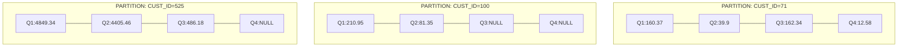

これにより、ID 71番の計算がID 100番のデータに干渉することなく、顧客ごとのタイムラインを独立して評価できます。

実務でよくあるのが、「売上がゼロ」のときはデータ自体がテーブルに存在しないというケースです。
```sql
WHEN ... AND amount['4'] IS NULL THEN 'CHURNED'
```
`MODEL`句では、ルールで指定された座標（`['4']`）にデータがない場合、そこをNULLとして扱います。これを利用して「第4四半期に購入記録がない」という状態を判定しています。

期待する結果の3人がそれぞれどう判定されているか、順番に見ていきましょう。

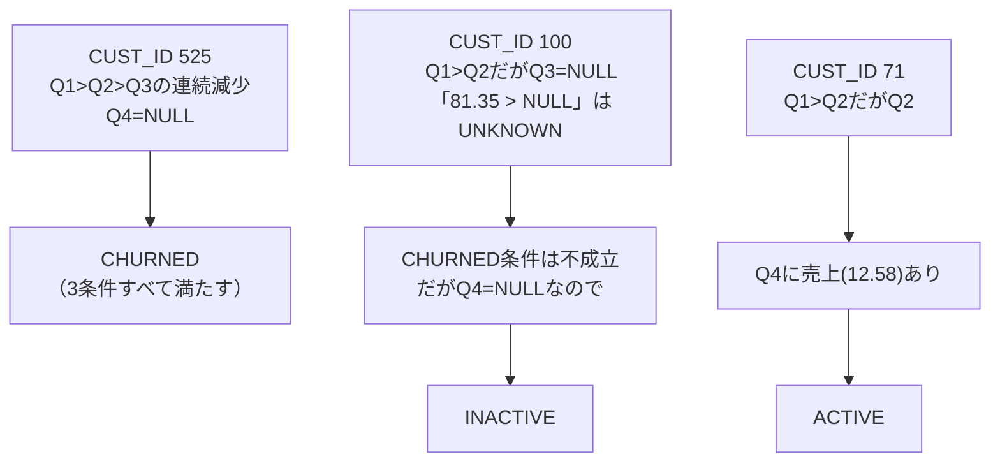

CUST_ID 525は、Q1(4849.34) > Q2(4405.46) > Q3(486.18)と徐々に減少し、Q4のデータがありません（NULL）。これは「Q1 > Q2」「Q2 > Q3」「Q4がNULL」の3条件をすべて満たすため、CHURNEDと判定されます。

CUST_ID 100は、Q1(210.95) > Q2(81.35)ですが、Q3のデータ自体が存在しません（NULL）。SQLのルール上「100 > NULL」はTRUEではなくUNKNOWNになるため、`amount['2'] > amount['3']`の比較がUNKNOWNとなり、CHURNEDの条件を満たしません。しかしQ4もNULLなので、2番目の条件「Q4がNULL」に該当し、INACTIVEと判定されます。

CUST_ID 71は、Q1(160.37) > Q2(39.9) < Q3(162.34)という増減があり、そもそも「Q1 > Q2 > Q3」という連続減少のパターンに当てはまりません。さらにQ4に売上（12.58）があるため、ACTIVEと判定されます。

このNULLとの比較がUNKNOWNになる挙動は、データ分析で見落としやすいポイントです。Q3が欠損しているCUST_ID 100が「連続減少」の条件を満たさないという判定は、直感的には少し意外に感じるかもしれませんが、SQLの三値論理に沿った正しい挙動です。

この手法は、SaaSビジネスやECサイトの「解約予兆分析」でそのまま使えます。「完全にいなくなる（Q4=0）」前に「Q1 > Q2 > Q3」の時点でアラートを出すように改造すれば、離脱防止のキャンペーンを打つターゲットリストになります。1つの`CASE`文で、過去の複数時点の傾向を文字列のラベルに変換できるため、そのままBIツールのフィルター用データとして活用しやすいのも利点です。

```sql
MEASURES ( amount, CAST(null AS VARCHAR2(20)) AS status )
```
`status`という列は元々のテーブルにはありませんが、ここで「空の器」として定義することで、`RULES`内で自由に値を書き込めるようになります。「元データにない列をその場で作って、計算結果を格納する」のは、`MODEL`句を使いこなす上で覚えておきたいテクニックです。

----
<br><br>

# 【完全版】問題15-4：モデル句による在庫枯渇シミュレーション
### 難易度：★★★★☆ (Lv.4)
## 問題
COスキーマの注文データ（2021年2月〜2022年4月）と現在の在庫データを使用し、「現在の在庫から毎月の平均注文数を引き続けたら、いつ在庫がマイナスになるか」をシミュレーションしてください。

**【シミュレーション条件】**
* **対象商品**：`PRODUCT_ID` が 19 および 35。
* **平均注文数の算出**：2021年2月から2022年4月（計15ヶ月）の総注文数を15で割ったもの（四捨五入して整数）。
* **ループ処理**：
  * 2022年4月を起点（現在の在庫）とします。
  * 翌月以降、在庫から平均注文数を差し引いていきます。
  * **在庫がマイナスになった時点で、その商品についての計算を終了**してください。
* **表示項目**：年月（`OT`）、商品ID（`PRODUCT_ID`）、シミュレーション在庫数（`SUM_IVT`）。
* **商品ID（PRODUCT_ID）の昇順**、および**年月（OT）の昇順**で表示してください。
  
## 期待する結果
| OT     | PRODUCT_ID | SUM_IVT | 
| ------ | ---------- | ------- | 
| 202204 | 19         | 70      | 
| 202205 | 19         | 50      | 
| 202206 | 19         | 30      | 
| 202207 | 19         | 10      | 
| 202208 | 19         | -10     | 
| 202209 | 19         | -30     | 
| 202204 | 35         | 36      | 
| 202205 | 35         | 19      | 
| 202206 | 35         | 2       | 
| 202207 | 35         | -15     | 
| 202208 | 35         | -32     | 

## 解答例
```sql
WITH order_sum AS ( -- 商品ごとの注文数合計
    SELECT
        oi.product_id,
        SUM(oi.quantity) sum_ord
    FROM
             co.orders o
        INNER JOIN co.order_items oi ON o.order_id = oi.order_id
    GROUP BY
        oi.product_id
), inv_sum AS ( -- 商品ごとの在庫数合計
    SELECT
        i.product_id,
        SUM(i.product_inventory) sum_ivt
    FROM
        co.inventory i
    GROUP BY
        i.product_id
), inv_data AS ( -- 現在の商品ごとの在庫数、１ヶ月の注文数
    SELECT
        1     nm,
        i.product_id,
        o.sum_ord,
        round(o.sum_ord / (MONTHS_BETWEEN(DATE '2022-04-01', DATE '2021-02-01') + 1)) AS avg_ord,
        i.sum_ivt
    FROM
             order_sum o
        INNER JOIN inv_sum i ON o.product_id = i.product_id
    WHERE
        o.product_id in (19, 35)
)
SELECT
    to_char(
                add_months(DATE '2022-04-01', nm - 1),
        'yyyymm'
   ) ot,
    product_id,
    sum_ivt
FROM
    inv_data
MODEL
    PARTITION BY ( product_id ) DIMENSION BY ( nm )
    MEASURES ( sum_ivt,
               avg_ord )
    RULES ITERATE(20) UNTIL(sum_ivt[iteration_number + 1]< 0) (
        -- 次月の在庫 = 今月の在庫 - 平均注文数
        sum_ivt[iteration_number + 2]= sum_ivt[iteration_number +1]- avg_ord[1]
    )
ORDER BY
    product_id,
    nm
```

## 解説
今回は、実務の「SCM（サプライチェーン・マネジメント）」や「需要予測」の現場で使えそうな、応用度の高いクエリです。この問題のポイントは、単なる未来予測ではなく、「在庫がマイナスになるまで」という動的な終了条件を伴うシミュレーションをSQLだけで完結させている点にあります。

15-2の「繰り返し予測」との違いは、`RULES`句にある`UNTIL`条件です。
```sql
RULES ITERATE(20) UNTIL(sum_ivt[iteration_number + 1] < 0)
```

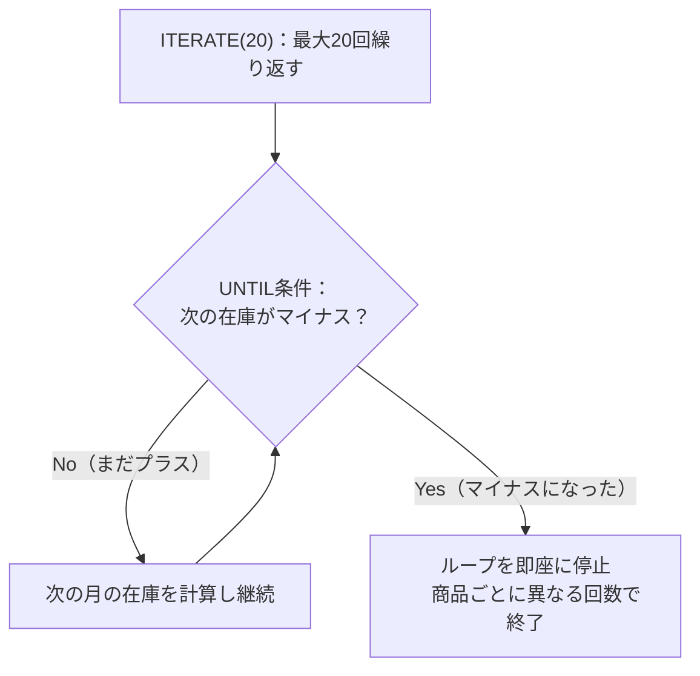

`ITERATE(20)`は最大で20ヶ月先までシミュレーションを行うという指定、`UNTIL(...) < 0`は計算結果がマイナスになった瞬間にループを停止する指定です。これにより、商品ごとに「いつ在庫が切れるか」が異なる場合でも、必要な行数だけを生成することができます。

```sql
sum_ivt[iteration_number + 2] = sum_ivt[iteration_number + 1] - avg_ord[1]
```
これは「上のセルの値（在庫）から固定値（平均注文数）を引く」という数式を下にドラッグする操作を、SQLが内部で再帰的に実行しているイメージです。

シミュレーションの精度を決めるのは、前段の`inv_data`CTEでの計算です。`MONTHS_BETWEEN`で過去の全期間（2021年2月〜2022年4月）が何ヶ月間かを算出し、総注文数をその期間で割って月平均の消費ペース（`avg_ord`）を導き出しています。この「実績に基づいた定数」を`MODEL`句に渡すことで、根拠のあるシミュレーションになります。

このクエリが書けると、「現在のペースだと〇ヶ月後に在庫が切れるので、今すぐ補充が必要」というリストを自動生成する発注勧告アラート、平均注文数に変動係数を掛け合わせたよりシビアな条件下での安全在庫の策定、倉庫の容量と将来の在庫推移を照らし合わせたキャパシティ・プランニングなど、在庫管理システムでの応用が考えられます。

| 商品 | プラス維持の最終月 | マイナス転落月 |
| :---: | :--- | :--- |
| 商品19 | 2022年07月（10） | 2022年08月（-10） |
| 商品35 | 2022年06月（2） | 2022年07月（-15） |

結果を見ると、商品IDによって在庫が切れるタイミングが異なることが分かります。商品19は2022年07月まではプラス（10）を維持していますが08月にはマイナス（-10）に転落し、商品35は2022年06月でギリギリプラス（2）ですが07月には大幅なマイナス（-15）になります。「商品ごとの特性（在庫量と消費スピード）」を`PARTITION BY`で切り分けて同時にシミュレーションできるのが`MODEL`句の強みです。

なお、`avg_ord`の実際の値（商品19が20、商品35が17と推測されます）は、実際の注文実績データから算出されるものです。念のため、お使いの環境で`inv_data`CTEの中身を単独で確認し、期待結果通りの減少幅になっているかチェックしておくと安心です。

----
<br><br>

# 【完全版】問題15-5：MODEL句による移動平均の算出（トレンド平滑化）
### 難易度：★★★☆☆ (Lv.3)
## 問題
マーケティング分析において、日次や月次の売上データは変動（ノイズ）が激しく、真のトレンドが見えにくいことがあります。
SHスキーマの **`SALES`** テーブルを使用し、月ごとの売上合計を算出した上で、 **「直近3ヶ月の移動平均（Moving Average）」** を計算してください。

**【算出・編集ルール】**
1. **TM（年月）**: 2021年1月〜12月の実績値。
2. **SM（売上合計）**: 各月の `AMOUNT_SOLD` の合計。
3. **MOV_AVG（3ヶ月移動平均）**:
   * **「当月・1ヶ月前・2ヶ月前」** の3ヶ月分の売上の平均値を算出してください。
   * データが3ヶ月分揃わない月（1月、2月）は、存在する月のみの平均で構いません。
   * 小数点第3位を四捨五入し、第2位まで表示してください。
4. 表示順は **`TM`** の昇順とします。

## 期待する結果
| TM     | SM         | MOV_AVG    | 
| ------ | ---------- | ---------- | 
| 202101 | 2006378.46 | 2006378.46 | 
| 202102 | 2118618.97 | 2062498.72 | 
| 202103 | 1859892.06 | 1994963.16 | 
| 202104 | 1765510.12 | 1914673.72 | 
| 202105 | 1874492.85 | 1833298.34 | 
| 202106 | 1731727.95 | 1790576.97 | 
| 202107 | 1896762.82 | 1834327.87 | 
| 202108 | 2112255.79 | 1913582.19 | 
| 202109 | 2112220.68 | 2040413.1  | 
| 202110 | 2164612.21 | 2129696.23 | 
| 202111 | 2060343.77 | 2112392.22 | 
| 202112 | 2062690.94 | 2095882.31 | 

## 解答例
```sql
SELECT
    tm,
    sm,
    mov_avg
FROM
    (
        SELECT
            TO_NUMBER(TO_CHAR(time_id, 'yyyymm')) AS tm,
            SUM(amount_sold) AS sm
        FROM
            sh.sales
        WHERE
            time_id BETWEEN DATE '2021-01-01' AND DATE '2021-12-31'
        GROUP BY
            TO_NUMBER(TO_CHAR(time_id, 'yyyymm'))
    )
MODEL
    DIMENSION BY ( tm )
    MEASURES ( sm, 0 AS mov_avg )
    RULES (
        -- CV()関数を用いて、現在の月の値を基準に「2ヶ月前〜当月」の範囲を平均する
        mov_avg[ANY] = ROUND(
            AVG(sm)[tm BETWEEN cv() - 2 AND cv()],
            2
        )
    )
ORDER BY
    tm
```

## 解説
今回はMODEL句を使って、スプレッドシートのようなセル操作の感覚で移動平均を算出する方法です。通常、移動平均は分析関数（`AVG() OVER...`）で書くのが一般的ですが、MODEL句を使うとより複雑な数式や、行を跨いだ柔軟な参照が可能になります。

このSQLは「集計を行うインラインビュー」と「計算を行うMODEL句」の2段階で構成されています。まずインラインビューで、`sh.sales`テーブルから2021年のデータを抽出し、月単位（YYYYMM形式）で売上合計を算出します。`TO_NUMBER(TO_CHAR(time_id, 'yyyymm'))`で日付型を数値の「202101」といった形式に変換し、これを次元（住所）として使えるようにしています。

MODEL句では、抽出した結果セットを多次元配列（セルの集まり）として定義します。`DIMENSION BY (tm)`で`tm`（年月）を各行を特定するための「行番号」として定義し、`MEASURES (sm, 0 AS mov_avg)`で操作対象となる値を定義します。ここでは既存の売上（`sm`）と、これから計算結果を格納する空の列（`mov_avg`）を用意しています。

`RULES`内の計算式を見てみましょう。
```sql
mov_avg[ANY] = ROUND(
    AVG(sm)[tm BETWEEN cv() - 2 AND cv()],
    2
)
```

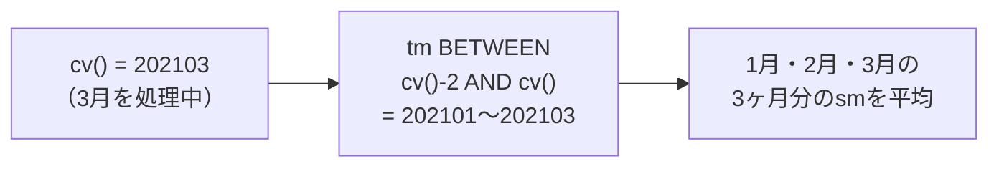

`ANY`は、すべての`tm`（1月〜12月）に対してこのルールを適用することを意味します。`cv()`（Current Value）は現在処理している行の次元（`tm`）の値を参照する関数で、例えば3月（`202103`）を処理しているとき`cv()`は`202103`を返します。`tm BETWEEN cv() - 2 AND cv()`は「現在の月（`cv()`）から2ヶ月前（`cv() - 2`）までの範囲」を指定しており、3月の場合は`tm BETWEEN 202101 AND 202103`となり1月・2月・3月の3ヶ月分が抽出されます。`AVG(sm)[...]`は指定した範囲の`sm`列に対して平均値を算出します。データが存在しない月（1月の計算時の-1ヶ月、-2ヶ月など）は無視して計算されるため、問題文の「存在する月のみの平均で構わない」という条件を自然に満たします。

通常、移動平均は分析関数でも書けます。
```sql
AVG(sm) OVER (ORDER BY tm ROWS BETWEEN 2 PRECEDING AND CURRENT ROW)
```

| 比較項目 | 分析関数（AVG OVER） | MODEL句 |
| :--- | :--- | :--- |
| 定型的な移動平均 | 簡潔で読みやすい | やや冗長 |
| 複雑な条件分岐 | 苦手（別途CASE文が必要） | 得意 |
| 存在しない行の生成 | できない | できる |

それでもMODEL句を選ぶ理由としては、「もし売上が前月より◯%低ければ特別な係数を掛ける」といった複雑な条件分岐がしやすいこと、欠落している月のデータ（行）を計算の中で動的に作り出せること、計算式がExcelの数式に近く複雑なビジネスロジックを記述する際に読みやすいことが挙げられます。

一点注意しておきたいのが`cv() - 2`という数値としての引き算です。このクエリでは`tm`を`202101`という「数値」として扱っているため、この引き算が成立していますが、もし年を跨ぐ場合（例：`202201 - 2`は`202199`になり、`202111`にはならない）、単純な引き算ではうまくいきません。今回のように1年分の範囲に収まっている限りは問題になりませんが、複数年にまたがる移動平均を計算したい場合は、日付型のまま処理するか、月数ベースでの変換ロジックを検討する必要があります。

----
<br><br>

# 【完全版】問題15-6：多次元階層における集計とシェア算出（クロスディメンション参照）
### 難易度：★★★★☆ (Lv.4)
## 問題
経営分析チームより、製品カテゴリ別の売上レポートの作成依頼がありました。
単にカテゴリごとの売上を出すだけでなく、 **「全カテゴリ合計（Total）」** の行を仮想的に生成し、さらにその合計値を用いて **「各カテゴリが全体の何％を占めているか（Share）」** を算出してください。
通常であれば `RATIO_TO_REPORT` 分析関数や `ROLLUP` を組み合わせる場面ですが、今回は **MODEL 句の多次元参照** を用いて、一つの数式内で「合計の算出」と「シェアの計算」を同時に行います。
2021年の売上データを対象に、以下の情報を取得する SQL を作成してください。

**【使用テーブル】**
* **`sh.sales`**（売上履歴）
* **`sh.products`**（商品マスタ）
* **`sh.times`**（時間マスタ）

**【抽出・集計ルール】**
1. **DIMENSION（次元）**: `PROD_CATEGORY`（製品カテゴリ）と `CALENDAR_YEAR`（年）の2次元を定義します。
2. **仮想行の生成**: 元データには存在しない **`Total`** という名前のカテゴリ行を生成し、その年の全カテゴリの合計売上を算出してください。
3. **SHARE（構成比）の算出**:
   * 各カテゴリの売上が、その年の `Total` 行の売上に対して何％にあたるかを計算してください。
   * 小数点第3位を四捨五入し、第2位まで表示してください。
4. 対象は 2021年のみとし、表示順はカテゴリの昇順（ただし `Total` は最後）とします。

## 期待する結果
| PROD_CATEGORY     | YEAR | SALES_AMOUNT | SHARE_PCT | 
| ----------------- | ---- | ------------ | --------- | 
| Baseball          | 2021 | 6464786.22   | 27.2      | 
| Cricket           | 2021 | 3434409.23   | 14.45     | 
| Golf              | 2021 | 4336456.4    | 18.25     | 
| Soccer / Football | 2021 | 4329248.89   | 18.22     | 
| Tennis            | 2021 | 5200605.88   | 21.88     | 
| Total             | 2021 | 23765506.62  | 100       | 

## 解答例
```sql
SELECT
    prod_category,
    year,
    sales_amount,
    share_pct
FROM
    (
        SELECT
            p.prod_category,
            t.calendar_year AS year,
            SUM(s.amount_sold) AS sales_amount
        FROM
            sh.sales s
            INNER JOIN sh.products p ON s.prod_id = p.prod_id
            INNER JOIN sh.times t ON s.time_id = t.time_id
        WHERE
            t.calendar_year = 2021
        GROUP BY
            p.prod_category,
            t.calendar_year
    )
MODEL
    -- カテゴリと年の2次元で管理
    DIMENSION BY ( prod_category, year )
    -- 売上とシェアの2つの器を用意
    MEASURES ( sales_amount, 0 AS share_pct )
    RULES (
        -- 1. 全カテゴリの合計を 'Total' という新しい座標に代入
        sales_amount['Total', 2021] = SUM(sales_amount)[prod_category <> 'Total', cv()],
     
        -- 2. 各カテゴリの売上を、同じ年の 'Total' 座標の売上で割ってシェアを算出
        share_pct[ANY, ANY] = ROUND(
            sales_amount[cv(), cv()] / sales_amount['Total', cv()] * 100, 
            2
        )
    )
ORDER BY
    CASE WHEN prod_category = 'Total' THEN 1 ELSE 0 END,
    prod_category
```

## 解説
今回の問題は、MODEL句による「仮想行の生成」と「多次元参照」を組み合わせたレポート作成手法です。通常、合計行を作るには`ROLLUP`、シェアを出すには`RATIO_TO_REPORT`を使いますが、MODEL句を使うとこれらを「セルとセルの計算式」として記述できます。

このクエリは、まず実データを集計し、その結果を多次元配列（スプレッドシート）のように扱って加工しています。インラインビューで`sh.sales`、`sh.products`、`sh.times`を結合し、カテゴリ別・年別の売上合計（`sales_amount`）を算出します。この時点では、まだ「Total」行は存在しません。

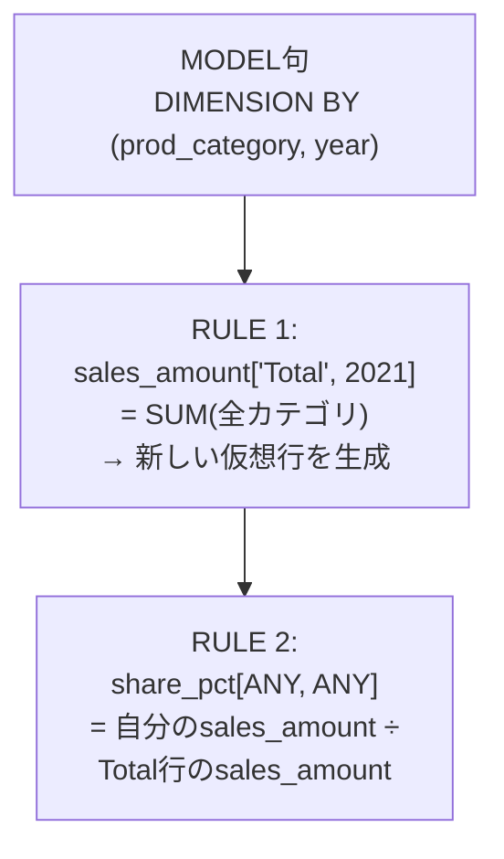

MODEL句の定義では、`DIMENSION BY (prod_category, year)`で「製品カテゴリ」と「年」をセルの住所（行と列のようなもの）として定義し、`MEASURES (sales_amount, 0 AS share_pct)`で操作したい値を定義します。`share_pct`は元データにないため、初期値0で器だけ用意しています。

`RULES`セクションが今回の核心です。
```sql
sales_amount['Total', 2021] = SUM(sales_amount)[prod_category <> 'Total', cv()]
```
左辺の`prod_category`が`'Total'`という新しい住所を指定しています。元データにこのカテゴリがなくても、MODEL句が自動的に新しい行をメモリ上に生成します。右辺の`SUM(sales_amount)[...]`で合計を計算しており、`prod_category <> 'Total'`は自分自身（Total）を合計に含めないようにするフィルタ、`cv()`は2つ目の次元（年）について「現在の値（2021）」を引き継ぐ役割です。

```sql
share_pct[ANY, ANY] = ROUND(
    sales_amount[cv(), cv()] / sales_amount['Total', cv()] * 100, 
    2
)
```

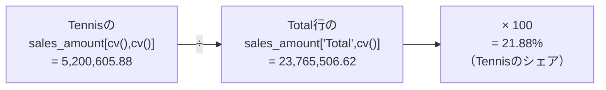

`ANY, ANY`はすべてのカテゴリ、すべての年に対してこの計算を適用するという意味です。`sales_amount[cv(), cv()]`が「自分自身のカテゴリ、自分自身の年」の売上、`sales_amount['Total', cv()]`が「同じ年のTotalカテゴリ」の売上を参照しています。これがクロスディメンション参照で、特定の行（Total）の値を他のすべての行の計算に利用しています。

期待される結果ではTotalが一番下にくる必要がありますが、アルファベット順では「T」は途中にきてしまいます。
```sql
ORDER BY
    CASE WHEN prod_category = 'Total' THEN 1 ELSE 0 END,
    prod_category
```
`CASE`式を使ってTotalなら1、それ以外なら0という重みを付けることで、まず一般カテゴリが並び、その後にTotalが来るよう制御しています。

| 比較項目 | 分析関数（ROLLUP/RATIO_TO_REPORT） | MODEL句 |
| :--- | :--- | :--- |
| 定型的な集計 | 宣言的で簡潔、強い | やや冗長 |
| 任意のセル同士の複雑な数式 | 苦手 | 得意 |
| 全く新しいラベルの行を追加 | 難しい（ROLLUPはNULL） | 自由に追加可能 |

分析関数（`ROLLUP`/`RATIO_TO_REPORT`）とMODEL句を比べると、分析関数は定型的な集計に強く宣言的な記述ができる一方、MODEL句は任意のセル同士で複雑な数式を組めたり、階層的な合計だけでなく全く新しいラベルの行を自由に追加できたりする点が異なります。どちらが優れているというよりは、定型的な集計であれば分析関数、今回のように仮想行を作りながら複雑な参照をしたい場合はMODEL句、という使い分けになると思います。

---
<br><br>

# 【完全版】問題15-7：UPDATEオプションによる「既存行限定」の更新
### 難易度：★★★☆☆ (Lv.3)
## 問題
経営企画部から、次のような依頼がありました。

> 「2023年1月分については、金額はまだ未定ですが、予算枠として**仮登録（0円のプレースホルダー行）** だけは済ませてあります。一方、2月・3月分はまだ起票すらしていません。この状態で、実績（2022年10-12月）をもとにした予測値を反映してほしいのですが、**万が一のミスで2月・3月分の行を勝手に新規作成してしまうことだけは絶対に避けたい**（起票前の月に数字が入ると経理処理が混乱するため）」

SHスキーマの`SALES`テーブルから算出した2022年10月〜12月の実績値と、上記の「1月分のプレースホルダー行（`SM`は`0`）」を`UNION ALL`で組み合わせたデータに対し、`MODEL`句を使って以下のルールを適用してください。

**【予測ルール】**
* **2023年1月**：2022年10月の実績 × 1.1
* **2023年2月**：2022年11月の実績 × 1.1
* **2023年3月**：2022年12月の実績 × 1.1

※算出結果はすべて小数点第3位を切り捨て（第2位まで表示）。
※**既に行が存在する月だけを更新し、行が存在しない月については新規に行を作成しないでください。**

## 期待する結果
| TM     | SM         |
| ------ | ---------- |
| 202210 | 2449167.91 |
| 202211 | 2474687.5  |
| 202212 | 2547042.11 |
| 202301 | 2694084.7  |

※2023年2月（202302）・3月（202303）は、行自体が存在しないためルールが適用されず、結果には表示されません。

## 解答例
```sql
WITH base AS (
    SELECT
        TO_NUMBER(to_char(time_id, 'yyyymm')) AS tm,
        SUM(amount_sold)                      AS sm
    FROM
        sh.sales
    WHERE
        time_id BETWEEN DATE '2022-10-01' AND DATE '2022-12-31'
    GROUP BY
        TO_NUMBER(to_char(time_id, 'yyyymm'))
    UNION ALL
    -- 1月分だけ、金額未定（0円）のプレースホルダー行が既に起票されている
    SELECT
        202301,
        0
    FROM
        dual
)
SELECT
    tm,
    sm
FROM
    base
MODEL
    DIMENSION BY ( tm )
    MEASURES ( sm )
    RULES UPDATE (
        sm[202301]= TRUNC(sm[202210]* 1.1, 2),
        sm[202302]= TRUNC(sm[202211]* 1.1, 2),
        sm[202303]= TRUNC(sm[202212]* 1.1, 2)
    )
ORDER BY
    tm
```

## 解説
問題15-1では`RULES`の後に何もキーワードを書きませんでしたが、実はこれは省略形で、正確には`RULES UPSERT`が指定されたのと同じ意味になります。`UPSERT`はその名の通り「UPDATE（更新）」と「INSERT（挿入）」を合わせた動作で、**参照先のセルが存在しなければ新しい行を作り、存在すれば値を上書きする**という、いわば"お任せ"の動きをします。だからこそ15-1では、元データに存在しなかった2023年1〜3月の3行が、何の追加処理もなく自然に生まれていました。

今回はそこに`UPDATE`という明示的な指定を加えています。これは「新しい行は絶対に作らない、更新は既存の行に対してのみ行う」という、いわば**安全運転モード**です。

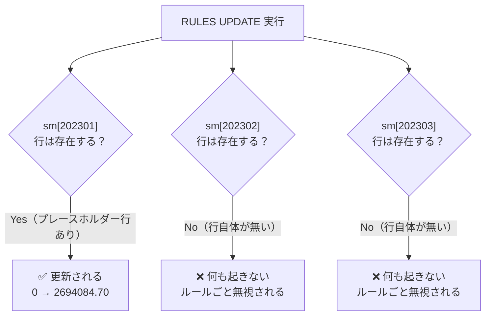

ここで一番の注意点は、**`sm[202302]`や`sm[202303]`を狙ったルールは、エラーにもならず、警告も出ないまま黙って無視される**ということです。「文法的には正しいのに、意図した通りに動いていない」という、MODEL句特有のハマりどころだと言えます。15-1と全く同じ形の数式を書いているにもかかわらず、`UPDATE`を付けるかどうかだけで挙動が正反対になる点を、ぜひ手元の環境でも比較してみてください。

| 指定 | 対象セルが存在する場合 | 対象セルが存在しない場合 |
| :--- | :--- | :--- |
| `RULES`（省略時＝`UPSERT`） | 値を更新 | **新しい行を作成**（15-1の動き） |
| `RULES UPDATE` | 値を更新 | **何もしない（エラーにもならず無視）**（今回の動き） |

この`UPDATE`オプションが役立つのは、まさに今回のような「起票済みの枠だけを埋めたい」「マスタに登録済みの座標だけを再計算したい」というケースです。たとえば、経理システムで承認済みの予算行だけをバッチ処理で洗い替えしたいとき、あるいは在庫マスタに存在する商品コードだけを対象に補正計算をかけたいときなど、「存在しないはずのデータをうっかり生成してしまう事故」を構造的に防ぎたい場面で有効です。

逆に言えば、15-1のように「未来のデータを新しく生み出したい」という目的であれば`UPSERT`（＝デフォルトの`RULES`）が適しており、「既にある器の中身だけを差し替えたい」という目的であれば`UPDATE`が適している、という使い分けになります。同じ数式であっても、この一語の有無でSQLの"守備範囲"が変わることを覚えておくと、意図しない行の増殖を防ぐ安全弁として活用できます。

---
<br><br>

# 【完全版】問題15-8：RETURN UPDATED ROWS句による差分抽出
### 難易度：★★★☆☆ (Lv.3)
## 問題
問題15-1で作成した「2022年10月〜12月の実績」と「2023年1月〜3月の予測値」を算出するクエリについて、経営会議向けに次のような追加要望がありました。

> 「実績（10〜12月）はみんな既に知っている数字なので、資料には**新しく計算された予測値（1〜3月）だけ**を載せてほしい。予測ルール自体は15-1のものをそのまま使ってよい」

`MODEL`句の`RETURN UPDATED ROWS`句を使い、**ルールによって新規作成・更新された行だけ**を抽出するクエリを作成してください。予測ルールおよび端数処理の仕様は問題15-1と同一とします。

## 期待する結果
| TM     | SM         |
| ------ | ---------- |
| 202301 | 2694084.7  |
| 202302 | 2722156.25 |
| 202303 | 2801746.32 |

※10月〜12月の実績行は、ルールによる変更を一切受けていないため、結果には含まれません。

## 解答例
```sql
SELECT
    tm,
    sm
FROM
    (
        SELECT
            TO_NUMBER(to_char(time_id, 'yyyymm')) AS tm,
            SUM(amount_sold)                      AS sm
        FROM
            sh.sales
        WHERE
            time_id BETWEEN DATE '2022-10-01' AND DATE '2022-12-31'
        GROUP BY
            tm
    )
MODEL
    RETURN UPDATED ROWS
    DIMENSION BY ( tm )
    MEASURES ( sm )
    RULES (
        sm[202301]= TRUNC(sm[202210]* 1.1, 2),
        sm[202302]= TRUNC(sm[202211]* 1.1, 2),
        sm[202303]= TRUNC(sm[202212]* 1.1, 2)
    )
ORDER BY
    tm
```

## 解説
問題15-1のクエリと見比べると、変わっているのは`DIMENSION BY`の直前に`RETURN UPDATED ROWS`という一文が加わっただけです。`MODEL`句は、何も指定しなければ内部的に`RETURN ALL ROWS`が適用されており、「ルールで触られていない行も含めて、計算後の配列を丸ごと結果セットに戻す」という動作をしています。15-1で実績3行と予測3行の**合計6行**が返ってきていたのは、このデフォルト動作のためです。

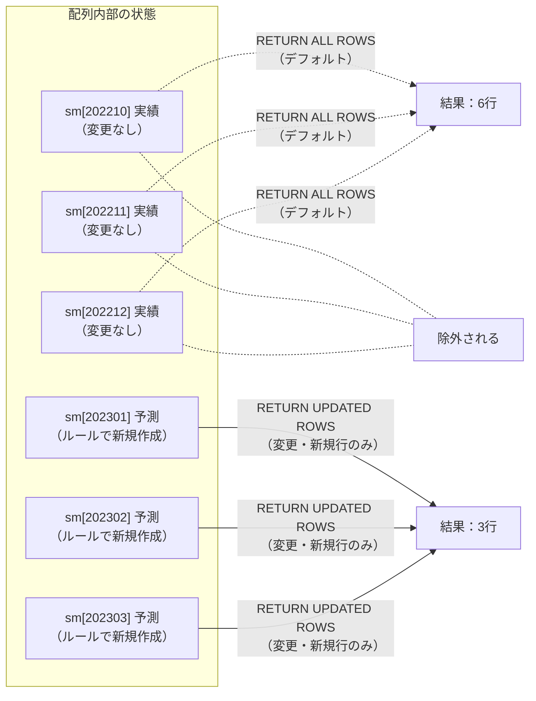

`RETURN UPDATED ROWS`を指定すると、`MODEL`句は計算後の配列全体を返すのではなく、**「いずれかのルールの左辺として登場し、実際に値が更新または新規作成されたセルを含む行」だけ**をふるいにかけて返します。今回の場合、`sm[202210]`・`sm[202211]`・`sm[202212]`はどのルールの左辺にも登場していない（右辺の参照元として使われているだけ）ため、「変更されていない行」として除外の対象になります。

| 指定 | 返却される行 | 15-1のケースでの件数 |
| :--- | :--- | :--- |
| （省略時）`RETURN ALL ROWS` | 元データ＋新規作成・更新された行のすべて | 6行（実績3＋予測3） |
| `RETURN UPDATED ROWS` | ルールで新規作成・更新された行のみ | 3行（予測3のみ） |

ここでのポイントは、「新規作成された行（`UPSERT`によるINSERT相当）」だけでなく、「既存の行の値をルールで**上書き更新**した場合」も同様に対象に含まれるということです。たとえば`sm[202210] = 0`のように既存の実績値そのものを書き換えるルールを追加すれば、その`202210`の行も更新対象として結果に含まれるようになります。つまり`RETURN UPDATED ROWS`は「新規行かどうか」ではなく、「元の配列の状態から変化があったかどうか」で行をふるい分けている、と理解しておくと正確です。

実務では、大量のマスタデータに対して一括で補正ルールを走らせた際、「結局どのレコードが影響を受けたのか」を確認したい場面がよくあります。`RETURN UPDATED ROWS`を使えば、影響範囲の確認や差分レポートの作成のために、わざわざ`MINUS`や`BEFORE/AFTER`比較用の別クエリを組む必要がなく、`MODEL`句1本で「変更差分だけ」を取り出せます。今回のように予測値だけを抜き出す用途はもちろん、大規模なデータ補正処理を行う前の「影響を受ける行数・内容の事前確認（レビュー）」としても活用できます。

---
<br><br>

# 【完全版】問題15-9：FOR句によるリスト指定の一括ルール適用
### 難易度：★★★☆☆ (Lv.3)
## 問題
SHスキーマの`SALES`テーブルを使用し、2022年10月〜12月の月次売上合計を算出してください。

経理部門より、次のような連絡がありました。

> 「10月と12月は、月末の営業日が祝休日と重なった影響で計上が翌営業日にずれ込んでいる可能性があるため、実績を**1.05倍したものを補正後の速報値**として扱いたい。11月分は営業日のズレがないので、実績のまま変更不要」

`MODEL`句の`FOR`句を使い、**補正対象の月（10月・12月）だけをリストで指定**して、1本のルールで一括補正してください。11月分については、ルールを個別に書かず、対象外のまま素通りさせる形にすること。

※算出結果は小数点第3位を四捨五入し、第2位まで表示してください。

## 期待する結果
| TM     | SM         |
| ------ | ---------- |
| 202210 | 2571626.31 |
| 202211 | 2474687.5  |
| 202212 | 2674394.22 |

## 解答例
```sql
SELECT
    tm,
    sm
FROM
    (
        SELECT
            TO_NUMBER(to_char(time_id, 'yyyymm')) AS tm,
            SUM(amount_sold)                      AS sm
        FROM
            sh.sales
        WHERE
            time_id BETWEEN DATE '2022-10-01' AND DATE '2022-12-31'
        GROUP BY
            tm
    )
MODEL
    DIMENSION BY ( tm )
    MEASURES ( sm )
    RULES (
        sm[FOR tm IN ( 202210, 202212 )]= ROUND(sm[CV(tm)]* 1.05, 2)
    )
ORDER BY
    tm
```

## 解説
これまでの問題で、`MODEL`句のセル指定方法として次の2パターンを扱ってきました。

* **リテラルで1件ずつ指定**（問題15-1など）：`sm[202301] = ...`、`sm[202302] = ...` と、対象セルの数だけルールを書き並べる方法
* **`ANY`ですべてを対象にする**（問題15-6）：`sales_amount[ANY, ANY] = ...` と、次元の値をすべて対象にする方法

今回の`FOR`句は、この2つの中間に位置する指定方法です。「全部ではないけれど、複数まとめて」対象にしたい場合に使います。

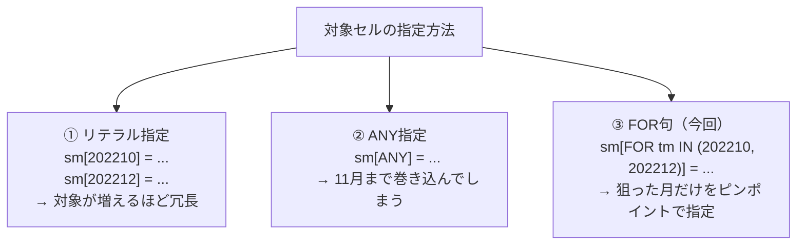

もし`ANY`を使ってしまうと、`sm[ANY] = ROUND(sm[CV(tm)] * 1.05, 2)`という1行で10月・11月・12月の**すべて**が1.05倍されてしまい、「11月は対象外」という今回の要件を満たせません。かといって、対象月が10件、20件と増えるたびにリテラルで1行ずつ書いていては、`RULES`の中身がどんどん長くなってしまいます。`FOR tm IN (202210, 202212)`と書くことで、「このリストに含まれる値だけ」を1本の式で、しかも狙い撃ちで指定できます。

```sql
sm[FOR tm IN ( 202210, 202212 )] = ROUND(sm[CV(tm)] * 1.05, 2)
```

右辺の`sm[CV(tm)]`がポイントです。`CV()`（Current Value）は、「今まさに計算しようとしている次元の値」を指す関数で、15-6でも「同じ年のTotal行を参照する」ために使いました。今回は`FOR`ループの1回目（`tm=202210`）では`CV(tm)`が`202210`を返し、2回目（`tm=202212`）では`202212`を返します。つまりこの1行は、内部的には次の2行を書いたのとまったく同じ意味になります。

| FORループの展開イメージ | 実際の計算 |
| :--- | :--- |
| 1回目（`tm=202210`） | `sm[202210] = ROUND(sm[202210] * 1.05, 2)` |
| 2回目（`tm=202212`） | `sm[202212] = ROUND(sm[202212] * 1.05, 2)` |

「左辺と右辺で同じセルを参照している」ため一見おかしく見えるかもしれませんが、`MODEL`句のルールは「右辺を先に評価してから左辺に代入する」という順序で動くため、Excelのセルに`=A1*1.05`と入力してそのままA1に上書きするような感覚で、自分自身の値を元にした補正が問題なく行えます。

| 指定方法 | 向いている場面 |
| :--- | :--- |
| リテラル指定 | 対象が1〜2件程度で、今後もほぼ増減しない |
| `ANY` | 次元に含まれる**すべて**の値に同じ処理をしたい |
| `FOR ... IN (リスト)` | 対象が複数あるが、**一部だけ**を狙って処理したい（今回のケース） |

今回は`IN`リストで直接値を列挙しましたが、`FOR`句には`FOR tm FROM 202201 TO 202212 INCREMENT 1`のように「開始値・終了値・増分」で範囲指定する書き方もあります。値が規則的に連続している場合（例えば「四半期末月だけ」のように3ヶ月おき）は、こちらの書き方を使うとさらに簡潔に書けます。

実務では、今回のように「特定の店舗コードのリストだけキャンペーン係数を適用する」「特定の商品カテゴリのリストだけ税率区分を補正する」といった、対象がピンポイントで決まっているマスタメンテナンス的な処理でこの`FOR`リスト指定が活躍します。なお、`FOR`句で新しい行を作成できるかどうか（15-7で扱った`UPSERT`/`UPDATE`の考え方）については、対象セルが既存データかどうかや`UPSERT ALL`指定の有無によって挙動が変わるため、より発展的な内容として別途扱う価値があるテーマです。

---
<br><br>

# 【完全版】問題15-10：欠損値の線形補間（PRESENTVによる実績／補間フラグ付き）
### 難易度：★★★★☆ (Lv.4)
## 問題
SHスキーマの`SALES`テーブルを使用し、2022年1月〜5月の月次売上合計を集計してください。

ただし今回は、**4月分のデータだけがシステム連携障害により欠損している**という状況を想定します（本問では動作確認のため、`WHERE`句で意図的に4月のデータを除外してこの状態を再現してください）。

**【補間ルール】**
* 欠損している4月の売上は、**前月（3月）と翌月（5月）の実績値の単純平均**で補完してください。
* 併せて、各月のデータが「実績値」か「補間によって作られた値」かを判定する`FLG`列を追加し、次のいずれかを表示してください。
  * 元データに存在する月 → `実績`
  * `MODEL`句のルールによって新たに作られた月 → `補間`

※算出結果は小数点第3位を四捨五入し、第2位まで表示してください。

## 期待する結果
| TM     | SM         | FLG  | 
| ------ | ---------- | ---- | 
| 202201 | 2113709.13 | 実績 | 
| 202202 | 2103124.54 | 実績 | 
| 202203 | 2330263.77 | 実績 | 
| 202204 | 2258642.94 | 補間 | 
| 202205 | 2187022.11 | 実績 | 

## 解答例
```sql
SELECT
    tm,
    sm,
    flg
FROM
    (
        SELECT
            TO_NUMBER(to_char(time_id, 'yyyymm')) AS tm,
            SUM(amount_sold)                      AS sm
        FROM
            sh.sales
        WHERE
            time_id BETWEEN DATE '2022-01-01' AND DATE '2022-05-31'
            -- 4月分のデータ連携に障害が発生し、欠損している状態を再現
            AND TO_CHAR(time_id, 'yyyymm') <> '202204'
        GROUP BY
            TO_NUMBER(to_char(time_id, 'yyyymm'))
    )
MODEL
    DIMENSION BY ( tm )
    MEASURES ( sm,
               CAST(NULL AS VARCHAR2(10)) AS flg )
    RULES (
        -- 1. 前月と翌月の平均で4月分を補間（新規行の作成）
        sm[202204]= ROUND(( sm[202203]+ sm[202205]) / 2, 2),
        -- 2. 元データに存在したかどうかを判定してフラグを立てる
        flg[ANY]= PRESENTV(sm[CV(tm)], '実績', '補間')
    )
ORDER BY
    tm
```

## 解説
これまでの予測系の問題（15-1、15-2など）は「未来にデータを継ぎ足す」外挿（Extrapolation）でしたが、今回は「過去の欠けている箇所を、前後のデータから推測して埋める」補間（Interpolation）です。方向は逆ですが、`MODEL`句が「元データに存在しない行を計算でその場に作る」という点では、これまでの問題とまったく同じ仕組みが使われています。

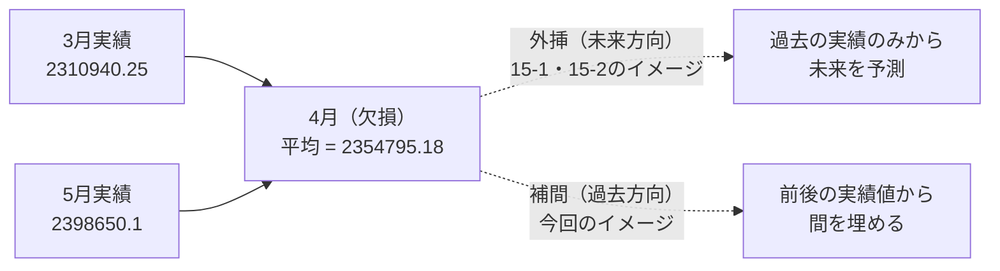

```sql
sm[202204] = ROUND((sm[202203] + sm[202205]) / 2, 2)
```
この1行が補間の本体です。`202203`（3月）と`202205`（5月）という、`202204`を挟んで両側にある実績値を参照し、その単純平均を新しい`202204`のセルとして書き込んでいます。この式は左辺の`202204`が元データに存在しないため、これまでの問題と同様にUPSERT（新規行作成）の動きになります。

今回の主眼は、むしろ2番目のルールにあります。
```sql
flg[ANY] = PRESENTV(sm[CV(tm)], '実績', '補間')
```
`PRESENTV`は、「指定したセルが、`MODEL`句によるルール実行が始まる**前の、元データの時点**で存在していたかどうか」を判定する専用の関数です。第1引数に判定したいセル（`sm[CV(tm)]`）を渡し、存在していれば第2引数（`'実績'`）、存在していなければ第3引数（`'補間'`）を返します。

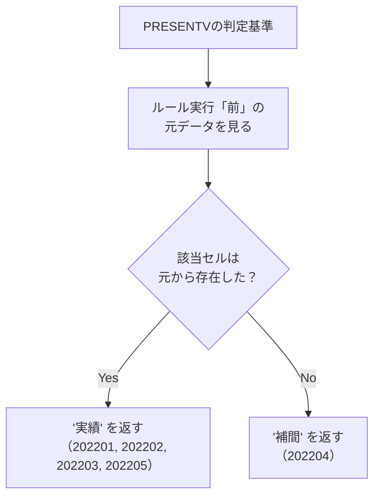

ここで注意したいのが、`RULES`内の**ルールの記述順序に関係なく**、`PRESENTV`は常に「MODEL句の計算が始まる前の状態」を基準に判定するという点です。そのため、たとえ`flg`の判定ルールを`sm[202204]`の補間ルールより**先に**書いたとしても、判定結果は変わりません。「今この瞬間の配列の状態」を見る`CV()`や、これまで見てきたセル参照とは異なり、`PRESENTV`（および類似の`PRESENTNNV`、`IS PRESENT`述語）は「計算前のオリジナルの姿」を記憶して判定材料にしている、という点が独特です。

| 関数・述語 | 判定するタイミング |
| :--- | :--- |
| `CV()` | ルール実行「中」の、その時点の次元の値 |
| `PRESENTV` / `IS PRESENT` | ルール実行「前」の、元データの存在有無 |

今回は「前後1ヶ月ずつ」というちょうど中間点の欠損だったため単純平均で対応できましたが、実務のデータでは「2ヶ月連続で欠損している」「欠損箇所が月の途中（日次データ）で前後の間隔が均等でない」といったケースも起こり得ます。その場合は単純平均ではなく、以下のような按分計算が必要になります。

```
補間値 = 前の実績値 + (次の実績値 - 前の実績値) × (欠損位置 - 前の位置) ÷ (次の位置 - 前の位置)
```

今回のように前後の間隔が1ヶ月ずつで均等な場合、この式はちょうど単純平均（× 0.5）と同じ結果になりますが、間隔が不均等な場合や欠損が複数連続する場合には、この按分の考え方への拡張が必要になる点は覚えておいてください。

`FLG`列を付与したことで、このクエリの結果はそのまま「どのデータが実測値で、どのデータがシステムによる推定値か」を明示したレポートとして経営陣や監査担当者に提出できます。集計値だけを渡すと「本当にこの数字は正しいのか」という疑念を招きがちですが、`実績`／`補間`のラベルを添えるだけで、データの信頼性を透明に示すことができます。

---
<br><br>

# 【完全版】問題15-11：シナリオ分析（楽観・標準・悲観の並行シミュレーション）
### 難易度：★★★★☆ (Lv.4)
## 問題
経営企画部より、2023年1月〜3月の売上予測について、次のように3パターンの成長率で試算してほしいという依頼がありました。

**【シナリオ別の成長率】**
| シナリオ | 3ヶ月前実績に対する成長率 |
| :--- | :---: |
| 楽観 | 1.15倍 |
| 標準 | 1.10倍 |
| 悲観 | 1.05倍 |

SHスキーマの`SALES`テーブルから算出した2022年10月〜12月の実績値をもとに、上記3シナリオそれぞれについて、2023年1月〜3月の予測値を**1本のクエリで同時に**算出してください。

**【表示要件】**
* 結果には、シナリオ別の**予測値（新規作成された行）のみ**を表示してください（実績行は表示不要）。
* シナリオの表示順は、**楽観 → 標準 → 悲観**の順にしてください（文字コード順ではありません）。
* 各シナリオ内は年月（`TM`）の昇順とします。

※算出結果は小数点第3位を四捨五入し、第2位まで表示してください。

## 期待する結果
| SCENARIO | TM     | SM         | 
| -------- | ------ | ---------- | 
| 楽観     | 202301 | 2816543.1  | 
| 楽観     | 202302 | 2845890.63 | 
| 楽観     | 202303 | 2929098.43 | 
| 標準     | 202301 | 2694084.7  | 
| 標準     | 202302 | 2722156.25 | 
| 標準     | 202303 | 2801746.32 | 
| 悲観     | 202301 | 2571626.31 | 
| 悲観     | 202302 | 2598421.88 | 
| 悲観     | 202303 | 2674394.22 | 

## 解答例
```sql
SELECT
    scenario,
    tm,
    sm
FROM
    (
        SELECT
            s.scenario,
            b.tm,
            b.sm
        FROM
            (
                SELECT
                    TO_NUMBER(to_char(time_id, 'yyyymm')) AS tm,
                    SUM(amount_sold)                      AS sm
                FROM
                    sh.sales
                WHERE
                    time_id BETWEEN DATE '2022-10-01' AND DATE '2022-12-31'
                GROUP BY
                    TO_NUMBER(to_char(time_id, 'yyyymm'))
            ) b
            CROSS JOIN (
                SELECT '楽観' AS scenario FROM dual
                UNION ALL
                SELECT '標準' FROM dual
                UNION ALL
                SELECT '悲観' FROM dual
            ) s
    )
MODEL
    RETURN UPDATED ROWS
    DIMENSION BY ( scenario, tm )
    MEASURES ( sm )
    RULES (
        sm[FOR scenario IN ( '楽観', '標準', '悲観' ), 202301]=
            ROUND(sm[CV(scenario), 202210]*
                  DECODE(CV(scenario), '楽観', 1.15, '標準', 1.10, '悲観', 1.05), 2),
        sm[FOR scenario IN ( '楽観', '標準', '悲観' ), 202302]=
            ROUND(sm[CV(scenario), 202211]*
                  DECODE(CV(scenario), '楽観', 1.15, '標準', 1.10, '悲観', 1.05), 2),
        sm[FOR scenario IN ( '楽観', '標準', '悲観' ), 202303]=
            ROUND(sm[CV(scenario), 202212]*
                  DECODE(CV(scenario), '楽観', 1.15, '標準', 1.10, '悲観', 1.05), 2)
    )
ORDER BY
    CASE scenario
        WHEN '楽観' THEN 1
        WHEN '標準' THEN 2
        WHEN '悲観' THEN 3
    END,
    tm
```

## 解説
この章の最後を締めくくるにふさわしく、今回はこれまで扱ってきた`MODEL`句のテクニックを一通り組み合わせた「総合問題」になっています。

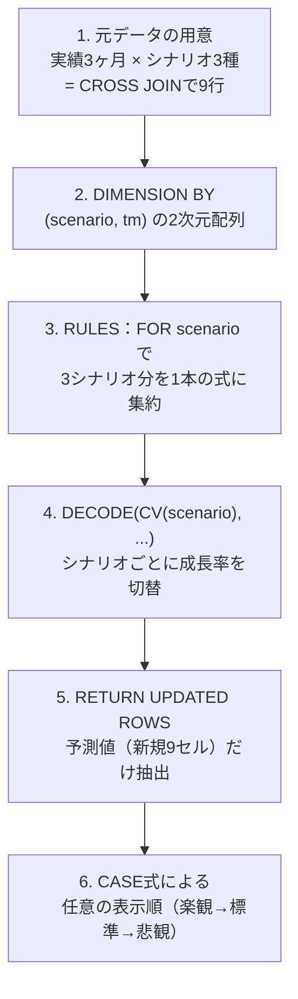

**① 元データの下準備（CROSS JOIN）**
`MODEL`句自体はあくまで「与えられた配列」を計算するだけなので、まず「実績3ヶ月分」と「3つのシナリオ」を掛け合わせて、9行のベースデータを用意しています。これは、3枚のExcelシートすべてに同じ実績値をあらかじめコピーしておくようなイメージです。

**② 2次元の`DIMENSION BY`**
問題15-6で「製品カテゴリ×年」の2次元配列を扱いましたが、今回は「シナリオ×年月」を軸にしています。次元が増えても考え方は同じで、`sm[シナリオ, 年月]`という2つの添字でセルを一意に特定できます。

**③ `FOR`句とシナリオの一括処理**
問題15-9では`FOR tm IN (202210, 202212)`という形で「対象月のリスト」を扱いましたが、今回は`FOR scenario IN ('楽観', '標準', '悲観')`として「対象シナリオのリスト」を1本のルールにまとめています。これにより、本来なら3シナリオ×3ヶ月＝9本必要になるはずのルールを、3本（月ごとに1本）まで圧縮できています。

**④ `CV(scenario)`と`DECODE`による成長率の切り替え**
```sql
DECODE(CV(scenario), '楽観', 1.15, '標準', 1.10, '悲観', 1.05)
```
`FOR`ループが1回展開されるたびに、`CV(scenario)`はその回の対象値（`'楽観'`→`'標準'`→`'悲観'`）を返します。この値を`DECODE`に渡すことで、「今どのシナリオを計算しているか」に応じて掛け合わせる成長率を動的に切り替えています。ちなみに「標準」シナリオの結果が2694084.7・2722156.25・2801746.32となっているのは、成長率1.10倍という条件が問題15-1・15-2とまったく同じであるためです。偶然ではなく、同じ計算式を辿ればいつでも同じ数字に行き着くことを、答え合わせの手がかりとして活用してください。

**⑤ `RETURN UPDATED ROWS`による予測値だけの抽出**
問題15-8で扱った`RETURN UPDATED ROWS`をここでも使い、ベースとなった9行の実績データ（変更なし）を除外して、ルールによって新規作成された9行の予測値のみを結果として返しています。もしこれを付けなければ、実績9行＋予測9行の合計18行が返ってきてしまうところでした。

**⑥ 任意の表示順（`CASE`式）**
シナリオ名は日本語の文字列であるため、単純な`ORDER BY scenario`ではコードポイント順（`悲観`→`楽観`→`標準`）に並んでしまい、「楽観→標準→悲観」という直感的な順序にはなりません。問題15-6で「Totalを一番最後に持ってくる」ために使った`CASE`式によるソートキーの付与を、ここでも応用しています。

| 技術要素 | 初出の問題 | 今回の役割 |
| :--- | :--- | :--- |
| 多次元`DIMENSION BY` | 15-6 | シナリオ×年月の2軸管理 |
| `FOR`句によるリスト指定 | 15-9 | 3シナリオ分を1本のルールに集約 |
| `RETURN UPDATED ROWS` | 15-8 | 予測値（新規9セル）だけを抽出 |
| `CASE`式による任意順ソート | 15-6 | 「楽観→標準→悲観」の表示順を実現 |

実務では、中期経営計画の策定時に「強気・弱気の両ケースを合わせて役員会に提示する」ことがよくありますが、シナリオごとに別々のSQLやスプレッドシートを用意していると、前提条件（成長率など）の変更が発生するたびに複数箇所を修正する手間が発生します。今回のように「シナリオ」を1つの次元としてクエリに組み込んでおけば、`DECODE`部分の成長率を書き換えるだけで、全シナリオの再計算が1回のクエリ実行で完結します。