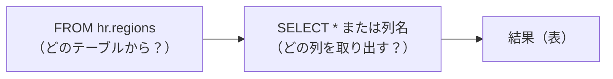
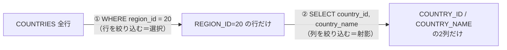
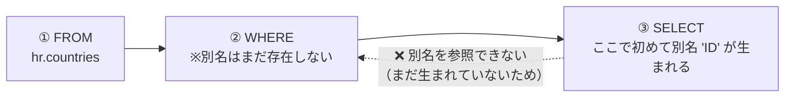
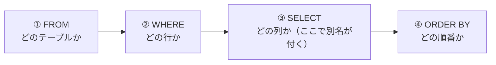
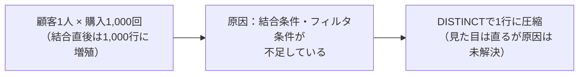
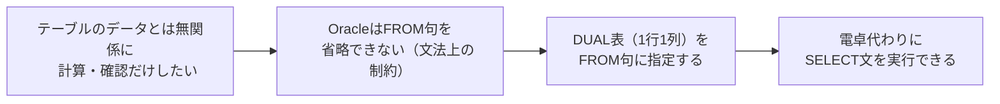
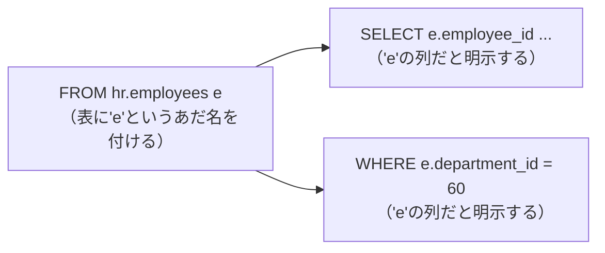
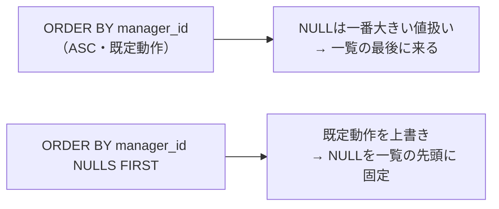
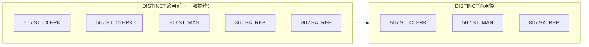

# 問題3-1：全データの取得
### 難易度：★☆☆☆☆ (Lv.1)
## 問題
HRスキーマにある REGIONS テーブルから、すべてのデータを取得してください。
なお、レコードの表示順序は問いません。

## 期待する結果
| REGION_ID | REGION_NAME |
| --------- | ----------- |
| 10        | Europe      |
| 20        | Americas    |
| 30        | Asia        |
| 40        | Oceania     |
| 50        | Africa      |

## 解答例
```sql:例1：「*」を使用
SELECT
    *
FROM
    hr.regions
```
```sql:例2：全てのカラムを指定
SELECT
    region_id,
    region_name
FROM
    hr.regions
```
## 解説
SQLで最初に覚えるのは、この形です。
```sql
SELECT
    [取得したいカラム名]
FROM
    [テーブル名]
```

SELECT句とFROM句が何を指しているか、図にすると次のようになります。



SELECT句は「どの列を取り出すか」、FROM句は「どのテーブルから取り出すか」を指定します。`*`（アスタリスク）を使えばすべての列を一度に取得できますし、`region_id, region_name` のようにカンマ区切りで列挙すれば、必要な列だけに絞ることもできます。

`*` と列挙、それぞれで元のテーブルからどこを取り出すかをイメージすると、次のようになります。

**REGIONS テーブル（元データ）**

| REGION_ID | REGION_NAME |
| --------- | ----------- |
| 10        | Europe      |
| 20        | Americas    |
| 30        | Asia        |
| 40        | Oceania     |
| 50        | Africa      |

`SELECT * FROM hr.regions` → 全列・全行をそのまま取得（上の表と同じ）
`SELECT region_id, region_name FROM hr.regions` → 列を明示的に指定して取得（結果は同じだが、意図が明確）

`hr.regions` の `hr` はスキーマ名（所有者名）です。自分のスキーマにあるテーブルなら、`hr.` を省略して `FROM regions` と書いても構いません。

さて、解答例が2つありますが、実務では基本的に例2（カラム名を指定する書き方）を使います。`*` は動作確認やデバッグのときに便利な反面、テーブルに新しい列が追加されたときにプログラム側の挙動が変わってしまうリスクがあるからです。私も過去に、`SELECT *` で組んだバッチ処理に後から列が追加されて、想定していなかった列まで後続処理に流れてしまい、原因調査に半日費やしたことがあります。「とりあえず動くから」で `*` を使い続けると、こういう形で後から跳ね返ってきます。

| 書き方 | メリット | デメリット |
| :--- | :--- | :--- |
| `SELECT *` | 短く書ける、確認作業が速い | 列追加時に挙動が変わるリスクがある |
| `SELECT col1, col2` | 意図が明確、列追加の影響を受けない | 記述がやや長くなる |

もう一点、Oracle SQLのルールとして、キーワード（`SELECT`, `FROM`）やテーブル名・カラム名は基本的に大文字・小文字を区別しません。正確には、引用符（`" "`）で囲まずに書いた識別子はOracle内部で自動的に大文字に変換される、という挙動によるものです（この話は問題3-3で詳しく扱います）。結果として `select * from regions` と `SELECT * FROM REGIONS` は同じ意味になります。

文末のセミコロン（`;`）は1つの命令の終わりを示す記号です。SQL DeveloperやSQL*Plusなどのツールで複数の命令を続けて実行する際には必須になるので、癖をつけておくと後々困りません。

:::message
### SQLは大文字で書くべきか、小文字で書くべきか
文法上はどちらでも動きますが、私は「キーワードは大文字、テーブル名やカラム名は小文字」で書くスタイルをおすすめしています。`SELECT` や `FROM` が浮き上がって見えるので、どこからどこまでが命令でどこからがデータの名前か、パッと見て判別しやすいためです。本書でもこのスタイルで統一します。

| 書き方の例 | 見やすさ |
| :--- | :--- |
| `SELECT region_id FROM regions` | ◎ キーワードと識別子が一目で区別できる |
| `select region_id from regions` | △ 全部小文字だと命令と名前の境目が曖昧 |
| `SELECT REGION_ID FROM REGIONS` | △ 全部大文字だと逆に読みにくい |

Oracle FreeSQLにはこの書き方を補助する機能があります（環境によっては表示の調整が必要な場合もあります）。


:::

----
<br><br>

# 問題3-2：特定の条件に一致するデータの取得
### 難易度：★☆☆☆☆ (Lv.1)
## 問題
HRスキーマにある **`COUNTRIES`** テーブルから、**`REGION_ID` が 20** であるレコードを抽出し、**`COUNTRY_ID`** と **`COUNTRY_NAME`** の列を表示してください。
なお、レコードの表示順序は問いません。

## 期待する結果
| COUNTRY_ID | COUNTRY_NAME             |
| ---------- | ------------------------ |
| AR         | Argentina                |
| BR         | Brazil                   |
| CA         | Canada                   |
| MX         | Mexico                   |
| US         | United States of America |

## 解答例
```sql
SELECT
    country_id,
    country_name
FROM
    hr.countries
WHERE
    region_id = 20
```

## 解説
前問の「全件取得」から一歩進んで、今回は「必要な列だけを選ぶ（射影）」と「必要な行だけを絞り込む（選択）」を組み合わせています。



行を絞り込むには `WHERE` 句を使います。
```sql
SELECT
    [取得したいカラム名]
FROM
    [テーブル名]
WHERE
    [条件式]
```
`WHERE region_id = 20` と書けば、`region_id` カラムの値が20である行だけが抽出されます。数値を比較する場合はそのまま書けますが、`country_id` のような文字列型のカラムで絞り込む場合は `WHERE country_id = 'US'` のようにシングルクォーテーションで囲む必要があります。ここは最初混乱しやすいポイントなので、迷ったら「文字列はクォートで囲む」とだけ覚えておいてください。

| カラムの型 | 書き方 | 例 |
| :--- | :--- | :--- |
| 数値型 | クォート不要 | `region_id = 20` |
| 文字列型 | シングルクォートで囲む | `country_id = 'US'` |
| 日付型 | 関数等で変換して指定（後の章で扱います） | `hire_date = DATE '2024-01-01'` |

比較演算子は次章で本格的に扱いますが、先に一覧だけ載せておきます。
| 演算子 | 意味 | 例 |
| :--- | :--- | :--- |
| `=` | 等しい | `region_id = 20` |
| `<>` または `!=` | 等しくない | `region_id <> 10` |
| `>` / `<` | より大きい / 未満 | `region_id > 30` |
| `>=` / `<=` | 以上 / 以下 | `region_id <= 20` |

もう一つ、地味に大事なのが「書く順番」と「処理される順番」の違いです。SQLは `SELECT ... FROM ... WHERE ...` の順で書きますが、実際にデータベースが処理する順番は逆で、まず`FROM`でテーブルを見て、次に`WHERE`で行を絞り込み、最後に`SELECT`で列を表示します。

**書く順番と処理される順番の違い**

| 順番 | 書く順番（SQL文） | 処理される順番 |
| :---: | :--- | :--- |
| 1 | `SELECT` | `FROM` |
| 2 | `FROM` | `WHERE` |
| 3 | `WHERE` | `SELECT` |

この順番は今後も何度も出てくるので、頭の片隅に置いておいてください。

:::message
### 暗黙の型変換は「気づかないうちに」性能を悪化させる
`WHERE country_id = 20`（本来は文字列型なのに数値を渡す）のような書き方でも、Oracleは自動的に型を変換してエラーなく動いてしまうことがあります。「動くから大丈夫」と思いがちですが、これが曲者です。


暗黙の型変換が発生すると、そのカラムに設定されているインデックスが正しく使われなくなることがあり、検索速度が大きく落ちることがあります。データ量が多いテーブルだと、体感できるレベルで数百倍〜数千倍遅くなるケースも珍しくありません。しかも型変換自体はエラーにならないため、原因に気づくまで時間がかかります。「型は最初から合わせて書く」を徹底するのが、結局いちばんの近道です。
:::

----
<br><br>

# 問題3-3：列の別名（エイリアス）の設定
### 難易度：★☆☆☆☆ (Lv.1)
## 問題
HRスキーマにある **`COUNTRIES`** テーブルから、**`REGION_ID` が 20** であるレコードを抽出してください。
その際、結果の列名（ヘッダー）を以下のように別名を設定して表示してください。
* `COUNTRY_ID`　→　**`ID`**
* `COUNTRY_NAME`　→　**`NAME`**
なお、レコードの表示順序は問いません。

## 期待する結果
| ID         | NAME                     |
| ---------- | ------------------------ |
| AR         | Argentina                |
| BR         | Brazil                   |
| CA         | Canada                   |
| MX         | Mexico                   |
| US         | United States of America |

## 解答例
```sql
SELECT
    country_id as "ID",
    country_name as "NAME"
FROM
    hr.countries
WHERE
    region_id = 20
```

## 解説
出力結果の見た目を整えるための「別名（エイリアス）」を扱います。
SELECT句で指定したカラム名の後に `AS` を付けると、実行結果のヘッダーを好きな名前に変更できます。
```sql
SELECT
    [元のカラム名] AS "[表示したい別名]"
FROM
    [テーブル名]
```

**別名を付けると、見た目（ヘッダー）だけが変わります**

| 元のカラム名（テーブル上） | → | 別名（結果の見た目） |
| :--- | :---: | :--- |
| `country_id` | → | `ID` |
| `country_name` | → | `NAME` |

`AS` は省略可能ですが、私は書く派です。「これは別名を付けているんだな」と一目でわかるので、後からコードを読む人（未来の自分を含めて）に優しい書き方だと思っています。

ダブルクォーテーション（`" "`）で囲んでいるのにも理由があります。Oracleでは、囲まずに書いた識別子は自動的にすべて大文字に変換されますが、ダブルクォーテーションで囲むと次のことができるようになります。
* 大文字・小文字をそのまま保持できる（`"Id"` と書けば `Id` のまま）
* スペースや記号を含められる（`"Country ID"` のような別名も可能）
* 本来は使えない予約語も別名として使える

便利そうに見えるこの機能ですが、実務での扱いには注意が必要です。詳しくは後述のコラムで説明します。

別名を使う理由は「短くするため」だけではありません。`EMP_LNAME` のようなシステム上のカラム名をレポート用に `"苗字"` と読み替えたり、`salary * 12` のような計算結果に `"Annual Salary"` と名前を付けて意味を明確にしたり、といった使い方もよくします。

ここで一つ、初心者がほぼ確実にハマるポイントを紹介します。**WHERE句の中で、SELECT句で定義した別名を使うことはできません。**
```sql
-- ❌ これはエラーになります
SELECT country_id AS "ID"
FROM hr.countries
WHERE "ID" = 'AR';  -- エラー：そんな列は存在しないと言われる
```

理由は前問で触れた実行順序です。`FROM`→`WHERE`の時点ではまだSELECT句は処理されていないため、別名もまだ存在していません。別名が生まれるのは`SELECT`の段階なので、`WHERE`から見ると`"ID"`という列は最初から存在しないことになります。



この実行順序さえ頭に入っていれば、なぜエラーになるかは自然と理解できるはずです。

:::message
### システム開発で `" "` は使わない方がいい、というのが私の考えです
結論を先に言うと、実務では識別子（テーブル名や列名）を `" "` で囲むのは避けるのが無難です。理由は大きく3つあります。

| 理由 | 内容 |
| :--- | :--- |
| ① 大文字・小文字が固定される | `"UserId"` と定義すると、以後は一字一句完全一致させないとエラーになる |
| ② コード内でのエスケープが地獄になる | Java/Python/PHP等からSQLを組み立てる際、`\"` のエスケープが必要になる |
| ③ 予約語との衝突を許してしまう | `"ORDER"` のように本来使えない予約語も列名にできてしまい、混乱の元になる |

**1. 大文字・小文字が固定される**
囲まずに書けば、`user_id` と `USER_ID` はOracle側で同じものとして扱われます。ところが `"UserId"` のように定義してしまうと、以後は一字一句、大文字小文字まで完全に一致させないとエラーになります。誰か一人がうっかり `"UserId"` で作ってしまうと、他の開発者が `SELECT user_id ...` と書くたびに「そんな列はない」と怒られる羽目になります。私も一度、この理由で丸1日デバッグに費やしたチームを見たことがあります。

**2. プログラムコード内でのエスケープが地獄になる**
JavaやPython、PHPなどからSQLを文字列として組み立てる場合、`" "` が必要な列名があると、コード側でさらにエスケープが必要になります。
```
sql = "SELECT user_id FROM users"                          -- 普通の書き方
sql = "SELECT \"UserId\" FROM \"Users\""                    -- " " が必要な書き方
```
これがすべてのクエリに広がると、コードの視認性はかなり悪くなります。タイプミスも増えますし、レビューする側も読みづらくて仕方ありません。

**3. 予約語との衝突を許してしまう**
本来 `ORDER` や `GROUP` のような予約語は列名に使えません。ところが `"ORDER"` のように囲めば、無理やり作成できてしまいます。一見便利ですが、後から見た人が「このORDERは命令なのか列名なのか」と混乱する原因になります。

まとめると、`" "` を使わない書き方の方が、大文字・小文字を気にせずに書けて、エスケープも不要で、予約語を避ける自然な設計にもつながります。良いことずくめというわけではありませんが、少なくとも「迷ったら使わない」くらいに考えておくのがちょうどいいと思います。

なお、本書の解答例では、ルールをより深く理解してもらうための練習として、あえて `" "` を使っている箇所があります。実際の開発現場での推奨とは異なる書き方も含まれる点は、ご了承のうえ進めてください。
:::

----
<br><br>

以下、問題3-4の解説を拡充した全文です。3-10の内容（列追加によるズレの危険性）を、簡潔な例として解説内に統合しました。3-10は取り下げ、削除してください。

---

# 問題3-4：データの並び替え（ORDER BY）
### 難易度：★☆☆☆☆ (Lv.1)
## 問題
OEスキーマの **`CUSTOMERS`** テーブルを使用します。
**`NLS_TERRITORY`** が **「CHINA」** である顧客を抽出し、以下の順序で並び替えて表示してください。
1. **`CUST_FIRST_NAME`** の **昇順**（小さい順）
2. `CUST_FIRST_NAME` が同じ場合は、**`CUST_LAST_NAME`** の **降順**（大きい順）

## 期待する結果
| CUSTOMER_ID | CUST_FIRST_NAME | CUST_LAST_NAME | 
| ----------- | --------------- | -------------- | 
| 981         | Daniel          | Gueney         | 
| 308         | Glenda          | Dunaway        | 
| 309         | Glenda          | Bates          | 
| 360         | Helmut          | Capshaw        |

## 解答例
```sql:例1：カラムを指定する
SELECT
    customer_id,
    cust_first_name,
    cust_last_name
FROM
    oe.customers
WHERE
    nls_territory = 'CHINA'
ORDER BY
    cust_first_name ASC,
    cust_last_name DESC
```
```sql:例2：列順を指定する
SELECT
    customer_id,
    cust_first_name,
    cust_last_name
FROM
    oe.customers
WHERE
    nls_territory = 'CHINA'
ORDER BY
    2, 3 DESC
```

## 解説
データの並び替え、`ORDER BY` 句です。SQL文の最後に付け加えることで、表示順序を制御できます。
```sql
SELECT
    [カラム名]
FROM
    [テーブル名]
WHERE
    [条件]
ORDER BY
    [カラム1] [ASC | DESC],
    [カラム2] [ASC | DESC]
```
`ASC`（Ascending）は昇順、`DESC`（Descending）は降順です。何も指定しなければ`ASC`がデフォルトになります。複数カラムを指定した場合は「左から順に」優先順位が決まる点も押さえておいてください。

**並び替えのイメージ（第1キー→第2キーの順で効いてくる）**

| 手順 | 内容 | 結果 |
| :--- | :--- | :--- |
| ① `cust_first_name ASC` で並び替え | 名前の昇順に全体を並べる | Daniel → Glenda → Glenda → Helmut |
| ② 同じ名前（Glenda）の中だけ `cust_last_name DESC` で並び替え | Glendaのグループ内だけ並び替える | Dunaway → Bates（D→Bの降順） |

<br>
| CUSTOMER_ID | CUST_FIRST_NAME | CUST_LAST_NAME | 補足 |
| :---: | :--- | :--- | :--- |
| 981 | Daniel | Gueney | 第1キーのみで確定 |
| 308 | **Glenda** | Dunaway | 第2キーで D が先（降順） |
| 309 | **Glenda** | Bates | 第2キーで B が後（降順） |
| 360 | Helmut | Capshaw | 第1キーのみで確定 |

今回の例で言えば、まず`cust_first_name`で全体を並び替え、同じ名前（Glenda)が複数いた場合にだけ、そのグループ内で`cust_last_name`を使ってさらに並び替える、という動きになります。

解答例2の `ORDER BY 2, 3 DESC` は、SELECT句で指定した列の「位置」で並び替え対象を指定する書き方です。`2`は2番目のカラム（`cust_first_name`）、`3`は3番目のカラム（`cust_last_name`）を指します。記述は短くなりますが、この書き方には見落としがちな落とし穴があります。

たとえば、このSQLに後日「会員ランクも見たい」という依頼が来て、同僚がSELECT句の先頭に`membership_level`を追加したとします。

```sql
-- ORDER BY句はそのまま放置してしまった例
SELECT
    membership_level,
    customer_id,
    cust_first_name,
    cust_last_name
FROM
    oe.customers
WHERE
    nls_territory = 'CHINA'
ORDER BY
    2, 3 DESC
```
列が1つ増えたことで、`2`が指すのは`cust_first_name`ではなく`customer_id`に、`3`が指すのは`cust_last_name`ではなく`cust_first_name`にズレてしまいます。このSQLはエラーにはならず、もっともらしい一覧がそのまま出力されるため、依頼者に届くまで誰も気づかないかもしれません。列名を明示していれば、SELECT句の列を何個追加しようが並び替えの基準がズレることはありません。

**列名指定 と 位置指定 の比較**

| | 列名指定（例1） | 位置指定（例2） |
| :--- | :--- | :--- |
| SELECT句の列順・列数を変えた場合 | 影響を受けない | **並び替えの基準列が静かにズレる** |
| SQLだけを読んだときの分かりやすさ | 何で並べているか一目瞭然 | SELECT句を数えないと分からない |
| タイプ量 | やや多い | 少ない |

こうした理由から、私は基本的に例1のようにカラム名を明示する書き方を勧めています。位置指定は、SQL*Plusやツール上でさっと確認するときの一時的な用途くらいに留めておくのが安全です。

これでSELECT文を構成する主な句が出そろったので、ここまでの実行順序を整理しておきます。



面白いのは、`ORDER BY` は `SELECT` より後に処理されるため、問題3-3で学んだ別名がそのまま使える点です。
```sql
-- これも動きます
SELECT
    cust_first_name AS "FNAME"
FROM
    oe.customers
ORDER BY
    "FNAME" ASC
```

**WHERE句とORDER BY句、別名が使えるかの比較**

| 句 | 処理されるタイミング | 別名を使えるか |
| :--- | :--- | :--- |
| `WHERE` | `SELECT`より前 | ❌ 使えない（問題3-3参照） |
| `ORDER BY` | `SELECT`より後 | ⭕ 使える |

WHERE句では使えなかった別名が、ORDER BY句では使える。この非対称性こそが、実行順序を理解する一番の近道だと思います。

:::message
### ASCはいつ書いて、いつ省略するか
省略できるとはいえ、私は次の基準で書き分けています。

| ケース | 書き方 |
| :--- | :--- |
| すべての条件が昇順 | `ASC`は省略する（デフォルトの挙動なので、書かなくても意図は伝わる） |
| 昇順と降順が混在する | `ASC`もあえて明示する（意図がひと目で伝わり、書き忘れとの区別がつく） |

絶対のルールというわけではありませんが、一つの目安として覚えておいてください。
:::

## 参考リンク
https://www.shift-the-oracle.com/sql/order-by.html

----
<br><br>

# 問題3-5：重複データの除外（DISTINCT）
### 難易度：★☆☆☆☆ (Lv.1)
## 問題
SHスキーマにある **`COUNTRIES`** テーブルから、**`COUNTRY_REGION`** 列のデータを取得してください。
その際、同じデータが複数表示されないよう、**重複を排除**して表示してください。
なお、レコードの表示順序は問いません。

## 期待する結果
| COUNTRY_REGION |
| -------------- |
| Americas       |
| Europe         |
| Asia           |
| Oceania        |
| Africa         |
| Middle East    |

## 解答例
```sql:例1：DISTINCTを使用
SELECT DISTINCT
    country_region
FROM
    sh.countries
```
```sql:例2：GROUP BYを使用（参考）
SELECT
    country_region
FROM
    sh.countries
GROUP BY
    country_region
```

## 解説
最後は「重複の排除」です。`DISTINCT` キーワードを使うと、指定した列の値を見比べて、同じ値をまとめて1件として表示できます。
```sql
SELECT DISTINCT
    [カラム名]
FROM
    [テーブル名]
```

**イメージ：DISTINCTは同じ値をまとめて1件にする**

| DISTINCT適用前（元データの一部） | → | DISTINCT適用後 |
| :--- | :---: | :--- |
| Europe | | Europe |
| Americas | | Americas |
| Europe | → | Asia |
| Asia | | Oceania |
| Europe | | Africa |
| Americas | | Middle East |
| ...（全国数十行） | | （地域の種類だけ） |

`SELECT DISTINCT col1, col2` のように複数のカラムを指定した場合は、「col1とcol2の組み合わせ」が重複している行だけがまとめられます。片方の値が同じでも、もう片方が違えば別の行として残ります。

解答例2にある `GROUP BY` でも同じ結果になります。「重複をなくす」という結果だけを見れば両者は同じですが、使い分けの基準は明確です。

| 使い分け | DISTINCT | GROUP BY |
| :--- | :--- | :--- |
| 目的 | 単に重複を削るフィルタ | 集計関数（SUM/AVG等）とセットで使う |
| 向いている場面 | 値の種類をさっと確認したいとき | データをグループとして集計したいとき |
| 今回の例（地域一覧を見たいだけ） | ⭕ 意図が伝わりやすい | △ 使えるが本来の用途ではない |

今回のように「地域の一覧だけが見たい」という場面では、意図がはっきり伝わるDISTINCTを使うのが自然です。

細かい点ですが、`NULL` が列に含まれている場合、`DISTINCT` は `NULL` も1つの種類として扱います。10種類の値と `NULL` が混ざっていれば、結果は11行になります。また、DISTINCTは内部でデータの並び替えや比較を行うため、対象データが非常に大きい場合は処理に時間がかかることもあります。

:::message
### 「とりあえずDISTINCT」は危険信号かもしれない
私は開発の現場で、誰かが書いたSQLに`DISTINCT`が付いているのを見ると、少し身構えてしまいます。理由は単純で、「よくわからないけどデータが重複しているので、とりあえずDISTINCTで消しておこう」という使われ方をしているケースが本当に多いからです。

一番多いパターンは、テーブルの結合条件が足りていないことによる「1対多」の増殖です。結合についてはまだ先の章で扱いますが、ここでは「複数のテーブルからデータを取り出す操作」くらいの理解で構いません。

たとえば「顧客名の一覧を出したい」と思って、顧客テーブル（`CUSTOMERS`）と販売履歴テーブル（`SALES`）を結合したとします。
```sql
-- あまり良くない例：DISTINCTで無理やり消している
SELECT DISTINCT c.cust_id, c.cust_last_name
FROM sh.customers c
JOIN sh.sales s ON c.cust_id = s.cust_id;
```



1人の顧客が1,000回購入していれば、結合直後の内部データではその顧客の行が1,000行に増えています。DISTINCTは、その増えた1,000行を後から無理やり1行に圧縮しているだけで、根本的な原因は何も直っていません。

似たケースとして、「有効な契約期間内のデータだけ欲しい」のに期間条件を書き忘れて過去の全データと結合されてしまい、重複が発生することもあります。この場合、DISTINCTを使うとその書き忘れ自体が見えなくなってしまいます。本来は「重複している＝結合条件かフィルタが足りていない」というアラートとして受け取るべき現象を、自分の手で消してしまっているわけです。

私自身の基準としては、DISTINCTを使っていいのは「論理的にどうしても重複が発生する構造で、それが仕様だと言い切れるとき」だけだと思っています。もし「なぜか増えたから消す」という動機でDISTINCTに手が伸びたときは、一度立ち止まって、結合条件やフィルタ条件を見直してみることをおすすめします。
:::

## 参考リンク
https://www.shift-the-oracle.com/sql/distinct.html

---
<br><br>


# 問題3-6：DUAL表とリテラル値の確認
### 難易度：★☆☆☆☆ (Lv.1)
## 問題
商品マスタへの正式な登録前に、消費税（10%）を含めた価格をSQL上でざっと試算したいと考えています。
本体価格 **1,000円** に消費税10%を加えた税込価格を、実在するテーブルを一切使わずに算出し、**`TAX_INCLUDED_PRICE`** という列名で表示してください。

## 期待する結果
| TAX_INCLUDED_PRICE |
| ------------------- |
| 1100                 |

## NG例：実テーブルを間借りして確認する
```sql
-- NG：本来関係のないテーブルを1行だけ間借りして計算する
SELECT
    1000 * 1.1 AS "TAX_INCLUDED_PRICE"
FROM
    hr.employees
WHERE
    ROWNUM = 1
```
現在のデータでは`hr.employees`に社員が1人以上いるため、このSQLは`1100`という一見正しい結果を返します。ところが、このSQLは本質的に`employees`テーブルの中身とは何の関係もありません。単に「1行だけ確保するための踏み台」として使っているだけです。

もし将来、メンテナンス作業やテスト環境の初期化などで`employees`テーブルが一時的に0件になったら、このSQLは**エラーにならないまま結果0件**を返します。「税込価格を確認しているだけのSQL」が、無関係なテーブルのデータ有無に振り回されてしまうわけです。さらに、このSQLだけを読んだ人は「社員データと税込価格に何の関係が？」と混乱するでしょう。計算したいだけなら、データの有無に絶対に影響されない場所を使うべきです。

## 解答例
```sql
SELECT
    1000 * 1.1 AS "TAX_INCLUDED_PRICE"
FROM
    dual
```

## 解説
Oracleの`SELECT`文には「必ず`FROM`句でテーブルを指定しなければならない」という文法上のルールがあります。しかし今回のように「テーブルのデータを使わず、ただ計算結果や関数の動作を確認したいだけ」という場面は実務でも頻繁に出てきます。そこで使われるのが**DUAL表**です。



DUAL表は、Oracleのインストール時に自動生成されている特別なテーブルです。実体は`DUMMY`という1つの列だけを持ち、そこに`'X'`という値が1行だけ入っています。

```sql
SELECT * FROM dual;
```
| DUMMY |
| ----- |
| X     |

所有者は`SYS`スキーマですが、パブリック・シノニムが定義されているため、どのユーザーからも`FROM dual`と書くだけでアクセスできます。列の中身（`DUMMY`列の`'X'`）そのものに意味はなく、あくまで「1行だけ存在する」という性質を借りて、その1行分だけ`SELECT`句の計算式や関数を評価させているイメージです。

**DUAL表の主な用途**

| 用途 | 例 |
| :--- | :--- |
| 定数式・算術式の確認 | `SELECT 1000 * 1.1 FROM dual` |
| 関数の動作確認 | `SELECT UPPER('oracle') FROM dual` |
| システム日時の取得 | `SELECT SYSDATE FROM dual`（第7章7-1で詳しく扱います） |
| 環境情報（現在のユーザー等）の確認 | `SELECT USER FROM dual` |
| シーケンスの採番 | `SELECT my_sequence.NEXTVAL FROM dual` |

**NG例との比較**

| | NG例（実テーブル + ROWNUM=1） | 解答例（DUAL表） |
| :--- | :--- | :--- |
| 結果への影響 | 対象テーブルのデータ件数に依存する | 常に1行、絶対にブレない |
| 読み手への伝わりやすさ | 「なぜこのテーブル？」と混乱を招く | 「単なる計算・確認」と一目で伝わる |
| 意図しないデータアクセス | 実テーブルへの不要なI/Oが発生する | 発生しない（後述のFAST DUALで最適化される） |

:::message
### DUAL表は「ただのダミー」ではない
DUAL表は名前も見た目も地味ですが、実はOracle内部で特別扱いされています。通常のテーブルへのアクセスとは別に、**FAST DUAL**と呼ばれる専用の実行経路が用意されており、実データファイルへのアクセスすら発生しない、非常に軽量な処理として最適化されます。「1行しかないテーブルだから重くなりようがない」と思われがちですが、Oracle自身がそれを保証する仕組みを内部に持っている、というのは面白いポイントです。

一方で、注意点もあります。DUAL表は通常のテーブルと同じ操作（`UPDATE`や`DELETE`）が技術的には可能です。自律型トランザクションなどを使えば書き換えることもできてしまいますが、これは絶対にやってはいけません。`DUMMY`列の値が`'X'`以外になったり、行数が1行でなくなったりすると、`FROM dual`を前提に書かれた社内の無数のSQLが、原因不明の不具合や余計な行の増殖を起こす可能性があります。「誰でも触れてしまうが、誰も触ってはいけない」という点で、DUAL表は縁の下の力持ち的な存在だと言えます。
:::

## 参考リンク
https://www.shift-the-oracle.com/table/dual.html
https://docs.oracle.com/cd/E57425_01/121/SQLRF/queries009.htm

---
<br><br>

# 問題3-7：テーブルの別名（表エイリアス）の基本
### 難易度：★★☆☆☆ (Lv.2)
## 問題
HRスキーマの **`EMPLOYEES`** テーブルから、**`DEPARTMENT_ID` が 60** の社員について、**`EMPLOYEE_ID`**・**`LAST_NAME`**・**`SALARY`** を取得してください。
その際、`EMPLOYEES` テーブルに **`e`** という別名（表エイリアス）を付け、SELECT句・WHERE句の列はすべて `e.列名` の形式でドット修飾して記述してください。
結果は `EMPLOYEE_ID` の昇順に並べてください。

## 期待する結果
| EMPLOYEE_ID | LAST_NAME | SALARY | 
| ----------- | --------- | ------ | 
| 103         | James     | 9000   | 
| 104         | Miller    | 6000   | 
| 105         | Williams  | 4800   | 
| 106         | Jackson   | 4800   | 
| 107         | Nguyen    | 4200   | 

## NG例：表エイリアスを付けずに書く
```sql
-- 動くには動くが、将来の拡張に弱い書き方
SELECT
    employee_id,
    last_name,
    salary
FROM
    hr.employees
WHERE
    department_id = 60
ORDER BY
    employee_id
```
このSQLは今回のテーブル1つだけの構成では、解答例とまったく同じ結果を返します。1つのテーブルしか使っていない以上、`employee_id` と書いても `department_id` と書いても、どのテーブルの列かで迷う余地がないためです。

ですが、これは「たまたま今は困らない」というだけです。仮にこのSQLをベースに、あとから部署名を表示するために`DEPARTMENTS`テーブルを結合したとします。`EMPLOYEES`と`DEPARTMENTS`は、どちらも`DEPARTMENT_ID`という同じ名前の列を持っています。この状態で`WHERE department_id = 60`のように列名を無修飾のまま残すと、「それはどちらの表の`DEPARTMENT_ID`のことですか」とOracleが判断できず、`ORA-00918: 列が複数存在する定義です`のようなエラーで弾かれてしまいます（結合については第10章で詳しく扱います）。最初から表エイリアスを付けて`e.department_id`のように書く癖をつけておけば、後からテーブルが増えたときにこの手戻りを避けられます。

## 解答例
```sql
SELECT
    e.employee_id,
    e.last_name,
    e.salary
FROM
    hr.employees e
WHERE
    e.department_id = 60
ORDER BY
    e.employee_id
```

## 解説
これまでの問題では、`hr.employees` のようにテーブル名（＋スキーマ名）をそのままFROM句に書いてきました。今回学ぶ **表エイリアス（相関名）** は、そのテーブルにその場限りの「あだ名」を付ける機能です。

```sql
SELECT
    [別名].[カラム名]
FROM
    [テーブル名] [別名]
WHERE
    [別名].[カラム名] = ...
```

書き方はとてもシンプルで、FROM句のテーブル名の後にスペースを空けて別名を書くだけです。今回の例では `hr.employees e` と書くことで、以降の句では `hr.employees` の代わりに `e` という短い名前でこのテーブルを参照できるようになります。



今回のように登場するテーブルが1つだけなら、正直なところ別名を付けるメリットはほとんど感じられないかもしれません。列名だけ書いても、どのテーブルのことか誤解のしようがないからです。ですが、表エイリアスの本当の価値は、複数のテーブルを扱うようになったとき（第10章「テーブルの結合」）に発揮されます。テーブルが2つ、3つと増えると、`EMPLOYEE_ID`と`DEPARTMENT_ID`のように似た列名や、`DEPARTMENT_ID`のようにテーブルをまたいで同じ名前の列が登場することが珍しくありません。そのとき「これはどちらの表の列か」を明示する手段が表エイリアスです。

**列エイリアス（問題3-3）と表エイリアスの違い**

| | 列エイリアス（問題3-3） | 表エイリアス（本問） |
| :--- | :--- | :--- |
| 付ける対象 | SELECT句の列・計算式 | FROM句のテーブル |
| `AS`キーワード | 省略可能（書いても書かなくても良い） | **使用不可**（書くとエラーになる） |
| `" "`で囲む必要 | 大文字小文字や記号を使いたい場合のみ | 通常は不要 |
| 主な目的 | 結果の見た目（ヘッダー）を整える | 列がどのテーブルのものかを明示する |

ここで一点、Oracle特有の注意点があります。列エイリアスでは `AS` を書いても書かなくても構いませんでしたが（問題3-3）、**表エイリアスでは `AS` を書くとエラーになります**。

```sql
-- ❌ これはエラーになります（ORA-00933など）
SELECT
    e.employee_id
FROM
    hr.employees AS e
WHERE
    e.department_id = 60
```

これは他のRDBMS（PostgreSQLやSQL Serverなど）出身のエンジニアがOracleを触り始めたときに、ほぼ確実に一度は踏むポイントです。「列エイリアスはASを付けても付けなくても良い、でも表エイリアスはASを付けてはいけない」という非対称なルールなので、最初は混乱しますが、そういうものだと割り切って覚えてしまうのが早道です。

:::message
### 表エイリアスは「単一テーブルでも付ける」派？「必要になってから付ける」派？
表エイリアスをいつ付けるかについては、現場によって流儀が分かれます。

| 流儀 | 考え方 |
| :--- | :--- |
| 最初から付ける派 | 単一テーブルの時点から `e.employee_id` のように書いておき、後でJOINが増えても書き方を変えずに済む |
| 必要になってから付ける派 | 単一テーブルのうちは列名だけで書き、複数テーブルになった時点で初めて表エイリアスを導入する |

私自身は「最初から付ける派」です。理由は単純で、単一テーブルのSQLがそのまま単一テーブルであり続けることの方が、実務では稀だからです。「とりあえず1つのテーブルから抽出するだけ」のつもりで書いたSQLが、要件追加で気づけば3つも4つもテーブルを結合していた、という経験は一度や二度ではありません。最初から表エイリアスを付ける癖をつけておけば、そのたびにSELECT句・WHERE句を書き直す手間を減らせます。

なお、別名は`e`のような1〜2文字の短いものが好まれる傾向にありますが、テーブルが多くなるSQLでは`emp`（employees）、`dept`（departments）のように、元のテーブル名を連想できる文字列にしておくと、後から読み返したときの可読性が上がります。第10章の自己結合の問題（`emp`と`mng`）でも、この考え方が登場します。
:::

## 参考リンク
https://www.shift-the-oracle.com/sql/select.html

---
<br><br>

# 問題3-8：ORDER BYにおけるNULLの扱い（NULLS FIRST / NULLS LAST）
### 難易度：★★☆☆☆ (Lv.2)
## 問題
組織図の見直しを担当することになりました。HRスキーマの **`DEPARTMENTS`** テーブルから、**`DEPARTMENT_ID` が10〜130** の部署について、**`DEPARTMENT_ID`**・**`DEPARTMENT_NAME`**・**`MANAGER_ID`** を取得してください。
`MANAGER_ID` の**昇順**で並べたうえで、**マネージャーが未定（`MANAGER_ID` が NULL）の部署は対応を急ぐ必要があるため、一覧の一番先頭に表示**してください。

## 期待する結果
| DEPARTMENT_ID | DEPARTMENT_NAME  | MANAGER_ID | 
| ------------- | ---------------- | ---------- | 
| 130           | Corporate Tax    |            | 
| 120           | Treasury         |            | 
| 90            | Executive        | 100        | 
| 60            | IT               | 103        | 
| 100           | Finance          | 108        | 
| 30            | Purchasing       | 114        | 
| 50            | Shipping         | 121        | 
| 80            | Sales            | 145        | 
| 10            | Administration   | 200        | 
| 20            | Marketing        | 201        | 
| 40            | Human Resources  | 203        | 
| 70            | Public Relations | 204        | 
| 110           | Accounting       | 205        | 

## NG例：ORDER BYの既定の並び順に任せる
```sql
-- NG：Oracleの既定動作を勘違いしたまま書いてしまった例
SELECT
    department_id,
    department_name,
    manager_id
FROM
    hr.departments
WHERE
    department_id BETWEEN 10 AND 130
ORDER BY
    manager_id
```
このSQLはエラーにはなりません。`MANAGER_ID`の数値が小さい順にちゃんと並んでいるように見えますし、実際`100`→`103`→`108`…という並び自体は正しくできています。

ですが、実行結果をよく見ると、`MANAGER_ID`が`NULL`の **「Treasury」と「Corporate Tax」が一覧の一番最後** に来てしまっています。「マネージャー未定の部署を先頭に出して目立たせたい」という今回の要件からすると、これは致命的な間違いです。エラーにならず、数値部分の並びも正しく見えるため、レビューでも見落とされやすいタイプのミスと言えます。

これは、**Oracleの`ORDER BY`は、昇順（`ASC`）の場合、NULLを「一番大きい値」とみなして最後に並べる**という既定の仕様によるものです。他のRDBMS（MySQLなど）ではNULLを「一番小さい値」として先頭に並べるものもあり、他DBの経験がある方ほどこの罠にハマりやすい傾向があります。

## 解答例
```sql
SELECT
    department_id,
    department_name,
    manager_id
FROM
    hr.departments
WHERE
    department_id BETWEEN 10 AND 130
ORDER BY
    manager_id NULLS FIRST
```

## 解説
問題3-4で`ORDER BY`の基本（`ASC`/`DESC`）を学びましたが、今回はそこに一歩踏み込んで、**NULLをどこに並べるか**を制御する`NULLS FIRST` / `NULLS LAST`を扱います。

```sql
SELECT
    [カラム名]
FROM
    [テーブル名]
ORDER BY
    [カラム名] [ASC | DESC] [NULLS FIRST | NULLS LAST]
```

まず、Oracleの`ORDER BY`におけるNULLの既定動作を整理します。

| 並び順 | 既定でのNULLの位置 |
| :---: | :--- |
| `ASC`（昇順・省略時のデフォルト） | **最後**（NULLを一番大きい値として扱う） |
| `DESC`（降順） | **最初**（NULLを一番大きい値として扱う） |

「NULLは常に一番大きい値として扱われる」と覚えておくと、昇順なら最後・降順なら最初、という結果が自然に導けます。



この既定の動きを変えたいときに使うのが`NULLS FIRST`と`NULLS LAST`です。今回のように「NULLの行を先頭で目立たせたい」場合は、`ASC`のままでも`NULLS FIRST`を明示すれば、数値としての昇順はそのままに、NULLの行だけを先頭へ移動できます。

**`NULLS FIRST` / `NULLS LAST` の組み合わせパターン**

| 書き方 | 数値部分の並び | NULLの位置 |
| :--- | :--- | :---: |
| `ORDER BY manager_id` | 昇順（既定） | 最後（既定） |
| `ORDER BY manager_id NULLS FIRST` | 昇順 | **先頭に変更** |
| `ORDER BY manager_id DESC` | 降順 | 最初（既定） |
| `ORDER BY manager_id DESC NULLS LAST` | 降順 | **最後に変更** |

なお、`NULLS FIRST`が付いた2件（Treasury・Corporate Tax）同士の並び順は、今回のSQLでは規定されていません。どちらもキー値が「NULL」という同じ扱いのため、両者の間の順序を保証したい場合は、`ORDER BY manager_id NULLS FIRST, department_id`のように第2キーを追加してください。この考え方は問題3-4の「複数キーによる並び替え」がそのまま活きてきます。

なお、NULLそのものの判定（`IS NULL` / `IS NOT NULL`で行を絞り込む方法）は第4章4-1で扱いますので、そちらもあわせて確認してください。今回の`NULLS FIRST`/`NULLS LAST`はあくまで「表示順序」の制御であり、行を除外する機能ではない、という違いを意識しておくと混同しません。

:::message
### NULLS FIRST／LASTとインデックスの相性
実務上、地味に効いてくるのがパフォーマンス面です。`MANAGER_ID`列に通常のB-treeインデックスが張られている場合、Oracleのオプティマイザは`ORDER BY manager_id`（既定のNULLS LAST）であれば、そのインデックスを使って**ソート処理そのものを省略**できることがあります。インデックス内部のデータ順と、要求された結果の順序がもともと一致しているためです。

ところが`ORDER BY manager_id NULLS FIRST`のように既定と異なる並び順を明示的に指定すると、インデックスの並び順と一致しなくなるため、オプティマイザは別途ソート処理（`SORT ORDER BY`）を挟まざるを得なくなるケースがあります。対象データが数十件程度の今回のような例では体感できる差はまずありませんが、数百万行規模のテーブルに対して同じ書き方をすると、実行計画が大きく変わり、思わぬ性能劣化につながることがあります。「並び順を凝った指定にするほど、インデックスの恩恵を受けにくくなる」という一般的な傾向は、頭の片隅に置いておくとよいでしょう。
:::

## 参考リンク
https://www.shift-the-oracle.com/sql/order-by.html

---
<br><br>

# 問題3-9：DISTINCTで複数列を指定した場合の挙動
### 難易度：★★☆☆☆ (Lv.2)
## 問題
人事部門から「`DEPARTMENT_ID`が50（Shipping）と80（Sales）の部署に、それぞれどんな`JOB_ID`の職種が存在するか、組み合わせの一覧を確認したい」という依頼がありました。
HRスキーマの **`EMPLOYEES`** テーブルから、`DEPARTMENT_ID` が **50 または 80** の従業員について、**`DEPARTMENT_ID`と`JOB_ID`の組み合わせ**を重複なく取得してください。
並び順は `DEPARTMENT_ID`、`JOB_ID` の昇順としてください。

## 期待する結果
| DEPARTMENT_ID | JOB_ID   | 
| ------------- | -------- | 
| 50            | SH_CLERK | 
| 50            | ST_CLERK | 
| 50            | ST_MAN   | 
| 80            | SA_MAN   | 
| 80            | SA_REP   | 

## NG例：DISTINCTの対象列に主キー相当の列を混ぜてしまう
```sql
-- NG：EMPLOYEE_IDも一緒に選択してしまった
SELECT DISTINCT
    department_id,
    job_id,
    employee_id
FROM
    hr.employees
WHERE
    department_id IN (50, 80)
ORDER BY
    department_id,
    job_id
```
このSQLはエラーにはなりません。`DISTINCT`もちゃんと付いていますし、一見すると正しく重複を除外してくれそうに見えます。

ですが、`EMPLOYEE_ID`は社員1人につき1つの値しか持たない列（主キー）です。`DISTINCT`は「指定した列**すべて**の組み合わせ」が完全に一致する行だけをまとめるため、`department_id`と`job_id`が同じ社員が2人いても、`employee_id`が異なる以上、3列の組み合わせとしては別物とみなされ、**1行も減りません**。結果として、意図していた「部署×職種の組み合わせ一覧（5行程度）」ではなく、対象2部署に在籍する**社員の人数分の行**（数十行）がそのまま返ってきます。エラーが出ない分、実行結果の行数をよく見ないと気づきにくいミスです。

## 解答例
```sql
SELECT DISTINCT
    department_id,
    job_id
FROM
    hr.employees
WHERE
    department_id IN (50, 80)
ORDER BY
    department_id,
    job_id
```

## 解説
問題3-5では「地域の一覧」のように**単一列**に対する`DISTINCT`を扱い、その解説の中で「複数列を指定した場合は、列の組み合わせ全体が重複している行だけがまとめられる」という点に軽く触れました。今回はその挙動を正面から扱います。



ポイントは、「`DEPARTMENT_ID`だけを見て重複を判定している」わけではないという点です。`DISTINCT`は**SELECT句に指定した列すべてをワンセットの値**として扱い、そのセット全体が一致する行だけをまとめます。今回の例なら「部署50・職種ST_CLERK」という組み合わせが3人分あっても、結果としては1行にまとまります。一方で「部署50・職種ST_CLERK」と「部署50・職種ST_MAN」は、`DEPARTMENT_ID`こそ同じでも組み合わせとしては別物なので、どちらも残ります。

**列の指定数による挙動の違い**

| 書き方 | 重複判定の単位 | 今回の例での結果行数の目安 |
| :--- | :--- | :--- |
| `SELECT DISTINCT department_id` | `DEPARTMENT_ID`単独 | 2行（50, 80のみ） |
| `SELECT DISTINCT department_id, job_id`（解答例） | `DEPARTMENT_ID`と`JOB_ID`の組み合わせ | 5行程度 |
| `SELECT DISTINCT department_id, job_id, employee_id`（NG例） | 3列すべての組み合わせ | 対象社員の人数分（実質DISTINCTが効かない） |

NG例のように、本来は不要な列（特に主キーのような「行ごとに必ず異なる」列）を`DISTINCT`のSELECT句に混ぜてしまうと、それだけでDISTINCTの効果が実質的に無効化されます。「何のためにこの列を取得しているのか」を意識せず、`SELECT *`的な感覚で列を足してしまうと起こりやすい失敗です。

なお、複数列の組み合わせを**COUNT**したい（何通りの組み合わせがあるか数えたい）場合、`COUNT(DISTINCT department_id, job_id)`のようには書けず、Oracle特有の制約（`ORA-00909`）に当たります。この集計まわりの回避策は第8章で扱いますので、そちらもあわせてご参照ください。

:::message
### DISTINCTの列指定にも「絞り込む意識」を
問題3-5では「とりあえずDISTINCTで重複を消す」という使い方そのものへの注意を書きましたが、今回のテーマはその一歩手前、**DISTINCTの対象列の選び方**に関する注意です。

`SELECT *`に近い感覚で「関係ありそうな列を全部SELECT句に並べて、とりあえずDISTINCTを付けておく」という書き方をすると、NG例のように意図せず主キー相当の列が紛れ込み、DISTINCTが実質何もしていない状態に陥ることがあります。特に、テーブル結合（第10章）が絡んでくると、結合先テーブルの主キー列がSELECT句に混ざり込みやすく、同じ罠にはまりやすくなります。

「このDISTINCTは、具体的に**どの列の組み合わせ**を一意にしたいのか」を自分の中で言語化してから列を選ぶ、という習慣をつけておくと、この手のミスをかなり減らせます。
:::

## 参考リンク
https://www.shift-the-oracle.com/sql/distinct.html
