# 問題12-13：移動平均によるトレンド分析（Windowフレームの応用）
### 難易度：★★★☆☆ (Lv.3)
## 問題
SHスキーマの`SALES`テーブルを使用して、商品ID（`PROD_ID`）が「**20**」の商品について、**2021年7月～8月の日別売上推移**を算出してください。
単なる日次売上だけでなく、売上の傾向を滑らかに把握するために、「自分を含めた過去3日間の平均売上（3日間移動平均）」も同時に計算してください。

**【条件およびルール】**
* **TIME_ID**: 販売日。
* **DAILY_SALES**: その日の売上合計（`AMOUNT_SOLD`の合計）。
* **MOVING_AVG_3DAYS**: 自身を含む、最大3日前までの `DAILY_SALES` の平均値。
* 小数点以下は四捨五入して第2位まで表示してください。
* 結果は日付の昇順で表示してください。

## 期待する結果
| TIME_ID               | DAILY_SALES | MOVING_AVG_3DAYS |
| ----------------------- | ------------ | ------------------ |
| 2021-07-07T00:00:00Z      | 36200.12       | 36200.12              |
| 2021-07-10T00:00:00Z      | 9230.62        | 22715.37              |
| 2021-07-13T00:00:00Z      | 13371.2        | 19600.65              |
| 2021-07-16T00:00:00Z      | 16093.89       | 12898.57              |
| 2021-07-17T00:00:00Z      | 54332.45       | 27932.51              |
| 2021-07-23T00:00:00Z      | 49865.69       | 40097.34              |
| 2021-07-26T00:00:00Z      | 19618.33       | 41272.16              |
| 2021-07-30T00:00:00Z      | 10660.04       | 26714.69              |
| 2021-08-07T00:00:00Z      | 37534.64       | 22604.34              |
| 2021-08-10T00:00:00Z      | 11254.76       | 19816.48              |
| 2021-08-13T00:00:00Z      | 12628.8        | 20472.73              |
| 2021-08-16T00:00:00Z      | 16852.8        | 13578.79              |
| 2021-08-17T00:00:00Z      | 21757.89       | 17079.83              |
| 2021-08-23T00:00:00Z      | 52063.66       | 30224.78              |
| 2021-08-26T00:00:00Z      | 23172.75       | 32331.43              |
| 2021-08-30T00:00:00Z      | 34190.23       | 36475.55              |

## 解答例
```sql
WITH daily_data AS (
    -- 1. まず日別の売上を集計する（分析関数の前準備）
    SELECT
        time_id,
        SUM(amount_sold) AS daily_sales
    FROM
        sh.sales
    WHERE
        prod_id = 20
        AND time_id BETWEEN DATE '2021-07-01' AND DATE '2021-8-31'
    GROUP BY
        time_id
)
SELECT
    time_id,
    daily_sales,
    -- 2. 集計済みのデータに対して、過去2行〜現在行までの範囲で平均を出す
    ROUND(
        AVG(daily_sales) OVER(
            ORDER BY time_id
            ROWS BETWEEN 2 PRECEDING AND CURRENT ROW
        ), 2
    ) AS moving_avg_3days
FROM
    daily_data
ORDER BY
    time_id
```
## 解説
今回は売上推移や株価分析などの「時系列解析」で使われる「移動平均」の問題です。日次の売上データは、曜日や特売日によって上下（スパイク）するため、そのままではトレンドが見えにくいことがあります。そこで、前後のデータを平均化して滑らかにするこの手法がよく使われます。

このクエリは「集計してから分析する」という2段構えの構造になっています。まず`daily_data`（共通テーブル式）の中で、生の販売データを「1日1行」にまとめます。1日に複数回の販売があるため、まずは`SUM(amount_sold)`を行い、その日の合計売上（`daily_sales`）を確定させます。分析関数（Window関数）を適用する前に、こうしてデータの粒度を整えておくのがコツです。

メインの`SELECT`文で、Window関数を使って計算を行います。
```sql
AVG(daily_sales) OVER(
    ORDER BY time_id
    ROWS BETWEEN 2 PRECEDING AND CURRENT ROW
)
```
この`ROWS BETWEEN ...`の部分が今回の移動平均の核心です。

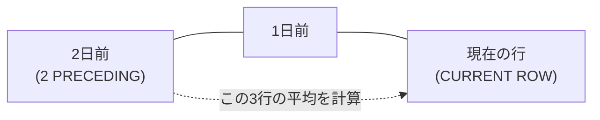

`ROWS`は行の物理的な位置に基づいて範囲を決めるという意味、`2 PRECEDING`は現在の行から数えて「2行前」まで、`CURRENT ROW`は「現在の行」まで、`AND`は範囲の開始と終了をつなぐ役割です。結果として「2日前＋1日前＋今日」の合計3行が平均計算の対象になります。データの1行目（初日）には「2日前」が存在しませんが、この場合Oracleは存在する行（1行目のみ）だけで平均を出してくれます。エラーにならないのがWindow関数の良いところです。

| 種類 | 基準 | 使いどころ |
| :--- | :--- | :--- |
| `ROWS` | 行の物理的な位置 | データが欠損していてもレコードがある日だけを繋いで見たいとき |
| `RANGE` | 値（日付）の間隔 | 「過去3日分の日付」を厳密に指定したいとき |

実務では`ROWS`（行数）のほかに`RANGE`を使うこともあります。`ROWS`は物理的に「前の行」を見るため、データが欠損している（例：7/11の売上が0でレコード自体がない）場合でも、無理やりその前の「行」を拾います。`RANGE`は値（日付）の間隔を見るため、「過去3日分の日付」を厳密に指定したい場合はこちらが適していますが、今回のようにレコードがある日だけを繋いで傾向を見るなら`ROWS`が一般的です。

同じ書き方で、平均（`AVG`）を合計（`SUM`）に変えれば「直近3日間の累積売上」になります。
```sql
SUM(daily_sales) OVER(ORDER BY time_id ROWS 2 PRECEDING) 
-- ※CURRENT ROWは省略可能
```

----
<br><br>

# 【完全版】問題12-14：未来予測の予兆（LEAD関数による購入間隔分析）
### 難易度：★★★☆☆ (Lv.3)
## 問題
マーケティング部門では、顧客の離脱を防ぐための「リピート予測モデル」の構築を計画しています。その前段階として、優良顧客が通常「何日おきに注文をしているか」というリードタイムを把握する必要があります。
特定の顧客（`CUSTOMER_ID = 101`）をモデルケースとして、過去の注文履歴から「今回の注文日」と「次回の注文日」を横並びにしたリストを作成し、リピート注文までの経過日数を算出してください。
OEスキーマの`ORDERS` テーブルより、顧客ID（`CUSTOMER_ID`）が `101` の従業員を対象として、以下の情報を取得してください。

**【取得項目】**
1. **`ORDER_ID`**: 注文ID
2. **`CURRENT_ORDER`**: 今回の注文日（`YYYY-MM-DD`形式）
3. **`NEXT_ORDER`**: **次回の注文日**（`YYYY-MM-DD`形式）
4. **`DAYS_TO_NEXT`**: 次回の注文までの日数（`NEXT_ORDER` - `CURRENT_ORDER`）

**【抽出・算出ルール】**
* 注文日（`ORDER_DATE`）の昇順で並べ替えた際の「次の行」の注文日を `NEXT_ORDER` とします。
* 最後の注文行など、次に注文がない場合は `NEXT_ORDER` には `NULL` を表示してください。
* 日数計算において、TIMESTAMP型の差分から「日」の部分を抽出してください。

## 期待する結果
| ORDER_ID | CURRENT_ORDER | NEXT_ORDER  | DAYS_TO_NEXT |
| -------- | -------------- | ------------ | ------------- |
| 2458     | 2007-08-16       | 2007-10-02     | 46              |
| 2430     | 2007-10-02       | 2008-03-29     | 179             |
| 2413     | 2008-03-29       | 2008-07-27     | 119             |
| 2447     | 2008-07-27       |                 |                 |

## 解答例
```sql
SELECT
    order_id,
    TO_CHAR(order_date, 'YYYY-MM-DD') AS current_order,
    -- 1. 1行先の order_date を取得
    TO_CHAR(LEAD(order_date) OVER (ORDER BY order_date), 'YYYY-MM-DD') AS next_order,
    -- 2. 次回注文日と今回の注文日の差分を計算
    EXTRACT(DAY FROM (LEAD(order_date) OVER (ORDER BY order_date)
                         - order_date)) AS days_to_next
FROM
    oe.orders
WHERE
    customer_id = 101
ORDER BY
    order_date
```

## 解説
今回は分析関数の中でも人気の高い`LEAD`関数です。「1つの行の中に、未来（次の行）のデータを連れてくる」というこのテクニックは、リピート分析や前年比計算など、実務のさまざまな場面で活躍します。

このクエリの主役は`LEAD`関数です。通常、SQLは1行ずつ独立して処理を行いますが、分析関数を使うと行同士をまたいだ計算が可能になります。

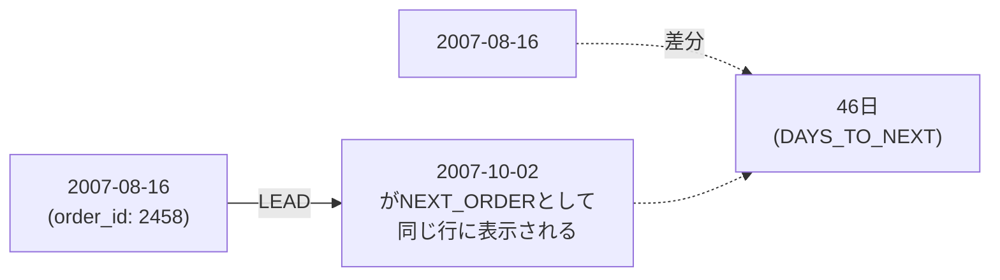

`LEAD(order_date) OVER (ORDER BY order_date)`の動きを見てみましょう。`ORDER BY order_date`で、まずその顧客の注文データを古い順に並べます。`LEAD(...)`で、並べたリストの中で今の行から見て「1つ先（次）の行」にある`order_date`を取ってきます。これによって、本来は別々の行に分かれている「今回の注文」と「次回の注文」を同じ行に並べて比較できるようになります。

今回の`ORDER_DATE`列はTIMESTAMP型（秒単位まで保持する形式）であることが多いため、単純に引き算をすると「+000000046 05:10:00...」のようなINTERVAL（期間）型のデータが返ってきます。これを「46」という数値（整数）として取り出すために`EXTRACT(DAY FROM ...)`を使用しています。もしDATE型同士の引き算であれば結果は自動的に数値（日単位）になりますが、TIMESTAMP型が混ざる場合はこの`EXTRACT`のテクニックが必要になります。

期待する結果の最終行を見てください。最新の注文には「次の注文」が存在しないため、`LEAD`関数は自動的にNULLを返します。マーケティング分析では、このNULLが「まだリピートしていない顧客（離脱予備軍）」を見つけるための重要なフラグになります。

この手法は、「この顧客は平均60日間隔で買うから、前回の購入から50日経ったタイミングでクーポンを送ろう」といった購入サイクル分析、「トップページを見た30秒後にどのページへ遷移したか」といったWebサイトの行動遷移の把握、「前回の故障から今回の故障まで何日稼働したか（MTBF）」を算出する設備メンテナンスなど、「間隔」にまつわる分析でよく使われます。

「次の行を見るならLEAD、前の行を見るならLAG」とセットで覚えておくと、時系列データの分析効率が上がります。ちなみに`LEAD`関数には第2引数を指定することもでき、例えば`LEAD(order_date, 2)`と書くと「2回先の注文」を取得できます。

----
<br><br>
# 【完全版】問題12-15：基準値との比較（FIRST_VALUE / LAST_VALUE）
### 難易度：★★★☆☆ (Lv.3)
## 問題
人事部より、部門内の給与格差に関する分析レポートの依頼がありました。
各部門において、「その部門で最も早く採用された従業員（最初に入社した人）」の給与を基準値（ベースライン）とし、他の従業員との給与差を可視化したいと考えています。
これにより、勤続年数と給与の相関関係や、初期メンバーと後発メンバーの待遇差を調査します。
HRスキーマの`EMPLOYEES` テーブルより、部門ID（`DEPARTMENT_ID`）が `60`（IT）および `90`（Executive）の従業員を対象として、以下の情報を取得してください。

**【取得項目】**
1. **`DEPARTMENT_ID`**: 部門ID
2. **`FIRST_NAME`**: 名前
3. **`HIRE_DATE`**: 採用日
4. **`SALARY`**: 給与
5. **`BASE_SALARY`**: その部門で **最も早く採用された人** の給与（`FIRST_VALUE` を使用）
6. **`DIFF_BASE`**: 基準給与との差分（`SALARY` - `BASE_SALARY`）

**【抽出・算出ルール】**
* 部門（`PARTITION BY department_id`）ごとに計算してください。
* 「最も早く採用された」の判定は、採用日（`HIRE_DATE`）の昇順とします。
* 同日に採用された人が複数いる場合は、`EMPLOYEE_ID` が小さい方を優先してください。
* 結果は、部門IDの昇順、次に採用日の昇順で表示してください。

## 期待する結果
| DEPARTMENT_ID | FIRST_NAME | HIRE_DATE              | SALARY | BASE_SALARY | DIFF_BASE |
| -------------- | ----------- | ------------------------ | ------- | ------------- | ---------- |
| 60              | David        | 2015-06-25T00:00:00Z        | 4800     | 4800            | 0            |
| 60              | Alexander    | 2016-01-03T00:00:00Z        | 9000     | 4800            | 4200         |
| 60              | Valli        | 2016-02-05T00:00:00Z        | 4800     | 4800            | 0            |
| 60              | Diana        | 2017-02-07T00:00:00Z        | 4200     | 4800            | -600         |
| 60              | Bruce        | 2017-05-21T00:00:00Z        | 6000     | 4800            | 1200         |
| 90              | Lex          | 2011-01-13T00:00:00Z        | 17000    | 17000           | 0            |
| 90              | Steven       | 2013-06-17T00:00:00Z        | 24000    | 17000           | 7000         |
| 90              | Neena        | 2015-09-21T00:00:00Z        | 17000    | 17000           | 0            |

## 解答例
```sql
SELECT
    department_id,
    first_name,
    hire_date,
    salary,
    -- 1. 部門内で採用日が最も古い人の salary を取得
    FIRST_VALUE(salary) OVER (
        PARTITION BY department_id 
        ORDER BY hire_date, employee_id
    ) AS base_salary,
    -- 2. 給与と基準値の差分を計算
    salary - FIRST_VALUE(salary) OVER (
        PARTITION BY department_id 
        ORDER BY hire_date, employee_id
    ) AS diff_base
FROM
    hr.employees
WHERE
    department_id IN (60, 90)
ORDER BY
    department_id,
    hire_date
```

## 解説
今回は「基準値（ベースライン）」を作って比較する、`FIRST_VALUE`関数の使い方です。「部門の中で一番最初に入社した人の給与」という定点を決め、そこから今の自分がどれだけ離れているかを算出するロジックは、給与分析だけでなく、在庫の初動比較やキャンペーンの効果測定などにも応用できます。

このクエリの核心は、`FIRST_VALUE`を使って「特定の一行の値」を全行に持ってくるテクニックです。
```sql
FIRST_VALUE(salary) OVER (
    PARTITION BY department_id 
    ORDER BY hire_date, employee_id
)
```


`PARTITION BY department_id`で部署ごとに計算の壁を作ります。これにより、IT部門の人はIT部門の最古参、Executive部門の人はExecutive部門の最古参の給与と比較されます。`ORDER BY hire_date, employee_id`で何をもって「最初」とするかを定義し、今回は「採用日が古い順」です。`FIRST_VALUE(salary)`で、並べた結果一番上にきた人の給与を、そのパーティション内のすべての行にコピーします。

| 関数 | 何を探すか |
| :--- | :--- |
| `MIN(salary)` | その部門で最も低い給与額（金額として最小） |
| `FIRST_VALUE(salary)` | 採用日順に並べたとき最初の人の給与額（順序として最初） |

「一番最初の」と言われると`MIN(salary)`を連想するかもしれませんが、`MIN(salary)`はその部門で最も低い給与額を探すのに対し、`FIRST_VALUE(salary)`は採用日順に並べたとき最初の人の給与額を取ります。「最古参＝一番薄給（あるいは最高給）」とは限らないため、別軸（採用日）で並べた結果の特定項目の値を取るには`FIRST_VALUE`が必要です。

実務レベルで重要なのが、`ORDER BY`に`employee_id`を含めている点です。もし同じ日に採用された人が複数いた場合、並び順が不定だと「誰が基準になるか」が実行のたびに変わる可能性があります。これを防ぐために、ユニークな列（`employee_id`）を追加して結果が常に一定（決定論的）になるように制御しています。

`FIRST_VALUE`を使う際、実は裏側で`RANGE BETWEEN UNBOUNDED PRECEDING AND CURRENT ROW`という範囲が動いています。「最初の行」は常にこの範囲のスタート地点に存在するため、特にフレーム指定を意識しなくても「パーティション内の絶対的な1行目」を安定して取得できます。

この「最初（または最後）の値と比較する」テクニックは、年初（最初の営業日）の値を基準にして現在の騰落率を出す株価・経済指標分析、ロット内の最初の製品の寸法を基準にその後の製品の誤差（ブレ）を測定する製造業、セッション内で最初に踏んだページ（ランディングページ）によってその後のコンバージョン率がどう変わるかを比較するWeb分析、といった場面でよく使われます。「PARTITION BYで区切って、ORDER BYで並べた先頭の値をFIRST_VALUEで取る」という流れさえ掴めれば、複雑な相関サブクエリを書く必要がなくなります。

----
<br><br>

# 【完全版】問題12-16：分析関数版 LISTAGG（明細へのリスト付与）
### 難易度：★★★★☆ (Lv.4)
## 問題
注文管理システム（OEスキーマ）において、カスタマーサポート向けの注文明細照会画面を作成しています。
担当者は、ある注文（`ORDER_ID`）に含まれる各商品（`PRODUCT_ID`）の詳細を確認しながら、同時に「その注文の中に他にどんな商品が一緒に買われているか」をひと目で把握したいと考えています。
行を1行に集約してしまうのではなく、全明細行を表示したまま、その横に「注文内全商品リスト」を添えて出力してください。
OEスキーマの **`ORDER_ITEMS`** および **`PRODUCT_INFORMATION`** テーブルを使用し、`ORDER_ID` が `2355` および `2374` のデータを対象として、以下の情報を取得してください。

**【取得項目】**
1. **`ORDER_ID`**: 注文ID
2. **`PRODUCT_ID`**: 商品ID
3. **`PRODUCT_NAME`**: 商品名
4. **`ALL_ITEMS_IN_ORDER`**: **その注文に含まれる全商品のリスト**

**【抽出・算出ルール】**
* `ALL_ITEMS_IN_ORDER` は、注文（`PARTITION BY order_id`）ごとに商品名（`PRODUCT_NAME`）をカンマ＋スペース（`', '`）で区切って連結してください。
* リスト内の商品名の並び順は、商品名のアルファベット昇順（`WITHIN GROUP (ORDER BY product_name)`）としてください。
* 結果は、注文IDの昇順、次に商品名の昇順で表示してください。

## 期待する結果
| ORDER_ID | PRODUCT_ID | PRODUCT_NAME            | ALL_ITEMS_IN_ORDER                                                                                                                                    | 
| -------- | ---------- | ----------------------- | ----------------------------------------------------------------------------------------------------------------------------------------------------- | 
| 2355     | 2289       | KB 101/ES               | KB 101/ES, LCD Monitor 9/PM, PS 220V /L, Paper - Std Printer, Plastic Stock - R, Plastic Stock - Y, Screws <B.32.P>, Screws <Z.28.P>, Video Card /E32 | 
| 2355     | 2359       | LCD Monitor 9/PM        | KB 101/ES, LCD Monitor 9/PM, PS 220V /L, Paper - Std Printer, Plastic Stock - R, Plastic Stock - Y, Screws <B.32.P>, Screws <Z.28.P>, Video Card /E32 | 
| 2355     | 2311       | PS 220V /L              | KB 101/ES, LCD Monitor 9/PM, PS 220V /L, Paper - Std Printer, Plastic Stock - R, Plastic Stock - Y, Screws <B.32.P>, Screws <Z.28.P>, Video Card /E32 | 
| 2355     | 2339       | Paper - Std Printer     | KB 101/ES, LCD Monitor 9/PM, PS 220V /L, Paper - Std Printer, Plastic Stock - R, Plastic Stock - Y, Screws <B.32.P>, Screws <Z.28.P>, Video Card /E32 | 
| 2355     | 2330       | Plastic Stock - R       | KB 101/ES, LCD Monitor 9/PM, PS 220V /L, Paper - Std Printer, Plastic Stock - R, Plastic Stock - Y, Screws <B.32.P>, Screws <Z.28.P>, Video Card /E32 | 
| 2355     | 2326       | Plastic Stock - Y       | KB 101/ES, LCD Monitor 9/PM, PS 220V /L, Paper - Std Printer, Plastic Stock - R, Plastic Stock - Y, Screws <B.32.P>, Screws <Z.28.P>, Video Card /E32 | 
| 2355     | 2323       | Screws <B.32.P>         | KB 101/ES, LCD Monitor 9/PM, PS 220V /L, Paper - Std Printer, Plastic Stock - R, Plastic Stock - Y, Screws <B.32.P>, Screws <Z.28.P>, Video Card /E32 | 
| 2355     | 2322       | Screws <Z.28.P>         | KB 101/ES, LCD Monitor 9/PM, PS 220V /L, Paper - Std Printer, Plastic Stock - R, Plastic Stock - Y, Screws <B.32.P>, Screws <Z.28.P>, Video Card /E32 | 
| 2355     | 2308       | Video Card /E32         | KB 101/ES, LCD Monitor 9/PM, PS 220V /L, Paper - Std Printer, Plastic Stock - R, Plastic Stock - Y, Screws <B.32.P>, Screws <Z.28.P>, Video Card /E32 | 
| 2374     | 2423       | C for SPNIX4.0 - 1 Seat | C for SPNIX4.0 - 1 Seat, OSI 1-4/IL, SPNIX4.0 - SAL, SPNIX4.0 - UL/D                                                                                  | 
| 2374     | 2449       | OSI 1-4/IL              | C for SPNIX4.0 - 1 Seat, OSI 1-4/IL, SPNIX4.0 - SAL, SPNIX4.0 - UL/D                                                                                  | 
| 2374     | 2422       | SPNIX4.0 - SAL          | C for SPNIX4.0 - 1 Seat, OSI 1-4/IL, SPNIX4.0 - SAL, SPNIX4.0 - UL/D                                                                                  | 
| 2374     | 2467       | SPNIX4.0 - UL/D         | C for SPNIX4.0 - 1 Seat, OSI 1-4/IL, SPNIX4.0 - SAL, SPNIX4.0 - UL/D                                                                                  | 

## 解答例
```sql
SELECT
    oi.order_id,
    oi.product_id,
    p.product_name,
    -- 分析関数版 LISTAGG: 行をまとめず、パーティション内の値を連結する
    LISTAGG(p.product_name, ', ') 
        WITHIN GROUP (ORDER BY p.product_name) 
        OVER (PARTITION BY oi.order_id) AS all_items_in_order
FROM
    oe.order_items oi
    INNER JOIN oe.product_information p 
        ON oi.product_id = p.product_id
WHERE
    oi.order_id IN (2355, 2374)
ORDER BY
    oi.order_id,
    p.product_name
```

## 解説
今回は分析関数（Window関数）としての`LISTAGG`の活用です。通常、`LISTAGG`は複数の行を1行にまとめる集計関数として使われますが、今回のポイントは`OVER`句を付けて分析関数として使うことにあります。これはOracle 12.2以降で使えるようになった機能で、明細行（1つ1つの商品）を残したまま、その横に「注文全体のリスト」を並べるという出力が可能になります。

| 使い方 | 出力される行数 | できること |
| :--- | :--- | :--- |
| 集計関数として（`GROUP BY`と併用） | 注文1件につき1行 | 注文ごとのサマリー（商品リストのみ） |
| 分析関数として（`OVER`句を付ける） | 明細行の数だけ（今回は9行） | 各商品の明細＋その注文の全リストを横並び |

このクエリの特徴は、以下の部分に集約されています。
```sql
LISTAGG(p.product_name, ', ') 
    WITHIN GROUP (ORDER BY p.product_name) 
    OVER (PARTITION BY oi.order_id)
```
`WITHIN GROUP (ORDER BY ...)`は、連結される商品名の並び順を決めます。`OVER (PARTITION BY oi.order_id)`がここでのポイントで、これがあることで「行を集約せずに」、同じ注文ID（`order_id`）のグループ内で連結処理を行い、その結果を各行に配り直します。

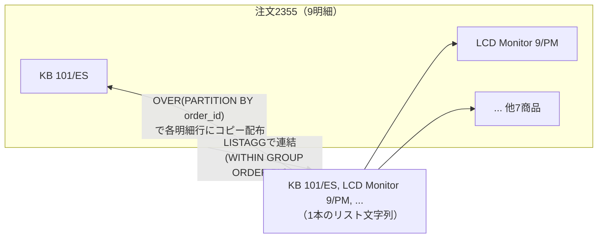

通常、集計関数としての`LISTAGG`を使うと1つの注文に対して1行しか出力されませんが、分析関数として使うことで「商品Aの横に全リスト」「商品Bの横に全リスト」という出力が実現できます。

実務では「特定のデータの詳細を見ながら、それが属するグループの全体像も把握したい」という要望がよくあります。集計版のLISTAGGは注文ごとのサマリー（全何種類の商品があるか）を出すのに向いていますが、分析関数版（今回）は商品ごとの明細に加えてその商品の仲間たち（併売品）のリストも表示できます。JOINを何度も繰り返したり複雑なサブクエリを書いたりすることなく、1回のスキャンで情報を付加できるのが強みです。

`LISTAGG`の第2引数`', '`で、カンマの後に半角スペースを入れることで、期待する結果のような読みやすいリストになります。なお、`WITHIN GROUP (ORDER BY ...)`は「リストの中身」の並び順、最後の`ORDER BY`は「レポート全体」の並び順という違いがあるので、この2つを混同しないように注意してください。

この手法は、配送された各商品の明細を表示しつつその注文に含まれる「ギフトメッセージ」や「同梱キャンペーン名」を全行に表示するECサイトの注文履歴、特定のエラーが発生した際その前後数分間に発生していた「他システムのエラー名リスト」を横に添えて相関関係を調査するエラーログ分析、従業員の名簿を出力する際その従業員が所属するプロジェクトの「メンバー全員の名前」を横にリストアップするスキル管理など、「情報の詰め込み」が必要な場面でよく使われます。

----
<br><br>

# 【完全版】問題12-17：統計的分布（CUME_DIST / PERCENT_RANK）
### 難易度：★★★☆☆ (Lv.3)
## 問題
マーケティング部門では、製品の価格戦略を検討するために、各製品カテゴリ内における製品価格の「相対的なポジション」を分析しています。
単なる順位（1位、2位…）ではなく、「その製品よりも高い製品がどれくらい存在するか」という割合を数値化することで、高級ラインの製品（上位10%など）を動的に特定したいと考えています。
SHスキーマの`PRODUCTS`テーブルより、製品カテゴリ（`PROD_CATEGORY_ID`）が `205`（Electronics）の製品を対象として、以下の情報を取得してください。

**【取得項目】**
1. **`PROD_ID`**: 製品ID
2. **`PROD_NAME`**: 製品名
3. **`PROD_LIST_PRICE`**: 定価
4. **`CUME_DIST_VAL`**: **累積分布**
5. **`PERCENT_RANK_VAL`**: **パーセンタイル順位**

**【抽出・算出ルール】**
* 価格（`PROD_LIST_PRICE`）の**降順**（高い順）で並べた際の分布を計算してください。
* 計算結果は小数点第4位を四捨五入して表示してください。
* 結果は、定価の降順で表示してください。
## 期待する結果
| PROD_ID | PROD_NAME                       | PROD_LIST_PRICE | CUME_DIST_VAL | PERCENT_RANK_VAL | 
| ------- | -------------------------------- | ---------------- | -------------- | ------------------ | 
| 28      | English Willow Cricket Bat        | 199.99             | 0.0385           | 0                   | 
| 19      | Cricket Bat Bag                   | 55.99              | 0.0769           | 0.04                | 
| 123     | Helmet                            | 49.99              | 0.1154           | 0.08                | 
| 40      | Team shirt                        | 44.99              | 0.3462           | 0.12                | 
| 44      | Team shirt                        | 44.99              | 0.3462           | 0.12                | 
| 45      | Team shirt                        | 44.99              | 0.3462           | 0.12                | 
| 41      | Team shirt                        | 44.99              | 0.3462           | 0.12                | 
| 42      | Team shirt                        | 44.99              | 0.3462           | 0.12                | 
| 43      | Team shirt                        | 44.99              | 0.3462           | 0.12                | 
| 126     | Spiked Shoes                      | 28.99              | 0.3846           | 0.36                | 
| 113     | Cricket Ball                      | 22.99              | 0.4231           | 0.4                 | 
| 23      | Plastic Cricket Bat                | 21.99              | 0.4615           | 0.44                | 
| 124     | Wicket Keeper Gloves               | 18.99              | 0.5769           | 0.48                | 
| 122     | Wide Brim Hat                     | 18.99              | 0.5769           | 0.48                | 
| 114     | Cricket Ball - Training Ball        | 18.99              | 0.5769           | 0.48                | 
| 125     | Bucket Hat                        | 15.99              | 0.6154           | 0.6                 | 
| 116     | Catchers Helmet                   | 11.99              | 0.6923           | 0.64                | 
| 48      | Indoor Cricket Ball                 | 11.99              | 0.6923           | 0.64                | 
| 121     | Cricket - Athletic Guard Cup         | 10.99              | 0.7308           | 0.72                | 
| 30      | Linseed Oil                       | 9.99               | 0.7692           | 0.76                | 
| 117     | Plastic - Beach Cricket Wickets     | 8.99               | 0.8846           | 0.8                 | 
| 31      | Fiber Tape                        | 8.99               | 0.8846           | 0.8                 | 
| 115     | Plastic - Beach Cricket Ball        | 8.99               | 0.8846           | 0.8                 | 
| 118     | Cricket Bails                     | 7.99               | 0.9231           | 0.92                | 
| 120     | Cricket Peak Cap                  | 6.99               | 1                | 0.96                | 
| 119     | Cricket Bails - Junior              | 6.99               | 1                | 0.96                | 

## 解答例
```sql
SELECT
    prod_id,
    prod_name,
    prod_list_price,
    -- 1. 累積分布（自分以下の値を持つ行の割合）
    ROUND(CUME_DIST() OVER (ORDER BY prod_list_price DESC), 4) AS cume_dist_val,
    -- 2. パーセンタイル順位（(RANK-1) / (TotalRows-1)）
    ROUND(PERCENT_RANK() OVER (ORDER BY prod_list_price DESC), 4) AS percent_rank_val
FROM
    sh.products
WHERE
    prod_category_id = 205
ORDER BY
    prod_list_price DESC
```

## 解説
今回は統計的な分布を扱う内容です。単なる「順位（1位、2位…）」は分かりやすい反面、全体が10件なのか100万件なのかでその価値が大きく変わってしまいます。そこで、全体における位置を0〜1の範囲で数値化する「分布関数」の出番になります。

このクエリでは、製品価格を高い順（`DESC`）に並べたときの相対的な位置を2つの関数で算出しています。

| 関数 | 計算式 | 開始値（1位） | 終了値（最下位） |
| :--- | :--- | :---: | :---: |
| `CUME_DIST`（累積分布） | 自分以上の行数 ÷ 全体行数 | 1 ÷ N | 1.0 |
| `PERCENT_RANK`（パーセンタイル順位） | (RANK - 1) ÷ (全体行数 - 1) | 0 | 1.0 |

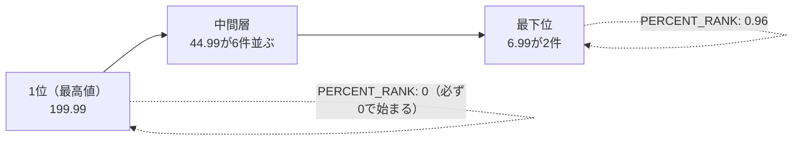

`CUME_DIST`（累積分布）は、「現在の行の値を含め、それより高い（または等しい）値を持つ行が全体の何割か」を計算します。計算式は「現在の行より上位（同値含む）の行数 ÷ 全体の行数」です。特徴として、最初の行（1位）は「1 ÷ 全行数」となり、最後の行は必ず1.0になります。

`PERCENT_RANK`（パーセンタイル順位）は、「現在の行が、全体の中で何％の位置にいるか」を0〜1の間で相対的に表します。計算式は「(RANK - 1) ÷ (全体の行数 - 1)」です。特徴として、最初の行（1位）は必ず0になり、最後の行は必ず1.0になります。

似ているようで出力に違いがあります。CUME_DISTの開始値は「1 ÷ N」、終了値は1.0で、「上位30%以内の製品」といったボリューム層の抽出に向いています。PERCENT_RANKの開始値は0、終了値は1.0で、「全体の中での相対的な位置づけ」といった偏差値的な比較に向いています。今回の「Team shirt（44.99ドル）」のように同価格が複数並ぶ場合、どちらの関数も同じ値を返します。これにより、データの「タイ（同着）」を考慮した正しい分布が得られます。「上位10%の高級ライン」を特定したい場合は、`CUME_DIST`が値0.1以下のものを抽出するだけで、データの総数に関わらず上位1割を抜き出せるので使いやすいです。

この分布関数は、「この成績の従業員は、全体の上位何％に属しているか」を算出する人事評価、「出荷頻度が下位20%に属する商品（死蔵在庫候補）」を特定する物流・在庫管理、検査値が異常な分布（極端に高い、または低い）を示していないかを監視する品質管理など、価格分析以外の場面でも活用できます。

「順位を割合に変換する」のがこれらの関数の役割です。`CUME_DIST`は「累積」を、`PERCENT_RANK`は「相対的な順位」を重視していると覚えておくと、分析の目的に合わせて使い分けやすくなります。

----
<br><br>

# 【完全版】問題12-18：売上の前月比と成長率の算出（LAG関数の応用）
### 難易度：★★★☆☆ (Lv.3)
## 問題
SH（売上履歴）スキーマを使用し、特定の商品について月ごとの売上推移を分析します。単なる売上額だけでなく、「前月からの増減額」**および**「売上成長率（前月比%）」を算出してください。
これにより、売上の勢いが加速しているのか、鈍化しているのかを判断します。
SHスキーマの`SALES`テーブルより、商品ID（`PROD_ID`）が「**13**」の商品を対象に、2021年の月別売上レポートを作成してください。

**【算出項目】**
1. **MONTH**: 売上月（`YYYY-MM`形式）。
2. **MONTHLY_SALES**: その月の売上合計（`AMOUNT_SOLD`の合計）。
3. **PREV_MONTH_SALES**: **前月**の `MONTHLY_SALES` 。
4. **SALES_DELTA**: 前月からの増減額（`MONTHLY_SALES` - `PREV_MONTH_SALES`）。
5. **GROWTH_RATE**: 前月比成長率（小数第3位を四捨五入し、XX.XX% 形式で表示）。

## 期待する結果
| MONTH   | MONTHLY_SALES | PREV_MONTH_SALES | SALES_DELTA | GROWTH_RATE | 
| ------- | -------------- | ------------------ | ------------- | ------------- | 
| 2021-01 | 85697.96         |                     |                |  %             | 
| 2021-02 | 215811.29        | 85697.96              | 130113.33       | 151.83%          | 
| 2021-03 | 160276.7         | 215811.29             | -55534.59       | -25.73%          | 
| 2021-04 | 177791.56        | 160276.7              | 17514.86        | 10.93%           | 
| 2021-05 | 169206.96        | 177791.56             | -8584.6         | -4.83%           | 
| 2021-06 | 152892.03        | 169206.96             | -16314.93       | -9.64%           | 
| 2021-07 | 174558.16        | 152892.03             | 21666.13        | 14.17%           | 
| 2021-08 | 221150.28        | 174558.16             | 46592.12        | 26.69%           | 
| 2021-09 | 163743.33        | 221150.28             | -57406.95       | -25.96%          | 
| 2021-10 | 227343.36        | 163743.33             | 63600.03        | 38.84%           | 
| 2021-11 | 150036.7         | 227343.36             | -77306.66       | -34%             | 
| 2021-12 | 230453.02        | 150036.7              | 80416.32        | 53.6%            | 

## 解答例
```sql
WITH monthly_summary AS (
    SELECT 
        TO_CHAR(time_id, 'YYYY-MM') AS month,
        SUM(amount_sold) AS monthly_sales
    FROM sh.sales
    WHERE prod_id = 13 AND time_id BETWEEN DATE '2021-01-01' AND DATE '2021-12-31'
    GROUP BY TO_CHAR(time_id, 'YYYY-MM')
)
SELECT 
    month,
    monthly_sales,
    LAG(monthly_sales) OVER (ORDER BY month) AS prev_month_sales,
    monthly_sales - LAG(monthly_sales) OVER (ORDER BY month) AS sales_delta,
    ROUND(
        (monthly_sales - LAG(monthly_sales) OVER (ORDER BY month)) 
        / NULLIF(LAG(monthly_sales) OVER (ORDER BY month), 0) * 100, 
        2
    ) || '%' AS growth_rate
FROM monthly_summary
ORDER BY month
```

## 解説
今回はビジネス分析の定番、「前月比（MoM: Month over Month）」の算出です。「単月でいくら売れたか」という点だけでなく、「前の月と比べてどう変化したか」という動きを捉えることで、ビジネスの状態を見やすくできます。

このクエリの核心は分析関数`LAG`です。まずWITH句で、生の販売明細データを`SUM`して「1ヶ月1行」の整理されたテーブルを作ります。分析関数を使う前に、このようにデータの粒度（今回なら月単位）を揃えておくのが基本です。次にメインクエリで、`LAG`関数を使い現在の行から見て「1行前（前月）」の売上額を横に並べます。

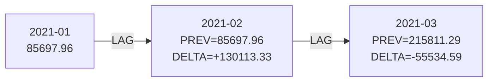

成長率は「(今月の売上 - 前月の売上) ÷ 前月の売上 × 100」という式で求められます。これをSQLで実装する際、分母が0（またはデータなしのNULL）になるとエラーになるため、`NULLIF`を使って安全に処理しています。

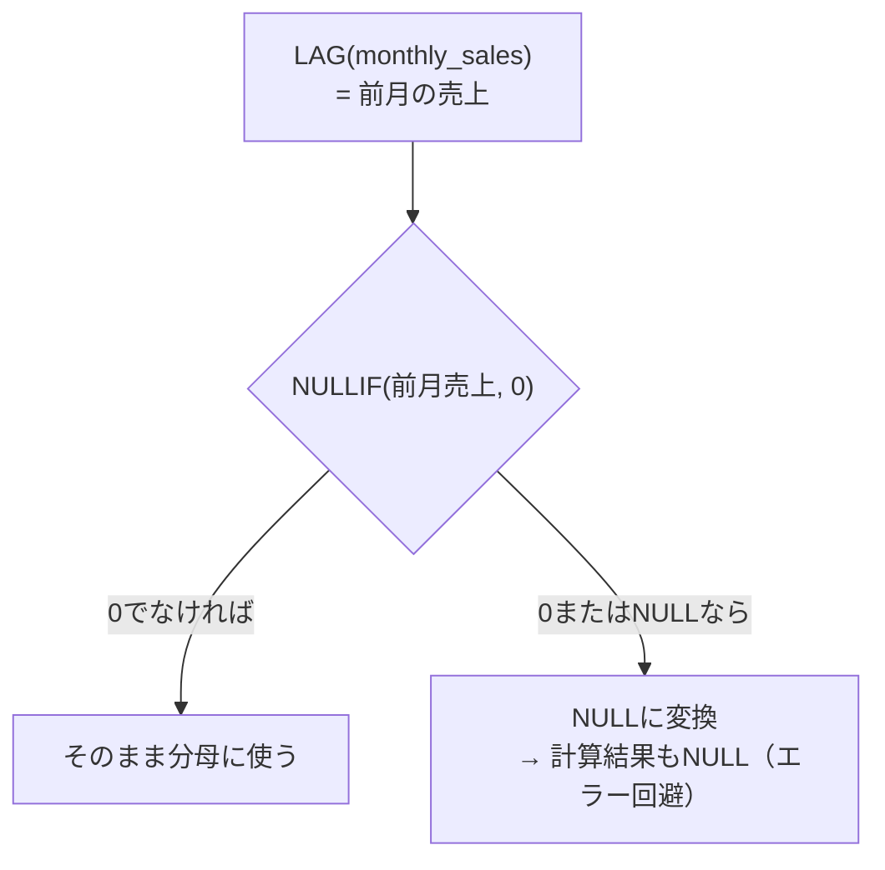

```sql
LAG(monthly_sales) OVER (ORDER BY month)
```
引数の`monthly_sales`は取得したい列名、`OVER`句は時間軸である`month`の昇順で並べることで、確実に「カレンダー上の前月」を取得できるようにしています。

```sql
NULLIF(LAG(monthly_sales) OVER (ORDER BY month), 0)
```
実務データでは、新商品などで「前月の売上が0」というケースが起こり得ます。数学的に「0での割り算」は禁止されているため、そのまま計算するとクエリが落ちてしまいます。`NULLIF(値, 0)`と書くことで、値が0の場合にNULLに変換します。SQLでは「X ÷ NULL」の結果はNULLになるため、エラーを回避して安全に空欄（%なし）にできます。

| 用途 | LAGの第2引数 | 意味 |
| :--- | :---: | :--- |
| 前月比 | 省略（デフォルト1） | 1行前 |
| 前年同月比 | `12` | 12行前 |

`LAG`は、前月比・前年同月比（12行前を取得）を求める売上分析、前日の在庫数と比較して急激な減少を検知する在庫管理、前回のログイン日時を取得して離脱期間を算出するユーザー行動分析など、幅広い場面で使われます。前年同月比（YoY）を出したい場合は、`LAG(monthly_sales, 12) OVER (ORDER BY month)`と第2引数に12を指定するだけで、1年前の値を連れてくることができます。

----
<br><br>

# 【完全版】問題12-19：パレート分析（ABC分析）による重要商品の特定
### 難易度：★★★★☆ (Lv.4)
## 問題
「売上の8割は全商品のうちの2割が作っている」というパレートの法則（80:20の法則）に基づき、SHスキーマの商品別売上を分析します。
各商品が全体売上に占める**累計構成比**を計算し、商品をA・B・Cランクに分類してください。
2019年の売上データに基づき、以下の条件で商品リストを作成してください。

**【集計ルール】**
1. **PROD_REVENUE**: 商品ごとの2019年の売上合計を算出。
2. **CUMULATIVE_PCT**: 売上額の**降順**で並べた際の、売上の**累計構成比**（その商品までの累計売上 ÷ 全体売上）を算出 。
3. **ABC_RANK**: 累計構成比に基づき以下のランクを付与。
   * 70%まで：**'A'**
   * 70%超〜90%まで：**'B'**
   * 90%超：**'C'**

## 期待する結果
上位の商品（Aランク：〜70%）と中位（Bランク：70〜90%）、そして下位（Cランク：90%超）に分類された商品一覧が、売上降順・累計構成比とともに出力される（全商品リスト、詳細は元データ参照）。上位9商品（Lithium Electric Golf Caddy 〜 Pro Maple Youth Bat）で累計69.85%に到達し、以降がBランク・Cランクへと続く。

## 解答例
```sql
WITH prod_sales AS (
    SELECT 
        p.prod_name,
        SUM(s.amount_sold) AS prod_revenue
    FROM sh.sales s
    JOIN sh.products p ON s.prod_id = p.prod_id
    WHERE s.time_id BETWEEN DATE '2019-01-01' AND DATE '2019-12-31'
    GROUP BY p.prod_name
),
cumulative_analysis AS (
    SELECT 
        prod_name,
        prod_revenue,
        -- 累計売上を全合計売上で割って累計構成比を算出
        ROUND(
            SUM(prod_revenue) OVER (ORDER BY prod_revenue DESC ROWS BETWEEN UNBOUNDED PRECEDING AND CURRENT ROW)
            / SUM(prod_revenue) OVER () * 100, 
            2
        ) AS cumulative_pct
    FROM prod_sales
)
SELECT 
    prod_name,
    prod_revenue,
    cumulative_pct,
    CASE 
        WHEN cumulative_pct <= 70 THEN 'A'
        WHEN cumulative_pct <= 90 THEN 'B'
        ELSE 'C'
    END AS abc_rank
FROM cumulative_analysis
ORDER BY prod_revenue DESC
```

## 解説
今回はビジネス分析の定番、「ABC分析（パレート分析）」です。「すべての商品を平等に扱うのではなく、売上の大部分を占める少数の重要商品にリソースを集中させる」という戦略的意思決定を支えるスキルです。

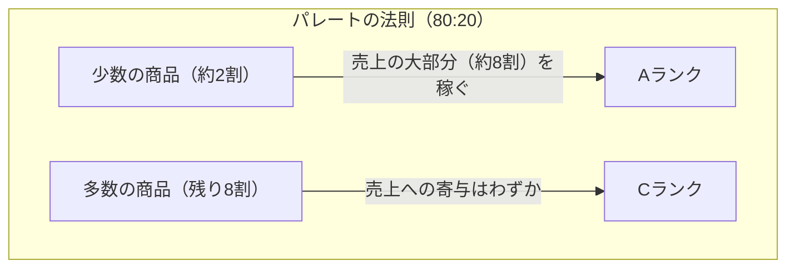

このクエリは、複雑な計算を段階的に処理するためにCTE（共通テーブル式）を2段階で使用しています。ステップ1（`prod_sales`）でまず「どの商品がいくら売れたか」を算出します。ここではWindow関数を使わず、通常の`GROUP BY`で粒度を整えます。ステップ2（`cumulative_analysis`）が今回の要となる部分で、1行目からその行までの「累計額」を、全体の「総計」で割る計算を同時に行います。ステップ3（メインクエリ）で、算出された累計構成比に対して`CASE`式でA・B・Cのラベルを貼ります。

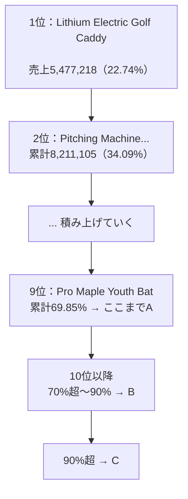

累計構成比の計算式は「SUM(revenue) OVER (ORDER BY ...)」を「SUM(revenue) OVER ()」で割ったものです。分子の`SUM(prod_revenue) OVER (ORDER BY prod_revenue DESC)`は、`ORDER BY`を指定することで「最初から今の行まで」を足し合わせるランニング・トータル（累計）になります。分母の`SUM(prod_revenue) OVER ()`は、`OVER`の中身を空にすることで並び順や区切りに関係なく全行の合計値（総計）を取得します。

解答例にある`ROWS BETWEEN UNBOUNDED PRECEDING...`という記述は、累計計算の範囲を「最初の行から現在の行まで」と明示的に指定するものです。Oracleのデフォルト挙動（`RANGE`）に近いですが、`ROWS`で指定する方が実行計画が安定しやすく、大規模データでは推奨される書き方です。

| ランク | 累計構成比 | 位置づけ | 推奨アクション |
| :---: | :--- | :--- | :--- |
| A | 〜70% | 最重要（少数精鋭） | 在庫切れ厳禁、発注リードタイムを厳格管理 |
| B | 70〜90% | 重要 | Aへの昇格／Cへの転落を注視 |
| C | 90%超 | 一般的 | 多品種少量、または廃番を検討 |

ABC分析の結果が出たら、次はアクションに繋げるのが分析の役割です。Aランク（最重要）は在庫切れを絶対に起こさないよう発注リードタイムを厳格に管理し、Bランク（重要）はAランクへの昇格やCランクへの転落がないか動向を注視し、Cランク（一般的）は多品種少量で扱うか、あるいは取り扱い停止（廃番）を検討して管理コストを削減する、といった具合です。今回は70%/90%という区切りにしましたが、業界や商品数によっては80%/95%などで区切ることもあります。SQLなら`CASE`式の数字を書き換えるだけで、シミュレーションをすぐに試せます。

----
<br><br>

# 【完全版】問題12-20：中央値と外れ値の検出（PERCENTILE_CONT）
### 難易度：★★★★☆ (Lv.4)
## 問題
人事部では、平均給与だけでなく「中央値（メジアン）」を用いて部門間の給与バランスを調査しています。平均値は極端な高額所得者（外れ値）に引きずられやすいため、中央値との乖離を見ることで実態に近い給与水準を把握します。
HRスキーマの `EMPLOYEES` テーブルを使用し、各部門（`DEPARTMENT_ID`）における以下の統計量を算出してください。

**【算出項目】**
1. **AVG_SAL**: 部門の平均給与。
2. **MEDIAN_SAL**: 部門の**給与中央値**（`PERCENTILE_CONT(0.5)` を使用）。
3. **DIFF**: 平均と中央値の差分（`AVG_SAL` - `MEDIAN_SAL`）。
4. 対象は `DEPARTMENT_ID` が 50, 80, 100 の部門とします。

## 期待する結果
| DEPARTMENT_ID | AVG_SAL | MEDIAN_SAL | DIFF   | 
| -------------- | -------- | ----------- | ------- | 
| 50              | 3475.56    | 3100          | 375.56    | 
| 80              | 8955.88    | 8900          | 55.88     | 
| 100             | 8601.33    | 8000          | 601.33    | 

## 解答例
```sql
SELECT DISTINCT
    department_id,
    ROUND(AVG(salary) OVER (PARTITION BY department_id), 2) AS avg_sal,
    -- 指定したパーセンタイルに対応する値を補間して算出
    PERCENTILE_CONT(0.5) WITHIN GROUP (ORDER BY salary) 
        OVER (PARTITION BY department_id) AS median_sal,
    ROUND(
        AVG(salary) OVER (PARTITION BY department_id) - 
        PERCENTILE_CONT(0.5) WITHIN GROUP (ORDER BY salary) 
            OVER (PARTITION BY department_id), 
        2
    ) AS diff
FROM hr.employees
WHERE department_id IN (50, 80, 100)
ORDER BY department_id
```

## 解説
今回のテーマ「平均と中央値の比較」は、データサイエンスや統計分析の現場では基本的な考え方です。給与や不動産価格、売上単価などは、一部の極端な値（外れ値）によって平均が大きく跳ね上がることが多いため、中央値を算出するスキルはデータの実態を見抜くために役立ちます。

このクエリで最も特徴的なのは`PERCENTILE_CONT`という関数です。中央値とは、データを小さい順に並べたときに「ちょうど真ん中（50%地点）」にくる値のことです。`0.5`は50%地点（中央値）を指定しており、`WITHIN GROUP (ORDER BY salary)`はどの列を並べたときの50%地点かを指定しています。もしデータ件数が偶数で「真ん中」が2つの値の間にくる場合、この関数はそれらの平均を計算（補間）して正確な50%値を算出してくれます。

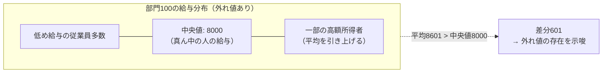

今回の解答例では、集計関数（`AVG`）や統計関数（`PERCENTILE_CONT`）を、Window関数（`OVER`句付き）として使用しています。Window関数は通常の`GROUP BY`と違い、行を集約せずに「全行」に出力結果をくっつけます。そのため、部門50に45人の従業員がいれば、全く同じ計算結果が45行表示されてしまいます。これを1部門1行のすっきりした結果にするために、最後に`DISTINCT`で重複を削っています。

| 部門 | 平均 | 中央値 | 差分 | 読み取れること |
| :---: | :---: | :---: | :---: | :--- |
| 50 | 3475.56 | 3100 | 375.56 | 平均が中央値よりやや高い＝一部の高給者の影響あり |
| 80 | 8955.88 | 8900 | 55.88 | 差が小さい＝給与が比較的均等に分布 |
| 100 | 8601.33 | 8000 | 601.33 | 差が最も大きい＝高額所得者の影響が強い |

期待する結果の部門100を見てみましょう。平均は8601、中央値は8000、差分は601です。平均が中央値より600ドル以上も高いということは、この部門には「他のメンバーよりも極端に高い給与をもらっている一部の社員」が存在し、その人が平均値を吊り上げていることが推測できます。実務での目安としては、平均に近い中央値はデータの分布が左右対称で安定していることを示し、平均＞中央値は高額な外れ値が存在すること（所得分布などによく見られます）を、平均＜中央値は低額な外れ値が存在することを示唆します。

| 関数 | 性質 | 結果の値 | 向いている用途 |
| :--- | :--- | :--- | :--- |
| `PERCENTILE_CONT` | 連続的（補間する） | データに存在しない値になることもある | 正確な統計値を出したいとき |
| `PERCENTILE_DISC` | 離散的（実在値から選ぶ） | 必ずデータ内に存在する値 | 「実在する代表値」を選びたいとき |

Oracleには似た関数で`PERCENTILE_DISC`も存在します。`PERCENTILE_CONT`は連続的（Continuous）で値の間を計算（補間）するため、正確な統計値を出したいときに向いており、結果がデータにない数値になることもあります。`PERCENTILE_DISC`は離散的（Discrete）でデータの中に存在する値から選ぶため、「実在する値」の中から代表者を選びたいときに向いています。

`PERCENTILE_CONT`で中央値を出し、`AVG`との差分を見ることで、「この部署の平均給与は高いですが、実は一部の管理職が引き上げているだけで、一般社員のボリュームゾーンはもっと低いですよ」といった、より実態に即した分析報告ができるようになります。

----
<br><br>

# 【完全版】問題12-21：IGNORE NULLSによる欠損値の前方補完（為替レートの穴埋め）
### 難易度：★★★☆☆ (Lv.3)
## 問題
経理部門が管理している月次の為替レート表は、レートが変動した月にだけ値が記録されており、変動がなかった月は`NULL`のまま放置されています。この「歯抜け」のレート表を、**直近に記録されていたレートで埋める（前方補完する）** SQLを作成してください。

**【条件およびルール】**
* データは通貨（`CURRENCY_CD`）ごとに、`RATE_MONTH`（対象月）の昇順で並んでいます。
* `RATE`列にレートが記録されている月は、その値をそのまま表示してください。
* `RATE`列が`NULL`の月は、**同じ通貨の中で直近に記録されていた（NULLではない）レート**を使って埋めてください。
* 埋めた結果は`FILLED_RATE`列として表示してください（`RATE`列自体は変更しません）。
* 結果は通貨コードの昇順、次に対象月の昇順で表示してください。

**【前提データ（WITH句）】**
```sql
WITH exchange_rates AS (
    SELECT DATE '2024-01-01' AS rate_month, 'USD' AS currency_cd, 150.00 AS rate FROM dual UNION ALL
    SELECT DATE '2024-02-01', 'USD', NULL   FROM dual UNION ALL
    SELECT DATE '2024-03-01', 'USD', 148.50 FROM dual UNION ALL
    SELECT DATE '2024-04-01', 'USD', NULL   FROM dual UNION ALL
    SELECT DATE '2024-05-01', 'USD', NULL   FROM dual UNION ALL
    SELECT DATE '2024-06-01', 'USD', 152.00 FROM dual UNION ALL
    SELECT DATE '2024-01-01', 'EUR', 160.00 FROM dual UNION ALL
    SELECT DATE '2024-02-01', 'EUR', NULL   FROM dual UNION ALL
    SELECT DATE '2024-03-01', 'EUR', NULL   FROM dual UNION ALL
    SELECT DATE '2024-04-01', 'EUR', 158.00 FROM dual UNION ALL
    SELECT DATE '2024-05-01', 'EUR', NULL   FROM dual UNION ALL
    SELECT DATE '2024-06-01', 'EUR', NULL   FROM dual
)
SELECT * FROM exchange_rates
```

## 期待する結果
| CURRENCY_CD | RATE_MONTH | RATE  | FILLED_RATE | 
| ----------- | ---------- | ----- | ----------- | 
| EUR         | 2024/01    | 160   | 160         | 
| EUR         | 2024/02    |       | 160         | 
| EUR         | 2024/03    |       | 160         | 
| EUR         | 2024/04    | 158   | 158         | 
| EUR         | 2024/05    |       | 158         | 
| EUR         | 2024/06    |       | 158         | 
| USD         | 2024/01    | 150   | 150         | 
| USD         | 2024/02    |       | 150         | 
| USD         | 2024/03    | 148.5 | 148.5       | 
| USD         | 2024/04    |       | 148.5       | 
| USD         | 2024/05    |       | 148.5       | 
| USD         | 2024/06    | 152   | 152         | 

## 解答例
```sql:例1：NG例（単純なLAGでは埋まらない）
WITH exchange_rates AS (
    SELECT DATE '2024-01-01' AS rate_month, 'USD' AS currency_cd, 150.00 AS rate FROM dual UNION ALL
    SELECT DATE '2024-02-01', 'USD', NULL   FROM dual UNION ALL
    SELECT DATE '2024-03-01', 'USD', 148.50 FROM dual UNION ALL
    SELECT DATE '2024-04-01', 'USD', NULL   FROM dual UNION ALL
    SELECT DATE '2024-05-01', 'USD', NULL   FROM dual UNION ALL
    SELECT DATE '2024-06-01', 'USD', 152.00 FROM dual UNION ALL
    SELECT DATE '2024-01-01', 'EUR', 160.00 FROM dual UNION ALL
    SELECT DATE '2024-02-01', 'EUR', NULL   FROM dual UNION ALL
    SELECT DATE '2024-03-01', 'EUR', NULL   FROM dual UNION ALL
    SELECT DATE '2024-04-01', 'EUR', 158.00 FROM dual UNION ALL
    SELECT DATE '2024-05-01', 'EUR', NULL   FROM dual UNION ALL
    SELECT DATE '2024-06-01', 'EUR', NULL   FROM dual
)
SELECT
    currency_cd,
    TO_CHAR(rate_month, 'YYYY/MM') AS rate_month,
    rate,
    NVL(rate,
        LAG(rate) OVER(PARTITION BY currency_cd
                        ORDER BY rate_month)
    ) AS filled_rate
FROM
    exchange_rates
ORDER BY
    currency_cd,
    rate_month
```
```sql:例2：正解（LAGにIGNORE NULLSを付与）
WITH exchange_rates AS (
    SELECT DATE '2024-01-01' AS rate_month, 'USD' AS currency_cd, 150.00 AS rate FROM dual UNION ALL
    SELECT DATE '2024-02-01', 'USD', NULL   FROM dual UNION ALL
    SELECT DATE '2024-03-01', 'USD', 148.50 FROM dual UNION ALL
    SELECT DATE '2024-04-01', 'USD', NULL   FROM dual UNION ALL
    SELECT DATE '2024-05-01', 'USD', NULL   FROM dual UNION ALL
    SELECT DATE '2024-06-01', 'USD', 152.00 FROM dual UNION ALL
    SELECT DATE '2024-01-01', 'EUR', 160.00 FROM dual UNION ALL
    SELECT DATE '2024-02-01', 'EUR', NULL   FROM dual UNION ALL
    SELECT DATE '2024-03-01', 'EUR', NULL   FROM dual UNION ALL
    SELECT DATE '2024-04-01', 'EUR', 158.00 FROM dual UNION ALL
    SELECT DATE '2024-05-01', 'EUR', NULL   FROM dual UNION ALL
    SELECT DATE '2024-06-01', 'EUR', NULL   FROM dual
)
SELECT
    currency_cd,
    TO_CHAR(rate_month, 'YYYY/MM') AS rate_month,
    rate,
    NVL(rate,
        LAG(rate) IGNORE NULLS OVER(PARTITION BY currency_cd
                                     ORDER BY rate_month)
    ) AS filled_rate
FROM
    exchange_rates
ORDER BY
    currency_cd,
    rate_month
```
```sql:例3：別解（LAST_VALUEにIGNORE NULLSを付与）
WITH exchange_rates AS (
    SELECT DATE '2024-01-01' AS rate_month, 'USD' AS currency_cd, 150.00 AS rate FROM dual UNION ALL
    SELECT DATE '2024-02-01', 'USD', NULL   FROM dual UNION ALL
    SELECT DATE '2024-03-01', 'USD', 148.50 FROM dual UNION ALL
    SELECT DATE '2024-04-01', 'USD', NULL   FROM dual UNION ALL
    SELECT DATE '2024-05-01', 'USD', NULL   FROM dual UNION ALL
    SELECT DATE '2024-06-01', 'USD', 152.00 FROM dual UNION ALL
    SELECT DATE '2024-01-01', 'EUR', 160.00 FROM dual UNION ALL
    SELECT DATE '2024-02-01', 'EUR', NULL   FROM dual UNION ALL
    SELECT DATE '2024-03-01', 'EUR', NULL   FROM dual UNION ALL
    SELECT DATE '2024-04-01', 'EUR', 158.00 FROM dual UNION ALL
    SELECT DATE '2024-05-01', 'EUR', NULL   FROM dual UNION ALL
    SELECT DATE '2024-06-01', 'EUR', NULL   FROM dual
)
SELECT
    currency_cd,
    TO_CHAR(rate_month, 'YYYY/MM') AS rate_month,
    rate,
    LAST_VALUE(rate IGNORE NULLS) OVER(
        PARTITION BY currency_cd
        ORDER BY rate_month
        ROWS BETWEEN UNBOUNDED PRECEDING AND CURRENT ROW
    ) AS filled_rate
FROM
    exchange_rates
ORDER BY
    currency_cd,
    rate_month
```

## 解説
これまでの`LAG`／`LEAD`（問題12-8、12-14、12-18）は、常に「すぐ隣の行」を見に行くだけでした。しかし実務のデータでは、今回の為替レートのように「値が変わったときだけ記録され、変わらない期間は空欄（NULL）」というテーブルがよく登場します。このNULLを、隣の行ではなく「最後に値が入っていた行」まで遡って埋める、というのが今回のテーマです。

まず例1（NG例）でつまずきを体験してみましょう。
```sql
NVL(rate, LAG(rate) OVER(PARTITION BY currency_cd ORDER BY rate_month))
```
USDの2月はNULLですが、1月（150.00）という値が入っているため、単純な`LAG`でも150.00が埋まり、一見うまくいったように見えます。ところが5月を見てください。5月のひとつ前である4月も、実はNULLです。`LAG`は「1行前の生の値」を機械的に持ってくるだけなので、その1行前がNULLならNULLがそのまま返ってきてしまいます。

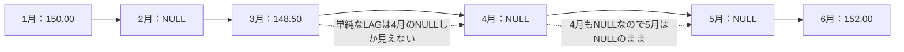

つまり、NULLが**2つ以上連続**すると、単純な`LAG`による前方補完は途中で息切れしてしまいます。今回のデータはこの罠にわざとはまるように、USDの4月・5月とEURの2月・3月／5月・6月に、あえて連続したNULLを配置しています。

ここで登場するのが`IGNORE NULLS`です。
```sql
LAG(rate) IGNORE NULLS OVER(PARTITION BY currency_cd ORDER BY rate_month)
```
`IGNORE NULLS`を付けると、`LAG`は「1行前」ではなく「**NULLを飛ばして、直近に値が入っていた行**」を探しに行くようになります。5月の場合、4月はNULLなので無視し、3月もチェックし……というように、値が見つかるまで何行でも遡ってくれます。

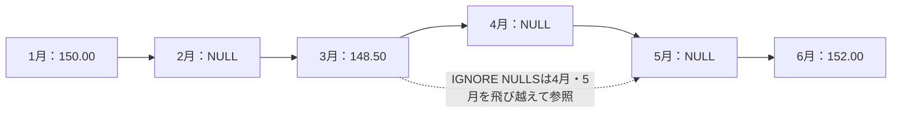

外側の`NVL(rate, ...)`は、「自分自身に値があればそれを優先し、なければ補完値を使う」という切り替えの役割です。`LAG`は常に「自分より前」の値しか見ないため、3月のように自分自身に値がある行では影響を受けません。

:::message
### IGNORE NULLSを書く位置に注意（LAG/LEAD と FIRST_VALUE/LAST_VALUE の違い）
`IGNORE NULLS`はどの分析関数でも同じ位置に書けるわけではありません。

| 関数 | 書き方 | IGNORE NULLSの位置 |
| :--- | :--- | :--- |
| `LAG` / `LEAD` | `LAG(rate) IGNORE NULLS OVER(...)` | **カッコの外**（OVERの直前） |
| `FIRST_VALUE` / `LAST_VALUE` | `LAST_VALUE(rate IGNORE NULLS) OVER(...)` | **カッコの中**（引数の直後） |

この位置を逆にする（例：`LAG(rate IGNORE NULLS)`や`LAST_VALUE(rate) IGNORE NULLS`）と構文エラーになります。関数によって置き場所が違う、というのはOracle SQLの分析関数群でも特に間違えやすいポイントなので、実際に手を動かして書いてみることをお勧めします。
:::

例3は`LAST_VALUE`を使った別解です。
```sql
LAST_VALUE(rate IGNORE NULLS) OVER(
    PARTITION BY currency_cd
    ORDER BY rate_month
    ROWS BETWEEN UNBOUNDED PRECEDING AND CURRENT ROW
)
```
`LAST_VALUE`は「ウィンドウの範囲内で最後の値」を返す関数です。`ROWS BETWEEN UNBOUNDED PRECEDING AND CURRENT ROW`（先頭から自分自身まで）という範囲を指定し、そこに`IGNORE NULLS`を組み合わせることで、「自分を含めて、そこまでの範囲でNULLではない最後の値」＝「自分の値、なければ直近の補完値」を一発で取得できます。`NVL`で自分自身の値と組み合わせる必要がなく、例2よりもシンプルに書けるのが利点です。ただし`ROWS BETWEEN`の範囲指定を忘れる（デフォルトの範囲に頼る）と意図しない結果になることがあるため、範囲は明示しておくと安全です。

| 方式 | 特徴 |
| :--- | :--- |
| 例2（`LAG` + `IGNORE NULLS` + `NVL`） | 「自分の値」と「補完値」の切り替えロジックが明示的で読みやすい |
| 例3（`LAST_VALUE` + `IGNORE NULLS`） | 1つの関数で完結し記述がシンプルだが、フレーム指定を省略すると事故りやすい |

このテクニックは、為替レートだけでなく、株価の休場日の補完、センサーの欠測値の補完、価格改定履歴を持つ商品マスタで「その日時点の有効価格」を求める場合など、応用範囲の広いパターンです。「値が変わった時だけ記録する」という設計のテーブルに出会ったら、`IGNORE NULLS`を思い出してください。

---
<br><br>

# 【完全版】問題12-22：WIDTH_BUCKETによる度数分布表（ヒストグラム）の作成
### 難易度：★★★★☆ (Lv.4)
## 問題
とある店舗の1日の購入履歴（返品によるマイナス金額や、まとめ買いによる高額決済も含む）をもとに、購入金額の**度数分布表（ヒストグラム）** を作成してください。

**【条件およびルール】**
* 購入金額を **0円から10,000円まで、2,000円刻みの5つの区分（ビン）** に分類してください。
* 0円未満（返品によるマイナス金額）は「**0円未満（返品）**」という区分にまとめてください。
* 10,000円以上（範囲の上限を超える高額決済）は「**10,000円以上（VIP）**」という区分にまとめてください。
* 各区分に該当する件数（`PURCHASE_COUNT`）を集計してください。
* 結果は区分番号（`BUCKET_NO`）の昇順で表示してください。

**【前提データ（WITH句）】**
```sql
WITH sales_log AS (
    SELECT 1200  AS purchase_amount FROM dual UNION ALL
    SELECT 3400  FROM dual UNION ALL
    SELECT 7600  FROM dual UNION ALL
    SELECT 500   FROM dual UNION ALL
    SELECT 2200  FROM dual UNION ALL
    SELECT 9800  FROM dual UNION ALL
    SELECT 4300  FROM dual UNION ALL
    SELECT 6700  FROM dual UNION ALL
    SELECT 1500  FROM dual UNION ALL
    SELECT 8900  FROM dual UNION ALL
    SELECT 3300  FROM dual UNION ALL
    SELECT 5600  FROM dual UNION ALL
    SELECT -500  FROM dual UNION ALL  -- 返品
    SELECT 7200  FROM dual UNION ALL
    SELECT 15000 FROM dual UNION ALL  -- VIP顧客のまとめ買い
    SELECT 4800  FROM dual UNION ALL
    SELECT 6100  FROM dual UNION ALL
    SELECT 2700  FROM dual
)
SELECT * FROM sales_log
```

## 期待する結果
| BUCKET_NO | PRICE_RANGE         | PURCHASE_COUNT | 
| --------- | ------------------- | -------------- | 
| 0         | 0円未満（返品）     | 1              | 
| 1         | 0～2,000円未満      | 3              | 
| 2         | 2,000～4,000円未満  | 4              | 
| 3         | 4,000～6,000円未満  | 3              | 
| 4         | 6,000～8,000円未満  | 4              | 
| 5         | 8,000～10,000円未満 | 2              | 
| 6         | 10,000円以上（VIP） | 1              | 

## 解答例
```sql:例1：WIDTH_BUCKETをGROUP BYに直接使用
WITH sales_log AS (
    SELECT 1200  AS purchase_amount FROM dual UNION ALL
    SELECT 3400  FROM dual UNION ALL
    SELECT 7600  FROM dual UNION ALL
    SELECT 500   FROM dual UNION ALL
    SELECT 2200  FROM dual UNION ALL
    SELECT 9800  FROM dual UNION ALL
    SELECT 4300  FROM dual UNION ALL
    SELECT 6700  FROM dual UNION ALL
    SELECT 1500  FROM dual UNION ALL
    SELECT 8900  FROM dual UNION ALL
    SELECT 3300  FROM dual UNION ALL
    SELECT 5600  FROM dual UNION ALL
    SELECT -500  FROM dual UNION ALL
    SELECT 7200  FROM dual UNION ALL
    SELECT 15000 FROM dual UNION ALL
    SELECT 4800  FROM dual UNION ALL
    SELECT 6100  FROM dual UNION ALL
    SELECT 2700  FROM dual
)
SELECT
    WIDTH_BUCKET(purchase_amount, 0, 10000, 5) AS bucket_no,
    CASE WIDTH_BUCKET(purchase_amount, 0, 10000, 5)
        WHEN 0 THEN '0円未満（返品）'
        WHEN 1 THEN '0～2,000円未満'
        WHEN 2 THEN '2,000～4,000円未満'
        WHEN 3 THEN '4,000～6,000円未満'
        WHEN 4 THEN '6,000～8,000円未満'
        WHEN 5 THEN '8,000～10,000円未満'
        WHEN 6 THEN '10,000円以上（VIP）'
    END AS price_range,
    COUNT(*) AS purchase_count
FROM
    sales_log
GROUP BY
    WIDTH_BUCKET(purchase_amount, 0, 10000, 5)
ORDER BY
    bucket_no
```
```sql:例2：CTEでビン番号を先に確定させる（可読性重視）
WITH sales_log AS (
    SELECT 1200  AS purchase_amount FROM dual UNION ALL
    SELECT 3400  FROM dual UNION ALL
    SELECT 7600  FROM dual UNION ALL
    SELECT 500   FROM dual UNION ALL
    SELECT 2200  FROM dual UNION ALL
    SELECT 9800  FROM dual UNION ALL
    SELECT 4300  FROM dual UNION ALL
    SELECT 6700  FROM dual UNION ALL
    SELECT 1500  FROM dual UNION ALL
    SELECT 8900  FROM dual UNION ALL
    SELECT 3300  FROM dual UNION ALL
    SELECT 5600  FROM dual UNION ALL
    SELECT -500  FROM dual UNION ALL
    SELECT 7200  FROM dual UNION ALL
    SELECT 15000 FROM dual UNION ALL
    SELECT 4800  FROM dual UNION ALL
    SELECT 6100  FROM dual UNION ALL
    SELECT 2700  FROM dual
),
-- ① 1件ずつビン番号を先に確定させる
bucketed AS (
    SELECT
        purchase_amount,
        WIDTH_BUCKET(purchase_amount, 0, 10000, 5) AS bucket_no
    FROM
        sales_log
)
-- ② ビン番号ごとに件数を集計し、ラベルを付与する
SELECT
    bucket_no,
    CASE bucket_no
        WHEN 0 THEN '0円未満（返品）'
        WHEN 1 THEN '0～2,000円未満'
        WHEN 2 THEN '2,000～4,000円未満'
        WHEN 3 THEN '4,000～6,000円未満'
        WHEN 4 THEN '6,000～8,000円未満'
        WHEN 5 THEN '8,000～10,000円未満'
        WHEN 6 THEN '10,000円以上（VIP）'
    END AS price_range,
    COUNT(*) AS purchase_count
FROM
    bucketed
GROUP BY
    bucket_no
ORDER BY
    bucket_no
```

## 解説
これまでの分布・統計シリーズ（`NTILE`、`CUME_DIST`、`PERCENT_RANK`、`PERCENTILE_CONT`）は、いずれも「データを小さい順に並べて、何番目・何%地点か」を見る関数でした。今回の`WIDTH_BUCKET`は少し毛色が違い、「値そのものの範囲」を等間隔に区切って、各区分に何件あるかを数える関数です。いわゆる「ヒストグラム」を作るための専用関数だと考えてください。

```sql
WIDTH_BUCKET(purchase_amount, 0, 10000, 5)
```
引数は順に「①区分したい値」「②範囲の下限」「③範囲の上限」「④区分（ビン）の数」です。今回は「0円から10,000円までを5個に区切る」ので、1つのビンの幅は自動的に`(10000 - 0) / 5 = 2000円`になります。


ここで最も重要なポイントは、指定した「5」という数に対して、**実際に返ってくるビン番号は0から6までの7種類ある**ということです。`WIDTH_BUCKET`は、指定した範囲（今回は0〜10,000円）に収まらないデータも見捨てず、「範囲より小さい値」はビン**0**（アンダーフロー）、「範囲より大きい値」はビン **（指定した数）+1** （オーバーフロー）として、必ずどこかに分類してくれます。

今回のデータでは、返品によるマイナス金額`-500`はビン0に、まとめ買いの高額決済`15000`はビン6に、それぞれ自動的に振り分けられています。もし範囲チェックをせずに単純な`CASE WHEN`を書いていた場合、この2件は「どの条件にも当てはまらない」としてNULL扱いになってしまい、集計から漏れてしまう危険がありました。`WIDTH_BUCKET`を使えば、こうした想定外の値も含めて漏れなく全件を分類できます。

:::message
### なぜGROUP BYにWIDTH_BUCKETをそのまま書けるのか
例1では`GROUP BY WIDTH_BUCKET(purchase_amount, 0, 10000, 5)`のように、関数の呼び出しをそのまま`GROUP BY`に書いています。これは、`WIDTH_BUCKET`が「同じ引数を渡せば必ず同じ結果を返す」決定的な関数だからです。Oracleでは、列名だけでなく、このような決定的な計算式そのものを`GROUP BY`の対象にすることができます。ただし、`SELECT`句と`GROUP BY`句の両方に同じ式を書く必要があるため、例2のようにCTEで先にビン番号を確定させておくと、以降のコードが読みやすくなり、修正時の書き漏れも防げます。
:::

**NTILEとの違い**

`WIDTH_BUCKET`は、これまでの12-10で扱った`NTILE`と混同されがちですが、区切り方の考え方が根本的に異なります。

| 関数 | 何を均等にするか | 各区分の件数 | 各区分の値の幅 |
| :--- | :--- | :--- | :--- |
| `NTILE(n)` | **件数** | 均等（またはほぼ均等） | 不均等になりうる |
| `WIDTH_BUCKET` | **値の範囲** | 不均等になりうる | 均等 |

`NTILE`は「全体を件数で4等分・10等分」というように、**箱（区分）の中身の人数**を揃えるための関数でした。一方`WIDTH_BUCKET`は、値の「物差し」そのものを均等な長さに切り分けるため、データが偏っていれば、ある区分には1件しか入らず、別の区分には10件入る、ということが普通に起こります。実際に期待する結果を見ても、区分ごとの件数は1〜4件とばらついています。

「上位10%の顧客を優遇したい」のように**人数ベース**で区切りたいときは`NTILE`、「価格帯ごとに何件売れたかを見たい」のように**値そのものの目盛り**で区切りたいときは`WIDTH_BUCKET`、という使い分けを覚えておくと実務で迷いません。度数分布表やヒストグラムはBIツールでもよく使われる可視化ですが、`WIDTH_BUCKET`を使えばSQLの中だけで、その集計元データを1回のクエリで作り切ることができます。