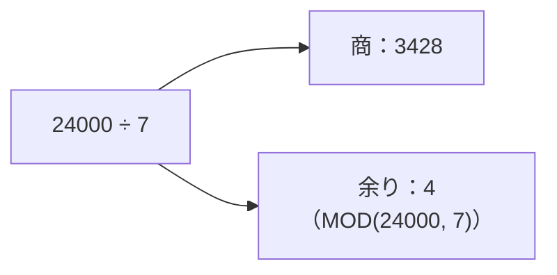
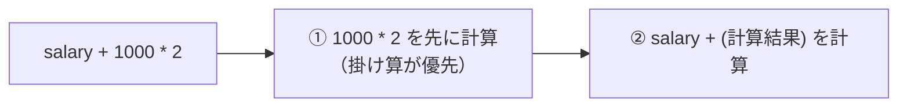
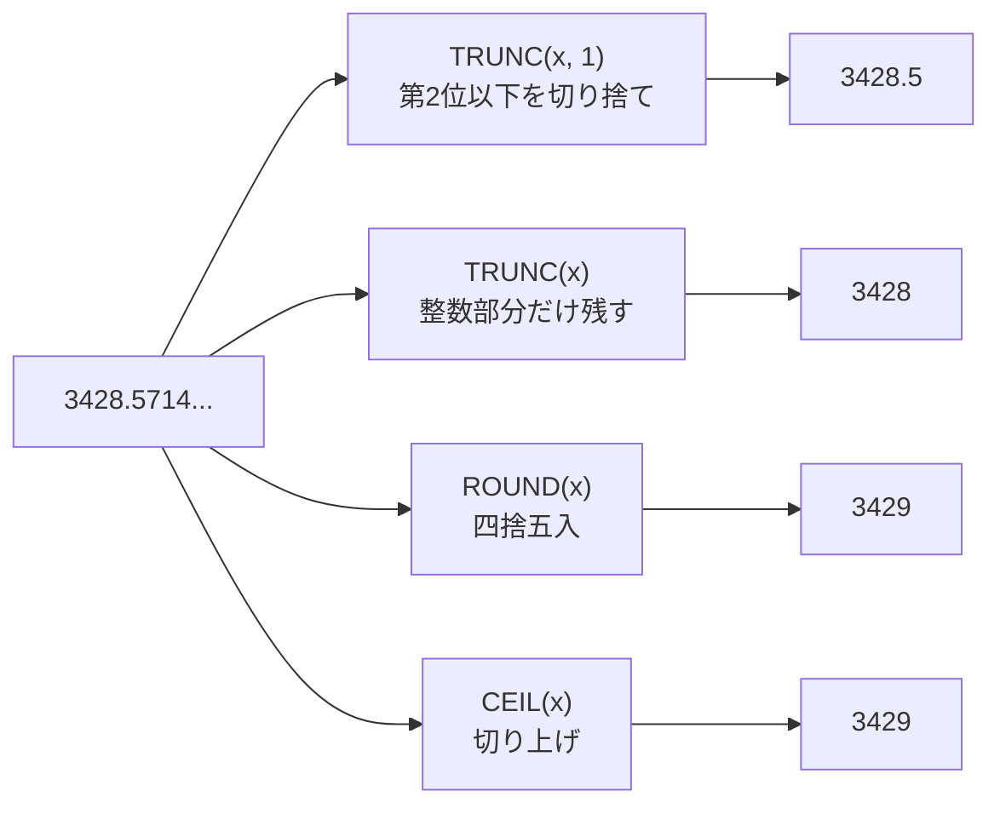
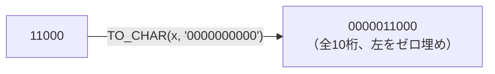
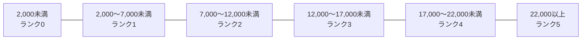
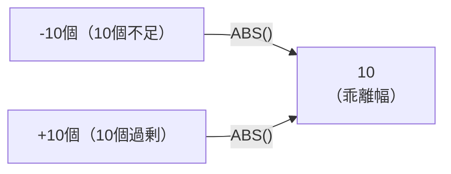
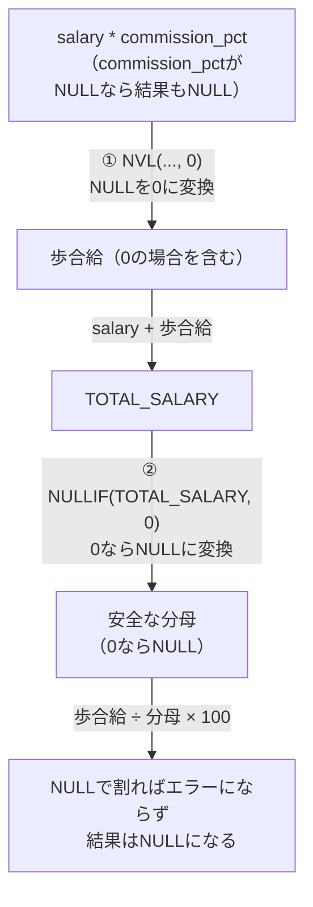
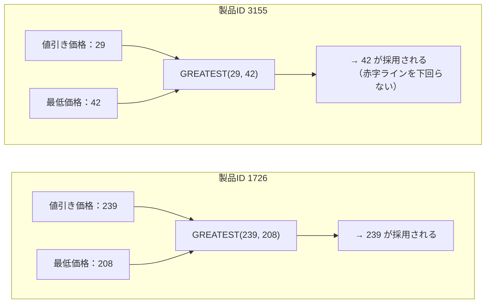
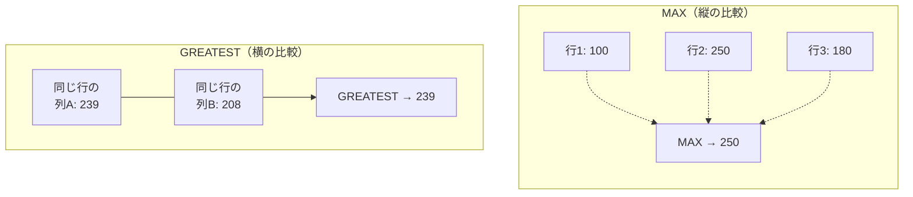

# 問題6-1：四則演算
### 難易度：★☆☆☆☆ (Lv.1)
## 問題
HRスキーマの`EMPLOYEES`テーブルより、`EMPLOYEE_ID`が100のデータに対して、給与（`SALARY`）を用いた以下の計算結果を算出してください。

**【算出内容】**
* `SALARY`に`1000`を加算した値（別名：`+`）
* `SALARY`から`1000`を減算した値（別名：`-`）
* `SALARY`に`2`を乗算した値（別名：`*`）
* `SALARY`を`3`で除算した値（別名：`/`）
* `SALARY`を`7`で除算した際の余り（別名：`余り`）

## 期待する結果
| EMPLOYEE_ID | SALARY | +     | -     | *     | /    | 余り |
| ----------- | ------ | ----- | ----- | ----- | ---- | ---- |
| 100         | 24000  | 25000 | 23000 | 48000 | 8000 | 4    |

## 解答例
```sql
SELECT
    employee_id,
    salary,
    salary + 1000     AS "+",
    salary - 1000     AS "-",
    salary * 2        AS "*",
    salary / 3        AS "/",
    MOD(salary, 7)    AS "余り"
FROM
    hr.employees
WHERE
    employee_id = 100
```

## 解説
ここからは数値データの加工、いわゆる「計算（算術演算）」のセクションです。SQLは単にデータを取ってくるだけでなく、電卓のようにその場で計算して結果を出すことができます。

Oracle SQLの四則演算（`+` `-` `*` `/`）は、算数やプログラミングとほぼ同じ書き方です。SELECT句の中に直接数式を書くことで、行ごとに計算結果を表示できます。

割り算の「余り」を出したい場合は、記号ではなく `MOD` 関数を使います。

```sql
MOD(被除数, 除数)
-- 例: MOD(salary, 7) は「給与を7で割った余り」を返す
```



実務では「偶数行だけ抽出したい（`MOD(ID, 2) = 0`）」といった判定によく使われます。

今回の解答例で少し面白いのが、別名の付け方です。
```sql
salary + 1000 AS "+"
```
通常、SQLの別名に`+`や`-`のような演算記号をそのまま使うことはできません（SQLが「計算の指示かな」と誤解してしまうためです）。ただ、ダブルクォーテーション（`" "`）で囲むことで、記号そのものを列名として表示させることができます。個人的には、レポートのヘッダーとして見やすくする以外の場面ではあまり使わない書き方ですが、知っておくと表現の幅が広がります。

数値計算で忘れてはいけないのが、NULLとの計算です。もし`SALARY`がNULL（未定義）だった場合、どんな計算をしても結果はすべてNULLになります。

| 計算式 | 結果 |
| :--- | :--- |
| `NULL + 1000` | NULL |
| `NULL - 1000` | NULL |
| `NULL * 2` | NULL |
| `NULL / 3` | NULL |

実際の開発では、`NVL`関数などを使って「NULLだったら0として扱う」という工夫を組み合わせるのが一般的です。私も一度、集計クエリで一部の行だけ合計が抜け落ちていて、原因を調べたらそのカラムにNULLが混ざっていたことがありました。数値計算をするときは、対象のカラムにNULLが入り得るかどうかを一度確認しておくと安心です。

複数の計算を組み合わせる場合は、算数と同じく「掛け算・割り算」が「足し算・引き算」より先に計算されます。



もし足し算を先にしたい場合は、カッコを使って明示的に順序を指定してください（`salary + 1000 * 2` と `(salary + 1000) * 2` は結果が変わります）。

## 参考リンク
https://www.shift-the-oracle.com/sql/functions/mod-remainder.html

----
<br><br>

# 問題6-2：端数処理
### 難易度：★☆☆☆☆ (Lv.1)
## 問題
HRスキーマの`EMPLOYEES`テーブルより、`EMPLOYEE_ID`が100のデータに対して、給与（`SALARY`）を「7」で除算した結果に対し、以下の端数処理を行ってください。

**【算出内容】**
* **/**：`SALARY`を`7`で除算した生の値
* **小数点切り捨て**：小数点第2位以下を切り捨て（小数点第1位までを表示）
* **切り捨て**：小数点以下を切り捨てて整数にする
* **四捨五入**：小数点以下を四捨五入して整数にする
* **切り上げ**：小数点以下を切り上げて整数にする

## 期待する結果
| EMPLOYEE_ID | SALARY | /                  | 小数点切り捨て | 切り捨て | 四捨五入 | 切り上げ |
| ----------- | ------ | ------------------ | -------------- | -------- | -------- | -------- |
| 100         | 24000  | 3428.5714285714300 | 3428.5         | 3428     | 3429     | 3429     |

## 解答例
```sql
SELECT
    employee_id,
    salary,
    salary / 7           AS "/",
    TRUNC(salary / 7, 1) AS "小数点切り捨て",
    TRUNC(salary / 7)    AS "切り捨て",
    ROUND(salary / 7)    AS "四捨五入",
    CEIL(salary / 7)     AS "切り上げ"
FROM
    hr.employees
WHERE
    employee_id = 100
```

## 解説
前問の四則演算に続き、今回は算出された数値を「どう見せるか」を制御する端数処理（丸め処理）の解説です。請求書の金額計算や統計レポートなど、実務では「小数点以下をどう扱うか」というルールが厳密に決まっていることが多いため、これらの関数の使い分けは押さえておきたいスキルです。

**元の値：`3428.5714285714300`（24000 ÷ 7）を各関数で処理するとどうなるか**



| 関数 | 意味 | 桁数指定 | 今回の結果 |
| :--- | :--- | :---: | :---: |
| `TRUNC(x, 1)` | 指定した桁数より右側を切り捨て | できる | 3428.5 |
| `TRUNC(x)` | 整数部分だけ残す（0桁扱い） | 省略可（0とみなす） | 3428 |
| `ROUND(x)` | 四捨五入 | できる | 3429 |
| `CEIL(x)` | その数値以上の最小の整数（切り上げ） | できない（常に整数） | 3429 |

`TRUNC`関数は、指定した桁数より右側を切り捨てます。
```sql
TRUNC( [数値], [桁数] )
```
`TRUNC(salary / 7, 1)` は小数点第1位までを残し、第2位以下を捨てます。`TRUNC(salary / 7)` のように第2引数を省略すると「0」とみなされ、整数部分のみが残ります。

`ROUND`関数は、指定した桁数で一般的な四捨五入を行います。今回は24000÷7≈3428.5714…なので、整数への四捨五入（桁数0）の結果は3429になります。

`CEIL`関数は「天井（Ceiling）」という意味の通り、その数値以上の最小の整数を返します。小数点以下が少しでもあれば、正の数の場合は次の整数に繰り上がります。`CEIL`には`TRUNC`や`ROUND`のような桁数指定はできず、常に整数へ切り上げる点に注意してください。

実務での使い分けとしては、消費税計算では`TRUNC`（切り捨て）が使われることが多いですが、業界や契約によって`ROUND`や`CEIL`が指定されることもあります。平均値の表示では見やすくするために`ROUND(n, 1)`（小数点第1位まで四捨五入）がよく使われます。ページ数の計算も分かりやすい例で、全105件のデータを10件ずつ表示する場合、必要なページ数は105÷10=10.5です。ここで`CEIL(10.5)`を使うと「11ページ必要」という正しい答えが出ます。

もう一つ知っておくと便利なのが、`TRUNC`や`ROUND`の第2引数にマイナスの値を指定すると、「10の位」や「100の位」での処理もできるという点です。

| 書き方 | 意味 | 結果 |
| :--- | :--- | :---: |
| `ROUND(3428, -2)` | 100の位で四捨五入 | 3400 |
| `TRUNC(3428, -3)` | 1000の位で切り捨て | 3000 |

「10円未満は切り捨て」といった商習慣を表現する際に便利です。

:::message
### Oracleの NUMBER型と浮動小数点誤差の話
「0.1 + 0.2 が 0.3 にならない」というのは、プログラミングの世界でよく語られる話です。これは、コンピュータが内部的に2進数で計算していて、10進数の0.1を2進数に変換すると循環小数になり、有限のメモリに保存する際に途中で切り捨てが発生するために起こります。

ただし、ここで一つ補足しておきたいことがあります。この現象は主に`BINARY_FLOAT`/`BINARY_DOUBLE`型（IEEE754の2進浮動小数点数）や、JavaScript・Pythonなど2進浮動小数点を採用する言語で発生するものです。**今回の演習で使っているOracleの標準的な`NUMBER`型は、10進数を正確に扱うように設計されているため、通常この種の誤差は発生しません。** `0.1 + 0.2 = 0.3` は`NUMBER`型であればそのまま`0.3`になります。

| 型 | 内部形式 | 0.1 + 0.2 の結果 |
| :--- | :--- | :---: |
| Oracle `NUMBER` | 10進数を正確に扱う | 0.3（誤差なし） |
| `BINARY_FLOAT`/`BINARY_DOUBLE` | 2進浮動小数点（IEEE754） | 0.30000000000000004 のような誤差が出うる |

とはいえ、`NUMBER`型を使っていても、金額のように厳密な精度が求められるカラムでは、桁数の指定を明示しておく方が安全です。
* `NUMBER(10, 2)`（全体10桁、うち小数2桁）のように桁数を明示する。
* 小数を扱わず、あらかじめ「最小単位（円なら1円、ドルなら1セント）」を整数として保存し、表示するときだけ割る、という方法もあります。

もし`BINARY_FLOAT`/`BINARY_DOUBLE`型を扱う場面に出会ったら、`=`での比較は避けて、`WHERE price BETWEEN 0.29999 AND 0.30001` のように範囲で判定するのが安全です。私自身、この違いを知らずに他言語からOracleに移ってきたとき、「Oracleは誤差が出ない」と最初は少し驚いた記憶があります。
:::

## 参考リンク
https://www.shift-the-oracle.com/sql/functions/trunc.html
https://www.shift-the-oracle.com/sql/functions/round.html
https://www.shift-the-oracle.com/sql/functions/mod-remainder.html

----
<br><br>

# 問題6-3：数値の書式設定（カンマ・通貨・ゼロ埋め）
### 難易度：★★☆☆☆ (Lv.2)
## 問題
HRスキーマの`EMPLOYEES`テーブルより、`DEPARTMENT_ID`が30の従業員を対象として、給与（`SALARY`）を以下のフォーマットで表示してください。なお、レコードの表示順序は問いません。

**【表示ルール】**
* **ID**: `EMPLOYEE_ID`を表示。
* **RAW_SALARY**: `SALARY`をそのまま表示。
* **FORMAT_1**: 3桁ごとにカンマを入れ、先頭に「$」を付与する（例：$12,000）。
* **FORMAT_2**: 3桁ごとにカンマを入れ、先頭に通貨記号「¥」を付与する。
 ※セッション設定に依存せず、SQL内で明示的に「¥」を指定すること。
* **FORMAT_3**: 全10桁とし、空いた左側の桁を「0」で埋めて表示する。

## 期待する結果
| ID  | RAW_SALARY | FORMAT_1 | FORMAT_2 | FORMAT_3   |
| --- | ---------- | -------- | -------- | ---------- |
| 114 | 11000      | $11,000  | ¥11,000  | 0000011000 |
| 115 | 3100       | $3,100   | ¥3,100   | 0000003100 |
| 116 | 2900       | $2,900   | ¥2,900   | 0000002900 |
| 117 | 2800       | $2,800   | ¥2,800   | 0000002800 |
| 118 | 2600       | $2,600   | ¥2,600   | 0000002600 |
| 119 | 2500       | $2,500   | ¥2,500   | 0000002500 |

## 解答例
```sql
SELECT
    employee_id AS id,
    salary      AS raw_salary,
    TO_CHAR(salary, 'FM$999,999')  AS format_1,
    TO_CHAR(salary, 'FML999,999', 'NLS_CURRENCY = ''¥''')  AS format_2,
    TO_CHAR(salary, '0000000000') AS format_3
FROM
    hr.employees
WHERE
    department_id = 30
```

## 解説
`TO_CHAR`関数で数値を書式化する際、書式モデルの記号一つ一つに厳格な意味があります。

| 記号 | 意味 | 有効な数字がない場合 |
| :---: | :--- | :--- |
| `9` | 数字の位置 | 空白を返す |
| `0` | 数字の位置（ゼロ埋め） | ゼロを返す |
| `$` | 常にドル記号を表示 | - |
| `L` | セッションの`NLS_CURRENCY`に基づくローカル通貨記号 | - |
| `,` | 3桁区切りのカンマ | - |
| `FM` | 先頭の余分な空白（符号用スペース）を除去 | - |

`9`は有効な数字があれば表示し、なければ空白を返します。`0`は有効な数字があれば表示し、なければゼロを返します。`FORMAT_3`のように「固定桁数でゼロ埋めしたい」場合は、`0`を並べるのが正解です。



通貨記号については、`$`は常にドル記号を表示し、`L`はセッションの`NLS_CURRENCY`パラメータに基づいた「ローカル通貨記号」を表示します。第3引数で通貨記号を明示的に指定しておくと、環境（OSやセッション設定）によって記号が化けるのを防げます。ここで一点注意が必要で、`NLS_CURRENCY`に渡す通貨記号はSQLの文字列リテラルとして扱われるため、内側をシングルクォーテーションでもう一段囲む必要があります。
```sql
TO_CHAR(salary, 'FML999,999', 'NLS_CURRENCY = ''¥''')
```
`'¥'`をさらに`''¥''`のように囲むのは少し見慣れない書き方ですが、SQL文字列の中で単一引用符自体を表現するには、引用符を2つ並べてエスケープする必要があるためです。ここを1重のクォートのまま書いてしまうと構文エラーになるので、私も最初にこの書き方を試したときは何度か書き直した記憶があります。

もう一つ実務で知っておくと差がつくのが`FM`（Fill Mode）修飾子です。`TO_CHAR`は正負の符号（−）を表示するためのスペースをあらかじめ1文字分確保する仕様になっており、これを付けないと結果の先頭に余分な空白が入ってしまいます。

| 書き方 | 結果（例：11000） |
| :--- | :--- |
| `TO_CHAR(salary, '$999,999')`（FMなし） | `　$11,000`（先頭に余分な空白） |
| `TO_CHAR(salary, 'FM$999,999')`（FMあり） | `$11,000`（余分な空白なし） |

フォーマットの先頭に`FM`を付けることで、この空白を除去して左詰めの表示にできます。Webアプリケーションの画面やレポートで扱う際は、この`FM`を付けておくと表示がタイトになり、余計な調整が不要になります。

## 参考リンク
https://www.shift-the-oracle.com/sql/functions/to_char.html

----
<br><br>

# 問題6-4：データのグループ分け（バケット処理）
### 難易度：★★☆☆☆ (Lv.2)
## 問題
HRスキーマの`EMPLOYEES`テーブルを使用して、部署IDが「90」または「100」の従業員を対象に、給与（`SALARY`）に基づいた「給与ランク」を割り振ってください。
ランク付けは、以下のルールに従って算出してください。

**【グループ化のルール】**
* 給与の範囲を **「2,000以上 〜 22,000未満」** とします。
* この範囲を **「4つの等間隔なグループ（バケット）」** に分割してください。
* 各従業員が属するグループ番号（1〜4）を `SALARY_RANK` として表示します。
* なお、指定した範囲の最大値（22,000）以上の給与を受け取っている場合は、自動的に

次のランクである `5` と表示されるようにしてください。

**【表示・ソート条件】**
* 氏名は `FIRST_NAME` と `LAST_NAME` を半角スペースで結合し、列名を `NAME` としてください。
* レコードの表示順序は、**「給与（`SALARY`）の降順」** としてください。

## 期待する結果
| NAME              | SALARY | SALARY_RANK |
| ----------------- | ------ | ----------- |
| Steven King       | 24000  | 5           |
| Neena Yang        | 17000  | 4           |
| Lex Garcia        | 17000  | 4           |
| Nancy Gruenberg   | 12008  | 3           |
| Daniel Faviet     | 9000   | 2           |
| John Chen         | 8200   | 2           |
| Jose Manuel Urman | 7800   | 2           |
| Ismael Sciarra    | 7700   | 2           |
| Luis Popp         | 6900   | 1           |

## 解答例
```sql
SELECT
    first_name || ' ' || last_name AS name,
    salary,
    WIDTH_BUCKET(salary, 2000, 22000, 4) AS salary_rank
FROM
    hr.employees
WHERE
    department_id IN (90, 100)
ORDER BY
    salary DESC
```

## 解説
大量の数値を分析する際、一つひとつの数字を見るのではなく「どの層に何人いるか」を把握したいことがあります。これを実現するのが`WIDTH_BUCKET`関数です。統計処理やレポート作成で、数値を一定の範囲でグループ分け（バケツ分け）したいときに重宝します。
```sql
WIDTH_BUCKET(対象カラム, 最小値, 最大値, 分割数)
```
この関数は、指定した範囲を等間隔に区切り、対象の数値がどの区間に入るかを計算します。範囲外の値についても自動的にバケツを割り振る性質があり、最小値より小さい場合は`0`、範囲内なら`1`〜`分割数`、最大値以上なら`分割数 + 1`が返されます。

今回の条件（2,000〜22,000を4等分）では、1つあたりのバケツの幅は5,000（(22,000 - 2,000) ÷ 4）になります。



| 給与の範囲 | SALARY_RANK |
| :--- | :---: |
| 2,000以上 〜 7,000未満 | 1 |
| 7,000以上 〜 12,000未満 | 2 |
| 12,000以上 〜 17,000未満 | 3 |
| 17,000以上 〜 22,000未満 | 4 |
| 22,000以上 | 5 |

問題文にある「22,000以上の場合は5と表示する」という条件は、この関数の標準仕様をそのまま使うだけで満たせます。

よく似た関数に`NTILE`がありますが、動作が全く異なります。

| 関数 | 区切り方 | 各グループの人数 |
| :--- | :--- | :--- |
| `WIDTH_BUCKET` | 値の範囲を等間隔に分ける | バラバラになる可能性あり |
| `NTILE` | 全体の行数を等分に分ける | 均等になるように値を割り振る |

今回のように「給与額という絶対的な基準でランク付けしたい」場合は`WIDTH_BUCKET`が適していますが、「上位10%の社員を抽出したい」というような相対的な区切りであれば`NTILE`の方が向いています。私も最初この2つを混同していて、意図した結果と違う集計になったことがあるので、「絶対値の範囲か、相対的な人数割りか」で選ぶ関数が変わる、という点は覚えておくと役に立つと思います。

----
<br><br>

# 問題6-5：符号判定と絶対値による在庫分析（SIGN / ABS）
### 難易度：★★★☆☆ (Lv.3)
## 問題
物流倉庫の在庫管理において、各製品の現在の在庫数（`PRODUCT_INVENTORY`）が、設定されている「適正在庫レベル（今回は一律10個と仮定）」に対して、どの程度乖離しているかを評価するスクリプトが必要です。
単に引き算を行うだけでなく、経営陣へのレポート用に「過剰（プラス）」「不足（マイナス）」「適正（ジャスト）」という状態のラベル分けと、その純粋な乖離の幅（絶対値）を同時に算出し、一目で状況を把握できる高度な数値加工を行います。
COスキーマの`INVENTORY`テーブルより、店舗ID（`STORE_ID`）が `20` のデータを対象に、適正基準値である **「10」** と現在の在庫数（`PRODUCT_INVENTORY`）を比較し、以下のルールで一覧を作成してください。

**【算出のルール】**
* **DIFF（差分）**: `PRODUCT_INVENTORY - 10` の計算結果を表示。
* **STATUS（在庫状態）**: 差分がプラスなら `'過剰'`、マイナスなら `'不足'`、ぴったり `0` なら `'適正'` という文字列を表示してください。
* **ABS_DIFF（乖離幅）**: 不足・過剰を問わず、適正値から「何個ズレているか」の**絶対値**を算出してください。

## 期待する結果
| PRODUCT_ID | PRODUCT_INVENTORY | DIFF | STATUS | ABS_DIFF |
| ---------- | ----------------- | ---- | ------ | -------- |
| 11         | 0                 | -10  | 不足   | 10       |
| 14         | 1                 | -9   | 不足   | 9        |
| 26         | 1                 | -9   | 不足   | 9        |
| 1          | 2                 | -8   | 不足   | 8        |
| 5          | 3                 | -7   | 不足   | 7        |
| 17         | 3                 | -7   | 不足   | 7        |
| 8          | 4                 | -6   | 不足   | 6        |
| 20         | 5                 | -5   | 不足   | 5        |
| 25         | 6                 | -4   | 不足   | 4        |
| 18         | 7                 | -3   | 不足   | 3        |
| 23         | 12                | 2    | 過剰   | 2        |
| 29         | 10                | 0    | 適正   | 0        |

## 解答例
```sql 
SELECT
    product_id,
    product_inventory,
    product_inventory - 10 AS diff,
    CASE SIGN(product_inventory - 10)
        WHEN 1 THEN '過剰'
        WHEN -1 THEN '不足'
        WHEN 0 THEN '適正'
        ELSE NULL END AS status,
    ABS(product_inventory - 10) AS abs_diff
FROM
    co.inventory
WHERE
    store_id = 20
ORDER BY
    abs_diff DESC, product_id
```

## 解説
今回の主役は`SIGN`関数（符号判定）と`ABS`関数（絶対値）です。実務のダッシュボードやレポート作成では、単に計算結果の数値を出すだけでなく、「異常値（大きくズレているデータ）」を目立たせたり、人間が読みやすいラベルに変換したりする処理が求められます。

`SIGN`関数は、与えられた数値の符号に応じて`1`（プラス）、`-1`（マイナス）、`0`（ゼロ）のいずれかだけを返す関数です。

| `product_inventory - 10` の値 | `SIGN(...)` の戻り値 | STATUS |
| :--- | :---: | :---: |
| プラス（例：+2） | 1 | 過剰 |
| マイナス（例：-10） | -1 | 不足 |
| ゼロ | 0 | 適正 |

```sql
CASE SIGN(product_inventory - 10)
    WHEN  1 THEN '過剰'
    WHEN -1 THEN '不足'
    WHEN  0 THEN '適正'
END
```
これを利用することで、`CASE`式を`WHEN 1`、`WHEN -1`というシンプルな値の一致判定（単純CASE式）で書けるようになります。

`ABS`関数は絶対値（Absolute value）を返す関数で、数値からプラス・マイナスの符号を取り除き、「0からどれだけ離れているか」という純粋な距離に変換します。



これにより、在庫が「10個足りない（-10）」場合も「10個余っている（+10）」場合も、同じ「10」という乖離幅として扱うことができます。

`SIGN`を使わなくても、次のように`CASE WHEN`（検索CASE式）で同じ結果を得ることは可能です。

```sql
-- SIGN関数を使わない場合
CASE 
    WHEN product_inventory - 10 > 0 THEN '過剰'
    WHEN product_inventory - 10 < 0 THEN '不足'
    ELSE '適正'
END
```

| 書き方 | 条件式を書く回数 | 修正時の手間 |
| :--- | :--- | :--- |
| `SIGN`関数を使う | 1回だけ（`SIGN(...)`の中） | 1箇所を直すだけで済む |
| `CASE WHEN`で毎回書く | 3回（各WHENごと） | 3箇所すべて直す必要があり事故りやすい |

これでも動作は同じですが、条件式（`product_inventory - 10`）を何度も書く必要があり、数式が複雑になったときに記述ミスを誘発しやすくなります。`SIGN`関数で条件式を一箇所にまとめておくと、後から数式を変更する際の修正箇所も1箇所で済み、事故が減ります。

今回のソート順は`ORDER BY abs_diff DESC`（乖離幅の大きい順）になっています。在庫管理で本当に問題視すべきなのは「適正値から大きく外れている商品」なので、このソート順にすることで重大な在庫不足や過剰在庫がレポートの上部に来て、担当者が優先順位を判断しやすくなります。

この`SIGN`と`ABS`のコンビは、予算実績管理（予算に対する実績の上振れ・下振れの判定とそのインパクト測定）、品質・温度管理（基準値からのズレの監視）、株価や為替の前日比判定など、「基準値とのブレ」を監視する業務全般で使われます。

----
<br><br>

# 問題6-6：比率の算出と0除算（ゼロディバイド）対策
### 難易度：★★★☆☆ (Lv.3)
## 問題
人事部門から、営業職のインセンティブ（歩合給）が総支給額に対してどの程度の割合を占めているかを調査したいという依頼がありました。
インセンティブが設定されていない（`NULL`）社員や、基本給・歩合給の合計が0になる（実務上想定される）イレギュラーなデータに対しても、SQLエラー（`ORA-01476: 除数がゼロです。`）を発生させずに、安全に比率を算出する堅牢なクエリを構築します。
HRスキーマの`EMPLOYEES`テーブルより、`JOB_ID`が「SA_MAN」の従業員、またはIDが`100`の従業員を対象として、以下の計算を行ってください。
* **TOTAL_SALARY（総支給額）**: 基本給(SALARY) + 歩合給(SALARY × COMMISSION_PCT) を計算してください。なお、歩合給が`NULL`の場合は`0`として扱ってください。
* **COMMISSION_RATIO（歩合比率）**: 総支給額に占める歩合給の割合（%）を小数点第1位まで（2位以下切り捨て）で算出してください。
* **0除算対策**: 実務でのデータ不備を想定し、万が一「総支給額」が`0`または`NULL`になった場合でもエラーにせず、結果を`NULL`（または空欄）として安全に処理できるようにしてください。

## 期待する結果
| EMPLOYEE_ID | LAST_NAME | SALARY | TOTAL_SALARY | COMMISSION_RATIO |
| ----------- | --------- | ------ | ------------- | ----------------- |
| 100         | King      | 24000  | 24000         | 0                 |
| 145         | Singh     | 14000  | 19600         | 28.5              |
| 146         | Partners  | 13500  | 17550         | 23                |
| 147         | Errazuriz | 12000  | 15600         | 23                |
| 148         | Cambrault | 11000  | 14300         | 23                |
| 149         | Zlotkey   | 10500  | 12600         | 16.6              |

## 解答例
```sql 
SELECT
    employee_id,
    last_name,
    salary,
    salary + NVL(salary * commission_pct, 0) AS total_salary,
    TRUNC(
        (NVL(salary * commission_pct, 0) / 
         NULLIF(salary + NVL(salary * commission_pct, 0), 0)) * 100, 
        1
    ) AS commission_ratio
FROM
    hr.employees
WHERE
    job_id = 'SA_MAN'
    OR employee_id = 100
ORDER BY
    employee_id
```

## 解説
今回のテーマは、実務のレポート作成や給与計算システムで避けて通れないバグ対策、0除算（ゼロディバイド）の回避です。システムを運用していると、「基本給のマスター設定漏れで合計が0になっていた」「一時的な休職者で支給額が0だった」といったイレギュラーなデータがどうしても発生します。そんなとき、クエリがエラー（`ORA-01476`）で落ちてシステムを止めてしまわないよう、SQLの側で安全に受け流すテクニックを見ていきます。

このクエリのポイントは、不備のあるデータ（NULLや0）を段階的に安全な形へ加工している点です。



総支給額は「基本給 + NVL(基本給×歩合率, 0)」、歩合比率は「NVL(基本給×歩合率, 0) ÷ NULLIF(総支給額, 0) × 100」という式で計算されています。この分母の部分に施された工夫が、今回のクエリの心臓部です。

SQLでは、数値を`0`で割ると即座にシステムエラーが発生します。これを防ぐために`NULLIF`関数を使います。`NULLIF(A, B)`は「AとBが等しい場合はNULLを返し、異なる場合はAをそのまま返す」という関数です。
```sql
NULLIF(salary + NVL(salary * commission_pct, 0), 0)
```

| 状況 | `NULLIF(合計, 0)` の結果 | 割り算の結果 |
| :--- | :--- | :--- |
| 合計が0でない（例：24000） | 24000（そのまま） | 通常通り計算される |
| 合計が0 | NULL（0からNULLに変換） | エラーにならず結果はNULL |

総支給額の計算結果がもし`0`だった場合、この`NULLIF`によって分母が丸ごとNULLに変換されます。SQLには「どんな数値もNULLで割り算をすると結果はNULLになる（エラーにはならない）」という特性があり、これを利用してエラーを発生させずに結果をNULLに落ち着かせています。

歩合給の比率（`commission_pct`）が設定されていない一般社員の場合、この列にはNULLが入っています。SQLでは、NULLが含まれる掛け算や足し算は結果がすべてNULLになってしまう（NULLの伝播）ため、`NVL(..., 0)`で明示的に0に変換しています。`NVL`なしだと`24000 + NULL = NULL`となって総支給額が消えてしまいますが、`NVL`ありなら`24000 + 0 = 24000`と正しく計算できます。

問題文に「小数点第1位まで（2位以下切り捨て）」とあるため、四捨五入の`ROUND`ではなく、指定した桁数未満をそのまま切り捨てる`TRUNC`関数を使い、第2引数に1を指定しています。

実務で比率（シェア、達成率、前年比など）を計算するクエリを書くときは、「分母にくる列や数式には無条件で`NULLIF(..., 0)`をセットする」というのを手癖にしておくと、思わぬエラーで処理が止まる事故を減らせると思います。

----
<br><br>

# 問題6-7：複数列の横並び比較（GREATEST / LEAST）
### 難易度：★★★☆☆ (Lv.3)
## 問題
マーケティング部門から、商品のプロモーション価格を決定するためのデータ抽出依頼が来ました。
商品ごとに、定価（`LIST_PRICE`）から一律で「20ドル引き」にした値引き価格を検討していますが、あまりに引きすぎると最低販売保証価格（`MIN_PRICE`）を割り込んでしまい、赤字になってしまいます。
「値引き価格」と「最低価格」を横並びで比較し、より高い方の金額を「実際の販売価格」として自動採用するスマートなクエリを実装します。
OEスキーマの`PRODUCT_INFORMATION`テーブルより、`CATEGORY_ID`が`11`の商品を対象として、以下のルールで価格シミュレーションを行ってください。

**【算出のルール】**
* **PROMO_PRICE（仮の値引き価格）**: カタログ価格（`LIST_PRICE`）から一律で `20` を差し引いた金額を計算してください。
* **FINAL_PRICE（最終決定価格）**: 「仮の値引き価格（`PROMO_PRICE`）」と、その商品の最低販売保証価格（`MIN_PRICE`）を比較し、**いずれか大きい方の金額**を最終価格として採用してください。

## 期待する結果
| PRODUCT_ID | LIST_PRICE | MIN_PRICE | PROMO_PRICE | FINAL_PRICE |
| ---------- | ---------- | --------- | ----------- | ----------- |
| 1726       | 259        | 208       | 239         | 239         |
| 2236       | 964        | 863       | 944         | 944         |
| 2243       | 350        | 302       | 330         | 330         |
| 2245       | 512        | 420       | 492         | 492         |
| 2252       | 889        | 717       | 869         | 869         |
| 2359       | 249        | 206       | 229         | 229         |
| 3054       | 600        | 519       | 580         | 580         |
| 3057       | 369        | 320       | 349         | 349         |
| 3060       | 299        | 250       | 279         | 279         |
| 3061       | 499        | 437       | 479         | 479         |
| 3064       | 1023       | 909       | 1003        | 1003        |
| 3065       | 999        | 875       | 979         | 979         |
| 3155       | 49         | 42        | 29          | 42          |
| 3234       | 39         | 34        | 19          | 34          |
| 3331       | 879        | 785       | 859         | 859         |
| 3350       | 740        | 630       | 720         | 720         |

## 解答例
```sql 
SELECT
    product_id,
    list_price,
    min_price,
    list_price - 20 AS promo_price,
    GREATEST(list_price - 20, min_price) AS final_price
FROM
    oe.product_information
WHERE
    category_id = 11
ORDER BY
    product_id
```

## 解説
今回は、知っているとコード量が減り条件分岐がすっきりする`GREATEST`関数の解説です。実務では「下限値を下回ったら下限値に固定する」「上限値を超えたら一律で丸める」といった価格やポイントの計算が頻繁に発生します。これを`CASE`式で愚直に書くと長くなりがちですが、この関数を使えば一撃で済みます。

このクエリの核心は、`FINAL_PRICE`を決定している`GREATEST`関数の動きです。
```sql
GREATEST(list_price - 20, min_price) AS final_price
```

**製品ID 1726（通常ケース）と 3155（下限割れケース）の比較**



期待する結果を見ると、この関数の効果がよくわかります。製品ID 1726のような通常の値引きでは、定価259ドルから20ドルを引いた値引き価格239が最低価格208より大きいため、そのまま最終価格239として採用されます。一方、製品ID 3155のようなケースでは、定価49ドルから20ドルを引くと値引き価格は29まで落ち込んでしまいますが、最低価格は42のため、`GREATEST(29, 42)`が実行されてより大きい42が自動採用されます。「もし値引き価格が最低価格を下回ったら〜」という条件分岐を`CASE`式で書くことなく、「赤字ラインを下回らせない」というビジネスルールを1行で実現しているわけです。

SQLには最大値を求める関数として`MAX`と`GREATEST`の2つがありますが、比較する方向が違います。

| 関数 | 比較する方向 | 典型的な使い方 |
| :--- | :--- | :--- |
| `MAX(列名)` | 縦方向（複数行） | `GROUP BY`等と組み合わせ、テーブル全体から最大値を探す |
| `GREATEST(値1, 値2, ...)` | 横方向（同じ行の複数列・数式） | 1行内にある異なる列や計算結果を比較する |



この2つを混同すると意図しない結果になるので、「縦の比較か、横の比較か」で区別すると覚えやすいと思います。

`GREATEST`（および最小値を選ぶ`LEAST`）を使う際に忘れてはいけないのが、「比較対象の中に1つでもNULLがあると、結果が強制的にNULLになる」という性質です。もし新商品などで`MIN_PRICE`が未入力（NULL）のデータが紛れ込んでいると、値引き価格がいくらであれ`FINAL_PRICE`が消えてしまいます。実務で使う場合は、次のように`NVL`で防御しておくのが安全です。
```sql
-- MIN_PRICEがNULLなら0として安全に比較する書き方
GREATEST(list_price - 20, NVL(min_price, 0))
```
私も一度、このNULL混入に気づかず本番データで検証していて、なぜか一部の商品だけ`FINAL_PRICE`が空欄になっているのを見て慌てて調べたことがあります。`GREATEST`/`LEAST`を使うときは、比較対象の列にNULLの可能性がないか一度確認しておくことをおすすめします。

この`GREATEST`と`LEAST`のコンビは、システムのロジックに「制限」をかけるときによく使われます。

| 制御したい内容 | 使う関数 | 書き方の例 |
| :--- | :--- | :--- |
| 上限（天井）の制御（例：ポイント付与は最大5,000まで） | `LEAST` | `LEAST(purchased_amount * 0.1, 5000)` |
| 下限（床）の制御（例：出荷日数は最低1日確保） | `GREATEST` | `GREATEST(ship_date - order_date, 1)` |