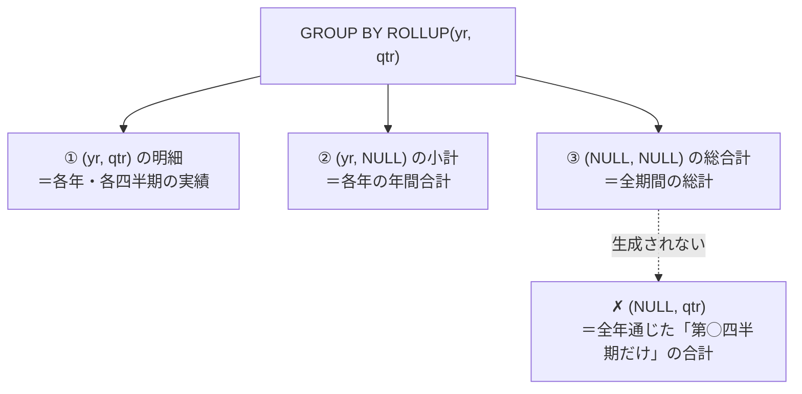
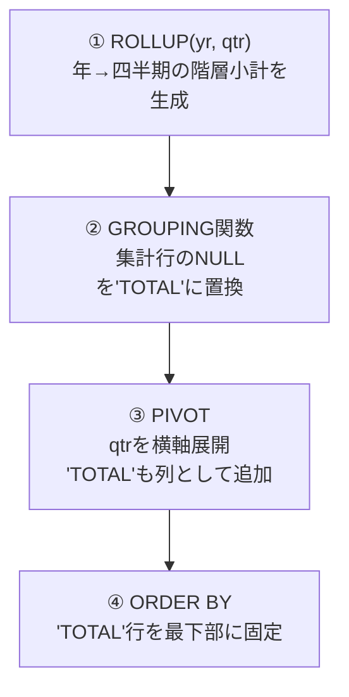
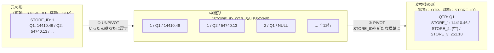
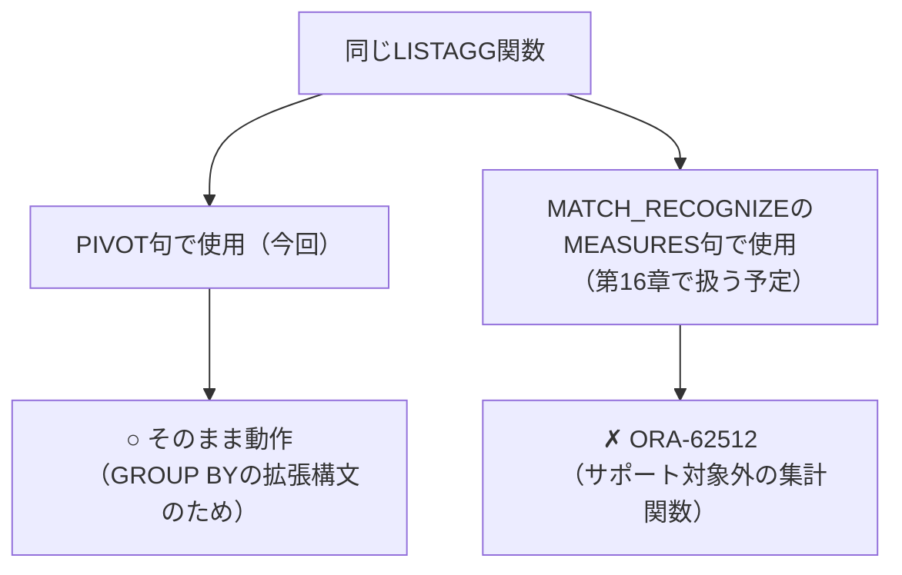
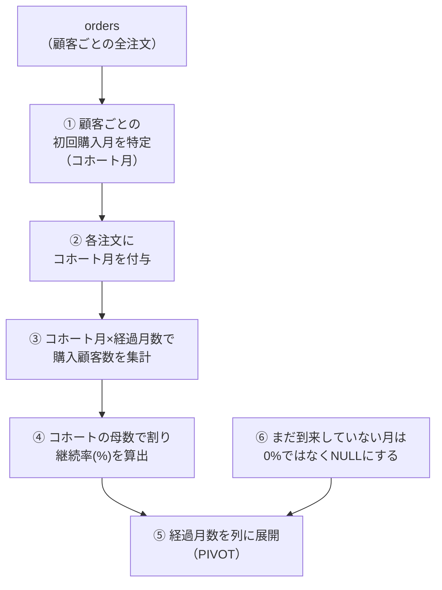

# 【完全版】問題13-12：PIVOT × ROLLUPで作る「年度別小計」レポート（13-9で触れたROLLUPを実践）
### 難易度：★★★★☆ (Lv.4)

## 問題
経営企画部門から、「四半期別の店舗売上レポート（問題13-7の応用形）を年単位でも見たいが、**各年の右端に年間小計（TOTAL列）を追加してほしい**。ついでに、表の一番下に**全期間を通じた総合計行**も置いてほしい」との依頼がありました。

COスキーマの`ORDERS`テーブルと`ORDER_ITEMS`テーブルを使用し、注文年（`YR`）を縦軸、四半期（Q1〜Q4）を横軸としたクロス集計レポートを作成してください。

**【条件およびルール】**
* **売上計算**：1注文あたりの金額は、`ORDER_ITEMS`テーブルの **`UNIT_PRICE` × `QUANTITY`** の合計とします。
* **階層構造の活用**：`ROLLUP`句を使用して、各年の四半期小計（`TOTAL`列）と、全期間の総合計行を算出してください。**`CUBE`は使用しないでください。**
* **NULLのラベル化**：集計によって生じる`NULL`部分は、`GROUPING`関数と`CASE`式を用いて`'TOTAL'`という文字列に置換してください。
* **横軸の展開**：`PIVOT`句を使用し、四半期（`'1'`〜`'4'`）および新しく作成した`'TOTAL'`を列として展開してください。
* **ソート順**：結果は`YR`の昇順で並べてください。ただし、総合計行（`YR`が`'TOTAL'`の行）は必ず最終行（最下部）に表示されるようにソート順を制御してください。

## 期待する結果
| YR    | Q1       | Q2       | Q3       | Q4       | TOTAL     |
| ----- | -------- | -------- | -------- | -------- | --------- |
| 2021  | 14661.64 | 57072.77 | 69599.93 | 81103.77 | 222438.11 |
| 2022  | 80674.44 | 5485.98  |          |          | 86160.42  |
| TOTAL |          |          |          |          | 308598.53 |

## 解答例
```sql
SELECT
    yr,
    q1,
    q2,
    q3,
    q4,
    total
FROM
    (
        SELECT
            -- GROUPING関数で集計行(NULL)を判定し、'TOTAL'に置換
            CASE WHEN GROUPING(yr) = 1 THEN 'TOTAL' ELSE TO_CHAR(yr) END AS yr,
            CASE WHEN GROUPING(qtr) = 1 THEN 'TOTAL' ELSE qtr END       AS qtr,
            SUM(item_amt) AS amt
        FROM
            (
                SELECT
                    EXTRACT(YEAR FROM o.order_tms)  AS yr,
                    TO_CHAR(o.order_tms, 'Q')       AS qtr,
                    oi.unit_price * oi.quantity      AS item_amt
                FROM
                    co.order_items oi
                    JOIN co.orders o ON oi.order_id = o.order_id
            )
        -- CUBEではなくROLLUPで「年→四半期」の階層小計のみを生成
        GROUP BY
            ROLLUP(yr, qtr)
    )
    PIVOT (
        SUM(amt)
        FOR qtr
        -- 横軸の展開項目に、新しく作った'TOTAL'ラベルを組み込む
        IN ( '1' AS q1, '2' AS q2, '3' AS q3, '4' AS q4, 'TOTAL' AS total )
    )
ORDER BY
    -- 'TOTAL'行が必ず最下部に来るように並び替えを制御
    CASE WHEN yr = 'TOTAL' THEN 1 ELSE 0 END,
    yr
```

## 解説
問題13-9では、`CUBE`を使って「学歴×世帯人数」という互いに独立した2つの軸を総当たりでクロス集計しました。その際の解説で、`ROLLUP`と`CUBE`の使い分けについても以下の比較表で簡単に触れていましたが、実際に`ROLLUP`を使った例までは示していませんでした。

| 関数 | 軸の関係性 | 向いている用途 |
| :--- | :--- | :--- |
| `ROLLUP(A, B)` | 明確な上下関係（親子関係）がある | 「会社→本部→課」の階層的な小計積み上げ |
| `CUBE(A, B)` | 互いに独立した2軸 | 「学歴」×「世帯人数」のような網羅的な掛け合わせ |

今回はその **`ROLLUP`を実際に使ってみる番** です。「年」と「四半期」は、学歴と世帯人数のような独立した軸ではなく、**「年の中に四半期が含まれる」という明確な親子関係（階層構造）** を持っています。この性質の違いが、`CUBE`と`ROLLUP`の結果に決定的な差を生みます。



`ROLLUP(yr, qtr)`が生成する集計の組み合わせは、`(yr, qtr)`・`(yr, NULL)`・`(NULL, NULL)`の**3パターンのみ**です。13-9の`CUBE(education, household_size)`が4パターン（明細・縦小計・横小計・総合計）をすべて生成していたのに対し、`ROLLUP`は指定した列の**左から右への順序**でしか小計を作りません。つまり「年をまたいで、第1四半期だけを合計する」という`(NULL, '1')`のような組み合わせは、そもそも生成されないのです。

この違いが、期待する結果の一番下の行にはっきりと表れています。

| 行 | Q1〜Q4列 | TOTAL列 |
| :--- | :--- | :--- |
| 2021年、2022年の行 | 各四半期の実績が入る | その年の年間合計が入る |
| **TOTAL行（総合計）** | **すべて空欄** | **全期間の総計（308598.53）のみ** |

もし13-9のように`CUBE(yr, qtr)`を使っていれば、`(NULL, '1')`という「全年通じたQ1だけの合計」も計算され、TOTAL行のQ1列にも数値が入っていたはずです。しかし今回は`ROLLUP`を使ったため、この組み合わせは存在せず、TOTAL行は右端のTOTAL列にしか値を持ちません。

:::message
これは`ROLLUP`の**バグや制限ではなく、意図された正しい動作**です。「年をまたいで第1四半期だけを合計する」という数値は、時系列データにおいてはビジネス的にあまり意味を持たない場合が多く（2021年Q1と2022年Q1を足し合わせても、何かの経営指標になることは稀です）、`ROLLUP`はそうした「意味の薄い組み合わせ」をあえて作らない、無駄のない集計方式だと言えます。
:::

このクエリは13-9と同じく4段階の構造で成り立っています。



`GROUPING`関数による`'TOTAL'`ラベルへの置換や、`PIVOT`の`IN`句に`'TOTAL' AS total`を追加して集計行を列として取り込むテクニック、`ORDER BY`でTOTAL行を最下部に固定する手法は、いずれも13-9で学んだものと全く同じ考え方です。**違うのは`GROUP BY`句が`CUBE`か`ROLLUP`かの1点だけ**であり、この1点の違いだけで生成される小計の粒度がまるごと変わってくることを、今回の問題で体感できたかと思います。

実務でこの2つを使い分ける基準はシンプルです。「年→四半期→月」のように、明確に**入れ子構造になっている軸**を集計するなら`ROLLUP`で十分ですし、むしろ不要な組み合わせを作らない分、`CUBE`よりも計算コストが低く済みます。一方で13-9のように、**互いに上下関係のない独立した軸**（学歴と世帯人数、商品カテゴリと店舗地域、など）をあらゆる角度からクロス集計したい場合にのみ、`CUBE`の網羅性が必要になります。「とりあえず`CUBE`を使っておけば安全」と考えがちですが、階層があるデータに`CUBE`を使うと、今回の`(NULL, '1')`のような**業務的に無意味な小計行まで大量に生成されてしまい**、レポートが読みにくくなったり、計算負荷が余分にかかったりするデメリットもあります。データの構造（独立軸か、階層軸か）を見極めたうえで関数を選ぶことが、この2つのテクニックを使いこなす鍵になります。

## 参考リンク
https://docs.oracle.com/en/database/oracle/oracle-database/19/dwhsg/sql-analysis-reporting.html

---
<br><br>

# 【完全版】問題13-13：UNPIVOT→PIVOTの二段構え（レポートの軸入れ替え）
### 難易度：★★★★☆ (Lv.4)

## 問題
経営企画部門から、「以前作成してもらった店舗別の四半期レポート（問題13-7に近い形式）はとても分かりやすかったが、**別の会議では『店舗を横に並べて、四半期ごとの比較をしたい』という逆向きの要望が出ている**。同じデータのまま、縦軸と横軸を入れ替えたバージョンも用意してほしい」との依頼がありました。

今回は状況を簡略化するため、以下のような**すでに店舗別・四半期別に集計済みの売上レポート**（3店舗分）を`WITH`句で用意します。これは「店舗（`STORE_ID`）が縦軸、四半期（`Q1`〜`Q4`）が横軸」という形になっています。

このレポートを、**「四半期（`QTR`）が縦軸、店舗（`STORE_1`〜`STORE_3`）が横軸」という軸を入れ替えた形**に変換してください。

**【条件およびルール】**
* **変換の方針**：一度`UNPIVOT`で縦持ち（ロング型）に戻したうえで、`PIVOT`を使って店舗IDを新たな横軸として展開し直してください（`UNPIVOT`と`PIVOT`を1つのクエリの中でチェーンさせる形になります）。
* **NULLの扱い**：元データに存在する`NULL`（売上実績なし）についても、軸の入れ替え後にその四半期・店舗の組み合わせが消えてしまわないよう配慮してください。
* **列名の指定**：横軸となる店舗の列名は`STORE_1`、`STORE_2`、`STORE_3`としてください。
* **表示順**：結果は`QTR`（'Q1'〜'Q4'）の昇順で並べてください。

**【使用データ（WITH句）】**
```sql
WITH quarterly_report AS (
    SELECT 1 AS store_id, 14410.46 AS q1, 54740.13 AS q2, 57874.40 AS q3, 52082.17 AS q4 FROM dual
    UNION ALL
    SELECT 2, NULL,       911.25,   1326.69,  1893.02  FROM dual
    UNION ALL
    SELECT 3, 251.18,     136.83,   2551.34,  779.71   FROM dual
)
```

## 期待する結果
| QTR | STORE_1  | STORE_2 | STORE_3 | 
| --- | -------- | ------- | ------- | 
| Q1  | 14410.46 |         | 251.18  | 
| Q2  | 54740.13 | 911.25  | 136.83  | 
| Q3  | 57874.4  | 1326.69 | 2551.34 | 
| Q4  | 52082.17 | 1893.02 | 779.71  | 

## 解答例
```sql
WITH quarterly_report AS (
    SELECT 1 AS store_id, 14410.46 AS q1, 54740.13 AS q2, 57874.40 AS q3, 52082.17 AS q4 FROM dual
    UNION ALL
    SELECT 2, NULL,       911.25,   1326.69,  1893.02  FROM dual
    UNION ALL
    SELECT 3, 251.18,     136.83,   2551.34,  779.71   FROM dual
)
SELECT
    qtr,
    store_1,
    store_2,
    store_3
FROM
    (
        -- ①まずUNPIVOTで縦持ち（ロング型）に戻す
        SELECT
            store_id,
            qtr,
            sales
        FROM
            quarterly_report
        UNPIVOT INCLUDE NULLS ( sales
            FOR qtr
            IN ( q1 AS 'Q1', q2 AS 'Q2', q3 AS 'Q3', q4 AS 'Q4' ) )
    )
    -- ②STORE_IDを新たな横軸としてPIVOTし直す
    PIVOT (
        SUM(sales)
        FOR store_id
        IN ( 1 AS store_1, 2 AS store_2, 3 AS store_3 )
    )
ORDER BY
    qtr
```

## 解説
これまでの13章では、`PIVOT`と`UNPIVOT`をそれぞれ独立したテクニックとして扱ってきました。今回はその2つを**1本のクエリの中でチェーン（連結）させる**、いわば13章の集大成となる問題です。



「軸を入れ替える」と聞くと難しそうに感じますが、やっていることは**中間状態としていったんロング型（縦持ち）を経由する**というシンプルな発想です。ワイド型からワイド型へ直接変換する方法はSQLには用意されていないため、「①`UNPIVOT`でいったん最小単位の行（`STORE_ID`・`QTR`・`SALES`）に分解する → ②分解された行から、今度は`STORE_ID`を軸にして`PIVOT`で組み立て直す」という2段階を踏む必要があります。13-1のUNPIVOTと13-2のPIVOTを、サブクエリで橋渡しするだけで実現できる点に、この2つの句の汎用性の高さが表れています。

このクエリの構造を、内側から順番に見てみましょう。
```sql
FROM (
    SELECT store_id, qtr, sales
    FROM quarterly_report
    UNPIVOT INCLUDE NULLS ( sales FOR qtr IN ( q1 AS 'Q1', ... ) )
)
PIVOT ( SUM(sales) FOR store_id IN ( 1 AS store_1, ... ) )
```
`FROM`句のサブクエリの中で`UNPIVOT`を使い、`Q1`〜`Q4`という4つの列を`QTR`・`SALES`という2列に押しつぶしています。この時点でデータは「3店舗×4四半期＝12行」のロング型になります。このロング型の結果に対して、外側から`PIVOT`をそのまま連結し、今度は`STORE_ID`（1, 2, 3）を`FOR`句に指定して横軸として展開しています。UNPIVOTの結果セットを、まるで普通のテーブルであるかのように次のPIVOTの入力として使える、という点がこのテクニックの肝です。

:::message
ここで問題13-10の`INCLUDE NULLS`が再登場している点に注目してください。今回の元データでは、店舗2の`Q1`が`NULL`です。もし`UNPIVOT`をデフォルト（`EXCLUDE NULLS`）のまま使うと、中間状態で「店舗2・Q1」の行自体が消えてしまいます。今回は最終的に`SUM`で`PIVOT`するため、その四半期のデータが「存在しない」場合も「存在するがNULL」の場合も、集計結果としてはどちらも空欄になり、**最終結果を見比べるだけでは違いが分かりません**。しかし、もし`PIVOT`側の集計関数を`SUM`ではなく`COUNT(*)`に変えていたとしたら、`EXCLUDE NULLS`では「該当データが0件」、`INCLUDE NULLS`では「NULLというデータが1件」という、明確に異なる集計結果になります。「実績が本当に無いのか、記録はあるが空欄なのか」を将来にわたって区別できるようにしておくため、中間状態を作る際は`INCLUDE NULLS`を付けておくのが安全な習慣です。
:::

| 観点 | 13-7（元のPIVOT） | 今回（UNPIVOT→PIVOT） |
| :--- | :--- | :--- |
| 縦軸 | 店舗ID | 四半期 |
| 横軸 | 四半期 | 店舗ID |
| 用途 | 店舗ごとの推移を追いたい時 | 同じ四半期での店舗間比較をしたい時 |

出来上がった表を見比べると、**同じ元データでも「何を縦に並べ、何を横に並べるか」で読み手が受け取る印象がまったく変わる**ことが分かります。13-7の形式（店舗が縦、四半期が横）は「この店舗は年間を通じてどう成長したか」を1行で追うのに向いていますが、今回の形式（四半期が縦、店舗が横）は「このQ3において、店舗間でどれだけ差が付いたか」を1行で見比べるのに向いています。

実務でこの技術が活きるのは、まさに今回のシナリオのように「同じ集計済みデータを、部署や会議体によって異なる切り口で見せたい」場面です。DWH（データウェアハウス）側に一度基準となる集計テーブルを持たせておけば、`UNPIVOT`→`PIVOT`の組み合わせで見せ方だけを自在に変えられるため、集計ロジック自体をその都度作り直す必要がなくなります。13章の総仕上げとして、`PIVOT`と`UNPIVOT`が「対になる、逆方向の操作」であることを実感できる一問になったのではないかと思います。

---
<br><br>

# 問題13-14：LISTAGGを使ったテキスト版クロス集計
### 難易度：★★★☆☆ (Lv.3)

## 問題
人事部門から、「部署ごとに、給与水準が高い社員（`HIGH`）と、そうでない社員（`LOW`）が、それぞれ誰なのか一覧で見たい」という依頼がありました。

HRスキーマの`EMPLOYEES`テーブルを使用し、`DEPARTMENT_ID`が`60`（IT）、`90`（Executive）、`100`（Finance）の社員を対象に、部署ごとの「給与水準別・社員名一覧」のクロス集計レポートを作成してください。

**【条件およびルール】**
* **給与水準の定義**：`SALARY`が8000以上を`'HIGH'`、8000未満を`'LOW'`としてください。
* **横軸の展開**：給与水準（`LOW`, `HIGH`）を列として展開してください。
* **セルの中身**：各セルには、該当する社員の**姓（`LAST_NAME`）をカンマ区切りで連結した文字列**を表示してください。
* **並び順**：各セル内の氏名は、姓のアルファベット順で連結してください。
* **表示順**：結果は`DEPARTMENT_ID`の昇順で並べてください。

## 期待する結果
| DEPARTMENT_ID | LOW                               | HIGH                    |
| ------------- | --------------------------------- | ----------------------- |
| 60            | Jackson, Miller, Nguyen, Williams | James                   |
| 90            |                                    | Garcia, King, Yang      |
| 100           | Popp, Sciarra, Urman              | Chen, Faviet, Gruenberg |

## 解答例
```sql
SELECT
    department_id,
    low,
    high
FROM
    (
        SELECT
            department_id,
            last_name,
            -- 給与を'LOW'/'HIGH'の2水準に分類
            CASE WHEN salary >= 8000 THEN 'HIGH' ELSE 'LOW' END AS salary_band
        FROM
            hr.employees
        WHERE
            department_id IN ( 60, 90, 100 )
    )
    PIVOT (
        -- 集計関数にLISTAGGを指定し、姓をアルファベット順に連結
        LISTAGG(last_name, ', ') WITHIN GROUP ( ORDER BY last_name )
        FOR salary_band
        IN ( 'LOW' AS low, 'HIGH' AS high )
    )
ORDER BY
    department_id
```

## 解説
これまでの13章で扱ってきた`PIVOT`の集計関数は、`SUM`・`COUNT`といった**数値を1つの値に集約する**ものばかりでした。しかし`PIVOT`句が受け付ける集計関数は、実は数値集計に限りません。今回は **文字列を連結する`LISTAGG`** を`PIVOT`に組み込み、「数値ではなく、名前そのものを横並びにする」というテキスト版のクロス集計に挑戦します。


クエリの骨格自体は、これまでの`PIVOT`と全く同じです。
```sql
PIVOT (
    LISTAGG(last_name, ', ') WITHIN GROUP ( ORDER BY last_name )
    FOR salary_band
    IN ( 'LOW' AS low, 'HIGH' AS high )
)
```
`PIVOT`の括弧の中に置く集計関数を、いつもの`SUM(...)`や`COUNT(*)`から`LISTAGG(...)`に差し替えているだけです。`LISTAGG`は複数行の文字列を1つに連結する関数のため、`WITHIN GROUP (ORDER BY last_name)`を必ずセットで書き、「連結する際の並び順」を明示的に指定しています。これを省略すると、実行のたびにセル内の並び順が保証されなくなり、レポートとしての再現性が失われてしまいます。

さて、この`LISTAGG`という関数について、少し先取りして触れておきたいことがあります。実は本書ではこの後、**第16章**で`MATCH_RECOGNIZE`という行パターンマッチングの構文を扱いますが、その中の`MEASURES`句という部分で、今回と似たような「複数行の値を1つの文字列にまとめたい」という場面に遭遇します。ところが`MEASURES`句では`LISTAGG`をそのまま指定すると`ORA-62512`というエラーが発生してしまい、素直には使えません（詳しくは第16章16-10〜16-15で扱います）。`MEASURES`句がサポートする集計関数は`COUNT`・`SUM`・`AVG`・`MIN`・`MAX`に限定されており、`LISTAGG`はその対象に含まれていないためです。

一方、今回の`PIVOT`では、同じ`LISTAGG`をごく普通に集計関数として指定するだけで、何の工夫もなく動作しています。同じ関数なのに、なぜこのような違いが生まれるのでしょうか。

| 句 | LISTAGGの扱い | 理由 |
| :--- | :--- | :--- |
| `PIVOT`（今回） | そのまま集計関数として使用可能 | `PIVOT`は内部的に通常の`GROUP BY`と同じ仕組みで動いており、`GROUP BY`はもともと`LISTAGG`を含む任意の集計関数を許容する |
| `MATCH_RECOGNIZE`の`MEASURES`（第16章で扱う予定） | `ORA-62512`で使用不可（`COUNT`/`SUM`/`AVG`/`MIN`/`MAX`のみサポート） | `MEASURES`はパターン内の行を`FIRST`/`LAST`/`PREV`/`NEXT`などで行き来しながら値を計算する特殊な仕組みで、対応する集計関数があらかじめ限定されている |



`PIVOT`は、構文としては特殊に見えますが、内部的には`GROUP BY`＋`CASE`式（13-2の解説で触れた`SUM(CASE WHEN ...)`の書き方）を自動生成しているに過ぎません。`GROUP BY`は元々、`SUM`や`COUNT`はもちろん、`LISTAGG`のようなユーザー定義集計関数に近いものまで幅広く受け入れる仕組みのため、`PIVOT`もその恩恵をそのまま引き継いでいます。一方、後の章で登場する`MATCH_RECOGNIZE`の`MEASURES`句は、単純な集計ではなく「パターンの中の特定の行（最初の行、直前の行など）を参照しながら計算する」という全く別の実行エンジンの上で動いているため、サポートされる関数があらかじめ絞り込まれています。「同じ関数名だから、どの句でも同じように使えるはず」とは限らない、という一例として、この先の章に読み進める際に思い出していただければと思います。

:::message
「同じ関数名だから同じように使えるはず」という思い込みは、SQLに限らずプログラミング全般でよく起きる落とし穴です。今回のように、**関数そのものではなく「その関数を呼び出している句（コンテキスト）」によって制約が変わる**ケースがあることを覚えておくと、この先の章で初見のエラー（`ORA-62512`など）に遭遇したときも「この句特有の制約かもしれない」と冷静に切り分けができるようになります。
:::

出来上がったレポートを見ると、単なる人数集計（13-4のような`COUNT`ベースのクロス集計）では分からなかった **「具体的に誰が該当するか」** が一目で分かります。人事部門が「IT部門で給与水準が低い社員に、来期の昇給を検討したい」といった具体的なアクションを取る際、名前まで一覧化されたこのレポートは、`COUNT`だけの数値レポートよりもずっと実務上の価値が高くなります。

なお、Executive部門（`90`）の`LOW`列が空欄になっている点にも注目してください。該当する社員が1人もいない場合、`LISTAGG`で連結する対象自体が存在しないため、結果はNULL（空欄）になります。これは13-4で確認した「該当データがない場合はNULLになる」という`PIVOT`の基本的な挙動と同じです。

## 参考リンク
https://docs.oracle.com/en/database/oracle/oracle-database/19/sqlrf/LISTAGG.html

---
<br><br>

# 【完全版】問題13-15：コホート分析による顧客継続率マトリクス
### 難易度：★★★★☆ (Lv.4)
## 問題
ECサイトの顧客継続率（リテンション）を把握するため、「コホート分析」を行います。顧客を **初回購入月（コホート月）** でグループ化し、その後何ヶ月目にどれだけの顧客が購入を継続しているかを、コホート月×経過月数のマトリクス（表）にまとめてください。

**【要件】**
* 各コホート月について、経過月数0〜2ヶ月目（`PERIOD0`〜`PERIOD2`）の継続率（％、小数点以下四捨五入）を列として展開すること
* `PERIOD0`は必ず100%になる（コホート月＝初回購入月のため、その月に購入した顧客の割合は定義上100%）
* まだ到来していない月（今回のデータでは2024年4月以降）に該当する経過月数については、`0%`ではなく **空欄（NULL）** として表示すること（「まだ観測できていない」ことと「継続しなかった（0%）」ことは区別すること）

```sql:検証用データ（WITH句）
WITH orders AS (
    SELECT 'C1' AS customer_id, DATE '2024-01-05' AS order_dt FROM dual UNION ALL
    SELECT 'C1',                 DATE '2024-02-10'             FROM dual UNION ALL
    SELECT 'C1',                 DATE '2024-03-12'             FROM dual UNION ALL
    SELECT 'C2',                 DATE '2024-01-08'             FROM dual UNION ALL
    SELECT 'C2',                 DATE '2024-03-20'             FROM dual UNION ALL
    SELECT 'C3',                 DATE '2024-01-15'             FROM dual UNION ALL
    SELECT 'C4',                 DATE '2024-01-20'             FROM dual UNION ALL
    SELECT 'C4',                 DATE '2024-02-02'             FROM dual UNION ALL
    SELECT 'C5',                 DATE '2024-02-05'             FROM dual UNION ALL
    SELECT 'C5',                 DATE '2024-03-15'             FROM dual UNION ALL
    SELECT 'C6',                 DATE '2024-02-08'             FROM dual UNION ALL
    SELECT 'C7',                 DATE '2024-02-12'             FROM dual UNION ALL
    SELECT 'C7',                 DATE '2024-03-01'             FROM dual UNION ALL
    SELECT 'C8',                 DATE '2024-03-03'             FROM dual UNION ALL
    SELECT 'C9',                 DATE '2024-03-18'             FROM dual
)
-- ここから先を作成してください
```

## 期待する結果
| COHORT_MONTH         | PERIOD0 | PERIOD1 | PERIOD2 | 
| -------------------- | ------- | ------- | ------- | 
| 2024-01-01T00:00:00Z | 100     | 50      | 50      | 
| 2024-02-01T00:00:00Z | 100     | 67      |         | 
| 2024-03-01T00:00:00Z | 100     |         |         | 

## 解答例
```sql:失敗例：未観測期間も一律で0%として計算
WITH orders AS (
    SELECT 'C1' AS customer_id, DATE '2024-01-05' AS order_dt FROM dual UNION ALL
    SELECT 'C1',                 DATE '2024-02-10'             FROM dual UNION ALL
    SELECT 'C1',                 DATE '2024-03-12'             FROM dual UNION ALL
    SELECT 'C2',                 DATE '2024-01-08'             FROM dual UNION ALL
    SELECT 'C2',                 DATE '2024-03-20'             FROM dual UNION ALL
    SELECT 'C3',                 DATE '2024-01-15'             FROM dual UNION ALL
    SELECT 'C4',                 DATE '2024-01-20'             FROM dual UNION ALL
    SELECT 'C4',                 DATE '2024-02-02'             FROM dual UNION ALL
    SELECT 'C5',                 DATE '2024-02-05'             FROM dual UNION ALL
    SELECT 'C5',                 DATE '2024-03-15'             FROM dual UNION ALL
    SELECT 'C6',                 DATE '2024-02-08'             FROM dual UNION ALL
    SELECT 'C7',                 DATE '2024-02-12'             FROM dual UNION ALL
    SELECT 'C7',                 DATE '2024-03-01'             FROM dual UNION ALL
    SELECT 'C8',                 DATE '2024-03-03'             FROM dual UNION ALL
    SELECT 'C9',                 DATE '2024-03-18'             FROM dual
),
first_orders AS (
    SELECT customer_id, TRUNC(MIN(order_dt), 'MM') AS cohort_month
    FROM orders
    GROUP BY customer_id
),
cohort_orders AS (
    SELECT fo.cohort_month, TRUNC(o.order_dt, 'MM') AS order_month, o.customer_id
    FROM orders o
    JOIN first_orders fo ON fo.customer_id = o.customer_id
),
retention AS (
    SELECT cohort_month, MONTHS_BETWEEN(order_month, cohort_month) AS period_no,
           COUNT(DISTINCT customer_id) AS active_customers
    FROM cohort_orders
    GROUP BY cohort_month, MONTHS_BETWEEN(order_month, cohort_month)
),
cohort_sizes AS (
    SELECT cohort_month, COUNT(DISTINCT customer_id) AS cohort_size
    FROM first_orders
    GROUP BY cohort_month
),
grid AS (
    SELECT cs.cohort_month, cs.cohort_size, p.period_no
    FROM cohort_sizes cs
    CROSS JOIN (SELECT 0 AS period_no FROM dual UNION ALL SELECT 1 FROM dual UNION ALL SELECT 2 FROM dual) p
),
matrix AS (
    SELECT
        g.cohort_month,
        g.period_no,
        ROUND(NVL(r.active_customers, 0) / g.cohort_size * 100) AS retention_pct
    FROM
        grid g
        LEFT JOIN retention r
            ON r.cohort_month = g.cohort_month AND r.period_no = g.period_no
)
SELECT *
FROM matrix
PIVOT ( MAX(retention_pct) FOR period_no IN (0 AS period0, 1 AS period1, 2 AS period2) )
ORDER BY cohort_month;
-- 2024-02コホートのPERIOD2、2024-03コホートのPERIOD1・PERIOD2が "0" になってしまう
-- しかし2024年4月以降のデータはそもそも存在しない（＝まだ観測できていない）だけであり、
-- 「継続しなかった（離脱した）」と確定したわけではない
```

```sql:正解例：観測可能な期間かどうかをCASEで判定
WITH orders AS (
    SELECT 'C1' AS customer_id, DATE '2024-01-05' AS order_dt FROM dual UNION ALL
    SELECT 'C1',                 DATE '2024-02-10'             FROM dual UNION ALL
    SELECT 'C1',                 DATE '2024-03-12'             FROM dual UNION ALL
    SELECT 'C2',                 DATE '2024-01-08'             FROM dual UNION ALL
    SELECT 'C2',                 DATE '2024-03-20'             FROM dual UNION ALL
    SELECT 'C3',                 DATE '2024-01-15'             FROM dual UNION ALL
    SELECT 'C4',                 DATE '2024-01-20'             FROM dual UNION ALL
    SELECT 'C4',                 DATE '2024-02-02'             FROM dual UNION ALL
    SELECT 'C5',                 DATE '2024-02-05'             FROM dual UNION ALL
    SELECT 'C5',                 DATE '2024-03-15'             FROM dual UNION ALL
    SELECT 'C6',                 DATE '2024-02-08'             FROM dual UNION ALL
    SELECT 'C7',                 DATE '2024-02-12'             FROM dual UNION ALL
    SELECT 'C7',                 DATE '2024-03-01'             FROM dual UNION ALL
    SELECT 'C8',                 DATE '2024-03-03'             FROM dual UNION ALL
    SELECT 'C9',                 DATE '2024-03-18'             FROM dual
),
first_orders AS ( -- ①顧客ごとの初回購入月（＝コホート月）
    SELECT customer_id, TRUNC(MIN(order_dt), 'MM') AS cohort_month
    FROM orders
    GROUP BY customer_id
),
cohort_orders AS ( -- ②全注文に、その顧客が属するコホート月を付与
    SELECT fo.cohort_month, TRUNC(o.order_dt, 'MM') AS order_month, o.customer_id
    FROM orders o
    JOIN first_orders fo ON fo.customer_id = o.customer_id
),
retention AS ( -- ③コホート月×経過月数ごとの購入顧客数
    SELECT cohort_month, MONTHS_BETWEEN(order_month, cohort_month) AS period_no,
           COUNT(DISTINCT customer_id) AS active_customers
    FROM cohort_orders
    GROUP BY cohort_month, MONTHS_BETWEEN(order_month, cohort_month)
),
cohort_sizes AS ( -- ④コホートごとの母数（初回購入者数）
    SELECT cohort_month, COUNT(DISTINCT customer_id) AS cohort_size
    FROM first_orders
    GROUP BY cohort_month
),
data_range AS ( -- ⑤データ上で観測できている最終月
    SELECT MAX(TRUNC(order_dt, 'MM')) AS max_order_month FROM orders
),
grid AS ( -- ⑥全コホート×経過月数(0,1,2)の組み合わせを網羅する下地を作る
    SELECT cs.cohort_month, cs.cohort_size, p.period_no
    FROM cohort_sizes cs
    CROSS JOIN (SELECT 0 AS period_no FROM dual UNION ALL SELECT 1 FROM dual UNION ALL SELECT 2 FROM dual) p
),
matrix AS ( -- ⑦観測可能な期間かどうかを判定しつつ継続率を算出
    SELECT
        g.cohort_month,
        g.period_no,
        CASE
            WHEN ADD_MONTHS(g.cohort_month, g.period_no) > dr.max_order_month THEN NULL
            ELSE ROUND(NVL(r.active_customers, 0) / g.cohort_size * 100)
        END AS retention_pct
    FROM
        grid g
        CROSS JOIN data_range dr
        LEFT JOIN retention r
            ON r.cohort_month = g.cohort_month AND r.period_no = g.period_no
)
SELECT *
FROM matrix
PIVOT ( MAX(retention_pct) FOR period_no IN (0 AS period0, 1 AS period1, 2 AS period2) )
ORDER BY
    cohort_month;
```

## 解説
この問題は、7章（日付の取り扱い）・12章（分析関数）・13章（PIVOT）で個別に学んだ技術を1つの実務課題にまとめ上げる総合演習です。コホート分析自体は、サブスクリプションサービスやECサイトで「新規顧客がどれだけ定着しているか」を可視化する際の定番の分析手法です。



処理の流れは、CTEのコメントに振った番号のとおりです。ポイントを1つずつ確認します。

**① コホート月の特定（12章：分析関数の応用）**
`MIN(order_dt)`を顧客ごとに求め、`TRUNC(..., 'MM')`で月初日に丸めることで「その顧客が最初に購入した月」を求めています。ここでは集約関数として使っていますが、`MIN() OVER (PARTITION BY customer_id)`という分析関数の書き方でも同じことができます（`GROUP BY`で集約するか、行を保持したまま分析関数で求めるかは、後続の処理のしやすさで選べます）。

**③ 経過月数の算出（7章：日付の取り扱い）**
`MONTHS_BETWEEN(order_month, cohort_month)`で、コホート月からその注文月までの経過月数を求めています。コホート月自身の注文であれば`0`、翌月であれば`1`、という具合です。

**⑤〜⑥ 未観測期間の扱い（本問題の核心）**
失敗例と正解例の違いはここに集約されます。`2024-02`コホートの`PERIOD2`（2024年4月に相当）や、`2024-03`コホートの`PERIOD1`（同じく4月）は、**今回のデータ（2024年1月〜3月分）にはそもそも4月の注文が1件も存在しない**ため、`retention`CTEに該当する行が生まれません。失敗例では、この「該当行なし」を`NVL(..., 0)`で単純に`0`件として扱ってしまうため、「4月の注文がまだ発生していないだけ」なのか「4月に誰も継続しなかった」のかが区別できなくなります。

正解例では、`data_range`CTEで「データ上、実際に観測できている最終月（今回は2024年3月）」を求めておき、`ADD_MONTHS(cohort_month, period_no)`（＝そのセルが表す暦月）がこの最終月より後であれば、無条件に`NULL`（空欄）を返すようにしています。これにより、「観測期間が足りないだけの空欄」と「観測した結果、本当に0%だった」という、意味の異なる2つの状態を正しく区別できます。

| 状態 | 原因 | 表示すべき値 |
| :--- | :--- | :--- |
| 観測期間内で、購入顧客が0人だった | 顧客が実際に離脱した | `0` |
| 該当する暦月のデータがまだ存在しない | 単に時間が経過していないだけ | `NULL`（空欄） |

:::message
### 全ての組み合わせを網羅する「グリッド」を先に作る発想
`grid`CTEでは、実際の注文データの有無にかかわらず、`cohort_sizes`（実在するコホート）と`period_no`（0〜2の経過月数）のあらゆる組み合わせを`CROSS JOIN`で機械的に作り出しています。これは、8章のGROUPING SETSや13章のPIVOTで繰り返し登場した考え方（「データがある組み合わせだけでなく、あるべき組み合わせを先に用意してから、実データを`LEFT JOIN`で当てはめる」）の応用です。この発想を持っておくと、「本来あるべきなのにデータが存在しない」ケースを`NULL`として明示的に扱いやすくなります。
:::

コホート分析は、CO（Customer Orders）スキーマの実データ（`co.orders`の`customer_id`・`order_tms`）でも同じロジックがそのまま適用できます。実データで試す場合は、`cohort_sizes`の母数が数百〜数千規模になりPIVOTの列数（経過月数）も増えるため、`period_no`の対象範囲（`grid`CTEのCROSS JOIN対象）を分析したい期間に応じて調整してください。

