# 問題12-1：全体の順位（RANK関数）
### 難易度：★★☆☆☆ (Lv.2)
## 問題
HRスキーマの`EMPLOYEES`テーブルより、職種（`JOB_ID`）が「**IT_PROG**」の従業員を対象として、**給与（`SALARY`）が高い順**にランク付けを行ってください。

**【条件およびルール】**
* 給与が同じ場合は同じ順位を割り当ててください。
* 同じ順位が複数存在した後は、その人数分だけ順位を飛ばしてください（例：3位が2人いたら次は5位）。
* 結果はランクの昇順で表示してください。

## 期待する結果
| FIRST_NAME | SALARY | RANK |
| ---------- | ------ | ---- |
| Alexander  | 9000    | 1     |
| Bruce      | 6000    | 2     |
| David      | 4800    | 3     |
| Valli      | 4800    | 3     |
| Diana      | 4200    | 5     |

## 解答例
```sql:例1：RANK関数を使用
SELECT
    e1.first_name,
    e1.salary,
    RANK() OVER(
        ORDER BY
            salary DESC
    ) AS rank
FROM
    hr.employees e1
WHERE
    e1.job_id = 'IT_PROG'
ORDER BY
    rank
```
```sql:例2：自己結合で解決
SELECT
    e1.first_name,
    e1.salary,
    COUNT(e2.salary) + 1 AS rank
FROM
    hr.employees e1
    LEFT JOIN hr.employees e2 
      ON e1.salary < e2.salary
     AND e2.job_id = 'IT_PROG'
WHERE
    e1.job_id = 'IT_PROG'
GROUP BY
    e1.employee_id,
    e1.first_name,
    e1.salary
ORDER BY
    rank
```

## 解説
ここから「分析関数（Window関数）」のセクションに入ります。「給与が高い順に並べる」だけでなく、そこに「1位、2位…」という順位の数字を直接持たせることができるようになると、上位N人の抽出や、グループ内の比較がぐっと楽になります。

分析関数の特徴は、「行をまとめずに（集約せずに）、集計結果を各行に添える」という点にあります。
```sql
RANK() OVER(ORDER BY salary DESC)
```
`RANK()`は順位を計算せよという命令、`OVER`はどの範囲に対して計算するかの指定、`ORDER BY salary DESC`は「給与の高い順」というルールで並べたときの番号を振る、という意味になります。

実務では「同着（同じ給与）」をどう扱うかによって、関数を使い分ける必要があります。

| 関数 | 同着があった場合の挙動 | 例（4800円が2人いる場合） |
| :--- | :--- | :--- |
| `RANK` | 次の順位を飛ばす | 1位→2位→3位→3位→**5位** |
| `DENSE_RANK` | 次の順位を飛ばさない | 1位→2位→3位→3位→**4位** |
| `ROW_NUMBER` | 同着でも一意な連番を振る | 1位→2位→3位→**4位**→**5位** |

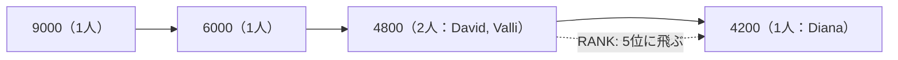

今回の期待する結果では、DavidさんとValliさんが共に「3位」で次のDianaさんが「5位」になっているので、`RANK`関数が正解です。

解答例2は、分析関数が使えなかった時代の考え方をもとにした自己結合です。「自分の順位」とは「自分より給与が高い人が何人いるか＋1」である、という定義に基づいています。左側（e1）が自分のデータ、右側（e2）が自分より高い給与（`e1.salary < e2.salary`）の人のリストで、右側にヒットした人数を`COUNT`し、そこに`+1`することで順位を算出しています。ただしこの方法は、データが1万件を超えると計算量が膨らみやすく、現代のシステムでは例1の分析関数を使う方が高速です。

解答例1の最後にある`ORDER BY rank`にも注目してください。SQLの実行順序では、`SELECT`句で計算された`rank`という別名は、最後の`ORDER BY`でしか使えません。もし「3位以上の人だけ出したい」と思って`WHERE rank <= 3`と書いても、`WHERE`句の時点ではまだ順位が計算されていないためエラーになります。その場合は、副問い合わせを組み合わせる必要があります（次の問題で扱います）。

----
<br><br>

# 問題12-2：グループごとのナンバーワン（Top-N分析）
### 難易度：★★☆☆☆ (Lv.2)
## 問題
HRスキーマの`EMPLOYEES`テーブルより、**各職種（`JOB_ID`）における最高給与者**を特定してください。

**【条件およびルール】**
* 職種（`JOB_ID`）ごとにグループ分けを行い、その中で給与（`SALARY`）が高い順にランク付けを行ってください。
* 各グループで**1位**になった従業員のみを表示してください。
* 給与が同額で1位が複数人いる場合は、その全員を表示してください。
* 結果は、給与（`SALARY`）の昇順、次に職種（`JOB_ID`）の昇順で並べてください。

## 期待する結果
| FIRST_NAME | JOB_ID      | SALARY |
| ---------- | ------------ | ------ |
| Alexander   | PU_CLERK      | 3100    |
| Renske      | ST_CLERK      | 3600    |
| Nandita     | SH_CLERK      | 4200    |
| Jennifer    | AD_ASST       | 4400    |
| Pat         | MK_REP        | 6000    |
| Susan       | HR_REP        | 6500    |
| Adam        | ST_MAN        | 8200    |
| William     | AC_ACCOUNT    | 8300    |
| Daniel      | FI_ACCOUNT    | 9000    |
| Alexander   | IT_PROG       | 9000    |
| Hermann     | PR_REP        | 10000   |
| Den         | PU_MAN        | 11000   |
| Lisa        | SA_REP        | 11500   |
| Shelley     | AC_MGR        | 12008   |
| Nancy       | FI_MGR        | 12008   |
| Michael     | MK_MAN        | 13000   |
| John        | SA_MAN        | 14000   |
| Neena       | AD_VP         | 17000   |
| Lex         | AD_VP         | 17000   |
| Steven      | AD_PRES       | 24000   |

## 解答例
```sql
SELECT
    first_name,
    job_id,
    salary
FROM
    (
        SELECT
            first_name,
            job_id,
            salary,
            RANK()
            OVER(PARTITION BY job_id
                 ORDER BY
                     salary DESC
            ) AS rank
        FROM
            hr.employees
    )
WHERE
    rank = 1
ORDER BY
    salary,
    job_id
```
## 解説
「全体の1位」を出すのは簡単ですが、「職種ごと」「部署ごと」といったグループの中での1位を特定するこのテクニックは、実務のレポート作成で需要が高いスキルの一つです。

今回の主役は`OVER`句の中に登場した`PARTITION BY`です。通常の`GROUP BY`は行を一つにまとめて（集計して）しまいますが、分析関数の`PARTITION BY`は「行をまとめるのではなく、一時的に小部屋（パーティション）に分ける」という動きをします。

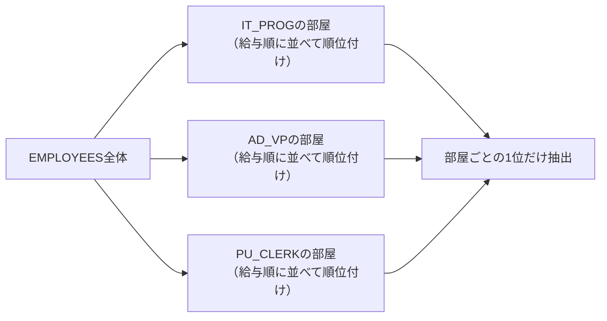

まず`job_id`ごとに従業員を別々の部屋に分け、各部屋の中で`salary`の高い順に並べ、部屋ごとに「1位、2位…」と番号を振る、という流れです。これにより、IT部門の1位と営業部門の1位を同時に、かつ独立して計算できます。

解答例が`FROM ( SELECT ... )`という二段構えになっているのには理由があります。SQLの処理順序では、`WHERE`句のフィルタリングが終わった後に分析関数が計算されます。そのため`WHERE rank = 1`と書こうとしても、その時点ではまだ`rank`という列（順位）が存在しないためエラーになります。一度内側のクエリで順位を確定させ、それを一つの「テーブル」として外側から参照することで、初めて順位による絞り込みが可能になります。

期待する結果の`AD_VP`職種を見てください。NeenaさんとLexさんが二人とも17,000円で「1位」として表示されています。今回のように「1位が二人いたら、二人とも出す」という要件には`RANK()`が向いています。もし「誰でもいいから各職種から一人だけ抽出したい」という場合は、同額でも強制的に1位と2位に分ける`ROW_NUMBER()`を使うことになります。

結果を見ると、高給取りの`AD_PRES`（社長）から事務職の`PU_CLERK`まで、それぞれの職種における「頂点」がずらりと並んでいます。異なるカテゴリのデータを横並びで比較できるのが分析関数の強みです。

----
<br><br>

# 問題12-3：合計・平均（分析関数の応用）
### 難易度：★★☆☆☆ (Lv.2)
## 問題
SHスキーマの`PRODUCTS`テーブルを使用して、商品ID（`PROD_ID`）が「**23**」の商品について、その価格（`PROD_LIST_PRICE`）を多角的に比較するための参考値を算出してください。

**【算出する項目】**
* **CAT_MAX**：その商品と同じカテゴリ（`PROD_CATEGORY_ID`）内での最高価格。
* **ALL_AVG**：全商品の平均価格（小数点第3位を四捨五入して第2位まで表示）。
* **CAT_AVG**：その商品と同じカテゴリ内での平均価格（同上）。
* **CAT_RANK**：その商品と同じカテゴリ内での価格が高い順のランキング。

## 期待する結果
| PROD_ID | PROD_NAME            | PROD_LIST_PRICE | CAT_MAX | ALL_AVG | CAT_AVG | CAT_RANK |
| ------- | ---------------------- | ----------------- | -------- | -------- | -------- | --------- |
| 23      | Plastic Cricket Bat      | 21.99               | 199.99    | 139.55    | 31.41     | 12         |

## 解答例
```sql:例1：一般的な書き方
WITH analyzed_view AS (
    SELECT
        prod_id,
        prod_name,
        prod_list_price,
        MAX(prod_list_price)
        OVER(PARTITION BY prod_category_id) AS "CAT_MAX",
        ROUND(AVG(prod_list_price) OVER(), 2) AS "ALL_AVG",
        ROUND(AVG(prod_list_price)
              OVER(PARTITION BY prod_category_id), 2) AS "CAT_AVG",
        RANK() OVER(PARTITION BY prod_category_id
                        ORDER BY prod_list_price DESC) AS "CAT_RANK"
    FROM
        sh.products
)
SELECT
    *
FROM
    analyzed_view
WHERE
    prod_id = 23
```
```sql:例2：WINDOW句を使用（Oracle 23ai以降）
WITH analyzed_view AS (
    SELECT
        prod_id,
        prod_name,
        prod_list_price,
        MAX(prod_list_price)
        OVER w AS "CAT_MAX",
        ROUND(AVG(prod_list_price) OVER(), 2) AS "ALL_AVG",
        ROUND(AVG(prod_list_price)
              OVER w, 2) AS "CAT_AVG",
        RANK() OVER(PARTITION BY prod_category_id
                        ORDER BY prod_list_price DESC) AS "CAT_RANK"
    FROM
        sh.products
    WINDOW w AS (PARTITION BY prod_category_id)
)
SELECT
    *
FROM
    analyzed_view
WHERE
    prod_id = 23
```
## 解説
今回は「個別のデータと、グループ統計値を横並びにして比較する」というテクニックです。通常、`GROUP BY`を使うと行が一つにまとまってしまいますが、分析関数を使うことで「自分のデータ」を維持したまま、「カテゴリ内の最大値」や「全体の平均値」といった物差しを横に並べることができます。

今回の解答例では、`OVER`句の中身を変えることで異なる範囲の統計値を一度に取得しています。

| 記述 | 計算範囲 |
| :--- | :--- |
| `MAX(...) OVER(PARTITION BY prod_category_id)` | 同じカテゴリ内だけ |
| `AVG(...) OVER()` | テーブル全体（すべての行） |
| `AVG(...) OVER(PARTITION BY prod_category_id)` | 同じカテゴリ内だけ |

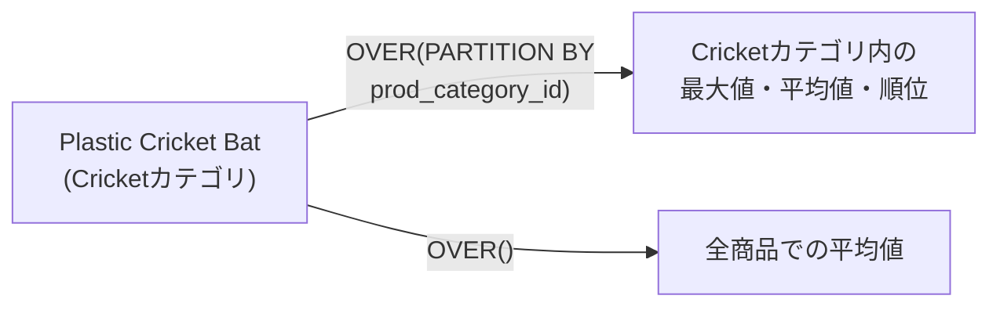

「商品カテゴリという小部屋」に分けてから計算することで、同じカテゴリ内での最大値や平均値が、そのカテゴリに属する全商品の横に表示されます。一方、`OVER`の中身を空にすると、「テーブル全体のすべての行」を一つの範囲として計算します。どの商品を見ても「全商品の平均」という同じ値が横に並ぶことになります。

例2で使われている`WINDOW`句は、Oracle Database 23ai以降で導入された比較的新しい機能で、SQLの可読性を高めてくれます。
```sql
WINDOW w AS (PARTITION BY prod_category_id)
```
「カテゴリごとに分ける」という定義に`w`という名前を付け、それを`OVER w`として何度も使い回しています。同じ`PARTITION BY`を何度も書く手間が省けるだけでなく、一箇所直せば全ての計算範囲が変わるため、メンテナンスが楽になります。まだ23aiに対応していない環境では例1の書き方を使うことになりますが、環境が整っているなら例2の方がコードの見通しは良くなります。

もし分析関数を使わずに同じ結果を出そうとすると、`GROUP BY`でカテゴリごとの最大値を出すクエリと、`AVG`で全体の平均を出すクエリを別々に作り、それらを元のテーブルに`JOIN`でくっつける必要が出てきます。分析関数なら、一度テーブルを読み込むだけでこれらの計算を完了できるため、クエリもすっきりします。

結果を見ると、ID 23番の「Plastic Cricket Bat」について、価格は21.99、カテゴリ平均（31.41）よりも安く、カテゴリ内では12位、全商品平均（139.55）に比べるとかなり安価な商品であることが、一つの行から多角的に読み取れます。前問（12-2）同様、ここでも「分析関数を計算した後にWHEREで絞り込む」ためにサブクエリ（CTE）を使っている点も押さえておいてください。

----
<br><br>

# 【完全版】問題12-4：ランニング集計（在庫引き当てロジック）
### 難易度：★★★★☆ (Lv.4)
## 問題
商品の注文が「Boy's Shirt (White)」および「Boy's Socks (Grey)」それぞれについて **30個** ずつ入りました。
COスキーマの`INVENTORY`テーブルを参照し、以下のルールに従って、どの店舗から何個ずつピックアップ（引き当て）すればよいかを算出してください。

**【引き当てルール】**
* **優先順位**：`STORE_ID` の昇順に店舗を回ります。
* **引き当て方法**：
* その店舗の在庫（`PRODUCT_INVENTORY`）を使い、注文数（30個）に達するまで順次合算していきます。
* すでに前の店舗までの累計で注文が満たされている場合は、その店舗からはピックアップしません。
* 最後の店舗で注文数に達した場合、その店舗からは「残りの必要分」だけをピックアップします。
* **対象商品**：`PRODUCT_ID` が 1 および 6。

## 期待する結果
| PRODUCT_ID | PRODUCT_NAME          | STORE_ID | STORE_NAME     | PICK_NUM |
| ---------- | ----------------------- | -------- | ---------------- | -------- |
| 1          | Boy's Shirt (White)       | 1         | Online             | 3         |
| 1          | Boy's Shirt (White)       | 2         | San Francisco      | 9         |
| 1          | Boy's Shirt (White)       | 3         | Seattle            | 1         |
| 1          | Boy's Shirt (White)       | 4         | New York City       | 3         |
| 1          | Boy's Shirt (White)       | 5         | Chicago             | 4         |
| 1          | Boy's Shirt (White)       | 6         | London              | 10        |
| 6          | Boy's Socks (Grey)         | 1         | Online              | 9         |
| 6          | Boy's Socks (Grey)         | 4         | New York City       | 3         |
| 6          | Boy's Socks (Grey)         | 5         | Chicago             | 1         |
| 6          | Boy's Socks (Grey)         | 7         | Bucharest           | 6         |
| 6          | Boy's Socks (Grey)         | 8         | Berlin              | 2         |
| 6          | Boy's Socks (Grey)         | 9         | Utrecht             | 9         |

## 解答例
```sql
WITH sum_product_inventory AS (
    SELECT
        product_id,
        store_id,
        product_inventory,
        NVL(SUM(product_inventory)
            OVER(PARTITION BY product_id
                 ORDER BY store_id
                 ROWS BETWEEN UNBOUNDED PRECEDING 
                          AND 1 PRECEDING), 0) AS acc_inv
    FROM
        co.inventory
    WHERE
        product_id IN ( 1, 6 )
    ORDER BY
        product_id,
        store_id
)
SELECT
    p.product_id,
    p.product_name,
    s.store_id,
    s.store_name,
    least(spi.product_inventory, 30 - spi.acc_inv) AS pick_num
FROM
    sum_product_inventory spi
    INNER JOIN co.products p 
      ON spi.product_id = p.product_id
    INNER JOIN co.stores   s 
      ON spi.store_id = s.store_id
WHERE
    spi.acc_inv < 30
```

## 解説
今回は「在庫引き当て」「銀行口座の残高推移」「FIFO（先入先出）の計算」などで使われる、ランニング集計（累計計算）です。単なる合計ではなく、「今までの累計を見て、今回の取り分を決める」という手続き的な思考をSQL一行で実現しています。

このクエリの心臓部は、`SUM`関数の中にある`ROWS BETWEEN`という記述です。
```sql
SUM(product_inventory) OVER(
    PARTITION BY product_id
    ORDER BY store_id
    ROWS BETWEEN UNBOUNDED PRECEDING AND 1 PRECEDING
) AS acc_inv
```
普通に`SUM`を取ると「自分を含めた累計」になりますが、あえて`1 PRECEDING`（一行前）までに絞ることで、「現在の店舗にたどり着くまでに、他で何個確保できているか」を算出しています。

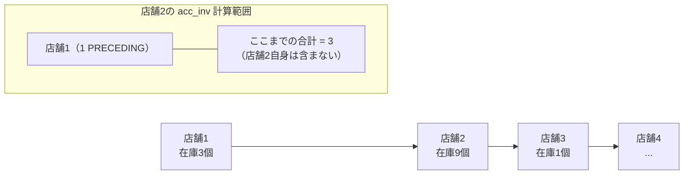

`UNBOUNDED PRECEDING`は一番最初の行から、`1 PRECEDING`は一つ前の行まで、という意味です。これにより、最初の店舗では`acc_inv`（既確保分）がNULLになるため`NVL(..., 0)`で0個として扱い、2店舗目以降から徐々に数字が積み上がっていきます。

メインクエリにある`least(product_inventory, 30 - acc_inv)`が、在庫引き当てのロジックを処理しています。

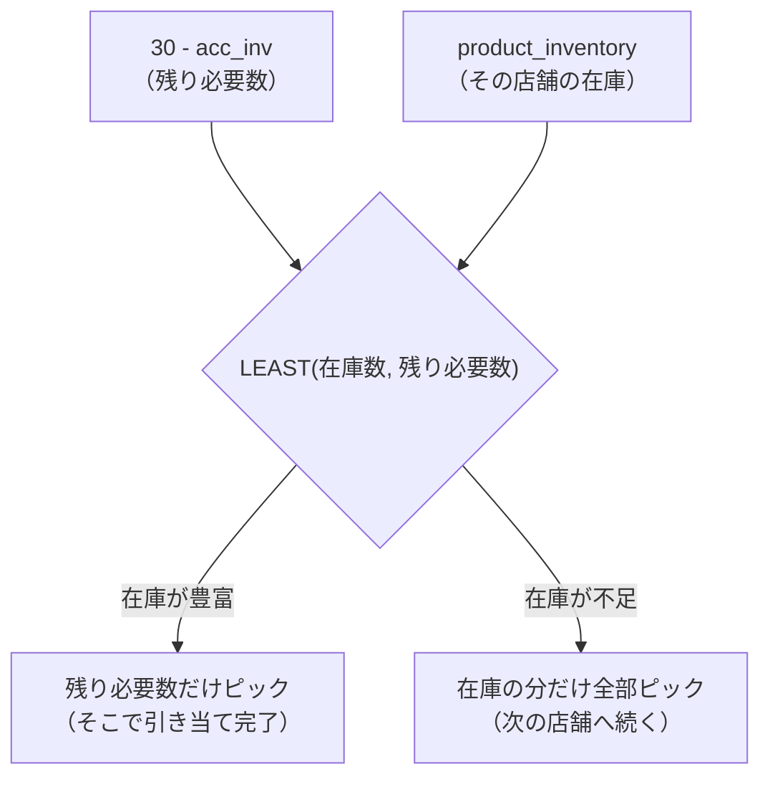

注文数30個に対し、残り必要数は`30 - acc_inv`で計算できます。在庫がたっぷりある場合は「残り必要数」の方が小さくなるため`LEAST`により「必要分だけ」をピックアップし、在庫が足りない場合は「その店舗の在庫数」の方が小さくなるため「ある分だけ全部」をピックアップします。このシンプルな関数一つで、「足りなければ次へ、余ればそこで止める」という分岐をこなしています。

最後の`WHERE spi.acc_inv < 30`という条件にも意味があります。累計が30に達した瞬間、次の店舗からは`acc_inv`が30（以上）になります。この`WHERE`句によって、「もう注文を満たした後の、余計な店舗」を結果から切り捨てています。

商品1番を例にシミュレーションしてみましょう。

| 店舗 | 既確保（acc_inv） | 在庫 | ピック数 | 累計 |
| :---: | :---: | :---: | :---: | :---: |
| 店舗1 | 0 | 3 | 3 | 3 |
| 店舗2 | 3 | 9 | 9 | 12 |
| ... | ... | ... | ... | ... |
| 店舗6 | 20 | 十分 | 10（残り必要分のみ） | 30（完了） |

店舗1は既確保0個、在庫3個あるので3個ゲット（累計3）。店舗2は既確保3個、在庫9個あるので9個ゲット（累計12）……という具合に進み、店舗6では既確保20個で残り10個必要なところ、在庫はたっぷりあるものの`LEAST`により10個だけピックして完了します。

----
<br><br>

# 【完全版】問題12-5：ランク関数と別解の比較（Top-N分析）
### 難易度：★★★☆☆ (Lv.3)
## 問題
HRスキーマの`EMPLOYEES`テーブルと`DEPARTMENTS`テーブルを使用して、**部署（`DEPARTMENT_NAME`）ごとに最も給与（`SALARY`）が高い従業員**を抽出してください。

**【条件およびルール】**
* 部署ごとにグループ化し、その中で給与が1位の人物を表示します。
* 1位が複数人いる場合（同額タイ）は、その全員を表示してください。
* 解答例1（RANK関数）と解答例2（LATERAL結合）の両方の考え方を理解しましょう。
* 結果の表示順は問いません。

## 期待する結果
| DEPARTMENT_NAME    | EMPLOYEE_ID | FIRST_NAME | LAST_NAME  | SALARY |
| -------------------- | ------------ | ----------- | ----------- | ------ |
| Administration         | 200           | Jennifer     | Whalen        | 4400    |
| Marketing               | 201           | Michael      | Hartstein     | 13000   |
| Purchasing              | 114           | Den          | Raphaely      | 11000   |
| Human Resources         | 203           | Susan        | Mavris        | 6500    |
| Shipping                | 121           | Adam         | Fripp         | 8200    |
| IT                      | 103           | Alexander    | Hunold        | 9000    |
| Public Relations        | 204           | Hermann      | Baer          | 10000   |
| Sales                   | 145           | John         | Russell       | 14000   |
| Executive               | 100           | Steven       | King          | 24000   |
| Finance                 | 108           | Nancy        | Greenberg     | 12008   |
| Accounting              | 205           | Shelley      | Higgins       | 12008   |

## 解答例
```sql:例1：RANK関数を使用
WITH re AS (
    SELECT
        employee_id,
        first_name,
        last_name,
        salary,
        department_id,
        RANK() OVER(
             PARTITION BY department_id
             ORDER BY salary DESC
        ) AS rank
    FROM
        hr.employees
)
SELECT
    dp.department_name,
    re.employee_id,
    re.first_name,
    re.last_name,
    re.salary
FROM re
    INNER JOIN hr.departments dp 
      ON re.department_id = dp.department_id
WHERE
    re.rank = 1
```
```sql:例2：LATERAL結合を使用して相関副問い合わせする
SELECT
    dp.department_name,
    re.employee_id,
    re.first_name,
    re.last_name,
    re.salary
FROM  hr.departments dp
    CROSS JOIN LATERAL (
        SELECT
            employee_id,
            first_name,
            last_name,
            salary,
            department_id
        FROM  hr.employees em
        WHERE
            em.department_id = dp.department_id
        ORDER BY salary DESC
        FETCH FIRST ROW WITH TIES
    ) re
```

## 解説
今回は、これまでの「Top-N分析」をさらに一歩進めた、「分析関数」と「LATERAL結合」という2つのアプローチの比較です。「各カテゴリの最大値を持つ行をまるごと持ってくる」という処理は実務で頻出しますが、書き方によって可読性やパフォーマンスが変わってきます。

| 方式 | 考え方 | 向いている場面 |
| :--- | :--- | :--- |
| 例1：分析関数（RANK） | 全従業員に順位をスタンプしてから部署名を結合、1位だけ絞り込む | 従業員全員をまんべんなく見る場合 |
| 例2：LATERAL結合 | 部署を1件ずつ読み込み、その部署の1位だけをその場で取得 | 部署数は少ないが各部署の人数が膨大な場合 |

例1の分析関数（RANK）は、前問（12-2）でも登場した最も一般的で汎用性の高い書き方です。内側のCTE（`re`）で全従業員に自分の部署内での順位をスタンプ（`RANK()`）し、外側で部署テーブルと結合してスタンプが「1位」の人だけをフィルタリングします。先に従業員テーブルだけで順位を確定させてから部署名をくっつけることで、無駄な結合処理を減らすことができます。「絞り込んでから繋げる」というのは、大規模データを扱う際に意識しておきたい考え方です。

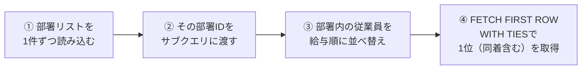

例2のLATERAL結合は、Oracle 12cから導入された比較的新しい構文で、プログラミングの「For Eachループ」に近い感覚で書けます。まず「部署リスト」を1行ずつ読み込み、読み込んだ部署IDを引数として渡してその部署の従業員を給与順に並べ替え、`FETCH FIRST ROW WITH TIES`でその部署の1位の人（同着含む）を取ってきます。これまで`RANK() OVER...`と書いてから外側で`WHERE rank = 1`と書かなければならなかった処理を、1行で、しかも同着（TIES）を含めて記述できるのがこの構文の強みです。

使い分けとしては、従業員全員をまんべんなく見る場合は分析関数（例1）が構造として分かりやすく、部署数は少ないが各部署の人数が膨大な場合や、部署IDにインデックスがある環境ではLATERAL結合（例2）の方が速く動くことがあります。

結果を見ると、Finance部門のNancyさん（12,008）やSales部門のJohnさん（14,000）など、各部門の最高給与者が抽出されています。例1の`RANK()`と例2の`WITH TIES`はどちらも「同着1位」を漏らさず出力するため、もし給与が全く同じ1位が2人いれば、その部署は2行表示されます。

:::message
### LATERAL結合とは
通常の結合（JOIN）は、2つの大きな表を一気にくっつけるイメージですが、LATERAL結合は「左側のテーブルの1行ごとに、右側のサブクエリを実行する」という動きをします。部署テーブルから「営業部」を取り出し、その情報を右側のサブクエリに渡し、サブクエリが「営業部の中で給料が高い人」を1人探し出す。次に部署テーブルから「総務部」を取り出す……という具合に繰り返す、というイメージです。

なぜLATERALが必要なのでしょうか。実は、通常のサブクエリ（副問い合わせ）では、外側のテーブルの列を自由に使えないというルールがありました。
```sql
-- これはエラーになる（通常のサブクエリの限界）
SELECT dp.department_name, re.first_name
FROM hr.departments dp
INNER JOIN (
    SELECT * FROM hr.employees em 
    WHERE em.department_id = dp.department_id -- ここで「dpって誰？」となる
) re ON 1=1;
```

| 結合方法 | サブクエリ内で外側の列を参照できるか |
| :--- | :---: |
| 通常のサブクエリ（`JOIN (SELECT ...)`） | ❌ できない |
| `LATERAL`付きサブクエリ | ⭕ できる |

通常のJOINでは、カッコの中（サブクエリ）は外の世界（`dp`）を知ることができません。ここで`LATERAL`というキーワードを添えると、「外側の`dp`の値を中に入れてもいいよ」という許可が出ます。

今回の例2をもう一度見てみましょう。
```sql
SELECT
    dp.department_name,
    re.first_name,
    re.salary
FROM hr.departments dp  -- ① まず「部署」を1つ選ぶ
CROSS JOIN LATERAL (    -- ② その部署の情報を「中」に持ち込む
    SELECT first_name, salary
    FROM hr.employees em
    WHERE em.department_id = dp.department_id -- ③ 外の dp.department_id を参照
    ORDER BY salary DESC
    FETCH FIRST ROW WITH TIES -- ④ その部署内でのトップを特定
) re
```
「部署ごとにトップ1」という処理がカッコの中に完結して書けるので、ロジックがすっきりします。`WITH TIES`を使えば、給料が同額の1位が複数いても、自動的に全員分を「1位のセット」として返してくれます。

LATERAL結合を使うメリットはいくつかあります。「各グループのトップN件」が書きやすく、「各部署のトップ3を出したい」といった場合もサブクエリに`FETCH FIRST 3 ROWS`と書くだけで済みます。また、税込額のような計算結果をLATERAL内で先に計算し、外側のSELECTでそのまま使い回すこともできます。さらに「部署数は少ないが全従業員数は膨大」という場合、全社員をランク付け（RANK関数）するよりも、部署ごとにピンポイントでトップを探しに行くLATERALの方が速いことがあります。
:::

----
<br><br>

# 問題12-6：構成比の算出（RATIO_TO_REPORT）
### 難易度：★★★☆☆ (Lv.3)
## 問題
SHスキーマの`SUPPLEMENTARY_DEMOGRAPHICS`テーブルを利用して、顧客の属性に基づいた独自のセグメントを作成し、それぞれのセグメントが全体の中でどの程度の割合を占めているかを調査してください。

**【顧客セグメント（CUSTOMER_SEGMENT）の定義】**
1. **Established Large Family**：居住年数（`YRS_RESIDENCE`）が 10年より長く、かつ世帯人数（`HOUSEHOLD_SIZE`）が「4-8人」または「9人以上」。
2. **Long-term Resident**：上記以外で、居住年数が 10年より長い。
3. **Newcomer**：居住年数が 2年以下。
4. **Other**：上記いずれにも当てはまらない。

**【集計ルール】**
* セグメント別のレコード数（`TOTAL_COUNT`）を出す。
* 全体に対する割合（`PERCENTAGE`）を算出し、「XX.XX%」の形式で表示する。
* 結果は、レコード数が多い順に並べる。

## 期待する結果
| CUSTOMER_SEGMENT           | TOTAL_COUNT | PERCENTAGE |
| ---------------------------- | ------------ | ----------- |
| Other                          | 3534           | 78.53%       |
| Newcomer                        | 949             | 21.09%       |
| Long-term Resident                | 14              | 0.31%        |
| Established Large Family            | 3               | 0.07%        |

## 解答例
```sql
SELECT
    CASE
        WHEN yrs_residence > 10
             AND household_size IN ( '4-8', '9+' ) THEN
            'ESTABLISHED LARGE FAMILY'
        WHEN yrs_residence > 10 THEN
            'LONG-TERM RESIDENT'
        WHEN yrs_residence <= 2 THEN
            'NEWCOMER'
        ELSE
            'OTHER'
    END      AS customer_segment, -- ここで名前を付ける
    COUNT(*) AS total_count,
    ROUND(RATIO_TO_REPORT(COUNT(*))
          OVER() * 100,
          2)
    || '%'   AS percentage
FROM
    sh.supplementary_demographics
GROUP BY
    customer_segment  -- ★23aiの場合、エイリアスがそのまま使える！
ORDER BY
    total_count DESC;
```

## 解説
今回は「構成比（シェア）」の計算です。マーケティング分析の現場では、単に「数」を出すだけでなく、「それは全体の中で何％を占めるのか」を提示するスキルが求められます。

今回の主役は、Oracle独自の関数`RATIO_TO_REPORT`です。通常、「全体に対する割合」は「セグメントの件数 ÷ テーブル全体の総件数 × 100」という計算式で求めますが、これを普通のSQLで書こうとすると、「セグメントごとのカウント」と「全体のカウント」を出すためにサブクエリを組み合わせる必要があり、少し面倒です。
```sql
RATIO_TO_REPORT(COUNT(*)) OVER()
```
`COUNT(*)`が各セグメントの集計結果、`OVER()`が範囲を「全体」に指定する部分です。これにより「自分のセグメントの数」を「分母（全体の数）」で割った値が0〜1の範囲で自動的に算出されます。これに100を掛ければパーセンテージの完成です。

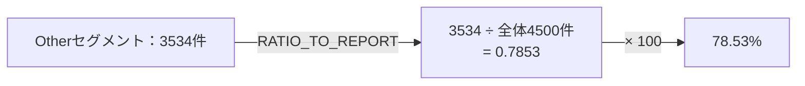

セグメント定義の`CASE`文において、条件を書く順番は重要です。

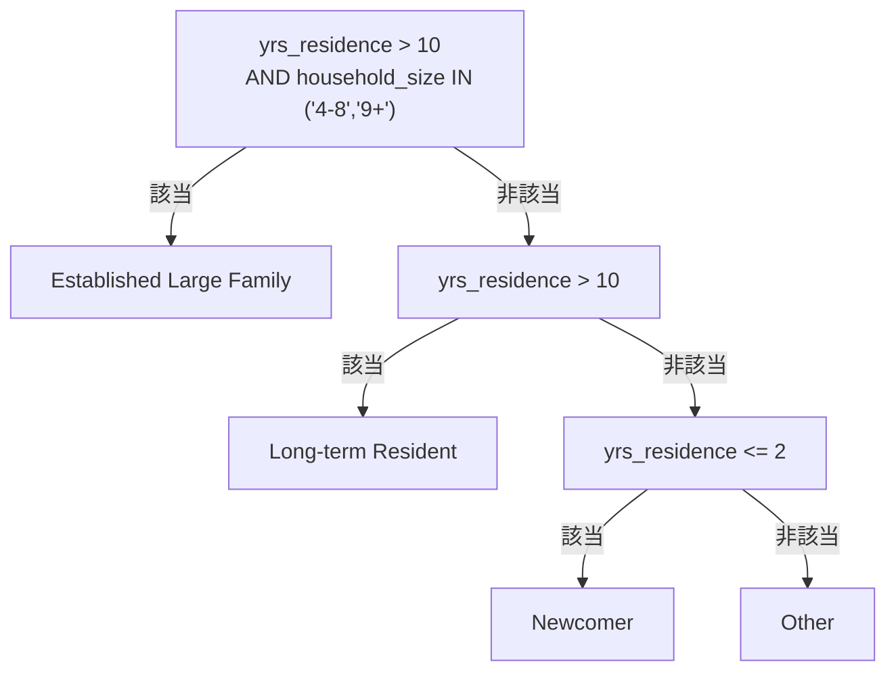

`Established Large Family`（条件2つ）と`Long-term Resident`（条件1つ）は「居住年数 > 10」という条件が重複しています。`CASE`文は「上から評価して、最初に一致したところで抜ける」という性質があるため、より条件が厳しい（細かい）方を先に書く必要があります。もし順番を逆にすると、大家族の人も全員ただの`Long-term Resident`に分類されてしまいます。また、居住年数が3〜10年の顧客はどの条件にも当てはまらないため、自動的に「Other」に分類されます。今回「Other」が78.53%と大半を占めているのは、この中間層がまとめて「Other」に入っているためです。

解答例の`GROUP BY customer_segment`にも注目してください。従来のSQL（19c以前）では、`SELECT`句で付けた名前（エイリアス）を`GROUP BY`で使うことはできず、長い`CASE`文をもう一度書く必要がありました。Oracle 23aiでは、`SELECT`で定義した名前をそのまま`GROUP BY`や`HAVING`で使えるようになり、コードの重複が減っています。実務で古いバージョンを使っている場合は、インラインビュー（サブクエリ）で囲ってからグループ化するのが一般的です。

結果を見ると、`Other`が約78.5%と圧倒的多数を占め、`Established Large Family`はわずか0.07%しかいません。「大家族かつ定住層」は非常に希少なセグメントであることが分かります。もし不動産会社のマーケターであれば、このわずかな0.07%に向けて「広々としたリノベーション物件」のDMを送るよりも、21%を占める`Newcomer`に向けて「地域密着のライフスタイル提案」をする方が効率的かもしれません。

## 参考リンク
https://docs.oracle.com/cd/E16338_01/server.112/b56299/functions142.htm
https://atmarkit.itmedia.co.jp/ait/articles/0510/29/news012_2.html

----
<br><br>

# 問題12-7：項目ごとのシェア（PARTITION BY の活用）
### 難易度：★★★☆☆ (Lv.3)
## 問題
SHスキーマの`SUPPLEMENTARY_DEMOGRAPHICS`テーブルを利用して、特定の学歴（`EDUCATION`）グループの中で、それぞれの職業（`OCCUPATION`）が占める構成比を算出してください。

**【抽出・集計ルール】**
* **対象データ**：学歴（`EDUCATION`）が **'PhD'** または **'1st-4th'** の顧客。
* **CUST_COUNT**：学歴×職業ごとの顧客数。
* **OCC_SHARE_IN_EDU**：その学歴グループ内（100%）における各職業の割合を算出し、「XX.XX%」の形式で表示する。
* **表示順**：学歴（`EDUCATION`）の昇順、次に顧客数（`CUST_COUNT`）の降順。

## 期待する結果
| EDUCATION | OCCUPATION  | CUST_COUNT | OCC_SHARE_IN_EDU |
| ---------- | ------------ | ----------- | ------------------ |
| 1st-4th     | Other          | 8            | 47.06%               |
| 1st-4th     | Crafts         | 2            | 11.76%               |
| 1st-4th     | Exec.          | 2            | 11.76%               |
| 1st-4th     | Farming        | 2            | 11.76%               |
| 1st-4th     | Transp.        | 2            | 11.76%               |
| 1st-4th     | Prof.          | 1            | 5.88%                |
| PhD         | Prof.          | 37           | 75.51%               |
| PhD         | Exec.          | 5            | 10.2%                |
| PhD         | ?              | 2            | 4.08%                |
| PhD         | Crafts         | 2            | 4.08%                |
| PhD         | TechSup        | 1            | 2.04%                |
| PhD         | Sales          | 1            | 2.04%                |
| PhD         | Cleric.        | 1            | 2.04%                |

## 解答例
```sql
SELECT
    d.education,
    d.occupation,
    COUNT(*) AS cust_count,
    ROUND(ratio_to_report(COUNT(*))
          OVER(PARTITION BY d.education) * 100, 2)
        || '%'   AS occ_share_in_edu
FROM
    sh.supplementary_demographics d
WHERE
    d.education IN ('PhD','1st-4th')
GROUP BY
    d.education,
    d.occupation
ORDER BY
    education ASC,
    cust_count DESC
```

## 解説
今回は「グループ内シェア（部分構成比）」の算出です。前問（12-6）では「全体に対する割合」を出しましたが、今回は「学歴というグループの中での割合」を出すという、より実戦的なデータ分析のテクニックです。

今回の主役も`RATIO_TO_REPORT`ですが、`OVER`句の中に`PARTITION BY`が加わったことがポイントです。

| 記述 | 分母 |
| :--- | :--- |
| 前問：`RATIO_TO_REPORT(...) OVER()` | テーブル全体の総計 |
| 今回：`RATIO_TO_REPORT(...) OVER(PARTITION BY education)` | 学歴ごとの合計（PhDならPhDの合計、1st-4thなら1st-4thの合計） |

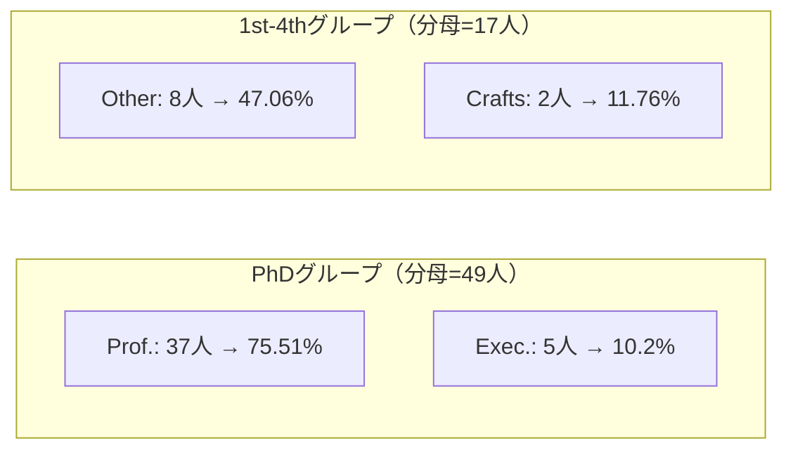

これによって「PhD保持者のうち、専門職（Prof.）は何％か」という、特定の属性内部でのバランスを可視化できます。

このクエリの処理順序を整理すると、まず`WHERE`で学歴を'PhD'と'1st-4th'に限定し、次に`GROUP BY`で「学歴×職業」の組み合わせで件数を数え（`CUST_COUNT`）、最後に分析関数で集計された後の数字を使ってグループ内での割合を計算する、という流れになります。PhDグループの合計（37+5+2...=49人）を出し、それぞれの職業をその49で割る、1st-4thグループの合計（8+2+2...=17人）を出し、それぞれの職業をその17で割る、という具合です。

結果を見ると興味深い傾向が読み取れます。PhD（博士号）層は`Prof.`（専門職）が75.51%と圧倒的で、高学歴が特定の職種に強く結びついていることが分かります。一方1st-4th（初等教育）層は、最も多い`Other`でも47.06%にとどまり、特定の職種に偏らず多様な職業に分散している傾向が見て取れます。母数（分母）が全く違うグループ同士であっても、「％」という共通の尺度に変換することで、その内部構造をフェアに比較できるのがこのテクニックの利点です。

結果の中に`?`という職業が含まれています。実務データには、このような「不明値」や「ノイズ」がよく含まれます。分析関数を使う際は、これらも含めて100%とするのか、あらかじめ`WHERE`句で除外して「有効回答のみのシェア」を出すのか、目的に応じて判断する必要があります。

----
<br><br>

# 問題12-8：前後比較（LAG関数）
### 難易度：★★★☆☆ (Lv.3)
## 問題
HRスキーマの`EMPLOYEES`テーブルより、**同一部門内において、自分の1つ前に採用された人**の情報を取得してください。

**【抽出・編集ルール】**
* **対象データ**：`EMPLOYEE_ID` が 190 から 210 までの従業員。
* **表示項目**：
  * 自身の情報：`EMPLOYEE_ID`, `DEPARTMENT_ID`, `FIRST_NAME`, `HIRE_DATE`
  * 1つ前に採用された人の情報：`PREV_FIRST_NAME`, `PREV_HIRE_DATE`
* **ソート順**：部門ID（`DEPARTMENT_ID`）の昇順、次に採用日（`HIRE_DATE`）の昇順。

## 期待する結果
| EMPLOYEE_ID | DEPARTMENT_ID | FIRST_NAME | HIRE_DATE             | PREV_FIRST_NAME | PREV_HIRE_DATE        |
| ----------- | -------------- | ----------- | ----------------------- | ----------------- | ------------------------ |
| 200         | 10              | Jennifer     | 2013-09-17T00:00:00Z      |                    |                           |
| 201         | 20              | Michael      | 2014-02-17T00:00:00Z      |                    |                           |
| 202         | 20              | Pat          | 2015-08-17T00:00:00Z      | Michael            | 2014-02-17T00:00:00Z      |
| 203         | 40              | Susan        | 2012-06-07T00:00:00Z      |                    |                           |
| 192         | 50              | Sarah        | 2014-02-04T00:00:00Z      |                    |                           |
| 193         | 50              | Britney      | 2015-03-03T00:00:00Z      | Sarah              | 2014-02-04T00:00:00Z      |
| 196         | 50              | Alana        | 2016-04-24T00:00:00Z      | Britney            | 2015-03-03T00:00:00Z      |
| 197         | 50              | Kevin        | 2016-05-23T00:00:00Z      | Alana              | 2016-04-24T00:00:00Z      |
| 194         | 50              | Samuel       | 2016-07-01T00:00:00Z      | Kevin              | 2016-05-23T00:00:00Z      |
| 190         | 50              | Timothy      | 2016-07-11T00:00:00Z      | Samuel             | 2016-07-01T00:00:00Z      |
| 195         | 50              | Vance        | 2017-03-17T00:00:00Z      | Timothy            | 2016-07-11T00:00:00Z      |
| 198         | 50              | Donald       | 2017-06-21T00:00:00Z      | Vance              | 2017-03-17T00:00:00Z      |
| 191         | 50              | Randall      | 2017-12-19T00:00:00Z      | Donald             | 2017-06-21T00:00:00Z      |
| 199         | 50              | Douglas      | 2018-01-13T00:00:00Z      | Randall            | 2017-12-19T00:00:00Z      |
| 204         | 70              | Hermann      | 2012-06-07T00:00:00Z      |                    |                           |
| 206         | 110             | William      | 2012-06-07T00:00:00Z      |                    |                           |

## 解答例
```sql
SELECT
    employee_id,
    department_id,
    first_name,
    hire_date,
    -- 同じ部署内で、採用日順に並べた1つ前の行の値を取得
    LAG(first_name) OVER(PARTITION BY department_id
         ORDER BY
             hire_date
    ) AS prev_first_name,
    LAG(hire_date) OVER(PARTITION BY department_id
         ORDER BY
             hire_date
    ) AS prev_hire_date
FROM
    hr.employees
WHERE
    employee_id BETWEEN 190 AND 210
ORDER BY
    department_id,
    hire_date
```

## 解説
今回は「行と行の値を比較する」テクニックです。通常、SQLは「現在の行」のデータしか見ることができませんが、`LAG`関数や`LEAD`関数を使うと、「1つ前の行」や「1つ後の行」の値を現在の行に持ってくることができます。

`LAG`は「遅れる」という意味で、指定した順序に従って「前の行」にあるデータを取得します。

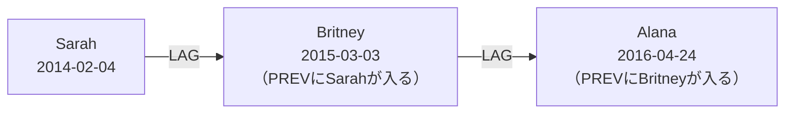

`PARTITION BY department_id`で「部署」という小部屋にデータを分けることで、別の部署の人が混ざることなく、同じ部署内だけで「誰が先に採用されたか」を比較できます。`ORDER BY hire_date`で小部屋（部署）の中を採用日の古い順に整列させ、この並び順が確定して初めて「1つ前（＝自分より1回前に採用された人）」が誰なのかが決まります。

期待する結果の中で、Jennifer（ID 200）は部署10の中で一番最初に採用されたため彼女の「前」には誰もおらず、`PREV_`カラムはNULL（空欄）になります。Michael（ID 201）も部署20のトップバッターなので同様です。一方Pat（ID 202）は同じ部署20でMichaelの次に採用されたので、`PREV_`カラムにMichaelの情報が表示されます。このように「グループの先頭行は必ずNULLになる」という性質を理解しておくと、実務でこの関数を使う際に迷いが減ります。

| 用途 | 使う関数 | 例 |
| :--- | :--- | :--- |
| 前の行を見る | `LAG` | 前月比、前日比較、前の採用者 |
| 次の行を見る | `LEAD` | 次の採用者、次回の注文日 |

`LAG`関数は、ビジネス分析において「前月比」や「前年比」を出す際によく使われます。売上の前月比を計算する際の`(売上 - LAG(売上) OVER(...)) / LAG(売上) OVER(...)`、株価の前日比較、製造ラインで前の製品が通過してから何分後に次の製品が来たかを測る工程間隔の計算などです。逆に1つ先の行を見たい場合は`LEAD`関数を使います。「次の採用者は誰か」「次回の注文はいつか」といった分析にはこちらが向いています。

もし`LAG`を使わずにこの問題を解こうとすると、自己結合が必要になり、テーブルを2回読み込んで複雑な結合条件を書かなければならず、処理も重くなりがちです。分析関数（LAG）ならテーブルを1回スキャンするだけで前後を特定できるため、速く、コードもすっきりします。

----
<br><br>

# 【完全版】問題12-9：同一年月の複数注文（分析関数による解＜問題10-5の別解＞）
### 難易度：★★★☆☆ (Lv.3)
## 問題
OEスキーマの`ORDERS`テーブルを使用して、**同じ年月の間に2回以上の注文を行った顧客**とその注文詳細を特定してください。

**【条件およびルール】**
* **分析関数**を使用して、「顧客ごと・年月ごと」の注文回数を計算してください。
* 注文が2回以上（複数）ある行のみを抽出してください。
* 顧客名（`CUST_NAME`）は `CUSTOMERS` テーブルより取得し、姓名を半角スペースで結合してください。
* 結果の表示順は問いません。

## 期待する結果
| CUSTOMER_ID | CUST_NAME            | ORDER_ID | ORDER_DATE                    |
| ----------- | ---------------------- | -------- | -------------------------------- |
| 105         | Matthias MacGraw          | 2358     | 2008-01-08T17:03:12.654278Z       |
| 105         | Matthias MacGraw          | 2356     | 2008-01-26T09:22:41.934562Z       |
| 148         | Gustav Steenburgen        | 2451     | 2007-12-17T17:03:52.562632Z       |
| 148         | Gustav Steenburgen        | 2386     | 2007-12-06T12:22:34.225609Z       |

## 解答例
```sql:例1：分析関数（COUNT）を使用
SELECT
    customer_id,
    cust_name,
    order_id,
    order_date
FROM
    (
        SELECT
            o.customer_id,
            c.cust_first_name || ' ' || c.cust_last_name  AS cust_name,
            o.order_id,
            o.order_date,
            COUNT(*) OVER(PARTITION BY o.customer_id,
                  TRUNC(o.order_date, 'mm')) AS monthly_order_count
        FROM
                 oe.orders o
            INNER JOIN oe.customers c 
               ON o.customer_id = c.customer_id
    )
WHERE
    monthly_order_count > 1; -- 2回以上注文した人だけ抽出
```
```sql:例2：分析関数（MIN,MAX）を使用（WINDOW句はOracle 23ai以降）
SELECT
    customer_id,
    cust_name,
    order_id,
    order_date
FROM
    (
        SELECT
            o.customer_id,
            c.cust_first_name || ' ' || c.cust_last_name  AS cust_name,
            o.order_id,
            o.order_date,
            MIN(o.order_id) OVER w AS monthly_min,
            MAX(o.order_id) OVER w AS monthly_max
        FROM
                 oe.orders o
            INNER JOIN oe.customers c 
               ON o.customer_id = c.customer_id
        WINDOW w as (PARTITION BY o.customer_id,TRUNC(o.order_date, 'mm'))
    )
WHERE
    monthly_min <> monthly_max
```
## 解説
以前、問題10-5で自己結合を使って解いたこの課題を、今回は分析関数（ウィンドウ関数）で解き直します。「同じ人が同じ月に何回注文したか」を特定する際、自己結合だとテーブルを2回読み込む必要がありましたが、分析関数なら一度テーブルをスキャンするだけで答えが出るため、実務でもこちらが好まれます。

今回の解法のポイントは、`OVER`句の中にある`PARTITION BY`に複数項目を指定している点です。
```sql
PARTITION BY o.customer_id, TRUNC(o.order_tms, 'mm')
```
通常は1つの項目で分けますが、カンマで区切ることで「顧客ID かつ 注文月」という、より細かい小部屋を作ることができます。

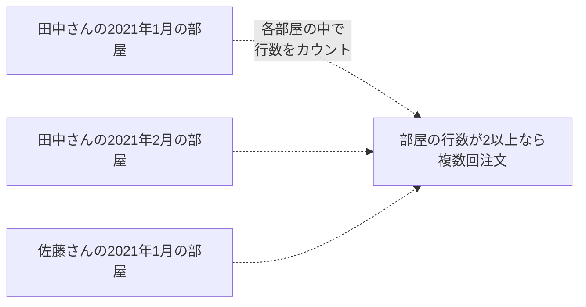

「田中さんの2021年1月」「田中さんの2021年2月」「佐藤さんの2021年1月」……といった具合に部屋を分け、その各部屋の中で注文（行）がいくつあるかを数えます。

解答例には2つのロジックがあります。

| 方式 | 判定ロジック |
| :--- | :--- |
| 例1：`COUNT(*)`を使う | その部屋の行数が2以上（`> 1`）なら複数回注文 |
| 例2：`MIN`と`MAX`を比較 | 最小の注文IDと最大の注文IDが違う（`<>`）なら2回以上ある |

例1のCOUNT(*)を使う方法は、「その部屋の行数が2以上（`> 1`）」であれば、その月は複数回注文したことになる、という直感的なアプローチです。コードを読んだ瞬間に「月間の注文回数を数えているんだな」と意図が伝わります。例2のMINとMAXを比較する方法は、「最大と最小が違う＝2種類以上のデータがある」という性質を利用しています。同一月内の「最小の注文ID」と「最大の注文ID」を取得し、もし注文が1回しかなければ両者は一致しますが、2回以上あれば必ず「最小≠最大」になります。なお例2で使われている`WINDOW`句は、問題12-3でも触れたOracle 23ai以降の機能なので、対応バージョンでない環境では通常の`OVER(PARTITION BY ...)`の書き方に置き換える必要があります。

自己結合と分析関数を比べると、自己結合はJOIN条件が複雑になりがちでテーブルを複数回読むため重くなりやすい一方、分析関数は1行の定義で完結し、テーブルスキャン1回で済みます。また「3回、4回注文した人」を特定したい場合も、自己結合だと条件を書き直す手間が増えますが、分析関数なら`> 2`や`> 3`と変えるだけで対応できます。

なお、日付から「年月」だけを取り出して比較する際、`TRUNC(order_date, 'mm')`は「その月の1日」に日付を切り捨ててくれます。`EXTRACT`を2回書くよりもコードが短くなり、インデックス効率が良い場合もあります。

結果を見ると、Matthias MacGrawさん（105番）は2008年1月に「8日」と「26日」の2回注文していることが、分析関数によって1行ずつマークされています。「行のディテール（具体的な注文日など）を保持したまま、グループ統計（その月の回数）でフィルタリングする」という抽出が、この書き方で実現できています。

----
<br><br>

# 問題12-10：NTILEによる顧客セグメンテーション分析
### 難易度：★★★☆☆ (Lv.3)
## 問題
SHスキーマの`SALES`テーブルを使用して、2021年の年間購入総額に基づき、顧客を4つのグループ（四分位数：Quartiles）に分類してください。そのうち、最も購入額が多い「グループ1（トップ25%）」に属する顧客を特定してください。

**【条件および算出ルール】**
* **対象**: 2021年の購入実績がある顧客のうち、`CUST_ID` が 4000〜4099 の範囲。
* **集計**: 顧客ごとの年間購入額合計（`AMOUNT_SOLD`）を計算。
* **分類**: 購入額が多い（`DESC`）順に 1〜4 の番号を付与。
* **絞り込み**: グループ番号が「1」の顧客のみを抽出。
* **ソート**: 年間購入額合計の降順。

## 期待する結果
| CUST_ID | TOTAL_SPENT | TILE_RANK |
| ------- | ------------ | ---------- |
| 4036    | 29,365.48      | 1            |
| 4003    | 27,036.14      | 1            |
| 4023    | 24,610.20      | 1            |
| 4006    | 24,093.54      | 1            |
| 4052    | 18,591.87      | 1            |
| 4026    | 14,265.46      | 1            |
| 4069    | 13,984.97      | 1            |
| 4094    | 13,951.57      | 1            |
| 4002    | 11,688.55      | 1            |
| 4097    | 8,469.91       | 1            |
| 4034    | 7,772.89       | 1            |

## 解答例
```sql
WITH cust_2021_sales AS (
    SELECT
        cust_id,
        SUM(amount_sold) AS total_spent
    FROM
        sh.sales
    WHERE 1=1
        AND time_id BETWEEN DATE '2021-01-01' AND DATE '2021-12-31'
        AND cust_id BETWEEN 4000 AND 4099
    GROUP BY
        cust_id
),
ranked_customers AS (
    SELECT
        cust_id,
        total_spent,
        NTILE(4) OVER (ORDER BY total_spent DESC) AS tile_rank
    FROM
        cust_2021_sales
)
SELECT
    cust_id,
    TO_CHAR(total_spent, '99,999.99') AS total_spent,
    tile_rank
FROM
    ranked_customers
WHERE
    tile_rank = 1
ORDER BY
    total_spent DESC
```

## 解説
今回はNTILE関数を使った顧客分析です。`NTILE`は、特定の「順位」ではなく、母集団全体を「比率でバケツ分け」したいときに向いています。実務で「上位〇〇％の顧客にアプローチしたい」という要望があった際、このクエリが書ければすぐにターゲットリストを作成できます。

`NTILE(n)`は、結果セットを`n`個の等しいグループ（バケツ）に分割しようとします。行数がグループ数で割り切れない場合の挙動を知っておくと役立ちます。

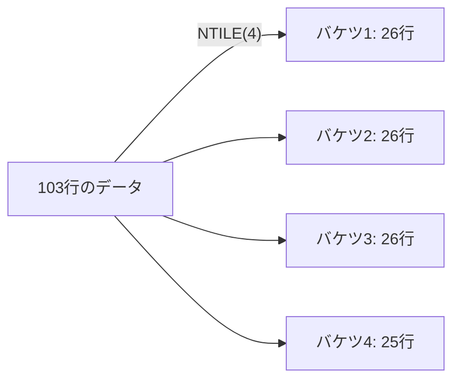

基本的には「全行数 ÷ n」で各バケツの行数を決定し、余った行はバケツ1から順番に1行ずつ追加されます。例えば103行を`NTILE(4)`で分けると、バケツ1, 2, 3は「26行」、バケツ4は「25行」となります。

`OVER (ORDER BY total_spent DESC)`を指定することで、「金額が大きい人から順にバケツ1に入れていく」という流れを作っています。もしここを`ASC`にしてしまうと、バケツ1には「最もお金を使っていない下位25%」が入ってしまうため注意が必要です。

なぜ`RANK`や`ROW_NUMBER`ではなく`NTILE`なのでしょうか。

| 関数 | 優先すること | この用途に向くか |
| :--- | :--- | :---: |
| `ROW_NUMBER` | 1人ずつに背番号を振るだけ（25%地点は別途計算が必要） | △ |
| `RANK` | 順位。同額があると順位が飛びバケツが不均一になりうる | △ |
| `NTILE` | 箱の大きさ（件数）をできるだけ均等に保つ | ◎ |

`ROW_NUMBER`は1人ずつに背番号を振るだけで、全体の「25%」がどこかは別途計算が必要です。`RANK`は同じ金額の人がいると順位が飛び、バケツのサイズが不均一になる可能性があります。`NTILE`は順位に関わらず「箱の大きさ（件数）」をできるだけ均等に保つことを優先します。そのため、マーケティング予算が決まっていて「上位4分の1の人（人数ベース）」にDMを送りたい、といった場合には`NTILE`が適しています。

今回の四分位（クォタイル）分析をさらに細かくしたものが、よく知られる「デシル分析」です。`NTILE(10)`を使い、デシル1（上位10%）は収益の大部分を支えるロイヤルカスタマー、デシル10（下位10%）は離脱間近、あるいは獲得コストが見合わない層、というように分類します。`NTILE`を使うことで、顧客一人ひとりの名前を見る前に、顧客ポートフォリオの全体像をマクロな視点で把握できます。

解答例にある通り、一度CTE（`cust_2021_sales`）で集計を完了させてから`NTILE`を適用し、さらに外側でフィルタリングする、という3段構えの構造は、分析関数を扱う際によく使うパターンです。集計（GROUP BY）、ランク付け（NTILE）、抽出（WHERE）という順に処理を分けて考えると、複雑なクエリでも組み立てやすくなります。

# 【完全版】問題12-11：ベンフォードの法則による不正検知シミュレーション
### 難易度：★★★★☆ (Lv.4)
## 問題
SHスキーマの`SALES`テーブルを使用し、売上金額（`AMOUNT_SOLD`）の「最初の桁の数字（1〜9）」の出現頻度が**ベンフォードの法則**に従っているかを監査するレポートを作成してください。
ベンフォードの法則の理論的確率は、以下の式で求められます：
`P(d) = log10(1 + 1/d)`  （d は 1〜9 のいずれか）
出力には以下の項目を含めてください：
1. **DIGIT**: 1から9までの数字
2. **THEORETICAL**: ベンフォードの法則による理論上の出現確率（%表記）
3. **ACTUAL**: 実測データから算出した出現確率（%表記）
4. **DEVIATION**: 実測値と理論値の乖離（ポイント）
5. **AUDIT_STATUS**: 乖離の絶対値が5ポイントを超える場合は「@@ CHECK DATA @@」、それ以外は「NORMAL」と表示
   
なお、レコードは**DIGITの昇順**でソートしてください。

## 期待する結果
| DIGIT | THEORETICAL | ACTUAL  | DEVIATION | AUDIT_STATUS     |
| ----- | ------------ | -------- | ---------- | ------------------ |
| 1     | 30.1%          | 25.92%     | -4.18        | NORMAL               |
| 2     | 17.61%         | 19.56%     | 1.95         | NORMAL               |
| 3     | 12.49%         | 9.97%      | -2.52        | NORMAL               |
| 4     | 9.69%          | 15.22%     | 5.53         | @@ CHECK DATA @@      |
| 5     | 7.92%          | 10.66%     | 2.74         | NORMAL               |
| 6     | 6.69%          | 4.79%      | -1.9         | NORMAL               |
| 7     | 5.8%           | 3.65%      | -2.15        | NORMAL               |
| 8     | 5.12%          | 3.99%      | -1.13        | NORMAL               |
| 9     | 4.58%          | 6.26%      | 1.68         | NORMAL               |

## 解答例
```sql
WITH 
-- 1. 1桁目の数値を抽出
 raw_digits AS (
    SELECT
        SUBSTR(
            TO_CHAR(ABS(amount_sold)), 1, 1) AS first_digit
    FROM
        sh.sales
    WHERE
        amount_sold > 0
),
-- 2. 実測値のカウントと比率計算
 actual_distribution AS (
    SELECT
        first_digit,
        COUNT(*)     AS digit_count,
        RATIO_TO_REPORT(COUNT(*)) OVER() * 100 AS actual_pct
    FROM
        raw_digits
    GROUP BY
        first_digit
),
-- 3. 理論値（ベンフォードの法則）の生成
 theoretical_distribution AS (
    SELECT
        level    AS digit,
        ROUND(LOG(10, 1 + 1 / level) * 100, 2) AS benford_pct
    FROM
        dual
    CONNECT BY
        level <= 9
)
-- 4. 実測と理論を比較し、乖離(Deviation)を算出
SELECT
    t.digit,
    t.benford_pct || '%' AS theoretical,
    ROUND(NVL(a.actual_pct, 0), 2) || '%' AS actual,
    ROUND(NVL(a.actual_pct, 0) - t.benford_pct, 2) AS deviation,
    CASE
        WHEN ABS(NVL(a.actual_pct, 0) - t.benford_pct) > 5 THEN
            '@@ CHECK DATA @@'
        ELSE
            'NORMAL'
    END AS audit_status
FROM
    theoretical_distribution t
    LEFT JOIN actual_distribution      a 
      ON t.digit = TO_NUMBER(a.first_digit)
ORDER BY
    t.digit
```

## 解説
この解答例は、共通テーブル式（WITH句）を使って、複雑な処理を4つの論理的なステップに分割しています。これにより、可読性が高くデバッグしやすいコードになっています。

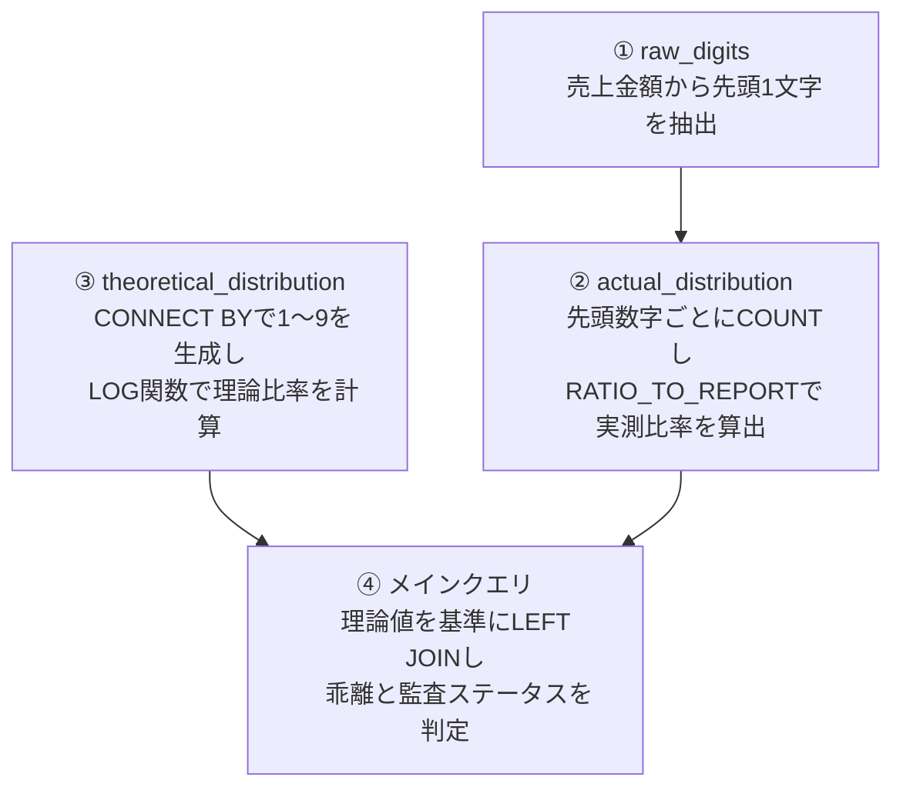

ステップ1（`raw_digits`）では、売上金額から先頭の1文字を抽出しています。`ABS()`は万が一マイナスの金額が入っていた場合に備えて絶対値に変換する処理で、今回は`WHERE amount_sold > 0`があるため主に保険としての役割です。`TO_CHAR()`で数値型を文字列型に変換し、`SUBSTR(文字列, 1, 1)`で文字列の1文字目から1文字分（先頭の数字）を切り出しています。

ステップ2（`actual_distribution`）で、このクエリ最初のハイライトである分析関数が登場します。`GROUP BY first_digit`によって1から9までの各数字が何回出現したかを`COUNT(*)`で集計し、`RATIO_TO_REPORT(COUNT(*)) OVER()`で、各桁の出現回数が全体（すべての出現回数の合計）に対して占める割合（0〜1）を計算し、100を掛けてパーセンテージにしています。

ステップ3（`theoretical_distribution`）では、ベンフォードの法則の理論値を、テーブルのデータに依存せずSQL内で動的に生成しています。`CONNECT BY level <= 9`は、`dual`表と組み合わせて1から9までの連番（行）を生成するOracleの定番テクニック（階層クエリの応用）です。`LOG(10, n)`は底を10とする対数（常用対数）を計算する関数で、問題文にある理論式`P(d) = log10(1 + 1/d)`をそのままSQLの関数に落とし込んでいます。

ステップ4（メインクエリ）では、理論値（1〜9が必ず存在する）をベース（左側）にして、実測値を`LEFT JOIN`しています。なぜ`LEFT JOIN`なのかというと、実際のデータの中に「先頭が9の売上が1件もなかった」という場合でも、監査レポートの行として「9」を表示させるためです。`NVL(a.actual_pct, 0)`は、実測データが存在しなかった場合にNULLになってしまうのを防ぎ、0に変換して安全に計算（引き算など）を行えるようにしています。最後に`ABS(NVL(...) - t.benford_pct) > 5`を用いて、理論値との差分の絶対値が5を超える場合に警告メッセージを出力させています。

このスクリプトは、Oracle SQLの機能（`RATIO_TO_REPORT`や`CONNECT BY`による行生成）を活かして、数学的な法則（ベンフォードの法則）をデータ監査に適用する事例です。データサイエンスや監査の分野でも、こうしたSQLの書き方は重宝されます。

----
<br><br>

# 【完全版】問題12-12：多次元階層における集計とシェア算出（クロスディメンション参照）（分析関数による解＜問題15-6の別解＞）
### 難易度：★★★★☆ (Lv.4)
## 問題
経営分析チームより、製品カテゴリ別の売上レポートの作成依頼がありました。
単にカテゴリごとの売上を出すだけでなく、 **「全カテゴリ合計（Total）」** の行を仮想的に生成し、さらにその合計値を用いて **「各カテゴリが全体の何％を占めているか（Share）」** を算出してください。
2021年の売上データを対象に、以下の情報を取得する SQL を作成してください。

**【使用テーブル】**
* **`sh.sales`**（売上履歴）
* **`sh.products`**（商品マスタ）
* **`sh.times`**（時間マスタ）
<br>

**【抽出・集計ルール】**
1. **DIMENSION（次元）**: `PROD_CATEGORY`（製品カテゴリ）と `CALENDAR_YEAR`（年）の2次元を定義します。
2. **仮想行の生成**: 元データには存在しない **`Total`** という名前のカテゴリ行を生成し、その年の全カテゴリの合計売上を算出してください。
3. **SHARE（構成比）の算出**:
   * 各カテゴリの売上が、その年の `Total` 行の売上に対して何％にあたるかを計算してください。
   * 小数点第3位を四捨五入し、第2位まで表示してください。
4. 対象は 2021年のみとし、表示順はカテゴリの昇順（ただし `Total` は最後）とします。
## 期待する結果
| PROD_CATEGORY      | YEAR | SALES_AMOUNT | SHARE_PCT |
| --------------------- | ---- | -------------- | ---------- |
| Baseball                 | 2021  | 6464786.22        | 27.2         |
| Cricket                  | 2021  | 3434409.23        | 14.45        |
| Golf                     | 2021  | 4336456.4         | 18.25        |
| Soccer / Football        | 2021  | 4329248.89        | 18.22        |
| Tennis                   | 2021  | 5200605.88        | 21.88        |
| Total                    | 2021  | 23765506.62       | 100          |

## 解答例
```sql:例1：MAXを使用
SELECT
    NVL(prod_category, 'Total') AS prod_category,
    year,
    sales_amount,
    -- 1. 各行の売上を、全体の売上（Total行の値）で割ってシェアを算出
    ROUND(
        sales_amount / MAX(sales_amount) OVER() * 100, 
        2
    ) AS share_pct
FROM (
    -- 2. カテゴリごとの集計と、ROLLUPによる全体の合計行を生成
    SELECT
        p.prod_category,
        t.calendar_year AS year,
        SUM(s.amount_sold) AS sales_amount
    FROM
        sh.sales s
        INNER JOIN sh.products p ON s.prod_id = p.prod_id
        INNER JOIN sh.times t ON s.time_id = t.time_id
    WHERE
        t.calendar_year = 2021
    GROUP BY
        ROLLUP(p.prod_category),
        t.calendar_year
)
ORDER BY
    CASE WHEN prod_category = 'Total' THEN 1 ELSE 0 END,
    prod_category
```
```sql:例2：RATIO_TO_REPORTを使用
SELECT
    NVL(prod_category, 'Total') AS prod_category,
    year,
    sales_amount,
    -- 1. 各行の売上を、全体の売上（Total行の値）で割ってシェアを算出
    ROUND(RATIO_TO_REPORT(sales_amount) OVER() * 100 * 2, 2) AS share_pct
FROM (
    -- 2. カテゴリごとの集計と、ROLLUPによる全体の合計行を生成
    SELECT
        p.prod_category,
        t.calendar_year AS year,
        SUM(s.amount_sold) AS sales_amount
    FROM
        sh.sales s
        INNER JOIN sh.products p ON s.prod_id = p.prod_id
        INNER JOIN sh.times t ON s.time_id = t.time_id
    WHERE
        t.calendar_year = 2021
    GROUP BY
        ROLLUP(p.prod_category),
        t.calendar_year
)
ORDER BY
    CASE WHEN prod_category = 'Total' THEN 1 ELSE 0 END,
    prod_category
```

## 解説
この問題は、単なる集計を超えて、レポートとしてそのまま使える形に整えるテクニックが詰まっています。特に「ROLLUPで生成された行をどう活用するか」がポイントになります。

両方のクエリに共通するインラインビュー（FROM句の中のSELECT）の要は、`GROUP BY ROLLUP`です。通常のカテゴリ別集計に加えて、全カテゴリを合計した「総計行」を1行追加する役割を持っています。`ROLLUP(p.prod_category)`と記述することで、カテゴリがNULLになっている「合計行」が生成されます。外側のクエリで`NVL(prod_category, 'Total')`とすることで、このNULL行に「Total」という名前を与えています。

**2つのシェア算出方式の比較**

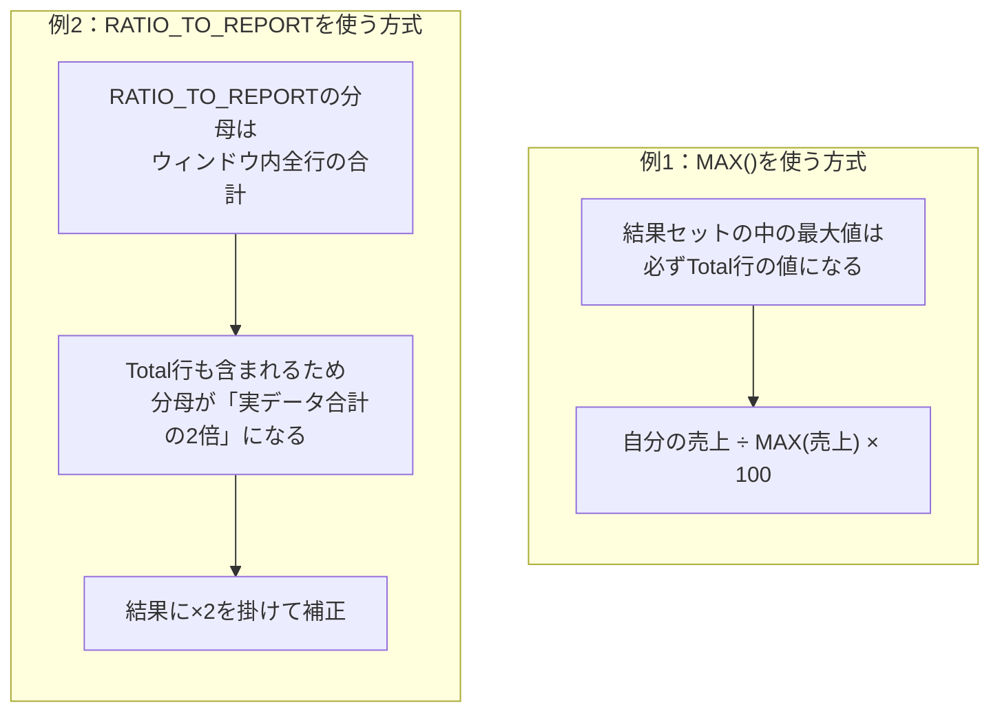

例1はMAX() OVER()を使ったシェア算出です。インラインビューの結果には「各カテゴリの売上」と「全体の合計売上」の両方が含まれており、このデータセットの中で最大値（MAX）は必ず「合計売上」になります。これを利用して、各行で「自分の売上 ÷ データ内の最大値（＝合計売上）」を計算させています（`sales_amount / MAX(sales_amount) OVER() * 100`）。

例2はRATIO_TO_REPORT()を使ったシェア算出ですが、少しトリッキーな部分があります。`RATIO_TO_REPORT`は「そのウィンドウ内にある全行の合計値」を分母にします。今回の結果セットには、各カテゴリの売上に加えてTotal行（全カテゴリの合計値）も含まれているため、普通に計算すると分母は「各カテゴリの売上合計＋Total行の値」となります。ここでTotal行の値は「各カテゴリの売上合計」と全く同じ値なので、この分母は必ず「実データ合計の2倍」になります。つまりカテゴリ数がいくつであっても、Total行が他の全行の合計と等しい値を持つ限り、この「2倍になる」という関係は変わりません。そのため、計算結果に`* 2`を掛けることで、正しいシェア（100%基準）に補正しています。

通常、昇順（ASC）で並び替えると「T」から始まる「Total」は途中に混ざってしまいます。
```sql
ORDER BY
    CASE WHEN prod_category = 'Total' THEN 1 ELSE 0 END,
    prod_category
```
`Total`行には「1」、それ以外には「0」というスコアを一時的に与えることで、まずスコア「0」の一般カテゴリが名前順に並び、最後にスコア「1」の`Total`が確実に一番下に来るよう制御しています。

| 方式 | 特徴 |
| :--- | :--- |
| 例1（MAX） | 直感的で「分母が2倍になる問題」を気にしなくてよく、ミスが少ない |
| 例2（RATIO_TO_REPORT） | 「構成比を出す」という意図が明確だが、集計行（ROLLUP）を含む場合は補正が必要 |

どちらの書き方が良いかというと、例1（MAX）は直感的で、`RATIO_TO_REPORT`のような「分母が2倍になる問題」を気にしなくてよいため、ミスが少なくおすすめです。例2（RATIO_TO_REPORT）は「構成比を出す」という意図が明確な関数ですが、今回のように集計行（ROLLUP）を含む場合は補正が必要な点に注意してください。
