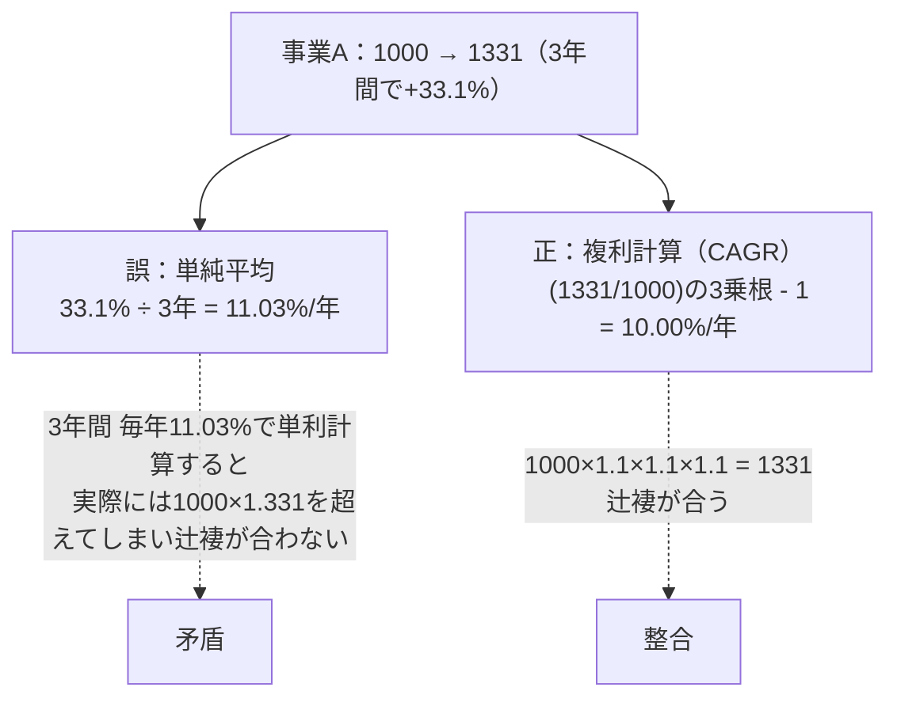
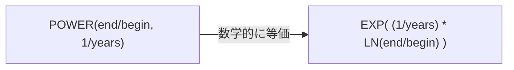
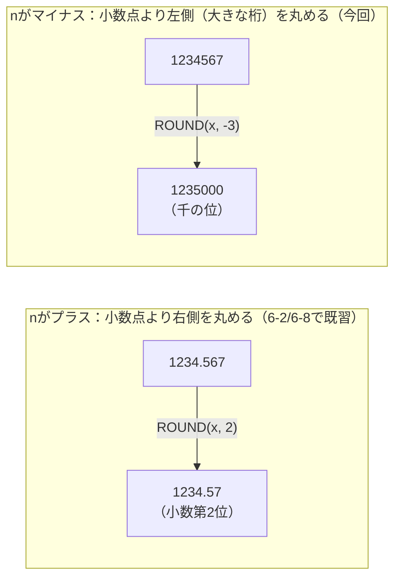
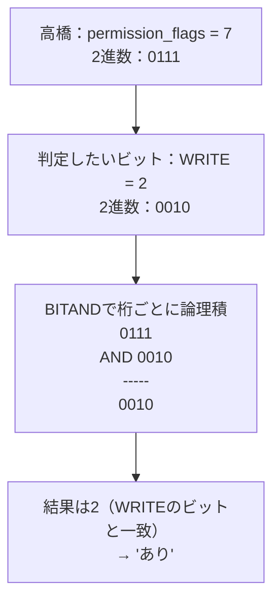
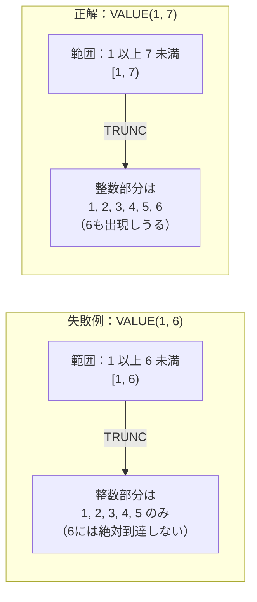

# 問題6-12：複利計算とPOWER/SQRT/LNによる指数・対数演算
### 難易度：★★★☆☆ (Lv.3)
## 問題
経営企画部門から、複数の事業部における**年平均成長率（CAGR: Compound Annual Growth Rate）** の算出を依頼されました。CAGRとは、単年度の成長率がどれだけ変動していても、開始時点から終了時点までの成長を「毎年一定の割合で複利成長した」と仮定した場合の、年あたりの成長率のことです。

以下の`business_revenue`（`WITH`句による疑似データ）を対象に、各事業の売上高（百万円）と経過年数から、CAGRを算出してください。

```sql
WITH business_revenue AS (
    SELECT '事業A' AS bu_name, 3 AS years, 1000 AS begin_revenue, 1331    AS end_revenue FROM dual UNION ALL
    SELECT '事業B', 2, 2000, 2420    FROM dual UNION ALL
    SELECT '事業C', 5, 500,  700     FROM dual UNION ALL
    SELECT '事業D', 4, 800,  651.605 FROM dual UNION ALL
    SELECT '事業E', 1, 300,  345     FROM dual
)
SELECT * FROM business_revenue
```

**【算出内容】**
* **GROWTH_RATIO**：`END_REVENUE ÷ BEGIN_REVENUE`（期間全体での成長倍率）を小数点第4位まで表示。
* **CAGR**：年平均成長率（%）を、`GROWTH_RATIO`を経過年数（`YEARS`）で「開n乗根」した値をもとに算出し、小数点第2位まで表示してください。

**【表示・ソート条件】**
* レコードの表示順序は、`BU_NAME`の昇順としてください。

## 期待する結果
| BU_NAME | YEARS | BEGIN_REVENUE | END_REVENUE | GROWTH_RATIO | CAGR | 
| ------- | ----- | ------------- | ----------- | ------------ | ---- | 
| 事業A   | 3     | 1000          | 1331        | 1.331        | 10   | 
| 事業B   | 2     | 2000          | 2420        | 1.21         | 10   | 
| 事業C   | 5     | 500           | 700         | 1.4          | 6.96 | 
| 事業D   | 4     | 800           | 651.605     | 0.8145       | -5   | 
| 事業E   | 1     | 300           | 345         | 1.15         | 15   |

## 解答例

まず、多くの人が最初に思いついてしまう、直感的だが誤った計算方法を見てみましょう。

```sql:失敗例：単純平均（線形近似）でCAGRを計算してしまうケース
WITH business_revenue AS (
    SELECT '事業A' AS bu_name, 3 AS years, 1000 AS begin_revenue, 1331    AS end_revenue FROM dual UNION ALL
    SELECT '事業B', 2, 2000, 2420    FROM dual UNION ALL
    SELECT '事業C', 5, 500,  700     FROM dual UNION ALL
    SELECT '事業D', 4, 800,  651.605 FROM dual UNION ALL
    SELECT '事業E', 1, 300,  345     FROM dual
)
SELECT
    bu_name,
    years,
    begin_revenue,
    end_revenue,
    ROUND(end_revenue / begin_revenue, 4) AS growth_ratio,
    ROUND(((end_revenue - begin_revenue) / begin_revenue / years) * 100, 2) AS cagr  -- ★これが誤り
FROM
    business_revenue
ORDER BY
    bu_name
```

このクエリを実行すると、事業Aは`10.00`ではなく`11.03`、事業Cは`6.96`ではなく`8.00`という、微妙だが確実にズレた値が出てしまいます（事業Eだけは`years = 1`のため偶然一致します）。

正しい解答は以下の通りです。

```sql
WITH business_revenue AS (
    SELECT '事業A' AS bu_name, 3 AS years, 1000 AS begin_revenue, 1331    AS end_revenue FROM dual UNION ALL
    SELECT '事業B', 2, 2000, 2420    FROM dual UNION ALL
    SELECT '事業C', 5, 500,  700     FROM dual UNION ALL
    SELECT '事業D', 4, 800,  651.605 FROM dual UNION ALL
    SELECT '事業E', 1, 300,  345     FROM dual
)
SELECT
    bu_name,
    years,
    begin_revenue,
    end_revenue,
    ROUND(end_revenue / begin_revenue, 4) AS growth_ratio,
    ROUND((POWER(end_revenue / begin_revenue, 1 / years) - 1) * 100, 2) AS cagr
FROM
    business_revenue
ORDER BY
    bu_name
```

## 解説
今回は、これまでの四則演算や丸め処理とは毛色の異なる、**指数・対数系の数値関数**を扱います。`POWER`（累乗）、`SQRT`（平方根）、`LN`/`EXP`（自然対数・指数）は、複利計算や成長率分析、統計処理など、金融・ビジネス分析でしばしば登場する関数です。

### なぜ単純平均（失敗例）ではダメなのか

失敗例のクエリは「全体の成長率を経過年数で割る」という、一見自然な発想です。しかし、これは**成長が「複利」ではなく「単利（毎年同じ金額だけ増える）」であることを前提とした計算**になってしまっています。実際のビジネスにおける成長は、前年の実績を土台にして次の年がさらに増減する「複利的」な性質を持つため、単純に年数で割る方法では正しい年率を求められません。



実際に事業Aで検算すると、`1000 × 1.1 × 1.1 × 1.1 = 1331`と、複利前提の`10.00%`であればぴったり一致します。一方、単純平均で出した`11.03%`を複利で3年間当てはめると`1000 × 1.1103³ ≈ 1368`となり、実際の`1331`とズレてしまいます。単純平均は「複利による増幅効果」を考慮できていないため、常に本来のCAGRよりも大きい（成長局面では過大評価、下降局面では過小評価の）値を返してしまうのです。

### POWER関数によるn乗根の計算

CAGRの数式は、数学的には次のように表されます。

```
CAGR = (終了時の値 ÷ 開始時の値)^(1 ÷ 経過年数) - 1
```

この「n乗根を求める」という操作を実現しているのが`POWER`関数です。
```sql
POWER( [底], [指数] )
```
`POWER`は「底を指数の回数だけ掛け合わせる」という累乗計算が本来の役目ですが、指数に`1/n`のような**分数**を渡すことで、「n乗根」を求める道具としても使えます。今回のクエリでは`POWER(end_revenue / begin_revenue, 1 / years)`という形で、成長倍率の`years`乗根を計算しています。

| 指数の値 | 意味 | 例 |
| :--- | :--- | :--- |
| `2`（整数） | 2乗（自乗） | `POWER(3, 2)` = 9 |
| `1/2`（分数） | 平方根（2乗根） | `POWER(9, 1/2)` = 3 |
| `1/3`（分数） | 立方根（3乗根） | `POWER(8, 1/3)` = 2 |
| `1/years`（分数） | years乗根 | 今回のCAGR計算 |

### SQRTとの関係（事業Bのケース）

事業Bは`YEARS = 2`のケースであり、これは「2乗根」＝「平方根」を求めることと同義です。つまりOracleに標準搭載されている`SQRT`関数でも同じ結果が得られます。

```sql
-- 事業B（2年間）に限れば、以下の2つの書き方は完全に同じ結果になる
POWER(2420 / 2000, 1 / 2)   -- 汎用的なn乗根の書き方
SQRT(2420 / 2000)           -- 2乗根に特化した書き方
```

| 関数 | 対応範囲 | 今回のケースでの使用可否 |
| :--- | :--- | :--- |
| `SQRT(x)` | 平方根（2乗根）専用 | 事業B（`years=2`）でのみ使用可 |
| `POWER(x, 1/n)` | 任意のn乗根に対応 | 事業A〜Eすべてに使用可（汎用） |

`SQRT`は「2乗根」という限定された用途にしか使えませんが、今回のように事業ごとに経過年数（`years`）がバラバラなデータを一つのクエリで処理する場面では、`years`の値によらず統一的に扱える`POWER`の方が実務上は扱いやすいと言えます。

### LN・EXPとの数学的な等価性

`POWER(x, y)`という累乗の計算は、実は自然対数`LN`と指数関数`EXP`の組み合わせでも表現できます。これは指数・対数の性質上、数学的に完全に等価です。

```sql
-- 以下の2つは常に同じ結果を返す
POWER(x, y)
EXP(y * LN(x))
```



例えば事業Cであれば、`LN(700/500) = LN(1.4) ≈ 0.33647`をまず求め、これを`years`（5）で割ってから`EXP`で戻す、という手順でも同じ`CAGR = 6.96%`が得られます。`POWER`は内部的にこの「対数を取って、割って、指数に戻す」という処理を1関数にまとめてくれている、と理解しておくと、なぜ指数と対数がセットで語られることが多いのかが腑に落ちると思います。

:::message
### 「幾何平均」と「算術平均」——ビジネスでの実務的な意味
今回の失敗例（単純平均）と正解（`POWER`によるCAGR）の違いは、統計学でいう**算術平均**と**幾何平均**の違いそのものです。

* **算術平均**：値をそのまま足して個数で割る（失敗例のアプローチ）
* **幾何平均**：値を掛け合わせてn乗根を取る（`POWER`/`SQRT`/`LN`・`EXP`によるCAGRのアプローチ）

「率」や「倍率」（成長率、為替レート、投資リターンなど）を複数年にわたって平均したい場合は、幾何平均を使うのが数学的に正しいアプローチです。算術平均で「率の平均」を取ってしまうと、常に実態より甘い（成長局面では過大な、下降局面では過小な）数値になってしまう、という性質を覚えておくと、決算報告やKPIレポートを読む際にも役立ちます。
:::

指数・対数の関数は、複利計算のほかにも人口増加モデル、放射性物質の減衰計算、機械学習の評価指標など幅広い分野で使われます。「率を掛け合わせて評価したい場面ではPOWER（または対応するLN/EXP）、率を足し合わせて評価したい場面では通常の算術演算」という使い分けの軸を持っておくと、この手のクエリを設計する際の助けになると思います。

## 参考リンク
https://www.shift-the-oracle.com/sql/functions/power-log-sqrt.html
https://www.shift-the-oracle.com/sql/functions/exp-natural-log.html

---
<br><br>

承知しました。候補⑥〜⑧をすべて本文化し、第6章を完成させます（6-13〜6-15、全15問）。

---

# 問題6-13：ROUND/TRUNCの負の桁数指定による大きな桁への丸め
### 難易度：★★★☆☆ (Lv.3)
## 問題
経営会議向けの売上サマリーを作成することになりました。会議資料では、細かい端数を排除して「百万円単位」で金額を表示するというルールになっています。

以下の`dept_revenue`（`WITH`句による疑似データ）を対象に、各部門の実績金額を百万円単位に丸めた金額を算出してください。あわせて、切り捨てによる百万円単位表示も比較のために算出します。

```sql
WITH dept_revenue AS (
    SELECT '開発部' AS dept_name, 22500000 AS revenue FROM dual UNION ALL
    SELECT '営業部', 15500000 FROM dual UNION ALL
    SELECT '経理部', 8500000  FROM dual UNION ALL
    SELECT '人事部', 3500000  FROM dual
)
SELECT * FROM dept_revenue
```

**【算出内容】**
* **ROUND_REVENUE**：`REVENUE`を百万円単位で**四捨五入**した金額。
* **TRUNC_REVENUE**：`REVENUE`を百万円単位で**切り捨て**た金額（比較用）。

**【表示・ソート条件】**
* レコードの表示順序は、`REVENUE`の**降順**としてください。

## 期待する結果
| DEPT_NAME | REVENUE  | ROUND_REVENUE | TRUNC_REVENUE | 
| --------- | -------- | ------------- | ------------- | 
| 開発部    | 22500000 | 23000000      | 22000000      | 
| 営業部    | 15500000 | 16000000      | 15000000      | 
| 経理部    | 8500000  | 9000000       | 8000000       | 
| 人事部    | 3500000  | 4000000       | 3000000       | 

## 解答例

まず、新人担当者が実際に書いてしまった、一見それらしく見えるクエリを見てみましょう。「百万円単位＝6桁」という発想から、桁数の`6`をそのまま第2引数に指定してしまっています。

```sql:失敗例：桁数の「6」をそのままROUNDの第2引数に指定してしまうケース
WITH dept_revenue AS (
    SELECT '開発部' AS dept_name, 22500000 AS revenue FROM dual UNION ALL
    SELECT '営業部', 15500000 FROM dual UNION ALL
    SELECT '経理部', 8500000  FROM dual UNION ALL
    SELECT '人事部', 3500000  FROM dual
)
SELECT
    dept_name,
    revenue,
    ROUND(revenue, 6) AS round_revenue,  -- ★これが誤り
    TRUNC(revenue, -6) AS trunc_revenue
FROM
    dept_revenue
ORDER BY
    revenue DESC
```

このクエリを実行すると、エラーは一切発生せず、`ROUND_REVENUE`列には`REVENUE`と全く同じ値がそのまま返ってきます。実行結果を一見しただけでは「動いているし数値も出ている」ため、バグに気づきにくいという、まさに本書が重視する「もっともらしいが誤った結果」の典型例です。

正しい解答は以下の通りです。

```sql
WITH dept_revenue AS (
    SELECT '開発部' AS dept_name, 22500000 AS revenue FROM dual UNION ALL
    SELECT '営業部', 15500000 FROM dual UNION ALL
    SELECT '経理部', 8500000  FROM dual UNION ALL
    SELECT '人事部', 3500000  FROM dual
)
SELECT
    dept_name,
    revenue,
    ROUND(revenue, -6) AS round_revenue,
    TRUNC(revenue, -6) AS trunc_revenue
FROM
    dept_revenue
ORDER BY
    revenue DESC
```

## 解説
6-2・6-8では、`ROUND`/`TRUNC`/`CEIL`/`FLOOR`を使い、小数点以下の端数を処理する方法を扱いました。これらの問題では常に「小数点より右側（小さい桁）」を丸める話でしたが、実は`ROUND(x, n)`と`TRUNC(x, n)`の第2引数`n`には**マイナスの値**も指定できます。`n`がマイナスになると、丸めの基準点が小数点より右ではなく、**整数側の大きな桁（左）** に移動します。



`n`の値と、実際に丸められる桁の対応関係を整理すると以下のようになります。

| `n`の値 | 丸められる桁 | 例（`ROUND(1234567, n)`） |
| :---: | :--- | :--- |
| `2` | 小数第2位 | - |
| `0` | 整数（小数点以下すべて） | 1234567 |
| `-1` | 十の位 | 1234570 |
| `-2` | 百の位 | 1234600 |
| `-3` | 千の位 | 1235000 |
| `-6` | 百万の位 | 1000000 |

今回失敗例で指定してしまった`ROUND(revenue, 6)`は、「小数点第6位で四捨五入する」という意味になります。`REVENUE`列はもともと整数（小数部分を持たない）ため、存在しない小数点以下の桁を丸めても値は一切変化しません。「6桁の数値を丸めたいなら6を指定する」という直感的な発想が、符号を見落とすことで完全に無効な処理につながってしまう、という点が今回の落とし穴です。

:::message
### 「先に丸めてから合計」と「先に合計してから丸め」は一致するとは限らない
今回学んだ大きな桁への丸めは、複数行を集計してレポート化する場面で多用されますが、ここに実務上のもう一つの落とし穴があります。「各行をそれぞれ丸めてから合計した値」と「生の値を合計してから丸めた値」は、**必ずしも一致しません**。

```sql
-- 各部門を先に百万円単位に丸めてから合計（23+16+9+4 = 52,000,000）
SELECT SUM(ROUND(revenue, -6)) FROM dept_revenue;
-- 結果：52000000

-- 生の実績金額を先に合計してから、百万円単位に丸める（50,000,000 → 変化なし）
SELECT ROUND(SUM(revenue), -6) FROM dept_revenue;
-- 結果：50000000
```

今回の`dept_revenue`のデータでは、両者に`2,000,000`円もの差が生まれます。これは各部門の端数（`0.5`百万円ちょうど）の四捨五入による誤差が、合計時に一方向に積み上がってしまうためです。経営会議の資料で「部門別の丸めた金額を単純に足し合わせた合計」と「全社合計を別途丸めた金額」が一致せず、経理部門から問い合わせが来る、というのはよくある実務トラブルです。どちらの数値を採用するかは業務ルール次第ですが、**この2つが原理的に別の値になりうる**ということ自体を認識しておくことが重要です。
:::

「百万円単位」「千円単位」といった表示要件は、経営レポートや財務諸表で非常に頻繁に登場します。桁数の符号を一つ間違えるだけでエラーにならずに処理が素通りしてしまう今回のようなケースは、テストデータに気づかれにくく紛れ込みやすいため、要件定義の段階で「何桁で丸めるか」ではなく「何の位で丸めるか」を明確に確認する習慣をつけると安全です。

## 参考リンク
https://www.shift-the-oracle.com/sql/functions/round.html
https://www.shift-the-oracle.com/sql/functions/trunc.html

---
<br><br>

# 問題6-14：BITANDによるビット演算（フラグ管理）
### 難易度：★★★☆☆ (Lv.3)
## 問題
社内システムの権限管理機能を担当することになりました。このシステムでは、ユーザーごとの権限を個別の列で持つのではなく、`PERMISSION_FLAGS`という1つの`NUMBER`列に、以下のビットフラグの合計値として格納しています。

| 権限名 | フラグ値 |
| :--- | :---: |
| READ（閲覧） | 1 |
| WRITE（編集） | 2 |
| DELETE（削除） | 4 |
| ADMIN（管理者） | 8 |

例えば「閲覧と編集」の両方の権限を持つユーザーは`1 + 2 = 3`という値になります。

以下の`user_permissions`（`WITH`句による疑似データ）を対象に、各ユーザーが「編集（WRITE）権限」を持っているかどうかを判定してください。

```sql
WITH user_permissions AS (
    SELECT '田中' AS user_name, 1  AS permission_flags FROM dual UNION ALL
    SELECT '鈴木', 3  FROM dual UNION ALL
    SELECT '佐藤', 5  FROM dual UNION ALL
    SELECT '高橋', 7  FROM dual UNION ALL
    SELECT '伊藤', 8  FROM dual UNION ALL
    SELECT '渡辺', 10 FROM dual
)
SELECT * FROM user_permissions
```

**【算出内容】**
* **HAS_WRITE**：`PERMISSION_FLAGS`にWRITE権限（フラグ値`2`）が含まれていれば`'あり'`、含まれていなければ`'なし'`を表示。

**【表示・ソート条件】**
* レコードの表示順序は、`PERMISSION_FLAGS`の昇順としてください。

## 期待する結果
| USER_NAME | PERMISSION_FLAGS | HAS_WRITE | 
| --------- | ---------------- | --------- | 
| 田中      | 1                | なし      | 
| 鈴木      | 3                | あり      | 
| 佐藤      | 5                | なし      | 
| 高橋      | 7                | あり      | 
| 伊藤      | 8                | なし      | 
| 渡辺      | 10               | あり      | 

## 解答例

まず、新人担当者が書いてしまった誤りのクエリを見てみましょう。「WRITE権限＝フラグ値2」という理解から、単純な等価比較で判定しようとしています。

```sql:失敗例：フラグの合計値を単純な等価比較で判定してしまうケース
WITH user_permissions AS (
    SELECT '田中' AS user_name, 1  AS permission_flags FROM dual UNION ALL
    SELECT '鈴木', 3  FROM dual UNION ALL
    SELECT '佐藤', 5  FROM dual UNION ALL
    SELECT '高橋', 7  FROM dual UNION ALL
    SELECT '伊藤', 8  FROM dual UNION ALL
    SELECT '渡辺', 10 FROM dual
)
SELECT
    user_name,
    permission_flags,
    CASE WHEN permission_flags = 2 THEN 'あり' ELSE 'なし' END AS has_write  -- ★これが誤り
FROM
    user_permissions
ORDER BY
    permission_flags
```

このクエリを実行すると、`PERMISSION_FLAGS`がちょうど`2`のユーザーが存在しないため、全員が`'なし'`と判定されてしまいます。特に鈴木（`3`）・高橋（`7`）・渡辺（`10`）は、実際にはWRITE権限を含んでいるにもかかわらず、見逃されてしまいます。

正しい解答は以下の通りです。

```sql
WITH user_permissions AS (
    SELECT '田中' AS user_name, 1  AS permission_flags FROM dual UNION ALL
    SELECT '鈴木', 3  FROM dual UNION ALL
    SELECT '佐藤', 5  FROM dual UNION ALL
    SELECT '高橋', 7  FROM dual UNION ALL
    SELECT '伊藤', 8  FROM dual UNION ALL
    SELECT '渡辺', 10 FROM dual
)
SELECT
    user_name,
    permission_flags,
    CASE WHEN BITAND(permission_flags, 2) = 2 THEN 'あり' ELSE 'なし' END AS has_write
FROM
    user_permissions
ORDER BY
    permission_flags
```

## 解説
複数のフラグを1つの数値にまとめて格納する設計は、権限管理のほか、機能フラグ（feature flag）や車両オプションの管理など、業務システムで広く使われる手法です。この方式で個々のフラグの有無を判定するために使うのが`BITAND`関数です。

`PERMISSION_FLAGS`の値は、実は2進数として見ると各権限が独立した「桁（ビット）」に対応しています。

| 権限名 | 10進数 | 2進数（4桁） |
| :--- | :---: | :---: |
| READ | 1 | `0001` |
| WRITE | 2 | `0010` |
| DELETE | 4 | `0100` |
| ADMIN | 8 | `1000` |

`PERMISSION_FLAGS = 7`（高橋）を2進数にすると`0111`となり、これは`READ(0001) + WRITE(0010) + DELETE(0100)`の3つのビットがすべて立っている状態を表しています。

`BITAND(n1, n2)`は、この2進数表現を**桁ごとに比較し、両方とも1が立っている桁だけを1として残す**関数です。「WRITE権限を持っているか」を調べたい場合、`WRITE`に対応するビット（`0010`）との`BITAND`を取り、結果が`0010`（＝2）と一致するかどうかで判定します。



同じ考え方を失敗例の等価比較（`= 2`）と対比すると、両者の違いがより明確になります。

| ユーザー | PERMISSION_FLAGS | 2進数 | `= 2`（失敗例） | `BITAND(x, 2) = 2`（正解） |
| :--- | :---: | :---: | :---: | :---: |
| 田中 | 1 | `0001` | なし（偶然一致） | なし |
| 鈴木 | 3 | `0011` | **なし（誤り）** | **あり** |
| 佐藤 | 5 | `0101` | なし（偶然一致） | なし |
| 高橋 | 7 | `0111` | **なし（誤り）** | **あり** |
| 伊藤 | 8 | `1000` | なし（偶然一致） | なし |
| 渡辺 | 10 | `1010` | **なし（誤り）** | **あり** |

`= 2`という等価比較は、「WRITE権限だけを単独で持つ」という非常に限定的なケースにしか一致しません。ビットフラグ方式は「複数の権限を自由に組み合わせられる」ことがそもそもの設計思想であるため、等価比較でチェックするという発想自体が設計思想と噛み合っていない、という点を理解しておくことが重要です。

:::message
### BITANDでOR/XOR相当の演算をしたい場合
Oracle SQLの組み込み関数には`BITAND`（論理積）しか用意されておらず、`BITOR`（論理和）や`BITXOR`（排他的論理和）に相当する関数は標準では提供されていません。これらが必要な場合は、算術演算を組み合わせて代用します。

```sql
-- BITOR(n1, n2) 相当：n1 + n2 - BITAND(n1, n2)
-- BITXOR(n1, n2) 相当：n1 + n2 - 2 * BITAND(n1, n2)
```

また、`BITAND`は非負の整数を前提とした関数であり、引数に負の数を指定した場合の挙動はOracleのドキュメント上でも「意図した結果にならないことがある」と明記されています。フラグ用の列は必ず`0`以上の整数のみを許容するよう、`CHECK`制約などで担保しておくと安全です。
:::

ビットフラグによる権限管理は、列を増やさずに多数のON/OFF項目を1列にコンパクトに収められるという利点がある一方、今回のように「等価比較で判定してしまう」という事故が起きやすい設計でもあります。`BITAND`を使った正しい判定方法とあわせて、この設計パターンそのものの特性も押さえておきましょう。

## 参考リンク
https://docs.oracle.com/en/database/oracle/oracle-database/19/sqlrf/BITAND.html

---
<br><br>

# 【完全版】問題6-15：DBMS_RANDOMによる乱数生成とテストデータの検証
### 難易度：★★★★☆ (Lv.4)
## 問題
ゲームアプリ開発チームから、抽選機能で使う「1〜6の目が出るサイコロ」をシミュレートするロジックの検証を依頼されました。新人担当者が実装したロジックについて、QA部門から「景品の当選確率がどうも想定と合わない」という指摘が入っています。

以下は、新人担当者が実装した検証対象のロジックです（CONNECT BY LEVELによる連番生成は、この後の問題7-19で詳しく扱う手法と同じものです）。

```sql
-- 新人担当者が実装したロジック（検証対象）
WITH dice_rolls AS (
    SELECT TRUNC(DBMS_RANDOM.VALUE(1, 6)) AS roll_value
    FROM dual
    CONNECT BY LEVEL <= 1000
)
SELECT * FROM dice_rolls
```

1000回分のサイコロの目を生成したうえで、以下の観点から「1〜6のすべての目が過不足なく出現しうる、正しい実装になっているか」を検証してください。

**【算出内容】**
* **TOTAL_ROLLS**：試行回数の合計。
* **MIN_ROLL** / **MAX_ROLL**：出目の最小値・最大値。
* **DISTINCT_VALUES**：出現した出目の種類数（本来は6種類すべてが出現するはず）。
* **OUT_OF_RANGE_COUNT**：1〜6の範囲を外れた出目の件数。
* **VERDICT**：`DISTINCT_VALUES`が`6`、かつ`OUT_OF_RANGE_COUNT`が`0`の場合は`'PASS'`、それ以外は`'FAIL'`。

## 期待する結果
※`DBMS_RANDOM`は実行のたびに異なる値を生成する関数のため、`MIN_ROLL`や試行ごとの出現順序は環境によって多少前後する可能性があります。ただし1000回という十分な試行回数のもとでは、**正しい実装であれば理論上ほぼ確実に**以下のような結果に収束し、**誤った実装（新人担当者の元のロジック）では理論上必ず**`FAIL`になります。

| TOTAL_ROLLS | MIN_ROLL | MAX_ROLL | DISTINCT_VALUES | OUT_OF_RANGE_COUNT | VERDICT |
| ----------- | -------- | -------- | ---------------- | -------------------- | ------- |
| 1000        | 1        | 6        | 6                 | 0                     | PASS    |

（新人担当者の元のロジックのままでは`MAX_ROLL`が`5`、`DISTINCT_VALUES`が`5`にしかならず、`VERDICT`は`FAIL`になります）

## 解答例

まず、新人担当者が実装したロジックをそのまま検証クエリに組み込んでみます。

```sql:失敗例：DBMS_RANDOM.VALUEの上限値が「排他的」であることを見落としたケース
WITH dice_rolls AS (
    SELECT TRUNC(DBMS_RANDOM.VALUE(1, 6)) AS roll_value  -- ★上限が6では「6」の目が絶対に出ない
    FROM dual
    CONNECT BY LEVEL <= 1000
)
SELECT
    COUNT(*)                                                          AS total_rolls,
    MIN(roll_value)                                                    AS min_roll,
    MAX(roll_value)                                                    AS max_roll,
    COUNT(DISTINCT roll_value)                                         AS distinct_values,
    SUM(CASE WHEN roll_value < 1 OR roll_value > 6 THEN 1 ELSE 0 END)  AS out_of_range_count,
    CASE
        WHEN COUNT(DISTINCT roll_value) = 6
         AND SUM(CASE WHEN roll_value < 1 OR roll_value > 6 THEN 1 ELSE 0 END) = 0
        THEN 'PASS'
        ELSE 'FAIL'
    END AS verdict
FROM
    dice_rolls
```

このクエリを1000回試行のもとで実行すると、`MAX_ROLL`が常に`5`にとどまり、`DISTINCT_VALUES`も`5`のまま`VERDICT`が`'FAIL'`になります。しかも`OUT_OF_RANGE_COUNT`は常に`0`（1〜5の範囲は「1〜6の範囲」に収まっているため）であり、「範囲外の値が1件もないから正常」という一見安心できそうな見た目が、かえってこの不具合を見逃しやすくしています。

正しい解答は以下の通りです。

```sql
WITH dice_rolls AS (
    SELECT TRUNC(DBMS_RANDOM.VALUE(1, 7)) AS roll_value
    FROM dual
    CONNECT BY LEVEL <= 1000
)
SELECT
    COUNT(*)                                                          AS total_rolls,
    MIN(roll_value)                                                    AS min_roll,
    MAX(roll_value)                                                    AS max_roll,
    COUNT(DISTINCT roll_value)                                         AS distinct_values,
    SUM(CASE WHEN roll_value < 1 OR roll_value > 6 THEN 1 ELSE 0 END)  AS out_of_range_count,
    CASE
        WHEN COUNT(DISTINCT roll_value) = 6
         AND SUM(CASE WHEN roll_value < 1 OR roll_value > 6 THEN 1 ELSE 0 END) = 0
        THEN 'PASS'
        ELSE 'FAIL'
    END AS verdict
FROM
    dice_rolls
```

## 解説
`DBMS_RANDOM.VALUE(low, high)`は、`low`以上`high`**未満**の範囲でランダムな小数（`NUMBER`型）を返すファンクションです。ここでの落とし穴は、上限値`high`が **含まれない（排他的）** という仕様です。



「1〜6の整数」を得たいのであれば、`TRUNC`（または`FLOOR`）で小数部分を切り捨てた際に`6`という整数が生成される余地を残しておく必要があります。`VALUE(1, 6)`が返しうる最大値は`6`未満（例：`5.9999...`）であるため、これをどれだけ切り捨てても`5`が上限になってしまいます。`VALUE(1, 7)`とすることで、`6.0`以上`7.0`未満の範囲もカバーされ、`TRUNC`後に`6`という整数が生成されるようになります。

| 意図する範囲 | 誤ったVALUEの指定 | 正しいVALUEの指定 |
| :--- | :--- | :--- |
| 整数1〜6（サイコロ） | `VALUE(1, 6)` | `VALUE(1, 7)` |
| 整数1〜100（パーセント） | `VALUE(1, 100)` | `VALUE(1, 101)` |
| 整数18〜65（年齢） | `VALUE(18, 65)` | `VALUE(18, 66)` |

「`low`以上`high`未満」というのはOracleに限らず多くの言語・製品の乱数関数に共通する仕様（半開区間）ですが、日常的な感覚では「`high`まで含む」と誤解しやすいポイントです。

さらに今回の失敗例が厄介なのは、**検証観点そのものが不十分だと、このバグを完全に見逃してしまう**という点です。もし検証クエリが`OUT_OF_RANGE_COUNT`（範囲外の値のチェック）しか見ていなければ、`1〜5`という出目は`1〜6`の範囲に収まっているため、何の異常も検出できません。今回のように「取りうる値の**種類数**（`DISTINCT_VALUES`）が意図した数に達しているか」まで確認して初めて、「値が範囲を超えていない」ことと「値が範囲を十分にカバーできている」ことは**別の観点**である、という事実が見えてきます。

:::message
### ランダムなロジックをテストする際の心構え
今回の問題の「期待する結果」には、実行のたびに厳密には一致しない可能性がある旨を注記しました。これはSYSDATEに依存するクエリと同様、`DBMS_RANDOM`を使うクエリ全般に共通する性質です。

そのうえで、今回のように大量の試行回数（1000回）を確保することで、正しい実装であれば`VERDICT = 'PASS'`にほぼ確実に収束する一方、誤った実装（`VALUE(1,6)`）では`6`という出目が理論上**絶対に**出現しないため、`VERDICT = 'FAIL'`は試行回数によらず毎回確実に再現します。ランダムな処理を検証する際は、「厳密に同じ値が返ること」ではなく、「取りうる値の範囲・分布・境界条件が理論的に正しいこと」を検証対象に据えるのが実務上のセオリーです。

なお、`DBMS_RANDOM.SEED(n)`で乱数のシード値を固定すると再現性のあるテストが書けるように見えますが、生成される具体的な値の並びはOracleのバージョンやプラットフォームによって変わりうるため、「シードを固定すれば常に同じ値になる」という保証はない点にも注意してください。
:::

`DBMS_RANDOM`パッケージは、テストデータの大量生成やランダムサンプリング（`ORDER BY DBMS_RANDOM.VALUE`）など実務での応用範囲が広い一方、境界値の扱いを一つ誤るだけで、今回のように統計的にしか発覚しない不具合を埋め込んでしまうリスクもあります。「その乱数関数の範囲指定は、両端を含むのか含まないのか」を常に一次情報（ドキュメント）で確認する習慣が大切です。

## 参考リンク
https://docs.oracle.com/en/database/oracle/oracle-database/19/arpls/DBMS_RANDOM.html
