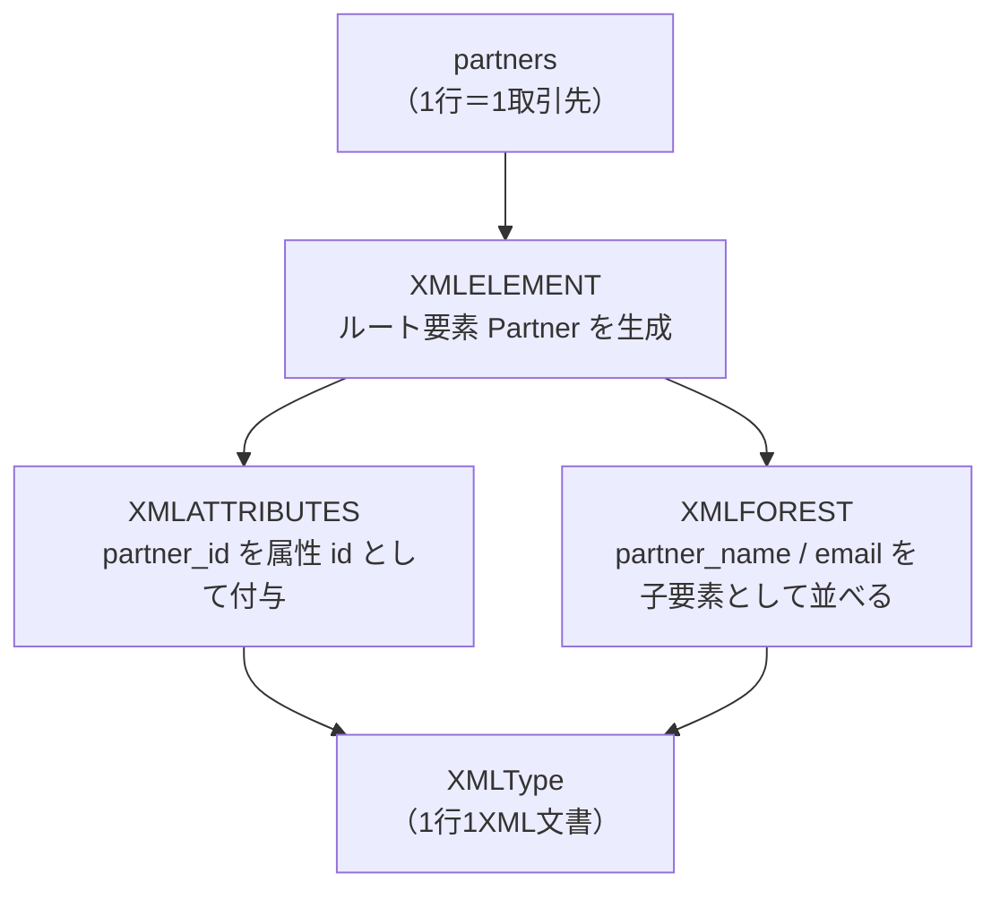
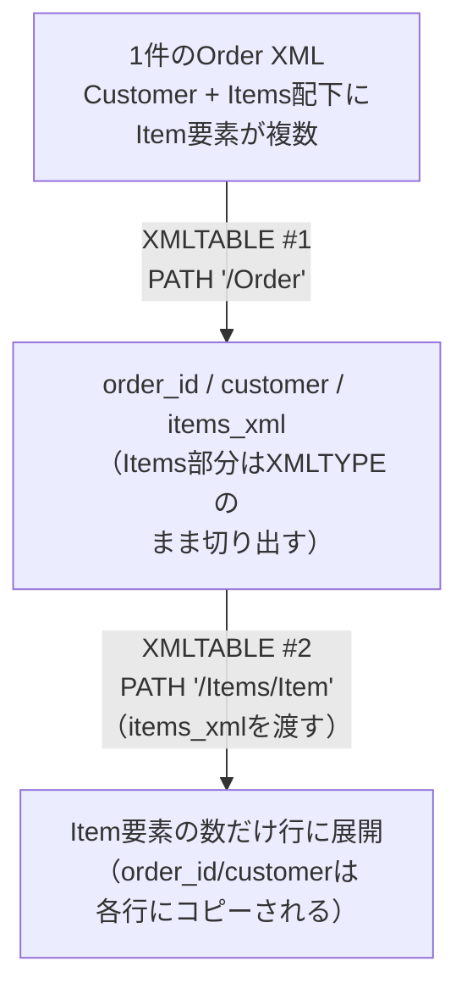
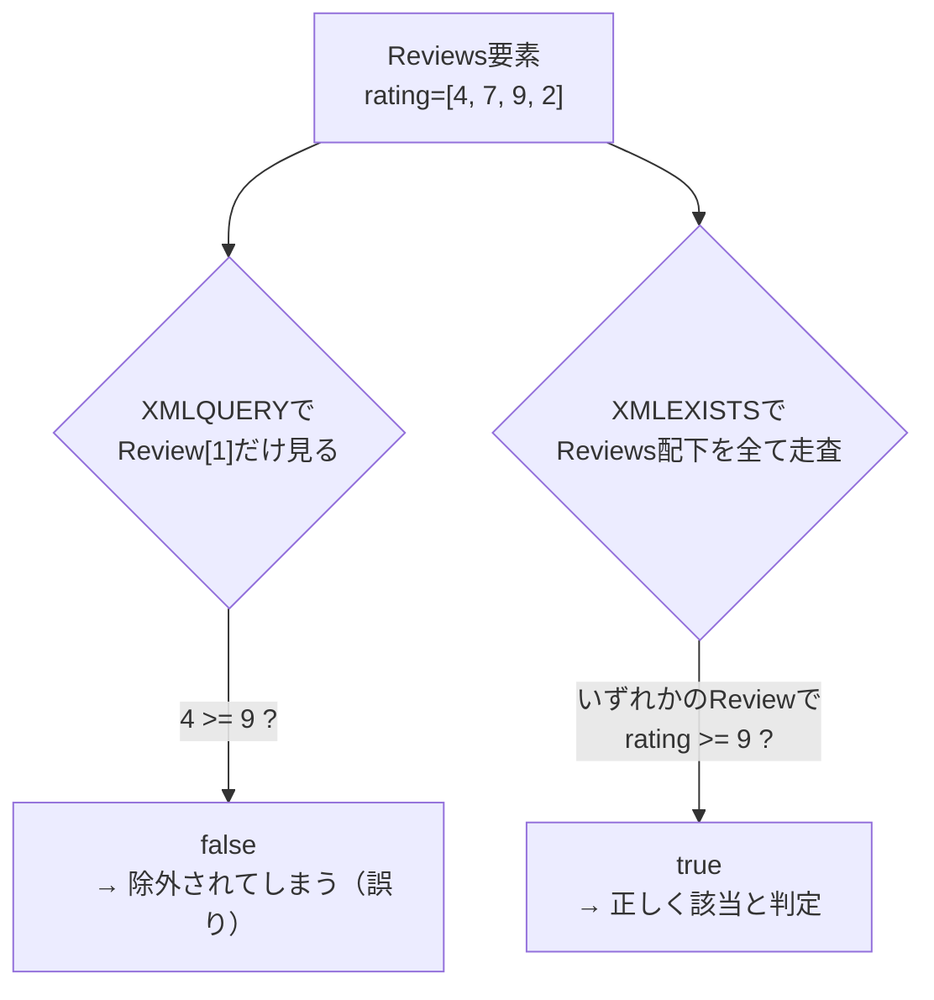
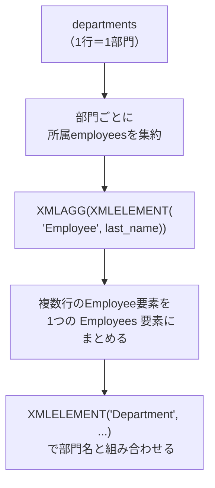
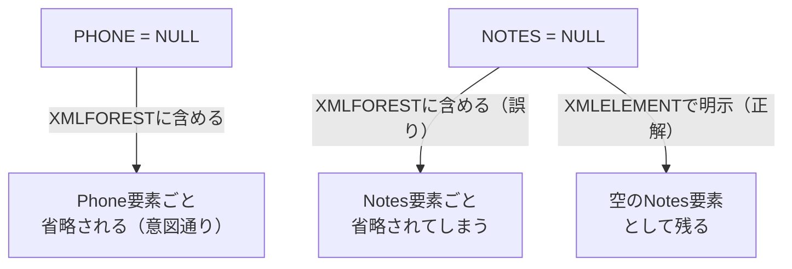
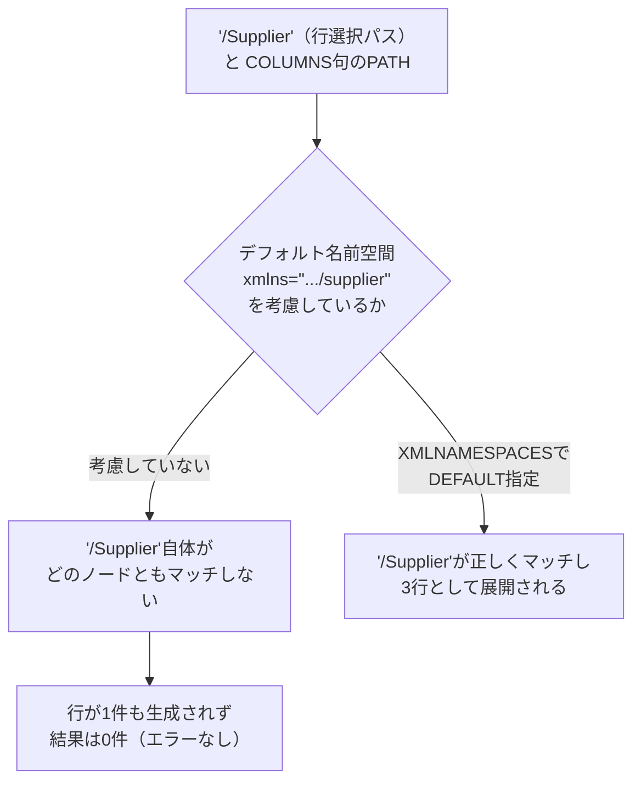
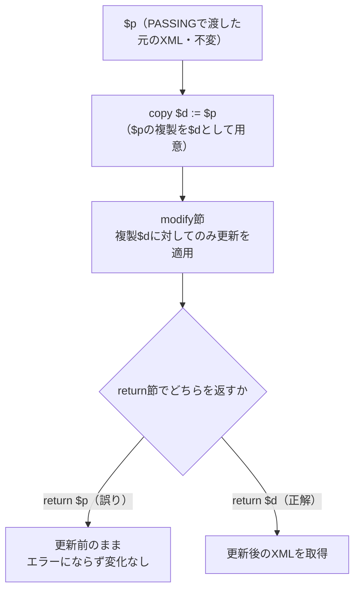
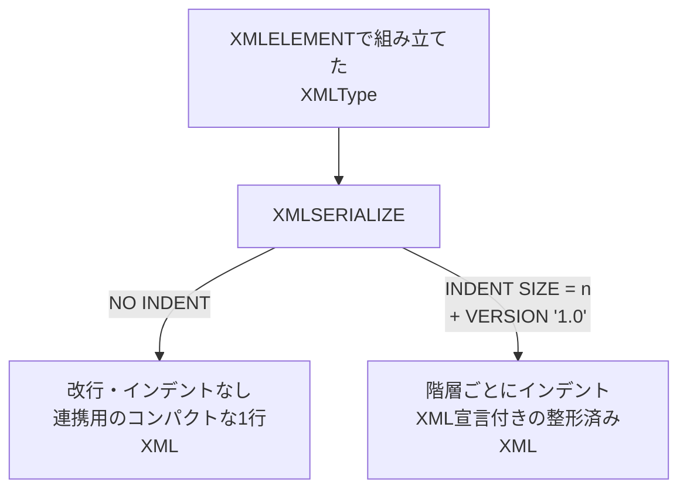

# 問題19-1：XMLELEMENT／XMLATTRIBUTES／XMLFORESTによるリレーショナル→XML変換
### 難易度：★★★☆☆ (Lv.3)
## 問題
以下の`WITH`句で用意した3件の取引先データ（`PARTNER_ID`、`PARTNER_NAME`、`EMAIL`）を、他システムへの連携用に**行ごとに1つのXML要素**へ変換してください。

**【XMLの構造】**
* ルート要素名：`Partner`
* `partner_id`：ルート要素の**属性（attribute）**`id`として持たせる
* `partner_name`：子要素`Name`として持たせる
* `email`：子要素`Email`として持たせる

```sql:検証用データ（WITH句）
WITH partners AS (
    SELECT 1 AS partner_id, 'Sato ' || CHR(38) || ' Suzuki Trading' AS partner_name, 'contact@satosuzuki.co.jp' AS email FROM dual UNION ALL
    SELECT 2,               'Yamada Logistics',                                       'info@yamada-logi.co.jp'                    FROM dual UNION ALL
    SELECT 3,               'Tanaka Holdings',                                        'sales@tanaka-hd.co.jp'                     FROM dual
)
-- ここから先を作成してください
```

## 期待する結果
| PARTNER_ID | PARTNER_XML                                                                                             | 
| ---------- | ------------------------------------------------------------------------------------------------------- | 
| 1          | <Partner id="1"><Name>Sato \&amp; Suzuki Trading</Name><Email>contact@satosuzuki.co.jp</Email></Partner> | 
| 2          | <Partner id="2"><Name>Yamada Logistics</Name><Email>info@yamada-logi.co.jp</Email></Partner>            | 
| 3          | <Partner id="3"><Name>Tanaka Holdings</Name><Email>sales@tanaka-hd.co.jp</Email></Partner>              | 

※`PARTNER_ID = 1`の`Name`要素内では、`&`が自動的に`&amp;`へエスケープされている点に注目してください。

## 解答例
```sql:失敗例：文字列連結によるXML風テキストの生成
WITH partners AS (
    SELECT 1 AS partner_id, 'Sato ' || CHR(38) || ' Suzuki Trading' AS partner_name, 'contact@satosuzuki.co.jp' AS email FROM dual UNION ALL
    SELECT 2,               'Yamada Logistics',                                       'info@yamada-logi.co.jp'                    FROM dual UNION ALL
    SELECT 3,               'Tanaka Holdings',                                        'sales@tanaka-hd.co.jp'                     FROM dual
)
SELECT
    partner_id,
    '<Partner id="' || partner_id || '">'
    || '<Name>' || partner_name || '</Name>'
    || '<Email>' || email || '</Email>'
    || '</Partner>' AS PARTNER_XML_TEXT
FROM
    partners
ORDER BY
    partner_id
-- 見た目はXMLだが、PARTNER_ID=1の "&" がエスケープされていないため不正な文字列（well-formedでない）
-- 試しに XMLTYPE(partner_xml_text) へキャストすると、1行目だけ ORA-31011（XML解析に失敗しました）で落ちる
```

```sql:正解例：XMLELEMENT / XMLATTRIBUTES / XMLFORESTを使用
WITH partners AS (
    SELECT 1 AS partner_id, 'Sato ' || CHR(38) || ' Suzuki Trading' AS partner_name, 'contact@satosuzuki.co.jp' AS email FROM dual UNION ALL
    SELECT 2,               'Yamada Logistics',                                       'info@yamada-logi.co.jp'                    FROM dual UNION ALL
    SELECT 3,               'Tanaka Holdings',                                        'sales@tanaka-hd.co.jp'                     FROM dual
)
SELECT
    partner_id,
    XMLELEMENT(
        "Partner",
        XMLATTRIBUTES(partner_id AS "id"),
        XMLFOREST(
            partner_name AS "Name",
            email        AS "Email"
        )
    ) AS PARTNER_XML
FROM
    partners
ORDER BY
    partner_id
```

## 解説
今回は、リレーショナルデータを他システム連携用のXML文書に変換する、SQL/XML生成関数の基礎を扱う演習です。17-3で学んだ`JSON_OBJECT`によるSQL→JSON変換のXML版にあたります。



まず失敗例を確認しましょう。`||`による単純な文字列連結は、見た目こそXMLらしい形になりますが、その正体は**ただの文字列**です。`PARTNER_ID = 1`の`partner_name`に含まれる`&`は、XMLの世界では「エンティティ参照の開始」という特別な意味を持つ記号であり、そのまま出力すると不正な（well-formedでない）XMLになります。この文字列を`XMLTYPE(...)`でXML型にキャストしようとした瞬間に、Oracleがパースエラーとして弾きます。

```sql
SELECT XMLTYPE('<Partner id="1"><Name>Sato ' || CHR(38) || ' Suzuki Trading</Name></Partner>') FROM dual;
-- ORA-31011: XML解析に失敗しました。
```

一方、正解例で使う`XMLELEMENT`・`XMLFOREST`は、最初から「型の保証されたXML」を組み立てる関数のため、`&`・`<`・`>`・`"`・`'`といった特殊文字を**自動的にエンティティ参照へエスケープ**してくれます。文字列連結では意識しなければならなかった落とし穴を、関数側が肩代わりしてくれるわけです。

3つの関数の役割は以下のように整理できます。

| 関数 | 役割 | 例 |
| :--- | :--- | :--- |
| `XMLELEMENT` | 要素（タグ）を1つ作る。入れ子にして構造を作る土台 | `XMLELEMENT("Partner", ...)` → `<Partner>...</Partner>` |
| `XMLATTRIBUTES` | `XMLELEMENT`の中で使い、値を**属性**として付与する | `XMLATTRIBUTES(partner_id AS "id")` → `<Partner id="1">` |
| `XMLFOREST` | 複数のカラムを**子要素の並び**としてまとめて生成する（`XMLELEMENT`の入れ子を書く手間を省く） | `XMLFOREST(partner_name AS "Name", email AS "Email")` → `<Name>...</Name><Email>...</Email>` |

`XMLFOREST(partner_name AS "Name", email AS "Email")`は、`XMLELEMENT("Name", partner_name), XMLELEMENT("Email", email)`と書いた場合と同じ結果になりますが、同列に並ぶ複数の子要素を一度に指定できるため、コードが簡潔になります。属性にしたい値（今回の`partner_id`）だけは`XMLATTRIBUTES`で別扱いにする、という使い分けがポイントです。

:::message
### 値を「属性」にするか「子要素」にするかの目安
XML設計に絶対のルールはありませんが、一般的には「そのデータを一意に識別するID」や「メタ情報（作成日時、バージョンなど）」は属性、「本文となるデータそのもの」は子要素にする設計がよく使われます。今回の`partner_id`のように主キーに相当する値を属性にしておくと、後続の`XMLTABLE`（次回以降で扱います）で行を特定する際にも扱いやすくなります。
:::

なお、`XMLELEMENT`の第1引数（要素名）はダブルクォートで囲んだ識別子として指定します。ここを`'Partner'`のようにシングルクォート（文字列リテラル）で書いてしまうと構文エラーになる点にも注意してください。

:::message
### 検証データに"&"を含める場合はCHR(38)を使う
SQL*PlusやSQLcl、Oracle FreeSQLなどの多くのOracleクライアントには、`&変数名`をユーザー入力に置き換える「置換変数」という機能があります。この機能はスクリプトを対話的に実行する際に便利ですが、データそのものに`&`を含めたい場合は邪魔になり、意図せず入力待ちで処理が止まってしまいます。
このようなケースでは、リテラルに直接`&`を書かず、`CHR(38)`（`&`の文字コード）を文字列連結で挟み込むことで、置換変数として解釈されるのを防げます（`SET DEFINE OFF`でクライアント側の機能自体を無効化する方法もありますが、環境によって挙動が異なるため、SQL文だけで完結する`CHR(38)`の方が確実です）。
:::

## 参考リンク
https://docs.oracle.com/en/database/oracle/oracle-database/19/sqlrf/XMLELEMENT.html
https://docs.oracle.com/en/database/oracle/oracle-database/19/sqlrf/XMLFOREST.html
https://docs.oracle.com/en/database/oracle/oracle-database/19/adxdb/generation-of-XML-data-from-relational-data.html

---
<br><br>

# 【完全版】問題19-2：XMLTABLEによるXML→リレーショナル展開
### 難易度：★★★★☆ (Lv.4)
## 問題
以下の`WITH`句で用意した3件の注文XMLデータ（`ORDER_XML`）を展開し、注文明細（`Item`）を1行1件として抽出してください。

**【抽出する項目】**
* `ORDER_ID`：`Order`要素の属性`id`
* `CUSTOMER`：`Order`要素直下の`Customer`
* `PRODUCT`：各`Item`要素内の`Product`
* `QTY`：各`Item`要素内の`Qty`
* `PRICE`：各`Item`要素内の`Price`

なお、1件の注文に複数の`Item`が含まれる場合は、`ORDER_ID`と`CUSTOMER`を各明細行に繰り返し表示してください。

```sql:検証用データ（WITH句）
WITH orders AS (
    SELECT XMLTYPE('<Order id="1001"><Customer>Yamada Trading</Customer><Items>'
        || '<Item><Product>Widget A</Product><Qty>5</Qty><Price>1200</Price></Item>'
        || '<Item><Product>Widget B</Product><Qty>2</Qty><Price>3400</Price></Item>'
        || '</Items></Order>') AS order_xml FROM dual
    UNION ALL
    SELECT XMLTYPE('<Order id="1002"><Customer>Suzuki Corp</Customer><Items>'
        || '<Item><Product>Widget C</Product><Qty>10</Qty><Price>500</Price></Item>'
        || '</Items></Order>') FROM dual
    UNION ALL
    SELECT XMLTYPE('<Order id="1003"><Customer>Tanaka Holdings</Customer><Items>'
        || '<Item><Product>Widget A</Product><Qty>1</Qty><Price>1200</Price></Item>'
        || '<Item><Product>Widget D</Product><Qty>3</Qty><Price>800</Price></Item>'
        || '<Item><Product>Widget E</Product><Qty>7</Qty><Price>250</Price></Item>'
        || '</Items></Order>') FROM dual
)
-- ここから先を作成してください
```

## 期待する結果
| ORDER_ID | CUSTOMER        | PRODUCT  | QTY | PRICE | 
| -------- | --------------- | -------- | --- | ----- | 
| 1001     | Yamada Trading  | Widget A | 5   | 1200  | 
| 1001     | Yamada Trading  | Widget B | 2   | 3400  | 
| 1002     | Suzuki Corp     | Widget C | 10  | 500   | 
| 1003     | Tanaka Holdings | Widget A | 1   | 1200  | 
| 1003     | Tanaka Holdings | Widget D | 3   | 800   | 
| 1003     | Tanaka Holdings | Widget E | 7   | 250   | 

## 解答例
```sql:失敗例：明細を1段階のXMLTABLEで直接取得しようとする
WITH orders AS (
    SELECT XMLTYPE('<Order id="1001"><Customer>Yamada Trading</Customer><Items>'
        || '<Item><Product>Widget A</Product><Qty>5</Qty><Price>1200</Price></Item>'
        || '<Item><Product>Widget B</Product><Qty>2</Qty><Price>3400</Price></Item>'
        || '</Items></Order>') AS order_xml FROM dual
    UNION ALL
    SELECT XMLTYPE('<Order id="1002"><Customer>Suzuki Corp</Customer><Items>'
        || '<Item><Product>Widget C</Product><Qty>10</Qty><Price>500</Price></Item>'
        || '</Items></Order>') FROM dual
    UNION ALL
    SELECT XMLTYPE('<Order id="1003"><Customer>Tanaka Holdings</Customer><Items>'
        || '<Item><Product>Widget A</Product><Qty>1</Qty><Price>1200</Price></Item>'
        || '<Item><Product>Widget D</Product><Qty>3</Qty><Price>800</Price></Item>'
        || '<Item><Product>Widget E</Product><Qty>7</Qty><Price>250</Price></Item>'
        || '</Items></Order>') FROM dual
)
SELECT
    o.order_id,
    o.customer,
    o.product
FROM
    orders od,
    XMLTABLE(
        '/Order'
        PASSING od.order_xml
        COLUMNS
            order_id NUMBER       PATH '@id',
            customer VARCHAR2(50) PATH 'Customer',
            product  VARCHAR2(50) PATH 'Items/Item/Product'
    ) o
-- ORA-19279: XQueryの動的な型の不一致です: singleton(単一値)を予期していますが、複数項目シーケンスでした
-- ORDER_ID=1001／1003は明細（Item）が複数件あるため、1つの列に複数のノードがヒットしてエラーになる
```

```sql:正解例：XMLTABLEを2段階に分けて明細を展開
WITH orders AS (
    SELECT XMLTYPE('<Order id="1001"><Customer>Yamada Trading</Customer><Items>'
        || '<Item><Product>Widget A</Product><Qty>5</Qty><Price>1200</Price></Item>'
        || '<Item><Product>Widget B</Product><Qty>2</Qty><Price>3400</Price></Item>'
        || '</Items></Order>') AS order_xml FROM dual
    UNION ALL
    SELECT XMLTYPE('<Order id="1002"><Customer>Suzuki Corp</Customer><Items>'
        || '<Item><Product>Widget C</Product><Qty>10</Qty><Price>500</Price></Item>'
        || '</Items></Order>') FROM dual
    UNION ALL
    SELECT XMLTYPE('<Order id="1003"><Customer>Tanaka Holdings</Customer><Items>'
        || '<Item><Product>Widget A</Product><Qty>1</Qty><Price>1200</Price></Item>'
        || '<Item><Product>Widget D</Product><Qty>3</Qty><Price>800</Price></Item>'
        || '<Item><Product>Widget E</Product><Qty>7</Qty><Price>250</Price></Item>'
        || '</Items></Order>') FROM dual
)
SELECT
    o.order_id,
    o.customer,
    i.product,
    i.qty,
    i.price
FROM
    orders od,
    XMLTABLE(
        '/Order'
        PASSING od.order_xml
        COLUMNS
            order_id  NUMBER       PATH '@id',
            customer  VARCHAR2(50) PATH 'Customer',
            items_xml XMLTYPE      PATH 'Items'
    ) o,
    XMLTABLE(
        '/Items/Item'
        PASSING o.items_xml
        COLUMNS
            product VARCHAR2(50) PATH 'Product',
            qty     NUMBER       PATH 'Qty',
            price   NUMBER       PATH 'Price'
    ) i
ORDER BY
    o.order_id
```

## 解説
19-1では「1行 → 1つのXML」という変換を扱いましたが、今回はその逆で「1つのXML（かつ内部に繰り返し構造を持つもの）→ 複数行」という、実務で最も出番の多い変換です。17-2で学んだ`JSON_TABLE`の`NESTED PATH`によるJSON展開のXML版にあたります。



まず失敗例を見てみましょう。`XMLTABLE`の`COLUMNS`句で指定する各`PATH`は、その行につき **1つの値（シングルトン）** を返す前提で作られています。`'Items/Item/Product'`のように指定すると、`Item`が1件しかない`ORDER_ID = 1002`は問題なく動きますが、`Item`が複数件ある`ORDER_ID = 1001`・`1003`では、1つの列に対して複数のノードがヒットしてしまい、`ORA-19279`のエラーで処理全体が止まります。「1件だけのデータでは正常に動くのに、複数件になると壊れる」という、テストで見逃しやすい典型パターンです。

正解例のポイントは、`XMLTABLE`を**2段階に分けている**ことです。

1. **1段目**：`/Order`を行の起点にし、`order_id`と`customer`という「注文ヘッダー相当の値」を取り出しつつ、繰り返し部分の`Items`要素はパースせずに**そのままXMLTYPEの断片として**`items_xml`列に切り出す。
2. **2段目**：1段目で切り出した`items_xml`を新しい`XMLTABLE`の`PASSING`句に渡し、`/Items/Item`を行の起点として明細を展開する。

2段目の`XMLTABLE`は`o.items_xml`という**1段目の結果を参照**しているため、`orders`表 → 1段目`XMLTABLE`（`o`）→ 2段目`XMLTABLE`（`i`）という順に、暗黙的な相関結合（LATERAL結合）が成立します。これにより、`order_id`・`customer`を保持したまま、`Item`要素の数だけ行が複製されます。

JSON版（17-2）とXML版（今回）で、ネスト構造の展開方法に違いがある点を整理しておきます。

| 項目 | `JSON_TABLE`（17-2） | `XMLTABLE`（今回） |
| :--- | :--- | :--- |
| ネスト展開の書き方 | `COLUMNS`句の中に`NESTED PATH`を1回書くだけ（1回の関数呼び出しで完結） | ネスト階層ごとに`XMLTABLE`を複数回チェーンする必要がある |
| 親の値を子の行にコピー | 自動的に行われる | 1段目の列（`order_id`・`customer`）を2段目のSELECT列に含めることで実現 |
| 複数件を1列で受けた場合の挙動 | 配列展開を忘れると値が取れない／エラーになる | `ORA-19279`（複数ノードがシングルトン列にヒット）でエラーになる |

`JSON_TABLE`が1回の呼び出しで多段ネストまで表現できるのに対し、`XMLTABLE`には同等の「入れ子`NESTED PATH`」構文がないため、深い階層を展開したい場合は今回のように**XMLTYPEの断片を橋渡しに、XMLTABLEを段階的に重ねる**のが定石です。

:::message
### PATHに複数ノードがヒットする可能性がある場合は要注意
`COLUMNS`句の`PATH`式は「その行につき1値」が前提のため、対象が0件または1件であることが保証できない構造（配列・繰り返し要素）をそのまま指定すると、`ORA-19279`で実行時エラーになります。「必ず1件しかない」と思い込まず、繰り返しの可能性があるかどうかをXMLのスキーマ定義や実データで事前に確認する習慣をつけましょう。なお、`XMLCAST`と`XMLQUERY`を組み合わせて先頭要素だけを明示的に取り出す（例：`(...)[1]`）という回避策もありますが、それは「1件目だけでよいのか」を設計として意識した上で使うべきです。
:::

## 参考リンク
https://docs.oracle.com/en/database/oracle/oracle-database/19/sqlrf/XMLTABLE.html
https://oracle-base.com/articles/misc/xmltable-convert-xml-data-into-rows-and-columns-using-sql

---
<br><br>

# 【完全版】問題19-3：XMLQUERY／XMLEXISTSによる抽出とフィルタ
### 難易度：★★★★☆ (Lv.4)
## 問題
以下の`WITH`句で用意した5件の商品データ（`PRODUCT_ID`、`PRODUCT_XML`）に対して、`Reviews`要素の中に評価（`rating`属性）が **9以上のレビューが少なくとも1件でも存在する** 商品のみを抽出してください。

あわせて、抽出した商品については、該当する（`rating`が9以上の）レビュー要素**そのもの**を`HIGH_RATING_REVIEWS`列として出力してください。

なお、`PRODUCT_ID = 103`のように`Reviews`要素の中身が空のデータや、`PRODUCT_ID = 104`のように`Reviews`要素自体が存在しないデータも含まれています。これらはエラーにせず、正しく「該当なし」として除外してください。

```sql:検証用データ（WITH句）
WITH products AS (
    SELECT 101 AS product_id, XMLTYPE('<Product><Colour>red</Colour><Brand>AURORA</Brand><Reviews>'
        || '<Review rating="4"/><Review rating="7"/><Review rating="9"/><Review rating="2"/></Reviews></Product>') AS product_xml FROM dual UNION ALL
    SELECT 102,               XMLTYPE('<Product><Colour>blue</Colour><Brand>NIXEL</Brand><Reviews>'
        || '<Review rating="3"/><Review rating="5"/><Review rating="6"/></Reviews></Product>') FROM dual UNION ALL
    SELECT 103,               XMLTYPE('<Product><Colour>green</Colour><Brand>KAPPA</Brand><Reviews/></Product>') FROM dual UNION ALL
    SELECT 104,               XMLTYPE('<Product><Colour>black</Colour><Brand>OMEGA</Brand></Product>') FROM dual UNION ALL
    SELECT 105,               XMLTYPE('<Product><Colour>white</Colour><Brand>VELOX</Brand><Reviews>'
        || '<Review rating="10"/></Reviews></Product>') FROM dual
)
-- ここから先を作成してください
```

## 期待する結果
| PRODUCT_ID | COLOUR | BRAND  | HIGH_RATING_REVIEWS   | 
| ---------- | ------ | ------ | --------------------- | 
| 101        | red    | AURORA | <Review rating="9"/>  | 
| 105        | white  | VELOX  | <Review rating="10"/> | 

## 解答例
```sql:失敗例：XMLQUERYで先頭のレビューだけを見てしまう
WITH products AS (
    SELECT 101 AS product_id, XMLTYPE('<Product><Colour>red</Colour><Brand>AURORA</Brand><Reviews>'
        || '<Review rating="4"/><Review rating="7"/><Review rating="9"/><Review rating="2"/></Reviews></Product>') AS product_xml FROM dual UNION ALL
    SELECT 102,               XMLTYPE('<Product><Colour>blue</Colour><Brand>NIXEL</Brand><Reviews>'
        || '<Review rating="3"/><Review rating="5"/><Review rating="6"/></Reviews></Product>') FROM dual UNION ALL
    SELECT 103,               XMLTYPE('<Product><Colour>green</Colour><Brand>KAPPA</Brand><Reviews/></Product>') FROM dual UNION ALL
    SELECT 104,               XMLTYPE('<Product><Colour>black</Colour><Brand>OMEGA</Brand></Product>') FROM dual UNION ALL
    SELECT 105,               XMLTYPE('<Product><Colour>white</Colour><Brand>VELOX</Brand><Reviews>'
        || '<Review rating="10"/></Reviews></Product>') FROM dual
)
SELECT
    p.product_id,
    XMLCAST(XMLQUERY('/Product/Colour/text()' PASSING p.product_xml RETURNING CONTENT) AS VARCHAR2(20)) AS colour,
    XMLCAST(XMLQUERY('/Product/Brand/text()'  PASSING p.product_xml RETURNING CONTENT) AS VARCHAR2(20)) AS brand
FROM
    products p
WHERE
    XMLCAST(XMLQUERY('/Product/Reviews/Review[1]/@rating' PASSING p.product_xml RETURNING CONTENT) AS NUMBER) >= 9
-- 結果：105のみヒットしてしまう（101は3番目のReviewにrating=9があるため取りこぼす）
```

```sql:正解例：XMLEXISTSでフィルタ、XMLQUERYで該当ノードを抽出
WITH products AS (
    SELECT 101 AS product_id, XMLTYPE('<Product><Colour>red</Colour><Brand>AURORA</Brand><Reviews>'
        || '<Review rating="4"/><Review rating="7"/><Review rating="9"/><Review rating="2"/></Reviews></Product>') AS product_xml FROM dual UNION ALL
    SELECT 102,               XMLTYPE('<Product><Colour>blue</Colour><Brand>NIXEL</Brand><Reviews>'
        || '<Review rating="3"/><Review rating="5"/><Review rating="6"/></Reviews></Product>') FROM dual UNION ALL
    SELECT 103,               XMLTYPE('<Product><Colour>green</Colour><Brand>KAPPA</Brand><Reviews/></Product>') FROM dual UNION ALL
    SELECT 104,               XMLTYPE('<Product><Colour>black</Colour><Brand>OMEGA</Brand></Product>') FROM dual UNION ALL
    SELECT 105,               XMLTYPE('<Product><Colour>white</Colour><Brand>VELOX</Brand><Reviews>'
        || '<Review rating="10"/></Reviews></Product>') FROM dual
)
SELECT
    p.product_id,
    XMLCAST(XMLQUERY('/Product/Colour/text()' PASSING p.product_xml RETURNING CONTENT) AS VARCHAR2(20)) AS colour,
    XMLCAST(XMLQUERY('/Product/Brand/text()'  PASSING p.product_xml RETURNING CONTENT) AS VARCHAR2(20)) AS brand,
    XMLQUERY('/Product/Reviews/Review[@rating >= 9]' PASSING p.product_xml RETURNING CONTENT) AS high_rating_reviews
FROM
    products p
WHERE
    XMLEXISTS('/Product/Reviews/Review[@rating >= 9]' PASSING p.product_xml)
ORDER BY
    p.product_id
```

## 解説
今回は、XML文書の中に「条件を満たす要素が1件でも存在するか」をWHERE句で判定し、さらに合致した要素そのものを取り出す、XMLQuery系関数の中心的なテクニックです。17-4で学んだ`JSON_EXISTS`のXML版にあたります。



失敗例の`'/Product/Reviews/Review[1]/@rating'`は、`[1]`という指定により常に「1番目のReview」だけを見ています。`PRODUCT_ID = 101`は3番目の`Review`に`rating="9"`を持っていますが、1番目は`4`のため条件から漏れてしまいます。これは17-4の`JSON_VALUE(product_details, '$.reviews[0].rating')`とまったく同じ構造の失敗パターンです。「配列（またはXMLの繰り返し要素）のどこかに該当があるか」を調べたいのに、固定インデックスを指定してしまうと原理的に対応できません。

正解例で使う`XMLEXISTS`は、指定したXQueryパスに合致するノードが存在するかどうかを`TRUE`／`FALSE`で返す関数です。

```sql
XMLEXISTS('パス式[述語]' PASSING カラム名)
```

ポイントは`/Product/Reviews/Review[@rating >= 9]`という述語（`[...]`）付きのパス記述です。`Review[@rating >= 9]`は「`rating`属性が9以上であるようなReview要素」を指し、対象となる`Review`が配下に1つでもあれば`TRUE`を返します。`[1]`のようなインデックス指定とは異なり、要素の個数や出現位置に関係なく判定できる点が重要です。

同じXQueryパス式は`XMLQUERY`にもそのまま使えます。`XMLEXISTS`が「存在するかどうか（真偽値）」を返すのに対し、`XMLQUERY`は「条件に合致したノードそのもの」をXMLTypeとして返します。今回のように`Review[@rating >= 9]`という述語を使えば、複数件ヒットしても該当するノードすべてを1つのフラグメントとしてまとめて取得できます。

`PRODUCT_ID = 103`（`Reviews`が空要素）と`104`（`Reviews`要素自体が存在しない）の挙動にも注目してください。どちらもエラーにはならず、単に`FALSE`（該当なし）として扱われ、結果から自然に除外されます。`XMLEXISTS`はパスに一致するノードがない場合にデフォルトで`FALSE`を返す仕様になっており、事前に要素の有無をチェックするコードを書く必要がありません。

ここまでのXML抽出系関数の使い分けを整理すると、以下のようになります。

| 関数 | やりたいこと | 戻り値 |
| :--- | :--- | :--- |
| `XMLCAST` + `XMLQUERY`（今回） | 特定の1件の値をSQLのスカラー型として取得する | `VARCHAR2`／`NUMBER`などのスカラー値 |
| `XMLTABLE`（19-2） | 繰り返し要素を行として展開する | 複数行 |
| `XMLEXISTS`（今回） | 条件に合う要素が存在するか判定する | `TRUE` / `FALSE`（WHERE句で利用） |
| `XMLQUERY`（今回） | 条件に合う要素（群）をXML断片として取得する | `XMLType`（ノードの集合） |

「配列の中身をすべて行として見たい」なら`XMLTABLE`、「XMLの一部を抜き出したい」なら`XMLQUERY`、「該当の有無だけ知りたい」なら`XMLEXISTS`、と覚えておくとよいと思います。

:::message
### JSONのパス記法との書き味の違い
17-4の`JSON_EXISTS`では`$.reviews[*]?(@.rating >= 9)`のように、配列全体を表す`[*]`と述語`?(...)`を組み合わせて記述しましたが、`XMLEXISTS`／`XMLQUERY`はXQuery（XPath）の構文に従うため、`Review[@rating >= 9]`のように**要素名の直後に`[]`で述語を書き**、属性へのアクセスには`@`を付けます。「配列の要素すべてを見る」という考え方自体はJSONもXMLも共通ですが、記法はそれぞれの標準（JSONPathとXPath）に依存する点を意識しておくと混乱しにくくなります。
:::

## 参考リンク
https://docs.oracle.com/en/database/oracle/oracle-database/19/sqlrf/XMLQUERY.html
https://docs.oracle.com/en/database/oracle/oracle-database/19/sqlrf/XMLEXISTS.html
https://docs.oracle.com/en/database/oracle/oracle-database/19/sqlrf/XMLCAST.html

---
<br><br>

# 【完全版】問題19-4：XMLAGGによる複数行の集約
### 難易度：★★★★☆ (Lv.4)
## 問題
以下の`WITH`句で用意した部門データ（`DEPARTMENTS`）と従業員データ（`EMPLOYEES`）を結合し、部門ごとに1つのXML文書を生成してください。

**【XMLの構造】**
* ルート要素名：`Department`
* `department_name`：ルート要素の属性`name`
* `Employees`：所属する従業員の`Employee`要素（`last_name`）を並べた入れ物
  * `Employee`要素は`last_name`の昇順で並べること

なお、`Purchasing`部門のように所属従業員が1人もいない部門についても出力の対象とし、`Employees`要素は**空要素**（中身に`Employee`要素を1つも含まない状態）としてください。

```sql:検証用データ（WITH句）
WITH departments AS (
    SELECT 10 AS department_id, 'Accounting'      AS department_name FROM dual UNION ALL
    SELECT 20,                  'Marketing'                          FROM dual UNION ALL
    SELECT 30,                  'Purchasing'                         FROM dual UNION ALL
    SELECT 40,                  'Human Resources'                    FROM dual
),
employees AS (
    SELECT 10 AS department_id, 'Gietz'    AS last_name FROM dual UNION ALL
    SELECT 10,                  'Higgins'               FROM dual UNION ALL
    SELECT 20,                  'Davis'                 FROM dual UNION ALL
    SELECT 20,                  'Martinez'              FROM dual UNION ALL
    SELECT 40,                  'Jacobs'                FROM dual
    -- Purchasing（department_id = 30）に該当する行はなし
)
-- ここから先を作成してください
```

## 期待する結果
| DEPARTMENT_NAME | DEPT_XML                                                                                                                 | 
| --------------- | ------------------------------------------------------------------------------------------------------------------------ | 
| Accounting      | <Department name="Accounting"><Employees><Employee>Gietz</Employee><Employee>Higgins</Employee></Employees></Department> | 
| Human Resources | <Department name="Human Resources"><Employees><Employee>Jacobs</Employee></Employees></Department>                       | 
| Marketing       | <Department name="Marketing"><Employees><Employee>Davis</Employee><Employee>Martinez</Employee></Employees></Department> | 
| Purchasing      | <Department name="Purchasing"><Employees></Employees></Department>                                                       | 

## 解答例
```sql:失敗例：LEFT OUTER JOIN + GROUP BYでXMLAGGを使用
WITH departments AS (
    SELECT 10 AS department_id, 'Accounting'      AS department_name FROM dual UNION ALL
    SELECT 20,                  'Marketing'                          FROM dual UNION ALL
    SELECT 30,                  'Purchasing'                         FROM dual UNION ALL
    SELECT 40,                  'Human Resources'                    FROM dual
),
employees AS (
    SELECT 10 AS department_id, 'Gietz'    AS last_name FROM dual UNION ALL
    SELECT 10,                  'Higgins'               FROM dual UNION ALL
    SELECT 20,                  'Davis'                 FROM dual UNION ALL
    SELECT 20,                  'Martinez'              FROM dual UNION ALL
    SELECT 40,                  'Jacobs'                FROM dual
)
SELECT
    d.department_name,
    XMLELEMENT(
        "Department",
        XMLATTRIBUTES(d.department_name AS "name"),
        XMLELEMENT(
            "Employees",
            XMLAGG(XMLELEMENT("Employee", e.last_name))
        )
    ) AS DEPT_XML
FROM
    departments d
    LEFT OUTER JOIN employees e ON d.department_id = e.department_id
GROUP BY
    d.department_id,
    d.department_name
ORDER BY
    d.department_name
-- Purchasing部門の結果が <Employees><Employee/></Employees> になってしまう
-- （LEFT JOINでNULLになった1行が、そのまま「空っぽのEmployee要素」としてXMLAGGに集約されるため）
```

```sql:正解例：相関サブクエリでXMLAGGを使用
WITH departments AS (
    SELECT 10 AS department_id, 'Accounting'      AS department_name FROM dual UNION ALL
    SELECT 20,                  'Marketing'                          FROM dual UNION ALL
    SELECT 30,                  'Purchasing'                         FROM dual UNION ALL
    SELECT 40,                  'Human Resources'                    FROM dual
),
employees AS (
    SELECT 10 AS department_id, 'Gietz'    AS last_name FROM dual UNION ALL
    SELECT 10,                  'Higgins'               FROM dual UNION ALL
    SELECT 20,                  'Davis'                 FROM dual UNION ALL
    SELECT 20,                  'Martinez'              FROM dual UNION ALL
    SELECT 40,                  'Jacobs'                FROM dual
)
SELECT
    d.department_name,
    XMLELEMENT(
        "Department",
        XMLATTRIBUTES(d.department_name AS "name"),
        XMLELEMENT(
            "Employees",
            (SELECT XMLAGG(XMLELEMENT("Employee", e.last_name) ORDER BY e.last_name)
             FROM employees e
             WHERE e.department_id = d.department_id)
        )
    ) AS DEPT_XML
FROM
    departments d
ORDER BY
    d.department_name
```

## 解説
19-1では「1行 → 1つのXML要素」を扱いましたが、今回は17-6（`JSON_OBJECTAGG`）の姉妹編として、「複数行 → 1つのXML文書」という集約方向の変換を扱います。



失敗例を見てみましょう。`LEFT OUTER JOIN`＋`GROUP BY`は、17-3で`JSON_ARRAYAGG`を使ったときと同じ発想の書き方です。ところが、従業員がいない`Purchasing`部門では、`LEFT OUTER JOIN`によって`e.last_name`が`NULL`の行が1行だけ生成され、`XMLAGG`はその1行分を律儀に集約してしまいます。`XMLELEMENT("Employee", NULL)`は「中身が空の`<Employee/>`要素」を返すため、結果としてやりたいこと（従業員が0人なら`Employees`要素そのものを空にしたい）とズレた、「`Employee`が1件だけ、しかも空っぽ」というXMLが混入してしまいます。

ここが17-3の`JSON_ARRAYAGG`との重要な違いです。

| 項目 | `JSON_ARRAYAGG`（17-3） | `XMLAGG`（今回） |
| :--- | :--- | :--- |
| 集約対象の値が`NULL`のときのデフォルト挙動 | `ABSENT ON NULL`により、その要素は配列に含めない | `NULL`を除外するオプションがなく、`XMLELEMENT`で包んだ空要素がそのまま集約される |
| 集約対象の行が0件のときの挙動 | 空の配列 `[]` になる | 集約結果自体が`NULL`になる（`XMLELEMENT`の中身が空なら自動的に空要素になる） |

`JSON_ARRAYAGG`には「値が`NULL`の要素を配列から除外する」`ABSENT ON NULL`がデフォルトで効きますが、`XMLAGG`には同等のオプションがありません。そのため、`LEFT OUTER JOIN`によって生じた「存在しないはずの1行」を`GROUP BY`より前に断ち切っておく必要があります。

正解例では、`LEFT OUTER JOIN`＋`GROUP BY`をやめて、**部門ごとの相関サブクエリ**の中で`XMLAGG`を完結させています。`Purchasing`部門のように該当する`employees`の行が0件であれば、サブクエリ内の`XMLAGG`はSQLの集計関数の原則どおり`NULL`を返します。そして`XMLELEMENT("Employees", NULL)`は、中身が`NULL`の場合、自動的に「空要素」`<Employees/>`として出力されます。結果として、`Employee`要素が紛れ込むことなく、意図通りの空の`Employees`要素になります。

:::message
### XMLAGGの中でもORDER BYの指定を忘れずに
`XMLAGG`は`LISTAGG`（8-5）と同じく集計関数であり、`GROUP BY`で集約する行の並び順は本来保証されません。`XMLAGG(XMLELEMENT(...) ORDER BY e.last_name)`のように、**集約関数の引数の中に`ORDER BY`を書く**ことで、初めて`Employee`要素の並び順が確定します。この`ORDER BY`を省略すると、実行するたびに`Employee`要素の順序が変わり得る「見た目は正しそうだが再現性のないXML」になってしまう点に注意してください。
:::

## 参考リンク
https://docs.oracle.com/en/database/oracle/oracle-database/19/sqlrf/XMLAGG.html
https://docs.oracle.com/en/database/oracle/oracle-database/19/adxdb/generation-of-XML-data-from-relational-data.html

---
<br><br>

# 【完全版】問題19-5：NULL値と空要素の使い分け
### 難易度：★★★★☆ (Lv.4)
## 問題
以下の`WITH`句で用意した顧客データ（`CUSTOMER_ID`、`CUSTOMER_NAME`、`PHONE`、`NOTES`）を、他システム連携用にXML形式へ変換してください。連携先システムからは、次のような**あえて異なる**要件が指定されています。

**【出力ルール】**
* `PHONE`（電話番号）が`NULL`の顧客は、`Phone`要素**自体を出力しない**こと（省略）。
* `NOTES`（備考）が`NULL`の顧客についても、`Notes`要素は**必ず出力**すること。ただし中身は空でよい（空要素）。

```sql:検証用データ（WITH句）
WITH customers AS (
    SELECT 1 AS customer_id, 'Yamada Taro'   AS customer_name, '090-1234-5678' AS phone, 'VIP customer, handle with care' AS notes FROM dual UNION ALL
    SELECT 2,                'Suzuki Hanako',                   NULL,                    'Prefers email contact'         FROM dual UNION ALL
    SELECT 3,                'Tanaka Ichiro',                   '080-9876-5432',          NULL                            FROM dual
)
-- ここから先を作成してください
```

## 期待する結果
| CUSTOMER_ID | CUSTOMER_XML                                                                                                                  | 
| ----------- | ----------------------------------------------------------------------------------------------------------------------------- | 
| 1           | <Customer id="1"><Name>Yamada Taro</Name><Phone>090-1234-5678</Phone><Notes>VIP customer, handle with care</Notes></Customer> | 
| 2           | <Customer id="2"><Name>Suzuki Hanako</Name><Notes>Prefers email contact</Notes></Customer>                                    | 
| 3           | <Customer id="3"><Name>Tanaka Ichiro</Name><Phone>080-9876-5432</Phone><Notes></Notes></Customer>                             | 

## 解答例
```sql:失敗例：NOTESもXMLFORESTでまとめて生成
WITH customers AS (
    SELECT 1 AS customer_id, 'Yamada Taro'   AS customer_name, '090-1234-5678' AS phone, 'VIP customer, handle with care' AS notes FROM dual UNION ALL
    SELECT 2,                'Suzuki Hanako',                   NULL,                    'Prefers email contact'         FROM dual UNION ALL
    SELECT 3,                'Tanaka Ichiro',                   '080-9876-5432',          NULL                            FROM dual
)
SELECT
    customer_id,
    XMLELEMENT(
        "Customer",
        XMLATTRIBUTES(customer_id AS "id"),
        XMLFOREST(
            customer_name AS "Name",
            phone         AS "Phone",
            notes         AS "Notes"
        )
    ) AS CUSTOMER_XML
FROM
    customers
ORDER BY
    customer_id
-- CUSTOMER_ID=3の結果には Notes要素が影も形もなくなってしまう
-- （XMLFORESTはNULL値のカラムを「要素ごと省略する」仕様のため）
```

```sql:正解例：NOTESだけXMLELEMENTで明示的に生成
WITH customers AS (
    SELECT 1 AS customer_id, 'Yamada Taro'   AS customer_name, '090-1234-5678' AS phone, 'VIP customer, handle with care' AS notes FROM dual UNION ALL
    SELECT 2,                'Suzuki Hanako',                   NULL,                    'Prefers email contact'         FROM dual UNION ALL
    SELECT 3,                'Tanaka Ichiro',                   '080-9876-5432',          NULL                            FROM dual
)
SELECT
    customer_id,
    XMLELEMENT(
        "Customer",
        XMLATTRIBUTES(customer_id AS "id"),
        XMLFOREST(
            customer_name AS "Name",
            phone         AS "Phone"
        ),
        XMLELEMENT("Notes", notes)
    ) AS CUSTOMER_XML
FROM
    customers
ORDER BY
    customer_id
```

## 解説
19章の締めくくりとして、17-8（`IS JSON`、`ON ERROR`／`ON EMPTY`句）と同じ立ち位置の「NULLや欠損データにどう向き合うか」を扱います。今回のテーマは、**「要素ごと消したい」場合と「要素は残したいが中身を空にしたい」場合を、意図的に使い分ける**ことです。



失敗例では、`PHONE`も`NOTES`も同じ`XMLFOREST`の中にまとめて書いています。`XMLFOREST`は「値が`NULL`のカラムに対応する要素を、丸ごと省略する」という仕様を持っており、これは`PHONE`に対しては都合が良いのですが（`CUSTOMER_ID = 2`で`Phone`要素が消えるのは要件通り）、`NOTES`に対しては要件と食い違います。「`Notes`要素自体は必ず出力してほしい」という要求に反して、`CUSTOMER_ID = 3`では`Notes`要素そのものが結果から消えてしまいます。実行してもエラーにはならず、一見正しそうなXMLが出力されるため、要件を細かく確認しないと見逃しやすい失敗です。

正解例のポイントは、`NOTES`だけを`XMLFOREST`から切り離し、`XMLELEMENT("Notes", notes)`として個別に生成していることです。`XMLELEMENT`は、たとえ中身の値（第2引数以降）が`NULL`であっても、**要素自体は省略せず、中身が空の要素**（`<Notes/>`）として出力します。19-4で扱った「`XMLELEMENT`に`NULL`を渡すと空要素になる」という挙動を、今度は狙って活用する形です。

`XMLFOREST`と`XMLELEMENT`で、値が`NULL`のときの挙動をまとめると次のようになります。

| 書き方 | 値が`NULL`のときの挙動 |
| :--- | :--- |
| `XMLFOREST(col AS "Tag")` | 要素ごと省略される |
| `XMLELEMENT("Tag", col)` | 要素は残るが、中身が空になる（`<Tag/>`） |

`XMLFOREST`は複数の子要素をまとめて書けて便利な反面、「NULLなら要素ごと消える」という一律の挙動しか選べません。要素の有無を個別に制御したい場合は、`XMLFOREST`の対象から外し、`XMLELEMENT`で明示的に書く必要があります。

:::message
### 19-4の「空のXMLAGG」との違いに注意
19-4では、`XMLAGG`で集約する**行そのものが0件**のときに集約結果が`NULL`になり、それを`XMLELEMENT`で包むことで空要素になる、という挙動を扱いました。今回のテーマは、**1行の中の特定のカラムがNULL**であるときの挙動です。「集約対象が0件」と「カラムの値がNULL」は別の状況ですが、どちらも最終的には「`XMLELEMENT`に`NULL`を渡すと空要素になる」という同じ性質に行き着きます。この性質を理解しておくと、XML生成時のNULL制御の多くを一貫した考え方で扱えるようになります。
:::

19-1から19-5まで通して見ると、Oracle SQLでXMLを組み立てる際の勘所は、「文字列連結で似せて作らない（19-1）」「繰り返し構造は断片を橋渡しして展開・生成する（19-2、19-4）」「述語付きXQueryで柔軟に抽出・判定する（19-3）」「要素の要否とNULLの扱いを個別に制御する（今回）」の4点に集約されます。JSONで慣れた考え方の多くがXMLにも応用できる一方、今回のようにJSONとは異なる挙動もあるため、両者を対比しながら覚えていくと定着しやすいはずです。

## 参考リンク
https://docs.oracle.com/en/database/oracle/oracle-database/19/sqlrf/XMLFOREST.html
https://docs.oracle.com/en/database/oracle/oracle-database/19/sqlrf/XMLELEMENT.html

---
<br><br>


# 【完全版】問題19-6：XML名前空間（Namespace）を持つXMLからの値抽出
### 難易度：★★★★☆ (Lv.4)
## 問題
以下の`WITH`句で用意した3件の仕入先データ（`SUPPLIER_XML`）は、外部システムとの連携を想定し、`Supplier`要素にXML名前空間（`xmlns`）が宣言されています。各仕入先について、次の3項目を抽出してください。

**【抽出する項目】**
* `SUPPLIER_ID`：`Supplier`要素の属性`id`
* `NAME`：子要素`Name`
* `COUNTRY`：子要素`Country`

```sql:検証用データ（WITH句）
WITH suppliers AS (
    SELECT XMLTYPE('<Supplier xmlns="http://example.com/ns/supplier" id="1"><Name>Yamada Trading</Name><Country>Japan</Country></Supplier>') AS supplier_xml FROM dual UNION ALL
    SELECT XMLTYPE('<Supplier xmlns="http://example.com/ns/supplier" id="2"><Name>Global Parts Co.</Name><Country>USA</Country></Supplier>') FROM dual UNION ALL
    SELECT XMLTYPE('<Supplier xmlns="http://example.com/ns/supplier" id="3"><Name>Rhein Metall GmbH</Name><Country>Germany</Country></Supplier>') FROM dual
)
-- ここから先を作成してください
```

## 期待する結果
| SUPPLIER_ID | NAME              | COUNTRY |
| ----------- | ----------------- | ------- |
| 1           | Yamada Trading     | Japan   |
| 2           | Global Parts Co.   | USA     |
| 3           | Rhein Metall GmbH  | Germany |

## 解答例
```sql:失敗例：XMLNAMESPACESを宣言せずにXMLTABLEで抽出
WITH suppliers AS (
    SELECT XMLTYPE('<Supplier xmlns="http://example.com/ns/supplier" id="1"><Name>Yamada Trading</Name><Country>Japan</Country></Supplier>') AS supplier_xml FROM dual UNION ALL
    SELECT XMLTYPE('<Supplier xmlns="http://example.com/ns/supplier" id="2"><Name>Global Parts Co.</Name><Country>USA</Country></Supplier>') FROM dual UNION ALL
    SELECT XMLTYPE('<Supplier xmlns="http://example.com/ns/supplier" id="3"><Name>Rhein Metall GmbH</Name><Country>Germany</Country></Supplier>') FROM dual
)
SELECT
    s.supplier_id,
    s.name,
    s.country
FROM
    suppliers su,
    XMLTABLE(
        '/Supplier'
        PASSING su.supplier_xml
        COLUMNS
            supplier_id NUMBER       PATH '@id',
            name        VARCHAR2(50) PATH 'Name',
            country     VARCHAR2(50) PATH 'Country'
    ) s
ORDER BY
    s.supplier_id
-- エラーにはならないが、結果は0件になってしまう
-- （行を生成する起点である '/Supplier' 自体が、名前空間の不一致によりどのノードにもマッチしないため）
```

```sql:正解例：XMLNAMESPACES句でデフォルト名前空間を宣言
WITH suppliers AS (
    SELECT XMLTYPE('<Supplier xmlns="http://example.com/ns/supplier" id="1"><Name>Yamada Trading</Name><Country>Japan</Country></Supplier>') AS supplier_xml FROM dual UNION ALL
    SELECT XMLTYPE('<Supplier xmlns="http://example.com/ns/supplier" id="2"><Name>Global Parts Co.</Name><Country>USA</Country></Supplier>') FROM dual UNION ALL
    SELECT XMLTYPE('<Supplier xmlns="http://example.com/ns/supplier" id="3"><Name>Rhein Metall GmbH</Name><Country>Germany</Country></Supplier>') FROM dual
)
SELECT
    s.supplier_id,
    s.name,
    s.country
FROM
    suppliers su,
    XMLTABLE(
        XMLNAMESPACES(DEFAULT 'http://example.com/ns/supplier'),
        '/Supplier'
        PASSING su.supplier_xml
        COLUMNS
            supplier_id NUMBER       PATH '@id',
            name        VARCHAR2(50) PATH 'Name',
            country     VARCHAR2(50) PATH 'Country'
    ) s
ORDER BY
    s.supplier_id
```

## 解説
19-2／19-3では名前空間のないシンプルなXMLだけを扱いましたが、外部システムとの連携で受け取るXML（SOAPレスポンス、業界標準フォーマットなど）にはほぼ必ずと言っていいほど名前空間が付与されています。今回は、名前空間を正しく扱わないと**エラーにならないまま結果が0件になる**という、19-3で扱ったNULL/空要素とはまた違う種類の「静かな失敗」を扱います。



失敗例では、`'/Supplier'`という行選択のXPathを、名前空間を考慮せずそのまま書いています。XML名前空間の仕組みでは、要素名は「ローカル名＋名前空間URI」の組み合わせで初めて一致すると判定されます。`xmlns="http://example.com/ns/supplier"`が宣言された`Supplier`要素は、名前空間なしの`'/Supplier'`というパスとは**一致しません**。

ここで注意したいのは、影響を受けるのが`COLUMNS`句の`PATH`（`'Name'`や`'Country'`）だけではないという点です。`XMLTABLE`の第1引数であるXQuery文字列（`'/Supplier'`）自体も名前空間の影響を受けるため、そもそも「1行として展開すべき対象ノード」が見つからず、`XMLTABLE`は**行を1件も生成しません**。個々のカラムがNULLになるのではなく、結果セット全体が空になる、という点が19-3までの失敗パターンとの大きな違いです。

一方、正解例では`XMLTABLE`の先頭に`XMLNAMESPACES(DEFAULT 'http://example.com/ns/supplier')`を追加しています。この宣言は、行選択パスの`'/Supplier'`と、`COLUMNS`句の各`PATH`（`'@id'`・`'Name'`・`'Country'`）の**両方**に適用されるため、正しくノードが解決され、3行とも期待通りの値が取得できます。

:::message
### 「0件」は最も見逃しやすい失敗パターン
今回のように、名前空間の不一致によって結果が丸ごと0件になるケースは、実務上とても危険です。SQLはエラーを返さず正常終了するため、テストデータの用意漏れや「たまたま対象期間にデータがなかっただけ」といった**正当な0件**と区別がつきません。名前空間付きのXMLを扱う際は、まず`XMLEXISTS('/Supplier' PASSING xml)`のような簡単な存在チェックで、名前空間宣言なしでも本当にノードがヒットしないことを確認してから本番のクエリを組み立てる、といった検証ステップを挟むと事故を防ぎやすくなります。
:::

:::message
### XMLNAMESPACESの適用範囲は行選択パスとCOLUMNS句の両方
`XMLTABLE`のドキュメントでも、`XMLNAMESPACES`句で宣言した名前空間は「行を生成するXQuery文字列」と「`COLUMNS`句の`PATH`式」の**両方**から参照されると明記されています。「`COLUMNS`側だけ直せば良い」という思い込みをしていると、今回のように行選択パス側の名前空間不一致に気づかず、原因調査で時間を取られがちです。名前空間付きXMLでエラーなく0件が返ってきたときは、まず行選択パス自体が名前空間を考慮できているかを疑う習慣をつけておくとよいでしょう。
:::

## 参考リンク
https://docs.oracle.com/en/database/oracle/oracle-database/19/sqlrf/XMLTABLE.html

---
<br><br>

# 【完全版】問題19-7：XQuery Update（transform式）による既存XMLの部分更新
### 難易度：★★★★☆ (Lv.4)
## 問題
以下の`WITH`句で用意した3件の商品XML（`PRODUCT_XML`）について、消費税率改定を想定し、次の2つの更新を**1つのXQuery Update文で同時に**行い、更新後のXMLを返してください。

**【更新内容】**
1. `Price`要素の値を、現在の値の**10%増（四捨五入）** に置き換える
2. 更新済みであることを示す`Revised`要素（値は固定で`Y`）を、`Product`要素の**最後の子要素**として追加する

なお、この問題では実表への`UPDATE`文は使わず、`PRODUCT_XML`列そのものは変更しません。あくまで**問い合わせ結果として更新後のXML文書を返す**点に注意してください。

```sql:検証用データ（WITH句）
WITH products AS (
    SELECT 1 AS product_id, XMLTYPE('<Product><Name>Widget A</Name><Price>1200</Price></Product>') AS product_xml FROM dual UNION ALL
    SELECT 2,                XMLTYPE('<Product><Name>Widget B</Name><Price>3400</Price></Product>') FROM dual UNION ALL
    SELECT 3,                XMLTYPE('<Product><Name>Widget C</Name><Price>500</Price></Product>')  FROM dual
)
-- ここから先を作成してください
```

## 期待する結果
| PRODUCT_ID | UPDATED_XML                                                                       |
| ---------- | ---------------------------------------------------------------------------------- |
| 1          | <Product><Name>Widget A</Name><Price>1320</Price><Revised>Y</Revised></Product>    |
| 2          | <Product><Name>Widget B</Name><Price>3740</Price><Revised>Y</Revised></Product>    |
| 3          | <Product><Name>Widget C</Name><Price>550</Price><Revised>Y</Revised></Product>     |

## 解答例
```sql:失敗例：copy句で作ったコピーではなく元の変数をreturnしてしまう
WITH products AS (
    SELECT 1 AS product_id, XMLTYPE('<Product><Name>Widget A</Name><Price>1200</Price></Product>') AS product_xml FROM dual UNION ALL
    SELECT 2,                XMLTYPE('<Product><Name>Widget B</Name><Price>3400</Price></Product>') FROM dual UNION ALL
    SELECT 3,                XMLTYPE('<Product><Name>Widget C</Name><Price>500</Price></Product>')  FROM dual
)
SELECT
    product_id,
    XMLQUERY(
        'copy $d := $p
         modify (
             replace value of node $d/Product/Price/text() with $new_price,
             insert node <Revised>Y</Revised> as last into $d/Product
         )
         return $p'
        PASSING
            product_xml AS "p",
            ROUND(XMLCAST(XMLQUERY('/Product/Price/text()' PASSING product_xml RETURNING CONTENT) AS NUMBER) * 1.1) AS "new_price"
        RETURNING CONTENT
    ) AS UPDATED_XML
FROM
    products
ORDER BY
    product_id
-- 構文エラーにはならないが、3件とも元のXMLがそのまま返ってくる（PriceもRevisedも変化なし）
-- copy句で用意した更新済みコピー $d ではなく、更新前の $p を最後のreturnで返してしまっているため
```

```sql:正解例：copy句で作ったコピー（$d）を正しくreturnする
WITH products AS (
    SELECT 1 AS product_id, XMLTYPE('<Product><Name>Widget A</Name><Price>1200</Price></Product>') AS product_xml FROM dual UNION ALL
    SELECT 2,                XMLTYPE('<Product><Name>Widget B</Name><Price>3400</Price></Product>') FROM dual UNION ALL
    SELECT 3,                XMLTYPE('<Product><Name>Widget C</Name><Price>500</Price></Product>')  FROM dual
)
SELECT
    product_id,
    XMLQUERY(
        'copy $d := $p
         modify (
             replace value of node $d/Product/Price/text() with $new_price,
             insert node <Revised>Y</Revised> as last into $d/Product
         )
         return $d'
        PASSING
            product_xml AS "p",
            ROUND(XMLCAST(XMLQUERY('/Product/Price/text()' PASSING product_xml RETURNING CONTENT) AS NUMBER) * 1.1) AS "new_price"
        RETURNING CONTENT
    ) AS UPDATED_XML
FROM
    products
ORDER BY
    product_id
```

## 解説
これまでの19章では、19-1・19-4で「関係データ→XMLの新規生成」を、19-2・19-3で「既存XMLからの抽出・展開」を扱ってきましたが、今回は3つ目の方向性である「**既存XMLの一部だけを書き換えた新しいコピーを作る**」というテーマです。

かつてOracleには`UPDATEXML`・`APPENDCHILDXML`・`INSERTCHILDXML`・`DELETEXML`といった専用のXML更新関数がありましたが、これらはOracle Database 12c以降で非推奨（deprecated）となっており、公式ドキュメントでも後継である**XQuery Update Facility**への移行が推奨されています。今回はその非推奨関数群を新たに学ぶのではなく、最初から現行の推奨手法で書き方を身につける方針としました。



XQuery Update Facilityの`transform`式は、`copy $変数 := 元データ modify (更新処理...) return 返す変数` という4段構成を取ります。

| 節 | 役割 |
| :--- | :--- |
| `copy $d := $p` | `$p`（元のXML）の**複製**を作り、`$d`という別名を与える |
| `modify (...)` | `$d`（複製の方）に対してのみ更新処理を適用する。カンマ区切りで複数の更新を1つの`modify`節にまとめられる |
| `return $d` | 更新後の`$d`を結果として返す |

ポイントは、`modify`節が更新するのはあくまで**複製である`$d`** であり、`PASSING`で渡した元の`$p`自体は最後まで一切変化しないという点です。失敗例では、`modify`節の中身は正しく書けているにもかかわらず、最後の`return`で`$p`（更新されていない方）を指定してしまっています。XQueryの構文としては完全に正しいため、実行してもエラーは出ません。しかし結果として得られるのは、更新処理がまるごと「なかったこと」になった、元のままのXMLです。19-3で見た「`Review[1]`だけを見てしまう」失敗、19-6で見た「名前空間の不一致で0件になる」失敗とはまた違う、「更新ロジック自体は正しいのに、最後に返す変数を取り違える」という新しいパターンの静かな失敗といえます。

`modify`節の中では、`replace value of node`（値の置き換え）と`insert node ... as last into`（子要素の追加）という2種類の更新を、カンマで区切って1回の`transform`式にまとめています。旧来の`UPDATEXML`・`APPENDCHILDXML`ではこれらを関数呼び出しごとに分けて記述し、片方の関数呼び出しの結果をもう片方の入力に渡す形でネストさせる必要がありましたが、`transform`式では複数の更新を1つの`modify`節に宣言的に列挙できます。

| 項目 | 旧来のXML更新関数（非推奨） | XQuery Update（`transform`式・今回） |
| :--- | :--- | :--- |
| 対応関数／構文 | `UPDATEXML`／`APPENDCHILDXML`／`INSERTCHILDXML`／`DELETEXML` | `XMLQUERY`内の`copy ... modify ... return`式 |
| 複数箇所の更新 | 関数呼び出しをネストして順に適用 | `modify`節内にカンマ区切りで列挙 |
| Oracleでのステータス | 12c以降で非推奨 | 12c以降でサポートされる現行の推奨手法 |

:::message
### 実表を更新したい場合は、UPDATE文のSET句に組み込む
今回は「更新後のXMLを問い合わせ結果として返す」だけの問題でしたが、実際にテーブルの`XMLTYPE`列を更新したい場合は、この`XMLQUERY`（またはXMLType列に対する更新であれば`XMLTYPE`のメンバー関数`transform`）の呼び出し結果を、通常の`UPDATE ... SET column = ...`のSET句の右辺にそのまま組み込みます。`transform`式自体はあくまで「更新後の値を計算する」だけの非更新式（non-updating expression）であり、実際にデータベースの行を書き換えるのは、それを包む`UPDATE`文の役割です。
:::

:::message
### 非推奨関数は「読めれば十分」と割り切る
`UPDATEXML`などの旧関数は非推奨とはいえ、9i〜19c時代に書かれた既存のPL/SQLコードやバッチ処理では今も現役です。新規に書くコードでは今回の`transform`式を使うべきですが、保守対応で見かけた際に処理内容を読み解けるよう、「`UPDATEXML(対象XML, 置換先のXPath, 置換値)`が1箇所の値を置き換える」「`APPENDCHILDXML(対象XML, 親要素のXPath, 追加するXML断片)`が子要素を追加する」という大まかな対応関係だけは頭に入れておくと安心です。
:::

## 参考リンク
https://docs.oracle.com/en/database/oracle/oracle-database/19/sqlrf/XMLQUERY.html

<br><br>

# 【完全版】問題19-8：XMLSERIALIZEによる出力形式の制御
### 難易度：★★★☆☆ (Lv.3)
## 問題
以下の`WITH`句で用意した部門データ（`DEPARTMENTS`）から、19-4と同様の構造を持つXML文書を生成します。今回は生成したXMLを、次の2つの用途向けにそれぞれ異なる形式で出力してください。

**【出力形式】**
1. **連携用（コンパクト）**：改行やインデントを含まない、詰め込み形式の1行XML
2. **閲覧用（整形）**：人間が読みやすいよう、階層ごとに2文字分インデントされた整形済みXML。あわせて、先頭に`<?xml version="1.0"?>`のXML宣言を付与すること

```sql:検証用データ（WITH句）
WITH departments AS (
    SELECT 10 AS department_id, 'Accounting' AS department_name FROM dual UNION ALL
    SELECT 20,                  'Marketing'                     FROM dual
),
employees AS (
    SELECT 10 AS department_id, 'Gietz'   AS last_name FROM dual UNION ALL
    SELECT 10,                  'Higgins'              FROM dual UNION ALL
    SELECT 20,                  'Davis'                FROM dual
)
-- ここから先を作成してください
```

## 期待する結果
| DEPARTMENT_NAME | COMPACT_XML | READABLE_XML |
| --- | --- | --- |
| Accounting | `<Department name="Accounting"><Employees><Employee>Gietz</Employee><Employee>Higgins</Employee></Employees></Department>` | `<?xml version="1.0"?>`<br>`<Department name="Accounting">`<br>`  <Employees>`<br>`    <Employee>Gietz</Employee>`<br>`    <Employee>Higgins</Employee>`<br>`  </Employees>`<br>`</Department>` |
| Marketing | `<Department name="Marketing"><Employees><Employee>Davis</Employee></Employees></Department>` | `<?xml version="1.0"?>`<br>`<Department name="Marketing">`<br>`  <Employees>`<br>`    <Employee>Davis</Employee>`<br>`  </Employees>`<br>`</Department>` |

## 解答例
```sql:失敗例：XMLTypeをそのままVARCHAR2にキャストして整形しようとする
WITH departments AS (
    SELECT 10 AS department_id, 'Accounting' AS department_name FROM dual UNION ALL
    SELECT 20,                  'Marketing'                     FROM dual
),
employees AS (
    SELECT 10 AS department_id, 'Gietz'   AS last_name FROM dual UNION ALL
    SELECT 10,                  'Higgins'              FROM dual UNION ALL
    SELECT 20,                  'Davis'                FROM dual
)
SELECT
    d.department_name,
    CAST(
        XMLELEMENT(
            "Department",
            XMLATTRIBUTES(d.department_name AS "name"),
            XMLELEMENT(
                "Employees",
                (SELECT XMLAGG(XMLELEMENT("Employee", e.last_name) ORDER BY e.last_name)
                 FROM employees e
                 WHERE e.department_id = d.department_id)
            )
        ) AS VARCHAR2(4000)
    ) AS READABLE_XML
FROM
    departments d
ORDER BY
    d.department_name
-- CASTはXMLTypeを文字列化するだけで、改行やインデントは一切付与されない
-- 結果はCOMPACT_XMLと全く同じ詰め込み形式になってしまう（意図した整形にならない）
```

```sql:正解例：XMLSERIALIZEでNO INDENT／INDENTを使い分ける
WITH departments AS (
    SELECT 10 AS department_id, 'Accounting' AS department_name FROM dual UNION ALL
    SELECT 20,                  'Marketing'                     FROM dual
),
employees AS (
    SELECT 10 AS department_id, 'Gietz'   AS last_name FROM dual UNION ALL
    SELECT 10,                  'Higgins'              FROM dual UNION ALL
    SELECT 20,                  'Davis'                FROM dual
)
SELECT
    d.department_name,
    XMLSERIALIZE(
        CONTENT
        XMLELEMENT(
            "Department",
            XMLATTRIBUTES(d.department_name AS "name"),
            XMLELEMENT(
                "Employees",
                (SELECT XMLAGG(XMLELEMENT("Employee", e.last_name) ORDER BY e.last_name)
                 FROM employees e
                 WHERE e.department_id = d.department_id)
            )
        )
        AS VARCHAR2(4000)
        NO INDENT
    ) AS COMPACT_XML,
    XMLSERIALIZE(
        CONTENT
        XMLELEMENT(
            "Department",
            XMLATTRIBUTES(d.department_name AS "name"),
            XMLELEMENT(
                "Employees",
                (SELECT XMLAGG(XMLELEMENT("Employee", e.last_name) ORDER BY e.last_name)
                 FROM employees e
                 WHERE e.department_id = d.department_id)
            )
        )
        AS VARCHAR2(4000)
        VERSION '1.0'
        INDENT SIZE = 2
    ) AS READABLE_XML
FROM
    departments d
ORDER BY
    d.department_name
```

## 解説
19-1〜19-7では、`XMLType`をそのまま結果に出したり（19-1など）、`XMLCAST`でスカラー値に変換したり（19-3）してきましたが、今回は「XMLTypeを最終的にどのような**文字列表現**として出力するか」というテーマです。同じ内容のXMLでも、他システムへの連携用にはできるだけ小さく詰め込みたい一方、人が目視で確認するログやドキュメントには読みやすい整形済みの形にしたい、という相反する要求は実務でよくあります。



失敗例の`CAST(... AS VARCHAR2(4000))`は、`XMLType`を単純に文字列型へ変換するだけの処理です。`XMLType`から文字列への型変換自体はできますが、そこには「読みやすく整形する」という機能は一切含まれていません。結果、`READABLE_XML`のつもりで書いたのに、実際には`COMPACT_XML`と見分けがつかない詰め込み形式の文字列になってしまいます。エラーにはならないため、出力を並べて見比べるまで気づきにくい失敗です。

正解例では、`XMLSERIALIZE`関数を使い分けています。

| オプション | 役割 |
| :--- | :--- |
| `NO INDENT`（デフォルト） | 改行・インデントを付与しない詰め込み形式で出力する |
| `INDENT SIZE = n` | 階層の深さに応じて`n`文字分のインデントを付け、改行を挿入して整形する |
| `VERSION '1.0'` | 出力の先頭に`<?xml version="1.0"?>`というXML宣言を付与する |

`XMLSERIALIZE(CONTENT xml_expr AS 型 [VERSION ...] [NO INDENT | INDENT SIZE = n])`という構文で、`CONTENT`キーワードは「XML文書のコンテンツ部分（ルート要素以下）をシリアライズする」ことを表す固定の指定です。同じ`XMLELEMENT`で組み立てたXMLTypeに対して、`NO INDENT`を指定すれば連携用のコンパクトな形式、`VERSION`と`INDENT SIZE`を指定すれば閲覧用の整形済み形式と、**出力オプションの違いだけで用途別の文字列表現を作り分けられる**のがポイントです。

:::message
### インデントは見た目だけの違い、XMLとしての内容は同一
`COMPACT_XML`と`READABLE_XML`は、空白文字や改行の有無こそ違いますが、XMLの構造・要素・属性・値としては完全に同一の文書です。`XMLPARSE`などで再度パースしたり、`XMLTABLE`で展開したりする際には、この見た目の違いは結果に一切影響しません。「整形されたXML＝別の内容のXML」ではなく、あくまで**文字列としてのプレゼンテーションの違い**にすぎない、という点を押さえておくと、ログ出力用と連携用でXMLSERIALIZEの設定だけを使い分ける、といった設計がしやすくなります。
:::

## 参考リンク
https://docs.oracle.com/en/database/oracle/oracle-database/19/sqlrf/XMLSERIALIZE.html
