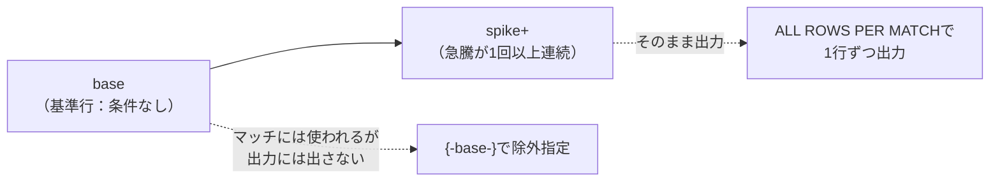
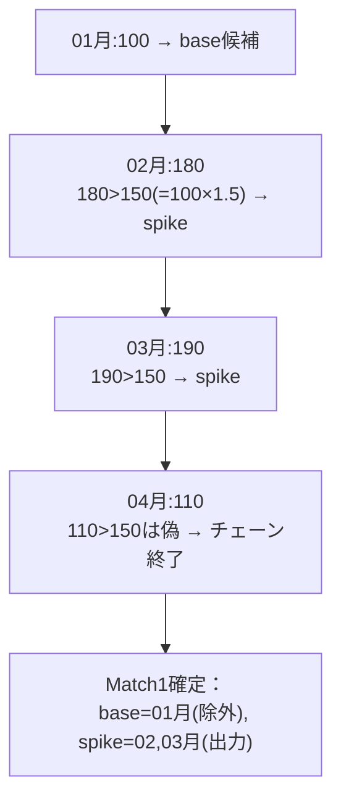

# 【完全版】問題16-17：{- -}による除外構文 ― 基準行を除いた「急騰」だけを出力する
### 難易度：★★★★☆ (Lv.4)
## 問題
以下の`MONTHLY_KPI2`（月次の売上データ）を`WITH`句で定義してください。マーケティング部門から、「ある月（基準月）と比較して、売上が1.5倍以上に急騰した月**だけ**を一覧にしたい。ただし比較の基準にした月自体は、"急騰した月"ではないのでリストには含めないでほしい」との依頼がありました。

`MATCH_RECOGNIZE`句を使用し、**ある基準月から見て売上が1.5倍以上に急騰している月が1回以上連続する期間**を検出し、出力には基準月を含めず、急騰した月**のみ**を1行ずつ表示してください。出力には、イベント番号（同一の基準月から発生した急騰の一連の塊を区別する番号）・対象月・その月の売上・比較に使った基準月の売上・基準に対する倍率を含めてください。
なお、結果はイベント番号の昇順、次いで対象月の昇順でソートしてください。

```sql
WITH monthly_kpi2 AS (
    SELECT '2026-01' AS month, 100 AS revenue FROM dual UNION ALL
    SELECT '2026-02', 180 FROM dual UNION ALL
    SELECT '2026-03', 190 FROM dual UNION ALL
    SELECT '2026-04', 110 FROM dual UNION ALL
    SELECT '2026-05', 105 FROM dual UNION ALL
    SELECT '2026-06', 95  FROM dual UNION ALL
    SELECT '2026-07', 200 FROM dual UNION ALL
    SELECT '2026-08', 210 FROM dual UNION ALL
    SELECT '2026-09', 220 FROM dual UNION ALL
    SELECT '2026-10', 100 FROM dual UNION ALL
    SELECT '2026-11', 98  FROM dual UNION ALL
    SELECT '2026-12', 97  FROM dual
)
-- ここに MATCH_RECOGNIZE を使ったSELECT文を記述してください
```

## 期待する結果
| EVENT_NO | MONTH | REVENUE | BASE_REVENUE | RATIO |
| -------- | ------- | ------- | ------------- | ---- |
| 1 | 2026-02 | 180 | 100 | 1.8 |
| 1 | 2026-03 | 190 | 100 | 1.9 |
| 2 | 2026-07 | 200 | 95 | 2.11 |
| 2 | 2026-08 | 210 | 95 | 2.21 |
| 2 | 2026-09 | 220 | 95 | 2.32 |

## 解答例
```sql
WITH monthly_kpi2 AS (
    SELECT '2026-01' AS month, 100 AS revenue FROM dual UNION ALL
    SELECT '2026-02', 180 FROM dual UNION ALL
    SELECT '2026-03', 190 FROM dual UNION ALL
    SELECT '2026-04', 110 FROM dual UNION ALL
    SELECT '2026-05', 105 FROM dual UNION ALL
    SELECT '2026-06', 95  FROM dual UNION ALL
    SELECT '2026-07', 200 FROM dual UNION ALL
    SELECT '2026-08', 210 FROM dual UNION ALL
    SELECT '2026-09', 220 FROM dual UNION ALL
    SELECT '2026-10', 100 FROM dual UNION ALL
    SELECT '2026-11', 98  FROM dual UNION ALL
    SELECT '2026-12', 97  FROM dual
)
SELECT
    event_no,
    month,
    revenue,
    base_revenue,
    ratio
FROM monthly_kpi2
    MATCH_RECOGNIZE (
        ORDER BY month
        MEASURES
            MATCH_NUMBER()                          AS event_no,
            FIRST(base.revenue)                      AS base_revenue,
            ROUND(revenue / FIRST(base.revenue), 2)  AS ratio
        ALL ROWS PER MATCH
        -- パターン：基準行(base)の後、急騰(spike)が1回以上続く
        -- {- -}で囲んだ変数は、マッチには使うが出力からは除外される
        PATTERN ( {-base-} spike+ )
        DEFINE
            spike AS revenue > 1.5 * FIRST(base.revenue)
    )
ORDER BY event_no, month
```

## 解説
今回の要件は、少し変わっています。「基準となる行の情報は判定に必要だが、最終的な出力には基準行そのものを含めたくない」という、**"裏方"の行と"表舞台"の行を分けたい**ケースです。これを実現するのが`{- -}`（波括弧＋ハイフン）による除外構文です。



### `{- -}`の役割
```sql
PATTERN ( {-base-} spike+ )
```
`{-base-}`のように変数名を波括弧＋ハイフンで囲むと、「`base`はパターンの一致判定・行の消費には使われるが、`ALL ROWS PER MATCH`で結果を出力する際には除外される」という指定になります。今回の場合、比較の基準となった月（`base`）はあくまで"物差し"として使うだけで、レポートに出したいのは「その物差しに対してどれだけ急騰したか」という`spike`側の行だけです。

これまでの問題（16-6のV字回復や16-8のプラトー検出など）では、`ONE ROW PER MATCH`でマッチ全体を1行に集約してきたため、「特定の行だけを出力から除外する」という発想自体が不要でした。今回のように`ALL ROWS PER MATCH`で**行ごとに明細を出したいが、その中の一部の行（基準行）だけは見せたくない**という場合に、初めて`{- -}`の出番が来ます。

### DEFINEで「他の変数の値」を参照する
```sql
DEFINE
    spike AS revenue > 1.5 * FIRST(base.revenue)
```
`base`には条件を定義していないため、これまでの問題の`strt`と同様、**どんな行でも`base`になり得ます**。ポイントは`spike`の条件式の中で`FIRST(base.revenue)`、つまり「`base`と分類された行（今回は1行だけ）の売上」を参照している点です。`PREV(revenue)`のように"1つ前の行"を見るのではなく、**そのマッチの中で`base`に分類された行を名指しで参照する**ことで、「マッチの先頭に固定された基準値」に対する倍率判定ができています。

### 結果を1件ずつ追う

1つ目のイベントは、01月（売上100）を基準行とし、しきい値（100×1.5＝150）を02月（180）・03月（190）が上回ったため、この2ヶ月が`spike`として連続マッチします。04月（110）はしきい値を下回るためチェーンが途切れ、マッチが確定します。この時点で`{-base-}`の指定により、01月自体は出力されず、02月・03月の2行だけが結果に現れます。

デフォルトの`AFTER MATCH SKIP TO PAST LAST ROW`により、次の探索は04月から再開されます。04月・05月はいずれも、それを基準行とした場合に十分な急騰が続く月が見当たらないため、マッチが成立しません。06月（売上95）を基準行とすると、しきい値（95×1.5＝142.5）を07月（200）・08月（210）・09月（220）が上回り続けるため、この3ヶ月が2つ目のイベントとして検出されます。10月以降は急騰が続かないため、これ以上のマッチは見つかりません。

### `MATCH_NUMBER()`でイベントを区別する
16-11・16-15で使った`MATCH_NUMBER()`が、今回も活躍します。`ALL ROWS PER MATCH`で複数行が出力される際、「どの行がどの急騰イベントに属するか」を`EVENT_NO`として明示することで、02月・03月が1つの塊、07〜09月が別の塊であることが一目で分かるようになっています。

:::message
### {- -}はどこにでも書けるわけではない
除外構文`{- -}`は、`PATTERN`内の任意の位置にある変数に付与できますが、**パターン全体をすべて除外することはできません**（最低1行は出力される必要があります）。また、除外した変数であっても`DEFINE`や`MEASURES`の中で値を参照すること自体は問題ありません（今回の`FIRST(base.revenue)`がまさにその例です）。「出力されない」ことと「マッチの判定や計算に使えない」ことはイコールではない、という点を押さえておいてください。

なお、`{- -}`は`ONE ROW PER MATCH`と組み合わせても構文エラーにはなりませんが、そもそも`ONE ROW PER MATCH`は個々の行を出力しない（1マッチ=1行に集約する）ため、除外指定の効果は実質的に意味を持ちません。`{- -}`の効果を活かせるのは、`ALL ROWS PER MATCH`で行ごとの明細を出す場面に限られます。
:::

### 実務での応用例
| 分野 | 出力から除外したい"基準行"の例 |
| :--- | :--- |
| マーケティング分析 | キャンペーン前の「平常月」を基準に、そこからの急騰月だけをレポート |
| 品質管理 | 校正・キャリブレーションを行った基準測定値を除き、そこからの逸脱データだけを一覧化 |
| 人事評価 | 異動・昇格の"起点となった評価"を除き、そこから大きく変動した評価期間だけを抽出 |

`{- -}`は使用頻度こそ高くありませんが、「判定のために必要な行と、報告したい行が一致しない」という実務上よくあるズレを、サブクエリで基準行を除外するような回りくどい書き方をせずに、`PATTERN`の中で完結して表現できる点が最大の利点です。