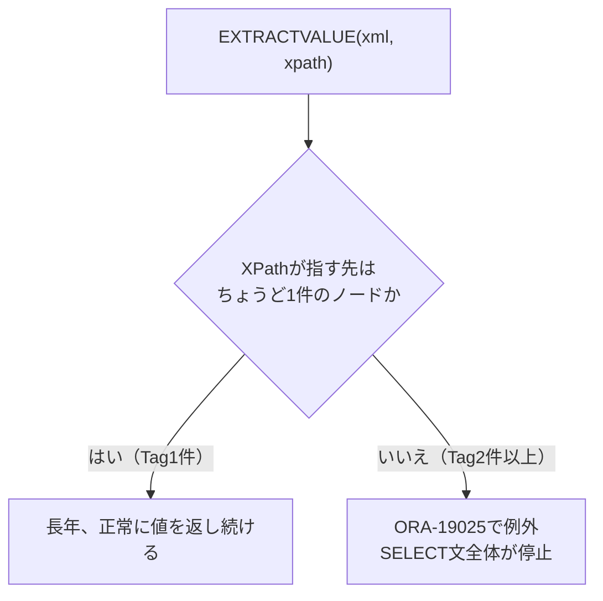

# 【完全版】問題19-9：EXTRACTVALUE（非推奨関数）の落とし穴とXMLCAST/XMLTABLEへの移行
### 難易度：★★★☆☆ (Lv.3)
## 問題
以下の`WITH`句で用意した3件の商品データ（`PRODUCT_XML`）は、レガシーシステムから引き継いだデータを想定しています。過去の担当者が書いた保守コードでは、`Brand`（ブランド名）と`Tags`配下の`Tag`（タグ）を、いずれも`EXTRACTVALUE`関数で取得していました。

このコードは長らく問題なく動作していましたが、あるとき突然エラーになったと報告がありました。原因を確認した上で、`BRAND`と、その商品に紐づく**すべての**`Tag`をカンマ区切りで連結した`TAGS`を、正しく取得できるクエリに書き直してください。

```sql:検証用データ（WITH句）
WITH products AS (
    SELECT 101 AS product_id, XMLTYPE('<Product><Brand>AURORA</Brand><Tags><Tag>Outdoor</Tag></Tags></Product>') AS product_xml FROM dual UNION ALL
    SELECT 102,               XMLTYPE('<Product><Brand>NIXEL</Brand><Tags><Tag>Kitchen</Tag><Tag>Sale</Tag></Tags></Product>') FROM dual UNION ALL
    SELECT 103,               XMLTYPE('<Product><Brand>KAPPA</Brand><Tags><Tag>Outdoor</Tag><Tag>New</Tag><Tag>Sale</Tag></Tags></Product>') FROM dual
)
-- ここから先を作成してください
```

## 期待する結果
| PRODUCT_ID | BRAND  | TAGS                    |
| ---------- | ------ | ----------------------- |
| 101        | AURORA | Outdoor                 |
| 102        | NIXEL  | Kitchen, Sale            |
| 103        | KAPPA  | New, Outdoor, Sale       |

## 解答例
```sql:失敗例：レガシーコードそのまま（EXTRACTVALUEをTagにも使用）
WITH products AS (
    SELECT 101 AS product_id, XMLTYPE('<Product><Brand>AURORA</Brand><Tags><Tag>Outdoor</Tag></Tags></Product>') AS product_xml FROM dual UNION ALL
    SELECT 102,               XMLTYPE('<Product><Brand>NIXEL</Brand><Tags><Tag>Kitchen</Tag><Tag>Sale</Tag></Tags></Product>') FROM dual UNION ALL
    SELECT 103,               XMLTYPE('<Product><Brand>KAPPA</Brand><Tags><Tag>Outdoor</Tag><Tag>New</Tag><Tag>Sale</Tag></Tags></Product>') FROM dual
)
SELECT
    product_id,
    EXTRACTVALUE(product_xml, '/Product/Brand')     AS brand,
    EXTRACTVALUE(product_xml, '/Product/Tags/Tag')  AS tag
FROM
    products
ORDER BY
    product_id
-- PRODUCT_ID=101（Tagが1件）は正常に取得できる
-- PRODUCT_ID=102・103（Tagが複数件）は ORA-19025: EXTRACTVALUE cannot extract values of multiple nodes
-- が発生し、SELECT文全体が異常終了する
```

```sql:正解例：XMLCAST+XMLQUERYとXMLTABLE＋LISTAGGへ移行
WITH products AS (
    SELECT 101 AS product_id, XMLTYPE('<Product><Brand>AURORA</Brand><Tags><Tag>Outdoor</Tag></Tags></Product>') AS product_xml FROM dual UNION ALL
    SELECT 102,               XMLTYPE('<Product><Brand>NIXEL</Brand><Tags><Tag>Kitchen</Tag><Tag>Sale</Tag></Tags></Product>') FROM dual UNION ALL
    SELECT 103,               XMLTYPE('<Product><Brand>KAPPA</Brand><Tags><Tag>Outdoor</Tag><Tag>New</Tag><Tag>Sale</Tag></Tags></Product>') FROM dual
)
SELECT
    p.product_id,
    XMLCAST(XMLQUERY('/Product/Brand/text()' PASSING p.product_xml RETURNING CONTENT) AS VARCHAR2(50)) AS brand,
    (
        SELECT LISTAGG(t.tag, ', ') WITHIN GROUP (ORDER BY t.tag)
        FROM XMLTABLE('/Product/Tags/Tag' PASSING p.product_xml COLUMNS tag VARCHAR2(50) PATH '.') t
    ) AS tags
FROM
    products p
ORDER BY
    p.product_id
```

## 解説
19-3では`XMLCAST`＋`XMLQUERY`の書き方を基礎から扱いましたが、実務で保守を任されるコードには、それ以前から存在する`EXTRACTVALUE`関数が今も数多く残っています。今回は、この非推奨関数がなぜ長年動き続け、なぜあるとき突然壊れるのかという「時限爆弾」的な性質を扱います。



失敗例の`EXTRACTVALUE(product_xml, '/Product/Tags/Tag')`は、`PRODUCT_ID = 101`のようにTagが1件しかないデータに対しては何の問題もなく動作します。`EXTRACTVALUE`は「XPathが指すノードがちょうど1件であること」を前提とした関数であり、条件を満たしている限りは正しい値を返し続けます。しかし、`PRODUCT_ID = 102`・`103`のようにタグが複数件登録された商品が現れた瞬間、同じコードが`ORA-19025`（EXTRACTVALUE cannot extract values of multiple nodes）で例外を投げます。19-3で扱った「`Review[1]`だけを見てしまい、該当データを取りこぼす」という**値が違う静かな失敗**とは異なり、`EXTRACTVALUE`は複数ノードに遭遇すると**例外を投げてクエリ自体を止める**という失敗の仕方をします。日頃「1商品につきタグは1つ」という運用が続いていたために長年気づかれず、ある日誰かが2つ目のタグを登録した瞬間に本番障害として顕在化する、という典型的なレガシーコードの罠です。

正解例では、`Brand`（常に単一の値）は19-3と同じ`XMLCAST`＋`XMLQUERY`の組み合わせに置き換え、`Tag`（件数が可変）は19-2で扱った`XMLTABLE`で行として展開したうえで、8-5で学んだ`LISTAGG`によりカンマ区切りの1つの文字列へ集約しています。`EXTRACTVALUE`という1つの関数だけでは対応できなかった「単一の値」と「可変件数の値」という2つの異なる形状を、目的に応じた関数の組み合わせで書き分けているのがポイントです。

これまでのXML関連の非推奨関数と、その後継の対応関係を整理すると以下のようになります。

| 非推奨関数 | 用途 | 後継として推奨される関数 |
| :--- | :--- | :--- |
| `EXTRACTVALUE`（今回） | 単一ノードのスカラー値取得 | `XMLTABLE`、または`XMLCAST`＋`XMLQUERY`（19-3） |
| `EXTRACT`（XML） | XML断片の取得 | `XMLQUERY`（19-3） |
| `UPDATEXML`／`APPENDCHILDXML`等（19-7） | XMLの部分更新 | XQuery Update（`transform`式、19-7） |

:::message
### 「今まで動いていた」は「これからも動く」の保証にはならない
`EXTRACTVALUE`に限らず、「入力の形状が特定のパターンに限定されることを前提にしたコード」は、そのパターンが崩れた瞬間に牙をむきます。今回のケースでは幸い`ORA-19025`という分かりやすい例外で気づけましたが、関数によっては（19-5で見た`XMLFOREST`のNULL省略のように）エラーにすらならず値だけが静かに欠落することもあります。レガシーコードのXPathを見かけたときは、「本当に常に1件しかヒットしないと言い切れるデータか」を一度疑ってみる習慣が、将来の障害を防ぎます。
:::

:::message
### 非推奨関数を無理に全廃する必要はない
`EXTRACTVALUE`は非推奨ではありますが、後方互換性のためにサポートは継続されており、今すぐ動いているコードをすべて書き換える必要はありません。実務では「新規に書くコードでは使わない」「保守で触れた箇所は気づいたタイミングで移行する」といった現実的な優先順位付けが一般的です。19-7の`transform`式向けメッセージでも触れた通り、非推奨関数は「読めて、必要な範囲だけ書き直せれば十分」というスタンスで臨むのがバランスの良い付き合い方です。
:::

## 参考リンク
https://docs.oracle.com/en/database/oracle/oracle-database/21/sqlrf/EXTRACTVALUE.html
https://docs.oracle.com/en/database/oracle/oracle-database/19/sqlrf/XMLTABLE.html