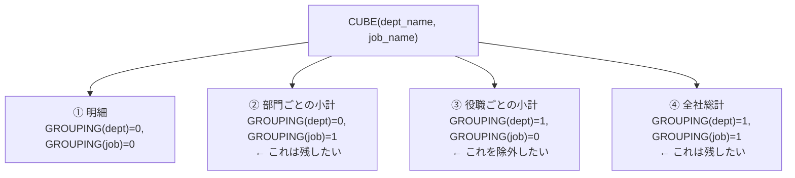
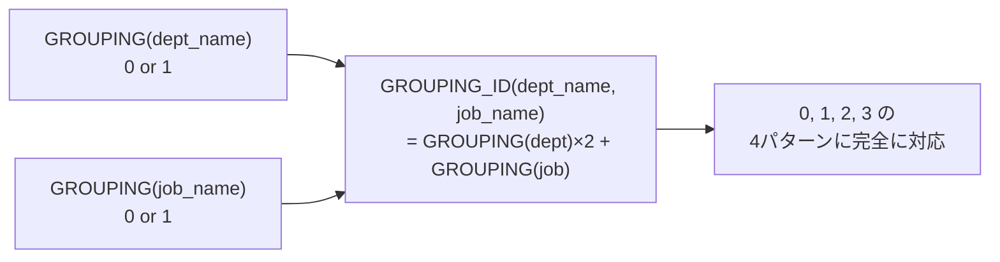
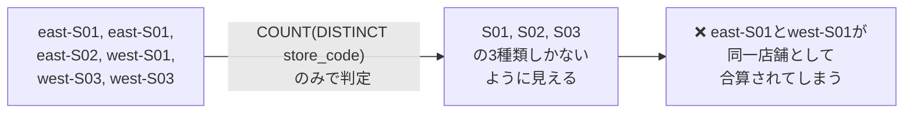
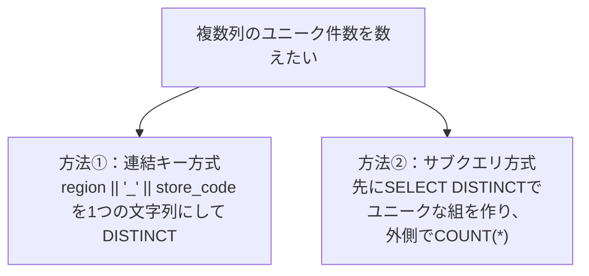
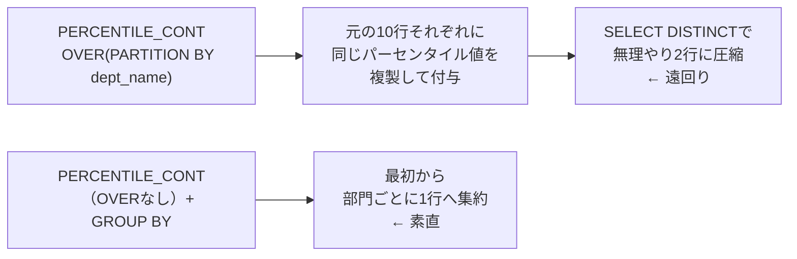
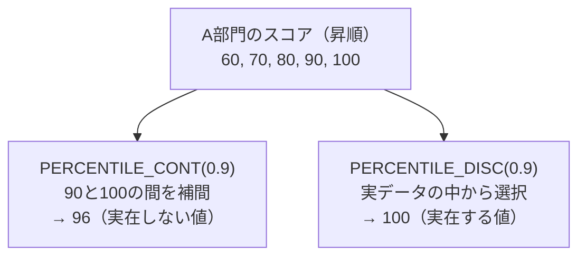
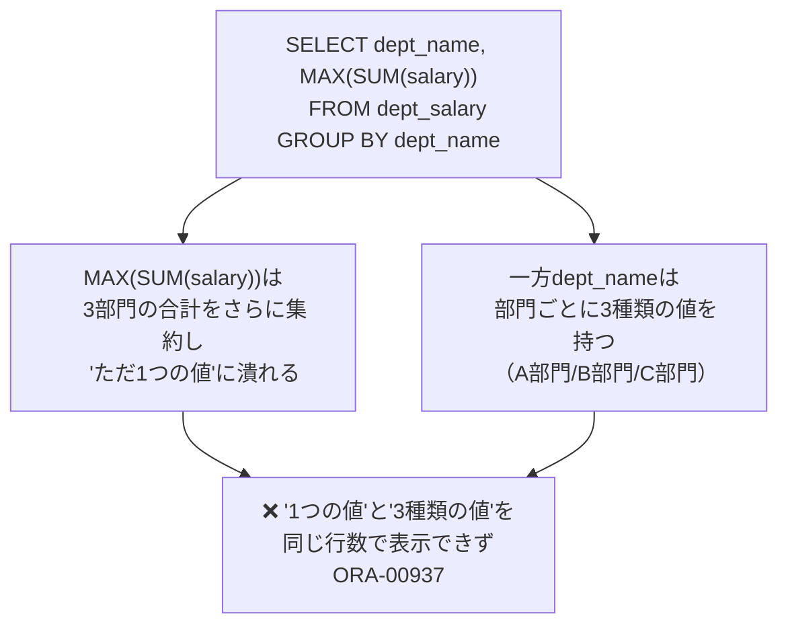
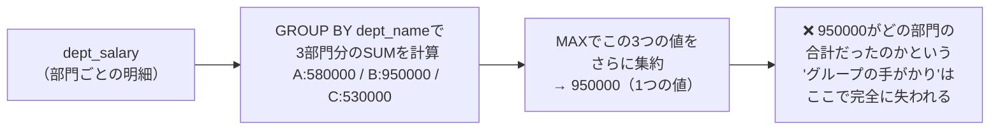
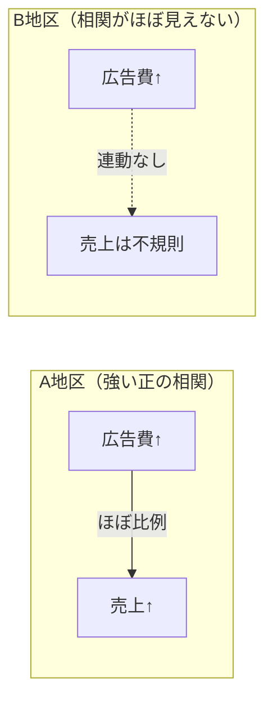
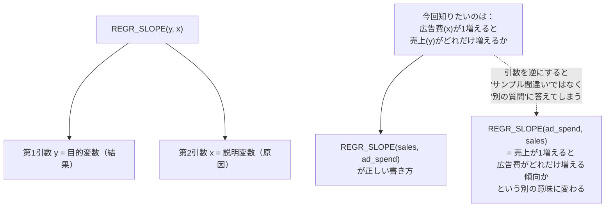

# 【完全版】問題8-13：複数列のGROUPING判定を1つにまとめる（GROUPING_ID）
### 難易度：★★★★☆ (Lv.4)
## 問題
人事部から、問題8-7で作成したような「部門×役職の給与集計レポート」について、追加の要望がありました。
`CUBE`を使うと「部門×役職の明細」「部門ごとの小計」「役職ごとの小計」「全社総計」の4パターンが生成されますが、今回のレポートでは **「役職ごとの小計」（部門を問わず、役職だけでまとめた行）だけが不要** とのことです。「部門ごとの小計」と「全社総計」はこれまで通り必要です。

再現性のため、以下の`WITH`句で部門×役職の給与データを用意します。

```sql
WITH dept_job_salary AS (
    SELECT 'A部門' AS dept_name, 'MGR'   AS job_name, 450000 AS salary FROM dual UNION ALL
    SELECT 'A部門', 'STAFF', 300000 FROM dual UNION ALL
    SELECT 'A部門', 'STAFF', 280000 FROM dual UNION ALL
    SELECT 'B部門', 'MGR',   500000 FROM dual UNION ALL
    SELECT 'B部門', 'STAFF', 350000 FROM dual UNION ALL
    SELECT 'B部門', 'STAFF', 330000 FROM dual
)
SELECT * FROM dept_job_salary
```

**【集計・出力ルール】**
* `CUBE(dept_name, job_name)`を用いて、部門×役職の明細・部門ごとの小計・役職ごとの小計・全社総計の4パターンを一度に集計すること。
* そのうち、**「役職ごとの小計」（部門がまとめられ、役職だけが残る行）だけを結果から除外**すること。
* 部門ごとの小計行の役職欄には`'部門合計'`、全社総計行の部門・役職欄には`'全社'`／`'合計'`と表示すること。
* 表示順は、明細行→部門ごとの小計→全社総計の順とし、部門名・役職名はそれぞれ昇順とすること。

## 期待する結果
| DEPT_NAME | JOB_NAME | TOTAL_SALARY |
| --------- | -------- | ------------- |
| A部門     | MGR      | 450000        |
| A部門     | STAFF    | 580000        |
| A部門     | 部門合計 | 1030000       |
| B部門     | MGR      | 500000        |
| B部門     | STAFF    | 680000        |
| B部門     | 部門合計 | 1180000       |
| 全社      | 合計     | 2210000       |

## 解答例
```sql:例1：NG例①（単一のGROUPINGだけで判定すると必要な行まで消える）
WITH dept_job_salary AS (
    SELECT 'A部門' AS dept_name, 'MGR'   AS job_name, 450000 AS salary FROM dual UNION ALL
    SELECT 'A部門', 'STAFF', 300000 FROM dual UNION ALL
    SELECT 'A部門', 'STAFF', 280000 FROM dual UNION ALL
    SELECT 'B部門', 'MGR',   500000 FROM dual UNION ALL
    SELECT 'B部門', 'STAFF', 350000 FROM dual UNION ALL
    SELECT 'B部門', 'STAFF', 330000 FROM dual
)
SELECT
    CASE WHEN GROUPING(dept_job_salary.dept_name) = 1 THEN '全社'
         ELSE dept_job_salary.dept_name END AS dept_name,
    CASE WHEN GROUPING(dept_job_salary.dept_name) = 1 THEN '合計'
         WHEN GROUPING(dept_job_salary.job_name)  = 1 THEN '部門合計'
         ELSE dept_job_salary.job_name END AS job_name,
    SUM(dept_job_salary.salary) AS total_salary
FROM
    dept_job_salary
GROUP BY
    CUBE(dept_job_salary.dept_name, dept_job_salary.job_name)
HAVING
    GROUPING(dept_job_salary.dept_name) = 0   -- 「部門が特定できる行だけ残す」つもりが…
ORDER BY
    dept_name,
    GROUPING(dept_job_salary.job_name),
    job_name
```
```sql:例2：NG例②（GROUPING_IDへの変更は正しいが、列名の衝突でORA-00979）
WITH dept_job_salary AS (
    SELECT 'A部門' AS dept_name, 'MGR'   AS job_name, 450000 AS salary FROM dual UNION ALL
    SELECT 'A部門', 'STAFF', 300000 FROM dual UNION ALL
    SELECT 'A部門', 'STAFF', 280000 FROM dual UNION ALL
    SELECT 'B部門', 'MGR',   500000 FROM dual UNION ALL
    SELECT 'B部門', 'STAFF', 350000 FROM dual UNION ALL
    SELECT 'B部門', 'STAFF', 330000 FROM dual
)
SELECT
    CASE WHEN GROUPING(dept_name) = 1 THEN '全社' ELSE dept_name END AS dept_name,  -- 出力エイリアスが元列名と衝突
    CASE WHEN GROUPING(dept_name) = 1 THEN '合計'
         WHEN GROUPING(job_name)  = 1 THEN '部門合計'
         ELSE job_name END AS job_name,
    SUM(salary) AS total_salary
FROM
    dept_job_salary
GROUP BY
    CUBE(dept_name, job_name)
HAVING
    GROUPING_ID(dept_name, job_name) <> 2
ORDER BY
    GROUPING(dept_name),
    dept_name,
    GROUPING(job_name),
    job_name
-- ORA-00979: must appear in the GROUP BY clause or be used in an aggregate function
```
```sql:例3：正解（GROUPING_ID＋CTE名での列修飾）
WITH dept_job_salary AS (
    SELECT 'A部門' AS dept_name, 'MGR'   AS job_name, 450000 AS salary FROM dual UNION ALL
    SELECT 'A部門', 'STAFF', 300000 FROM dual UNION ALL
    SELECT 'A部門', 'STAFF', 280000 FROM dual UNION ALL
    SELECT 'B部門', 'MGR',   500000 FROM dual UNION ALL
    SELECT 'B部門', 'STAFF', 350000 FROM dual UNION ALL
    SELECT 'B部門', 'STAFF', 330000 FROM dual
)
SELECT
    CASE WHEN GROUPING(dept_job_salary.dept_name) = 1 THEN '全社'
         ELSE dept_job_salary.dept_name END AS dept_name,
    CASE WHEN GROUPING(dept_job_salary.dept_name) = 1 THEN '合計'
         WHEN GROUPING(dept_job_salary.job_name)  = 1 THEN '部門合計'
         ELSE dept_job_salary.job_name END AS job_name,
    SUM(dept_job_salary.salary) AS total_salary
FROM
    dept_job_salary
GROUP BY
    CUBE(dept_job_salary.dept_name, dept_job_salary.job_name)
HAVING
    GROUPING_ID(dept_job_salary.dept_name, dept_job_salary.job_name) <> 2
ORDER BY
    GROUPING(dept_job_salary.dept_name),
    dept_name,
    GROUPING(dept_job_salary.job_name),
    job_name
```

## 解説
今回は、問題8-7で使った`GROUPING`関数の発展形である`GROUPING_ID`を扱います。`ROLLUP`や`CUBE`の結果から「特定のレベルの行だけを抜き出したい／除外したい」というのは実務で非常によくある要求ですが、対象の列が2つ以上になると、`GROUPING`を個別に組み合わせて判定するのは思いのほか間違えやすく、さらに列名の付け方ひとつでエラーにもつながる、という2段階のつまずきを見ていきます。

### つまずき①：単一のGROUPINGだけでは必要な行まで消える
`CUBE(dept_name, job_name)`が生成する4つの集計パターンと、各列の`GROUPING`の値を整理すると次のようになります。



除外したいのは③（役職ごとの小計）だけです。ここで例1（NG例①）のように「部門が特定できる行だけを残せばいいはず」と考え、`GROUPING(dept_name) = 0`という条件だけで絞り込むとどうなるでしょうか。

| 行の種類 | `GROUPING(dept_name)` | `GROUPING(dept_name) = 0`の判定 |
| :--- | :---: | :--- |
| ① 明細 | 0 | 残る（正しい） |
| ② 部門ごとの小計 | 0 | 残る（正しい） |
| ③ 役職ごとの小計 | 1 | 除外される（意図通り） |
| ④ 全社総計 | 1 | **除外されてしまう（意図しない）** |

`GROUPING(dept_name) = 1`は「役職ごとの小計」だけでなく、「全社総計」も共通して持っている性質です。dept_name単体のGROUPINGだけを見ていると、この2種類の行を区別できません。実行してもエラーは出ず、A部門・B部門それぞれの明細と部門合計、計6行がきれいに並ぶため一見成功したように見えますが、レポートに絶対必要なはずの「全社 / 合計 / 2210000」の行が静かに消えてしまっています。この抜け漏れは、行数をぱっと見ただけでは気づきにくい種類のミスです。

### つまずき②：GROUPING_IDへの修正で今度はORA-00979
この問題を解決するのが`GROUPING_ID`です。`GROUPING_ID(dept_name, job_name)`は、指定した複数列それぞれの`GROUPING`値を、まるでビットのように連結して1つの整数にまとめてくれます。



| 行の種類 | `GROUPING(dept)` | `GROUPING(job)` | `GROUPING_ID(dept, job)` |
| :--- | :---: | :---: | :---: |
| ① 明細 | 0 | 0 | **0** |
| ② 部門ごとの小計 | 0 | 1 | **1** |
| ③ 役職ごとの小計 | 1 | 0 | **2** |
| ④ 全社総計 | 1 | 1 | **3** |

考え方自体は正しく、`HAVING GROUPING_ID(dept_name, job_name) <> 2`と書けば③だけを除外できるはずです。ところが、これをそのまま例2のように実装すると、`ORA-00979`エラーに遭遇します。

```
ORA-00979: must appear in the GROUP BY clause or be used in an aggregate function
```

原因は、SELECT句で`CASE ... END AS dept_name`のように、**出力用のエイリアスを元の列名（`dept_name`）と全く同じ名前で定義している**ことです。`CUBE(dept_name, job_name)`が生成する4パターンのうち、例えば「役職ごとの小計」では`dept_name`はグループ化キーに含まれず（`GROUPING(dept_name)=1`）、`CASE`式の`ELSE dept_name`という参照が、集約前の生の列`dept_name`を指しているのか、`SELECT`句自身で定義した出力エイリアス`dept_name`を指しているのかを、Oracleが解決できなくなります。問題8-11で見た「グループ化キーに含まれない列を、集約関数で囲まずに生の列としてSELECT句に書くとORA-00979になる」という基本原理に加え、今回は出力エイリアスと元列名が同名であることが解決をさらに難しくしている、という2つの要因が重なったケースです。

### 正解：CTE名で列を修飾する
例3が最終的な正解です。`GROUPING()`・`CASE`の`ELSE`・`GROUP BY`・`HAVING`のすべての箇所で、`dept_name`／`job_name`を`dept_job_salary.dept_name`／`dept_job_salary.job_name`のように**CTE名で修飾**することで、「これはCTEの列（集約前の生データ）である」とOracleに明示し、出力エイリアスとの衝突を回避しています。

```sql
GROUPING(dept_job_salary.dept_name)   -- CTE名で修飾 → 元列であることが明確
```

一方`ORDER BY`側の`dept_name`／`job_name`（修飾なし）は、`SELECT`句で定義した出力エイリアスを指すものとしてそのまま使えます。`ORDER BY`は評価順序の中で`SELECT`より後に処理されるため、この時点ではすでに出力エイリアスが解決済みであり、あいまいさが発生しないためです。

`GROUPING`と`GROUPING_ID`、そして今回の列修飾ルールをまとめると次のようになります。

| 関数・書き方 | 何を返すか／注意点 | 主な用途 |
| :--- | :--- | :--- |
| `GROUPING(列)` | 指定した**1列**が集計でまとめられたか（0/1） | ラベル表示の出し分けに列ごとに使う |
| `GROUPING_ID(列1, 列2, ...)` | **複数列**のGROUPING値をまとめた1つの整数 | `HAVING`で「特定の集計レベルだけ」を判定・抽出する |
| 出力エイリアス＝元列名 | `ROLLUP`/`CUBE`/`GROUPING SETS`と併用時にORA-00979の原因になりうる | `テーブル名.列名`で修飾して回避する |

解答例では、ラベル表示（`'全社'`や`'部門合計'`をどう出し分けるか）には従来通り列ごとの`GROUPING`を使い、行の絞り込み（`HAVING`）には`GROUPING_ID`を使うという役割分担にしています。ラベル生成は列ごとの意味が異なるため個別の`GROUPING`が向いており、行の取捨選択は複数列を組み合わせた条件になるため`GROUPING_ID`が向いている、という使い分けだと考えると覚えやすいと思います。

期待する結果を見ると、A部門・B部門それぞれの明細2行＋部門合計1行の計6行に、全社総計1行が加わった7行になっており、除外対象である「役職だけの小計（`MGR`と`STAFF`をそれぞれ部門横断で集計した行）」の2行だけがきれいに取り除かれています。

:::message
### GROUPING_ID()とGROUP_ID()の混同に注意
名前がよく似ているため混同しやすいのですが、`GROUPING_ID()`と、問題8-11のコラムで扱った`GROUP_ID()`は全く別の目的を持つ関数です。

| 関数 | 目的 |
| :--- | :--- |
| `GROUPING_ID(列1, 列2, ...)` | 各行が「どの集計レベルに属するか」を判定する（明細か、小計か、総計か） |
| `GROUP_ID()` | `GROUPING SETS`などで同じ集計パターンが**重複生成**されていないかを判定する |

`GROUPING_ID`は「この行は何を表しているか」を教えてくれる関数、`GROUP_ID`は「この行は他の行と重複していないか」を教えてくれる関数、と覚えるとよいと思います。名前の類似性からくる取り違えは実務でも起こりがちなので、`HAVING`句にどちらを書くべきか迷ったときは、「レベルの判定なら`GROUPING_ID`、重複の検出なら`GROUP_ID`」と一度立ち止まって確認する習慣をつけておくと安心です。
:::

`ROLLUP`や`CUBE`が生成する集計結果は、そのままでは「明細・小計・総計が入り混じった1つの結果セット」になりがちです。`GROUPING_ID`を使えば、この結果セットから「経営会議には明細と部門小計だけ見せたい」「詳細レポートには全パターン含めたい」といった、用途に応じた抽出を`HAVING`句1行で柔軟に切り替えられるようになります。加えて今回のように、`ROLLUP`/`CUBE`/`GROUPING SETS`と組み合わせるSELECT文では、出力エイリアスに元の列名をそのまま使わない（あるいは使う場合はテーブル・CTE名で列を修飾する）という習慣が、地味ながらエラー回避に効いてくる点も併せて覚えておくとよいと思います。

## 参考リンク
https://www.shift-the-oracle.com/sql/group-by-having.html


---
<br><br>

# 問題8-14：複数列にまたがるユニーク件数のカウント（COUNT(DISTINCT 複数列)の制約と回避策）
### 難易度：★★☆☆☆ (Lv.2)
## 問題
マーケティング部から、キャンペーンサイトへのアクセスログを分析してほしいと依頼がありました。
店舗コード（`STORE_CODE`）は**地域（`REGION`）ごとに独立して採番**されており、同じ店舗コードでも地域が違えば全くの別店舗を指します（例：`east`の`S01`と`west`の`S01`は別の店舗）。
このアクセスログから、実際にアクセスが発生した **「地域×店舗コード」のユニークな組み合わせ数** を知りたいとのことです。

再現性のため、以下の`WITH`句でアクセスログを用意します。

```sql
WITH access_log AS (
    SELECT 'east' AS region, 'S01' AS store_code FROM dual UNION ALL
    SELECT 'east', 'S01' FROM dual UNION ALL
    SELECT 'east', 'S02' FROM dual UNION ALL
    SELECT 'west', 'S01' FROM dual UNION ALL
    SELECT 'west', 'S03' FROM dual UNION ALL
    SELECT 'west', 'S03' FROM dual
)
SELECT * FROM access_log
```

**【取得項目】**
* **UNIQUE_STORE_CNT**：`REGION`と`STORE_CODE`の組み合わせで見たときの、ユニークな店舗数

## 期待する結果
| UNIQUE_STORE_CNT |
| ----------------- |
| 4                  |

## 解答例
```sql:例1：NG例①（列を1つだけDISTINCTすると静かに集計が誤る）
WITH access_log AS (
    SELECT 'east' AS region, 'S01' AS store_code FROM dual UNION ALL
    SELECT 'east', 'S01' FROM dual UNION ALL
    SELECT 'east', 'S02' FROM dual UNION ALL
    SELECT 'west', 'S01' FROM dual UNION ALL
    SELECT 'west', 'S03' FROM dual UNION ALL
    SELECT 'west', 'S03' FROM dual
)
SELECT
    COUNT(DISTINCT store_code) AS unique_store_cnt  -- regionを無視しているため過小カウント
FROM
    access_log
```
```sql:例2：NG例②（複数列をそのままDISTINCTに渡すと構文エラー）
WITH access_log AS (
    SELECT 'east' AS region, 'S01' AS store_code FROM dual UNION ALL
    SELECT 'east', 'S01' FROM dual UNION ALL
    SELECT 'east', 'S02' FROM dual UNION ALL
    SELECT 'west', 'S01' FROM dual UNION ALL
    SELECT 'west', 'S03' FROM dual UNION ALL
    SELECT 'west', 'S03' FROM dual
)
SELECT
    COUNT(DISTINCT region, store_code) AS unique_store_cnt
FROM
    access_log
-- ORA-00909: invalid number of arguments
```
```sql:例3：正解①（連結キー方式）
WITH access_log AS (
    SELECT 'east' AS region, 'S01' AS store_code FROM dual UNION ALL
    SELECT 'east', 'S01' FROM dual UNION ALL
    SELECT 'east', 'S02' FROM dual UNION ALL
    SELECT 'west', 'S01' FROM dual UNION ALL
    SELECT 'west', 'S03' FROM dual UNION ALL
    SELECT 'west', 'S03' FROM dual
)
SELECT
    COUNT(DISTINCT region || '_' || store_code) AS unique_store_cnt
FROM
    access_log
```
```sql:例4：正解②（サブクエリ方式）
WITH access_log AS (
    SELECT 'east' AS region, 'S01' AS store_code FROM dual UNION ALL
    SELECT 'east', 'S01' FROM dual UNION ALL
    SELECT 'east', 'S02' FROM dual UNION ALL
    SELECT 'west', 'S01' FROM dual UNION ALL
    SELECT 'west', 'S03' FROM dual UNION ALL
    SELECT 'west', 'S03' FROM dual
)
SELECT
    COUNT(*) AS unique_store_cnt
FROM
    ( SELECT DISTINCT region, store_code FROM access_log )
```

## 解説
今回のテーマは、地味ながら実務で頻繁に踏み抜く「複数列にまたがるユニーク件数のカウント」です。単一列であれば`COUNT(DISTINCT 列)`で一発ですが、「2つ以上の列の組み合わせでユニークかどうかを判定したい」場合、Oracleには少し癖のある制約があります。

まず例1（NG例①）です。「店舗のユニーク数が知りたいのだから`store_code`だけをDISTINCTすればよい」と考えるのは自然な発想ですが、これは`region`という軸を無視してしまっています。



`store_code`の値だけを見ると`S01`, `S02`, `S03`の3種類しかなく、`COUNT(DISTINCT store_code)`は`3`を返します。しかし実際には`east`の`S01`と`west`の`S01`は別店舗であるため、正しい答えは`4`のはずです。エラーは出ず、`3`という一見もっともらしい数字が返ってくるため、`region`をまたいで店舗コードが重複しているという前提条件を知らないと、この誤りに気づくのは難しいでしょう。

これに気づいて「では2つの列を両方DISTINCTに渡せばよいのでは」と書き直したのが例2（NG例②）ですが、今度は実行した瞬間にエラーになります。

```
ORA-00909: invalid number of arguments
```

Oracleの`COUNT`関数は、`DISTINCT`キーワードの後ろに**単一の式**しか受け付けない仕様になっています。多くの人が「複数列をカンマ区切りで渡せばまとめてDISTINCT判定してくれるはず」と直感的に考えてしまいますが、Oracleではこの書き方はサポートされておらず、構文エラーとして弾かれます。

| 書き方 | 結果 |
| :--- | :--- |
| `COUNT(DISTINCT store_code)` | 実行できるが、regionを無視した誤った集計になる |
| `COUNT(DISTINCT region, store_code)` | `ORA-00909`で実行不可 |

そこで登場するのが、例3・例4の2つの回避策です。



例3の連結キー方式は、`region || '_' || store_code`のように区切り文字を挟んで2つの列を1つの文字列に合成し、その合成後の文字列を`COUNT(DISTINCT ...)`に渡す方法です。`'east' || '_' || 'S01'`は`'east_S01'`という1つの値になるため、これなら単一の式として`DISTINCT`に渡せます。

例4のサブクエリ方式は、内側の`SELECT DISTINCT region, store_code`で先に「ユニークな組み合わせの一覧」を作り、それを外側で`COUNT(*)`するという2段階の方法です。`DISTINCT`は複数列に対して素直に使える一方、`COUNT(DISTINCT 複数列)`という書き方だけが許されていない、というOracleの制約を踏まえた、ある意味で最も直感的な回避策です。

| 方式 | 書き方の特徴 | メリット・デメリット |
| :--- | :--- | :--- |
| 連結キー方式 | 1行のシンプルな記述で完結 | 区切り文字の選び方次第で、異なる値が偶然同じ文字列に合成されてしまうリスクがある |
| サブクエリ方式 | 内側でDISTINCT、外側でCOUNT | ロジックが直感的で読みやすいが、記述はやや長くなる |

期待する結果を見ると、`east-S01`（2件のアクセスがあるが1店舗として数える）、`east-S02`、`west-S01`（`east`の`S01`とは別店舗）、`west-S03`（2件のアクセスがあるが1店舗として数える）の、合計4つのユニークな組み合わせが正しくカウントされています。

:::message
### 連結キー方式の落とし穴：区切り文字の衝突とNULLの伝播
連結キー方式（`region || '_' || store_code`）は手軽ですが、2つの注意点があります。

1つ目は、**区切り文字の選び方によっては、本来別の値であるはずの組み合わせが偶然同じ文字列に合成されてしまう**リスクです。例えば区切り文字を使わずに単純連結（`region || store_code`）した場合、`region='AB', store_code='C'`と`region='A', store_code='BC'`は、どちらも`'ABC'`という同じ文字列になってしまい、別々の組み合わせとして数えられるべきものが1つに潰れてしまいます。区切り文字には、実データに絶対含まれないと確信できる文字（`'_'`や`'|'`、あるいは`CHR(1)`のような制御文字）を選ぶ必要があります。

2つ目は、**列にNULLが含まれる場合の挙動**です。Oracleの文字列連結演算子`||`は、連結対象のどれか1つでもNULLだと、結果全体がNULLになる...と思われがちですが、実際には`||`はNULLを空文字列として扱うため、他がNULLでなければ結果はNULLになりません。ただし`store_code`が完全にNULLの行がある場合、`COUNT(DISTINCT ...)`はNULLを結果から除外する仕様のため、「region×store_codeの組み合わせとしては存在するが、store_codeが未設定の行」がカウントから漏れる可能性があります。今回のデータのようにNULLが存在しない場合は問題になりませんが、実データを扱う際は、対象列にNULLが含まれていないかを事前に確認しておくと安心です。
:::

`COUNT(DISTINCT 複数列)`が直接書けないというOracleの制約は、知らないと必ず一度は`ORA-00909`にぶつかる典型的なポイントです。「ユニークなユーザー×商品の組み合わせ数」「ユニークな年月×担当者の組み合わせ数」など、複数の軸を組み合わせたユニーク件数を数えたくなる場面は実務で頻出するため、連結キー方式とサブクエリ方式の2つを引き出しとして持っておくと、いざというときに迷わず対応できます。

---
<br><br>

# 【完全版】問題8-15：集約関数としてのパーセンタイル値算出（PERCENTILE_CONT / PERCENTILE_DISC）
### 難易度：★★★★☆ (Lv.4)
## 問題
研修担当部門から、新人研修の理解度テストについて分析依頼がありました。
問題8-9では「中央値（50パーセンタイル）」を`MEDIAN`関数で算出しましたが、今回はさらに踏み込み、「下位25%の受講者はどのラインにいるか（25パーセンタイル）」「上位10%の優秀層はどのラインからか（90パーセンタイル）」も併せて把握したいとのことです。
部門（`DEPT_NAME`）ごとにグループ化し、テストスコア（`SCORE`）の25・50・90パーセンタイル値を算出してください。

再現性のため、以下の`WITH`句でテストスコアを用意します。

```sql
WITH test_scores AS (
    SELECT 'A部門' AS dept_name, 60  AS score FROM dual UNION ALL
    SELECT 'A部門', 70  FROM dual UNION ALL
    SELECT 'A部門', 80  FROM dual UNION ALL
    SELECT 'A部門', 90  FROM dual UNION ALL
    SELECT 'A部門', 100 FROM dual UNION ALL
    SELECT 'B部門', 10  FROM dual UNION ALL
    SELECT 'B部門', 50  FROM dual UNION ALL
    SELECT 'B部門', 60  FROM dual UNION ALL
    SELECT 'B部門', 70  FROM dual UNION ALL
    SELECT 'B部門', 100 FROM dual
)
SELECT * FROM test_scores
```

**【取得項目】**
1. **DEPT_NAME**：部門名
2. **P25**：25パーセンタイル値（線形補間、`PERCENTILE_CONT`）
3. **P50**：50パーセンタイル値＝中央値（線形補間、`PERCENTILE_CONT`）
4. **P90_CONT**：90パーセンタイル値（線形補間、`PERCENTILE_CONT`）
5. **P90_DISC**：90パーセンタイル値（実データの値、`PERCENTILE_DISC`）

**【条件】**
* 部門ごとに**1行**で集計結果を出力すること。
* 結果は`DEPT_NAME`の昇順で表示すること。

## 期待する結果
| DEPT_NAME | P25 | P50 | P90_CONT | P90_DISC |
| --------- | --- | --- | -------- | -------- |
| A部門     | 70  | 80  | 96       | 100      |
| B部門     | 50  | 60  | 88       | 100      |

## 解答例
```sql:例1：NG例（分析関数（OVER句）として書くと1行に集約されない）
WITH test_scores AS (
    SELECT 'A部門' AS dept_name, 60  AS score FROM dual UNION ALL
    SELECT 'A部門', 70  FROM dual UNION ALL
    SELECT 'A部門', 80  FROM dual UNION ALL
    SELECT 'A部門', 90  FROM dual UNION ALL
    SELECT 'A部門', 100 FROM dual UNION ALL
    SELECT 'B部門', 10  FROM dual UNION ALL
    SELECT 'B部門', 50  FROM dual UNION ALL
    SELECT 'B部門', 60  FROM dual UNION ALL
    SELECT 'B部門', 70  FROM dual UNION ALL
    SELECT 'B部門', 100 FROM dual
)
SELECT DISTINCT
    dept_name,
    PERCENTILE_CONT(0.25) WITHIN GROUP (ORDER BY score) OVER (PARTITION BY dept_name) AS p25,
    PERCENTILE_CONT(0.5)  WITHIN GROUP (ORDER BY score) OVER (PARTITION BY dept_name) AS p50,
    PERCENTILE_CONT(0.9)  WITHIN GROUP (ORDER BY score) OVER (PARTITION BY dept_name) AS p90_cont
FROM
    test_scores
ORDER BY
    dept_name
```
```sql:例2：正解（集約関数として使用、GROUP BYで1部門1行に集約）
WITH test_scores AS (
    SELECT 'A部門' AS dept_name, 60  AS score FROM dual UNION ALL
    SELECT 'A部門', 70  FROM dual UNION ALL
    SELECT 'A部門', 80  FROM dual UNION ALL
    SELECT 'A部門', 90  FROM dual UNION ALL
    SELECT 'A部門', 100 FROM dual UNION ALL
    SELECT 'B部門', 10  FROM dual UNION ALL
    SELECT 'B部門', 50  FROM dual UNION ALL
    SELECT 'B部門', 60  FROM dual UNION ALL
    SELECT 'B部門', 70  FROM dual UNION ALL
    SELECT 'B部門', 100 FROM dual
)
SELECT
    dept_name,
    PERCENTILE_CONT(0.25) WITHIN GROUP (ORDER BY score) AS p25,
    PERCENTILE_CONT(0.5)  WITHIN GROUP (ORDER BY score) AS p50,
    PERCENTILE_CONT(0.9)  WITHIN GROUP (ORDER BY score) AS p90_cont,
    PERCENTILE_DISC(0.9)  WITHIN GROUP (ORDER BY score) AS p90_disc
FROM
    test_scores
GROUP BY
    dept_name
ORDER BY
    dept_name
```

## 解説
`PERCENTILE_CONT`は、この後の第12章（分析関数）で`OVER`句を付けた「分析関数」としての使い方が登場しますが、実は`OVER`句を外し、`GROUP BY`と組み合わせる「集約関数」としての使い方もあります。今回はこちらの集約関数版を先に扱います。同じ関数名なのに`OVER`の有無だけで挙動がまったく変わる、という点が今回のテーマです。

まず両者の違いを整理しておきましょう。

| 使い方 | 記法 | 行数の変化 |
| :--- | :--- | :--- |
| 集約関数（今回） | `PERCENTILE_CONT(p) WITHIN GROUP (ORDER BY 列)`（`OVER`なし） | `GROUP BY`の単位に集約される（1グループ1行） |
| 分析関数（第12章で後述） | `PERCENTILE_CONT(p) WITHIN GROUP (ORDER BY 列) OVER (PARTITION BY ...)` | 元の行数のまま（各行にパーセンタイル値が付与される） |

例1（NG例）は、`OVER (PARTITION BY dept_name)`を付けたまま`GROUP BY`せずに実行したものです。実行してもエラーにはならず、`SELECT DISTINCT`で重複を消して部門ごとに1行にまとめれば、結果の見た目自体は正解と同じ数値が並びます。しかしこれは「10行の元データそれぞれに同じパーセンタイル値を付与し、あとから`DISTINCT`で無理やり1行に潰している」という遠回りな挙動であり、`GROUP BY`を使わずに済ませようとした結果、パフォーマンス面でも本来不要な計算（10行分の窓関数評価）が発生しています。値そのものは合っていても、「集約すべき場面で分析関数の書き方を使ってしまっている」という設計の誤りが隠れている、という意味で学びのあるNG例です。



例2（正解）のように`OVER`句を外すと、`PERCENTILE_CONT`は`SUM`や`AVG`と同じ「集約関数」として振る舞い、`GROUP BY dept_name`によって最初から部門ごとに1行へ集約されます。`WITHIN GROUP (ORDER BY score)`は、問題8-5の`LISTAGG`でも登場した書き方で、「集約する前に、どの順序でデータを並べるか」を指定する役割を持っています。

続いて、`PERCENTILE_CONT`と`PERCENTILE_DISC`の違いを見てみましょう。

| 関数 | 算出方法 | 特徴 |
| :--- | :--- | :--- |
| `PERCENTILE_CONT` | 連続分布を仮定し、必要に応じて前後の値を**線形補間**する | 実データに存在しない値（例：96）が返ることがある |
| `PERCENTILE_DISC` | 離散分布として扱い、条件を満たす**実データの値をそのまま**返す | 必ず実在する値が返る |

A部門のスコア（`60, 70, 80, 90, 100`）に対する90パーセンタイルを見ると、`PERCENTILE_CONT(0.9)`は`96`という、実際には誰も取っていないスコアを返しています。これは「90番目の順位にちょうど位置する値」を、隣接する`90`と`100`の間で線形補間して求めているためです。一方`PERCENTILE_DISC(0.9)`は、補間を行わず「累積分布が90%以上になる最初の実データ」である`100`をそのまま返します。



`P25`や`P50`ではたまたま`CONT`と`DISC`が同じ値になっていますが、これはデータの並びと分位点の位置関係による偶然です。今回の`P90`のように、パーセンタイルの位置がデータの区切りとちょうど合わないと、2つの関数の結果ははっきりと分かれます。「集計値を実データと突き合わせて検証したい」「実在する従業員・受講者を代表として選びたい」という要件では`PERCENTILE_DISC`が、「理論値としての分布の位置を厳密に知りたい」という要件では`PERCENTILE_CONT`が向いています。

期待する結果を見ると、A部門はスコアが`60〜100`の範囲に比較的均等に分布しているのに対し、B部門は`10`という極端に低いスコアを含みつつ大半が`50〜70`に集中している、という分布の違いが、`P25`（A:70 / B:50）の差からも読み取れます。単純な平均値だけでは見えてこない「下位層・上位層それぞれの実態」を、パーセンタイルを使うことで可視化できるのが、この関数の強みです。

:::message
### 集約関数版と分析関数版、どちらを使うべきか
`PERCENTILE_CONT`には、今回扱った**集約関数版**（`OVER`なし）と、この後の第12章で登場する**分析関数版**（`OVER`あり）の2種類があります。使い分けは、次のように考えるとよいと思います。

* **グループごとの代表値・要約値だけが欲しい**（例：「部門ごとの90パーセンタイル値の一覧表」を作りたい）→ 集約関数版（`OVER`なし、今回のケース）
* **各行の情報を保持したまま、その行が全体の中でどの位置にあるかを付記したい**（例：「この従業員の給与は、部門の90パーセンタイルに対してどうか」を明細行ごとに表示したい）→ 分析関数版（`OVER`あり、第12章で扱う内容）

同じ関数名・同じ`WITHIN GROUP`構文を共有しているため混同しやすいですが、「明細を残すか、集約するか」という目的の違いで自然と使い分けられるようになります。もし`GROUP BY`を書いているのに`OVER`句も一緒に残してしまうと、Oracleは「集約関数の中に分析関数を含めることはできない」という趣旨のエラー（`ORA-00979`や`ORA-30483`など、状況により異なる）を返すことがあるため、`GROUP BY`を使う場面では`OVER`句を書かない、という点は意識しておくとよいと思います。
:::

問題8-9で学んだ`MEDIAN`は、実は`PERCENTILE_CONT(0.5) WITHIN GROUP (ORDER BY 列)`の糖衣構文（シンタックスシュガー）であり、内部的には同じ計算をしています。`MEDIAN`は50パーセンタイル固定である一方、`PERCENTILE_CONT`／`PERCENTILE_DISC`は任意のパーセンタイル（0〜1の間の値）を指定できる汎用版だと理解しておくと、2つの問題のつながりが見えやすくなります。

---
<br><br>

# 【完全版】問題8-16：集計結果に対するさらなる集計とネスト構造（MAX(SUM(...)) と2段階集計）
### 難易度：★★★★☆ (Lv.4)
## 問題
人事部から、「部門ごとの給与合計を比較したときに、**合計額が最も高い部門はどこで、その金額はいくらか**」を知りたいという依頼がありました。

再現性のため、以下の`WITH`句で部門別の給与データを用意します。

```sql
WITH dept_salary AS (
    SELECT 'A部門' AS dept_name, 300000 AS salary FROM dual UNION ALL
    SELECT 'A部門', 280000 FROM dual UNION ALL
    SELECT 'B部門', 500000 FROM dual UNION ALL
    SELECT 'B部門', 450000 FROM dual UNION ALL
    SELECT 'C部門', 200000 FROM dual UNION ALL
    SELECT 'C部門', 150000 FROM dual UNION ALL
    SELECT 'C部門', 180000 FROM dual
)
SELECT * FROM dept_salary
```

**【取得項目】**
1. **DEPT_NAME**：給与合計が最も高い部門の部門名
2. **TOTAL_SALARY**：その部門の給与合計額

## 期待する結果
| DEPT_NAME | TOTAL_SALARY |
| --------- | ------------- |
| B部門     | 950000        |

## 解答例
```sql:例1：NG例①（部門名を直接SELECTするとORA-00937）
WITH dept_salary AS (
    SELECT 'A部門' AS dept_name, 300000 AS salary FROM dual UNION ALL
    SELECT 'A部門', 280000 FROM dual UNION ALL
    SELECT 'B部門', 500000 FROM dual UNION ALL
    SELECT 'B部門', 450000 FROM dual UNION ALL
    SELECT 'C部門', 200000 FROM dual UNION ALL
    SELECT 'C部門', 150000 FROM dual UNION ALL
    SELECT 'C部門', 180000 FROM dual
)
SELECT
    dept_name,
    MAX(SUM(salary)) AS total_salary
FROM
    dept_salary
GROUP BY
    dept_name
-- ORA-00937: not a single-group group function
```
```sql:例2：NG例②（ネスト自体は動くが、部門名が失われる）
WITH dept_salary AS (
    SELECT 'A部門' AS dept_name, 300000 AS salary FROM dual UNION ALL
    SELECT 'A部門', 280000 FROM dual UNION ALL
    SELECT 'B部門', 500000 FROM dual UNION ALL
    SELECT 'B部門', 450000 FROM dual UNION ALL
    SELECT 'C部門', 200000 FROM dual UNION ALL
    SELECT 'C部門', 150000 FROM dual UNION ALL
    SELECT 'C部門', 180000 FROM dual
)
SELECT
    MAX(SUM(salary)) AS total_salary   -- 金額は正しいが、どの部門かは分からない
FROM
    dept_salary
GROUP BY
    dept_name
```
```sql:例3：正解（CTEで2段階に分けて集計）
WITH dept_salary AS (
    SELECT 'A部門' AS dept_name, 300000 AS salary FROM dual UNION ALL
    SELECT 'A部門', 280000 FROM dual UNION ALL
    SELECT 'B部門', 500000 FROM dual UNION ALL
    SELECT 'B部門', 450000 FROM dual UNION ALL
    SELECT 'C部門', 200000 FROM dual UNION ALL
    SELECT 'C部門', 150000 FROM dual UNION ALL
    SELECT 'C部門', 180000 FROM dual
),
dept_totals AS (
    SELECT
        dept_name,
        SUM(salary) AS total_salary
    FROM
        dept_salary
    GROUP BY
        dept_name
)
SELECT
    dept_name,
    total_salary
FROM
    dept_totals
WHERE
    total_salary = ( SELECT MAX(total_salary) FROM dept_totals )
```

## 解説
今回は、これまで学んできた個々の集計関数の使い方から一歩進み、「**集計した結果を、さらに集計する**」という構造そのものを扱います。「部門ごとの合計のうち最大のものを知りたい」というのは、まさに`SUM`（1段階目：部門ごとの合計）と`MAX`（2段階目：部門間での最大）を組み合わせた**2段階の集計**です。

まず例1（NG例①）のように、素直に`SELECT dept_name, MAX(SUM(salary))`と書いてしまうと、`ORA-00937: not a single-group group function`というエラーに遭遇します。



`MAX(SUM(salary))`は、「まず`GROUP BY dept_name`で部門ごとの給与合計を求め、その3つの合計値に対してさらに`MAX`を適用する」という2段階の計算を行い、最終的に**テーブル全体でただ1つの値**に集約されます。一方`dept_name`は、`GROUP BY`句に含まれてはいるものの、この2段階集計の中では「3部門分の異なる値」を持ったままです。「1行にまとまるべき値」と「3行に分かれるべき値」を同じSELECT文の中に混在させることはできないため、Oracleはこれをエラーとして弾きます。

これを見て「では`dept_name`を消せばよいのでは」と修正したのが例2（NG例②）です。

```sql
SELECT MAX(SUM(salary)) AS total_salary FROM dept_salary GROUP BY dept_name
```

これは実際にエラーなく実行でき、`950000`という正しい金額が返ってきます。Oracleでは、`GROUP BY`句を伴っていれば集計関数を2段階までネストできる、という仕様が正式にサポートされているためです（`GROUP BY`なしで`SELECT MAX(SUM(salary)) FROM dept_salary`のように書いた場合は、今度は`ORA-00978: nested group function without GROUP BY`となり、ネストする際は必ず`GROUP BY`が必要になります）。

しかし、この例2には見過ごしやすい重大な欠陥があります。**「どの部門が950000円だったのか」という、依頼の核心部分の情報が失われている**のです。



`MAX(SUM(salary))`のようなネストされた集計関数は、「値そのもの」は正しく計算してくれますが、その値が「どのグループに由来するものか」という情報までは保持してくれません。これは構文エラーではなく、実行結果として`950000`という一見それらしい数値が返ってくるため、依頼内容を読み返さない限り「部門名が抜けている」という不備に気づきにくい、静かな失敗のパターンです。

この問題を解決するのが例3（正解）です。`dept_totals`というCTEで、まず`GROUP BY dept_name`による1段階目の集計（部門ごとの合計）を独立した結果セットとして確定させます。その上で、外側のクエリで`WHERE total_salary = (SELECT MAX(total_salary) FROM dept_totals)`という条件を使い、「1段階目の集計結果の中から、最大値と一致する行」を`dept_name`付きで絞り込みます。

| アプローチ | 部門名の取得 | 実行できるか |
| :--- | :--- | :---: |
| `SELECT dept_name, MAX(SUM(salary)) ... GROUP BY dept_name` | ― | ❌ ORA-00937 |
| `SELECT MAX(SUM(salary)) ... GROUP BY dept_name` | 不可（値のみ） | ✅ ただし要件を満たさない |
| CTE + `WHERE total = (SELECT MAX(total) FROM ...)` | 可能 | ✅ 正解 |

`SUM`と`MAX`という2つの集計を「1つの`SELECT`文の中でネストさせて一気に片付けよう」とするのではなく、「部門ごとの合計を求める段階」と「その中から最大を選ぶ段階」を、CTEと`WHERE`句によって**明確に2つの工程に分離する**のが、実務でも見通しの良い書き方です。

期待する結果を見ると、A部門（580000）・B部門（950000）・C部門（530000）のうち、最も合計額が高いB部門の部門名と金額の両方が、過不足なく1行で得られています。

:::message
### 同率首位が複数ある場合の挙動
今回の正解の書き方（`WHERE total_salary = (SELECT MAX(total_salary) FROM dept_totals)`）は、**もし複数の部門がまったく同じ最大合計額を記録していた場合、該当するすべての部門を返します**。「最大の部門を1つだけ知りたい」という要件であれば、これは意図しない複数行の出力になる可能性があるため、`FETCH FIRST 1 ROWS ONLY`（問題4章などで扱った行数制限構文）を`ORDER BY total_salary DESC`と組み合わせて1行に絞る、という選択肢も検討する価値があります。

なお、これから学ぶ第12章の分析関数を使うと、`RANK() OVER (ORDER BY total_salary DESC)`のような書き方で、「同率首位も含めてすべて拾いたいのか」「1件だけに絞りたいのか」をより柔軟に制御できる代替手法があります。今回のようにサブクエリで十分手に負える場面もあれば、分析関数の方が素直に書ける場面もあるため、両方の引き出しを持っておくとよいと思います。
:::

`SUM`と`MAX`の組み合わせに限らず、「グループごとの集計値の中から、条件に合う代表グループを特定したい」という要求は、売上ランキングや在庫分析など実務で非常によく登場します。「集計関数はネストできるが、ネストした瞬間にグループの手がかりを失う」という性質を理解しておくことは、`ROLLUP`／`CUBE`／`GROUPING SETS`（問題8-7, 8-10, 8-11）で学んだ「集計とラベルの対応関係を保つ」という関心事とも通じる、集計関数全体を貫く重要な視点です。

---
<br><br>

# 【完全版】問題8-17：2変数間の関係性を測る（CORR / COVAR_POP / REGR_SLOPE）
### 難易度：★★★★☆ (Lv.4)
## 問題
マーケティング部から、広告費と売上の関係性を地域別に分析してほしいと依頼がありました。
「広告費を増やせば増やすほど、売上も比例して伸びる地域」と「広告費を増やしても、あまり売上に影響が出ていなさそうな地域」があるのではないか、という仮説を、感覚ではなく数値で裏付けたいとのことです。

再現性のため、以下の`WITH`句で地域別の月次データ（広告費・売上）を用意します。

```sql
WITH ad_sales AS (
    SELECT 'A地区' AS region, 100 AS ad_spend, 1000 AS sales FROM dual UNION ALL
    SELECT 'A地区', 150, 1400 FROM dual UNION ALL
    SELECT 'A地区', 200, 2100 FROM dual UNION ALL
    SELECT 'A地区', 250, 2500 FROM dual UNION ALL
    SELECT 'A地区', 300, 3000 FROM dual UNION ALL
    SELECT 'B地区', 100, 1800 FROM dual UNION ALL
    SELECT 'B地区', 150, 1200 FROM dual UNION ALL
    SELECT 'B地区', 200, 2000 FROM dual UNION ALL
    SELECT 'B地区', 250, 1300 FROM dual UNION ALL
    SELECT 'B地区', 300, 1900 FROM dual
)
SELECT * FROM ad_sales
```

**【取得項目】**
1. **REGION**：地区名
2. **CORR_AD_SALES**：広告費と売上の相関係数（小数点第4位まで四捨五入）
3. **COVAR_POP_AD_SALES**：広告費と売上の母共分散（小数点第2位まで四捨五入）
4. **REGR_SLOPE**：広告費を説明変数、売上を目的変数とした回帰直線の傾き（小数点第2位まで四捨五入）

**【条件】**
* 地区ごとにグループ化すること。
* 結果は`REGION`の昇順で表示すること。

## 期待する結果
| REGION | CORR_AD_SALES | COVAR_POP_AD_SALES | REGR_SLOPE | 
| ------ | ------------- | ------------------ | ---------- | 
| A地区  | 0.9964        | 51000              | 10.2       | 
| B地区  | 0.1301        | 3000               | 0.6        | 

## 解答例
```sql:例1：NG例①（COVAR_SAMPを使うと母集団前提の値と一致しない）
WITH ad_sales AS (
    SELECT 'A地区' AS region, 100 AS ad_spend, 1000 AS sales FROM dual UNION ALL
    SELECT 'A地区', 150, 1400 FROM dual UNION ALL
    SELECT 'A地区', 200, 2100 FROM dual UNION ALL
    SELECT 'A地区', 250, 2500 FROM dual UNION ALL
    SELECT 'A地区', 300, 3000 FROM dual UNION ALL
    SELECT 'B地区', 100, 1800 FROM dual UNION ALL
    SELECT 'B地区', 150, 1200 FROM dual UNION ALL
    SELECT 'B地区', 200, 2000 FROM dual UNION ALL
    SELECT 'B地区', 250, 1300 FROM dual UNION ALL
    SELECT 'B地区', 300, 1900 FROM dual
)
SELECT
    region,
    ROUND(CORR(sales, ad_spend), 4)        AS corr_ad_sales,
    ROUND(COVAR_SAMP(sales, ad_spend), 2)  AS covar_pop_ad_sales,  -- 標本共分散（n-1で割る）
    ROUND(REGR_SLOPE(sales, ad_spend), 2)  AS regr_slope
FROM
    ad_sales
GROUP BY
    region
ORDER BY
    region
```
```sql:例2：NG例②（REGR_SLOPEの引数順序を逆にすると意味が変わる）
WITH ad_sales AS (
    SELECT 'A地区' AS region, 100 AS ad_spend, 1000 AS sales FROM dual UNION ALL
    SELECT 'A地区', 150, 1400 FROM dual UNION ALL
    SELECT 'A地区', 200, 2100 FROM dual UNION ALL
    SELECT 'A地区', 250, 2500 FROM dual UNION ALL
    SELECT 'A地区', 300, 3000 FROM dual UNION ALL
    SELECT 'B地区', 100, 1800 FROM dual UNION ALL
    SELECT 'B地区', 150, 1200 FROM dual UNION ALL
    SELECT 'B地区', 200, 2000 FROM dual UNION ALL
    SELECT 'B地区', 250, 1300 FROM dual UNION ALL
    SELECT 'B地区', 300, 1900 FROM dual
)
SELECT
    region,
    ROUND(CORR(sales, ad_spend), 4)        AS corr_ad_sales,
    ROUND(COVAR_POP(sales, ad_spend), 2)   AS covar_pop_ad_sales,
    ROUND(REGR_SLOPE(ad_spend, sales), 2)  AS regr_slope  -- 引数の順序が逆
FROM
    ad_sales
GROUP BY
    region
ORDER BY
    region
```
```sql:例3：正解（正しい関数・正しい引数順序）
WITH ad_sales AS (
    SELECT 'A地区' AS region, 100 AS ad_spend, 1000 AS sales FROM dual UNION ALL
    SELECT 'A地区', 150, 1400 FROM dual UNION ALL
    SELECT 'A地区', 200, 2100 FROM dual UNION ALL
    SELECT 'A地区', 250, 2500 FROM dual UNION ALL
    SELECT 'A地区', 300, 3000 FROM dual UNION ALL
    SELECT 'B地区', 100, 1800 FROM dual UNION ALL
    SELECT 'B地区', 150, 1200 FROM dual UNION ALL
    SELECT 'B地区', 200, 2000 FROM dual UNION ALL
    SELECT 'B地区', 250, 1300 FROM dual UNION ALL
    SELECT 'B地区', 300, 1900 FROM dual
)
SELECT
    region,
    ROUND(CORR(sales, ad_spend), 4)       AS corr_ad_sales,
    ROUND(COVAR_POP(sales, ad_spend), 2)  AS covar_pop_ad_sales,
    ROUND(REGR_SLOPE(sales, ad_spend), 2) AS regr_slope
FROM
    ad_sales
GROUP BY
    region
ORDER BY
    region
```

## 解説
問題8-12では`STDDEV`／`VARIANCE`という「1つの変数のばらつき」を扱いました。今回はその発展として、「2つの変数が、互いにどう連動しているか」を数値化する`CORR`（相関係数）、`COVAR_POP`（母共分散）、`REGR_SLOPE`（回帰直線の傾き）を扱います。

まず全体像として、A地区は広告費（`100→300`）が増えるにつれて売上（`1000→3000`）もほぼ比例して伸びているのに対し、B地区は広告費が同じように増えていても、売上は`1800, 1200, 2000, 1300, 1900`とバラバラに上下しており、明確な連動は見えません。



`CORR(y, x)`（相関係数）は、この「連動の強さと向き」を`-1`（強い負の相関）〜`0`（無相関）〜`1`（強い正の相関）の範囲の1つの数値で表します。A地区の`0.9964`は「ほぼ完全な正の比例関係」に近いことを、B地区の`0.1301`は「ほとんど相関がない」ことを示しています。`COVAR_POP`（母共分散）は`CORR`の計算の土台になっている指標で、単位が「広告費×売上」という扱いにくい形になるため、値の大小を直感的に比較するには、単位のない`CORR`（相関係数）に正規化した方を見るのが実務では一般的です。

さて、今回も例1・例2という2つのNG例を用意しました。どちらも実行してもエラーにはならず、いかにも正しそうな数値が返ってくるため、値の妥当性を検証しない限り気づきにくい落とし穴です。

まず例1（NG例①）は、問題8-12で学んだ「標本と母集団」の区別を、共分散でも取り違えてしまったケースです。

| 関数 | 計算方法 | 意味 |
| :--- | :--- | :--- |
| `COVAR_POP` | 偏差の積の和を`n`で割る | **母**共分散 |
| `COVAR_SAMP` | 偏差の積の和を`n-1`で割る | **標本**共分散 |

`COVAR_SAMP`を使うと、A地区は`51000`ではなく`63750`、B地区は`3000`ではなく`3750`という、実際より大きめの値が算出されます。これは`STDDEV`／`STDDEV_POP`（8-12）とまったく同じ構造の落とし穴で、「対象データが母集団そのものなのか、そこから抽出した標本なのか」という前提を取り違えると起きる典型的なズレです。

続いて例2（NG例②）は、`REGR_SLOPE`特有の落とし穴です。



`CORR`や`COVAR_POP`は2変数を対等に扱うため、引数の順序を入れ替えても結果は変わりません。しかし`REGR_SLOPE(y, x)`は「`y`（目的変数・結果）が`x`（説明変数・原因）の変化に対してどれだけ動くか」という**非対称な計算**であり、引数の順序を入れ替えると、まったく別の問いに対する答えを返してしまいます。今回知りたいのは「広告費という原因に対して、売上という結果がどれだけ動くか」なので、正しくは`REGR_SLOPE(sales, ad_spend)`ですが、これを`REGR_SLOPE(ad_spend, sales)`と逆に書いてしまうと、A地区は`10.2`ではなく`0.0973`という、桁からして異なる数値になります。単位や桁が変わるため気づく人も多いかもしれませんが、両方とも「それらしい小さな正の数」ではあるため、意味を理解せずに数値だけを見ていると誤りに気づきにくい、危険なパターンです。

3つの関数の役割を整理すると次のようになります。

| 関数 | 対称性 | 何を表すか |
| :--- | :---: | :--- |
| `CORR(y, x)` | 対称（引数を入れ替えても同じ） | 2変数の関係の強さと向き（-1〜1） |
| `COVAR_POP(y, x)` | 対称（引数を入れ替えても同じ） | `CORR`の土台となる共分散（単位あり） |
| `REGR_SLOPE(y, x)` | **非対称**（引数の順序が意味を持つ） | `x`が1単位変化したときの`y`の変化量（回帰直線の傾き） |

期待する結果を見ると、A地区の`REGR_SLOPE`は`10.2`であり、これは「広告費が1（千円）増えるごとに、売上がおよそ10.2（千円）増える傾向にある」と読めます。一方B地区は`0.6`とごく小さく、広告費を増やしても売上への影響はほとんど見込めない、という分析結果が数値として裏付けられます。これはまさに、マーケティング部が確認したかった「地域による広告効果の違い」を定量的に示すものです。

:::message
### 相関はあっても、必ずしも因果関係とは限らない
`CORR`や`REGR_SLOPE`は、あくまで「データ上、2つの変数が一緒に動いているように見えるか」を数値化するものであり、**「広告費が売上を引き上げている」という因果関係そのものを証明するものではありません**。A地区で強い相関が見られたとしても、実際には「もともと需要が伸びている地域だからこそ、広告費も売上も両方が増えている」といった、両方に影響を与える別の要因（第三の変数）が隠れている可能性は常に残ります。

SQLで`CORR`や`REGR_SLOPE`を計算するのは、あくまで「因果関係があるかもしれない」という仮説を裏付ける手がかりを得る第一歩であり、その先の「本当に広告が効果を生んでいるのか」を検証するには、A/Bテストのような別の手法と組み合わせる必要がある、という点は分析結果を報告する際に併せて伝えておくと誠実だと思います。
:::

`STDDEV`／`VARIANCE`（8-12）が「1つの変数」を掘り下げる関数だったのに対し、`CORR`／`COVAR_POP`／`REGR_SLOPE`は「2つの変数の関係」を掘り下げる関数です。売上と広告費、気温とアイスクリームの売上、勤続年数と給与など、実務で「この2つは関係がありそうだ」という仮説を数値で裏付けたい場面は多く、集計関数だけでここまでの分析ができることは、Oracle SQLの守備範囲の広さを感じられるポイントだと思います。

## 参考リンク
https://www.shift-the-oracle.com/sql/aggregate-functions/corr.html
