# 問題8-1：基本的な集計関数
### 難易度：★☆☆☆☆ (Lv.1)
## 問題
HRスキーマの`EMPLOYEES`テーブルより、全従業員の給与（`SALARY`）について以下の統計値を算出してください。

**【算出内容】**
* **SUM**：`SALARY`の合計値
* **MAX**：`SALARY`の最大値
* **MIN**：`SALARY`の最小値
* **AVG**：`SALARY`の平均値
* **CNT**：データの総件数

## 期待する結果
| SUM    | MAX   | MIN  | AVG                 | CNT |
| ------ | ----- | ---- | -------------------- | --- |
| 691416 | 24000 | 2100 | 6461.8317757009300 | 107 |

## 解答例
```sql
SELECT
    SUM(salary) AS "SUM",
    MAX(salary) AS "MAX",
    MIN(salary) AS "MIN",
    AVG(salary) AS "AVG",
    COUNT(*)    AS "CNT"
FROM
    hr.employees
```

## 解説
集計関数（Aggregate Functions）のセクションです。ここからは「1行ずつの加工」ではなく、「テーブル全体やグループごとのまとめ」を扱うようになります。大量のデータから「結局、売上はいくら？」「平均点は？」といったビジネス上の結論を出すための重要なステップです。

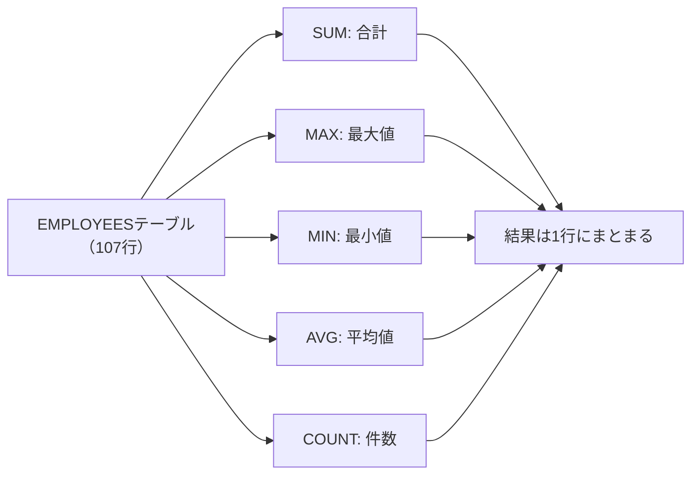

集計関数の特徴は、複数の行を入力として受け取り、1つの結果を返す点にあります。`SUM`は指定した列の数値をすべて足し合わせ、`MAX`は最も大きい値（日付や文字列にも使えます）、`MIN`は最も小さい値、`AVG`は合計を件数で割った平均、`COUNT`は行数を数えます。

実務で集計を行う際、注意が必要なのがNULL（空の値）の扱いです。`SUM`や`AVG`などの関数は、計算対象の中にNULLがあってもそれを「0」とは見なさず、「存在しないもの」として無視します。

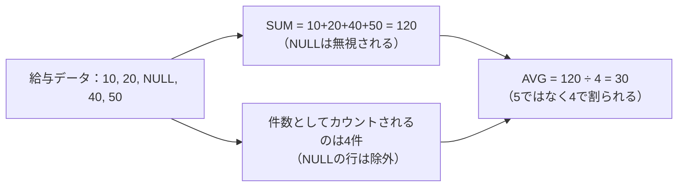

例えば5人の給与が`10, 20, NULL, 40, 50`だった場合、`AVG`は「120 ÷ 4」で算出されます（5人ではなく4人で割られます）。この挙動を知らないと、平均値の計算が意図とズレていることに気づきにくいので注意が必要です。

解答例で`COUNT(*)`が使われている点も見ておきましょう。

| 書き方 | 数える対象 | NULLの扱い |
| :--- | :--- | :--- |
| `COUNT(*)` | 行そのもの | NULLを含む行もカウントする |
| `COUNT(salary)` | salary列の値 | salaryがNULLの行はカウントしない |

`COUNT(*)`はNULLを含むかどうかにかかわらず「行そのもの」が何件あるかを数えるのに対し、`COUNT(salary)`はsalary列がNULLではない行だけを数えます。もし給与が未設定（NULL）の従業員がいた場合、`COUNT(*)`は全従業員数を返しますが、`COUNT(salary)`は少し少ない数字を返すことになります。集計の目的によって、どちらを使うべきかが変わってくる点は覚えておくとよいと思います。

期待する結果の`AVG`は小数点以下が長く表示されています。実務のレポートでは、`ROUND`関数を組み合わせて`ROUND(AVG(salary), 2)`のように四捨五入して見やすく整えるのが一般的です。

## 参考リンク
https://www.shift-the-oracle.com/sql/aggregate-functions/count.html
https://www.shift-the-oracle.com/sql/aggregate-functions/sum.html
https://www.shift-the-oracle.com/sql/aggregate-functions/avg.html
https://www.shift-the-oracle.com/sql/aggregate-functions/max.html
https://www.shift-the-oracle.com/sql/aggregate-functions/min.html

----
<br><br>

# 問題8-2：グループ化
### 難易度：★☆☆☆☆ (Lv.1)
## 問題
COスキーマの`ORDERS`テーブルより、**年月ごとの注文数**を集計して取得してください。
集計にあたっては、以下の条件を適用してください。

**【集計ルール】**
* 注文ステータス（`ORDER_STATUS`）が「CANCELLED」（キャンセル済み）のデータは、**集計対象から除外**すること。
* `ORDER_TMS`を「YYYY-MM」形式（例：2021-02）に加工し、その年月単位でグループ化すること。
* 結果は、年月の昇順で表示すること。

## 期待する結果
| ORDER_TMS | CNT |
| --------- | --- |
| 2021-02   | 17  |
| 2021-03   | 72  |
| 2021-04   | 110 |
| 2021-05   | 110 |
| 2021-06   | 123 |
| 2021-07   | 121 |
| 2021-08   | 141 |
| 2021-09   | 157 |
| 2021-10   | 172 |
| 2021-11   | 151 |
| 2021-12   | 189 |
| 2022-01   | 214 |
| 2022-02   | 154 |
| 2022-03   | 152 |
| 2022-04   | 32  |

## 解答例
```sql
SELECT
    TO_CHAR(order_tms, 'YYYY-MM') AS order_tms,
    COUNT(*)                      AS cnt
FROM
    co.orders
WHERE
    order_status <> 'CANCELLED'
GROUP BY
    TO_CHAR(order_tms, 'YYYY-MM')
ORDER BY
    order_tms
```

## 解説
集計関数の基本（合計や平均）を学んだ次は、SQLの真骨頂とも言える「グループ化（`GROUP BY`）」です。データを特定の切り口（今回は「年月」）でバケツ分けし、それぞれのバケツの中身を数えるという、実務の集計レポート作成で最もよく使うパターンです。

`GROUP BY`句は、指定した列の値が同じ行を1つの塊（グループ）としてまとめます。今回のように日付（TIMESTAMP型）をそのままグループ化すると「秒」まで一致しないとまとまらないため、`TO_CHAR(order_tms, 'YYYY-MM')`で「年月」という文字列に加工してからグループ化しています。

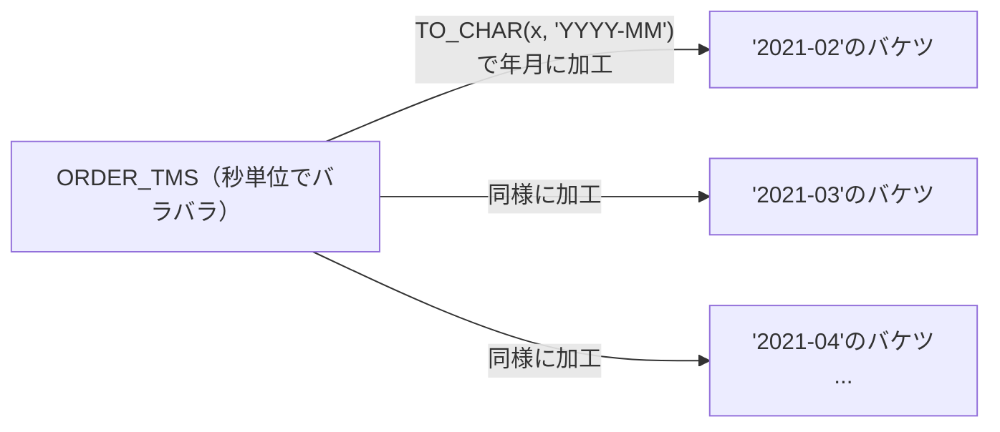

これにより、「2021-02」のバケツ、「2021-03」のバケツ……という具合に、月単位でデータがまとめられます。

初心者が間違いやすいポイントとして、SQLの「実行される順番」があります。


書く順番は`SELECT`から始まりますが、実際にデータベースが処理する順番は、まず`FROM`でテーブルを見て、`WHERE`で集計する前に不要な行（今回は`CANCELLED`）を切り捨て、残った行を`GROUP BY`で年月ごとにまとめ、`SELECT`でグループごとの`COUNT(*)`を計算し、最後に`ORDER BY`で並べ替える、という流れです。今回のように「キャンセルを除いてから数える」場合は、`GROUP BY`よりも前の`WHERE`句でフィルタリングするのが基本になります。

`GROUP BY`を使うときに絶対に守らなければならないルールもあります。それは、SELECT句に書けるのは「GROUP BYに指定した列」か「集計関数（COUNTやSUMなど）」だけである、という点です。例えば`SELECT order_id, COUNT(*)`と書いて`GROUP BY order_tms`とすると、「年月でまとめているのに、どの注文IDを表示すればいいのか」とデータベースが判断できずエラーになります。詳しくは下記のコラムで扱います。

期待する結果を見ると、2021年2月から2022年4月まで、月を追うごとに注文数が変化している様子が分かります。2022年1月の「214件」がピークであることなど、データの傾向がひと目で見て取れるのが、グループ化の面白いところです。

:::message
### ORA-00979: GROUP BYの式ではありません
SQL初心者が必ずといっていいほど遭遇する「ORA-00979」エラーについて説明します。

このエラーは、`GROUP BY`句を使用したSQLにおいて、「集計（グループ化）したい単位」と「SELECTしたい項目」の整合性が取れていないときに発生します。SQLの原則として、`GROUP BY`を使う場合、`SELECT`句に書けるのは「GROUP BY句に指定した列」か「集計関数（SUM, AVG, MAX, MIN, COUNTなど）を通した値」の2種類だけです。これ以外の生の列をSELECTに混ぜようとすると、Oracleは「グループ化した結果、どの行のデータを出せばいいか判断できない」ためエラーを返します。

例えば、部署（DEPT_ID）ごとに給与（SALARY）の合計を出したいが、個人の名前（NAME）も表示したい場合、次のように書くとエラーになります。
```sql
SELECT DEPT_ID, NAME, SUM(SALARY)
FROM EMPLOYEES
GROUP BY DEPT_ID;
```

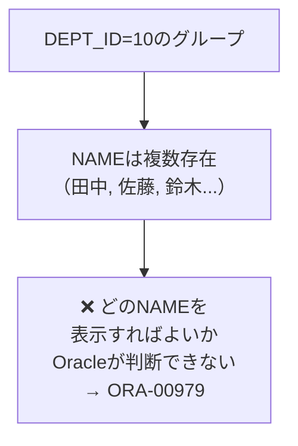

`DEPT_ID`でグループ化すると、1つの部署に複数の`NAME`が存在するため、「1つの部署に対してどの`NAME`を表示すればいいのか」がOracleには判断できません。

修正方法は2つあります。

| 修正方法 | 書き方 | 結果の意味 |
| :--- | :--- | :--- |
| ① NAMEもグループ化基準に含める | `GROUP BY DEPT_ID, NAME` | 部署内の個人ごとに集計する |
| ② 集計関数で囲む | `SELECT DEPT_ID, MAX(NAME), SUM(SALARY)` | 部署の中で誰か1人の名前を代表として出す |

いくつか注意点もあります。SELECT句で計算や加工を行っている場合、その加工後の形、あるいは加工前の列がGROUP BYに不足しているとエラーになります。`SELECT TO_CHAR(HIRE_DATE, 'YYYY') ... GROUP BY TO_CHAR(HIRE_DATE, 'YYYY')`のように記述を合わせる必要があります。一方、SELECT句にリテラル（'2024年度'など）を書く場合は、GROUP BYに含める必要はありません。サブクエリやJOINを伴う複雑なクエリでは、どのテーブルのどの列がGROUP BYに欠けているか見失いやすくなるので、エラーが出たらまず「集計関数で囲まれていない列」をすべてリストアップし、それがGROUP BY句に漏れなく入っているかを確認するとよいと思います。
:::

## 参考リンク
https://www.shift-the-oracle.com/sql/group-by-having.html

----
<br><br>

# 問題8-3：集計後の条件（HAVING句）
### 難易度：★★☆☆☆ (Lv.2)
## 問題
COスキーマの`ORDERS`テーブルより、年月ごとの注文数を集計し、その中から**月間注文数が150件以上**の年月のみを取得してください。
集計にあたっては、以下の条件を適用してください。

**【集計ルール】**
* 注文ステータス（`ORDER_STATUS`）が「CANCELLED」（キャンセル済み）のデータは、**集計対象から除外**すること。
* `ORDER_TMS`を「YYYY-MM」形式に加工し、その年月単位でグループ化すること。
* 集計した結果（注文数）が150以上のデータのみを表示すること。
* 結果は、年月の昇順で表示すること。

## 期待する結果
| ORDER_TMS | CNT |
| --------- | --- |
| 2021-09   | 157 |
| 2021-10   | 172 |
| 2021-11   | 151 |
| 2021-12   | 189 |
| 2022-01   | 214 |
| 2022-02   | 154 |
| 2022-03   | 152 |

## 解答例
```sql
SELECT
    to_char(order_tms, 'YYYY-MM') AS order_tms,
    COUNT(*)                      AS cnt
FROM
    co.orders
WHERE
    order_status <> 'CANCELLED'
GROUP BY
    to_char(order_tms, 'YYYY-MM')
HAVING
    COUNT(*) >= 150
ORDER BY
    order_tms
```

## 解説
今回は「集計結果に対する絞り込み（`HAVING`句）」です。実務では「全データ」ではなく、「売上が目標を超えた店舗だけ」や「注文が集中している時間帯だけ」を抜き出したいことが多々あります。`WHERE`句と`HAVING`句の使い分けができるかどうかが、ここでのポイントです。

| 句 | 絞り込むタイミング | 対象 | 今回の例 |
| :--- | :--- | :--- | :--- |
| `WHERE` | 集計を行う前 | 1行ずつのデータ | キャンセルされたか |
| `HAVING` | 集計を行った後 | まとまったグループの計算結果 | 合計は150以上か |

どちらも「絞り込み」を行いますが、実行されるタイミングが違います。今回の問題に当てはめると、まず`WHERE`でキャンセルされた注文を除外し、残った注文を年月でまとめて`COUNT(*)`を計算し、その計算結果を見て150に届かなかった月を`HAVING`で非表示にする、という流れになります。

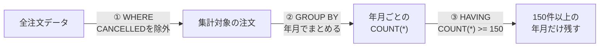

SQLが書かれた順番（`SELECT → FROM...`）と、データベースの中で実際に動く順番は異なります。`FROM`→`WHERE`→`GROUP BY`→`HAVING`→`SELECT`→`ORDER BY`という順番を知っていると、エラーに悩まされる場面が減ります。解答例で`HAVING cnt >= 150`と書かずに、わざわざ`HAVING COUNT(*) >= 150`と書いているのはこのためです。`SELECT`句よりも先に`HAVING`句が実行されるため、データベースが`HAVING`を処理している時点では、まだ`cnt`という別名は決まっていません。

期待する結果を見ると、前問（8-2）では15件あった結果が、150件以上の月だけに絞られて7件になっています。「1日に10回以上ログインエラーを出しているユーザーを特定する」「在庫数の合計が一定以下になった商品カテゴリを抽出する」「期間中に3回以上来店したリピーターを集計する」など、意味のあるデータだけを削り出すのが`HAVING`の役割です。

:::message
### SQLの評価順序
SQLクエリを作成する際、私たちは`SELECT`から書き始めますが、データベースの内部（実行エンジン）では、実は全く異なる順番で処理されています。この評価順序を理解しておくと、「なぜSELECT句で定義した別名がORDER BYでは使えるのに、HAVINGやGROUP BYでは使えないのか」といった疑問がスッキリ解決します。

| 順番 | 処理内容 |
| :---: | :--- |
| 1 | `FROM`（どのテーブルからデータを持ってくるか、JOINもここ） |
| 2 | `WHERE`（行を絞り込む） |
| 3 | `GROUP BY`（データをグループ化する） |
| 4 | `HAVING`（グループ化した後の集計結果でさらに絞り込む） |
| 5 | `SELECT`（どの列を表示するか選ぶ、ここで別名が定義される） |
| 6 | `DISTINCT`（重複を除去する） |
| 7 | `ORDER BY`（最後にデータを並べ替える） |
| 8 | `LIMIT`/`FETCH`（最終的な表示件数を制限する） |

解答例には、`SELECT`句で定義した「order_tms」と「cnt」という2つの別名が登場しますが、`ORDER BY`では別名を使っているのに`HAVING`では使っていません。

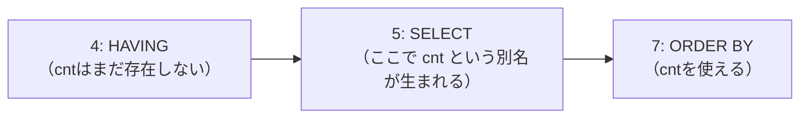

理由は評価順序にあります。`HAVING`（4番目）は`SELECT`（5番目）よりも前に処理されるため、`HAVING`が動いている時点ではまだ`SELECT`で名付けた「cnt」という名前はデータベースの中に存在せず、使うことができません。一方`ORDER BY`（7番目）は`SELECT`（5番目）よりも後に処理されるため、`SELECT`で定義した「order_tms」という名前をデータベースがすでに認識しており、そのまま利用できます。
:::

----
<br><br>

# 問題8-4：特定の条件での集計（CASE式を用いたグループ化）
### 難易度：★★★☆☆ (Lv.3)
## 問題
OEスキーマの`ORDERS`テーブルについて、注文状態（`ORDER_STATUS`）を以下のグループに分類し、グループごとの「件数」および「注文合計額（ORDER_TOTAL）の合計」を算出してください。

**【グループ分けの定義】**
| 値 | 意味 (英語) | 説明 (日本語) | グループ |
| :--- | :--- | :--- | :--- |
| **0** | **Pending** | 保留中（入力が完了していない状態） | **待ち** |
| **1** | **Order entered** | 受付済み（注文が正常に登録された） | **正常** |
| **2** | **Order canceled** | キャンセル済み | **中止** |
| **3** | **Shipped - cash** | 出荷済み（現金払い） | **正常** |
| **4** | **Shipped - credit** | 出荷済み（クレジット払い） | **正常** |
| **5** | **Backordered** | 入荷待ち（在庫不足による出荷待ち） | **待ち** |
| **6** | **Order canceled - incorrect** | キャンセル済み（誤入力・不備など） | **中止** |
| **7** | **Order shipped - partially** | 一部出荷済み | **待ち** |
| **8** | **Order shipped - full** | すべて出荷済み | **正常** |
| **9** | **Order replaced** | 交換済み | **その他** |
| **10** | **Order closed** | 完了（すべての処理が終了） | **正常** |

## 期待する結果
| GROUP  | CNT | SUM       |
| ------ | --- | --------- |
| 待ち   | 29  | 578572.5  |
| 正常   | 50  | 2350361.9 |
| 中止   | 16  | 476383.7  |
| その他 | 10  | 262736.6  |

## 解答例
```sql:例1：GROUP BYにCASE文を使用
SELECT
    CASE
        WHEN order_status IN ( 0, 5, 7 ) THEN
            '待ち'
        WHEN order_status IN ( 1, 3, 4, 8, 10 ) THEN
            '正常'
        WHEN order_status IN ( 2, 6 ) THEN
            '中止'
        ELSE
            'その他'
    END              AS "GROUP",
    COUNT(*)         AS "CNT",
    SUM(order_total) AS "SUM"
FROM
    oe.orders
GROUP BY
    CASE
        WHEN order_status IN ( 0, 5, 7 ) THEN
            '待ち'
        WHEN order_status IN ( 1, 3, 4, 8, 10 ) THEN
            '正常'
        WHEN order_status IN ( 2, 6 ) THEN
            '中止'
        ELSE
            'その他'
    END
```
```sql:例2：GROUP BYに別名を使用（23c以降）
SELECT
    CASE
        WHEN order_status IN ( 0, 5, 7 ) THEN
            '待ち'
        WHEN order_status IN ( 1, 3, 4, 8, 10 ) THEN
            '正常'
        WHEN order_status IN ( 2, 6 ) THEN
            '中止'
        ELSE
            'その他'
    END              AS "GROUP",
    COUNT(*)         AS "CNT",
    SUM(order_total) AS "SUM"
FROM
    oe.orders
GROUP BY
    "GROUP"
```
```sql:例3：サブクエリーを使用
SELECT
    "GROUP",
    COUNT(*)         AS "CNT",
    SUM(order_total) AS "SUM"
FROM
    (
        SELECT
            order_total,
            CASE
                WHEN order_status IN ( 0, 5, 7 ) THEN
                    '待ち'
                WHEN order_status IN ( 1, 3, 4, 8, 10 ) THEN
                    '正常'
                WHEN order_status IN ( 2, 6 ) THEN
                    '中止'
                ELSE
                    'その他'
            END AS "GROUP"
        FROM
            oe.orders
    )
GROUP BY
    "GROUP"
```

## 解説
これまではテーブルにある既存の列でグループ分けしてきましたが、今回は「バラバラなステータスコードを、自分で定義した意味のあるグループにまとめ直して集計する」という実戦的な問題です。ビジネスレポートでは「細かい区分はいらないから正常か異常かでまとめて」と言われることが多いため、このスキルは実務でよく使う場面があります。

通常、`GROUP BY`にはカラム名を指定しますが、実は「計算式」を指定することもできます。

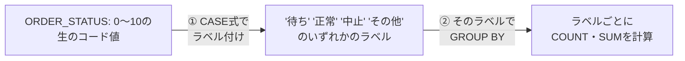

まず各行に対して`CASE`式を実行し、「待ち」「正常」といったラベルを一時的に貼り付け、その貼り付けたラベル（グループ）ごとに`COUNT`や`SUM`を計算する、という2段階の処理です。

解答例には3つのパターンがあり、それぞれ実務での使い分けが変わってきます。

| 方式 | 書き方の特徴 | メリット・デメリット |
| :--- | :--- | :--- |
| 例1：GROUP BYにCASEを直書き | `SELECT`と`GROUP BY`に同じCASE式を2回書く | 修正時に2箇所直す必要がありミスが起きやすい |
| 例2：SELECTの別名をGROUP BYで使い回す | Oracle 23c以降で利用可能 | すっきり書けるが古いバージョンでは動かない |
| 例3：サブクエリで先にラベル付け | 内側でグループ分け、外側で集計 | ロジックが一箇所にまとまりバージョンを問わず動く |

例1はGROUP BYに直接CASEを書く伝統的な方法で、`SELECT`句と`GROUP BY`句に全く同じ`CASE`式を2回書く必要があります。修正が必要になったとき2箇所直さなければならず、ミスが起きやすいのが欠点です。

例2はOracle Database 23cから導入された、SELECT句で付けた別名（今回は`"GROUP"`）をそのままGROUP BYで使い回せる書き方です。かなりすっきり書けますが、古いバージョンのシステムでは動かない点に注意してください。

例3はサブクエリを使う方法で、内側の`SELECT`（サブクエリ）で先にグループ分けを済ませ、外側で集計します。ロジックが一箇所にまとまっているためメンテナンスがしやすく、バージョンを問わず動くという意味でも、私は普段この書き方を選ぶことが多いです。

期待する結果の「正常」グループを見ると、件数は50件、合計金額は約235万となっています。ステータスが`1, 3, 4, 8, 10`とバラバラでも、これらを一つの「正常」というバケツにまとめることで、「ビジネスが今どれくらい健全に動いているか」を大まかに把握できるようになります。

## 参考リンク
https://www.youtube.com/watch?v=SsJluwMpM2o&list=PLb1qVSx1k1VovCRavgMQSS_cvwJoNpAGc&index=6

----
<br><br>

# 問題8-5：１つの文字列への集計
### 難易度：★★☆☆☆ (Lv.2)
## 問題
HRスキーマの`COUNTRIES`テーブルより、地域（`REGION_ID`）ごとにグループ化し、各地域に属する国コード（`COUNTRY_ID`）を1つにまとめたリスト（`COUNTRY_LIST`）を作成してください。

**【出力ルール】**
* 同一の`REGION_ID`に含まれる`COUNTRY_ID`を、カンマ区切り（", "）で列挙すること。
* リスト内の国コードは、**アルファベット順**に並べること。
* 結果は`REGION_ID`ごとに1行で表示すること。

## 期待する結果
| REGION_ID | COUNTRY_LIST                    |
| --------- | -------------------------------- |
| 10        | BE, CH, DE, DK, FR, GB, IT, NL   |
| 20        | AR, BR, CA, MX, US                |
| 30        | CN, IL, IN, JP, KW, ML, SG        |
| 40        | AU                                 |
| 50        | EG, NG, ZM, ZW                    |

## 解答例
```sql
SELECT
    region_id,
    LISTAGG(country_id, ', ') WITHIN GROUP(
    ORDER BY
        country_id
    ) AS country_list
FROM
    hr.countries
GROUP BY
    region_id
```

## 解説
集計といえば「数値」の合計や平均をイメージしがちですが、今回は「文字列」を1つにまとめる`LISTAGG`（リストアグリゲート）関数の解説です。レポートの備考欄に「対象の商品IDをすべて並べて表示したい」といった要望は実務でよくあるので、覚えておくと役立つ場面が多い関数です。
```sql
LISTAGG( [対象カラム], '[区切り文字]' ) 
WITHIN GROUP ( ORDER BY [並び順のカラム] )
```
通常の`SUM`が数値を足し算するように、`LISTAGG`は文字列を連結します。

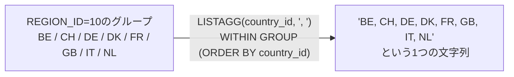

ここでユニークなのが`WITHIN GROUP (ORDER BY ...)`の存在で、リスト化する際に「どんな順番で並べるか」を必ず指定する必要があります。今回の問題では`ORDER BY country_id`としているため、`BE, CH, DE...`のようにアルファベット順に並んでいます。

`LISTAGG`は、データの「1対多」を「1対1」に見せたいときに便利です。例えば「1つの部署」に「複数の従業員」がいる場合、そのまま結合して出力すると部署名の行が重複してしまいますが、`LISTAGG`を使えば「営業部：田中, 佐藤, 鈴木」のように1行のコンパクトなサマリーにまとめられます。区切り文字も自由に変更でき、今回のようなカンマ＋スペースのほか、改行コードやスラッシュなど用途に合わせて選べます。

一点注意しておきたいのが、`LISTAGG`で連結した結果の文字列が、Oracleの文字列制限（通常4,000バイト、設定により32,767バイト）を超えるとエラーが発生する点です。Oracle 19c以降では、`ON OVERFLOW TRUNCATE`というオプションを付けることで、溢れた分を自動的に`...`に省略してくれる機能もあります。データ件数が多いカラムでこの関数を使う場合は、この制限を頭の片隅に置いておくと安心です。

期待する結果を見ると、`REGION_ID = 10`（ヨーロッパ）に対して、所属する国コードが横並びに整理されています。特に`30`（アジア）のリストなど、複数の国がカンマで繋がることで、その地域の広がりが直感的に分かるようになります。

## 参考リンク
https://www.shift-the-oracle.com/sql/aggregate-functions/listagg.html
https://www.youtube.com/watch?v=QSTvwwq5HBg

----
<br><br>

# 問題8-6：クロス集計（縦持ちから横持ちへの変換）
### 難易度：★★★☆☆ (Lv.3)
## 問題
経営企画部から、「特定の部門における役職ごとの人員配置状況を横並びの表（クロス集計）で報告してほしい」との要望がありました。
HRスキーマの **DEPARTMENTS** テーブルおよび **EMPLOYEES** テーブルを使用し、部門名（`DEPARTMENT_NAME`）ごとに、以下の3つの役職（`JOB_ID`）に該当する従業員の「人数」を集計してください。

**【集計対象の役職と出力列名】**
* **PRES_CNT**: 役職が 'AD_PRES'（社長）の人数
* **VP_CNT**: 役職が 'AD_VP'（副社長）の人数
* **PROG_CNT**: 役職が 'IT_PROG'（プログラマー）の人数
なお、所属従業員が存在する部門（内訳がすべて0名であっても、誰かしらが所属している部門）のみを出力対象とし、結果は部門名（`DEPARTMENT_NAME`）の**昇順**で並べ替えてください。

## 期待する結果
| DEPARTMENT_NAME  | PRES_CNT | VP_CNT | PROG_CNT |
| ---------------- | -------- | ------ | -------- |
| Accounting       | 0        | 0      | 0        |
| Administration   | 0        | 0      | 0        |
| Executive        | 1        | 2      | 0        |
| Finance          | 0        | 0      | 0        |
| Human Resources  | 0        | 0      | 0        |
| IT               | 0        | 0      | 5        |
| Marketing        | 0        | 0      | 0        |
| Public Relations | 0        | 0      | 0        |
| Purchasing       | 0        | 0      | 0        |
| Sales            | 0        | 0      | 0        |
| Shipping         | 0        | 0      | 0        |

## 解答例
```sql
SELECT
    d.department_name,
    SUM(CASE WHEN e.job_id = 'AD_PRES' THEN 1 ELSE 0 END) AS pres_cnt,
    SUM(CASE WHEN e.job_id = 'AD_VP'   THEN 1 ELSE 0 END) AS vp_cnt,
    SUM(CASE WHEN e.job_id = 'IT_PROG' THEN 1 ELSE 0 END) AS prog_cnt
FROM
    hr.departments d
    INNER JOIN hr.employees e ON d.department_id = e.department_id
GROUP BY
    d.department_name
ORDER BY
    d.department_name
```

## 解説
今回は実務のレポート作成でよく使われる「クロス集計（ピボット）」です。データの一般的な持ち方である「縦持ち（1行に1つのデータ）」を、人間が見やすい「横持ち（1列に1つの項目）」に変換するテクニックです。

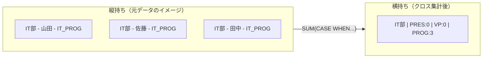

このクエリの核となるのは、「集計関数（`SUM`）」と「条件分岐（`CASE`）」の組み合わせです。まず`CASE`式で、特定の職種（`JOB_ID`）に該当する場合だけ`1`を、それ以外は`0`を返すように定義します。
```sql
CASE WHEN e.job_id = 'AD_PRES' THEN 1 ELSE 0 END
```
そのあと、この`1`を部署（`GROUP BY`）ごとに足し合わせます。該当する人が3人いれば1+1+1=3、該当者がいなければ0です。これにより、「条件に一致する行数」をカウントしつつ、それを横方向の列（`PRES_CNT`など）として出力できます。

問題文に「所属従業員が存在する部門のみを出力対象」という条件があります。`hr.departments`（部署）と`hr.employees`（従業員）を`INNER JOIN`で結合することで、従業員が一人も紐付いていない部署（空き部署）を自動的に除外しています。もし「従業員がいない部署も表示したい」のであれば、`LEFT OUTER JOIN`を使うことになります。

なぜ`COUNT`ではなく`SUM`なのか、疑問に思うかもしれません。

| 書き方 | 仕組み |
| :--- | :--- |
| `SUM(CASE WHEN ... THEN 1 ELSE 0 END)` | 条件に合わなければ0を足すので結果は必ず数値（0以上） |
| `COUNT(CASE WHEN ... THEN 1 ELSE NULL END)` | COUNTはNULLを無視するため同様の結果が得られる |

`SUM`の方が挙動として直感的で、ミスが少ないと言われています。実務のレポートでは「該当なし」をNULL（空欄）ではなく0と表示させたいケースが多いため、`ELSE 0`を指定した`SUM`形式が好まれる傾向があります。

なお、Oracle 11g以降では、この処理をより直感的に書くための`PIVOT`演算子も用意されています。詳細は後の章で解説します。

----
<br><br>

# 【完全版】問題8-7：複数軸の小計・総計とラベル付与（ROLLUP / GROUPING）
### 難易度：★★★★☆ (Lv.4)
## 問題
人事部より、グローバルな平均給与レポートの作成依頼がありました。「国（COUNTRY_ID）ごと」および「都市（CITY）ごと」の平均給与を算出する必要があります。
ただし、単にデータを並べるだけでなく、「国ごとの小計」と「会社全体の総合計」を1つの結果セットに含め、かつ集計行には「US 合計」「会社 総合計」といった適切なラベルを付与して、そのまま会議資料として使える形式で出力してください。
HRスキーマの `EMPLOYEES`, `DEPARTMENTS`, `LOCATIONS` テーブルを使用し、国（`COUNTRY_ID`）、都市（`CITY`）ごとの「平均給与（SALARY）」を算出し、以下の条件に従って出力してください。

1. **階層集計**: 都市ごとのデータ、国ごとの小計、全体の総計を一度に取得すること。
2. **ラベル制御**:
   * 都市の小計行（都市名が本来NULLになる行）には、`[国名] 合計`（例：`US 合計`）と表示すること。
   * 全体の総計行（国名も都市名もNULLになる行）には、`会社 総合計` と表示すること。
3. **表示形式**: 平均給与は小数点以下を四捨五入して整数で表示すること。
4. **ソート**: 国（`COUNTRY_ID`）の昇順を基本とし、各グループ内で「明細行 → 小計行」の順に並ぶようにすること。

## 期待する結果
| COUNTRY_ID  | CITY                | AVG_SALARY |
| ----------- | -------------------- | ---------- |
| CA          | Toronto               | 9500       |
| CA          | CA 合計                | 9500       |
| DE          | Munich                 | 10000      |
| DE          | DE 合計                | 10000      |
| GB          | London                 | 6500       |
| GB          | Oxford                 | 8956       |
| GB          | GB 合計                | 8886       |
| US          | Seattle                | 8845       |
| US          | South San Francisco    | 3476       |
| US          | Southlake              | 5760       |
| US          | US 合計                | 5065       |
| 会社 総合計 | 会社 総合計            | 6457       |

## 解答例
```sql
SELECT
    CASE 
        WHEN GROUPING(l.country_id) = 1 THEN '会社 総合計' 
        ELSE l.country_id 
    END AS country_id,
    CASE 
        WHEN GROUPING(l.city) = 1 AND GROUPING(l.country_id) = 0 THEN l.country_id || ' 合計'
        WHEN GROUPING(l.city) = 1 AND GROUPING(l.country_id) = 1 THEN '会社 総合計'
        ELSE l.city 
    END AS city,
    ROUND(AVG(e.salary)) AS avg_salary
FROM
    hr.employees e
    INNER JOIN hr.departments d ON e.department_id = d.department_id
    INNER JOIN hr.locations l ON d.location_id = l.location_id
GROUP BY
    ROLLUP(l.country_id, l.city)
ORDER BY
    l.country_id NULLS LAST,
    GROUPING(l.city),
    l.city
```

## 解説
今回は「階層集計」の問題です。単にデータを集計するだけでなく、「レポート（資料）としてそのまま使える形」に整える、少し高度なテクニックが必要になります。特に重要な`ROLLUP`と`GROUPING`の役割を中心に解説します。

このクエリの鍵は、`GROUP BY`句にある`ROLLUP`です。`ROLLUP(A, B)`と記述すると、「Aごと、Bごとの明細集計」「Aごとの小計（Bを無視）」「全データの総計（AもBも無視）」という3つのレベルの集計を一度に生成します。

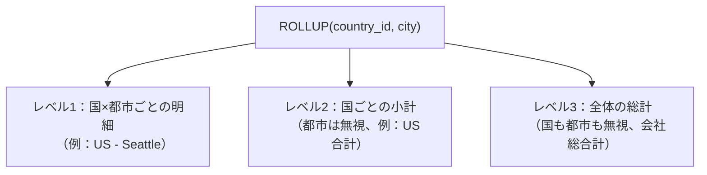

今回の`ROLLUP(l.country_id, l.city)`であれば、「国と都市ごとの平均（明細）」「国ごとの平均（小計）」「会社全体の平均（総計）」がまとめて手に入ります。

集計行（小計や総計）では、集計対象外となった列に本来NULLが入ります。しかし、データそのものがNULLなのか、集計の結果NULLになったのかを区別する必要が出てきます。そこで使うのが`GROUPING`関数です。

| `GROUPING(列名)` の値 | 意味 |
| :---: | :--- |
| 0 | 通常のデータ行 |
| 1 | 集計（合計・小計）によってまとめられた行 |

解答例では、この`GROUPING`関数を country_id用とcity用の2箇所で独立して呼び出し、それぞれのCASE式でラベルを組み立てています。

| `GROUPING(country_id)` | `GROUPING(city)` | 行の種類 | CITY列の表示 |
| :---: | :---: | :--- | :--- |
| 0 | 0 | 明細行 | そのまま都市名 |
| 0 | 1 | 国ごとの小計行 | `[国名] 合計` |
| 1 | 1 | 全体の総計行 | `会社 総合計` |

country_id側では、`GROUPING(l.country_id) = 1`（国自体がまとめられた行、つまり総計行）なら`'会社 総合計'`を、それ以外なら元の国名をそのまま表示します。city側は少し複雑で、`GROUPING(l.city) = 1`かつ`GROUPING(l.country_id) = 0`（都市はまとめられたが国はまとめられていない、つまり国ごとの小計行）なら`[国名] 合計`、両方とも1（総計行）なら`'会社 総合計'`、どちらでもなければ通常の都市名を表示する、という3パターンの判定になっています。2つの列でそれぞれ独立にGROUPING判定を行っているのは、country_idとcityで「まとめられ方」の粒度が異なるためです。

もし元のデータに本物のNULL（未回答など）が含まれている場合、`NVL`だけでは「集計結果のNULL」なのか「データのNULL」なのか区別がつきません。今回のように`GROUPING`関数を使えば、そうした曖昧さを避けて厳密に判定できます。

並び順にも工夫があります。
```sql
ORDER BY
    l.country_id NULLS LAST, -- 総計（国名がNULL）を一番最後に
    GROUPING(l.city),        -- 0 (明細) を先に、1 (小計) を後に
    l.city                   -- 都市名の昇順
```
特に`GROUPING(l.city)`をソート順に入れることで、「明細データの後に、その国の小計が来る」という並び順を実現しています。この`ORDER BY`の工夫がないと、小計行がどこに紛れ込むか分からず、レポートとして扱いにくくなってしまいます。

実務では、今回のように`ROLLUP`を使って一撃で取得する方法のほか、より大規模なBIツールなどでは`CUBE`（全組み合わせ）や`GROUPING SETS`（特定の組み合わせのみ）を使い分けることもあります。

----
<br><br>

# 【完全版】問題8-8：集計グループ内での最初・最後の値の抽出（KEEP (FIRST / LAST)）
### 難易度：★★★★☆ (Lv.4)
## 問題
人事部より、各部門（`DEPARTMENT_ID`）における給与バランスの調査依頼がありました。
具体的には、各部門の中で **「最も古くに入社した人（最古の採用日）」** の給与と、**「最も新しく入社した人（最新の採用日）」** の給与を一覧化して比較したいという要望です。
通常、部門ごとの「最大給与」や「最小給与」を出すのは簡単ですが、今回は「給与」そのものの最大最小ではなく、**「採用日」を基準に並べた際の端点にいる人の給与** を取得する必要があります。
HRスキーマの `EMPLOYEES` テーブルを使用し、部門（`DEPARTMENT_ID`）ごとにグループ化し、以下の値を算出してください。

**【取得項目】**
1. **DEPT_ID**: 部門ID（`DEPARTMENT_ID`）
2. **OLDEST_EMP_SAL**: その部門で **「最も採用日（HIRE_DATE）が古い従業員」** の給与（`SALARY`）
3. **NEWEST_EMP_SAL**: その部門で **「最も採用日（HIRE_DATE）が新しい従業員」** の給与（`SALARY`）

**【条件】**
* 同一採用日の従業員が複数存在する場合は、その中で最も高い給与（`MAX`）を採用してください。
* `DEPARTMENT_ID` が NULL のレコードは除外してください。
* 結果は `DEPARTMENT_ID` の昇順で並べてください。

## 期待する結果
| DEPT_ID | OLDEST_EMP_SAL | NEWEST_EMP_SAL |
| ------- | --------------- | --------------- |
| 10      | 4400             | 4400             |
| 20      | 13000            | 6000             |
| 30      | 11000            | 2500             |
| 40      | 6500             | 6500             |
| 50      | 7900             | 2200             |
| 60      | 4800             | 6000             |
| 70      | 10000            | 10000            |
| 80      | 10000            | 6200             |
| 90      | 17000            | 17000            |
| 100     | 9000             | 6900             |
| 110     | 12008            | 12008            |

## 解答例
```sql
SELECT
    department_id AS dept_id,
    -- 1. 最も古い採用日の従業員の給与を取得
    MAX(salary) KEEP (DENSE_RANK FIRST 
                  ORDER BY hire_date ASC) AS oldest_emp_sal,
    -- 2. 最も新しい採用日の従業員の給与を取得
    MAX(salary) KEEP (DENSE_RANK LAST  
                  ORDER BY hire_date ASC) AS newest_emp_sal
FROM
    hr.employees
WHERE
    department_id IS NOT NULL
GROUP BY
    department_id
ORDER BY
    department_id
```

## 解説
今回の課題は、Oracle SQL特有の便利な機能である`KEEP (DENSE_RANK FIRST/LAST)`句です。「部門内で給与が最大」を探すのは簡単ですが、「部門内で採用日が最も古い人の給与」を探すとなると、通常はサブクエリやウィンドウ関数が必要になります。これを`GROUP BY`の中で解決するのが今回のテクニックです。

このクエリの核となるのは、「集計グループの中でさらに順位を付け、その端点だけを抽出する」というロジックです。
```sql
MAX(salary) KEEP (DENSE_RANK FIRST ORDER BY hire_date ASC)
```


`ORDER BY hire_date ASC`で、各部門の中で従業員を採用日の昇順（古い順）に並べます。`DENSE_RANK FIRST`で、並べた結果「1番最初（＝最も古い）」に該当する行だけをキープ（保持）します。そして`MAX(salary)`で、キープされた行（最古の採用者）の中から給与の最大値を取り出します。最古の採用日が1人だけならその人の給与が、同着で複数人いる場合はその中の最高給与が選ばれる、という仕組みです。同様に`DENSE_RANK LAST`を使えば、並び順の最後（＝最新の採用者）のデータを取得できます。

なぜ通常の`MIN`や`MAX`ではダメなのか、という点も整理しておきましょう。

| 関数 | 何の大小を見るか |
| :--- | :--- |
| `MIN(salary)` / `MAX(salary)` | 給与そのものの大小 |
| `MAX(salary) KEEP (DENSE_RANK FIRST ORDER BY hire_date)` | 採用日という別の軸で見たときの端点にいる人の給与 |

通常の`MIN(salary)`を使うと「その部門で一番低い給与」が出てしまいます。今回欲しいのは給与そのものの大小ではなく、「採用日という別の軸で見たときの端点にいる人の給与」です。この違いを意識しないと、要件と全く違う結果を出してしまいます。

問題文にある「同一採用日の従業員が複数存在する場合は、その中で最も高い給与を採用」という条件は、外側の集計関数（`MAX`）が担っています。`KEEP`句の外側にある関数は、「ランキングで同率1位になった行が複数あった場合に、どの値を選択するか」を決定する役割を持っています。

`FIRST_VALUE`などの分析関数（ウィンドウ関数）でも同様の結果を得られますが、`KEEP`句は`GROUP BY`と併用できる点がメリットです。ウィンドウ関数を使うと行数が減らないため、最終的に`DISTINCT`をかけるなどの手間が必要になりますが、`KEEP`なら集計と同時に1部門1行にまとめられます。

この`KEEP`句は、「各商品の最新の入庫日における在庫単価を取得する」「各ユーザーの初回アクセス時の流入元URLを特定する」「各店舗の最高売上を記録した日の担当者名を出す」など、属性に基づく端点の抽出全般で役立ちます。`KEEP (DENSE_RANK ...)`は一見複雑な構文に見えますが、「〜という条件で並べたときの、最初（最後）の人のデータを取る」という定型文として覚えておくと、応用が利きやすくなります。

----
<br><br>

# 問題8-9：データ分析における代表値（MEDIAN / STATS_MODE）
### 難易度：★★★☆☆ (Lv.3)
## 問題
マーケティング部門から、顧客の購買力を分析するために「年収レベル（`INCOME_LEVEL`）ごとの、信用限度額（`CREDIT_LIMIT`）の傾向値」を出してほしいと依頼がありました。
通常、全体傾向を見るには「平均値（`AVG`）」が使われます。しかし、平均値は一部の「極端に高い信用限度額を持つ顧客（外れ値）」に引っ張られてしまい、一般的な顧客の実績値から乖離してしまう特性があります。
より客観的な実態を把握するために、平均値に加えて **「中央値（メディアン）」** と **「最頻値（モード）」** も算出し、データの分布特性を比較・分析することになりました。
OEスキーマの `CUSTOMERS` テーブルを使用し、顧客の収入レベル（`INCOME_LEVEL`）ごとにグループ化し、信用限度額（`CREDIT_LIMIT`）について以下の3つの統計値を算出してください。

**【取得項目】**
1. **INCOME_LEVEL**: 収入レベル
2. **AVG_CREDIT**: 信用限度額の「平均値」（小数点以下は四捨五入）
3. **MEDIAN_CREDIT**: 信用限度額の「中央値」
4. **MODE_CREDIT**: 信用限度額の「最頻値（最も頻繁に現れる値）」

**【条件】**
* 結果は平均値（`AVG_CREDIT`）の昇順でソートしてください。

## 期待する結果
| INCOME_LEVEL          | AVG_CREDIT | MEDIAN_CREDIT | MODE_CREDIT |
| ---------------------- | ---------- | -------------- | ----------- |
| C: 50,000 - 69,999     | 1233       | 1200            | 400         |
| H: 150,000 - 169,999   | 1678       | 1200            | 1200        |
| A: Below 30,000        | 1789       | 1200            | 5000        |
| J: 190,000 - 249,999   | 1833       | 1900            | 500         |
| B: 30,000 - 49,999     | 1894       | 1500            | 500         |
| D: 70,000 - 89,999     | 1900       | 1300            | 1200        |
| I: 170,000 - 189,999   | 1981       | 1400            | 1200        |
| K: 250,000 - 299,999   | 1983       | 2350            | 2400        |
| E: 90,000 - 109,999    | 1996       | 1400            | 1200        |
| F: 110,000 - 129,999   | 1996       | 1400            | 2400        |
| G: 130,000 - 149,999   | 2019       | 1400            | 5000        |
| L: 300,000 and above   | 2213       | 1450            | 3700        |

## 解答例
```sql
SELECT
    income_level,
    ROUND(AVG(credit_limit)) AS avg_credit,
    -- 1. 中央値を算出
    MEDIAN(credit_limit)     AS median_credit,
    -- 2. 最頻値を算出
    STATS_MODE(credit_limit) AS mode_credit
FROM
    oe.customers
GROUP BY
    income_level
ORDER BY
    avg_credit
```

## 解説
今回はデータ分析の基本でありながら奥が深い、「代表値（統計値）」の算出です。平均値（AVG）だけでは見えてこないデータの実態を、中央値（MEDIAN）や最頻値（STATS_MODE）と並べて見ることで浮き彫りにする、実践的な問題です。

| 関数 | 意味 | 特徴 |
| :--- | :--- | :--- |
| `AVG` | 平均値 | データの「重心」。一部の極端な値（富裕層など）に引きずられやすい |
| `MEDIAN` | 中央値 | 大きさ順に並べてちょうど真ん中の値。外れ値の影響を受けにくい |
| `STATS_MODE` | 最頻値 | 最も頻繁に出現する値。「ボリュームゾーン」を特定できる |

`ROUND(AVG(credit_limit))`は、すべての合計を件数で割った平均値です。データの「重心」を示しますが、一部の極端な値（富裕層など）に引きずられやすいという弱点があります。`MEDIAN(credit_limit)`は、データを大きさ順に並べたときにちょうど真ん中に位置する値です。外れ値の影響を受けにくく、「一般的な顧客の感覚」に近い数値が出やすいのがメリットです。`STATS_MODE(credit_limit)`は、データの中で最も頻繁に出現する値で、「最も多くの人が設定している限度額はいくらか」というボリュームゾーンを特定するのに役立ちます。

データの分布がきれいな左右対称（正規分布）であれば「平均 ＝ 中央値 ＝ 最頻値」となりますが、現実のデータ（特に所得や金額系）は多くの場合、左右どちらかに歪んだ分布になります。

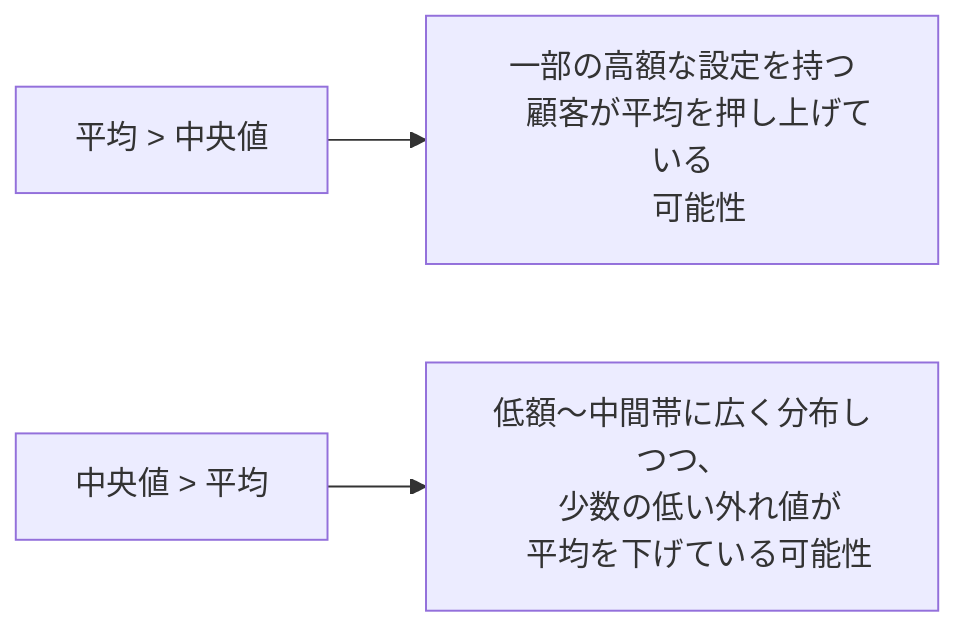

平均と中央値のどちらが大きいかは、分布の歪み方によって変わります。平均が中央値より高ければ、一部の高額な設定を持つ顧客が平均を押し上げている可能性があり、逆に中央値の方が高ければ、低額から中間帯にかけて広く分布しつつ、少数の低い外れ値が平均を下げている、というような読み方ができます。3つの値を横並びで見ることで、平均値だけでは分からない分布の形が見えてくるのが、この分析の面白いところです。

最頻値が複数ある場合（例えば500円と1000円の人が同数で一番多い場合）、Oracleの`STATS_MODE`はそのうちの1つを返します。厳密に全ての最頻値を知りたい場合は別の分析関数（`RANK`等）を組み合わせる必要がありますが、実務の第一歩としてはこの関数で十分な場面が多いです。

期待する結果の1行目（`C: 50,000 - 69,999`）を見ると、平均値1233・中央値1200に対し、最頻値は400とかなり低くなっています。これは、「最も多くの顧客は400という比較的低い額に設定されているものの、それより高い額に設定している顧客も一定数いるため、平均や中央値はもう少し高い水準に落ち着いている」という構造を示しています。一方で、行によっては平均より中央値の方が高いケースも見られ、収入レベルによって分布の形が違うことがうかがえます。1つの統計値だけで判断せず、複数の代表値を並べて初めて見えてくる実態がある、という点がこの問題のポイントです。

----
<br><br>

# 【完全版】問題8-10：多次元の全組み合わせ集計（CUBE）
### 難易度：★★★★☆ (Lv.4)
## 問題
マーケティング部門から、顧客データベースのクロス分析依頼がありました。顧客（`CUSTOMERS`）の「性別（`GENDER`）」と「配偶者の有無（`MARITAL_STATUS`）」を軸に、信用限度額の傾向を調査したいと考えています。
分析レポートには、以下の4パターンの集計結果を「1つの結果セットにすべて詰め込んで」出力する必要があります。
1. **性別 × 配偶者の有無** ごとの集計
2. **性別 のみ**（配偶者の有無は問わない）の集計
3. **配偶者の有無 のみ**（性別は問わない）の集計
4. **会社全体** の総計

通常であれば `UNION ALL` を使って4つのクエリを力技で結合するところですが、コードが肥大化しパフォーマンスも低下します。多次元集計の決定版である `CUBE` 句を用いて、1回のスキャンで解決してください。
OEスキーマの `CUSTOMERS` テーブルを使用し、性別（`GENDER`）と配偶者の有無（`MARITAL_STATUS`）の「すべての組み合わせ」について、顧客数（`CNT`）と平均信用限度額（`AVG_CREDIT`）を算出してください。

**【集計・出力ルール】**
* `CUBE` 句を使用して、全ディメンションの組み合わせを網羅すること。
* `GENDER` や `MARITAL_STATUS` が集計の結果 NULL になっている行（小計・総計行）には、`NVL` 関数等を用いて `'ALL'` という文字列を表示すること。
* 平均信用限度額（`AVG_CREDIT`）は四捨五入して整数で表示すること。
* 表示順は、`GENDER`、`MARITAL_STATUS` の順とすること。

## 期待する結果
| GENDER | MARITAL_STATUS | CNT | AVG_CREDIT |
| ------ | --------------- | --- | ---------- |
| ALL    | ALL              | 319 | 1895        |
| ALL    | married          | 180 | 1883        |
| ALL    | single           | 139 | 1910        |
| F      | ALL              | 110 | 1884        |
| F      | married          | 63  | 1843        |
| F      | single           | 47  | 1938        |
| M      | ALL              | 209 | 1900        |
| M      | married          | 117 | 1904        |
| M      | single           | 92  | 1896        |

## 解答例
```sql
SELECT
    NVL(gender, 'ALL')   AS gender,
    NVL(marital_status, 'ALL') AS marital_status,
    COUNT(*)                   AS cnt,
    ROUND(AVG(credit_limit))   AS avg_credit
FROM
    oe.customers
GROUP BY
    CUBE(gender,
         marital_status)
ORDER BY
    gender,
    marital_status;
```

## 解説
今回は、多次元集計の「全部盛り」とも言える`CUBE`句です。実務で`UNION ALL`を何度も書くよりもすっきり解決できる機能で、前回の`ROLLUP`と何が違うのか、なぜ`NVL`を使っているのかを中心に解説します。

今回の最大の特徴は`GROUP BY CUBE(gender, marital_status)`という記述です。`CUBE`に指定した列がn個ある場合、生成される集計パターンの数は2のn乗通りになります。今回はn=2なので、2の2乗=4パターンの集計が1回のスキャンで計算されます。

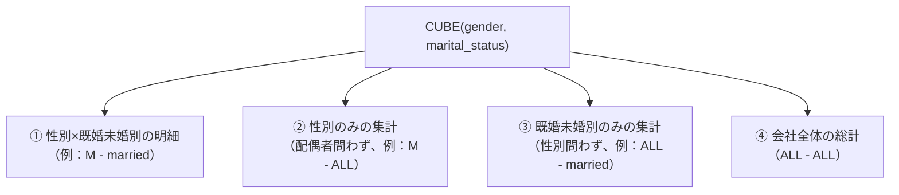

具体的には、性別×既婚未婚別の明細、性別のみの集計（配偶者問わず）、既婚未婚別のみの集計（性別問わず）、会社全体の総計、の4つです。

| 集計句 | 使いどころ | 今回に当てはめると |
| :--- | :--- | :--- |
| `ROLLUP` | 「国＞都市」のような階層構造（親子関係）がある場合 | 該当なし |
| `CUBE` | 並列な項目をあらゆる角度から分析したい場合 | 性別・配偶者の有無のような対等な軸 |

前回の`ROLLUP`は「国＞都市」のような階層構造（親子関係）がある場合に使いますが、今回の「性別」と「配偶者の有無」のように並列な項目をあらゆる角度から分析したい場合は、`CUBE`の方が向いています。

解答例では`NVL(gender, 'ALL')`と記述されています。集計によってまとめられた行にはNULLが入るため、それを人間が読みやすいように`'ALL'`（すべて）という文字列に置き換えています。ただし、もし元のデータに本物のNULL（未回答など）が含まれている場合、`NVL`だけでは「集計結果のNULL」なのか「データのNULL」なのか区別がつきません。より厳密に行うなら、問題8-7で使った`GROUPING`関数を併用する方法もあります。

この結果を`UNION ALL`で作ろうとすると、4つの`SELECT`文を書き、それぞれテーブルをフルスキャンする必要があります。

| 方法 | コード量 | テーブルの読み込み回数 |
| :--- | :--- | :---: |
| `UNION ALL`で4クエリ | 多い（4つのSELECT文） | 4回（クエリごとに1回） |
| `CUBE`句 | 少ない（1つのSELECT文） | 1回で済む |

`CUBE`ならコード量は4分の1以下で済み、テーブル読み込みも1回で済むため、データ量が多いほどパフォーマンスの差が大きくなります。

`ORDER BY gender, marital_status`とすることで、`ALL`（Aで始まるため先頭に来やすい）、`F`（Female）のグループ、`M`（Male）のグループ、という順に自然と並びます。

この`CUBE`で得られた結果は、以前学んだ「クロス集計（縦持ちから横持ち）」のテクニックと組み合わせることで、ExcelのピボットテーブルのようなレポートをSQLだけで再現できます。住所（国＞県＞市）や時間（年＞月＞日）のように階層がある場合は`ROLLUP`、性別×年代やカテゴリ×地域のように項目を入れ替えて多角的に見たい場合は`CUBE`、という使い分けを覚えておくとよいと思います。

---
<br><br>

# 【完全版】問題8-11：任意の組み合わせだけを指定する集計（GROUPING SETS）
### 難易度：★★★★☆ (Lv.4)
## 問題
経営企画部から、キャンペーン結果を分析するための売上レポート作成依頼がありました。
「地域（`REGION`）× 商品カテゴリ（`CATEGORY`）ごとの売上明細」と、「会社全体の総売上」の**2種類だけ**が欲しいとのことです。
前回（問題8-7）の`ROLLUP`のような「地域ごとの小計」や、問題8-10の`CUBE`のような「カテゴリだけの小計」は、今回の分析目的にはノイズになるため**不要**と念を押されています。

再現性のため、以下の`WITH`句で売上データを用意します。

```sql
WITH sales_data AS (
    SELECT 'east' AS region, 'electronics' AS category, 1200 AS amount FROM dual UNION ALL
    SELECT 'east', 'clothing',     800 FROM dual UNION ALL
    SELECT 'east', 'grocery',      500 FROM dual UNION ALL
    SELECT 'west', 'electronics', 1500 FROM dual UNION ALL
    SELECT 'west', 'clothing',     600 FROM dual UNION ALL
    SELECT 'west', 'grocery',      900 FROM dual
)
SELECT * FROM sales_data
```

**【集計・出力ルール】**
* 「地域×カテゴリの明細」と「会社全体の総計」の**2パターンのみ**を1つの結果セットで取得すること（地域だけの小計、カテゴリだけの小計は含めないこと）。
* 集計によってまとめられた行（地域・カテゴリがNULLになる行）には、それぞれ`'全社'`／`'合計'`という文字列を表示すること。
* 表示順は、明細行が先、総計行が最後になるようにし、明細行の中では地域・カテゴリの昇順とすること。

## 期待する結果
| REGION | CATEGORY    | TOTAL_AMOUNT |
| ------ | ----------- | ------------ |
| east   | clothing    | 800          |
| east   | electronics | 1200         |
| east   | grocery     | 500          |
| west   | clothing    | 600          |
| west   | electronics | 1500         |
| west   | grocery     | 900          |
| 全社   | 合計        | 5500         |

## 解答例
```sql:例1：NG例①（ROLLUPでは不要な小計まで出てしまう）
WITH sales_data AS (
    SELECT 'east' AS region, 'electronics' AS category, 1200 AS amount FROM dual UNION ALL
    SELECT 'east', 'clothing',     800 FROM dual UNION ALL
    SELECT 'east', 'grocery',      500 FROM dual UNION ALL
    SELECT 'west', 'electronics', 1500 FROM dual UNION ALL
    SELECT 'west', 'clothing',     600 FROM dual UNION ALL
    SELECT 'west', 'grocery',      900 FROM dual
)
SELECT
    NVL(region,   '全社') AS region,
    NVL(category, '合計') AS category,
    SUM(amount)           AS total_amount
FROM
    sales_data
GROUP BY
    ROLLUP(region, category)
ORDER BY
    GROUPING(region),
    region,
    category
```
```sql:例2：NG例②（GROUPING SETSで列を直書きするとORA-00979）
WITH sales_data AS (
    SELECT 'east' AS region, 'electronics' AS category, 1200 AS amount FROM dual UNION ALL
    SELECT 'east', 'clothing',     800 FROM dual UNION ALL
    SELECT 'east', 'grocery',      500 FROM dual UNION ALL
    SELECT 'west', 'electronics', 1500 FROM dual UNION ALL
    SELECT 'west', 'clothing',     600 FROM dual UNION ALL
    SELECT 'west', 'grocery',      900 FROM dual
)
SELECT
    NVL(region,   '全社') AS region,   -- ORA-00979が発生する箇所
    NVL(category, '合計') AS category,
    SUM(amount)           AS total_amount
FROM
    sales_data
GROUP BY
    GROUPING SETS( (region, category), () )
ORDER BY
    GROUPING(region),
    region,
    category
-- ORA-00979: must appear in the GROUP BY clause or be used in an aggregate function
```
```sql:例3：NG例③（MAXで包むとエラーは消えるが総計行の値が誤る）
WITH sales_data AS (
    SELECT 'east' AS region, 'electronics' AS category, 1200 AS amount FROM dual UNION ALL
    SELECT 'east', 'clothing',     800 FROM dual UNION ALL
    SELECT 'east', 'grocery',      500 FROM dual UNION ALL
    SELECT 'west', 'electronics', 1500 FROM dual UNION ALL
    SELECT 'west', 'clothing',     600 FROM dual UNION ALL
    SELECT 'west', 'grocery',      900 FROM dual
)
SELECT
    NVL(MAX(sales_data.region),   '全社') AS region,   -- 総計行が 'west' になってしまう
    NVL(MAX(sales_data.category), '合計') AS category, -- 総計行が 'grocery' になってしまう
    SUM(sales_data.amount)                AS total_amount
FROM
    sales_data
GROUP BY
    GROUPING SETS( (sales_data.region, sales_data.category), () )
ORDER BY
    GROUPING(sales_data.region),
    region,
    category
```
```sql:例4：正解（GROUPINGで判定してから値を選択）
WITH sales_data AS (
    SELECT 'east' AS region, 'electronics' AS category, 1200 AS amount FROM dual UNION ALL
    SELECT 'east', 'clothing',     800 FROM dual UNION ALL
    SELECT 'east', 'grocery',      500 FROM dual UNION ALL
    SELECT 'west', 'electronics', 1500 FROM dual UNION ALL
    SELECT 'west', 'clothing',     600 FROM dual UNION ALL
    SELECT 'west', 'grocery',      900 FROM dual
)
SELECT
    CASE WHEN GROUPING(sales_data.region)   = 1 THEN '全社'
         ELSE MAX(sales_data.region)   END AS region,
    CASE WHEN GROUPING(sales_data.category) = 1 THEN '合計'
         ELSE MAX(sales_data.category) END AS category,
    SUM(sales_data.amount)                  AS total_amount
FROM
    sales_data
GROUP BY
    GROUPING SETS( (sales_data.region, sales_data.category), () )
ORDER BY
    GROUPING(sales_data.region),
    region,
    category
```

## 解説
今回は、問題8-7で学んだ`ROLLUP`、問題8-10で学んだ`CUBE`に続く、多次元集計の3つ目の武器「`GROUPING SETS`」です。この3つを並べて理解することで、ようやく「集計句」のツールボックスが完成しますが、今回は3段階のつまずきを経由しながら学んでいきます。

### つまずき①：ROLLUPでは不要な小計まで出てしまう
まず例1（NG例①）です。`ROLLUP(region, category)`は、「地域×カテゴリの明細」「地域ごとの小計」「全体の総計」という3階層を自動生成します。実行するとエラーにはならず、一見それらしいレポートが出力されるため見逃しやすいのですが、実際には`east 合計: 2500`、`west 合計: 3000`という**依頼されていない地域小計の行**が2行紛れ込んでしまいます。

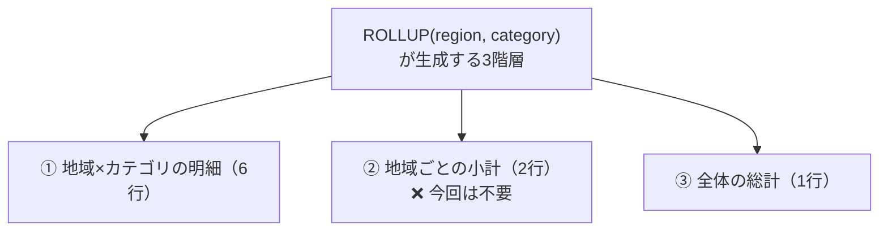

`region`と`category`の間に「国＞都市」のような親子の階層関係がないにもかかわらず`ROLLUP`を使うと、意図しない中間集計が自動でついてきてしまう、という典型的な落とし穴です。

### つまずき②：GROUPING SETSに書き換えるとORA-00979
「必要な組み合わせだけを列挙すればよいのでは」と`GROUPING SETS( (region, category), () )`に書き換えたのが例2ですが、今度は実行した瞬間に別のエラーに遭遇します。

```
ORA-00979: must appear in the GROUP BY clause or be used in an aggregate function
```

`GROUP BY GROUPING SETS( (region, category), () )`は、次の2つの`GROUP BY`を1回のスキャンでまとめて実行しているようなイメージで捉えると分かりやすくなります。

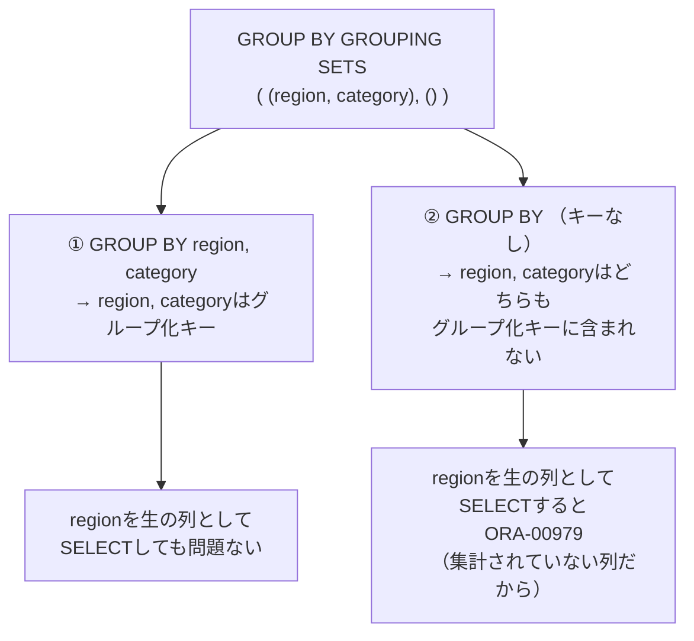

②の`()`（空集合＝全体総計）というグループ化パターンでは、`region`も`category`もグループ化のキーに一切含まれていません。この状態で`SELECT`句に`region`のような集約関数で囲んでいない生の列を書くと、Oracleは「グループ化されていない列を、集約後の1行の中でどの値として表示すればよいか特定できない」と判断し、`ORA-00979`エラーを返します。これは`GROUP BY`句一般に共通する基本ルール（`SELECT`句の非集約列は必ず`GROUP BY`に含まれていなければならない）そのものであり、`GROUPING SETS`固有の特殊な挙動ではありません。

一方、`ROLLUP(region, category)`や`CUBE(region, category)`でこの問題が起きないのは、これらが生成するすべての集計パターン（明細・小計・総計）において、Oracleが内部的に`region`・`category`のどちらの列も一貫して「集計対象の列」として扱う規則的な処理を行っているためです。`GROUPING SETS`は任意のパターンを自由に組み合わせられる分、パターンによって「その列がグループ化キーに含まれているかどうか」が変わりうる、という点が`ROLLUP`／`CUBE`との根本的な違いです。

### つまずき③：MAXで包むとエラーは消えるが値が誤る
回避策として、`MAX(region)`のように集約関数で包んでしまえばよい、と考え修正したのが例3です。`MAX(region)`と書けば、Oracleにとっては「集約関数の戻り値」という扱いになるため、グループ化キーに含まれているかどうかに関わらずSELECT句に書くことができ、`ORA-00979`は解消します。しかしこれは**構文エラーは解消しますが、結果が静かに誤る**という、最も危険なパターンです。

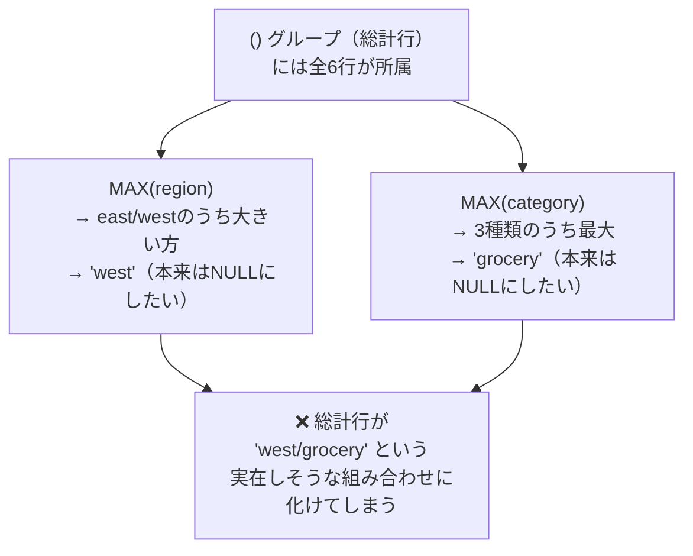

`()`（空集合＝全体総計）のグループには、テーブルの**全6行**が属することになります。`ROLLUP`や`CUBE`であれば、まとめられた次元は自動的にNULLになりますが、`MAX(region)`のように明示的に集約関数で包んでしまうと、そのグループに属する実際の行の値（`'east'`と`'west'`のうち文字列として大きい`'west'`、3カテゴリのうち最大の`'grocery'`）がそのまま計算されてしまいます。金額（`SUM`）自体は正しく`5500`になるため、一見それらしい1行に見えてしまうのが特に厄介な点です。

### 正解：GROUPINGで判定してから値を選択
例4が最終的な正解です。`MAX()`の結果をそのまま使うのではなく、`GROUPING()`関数で「その行がまとめられた行（総計行）かどうか」を先に判定し、判定結果に応じて表示する値を出し分けます。

```sql
CASE WHEN GROUPING(sales_data.region) = 1 THEN '全社'
     ELSE MAX(sales_data.region) END
```

`GROUPING(sales_data.region) = 1`は「その行がregionという次元でまとめられた（＝総計行である）」ことを意味します。この判定が真の場合は`MAX`の結果を使わず`'全社'`固定文字列に差し替え、それ以外（＝明細行）では各グループに該当行が1件しかないため`MAX(region)`は元の値をそのまま返します。ORA-00979の回避に必要だった`MAX()`はそのまま活かしつつ、`GROUPING()`による判定を1枚かぶせることで、「値の由来（集約されたものか、本来のデータか）」を正しく区別できるようになります。

3つの集計句と、SELECT句での列の扱いの違いを整理すると次のようになります。

| 集計句 | 生成される集計パターン | SELECT句での列の扱い |
| :--- | :--- | :--- |
| `ROLLUP(A, B)` | 明細／Aの小計／総計（規則的な階層） | 列を直書き可能、まとめられた列は自動でNULL |
| `CUBE(A, B)` | 明細／Aの小計／Bの小計／総計（全組み合わせ） | 列を直書き可能、まとめられた列は自動でNULL |
| `GROUPING SETS(...)` | カッコで指定した組み合わせのみ | パターンによってはグループ化キーに含まれない列が生じるため、`MAX()`等で包む必要があり、`GROUPING()`と組み合わせないと値が誤る |

`ROLLUP`と`CUBE`はいずれも「規則」に従って自動的にパターンを生成するのに対し、`GROUPING SETS`はその規則から外れた「明細＋総計のみ」「AとCの組み合わせのみ（Bは除く）」といった、非対称・不規則な要求にも対応できる汎用性が最大の特徴です。実際、`ROLLUP(A, B)`は`GROUPING SETS((A, B), (A), ())`と、`CUBE(A, B)`は`GROUPING SETS((A, B), (A), (B), ())`と書き換えることができ、`GROUPING SETS`はこの2つの上位互換（より自由度の高い書き方）だと理解しておくと整理しやすいです。その自由度の高さと引き換えに、今回のような列参照の制約・誤集計のリスクが発生することがある、という点も併せて覚えておくと実務で役立ちます。

解答例の`ORDER BY GROUPING(sales_data.region), region, category`は、問題8-7でも使ったテクニックです。`GROUPING(region)`は明細行で`0`、総計行（regionがまとめられた行）で`1`を返すため、これを最優先のソートキーにすることで「明細が先、総計が最後」という順序を安定して実現できます。

期待する結果を見ると、地域×カテゴリの6行の後に「全社 / 合計 / 5500」という1行だけが続いており、`east 合計`や`west 合計`、`electronics 合計`のような中間集計も、例3のような`west/grocery`への誤変換も含まれていません。これはまさに、経営企画部から依頼された「明細と全体総計だけ」という要件に忠実な形です。

:::message
### GROUPING SETSと重複行、GROUP_ID()による検出
`GROUPING SETS`は任意の組み合わせを自由に列挙できる反面、指定の仕方によっては**同じ集計結果が複数回出力されてしまう**ことがあります。例えば`GROUPING SETS((region), (region, category), (region))`のように、うっかり同じ`(region)`を2回指定してしまうと、「地域ごとの小計」の行が重複して2回出力されます。

このような重複はSQL自体はエラーにならず実行できてしまうため、集計結果をそのままレポートに使うと、金額が2倍にカウントされたグラフや表を作ってしまう危険があります。

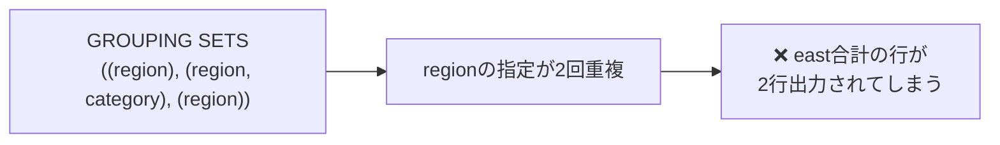

こうした重複を検出するために用意されているのが`GROUP_ID()`関数です。同じグループ化パターンが複数回生成された場合、1回目の出現には`0`、2回目以降の重複には`1`以上の値が割り当てられます。

```sql
SELECT
    MAX(region)   AS region,
    MAX(category) AS category,
    SUM(amount)   AS total_amount,
    GROUP_ID()    AS grp_id
FROM
    sales_data
GROUP BY
    GROUPING SETS((region), (region, category), (region))
```

この`GRP_ID`列を使って`HAVING GROUP_ID() = 0`と絞り込めば、重複した集計行を除去できます。`GROUPING SETS`を手書きで組み立てる際、特に複数人でクエリを継ぎ足していくような場面では、意図せず同じ組み合わせを重複指定してしまうミスが起こりやすいので、`GROUP_ID()`の存在は頭の片隅に置いておくとよいと思います。
:::

`GROUPING SETS`は、今回のように「明細＋総計のみ」というシンプルな要求だけでなく、「地域別の小計は欲しいがカテゴリ別の小計は不要」「特定の2軸の組み合わせだけを見たい」といった、`ROLLUP`や`CUBE`では表現しきれない非対称な要件にこそ真価を発揮します。ただし今回見た通り、`MAX()`でエラーを消しただけで満足せず、`GROUPING()`で値の由来を正しく判定するところまでがワンセットである点は、特に注意しておきたいポイントです。

## 参考リンク
https://www.shift-the-oracle.com/sql/group-by-having.html

---
<br><br>

# 【完全版】問題8-12：データのばらつきを測る（STDDEV / VARIANCE）
### 難易度：★★★★☆ (Lv.4)
## 問題
人事部から、部門別の給与制度を見直すための分析依頼がありました。
「A部門」と「B部門」は、どちらも平均給与（`AVG`）だけを見るとほぼ同じ水準ですが、実際の給与の**散らばり方**には大きな違いがあるのではないか、という仮説を検証したいとのことです。
なお、対象となるのは各部門に**現に所属している全従業員**であり、そこから抽出した一部の「標本（サンプル）」ではなく、それ自体が分析対象の**母集団**である点に注意してください。

再現性のため、以下の`WITH`句で部門別の給与データを用意します。

```sql
WITH dept_salaries AS (
    SELECT 'A部門' AS dept_name, 2800 AS salary FROM dual UNION ALL
    SELECT 'A部門', 2900 FROM dual UNION ALL
    SELECT 'A部門', 3000 FROM dual UNION ALL
    SELECT 'A部門', 3100 FROM dual UNION ALL
    SELECT 'A部門', 3200 FROM dual UNION ALL
    SELECT 'B部門', 1000 FROM dual UNION ALL
    SELECT 'B部門', 2000 FROM dual UNION ALL
    SELECT 'B部門', 3000 FROM dual UNION ALL
    SELECT 'B部門', 4000 FROM dual UNION ALL
    SELECT 'B部門', 5000 FROM dual
)
SELECT * FROM dept_salaries
```

**【取得項目】**
1. **DEPT_NAME**：部門名
2. **AVG_SALARY**：給与の平均値（小数点第2位まで四捨五入）
3. **STDDEV_SALARY**：給与の**母標準偏差**（小数点第2位まで四捨五入）
4. **VARIANCE_SALARY**：給与の**母分散**（小数点第2位まで四捨五入）

**【条件】**
* 部門ごとにグループ化すること。
* 結果は`DEPT_NAME`の昇順で表示すること。

## 期待する結果
| DEPT_NAME | AVG_SALARY | STDDEV_SALARY | VARIANCE_SALARY | 
| --------- | ---------- | ------------- | --------------- | 
| A部門     | 3000       | 141.42        | 20000           | 
| B部門     | 3000       | 1414.21       | 2000000         | 

## 解答例
```sql:例1：NG例（デフォルトのSTDDEV／VARIANCEを使うと母集団の値と一致しない）
WITH dept_salaries AS (
    SELECT 'A部門' AS dept_name, 2800 AS salary FROM dual UNION ALL
    SELECT 'A部門', 2900 FROM dual UNION ALL
    SELECT 'A部門', 3000 FROM dual UNION ALL
    SELECT 'A部門', 3100 FROM dual UNION ALL
    SELECT 'A部門', 3200 FROM dual UNION ALL
    SELECT 'B部門', 1000 FROM dual UNION ALL
    SELECT 'B部門', 2000 FROM dual UNION ALL
    SELECT 'B部門', 3000 FROM dual UNION ALL
    SELECT 'B部門', 4000 FROM dual UNION ALL
    SELECT 'B部門', 5000 FROM dual
)
SELECT
    dept_name,
    ROUND(AVG(salary), 2)      AS avg_salary,
    ROUND(STDDEV(salary), 2)   AS stddev_salary,   -- 標本標準偏差（n-1で割る）
    ROUND(VARIANCE(salary), 2) AS variance_salary  -- 標本分散（n-1で割る）
FROM
    dept_salaries
GROUP BY
    dept_name
ORDER BY
    dept_name
```
```sql:例2：正解（STDDEV_POP／VAR_POPで母集団の値を算出）
WITH dept_salaries AS (
    SELECT 'A部門' AS dept_name, 2800 AS salary FROM dual UNION ALL
    SELECT 'A部門', 2900 FROM dual UNION ALL
    SELECT 'A部門', 3000 FROM dual UNION ALL
    SELECT 'A部門', 3100 FROM dual UNION ALL
    SELECT 'A部門', 3200 FROM dual UNION ALL
    SELECT 'B部門', 1000 FROM dual UNION ALL
    SELECT 'B部門', 2000 FROM dual UNION ALL
    SELECT 'B部門', 3000 FROM dual UNION ALL
    SELECT 'B部門', 4000 FROM dual UNION ALL
    SELECT 'B部門', 5000 FROM dual
)
SELECT
    dept_name,
    ROUND(AVG(salary), 2)        AS avg_salary,
    ROUND(STDDEV_POP(salary), 2) AS stddev_salary,  -- 母標準偏差（nで割る）
    ROUND(VAR_POP(salary), 2)    AS variance_salary -- 母分散（nで割る）
FROM
    dept_salaries
GROUP BY
    dept_name
ORDER BY
    dept_name
```

## 解説
問題8-9では`MEDIAN`や`STATS_MODE`といった「代表値（データの中心はどこか）」を扱いました。今回はその対になる考え方として、「データの散らばり具合（バラつき）」を数値で表す`STDDEV`（標準偏差）と`VARIANCE`（分散）を扱います。

まず全体像として、A部門・B部門ともに給与の平均は`3000`で完全に一致しています。しかし中身を見ると、A部門は`2800〜3200`という狭い範囲に給与が収まっているのに対し、B部門は`1000〜5000`と大きく開いています。平均だけを見ていると、この「実態としての差」は見えてきません。

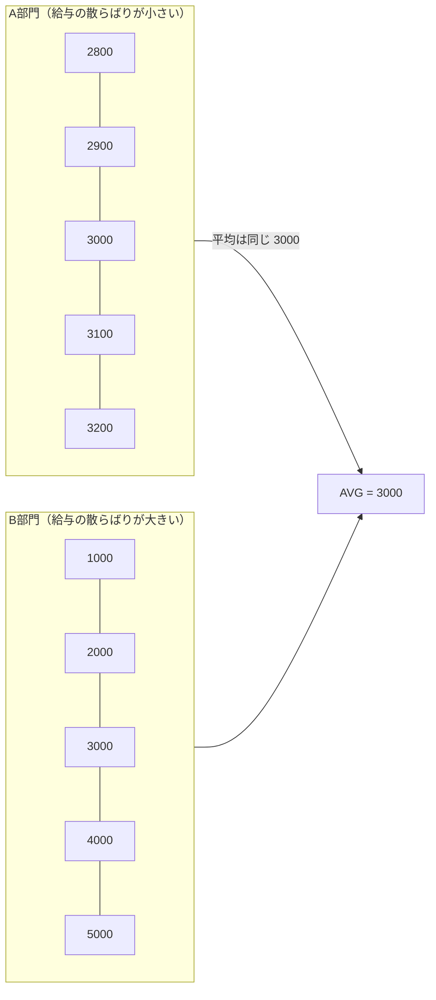

`VARIANCE`（分散）は、各データが平均からどれだけ離れているか（偏差）を2乗して平均した値です。2乗しているのは、単純に偏差を平均すると正の偏差と負の偏差が打ち消し合って必ず0になってしまうためです。`STDDEV`（標準偏差）は、この分散の平方根を取ったもので、単位を元のデータ（今回であれば「円」）に戻す役割があります。分散のままだと単位が「円の2乗」になってしまい直感的に扱いづらいため、実務では標準偏差の方がよく使われます。

さて、今回の最大の注意点は、例1（NG例）と例2（正解）の違いです。実行してもどちらもエラーにはならず、もっともらしい数値が返ってくるため、違いに気づかないまま採用してしまいやすい落とし穴です。

| 関数 | 計算方法 | 意味 |
| :--- | :--- | :--- |
| `STDDEV` / `VARIANCE` | 偏差の2乗和を **`n - 1`** で割る | **標本**標準偏差・**標本**分散 |
| `STDDEV_POP` / `VAR_POP` | 偏差の2乗和を **`n`** で割る | **母**標準偏差・**母**分散 |

Oracleでは`STDDEV`と`VARIANCE`という「素直な名前」の関数が、実は**標本（サンプル）**を対象とした計算式（`n-1`で割る）になっており、`_POP`（Population＝母集団）が付いた方が、対象データそのものを母集団として扱う計算式（`n`で割る）になっています。今回のように「A部門・B部門に**現に所属する全従業員**」という、それ自体が分析対象の全てであるデータを扱う場合は、一部を抽出した標本ではなく母集団そのものなので、`STDDEV_POP`／`VAR_POP`を使うのが概念的に正しい選択です。

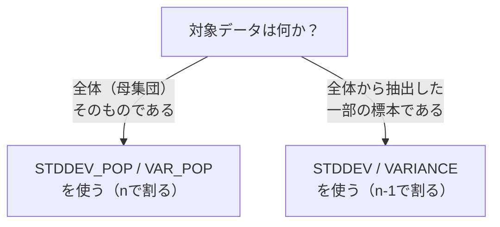

なぜ`n-1`で割る方式が存在するのかというと、統計学的に「標本から母集団のばらつきを推定する」場合、単純に`n`で割ると分散を過小評価してしまう傾向があるため、`n-1`で割ることで補正（不偏推定）する、という理論的な背景があります。しかし今回のように対象データがそもそも母集団の全件である場合は、この補正はむしろ余計であり、`STDDEV`（標本）をそのまま使うとA部門は`141.42`ではなく`158.11`、B部門は`1414.21`ではなく`1581.14`という、実際よりも大きめの値が算出されてしまいます。値そのものは実在しそうな数字であるため気づきにくいのですが、母集団と標本のどちらを扱っているかを取り違えると、こうした地味なズレが積み重なっていきます。

期待する結果を見ると、A部門とB部門は平均給与こそ同じ`3000`ですが、`STDDEV_SALARY`はA部門の`141.42`に対しB部門は`1414.21`と、ちょうど10倍の開きがあります。これは、平均給与という1つの数字だけでは「B部門は給与のばらつきがA部門の10倍ある」という実態を見抜けないことを示しています。人事制度の見直しでは、「平均が同じだから公平」ではなく、「ばらつきが大きい部門では、一部の従業員だけ突出して高い（または低い）給与になっている可能性がある」という視点が必要になり、`STDDEV`／`VARIANCE`はその第一歩となる指標です。

:::message
### NULLの扱いと、データが1件しかない場合の挙動
`STDDEV`／`VARIANCE`系の関数も、他の集計関数と同様にNULLを計算対象から自動的に除外します。

もう一点、実務で意外とハマりやすいのが「グループの中にデータが1件しかない場合」の挙動です。

| 関数 | 対象データが1件の場合の結果 |
| :--- | :--- |
| `STDDEV` / `VARIANCE`（標本、`n-1`で割る） | **NULL**（`n-1=0`となり、ゼロ除算のためNULLが返る） |
| `STDDEV_POP` / `VAR_POP`（母集団、`n`で割る） | **0**（`n=1`で割れるため、「ばらつきなし」として0が返る） |

例えば、ある部門に従業員が1人しかいない場合、`STDDEV(salary)`は計算不能としてNULLを返しますが、`STDDEV_POP(salary)`はエラーにもNULLにもならず`0`を返します。部門ごとの一覧レポートを作成した際、一部の行だけ`STDDEV`列が空欄になっていたら、それは「エラー」ではなく「その部門の従業員が1人しかいない」というデータ上の事実を示している可能性が高い、と読み解けるようにしておくとよいと思います。
:::

`VARIANCE`と`STDDEV`は`STDDEV = SQRT(VARIANCE)`という関係にあるため、どちらか一方だけを表示すれば十分な場面も多いですが、今回のように両方を並べておくと、「分散という中間値からどう標準偏差が導かれるか」を確認しやすくなります。問題8-9の`MEDIAN`／`STATS_MODE`（代表値）と、今回の`STDDEV`／`VARIANCE`（散らばり）を組み合わせれば、「データの中心はどこか」「データはどれくらい散らばっているか」という、統計分析の基本となる2つの軸を押さえられるようになります。
