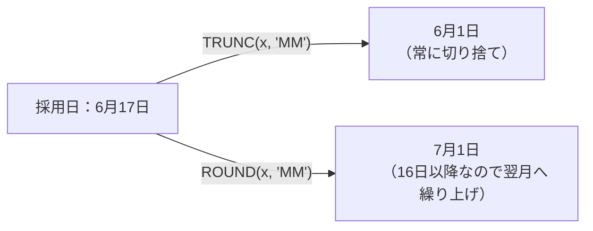
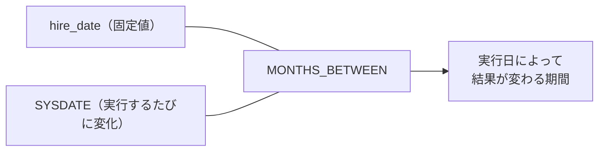
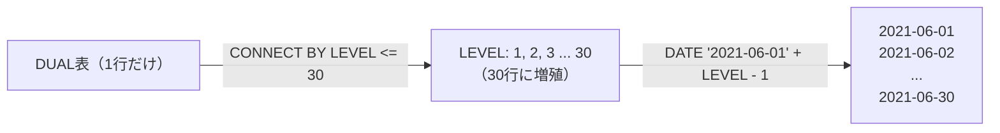
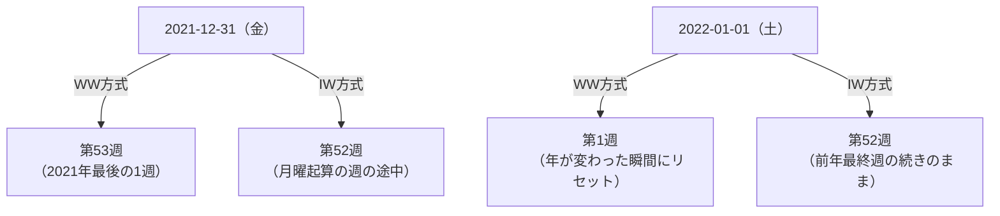
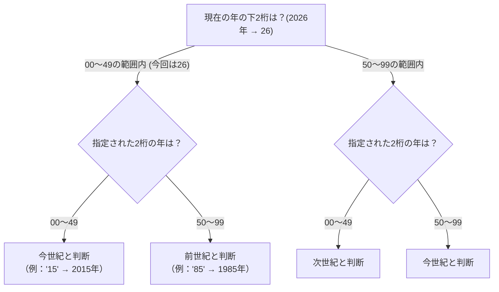
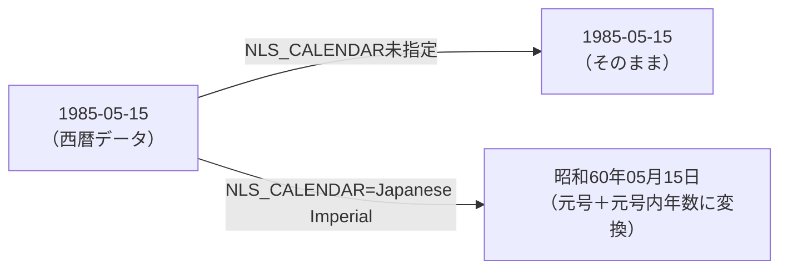
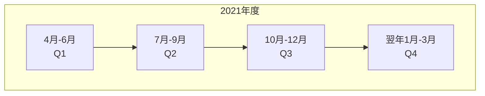
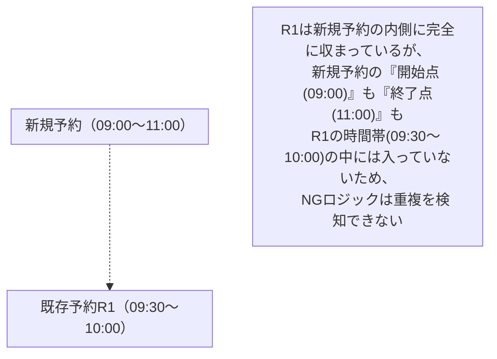
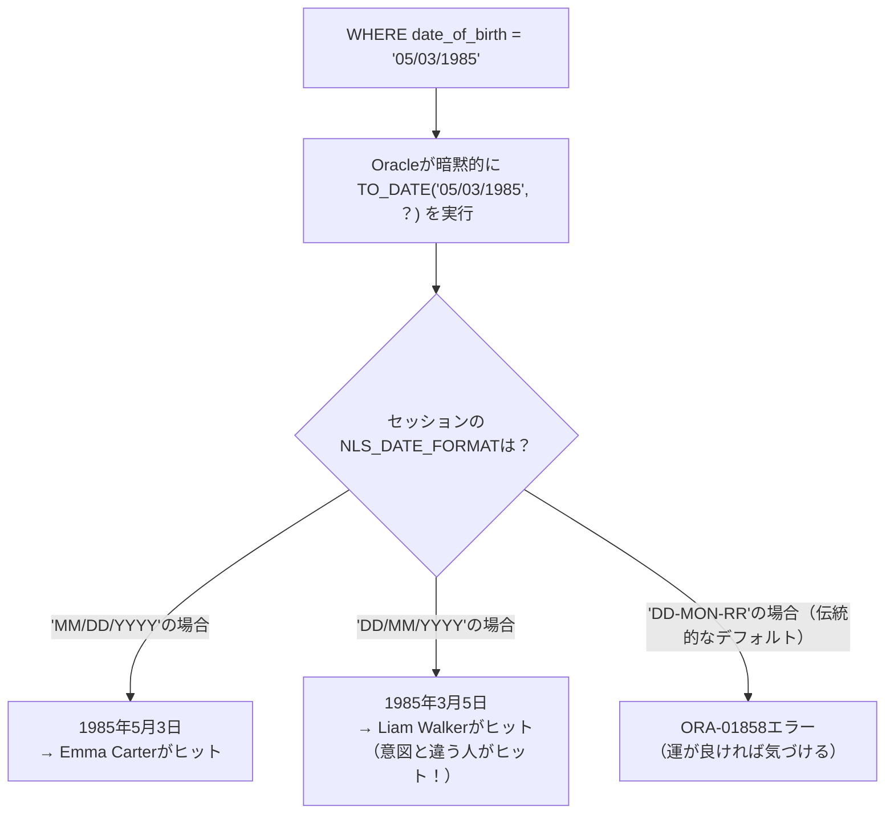

# 問題7-17：日付の四捨五入（ROUND）とTRUNCの違い
### 難易度：★★☆☆☆ (Lv.2)
## 問題
前問（7-9）では`TRUNC`関数を使って日付を「切り捨て」ましたが、Oracleには四捨五入を行う`ROUND`関数も用意されています。
HRスキーマの`EMPLOYEES`テーブルより、`EMPLOYEE_ID`が110より小さい従業員を対象として、採用日（`HIRE_DATE`）を基準に以下の日付を取得してください。なお、結果の表示順は問いません。

**【取得内容】**
* **月初日(TRUNC)**：採用日が属する月の1日（切り捨て）
* **月の四捨五入(ROUND)**：採用日を「月」単位で四捨五入した日付
* **年初日(TRUNC)**：採用日が属する年の1月1日（切り捨て）
* **年の四捨五入(ROUND)**：採用日を「年」単位で四捨五入した日付

※結果はすべて「YYYY-MM-DD」形式の文字列に変換して表示してください。

## 期待する結果
| EMPLOYEE_ID | HIRE_DATE  | 月初日(TRUNC) | 月の四捨五入(ROUND) | 年初日(TRUNC) | 年の四捨五入(ROUND) | 
| ----------- | ---------- | ------------- | ------------------- | ------------- | ------------------- | 
| 100         | 2013-06-17 | 2013-06-01    | 2013-07-01          | 2013-01-01    | 2013-01-01          | 
| 101         | 2015-09-21 | 2015-09-01    | 2015-10-01          | 2015-01-01    | 2016-01-01          | 
| 102         | 2011-01-13 | 2011-01-01    | 2011-01-01          | 2011-01-01    | 2011-01-01          | 
| 103         | 2016-01-03 | 2016-01-01    | 2016-01-01          | 2016-01-01    | 2016-01-01          | 
| 104         | 2017-05-21 | 2017-05-01    | 2017-06-01          | 2017-01-01    | 2017-01-01          | 
| 105         | 2015-06-25 | 2015-06-01    | 2015-07-01          | 2015-01-01    | 2015-01-01          | 
| 106         | 2016-02-05 | 2016-02-01    | 2016-02-01          | 2016-01-01    | 2016-01-01          | 
| 107         | 2017-02-07 | 2017-02-01    | 2017-02-01          | 2017-01-01    | 2017-01-01          | 
| 108         | 2012-08-17 | 2012-08-01    | 2012-09-01          | 2012-01-01    | 2013-01-01          | 
| 109         | 2012-08-16 | 2012-08-01    | 2012-09-01          | 2012-01-01    | 2013-01-01          |

## 解答例
```sql
SELECT
    employee_id,
    TO_CHAR(hire_date,          'YYYY-MM-DD') AS hire_date,
    TO_CHAR(TRUNC(hire_date, 'MM'), 'YYYY-MM-DD') AS "月初日(TRUNC)",
    TO_CHAR(ROUND(hire_date, 'MM'), 'YYYY-MM-DD') AS "月の四捨五入(ROUND)",
    TO_CHAR(TRUNC(hire_date, 'YY'), 'YYYY-MM-DD') AS "年初日(TRUNC)",
    TO_CHAR(ROUND(hire_date, 'YY'), 'YYYY-MM-DD') AS "年の四捨五入(ROUND)"
FROM
    hr.employees
WHERE
    employee_id < 110
```

## 解説
前問（7-9）で登場した`TRUNC`は「問答無用で切り捨てる」関数でしたが、今回の`ROUND`は数値の四捨五入と同じ発想で、日付にも「丸める」という考え方を適用できる関数です。

```sql
ROUND( [日付データ], '[書式モデル]' )
```

書式モデルの指定方法自体は`TRUNC`と共通ですが、挙動が大きく異なります。

| 関数 | 挙動 | 例（6月17日、書式`'MM'`） |
| :--- | :--- | :--- |
| `TRUNC(date, 'MM')` | 問答無用で月初に切り捨てる | 6月1日 |
| `ROUND(date, 'MM')` | 月の中間日を境に、前後どちらに近いか判定する | 7月1日（17日は後半なので繰り上がる） |

`ROUND(date, 'MM')`の判定基準は「その月の16日」です。1日〜15日（月の前半）に丸める場合は当月の1日に、16日〜月末（月の後半）に丸める場合は翌月の1日に繰り上がります。



期待する結果のEMPLOYEE_ID=109（2012-08-16）に注目してください。ちょうど境界値の16日に採用されているため、`TRUNC`では8月のまま（2012-08-01）ですが、`ROUND`では9月に繰り上がっています（2012-09-01）。逆にEMPLOYEE_ID=102（2011-01-13）のように15日以前の場合は、`TRUNC`と`ROUND`の結果が完全に一致します。

年単位（`'YY'`）で丸める場合の境界は「7月1日」です。1月〜6月に丸める場合はその年の1月1日に、7月〜12月に丸める場合は翌年の1月1日に繰り上がります。EMPLOYEE_ID=101（2015-09-21、9月）や108・109（2012-08-1x、8月）は、いずれも下半期の採用のため、`ROUND`では年をまたいで翌年扱いになっている点を確認してください。

| 書式モデル | 境界日 | 前半（丸めない） | 後半（繰り上がる） |
| :---: | :---: | :--- | :--- |
| `'MM'`（月） | 16日 | 1〜15日 | 16日〜月末 |
| `'YY'`（年） | 7月1日 | 1月〜6月 | 7月〜12月 |
| `'Q'`（四半期） | 各四半期の中間月の16日相当 | 前半45日 | 後半45日 |

実務では、`TRUNC`が「その月・年の集計の起点を揃える」ために使われるのに対し、`ROUND`は「どちらの月・年に近いとみなすか」を判定する用途で使われます。例えば、契約開始日が月の後半であれば実質的に翌月扱いにして請求サイクルを決める、入社日が下半期であれば「翌年入社」として研修カリキュラムの年度を割り当てる、といったビジネスルールに`ROUND`がそのまま応用できます。

一点注意したいのは、`ROUND`は`TRUNC`と違って「未来の日付」に丸められる可能性があるという点です。`TRUNC`は常に「過去または当日」に寄りますが、`ROUND`は条件次第で採用日より後の日付（翌月・翌年）を返します。「集計の締め日」のように必ず過去方向に丸めたい処理で誤って`ROUND`を使うと、まだ来ていない未来の日付が結果に混ざってしまうため、`TRUNC`との使い分けを意識することが大切です。

:::message
### TRUNCとROUNDの使い分けの目安
* **`TRUNC`**：集計のグルーピングキーを作りたいとき（「その月の売上」「その週の件数」など、常に過去方向に丸めたい場合）
* **`ROUND`**：「どちらの期間に近いか」を判定したいとき（月の前半/後半による締め処理の振り分けなど）
:::

## 参考リンク
https://www.shift-the-oracle.com/sql/functions/round-datetime.html
https://www.shift-the-oracle.com/sql/functions/trunc-datetime.html

----
<br><br>

# 問題7-18：勤続年数の算出（SYSDATEを使った期間計算）
### 難易度：★★☆☆☆ (Lv.2)
## 問題
HRスキーマの`EMPLOYEES`テーブルより、`EMPLOYEE_ID`が105以下の従業員を対象として、**本日時点**での勤続年数を「〇年〇ヶ月」形式で算出してください。なお、結果の表示順はEMPLOYEE_IDの昇順とします。

**【算出のヒント】**
* 前問（7-6）と同様に`MONTHS_BETWEEN`関数を使用しますが、今回は比較対象の片方が`SYSDATE`（実行日）になります。
* 端数の月は切り捨てて計算してください。
* 「今日」を基準にするため、実行するタイミング（日付）によって結果が変わることに注意してください。

## 期待する結果
| EMPLOYEE_ID | NAME            | HIRE_DATE  | 勤続年数   | 
| ----------- | --------------- | ---------- | ---------- | 
| 100         | Steven King     | 2013-06-17 | 13年1ヶ月  | 
| 101         | Neena Yang      | 2015-09-21 | 10年10ヶ月 | 
| 102         | Lex Garcia      | 2011-01-13 | 15年6ヶ月  | 
| 103         | Alexander James | 2016-01-03 | 10年7ヶ月  | 
| 104         | Bruce Miller    | 2017-05-21 | 9年2ヶ月   | 
| 105         | David Williams  | 2015-06-25 | 11年1ヶ月  | 

> 表示される値は、SQLを実行した日付（本日）によって変動します。上記は2026年8月10日時点での参考値です。

## 解答例
```sql
SELECT
    employee_id,
    first_name || ' ' || last_name AS name,
    TO_CHAR(hire_date, 'YYYY-MM-DD') AS hire_date,
    TRUNC(MONTHS_BETWEEN(SYSDATE, hire_date) / 12) || '年' ||
      MOD(TRUNC(MONTHS_BETWEEN(SYSDATE, hire_date)), 12) || 'ヶ月' AS "勤続年数"
FROM
    hr.employees
WHERE
    employee_id <= 105
ORDER BY
    employee_id
```

## 解説
今回は前問7-6の応用編です。式の形そのものは`MONTHS_BETWEEN`→`TRUNC`→`MOD`という同じ組み立てですが、決定的に違うのは**比較対象の片方が「固定値」ではなく「実行するたびに変わるSYSDATE」になっている**という点です。

```sql
MONTHS_BETWEEN(SYSDATE, hire_date)
```

7-6の`START_DATE`と`END_DATE`はどちらもテーブルに保存された不変のデータでしたが、今回は「今日」という動く基準点を使って期間を測っています。そのため、このクエリは**実行するたびに結果が変わる「非決定的（non-deterministic）」なクエリ**です。同じSQLでも、今日実行した場合と1年後に実行した場合とでは、当然「勤続年数」の値が異なります。



この性質は、テストやレビューの場面で誤解を生みやすいポイントです。「昨日確認したときは『13年0ヶ月』だったのに、今日実行したら『13年1ヶ月』になっている」という現象は、SQLのバグではなく、`SYSDATE`を使っている以上当然起こる正しい挙動です。7-1の解説で触れた「表示される値は実行時によって変動する」という注意点は、今回のような期間計算にもそのまま当てはまります。

実務でこの計算パターンが最もよく使われるのが、**年齢の算出**です。`HIRE_DATE`の代わりに`DATE_OF_BIRTH`（生年月日）を使えば、そのまま「満年齢」の計算に転用できます。
```sql
-- 応用：生年月日から満年齢を算出する場合
TRUNC(MONTHS_BETWEEN(SYSDATE, date_of_birth) / 12) AS "満年齢"
```

ここで初心者がよく引っかかる罠が、「今年の誕生日をまだ迎えていない場合」の扱いです。例えば生年月日が「1990年12月25日」の人を、実行日が「2026年8月10日」の状態で計算すると、単純に「2026 - 1990 = 36歳」としてしまうミスが起こりがちです。しかし実際にはまだ12月の誕生日を迎えていないため、正しくは「35歳」です。

| 判定方法 | 挙動 |
| :--- | :--- |
| `西暦の引き算のみ`（❌） | 誕生日を迎えたかどうかを無視するため、実際より1歳多く数えてしまうことがある |
| `MONTHS_BETWEEN` + `TRUNC`（⭕） | 月・日の情報まで考慮した上で月数を算出し、端数月を切り捨てるため、誕生日未到来のケースも正しく1歳少なく計算される |

`MONTHS_BETWEEN`は年・月・日すべての差分を考慮した「月数」を返し、それを`TRUNC`で切り捨てているため、「まだ誕生日（記念日）を迎えていない」ケースも自動的に正しく処理されます。期待する結果のEMPLOYEE_ID=101（2015-09-21入社）を見てください。実行日である2026年8月10日はまだ9月21日（入社記念日）を迎えていないため、単純な「2026-2015=11年」ではなく、1年少ない「10年10ヶ月」が正しい答えになっています。

もう一点、実務での注意点として、`SYSDATE`を含むクエリはアプリケーション側でキャッシュされた結果と食い違うことがある、という問題があります。バッチ処理が日付をまたいで実行された場合や、深夜0時direkt前後に実行された場合など、「いつの時点のSYSDATEを基準にすべきか」をあらかじめ`WITH`句や変数で固定しておくと、処理の途中で日付が変わってしまうという不具合を防げます。
```sql
-- 実行途中で日付がずれないよう、SYSDATEを最初に固定する例
WITH base AS (
    SELECT TRUNC(SYSDATE) AS today FROM dual
)
SELECT
    e.employee_id,
    TRUNC(MONTHS_BETWEEN(b.today, e.hire_date) / 12) AS "満年数"
FROM
    hr.employees e, base b
```

7-6が「過去の確定した期間」を測るのに対し、今回は「現在進行系の期間」を測るという点が本質的な違いです。この2つを対比させて理解しておくと、年齢計算・勤続年数・契約経過日数など、実務で頻出する期間系の要件にスムーズに対応できるようになります。

## 参考リンク
https://www.shift-the-oracle.com/sql/functions/months_between.html
https://www.shift-the-oracle.com/sql/functions/sysdate.html

----
<br><br>

# 【完全版】問題7-19：日付マスタの動的生成による「0件の日」を含めた日次集計
### 難易度：★★★★☆ (Lv.4)
## 問題
マーケティング部門から「2021年6月の日別注文件数の推移をグラフ化したい」という依頼がありました。しかし、`CO.ORDERS`テーブルは注文が発生した日のデータしか持っておらず、注文が1件も無かった日はテーブルに行として存在しません。このままグラフを作成すると、注文0件の日がグラフ上で不自然に「欠落」してしまい、正しい推移を示せません。

COスキーマの`ORDERS`テーブルを用いて、**2021年6月1日〜2021年6月30日**の日別注文件数を集計してください。ただし、注文が1件も無かった日についても、その日付を`ORDER_COUNT = 0`として結果に必ず含めてください。

出力にあたっては以下の条件を満たしてください。
1. 日付を`ORDER_DATE`という列名で「YYYY-MM-DD」形式の文字列として出力する。
2. その日の注文件数を`ORDER_COUNT`列として出力する。
3. 結果は`ORDER_DATE`の昇順でソートする。
4. 6月1日から6月30日まで、必ず30行が出力されること（歯抜けがあってはならない）。

## 期待する結果
| ORDER_DATE | ORDER_COUNT | 
| ---------- | ----------- | 
| 2021-06-01 | 6           | 
| 2021-06-02 | 5           | 
| 2021-06-03 | 4           | 
| 2021-06-04 | 4           | 
| 2021-06-05 | 3           | 
| 2021-06-06 | 5           | 
| 2021-06-07 | 1           | 
| 2021-06-08 | 3           | 
| 2021-06-09 | 3           | 
| 2021-06-10 | 3           | 
| 2021-06-11 | 2           | 
| 2021-06-12 | 4           | 
| 2021-06-13 | 5           | 
| 2021-06-14 | 5           | 
| 2021-06-15 | 4           | 
| 2021-06-16 | 5           | 
| 2021-06-17 | 3           | 
| 2021-06-18 | 4           | 
| 2021-06-19 | 6           | 
| 2021-06-20 | 6           | 
| 2021-06-21 | 6           | 
| 2021-06-22 | 7           | 
| 2021-06-23 | 3           | 
| 2021-06-24 | 4           | 
| 2021-06-25 | 5           | 
| 2021-06-26 | 7           | 
| 2021-06-27 | 6           | 
| 2021-06-28 | 2           | 
| 2021-06-29 | 4           | 
| 2021-06-30 | 1           | 

## 解答例
```sql:例1：CONNECT BY LEVELで日付マスタを動的に生成
SELECT
    TO_CHAR(cal.dt, 'YYYY-MM-DD') AS order_date,
    COUNT(o.order_id)            AS order_count
FROM
    (
        SELECT DATE '2021-06-01' + LEVEL - 1 AS dt
        FROM dual
        CONNECT BY LEVEL <= (DATE '2021-06-30' - DATE '2021-06-01' + 1)
    ) cal
    LEFT JOIN co.orders o
        ON TRUNC(o.order_tms) = cal.dt
GROUP BY
    cal.dt
ORDER BY
    cal.dt
```
```sql:例2：WITH句で範囲をパラメータ化した場合
WITH params AS (
    SELECT DATE '2021-06-01' AS date_from,
           DATE '2021-06-30' AS date_to
    FROM dual
),
calendar AS (
    SELECT p.date_from + LEVEL - 1 AS dt
    FROM params p
    CONNECT BY LEVEL <= (SELECT date_to - date_from + 1 FROM params)
)
SELECT
    TO_CHAR(c.dt, 'YYYY-MM-DD') AS order_date,
    COUNT(o.order_id)          AS order_count
FROM
    calendar c
    LEFT JOIN co.orders o
        ON TRUNC(o.order_tms) = c.dt
GROUP BY
    c.dt
ORDER BY
    c.dt
```

## 解説
今回のテーマは、これまでの7章の問題とは少し毛色が異なります。7-1〜7-18がすべて「**既にテーブルに存在する行**の日付をどう計算・整形するか」だったのに対し、今回は「**テーブルに存在しない日付**をどうやって作り出すか」という、日付データを能動的に生成するテクニックです。

このクエリの主役は`CONNECT BY LEVEL`です。
```sql
SELECT LEVEL FROM dual CONNECT BY LEVEL <= 5;
-- 結果：1, 2, 3, 4, 5
```
本来`CONNECT BY`は階層構造（組織図など）を辿るための構文で、詳しくは第14章で扱いますが、`START WITH`を省略して`CONNECT BY LEVEL <= n`という形だけで使うと、単に「1からnまでの連番」を生成する便利な小技として機能します。1行しかない`DUAL`表から、`LEVEL`という擬似列の力を借りて複数行を人工的に作り出しているイメージです。



生成した連番（1〜30）に対して`DATE '2021-06-01' + LEVEL - 1`という日付の足し算を行うことで、「6月1日から6月30日までの30個の日付」を1行ずつ持つ、その場限りの「日付マスタ（カレンダーテーブル）」を作り出しています。

```sql
DATE '2021-06-01' + LEVEL - 1
```
| LEVEL | 計算結果 |
| :---: | :--- |
| 1     | 2021-06-01 |
| 2     | 2021-06-02 |
| ...   | ... |
| 30    | 2021-06-30 |

この「作られた日付マスタ」を主軸（`FROM`句の起点）に置き、実データである`ORDERS`テーブルを`LEFT JOIN`で結合しているのが、このクエリのもう一つの核心です。

| 結合方法 | 挙動 | 今回の適否 |
| :--- | :--- | :---: |
| `INNER JOIN`（内部結合） | 両方に一致するデータがある行だけ残る | ❌ 注文0件の日が消えてしまう |
| `LEFT JOIN`（外部結合） | 左側（日付マスタ）を必ず全件残し、右側に一致がなければNULLで埋める | ⭕ 0件の日も「0」として残せる |

もし`INNER JOIN`（あるいは単なる`WHERE`結合）を使ってしまうと、注文が1件も無い日は`ORDERS`側にマッチする行が存在しないため、結果からその日付ごと消えてしまいます。これでは「歯抜けのグラフ」問題を解決したことになりません。`LEFT JOIN`を使うことで、「日付マスタ側の30日分は絶対に消さない」という保証を得た上で、一致する注文が無い日は`o.order_id`が`NULL`になり、`COUNT(o.order_id)`（`COUNT(*)`ではない点に注意）がその`NULL`を数えないため、結果として自然に「0」になります。

:::message
### COUNT(*) と COUNT(列名) の違い
`COUNT(*)`は行数をそのまま数えるのに対し、`COUNT(列名)`はその列が`NULL`でない行だけを数えます。今回`LEFT JOIN`で注文が無い日は`o.order_id`が`NULL`になるため、`COUNT(*)`を使うと（`LEFT JOIN`でも結合結果自体は1行できるため）誤って「1」とカウントしてしまいます。0件の日を正しく「0」にするには、必ず`COUNT(o.order_id)`のように**右側テーブルの列**を指定してください。
:::

このように「主軸となる完全なマスタ」と「歯抜けのある実データ」を`LEFT JOIN`で組み合わせる考え方は、SQLの世界で **「Gaps and Islands（隙間と島）問題」** と呼ばれる有名なパターンの一種です。売上が無い日、ログインが無かった日、在庫がゼロだった時間帯など、「存在しないことそのものに意味がある」レポートを作る際には欠かせないテクニックです。

実務での応用範囲は広く、`LEVEL <= 24`と`TRUNC(order_tms, 'HH24')`を組み合わせれば「24時間分の時間帯マスタ」を作って7-15のような時間帯別集計の抜け漏れを防げますし、`LEVEL <= 12`と`ADD_MONTHS`を組み合わせれば「年間12ヶ月分の月次マスタ」も同様に作れます。
```sql
-- 応用：時間帯（0〜23時）の抜け漏れを防ぐ場合
SELECT LEVEL - 1 AS hour_of_day
FROM dual
CONNECT BY LEVEL <= 24
```

なお、今回のように生成する日数が数十〜数百程度であれば`CONNECT BY LEVEL`で十分ですが、生成する範囲が数万日を超えるような極端なケースでは、より重い処理になる可能性があります。その場合は、あらかじめ物理的な「日付マスタテーブル」を用意しておき、それを`LEFT JOIN`するという設計の方が実務では好まれることも付け加えておきます。

## 参考リンク
https://docs.oracle.com/cd/E16338_01/server.112/b56299/pseudocolumns001.htm


----
<br><br>

# 問題7-20：ISO週番号（IW）とWW週番号の違い
### 難易度：★★★☆☆ (Lv.3)
## 問題
COスキーマの`ORDERS`テーブルより、注文日時（`ORDER_TMS`）が「2021年12月28日」から「2022年1月4日」までの注文を対象として、それぞれの注文日が「年始から数えて何週目」にあたるかを、以下の2つの書式でそれぞれ取得してください。

1. **WW方式**：`'WW'`書式（1月1日を起点に7日ごとで区切る週番号）
2. **IW方式**：`'IW'`書式（ISO 8601に準拠し、月曜始まりで区切る週番号）

さらに、この2つの週番号の値が一致しないレコードには、備考列（`REMARKS`）に「不一致」という文字列を、一致するレコードには「一致」という文字列を出力してください。

出力にあたっては以下の条件を満たしてください。
1. 日付は「YYYY-MM-DD」形式の文字列として出力する。
2. 結果は`ORDER_TMS`の昇順でソートする。

## 期待する結果
| ORDER_ID | ORDER_DATE | WW方式 | IW方式 | REMARKS | 
| -------- | ---------- | ------ | ------ | ------- | 
| 1365     | 2021-12-28 | 52     | 52     | 一致    | 
| 1366     | 2021-12-28 | 52     | 52     | 一致    | 
| 1367     | 2021-12-28 | 52     | 52     | 一致    | 
| 1368     | 2021-12-28 | 52     | 52     | 一致    | 
| 1369     | 2021-12-28 | 52     | 52     | 一致    | 
| 1370     | 2021-12-28 | 52     | 52     | 一致    | 
| 1371     | 2021-12-28 | 52     | 52     | 一致    | 
| 1372     | 2021-12-28 | 52     | 52     | 一致    | 
| 1373     | 2021-12-29 | 52     | 52     | 一致    | 
| 1374     | 2021-12-29 | 52     | 52     | 一致    | 
| 1375     | 2021-12-29 | 52     | 52     | 一致    | 
| 1376     | 2021-12-29 | 52     | 52     | 一致    | 
| 1377     | 2021-12-29 | 52     | 52     | 一致    | 
| 1378     | 2021-12-30 | 52     | 52     | 一致    | 
| 1379     | 2021-12-30 | 52     | 52     | 一致    | 
| 1380     | 2021-12-30 | 52     | 52     | 一致    | 
| 1381     | 2021-12-30 | 52     | 52     | 一致    | 
| 1382     | 2021-12-30 | 52     | 52     | 一致    | 
| 1383     | 2021-12-31 | 53     | 52     | 不一致  | 
| 1384     | 2021-12-31 | 53     | 52     | 不一致  | 
| 1385     | 2021-12-31 | 53     | 52     | 不一致  | 
| 1386     | 2021-12-31 | 53     | 52     | 不一致  | 
| 1387     | 2021-12-31 | 53     | 52     | 不一致  | 
| 1388     | 2021-12-31 | 53     | 52     | 不一致  | 
| 1389     | 2021-12-31 | 53     | 52     | 不一致  | 
| 1390     | 2021-12-31 | 53     | 52     | 不一致  | 
| 1391     | 2021-12-31 | 53     | 52     | 不一致  | 
| 1392     | 2022-01-01 | 1      | 52     | 不一致  | 
| 1393     | 2022-01-01 | 1      | 52     | 不一致  | 
| 1394     | 2022-01-01 | 1      | 52     | 不一致  | 
| 1395     | 2022-01-01 | 1      | 52     | 不一致  | 
| 1396     | 2022-01-01 | 1      | 52     | 不一致  | 
| 1397     | 2022-01-01 | 1      | 52     | 不一致  | 
| 1398     | 2022-01-01 | 1      | 52     | 不一致  | 
| 1399     | 2022-01-02 | 1      | 52     | 不一致  | 
| 1400     | 2022-01-02 | 1      | 52     | 不一致  | 
| 1401     | 2022-01-02 | 1      | 52     | 不一致  | 
| 1402     | 2022-01-02 | 1      | 52     | 不一致  | 
| 1403     | 2022-01-02 | 1      | 52     | 不一致  | 
| 1404     | 2022-01-02 | 1      | 52     | 不一致  | 
| 1405     | 2022-01-03 | 1      | 1      | 一致    | 
| 1406     | 2022-01-03 | 1      | 1      | 一致    | 
| 1407     | 2022-01-03 | 1      | 1      | 一致    | 
| 1408     | 2022-01-03 | 1      | 1      | 一致    | 
| 1409     | 2022-01-03 | 1      | 1      | 一致    | 
| 1410     | 2022-01-03 | 1      | 1      | 一致    | 
| 1411     | 2022-01-03 | 1      | 1      | 一致    | 
| 1412     | 2022-01-03 | 1      | 1      | 一致    | 
| 1413     | 2022-01-04 | 1      | 1      | 一致    | 
| 1414     | 2022-01-04 | 1      | 1      | 一致    | 
| 1415     | 2022-01-04 | 1      | 1      | 一致    | 
| 1416     | 2022-01-04 | 1      | 1      | 一致    | 

## 解答例
```sql
SELECT
    order_id,
    TO_CHAR(order_tms, 'YYYY-MM-DD') AS order_date,
    TO_CHAR(order_tms, 'WW')         AS "WW方式",
    TO_CHAR(order_tms, 'IW')         AS "IW方式",
    CASE
        WHEN TO_CHAR(order_tms, 'WW') = TO_CHAR(order_tms, 'IW') THEN '一致'
        ELSE '不一致'
    END AS remarks
FROM
    co.orders
WHERE
    order_tms >= TIMESTAMP '2021-12-28 00:00:00'
    AND order_tms <  TIMESTAMP '2022-01-05 00:00:00'
ORDER BY
    order_tms
```

## 解説
前問7-9では`TRUNC(dt, 'IW')`を使い「その日が属する週の月曜日」を求めました。今回はその発展として、`TO_CHAR`を使って「年始から数えて第何週か」という**週番号そのもの**を取得します。一見地味な違いですが、`'WW'`と`'IW'`という2つの書式モデルは、年をまたぐタイミングで挙動が大きく食い違う「実務あるある」の罠を持っています。

| 書式モデル | 週の数え方 | 週の始まりの曜日 |
| :--- | :--- | :--- |
| `'WW'` | その年の1月1日を「第1週の1日目」として、単純に7日ごとに区切る | 年によって曜日がバラバラ |
| `'IW'` | ISO 8601国際規格に準拠し、**月曜始まり**で区切る（木曜日を含む週がその年の「第1週」） | 常に月曜日 |

この違いが最も顕著に表れるのが、まさに今回の題材である「年末年始」です。



期待する結果を見ると、`ORDER_ID=9804`（12月31日）以降で挙動が分かれています。`WW`方式は日付が「2022年」に変わった瞬間（1月1日）に問答無用で週番号を「01」にリセットします。1月1日がたとえ土曜日であっても、`WW`方式にとっては関係ありません。

一方`IW`方式は「月曜日から日曜日までの7日間」という単位を厳密に守ります。2022年1月1日（土）を含む週は、月曜日である2021年12月27日から始まっているため、**まだ2021年の最終週（52週目）の途中**という扱いになります。実際に2022年の「第1週」が始まるのは、次の月曜日である1月3日からです。そのため`ORDER_ID=9805`と`9806`は、暦の上ではすでに2022年の注文であるにもかかわらず、`IW`方式では「52週目」のままという、直感に反する結果になります。

:::message
### 要注意：'IW'は「週番号」だけで「年」を含まない
`TO_CHAR(date, 'IW')`が返すのはあくまで1〜52（53）の週番号だけで、「どの年の第52週なのか」という年の情報は含まれていません。そのため、1月1日と12月31日が両方とも「52」を返しても、Oracleが混同しているわけではなく、これはISO 8601の仕様どおりの正しい挙動です。年をまたいだ集計を週単位で正確に行いたい場合は、`'IW'`と対になる年の書式モデルである`'IYYY'`（ISO年）を組み合わせて、`TO_CHAR(date, 'IYYY-IW')`のように出力することで、`2021-52`と`2022-01`を明確に区別できます。
:::

この違いを知らずに実務でレポートを作ると、次のようなトラブルが起こりがちです。

* 海外拠点や取引先から「ISO週番号（`IW`）で集計してほしい」と依頼されているのに、日本の社内Excelで馴染みのある`WW`相当の週区切り（1月1日起算）で集計してしまい、年末年始の週で数字が食い違う
* 週次バッチ処理で「新しい週（週番号が変わったタイミング）」を検知するロジックを`WW`で組んでいたため、1月1日の瞬間に本来ならまだ継続しているはずの「先週分」の集計が強制的に打ち切られてしまう

`TRUNC(dt, 'IW')`（7-9で学んだ「週の月曜日」を求める関数）と`TO_CHAR(dt, 'IW')`（今回学んだ「週番号」を求める関数）は、どちらも同じISO 8601の考え方に基づいているため、セットで覚えておくと、週次集計まわりの実装で迷うことが少なくなります。

## 参考リンク
https://www.shift-the-oracle.com/sql/functions/to_char-datetime.html
https://docs.oracle.com/en/database/oracle/oracle-database/19/sqlrf/Format-Models.html

----
<br><br>

# 問題7-21：'RR'と'YY'の違い（2桁年号変換の罠）
### 難易度：★★★☆☆ (Lv.3)
## 問題
レガシーな会員管理システムから、生年月日が「YY-MM-DD」形式の2桁年号の文字列として出力された移行用データを受け取りました。これを正しい`DATE`型に変換する必要があります。

以下の`legacy_birth_data`（顧客の生年月日移行データ）を対象として、`BIRTH_STR`列を、①`'YY'`書式、②`'RR'`書式のそれぞれで`DATE`型に変換し、結果を「YYYY-MM-DD」形式の文字列として出力してください。さらに、2つの変換結果が一致するかどうかを`REMARKS`列（「一致」または「不一致」）として出力してください。

```sql
WITH legacy_birth_data(customer_id, birth_str) AS(
    SELECT 1, '85-05-15' FROM dual UNION ALL
    SELECT 2, '15-08-20' FROM dual UNION ALL
    SELECT 3, '49-12-01' FROM dual UNION ALL
    SELECT 4, '50-01-10' FROM dual UNION ALL
    SELECT 5, '99-11-30' FROM dual
)
```

## 期待する結果
| CUSTOMER_ID | BIRTH_STR | YY方式     | RR方式     | REMARKS | 
| ----------- | --------- | ---------- | ---------- | ------- | 
| 1           | 85-05-15  | 2085-05-15 | 1985-05-15 | 不一致  | 
| 2           | 15-08-20  | 2015-08-20 | 2015-08-20 | 一致    | 
| 3           | 49-12-01  | 2049-12-01 | 2049-12-01 | 一致    | 
| 4           | 50-01-10  | 2050-01-10 | 1950-01-10 | 不一致  | 
| 5           | 99-11-30  | 2099-11-30 | 1999-11-30 | 不一致  | 

> ※本結果は、SQLを実行する年（本書執筆時点で2026年）の下2桁が「26」であることを前提に算出しています。'RR'書式の判定基準（後述）はシステムの現在日時に依存するため、遠い将来この問題を実行した場合、境界となる年（'49'や'50'付近）の判定結果が変わる可能性があります。

## 解答例
```sql
WITH legacy_birth_data(customer_id, birth_str) AS(
    SELECT 1, '85-05-15' FROM dual UNION ALL
    SELECT 2, '15-08-20' FROM dual UNION ALL
    SELECT 3, '49-12-01' FROM dual UNION ALL
    SELECT 4, '50-01-10' FROM dual UNION ALL
    SELECT 5, '99-11-30' FROM dual
)
SELECT
    customer_id,
    birth_str,
    TO_CHAR(TO_DATE(birth_str, 'YY-MM-DD'), 'YYYY-MM-DD') AS "YY方式",
    TO_CHAR(TO_DATE(birth_str, 'RR-MM-DD'), 'YYYY-MM-DD') AS "RR方式",
    CASE
        WHEN TO_DATE(birth_str, 'YY-MM-DD') = TO_DATE(birth_str, 'RR-MM-DD') THEN '一致'
        ELSE '不一致'
    END AS remarks
FROM
    legacy_birth_data
ORDER BY
    customer_id
```

## 解説
2桁の年号を4桁の西暦に変換する際、Oracleには`'YY'`と`'RR'`という2つの書式モデルが用意されていますが、その挙動は全く異なります。

| 書式モデル | 変換ロジック |
| :--- | :--- |
| `'YY'` | 指定された2桁の数値の前に、**現在の西暦の上2桁（世紀）をそのまま**付け足すだけ |
| `'RR'` | **現在の年**を基準に、「50」を境目として**前世紀・今世紀のどちらが妥当か**を自動的に判定する |

`'YY'`は非常に単純です。現在が2026年（上2桁「20」）である以上、`'85'`は問答無用で`'2085'`になります。生年月日のような「明らかに過去の日付」を扱うデータにこの書式を使うと、致命的な誤りを生みます。

一方`'RR'`は、Oracleの公式ドキュメントで以下のように定義されています。



この「50」という閾値により、`'RR'`は「2桁年号の入力は、大抵の場合は直近50年以内の日付を指している」という経験則に基づいて、より“それらしい”世紀を選んでくれます。生年月日や有効期限のように、過去・未来どちらもあり得る2桁年号データを扱う実務では、`'YY'`ではなく`'RR'`を使うのが定石とされているのはこのためです。

期待する結果のCUSTOMER_ID=1（`'85-05-15'`）に注目してください。`'YY'`は問答無用で「2085年」という、生年月日としてはあり得ない未来の日付にしてしまっていますが、`'RR'`は現在年（26）が00〜49の範囲であり、指定年（85）が50〜99の範囲であることから「前世紀」と判断し、正しく「1985年」に変換しています。

:::message
### 実務での鉄則：2桁年号は必ず'RR'、フルスペルの年号は必ず'YYYY'を使う
迷ったときは、「4桁で書かれた年（'YYYY'）はそのまま`'YYYY'`で受け止め、2桁で書かれた年（'YY'）は`'RR'`で受け止める」と覚えておくと安全です。`'YY'`を使うべき場面は非常に限定的（現在年を基準にした単純な西暦2桁下取りが明確に要件である場合など）で、多くの実務データでは`'RR'`が無難な選択になります。
:::

なお、`'RR'`の判定基準自体が「現在の年」に依存して動く、という点は非常に重要です。CUSTOMER_ID=3（`'49-12-01'`）とCUSTOMER_ID=4（`'50-01-10'`）は、わずか1つの数字の違いだけで判定が分かれる、まさに閾値ぎりぎりの境界値です。これは、7-18（勤続年数の算出）で扱った「SYSDATEに依存するクエリは実行タイミングによって結果が変わる」という注意点と本質的に同じ性質を持っています。あと20年もすれば現在年の下2桁が「50」に近づいていくため、境界の位置そのものがゆっくりとズレていくことも覚えておくとよいでしょう。

## 参考リンク
https://www.shift-the-oracle.com/sql/functions/to_date.html
https://docs.oracle.com/en/database/oracle/oracle-database/19/sqlrf/Format-Models.html

----
<br><br>

# 問題7-22：NLS_CALENDARによる和暦（元号）表示
### 難易度：★★★☆☆ (Lv.3)
## 問題
社内の人事システムで、申請書のプレビュー画面に生年月日を和暦（元号）で表示する機能を追加することになりました。

以下の`birth_date_data`（生年月日マスタ）を対象として、`BIRTH_DATE`列を、①西暦（`YYYY-MM-DD`形式）、②和暦の元号年表記（例：`昭和60年05月15日`）の2種類で出力してください。あわせて、公文書で正式に使われる「元年」表記（1年目を「01年」ではなく「元年」と表記するルール）にも対応した列も出力してください。

```sql
WITH birth_date_data(person_id, birth_date) AS (
    SELECT 1, DATE '1912-07-20' FROM dual UNION ALL -- 明治時代
    SELECT 2, DATE '1920-03-15' FROM dual UNION ALL -- 大正時代
    SELECT 3, DATE '1985-05-15' FROM dual UNION ALL -- 昭和時代
    SELECT 4, DATE '2000-11-03' FROM dual UNION ALL -- 平成時代
    SELECT 5, DATE '2019-05-01' FROM dual UNION ALL -- 令和元年（改元当日）
    SELECT 6, DATE '2023-08-01' FROM dual            -- 令和時代
)
```

## 期待する結果
| PERSON_ID | 西暦       | 和暦（通常表記） | 和暦（元年対応） | 
| --------- | ---------- | ---------------- | ---------------- | 
| 1         | 1912-07-20 | 明治45年07月20日 | 明治45年07月20日 | 
| 2         | 1920-03-15 | 大正09年03月15日 | 大正09年03月15日 | 
| 3         | 1985-05-15 | 昭和60年05月15日 | 昭和60年05月15日 | 
| 4         | 2000-11-03 | 平成12年11月03日 | 平成12年11月03日 | 
| 5         | 2019-05-01 | 令和01年05月01日 | 令和元年05月01日 | 
| 6         | 2023-08-01 | 令和05年08月01日 | 令和05年08月01日 | 

## 解答例
```sql
WITH birth_date_data(person_id, birth_date) AS (
    SELECT 1, DATE '1912-07-20' FROM dual UNION ALL
    SELECT 2, DATE '1920-03-15' FROM dual UNION ALL
    SELECT 3, DATE '1985-05-15' FROM dual UNION ALL
    SELECT 4, DATE '2000-11-03' FROM dual UNION ALL
    SELECT 5, DATE '2019-05-01' FROM dual UNION ALL
    SELECT 6, DATE '2023-08-01' FROM dual
)
SELECT
    person_id,
    TO_CHAR(birth_date, 'YYYY-MM-DD') AS "西暦",
    TO_CHAR(birth_date, 'EEYY"年"MM"月"DD"日"', 'NLS_CALENDAR=''Japanese Imperial''') AS "和暦（通常表記）",
    TO_CHAR(birth_date, 'EE', 'NLS_CALENDAR=''Japanese Imperial''')
        || CASE
               WHEN TO_CHAR(birth_date, 'YY', 'NLS_CALENDAR=''Japanese Imperial''') = '01' THEN '元'
               ELSE TO_CHAR(birth_date, 'YY', 'NLS_CALENDAR=''Japanese Imperial''')
           END
        || '年'
        || TO_CHAR(birth_date, 'MM"月"DD"日"') AS "和暦（元年対応）"
FROM
    birth_date_data
ORDER BY
    person_id
```

## 解説
`TO_CHAR`の第3引数には、これまで7-7で扱った`NLS_DATE_LANGUAGE`（曜日や月名の言語）だけでなく、暦の体系そのものを切り替える`NLS_CALENDAR`パラメータも指定できます。

```sql
TO_CHAR( [日付データ], '[フォーマットマスク]', 'NLS_CALENDAR=Japanese Imperial' )
```

`NLS_CALENDAR`に`'Japanese Imperial'`（日本の元号暦）を指定すると、フォーマットマスクの意味が一部変化します。

| フォーマット記号 | 意味（通常の西暦） | 意味（Japanese Imperial指定時） |
| :---: | :--- | :--- |
| `E` | （使用不可） | 元号の略称（例：`R`＝令和、`H`＝平成） |
| `EE` | （使用不可） | 元号のフルネーム（例：`令和`、`平成`） |
| `YY` | 西暦下2桁 | **元号内の年数**（例：令和5年なら`05`） |



裏側では、Oracleが内部に持つ元号のマスタ定義（開始日・終了日）と照合し、その日付がどの元号の何年目にあたるかを自動計算しています。日付データ自体は西暦のまま変わらず、あくまで**表示（`TO_CHAR`）の見た目だけ**が変わる点がポイントです。

期待する結果のPERSON_ID=5（2019年5月1日）に注目してください。この日はまさに「平成」から「令和」に改元された当日です。`EEYY`書式でそのまま出力すると`令和01年05月01日`となりますが、日本の公文書・戸籍・行政システムなどでは、慣例として元号の1年目は「01年」ではなく **「元年」** と表記するのが正式なルールです。Oracleの`TO_CHAR`は、この「1年目だけ特別扱いする」という言語慣習までは面倒を見てくれないため、`YY`の値が`'01'`かどうかを`CASE`文で判定し、`'元'`という文字列に置き換える追加ロジックが必要になります。これは、パッと見は正しく動いているように見えて、公的な文書のルールと照らし合わせると微妙に体裁が崩れている、という気づきにくい罠です。

| 元号 | 期間（開始日〜終了日） |
| :--- | :--- |
| 明治 | 〜1912年7月29日 |
| 大正 | 1912年7月30日〜1926年12月24日 |
| 昭和 | 1926年12月25日〜1989年1月7日 |
| 平成 | 1989年1月8日〜2019年4月30日 |
| 令和 | 2019年5月1日〜 |

:::message
### 環境構築の注意点：新元号への対応にはパッチが必要な場合がある
`NLS_CALENDAR=Japanese Imperial`自体は古いOracleバージョンから存在する機能ですが、「令和」のような**新しい元号**をOracleが認識するには、該当バージョン向けの対応パッチが適用されている必要があります（Oracle FreeSQLのような最新環境では標準で対応済みです）。もし古いオンプレミス環境で「令和」がうまく表示されない場合は、DBサーバー側の設定ファイル（`lxecal.nlt`など）に元号の追加定義が必要になるケースがあるため、インフラ担当者への確認を推奨します。
:::

なお、`NLS_CALENDAR`はセッション単位で`ALTER SESSION SET NLS_CALENDAR = 'Japanese Imperial'`のように恒常的に切り替えることも可能ですが、それをやってしまうと、その後書くすべての日付リテラル（`DATE '2021-01-01'`など）まで和暦扱いで解釈されるようになり、意図しない誤動作の原因になりがちです。実務では今回のように、`TO_CHAR`の第3引数でその場限りの変換に留めるのが安全です。

## 参考リンク
https://www.shift-the-oracle.com/config/add-japanese-imperial-reiwa.html
https://docs.oracle.com/cd/E16338_01/server.112/b56311/initparams144.htm

----
<br><br>

# 問題7-23：会計年度・会計四半期の算出
### 難易度：★★★☆☆ (Lv.3)
## 問題
経理部門から「日本の会計年度（4月始まり・翌年3月終わり）を基準にした、社員の入社年度・入社四半期の一覧が欲しい」という依頼がありました。

HRスキーマの`EMPLOYEES`テーブルより、`EMPLOYEE_ID`が110より小さい従業員を対象として、採用日（`HIRE_DATE`）を基準に以下の値を算出してください。なお、結果の表示順は`EMPLOYEE_ID`の昇順とします。

**【算出内容】**
* **会計年度**：4月始まり・翌年3月終わりの会計年度を「〇〇〇〇年度」の形式で表示する（例：2021年4月1日〜2022年3月31日の間の日付は、すべて「2021年度」）。
* **会計四半期**：会計年度における四半期を「Q1」（4〜6月）〜「Q4」（1〜3月）の形式で表示する。

## 期待する結果
| EMPLOYEE_ID | HIRE_DATE  | 会計年度 | 会計四半期 | 
| ----------- | ---------- | -------- | ---------- | 
| 100         | 2013-06-17 | 2013年度 | Q1         | 
| 101         | 2015-09-21 | 2015年度 | Q2         | 
| 102         | 2011-01-13 | 2010年度 | Q4         | 
| 103         | 2016-01-03 | 2015年度 | Q4         | 
| 104         | 2017-05-21 | 2017年度 | Q1         | 
| 105         | 2015-06-25 | 2015年度 | Q1         | 
| 106         | 2016-02-05 | 2015年度 | Q4         | 
| 107         | 2017-02-07 | 2016年度 | Q4         | 
| 108         | 2012-08-17 | 2012年度 | Q2         | 
| 109         | 2012-08-16 | 2012年度 | Q2         | 

## 解答例
```sql:例1：ADD_MONTHSで3ヶ月ずらす簡潔な方法
SELECT
    employee_id,
    TO_CHAR(hire_date, 'YYYY-MM-DD')                       AS hire_date,
    TO_CHAR(ADD_MONTHS(hire_date, -3), 'YYYY') || '年度'    AS "会計年度",
    'Q' || TO_CHAR(ADD_MONTHS(hire_date, -3), 'Q')          AS "会計四半期"
FROM
    hr.employees
WHERE
    employee_id < 110
ORDER BY
    employee_id
```
```sql:例2：CASE文で月を明示的に判定する方法
SELECT
    employee_id,
    TO_CHAR(hire_date, 'YYYY-MM-DD') AS hire_date,
    (EXTRACT(YEAR FROM hire_date) - CASE WHEN EXTRACT(MONTH FROM hire_date) <= 3 THEN 1 ELSE 0 END) || '年度' AS "会計年度",
    'Q' || CASE
               WHEN EXTRACT(MONTH FROM hire_date) BETWEEN 4  AND 6  THEN 1
               WHEN EXTRACT(MONTH FROM hire_date) BETWEEN 7  AND 9  THEN 2
               WHEN EXTRACT(MONTH FROM hire_date) BETWEEN 10 AND 12 THEN 3
               ELSE 4
           END AS "会計四半期"
FROM
    hr.employees
WHERE
    employee_id < 110
ORDER BY
    employee_id
```

## 解説
7-7では`TO_CHAR(dt, 'Q')`を使い、1月始まりの暦年（カレンダーイヤー）ベースの四半期を求めました。しかし日本企業の多くは、会計年度を**4月始まり・翌年3月終わり**で運用しており、この「暦年」と「会計年度」のズレを正しく処理できるかどうかが今回のテーマです。

最も間違いやすいのが「1月〜3月生まれ（入社）」のデータです。暦の上では新しい年に見えますが、会計上は **前年度の最終四半期（Q4）** として扱わなければなりません。



例1で使っているのは、`ADD_MONTHS`で日付を**3ヶ月分過去にずらしてから**、通常の`'YYYY'`や`'Q'`を読み取るという、非常にシンプルなテクニックです。
```sql
ADD_MONTHS(hire_date, -3)
```
たとえば「2022年1月15日」を3ヶ月前にずらすと「2021年10月15日」になります。この“ずらした後”の日付に対して`TO_CHAR(..., 'YYYY')`や`TO_CHAR(..., 'Q')`を適用するだけで、驚くほど簡単に会計年度・会計四半期の判定ができてしまいます。

| 元の月 | 3ヶ月ずらした後の月 | 通常のTO_CHAR('Q')の結果 | 意味する会計四半期 |
| :---: | :---: | :---: | :---: |
| 4月 | 1月 | 1 | Q1 |
| 6月 | 3月 | 1 | Q1 |
| 7月 | 4月 | 2 | Q2 |
| 12月 | 9月 | 3 | Q3 |
| 1月 | 10月 | 4 | Q4 |
| 3月 | 12月 | 4 | Q4 |

期待する結果のEMPLOYEE_ID=102（2011年1月13日）を見てください。暦年で見れば「2011年」ですが、会計年度では **「2010年度」の第4四半期（Q4）** という扱いになっています。1月というカレンダー上は新しい月であっても、4月始まりの会計年度ではまだ前の年度の終わりの期間である、という直感に反する挙動を正しく再現できているかがこの問題の要です。

例2は`ADD_MONTHS`のトリックを使わず、`CASE`文で「1〜3月なら年度を1つ引く」というロジックを愚直に書いたバージョンです。挙動としては例1と完全に同じですが、`ADD_MONTHS`の“3ヶ月ずらす”という発想に馴染みが薄いメンバーがレビューする場合には、こちらの方が意図を追いやすいという利点があります。

:::message
### 会計年度の「年度表記」は要件を必ず確認する
今回は「4月始まりの年をそのまま年度名にする」（例：2021年4月〜2022年3月＝2021年度）という、日本の官公庁や多くの企業で採用されている表記に合わせました。しかし、企業によっては「終了年を年度名にする」（同じ期間を2022年度と呼ぶ）流儀や、決算月が3月以外（12月や9月など）の会社も存在します。会計年度がテーマの実装では、必ず「何月始まりか」「開始年・終了年のどちらを年度名にするか」を要件定義の段階で確認するようにしましょう。
:::

## 参考リンク
https://www.shift-the-oracle.com/sql/functions/add_months.html
https://www.shift-the-oracle.com/sql/functions/to_char-datetime.html

----
<br><br>

# 【完全版】問題7-24：期間の重複判定（予約の二重登録チェック）
### 難易度：★★★★☆ (Lv.4)
## 問題
社内会議室予約システムにおいて、新しい予約を登録する前に「既存の予約と時間帯が重複していないか」をチェックする機能を実装することになりました。

以下の`existing_reservations`（会議室Aの既存予約データ）に対して、これから登録しようとしている **新規予約（09:00〜11:00）** が、それぞれの既存予約と重複するかどうかを判定してください。

```sql
WITH existing_reservations(reservation_id, start_tms, end_tms) AS (
    SELECT 'R1', TIMESTAMP '2026-09-01 09:30:00', TIMESTAMP '2026-09-01 10:00:00' FROM dual UNION ALL
    SELECT 'R2', TIMESTAMP '2026-09-01 12:00:00', TIMESTAMP '2026-09-01 13:00:00' FROM dual UNION ALL
    SELECT 'R3', TIMESTAMP '2026-09-01 10:30:00', TIMESTAMP '2026-09-01 11:30:00' FROM dual
),
new_reservation(start_tms, end_tms) AS (
    SELECT TIMESTAMP '2026-09-01 09:00:00', TIMESTAMP '2026-09-01 11:00:00' FROM dual
)
```

判定にあたっては、まず「新規予約の開始時刻または終了時刻が、既存予約の時間帯の内側に入っているかどうか」だけをチェックする、以下のNG（不完全な）ロジックを使った場合の結果と、正しいロジックを使った場合の結果の両方を出力し、両者に差異が出ることを確認してください。

```sql:NGロジック（新規予約の始点・終点だけをチェック）
new.start_tms BETWEEN r.start_tms AND r.end_tms
OR new.end_tms BETWEEN r.start_tms AND r.end_tms
```

## 期待する結果
| RESERVATION_ID | 予約時間     | NG判定（不完全） | 正しい判定 | 
| -------------- | ------------ | ---------------- | ---------- | 
| R1             | 09:30〜10:00 | 重複なし         | 重複あり   | 
| R2             | 12:00〜13:00 | 重複なし         | 重複なし   | 
| R3             | 10:30〜11:30 | 重複あり         | 重複あり   | 

> R1の行で、NG判定と正しい判定の結果が食い違っている点に注目してください（後述）。

## 解答例
```sql
WITH existing_reservations(reservation_id, start_tms, end_tms) AS (
    SELECT 'R1', TIMESTAMP '2026-09-01 09:30:00', TIMESTAMP '2026-09-01 10:00:00' FROM dual UNION ALL
    SELECT 'R2', TIMESTAMP '2026-09-01 12:00:00', TIMESTAMP '2026-09-01 13:00:00' FROM dual UNION ALL
    SELECT 'R3', TIMESTAMP '2026-09-01 10:30:00', TIMESTAMP '2026-09-01 11:30:00' FROM dual
),
new_reservation(start_tms, end_tms) AS (
    SELECT TIMESTAMP '2026-09-01 09:00:00', TIMESTAMP '2026-09-01 11:00:00' FROM dual
)
SELECT
    r.reservation_id,
    TO_CHAR(r.start_tms, 'HH24:MI') || '〜' || TO_CHAR(r.end_tms, 'HH24:MI') AS "予約時間",
    CASE
        WHEN n.start_tms BETWEEN r.start_tms AND r.end_tms
          OR n.end_tms   BETWEEN r.start_tms AND r.end_tms
        THEN '重複あり' ELSE '重複なし'
    END AS "NG判定（不完全）",
    CASE
        WHEN n.start_tms < r.end_tms AND r.start_tms < n.end_tms
        THEN '重複あり' ELSE '重複なし'
    END AS "正しい判定"
FROM
    existing_reservations r
    CROSS JOIN new_reservation n
ORDER BY
    r.reservation_id
```

## 解説
これまでの7章の問題は、すべて「1件のレコードが持つ開始日〜終了日」を扱うものでしたが、今回は初めて **「2つの期間同士が重なっているかどうか」** を判定するロジックがテーマです。この種の判定は「区間の重複判定（Interval Overlap）」と呼ばれ、予約システムやシフト管理、契約期間の整合性チェックなど、業務システムで極めて頻繁に登場します。

問題文にあるNGロジックは、実務でも非常によく見かける「一見正しそうな」書き方です。
```sql
new.start_tms BETWEEN r.start_tms AND r.end_tms   -- 新規予約の開始が、既存予約の中に入っているか
OR new.end_tms   BETWEEN r.start_tms AND r.end_tms   -- 新規予約の終了が、既存予約の中に入っているか
```
「新規予約の開始点か終了点が、既存の予約時間の内側に入り込んでいれば重複している」という発想自体は間違っていません。しかし、これには重大な見落としがあります。**新規予約の時間帯の方が長く、既存の予約をまるごと内包してしまっているケース**を捕捉できないのです。



期待する結果のR1（09:30〜10:00）を見てください。新規予約（09:00〜11:00）の開始点である09:00は、R1の09:30〜10:00の範囲外です。同様に、新規予約の終了点である11:00も、R1の範囲外です。そのため、NGロジックは「重複なし」と誤判定してしまいます。しかし実際には、R1（09:30〜10:00）は新規予約（09:00〜11:00）の時間帯に完全にすっぽりと収まっており、明確な二重予約です。会議室が同じ時間帯に2つの用途で予約されてしまうという、実務上絶対に見逃してはならないバグです。

正しいロジックは、以下の不等式で表現します。
```sql
new.start_tms < r.end_tms AND r.start_tms < new.end_tms
```

| 条件 | 意味 |
| :--- | :--- |
| `new.start_tms < r.end_tms` | 新規予約の開始が、既存予約の終了より前である |
| `r.start_tms < new.end_tms` | 既存予約の開始が、新規予約の終了より前である |

この2つの条件が**両方とも**満たされるとき、そしてそのときに限り、2つの期間は重複します。この式は、「2つの期間が重ならない」ケース（新規予約が既存予約より完全に後、または完全に前）を裏返して導出すると理解しやすくなります。「重ならない」とは「新規予約が既存予約より前に完全に終わっている」か「新規予約が既存予約より後に完全に始まっている」かのどちらかであり、これをOR条件で書いた上で論理否定（ド・モルガンの法則）を取ると、上記のAND条件が導かれます。

| 判定パターン | 新規(09:00-11:00) と 既存の関係 | 正しいロジックでの判定 |
| :--- | :--- | :---: |
| 既存が新規の内側に完全包含 | R1（09:30-10:00） | 重複あり |
| 一部だけ重なる | R3（10:30-11:30） | 重複あり |
| 完全に離れている | R2（12:00-13:00） | 重複なし |

:::message
### 「隙間なく連続する」予約は重複か？
今回の不等号は`<`（未満）を使っており、`<=`（以下）ではありません。これは意図的な設計です。もし既存予約が「11:00〜12:00」だった場合、新規予約（09:00〜11:00）とは時刻が完全に連続していますが、これは会議室の使い方として問題のない「隙間のないバトンタッチ」であり、重複とは呼びません。境界値をどちらの不等号で扱うかは、「同時刻に始まる・終わることを許容するかどうか」という業務ルール次第で変わるため、実装前に必ず仕様として確認すべきポイントです。
:::

## 参考リンク
https://www.shift-the-oracle.com/sql/simple-comparison-condition.html
https://docs.oracle.com/cd/F19136_01/sqlrf/Comparison-Conditions.html

----
<br><br>

# 【完全版】問題7-25：暗黙的な日付変換とNLS_DATE_FORMATの罠
### 難易度：★★★★☆ (Lv.4)
## 問題
海外拠点のメンバーが作成した検索クエリで、「本来ヒットするはずの顧客が検索結果から漏れる」という不具合報告がありました。原因を調査したところ、`DATE`型の列を**文字列リテラルと直接比較**しているコードが見つかりました。

以下の`customer_master`（合成データ）を対象として、生年月日が「1985年5月3日」の顧客を検索するクエリを、**実行環境のセッション設定（`NLS_DATE_FORMAT`）に一切依存しない、安全な形**で作成してください。

```sql
WITH customer_master(customer_id, name, date_of_birth) AS (
    SELECT 1, 'Emma Carter',  DATE '1985-05-03' FROM dual UNION ALL -- 5月3日生まれ
    SELECT 2, 'Liam Walker',  DATE '1985-03-05' FROM dual UNION ALL -- 3月5日生まれ（日と月が逆転した紛らわしいデータ）
    SELECT 3, 'Noah Bennett', DATE '1990-07-20' FROM dual
)
```

## 期待する結果
| CUSTOMER_ID | NAME        | DATE_OF_BIRTH |
| ----------- | ----------- | ------------- |
| 1           | Emma Carter | 1985-05-03    |

## 解答例
```sql:NG例：暗黙変換に依存した危険なコード
WITH customer_master(customer_id, name, date_of_birth) AS (
    SELECT 1, 'Emma Carter',  DATE '1985-05-03' FROM dual UNION ALL -- 5月3日生まれ
    SELECT 2, 'Liam Walker',  DATE '1985-03-05' FROM dual UNION ALL -- 3月5日生まれ（日と月が逆転した紛らわしいデータ）
    SELECT 3, 'Noah Bennett', DATE '1990-07-20' FROM dual
)
SELECT
    customer_id,
    name,
    TO_CHAR(date_of_birth, 'YYYY-MM-DD') AS date_of_birth
FROM
    customer_master
WHERE
    date_of_birth = '05/03/1985'  -- ★フォーマット未指定。セッションのNLS_DATE_FORMATに解釈が依存する
```
```sql:正しい解答：フォーマットマスクを明示したコード
WITH customer_master(customer_id, name, date_of_birth) AS (
    SELECT 1, 'Emma Carter',  DATE '1985-05-03' FROM dual UNION ALL -- 5月3日生まれ
    SELECT 2, 'Liam Walker',  DATE '1985-03-05' FROM dual UNION ALL -- 3月5日生まれ（日と月が逆転した紛らわしいデータ）
    SELECT 3, 'Noah Bennett', DATE '1990-07-20' FROM dual
)
SELECT
    customer_id,
    name,
    TO_CHAR(date_of_birth, 'YYYY-MM-DD') AS date_of_birth
FROM
    customer_master
WHERE
    date_of_birth = TO_DATE('1985-05-03', 'YYYY-MM-DD')
```

## 解説
これまでの7-13では「明示的に`TO_DATE`を書いたが、フォーマット不正な文字列が混入してエラーになる」ケースを扱いました。今回はそれよりもさらに厄介な、**「エラーにすらならず、静かに間違った結果を返す」** というパターンがテーマです。

NG例のように、`DATE`型の列を裸の文字列リテラル（`'05/03/1985'`など）と直接比較すると、Oracleは内部で自動的に`TO_DATE`関数を呼び出し、暗黙的に型変換を行います。このとき使われるフォーマットが、**そのSQLを実行しているセッションの`NLS_DATE_FORMAT`パラメータ**です。



この`NLS_DATE_FORMAT`という設定値は、一つの絶対的な正解があるわけではなく、接続してくるクライアントツール（SQL*Plus、SQL Developer、各種BIツール）や、アプリケーションの接続文字列（JDBC/ODBCの設定）、あるいは`ALTER SESSION`によって、環境ごとにバラバラに設定されうる、いわば「意図せず動く可変のルール」です。

| 実行環境の`NLS_DATE_FORMAT` | `'05/03/1985'`の解釈 | 結果 |
| :--- | :--- | :--- |
| `'MM/DD/YYYY'`（月/日/年） | 1985年**5月3日** | Emmaがヒット（意図通り） |
| `'DD/MM/YYYY'`（日/月/年） | 1985年**3月5日** | Liamがヒット（**意図と違う人が誤ってヒット**） |
| `'YYYY-MM-DD'` | 変換エラー（区切り文字が不一致） | ORA-01858 |

一番恐ろしいのは、「日と月がどちらも1〜12の範囲に収まってしまう日付」（今回の`05/03`のようなケース）では、**どちらの設定で解釈されても“もっともらしい”日付として変換が成功してしまう**という点です。7-13で扱った「存在しない日付（'1990-02-31'など）」であればエラーになって気づけますが、今回のケースはエラーが一切発生しないため、開発者もレビュアーもテスターも、誰も異常に気づけないまま、間違った顧客のデータが検索結果に紛れ込んでしまいます。

:::message
### 鉄則：DATE型を文字列と比較するときは、必ず明示的にTO_DATEを書く
`WHERE date_column = '任意の文字列'`という書き方は、たとえ今の開発環境でたまたま正しく動いていたとしても、**「今」「その環境」でしか正しさが保証されていない、時限爆弾のようなコード**です。本番環境へのリリース後にDBのパラメータ変更やクライアントツールの入れ替えが行われた瞬間、何の警告もなくサイレントに壊れます。必ず`TO_DATE(文字列, '明示的なフォーマット')`とセットで書くことを徹底してください。
:::

現在のセッションの`NLS_DATE_FORMAT`を確認したい場合は、以下のクエリが役立ちます。
```sql
-- 現在のセッションの日付関連パラメータを確認する
SELECT parameter, value
FROM nls_session_parameters
WHERE parameter IN ('NLS_DATE_FORMAT', 'NLS_DATE_LANGUAGE', 'NLS_CALENDAR')
```
このクエリを日頃から実行する癖をつけておくと、「自分の環境では動くのに、他の人の環境では動かない」という典型的なトラブルの原因調査を大幅に短縮できます。

## 参考リンク
https://www.shift-the-oracle.com/sql/functions/to_date.html
https://docs.oracle.com/cd/E16338_01/server.112/b56311/initparams145.htm
