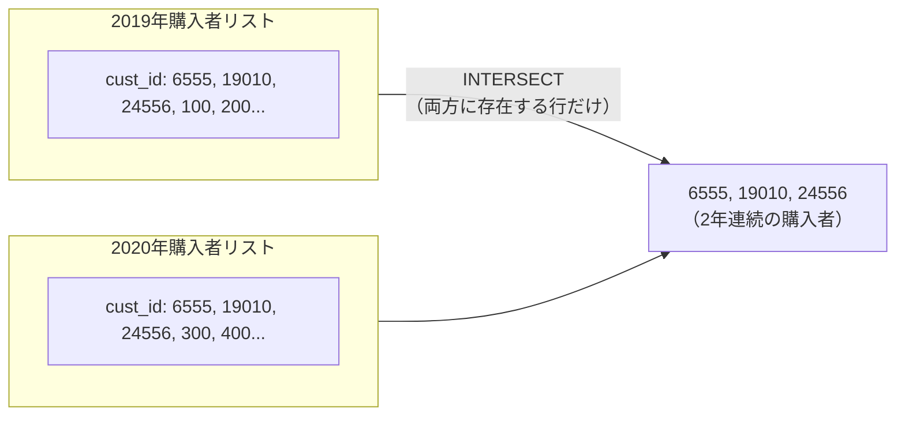
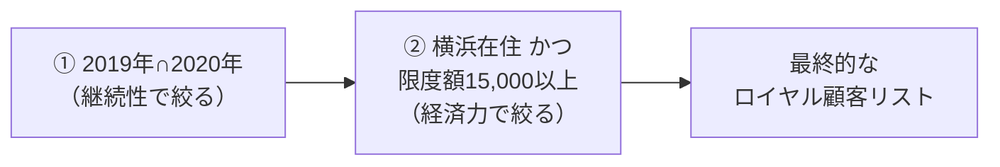
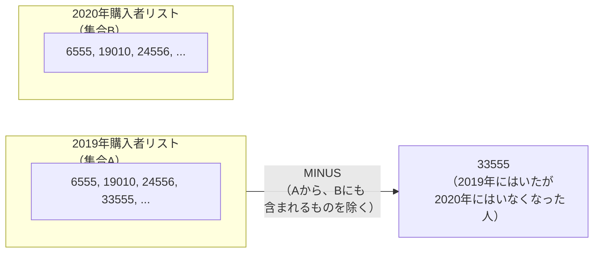
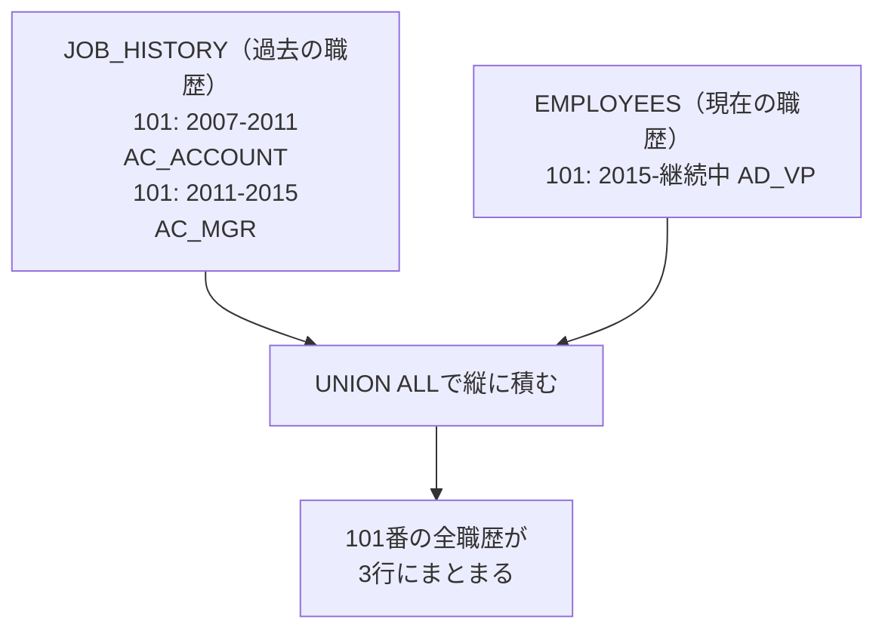
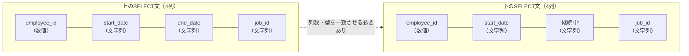
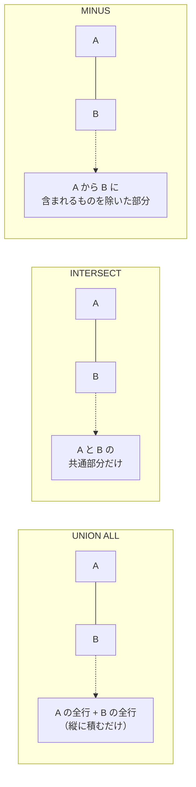
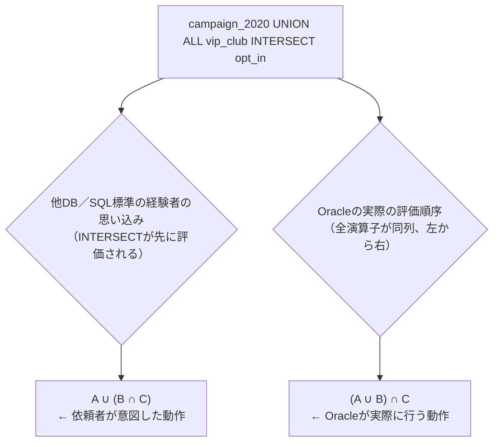
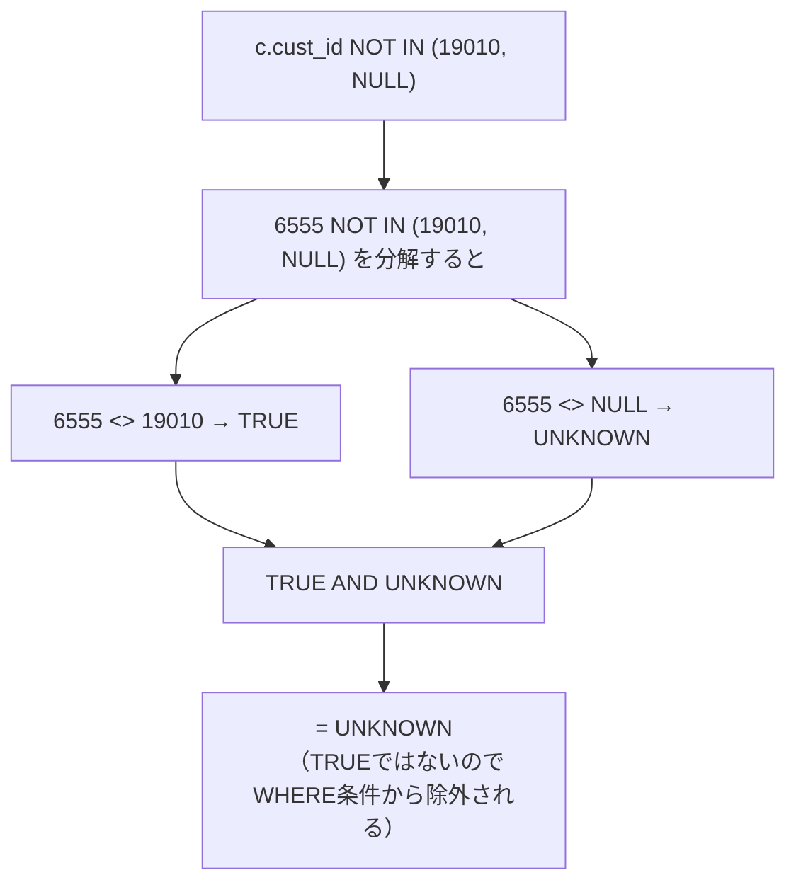

# 問題11-1：積集合（INTERSECT）
### 難易度：★★☆☆☆ (Lv.2)
## 問題
SHスキーマの`SALES`テーブルと`CUSTOMERS`テーブルを使用して、**2019年と2020年の両方で購入実績がある**「ロイヤル顧客」を特定してください。
さらに、絞り込んだ顧客の中から以下の条件に合致する人だけを表示してください。

**【抽出・編集ルール】**
* **ロイヤル顧客の定義**：2019年（1/1〜12/31）の売上データに存在し、**かつ**2020年（1/1〜12/31）の売上データにも存在する顧客。
* **条件**：
  * 顧客都市（`CUST_CITY`）が「Yokohama」であること。
  * クレジット限度額（`CUST_CREDIT_LIMIT`）が 15,000 以上であること。
* **表示項目**：`CUST_ID`、`NAME`（姓名結合）、`CUST_INCOME_LEVEL`、`CUST_CREDIT_LIMIT`。
* 結果の表示順は問いません。

## 期待する結果
| CUST_ID | NAME            | CUST_INCOME_LEVEL    | CUST_CREDIT_LIMIT | 
| ------- | --------------- | -------------------- | ----------------- | 
| 6555    | Rosanna Rill    | J: 190,000 - 249,999 | 15000             | 
| 19010   | Roxanne Crocker | I: 170,000 - 189,999 | 15000             | 
| 24556   | Zylia Hanson    | J: 190,000 - 249,999 | 15000             | 

## 解答例
```sql:例1：INTERSECT（積集合）を使用
WITH both_purchase AS (
    SELECT
        cust_id
    FROM
        sh.sales
    WHERE
        time_id BETWEEN date'2019-01-01' 
                    AND date'2019-12-31'
    INTERSECT
    SELECT
        cust_id
    FROM
        sh.sales
    WHERE
        time_id BETWEEN date'2020-01-01' 
                    AND date'2020-12-31'
)
SELECT
    c.cust_id,
    c.cust_first_name || ' ' || c.cust_last_name AS "NAME",
    c.cust_income_level,
    c.cust_credit_limit
FROM
    both_purchase bp
    INNER JOIN sh.customers c 
       ON bp.cust_id = c.cust_id
WHERE
        cust_city = 'Yokohama'
    AND cust_credit_limit >= 15000
```
```sql:例2：EXISTSを使用して算出
WITH both_purchase AS (
    SELECT DISTINCT
        cust_id
    FROM
        sh.sales s19
    WHERE
        time_id BETWEEN DATE'2019-01-01' 
                    AND DATE'2019-12-31'
        AND EXISTS ( 
            SELECT
                'X'
            FROM
                sh.sales s20
            WHERE
                time_id BETWEEN DATE'2020-01-01' 
                            AND DATE'2020-12-31'
                AND s19.cust_id = s20.cust_id
        )
)
SELECT
    c.cust_id,
    c.cust_first_name || ' ' || c.cust_last_name AS "NAME",
    c.cust_income_level,
    c.cust_credit_limit
FROM
    both_purchase bp
    INNER JOIN sh.customers c 
       ON bp.cust_id = c.cust_id
WHERE
        cust_city = 'Yokohama'
    AND cust_credit_limit >= 15000
```
```sql:例3：結合して算出
WITH purchase2019 AS (
-- 2019年の顧客
    SELECT DISTINCT
        cust_id
    FROM
        sh.sales
    WHERE
        time_id BETWEEN date'2019-01-01' 
                    AND date'2019-12-31'
), purchase2020 AS (
-- 2020年の顧客
    SELECT DISTINCT
        cust_id
    FROM
        sh.sales
    WHERE
        time_id BETWEEN date'2020-01-01' 
                    AND date'2020-12-31'
)
SELECT
    c.cust_id,
    c.cust_first_name || ' ' || c.cust_last_name AS "NAME",
    c.cust_income_level,
    c.cust_credit_limit
FROM
         purchase2019 p19
    INNER JOIN purchase2020 p20 
       ON p19.cust_id = p20.cust_id
    INNER JOIN sh.customers c 
       ON p19.cust_id = c.cust_id
WHERE
        cust_city = 'Yokohama'
    AND cust_credit_limit >= 15000
```

## 解説
これまでの「結合（JOIN）」がテーブルを横に繋げる技術だったのに対し、集合演算はクエリの結果同士を縦に重ね合わせる技術です。今回のテーマである「積集合（INTERSECT）」は、マーケティング分析で「リピーター」や「特定の条件をすべて満たす優良顧客」を抽出する際によく使われます。

`INTERSECT`は、2つの`SELECT`文の結果を比較し、「両方に存在する行」だけを抜き出します。



使う際には、重ね合わせる2つの`SELECT`文の間で、列の数が同じであること、列のデータ型が一致していることを守る必要があります。また`INTERSECT`は、結果の中に重複する行があっても最終的には1つのユニークな行としてまとめてくれます（`DISTINCT`をかけたような状態になります）。

同じ結果を得るための3つのアプローチを見ていきましょう。

| アプローチ | 考え方 | 特徴 |
| :--- | :--- | :--- |
| 例1：`INTERSECT`（積集合） | 数学の集合論そのまま | 「2019年かつ2020年」という意図が最も伝わりやすい |
| 例2：`EXISTS` | 1行ずつ存在をチェック | データ量が膨大でインデックスが効く場合に速くなることがある |
| 例3：`INNER JOIN` | 2019年リストと2020年リストをぶつける | 仕組みは分かりやすいが`DISTINCT`が必要でやや冗長 |

例1のINTERSECTは、数学の集合論そのものの書き方で、「2019年かつ2020年」という意図が最も伝わりやすいのが強みです。例2のEXISTSは、1行ずつ存在をチェックする方法で、データ量が膨大な場合はインデックスの効き方次第で速くなることがあります。例3のINNER JOINは、2019年リストと2020年リストをぶつける方法で、仕組みは分かりやすいものの、重複を防ぐために`DISTINCT`を意識的に書く必要がある分、やや冗長に見えます。私は普段、意図が最も明確に伝わる`INTERSECT`を選ぶことが多いですが、実行計画を見てパフォーマンスに差が出るようであれば`EXISTS`に切り替える、という判断をすることもあります。

今回のクエリが面白いのは、ただ抽出するだけでなく、最後に`CUSTOMERS`テーブルと結合して「属性（都市や限度額）」でさらに絞り込んでいる点です。



まず2019年にも2020年にも買ってくれた「継続性」を特定し、その中から「横浜在住」かつ「クレジットカード限度額が高い」という「経済力」を特定する、という2段階の絞り込みです。「行動（継続購入）」と「属性（居住地・資産）」を掛け合わせることで、プロモーションのターゲットをかなり絞り込むことができます。

結果に並んだRoxanne Crockerさんたちは、横浜に住み、高い限度額を持ち、なおかつ2年続けて買ってくれている、企業にとって価値の高い顧客層です。

## 参考リンク
https://www.shift-the-oracle.com/sql/intersect-operator.html

----
<br><br>

# 問題11-2：差集合（MINUS / EXCEPT）
### 難易度：★★☆☆☆ (Lv.2)
## 問題
SHスキーマの`SALES`テーブルと`CUSTOMERS`テーブルを使用して、**2019年には購入実績があるが、2020年には一度も購入していない**「離脱顧客」を特定してください。
さらに、絞り込んだ顧客の中から以下の条件に合致する人だけを表示してください。

**【抽出・編集ルール】**
* **離脱顧客の定義**：2019年（1/1〜12/31）の売上データに存在するが、**2020年（1/1〜12/31）の売上データには存在しない**顧客。
* **条件**：
  * 顧客都市（`CUST_CITY`）が「Yokohama」であること。
  * クレジット限度額（`CUST_CREDIT_LIMIT`）が **15,000 以上**であること。
* **表示項目**：`CUST_ID`、`NAME`（姓名結合）、`CUST_INCOME_LEVEL`、`CUST_CREDIT_LIMIT`。
* 結果の表示順は問いません。

## 期待する結果
| CUST_ID | NAME      | CUST_INCOME_LEVEL    | CUST_CREDIT_LIMIT | 
| ------- | --------- | -------------------- | ----------------- | 
| 33555   | Bud Smyth | J: 190,000 - 249,999 | 15000             | 

## 解答例
```sql:例1：MINUS/EXCEPT（差集合）を使用
WITH both_purchase AS (
    SELECT
        cust_id
    FROM
        sh.sales
    WHERE
        time_id BETWEEN date'2019-01-01' 
                    AND date'2019-12-31'
    MINUS   -- EXCEPTでも可
    SELECT
        cust_id
    FROM
        sh.sales
    WHERE
        time_id BETWEEN date'2020-01-01' 
                    AND date'2020-12-31'
)
SELECT
    c.cust_id,
    c.cust_first_name || ' ' || c.cust_last_name AS "NAME",
    c.cust_income_level,
    c.cust_credit_limit
FROM
    both_purchase bp
    INNER JOIN sh.customers c 
       ON bp.cust_id = c.cust_id
WHERE
        cust_city = 'Yokohama'
    AND cust_credit_limit >= 15000
```
```sql:例2：NOT EXISTSを使用
WITH both_purchase AS (
    SELECT DISTINCT
        cust_id
    FROM
        sh.sales s19
    WHERE
        time_id BETWEEN DATE'2019-01-01' 
                    AND DATE'2019-12-31'
        AND NOT EXISTS ( 
            SELECT
                'X'
            FROM
                sh.sales s20
            WHERE
                time_id BETWEEN DATE'2020-01-01' 
                            AND DATE'2020-12-31'
                AND s19.cust_id = s20.cust_id
        )
)
SELECT
    c.cust_id,
    c.cust_first_name || ' ' || c.cust_last_name AS "NAME",
    c.cust_income_level,
    c.cust_credit_limit
FROM
    both_purchase bp
    INNER JOIN sh.customers c 
       ON bp.cust_id = c.cust_id
WHERE
        cust_city = 'Yokohama'
    AND cust_credit_limit >= 15000
```

## 解説
前問の「リピーター（積集合）」とは逆の、「離脱客（差集合）」を特定するテクニックです。ビジネスにおいて「去ってしまったお客様」を特定し、「なぜ離れてしまったのか」「もう一度戻ってきてもらうにはどうすればいいか」を分析するのは、売上を伸ばすために重要なステップです。

`MINUS`（Oracle独自の呼称。標準SQLでは`EXCEPT`）は、1つ目の結果セットから、2つ目の結果セットに含まれる要素を引き算します。



まず2019年に購入した全顧客リスト（集合A）を作り、次に2020年に購入した全顧客リスト（集合B）を作り、AからBに名前がある人をすべて削除する、という流れです。残るのは「2019年にはいたが、2020年にはいなくなった人」だけになります。

集合演算子を使う際の共通ルール（列数とデータ型を揃える）に加えて、`MINUS`にはいくつか特有の性質があります。

| 性質 | 内容 |
| :--- | :--- |
| 重複の自動排除 | `INTERSECT`と同様、結果は自動的に重複が排除される |
| 順序で結果が変わる | `A MINUS B`と`B MINUS A`では結果が異なる（後者は「新規に増えた人」を意味する） |
| NULLの扱い | 通常の`=`とは異なり、NULL同士を「一致」とみなして引き算する |

また`A MINUS B`と`B MINUS A`では結果が全く異なり、後者は「2020年に新しく入ってきた新規客」を意味することになります。もう一点、`MINUS`はNULL同士を「一致」とみなして引き算する、という少し特殊な挙動もあります。通常の`=`演算子ではNULL同士は「等しい」とは判定されませんが、集合演算子の比較ルールはこれと異なる点は覚えておくとよいと思います。

`MINUS`（例1）と`NOT EXISTS`（例2）のどちらを使うべきかは、状況によって変わります。

| 方式 | 特徴 | 向いている場面 |
| :--- | :--- | :--- |
| `MINUS`（例1） | 「A - B」という数学的な形そのまま。直感的 | IDのリストだけをパッと引き算したいとき |
| `NOT EXISTS`（例2） | 相関サブクエリの理解が前提でやや複雑 | 複雑な条件の組み合わせ、大規模データでインデックスが効く場面 |

`MINUS`は「A - B」という数学的な形そのままで直感的に書ける一方、列を増やすとその列すべてが引き算の対象になってしまいます。`NOT EXISTS`は相関サブクエリの理解が前提になるぶん少し複雑に見えますが、特定のIDだけで比較しつつ他の列は保持しやすく、大規模データでインデックスが効く場面では有利になりやすいです。「とにかくIDのリストだけをパッと引き算したい」ときは`MINUS`、「複雑な条件を組み合わせたり、大量のデータを高速に処理したい」ときは`NOT EXISTS`、というのが現場での大まかな使い分けの目安になると思います。

結果に表示されたBud Smythさんは、横浜在住で15,000円以上の限度額を持つ優良顧客でありながら、2020年にはぱたりと購入が止まってしまった方です。マーケティング担当者なら、このリストを見て「限定のカムバッククーポン」をメールで送る、といった施策を考えるはずです。

## 参考リンク
https://www.shift-the-oracle.com/sql/minus-operator.html

----
<br><br>

# 問題11-3：和集合（UNION ALL）
### 難易度：★★☆☆☆ (Lv.2)
## 問題
HRスキーマの `EMPLOYEES`（現在の職歴）と `JOB_HISTORY`（過去の職歴）を統合して、特定の従業員（IDが110未満）の**全職歴データ**を取得してください。

**【抽出・編集ルール】**
* **JOB_HISTORY（過去分）**：
  * そのまま `START_DATE`, `END_DATE` を使用してください。
* **EMPLOYEES（現在分）**：
  * `START_DATE` 列には、入社日（`HIRE_DATE`）を表示してください。
  * `END_DATE` 列には、現在も在籍中であることを示すため **'継続中'** という文字列を表示してください。
* **表示形式**：日付はすべて「YYYY-MM-DD」形式の文字列として扱ってください。
* **表示順**：`EMPLOYEE_ID` の昇順、次に `START_DATE` の昇順で並べてください。

## 期待する結果
| EMPLOYEE_ID | START_DATE | END_DATE   | JOB_ID     | 
| ----------- | ---------- | ---------- | ---------- | 
| 100         | 2013-06-17 | 継続中     | AD_PRES    | 
| 101         | 2007-09-21 | 2011-10-27 | AC_ACCOUNT | 
| 101         | 2011-10-28 | 2015-03-15 | AC_MGR     | 
| 101         | 2015-09-21 | 継続中     | AD_VP      | 
| 102         | 2011-01-13 | 2016-07-24 | IT_PROG    | 
| 102         | 2011-01-13 | 継続中     | AD_VP      | 
| 103         | 2016-01-03 | 継続中     | IT_PROG    | 
| 104         | 2017-05-21 | 継続中     | IT_PROG    | 
| 105         | 2015-06-25 | 継続中     | IT_PROG    | 
| 106         | 2016-02-05 | 継続中     | IT_PROG    | 
| 107         | 2017-02-07 | 継続中     | IT_PROG    | 
| 108         | 2012-08-17 | 継続中     | FI_MGR     | 
| 109         | 2012-08-16 | 継続中     | FI_ACCOUNT |

## 解答例
```sql
SELECT
    employee_id,
    TO_CHAR(start_date, 'YYYY-MM-DD') AS start_date,
    TO_CHAR(end_date, 'YYYY-MM-DD')   AS end_date,
    job_id
FROM
    hr.job_history
WHERE
    employee_id < 110
UNION ALL
SELECT
    employee_id,
    TO_CHAR(hire_date, 'YYYY-MM-DD') AS start_date,
    '継続中',
    job_id
FROM
    hr.employees
WHERE
    employee_id < 110
ORDER BY
    employee_id,
    start_date
```

## 解説
集合演算の締めくくりは、複数のクエリ結果を縦に積み上げる「和集合（UNION / UNION ALL）」です。実務では「現在のデータ」と「過去の履歴データ」が別々のテーブルに保存されていることがよくあり、それらを一つのリストとしてまとめて見たいときにこの技術が役立ちます。

`UNION ALL`は、2つの`SELECT`文の結果を単純に縦に積み上げます。結合（JOIN）が「横に広げる」のに対し、集合演算は「縦に伸ばす」イメージです。



ここで現場でよく問題になるのが、`UNION`と`UNION ALL`の使い分けです。

| 演算子 | 重複の扱い | 処理の重さ |
| :--- | :--- | :--- |
| `UNION` | 1行にまとめて排除する | 重複チェックのため内部で並べ替えが発生し、やや重い |
| `UNION ALL` | 重複を気にせずすべて表示する | そのまま繋げるだけなので高速 |

`UNION`は重複する行があった場合、それを1行にまとめて（排除して）から表示しますが、`UNION ALL`は重複を気にせずすべての行をそのまま表示します。`UNION`は重複チェックの処理が入るため、データ量が多いと動作が重くなりがちです。今回のように「履歴」と「現在」でデータが被る可能性が低い（あるいは被っていても出したい）場合は、高速な`UNION ALL`を選ぶのが実務での基本的な考え方になります。

和集合を使うには、上下の`SELECT`文で列の数とデータ型を揃える必要があります。上が4列なら下も必ず4列、1列目が数値なら下も数値、2列目が日付なら下も日付（あるいは変換後の文字列）にしなければなりません。



今回の解答例では、この型合わせのために少し工夫がされています。下の`SELECT`文で、`END_DATE`に相当する箇所に`'継続中'`という文字列を入れているため、もし上の`SELECT`文で`END_DATE`をそのまま「日付型」で出してしまうと、「下は文字列、上は日付」となり型が合わずエラーになります。そこで、上のクエリでも`TO_CHAR`を使ってあえて文字列に変換し、上下の型を「文字列」で統一しています。

一点補足しておくと、`UNION ALL`で結合する際、Oracleは基本的に最初（1つ目）の`SELECT`文の列定義（データ型や長さ）を基準に、結果セット全体の型を決定します。今回のケースでは1つ目の`END_DATE`を`TO_CHAR(end_date, 'YYYY-MM-DD')`で10文字に揃えており、2つ目の`'継続中'`（3文字）はそれより短いため問題になりませんが、もし2つ目のSELECT文の方に長い文字列を入れる設計にする場合は、1つ目のSELECT文の列幅が十分かどうかを意識しておくと、思わぬ切り詰めを防げます。

`ORDER BY`は、クエリの最後に一度だけ書きます。これにより、積み上げられた「過去」と「現在」の全データが混ざり合い、時系列順に整列されます。

101番（Neena Yangさん）のデータを見てください。2007年から、2011年から、2015年から（現在：継続中）という3行のデータが並んでいます。上の2行は`JOB_HISTORY`から、最後の1行は`EMPLOYEES`から来たものです。これが1つのリストになることで、Neenaさんのキャリアの歩みがひと目で分かるようになっています。

Oracle 23aiで利用できる主な集合演算子を整理しておきます。



| 演算子 | 意味 | 重複の扱い | 特徴 |
| :--- | :--- | :--- | :--- |
| `UNION` | 和集合 | 排除する | 重複を消すため内部で並べ替え（ソート）が発生し、やや重い |
| `UNION ALL` | 和集合 | 保持する | そのまま繋げるだけなので高速。実務で一番使う |
| `INTERSECT` | 積集合 | 自動的に排除 | 両方の結果に含まれる共通の行だけを抽出する |
| `MINUS` / `EXCEPT` | 差集合 | 自動的に排除 | 1つ目の結果から、2つ目の結果に含まれるものを差し引く |

長らくOracleでは`MINUS`という独自キーワードが使われてきましたが、23aiからは標準SQLである`EXCEPT`も使えるようになりました。他のデータベース（PostgreSQLやSQL Serverなど）からの移行がよりスムーズになっています。


---
<br><br>

# 問題11-4：集合演算子の優先順位の誤解（Oracleに"INTERSECT優先"はない）
### 難易度：★★★☆☆ (Lv.3)
## 問題
マーケティング部門から、次のような依頼がありました。

> 「2020年キャンペーンに応募した顧客」は**無条件で全員**DM対象に含めてほしい。**それに加えて**、「VIPクラブ会員」かつ「メール配信オプトイン同意者」の両方を満たす顧客も、追加でDM対象に含めてほしい。

各グループの会員IDは以下の通りです（架空のキャンペーンデータのため`WITH`句で直接指定します）。

* **A：2020年キャンペーン応募者（無条件で全員含める）**：`6555`, `19010`, `24556`
* **B：VIPクラブ会員**：`33555`, `1556`
* **C：メール配信オプトイン顧客**：`19010`, `33555`, `2830`

**【抽出・編集ルール】**
* 依頼内容：「Aは全員含める。加えて、B かつ C の両方に該当する人も含める」＝ `A ∪ (B ∩ C)`
* `SH.CUSTOMERS`と結合し、`CUST_ID`、`NAME`（姓名結合）、`CUST_CITY`を表示してください。
* `CUST_ID`の昇順で表示してください。

## 期待する結果
| CUST_ID | NAME             | CUST_CITY |
| ------- | ---------------- | --------- |
| 6555    | Rosanna Rill     | Yokohama  |
| 19010   | Roxanne Crocker  | Yokohama  |
| 24556   | Zylia Hanson     | Yokohama  |
| 33555   | Bud Smyth        | Yokohama  |

## 解答例
```sql:NG例：括弧なし（「INTERSECTが優先されるはず」という思い込み）
WITH campaign_2020 AS (
    SELECT 6555 AS cust_id FROM dual UNION ALL
    SELECT 19010 FROM dual UNION ALL
    SELECT 24556 FROM dual
), vip_club AS (
    SELECT 33555 AS cust_id FROM dual UNION ALL
    SELECT 1556 FROM dual
), opt_in AS (
    SELECT 19010 AS cust_id FROM dual UNION ALL
    SELECT 33555 FROM dual UNION ALL
    SELECT 2830 FROM dual
)
SELECT cust_id FROM campaign_2020
UNION ALL
SELECT cust_id FROM vip_club
INTERSECT
SELECT cust_id FROM opt_in
```
```sql:例1：括弧で評価順序を明示（正解）
WITH campaign_2020 AS (
    SELECT 6555 AS cust_id FROM dual UNION ALL
    SELECT 19010 FROM dual UNION ALL
    SELECT 24556 FROM dual
), vip_club AS (
    SELECT 33555 AS cust_id FROM dual UNION ALL
    SELECT 1556 FROM dual
), opt_in AS (
    SELECT 19010 AS cust_id FROM dual UNION ALL
    SELECT 33555 FROM dual UNION ALL
    SELECT 2830 FROM dual
), dm_target AS (
    SELECT cust_id FROM campaign_2020
    UNION ALL
    SELECT cust_id FROM (
        SELECT cust_id FROM vip_club
        INTERSECT
        SELECT cust_id FROM opt_in
    )
)
SELECT
    c.cust_id,
    c.cust_first_name || ' ' || c.cust_last_name AS "NAME",
    c.cust_city
FROM
    dm_target dt
    INNER JOIN sh.customers c 
       ON dt.cust_id = c.cust_id
ORDER BY
    c.cust_id
```

## 解説
第11章の最後を飾るのは、`UNION`・`INTERSECT`・`MINUS`を組み合わせたときに生まれる、**「他のDB製品との思い込みによる罠」**です。SQL標準（ANSI/ISO）や、Snowflake・Exasolなど一部の製品では、`INTERSECT`が`UNION`・`MINUS`より**先に評価される**という優先順位ルールがあります。他のDB製品での経験が長いエンジニアほど、「`INTERSECT`は先に評価されるはず」と信じ込んでSQLを書いてしまいがちです。

しかし、**Oracleではこのルールは採用されていません**。Oracle公式マニュアルには次のように明記されています。

> All set operators have equal precedence. If a SQL statement contains multiple set operators, then Oracle Database evaluates them from the left to right unless parentheses explicitly specify another order.
> （すべての集合演算子は同じ優先順位を持つ。複数の集合演算子を含む場合、括弧で明示されない限り、Oracleは左から右へ評価する）



NG例のクエリでは、「Aは無条件で全員含め、そこにB∩Cの結果を追加する」つもりで、`campaign_2020 UNION ALL vip_club INTERSECT opt_in`と括弧なしで書きました。構文エラーは出ません。しかしOracleは左から右への評価ルールに従い、これを`(campaign_2020 UNION ALL vip_club) INTERSECT opt_in`として実行します。

結果、`campaign_2020`（無条件で全員含めたかったはずの`6555`, `19010`, `24556`）のうち、オプトインに同意していない`6555`と`24556`が**勝手にDM対象から除外**されてしまいます。依頼者の意図は「キャンペーン応募者は無条件で全員」だったにもかかわらず、です。件数だけ見ると2件という自然な数値が返ってくるため、この抜け漏れには非常に気づきにくいという特徴があります。

正解例では、`(vip_club INTERSECT opt_in)`を明示的に括弧でくくることで、「B∩Cを先に計算し、その結果をAに追加する」という意図をOracleに正しく伝えています。

| 項目 | ANSI SQL標準 / Snowflake / Exasol等 | Oracle |
| :--- | :--- | :--- |
| `INTERSECT`の優先順位 | 他の演算子より高い | **他の演算子と同列（優先順位の差なし）** |
| 複数の集合演算子の評価順 | `INTERSECT`が先、他は左から右 | **常に左から右**（括弧がない限り） |

なお、Oracleの古いマニュアル（8i時代）には「将来のリリースでANSI標準に合わせてINTERSECTの優先順位を上げる可能性がある」という記載が存在しますが、現行バージョンに至るまでこの変更は実施されていません。過去の情報や他DBでの経験を根拠に振る舞いを推測するのではなく、**必ず現行のOracle公式マニュアルで挙動を確認する**姿勢が重要です。

:::message
複数のSELECT文を`UNION`系・`MINUS`・`INTERSECT`で3つ以上つなげる場合は、優先順位に頼らず**必ず括弧で意図を明示する**習慣をつけましょう。特に他のDB製品の経験があるエンジニアほど、「`INTERSECT`が優先されるはず」という思い込みでOracleのバグを踏みやすい点に注意が必要です。
:::

## 参考リンク
https://docs.oracle.com/en/database/oracle/oracle-database/19/sqlrf/The-UNION-ALL-INTERSECT-MINUS-Operators.html

---
<br><br>

# 問題11-5：MINUSとNOT INの違い（NULLの落とし穴）
### 難易度：★★☆☆☆ (Lv.2)
## 問題
DM配信システムから、次のような依頼がありました。

> キャンペーン候補者リストから、「配信停止希望者リスト」に載っている顧客を除外して、最終的なDM送付対象リストを作ってほしい。なお配信停止希望者リストは他システムからの連携データのため、まれに原因不明のデータ不備（`CUST_ID`が空）が混ざることがある。

各リストの内容は以下の通りです（架空データのため`WITH`句で直接指定します）。

* **候補者リスト**：`6555`, `19010`, `24556`, `33555`
* **配信停止希望者リスト**：`19010`, `NULL`（原因不明のデータ不備により1件`CUST_ID`が取得できていない）

**【抽出・編集ルール】**
* 候補者リストから、配信停止希望者リストに含まれる顧客（`19010`）だけを正しく除外してください。
* `SH.CUSTOMERS`と結合し、`CUST_ID`、`NAME`（姓名結合）、`CUST_CITY`を表示してください。
* `CUST_ID`の昇順で表示してください。

## 期待する結果
| CUST_ID | NAME          | CUST_CITY |
| ------- | ------------- | --------- |
| 6555    | Rosanna Rill  | Yokohama  |
| 24556   | Zylia Hanson  | Yokohama  |
| 33555   | Bud Smyth     | Yokohama  |

## 解答例
```sql:NG例：NOT INを使用（NULLの罠）
WITH candidates AS (
    SELECT 6555 AS cust_id FROM dual UNION ALL
    SELECT 19010 FROM dual UNION ALL
    SELECT 24556 FROM dual UNION ALL
    SELECT 33555 FROM dual
), opt_out AS (
    SELECT 19010 AS cust_id FROM dual UNION ALL
    SELECT TO_NUMBER(NULL) FROM dual  -- 原因不明のデータ不備でNULLが混入
)
SELECT
    c.cust_id,
    c.cust_first_name || ' ' || c.cust_last_name AS "NAME",
    c.cust_city
FROM
    sh.customers c
WHERE
    c.cust_id IN (SELECT cust_id FROM candidates)
    AND c.cust_id NOT IN (SELECT cust_id FROM opt_out)
ORDER BY
    c.cust_id
```
```sql:例1：MINUSを使用（正解）
WITH candidates AS (
    SELECT 6555 AS cust_id FROM dual UNION ALL
    SELECT 19010 FROM dual UNION ALL
    SELECT 24556 FROM dual UNION ALL
    SELECT 33555 FROM dual
), opt_out AS (
    SELECT 19010 AS cust_id FROM dual UNION ALL
    SELECT TO_NUMBER(NULL) FROM dual  -- 原因不明のデータ不備でNULLが混入
), dm_target AS (
    SELECT cust_id FROM candidates
    MINUS
    SELECT cust_id FROM opt_out
)
SELECT
    c.cust_id,
    c.cust_first_name || ' ' || c.cust_last_name AS "NAME",
    c.cust_city
FROM
    dm_target dt
    INNER JOIN sh.customers c 
       ON dt.cust_id = c.cust_id
ORDER BY
    c.cust_id
```
```sql:例2：NOT EXISTSを使用（正解・別解）
WITH candidates AS (
    SELECT 6555 AS cust_id FROM dual UNION ALL
    SELECT 19010 FROM dual UNION ALL
    SELECT 24556 FROM dual UNION ALL
    SELECT 33555 FROM dual
), opt_out AS (
    SELECT 19010 AS cust_id FROM dual UNION ALL
    SELECT TO_NUMBER(NULL) FROM dual  -- 原因不明のデータ不備でNULLが混入
)
SELECT
    c.cust_id,
    c.cust_first_name || ' ' || c.cust_last_name AS "NAME",
    c.cust_city
FROM
    sh.customers c
WHERE
    c.cust_id IN (SELECT cust_id FROM candidates)
    AND NOT EXISTS (
        SELECT 'X' FROM opt_out o WHERE o.cust_id = c.cust_id
    )
ORDER BY
    c.cust_id
```

## 解説
`MINUS`（差集合）と、`WHERE`句の`NOT IN`は、どちらも「Aから、Bに含まれるものを除外する」という同じ目的で使われることが多いテクニックです。しかし、**除外リスト側の列にNULLが1件でも紛れ込んでいると、この2つは全く異なる挙動をします**。これはOracleに限らず標準SQL共通の仕様ですが、実務での遭遇率が高く、気づきにくいため、集合演算子の章の締めくくりとして扱っておきたい内容です。

NG例のクエリを実行すると、**候補者リストが4件あるにもかかわらず、結果が0件**になってしまいます。原因は`opt_out`テーブルに含まれる1件の`NULL`です。



SQLの`NOT IN (v1, v2, ..., vn)`は、内部的には`<> v1 AND <> v2 AND ... AND <> vn`という**AND条件の連続**として評価されます。ここで比較対象にNULLが含まれると、`何か <> NULL`は`TRUE`にも`FALSE`にもならず、**`UNKNOWN`（3値論理の第3の値）** になります。

`AND`演算では、`TRUE AND UNKNOWN`は`UNKNOWN`になります。`WHERE`句は`TRUE`と評価された行しか残さないため、`UNKNOWN`と評価された行はすべて除外されてしまいます。つまり、除外リストに**1件でもNULLが含まれていると、`NOT IN`はどの候補者に対しても`UNKNOWN`を返し、結果的に全件が消えてしまう**のです。これは構文エラーにならないため、「候補者が誰もいなかった」という、業務的にもっともらしい（しかし誤った）結果として現れてしまいます。

一方、`MINUS`（例1）はこの罠にかかりません。`MINUS`は行単位の集合比較であり、`opt_out`側のNULLの行は、`candidates`側にNULLの行が存在しない限り、どの行とも一致しません。そのため、`19010`だけが正しく除外され、他の3件はそのまま残ります。`NOT EXISTS`（例2）も同様に、相関サブクエリで行の存在を1件ずつ判定する仕組みのため、NULLに引きずられることなく正しく動作します。

| 方式 | NULLを含む除外リストへの耐性 | 挙動 |
| :--- | :--- | :--- |
| `NOT IN`（NG例） | ✕ 弱い | 除外リストに1件でもNULLがあると、結果が全件消える |
| `MINUS`（例1） | ○ 強い | NULLの行は無関係な行に影響しない。正しく除外できる |
| `NOT EXISTS`（例2） | ○ 強い | 相関サブクエリでNULLを暗黙的に無視するため安全 |

なお、この問題は第9章（副問い合わせ）で扱った`EXISTS`／`NOT EXISTS`とはやや異なる切り口です。第9章では主に「関係除算（リレーショナルディビジョン）」のロジックとしてこれらを扱いましたが、本問はあくまで **「除外リストにNULLが混入した場合の安全性」**という観点にフォーカスしています。`NOT IN`を使う際は、サブクエリの結果に**絶対にNULLが含まれないことを保証できるか**を必ず確認する必要があります。保証できない場合は、`MINUS`か`NOT EXISTS`、あるいは`WHERE cust_id NOT IN (SELECT cust_id FROM opt_out WHERE cust_id IS NOT NULL)`のように明示的にNULLを除外するかたちで書く必要があります。

:::message
`NOT IN`のサブクエリに渡す列は、**NULLが絶対に含まれないことが保証されている列**（多くの場合は主キーやNOT NULL制約付きの列）に限定するのが安全な実務ルールです。外部システム連携データなど、NULL混入のリスクがある場合は、`MINUS`または`NOT EXISTS`を使うか、サブクエリ側で`IS NOT NULL`を明示的に付与しましょう。
:::

## 参考リンク
https://www.shift-the-oracle.com/sql/minus-operator.html