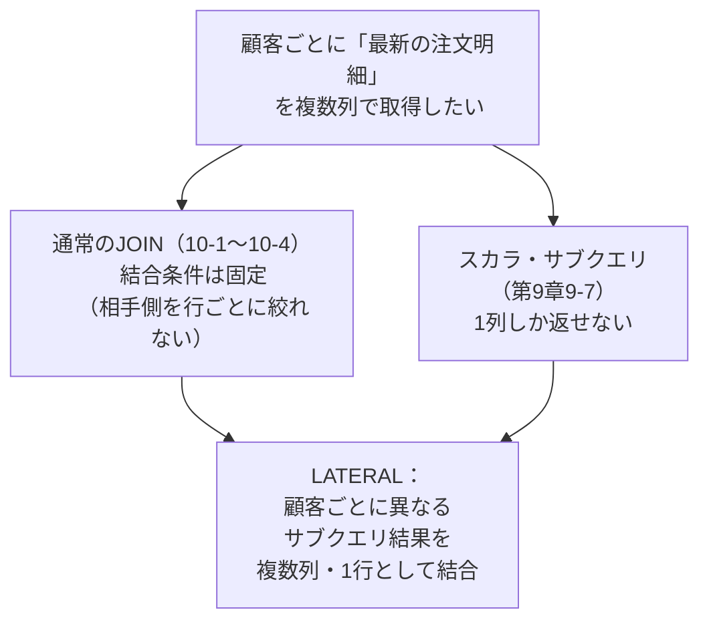
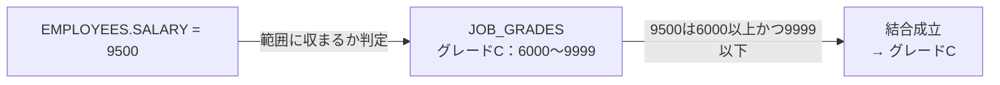
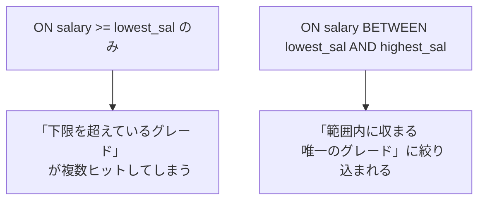
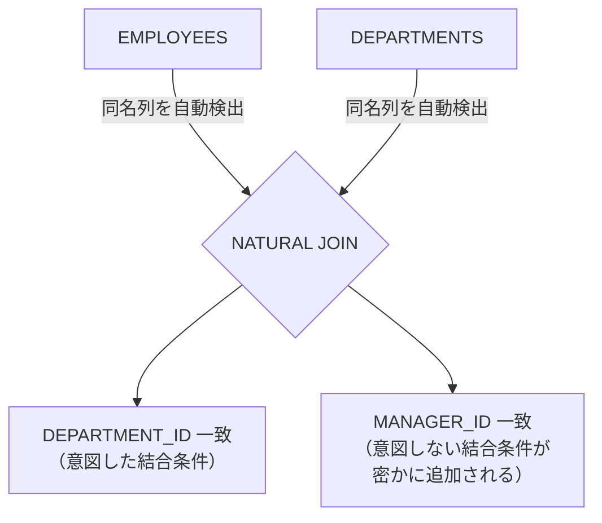
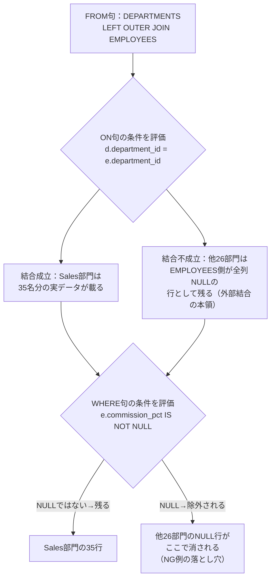
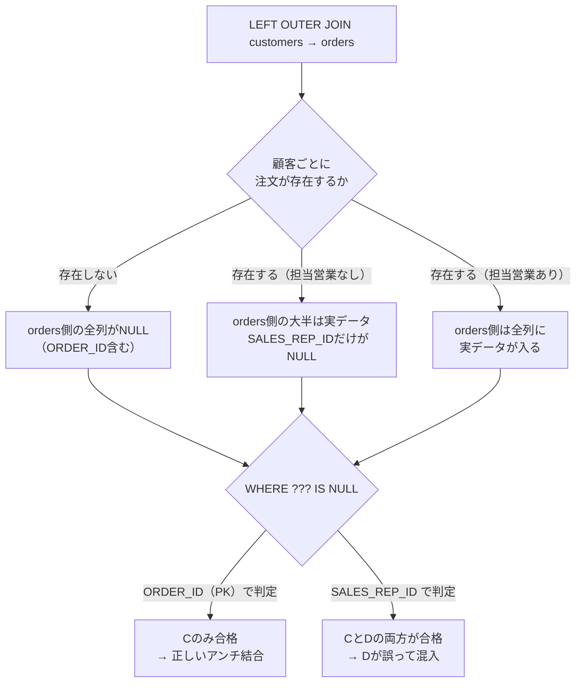

# 【完全版】問題10-11：LATERAL句による相関インラインビュー（複数列の同時取得とNULL保持）
### 難易度：★★★★☆ (Lv.4)

## 問題
OEスキーマにおいて、`CUSTOMER_ID`が120以下の顧客について、**各顧客の最新の注文（`ORDER_DATE`が最も新しいもの）の明細**（`ORDER_ID`, `ORDER_DATE`, `ORDER_TOTAL`）を一覧化してください。
問題10-2（LEFT OUTER JOIN）や問題10-9（部分外部結合）と同様、**注文が一度もない顧客も除外せず**、`ORDER_ID`等はNULLとして一覧に残してください。

**【出力・編集ルール】**
* `CUSTOMER_ID`, `CUST_FIRST_NAME || ' ' || CUST_LAST_NAME`（氏名）
* 最新注文の `ORDER_ID`, `ORDER_DATE`, `ORDER_TOTAL`
* 注文が存在しない顧客の該当列はNULLとする
* 結果は`CUSTOMER_ID`の昇順で表示すること

## 期待する結果

**例1（`CROSS JOIN LATERAL`）：全14件**
| CUSTOMER_ID | NAME | ORDER_ID | ORDER_DATE | ORDER_TOTAL |
| --- | --- | --- | --- | --- |
| 101 | Constantin Welles | 2447 | 2008-07-27 | 33893.6 |
| 102 | Harrison Pacino | 2397 | 2007-11-19 | 42283.2 |
| 103 | Manisha Taylor | 2454 | 2007-10-02 | 6653.4 |
| 104 | Harrison Sutherland | 2354 | 2008-07-14 | 46257 |
| 105 | Matthias MacGraw | 2356 | 2008-01-26 | 29473.8 |
| 106 | Matthias Hannah | 2441 | 2008-08-01 | 2075.2 |
| 107 | Matthias Cruise | 2360 | 2007-11-14 | 990.4 |
| 108 | Meenakshi Mason | 2361 | 2007-11-13 | 120131.3 |
| 109 | Christian Cage | 2394 | 2008-02-10 | 21863 |
| 116 | Geraldine Martin | 2428 | 2007-11-10 | 14685.8 |
| 117 | Guillaume Edwards | 2370 | 2008-06-26 | 126 |
| 118 | Maurice Mahoney | 2457 | 2007-10-31 | 21586.2 |
| 119 | Maurice Hasan | 2372 | 2007-02-27 | 16447.2 |
| 120 | Diane Higgins | 2373 | 2008-02-27 | 416 |

※`CUSTOMER_ID` 110〜115の6名（注文実績なし）は結果から消えている点に注目。

**例2（`LEFT JOIN LATERAL`）：全20件**
上記14件に加え、以下の6名がNULL値付きで残る。
| CUSTOMER_ID | NAME | ORDER_ID | ORDER_DATE | ORDER_TOTAL |
| --- | --- | --- | --- | --- |
| 110 | Charlie Sutherland | NULL | NULL | NULL |
| 111 | Charlie Pacino | NULL | NULL | NULL |
| 112 | Guillaume Jackson | NULL | NULL | NULL |
| 113 | Daniel Costner | NULL | NULL | NULL |
| 114 | Dianne Derek | NULL | NULL | NULL |
| 115 | Geraldine Schneider | NULL | NULL | NULL |

## 解答例
```sql:例1：CROSS JOIN LATERALを使用（注文がない顧客は消える）
SELECT
    c.customer_id,
    c.cust_first_name || ' ' || c.cust_last_name AS name,
    o.order_id,
    o.order_date,
    o.order_total
FROM
    oe.customers c
    CROSS JOIN LATERAL (
        SELECT
            ord.order_id,
            ord.order_date,
            ord.order_total
        FROM
            oe.orders ord
        WHERE
            ord.customer_id = c.customer_id
        ORDER BY
            ord.order_date DESC
        FETCH FIRST 1 ROW ONLY
    ) o
WHERE
    c.customer_id <= 120
ORDER BY
    c.customer_id
```
```sql:例2：LEFT JOIN LATERALを使用（注文がない顧客も残る）
SELECT
    c.customer_id,
    c.cust_first_name || ' ' || c.cust_last_name AS name,
    o.order_id,
    o.order_date,
    o.order_total
FROM
    oe.customers c
    LEFT JOIN LATERAL (
        SELECT
            ord.order_id,
            ord.order_date,
            ord.order_total
        FROM
            oe.orders ord
        WHERE
            ord.customer_id = c.customer_id
        ORDER BY
            ord.order_date DESC
        FETCH FIRST 1 ROW ONLY
    ) o ON 1=1
WHERE
    c.customer_id <= 120
ORDER BY
    c.customer_id
```

## NG例（一見正しそうで、実は意図と異なる結果になりうる例）
```sql:NG例：スカラ・サブクエリを列ごとに分けて書いてしまう
SELECT
    c.customer_id,
    c.cust_first_name || ' ' || c.cust_last_name AS name,
    (SELECT o.order_id
       FROM oe.orders o
      WHERE o.customer_id = c.customer_id
        AND o.order_date = (SELECT MAX(o2.order_date) FROM oe.orders o2 WHERE o2.customer_id = c.customer_id)
        AND ROWNUM = 1) AS order_id,
    (SELECT o.order_total
       FROM oe.orders o
      WHERE o.customer_id = c.customer_id
        AND o.order_date = (SELECT MAX(o2.order_date) FROM oe.orders o2 WHERE o2.customer_id = c.customer_id)
        AND ROWNUM = 1) AS order_total
FROM
    oe.customers c
WHERE
    c.customer_id <= 120
```
実際にこのNG例を`CUSTOMER_ID`≤120のデータで実行すると、結果は例2と完全に一致します。今回のデータには、同一顧客が同じ`ORDER_DATE`で複数回注文しているケース（タイ）が存在しないためです。つまりこのNG例は、**今日のデータではたまたま正解と見分けがつかない**という、最も厄介なタイプの誤りです。

しかし、このSQLの構造自体には欠陥があります。`order_id`用のサブクエリと`order_total`用のサブクエリは、それぞれ完全に独立して実行されます。もし将来、ある顧客が同じ日に2回注文するようなデータが追加された場合、`order_id`のサブクエリと`order_total`のサブクエリが**別々の行**の`ROWNUM = 1`を拾ってしまう可能性があり、表示上は1行なのに「A注文のID」と「B注文の金額」が組み合わさった、実在しない注文のキメラが生まれます。

この「タイが起きたらどうなるか」を、WITH句の合成データで確認しておきましょう。

```sql:タイが発生した場合の挙動を再現（合成データ）
WITH orders_sample AS (
    SELECT 1 AS customer_id, 9001 AS order_id, DATE '2024-01-10' AS order_date, 500  AS order_total FROM DUAL UNION ALL
    SELECT 1,               9002,               DATE '2024-01-10',               800   FROM DUAL  -- 同日に2件目の注文（タイ）
)
SELECT
    customer_id,
    (SELECT o.order_id
       FROM orders_sample o
      WHERE o.customer_id = os.customer_id
        AND o.order_date = (SELECT MAX(o2.order_date) FROM orders_sample o2 WHERE o2.customer_id = os.customer_id)
        AND ROWNUM = 1) AS order_id,
    (SELECT o.order_total
       FROM orders_sample o
      WHERE o.customer_id = os.customer_id
        AND o.order_date = (SELECT MAX(o2.order_date) FROM orders_sample o2 WHERE o2.customer_id = os.customer_id)
        AND ROWNUM = 1) AS order_total
FROM
    (SELECT DISTINCT customer_id FROM orders_sample) os
```
このクエリを実行すると、`order_id`は9001（または9002）、`order_total`は9002（または9001）のものが選ばれることがあり、両者が別の注文に由来する組み合わせになり得ます。どちらの`ROWNUM = 1`が何を拾うかは実行計画やデータの物理的な並び順に依存するため、**再現性がなく、実行するたびに結果が変わる可能性すらあります**。これがNG例の本当の危険性です。

## 解説
今回のテーマは、通常の結合（`INNER JOIN`/`LEFT OUTER JOIN`）では実現しづらい「相手側テーブルを、行ごとに異なる条件で絞り込んでから結合する」という要件を、`LATERAL`句でどう解決するかという点です。



これまで第10章で扱ってきた`INNER JOIN`や`LEFT OUTER JOIN`（問題10-2）は、結合条件（`ON`句）こそ書けますが、「相手側のテーブルを、行ごとに`ORDER BY`して上位1件だけに絞り込んでから結合する」という芸当はできません。一方、第9章9-7のスカラ・サブクエリなら1行に絞り込むことはできますが、返せるのは1列だけという制約がありました。

例1の`CROSS JOIN LATERAL`は、この両方の制約を同時に解決します。カッコの中で`ORDER_ID`, `ORDER_DATE`, `ORDER_TOTAL`をまとめて`SELECT`し、`ORDER BY ... FETCH FIRST 1 ROW ONLY`で「その顧客の最新の1行」を**行ごと**確定させてから、外側の`customers`と結合します。「同じ相関条件に基づく複数列は、必ず同じ物理的な1行から取得される」ことが構造的に保証されるため、NG例のようなキメラ行は原理的に発生しません。

`CROSS JOIN LATERAL`には見落としがちな挙動があります。実行結果（例1・14件）を見ると、`CUSTOMER_ID` 110〜115の6名が結果から消えています。もしある顧客が一度も注文をしていなければ、カッコの中の`SELECT`は0行を返します。`CROSS JOIN`は内部結合に相当するため、右側（LATERAL側）が0行を返した瞬間、その顧客自身の行も結果から消えてしまいます。これは通常の`INNER JOIN`で「結合先にデータがない行が消える」のと全く同じ現象です。

これを解決するのが例2の`LEFT JOIN LATERAL ... ON 1=1`です。問題10-2で学んだ`LEFT OUTER JOIN`の考え方を、そのままLATERALに適用したものだと捉えてください。実行結果（例2・20件）では、消えていた6名がすべて復活し、`ORDER_ID`等がNULLとして表示されています。

| 書き方 | 内部的な結合の種類 | 注文がない顧客の扱い（今回の実測） |
| :--- | :--- | :--- |
| `CROSS JOIN LATERAL`（例1） | 内部結合相当 | 消える（14件） |
| `LEFT JOIN LATERAL ... ON 1=1`（例2） | 外部結合相当 | 残る（20件、該当列はNULL） |

結合条件は「顧客IDが一致する」という条件がすでにLATERALのサブクエリ内の`WHERE`句に書かれているため、`ON`句には形式的に`ON 1=1`（常に真）を置きます。これにより、右側（LATERAL側）が0行であっても左側（`customers`）の行は必ず残ります。

`CROSS JOIN LATERAL`と`LEFT JOIN LATERAL`のどちらを使うべきかは、業務要件次第です。「注文実績のある顧客だけを見たい」なら例1、「全顧客を母集団として、注文の有無も含めて棚卸ししたい」なら例2、という判断基準になります。この「集合の全件を軸にするか、実績がある側だけに絞るか」という判断軸は、問題10-2や10-9で登場した内部結合／外部結合の使い分けと本質的に同じです。

:::message
### LATERALは「結合条件の固定化」という制約を取り払う
通常の`JOIN`（`ON`句による結合）は、「テーブルAのある列」と「テーブルBのある列」が等しいかどうかという、**静的な条件**でしか結合できません。`LATERAL`を使うと、右側のテーブル（サブクエリ）自体が「左側の各行に応じて動的に内容を変える」ことができるようになります。イメージとしては、通常のJOINが「あらかじめ用意された名簿同士を照合する」のに対し、LATERALは「1人ずつ、その人専用のミニクエリをその場で実行してから結合する」という、プログラミングの`for`ループに近い動きです。

今回のNG例が示す通り、「タイが起きたときに何が起こるか」は、手元のデータだけでは検証しきれないことがあります。合成データで意図的にタイを再現するテストは、こうした潜在バグを本番投入前に洗い出す実務的な手法としても有効です。

この性質から、LATERALは「各顧客のトップN件」「各部署の直近の異動履歴」「各商品の最新の仕入れ単価」など、“各〜の最新・上位N件”という要件全般に応用できます。第9章9-7のスカラ・サブクエリでは1列しか足せなかった場面が、LATERALを使うことで何列でも、しかも1つの相関条件から一貫性を保ったまま取得できる、という点を覚えておいてください。
:::

---
<br><br>

# 問題10-12：非等価結合（Non-Equi Join）による給与グレードの判定
### 難易度：★★★☆☆ (Lv.3)

## 問題
HRスキーマの`EMPLOYEES`テーブルを使用して、部門ID（`DEPARTMENT_ID`）が「80」に所属する各従業員が、どの給与グレード（`GRADE_LEVEL`）に該当するかを判定してください。

**【抽出・編集ルール】**
* グレードの区分は以下の通りとします（`WITH`句で合成データとして作成してください）。

| GRADE_LEVEL | LOWEST_SAL | HIGHEST_SAL |
| :---: | ---: | ---: |
| A | 1000 | 2999 |
| B | 3000 | 5999 |
| C | 6000 | 9999 |
| D | 10000 | 14999 |
| E | 15000 | 40000 |

* **結合条件**：`EMPLOYEES.SALARY`が、上記グレードの`LOWEST_SAL`〜`HIGHEST_SAL`の範囲内（両端を含む）に収まっているグレードを結合してください。結合キーが「＝（イコール）」ではない点に注意してください。
* **表示項目**：`EMPLOYEE_ID`、`EMP_NAME`（`FIRST_NAME`と`LAST_NAME`を半角スペースで結合）、`DEPARTMENT_ID`、`SALARY`、`GRADE_LEVEL`
* 結果は`SALARY`の降順で表示してください。

## 期待する結果
| EMPLOYEE_ID | EMP_NAME          | DEPARTMENT_ID | SALARY | GRADE_LEVEL | 
| ----------- | ----------------- | ------------- | ------ | ----------- | 
| 145         | John Singh        | 80            | 14000  | D           | 
| 146         | Karen Partners    | 80            | 13500  | D           | 
| 147         | Alberto Errazuriz | 80            | 12000  | D           | 
| 168         | Lisa Ozer         | 80            | 11500  | D           | 
| 174         | Ellen Abel        | 80            | 11000  | D           | 
| 148         | Gerald Cambrault  | 80            | 11000  | D           | 
| 162         | Clara Vishney     | 80            | 10500  | D           | 
| 149         | Eleni Zlotkey     | 80            | 10500  | D           | 
| 169         | Harrison Bloom    | 80            | 10000  | D           | 
| 156         | Janette King      | 80            | 10000  | D           | 
| 150         | Sean Tucker       | 80            | 10000  | D           | 
| 170         | Tayler Fox        | 80            | 9600   | C           | 
| 157         | Patrick Sully     | 80            | 9500   | C           | 
| 151         | David Bernstein   | 80            | 9500   | C           | 
| 163         | Danielle Greene   | 80            | 9500   | C           | 
| 152         | Peter Hall        | 80            | 9000   | C           | 
| 158         | Allan McEwen      | 80            | 9000   | C           | 
| 175         | Alyssa Hutton     | 80            | 8800   | C           | 
| 176         | Jonathon Taylor   | 80            | 8600   | C           | 
| 177         | Jack Livingston   | 80            | 8400   | C           | 
| 153         | Christopher Olsen | 80            | 8000   | C           | 
| 159         | Lindsey Smith     | 80            | 8000   | C           | 
| 160         | Louise Doran      | 80            | 7500   | C           | 
| 154         | Nanette Cambrault | 80            | 7500   | C           | 
| 171         | William Smith     | 80            | 7400   | C           | 
| 172         | Elizabeth Bates   | 80            | 7300   | C           | 
| 164         | Mattea Marvins    | 80            | 7200   | C           | 
| 161         | Sarath Sewall     | 80            | 7000   | C           | 
| 155         | Oliver Tuvault    | 80            | 7000   | C           | 
| 165         | David Lee         | 80            | 6800   | C           | 
| 166         | Sundar Ande       | 80            | 6400   | C           | 
| 167         | Amit Banda        | 80            | 6200   | C           | 
| 179         | Charles Johnson   | 80            | 6200   | C           | 
| 173         | Sundita Kumar     | 80            | 6100   | C           | 

## 解答例
```sql:例1：BETWEENを使用した非等価結合
WITH job_grades AS (
    SELECT 'A' AS grade_level, 1000  AS lowest_sal, 2999  AS highest_sal FROM dual UNION ALL
    SELECT 'B',                3000,                5999                FROM dual UNION ALL
    SELECT 'C',                6000,                9999                FROM dual UNION ALL
    SELECT 'D',                10000,               14999               FROM dual UNION ALL
    SELECT 'E',                15000,               40000               FROM dual
)
SELECT
    e.employee_id,
    e.first_name || ' ' || e.last_name AS emp_name,
    e.department_id,
    e.salary,
    jg.grade_level
FROM
    hr.employees e
    INNER JOIN job_grades jg 
       ON e.salary BETWEEN jg.lowest_sal AND jg.highest_sal
WHERE
    e.department_id = 80
ORDER BY
    e.salary DESC
```
```sql:例2：比較演算子を使用（例1と同義）
WITH job_grades AS (
    SELECT 'A' AS grade_level, 1000  AS lowest_sal, 2999  AS highest_sal FROM dual UNION ALL
    SELECT 'B',                3000,                5999                FROM dual UNION ALL
    SELECT 'C',                6000,                9999                FROM dual UNION ALL
    SELECT 'D',                10000,               14999               FROM dual UNION ALL
    SELECT 'E',                15000,               40000               FROM dual
)
SELECT
    e.employee_id,
    e.first_name || ' ' || e.last_name AS emp_name,
    e.department_id,
    e.salary,
    jg.grade_level
FROM
    hr.employees e
    INNER JOIN job_grades jg 
       ON e.salary >= jg.lowest_sal
      AND e.salary <= jg.highest_sal
WHERE
    e.department_id = 80
ORDER BY
    e.salary DESC
```

## NG例（一見正しそうで、実は意図と異なる結果になりうる例）
```sql:NG例：上限（HIGHEST_SAL）の条件を書き忘れる
WITH job_grades AS (
    SELECT 'A' AS grade_level, 1000  AS lowest_sal, 2999  AS highest_sal FROM dual UNION ALL
    SELECT 'B',                3000,                5999                FROM dual UNION ALL
    SELECT 'C',                6000,                9999                FROM dual UNION ALL
    SELECT 'D',                10000,               14999               FROM dual UNION ALL
    SELECT 'E',                15000,               40000               FROM dual
)
SELECT
    e.employee_id,
    e.first_name || ' ' || e.last_name AS emp_name,
    e.department_id,
    e.salary,
    jg.grade_level
FROM
    hr.employees e
    INNER JOIN job_grades jg 
       ON e.salary >= jg.lowest_sal  -- 下限条件しか書いていない
WHERE
    e.department_id = 80
ORDER BY
    e.salary DESC
```
このNG例は構文エラーにならず、普通に結果が返ってきます。しかし件数は34件から113件にまで膨れ上がります。給与14000円のJohn Singhさんは本来グレードDの1件のみに該当するはずですが、NG例では「A・B・C・Dすべての下限条件」を満たしてしまうため4行に複製されます。給与9600円のTayler Foxさんも同様に、本来はグレードCの1件だけのはずが、A・B・Cの3グレードの下限を満たして3行に複製されます。「自分の給与以下の下限を持つグレードの数」だけ重複するため、給与が高い人ほど影響が大きくなるのが特徴です。

## 解説
非等価結合（Non-Equi Join）は、これまで第10章で扱ってきた結合（10-1〜10-11）とは性質が異なります。今回のクエリで注目すべきは、結合条件`ON`句に「＝（イコール）」が一度も登場しない点です。



これまでの等価結合（`ON A.id = B.id`）は「1対1でぴったり一致する相手を探す」イメージでしたが、非等価結合は「自分がどの範囲（バケツ）に収まるか」を探す結合です。給与という連続値をあらかじめ定義した区分（グレード）に当てはめる処理は、給与テーブルのグレード判定のほか、テストの点数から評定（優・良・可）を決める、年齢から年代区分（10代・20代・30代…）を決める、といった「値を区分に変換する」場面全般で使われる汎用的なテクニックです。

**NG例が壊れる理由：片側の境界だけでは「範囲」にならない**



`BETWEEN`（または`>= AND <=`）は、上限と下限の**両方**の条件がそろって初めて「範囲」として機能します。片方だけでは「範囲」ではなく「以上」という単なる不等号条件になってしまうため、給与が高い人ほど多くのグレードの下限条件を満たしてしまい、該当グレードの数だけ行が複製されるという結果につながります。これは第9章で扱った副問い合わせの単一行／複数行の区別とは異なる種類の失敗ですが、「1対1になるべき結合が、条件不足によって1対多になってしまう」という点では同じ系統の落とし穴です。

| 条件 | 意味 | 結果 |
| :--- | :--- | :--- |
| `salary >= lowest_sal`のみ | 「下限以上」という片側だけの条件 | 該当する下限を持つグレードすべてに重複ヒット |
| `salary BETWEEN lowest_sal AND highest_sal` | 上限・下限が揃った「範囲」条件 | 範囲内に収まる唯一のグレードにのみヒット |

非等価結合を書く際は、`ON`句に「＝」が登場しないことをむしろ手がかりにして、「この条件だけで本当に相手を一意に絞り込めているか」を意識的に確認する習慣をつけると、今回のような潜在的な重複を未然に防ぎやすくなります。

:::message
### 実務での応用：レンジ結合はマスタテーブルが変わっても壊れにくい
給与グレードのようなレンジ結合の便利な点は、区分の境界値（`LOWEST_SAL`/`HIGHEST_SAL`）が変わっても、SQLの構造自体は一切変更する必要がないことです。等価結合であれば「給与額そのものをコード化したマスタ」を都度メンテナンスする必要がありますが、レンジ結合なら区分テーブルの境界値を1行変更するだけで、全従業員の再判定が自動的に反映されます。郵便番号から配送エリアを判定する、購入金額から会員ランクを判定するなど、「連続値→区分」の変換ロジックをアプリケーション側のif文で持たせず、データベース側でマスタ管理する設計は、区分の追加・変更に強い実務的なパターンです。
:::

---
<br><br>


# 問題10-13：NATURAL JOINの落とし穴（意図しない同名列の結合）
### 難易度：★★★☆☆ (Lv.3)

## 問題
HRスキーマの`EMPLOYEES`テーブルと`DEPARTMENTS`テーブルを使用して、部門ID（`DEPARTMENT_ID`）が「50」の従業員について、氏名と所属部門名を一覧化してください。

**【抽出・編集ルール】**
* **表示項目**：`EMPLOYEE_ID`、`EMP_NAME`（`FIRST_NAME`と`LAST_NAME`を半角スペースで結合）、`DEPARTMENT_NAME`
* 結果は`EMPLOYEE_ID`の昇順で表示してください。

## 期待する結果（全44件）
| EMPLOYEE_ID | EMP_NAME | DEPARTMENT_NAME |
| ----------- | -------- | ---------------- |
| 120 | Matthew Weiss | Shipping |
| 121 | Adam Fripp | Shipping |
| 122 | Payam Kaufling | Shipping |
| 123 | Shanta Vollman | Shipping |
| 124 | Kevin Mourgos | Shipping |
| 125 | Julia Nayer | Shipping |
| 126 | Irene Mikkilineni | Shipping |
| 127 | James Landry | Shipping |
| 128 | Steven Markle | Shipping |
| 129 | Laura Bissot | Shipping |
| 130 | Mozhe Atkinson | Shipping |
| 131 | James Marlow | Shipping |
| 132 | TJ Olson | Shipping |
| 133 | Jason Mallin | Shipping |
| 134 | Michael Rogers | Shipping |
| 135 | Ki Gee | Shipping |
| 136 | Hazel Philtanker | Shipping |
| 137 | Renske Ladwig | Shipping |
| 138 | Stephen Stiles | Shipping |
| 139 | John Seo | Shipping |
| 140 | Joshua Patel | Shipping |
| 141 | Trenna Rajs | Shipping |
| 142 | Curtis Davies | Shipping |
| 143 | Randall Matos | Shipping |
| 144 | Peter Vargas | Shipping |
| 180 | Winston Taylor | Shipping |
| 181 | Jean Fleaur | Shipping |
| 182 | Martha Sullivan | Shipping |
| 183 | Girard Geoni | Shipping |
| 184 | Nandita Sarchand | Shipping |
| 185 | Alexis Bull | Shipping |
| 186 | Julia Dellinger | Shipping |
| 187 | Anthony Cabrio | Shipping |
| 188 | Kelly Chung | Shipping |
| 189 | Jennifer Dilly | Shipping |
| 190 | Timothy Venzl | Shipping |
| 191 | Randall Perkins | Shipping |
| 192 | Sarah Bell | Shipping |
| 193 | Britney Everett | Shipping |
| 194 | Samuel McLeod | Shipping |
| 195 | Vance Jones | Shipping |
| 196 | Alana Walsh | Shipping |
| 197 | Kevin Feeney | Shipping |
| 198 | Donald OConnell | Shipping |
| 199 | Douglas Grant | Shipping |

## 解答例
```sql:例1：ON句を使用した明示的な結合
SELECT
    e.employee_id,
    e.first_name || ' ' || e.last_name AS emp_name,
    d.department_name
FROM
    hr.employees   e
    INNER JOIN hr.departments d 
       ON e.department_id = d.department_id
WHERE
    e.department_id = 50
ORDER BY
    e.employee_id
```
```sql:例2：USING句を使用（例1と同義）
SELECT
    e.employee_id,
    e.first_name || ' ' || e.last_name AS emp_name,
    d.department_name
FROM
    hr.employees   e
    INNER JOIN hr.departments d 
       USING (department_id)
WHERE
    department_id = 50
ORDER BY
    e.employee_id
```

## NG例（一見正しそうで、実は意図と異なる結果になりうる例）
```sql:NG例：NATURAL JOINを使用
SELECT
    employee_id,
    first_name || ' ' || last_name AS emp_name,
    department_name
FROM
    hr.employees
    NATURAL JOIN hr.departments
WHERE
    department_id = 50
ORDER BY
    employee_id
```
このNG例は構文エラーにならず、実行できてしまいます。しかし結果は44件ではなく、**わずか8件**（129, 130, 131, 132, 184, 185, 186, 187）にまで絞り込まれてしまいます。

原因は、`NATURAL JOIN`が「両方のテーブルに存在する同名の列すべて」を自動的に結合キーにしてしまう点にあります。`EMPLOYEES`と`DEPARTMENTS`はどちらも`DEPARTMENT_ID`と`MANAGER_ID`という2つの同名列を持っているため、`NATURAL JOIN`は暗黙のうちに次の条件で結合しています。
```sql
ON e.department_id = d.department_id
AND e.manager_id   = d.manager_id  -- 意図していない結合条件
```
`EMPLOYEES.MANAGER_ID`は「その従業員の直属の上司のID」、`DEPARTMENTS.MANAGER_ID`は「その部門を統括する部門長のID」であり、両者は本来まったく別の意味を持つ列です。たまたま列名が一致しているだけなのに、`NATURAL JOIN`はそれを見分けることができません。部門50（Shipping）の部門長はEmployee_ID:121（Adam Fripp）ですが、結果に残った8名は「自分の直属の上司IDがたまたま121と一致する従業員」だけです。部門長本人（121番）を含む残り36名は、上司IDが121と一致しないため、静かに結果から消えてしまいます。

なお、このNG例を作成する過程で、次のようなエラーにも遭遇します。
```sql:さらにNGなパターン：暗黙の結合キーにテーブル修飾子を付けてしまう
SELECT
    e.employee_id,  -- NG：暗黙の結合キーではない列なら修飾OK
    e.first_name || ' ' || e.last_name AS emp_name,
    department_name
FROM
    hr.employees e
    NATURAL JOIN hr.departments d
WHERE
    e.department_id = 50  -- NG：暗黙の結合キーに修飾子(e.)を付けている
```
これは`ORA-25155: column used in NATURAL join cannot have qualifier`というエラーで停止します。`NATURAL JOIN`の対象となる同名列（`DEPARTMENT_ID`、`MANAGER_ID`）は、クエリのどの箇所であっても`e.`や`d.`のようなテーブル修飾子を付けることが一切許されません。これは10-1の解説コラムで触れた「`USING`句では修飾子を付けてはいけない」というルールが、`NATURAL JOIN`ではさらに厳格な形で（`ON`句がない分、暗黙の結合キーがどれか自体が分かりにくい状態で）課されているとも言えます。

## 解説
`NATURAL JOIN`は、`ON`句も`USING`句も書かずに済む「一見便利な」結合構文です。データベースが自動的に「両方のテーブルに存在する同名列」を見つけ出し、それらすべてを等価条件として結合してくれます。



しかし、この「自動検出」こそが最大のリスクです。`ON`句であれば`ON e.department_id = d.department_id`と明示的に1つの条件だけを書けますが、`NATURAL JOIN`では開発者が意図していない列まで、テーブル設計上たまたま名前が同じというだけで結合条件に巻き込まれてしまいます。

| 結合方法 | 結合キーの決まり方 | 今回の挙動 |
| :--- | :--- | :--- |
| `ON`句（例1） | 開発者が明示的に指定 | `DEPARTMENT_ID`のみで結合。44件 |
| `USING`句（例2） | 開発者が列名を指定 | `DEPARTMENT_ID`のみで結合。44件 |
| `NATURAL JOIN`（NG例） | 同名列をDB側が自動検出 | `DEPARTMENT_ID`と`MANAGER_ID`の両方で結合。8件 |

今回のように「片方のテーブルでは従業員の上司、もう片方では部門長」という、意味は違うが名前だけ同じ列が存在するケースは、実務のテーブル設計では珍しくありません。`CREATED_BY`、`UPDATED_BY`、`STATUS`、`NAME`といった汎用的な列名は、複数のテーブルで意味の異なる用途に使い回されがちです。`NATURAL JOIN`は、こうした「名前は同じだが意味が違う列」が存在するテーブル同士を結合した瞬間、静かに、しかしエラーも警告も出さずに、期待した件数より少ない結果を返してくるという、発見の遅れやすい落とし穴を抱えています。

さらに厄介なのは、この問題が**将来的なテーブル変更によって突然発生しうる**という点です。今日の時点では正しく動いている`NATURAL JOIN`のクエリが、半年後に誰かが別の目的で`EMPLOYEES`テーブルに`STATUS`列を追加し、たまたま`DEPARTMENTS`テーブルにも同名の`STATUS`列が存在していた場合、そのクエリは何の警告もなくヒット件数が変化してしまいます。`ON`句や`USING`句であれば、結合条件は明示的にコードへ書かれているため、テーブル構造が変わってもクエリの挙動は変わりません。しかし`NATURAL JOIN`は、テーブル構造そのものに結合ロジックが依存してしまうため、**クエリを一切変更していないのに、テーブル定義側の変更だけで結果が変わる**という、通常のSQLの感覚では想定しにくい壊れ方をします。

:::message
### NATURAL JOINは実務でほぼ使われない
これまでのOracle資格試験の教材などでは`NATURAL JOIN`が紹介されることもありますが、実務での採用はほぼ見かけません。理由は今回の問題で示した通りで、「結合条件がテーブル構造に暗黙的に依存する」という性質が、大規模なシステムやチーム開発では致命的なリスクになるためです。列を1つ追加しただけで、遠く離れた場所にある別のクエリの結果件数が変わってしまうようなコードは、保守性の観点から避けるべきとされています。

もし読んでいるコードの中に`NATURAL JOIN`を見かけたら、まず「このテーブル同士で、意図せず結合条件に巻き込まれている同名列はないか」を`DESC`コマンドなどで確認する習慣をつけると安全です。基本的には、常に`ON`句を使って結合条件を明示的に書くことを推奨します。
:::

---
<br><br>

# 問題10-14：LEFT OUTER JOINにおけるON句とWHERE句の使い分け(外部結合の内部結合化)
### 難易度：★★★☆☆ (Lv.3)

## 問題
HRスキーマの`DEPARTMENTS`テーブルと`EMPLOYEES`テーブルを使用して、**すべての部門**を対象に、歩合給（`COMMISSION_PCT`）が設定されている従業員の氏名を一覧化してください。

**【抽出・編集ルール】**
* **表示対象**：`DEPARTMENTS`テーブルに存在するすべての部門を、1件も除外せず表示してください。
* **表示項目**：`DEPARTMENT_ID`、`DEPARTMENT_NAME`、`EMP_NAME`（`FIRST_NAME`と`LAST_NAME`を半角スペースで結合）
* 該当する従業員（歩合給が設定されている従業員）がいない部門は、`EMP_NAME`をNULLとして表示してください。
* 結果は`DEPARTMENT_ID`の昇順で表示してください。

## 期待する結果
| DEPARTMENT_ID | DEPARTMENT_NAME      | EMP_NAME          | 
| ------------- | -------------------- | ----------------- | 
| 10            | Administration       |                   | 
| 20            | Marketing            |                   | 
| 30            | Purchasing           |                   | 
| 40            | Human Resources      |                   | 
| 50            | Shipping             |                   | 
| 60            | IT                   |                   | 
| 70            | Public Relations     |                   | 
| 80            | Sales                | John Singh        | 
| 80            | Sales                | Charles Johnson   | 
| 80            | Sales                | Alberto Errazuriz | 
| 80            | Sales                | Gerald Cambrault  | 
| 80            | Sales                | Eleni Zlotkey     | 
| 80            | Sales                | Sean Tucker       | 
| 80            | Sales                | David Bernstein   | 
| 80            | Sales                | Peter Hall        | 
| 80            | Sales                | Christopher Olsen | 
| 80            | Sales                | Nanette Cambrault | 
| 80            | Sales                | Oliver Tuvault    | 
| 80            | Sales                | Janette King      | 
| 80            | Sales                | Patrick Sully     | 
| 80            | Sales                | Allan McEwen      | 
| 80            | Sales                | Lindsey Smith     | 
| 80            | Sales                | Louise Doran      | 
| 80            | Sales                | Sarath Sewall     | 
| 80            | Sales                | Clara Vishney     | 
| 80            | Sales                | Danielle Greene   | 
| 80            | Sales                | Mattea Marvins    | 
| 80            | Sales                | David Lee         | 
| 80            | Sales                | Sundar Ande       | 
| 80            | Sales                | Amit Banda        | 
| 80            | Sales                | Lisa Ozer         | 
| 80            | Sales                | Harrison Bloom    | 
| 80            | Sales                | Tayler Fox        | 
| 80            | Sales                | William Smith     | 
| 80            | Sales                | Elizabeth Bates   | 
| 80            | Sales                | Sundita Kumar     | 
| 80            | Sales                | Ellen Abel        | 
| 80            | Sales                | Alyssa Hutton     | 
| 80            | Sales                | Jonathon Taylor   | 
| 80            | Sales                | Jack Livingston   | 
| 80            | Sales                | Karen Partners    | 
| 90            | Executive            |                   | 
| 100           | Finance              |                   | 
| 110           | Accounting           |                   | 
| 120           | Treasury             |                   | 
| 130           | Corporate Tax        |                   | 
| 140           | Control And Credit   |                   | 
| 150           | Shareholder Services |                   | 
| 160           | Benefits             |                   | 
| 170           | Manufacturing        |                   | 
| 180           | Construction         |                   | 
| 190           | Contracting          |                   | 
| 200           | Operations           |                   | 
| 210           | IT Support           |                   | 
| 220           | NOC                  |                   | 
| 230           | IT Helpdesk          |                   | 
| 240           | Government Sales     |                   | 
| 250           | Retail Sales         |                   | 
| 260           | Recruiting           |                   | 
| 270           | Payroll              |                   | 

## 解答例
```sql:例1：条件をON句に含める（正しい外部結合の維持）
SELECT
    d.department_id,
    d.department_name,
    e.first_name || ' ' || e.last_name AS emp_name
FROM
    hr.departments d
    LEFT OUTER JOIN hr.employees e 
                  ON d.department_id  = e.department_id
                 AND e.commission_pct IS NOT NULL
ORDER BY
    d.department_id
```

## NG例（一見正しそうで、実は意図と異なる結果になりうる例）
```sql:NG例：条件をWHERE句に書いてしまう
SELECT
    d.department_id,
    d.department_name,
    e.first_name || ' ' || e.last_name AS emp_name
FROM
    hr.departments d
    LEFT OUTER JOIN hr.employees e 
                  ON d.department_id = e.department_id
WHERE
    e.commission_pct IS NOT NULL
ORDER BY
    d.department_id
```
このNG例は構文エラーにならず、実行できてしまいます。しかし結果は61件ではなく、**Sales部門（80番）の35件のみ**に絞られ、他の26部門はすべて結果から消えてしまいます。全部門を母集団にしたかったはずが、実質的に`INNER JOIN`と同じ挙動になってしまっているのです。

原因は、`WHERE`句がデータベースの処理順序の中で「結合が完了した後」に評価される点にあります。`LEFT OUTER JOIN`は、まず`ON`句の条件（`d.department_id = e.department_id`）に基づいて結合を行い、右側（`EMPLOYEES`）に一致がない部門については、`EMPLOYEES`側のすべての列をNULLで埋めた行を作ります。この時点では、Sales以外の26部門も「`EMP_NAME`などがNULLの行」として、まだ結果セットの中に存在しています。

しかし、その直後に`WHERE e.commission_pct IS NOT NULL`が評価されます。歩合給の設定がない部門の行は、`LEFT OUTER JOIN`によってNULLで埋められた行であるため、`e.commission_pct`もNULLです。`WHERE`句の`IS NOT NULL`という条件は、当然ながらNULLの行を除外対象とします。結果として、外部結合がせっかく守ってくれたはずの26部門のNULL行が、`WHERE`句によって根こそぎ削られてしまい、`LEFT OUTER JOIN`を書いた意味がなくなってしまうのです。

## 解説
今回のテーマは、「結合そのもの」ではなく「結合した後に、どこでフィルタをかけるか」という、外部結合特有の処理順序の理解を問う問題です。この問題は構文としては完全に正しく、実行時エラーも一切出ません。それだけに、レビューでも見逃されやすい種類の不具合です。



`ON`句と`WHERE`句は、どちらも「条件を書く場所」という見た目は似ていますが、処理される順序とタイミングが異なります。`ON`句の条件は「結合する際のルール」であり、外部結合の場合は一致しない行を消さずにNULLで埋めるという性質を保ったまま評価されます。一方`WHERE`句の条件は、結合が完了しNULL埋めも終わった「最終的な行の集合」に対して、単純に行を絞り込むフィルタとして働きます。この`WHERE`句のフィルタ対象が、外部結合によって人為的に作られたNULL値を含む列だった場合、そのNULL値ごと弾かれてしまい、結果的に外部結合の意味が消えてしまうのです。

| 条件を書く場所 | 評価されるタイミング | NULLで埋められた行への影響 |
| :--- | :--- | :--- |
| `ON`句（例1） | 結合するかどうかを決める段階 | 影響なし（結合の可否のみを左右する） |
| `WHERE`句（NG例） | 結合がすべて完了した後 | NULL値を持つ行ごと除外されてしまう |

この落とし穴は、右側テーブル（結合される側）の列に対する条件を`WHERE`句に書いたときにのみ発生します。左側テーブル（今回であれば`DEPARTMENTS`）の列に対する条件であれば、そもそも左側の行はNULLで埋められることがないため、`WHERE`句に書いても外部結合の性質は壊れません。「右側テーブルの列に対する絞り込み条件は、`ON`句に書くべきか`WHERE`句に書くべきか」を常に意識することが、外部結合を正しく使いこなす鍵になります。

実務では、「全社員を対象に、特定条件（今年の評価がSランクなど）に合致する人だけ情報を付加したレポート」「全商品を対象に、在庫アラートが出ている商品だけ警告フラグを立てたリスト」など、「母集団は全件維持しつつ、一部にだけ付加情報を載せたい」という要件が頻出します。今回のような書き間違いは、開発時のテストデータでは発覚しにくいという特徴もあります。もしテストデータで「歩合給が設定されていない部門」がたまたま少なかったり、テスト担当者がSales部門のデータばかりで確認していたりすると、この不具合はテストをすり抜けてそのまま本番リリースされてしまう可能性があります。

:::message
### 「外部結合なのに内部結合と同じ結果になる」はよくある実務障害
このパターンは、SQLアンチパターンとして広く知られているものの一つです。特に危険なのは、`WHERE`句の条件が、右側テーブルの主キーやNOT NULL制約のある列（例：`EMPLOYEE_ID`）に対するものである場合です。`WHERE e.employee_id > 0`のような、一見無害に見える条件でも、右側の列を参照している限り同じ現象が起こります。

対策として、外部結合を書く際は「右側テーブルの列に対する絞り込みは、必ず`ON`句の中に書く」というルールを徹底するか、どうしても`WHERE`句側に書きたい場合は`(e.commission_pct IS NOT NULL OR e.employee_id IS NULL)`のように、NULL埋め行を救済する条件を明示的に加える必要があります。後者は複雑になりがちなので、基本的には前者（`ON`句にまとめる）を徹底するのが安全です。
:::

---
<br><br>


# 問題10-15：LEFT JOIN + IS NULLによるアンチ結合とNULLの罠
### 難易度：★★★☆☆ (Lv.3)

## 問題
OEスキーマの`CUSTOMERS`テーブルより、**一度も注文をしたことがない顧客**を特定してください。

**【抽出・編集ルール】**
* `CUSTOMER_ID`が130以下の顧客に限定してください。
* `LEFT OUTER JOIN`と`IS NULL`を組み合わせた、いわゆる「アンチ結合」の書き方で実現してください（`NOT EXISTS`は使用しないでください）。
* **表示項目**：`CUSTOMER_ID`、`CUST_NAME`（`CUST_FIRST_NAME`と`CUST_LAST_NAME`を半角スペースで結合）
* 結果は`CUSTOMER_ID`昇順で表示してください。

## 期待する結果
| CUSTOMER_ID | CUST_NAME |
| ----------- | --------- |
| 110 | Charlie Sutherland |
| 111 | Charlie Pacino |
| 112 | Guillaume Jackson |
| 113 | Daniel Costner |
| 114 | Dianne Derek |
| 115 | Geraldine Schneider |
| 124 | Diane Mason |
| 125 | Dianne Andrews |
| 126 | Charles Field |
| 127 | Charles Broderick |
| 128 | Isabella Reed |
| 129 | Louis Jackson |
| 130 | Louis Edwards |

## 解答例
```sql:例1：結合キー（ORDER_ID）をIS NULL判定に使用（正しい）
SELECT
    c.customer_id,
    c.cust_first_name || ' ' || c.cust_last_name AS cust_name
FROM
    oe.customers c
    LEFT OUTER JOIN oe.orders o 
                  ON c.customer_id = o.customer_id
WHERE
    o.order_id IS NULL  -- 結合相手が存在しないことの判定にPK（NOT NULL列）を使う
    AND c.customer_id <= 130
ORDER BY
    c.customer_id
```
```sql:例2：NOT EXISTSを使用（第9章9-4と同じ考え方、結果は例1と一致）
SELECT
    c.customer_id,
    c.cust_first_name || ' ' || c.cust_last_name AS cust_name
FROM
    oe.customers c
WHERE
    NOT EXISTS (
        SELECT 'X'
        FROM oe.orders o
        WHERE o.customer_id = c.customer_id
    )
    AND c.customer_id <= 130
ORDER BY
    c.customer_id
```

## NG例（一見正しそうで、実は意図と異なる結果になりうる例）
```sql:NG例：IS NULL判定に「結合キーではない、NULLになりうる列」を使ってしまう
SELECT
    c.customer_id,
    c.cust_first_name || ' ' || c.cust_last_name AS cust_name
FROM
    oe.customers c
    LEFT OUTER JOIN oe.orders o 
                  ON c.customer_id = o.customer_id
WHERE
    o.sales_rep_id IS NULL  -- 注文自体はあるのに担当営業が未設定のケースを拾ってしまう
    AND c.customer_id <= 130
ORDER BY
    c.customer_id
```
このNG例は構文エラーにならず、普通に結果が返ってきます。しかし件数は13件ではなく**28件**にまで膨れ上がります。しかも単に余計な顧客が混ざるだけでなく、109番（Christian Cage）や116番（Geraldine Martin）のように、**同じ顧客が2回重複して表示される**という、さらに厄介な症状も発生します。

原因は`o.sales_rep_id IS NULL`という条件の選び方にあります。`ORDERS`テーブルの`SALES_REP_ID`（担当営業ID）は、Web直販注文などでは値が設定されず、**注文自体は実在するのにNULLになる**ケースがある列です。`LEFT OUTER JOIN`によって「注文がない顧客」はNULLで埋められた1行として結果に現れますが、それとは全く別に「注文はあるが担当営業だけが未設定」という行も、同じく`SALES_REP_ID`がNULLになるため、両者を`IS NULL`だけでは区別できません。さらに、ある顧客がそうした「担当営業未設定の注文」を複数件持っている場合、`LEFT OUTER JOIN`によってその顧客の行が注文の件数分だけ複製され、`WHERE o.sales_rep_id IS NULL`はそのすべてを素通りさせてしまうため、同一顧客が重複して出力されるのです。

## 解説
`LEFT JOIN + IS NULL`によるアンチ結合は、第9章9-4で扱った`NOT IN`/`NOT EXISTS`と同じ「〜が存在しないことを調べる」という目的を、結合の形で実現するテクニックです。しかし今回のNG例が示す通り、`IS NULL`判定に**どの列を使うか**によって、正しさが大きく左右されるという固有の注意点があります。



正解例（例1）で使っている`o.order_id`は、`ORDERS`テーブルの主キー（NOT NULL制約付きの列）です。主キーは定義上どの行にも必ず値が入っているため、`LEFT OUTER JOIN`によって作られる「本当に注文が存在しない」行だけが、確実に`order_id IS NULL`になります。一方NG例で使った`sales_rep_id`は、実際の注文データの中にもNULLが存在しうる列であるため、「結合相手が本当にいないのか」と「結合相手はいるが、その列だけがたまたまNULLなのか」を区別できません。

| 判定に使う列 | 性質 | アンチ結合としての正しさ |
| :--- | :--- | :--- |
| `ORDER_ID`（PK、例1） | どの行にも必ず値が入る（NOT NULL） | ⭕ 結合相手の不在を正確に判定できる |
| `SALES_REP_ID`（NG例） | 実データでもNULLになりうる | ❌ 「不在」と「値が未設定」を混同してしまう |

これは第9章9-4で扱った`NOT IN`のNULLトラップとは、現れ方が異なる点に注意してください。9-4では「サブクエリのリスト側にNULLが混入すると、結果が0件になる」という**過剰に厳しくなる**方向の障害でした。今回のNG例は逆に、「本来除外すべき行まで拾ってしまい、結果が水増しされる」という**過剰に緩くなる**方向の障害です。どちらも「NULLの扱いを甘く見た結果」という点では共通していますが、症状は正反対であることは覚えておく価値があります。

| 章 | パターン | NULLの影響 |
| :--- | :--- | :--- |
| 9-4：`NOT IN` | サブクエリの返す列にNULLが混入 | 結果が0件になる（過剰に厳しい） |
| 10-15：`LEFT JOIN + IS NULL`（NG例） | IS NULL判定に使う列自体がNULLになりうる | 結果が水増しされる（過剰に緩い） |

実務でこのテクニックを使う際は、`IS NULL`判定に使う列として、**必ず結合先テーブルの主キー、または明確にNOT NULL制約がある列**を選ぶことが鉄則です。「とりあえずSELECT句に出す予定の列で判定すればいいや」という安易な選び方が、今回のような静かなバグを生みます。

:::message
### アンチ結合はNOT EXISTSかLEFT JOIN + IS NULL、どちらを選ぶべきか
第9章9-4のコラムでも触れた通り、`NOT IN`はサブクエリ側の列にNULLが混入すると結果が0件になるという致命的な弱点があるため、実務では避けられる傾向にあります。残る2つの選択肢、`NOT EXISTS`（9-4）と`LEFT JOIN + IS NULL`（本問）は、どちらも正しく書けば同じ結果になり、Oracleの実行計画上もほぼ同等に最適化されることが多いです。

書き方の選択は好みやチームの規約による部分もありますが、`NOT EXISTS`は「存在しないことの判定」という意図がSQL上明確に読み取れる一方、`LEFT JOIN + IS NULL`は判定に使う列を人間が選ぶ必要があるため、今回のような列選択ミスのリスクを常に抱えています。「不在の判定には、結合先の主キーを使う」というルールを徹底できるなら`LEFT JOIN + IS NULL`でも問題ありませんが、迷う場合や、複数人でレビューする体制がない場合は`NOT EXISTS`を選んでおく方が、事故が起きにくいといえます。
:::

## 参考リンク
https://www.shift-the-oracle.com/inside/in-exists-difference.html
