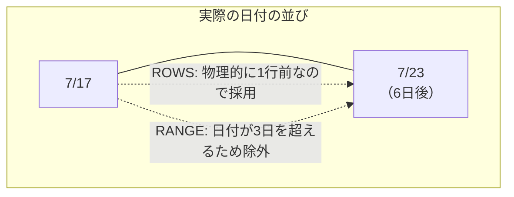
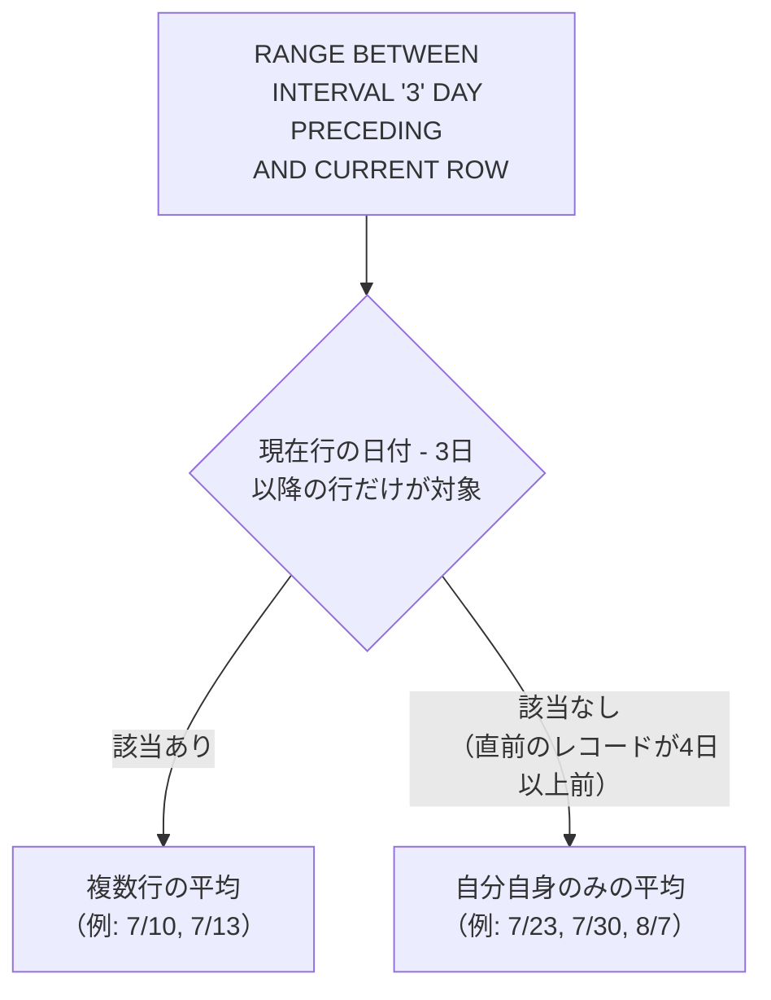
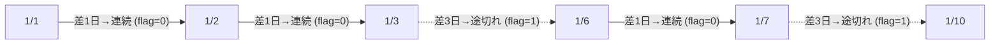
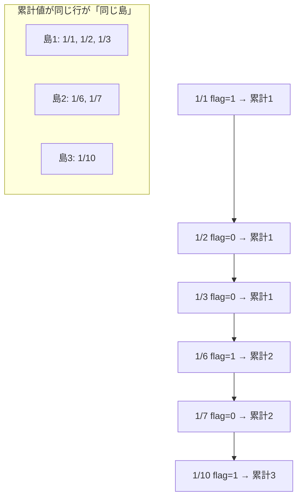
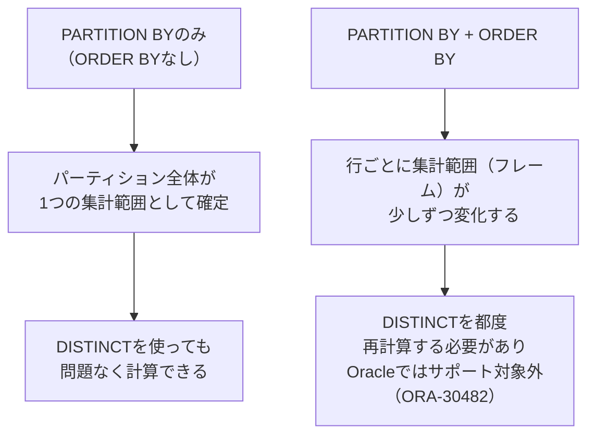
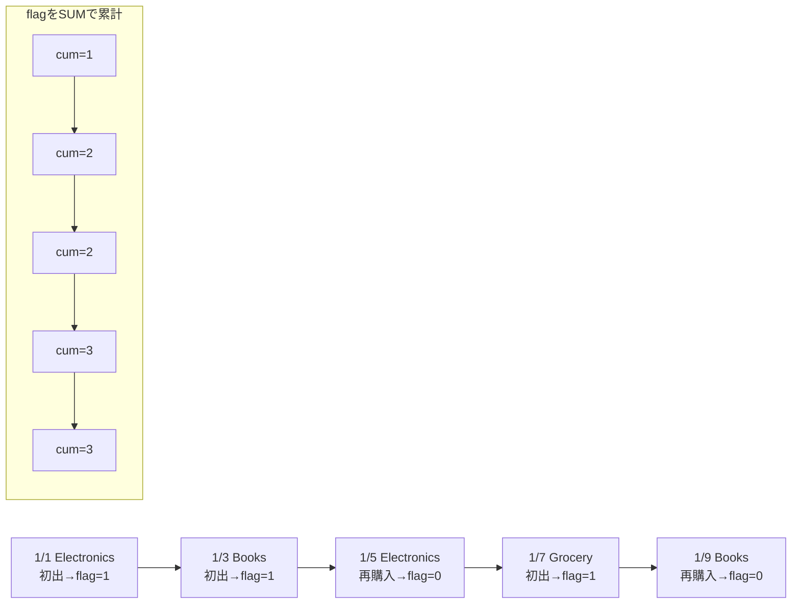

# 【完全版】問題12-23：真の「過去3日間」移動平均（RANGE BETWEEN INTERVALと日付の間隔）（問題12-13の発展）
### 難易度：★★★★☆ (Lv.4)
## 問題
問題12-13で扱ったSHスキーマの`SALES`テーブル（商品ID`20`、2021年7月〜8月）を再び使用します。
このデータは実際には**販売のあった日しかレコードが存在しない**（歯抜けの）時系列データです。問題12-13では「物理的に3行分」を平均する`MOVING_AVG_ROWS`を算出しましたが、今回はそれに加えて、**「実際の日付が3日以内に収まっている行だけ」** を対象にした`MOVING_AVG_RANGE`を算出し、両者を見比べてください。

**【条件およびルール】**
* **MOVING_AVG_ROWS**：自身を含め、物理的に3行前までの`DAILY_SALES`の平均（問題12-13と同じ定義）。
* **MOVING_AVG_RANGE**：自身を含め、**日付として3日以内**（`TIME_ID`が「現在の日付-3日」以上）にある`DAILY_SALES`の平均。前のレコードが4日以上前なら、集計対象から除外してください。
* 小数点以下は四捨五入して第2位まで表示してください。
* 結果は日付の昇順で表示してください。

## 期待する結果
| TIME_ID              | DAILY_SALES | MOVING_AVG_ROWS | MOVING_AVG_RANGE | 
| -------------------- | ----------- | --------------- | ---------------- | 
| 2021-07-07T00:00:00Z | 36200.12    | 36200.12        | 36200.12         | 
| 2021-07-10T00:00:00Z | 9230.62     | 22715.37        | 22715.37         | 
| 2021-07-13T00:00:00Z | 13371.2     | 19600.65        | 11300.91         | 
| 2021-07-16T00:00:00Z | 16093.89    | 12898.57        | 14732.55         | 
| 2021-07-17T00:00:00Z | 54332.45    | 27932.51        | 35213.17         | 
| 2021-07-23T00:00:00Z | 49865.69    | 40097.34        | 49865.69         | 
| 2021-07-26T00:00:00Z | 19618.33    | 41272.16        | 34742.01         | 
| 2021-07-30T00:00:00Z | 10660.04    | 26714.69        | 10660.04         | 
| 2021-08-07T00:00:00Z | 37534.64    | 22604.34        | 37534.64         | 
| 2021-08-10T00:00:00Z | 11254.76    | 19816.48        | 24394.7          | 
| 2021-08-13T00:00:00Z | 12628.8     | 20472.73        | 11941.78         | 
| 2021-08-16T00:00:00Z | 16852.8     | 13578.79        | 14740.8          | 
| 2021-08-17T00:00:00Z | 21757.89    | 17079.83        | 19305.35         | 
| 2021-08-23T00:00:00Z | 52063.66    | 30224.78        | 52063.66         | 
| 2021-08-26T00:00:00Z | 23172.75    | 32331.43        | 37618.21         | 
| 2021-08-30T00:00:00Z | 34190.23    | 36475.55        | 34190.23         | 

## 解答例
```sql
WITH daily_data AS (
    -- 1. まず日別の売上を集計する（分析関数の前準備）
    SELECT
        time_id,
        SUM(amount_sold) AS daily_sales
    FROM
        sh.sales
    WHERE
        prod_id = 20
        AND time_id BETWEEN DATE '2021-07-01' AND DATE '2021-8-31'
    GROUP BY
        time_id
)
SELECT
    time_id,
    daily_sales,
    -- 2-A. 物理的に3行分（自分+過去2行）で平均
    ROUND(
        AVG(daily_sales) OVER(
            ORDER BY time_id
            ROWS BETWEEN 2 PRECEDING AND CURRENT ROW
        ), 2
    ) AS moving_avg_rows,
    -- 2-B. 日付として過去3日以内の行だけで平均
    ROUND(
        AVG(daily_sales) OVER(
            ORDER BY time_id
            RANGE BETWEEN INTERVAL '3' DAY PRECEDING AND CURRENT ROW
        ), 2
    ) AS moving_avg_range
FROM
    daily_data
ORDER BY
    time_id
```

## 解説
問題12-13の解説の最後で、「`ROWS`は行の物理的な位置、`RANGE`は値（日付）の間隔を見る」という違いに軽く触れました。今回はその違いが結果にどう表れるかを、同じデータを使って実際に確認します。

このデータは商品20の「販売のあった日」だけが記録されており、7/17の次はいきなり7/23（6日後）、7/30の次はいきなり8/7（8日後）というように、日付の間隔がバラバラです。この「歯抜け」こそが、`ROWS`と`RANGE`の違いを際立たせる鍵になります。



`2021-07-23`の行に注目してください。`MOVING_AVG_ROWS`（40097.34）は、物理的に2行前の7/16、1行前の7/17を無条件に平均に含めています。データが「6日も前」のものであっても、`ROWS`は行の並び順しか見ないため気にしません。

一方`MOVING_AVG_RANGE`は`49865.69`となっており、これは7/23自身の売上とまったく同じ値です。これは、直前のレコードである7/17が「6日前」であり、`RANGE BETWEEN INTERVAL '3' DAY PRECEDING`の範囲（7/20〜7/23）から外れてしまうため、平均の対象が自分1行だけになったことを意味します。



逆に`2021-07-10`の行では、直前のレコード（7/7）がちょうど3日前にあたるため、`RANGE`の範囲（7/7〜7/10）にぎりぎり含まれ、`MOVING_AVG_ROWS`と`MOVING_AVG_RANGE`が偶然一致しています（22715.37）。このように、日付の間隔が3日以内に収まっているときだけ両者は一致し、間隔が開くとすぐに乖離するという性質が、期待する結果の各行から読み取れます。

| 観点 | `ROWS BETWEEN 2 PRECEDING AND CURRENT ROW` | `RANGE BETWEEN INTERVAL '3' DAY PRECEDING AND CURRENT ROW` |
| :--- | :--- | :--- |
| 何を数えるか | 物理的な行数（常に3行） | 値（日付）の間隔（3日以内なら何行でも） |
| データが歯抜けの場合 | 気にせず前の「行」を拾ってしまう | 間隔が空きすぎていれば自動的に除外される |
| 向いている場面 | 「直近の3件」を見たいとき（欠損は無視） | 「本当に直近3日間」を厳密に見たいとき |

:::message
### RANGEを使うときの制約：ORDER BYは1列だけ
`ROWS BETWEEN`では`ORDER BY`に複数の列を指定できますが、`RANGE BETWEEN ... INTERVAL`のように具体的な間隔を指定する場合、`ORDER BY`には**日付型または数値型の列を1つだけ**しか指定できません。
```sql
-- これはエラーになる（RANGEで複数列のORDER BYは不可）
AVG(daily_sales) OVER(
    ORDER BY time_id, product_id
    RANGE BETWEEN INTERVAL '3' DAY PRECEDING AND CURRENT ROW
)
```
これは、`RANGE`が「値そのものの大小・間隔」を基準に範囲を決める仕組みだからです。複数の列を組み合わせた場合、「間隔」という概念自体が定義できなくなるため、Oracleはこの書き方を許可していません。日付や数値以外の1列だけを`ORDER BY`に指定する必要がある点は、実務で`RANGE`を使う際につまずきやすいポイントです。
:::

`RANGE`は今回のように「欠測を許さず、本当にその期間内のデータだけを見たい」という監査的・厳密な要件（例：直近3日間の異常検知、直近30日間の解約率など）に向いています。一方、`ROWS`は「レコードがある日だけを繋いでトレンドを見たい」というような、大まかな傾向把握に向いています。どちらが正解ということではなく、分析の目的に応じて使い分けることが重要です。

---
<br><br>

# 【完全版】問題12-24：LAGによる連続ログイン日数の検出（ギャップ＆アイランド）
### 難易度：★★★★☆ (Lv.4)
## 問題
あるアプリの利用状況分析チームから、「各顧客の連続ログイン日数（ストリーク）」を洗い出してほしいという依頼がありました。
ログイン履歴（`LOGIN_LOG`）をもとに、**日付が途切れずに連続している期間（アイランド）** をすべて検出し、それぞれの開始日・終了日・連続日数を一覧化してください。

**【条件およびルール】**
* 顧客（`CUSTOMER_ID`）ごとに、ログイン日（`LOGIN_DATE`）が1日も途切れずに連続している期間を1つの「連続ログイン期間」とみなしてください。
* 前回のログインから2日以上間隔が空いた場合は、そこで期間が途切れたとみなし、新しい期間として扱ってください。
* 各期間について、**開始日（`START_DATE`）**、**終了日（`END_DATE`）**、**連続日数（`STREAK_DAYS`）** を算出してください。
* 結果は顧客ID、開始日の昇順で表示してください。

**【前提データ（WITH句）】**
```sql
WITH login_log AS (
    SELECT 1 AS customer_id, DATE '2024-01-01' AS login_date FROM dual UNION ALL
    SELECT 1, DATE '2024-01-02' FROM dual UNION ALL
    SELECT 1, DATE '2024-01-03' FROM dual UNION ALL
    SELECT 1, DATE '2024-01-06' FROM dual UNION ALL
    SELECT 1, DATE '2024-01-07' FROM dual UNION ALL
    SELECT 1, DATE '2024-01-10' FROM dual UNION ALL
    SELECT 2, DATE '2024-01-02' FROM dual UNION ALL
    SELECT 2, DATE '2024-01-03' FROM dual UNION ALL
    SELECT 2, DATE '2024-01-04' FROM dual UNION ALL
    SELECT 2, DATE '2024-01-05' FROM dual UNION ALL
    SELECT 2, DATE '2024-01-09' FROM dual
)
SELECT * FROM login_log
```

## 期待する結果
| CUSTOMER_ID | START_DATE           | END_DATE             | STREAK_DAYS | 
| ----------- | -------------------- | -------------------- | ----------- | 
| 1           | 2024-01-01T00:00:00Z | 2024-01-03T00:00:00Z | 3           | 
| 1           | 2024-01-06T00:00:00Z | 2024-01-07T00:00:00Z | 2           | 
| 1           | 2024-01-10T00:00:00Z | 2024-01-10T00:00:00Z | 1           | 
| 2           | 2024-01-02T00:00:00Z | 2024-01-05T00:00:00Z | 4           | 
| 2           | 2024-01-09T00:00:00Z | 2024-01-09T00:00:00Z | 1           | 

## 解答例
```sql:例1：LAGでギャップを検出し、SUMでグループ番号を振る
WITH login_log AS (
    SELECT 1 AS customer_id, DATE '2024-01-01' AS login_date FROM dual UNION ALL
    SELECT 1, DATE '2024-01-02' FROM dual UNION ALL
    SELECT 1, DATE '2024-01-03' FROM dual UNION ALL
    SELECT 1, DATE '2024-01-06' FROM dual UNION ALL
    SELECT 1, DATE '2024-01-07' FROM dual UNION ALL
    SELECT 1, DATE '2024-01-10' FROM dual UNION ALL
    SELECT 2, DATE '2024-01-02' FROM dual UNION ALL
    SELECT 2, DATE '2024-01-03' FROM dual UNION ALL
    SELECT 2, DATE '2024-01-04' FROM dual UNION ALL
    SELECT 2, DATE '2024-01-05' FROM dual UNION ALL
    SELECT 2, DATE '2024-01-09' FROM dual
),
-- ① 前回のログイン日と比較し、「新しい期間の始まり」かどうかにフラグを立てる
flagged AS (
    SELECT
        customer_id,
        login_date,
        CASE
            WHEN LAG(login_date) OVER(
                     PARTITION BY customer_id
                     ORDER BY login_date
                 ) = login_date - 1 THEN 0  -- 前日から連続 → 同じ期間
            ELSE 1                          -- 前日から途切れ（初回含む）→ 新しい期間
        END AS is_new_island
    FROM
        login_log
),
-- ② フラグの累計を取り、連続している行はすべて同じ「島番号」にする
islands AS (
    SELECT
        customer_id,
        login_date,
        SUM(is_new_island) OVER(
            PARTITION BY customer_id
            ORDER BY login_date
        ) AS island_grp
    FROM
        flagged
)
-- ③ 島番号ごとに開始日・終了日・日数を集計する
SELECT
    customer_id,
    MIN(login_date) AS start_date,
    MAX(login_date) AS end_date,
    COUNT(*) AS streak_days
FROM
    islands
GROUP BY
    customer_id,
    island_grp
ORDER BY
    customer_id,
    start_date
```
```sql:例2：別解（日付からROW_NUMBERを引く古典的トリック）
WITH login_log AS (
    SELECT 1 AS customer_id, DATE '2024-01-01' AS login_date FROM dual UNION ALL
    SELECT 1, DATE '2024-01-02' FROM dual UNION ALL
    SELECT 1, DATE '2024-01-03' FROM dual UNION ALL
    SELECT 1, DATE '2024-01-06' FROM dual UNION ALL
    SELECT 1, DATE '2024-01-07' FROM dual UNION ALL
    SELECT 1, DATE '2024-01-10' FROM dual UNION ALL
    SELECT 2, DATE '2024-01-02' FROM dual UNION ALL
    SELECT 2, DATE '2024-01-03' FROM dual UNION ALL
    SELECT 2, DATE '2024-01-04' FROM dual UNION ALL
    SELECT 2, DATE '2024-01-05' FROM dual UNION ALL
    SELECT 2, DATE '2024-01-09' FROM dual
),
-- 「ログイン日」から「連番」を引くと、連続期間内では常に同じ値になる
grp_calc AS (
    SELECT
        customer_id,
        login_date,
        login_date - ROW_NUMBER() OVER(
            PARTITION BY customer_id
            ORDER BY login_date
        ) AS island_key
    FROM
        login_log
)
SELECT
    customer_id,
    MIN(login_date) AS start_date,
    MAX(login_date) AS end_date,
    COUNT(*) AS streak_days
FROM
    grp_calc
GROUP BY
    customer_id,
    island_key
ORDER BY
    customer_id,
    start_date
```

## 解説
「ギャップ＆アイランド」問題は、「途切れなく連続しているデータのかたまり（島）」を検出するという、実務で非常に頻度の高いテーマです。連続ログイン日数（ストリーク）のほかにも、システムの連続稼働期間、在庫が連続して欠品していた期間、従業員の連続出勤日数など、応用範囲は多岐にわたります。

例1は「①ギャップの検出 → ②島番号の付与 → ③島ごとの集計」という3段階に分けて考えるオーソドックスな解き方です。

**①ギャップの検出（LAG）**
```sql
CASE
    WHEN LAG(login_date) OVER(PARTITION BY customer_id ORDER BY login_date) = login_date - 1 THEN 0
    ELSE 1
END
```
`LAG`で「1つ前のログイン日」を取得し、それが「今日 - 1日」と一致するかどうかを調べています。一致すれば「前日から連続している」ということなので`0`、一致しなければ（2日以上間隔が空いた、またはその顧客の最初のログインで`LAG`が`NULL`になる）「新しい期間の始まり」ということで`1`を立てます。



**②島番号の付与（SUMの累計）**
```sql
SUM(is_new_island) OVER(PARTITION BY customer_id ORDER BY login_date)
```
ここが最大のポイントです。「新しい期間の始まり」フラグ（`1`）を、日付順に**累計（ランニング・トータル）** していくと、連続している行はすべて同じ数字を共有し、途切れるたびに数字が1つ増える、という性質が生まれます。



累計値（`island_grp`）が`1`の行は「1/1, 1/2, 1/3」、`2`の行は「1/6, 1/7」、`3`の行は「1/10」となり、この累計値こそが「島（アイランド）を識別するための仮のグループ番号」になります。

**③島ごとの集計**
最後に、この`island_grp`を通常の`GROUP BY`のキーとして使うことで、`MIN(login_date)`で開始日、`MAX(login_date)`で終了日、`COUNT(*)`で連続日数を求めることができます。分析関数で「グループ番号」さえ作ってしまえば、あとは使い慣れた集計関数で仕上げられるのがこのテクニックの強みです。

例2は、同じ結果を導く古典的な別解です。
```sql
login_date - ROW_NUMBER() OVER(PARTITION BY customer_id ORDER BY login_date)
```
「連続する日付の並び」から「連続する整数（行番号）」を引き算すると、連続期間の中では常に同じ値（日付の定数）になる、という数学的な性質を利用したテクニックです。例えば1/1, 1/2, 1/3という3日間から、行番号1, 2, 3を引くと、すべて「12/31」という同じ値になります（1/6, 1/7からは行番号4, 5を引くと「1/2」という別の同じ値になります）。この「同じ値になったものが同じ島」という考え方は、`LAG`を使わずに済む分シンプルですが、「なぜ日付から連番を引くと同じ値になるのか」という発想の飛躍があるため、初見では例1の`LAG`＋`SUM`の方が理解しやすいでしょう。

| 方式 | 特徴 |
| :--- | :--- |
| 例1（`LAG` + `SUM`） | 「前の行との比較」というロジックが明示的で、ギャップの条件（2日以上空いたら等）を柔軟に変更しやすい |
| 例2（日付 − `ROW_NUMBER()`） | コードは短いが、発想がトリッキーで、ギャップの条件を「1日空き」以外に変えたいときに応用しにくい |

なお例1の`CASE`条件を`login_date - 3`のように変えれば「2日間の空きまでは同じ期間とみなす」といった柔軟なルールにも対応できますが、例2の引き算トリックは「間隔がちょうど1日」という前提に強く依存しているため、そうした条件変更には向いていません。

:::message
### 分析関数だけで「連続」を判定する限界
今回のように`LAG`と`SUM`を組み合わせれば連続日数の検出は可能ですが、コードは3段階のCTEに分かれ、決して直感的とは言えません。実はOracle 12c以降には、こうした「パターン（連続、増加、減少など）を持つ行の集まり」を専用の構文で検出できる`MATCH_RECOGNIZE`という機能があります。第16章では、今回と同じ「連続する期間の検出」というテーマを`MATCH_RECOGNIZE`で解き直し、`LAG`を使う方法と比べてどれだけ宣言的に書けるかを比較します。
:::

ログイン履歴の分析では、「3日以上連続ログインしたユーザーにボーナスを付与する」「7日間の連続ログインが途切れたユーザーにリマインド通知を送る」といった施策の元データとして、こうしたストリーク検出のクエリがよく使われます。今回の`STREAK_DAYS`（連続日数）に対して`WHERE`句で`HAVING streak_days >= 3`のような条件を追加すれば、そのままボーナス対象者の抽出にも応用できます。

---
<br><br>

ご指摘ありがとうございます。確認したところ、こちらの認識に誤りがありました。訂正してご説明します。

## 何が間違っていたか
`COUNT(DISTINCT expr) OVER (...)` の制約は、正確には次の通りです。

| 書き方 | 結果 |
| :--- | :--- |
| `COUNT(DISTINCT expr) OVER(PARTITION BY ...)`（`ORDER BY`なし） | **エラーにならない**（パーティション全体のDISTINCT件数を返す） |
| `COUNT(DISTINCT expr) OVER(PARTITION BY ... ORDER BY ...)`（`ORDER BY`あり＝ウィンドウ処理） | **ORA-30482で エラーになる** |

つまり「`DISTINCT`と`OVER`が共存できない」のではなく、正しくは「**`OVER`句の中に`ORDER BY`（＝ウィンドウ/フレーム処理）が入ると、`DISTINCT`は使えなくなる**」という制約でした。`PARTITION BY`だけであれば「パーティション全体に対する1回きりの集計」として扱われるため、`DISTINCT`との相性問題が起きず、正常に動作します。

元の問題は「顧客ごとの合計種類数」という要件だったため`PARTITION BY`のみで解決でき、そもそもエラーが再現しない設計になっていました。この制約が本当に問題になるのは、**「日付順に、その時点までの累計ユニーク数」を求めたい**ような、`ORDER BY`が必須になるケースです。この方がより実務的で、罠としても正確なので、問題をそちらの要件に作り直しました。

---

# 【完全版】問題12-25：累計ユニーク件数の罠（COUNT(DISTINCT...)とORDER BYの相性）
### 難易度：★★★★☆ (Lv.4)
## 問題
ECサイトの購買データをもとに、**各顧客について、購入日ごとに「その時点までに何種類の商品カテゴリを購入したか（累計）」** を明細の各行に付与するレポートを作成してください。

**【条件およびルール】**
* 明細（1行1購入）はそのまま**すべて表示**してください（`GROUP BY`で行数を減らさないこと）。
* `RUNNING_CATEGORY_CNT`列には、**その購入日までに（その行を含めて）その顧客が購入した商品カテゴリの重複を除いた種類数**を付与してください。
* 同じカテゴリを再度購入しても、種類数は増えません。
* 結果は顧客ID、購入日の昇順で表示してください。

**【前提データ（WITH句）】**
```sql
WITH purchase_log AS (
    SELECT 1 AS customer_id, DATE '2024-01-01' AS purchase_date, 'Electronics' AS product_category FROM dual UNION ALL
    SELECT 1, DATE '2024-01-03', 'Books'       FROM dual UNION ALL
    SELECT 1, DATE '2024-01-05', 'Electronics' FROM dual UNION ALL
    SELECT 1, DATE '2024-01-07', 'Grocery'     FROM dual UNION ALL
    SELECT 1, DATE '2024-01-09', 'Books'       FROM dual UNION ALL
    SELECT 2, DATE '2024-01-02', 'Grocery'     FROM dual UNION ALL
    SELECT 2, DATE '2024-01-04', 'Grocery'     FROM dual UNION ALL
    SELECT 2, DATE '2024-01-06', 'Grocery'     FROM dual UNION ALL
    SELECT 3, DATE '2024-01-01', 'Books'       FROM dual UNION ALL
    SELECT 3, DATE '2024-01-08', 'Electronics' FROM dual
)
SELECT * FROM purchase_log
```

## 期待する結果
| CUSTOMER_ID | PURCHASE_DATE          | PRODUCT_CATEGORY | RUNNING_CATEGORY_CNT |
| ----------- | ------------------------ | ------------------- | ---------------------- |
| 1           | 2024-01-01T00:00:00Z       | Electronics            | 1                        |
| 1           | 2024-01-03T00:00:00Z       | Books                  | 2                        |
| 1           | 2024-01-05T00:00:00Z       | Electronics            | 2                        |
| 1           | 2024-01-07T00:00:00Z       | Grocery                | 3                        |
| 1           | 2024-01-09T00:00:00Z       | Books                  | 3                        |
| 2           | 2024-01-02T00:00:00Z       | Grocery                | 1                        |
| 2           | 2024-01-04T00:00:00Z       | Grocery                | 1                        |
| 2           | 2024-01-06T00:00:00Z       | Grocery                | 1                        |
| 3           | 2024-01-01T00:00:00Z       | Books                  | 1                        |
| 3           | 2024-01-08T00:00:00Z       | Electronics            | 2                        |

## 解答例
```sql:例1：PARTITION BYのみなら実は問題ない（合計種類数の場合）
WITH purchase_log AS (
    SELECT 1 AS customer_id, DATE '2024-01-01' AS purchase_date, 'Electronics' AS product_category FROM dual UNION ALL
    SELECT 1, DATE '2024-01-03', 'Books'       FROM dual UNION ALL
    SELECT 1, DATE '2024-01-05', 'Electronics' FROM dual UNION ALL
    SELECT 1, DATE '2024-01-07', 'Grocery'     FROM dual UNION ALL
    SELECT 1, DATE '2024-01-09', 'Books'       FROM dual UNION ALL
    SELECT 2, DATE '2024-01-02', 'Grocery'     FROM dual UNION ALL
    SELECT 2, DATE '2024-01-04', 'Grocery'     FROM dual UNION ALL
    SELECT 2, DATE '2024-01-06', 'Grocery'     FROM dual UNION ALL
    SELECT 3, DATE '2024-01-01', 'Books'       FROM dual UNION ALL
    SELECT 3, DATE '2024-01-08', 'Electronics' FROM dual
)
-- ORDER BYを指定しないため、これは正常に動作する（顧客ごとの「合計」種類数が返る）
SELECT
    customer_id,
    purchase_date,
    product_category,
    COUNT(DISTINCT product_category) OVER(PARTITION BY customer_id) AS total_category_count
FROM
    purchase_log
ORDER BY
    customer_id,
    purchase_date
```
```sql:例2：NG例（ORDER BYを追加した瞬間にエラーになる）
WITH purchase_log AS (
    SELECT 1 AS customer_id, DATE '2024-01-01' AS purchase_date, 'Electronics' AS product_category FROM dual UNION ALL
    SELECT 1, DATE '2024-01-03', 'Books'       FROM dual UNION ALL
    SELECT 1, DATE '2024-01-05', 'Electronics' FROM dual UNION ALL
    SELECT 1, DATE '2024-01-07', 'Grocery'     FROM dual UNION ALL
    SELECT 1, DATE '2024-01-09', 'Books'       FROM dual UNION ALL
    SELECT 2, DATE '2024-01-02', 'Grocery'     FROM dual UNION ALL
    SELECT 2, DATE '2024-01-04', 'Grocery'     FROM dual UNION ALL
    SELECT 2, DATE '2024-01-06', 'Grocery'     FROM dual UNION ALL
    SELECT 3, DATE '2024-01-01', 'Books'       FROM dual UNION ALL
    SELECT 3, DATE '2024-01-08', 'Electronics' FROM dual
)
-- 「累計」を求めようとORDER BYを足すと、途端にエラーになる
SELECT
    customer_id,
    purchase_date,
    product_category,
    COUNT(DISTINCT product_category) OVER(
        PARTITION BY customer_id
        ORDER BY purchase_date
    ) AS running_category_cnt
FROM
    purchase_log
ORDER BY
    customer_id,
    purchase_date
-- ORA-30482: DISTINCT function not allowed here
```
```sql:例3：正解（初出フラグ＋累計SUMによる代替）
WITH purchase_log AS (
    SELECT 1 AS customer_id, DATE '2024-01-01' AS purchase_date, 'Electronics' AS product_category FROM dual UNION ALL
    SELECT 1, DATE '2024-01-03', 'Books'       FROM dual UNION ALL
    SELECT 1, DATE '2024-01-05', 'Electronics' FROM dual UNION ALL
    SELECT 1, DATE '2024-01-07', 'Grocery'     FROM dual UNION ALL
    SELECT 1, DATE '2024-01-09', 'Books'       FROM dual UNION ALL
    SELECT 2, DATE '2024-01-02', 'Grocery'     FROM dual UNION ALL
    SELECT 2, DATE '2024-01-04', 'Grocery'     FROM dual UNION ALL
    SELECT 2, DATE '2024-01-06', 'Grocery'     FROM dual UNION ALL
    SELECT 3, DATE '2024-01-01', 'Books'       FROM dual UNION ALL
    SELECT 3, DATE '2024-01-08', 'Electronics' FROM dual
),
-- ① そのカテゴリを顧客が「最初に購入した日」かどうかにフラグを立てる
flagged AS (
    SELECT
        customer_id,
        purchase_date,
        product_category,
        CASE
            WHEN purchase_date = MIN(purchase_date) OVER(
                     PARTITION BY customer_id, product_category
                 ) THEN 1  -- そのカテゴリの初購入日
            ELSE 0         -- 既に購入したことがあるカテゴリの再購入
        END AS is_first_purchase
    FROM
        purchase_log
)
-- ② 「初購入フラグ」を日付順に累計すれば、それがそのまま累計種類数になる
SELECT
    customer_id,
    purchase_date,
    product_category,
    SUM(is_first_purchase) OVER(
        PARTITION BY customer_id
        ORDER BY purchase_date
        ROWS BETWEEN UNBOUNDED PRECEDING AND CURRENT ROW
    ) AS running_category_cnt
FROM
    flagged
ORDER BY
    customer_id,
    purchase_date
```

## 解説
`COUNT(DISTINCT ...)`と分析関数（`OVER`句）の組み合わせは、条件によって挙動が分かれる、少し込み入った制約を持っています。

例1を見てください。
```sql
COUNT(DISTINCT product_category) OVER(PARTITION BY customer_id)
```
`OVER`句の中身が`PARTITION BY`だけで、`ORDER BY`がありません。この場合、「パーティション（顧客）全体を対象にした、1回きりの集計」として扱われるため、`DISTINCT`を使ってもエラーにはならず、顧客ごとの「合計」カテゴリ種類数が全行に付与されます。

ところが例2のように、そこへ`ORDER BY purchase_date`を追加すると、次のエラーが発生します。
```
ORA-30482: DISTINCT function not allowed here
```
`ORDER BY`が`OVER`句に加わるということは、「行ごとに集計対象の範囲（フレーム）が変わっていく」ということを意味します。今回であれば、1行目は「1日目までの範囲」、2行目は「2日目までの範囲」というように、範囲が1行ずつ広がっていきます。この「範囲が広がるたびに重複を数え直す」という処理は、`SUM`や`COUNT(*)`のような単純な足し算とは違い、都度「これまでに出てきた値と同じかどうか」を全部チェックし直す必要があり、計算コストの観点からOracleでは実装がサポートされていません。



:::message
### なぜ「合計」ならOKで「累計」だとNGなのか
言い換えると、`COUNT(DISTINCT ...)`が`OVER`句と共存できないのではなく、**「範囲が固定された集計（`PARTITION BY`のみ）」ではOK**で、**「行ごとに範囲が変化する集計（`ORDER BY`を伴うウィンドウ処理）」ではNG**、というのが正確なルールです。「累計」「移動○○」といった、行ごとに集計範囲が変わる処理に`DISTINCT`を組み合わせたくなったときは、この制約を思い出してください。
:::

エラーを回避する例3は、問題12-24（連続ログイン日数の検出）で使った「フラグを立てて`SUM`で累計する」というテクニックの応用です。



ステップ①では、「そのカテゴリを顧客が初めて購入した日」を`MIN(purchase_date) OVER(PARTITION BY customer_id, product_category)`で特定し、購入日がその最小日と一致する行にだけ`1`のフラグを立てています。同じカテゴリを2回目以降に購入した行は、当然その最小日とは一致しないため`0`になります。

ステップ②では、この「初購入フラグ」を`SUM() OVER(... ORDER BY purchase_date ROWS BETWEEN UNBOUNDED PRECEDING AND CURRENT ROW)`で日付順に累計しています。「新しいカテゴリに出会うたびに+1され、既知のカテゴリの再購入では増えない」という数字を累計すれば、それはそのまま「その時点までのユニークなカテゴリ数」と一致します。`SUM`や`MIN`はどちらも通常の（`DISTINCT`を使わない）分析関数なので、`ORDER BY`を伴うウィンドウ処理と問題なく組み合わせられます。

| 要件 | 使える書き方 |
| :--- | :--- |
| グループ全体の「合計」ユニーク数 | `COUNT(DISTINCT ...) OVER(PARTITION BY ...)`（`ORDER BY`なしでOK） |
| 日付順などに沿った「累計」ユニーク数 | `COUNT(DISTINCT...)`は使えない → 「初出フラグ＋累計`SUM`」で代替 |

「新規顧客の累計獲得数」「累計ユニークアクセス数（UU）」「入会からの累計利用カテゴリ数」といった、時系列に沿ったユニークカウントはマーケティング分析でも頻出のテーマです。`COUNT(DISTINCT...)`がそのまま使えないと分かった時点で諦めず、「初出フラグを立ててから`SUM`で累計する」という今回のパターンを思い出せるようにしておきましょう。