# 【完全版】問題12-23：真の「過去3日間」移動平均（RANGE BETWEEN INTERVALと日付の間隔）（問題12-13の発展）
### 難易度：★★★★☆ (Lv.4)
## 問題
問題12-13で扱ったSHスキーマの`SALES`テーブル（商品ID`20`、2021年7月〜8月）を再び使用します。
このデータは実際には**販売のあった日しかレコードが存在しない**（歯抜けの）時系列データです。問題12-13では「物理的に3行分」を平均する`MOVING_AVG_ROWS`を算出しましたが、今回はそれに加えて、**「実際の日付が3日以内に収まっている行だけ」** を対象にした`MOVING_AVG_RANGE`を算出し、両者を見比べてください。

**【条件およびルール】**
* **MOVING_AVG_ROWS**：自身を含め、物理的に3行前までの`DAILY_SALES`の平均（問題12-13と同じ定義）。
* **MOVING_AVG_RANGE**：自身を含め、**日付として3日以内**（`TIME_ID`が「現在の日付-3日」以上）にある`DAILY_SALES`の平均。前のレコードが4日以上前なら、集計対象から除外してください。
* 小数点以下は四捨五入して第2位まで表示してください。
* 結果は日付の昇順で表示してください。

## 期待する結果
| TIME_ID              | DAILY_SALES | MOVING_AVG_ROWS | MOVING_AVG_RANGE | 
| -------------------- | ----------- | --------------- | ---------------- | 
| 2021-07-07T00:00:00Z | 36200.12    | 36200.12        | 36200.12         | 
| 2021-07-10T00:00:00Z | 9230.62     | 22715.37        | 22715.37         | 
| 2021-07-13T00:00:00Z | 13371.2     | 19600.65        | 11300.91         | 
| 2021-07-16T00:00:00Z | 16093.89    | 12898.57        | 14732.55         | 
| 2021-07-17T00:00:00Z | 54332.45    | 27932.51        | 35213.17         | 
| 2021-07-23T00:00:00Z | 49865.69    | 40097.34        | 49865.69         | 
| 2021-07-26T00:00:00Z | 19618.33    | 41272.16        | 34742.01         | 
| 2021-07-30T00:00:00Z | 10660.04    | 26714.69        | 10660.04         | 
| 2021-08-07T00:00:00Z | 37534.64    | 22604.34        | 37534.64         | 
| 2021-08-10T00:00:00Z | 11254.76    | 19816.48        | 24394.7          | 
| 2021-08-13T00:00:00Z | 12628.8     | 20472.73        | 11941.78         | 
| 2021-08-16T00:00:00Z | 16852.8     | 13578.79        | 14740.8          | 
| 2021-08-17T00:00:00Z | 21757.89    | 17079.83        | 19305.35         | 
| 2021-08-23T00:00:00Z | 52063.66    | 30224.78        | 52063.66         | 
| 2021-08-26T00:00:00Z | 23172.75    | 32331.43        | 37618.21         | 
| 2021-08-30T00:00:00Z | 34190.23    | 36475.55        | 34190.23         | 

## 解答例
```sql
WITH daily_data AS (
    -- 1. まず日別の売上を集計する（分析関数の前準備）
    SELECT
        time_id,
        SUM(amount_sold) AS daily_sales
    FROM
        sh.sales
    WHERE
        prod_id = 20
        AND time_id BETWEEN DATE '2021-07-01' AND DATE '2021-8-31'
    GROUP BY
        time_id
)
SELECT
    time_id,
    daily_sales,
    -- 2-A. 物理的に3行分（自分+過去2行）で平均
    ROUND(
        AVG(daily_sales) OVER(
            ORDER BY time_id
            ROWS BETWEEN 2 PRECEDING AND CURRENT ROW
        ), 2
    ) AS moving_avg_rows,
    -- 2-B. 日付として過去3日以内の行だけで平均
    ROUND(
        AVG(daily_sales) OVER(
            ORDER BY time_id
            RANGE BETWEEN INTERVAL '3' DAY PRECEDING AND CURRENT ROW
        ), 2
    ) AS moving_avg_range
FROM
    daily_data
ORDER BY
    time_id
```

## 解説
問題12-13の解説の最後で、「`ROWS`は行の物理的な位置、`RANGE`は値（日付）の間隔を見る」という違いに軽く触れました。今回はその違いが結果にどう表れるかを、同じデータを使って実際に確認します。

このデータは商品20の「販売のあった日」だけが記録されており、7/17の次はいきなり7/23（6日後）、7/30の次はいきなり8/7（8日後）というように、日付の間隔がバラバラです。この「歯抜け」こそが、`ROWS`と`RANGE`の違いを際立たせる鍵になります。

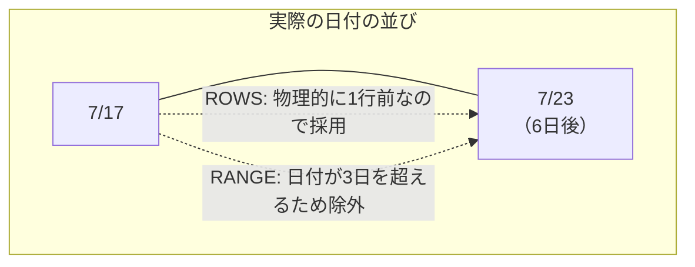

`2021-07-23`の行に注目してください。`MOVING_AVG_ROWS`（40097.34）は、物理的に2行前の7/16、1行前の7/17を無条件に平均に含めています。データが「6日も前」のものであっても、`ROWS`は行の並び順しか見ないため気にしません。

一方`MOVING_AVG_RANGE`は`49865.69`となっており、これは7/23自身の売上とまったく同じ値です。これは、直前のレコードである7/17が「6日前」であり、`RANGE BETWEEN INTERVAL '3' DAY PRECEDING`の範囲（7/20〜7/23）から外れてしまうため、平均の対象が自分1行だけになったことを意味します。

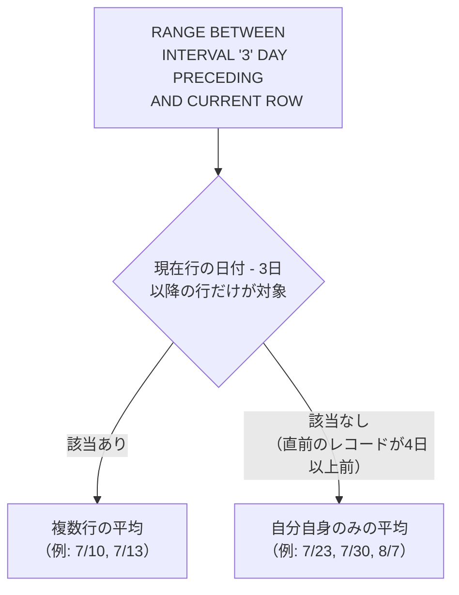

逆に`2021-07-10`の行では、直前のレコード（7/7）がちょうど3日前にあたるため、`RANGE`の範囲（7/7〜7/10）にぎりぎり含まれ、`MOVING_AVG_ROWS`と`MOVING_AVG_RANGE`が偶然一致しています（22715.37）。このように、日付の間隔が3日以内に収まっているときだけ両者は一致し、間隔が開くとすぐに乖離するという性質が、期待する結果の各行から読み取れます。

| 観点 | `ROWS BETWEEN 2 PRECEDING AND CURRENT ROW` | `RANGE BETWEEN INTERVAL '3' DAY PRECEDING AND CURRENT ROW` |
| :--- | :--- | :--- |
| 何を数えるか | 物理的な行数（常に3行） | 値（日付）の間隔（3日以内なら何行でも） |
| データが歯抜けの場合 | 気にせず前の「行」を拾ってしまう | 間隔が空きすぎていれば自動的に除外される |
| 向いている場面 | 「直近の3件」を見たいとき（欠損は無視） | 「本当に直近3日間」を厳密に見たいとき |

:::message
### RANGEを使うときの制約：ORDER BYは1列だけ
`ROWS BETWEEN`では`ORDER BY`に複数の列を指定できますが、`RANGE BETWEEN ... INTERVAL`のように具体的な間隔を指定する場合、`ORDER BY`には**日付型または数値型の列を1つだけ**しか指定できません。
```sql
-- これはエラーになる（RANGEで複数列のORDER BYは不可）
AVG(daily_sales) OVER(
    ORDER BY time_id, product_id
    RANGE BETWEEN INTERVAL '3' DAY PRECEDING AND CURRENT ROW
)
```
これは、`RANGE`が「値そのものの大小・間隔」を基準に範囲を決める仕組みだからです。複数の列を組み合わせた場合、「間隔」という概念自体が定義できなくなるため、Oracleはこの書き方を許可していません。日付や数値以外の1列だけを`ORDER BY`に指定する必要がある点は、実務で`RANGE`を使う際につまずきやすいポイントです。
:::

`RANGE`は今回のように「欠測を許さず、本当にその期間内のデータだけを見たい」という監査的・厳密な要件（例：直近3日間の異常検知、直近30日間の解約率など）に向いています。一方、`ROWS`は「レコードがある日だけを繋いでトレンドを見たい」というような、大まかな傾向把握に向いています。どちらが正解ということではなく、分析の目的に応じて使い分けることが重要です。

---
<br><br>

# 【完全版】問題12-24：LAGによる連続ログイン日数の検出（ギャップ＆アイランド）
### 難易度：★★★★☆ (Lv.4)
## 問題
あるアプリの利用状況分析チームから、「各顧客の連続ログイン日数（ストリーク）」を洗い出してほしいという依頼がありました。
ログイン履歴（`LOGIN_LOG`）をもとに、**日付が途切れずに連続している期間（アイランド）** をすべて検出し、それぞれの開始日・終了日・連続日数を一覧化してください。

**【条件およびルール】**
* 顧客（`CUSTOMER_ID`）ごとに、ログイン日（`LOGIN_DATE`）が1日も途切れずに連続している期間を1つの「連続ログイン期間」とみなしてください。
* 前回のログインから2日以上間隔が空いた場合は、そこで期間が途切れたとみなし、新しい期間として扱ってください。
* 各期間について、**開始日（`START_DATE`）**、**終了日（`END_DATE`）**、**連続日数（`STREAK_DAYS`）** を算出してください。
* 結果は顧客ID、開始日の昇順で表示してください。

**【前提データ（WITH句）】**
```sql
WITH login_log AS (
    SELECT 1 AS customer_id, DATE '2024-01-01' AS login_date FROM dual UNION ALL
    SELECT 1, DATE '2024-01-02' FROM dual UNION ALL
    SELECT 1, DATE '2024-01-03' FROM dual UNION ALL
    SELECT 1, DATE '2024-01-06' FROM dual UNION ALL
    SELECT 1, DATE '2024-01-07' FROM dual UNION ALL
    SELECT 1, DATE '2024-01-10' FROM dual UNION ALL
    SELECT 2, DATE '2024-01-02' FROM dual UNION ALL
    SELECT 2, DATE '2024-01-03' FROM dual UNION ALL
    SELECT 2, DATE '2024-01-04' FROM dual UNION ALL
    SELECT 2, DATE '2024-01-05' FROM dual UNION ALL
    SELECT 2, DATE '2024-01-09' FROM dual
)
SELECT * FROM login_log
```

## 期待する結果
| CUSTOMER_ID | START_DATE           | END_DATE             | STREAK_DAYS | 
| ----------- | -------------------- | -------------------- | ----------- | 
| 1           | 2024-01-01T00:00:00Z | 2024-01-03T00:00:00Z | 3           | 
| 1           | 2024-01-06T00:00:00Z | 2024-01-07T00:00:00Z | 2           | 
| 1           | 2024-01-10T00:00:00Z | 2024-01-10T00:00:00Z | 1           | 
| 2           | 2024-01-02T00:00:00Z | 2024-01-05T00:00:00Z | 4           | 
| 2           | 2024-01-09T00:00:00Z | 2024-01-09T00:00:00Z | 1           | 

## 解答例
```sql:例1：LAGでギャップを検出し、SUMでグループ番号を振る
WITH login_log AS (
    SELECT 1 AS customer_id, DATE '2024-01-01' AS login_date FROM dual UNION ALL
    SELECT 1, DATE '2024-01-02' FROM dual UNION ALL
    SELECT 1, DATE '2024-01-03' FROM dual UNION ALL
    SELECT 1, DATE '2024-01-06' FROM dual UNION ALL
    SELECT 1, DATE '2024-01-07' FROM dual UNION ALL
    SELECT 1, DATE '2024-01-10' FROM dual UNION ALL
    SELECT 2, DATE '2024-01-02' FROM dual UNION ALL
    SELECT 2, DATE '2024-01-03' FROM dual UNION ALL
    SELECT 2, DATE '2024-01-04' FROM dual UNION ALL
    SELECT 2, DATE '2024-01-05' FROM dual UNION ALL
    SELECT 2, DATE '2024-01-09' FROM dual
),
-- ① 前回のログイン日と比較し、「新しい期間の始まり」かどうかにフラグを立てる
flagged AS (
    SELECT
        customer_id,
        login_date,
        CASE
            WHEN LAG(login_date) OVER(
                     PARTITION BY customer_id
                     ORDER BY login_date
                 ) = login_date - 1 THEN 0  -- 前日から連続 → 同じ期間
            ELSE 1                          -- 前日から途切れ（初回含む）→ 新しい期間
        END AS is_new_island
    FROM
        login_log
),
-- ② フラグの累計を取り、連続している行はすべて同じ「島番号」にする
islands AS (
    SELECT
        customer_id,
        login_date,
        SUM(is_new_island) OVER(
            PARTITION BY customer_id
            ORDER BY login_date
        ) AS island_grp
    FROM
        flagged
)
-- ③ 島番号ごとに開始日・終了日・日数を集計する
SELECT
    customer_id,
    MIN(login_date) AS start_date,
    MAX(login_date) AS end_date,
    COUNT(*) AS streak_days
FROM
    islands
GROUP BY
    customer_id,
    island_grp
ORDER BY
    customer_id,
    start_date
```
```sql:例2：別解（日付からROW_NUMBERを引く古典的トリック）
WITH login_log AS (
    SELECT 1 AS customer_id, DATE '2024-01-01' AS login_date FROM dual UNION ALL
    SELECT 1, DATE '2024-01-02' FROM dual UNION ALL
    SELECT 1, DATE '2024-01-03' FROM dual UNION ALL
    SELECT 1, DATE '2024-01-06' FROM dual UNION ALL
    SELECT 1, DATE '2024-01-07' FROM dual UNION ALL
    SELECT 1, DATE '2024-01-10' FROM dual UNION ALL
    SELECT 2, DATE '2024-01-02' FROM dual UNION ALL
    SELECT 2, DATE '2024-01-03' FROM dual UNION ALL
    SELECT 2, DATE '2024-01-04' FROM dual UNION ALL
    SELECT 2, DATE '2024-01-05' FROM dual UNION ALL
    SELECT 2, DATE '2024-01-09' FROM dual
),
-- 「ログイン日」から「連番」を引くと、連続期間内では常に同じ値になる
grp_calc AS (
    SELECT
        customer_id,
        login_date,
        login_date - ROW_NUMBER() OVER(
            PARTITION BY customer_id
            ORDER BY login_date
        ) AS island_key
    FROM
        login_log
)
SELECT
    customer_id,
    MIN(login_date) AS start_date,
    MAX(login_date) AS end_date,
    COUNT(*) AS streak_days
FROM
    grp_calc
GROUP BY
    customer_id,
    island_key
ORDER BY
    customer_id,
    start_date
```

## 解説
「ギャップ＆アイランド」問題は、「途切れなく連続しているデータのかたまり（島）」を検出するという、実務で非常に頻度の高いテーマです。連続ログイン日数（ストリーク）のほかにも、システムの連続稼働期間、在庫が連続して欠品していた期間、従業員の連続出勤日数など、応用範囲は多岐にわたります。

例1は「①ギャップの検出 → ②島番号の付与 → ③島ごとの集計」という3段階に分けて考えるオーソドックスな解き方です。

**①ギャップの検出（LAG）**
```sql
CASE
    WHEN LAG(login_date) OVER(PARTITION BY customer_id ORDER BY login_date) = login_date - 1 THEN 0
    ELSE 1
END
```
`LAG`で「1つ前のログイン日」を取得し、それが「今日 - 1日」と一致するかどうかを調べています。一致すれば「前日から連続している」ということなので`0`、一致しなければ（2日以上間隔が空いた、またはその顧客の最初のログインで`LAG`が`NULL`になる）「新しい期間の始まり」ということで`1`を立てます。

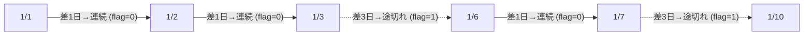

**②島番号の付与（SUMの累計）**
```sql
SUM(is_new_island) OVER(PARTITION BY customer_id ORDER BY login_date)
```
ここが最大のポイントです。「新しい期間の始まり」フラグ（`1`）を、日付順に**累計（ランニング・トータル）** していくと、連続している行はすべて同じ数字を共有し、途切れるたびに数字が1つ増える、という性質が生まれます。

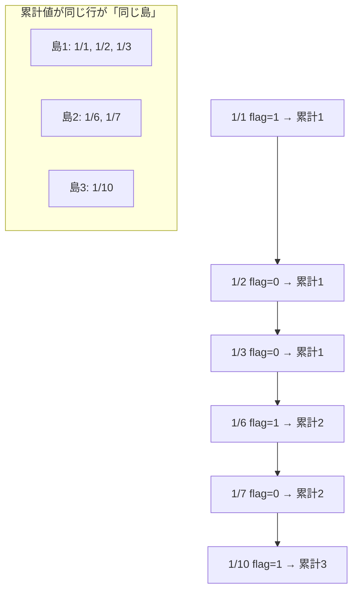

累計値（`island_grp`）が`1`の行は「1/1, 1/2, 1/3」、`2`の行は「1/6, 1/7」、`3`の行は「1/10」となり、この累計値こそが「島（アイランド）を識別するための仮のグループ番号」になります。

**③島ごとの集計**
最後に、この`island_grp`を通常の`GROUP BY`のキーとして使うことで、`MIN(login_date)`で開始日、`MAX(login_date)`で終了日、`COUNT(*)`で連続日数を求めることができます。分析関数で「グループ番号」さえ作ってしまえば、あとは使い慣れた集計関数で仕上げられるのがこのテクニックの強みです。

例2は、同じ結果を導く古典的な別解です。
```sql
login_date - ROW_NUMBER() OVER(PARTITION BY customer_id ORDER BY login_date)
```
「連続する日付の並び」から「連続する整数（行番号）」を引き算すると、連続期間の中では常に同じ値（日付の定数）になる、という数学的な性質を利用したテクニックです。例えば1/1, 1/2, 1/3という3日間から、行番号1, 2, 3を引くと、すべて「12/31」という同じ値になります（1/6, 1/7からは行番号4, 5を引くと「1/2」という別の同じ値になります）。この「同じ値になったものが同じ島」という考え方は、`LAG`を使わずに済む分シンプルですが、「なぜ日付から連番を引くと同じ値になるのか」という発想の飛躍があるため、初見では例1の`LAG`＋`SUM`の方が理解しやすいでしょう。

| 方式 | 特徴 |
| :--- | :--- |
| 例1（`LAG` + `SUM`） | 「前の行との比較」というロジックが明示的で、ギャップの条件（2日以上空いたら等）を柔軟に変更しやすい |
| 例2（日付 − `ROW_NUMBER()`） | コードは短いが、発想がトリッキーで、ギャップの条件を「1日空き」以外に変えたいときに応用しにくい |

なお例1の`CASE`条件を`login_date - 3`のように変えれば「2日間の空きまでは同じ期間とみなす」といった柔軟なルールにも対応できますが、例2の引き算トリックは「間隔がちょうど1日」という前提に強く依存しているため、そうした条件変更には向いていません。

:::message
### 分析関数だけで「連続」を判定する限界
今回のように`LAG`と`SUM`を組み合わせれば連続日数の検出は可能ですが、コードは3段階のCTEに分かれ、決して直感的とは言えません。実はOracle 12c以降には、こうした「パターン（連続、増加、減少など）を持つ行の集まり」を専用の構文で検出できる`MATCH_RECOGNIZE`という機能があります。第16章では、今回と同じ「連続する期間の検出」というテーマを`MATCH_RECOGNIZE`で解き直し、`LAG`を使う方法と比べてどれだけ宣言的に書けるかを比較します。
:::

ログイン履歴の分析では、「3日以上連続ログインしたユーザーにボーナスを付与する」「7日間の連続ログインが途切れたユーザーにリマインド通知を送る」といった施策の元データとして、こうしたストリーク検出のクエリがよく使われます。今回の`STREAK_DAYS`（連続日数）に対して`WHERE`句で`HAVING streak_days >= 3`のような条件を追加すれば、そのままボーナス対象者の抽出にも応用できます。

---
<br><br>

ご指摘ありがとうございます。確認したところ、こちらの認識に誤りがありました。訂正してご説明します。

## 何が間違っていたか
`COUNT(DISTINCT expr) OVER (...)` の制約は、正確には次の通りです。

| 書き方 | 結果 |
| :--- | :--- |
| `COUNT(DISTINCT expr) OVER(PARTITION BY ...)`（`ORDER BY`なし） | **エラーにならない**（パーティション全体のDISTINCT件数を返す） |
| `COUNT(DISTINCT expr) OVER(PARTITION BY ... ORDER BY ...)`（`ORDER BY`あり＝ウィンドウ処理） | **ORA-30482で エラーになる** |

つまり「`DISTINCT`と`OVER`が共存できない」のではなく、正しくは「**`OVER`句の中に`ORDER BY`（＝ウィンドウ/フレーム処理）が入ると、`DISTINCT`は使えなくなる**」という制約でした。`PARTITION BY`だけであれば「パーティション全体に対する1回きりの集計」として扱われるため、`DISTINCT`との相性問題が起きず、正常に動作します。

元の問題は「顧客ごとの合計種類数」という要件だったため`PARTITION BY`のみで解決でき、そもそもエラーが再現しない設計になっていました。この制約が本当に問題になるのは、**「日付順に、その時点までの累計ユニーク数」を求めたい**ような、`ORDER BY`が必須になるケースです。この方がより実務的で、罠としても正確なので、問題をそちらの要件に作り直しました。

---

# 【完全版】問題12-25：累計ユニーク件数の罠（COUNT(DISTINCT...)とORDER BYの相性）
### 難易度：★★★★☆ (Lv.4)
## 問題
ECサイトの購買データをもとに、**各顧客について、購入日ごとに「その時点までに何種類の商品カテゴリを購入したか（累計）」** を明細の各行に付与するレポートを作成してください。

**【条件およびルール】**
* 明細（1行1購入）はそのまま**すべて表示**してください（`GROUP BY`で行数を減らさないこと）。
* `RUNNING_CATEGORY_CNT`列には、**その購入日までに（その行を含めて）その顧客が購入した商品カテゴリの重複を除いた種類数**を付与してください。
* 同じカテゴリを再度購入しても、種類数は増えません。
* 結果は顧客ID、購入日の昇順で表示してください。

**【前提データ（WITH句）】**
```sql
WITH purchase_log AS (
    SELECT 1 AS customer_id, DATE '2024-01-01' AS purchase_date, 'Electronics' AS product_category FROM dual UNION ALL
    SELECT 1, DATE '2024-01-03', 'Books'       FROM dual UNION ALL
    SELECT 1, DATE '2024-01-05', 'Electronics' FROM dual UNION ALL
    SELECT 1, DATE '2024-01-07', 'Grocery'     FROM dual UNION ALL
    SELECT 1, DATE '2024-01-09', 'Books'       FROM dual UNION ALL
    SELECT 2, DATE '2024-01-02', 'Grocery'     FROM dual UNION ALL
    SELECT 2, DATE '2024-01-04', 'Grocery'     FROM dual UNION ALL
    SELECT 2, DATE '2024-01-06', 'Grocery'     FROM dual UNION ALL
    SELECT 3, DATE '2024-01-01', 'Books'       FROM dual UNION ALL
    SELECT 3, DATE '2024-01-08', 'Electronics' FROM dual
)
SELECT * FROM purchase_log
```

## 期待する結果
| CUSTOMER_ID | PURCHASE_DATE          | PRODUCT_CATEGORY | RUNNING_CATEGORY_CNT |
| ----------- | ------------------------ | ------------------- | ---------------------- |
| 1           | 2024-01-01T00:00:00Z       | Electronics            | 1                        |
| 1           | 2024-01-03T00:00:00Z       | Books                  | 2                        |
| 1           | 2024-01-05T00:00:00Z       | Electronics            | 2                        |
| 1           | 2024-01-07T00:00:00Z       | Grocery                | 3                        |
| 1           | 2024-01-09T00:00:00Z       | Books                  | 3                        |
| 2           | 2024-01-02T00:00:00Z       | Grocery                | 1                        |
| 2           | 2024-01-04T00:00:00Z       | Grocery                | 1                        |
| 2           | 2024-01-06T00:00:00Z       | Grocery                | 1                        |
| 3           | 2024-01-01T00:00:00Z       | Books                  | 1                        |
| 3           | 2024-01-08T00:00:00Z       | Electronics            | 2                        |

## 解答例
```sql:例1：PARTITION BYのみなら実は問題ない（合計種類数の場合）
WITH purchase_log AS (
    SELECT 1 AS customer_id, DATE '2024-01-01' AS purchase_date, 'Electronics' AS product_category FROM dual UNION ALL
    SELECT 1, DATE '2024-01-03', 'Books'       FROM dual UNION ALL
    SELECT 1, DATE '2024-01-05', 'Electronics' FROM dual UNION ALL
    SELECT 1, DATE '2024-01-07', 'Grocery'     FROM dual UNION ALL
    SELECT 1, DATE '2024-01-09', 'Books'       FROM dual UNION ALL
    SELECT 2, DATE '2024-01-02', 'Grocery'     FROM dual UNION ALL
    SELECT 2, DATE '2024-01-04', 'Grocery'     FROM dual UNION ALL
    SELECT 2, DATE '2024-01-06', 'Grocery'     FROM dual UNION ALL
    SELECT 3, DATE '2024-01-01', 'Books'       FROM dual UNION ALL
    SELECT 3, DATE '2024-01-08', 'Electronics' FROM dual
)
-- ORDER BYを指定しないため、これは正常に動作する（顧客ごとの「合計」種類数が返る）
SELECT
    customer_id,
    purchase_date,
    product_category,
    COUNT(DISTINCT product_category) OVER(PARTITION BY customer_id) AS total_category_count
FROM
    purchase_log
ORDER BY
    customer_id,
    purchase_date
```
```sql:例2：NG例（ORDER BYを追加した瞬間にエラーになる）
WITH purchase_log AS (
    SELECT 1 AS customer_id, DATE '2024-01-01' AS purchase_date, 'Electronics' AS product_category FROM dual UNION ALL
    SELECT 1, DATE '2024-01-03', 'Books'       FROM dual UNION ALL
    SELECT 1, DATE '2024-01-05', 'Electronics' FROM dual UNION ALL
    SELECT 1, DATE '2024-01-07', 'Grocery'     FROM dual UNION ALL
    SELECT 1, DATE '2024-01-09', 'Books'       FROM dual UNION ALL
    SELECT 2, DATE '2024-01-02', 'Grocery'     FROM dual UNION ALL
    SELECT 2, DATE '2024-01-04', 'Grocery'     FROM dual UNION ALL
    SELECT 2, DATE '2024-01-06', 'Grocery'     FROM dual UNION ALL
    SELECT 3, DATE '2024-01-01', 'Books'       FROM dual UNION ALL
    SELECT 3, DATE '2024-01-08', 'Electronics' FROM dual
)
-- 「累計」を求めようとORDER BYを足すと、途端にエラーになる
SELECT
    customer_id,
    purchase_date,
    product_category,
    COUNT(DISTINCT product_category) OVER(
        PARTITION BY customer_id
        ORDER BY purchase_date
    ) AS running_category_cnt
FROM
    purchase_log
ORDER BY
    customer_id,
    purchase_date
-- ORA-30482: DISTINCT function not allowed here
```
```sql:例3：正解（初出フラグ＋累計SUMによる代替）
WITH purchase_log AS (
    SELECT 1 AS customer_id, DATE '2024-01-01' AS purchase_date, 'Electronics' AS product_category FROM dual UNION ALL
    SELECT 1, DATE '2024-01-03', 'Books'       FROM dual UNION ALL
    SELECT 1, DATE '2024-01-05', 'Electronics' FROM dual UNION ALL
    SELECT 1, DATE '2024-01-07', 'Grocery'     FROM dual UNION ALL
    SELECT 1, DATE '2024-01-09', 'Books'       FROM dual UNION ALL
    SELECT 2, DATE '2024-01-02', 'Grocery'     FROM dual UNION ALL
    SELECT 2, DATE '2024-01-04', 'Grocery'     FROM dual UNION ALL
    SELECT 2, DATE '2024-01-06', 'Grocery'     FROM dual UNION ALL
    SELECT 3, DATE '2024-01-01', 'Books'       FROM dual UNION ALL
    SELECT 3, DATE '2024-01-08', 'Electronics' FROM dual
),
-- ① そのカテゴリを顧客が「最初に購入した日」かどうかにフラグを立てる
flagged AS (
    SELECT
        customer_id,
        purchase_date,
        product_category,
        CASE
            WHEN purchase_date = MIN(purchase_date) OVER(
                     PARTITION BY customer_id, product_category
                 ) THEN 1  -- そのカテゴリの初購入日
            ELSE 0         -- 既に購入したことがあるカテゴリの再購入
        END AS is_first_purchase
    FROM
        purchase_log
)
-- ② 「初購入フラグ」を日付順に累計すれば、それがそのまま累計種類数になる
SELECT
    customer_id,
    purchase_date,
    product_category,
    SUM(is_first_purchase) OVER(
        PARTITION BY customer_id
        ORDER BY purchase_date
        ROWS BETWEEN UNBOUNDED PRECEDING AND CURRENT ROW
    ) AS running_category_cnt
FROM
    flagged
ORDER BY
    customer_id,
    purchase_date
```

## 解説
`COUNT(DISTINCT ...)`と分析関数（`OVER`句）の組み合わせは、条件によって挙動が分かれる、少し込み入った制約を持っています。

例1を見てください。
```sql
COUNT(DISTINCT product_category) OVER(PARTITION BY customer_id)
```
`OVER`句の中身が`PARTITION BY`だけで、`ORDER BY`がありません。この場合、「パーティション（顧客）全体を対象にした、1回きりの集計」として扱われるため、`DISTINCT`を使ってもエラーにはならず、顧客ごとの「合計」カテゴリ種類数が全行に付与されます。

ところが例2のように、そこへ`ORDER BY purchase_date`を追加すると、次のエラーが発生します。
```
ORA-30482: DISTINCT function not allowed here
```
`ORDER BY`が`OVER`句に加わるということは、「行ごとに集計対象の範囲（フレーム）が変わっていく」ということを意味します。今回であれば、1行目は「1日目までの範囲」、2行目は「2日目までの範囲」というように、範囲が1行ずつ広がっていきます。この「範囲が広がるたびに重複を数え直す」という処理は、`SUM`や`COUNT(*)`のような単純な足し算とは違い、都度「これまでに出てきた値と同じかどうか」を全部チェックし直す必要があり、計算コストの観点からOracleでは実装がサポートされていません。

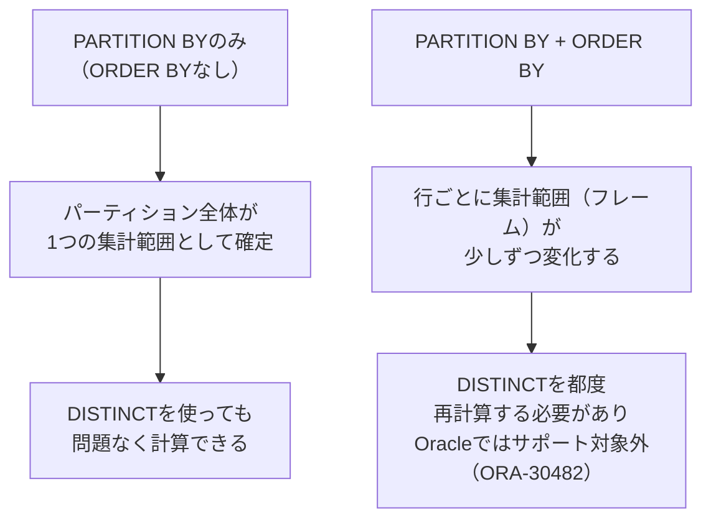

:::message
### なぜ「合計」ならOKで「累計」だとNGなのか
言い換えると、`COUNT(DISTINCT ...)`が`OVER`句と共存できないのではなく、**「範囲が固定された集計（`PARTITION BY`のみ）」ではOK**で、**「行ごとに範囲が変化する集計（`ORDER BY`を伴うウィンドウ処理）」ではNG**、というのが正確なルールです。「累計」「移動○○」といった、行ごとに集計範囲が変わる処理に`DISTINCT`を組み合わせたくなったときは、この制約を思い出してください。
:::

エラーを回避する例3は、問題12-24（連続ログイン日数の検出）で使った「フラグを立てて`SUM`で累計する」というテクニックの応用です。

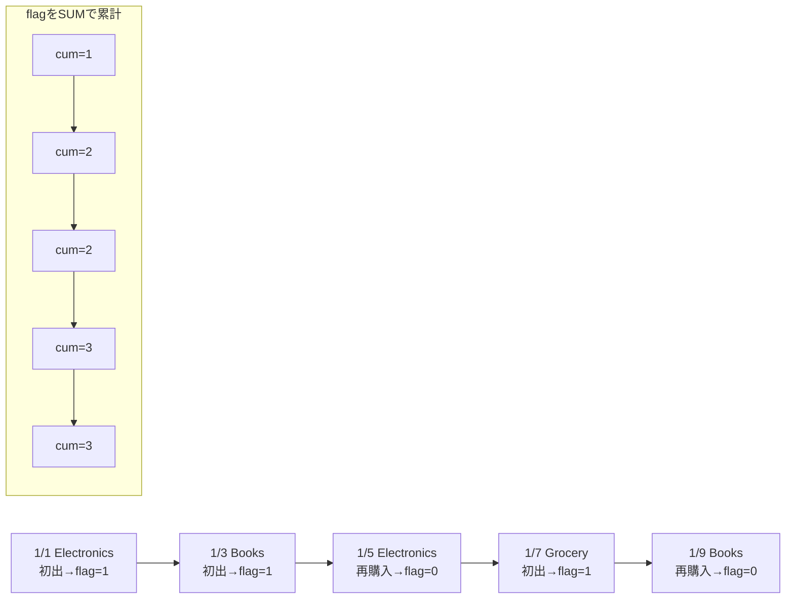

ステップ①では、「そのカテゴリを顧客が初めて購入した日」を`MIN(purchase_date) OVER(PARTITION BY customer_id, product_category)`で特定し、購入日がその最小日と一致する行にだけ`1`のフラグを立てています。同じカテゴリを2回目以降に購入した行は、当然その最小日とは一致しないため`0`になります。

ステップ②では、この「初購入フラグ」を`SUM() OVER(... ORDER BY purchase_date ROWS BETWEEN UNBOUNDED PRECEDING AND CURRENT ROW)`で日付順に累計しています。「新しいカテゴリに出会うたびに+1され、既知のカテゴリの再購入では増えない」という数字を累計すれば、それはそのまま「その時点までのユニークなカテゴリ数」と一致します。`SUM`や`MIN`はどちらも通常の（`DISTINCT`を使わない）分析関数なので、`ORDER BY`を伴うウィンドウ処理と問題なく組み合わせられます。

| 要件 | 使える書き方 |
| :--- | :--- |
| グループ全体の「合計」ユニーク数 | `COUNT(DISTINCT ...) OVER(PARTITION BY ...)`（`ORDER BY`なしでOK） |
| 日付順などに沿った「累計」ユニーク数 | `COUNT(DISTINCT...)`は使えない → 「初出フラグ＋累計`SUM`」で代替 |

「新規顧客の累計獲得数」「累計ユニークアクセス数（UU）」「入会からの累計利用カテゴリ数」といった、時系列に沿ったユニークカウントはマーケティング分析でも頻出のテーマです。`COUNT(DISTINCT...)`がそのまま使えないと分かった時点で諦めず、「初出フラグを立ててから`SUM`で累計する」という今回のパターンを思い出せるようにしておきましょう。


---
<br><br>

# 【完全版】問題12-26：デフォルトのRANGEフレームが生む罠と、第3のフレームGROUPS BETWEEN
### 難易度：★★★★☆ (Lv.4)
## 問題
とあるゲームのスコアランキングをもとに、次の2つの指標を算出してください。

**【算出項目】**
1. **RUNNING_TOTAL**：スコア降順で見たときの、自分を含む上位からの**累計スコア**。同点者がいても、1人ずつ正しく加算してください（同点内の順序はプレイヤー名の昇順とする）。
2. **PEER_GROUP_COUNT**：自分と**同じ順位グループ、および1つ上の順位グループ**に属するプレイヤーの合計人数（同点集団を1つの「かたまり」として扱う）。

結果はスコア降順、同点内はプレイヤー名の昇順で表示してください。

**【前提データ（WITH句）】**
```sql
WITH leaderboard AS (
    SELECT 'A' AS player, 100 AS score FROM dual UNION ALL
    SELECT 'B', 100 FROM dual UNION ALL
    SELECT 'C', 90  FROM dual UNION ALL
    SELECT 'D', 80  FROM dual UNION ALL
    SELECT 'E', 80  FROM dual UNION ALL
    SELECT 'F', 80  FROM dual UNION ALL
    SELECT 'G', 70  FROM dual
)
SELECT * FROM leaderboard
```

## 期待する結果
| PLAYER | SCORE | RUNNING_TOTAL | PEER_GROUP_COUNT | 
| ------ | ----- | ------------- | ---------------- | 
| A      | 100   | 100           | 2                | 
| B      | 100   | 200           | 2                | 
| C      | 90    | 290           | 3                | 
| D      | 80    | 370           | 4                | 
| E      | 80    | 450           | 4                | 
| F      | 80    | 530           | 4                | 
| G      | 70    | 600           | 4                | 

## 解答例
```sql:例1：NG例（フレーム省略時のデフォルトはRANGE）
WITH leaderboard AS (
    SELECT 'A' AS player, 100 AS score FROM dual UNION ALL
    SELECT 'B', 100 FROM dual UNION ALL
    SELECT 'C', 90  FROM dual UNION ALL
    SELECT 'D', 80  FROM dual UNION ALL
    SELECT 'E', 80  FROM dual UNION ALL
    SELECT 'F', 80  FROM dual UNION ALL
    SELECT 'G', 70  FROM dual
)
SELECT
    player,
    score,
    -- ROWS/RANGEを省略 → 暗黙的に RANGE UNBOUNDED PRECEDING AND CURRENT ROW になる
    SUM(score) OVER(ORDER BY score DESC) AS running_total_ng
FROM
    leaderboard
ORDER BY
    score DESC,
    player
-- A=200, B=200 (同点のBまで合算された値が両方に入ってしまう)
```
```sql:例2：正解（ROWSで1行ずつ、GROUPSで同点集団単位に）
WITH leaderboard AS (
    SELECT 'A' AS player, 100 AS score FROM dual UNION ALL
    SELECT 'B', 100 FROM dual UNION ALL
    SELECT 'C', 90  FROM dual UNION ALL
    SELECT 'D', 80  FROM dual UNION ALL
    SELECT 'E', 80  FROM dual UNION ALL
    SELECT 'F', 80  FROM dual UNION ALL
    SELECT 'G', 70  FROM dual
)
SELECT
    player,
    score,
    -- ① ROWS：同点者にもタイブレークキー(player)を足し、1行ずつ確実に加算する
    SUM(score) OVER(
        ORDER BY score DESC, player
        ROWS BETWEEN UNBOUNDED PRECEDING AND CURRENT ROW
    ) AS running_total,
    -- ② GROUPS：同点集団を1つの「かたまり」とみなし、直前の集団+自分の集団の人数を数える
    COUNT(*) OVER(
        ORDER BY score DESC
        GROUPS BETWEEN 1 PRECEDING AND CURRENT ROW
    ) AS peer_group_count
FROM
    leaderboard
ORDER BY
    score DESC,
    player
```

## 解説
問題12-13で`ROWS`、問題12-23で`RANGE`を扱いましたが、実はOracleのウィンドウフレームには**3種類目**が存在します。それが今回扱う`GROUPS`です。まずは、この3種類の違いを整理する前に、多くの人がハマる「フレームを省略したときの罠」を体験しておきましょう。

例1の`SUM(score) OVER(ORDER BY score DESC)`のように`ROWS`も`RANGE`も書かなかった場合、Oracleは**黙って**`RANGE BETWEEN UNBOUNDED PRECEDING AND CURRENT ROW`を採用します。これが罠の正体です。`RANGE`は「値」を基準にするため、同点（同じ`score`）の行は**すべて同じフレーム境界**として扱われます。その結果、AもBも「100点以上の行すべて」＝A+B=200という同じ値になってしまい、「自分より上位の人まで含めた、自分時点での累計」という本来の意図からズレてしまいます。しかも構文エラーにはならず、一見それっぽい数字が出てしまうのが厄介な点です。

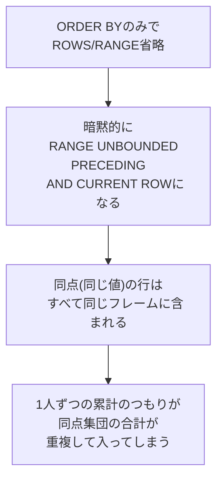

これを解決する1つ目の方法が、問題12-13でも扱った`ROWS`です。`ORDER BY score DESC, player`のようにタイブレークキー（`player`）を加えたうえで`ROWS BETWEEN UNBOUNDED PRECEDING AND CURRENT ROW`を明示すれば、値が同じかどうかに関係なく、並び順どおりに1行ずつ確実に加算されます。

続いて、2つ目の要件である`PEER_GROUP_COUNT`（自分の順位グループ＋1つ上の順位グループの人数）を見てみましょう。これは`ROWS`（行数ベース）でも`RANGE`（値の間隔ベース）でも表現できません。「D, E, Fの3人」をひとかたまりの1グループとして扱い、「そのグループと、1つ前のグループ（Cの1人）を合わせて4人」という **「同順位のかたまり」を1単位として数える** 必要があるからです。ここで`GROUPS`の出番です。

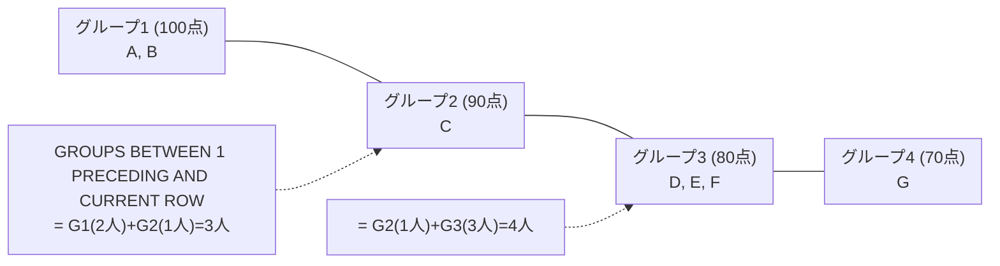

問題12-26の該当箇所（`## 解説`内の`GROUPS`を説明するmermaid図）を、上記のコードに差し替えてください。あわせて、サブグラフのタイトル内改行も生の改行から`<br/>`タグに変更し、レンダリング崩れが起きにくい書き方に統一しています。

```sql
COUNT(*) OVER(ORDER BY score DESC GROUPS BETWEEN 1 PRECEDING AND CURRENT ROW)
```
`GROUPS BETWEEN 1 PRECEDING AND CURRENT ROW`は、「`ORDER BY`の値が変わるたびに区切られる**グループの個数**」を基準にフレームを決めます。`1 PRECEDING`は「1つ前のグループ」という意味で、行数でも値の間隔でもありません。C（グループ2）の場合、1つ前のグループはA・Bのグループ1（2人）、自分のグループは1人なので、合計3人になります。D・E・F（グループ3）は、1つ前のグループ2（Cの1人）と自分のグループ3（3人）を合わせて4人です。

| フレーム種別 | 何を基準に範囲を決めるか | 同点（タイ）の扱い |
| :--- | :--- | :--- |
| `ROWS` | 物理的な行数 | 同点でも関係なく1行ずつ数える |
| `RANGE` | 値そのものの間隔 | 同点の行は**すべて同じフレーム**に含まれる（今回の罠の原因） |
| `GROUPS` | `ORDER BY`の値が変わるごとに区切られる「かたまり」の個数 | 同点集団を**1つの単位**として数える |

:::message
### GROUPSはRANGEの「罠」を逆手に取った機能
`GROUPS`は、`RANGE`が持つ「同点の行を1つの塊として扱う」という性質そのものを、意図的に活用するために設計されたフレームモードです。「今回の罠を回避したい」ときは`ROWS`を、逆に「**同点集団そのものを1単位として数えたい**」ときは`GROUPS`を、というように、目的に応じて使い分けます。3つのフレームモードのうち`GROUPS`は登場頻度こそ低いものの、「順位（同着）を跨いだ集計」を1つのSQLで完結させたいときに、CASE文やサブクエリを使った回りくどい実装を避けられる、知っておくと武器になる機能です。
:::

`ROWS`・`RANGE`・`GROUPS`という3種類のフレームモードのうち、実務で最もよく使うのは`ROWS`です。しかし、フレームを省略したときに何が起こるか（今回のRANGEの罠）を正しく理解していないと、集計結果が壊れていることに気づけないまま報告書を提出してしまう危険があります。「`ORDER BY`だけ書いてフレームを省略しない」──これを徹底するだけで、今回のような事故は防げます。

---
<br><br>

# 【完全版】問題12-27：KEEP (DENSE_RANK FIRST/LAST) によるFIRST_VALUE/LAST_VALUEの代替
### 難易度：★★★☆☆ (Lv.3)
## 問題
人事部から、各部門について「**最も古くから在籍している社員の給与**」と「**最も新しく入社した社員の給与**」を知りたいという依頼がありました。

**【要件】**
1. まず、**部門ごとに1行**で、`FIRST_HIRE_SALARY`（最古参社員の給与）と`LAST_HIRE_SALARY`（最新入社社員の給与）を集計してください。
2. 続けて、**社員の明細行を保ったまま**（1人1行のまま）、同じ2つの値を各行に付与してください。
3. どちらも`KEEP (DENSE_RANK FIRST/LAST ORDER BY ...)`を使用して算出してください。

**【前提データ（WITH句）】**
```sql
WITH employees_sample AS (
    SELECT 10 AS dept_id, 'Anna'  AS emp_name, DATE '2018-01-10' AS hire_date, 5000 AS salary FROM dual UNION ALL
    SELECT 10, 'Bob',   DATE '2019-03-15', 5500 FROM dual UNION ALL
    SELECT 10, 'Carol', DATE '2017-05-20', 4800 FROM dual UNION ALL
    SELECT 20, 'Dan',   DATE '2020-07-01', 6000 FROM dual UNION ALL
    SELECT 20, 'Eve',   DATE '2016-11-11', 7000 FROM dual UNION ALL
    SELECT 20, 'Frank', DATE '2021-01-01', 6500 FROM dual
)
SELECT * FROM employees_sample
```

## 期待する結果
**①部門ごとに1行（GROUP BY版）**
| DEPT_ID | FIRST_HIRE_SALARY | LAST_HIRE_SALARY | 
| ------- | ----------------- | ---------------- | 
| 10      | 4800              | 5500             | 
| 20      | 7000              | 6500             | 

**②明細を保ったまま（OVER版）**
| DEPT_ID | EMP_NAME | HIRE_DATE            | SALARY | FIRST_HIRE_SALARY | LAST_HIRE_SALARY | 
| ------- | -------- | -------------------- | ------ | ----------------- | ---------------- | 
| 10      | Carol    | 2017-05-20T00:00:00Z | 4800   | 4800              | 5500             | 
| 10      | Anna     | 2018-01-10T00:00:00Z | 5000   | 4800              | 5500             | 
| 10      | Bob      | 2019-03-15T00:00:00Z | 5500   | 4800              | 5500             | 
| 20      | Eve      | 2016-11-11T00:00:00Z | 7000   | 7000              | 6500             | 
| 20      | Dan      | 2020-07-01T00:00:00Z | 6000   | 7000              | 6500             | 
| 20      | Frank    | 2021-01-01T00:00:00Z | 6500   | 7000              | 6500             | 

## 解答例
```sql:例1：GROUP BY版（部門ごとに1行に集約）
WITH employees_sample AS (
    SELECT 10 AS dept_id, 'Anna'  AS emp_name, DATE '2018-01-10' AS hire_date, 5000 AS salary FROM dual UNION ALL
    SELECT 10, 'Bob',   DATE '2019-03-15', 5500 FROM dual UNION ALL
    SELECT 10, 'Carol', DATE '2017-05-20', 4800 FROM dual UNION ALL
    SELECT 20, 'Dan',   DATE '2020-07-01', 6000 FROM dual UNION ALL
    SELECT 20, 'Eve',   DATE '2016-11-11', 7000 FROM dual UNION ALL
    SELECT 20, 'Frank', DATE '2021-01-01', 6500 FROM dual
)
SELECT
    dept_id,
    MAX(salary) KEEP (DENSE_RANK FIRST ORDER BY hire_date) AS first_hire_salary,
    MAX(salary) KEEP (DENSE_RANK LAST  ORDER BY hire_date) AS last_hire_salary
FROM
    employees_sample
GROUP BY
    dept_id
ORDER BY
    dept_id
```
```sql:例2：OVER版（明細を保ったまま同じ値を付与）
WITH employees_sample AS (
    SELECT 10 AS dept_id, 'Anna'  AS emp_name, DATE '2018-01-10' AS hire_date, 5000 AS salary FROM dual UNION ALL
    SELECT 10, 'Bob',   DATE '2019-03-15', 5500 FROM dual UNION ALL
    SELECT 10, 'Carol', DATE '2017-05-20', 4800 FROM dual UNION ALL
    SELECT 20, 'Dan',   DATE '2020-07-01', 6000 FROM dual UNION ALL
    SELECT 20, 'Eve',   DATE '2016-11-11', 7000 FROM dual UNION ALL
    SELECT 20, 'Frank', DATE '2021-01-01', 6500 FROM dual
)
SELECT
    dept_id,
    emp_name,
    hire_date,
    salary,
    MAX(salary) KEEP (DENSE_RANK FIRST ORDER BY hire_date) OVER(PARTITION BY dept_id) AS first_hire_salary,
    MAX(salary) KEEP (DENSE_RANK LAST  ORDER BY hire_date) OVER(PARTITION BY dept_id) AS last_hire_salary
FROM
    employees_sample
ORDER BY
    dept_id,
    hire_date
```

## 解説
問題12-15では、`FIRST_VALUE`／`LAST_VALUE`という**分析関数（Window関数）専用**の仕組みで「最初の値」「最後の値」を取得しました。今回紹介する`KEEP (DENSE_RANK FIRST/LAST ORDER BY ...)`は、目的は同じですが、まったく異なるアプローチです。これは`MAX`や`MIN`のような**普通の集計関数を拡張する構文**であり、`FIRST_VALUE`/`LAST_VALUE`とは異なる大きな特徴を持っています。

```sql
MAX(salary) KEEP (DENSE_RANK FIRST ORDER BY hire_date)
```
この構文は、日本語に訳すと「`hire_date`が最も古い行（`DENSE_RANK FIRST`）に絞り込んでから、その中の`salary`の`MAX`を取る」という意味になります。`DENSE_RANK FIRST`で「入社日が最も古い1人（同着なら複数人）」に対象を絞り込み、その上で`MAX`を取ることで、万が一同着がいた場合でも1つの値に確定させています。`DENSE_RANK LAST`にすれば、逆に「入社日が最も新しい人」に絞り込まれます。

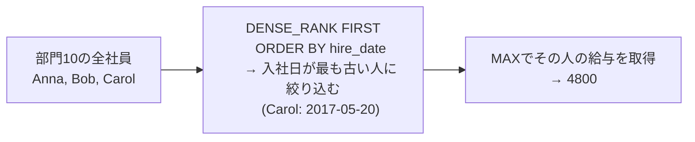

最大の特徴は、**GROUP BYで1行に集約する形（例1）と、OVERで明細を保つ形（例2）の、両方に使える**という点です。

| 関数 | GROUP BYで使う（集約） | OVERを付けて使う（明細維持） |
| :--- | :--- | :--- |
| `FIRST_VALUE` / `LAST_VALUE` | **使えない**（`OVER`句が必須） | 使える |
| `MAX(...) KEEP (DENSE_RANK FIRST/LAST ...)` | 使える | 使える（`OVER`を追加するだけ） |

`FIRST_VALUE`/`LAST_VALUE`は分析関数であるため、必ず`OVER`句とセットで使う必要があり、「部門ごとに1行にまとめたい」という単純な集約用途には使えません（もし使いたければ、12-20の解説にもあった通り、後から`DISTINCT`や`GROUP BY`で余分な重複行を削る一手間が必要になります）。一方`KEEP (DENSE_RANK FIRST/LAST ...)`は`MAX`という普通の集計関数がベースになっているため、`GROUP BY`と組み合わせれば自然に1部門1行へ集約でき、`OVER`を後から付け足せば明細を保ったままの分析関数としても使えます。「集約したいか、明細を保ちたいか」を後から自由に切り替えられる柔軟性が、`KEEP`構文最大の利点です。

:::message
### なぜMIN/MAXでなくてもよいのか
`KEEP (DENSE_RANK FIRST/LAST ...)`は、`MAX`だけでなく`MIN`・`SUM`・`AVG`・`COUNT`など多くの集計関数と組み合わせられます。ただし、今回のように「絞り込んだ結果は基本的に1人（1行）」であるケースでは、`MAX`でも`MIN`でも`SUM`でも、実質的には同じ値が返ります（`DENSE_RANK`側で対象がほぼ1行に絞られているため）。同着がいた場合の挙動をより厳密にコントロールしたい（例：同着なら合計するのか、大きい方を取るのか）場合に、この集計関数の選び方が意味を持ってきます。
:::

`FIRST_VALUE`/`LAST_VALUE`（12-15）は「ウィンドウの中の並び順に対する位置」で値を取るのに対し、`KEEP (DENSE_RANK FIRST/LAST)`は「集計関数の拡張」という立ち位置です。同じ結果を導ける場面は多いですが、集約後の1行だけが欲しいのか、明細を保ったまま値を横展開したいのかによって、書きやすさが変わってきます。両方を知っておくことで、要件に応じて無駄のない書き方を選べるようになります。

---
<br><br>

# 【完全版】問題12-28：ROW_NUMBERによる重複データの排除（データクレンジング）
### 難易度：★★★☆☆ (Lv.3)
## 問題
システム統合の影響で、顧客マスタに同一顧客（`CUSTOMER_CODE`が同じ）が複数登録されてしまいました。**各顧客について、最も更新日時（`UPDATED_AT`）が新しい1件だけ**を残すクレンジング処理のSELECT文を作成してください。

**【条件およびルール】**
* 同一`CUSTOMER_CODE`の中で`UPDATED_AT`が最大の行を残してください。
* もし`UPDATED_AT`が完全に同じ行が複数存在する場合は、`ROW_ID`が最も小さい行を残してください（同着を必ず1件に確定させること）。
* 結果は`CUSTOMER_CODE`の昇順で表示してください。

**【前提データ（WITH句）】**
```sql
WITH customer_master AS (
    SELECT 1 AS row_id, 'C001' AS customer_code, 'Yamada Taro'   AS customer_name, DATE '2023-01-10' AS updated_at FROM dual UNION ALL
    SELECT 2, 'C001', 'Yamada Taro',   DATE '2023-06-15' FROM dual UNION ALL
    SELECT 3, 'C002', 'Suzuki Hanako', DATE '2023-02-01' FROM dual UNION ALL
    SELECT 4, 'C003', 'Sato Jiro',     DATE '2023-03-20' FROM dual UNION ALL
    SELECT 5, 'C003', 'Sato Jiro',     DATE '2023-03-20' FROM dual UNION ALL -- C003は完全に同じ更新日時が2件
    SELECT 6, 'C002', 'Suzuki Hanako', DATE '2023-05-05' FROM dual
)
SELECT * FROM customer_master
```

## 期待する結果
| ROW_ID | CUSTOMER_CODE | CUSTOMER_NAME | UPDATED_AT           | 
| ------ | ------------- | ------------- | -------------------- | 
| 2      | C001          | Yamada Taro   | 2023-06-15T00:00:00Z | 
| 6      | C002          | Suzuki Hanako | 2023-05-05T00:00:00Z | 
| 4      | C003          | Sato Jiro     | 2023-03-20T00:00:00Z | 

## 解答例
```sql:例1：NG例（GROUP BY + 再JOINでは同着が残ってしまう）
WITH customer_master AS (
    SELECT 1 AS row_id, 'C001' AS customer_code, 'Yamada Taro'   AS customer_name, DATE '2023-01-10' AS updated_at FROM dual UNION ALL
    SELECT 2, 'C001', 'Yamada Taro',   DATE '2023-06-15' FROM dual UNION ALL
    SELECT 3, 'C002', 'Suzuki Hanako', DATE '2023-02-01' FROM dual UNION ALL
    SELECT 4, 'C003', 'Sato Jiro',     DATE '2023-03-20' FROM dual UNION ALL
    SELECT 5, 'C003', 'Sato Jiro',     DATE '2023-03-20' FROM dual UNION ALL
    SELECT 6, 'C002', 'Suzuki Hanako', DATE '2023-05-05' FROM dual
)
SELECT
    cm.row_id,
    cm.customer_code,
    cm.customer_name,
    cm.updated_at
FROM
    customer_master cm
    INNER JOIN (
        SELECT customer_code, MAX(updated_at) AS max_updated_at
        FROM customer_master
        GROUP BY customer_code
    ) latest
    ON cm.customer_code = latest.customer_code
    AND cm.updated_at = latest.max_updated_at
ORDER BY
    cm.customer_code
-- C003が2行（row_id=4, 5）とも残ってしまい、重複が排除しきれない
```
```sql:例2：正解（ROW_NUMBERで1件に確定させる）
WITH customer_master AS (
    SELECT 1 AS row_id, 'C001' AS customer_code, 'Yamada Taro'   AS customer_name, DATE '2023-01-10' AS updated_at FROM dual UNION ALL
    SELECT 2, 'C001', 'Yamada Taro',   DATE '2023-06-15' FROM dual UNION ALL
    SELECT 3, 'C002', 'Suzuki Hanako', DATE '2023-02-01' FROM dual UNION ALL
    SELECT 4, 'C003', 'Sato Jiro',     DATE '2023-03-20' FROM dual UNION ALL
    SELECT 5, 'C003', 'Sato Jiro',     DATE '2023-03-20' FROM dual UNION ALL
    SELECT 6, 'C002', 'Suzuki Hanako', DATE '2023-05-05' FROM dual
),
-- ① 重複キーごとに、残したい優先順位で連番を振る
ranked AS (
    SELECT
        row_id,
        customer_code,
        customer_name,
        updated_at,
        ROW_NUMBER() OVER(
            PARTITION BY customer_code
            ORDER BY updated_at DESC, row_id ASC  -- 同着はrow_idが小さい方を優先
        ) AS rn
    FROM
        customer_master
)
-- ② 連番が1の行だけを残す
SELECT
    row_id,
    customer_code,
    customer_name,
    updated_at
FROM
    ranked
WHERE
    rn = 1
ORDER BY
    customer_code
```

## 解説
これまでの`ROW_NUMBER`（12-1など）は「集計・分析」のための順位付けとして使ってきましたが、実務で最も使用頻度が高い用途の1つが、今回のような**重複データの排除（データクレンジング）**です。

まず例1のNGパターンを見てみましょう。「`customer_code`ごとの最新`updated_at`をサブクエリで求め、それを元のテーブルに結合し直す」というのは、直感的にはよくある発想です。ところがC003を見てください。`row_id=4`と`row_id=5`はどちらも`updated_at`が`2023-03-20`とまったく同じです。サブクエリが返す「C003の最大`updated_at`」は`2023-03-20`の1つですが、その値と一致する元テーブルの行は**2行とも**存在するため、結合結果にはC003が2行とも残ってしまいます。「1顧客につき1行」にしたいという目的に対して、これは明確な失敗です。しかも実行時にエラーにはならず、結果行数が想定より1行多いだけなので、大量データの中では見逃されやすい典型的な失敗パターンです。

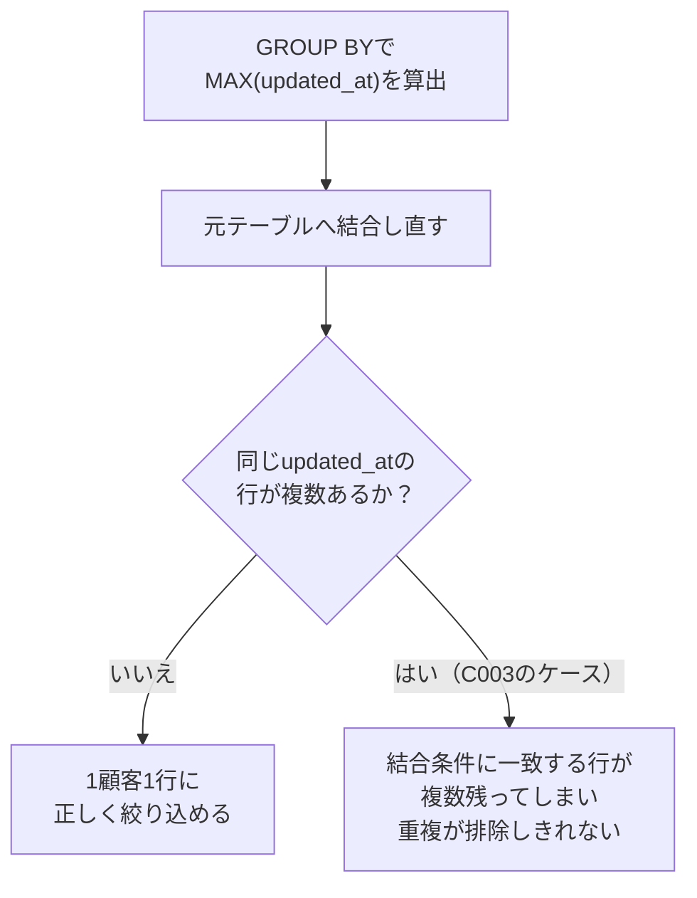

これを確実に1行へ絞り込むのが、例2の`ROW_NUMBER`を使った方法です。

```sql
ROW_NUMBER() OVER(
    PARTITION BY customer_code
    ORDER BY updated_at DESC, row_id ASC
) AS rn
```
`PARTITION BY customer_code`で顧客ごとにグループ分けし、`ORDER BY updated_at DESC`で「新しい順」に並べ替えます。ここでのポイントは、`ORDER BY`に`row_id ASC`という**タイブレークキー**を追加していることです。`ROW_NUMBER`は必ず1, 2, 3, ...と重複なしの連番を振る関数なので、`updated_at`が同じ行が複数あっても、2番目の並び替えキーである`row_id`によって、必ずどちらか一方に`rn=1`が確定します。これにより、`WHERE rn = 1`と書くだけで、どんなデータであっても機械的に「1グループにつき必ず1行」を保証できます。

| 方式 | 同着（完全な重複）が発生した場合 |
| :--- | :--- |
| 例1（`GROUP BY` + 再`JOIN`） | 同着の行がすべて残ってしまい、重複を排除しきれない |
| 例2（`ROW_NUMBER` + タイブレーク） | タイブレークキーにより、必ず1行に確定する |

:::message
### 実際の削除（DELETE）に応用する場合
今回の環境（Oracle FreeSQL）はSELECT専用のため、`ROW_NUMBER`で「残す1件」を特定するところまでを扱いました。実際の業務でこれを重複削除に使う場合は、`WHERE rn = 1`を`WHERE rn > 1`に変えるだけで「削除すべき重複行」を洗い出せます。多くの現場では、いきなり`DELETE`を実行するのではなく、まず今回のように`SELECT`で削除対象を洗い出し、件数や内容を目視確認してから、`DELETE FROM customer_master WHERE row_id IN (削除対象のrow_idのリスト)`のような形で実行する、という手順を踏みます。
:::

「同じ顧客が複数登録されている」「同じ注文が二重に記録されている」といった重複データの問題は、システム統合やバッチ処理の不具合などで実務では頻繁に発生します。`ROW_NUMBER`で優先順位を明確に定義し、1件に絞り込むというこのパターンは、分析関数の中でも特に実務での再利用性が高いテクニックです。

---
<br><br>

# 【完全版】問題12-29：NTH_VALUEによるN番目の値の取得と、DENSE_RANKとの意外な違い
### 難易度：★★★★☆ (Lv.4)
## 問題
各部門について、「**給与が2番目に高い人の給与**」を求めたいという依頼がありました。`NTH_VALUE`関数を使って、部門ごとの全社員の行に、次の2つの値を付与してください。

**【算出項目】**
1. **SECOND_SALARY_NTH**：`NTH_VALUE`関数を使って求めた「**2番目の行**」の給与。
2. **SECOND_SALARY_DENSE_RANK**：`DENSE_RANK`を使って求めた「**2番目に高い金額（重複を除く）**」の給与。

結果は部門ID、給与降順（同額は社員名の昇順）で表示してください。

**【前提データ（WITH句）】**
```sql
WITH emp_salary AS (
    SELECT 10 AS dept_id, 'Anna'  AS emp_name, 5000 AS salary FROM dual UNION ALL
    SELECT 10, 'Bob',   7000 FROM dual UNION ALL
    SELECT 10, 'Carol', 6000 FROM dual UNION ALL
    SELECT 10, 'Dave',  7000 FROM dual UNION ALL  -- Bobと給与が同額（1位タイ）
    SELECT 20, 'Eve',   9000 FROM dual UNION ALL
    SELECT 20, 'Frank', 8000 FROM dual UNION ALL
    SELECT 20, 'Grace', 8000 FROM dual UNION ALL  -- Frankと給与が同額（2位タイ）
    SELECT 20, 'Helen', 6000 FROM dual
)
SELECT * FROM emp_salary
```

## 期待する結果
| DEPT_ID | EMP_NAME | SALARY | SECOND_SALARY_NTH | SECOND_SALARY_DENSE_RANK | 
| ------- | -------- | ------ | ----------------- | ------------------------ | 
| 10      | Bob      | 7000   | 7000              | 6000                     | 
| 10      | Dave     | 7000   | 7000              | 6000                     | 
| 10      | Carol    | 6000   | 7000              | 6000                     | 
| 10      | Anna     | 5000   | 7000              | 6000                     | 
| 20      | Eve      | 9000   | 8000              | 8000                     | 
| 20      | Frank    | 8000   | 8000              | 8000                     | 
| 20      | Grace    | 8000   | 8000              | 8000                     | 
| 20      | Helen    | 6000   | 8000              | 8000                     | 

## 解答例
```sql:例1：NG例（フレームを省略すると行ごとにバラバラの値になる）
WITH emp_salary AS (
    SELECT 10 AS dept_id, 'Anna'  AS emp_name, 5000 AS salary FROM dual UNION ALL
    SELECT 10, 'Bob',   7000 FROM dual UNION ALL
    SELECT 10, 'Carol', 6000 FROM dual UNION ALL
    SELECT 10, 'Dave',  7000 FROM dual UNION ALL
    SELECT 20, 'Eve',   9000 FROM dual UNION ALL
    SELECT 20, 'Frank', 8000 FROM dual UNION ALL
    SELECT 20, 'Grace', 8000 FROM dual UNION ALL
    SELECT 20, 'Helen', 6000 FROM dual
)
SELECT
    dept_id,
    emp_name,
    salary,
    -- フレーム（ROWS BETWEEN...）を指定していない
    NTH_VALUE(salary, 2) OVER(PARTITION BY dept_id ORDER BY salary DESC) AS second_salary_ng
FROM
    emp_salary
ORDER BY
    dept_id,
    salary DESC,
    emp_name
-- 部門20のEveだけNULLになり、他の行は8000になる（同じ部門内でバラバラ）
```
```sql:例2：正解（フレームを明示し、DENSE_RANK方式と比較する）
WITH emp_salary AS (
    SELECT 10 AS dept_id, 'Anna'  AS emp_name, 5000 AS salary FROM dual UNION ALL
    SELECT 10, 'Bob',   7000 FROM dual UNION ALL
    SELECT 10, 'Carol', 6000 FROM dual UNION ALL
    SELECT 10, 'Dave',  7000 FROM dual UNION ALL
    SELECT 20, 'Eve',   9000 FROM dual UNION ALL
    SELECT 20, 'Frank', 8000 FROM dual UNION ALL
    SELECT 20, 'Grace', 8000 FROM dual UNION ALL
    SELECT 20, 'Helen', 6000 FROM dual
),
-- ① DENSE_RANK側は先にCTEで確定させておく（分析関数のネスト制限を回避）
ranked AS (
    SELECT
        dept_id,
        emp_name,
        salary,
        DENSE_RANK() OVER(PARTITION BY dept_id ORDER BY salary DESC) AS drnk
    FROM
        emp_salary
)
SELECT
    dept_id,
    emp_name,
    salary,
    -- ② NTH_VALUE：パーティション全体を対象にすることを明示
    NTH_VALUE(salary, 2) OVER(
        PARTITION BY dept_id ORDER BY salary DESC
        ROWS BETWEEN UNBOUNDED PRECEDING AND UNBOUNDED FOLLOWING
    ) AS second_salary_nth,
    -- ③ DENSE_RANK：「2番目に高い金額（重複除く）」の行だけ拾ってMAXで確定
    MAX(CASE WHEN drnk = 2 THEN salary END) OVER(PARTITION BY dept_id) AS second_salary_dense_rank
FROM
    ranked
ORDER BY
    dept_id,
    salary DESC,
    emp_name
```

## 解説
`NTH_VALUE`は、問題12-15の`FIRST_VALUE`（1番目）／`LAST_VALUE`（最後）の**中間バージョン**にあたる関数で、「並び替えたときのN番目の行の値」を取得します。今回はこの関数に潜む、**2つの罠**を確認します。

**罠①：フレームの省略で行ごとに結果がバラバラになる**

例1のように`ROWS BETWEEN`を省略すると、`ORDER BY`のみが指定された分析関数のデフォルトフレーム（`RANGE UNBOUNDED PRECEDING AND CURRENT ROW`）が適用されます（問題12-26で扱った罠と同じ仕組みです）。部門20の場合、1位のEve（9000円）の時点でのフレームには自分自身の1行しか含まれないため、「2番目の行」を要求しても存在せず、`NULL`が返ってしまいます。ところがFrank以降の行では、フレームに十分な行数が含まれるため`8000`が正しく返ります。**同じ部門なのに、行によって結果があったりなかったりする**という、非常に気づきにくい壊れ方をします。

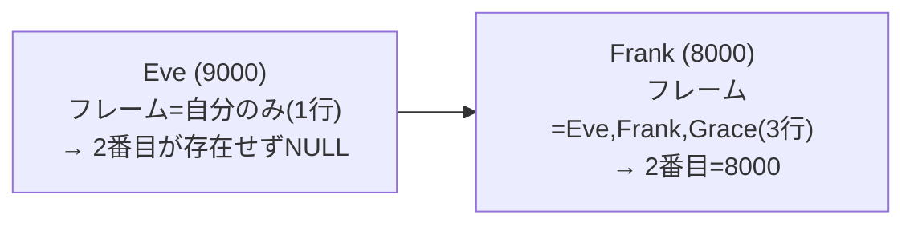

これを避けるには、`ROWS BETWEEN UNBOUNDED PRECEDING AND UNBOUNDED FOLLOWING`と明示し、「パーティション全体を対象にする」ことを常に宣言する必要があります。これにより、部門内のどの行から見ても同じ「2番目の値」が一貫して返るようになります。

**罠②：「2番目の行」と「2番目に高い金額」は違う**

フレームを直しても、まだ注意点が残っています。部門10を見てください。`SECOND_SALARY_NTH`は`7000`ですが、`SECOND_SALARY_DENSE_RANK`は`6000`と、**値が異なります**。

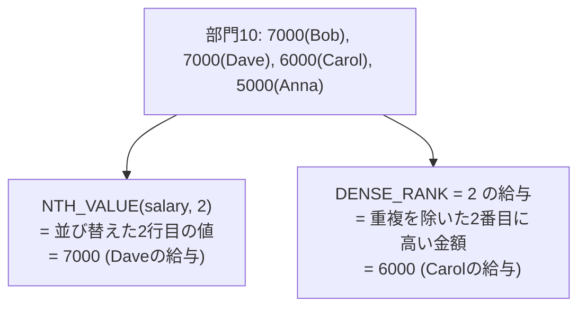

`NTH_VALUE`は、あくまで「並び替えた**行**の中で何番目か」という**行の位置**を見ているだけで、値の重複（同着）を意識しません。部門10ではBobとDaveがどちらも7000円で同着1位のため、単純に「2行目」を数えるとDaveの7000円がヒットしてしまいます。一方、`DENSE_RANK`は「値としての順位」を見るため、7000円は2人いても同じ1位として扱われ、次に高い**異なる金額**である6000円（Carol）が2位になります。

部門20（Eve9000、Frank/Grace8000、Helen6000）では、同着は2位のFrank・Graceの位置に発生しているため、「2行目」も「2番目に高い金額」もどちらも8000円で一致し、両者の違いが表面化しません。**タイが1位に発生しているか、2位以降に発生しているかによって、両者が一致するかどうかが変わる**という点が、このテーマの本質的な難しさです。

| 関数 | 何を数えるか | 同着(タイ)がある場合 |
| :--- | :--- | :--- |
| `NTH_VALUE(expr, N)` | 並び替えた**N行目**の値 | 同着があっても関係なく、N行目をそのまま返す |
| `DENSE_RANK`で2位を抽出 | 重複を除いた**N番目に高い金額** | 同着はまとめて同順位として扱う |

「2番目に高い給与を教えて」という一見シンプルな依頼でも、依頼者が意図しているのが「（同着を1人として数える）2番目の**行**」なのか、「（同着をまとめる）2番目の**金額**」なのかによって、正しい実装が変わってきます。要件を確認する際は、この2つの意味の違いを意識すると、後から「同着のときの挙動が期待と違う」という手戻りを防げます。

:::message
### なぜDENSE_RANKを直接CASE式の中でOVERと組み合わせられないのか
例2の`ranked`CTEを使わず、次のように1つの`SELECT`にまとめたくなるかもしれません。
```sql
-- これはエラーになる（ORA-30483）
MAX(CASE WHEN DENSE_RANK() OVER(PARTITION BY dept_id ORDER BY salary DESC) = 2 
         THEN salary END) OVER(PARTITION BY dept_id)
```
これは問題12-25の解説で扱った「分析関数の結果を、別の分析関数の中に直接ネストできない」という制約が、ここでも同様に発生するためです。`DENSE_RANK() OVER(...)`という分析関数の結果を、外側の`MAX(...) OVER(...)`というもう1つの分析関数の材料として使おうとしているため、必ず一度CTEや副問い合わせで区切る必要があります。
:::
