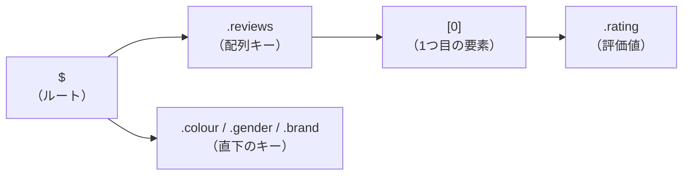
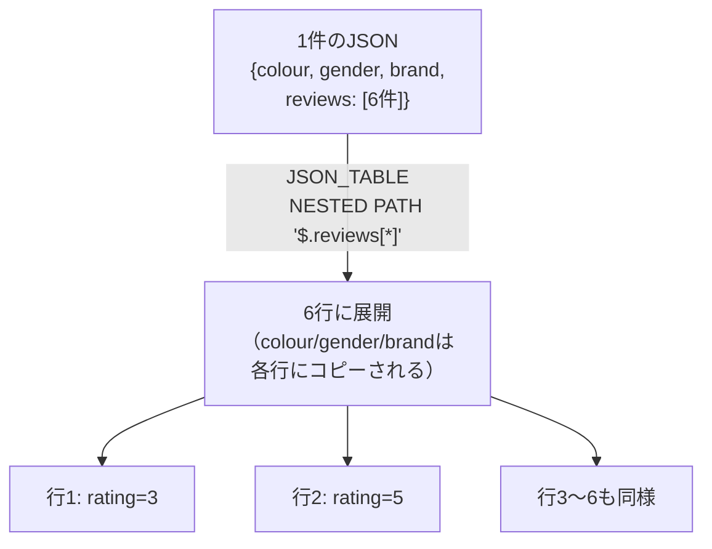
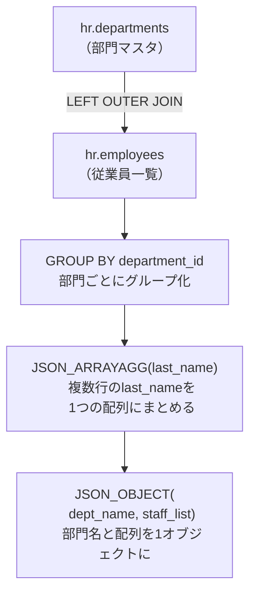
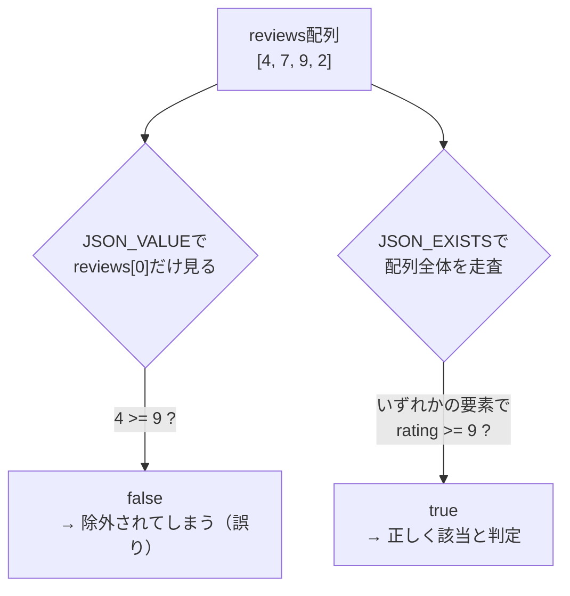
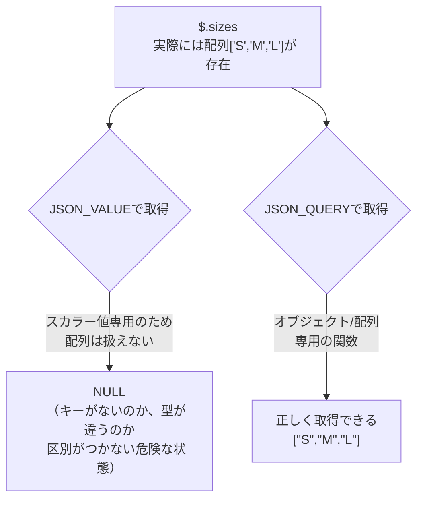
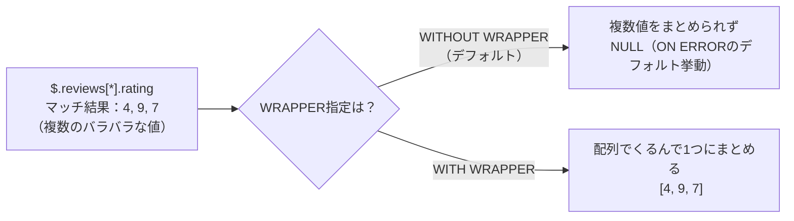
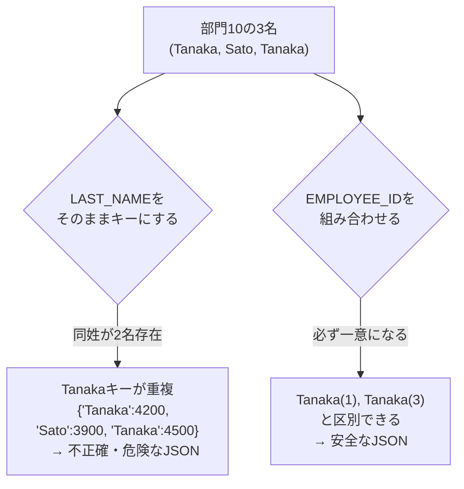
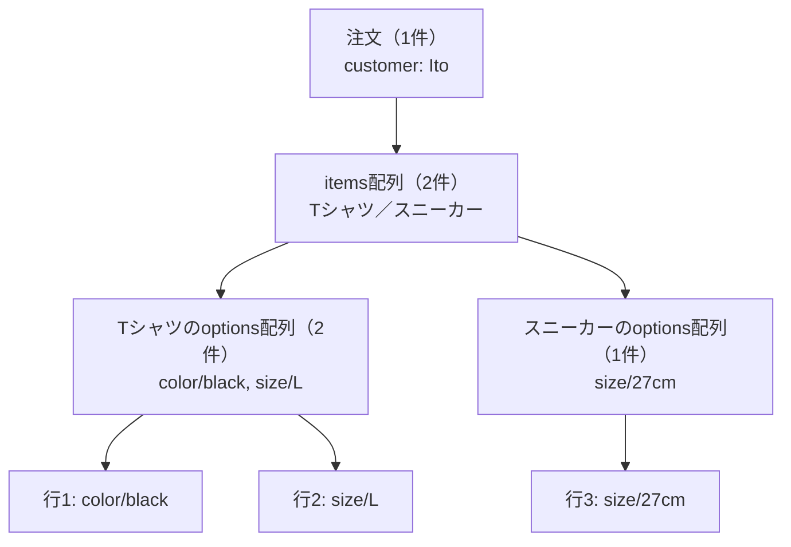
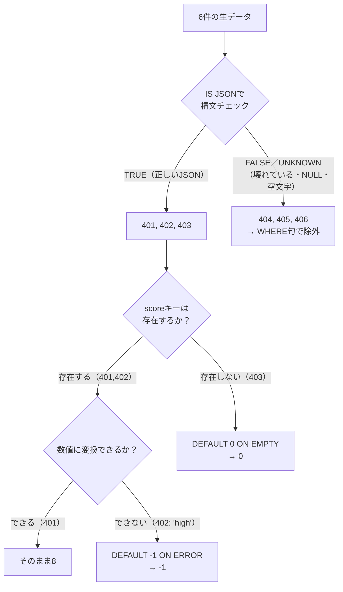

# 問題17-1：JSONのSELECT
### 難易度：★★★☆☆ (Lv.3)
## 問題
COスキーマの`PRODUCTS`テーブルに含まれる、BLOB型のJSONデータが格納された`PRODUCT_DETAILS`列からデータを取得してください。
キー：`gender`の値が「Girl's」であるレコードを対象とし、以下の5つの項目を抽出してください。
* キー：`colour`
* キー：`gender`
* キー：`brand`
* キー：`reviews` 配列の1つ目（インデックス0）の `rating`
* キー：`reviews` 配列の1つ目（インデックス0）の `review`
  
なお、レコードの表示順序は問いません。

**下記は`PRODUCT_DETAILS`に格納されているJSONのサンプルとなります。**
  
```json:PRODUCT_ID=23 の PRODUCT_DETAILS
{
	"colour": "blue",
	"gender": "Men's",
	"brand": "ADORNICA",
	"description": "Irure amet Lorem consequat aliquip officia dolore amet officia. Do elit laboris non dolore nostrud dolore cupidatat ea quis aliquip ex aliquip non ex.",
	"sizes": [
		"XS",
		"S",
		"M",
		"L",
		"XL",
		"XXL"
	],
	"reviews": [
		{
			"rating": 3,
			"review": "Laboris elit pariatur labore duis fugiat ad in nulla tempor."
		},
		{
			"rating": 5,
			"review": "Voluptate minim officia id excepteur."
		},
		{
			"rating": 8,
			"review": "Eiusmod cupidatat et nisi ipsum non aliqua."
		},
		{
			"rating": 1,
			"review": "Aute veniam irure dolor laborum esse ut ex tempor non velit."
		},
		{
			"rating": 2,
			"review": "Nostrud nostrud mollit incididunt et tempor excepteur sit ut id exercitation."
		},
		{
			"rating": 6,
			"review": "Labore tempor cillum laborum commodo et sit est qui aute enim id aute."
		}
	]
}
```
## 期待する結果
| PRODUCT_ID | COLOUR | GENDER | BRAND     | RATING | REVIEW                                                                                                | 
| ---------- | ------ | ------ | --------- | ------ | ----------------------------------------------------------------------------------------------------- | 
| 15         | blue   | Girl's | DECRATEX  | 8      | Officia irure deserunt mollit Lorem dolor dolor minim deserunt.                                       | 
| 20         | green  | Girl's | TRASOLA   | 7      | Veniam consectetur ea nisi irure aute cillum.                                                         | 
| 21         | black  | Girl's | UTARIAN   | 7      | Proident consequat consequat eu enim Lorem incididunt ad amet excepteur tempor aliquip ad aliquip ea. | 
| 25         | grey   | Girl's | KINETICUT | 2      | Id consectetur minim anim nisi occaecat elit labore duis.                                             | 
| 26         | white  | Girl's | PROXSOFT  | 6      | Commodo ut fugiat voluptate adipisicing deserunt.                                                     | 
| 38         | red    | Girl's | EMTRAK    | 4      | Consectetur velit adipisicing excepteur in excepteur sit excepteur irure veniam velit.                | 
| 40         | black  | Girl's | ISOLOGICS | 6      | Duis minim duis dolor laboris eiusmod consequat fugiat adipisicing ex non culpa Lorem proident qui.   | 
| 35         | red    | Girl's | NIXELT    | 10     | Ut est anim sit nulla commodo velit occaecat amet mollit fugiat id.                                   | 
| 5          | red    | Girl's | OZEAN     |        |                                                                                                       | 
| 46         | red    | Girl's | OTHERSIDE | 9      | Magna magna ullamco ipsum pariatur occaecat eiusmod amet ea sunt reprehenderit dolore aute voluptate. | 
## 解答例
```sql:例1：JSON_VALUEを使用
SELECT
    product_id,
    JSON_VALUE(product_details, '$.colour' RETURNING VARCHAR2(20))             AS COLOUR,
    JSON_VALUE(product_details, '$.gender' RETURNING VARCHAR2(20))             AS GENDER,
    JSON_VALUE(product_details, '$.brand' RETURNING VARCHAR2(20))              AS BRAND,
    JSON_VALUE(product_details, '$.reviews[0].rating' RETURNING NUMBER(2))  AS RATING,
    JSON_VALUE(product_details, '$.reviews[0].review' RETURNING VARCHAR2(1000)) AS REVIEW
FROM
    CO.PRODUCTS
WHERE
    JSON_VALUE(product_details, '$.gender' RETURNING VARCHAR2(100)) = q'[Girl's]'
```
```sql:例2：ドット記法
SELECT
    p.product_id,
    p.product_details.colour,
    p.product_details.gender,
    p.product_details.brand,
    p.product_details.reviews[0].rating AS rating,
    p.product_details.reviews[0].review AS review
    
FROM
    co.products p
WHERE 
    p.product_details.gender = q'[Girl's]'
```
## 解説
今回はSQLの中でJSONを扱う内容です。最近のシステムでは、スキーマ（定義）が固定されない複雑な属性情報をJSON形式でデータベースに格納することが増えています。Oracleでこれらを抽出できるようになると、扱えるデータの幅が広がります。

JSONデータの中から特定の情報を取り出すには、「JSON Path（パス式）」という住所のような書き方を使います。

| 記法 | 意味 |
| :--- | :--- |
| `$` | JSONデータのトップ（ルート） |
| `.` | オブジェクトのキーを指定（例：`$.brand`） |
| `[n]` | 配列のn番目の要素を指定（0から数える） |



`$`はJSONデータのトップ（ルート）を表し、`.`（ドット）はオブジェクトのキーを指定します（例：`$.brand`）。`[n]`は配列（リスト）のn番目の要素を指定する記法で、0から数える点がポイントです。今回のレビュー情報の抽出は`$.reviews[0].rating`となり、「レビュー配列」の「0番目（1つ目）」の「評価」を取得する、という意味になります。

解答例には2つのアプローチがあります。

| 方式 | 特徴 |
| :--- | :--- |
| 例1：`JSON_VALUE`関数 | 戻り値の型を厳密に指定でき、堅牢。標準的な書き方 |
| 例2：ドット記法 | JavaScriptのように直感的で短い。テーブルに別名が必須 |

例1のJSON_VALUE関数は、最も標準的で戻り値の型を厳密に指定できる方法です。
```sql
JSON_VALUE(カラム名, 'パス式' RETURNING データ型)
```
文字列だけでなく`NUMBER`型として取得してそのまま計算に使ったり、長さ（`VARCHAR2(20)`など）を制御したりできるため、堅牢なプログラムを書く際に向いています。なお、今回の解答例では評価値を`NUMBER(2)`（2桁までの数値）として指定していますが、これは今回のサンプルデータの評価が1〜10程度の範囲であることを踏まえたものです。もし評価が3桁以上になる可能性があるデータでは、桁数を調整しないとエラーになる点は覚えておくとよいと思います。

例2のドット記法は、Oracle 12cから導入された、JavaScriptのように直感的に書けるショートカットです。
```sql
テーブル別名.カラム名.キー名
```
とにかく記述が短くて読みやすいのが利点です。ただし、必ずテーブルに別名（エイリアス）を付ける必要があります（例：`co.products p`）。別名がないと、Oracleはそれがカラム名なのかJSONのキーなのか判断できずエラーになります。

今回の抽出条件にある`Girl's`にも注目してください。通常、SQLでシングルクォーテーションを含む文字列を扱う場合、`'Girl''s'`のように重ねてエスケープする必要がありますが、これは読みにくくなりがちです。そこで役立つのがQ記法です。
```sql
q'[Girl's]'
```
`q'[`と`]'`で囲むことで、その中にあるシングルクォーテーションをそのまま文字として扱えます。JSONデータはキーや値に引用符を多用するため、この書き方はJSON検索と相性が良いです。

結果セットの3行目（`PRODUCT_ID = 5`）を見てください。`RATING`と`REVIEW`が空（NULL）になっています。これは、その製品のJSONデータ内に`reviews`配列が空だったり、0番目の要素が存在しなかったりする場合の挙動です。`JSON_VALUE`はデフォルトで、パスが見つからない場合にエラーを出さずNULLを返してくれるため、安全にデータを扱えます。

:::message
### BLOB型の中身を見る際の注意点
今回の`PRODUCT_DETAILS`はBLOB型（バイナリ形式）ですが、OracleのJSON関数は自動的に中身を解析してテキストとして扱ってくれます。昔のようにわざわざ`TO_CLOB`などで変換する必要はありません。
一点補足しておくと、BLOB型に格納されたJSONデータを正しく解析するには、そのバイナリデータがUTF-8エンコーディングであることが前提になっています。今回のようなアルファベットのみのデータであれば意識する必要はありませんが、日本語などのマルチバイト文字を含むJSONをBLOB型に格納する場合は、アプリケーション側で確実にUTF-8として書き込まれているかを確認しておくと、文字化けなどのトラブルを避けやすくなります。
:::

----
<br><br>

# 問題17-2：階層構造を持つJSONデータの取り扱い
### 難易度：★★★☆☆ (Lv.3)
## 問題
COスキーマの`PRODUCTS`テーブルに含まれる、BLOB型のJSONデータが格納された`PRODUCT_DETAILS`列からデータを取得してください。
`PRODUCT_ID`が23のレコードを対象とし、`reviews`配列内の階層構造を展開して以下の項目を抽出してください。
* キー：`colour`
* キー：`gender`
* キー：`brand`
* キー：`reviews` 内の全ての `rating`
* キー：`reviews` 内の全ての `review`
  
なお、レコードの表示順序は問いません。

## 期待する結果
| PRODUCT_ID | COLOUR | GENDER | BRAND    | RATING | REVIEW                                                                        | 
| ---------- | ------ | ------ | -------- | ------ | ------------------------------------------------------------------------------- | 
| 23         | blue   | Men's  | ADORNICA | 3      | Laboris elit pariatur labore duis fugiat ad in nulla tempor.                  | 
| 23         | blue   | Men's  | ADORNICA | 5      | Voluptate minim officia id excepteur.                                         | 
| 23         | blue   | Men's  | ADORNICA | 8      | Eiusmod cupidatat et nisi ipsum non aliqua.                                   | 
| 23         | blue   | Men's  | ADORNICA | 1      | Aute veniam irure dolor laborum esse ut ex tempor non velit.                  | 
| 23         | blue   | Men's  | ADORNICA | 2      | Nostrud nostrud mollit incididunt et tempor excepteur sit ut id exercitation. | 
| 23         | blue   | Men's  | ADORNICA | 6      | Labore tempor cillum laborum commodo et sit est qui aute enim id aute.        | 

## 解答例
```sql
SELECT
    product_id,
    colour,
    gender,
    brand,
    rating,
    review
FROM
    co.products,
    JSON_TABLE ( product_details
            COLUMNS (
                colour VARCHAR ( 20 ) PATH '$.colour',
                gender VARCHAR ( 20 ) PATH '$.gender',
                brand VARCHAR ( 20 ) PATH '$.brand',
                NESTED PATH '$.reviews[*]'
                    COLUMNS (
                        rating NUMBER ( 2 ) PATH '$.rating',
                        review VARCHAR2 ( 1000 ) PATH '$.review'
                    )
            )
        )
    AS jt
where product_id = 23
```

## 解説
前問（17-1）ではJSONの中から「特定の1つ」を抽出しましたが、今回はJSON内の配列データすべてを「行」として展開するテクニックです。実務では「1つの注文データの中に含まれる複数の商品明細」や、今回のような「1つの商品に寄せられた複数のレビュー」を分析する際に、`JSON_TABLE`がよく使われます。



`JSON_TABLE`は、JSONデータを仮想的な「リレーショナルテーブル」に変換する関数です。
```sql
JSON_TABLE ( [対象カラム],
    COLUMNS (
        [列名] [型] PATH '$.キー',
        NESTED PATH '$.配列キー[*]' COLUMNS (
            [列名] [型] PATH '$.配列内のキー'
        )
    )
)
```
このクエリの核心は`NESTED PATH '$.reviews[*]'`です。通常、JSON内の配列は1つのセルに固まっていますが、これを使うことで配列の要素数分だけ行を複製して展開（フラット化）してくれます。`reviews[*]`の`*`は「配列内のすべての要素」を対象にするという意味で、レビューが3件あれば3行、6件あれば6行として結果が出力されます。

| 関数 | 返す値の単位 | 用途 |
| :--- | :--- | :--- |
| `JSON_VALUE`（17-1） | 1つの値（スカラー値） | 配列の特定の1件だけを取得 |
| `JSON_TABLE`（今回） | 複数行 | 配列の全要素を行として展開 |

前問で使った`JSON_VALUE`は、あくまで「1つの値（スカラー値）」を返すためのものです。`JSON_VALUE`で`$.reviews[0].rating`と書けば最初の1件だけは取れますが、「何件あるかわからないレビューをすべて行に分けたい」という要望には`JSON_TABLE`でなければ対応できません。

期待する結果を見ると、`PRODUCT_ID`, `COLOUR`, `GENDER`, `BRAND`の値が全行で同じものが繰り返し表示されています。これはリレーショナルデータベースの`JOIN`（結合）と同じ考え方です。1つの商品（親）に対して複数のレビュー（子）が存在する場合、`JSON_TABLE`は親の情報を保持したまま子の情報の数だけ行を生成します。この状態になれば、`AVG(rating)`で平均点を出したり、特定のキーワードを含むレビューを`WHERE`句で絞り込んだりすることが、通常のSQLと同じ感覚でできるようになります。

`JSON_TABLE`内では`VARCHAR(20)`や`NUMBER(2)`のように型を定義します。これにより、JSONという「ゆるい」データから、SQLが計算しやすい「かっちりした」データへ変換するフィルタの役割も果たしています。簡単な抽出ならドット記法（例2、問題17-1）が手軽ですが、今回のような階層構造の展開が必要な場合は`JSON_TABLE`を使うことになります。

なお、非常に大きなJSONファイルを扱う場合、`JSON_TABLE`はメモリ上で展開を行うため負荷がかかることがあります。大量のデータを一括処理する場合は、抽出条件（今回の`where product_id = 23`など）で先に元テーブルの行数を絞り込んでおくと安心です。

----
<br><br>

# 問題17-3：SQLからJSONへの変換
### 難易度：★★★☆☆ (Lv.3)
## 問題
HRスキーマの `DEPARTMENTS` テーブルと `EMPLOYEES` テーブルを結合し、以下の構造を持つJSONオブジェクトを部門ごとに1行ずつ生成してください。
なお、部門内に従業員がいない場合も出力の対象（空の配列またはNULL）としてください。

**【JSONの構造】**
* `dept_name`: 部門名
* `staff_list`: その部門に所属する従業員の `last_name` を格納した配列

## 期待する結果
| DEPT_JSON  | 
| ---------------------------------------------------------------------------- | 
| {"dept_name":"Accounting","staff_list":["Gietz","Higgins"]}       | 
| {"dept_name":"Administration","staff_list":["Whalen"]}            | 
| {"dept_name":"Benefits","staff_list":[]}                          | 
| {"dept_name":"Construction","staff_list":[]}                      | 
| {"dept_name":"Contracting","staff_list":[]}                       | 
| {"dept_name":"Control And Credit","staff_list":[]}                | 
| {"dept_name":"Corporate Tax","staff_list":[]}                     | 
| {"dept_name":"Executive","staff_list":["Garcia","King","Yang"]}   | 
| {"dept_name":"Finance","staff_list":["Chen","Faviet","Gruenberg","Popp","Sciarra","Urman"]}              | 
| {"dept_name":"Government Sales","staff_list":[]}                   | 
| {"dept_name":"Human Resources","staff_list":["Jacobs"]}           | 
| {"dept_name":"IT","staff_list":["Jackson","James","Miller","Nguyen","Williams"]}                    | 
| {"dept_name":"IT Helpdesk","staff_list":[]}                       | 
| {"dept_name":"IT Support","staff_list":[]}                         | 
| {"dept_name":"Manufacturing","staff_list":[]}                     | 
| {"dept_name":"Marketing","staff_list":["Davis","Martinez"]}        | 
| {"dept_name":"NOC","staff_list":[]}                                | 
| {"dept_name":"Operations","staff_list":[]}                         | 
| {"dept_name":"Payroll","staff_list":[]}                            | 
| {"dept_name":"Public Relations","staff_list":["Brown"]}            | 
| {"dept_name":"Purchasing","staff_list":["Baida","Colmenares","Himuro","Khoo","Li","Tobias"]}                                                                            | 
| {"dept_name":"Recruiting","staff_list":[]}                         | 
| {"dept_name":"Retail Sales","staff_list":[]}                      | 
| {"dept_name":"Sales","staff_list":["Abel","Ande","Banda","Bates","Bernstein","Bloom","Cambrault","Cambrault","Doran","Errazuriz","Fox","Greene","Hall","Hutton","Johnson","King","Kumar","Lee","Livingston","Marvins","McEwen","Olsen","Ozer","Partners","Sewall","Singh","Smith","Smith","Sully","Taylor","Tucker","Tuvault","Vishney","Zlotkey"]}                                                                                                           | 
| {"dept_name":"Shareholder Services","staff_list":[]}               | 
| {"dept_name":"Shipping","staff_list":["Atkinson","Bell","Bissot","Bull","Cabrio","Chung","Davies","Dellinger","Dilly","Everett","Feeney","Fleaur","Fripp","Gee","Geoni","Grant","Jones","Kaufling","Ladwig","Landry","Mallin","Markle","Marlow","Matos","McLeod","Mikkilineni","Mourgos","Nayer","OConnell","Olson","Patel","Perkins","Philtanker","Rajs","Rogers","Sarchand","Seo","Stiles","Sullivan","Taylor","Vargas","Venzl","Vollman","Walsh","Weiss"]} | 
| {"dept_name":"Treasury","staff_list":[]}                           | 

## 解答例
```sql
SELECT
    JSON_OBJECT(
        'dept_name'  VALUE d.department_name,
        'staff_list' VALUE JSON_ARRAYAGG(e.last_name ORDER BY e.last_name)
    ) AS DEPT_JSON
FROM
    hr.departments d
    LEFT OUTER JOIN hr.employees e ON d.department_id = e.department_id
GROUP BY
    d.department_id,
    d.department_name
ORDER BY
    d.department_name;
```

## 解説
この問題は、Oracle SQLのSQL/JSON生成関数を使って、リレーショナルデータをネスト構造のJSON形式に変換する演習です。複数の行（従業員）を1つの配列にまとめつつ、親の属性（部門名）と組み合わせる手法は、Web APIのレスポンス作成などでよく使われます。

このSQLの核となるのは、「1行のオブジェクトを作る関数」と「複数行をまとめて配列にする集計関数」の組み合わせです。



`JSON_OBJECT`は、引数に指定したキーと値のペアをJSONオブジェクト`{ "key": "value" }`に変換する関数です。`'dept_name' VALUE d.department_name`の部分で、プロパティ名とテーブルの値をマッピングしています。値（VALUE）の部分に別のJSON関数をネストさせることで、複雑な構造を作ることができます。

`JSON_ARRAYAGG`が今回のポイントです。通常の集計関数（`SUM`や`COUNT`）と同じように動作しますが、グループ化された複数の値を1つのJSON配列`[ ... ]`にまとめる役割を持ちます。`ORDER BY`句で配列内の要素を並び替えることができ、今回は名前順に並べています。`LEFT OUTER JOIN`を使用しているため、従業員がいない部門では`e.last_name`がNULLになりますが、Oracleのデフォルト設定（`ABSENT ON NULL`）により、要素がない場合は期待通り`[]`（空の配列）が生成されます。

問題文にある「部門に従業員がいない場合も出力の対象とする」という要件を満たすために、`INNER JOIN`ではなく`LEFT OUTER JOIN`を使っています。これにより、従業員数が0名の部門も欠落することなくJSON化されます。

SQLがどのようにデータを組み立てているか、順を追って整理すると、まず`DEPARTMENTS`を主軸に`EMPLOYEES`を左外結合し、`department_id`ごとにデータをグループ化し、各グループ内の`last_name`を`JSON_ARRAYAGG`で`["Gietz", "Higgins"]`のような配列に変換し、最後に部門名とその配列を`JSON_OBJECT`で1つのオブジェクトにまとめる、という流れになります。

よく混同されるのが`JSON_ARRAY`と`JSON_ARRAYAGG`の違いです。

| 関数 | 対象範囲 | 例 |
| :--- | :--- | :--- |
| `JSON_ARRAY` | 同じ行にある複数のカラム | `JSON_ARRAY(first_name, last_name)` → `["Steven", "King"]` |
| `JSON_ARRAYAGG` | 複数行にまたがる特定のカラム（集計関数） | 部門内の全メンバー名 → `["King", "Kochhar", "De Haan"]` |

`JSON_ARRAY`は「同じ行」にある複数のカラムを1つの配列にします（例：`JSON_ARRAY(first_name, last_name)` → `["Steven", "King"]`）。一方`JSON_ARRAYAGG`は「複数行」にまたがる特定のカラムを1つの配列にまとめる集計関数です（例：部門内の全メンバー名 → `["King", "Kochhar", "De Haan"]`）。

もし、従業員がいない場合に空の配列`[]`ではなく、キー自体を消したい、あるいは`null`と明示したい場合は、オプションを追加できます。

| オプション | 従業員がいない場合の挙動 |
| :--- | :--- |
| `ABSENT ON NULL`（デフォルト） | 空の配列 `[]` |
| `NULL ON NULL` | `[null]` |

`JSON_ARRAYAGG(e.last_name ABSENT ON NULL)`はデフォルトの挙動で、要素がなければ空になります。`JSON_ARRAYAGG(e.last_name NULL ON NULL)`は要素がなければ`[null]`になります。

---
<br><br>

# 問題17-4：JSON_EXISTSによる配列内条件検索
### 難易度：★★★☆☆ (Lv.３)
## 問題
以下の`WITH`句で用意した5件の商品データ（`PRODUCT_ID`、`PRODUCT_DETAILS`）に対して、`reviews`配列の中に評価（`rating`）が **9以上のレビューが少なくとも1件でも存在する** 商品のみを抽出してください。

なお、`PRODUCT_ID = 103`のように`reviews`配列が空のデータや、`PRODUCT_ID = 104`のように`reviews`キー自体が存在しないデータも含まれています。これらはエラーにせず、正しく「該当なし」として除外してください。

```sql:検証用データ（WITH句）
WITH products AS (
    SELECT 101 AS product_id, '{"colour":"red",   "brand":"AURORA", "reviews":[{"rating":4},{"rating":7},{"rating":9},{"rating":2}]}' AS product_details FROM dual UNION ALL
    SELECT 102,               '{"colour":"blue",  "brand":"NIXEL",  "reviews":[{"rating":3},{"rating":5},{"rating":6}]}'                FROM dual UNION ALL
    SELECT 103,               '{"colour":"green", "brand":"KAPPA",  "reviews":[]}'                                                       FROM dual UNION ALL
    SELECT 104,               '{"colour":"black", "brand":"OMEGA"}'                                                                      FROM dual UNION ALL
    SELECT 105,               '{"colour":"white", "brand":"VELOX",  "reviews":[{"rating":10}]}'                                          FROM dual
)
-- ここから先を作成してください
```

## 期待する結果
| PRODUCT_ID | COLOUR | BRAND  |
| ---------- | ------ | ------ |
| 101        | red    | AURORA |
| 105        | white  | VELOX  |

## 解答例
```sql:失敗例：JSON_VALUEで先頭要素だけを見てしまう
WITH products AS (
    SELECT 101 AS product_id, '{"colour":"red",   "brand":"AURORA", "reviews":[{"rating":4},{"rating":7},{"rating":9},{"rating":2}]}' AS product_details FROM dual UNION ALL
    SELECT 102,               '{"colour":"blue",  "brand":"NIXEL",  "reviews":[{"rating":3},{"rating":5},{"rating":6}]}'                FROM dual UNION ALL
    SELECT 103,               '{"colour":"green", "brand":"KAPPA",  "reviews":[]}'                                                       FROM dual UNION ALL
    SELECT 104,               '{"colour":"black", "brand":"OMEGA"}'                                                                      FROM dual UNION ALL
    SELECT 105,               '{"colour":"white", "brand":"VELOX",  "reviews":[{"rating":10}]}'                                          FROM dual
)
SELECT
    product_id,
    JSON_VALUE(product_details, '$.colour') AS COLOUR,
    JSON_VALUE(product_details, '$.brand')  AS BRAND
FROM
    products
WHERE
    JSON_VALUE(product_details, '$.reviews[0].rating' RETURNING NUMBER) >= 9
-- 結果：105のみヒットしてしまう（101はrating=9が3番目にあるため取りこぼす）
```

```sql:正解例：JSON_EXISTSでパスフィルタ式を使用
WITH products AS (
    SELECT 101 AS product_id, '{"colour":"red",   "brand":"AURORA", "reviews":[{"rating":4},{"rating":7},{"rating":9},{"rating":2}]}' AS product_details FROM dual UNION ALL
    SELECT 102,               '{"colour":"blue",  "brand":"NIXEL",  "reviews":[{"rating":3},{"rating":5},{"rating":6}]}'                FROM dual UNION ALL
    SELECT 103,               '{"colour":"green", "brand":"KAPPA",  "reviews":[]}'                                                       FROM dual UNION ALL
    SELECT 104,               '{"colour":"black", "brand":"OMEGA"}'                                                                      FROM dual UNION ALL
    SELECT 105,               '{"colour":"white", "brand":"VELOX",  "reviews":[{"rating":10}]}'                                          FROM dual
)
SELECT
    product_id,
    JSON_VALUE(product_details, '$.colour') AS COLOUR,
    JSON_VALUE(product_details, '$.brand')  AS BRAND
FROM
    products
WHERE
    JSON_EXISTS(product_details, '$.reviews[*]?(@.rating >= 9)')
ORDER BY
    product_id;
```

## 解説
今回は、JSON配列の中に「条件を満たす要素が1件でも存在するか」をWHERE句で判定するテクニックです。17-1で学んだ`JSON_VALUE`は「値を1つ取り出す」のが役目でしたが、今回のように「存在するかどうかの真偽だけ知りたい」場合には不向きであることを、まず失敗例で確認しましょう。



失敗例の`JSON_VALUE(product_details, '$.reviews[0].rating')`は、常に配列の「0番目」だけを見ています。`PRODUCT_ID = 101`は3番目（インデックス2）の要素に`rating: 9`を持っていますが、0番目は`4`のため条件から漏れてしまいます。これは「配列のどこかに該当があるか」を調べたいときに、固定インデックス指定の`JSON_VALUE`では原理的に対応できないことを示す典型的な失敗パターンです。

正解例で使う`JSON_EXISTS`は、指定したJSONパスに合致するデータが存在するかどうかを`TRUE`/`FALSE`で返す関数です。

```sql
JSON_EXISTS(カラム名, 'パス式?(フィルタ条件)')
```

ポイントは`$.reviews[*]?(@.rating >= 9)`というパス記述です。

| 記法 | 意味 |
| :--- | :--- |
| `[*]` | 配列の「すべての要素」を対象にする（17-2の`NESTED PATH`と同じ考え方） |
| `?( ... )` | フィルタ式。丸カッコ内の条件に合致する要素があるかを判定 |
| `@` | フィルタ式の中で「今チェックしている配列要素自身」を指す記号 |

`[*]`で配列の全要素を対象にし、`?(@.rating >= 9)`で「その中のどれか1つでも`rating`が9以上のものがあるか」を問い合わせています。`@`はプログラミング言語のラムダ式における引数のようなもので、「配列を1件ずつ取り出したときの、その1件自身」を表します。この1行で、17-2のように`JSON_TABLE`で行展開してから`WHERE`や`EXISTS`で絞り込むよりもシンプルに、同じ判定を実現できます。

`PRODUCT_ID = 103`（`reviews: []`）と`104`（`reviews`キーなし）の挙動にも注目してください。どちらもエラーにはならず、単に`FALSE`（該当なし）として扱われ、結果から自然に除外されます。`JSON_EXISTS`はパスが見つからない場合や配列が空の場合にデフォルトで`FALSE`を返す仕様になっており、事前に`NULL`チェックや存在チェックを書く必要がありません。この「壊れていない前提のJSON」だけでなく「一部キーが欠けたゆるいJSON」にも安全に対応できる点が、実務データを扱う上での`JSON_EXISTS`の強みです。

ここまでのJSON関数の使い分けを整理すると、以下のようになります。

| 関数 | やりたいこと | 戻り値 |
| :--- | :--- | :--- |
| `JSON_VALUE`（17-1） | 特定の1件の値を取得する | スカラー値（文字列・数値など） |
| `JSON_TABLE`（17-2） | 配列の全要素を行として展開する | 複数行 |
| `JSON_EXISTS`（今回） | 条件に合う要素が存在するか判定する | `TRUE` / `FALSE`（WHERE句で利用） |
| `JSON_OBJECT`／`JSON_ARRAYAGG`（17-3） | リレーショナルデータをJSONに変換する | JSON文字列 |

「配列の中身をすべて見たい」なら`JSON_TABLE`、「配列の中に該当があるかだけ知りたい」なら`JSON_EXISTS`、と覚えておくとよいと思います。実際、`JSON_TABLE`で全展開してから`GROUP BY`や`EXISTS`サブクエリで同じ判定を書くことも可能ですが、単純な存在チェックだけなら`JSON_EXISTS`の方が1行で完結し、実行計画上も無駄な行展開が発生しません。

:::message
### フィルタ式では比較演算子の型に注意
`?(@.rating >= 9)`のように数値比較を行う場合、JSONの値が数値型（`9`のように引用符なし）で格納されている必要があります。もし元データが`"rating": "9"`のように文字列型で格納されていると、期待通りに比較されない場合があります。BLOBやCLOBに格納された外部連携由来のJSONを扱う際は、事前に該当キーの型（数値か文字列か）を確認しておくとトラブルを避けやすくなります。
:::

なお、今回は検証のしやすさを優先して`WITH`句の合成データを使用しましたが、同じ構文はもちろん17-1・17-2で扱った`CO.PRODUCTS`テーブルの`PRODUCT_DETAILS`にもそのまま応用できます。
```sql
SELECT product_id
FROM co.products
WHERE JSON_EXISTS(product_details, '$.reviews[*]?(@.rating >= 9)')
```
高評価レビューを1件でも獲得している商品を一覧化する、といった実務的な集計にもすぐ転用できる形なので、余裕があればお手元の環境でも試してみてください。

---
<br><br>

# 問題17-5：JSON_QUERYによるオブジェクト／配列そのものの抽出
### 難易度：★★★☆☆ (Lv.３)
## 問題
以下の`WITH`句で用意した商品データ（`PRODUCT_ID`、`PRODUCT_DETAILS`）に対して、以下の3項目を抽出してください。

* `sizes`キーの配列を、そのままJSON形式で取得（`SIZES_JSON`）
* `reviews`キーの配列を、そのままJSON形式で取得（`REVIEWS_JSON`）
* `reviews`配列内にある全ての`rating`の値だけを集め、1つのJSON配列としてまとめて取得（`RATINGS_ARRAY`）

```sql:検証用データ（WITH句）
WITH products AS (
    SELECT 201 AS product_id,
        '{"colour":"navy", "brand":"STRIDEWELL", "sizes":["S","M","L"], "reviews":[{"rating":4,"review":"Fit was tight, sized up next time."},{"rating":9,"review":"Amazing quality, would buy again."},{"rating":7,"review":"Solid daily wear."}]}' AS product_details
    FROM dual
    UNION ALL
    SELECT 202,
        '{"colour":"olive", "brand":"KESTREL", "sizes":["M","L","XL"], "reviews":[{"rating":6,"review":"Decent but a bit heavy."}]}'
    FROM dual
)
-- ここから先を作成してください
```

## 期待する結果
| PRODUCT_ID | SIZES_JSON       | REVIEWS_JSON                                                                                                                                | RATINGS_ARRAY |
| ---------- | ---------------- | -------------------------------------------------------------------------------------------------------------------------------------------- | ------------- |
| 201        | ["S","M","L"]     | [{"rating":4,"review":"Fit was tight, sized up next time."},{"rating":9,"review":"Amazing quality, would buy again."},{"rating":7,"review":"Solid daily wear."}] | [4,9,7]        |
| 202        | ["M","L","XL"]    | [{"rating":6,"review":"Decent but a bit heavy."}]                                                                                              | [6]            |

## 解答例
```sql:失敗例：JSON_VALUEで配列・複数値を取得しようとする
WITH products AS (
    SELECT 201 AS product_id,
        '{"colour":"navy", "brand":"STRIDEWELL", "sizes":["S","M","L"], "reviews":[{"rating":4,"review":"Fit was tight, sized up next time."},{"rating":9,"review":"Amazing quality, would buy again."},{"rating":7,"review":"Solid daily wear."}]}' AS product_details
    FROM dual
    UNION ALL
    SELECT 202,
        '{"colour":"olive", "brand":"KESTREL", "sizes":["M","L","XL"], "reviews":[{"rating":6,"review":"Decent but a bit heavy."}]}'
    FROM dual
)
SELECT
    product_id,
    JSON_VALUE(product_details, '$.sizes')              AS SIZES_JSON,
    JSON_VALUE(product_details, '$.reviews[*].rating')  AS RATINGS_ARRAY
FROM
    products
-- 結果：エラーにはならないが、SIZES_JSONもRATINGS_ARRAYも両方ともNULLになってしまう
```

```sql:正解例：JSON_QUERYを使用
WITH products AS (
    SELECT 201 AS product_id,
        '{"colour":"navy", "brand":"STRIDEWELL", "sizes":["S","M","L"], "reviews":[{"rating":4,"review":"Fit was tight, sized up next time."},{"rating":9,"review":"Amazing quality, would buy again."},{"rating":7,"review":"Solid daily wear."}]}' AS product_details
    FROM dual
    UNION ALL
    SELECT 202,
        '{"colour":"olive", "brand":"KESTREL", "sizes":["M","L","XL"], "reviews":[{"rating":6,"review":"Decent but a bit heavy."}]}'
    FROM dual
)
SELECT
    product_id,
    JSON_QUERY(product_details, '$.sizes')                          AS SIZES_JSON,
    JSON_QUERY(product_details, '$.reviews')                        AS REVIEWS_JSON,
    JSON_QUERY(product_details, '$.reviews[*].rating' WITH WRAPPER) AS RATINGS_ARRAY
FROM
    products
ORDER BY
    product_id
```

## 解説
今回は、JSONの中から「値」ではなく「構造（オブジェクトや配列そのもの）」を取り出すテクニックです。17-1で学んだ`JSON_VALUE`はスカラー値（文字列や数値など、それ以上分解できない単一の値）専用の関数であり、配列やオブジェクトを渡されると期待通りに動作しません。

まず失敗例を見てください。`JSON_VALUE(product_details, '$.sizes')`は、`sizes`というキーが確かに存在するにもかかわらず、結果は`NULL`になります。これは17-4で見た「パスが存在しないから`NULL`になる」ケースとは全く別の原因です。



`JSON_VALUE`のデフォルトの挙動は`NULL ON ERROR`であるため、「パスが見つからない」場合と「パスは見つかったが型がスカラーではない（配列・オブジェクトだった）」場合の、どちらのエラーも同じ`NULL`として握りつぶされてしまいます。これは非常に見つけにくい不具合の原因になります。「データが存在しないと思っていたら、実は取得方法が間違っていただけだった」という事態を避けるためにも、配列やオブジェクトを取得したいときは最初から`JSON_QUERY`を使うのが正解です。

`JSON_QUERY`は、指定したパスにあるオブジェクト`{ ... }`または配列`[ ... ]`をJSON形式の文字列として、そのままの構造で返す関数です。

```sql
JSON_QUERY(カラム名, 'パス式' [WITH WRAPPER | WITHOUT WRAPPER])
```

`SIZES_JSON`と`REVIEWS_JSON`は、パスが指す先がそれぞれ単一の配列であるため、追加のオプションなしでそのまま取得できています。ここまでは`JSON_VALUE`との違い（スカラーか、構造かの違い）を押さえれば理解できる内容です。

問題は`RATINGS_ARRAY`です。`$.reviews[*].rating`というパスは、「配列内の全要素の`rating`」を意味するため、1件の商品につき複数の値（201なら`4`、`9`、`7`の3つ）がマッチします。しかし`JSON_QUERY`は本来「1つのオブジェクトまたは配列」を返すための関数であり、バラバラな複数のスカラー値を渡されても、そのままでは1つの結果としてまとめられません。



ここで使うのが`WITH WRAPPER`（`WITH ARRAY WRAPPER`の省略形）オプションです。これを指定すると、マッチした複数の値をひとまとめの配列`[ ... ]`で「くるんで」1つの結果として返してくれます。今回のように、配列内の特定のキーだけを抜き出して新しい配列を作りたい、というケースでは必須のオプションです。逆に`WITHOUT WRAPPER`（デフォルト）のまま複数マッチするパスを指定すると、`SIZES_JSON`の例と同様に、デフォルトの`NULL ON ERROR`によって静かに`NULL`が返ってしまいます。

`WITH WRAPPER`・`WITHOUT WRAPPER`の使い分けをまとめると、以下のようになります。

| 状況 | 必要なオプション |
| :--- | :--- |
| パスの一致が最初から1つの配列／オブジェクト（例：`$.sizes`、`$.reviews`） | `WITHOUT WRAPPER`（デフォルトのままでよい） |
| パスの一致が複数のスカラー値になる（例：`$.reviews[*].rating`） | `WITH WRAPPER`が必須 |

:::message
### ON ERROR句で挙動を明示的に制御する
`JSON_QUERY`にも`JSON_VALUE`と同様に、エラー時の挙動を指定する句があります。
| 句 | 挙動 |
| :--- | :--- |
| `NULL ON ERROR`（デフォルト） | エラー時に`NULL`を返す（今回の失敗例の挙動） |
| `ERROR ON ERROR` | エラー時に例外（ORA-40462など）を発生させる |
| `EMPTY ARRAY ON ERROR` | エラー時に空配列`[]`を返す |
| `EMPTY OBJECT ON ERROR` | エラー時に空オブジェクト`{}`を返す |

開発中やデバッグ時には、あえて`ERROR ON ERROR`を指定しておくと、「本当はWITH WRAPPERが必要だったのに書き忘れていた」といったミスにすぐ気付けます。本番運用では、想定外のデータでSQL自体が落ちないよう`EMPTY ARRAY ON ERROR`などで安全に倒す設計も検討するとよいでしょう。
:::

ここまでで登場したJSON抽出系の関数が出揃いました。改めて整理すると、以下のようになります。

| 関数 | 返す対象 | 戻り値の形 |
| :--- | :--- | :--- |
| `JSON_VALUE`（17-1） | スカラー値（1つの値） | 文字列・数値など |
| `JSON_QUERY`（今回） | オブジェクト／配列（構造そのもの） | JSON文字列 |
| `JSON_TABLE`（17-2） | 配列の全要素 | 複数行（リレーショナル形式） |
| `JSON_EXISTS`（17-4） | 条件に合う要素の有無 | `TRUE`／`FALSE` |

「1つの値が欲しいのか」「構造ごと欲しいのか」「行に展開したいのか」「存在の有無だけ知りたいのか」で使う関数が変わる、という軸で捉えておくと、実務で迷ったときの判断基準になります。特に`JSON_VALUE`と`JSON_QUERY`は、どちらも「1件のデータを抜き出す」という点で似ていますが、対象がスカラーか構造かで明確に使い分ける必要がある点は、今回の失敗例のように意識しておかないと事故につながりやすいポイントです。

---
<br><br>

# 問題17-6：JSON_OBJECTAGGによるキー・バリュー形式の集約
### 難易度：★★★☆☆ (Lv.３)
## 問題
以下の`WITH`句で用意した従業員データを使用し、部門ごとに「従業員の`LAST_NAME`をキー、`SALARY`を値とするJSONオブジェクト」を生成してください。

ただし、`DEPARTMENT_ID = 10`の部門には同姓（`Tanaka`）の従業員が2名含まれています。単純に`LAST_NAME`をキーにすると問題が生じるため、**`EMPLOYEE_ID`を用いてキーが必ず一意になるように**（例：`Tanaka(1)`のような形式で）対応してください。

```sql:検証用データ（WITH句）
WITH emp_data AS (
    SELECT 1 AS employee_id, 'Tanaka' AS last_name, 10 AS department_id, 4200 AS salary FROM dual UNION ALL
    SELECT 2,                'Sato',               10,                    3900        FROM dual UNION ALL
    SELECT 3,                'Tanaka',             10,                    4500        FROM dual UNION ALL
    SELECT 4,                'Suzuki',             20,                    5200        FROM dual UNION ALL
    SELECT 5,                'Yamada',             20,                    4800        FROM dual
),
dept_data AS (
    SELECT 10 AS department_id, 'Sales'       AS department_name FROM dual UNION ALL
    SELECT 20,                  'Engineering' AS department_name FROM dual
)
-- ここから先を作成してください
```

## 期待する結果
| DEPARTMENT_NAME | STAFF_SALARY_JSON                                  |
| ---------------- | --------------------------------------------------- |
| Sales             | {"Tanaka(1)":4200,"Sato(2)":3900,"Tanaka(3)":4500}   |
| Engineering       | {"Suzuki(4)":5200,"Yamada(5)":4800}                  |

## 解答例
```sql:失敗例：LAST_NAMEをそのままキーにする（危険な状態）
WITH emp_data AS (
    SELECT 1 AS employee_id, 'Tanaka' AS last_name, 10 AS department_id, 4200 AS salary FROM dual UNION ALL
    SELECT 2,                'Sato',               10,                    3900        FROM dual UNION ALL
    SELECT 3,                'Tanaka',             10,                    4500        FROM dual UNION ALL
    SELECT 4,                'Suzuki',             20,                    5200        FROM dual UNION ALL
    SELECT 5,                'Yamada',             20,                    4800        FROM dual
),
dept_data AS (
    SELECT 10 AS department_id, 'Sales'       AS department_name FROM dual UNION ALL
    SELECT 20,                  'Engineering' AS department_name FROM dual
)
SELECT
    d.department_name,
    JSON_OBJECTAGG(e.last_name VALUE e.salary) AS STAFF_SALARY_JSON
FROM
    emp_data e
    JOIN dept_data d ON e.department_id = d.department_id
GROUP BY
    d.department_name
-- Salesの結果：{"Tanaka":4200,"Sato":3900,"Tanaka":4500}
-- エラーにはならないが、"Tanaka"というキーが2つ存在する不正なJSONが生成されてしまう
```

```sql:正解例：EMPLOYEE_IDを組み込んでキーを一意にする
WITH emp_data AS (
    SELECT 1 AS employee_id, 'Tanaka' AS last_name, 10 AS department_id, 4200 AS salary FROM dual UNION ALL
    SELECT 2,                'Sato',               10,                    3900        FROM dual UNION ALL
    SELECT 3,                'Tanaka',             10,                    4500        FROM dual UNION ALL
    SELECT 4,                'Suzuki',             20,                    5200        FROM dual UNION ALL
    SELECT 5,                'Yamada',             20,                    4800        FROM dual
),
dept_data AS (
    SELECT 10 AS department_id, 'Sales'       AS department_name FROM dual UNION ALL
    SELECT 20,                  'Engineering' AS department_name FROM dual
)
SELECT
    d.department_name,
    JSON_OBJECTAGG(
        KEY e.last_name || '(' || e.employee_id || ')' VALUE e.salary
        WITH UNIQUE KEYS
    ) AS STAFF_SALARY_JSON
FROM
    emp_data e
    JOIN dept_data d ON e.department_id = d.department_id
GROUP BY
    d.department_name
ORDER BY
    d.department_name
```

## 解説
今回は、17-3で学んだ`JSON_ARRAYAGG`（複数行を「配列」にまとめる）と対になる、`JSON_OBJECTAGG`（複数行を「オブジェクト（連想配列）」にまとめる）を扱います。配列は「順序はあるが名前を持たない値の集まり」であるのに対し、オブジェクトは「名前（キー）と値のペアの集まり」です。この違いを意識しながら進めましょう。



`JSON_OBJECTAGG`の基本構文は以下の通りです。

```sql
JSON_OBJECTAGG(KEY キー式 VALUE 値の式 [WITH UNIQUE KEYS | WITHOUT UNIQUE KEYS])
```

`JSON_ARRAYAGG`が「値だけ」を集約するのに対し、`JSON_OBJECTAGG`は「キーと値のペア」を集約する点が最大の違いです。この性質上、`JSON_OBJECTAGG`特有の注意点として「キーの一意性」が問題になります。JSONの仕様上、本来1つのオブジェクトの中に同じキーが複数存在することは想定されていません。

失敗例を見てください。`LAST_NAME`をそのままキーに使うと、`Tanaka`という従業員が2名いる部門10で、`{"Tanaka":4200, ..., "Tanaka":4500}`のように同じキーが2つ存在するJSONが生成されてしまいます。これはSQL自体はエラーにならず一見成功したように見えますが、実際には非常に危険な状態です。試しにこのJSONに対して`JSON_VALUE(json, '$.Tanaka')`のように値を取り出そうとすると、パーサーの実装によって最初の`4200`が返るのか、最後の`4500`が返るのかが不定であり、一方のデータが実質的に「消えてしまった」のと同じ状態になります。

この事故を防ぐ2段構えの対策が、正解例に含まれています。

**1つ目の対策：キー自体を一意にする**
`KEY e.last_name || '(' || e.employee_id || ')' VALUE e.salary`のように、必ず一意になる`EMPLOYEE_ID`を連結してキーを組み立てています。これにより`Tanaka(1)`と`Tanaka(3)`が区別され、どちらの給与情報も失われることなくJSONに反映されます。なお、`JSON_OBJECTAGG`でキーを指定する際は、今回の`KEY ... VALUE ...`という書き方のほか、`JSON_OBJECTAGG(e.last_name : e.salary)`のようにコロンで簡潔に書くこともできます。

**2つ目の対策：`WITH UNIQUE KEYS`で安全網を張る**
`WITH UNIQUE KEYS`を指定すると、仮にキーの組み立て方に不備があり重複が発生した場合、Oracleはその場でエラー（`ORA-40688`：重複キー）を発生させてくれます。今回は正しくキーを一意化できているためエラーは発生しませんが、この句を付けておくことで「本当にキーが一意になっているか」をSQL自身に保証させることができます。

| 状態 | `WITH UNIQUE KEYS`なし（デフォルト） | `WITH UNIQUE KEYS`あり |
| :--- | :--- | :--- |
| キーが重複した場合 | エラーにならず、重複したキーを含む不正なJSONが黙って生成される | `ORA-40688`エラーが発生し、問題に気付ける |

デフォルトの挙動（`WITHOUT UNIQUE KEYS`）が「エラーにならず黙って不正なデータを作る」という点は、今回の失敗例のように気付きにくい不具合の温床になります。キーの一意性が業務要件上保証されるべき場面（今回のような従業員データなど）では、`WITH UNIQUE KEYS`を明示しておくことを習慣にすると安全です。

:::message
### JSON_ARRAYAGGとJSON_OBJECTAGGでNULLの扱いのデフォルトが異なる
17-3で紹介した`JSON_ARRAYAGG`は、デフォルトが`ABSENT ON NULL`（NULLの要素は配列から除外される）でした。一方`JSON_OBJECTAGG`は、値（VALUE）がNULLの場合のデフォルトが`NULL ON NULL`であり、`{"Sato":null}`のようにキーを残したまま値を`null`として出力します。オブジェクトの場合、キー自体を消してしまうと「そのキーが存在しないのか、値がたまたまNULLだったのか」が区別できなくなるため、配列とは異なるデフォルト設計になっていると理解しておくとよいでしょう。もしNULLの場合にキーごと除外したい場合は、`JSON_OBJECTAGG(KEY ... VALUE ... ABSENT ON NULL)`のように明示的に指定します。
:::

ここまでのJSON生成系の関数をまとめると、以下のようになります。

| 関数 | 集約対象 | 出力形式 | キーの一意性 |
| :--- | :--- | :--- | :--- |
| `JSON_ARRAYAGG`（17-3） | 複数行の値 | 配列 `[ ... ]` | 考慮不要（順序のみ） |
| `JSON_OBJECTAGG`（今回） | 複数行のキーと値のペア | オブジェクト `{ ... }` | 重要（重複に注意） |

「複数の値を順序付きリストとして持たせたい」なら`JSON_ARRAYAGG`、「複数の値をキーで検索できる連想配列として持たせたい」なら`JSON_OBJECTAGG`、という基準で使い分けるとよいでしょう。実務では、今回のように主キー（`EMPLOYEE_ID`）を持つデータをキーに使う、あるいは業務上一意性が保証されているコード値（商品コードや部門コードなど）をキーに使うことで、この種の事故を未然に防ぐ設計を心がけてください。

---
<br><br>

# 【完全版】問題17-7：2階層以上ネストしたJSONデータの展開（複数`NESTED PATH`の入れ子）
### 難易度：★★★★☆ (Lv.4)
## 問題
以下の`WITH`句で用意した注文データを使用してください。1件の注文（`ORDER_ID`）の中に複数の商品（`items`）が含まれ、さらに各商品の中に複数のカスタマイズオプション（`options`）が含まれる、2階層のネスト構造になっています。

この`items`と`options`をどちらも行として展開し、「注文ID・商品名・数量・オプション種別・オプション値」を1行ずつ持つ結果を作成してください。

```sql:検証用データ（WITH句）
WITH orders AS (
    SELECT 501 AS order_id,
        '{
            "customer": "Ito",
            "items": [
                {
                    "product": "Tシャツ",
                    "qty": 2,
                    "options": [
                        {"type": "color", "value": "black"},
                        {"type": "size",  "value": "L"}
                    ]
                },
                {
                    "product": "スニーカー",
                    "qty": 1,
                    "options": [
                        {"type": "size", "value": "27cm"}
                    ]
                }
            ]
        }' AS order_json
    FROM dual
    UNION ALL
    SELECT 502,
        '{
            "customer": "Kondo",
            "items": [
                {
                    "product": "キャップ",
                    "qty": 1,
                    "options": [
                        {"type": "color", "value": "navy"}
                    ]
                }
            ]
        }' AS order_json
    FROM dual
)
-- ここから先を作成してください
```

## 期待する結果
| ORDER_ID | CUSTOMER | PRODUCT      | QTY | OPT_TYPE | OPT_VALUE |
| -------- | -------- | ------------ | --- | -------- | --------- |
| 501      | Ito      | Tシャツ      | 2   | color    | black     |
| 501      | Ito      | Tシャツ      | 2   | size     | L         |
| 501      | Ito      | スニーカー    | 1   | size     | 27cm      |
| 502      | Kondo    | キャップ      | 1   | color    | navy      |

## 解答例
```sql:失敗例：パスを1本に繋げようとする
WITH orders AS (
    SELECT 501 AS order_id,
        '{
            "customer": "Ito",
            "items": [
                {"product": "Tシャツ", "qty": 2, "options": [{"type": "color", "value": "black"}, {"type": "size", "value": "L"}]},
                {"product": "スニーカー", "qty": 1, "options": [{"type": "size", "value": "27cm"}]}
            ]
        }' AS order_json
    FROM dual
    UNION ALL
    SELECT 502,
        '{
            "customer": "Kondo",
            "items": [
                {"product": "キャップ", "qty": 1, "options": [{"type": "color", "value": "navy"}]}
            ]
        }' AS order_json
    FROM dual
)
SELECT
    o.order_id,
    jt.customer,
    jt.product,
    jt.qty,
    jt.opt_type,
    jt.opt_value
FROM
    orders o,
    JSON_TABLE( o.order_json,
        '$'
        COLUMNS (
            customer   VARCHAR2(20) PATH '$.customer',
            NESTED PATH '$.items[*].options[*]'
                COLUMNS (
                    product   VARCHAR2(20) PATH '$.product',
                    qty       NUMBER(3)    PATH '$.qty',
                    opt_type  VARCHAR2(20) PATH '$.type',
                    opt_value VARCHAR2(20) PATH '$.value'
                )
        )
    ) jt
-- 結果：ORA-40454（パス式が無効）などのエラーになる
-- items[*]の時点でproduct/qtyが確定しないまま.options[*]を繋げているため、パスとして成立しない
```

```sql:正解例：NESTED PATHを入れ子にする
WITH orders AS (
    SELECT 501 AS order_id,
        '{
            "customer": "Ito",
            "items": [
                {"product": "Tシャツ", "qty": 2, "options": [{"type": "color", "value": "black"}, {"type": "size", "value": "L"}]},
                {"product": "スニーカー", "qty": 1, "options": [{"type": "size", "value": "27cm"}]}
            ]
        }' AS order_json
    FROM dual
    UNION ALL
    SELECT 502,
        '{
            "customer": "Kondo",
            "items": [
                {"product": "キャップ", "qty": 1, "options": [{"type": "color", "value": "navy"}]}
            ]
        }' AS order_json
    FROM dual
)
SELECT
    o.order_id,
    jt.customer,
    jt.product,
    jt.qty,
    jt.opt_type,
    jt.opt_value
FROM
    orders o,
    JSON_TABLE( o.order_json,
        '$'
        COLUMNS (
            customer VARCHAR2(20) PATH '$.customer',
            NESTED PATH '$.items[*]'
                COLUMNS (
                    product VARCHAR2(20) PATH '$.product',
                    qty     NUMBER(3)    PATH '$.qty',
                    NESTED PATH '$.options[*]'
                        COLUMNS (
                            opt_type  VARCHAR2(20) PATH '$.type',
                            opt_value VARCHAR2(20) PATH '$.value'
                        )
                )
        )
    ) jt
ORDER BY
    o.order_id, jt.product, jt.opt_type
```

## 解説
17-2では`reviews[*]`という1階層のネストを`JSON_TABLE`で展開しましたが、実務のJSONデータは「注文の中に商品、商品の中にオプション」のように2階層・3階層とネストが深くなることが珍しくありません。今回は、この深いネスト構造をどう展開するかを扱います。



失敗例では`NESTED PATH '$.items[*].options[*]'`のように、パスを1本の文字列として繋げようとしています。一見自然な発想に見えますが、これはエラーになります。理由は、`items[*]`の段階では「どの商品（何番目のitem）のoptionsを見るか」がまだ1つに定まっておらず、そこからさらに`.options[*]`と繋げても、JSONパス式としては「配列の中の配列の中の配列」を一度に指し示すことができないためです。`JSON_TABLE`における入れ子の階層は、パスの文字列を長く繋げるのではなく、**`NESTED PATH`という構文自体を親子関係になるよう入れ子にする**ことで表現します。

正解例の構造を分解すると、以下のようになります。

```sql
JSON_TABLE( 対象カラム, '$'
    COLUMNS (
        [注文レベルの列],
        NESTED PATH '$.items[*]'          -- 1階層目：商品の展開
            COLUMNS (
                [商品レベルの列],
                NESTED PATH '$.options[*]'   -- 2階層目：オプションの展開（itemsの内側に入れ子）
                    COLUMNS (
                        [オプションレベルの列]
                    )
            )
    )
)
```

外側の`NESTED PATH '$.items[*]'`の`COLUMNS`定義の**内部**に、さらに`NESTED PATH '$.options[*]'`を書いていることに注目してください。この「入れ子構造」そのものが、JSON側の「注文→商品→オプション」という親子関係と対応しています。展開される行数は、`items`が2件・1件、それぞれの`options`が2件・1件・1件であるため、`Tシャツ`は2行（オプション分）、`スニーカー`は1行、`キャップ`は1行の、合計4行が生成されます。17-2で確認した「親の情報（今回なら`customer`や`product`）は子の行数分だけ複製される」という考え方が、階層が1つ増えても同じように適用されている点も確認しておくとよいでしょう。

| 階層 | 対象 | 該当データ |
| :--- | :--- | :--- |
| 0階層目（ルート） | `customer` | 注文ごとに1つ |
| 1階層目（`items`） | `product`, `qty` | 商品ごとに1つ |
| 2階層目（`options`） | `opt_type`, `opt_value` | オプションごとに1つ |

:::message
### 兄弟関係にある複数のNESTED PATHはクロス結合になる
今回は「itemsの中にoptionsがある」という親子（縦）関係のネストでしたが、もし1つの`COLUMNS`の中に、親子ではなく**兄弟（横）関係**の`NESTED PATH`を2つ並べて書いてしまうとどうなるでしょうか。

例えば、注文JSONの直下に`items`配列と、`payments`（支払い方法の内訳）配列が両方存在するケースを考えます。
```sql
COLUMNS (
    customer VARCHAR2(20) PATH '$.customer',
    NESTED PATH '$.items[*]'
        COLUMNS ( product VARCHAR2(20) PATH '$.product' ),
    NESTED PATH '$.payments[*]'
        COLUMNS ( pay_method VARCHAR2(20) PATH '$.method' )
)
```
このように`items`と`payments`を同じ階層に**兄弟として**並べて書くと、`items`が2件・`payments`が2件だった場合、結果は2×2＝4行の組み合わせ（クロス結合）になってしまいます。商品とは無関係な支払い方法が、あたかも紐付いているかのような不正確な行が生まれるため、注意が必要です。

このような「本来関係のない2つの配列」を両方展開したい場合は、1つの`JSON_TABLE`にまとめようとせず、`JSON_TABLE`を2回（`items`用と`payments`用）に分けて`UNION ALL`で結合するか、あるいは目的に応じてどちらか一方だけを展開する設計にすることをお勧めします。
:::

今回のように親子関係が深くなるほど、パス式や`COLUMNS`の入れ子も比例して深くなり、SQL自体の可読性は下がっていきます。目安として、ネストが3階層を超えるようなJSONを扱う場合は、無理に1つの`JSON_TABLE`ですべて展開しようとせず、中間結果をビューやWITH句（サブクエリファクタリング）で段階的に分割することも検討するとよいでしょう。

---
<br><br>

# 【完全版】問題17-8：不正・欠損データへの対応（IS JSON、ON ERROR／ON EMPTY句）
### 難易度：★★★★☆ (Lv.4)
## 問題
以下の`WITH`句は、外部システムから連携された「商品スコア」データを想定した6件のレコードです。この中には、正しいJSON形式のデータだけでなく、構文自体が壊れているデータ（`PRODUCT_ID = 404`）、値が`NULL`のデータ（`405`）、空文字列のデータ（`406`）が混在しています。

以下の要件に従って、`PRODUCT_ID`と`SCORE`を抽出してください。

* **構文的に壊れているデータ、`NULL`、空文字列のデータは、結果から完全に除外**してください（`404`、`405`、`406`は結果に出さない）。
* JSONとして正しい形式であっても、`score`キー自体が存在しない場合（`403`）は、`SCORE`列に **`0`** を設定してください。
* JSONとして正しい形式で`score`キーも存在するが、値が数値に変換できない場合（`402`）は、`SCORE`列に **`-1`** を設定してください（変換に失敗した、という状態が識別できるようにするため）。

```sql:検証用データ（WITH句）
WITH product_scores AS (
    SELECT 401 AS product_id, '{"product":"A", "score":8}'      AS raw_json FROM dual UNION ALL
    SELECT 402,                '{"product":"B", "score":"high"}' AS raw_json FROM dual UNION ALL
    SELECT 403,                '{"product":"C"}'                 AS raw_json FROM dual UNION ALL
    SELECT 404,                '{"product":"D", "score":7'       AS raw_json FROM dual UNION ALL  -- 閉じ括弧が欠落
    SELECT 405,                NULL                               AS raw_json FROM dual UNION ALL
    SELECT 406,                ''                                 AS raw_json FROM dual
)
-- ここから先を作成してください
```

## 期待する結果
| PRODUCT_ID | SCORE |
| ---------- | ----- |
| 401        | 8     |
| 402        | -1    |
| 403        | 0     |

## 解答例
```sql:失敗例：バリデーションなしでJSON_VALUEをそのまま使用
WITH product_scores AS (
    SELECT 401 AS product_id, '{"product":"A", "score":8}'      AS raw_json FROM dual UNION ALL
    SELECT 402,                '{"product":"B", "score":"high"}' AS raw_json FROM dual UNION ALL
    SELECT 403,                '{"product":"C"}'                 AS raw_json FROM dual UNION ALL
    SELECT 404,                '{"product":"D", "score":7'       AS raw_json FROM dual UNION ALL
    SELECT 405,                NULL                               AS raw_json FROM dual UNION ALL
    SELECT 406,                ''                                 AS raw_json FROM dual
)
SELECT
    product_id,
    JSON_VALUE(raw_json, '$.score' RETURNING NUMBER) AS SCORE
FROM
    product_scores
-- 結果：403も402もNULLとして同じに見えてしまい、
-- 「キーがなかったのか」「型変換に失敗したのか」を区別できない
-- （404は構文エラーのデータだが、こちらもエラーにならずNULLとして紛れ込んでしまう）
```

```sql:正解例：IS JSONでの事前バリデーション＋ON EMPTY／ON ERRORの明示
WITH product_scores AS (
    SELECT 401 AS product_id, '{"product":"A", "score":8}'      AS raw_json FROM dual UNION ALL
    SELECT 402,                '{"product":"B", "score":"high"}' AS raw_json FROM dual UNION ALL
    SELECT 403,                '{"product":"C"}'                 AS raw_json FROM dual UNION ALL
    SELECT 404,                '{"product":"D", "score":7'       AS raw_json FROM dual UNION ALL
    SELECT 405,                NULL                               AS raw_json FROM dual UNION ALL
    SELECT 406,                ''                                 AS raw_json FROM dual
)
SELECT
    product_id,
    JSON_VALUE(
        raw_json, '$.score' RETURNING NUMBER
        DEFAULT 0  ON EMPTY
        DEFAULT -1 ON ERROR
    ) AS SCORE
FROM
    product_scores
WHERE
    raw_json IS JSON
ORDER BY
    product_id
```

## 解説
これまでの問題では「JSONとして正しい形式である」ことを前提にデータを扱ってきましたが、実務、特に外部システムとの連携データでは、構文が壊れていたり、想定していたキーが欠けていたりするデータが混在するのが当たり前です。今回は、そうした「汚れたデータ」を安全に扱うための2段構えの防御策を学びます。



**第1段階：`IS JSON`によるデータ全体のバリデーション**

`IS JSON`は、対象の文字列（あるいはCLOB/BLOB）がそもそも構文的に正しいJSON形式かどうかを判定する条件式です。`WHERE raw_json IS JSON`のようにWHERE句で使うことで、構文が壊れているデータをJSON関数に渡す前の段階で除外できます。

| PRODUCT_ID | データ | `IS JSON`の結果 |
| :--- | :--- | :--- |
| 401〜403 | 正しい構文のJSON | `TRUE` |
| 404 | 閉じ括弧`}`が欠落（構文エラー） | `FALSE` |
| 405 | `NULL` | `UNKNOWN`（3値論理によりWHERE句では除外される） |
| 406 | 空文字列`''` | `FALSE` |

`404`のような構文エラーのデータは、`JSON_VALUE`などの関数に直接渡すとエラー（`ON ERROR`句の対象）になり得ますが、そもそも「JSONとしてすら成立していない」状態です。このようなデータは個々の値を取り出す前に、まるごと除外してしまうのが安全です。`405`（`NULL`）はSQLの3値論理により、`IS JSON`の結果が`UNKNOWN`となり、`WHERE`句では`TRUE`にならないデータとして自然に除外されます。

**第2段階：`ON EMPTY`と`ON ERROR`で「見つからない」と「変換できない」を区別する**

`IS JSON`を通過した401〜403の3件は、いずれも構文的には正しいJSONです。しかし、この中には「`score`キーが存在しない」ケース（403）と、「`score`キーは存在するが数値に変換できない」ケース（402）という、性質の異なる2種類の問題が残っています。失敗例では、この2つがどちらも同じ`NULL`として出力されており、区別がつきません。

```sql
JSON_VALUE(カラム, 'パス式' RETURNING 型
    DEFAULT [値] ON EMPTY   -- パス自体が見つからない場合
    DEFAULT [値] ON ERROR   -- パスは見つかったが、型変換等でエラーになった場合
)
```

| 句 | 発生するタイミング | 今回該当するデータ |
| :--- | :--- | :--- |
| `ON EMPTY` | 指定したパス（`$.score`）自体がJSON内に存在しない | `403`（`score`キーがない） |
| `ON ERROR` | パスは見つかったが、`RETURNING`で指定した型に変換できない、または複数該当するなどの理由でエラーになる | `402`（`score`の値が`"high"`という文字列で、`NUMBER`型に変換不可） |

正解例では`DEFAULT 0 ON EMPTY`と`DEFAULT -1 ON ERROR`をそれぞれ個別に指定しています。これにより、`403`は「キーがなかった」ことを示す`0`、`402`は「変換に失敗した」ことを示す`-1`として、原因ごとに異なる値で結果に反映されます。実務では、この2つを同じ値（例えばどちらも`NULL`）で処理してしまうと、「データ連携元がそもそもこの項目を送ってきていないのか」「データは送られてきているが形式が壊れているのか」を後から追跡できなくなり、障害調査の妨げになることがあります。原因ごとに異なるデフォルト値や、あるいは別途エラーログ用のテーブルに記録するといった設計をしておくと、運用上のトラブルシューティングが格段に楽になります。

:::message
### ON ERRORのデフォルト値は「NULL ON ERROR」
これまでの問題（17-1、17-5など）で明示的に指定してこなかった場合、`JSON_VALUE`や`JSON_QUERY`は暗黙的に`NULL ON ERROR`（および`NULL ON EMPTY`）として動作しています。今回のように`DEFAULT ... ON ERROR`や`DEFAULT ... ON EMPTY`で明示的に指定しない限り、エラー時・未検出時は自動的に`NULL`に丸められ、実行時エラーにはなりません。これは「安全側に倒れる」設計であり、通常の利用では便利ですが、今回のように原因の切り分けが必要な場面では、あえて明示的な指定に切り替える判断が必要になります。
:::

:::message
### IS JSONのオプション：中身の型まで指定する
`IS JSON`は基本的に「構文として正しいJSONかどうか」だけを判定しますが、`IS JSON OBJECT`・`IS JSON ARRAY`・`IS JSON SCALAR`のように書くことで、「オブジェクト形式であること」「配列形式であること」まで踏み込んでチェックできます。例えば今回のデータがすべて`{ ... }`形式のオブジェクトであることを保証したい場合、`WHERE raw_json IS JSON OBJECT`とすることで、万が一`[1,2,3]`のような配列形式のデータが紛れ込んでいた場合にも、それを検知して除外できます。
:::

