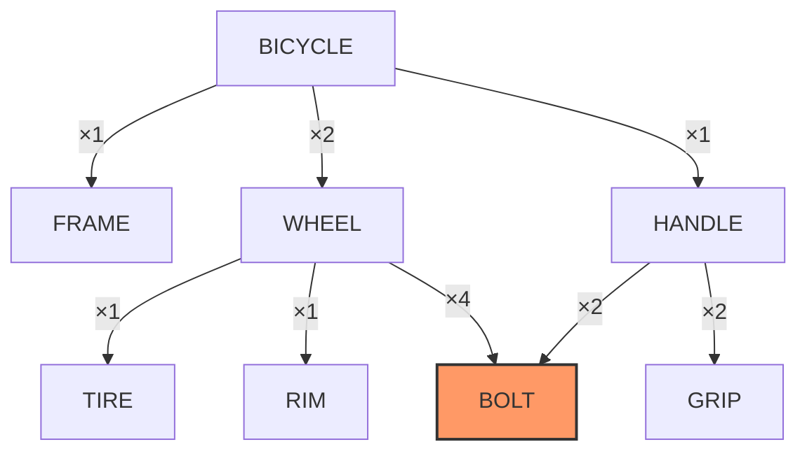
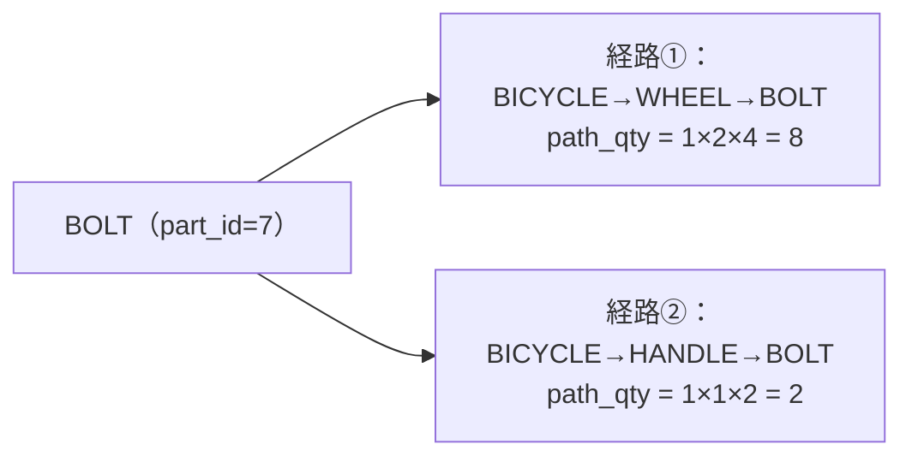
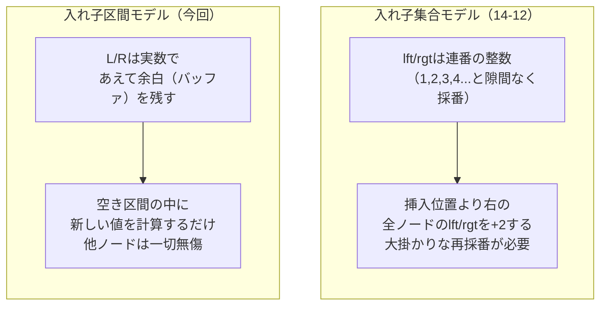
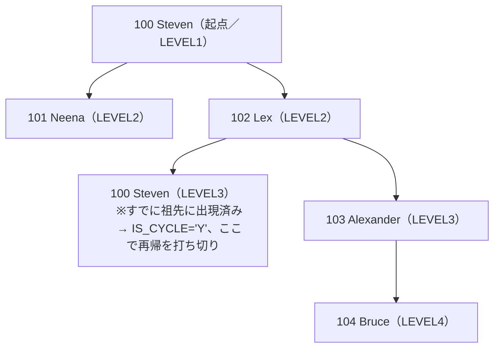
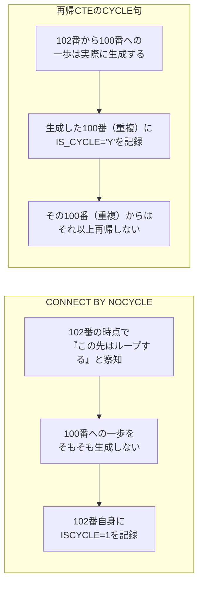

# 【完全版】問題14-15：DAG（有向非巡回グラフ）としてのBOM ── 共有部品を持つ部品表の数量展開
### 難易度：★★★★☆ (Lv.4)
## 問題
問題14-10では、自転車のBOM（部品構成表）を扱い、`SPOKE`や`RUBBER`といった部品の累積所要数を計算しました。しかしあのデータは、**どの部品も親がただ1つ**という、実は「木（Tree）」に過ぎない特殊なケースでした。

実際の製造業の部品表では、「同じボルトが、車輪の組み立てにもハンドルの組み立てにも使われる」といった**1つの部品が複数の異なる親から共有される**ケースが頻繁に発生します。これは厳密には木ではなく、**DAG（Directed Acyclic Graph：有向非巡回グラフ）**と呼ばれる構造です。

この構造を表現するには、問題14-10のように「1部品につき`PARENT_PART_ID`列を1つだけ持つ」データモデルでは不十分です（1行では親を1つしか表現できないため）。そこで今回は、「親子関係」そのものを1行として持つ**エッジ（辺）テーブル**でデータをモデル化します。

```sql
-- 本問題の検証用データソース（クエリの先頭に配置します）
WITH parts (part_id, part_name) AS (
    SELECT 1, 'BICYCLE' FROM DUAL UNION ALL
    SELECT 2, 'FRAME'   FROM DUAL UNION ALL
    SELECT 3, 'WHEEL'   FROM DUAL UNION ALL
    SELECT 4, 'HANDLE'  FROM DUAL UNION ALL
    SELECT 5, 'TIRE'    FROM DUAL UNION ALL
    SELECT 6, 'RIM'     FROM DUAL UNION ALL
    SELECT 7, 'BOLT'    FROM DUAL UNION ALL
    SELECT 8, 'GRIP'    FROM DUAL
),
bom_edges (parent_id, child_id, qty_per_parent) AS (
    SELECT 1, 2, 1 FROM DUAL UNION ALL  -- BICYCLE 1台につき FRAME 1個
    SELECT 1, 3, 2 FROM DUAL UNION ALL  -- BICYCLE 1台につき WHEEL 2個
    SELECT 1, 4, 1 FROM DUAL UNION ALL  -- BICYCLE 1台につき HANDLE 1個
    SELECT 3, 5, 1 FROM DUAL UNION ALL  -- WHEEL 1個につき TIRE 1個
    SELECT 3, 6, 1 FROM DUAL UNION ALL  -- WHEEL 1個につき RIM 1個
    SELECT 3, 7, 4 FROM DUAL UNION ALL  -- WHEEL 1個につき BOLT 4本 ★BOLTはWHEELからも使われる
    SELECT 4, 7, 2 FROM DUAL UNION ALL  -- HANDLE 1個につき BOLT 2本 ★BOLTはHANDLEからも使われる（同じ部品を共有）
    SELECT 4, 8, 2 FROM DUAL            -- HANDLE 1個につき GRIP 2個
)
```

`BOLT`（part_id=7）が、`WHEEL`（親の1つ）と`HANDLE`（親の1つ）の**両方から**参照されている点に注目してください。上記の`parts`・`bom_edges`をデータソースとし、**自転車を1台作るために最終的に何個ずつの部品が必要か**を算出してください。

**【抽出・編集ルール】**
1. **開始地点**：`BICYCLE`（part_id=1）をルートとして開始してください。
2. **TOTAL_QTY**：ルートから該当部品までの、**全ての経路上の`QTY_PER_PARENT`の積を、経路ごとに計算したうえで合算した**最終的な累積所要数を算出してください。
   * `BOLT`のように複数の親を持つ部品は、**どちらか一方の経路だけでなく、両方の経路の寄与を必ず合算**すること。
3. **表示**：1部品につき1行のみとし、`PART_ID`昇順に表示してください（DAGは木と異なり単純な深さ優先順が一意に定まらないため、`PART_ID`順とします）。

## 期待する結果
| PART_ID | PART_NAME | TOTAL_QTY | 
| --------- | ----------- | ----------- | 
| 1         | BICYCLE   | 1           | 
| 2         | FRAME     | 1           | 
| 3         | WHEEL     | 2           | 
| 4         | HANDLE    | 1           | 
| 5         | TIRE      | 2           | 
| 6         | RIM       | 2           | 
| 7         | BOLT      | 10          | 
| 8         | GRIP      | 2           | 

`BOLT`は「WHEEL経由：2個×4本＝8本」と「HANDLE経由：1個×2本＝2本」の**合計10本**が正解です。

## NG例
```sql
-- 「1部品1行のはず」という木構造の思い込みから、MAXで代表させてしまった誤りの例
WITH parts (part_id, part_name) AS (
    SELECT 1, 'BICYCLE' FROM DUAL UNION ALL
    SELECT 2, 'FRAME'   FROM DUAL UNION ALL
    SELECT 3, 'WHEEL'   FROM DUAL UNION ALL
    SELECT 4, 'HANDLE'  FROM DUAL UNION ALL
    SELECT 5, 'TIRE'    FROM DUAL UNION ALL
    SELECT 6, 'RIM'     FROM DUAL UNION ALL
    SELECT 7, 'BOLT'    FROM DUAL UNION ALL
    SELECT 8, 'GRIP'    FROM DUAL
),
bom_edges (parent_id, child_id, qty_per_parent) AS (
    SELECT 1, 2, 1 FROM DUAL UNION ALL
    SELECT 1, 3, 2 FROM DUAL UNION ALL
    SELECT 1, 4, 1 FROM DUAL UNION ALL
    SELECT 3, 5, 1 FROM DUAL UNION ALL
    SELECT 3, 6, 1 FROM DUAL UNION ALL
    SELECT 3, 7, 4 FROM DUAL UNION ALL
    SELECT 4, 7, 2 FROM DUAL UNION ALL
    SELECT 4, 8, 2 FROM DUAL
),
bom_cte (part_id, path_qty) AS (
    SELECT 1, 1 FROM DUAL
    UNION ALL
    SELECT
        e.child_id,
        c.path_qty * e.qty_per_parent
    FROM
        bom_edges e
        INNER JOIN bom_cte c ON e.parent_id = c.part_id
)
SELECT
    p.part_id,
    p.part_name,
    -- ★経路ごとに複数行できることを見落とし、SUMではなくMAXで「代表の1行」を選んでしまっている
    MAX(b.path_qty) AS total_qty
FROM
    bom_cte b
    INNER JOIN parts p ON p.part_id = b.part_id
GROUP BY
    p.part_id, p.part_name
ORDER BY
    p.part_id
```
**【診断】** このクエリはエラーにならず、`FRAME`・`WHEEL`・`TIRE`・`RIM`・`HANDLE`・`GRIP`は全て正しい値を返すため、一見完成しているように見えます。しかし唯一`BOLT`だけが、正解の`10`ではなく`8`（`WHEEL`経由の経路だけ）になってしまいます。原因は、`bom_cte`の中で`BOLT`（part_id=7）が「`WHEEL`経由（`path_qty=8`）」と「`HANDLE`経由（`path_qty=2`）」の**2行**として生成されているにもかかわらず、`GROUP BY`で集約する際に`SUM`ではなく`MAX`を使ってしまい、大きい方の1行だけを「代表値」として採用してしまっている点です。木構造（問題14-10）では1部品につき経路が必ず1本しかないため`MAX`と`SUM`は常に同じ値になり、この設計ミスに気づく機会がありません。共有部品を含むDAGで初めて表面化する、典型的な「木構造前提の思考の残骸」バグです。

## 解答例
```sql
WITH parts (part_id, part_name) AS (
    SELECT 1, 'BICYCLE' FROM DUAL UNION ALL
    SELECT 2, 'FRAME'   FROM DUAL UNION ALL
    SELECT 3, 'WHEEL'   FROM DUAL UNION ALL
    SELECT 4, 'HANDLE'  FROM DUAL UNION ALL
    SELECT 5, 'TIRE'    FROM DUAL UNION ALL
    SELECT 6, 'RIM'     FROM DUAL UNION ALL
    SELECT 7, 'BOLT'    FROM DUAL UNION ALL
    SELECT 8, 'GRIP'    FROM DUAL
),
bom_edges (parent_id, child_id, qty_per_parent) AS (
    SELECT 1, 2, 1 FROM DUAL UNION ALL
    SELECT 1, 3, 2 FROM DUAL UNION ALL
    SELECT 1, 4, 1 FROM DUAL UNION ALL
    SELECT 3, 5, 1 FROM DUAL UNION ALL
    SELECT 3, 6, 1 FROM DUAL UNION ALL
    SELECT 3, 7, 4 FROM DUAL UNION ALL
    SELECT 4, 7, 2 FROM DUAL UNION ALL
    SELECT 4, 8, 2 FROM DUAL
),
-- 【STEP1】再帰CTEで「経路ごと」の累積所要数を求める（同じ部品でも経路の数だけ行が増える）
bom_cte (part_id, path_qty) AS (
    -- アンカー部分：ルート（BICYCLE）自身
    SELECT 1, 1 FROM DUAL
    UNION ALL
    -- 再帰部分：親の累積値 × 自分の所要数を、経路ごとに積み上げる
    SELECT
        e.child_id,
        c.path_qty * e.qty_per_parent
    FROM
        bom_edges e
        INNER JOIN bom_cte c ON e.parent_id = c.part_id
)
-- 【STEP2】同じ部品に複数の経路がある場合は、必ずSUMで合算してから1行にまとめる
SELECT
    p.part_id,
    p.part_name,
    SUM(b.path_qty) AS total_qty
FROM
    bom_cte b
    INNER JOIN parts p ON p.part_id = b.part_id
GROUP BY
    p.part_id, p.part_name
ORDER BY
    p.part_id
```
## 解説
これまで14-12（入れ子集合）、14-13（経路列挙）、14-14（推移閉包）と、木構造を扱うためのさまざまなモデルを見てきましたが、これらはすべて **「1つのノードの親は必ず1つだけ」という木の大前提** の上に成り立っていました。今回はその前提そのものが崩れる、**DAG（有向非巡回グラフ）** を扱います。



図の`BOLT`（オレンジ）を見てください。矢印が`WHEEL`と`HANDLE`の**両方から**伸びています。これが木とDAGを分ける決定的な違いです。木であれば、あるノードに向かう矢印は必ず1本ですが、DAGでは複数の矢印（＝複数の親からの参照）を持つノードが存在しえます（ただし「ぐるっと回って自分に戻ってくる」閉路は存在しない、という制約が"Acyclic"の意味です）。

### データモデルから見直す必要がある
問題14-10の`bom_master`は、1部品につき`PARENT_PART_ID`という**列を1つ**しか持っていませんでした。これは「1部品＝1親」という木の構造を前提にした設計であり、そもそも共有部品を表現する余地がありません。そこで今回は、「親子関係」自体を1行として持つ`bom_edges`という**エッジ（辺）テーブル**にモデルを変更しました。この形式であれば、`BOLT`について「`(parent_id=3, child_id=7)`」と「`(parent_id=4, child_id=7)`」という2つの独立した行を、何の矛盾もなく持たせることができます。

### 再帰CTEは「経路」を辿るのであって「ノード」を辿るのではない
STEP1の再帰CTE自体は、実は14-10で使った「例1：再帰的WITH句」とほぼ同じ書き方です。しかし出力される`bom_cte`の中身が決定的に違います。



木構造では「1部品＝1経路」だったため、`bom_cte`には各部品がちょうど1行ずつ出力されていました。しかしDAGでは、`bom_edges`を`INNER JOIN`で辿る以上、**BOLTに到達する経路の数だけ行が複製されます**。今回であれば`BOLT`は2行（経路①：8、経路②：2）生成されます。これは再帰CTEが壊れているのではなく、「その部品に至る経路がいくつあるか」を正直に列挙しているだけの、**正しい挙動**です。

### STEP2のSUMが本質
だからこそSTEP2で`GROUP BY part_id`と`SUM(path_qty)`が不可欠になります。「経路ごとの寄与」を機械的に全て合算することで、初めて「BOLTが自転車1台あたり本当に何本必要か（＝8+2=10本）」という正しい実務上の答えが得られます。NG例のように、複数経路の存在に気づかずに`MAX`のような「代表値を1つ選ぶ」集計をしてしまうと、片方の経路の需要が消えてしまい、発注数量が不足するという実害に直結します。

| | 問題14-10（木） | 今回・問題14-15（DAG） |
| :--- | :--- | :--- |
| データモデル | 部品ごとに`PARENT_PART_ID`列を1つ持つ | 「親子関係」を1行とする`bom_edges`（辺）テーブル |
| 1部品あたりの経路数 | 常に1本 | 1本とは限らない（共有部品は複数本） |
| 累積所要数の求め方 | 経路上の掛け算をそのまま採用すればよい | 経路ごとの掛け算を求めた**あと**、同じ部品同士を`SUM`で合算する必要がある |
| `CONNECT BY`で書く場合の注意 | そのまま`SYS_CONNECT_BY_PATH`等が使える | 複数経路がある以上、外側で`GROUP BY child_id, SUM(...)`の一手間が必須（`CONNECT BY`自体は無限ループさえなければ問題なく複数経路を展開できる） |

なお、DAGは「閉路がない」ことが前提ですが、もし人為的なデータ登録ミスで「部品Aの材料に部品Aの上位部品自身が指定されている」といった閉路が紛れ込んでしまった場合は、通常の`CONNECT BY`は無限ループに陥ります。実務でエッジテーブル形式のBOMを扱う際は、問題14-7で扱った`CONNECT BY NOCYCLE`を安全策として組み合わせておくことが強く推奨されます。

このように「部品や工程が複数の上位工程から共有される」DAG構造は、製造業の部品表（同じネジや基板が複数の製品ラインで共有される）だけでなく、ソフトウェア開発におけるパッケージの依存関係グラフ（複数のライブラリから同じ共通ライブラリが参照される）、大学のカリキュラムにおける前提科目の関係（複数の上位科目が同じ基礎科目を前提とする）など、非常に幅広い場面に応用が利く重要な概念です。

---
<br><br>

# 【完全版】問題14-16：入れ子区間モデル（Nested Intervals Model）── 実数の稠密性を利用した「無renumberingの挿入」
### 難易度：★★★★☆ (Lv.4)
## 問題
問題14-12（入れ子集合モデル）では、`lft`/`rgt`という**整数**を使ってサブツリーを`BETWEEN`一発で抽出できることを学びました。しかしあの方式には大きな弱点がありました。「新しいノードを木の途中に1つ挿入するだけで、挿入位置より右側にある**無関係な大量のノードの`lft`/`rgt`まで再採番（シフト）が必要になる**」という点です。

「入れ子集合モデル」自体は`lft`/`rgt`を必ずしも**隙間なく連番で振る必要はありません**。あらかじめ各ノードの区間の間に「空き（バッファ）」を意図的に残しておき、境界値には整数に限らず**実数（小数）**を使うことで、挿入のたびに他のノードへ影響を及ぼさずに済むよう発展させたものが「**入れ子区間モデル（Nested Intervals Model）**」です。実数には「どんなに近い2つの数の間にも、さらに無数の数が存在する（稠密性）」という性質があるため、理論上は**空き区間が尽きることが決してありません**。

以下は、問題14-12と同じ組織構造を、あらかじめ余裕を持たせた区間`L`（左値）・`R`（右値）で表現したデータです。

```sql
WITH org_nested_intervals (node_id, node_name, l, r) AS (
    SELECT 1, 'A. CEO 佐藤',              0,    1000 FROM DUAL UNION ALL
    SELECT 2, 'B. VP営業 鈴木',           100,  400  FROM DUAL UNION ALL
    SELECT 3, 'C. VP開発 田中',           500,  900  FROM DUAL UNION ALL
    SELECT 4, 'D. 営業マネージャー1 高橋', 150,  200  FROM DUAL UNION ALL
    SELECT 5, 'E. 営業マネージャー2 伊藤', 250,  350  FROM DUAL UNION ALL
    SELECT 6, 'F. 開発マネージャー1 渡辺', 550,  750  FROM DUAL UNION ALL
    SELECT 7, 'G. 開発マネージャー2 山本', 800,  850  FROM DUAL UNION ALL
    SELECT 8, 'H. 開発者1 中村',          580,  620  FROM DUAL UNION ALL
    SELECT 9, 'I. 開発者2 小林',          660,  700  FROM DUAL
)
```

Fの子である「H（580,620）」と「I（660,700）」の間には`[620, 660)`という**未使用の空き区間**が残されている点に注目してください。

上記の`org_nested_intervals`をデータソースとし、以下の要件を満たすクエリを**1本のSELECT文（`UNION ALL`は可、`UPDATE`は不可）**で作成してください。

**【要件】**
1. Fの子として、HとIの間に新メンバー「**J. 開発者3 木村**」を追加したい。**既存9行のどの`L`・`R`も一切変更・参照した値の書き換えをせず**、HとIの間の空き区間`[620, 660)`の**中央に幅20の新しい区間**を動的に算出して割り当てること。
2. Cを根とするサブツリー（C自身とその配下全員、Jの挿入後）を、問題14-12と同様に **深さ優先探索順（`L`昇順）** で、インデント付きの`INDENTED_NAME`と、Cを1とした相対的な`DEPTH`とともに一覧表示すること。

## 期待する結果
| INDENTED_NAME                   | DEPTH | 
| --------------------------------- | ------- | 
| C. VP開発 田中                  | 1       | 
| --F. 開発マネージャー1 渡辺     | 2       | 
| ----H. 開発者1 中村             | 3       | 
| ----J. 開発者3 木村（新規追加） | 3       | 
| ----I. 開発者2 小林             | 3       | 
| --G. 開発マネージャー2 山本     | 2       | 

新しく挿入された「J」が、HとIの**間**に正しく割り込んで表示されています。

## NG例
```sql
-- コピペミスで「-10」とすべき箇所を「+10」としてしまい、区間の幅が消えてしまった例
WITH org_nested_intervals (node_id, node_name, l, r) AS (
    SELECT 1, 'A. CEO 佐藤',              0,    1000 FROM DUAL UNION ALL
    SELECT 2, 'B. VP営業 鈴木',           100,  400  FROM DUAL UNION ALL
    SELECT 3, 'C. VP開発 田中',           500,  900  FROM DUAL UNION ALL
    SELECT 4, 'D. 営業マネージャー1 高橋', 150,  200  FROM DUAL UNION ALL
    SELECT 5, 'E. 営業マネージャー2 伊藤', 250,  350  FROM DUAL UNION ALL
    SELECT 6, 'F. 開発マネージャー1 渡辺', 550,  750  FROM DUAL UNION ALL
    SELECT 7, 'G. 開発マネージャー2 山本', 800,  850  FROM DUAL UNION ALL
    SELECT 8, 'H. 開発者1 中村',          580,  620  FROM DUAL UNION ALL
    SELECT 9, 'I. 開発者2 小林',          660,  700  FROM DUAL
),
gap AS (
    SELECT
        MAX(CASE WHEN node_name LIKE 'H.%' THEN r END) AS gap_start,
        MAX(CASE WHEN node_name LIKE 'I.%' THEN l END) AS gap_end
    FROM org_nested_intervals
),
new_node AS (
    SELECT
        10 AS node_id,
        'J. 開発者3 木村（新規追加）' AS node_name,
        (gap_start + gap_end) / 2 + 10 AS l,  -- ★本来は「- 10」とすべき箇所
        (gap_start + gap_end) / 2 + 10 AS r   -- ★L・Rが完全に同じ値になってしまっている
    FROM gap
)
SELECT node_id, node_name, l, r FROM org_nested_intervals
UNION ALL
SELECT node_id, node_name, l, r FROM new_node
ORDER BY l
```
**【診断】** このクエリはエラーにならず、Jは`L=650, R=650`という値で、HとIの間の正しい位置に一見問題なく挿入されたように見えます（`ORDER BY l`での並び順も崩れません）。しかし`L`と`R`が完全に同じ値になっており、**幅がゼロの区間**になってしまっています。これは「区間としての実体を持たないノード」であり、この状態のJに**将来さらに子ノードを追加しようとしても、Jの内側にはもう1ミリの空き区間も存在しない**ため、入れ子区間モデル最大の利点（実数の稠密性による無限の再挿入余地）を自ら手放してしまっていることになります。並び順やサブツリー抽出（`BETWEEN`）といった見た目上のテストだけでは気づきにくく、「あとで子ノードを追加しようとして初めて詰みに気づく」という、時限爆弾のようなサイレントバグです。

## 解答例
```sql
WITH org_nested_intervals (node_id, node_name, l, r) AS (
    SELECT 1, 'A. CEO 佐藤',              0,    1000 FROM DUAL UNION ALL
    SELECT 2, 'B. VP営業 鈴木',           100,  400  FROM DUAL UNION ALL
    SELECT 3, 'C. VP開発 田中',           500,  900  FROM DUAL UNION ALL
    SELECT 4, 'D. 営業マネージャー1 高橋', 150,  200  FROM DUAL UNION ALL
    SELECT 5, 'E. 営業マネージャー2 伊藤', 250,  350  FROM DUAL UNION ALL
    SELECT 6, 'F. 開発マネージャー1 渡辺', 550,  750  FROM DUAL UNION ALL
    SELECT 7, 'G. 開発マネージャー2 山本', 800,  850  FROM DUAL UNION ALL
    SELECT 8, 'H. 開発者1 中村',          580,  620  FROM DUAL UNION ALL
    SELECT 9, 'I. 開発者2 小林',          660,  700  FROM DUAL
),
-- 【STEP1】HとIの間にある「空き区間」の境界値を取得する
gap AS (
    SELECT
        MAX(CASE WHEN node_name LIKE 'H.%' THEN r END) AS gap_start,
        MAX(CASE WHEN node_name LIKE 'I.%' THEN l END) AS gap_end
    FROM org_nested_intervals
),
-- 【STEP2】空き区間の中央に、幅20の新しい区間を動的に割り当てる（既存9行は一切参照・更新しない）
new_node AS (
    SELECT
        10                                              AS node_id,
        'J. 開発者3 木村（新規追加）'                    AS node_name,
        (gap_start + gap_end) / 2 - 10                  AS l,
        (gap_start + gap_end) / 2 + 10                  AS r
    FROM
        gap
),
-- 【STEP3】既存データに新ノードをUNION ALLするだけ（UPDATEは一切発生しない）
org_after_insert AS (
    SELECT * FROM org_nested_intervals
    UNION ALL
    SELECT * FROM new_node
),
root AS (
    SELECT l AS root_l, r AS root_r
    FROM org_after_insert
    WHERE node_name LIKE 'C.%'
),
subtree AS (
    SELECT o.*
    FROM org_after_insert o, root r
    WHERE o.l >= r.root_l
      AND o.r <= r.root_r
)
SELECT
    LPAD('-', 2 * (depth - 1), '-') || node_name AS indented_name,
    depth
FROM (
    SELECT
        s.node_name,
        s.l,
        (SELECT COUNT(*) FROM subtree anc WHERE anc.l <= s.l AND anc.r >= s.r) AS depth
    FROM subtree s
)
ORDER BY l
```
## 解説
今回は問題14-12（入れ子集合モデル）・14-13（経路列挙モデル）・14-14（推移閉包）・14-15（DAG）に続く、木構造モデル探訪の締めくくりとして「**入れ子区間モデル（Nested Intervals Model）**」を扱います。



### 「隙間を残す」という設計思想
問題14-12の`lft`/`rgt`は、木を深さ優先で辿った際の**通過順序をそのまま連番で振った**ものでした。これは省メモリで直感的な反面、値と値の間に一切の隙間がないため、新しいノードを挿入する余地がどこにも残されていません。

今回のデータを見てください。Fの子である「H（580, 620）」と「I（660, 700）」の間には、`620`から`660`まで**丸ごと40の空き区間**が意図的に残されています。同様にA直下のB・C間、B直下のD・E間にも余白があります。この「あらかじめ余白を残しておく」という一手間こそが、入れ子区間モデルの核心です。

### 挿入は「既存データに触れない」計算だけで完結する
解答例のSTEP1・STEP2を見てください。
```sql
gap_start = H.r  -- 620
gap_end   = I.l  -- 660
J.L = (620 + 660) / 2 - 10 = 630
J.R = (620 + 660) / 2 + 10 = 650
```
これは「HとIの区間そのもの」には一切触れず、その**外側の空き地の座標を読み取って、新しい値を計算しているだけ**です。STEP3の`UNION ALL`も、既存9行をそのままコピーしているだけで、**どの行の`L`・`R`にも`UPDATE`は発生していません**。問題14-12であれば、Fの子を1つ増やすだけでもF以降（G, H, I、場合によってはCやAの`rgt`まで）を再計算する必要がありましたが、今回はJという1行を`UNION ALL`で追加するだけで完結しています。

### なぜ「実数」でなければならないのか
ここで重要なのが、NG例で扱った「L=Rになってしまう」バグです。もし境界値が**整数限定**だったらどうなるでしょうか。例えばH.R=620、I.L=621のように**隙間がわずか1**しかない状況で新ノードを挿入しようとすると、整数の世界では「620と621の間に入る整数」はもう存在しません。挿入するには、Iの`L`を622以降にずらす（＝Iという既存行への書き換えが発生する）しかなくなってしまいます。

これに対して**実数（小数）**であれば、620と621の間にも620.5、620.25、620.125……と**理論上無限に**新しい値を見つけることができます。今回のNG例が示した「L=Rになる」失敗は、まさにこの「実数の恩恵をコード側のミスで自ら潰してしまった」ケースであり、値の型を整数から実数に変えただけでは自動的に安全になるわけではなく、**挿入のたびに必ず正の幅を持つ区間を確保する実装上の規律**が伴って初めて、モデルの利点が活きるという教訓になっています。

### 4つのモデルの総括
これで、隣接リスト・入れ子集合・経路列挙・推移閉包（＋DAG）・入れ子区間と、木構造・グラフ構造を表現する代表的な手法が出揃いました。最後に一覧で整理します。

| 観点 | 隣接リスト<br>(`CONNECT BY`) | 入れ子集合<br>(14-12) | 経路列挙<br>(14-13) | 入れ子区間<br>(今回) |
| :--- | :--- | :--- | :--- | :--- |
| サブツリー抽出 | 再帰探索が必要 | `BETWEEN`で一発 | `LIKE`で一発 | `BETWEEN`で一発 |
| ノード1件の挿入コスト | 軽い（親IDを設定するだけ） | **重い**（右側全体を再採番） | 中程度（自分のパスを設定するだけ） | **軽い**（空き区間に値を計算するだけ、他行は無傷） |
| ノードの移動コスト | 軽い | 非常に重い | 中程度（配下全員のパス書き換え） | 中程度（配下全員の区間の再割り当てが必要な場合がある） |
| 実装・理解の難易度 | 低い | 中程度 | 低い | **高い**（余白設計や実数演算の理解が必要） |
| 代表的な利用場面 | 更新頻度の高い組織図・BOM | 読み取り専用に近い分類マスタ | パンくずリスト、スレッド構造 | 頻繁な挿入・並べ替えが発生する巨大な階層（大規模CMS、ファイルシステム等） |

入れ子区間モデルは、入れ子集合モデルの「検索の速さ」を維持しながら、最大の弱点だった「挿入コストの重さ」を実数の稠密性で解決する、いわば**両モデルのいいとこ取りを狙った発展形**です。ただしその代償として、境界値の管理ロジックが複雑になり、余白の設計（どれくらいの幅を残しておくか）や、NG例で見たような「実装ミスで余白を食いつぶしてしまう」リスクへの注意深さが求められます。実務では、Webサイトの巨大なメニュー階層やコメントスレッドのように「挿入・並べ替えが極めて頻繁に発生し、かつ検索性能も譲れない」という特殊な要件がある場合にのみ採用が検討される、やや上級者向けの設計パターンだと理解しておくとよいでしょう。

---
<br><br>

# 【完全版】問題14-17：再帰CTE（WITH句）の`CYCLE`句による循環参照検出
### 難易度：★★★★☆ (Lv.4)
## 問題
問題14-7では、`CONNECT BY NOCYCLE`と`CONNECT_BY_ISCYCLE`を使い、「Aの上司がB、Bの上司がAに戻ってしまう」ような不正な循環参照データを、エラーなく安全に検出しました。

問題14-8で触れた通り、ANSI標準の再帰CTE（`WITH`句）にも、これと同じ目的の **`CYCLE`句** が用意されています。今回は同じ監査要件を、**`CONNECT BY`・`START WITH`・`PRIOR`・`NOCYCLE`を一切使わず**、再帰CTEの`CYCLE`句だけで実現してください。

検証用データは、問題14-7と全く同じものを使用します（100番の上司を、本来のNULLから102番へ意図的に書き換え、循環参照を偽装しています）。
```sql
-- 本問題の検証用データソース（クエリの先頭に配置します）
WITH test_employees AS (
    SELECT
        employee_id,
        -- 100番（本来の社長）のマネージャーを敢えて102番に書き換えてループを偽装
        CASE WHEN employee_id = 100 THEN 102 ELSE manager_id END AS manager_id,
        first_name || ' ' || last_name AS name
    FROM hr.employees
    WHERE employee_id IN (100, 101, 102, 103, 104)
)
```
上記の`test_employees`をデータソースとし、`employee_id = 100`を起点とするトップダウンの階層問い合わせを、再帰CTEで作成してください。

**【抽出・編集ルール】**
* **INDENTED_NAME**：階層の深さに応じて、氏名の前に「-」を2つずつインデントとして付与してください。
* **LEVEL**：階層の深さ（起点を1とする）。
* **IS_CYCLE**：`CYCLE`句によって、循環参照が検知された行に`'Y'`、それ以外に`'N'`を出力してください。
* データ内に循環参照が含まれていても、**エラー（ORA-32044）を出さずに安全にクエリを完結させる**制御を行うこと。
* 出力順は深さ優先探索順（同じ階層内は`EMPLOYEE_ID`昇順）としてください。

## 期待する結果
| EMPLOYEE_ID | INDENTED_NAME | LEVEL | IS_CYCLE |
| ----------- | -------------------- | ----- | -------- |
| 100 | Steven King | 1 | N |
| 101 | --Neena Yang | 2 | N |
| 102 | --Lex Garcia | 2 | N |
| 100 | ----Steven King | 3 | **Y** |
| 103 | ----Alexander James | 3 | N |
| 104 | ------Bruce Miller | 4 | N |

問題14-7の結果（5行）とは異なり、**`EMPLOYEE_ID = 100`が2回出現**している点に注目してください。

## 解答例
```sql
WITH test_employees AS (
    SELECT
        employee_id,
        CASE WHEN employee_id = 100 THEN 102 ELSE manager_id END AS manager_id,
        first_name || ' ' || last_name AS name
    FROM hr.employees
    WHERE employee_id IN (100, 101, 102, 103, 104)
),
emp_cte (employee_id, manager_id, name, lvl) AS (
    -- ① アンカー部分：起点（100番）
    SELECT
        employee_id,
        manager_id,
        name,
        1 AS lvl
    FROM
        test_employees
    WHERE
        employee_id = 100

    UNION ALL

    -- ② 再帰部分：1階層ずつ子を辿る
    SELECT
        e.employee_id,
        e.manager_id,
        e.name,
        c.lvl + 1
    FROM
        test_employees e
    INNER JOIN
        emp_cte c ON e.manager_id = c.employee_id
)
    SEARCH DEPTH FIRST BY employee_id SET ordering_col
    -- ★循環参照を検知したら is_cycle 列に 'Y' を立てて、その行から先の再帰を打ち切る
    CYCLE employee_id SET is_cycle TO 'Y' DEFAULT 'N'
SELECT
    employee_id,
    LPAD('-', 2 * (lvl - 1), '-') || name AS indented_name,
    lvl AS "LEVEL",   -- LEVELはOracleの予約語のため、ダブルクォートで囲んでエイリアスとして使用する
    is_cycle
FROM
    emp_cte
ORDER BY
    ordering_col
```

:::message
`LEVEL`はOracleの予約語（かつ階層問い合わせの擬似列）であるため、ダブルクォートなしで列エイリアスとして使用すると`ORA-00923: FROM keyword not found where expected`が発生します。ダブルクォートで囲む（`AS "LEVEL"`）ことで、予約語であっても識別子として使用できます。再帰CTEでは`LEVEL`という名前の擬似列は自動生成されないため、階層の深さを表す列に`LEVEL`という名前を付けたい場合は、このひと手間が必要になる点に注意してください。
:::

## 解説
再帰CTEにも、`CONNECT BY NOCYCLE`と同じ「無限ループを安全に止める」ための専用構文である`CYCLE`句が用意されています。ただし、**エラーを防ぐ仕組みは同じでも、「結果の見え方」がCONNECT BYとは大きく異なる**という点が、今回の一番の学びどころです。



### CYCLE句の書き方
```sql
CYCLE employee_id SET is_cycle TO 'Y' DEFAULT 'N'
```
これは、「再帰の過程で`employee_id`の値が、その行の**祖先行と同じ値**になったら、循環参照とみなして`is_cycle`という列に`'Y'`を立てなさい。それ以外は`'N'`にしなさい」という宣言です。`is_cycle`はSELECT句の列リストに明示的に定義していなくても、`CYCLE`句によって自動的に結果セットへ追加される列です。`SEARCH`句と同様、`emp_cte`の定義（`UNION ALL`によるアンカー部分・再帰部分）の直後、外側の`SELECT`文の直前に置きます。

### CONNECT BY NOCYCLEとの決定的な違い：「重複行」の扱い
最も重要な違いは、**循環参照を起こす行そのものを、結果に含めるかどうか**です。

| | `CONNECT BY NOCYCLE`（問題14-7） | 再帰CTEの`CYCLE`句（今回） |
| :--- | :--- | :--- |
| フラグが立つ場所 | 循環の**引き金となった親行**（102番） | 循環を**引き起こした当の行自身**（3行目の100番） |
| 循環元の行の再出力 | されない（100番は1行目にしか出てこない） | **される**（100番が1行目と4行目の2回出現する） |
| 出力行数 | 5行（重複なし） | 6行（100番が重複） |

`CONNECT BY NOCYCLE`は、「これ以上進むとループする」と分かった時点で**その一歩先（重複行）自体を生成しない**という、いわば「事前に踏みとどまる」設計でした。そのため`CONNECT_BY_ISCYCLE`は、ループの引き金を引いた **手前の行（102番）** に立ちます。

一方、再帰CTEの`CYCLE`句は、「循環を起こす行を**一度だけ生成したうえで**、その行に印を付け、そこから**先への再帰だけを止める**」という設計です。そのため今回の結果では、100番が「本来の起点（1行目）」と「102番の配下として本来存在してはいけない重複（4行目）」の2回登場し、4行目の方に`IS_CYCLE='Y'`が立ちます。



どちらも「無限ループでシステムがクラッシュするのを防ぐ」という目的は同じですが、**集計処理（`SUM`や`COUNT`）と組み合わせる際には要注意**です。再帰CTEの`CYCLE`句をそのまま使うと、100番が2行分カウントされてしまい、人数集計などが狂う可能性があります。この方式で件数集計まで行いたい場合は、`WHERE is_cycle = 'N'`などで重複行を除外してから集計する、という一手間を忘れないようにしましょう。

### なぜUNION ALLのままで安全に止まるのか
問題14-8では「再帰CTEは`UNION ALL`で1階層ずつ結果を積み増していく」と説明しましたが、通常であれば循環参照データに対して`CYCLE`句なしで再帰CTEを実行すると、Oracleは無限に`UNION ALL`を繰り返そうとして`ORA-32044`（循環参照によりCTEの実行が中断されました、の意）でエラー停止します。`CYCLE`句は、この「祖先と同じ値が再度出現したら、そこで自発的に再帰を止める」というブレーキ役を担っており、これによって`NOCYCLE`と同様、安全にクエリを完結させることができます。

`CONNECT BY`か再帰CTEか、そして`NOCYCLE`か`CYCLE`句か——標準SQLへの統一を重視するか、重複行のない簡潔な結果を重視するかで、使い分けを検討するとよいでしょう。
