# 問題4-1：NULL値の判定
### 難易度：★☆☆☆☆ (Lv.1)
## 問題
HRスキーマにある **`DEPARTMENTS`** テーブルから、マネージャーが存在する（**`MANAGER_ID` 列が NULL でない**）部署のデータをすべて取得してください。
なお、レコードの表示順序は問いません。

## 期待する結果
| DEPARTMENT_ID | DEPARTMENT_NAME  | MANAGER_ID | LOCATION_ID | 
| ------------- | ---------------- | ---------- | ----------- | 
| 10            | Administration   | 200        | 1700        | 
| 20            | Marketing        | 201        | 1800        | 
| 30            | Purchasing       | 114        | 1700        | 
| 40            | Human Resources  | 203        | 2400        | 
| 50            | Shipping         | 121        | 1500        | 
| 60            | IT               | 103        | 1400        | 
| 70            | Public Relations | 204        | 2700        | 
| 80            | Sales            | 145        | 2500        | 
| 90            | Executive        | 100        | 1700        | 
| 100           | Finance          | 108        | 1700        | 
| 110           | Accounting       | 205        | 1700        | 

## 解答例
```sql
SELECT
    *
FROM
    hr.departments
WHERE
    manager_id IS NOT NULL
```

## 解説
今回はSQLの難所の一つ、「NULL（ヌル）」の扱いです。

NULLは「0」でも「空文字（""）」でもなく、「値が未定義」「まだ決まっていない」という状態を指します。

| 値 | 意味 |
| :--- | :--- |
| `0` | 数値としての「ゼロ」という具体的な値 |
| `''`（空文字） | 「文字が0個」という具体的な値 |
| `NULL` | 値そのものが「まだ決まっていない・存在しない」という状態 |

今回の問題は、この考え方を使って「マネージャーが誰だか決まっている部署」を探す問題です。
`DEPARTMENTS` テーブルには、実は「Contracting」のようにマネージャーが設定されていない（NULLの）部署が存在します。今回のクエリは、そういった部署を除外して、組織図がはっきりしている部署だけを抽出したことになります。

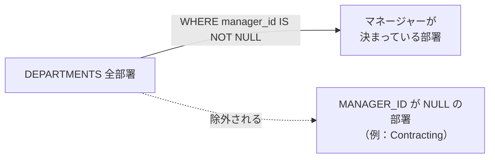

ここで一番注意してほしいのが、**「NULLは比較演算子（`=`や`!=`）で判定できない」** という点です。
```sql
-- これは動きますが、意図通りには動きません
WHERE manager_id != NULL
```
こう書いても結果は1行も取得できません。NULLを判定したいときは、必ず `IS NULL` または `IS NOT NULL` を使う、というルールで覚えておいてください。

| やりたいこと | ❌ 間違い | ⭕ 正しい書き方 |
| :--- | :--- | :--- |
| NULLである行を探す | `WHERE manager_id = NULL` | `WHERE manager_id IS NULL` |
| NULLでない行を探す | `WHERE manager_id != NULL` | `WHERE manager_id IS NOT NULL` |

私が新人の頃、まさにこの `!= NULL` の書き方でハマったことがあります。「なぜかクエリが1件もヒットしない」と半日近く悩んで、先輩に見せたら一瞬で「それIS NOT NULLで書かないと」と言われました。今思えば基本中の基本ですが、最初は本当につまずきやすいポイントだと思います。

実務では、`WHERE email IS NOT NULL`（メールアドレス登録済みの顧客だけ抽出する）や、`WHERE completion_date IS NULL`（完了日未入力＝未完了のタスクだけ見る）のような形で頻繁に登場します。

:::message
### なぜ「= NULL」ではなく「IS NULL」と書くのか
「= NULL」と書くと常に結果が0件になります。理由はSQLが採用している「3値論理」という仕組みにあります。

通常のプログラミング言語では比較の結果はTRUE/FALSEの2択ですが、SQLにはNULLがあるため、結果が3種類存在します。

| 判定結果 | 意味 |
| :---: | :--- |
| TRUE | 条件に合致する |
| FALSE | 条件に合致しない |
| UNKNOWN | 判定できない（NULLが絡む場合） |

WHERE句は、このうちTRUEになった行だけを表示します。

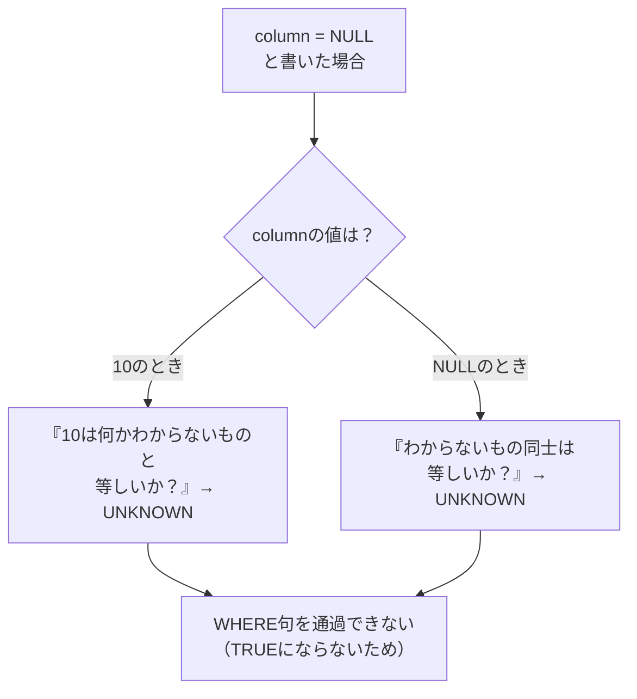

`column = NULL` と書いたとき、内部では次のような判定が行われます。値が「10」のカラムに対しては「10は『何かわからないもの』と等しいか？」→答えは「わかりません（UNKNOWN）」。値が「NULL」のカラムに対しても「『わからないもの』同士は等しいか？」→これも「わかりません」。同じNULL同士であっても、中身が不明である以上「等しい」とは断言できないためです。

結果として `column = NULL` はどんな値と比較してもUNKNOWNにしかならず、WHERE句を1行も通過できません。

一方 `IS NULL` は比較演算子ではなく、「その状態を判定する専用の述語」です。「これはNULLという状態ですか？」に対して「はい（TRUE）」と答えられるので、正しく動作します。英語で言えば「Is it...?（〜の状態か）」と「Does it equal...?（〜と同じ値か）」の違い、とイメージすると腑に落ちやすいかもしれません。
:::

## 参考リンク
https://www.shift-the-oracle.com/element/null/nulls-effect.html

----
<br><br>

# 問題4-2：数値の範囲指定
### 難易度：★☆☆☆☆ (Lv.1)
## 問題
HRスキーマにある **`JOBS`** テーブルから、**`MIN_SALARY`（最低給与）が 5,000 以上 10,000 以下** であるデータを取得してください。
なお、レコードの表示順序は問いません。
## 期待する結果
| JOB_ID | JOB_TITLE            | MIN_SALARY | MAX_SALARY | 
| ------ | -------------------- | ---------- | ---------- | 
| FI_MGR | Finance Manager      | 8200       | 16000      | 
| AC_MGR | Accounting Manager   | 8200       | 16000      | 
| SA_MAN | Sales Manager        | 10000      | 20080      | 
| SA_REP | Sales Representative | 6000       | 12008      | 
| PU_MAN | Purchasing Manager   | 8000       | 15000      | 
| ST_MAN | Stock Manager        | 5500       | 8500       | 
| MK_MAN | Marketing Manager    | 9000       | 15000      | 

## 解答例
```sql:例1：betweenを使用
SELECT
    *
FROM
    hr.jobs
WHERE
    min_salary BETWEEN 5000 AND 10000
```
```sql:例2：比較演算子を使用
SELECT
    *
FROM
    hr.jobs
WHERE
        min_salary >= 5000
    AND min_salary <= 10000
```

## 解説
「～から～の間」という範囲指定は、給与や日付、在庫数などを扱うクエリで非常によく使う書き方です。
`BETWEEN [下限値] AND [上限値]` と書くと、指定した範囲内の値をまとめて抽出できます。ここで一番大事なのは、**境界値（今回であれば5000と10000）も含まれる**という点です。

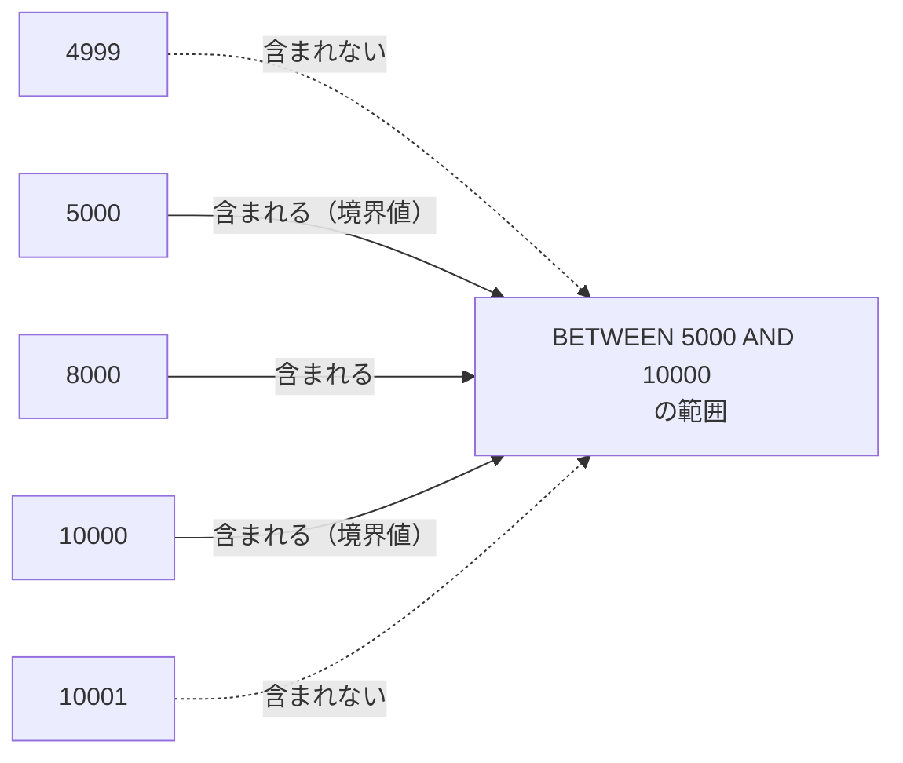

期待する結果を見ると `SA_MAN` の `MIN_SALARY` がちょうど10000ですが、これもきちんと結果に含まれています。

解答例2のように `>=` と `<=` を `AND` で組み合わせても、全く同じ結果になります。両者に優劣はなく、単純に「どの列の範囲を見ているか」がひと目でわかる `BETWEEN` の方が、私は好んで使っています。特に同じカラムに対する範囲指定であれば、`BETWEEN` の方が書く量も少なく、読み間違いも減ります。

| 書き方 | 特徴 |
| :--- | :--- |
| `BETWEEN 5000 AND 10000` | 短く書ける。同じ列の範囲指定に向く |
| `>= 5000 AND <= 10000` | 記述はやや長いが、片方の境界だけ除きたい場合に対応できる |

逆に「5000より大きく、10000ちょうどは含まない」といった境界値を除きたいケースでは、`BETWEEN` は使えないので比較演算子を組み合わせる必要があります。

一点補足しておくと、日付データ（DATE型）に対して `BETWEEN '2023-01-01' AND '2023-01-31'` のように書く場合は注意が必要です。時刻情報が含まれるカラムだと、31日の午前0時以降のデータが範囲から漏れてしまうことがあります。日付を扱う際は、時刻まで意識した比較演算子の方が安全な場面も多いです。

## 参考リンク
https://www.shift-the-oracle.com/sql/simple-comparison-condition.html

----
<br><br>

# 問題4-3：否定の条件指定（不一致）
### 難易度：★☆☆☆☆ (Lv.1)
## 問題
HRスキーマにある **`JOB_HISTORY`** テーブルから、**`JOB_ID` が「ST_CLERK」ではない** レコードをすべて取得してください。
なお、レコードの表示順序は問いません。

## 期待する結果
| EMPLOYEE_ID | START_DATE           | END_DATE             | JOB_ID     | DEPARTMENT_ID | 
| ----------- | --------------------- | --------------------- | ---------- | ------------- | 
| 102         | 2011-01-13T00:00:00Z | 2016-07-24T00:00:00Z | IT_PROG    | 60            | 
| 101         | 2007-09-21T00:00:00Z | 2011-10-27T00:00:00Z | AC_ACCOUNT | 110           | 
| 101         | 2011-10-28T00:00:00Z | 2015-03-15T00:00:00Z | AC_MGR     | 110           | 
| 201         | 2014-02-17T00:00:00Z | 2017-12-19T00:00:00Z | MK_REP     | 20            | 
| 200         | 2005-09-17T00:00:00Z | 2011-06-17T00:00:00Z | AD_ASST    | 90            | 
| 176         | 2016-03-24T00:00:00Z | 2016-12-31T00:00:00Z | SA_REP     | 80            | 
| 176         | 2017-01-01T00:00:00Z | 2017-12-31T00:00:00Z | SA_MAN     | 80            | 
| 200         | 2012-07-01T00:00:00Z | 2016-12-31T00:00:00Z | AC_ACCOUNT | 90            |
## 解答例
```sql: 例1：<> を使用
SELECT
    *
FROM
    hr.job_history
WHERE
    job_id <> 'ST_CLERK'
```
```sql:例2：!= を使用
SELECT
    *
FROM
    hr.job_history
WHERE
    job_id != 'ST_CLERK'
```
```sql:例3：^= を使用
SELECT
    *
FROM
    hr.job_history
WHERE
    job_id ^= 'ST_CLERK'
```

## 解説
「一致する」と同じくらい頻繁に使うのが、この「一致しない（除外）」という条件です。

Oracle SQLで「等しくない」を表す記号は3種類あります。

| 記号 | 由来 | 他DBへの移植性 |
| :--- | :--- | :--- |
| `<>` | ISO標準（標準SQL） | ⭕ どのデータベースでも動く |
| `!=` | C系・Javaに馴染みのある書き方 | ⭕ Oracleでも問題なく動く |
| `^=` | Oracle独自の記法 | ❌ 他DBへの移植時に書き換えが必要 |

私は基本的に `<>` を使うようにしていて、実際、現場でも `<>` が一番よく見かける書き方だと思います。

なお `'ST_CLERK'` をシングルクォーテーションで囲んでいるのは、`JOB_ID` が文字列型（VARCHAR2）だからです。これを忘れると、Oracleは `ST_CLERK` という名前の列を探しに行ってしまい、「そんな列はありません」というエラーになります。

ここからが今回の本題です。**除外条件（`<>`や`!=`）を使うと、その列がNULLである行も結果から消えてしまう**という性質があります。

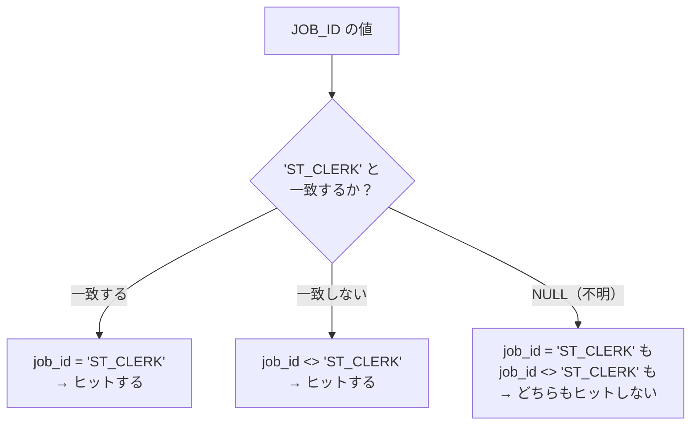

仮に `JOB_ID` がNULLの社員がいたとすると、`WHERE job_id = 'ST_CLERK'` はもちろんヒットしませんが、`WHERE job_id <> 'ST_CLERK'` も同じくヒットしません。「ST_CLERKではない」という判定さえNULLに対しては「不明」扱いになるため、結果から漏れてしまうのです。

もしNULLも含めて取得したい場合は、次のように明示的に条件を追加する必要があります。
```sql
WHERE job_id <> 'ST_CLERK' OR job_id IS NULL
```
これは私も一度、レポート集計で件数が合わずに調査した際、原因がまさにこれだったことがあります。除外条件を使う際は、そのカラムにNULLが存在しうるかどうかを一度確認する癖をつけておくと安心です。

:::message
### 否定条件が重なると読みにくくなる
`WHERE job_id <> 'ST_CLERK' AND department_id <> 50` のように否定が複数重なると、人はパッと見て「結局どのデータが出るのか」を把握しにくくなります。条件が複雑になりそうなときは、あえて肯定形で書き直せないか（例えば対象を`IN`で列挙する等）を考えてみると、コードの見通しが良くなることがあります。
:::

----
<br><br>

# 問題4-4：いずれかの条件に一致（IN / OR）
### 難易度：★☆☆☆☆ (Lv.1)
## 問題
HRスキーマにある **`COUNTRIES`** テーブルから、**`REGION_ID` が 40 または 50** であるレコードを取得してください。
なお、レコードの表示順序は問いません。

## 期待する結果
| COUNTRY_ID | COUNTRY_NAME | REGION_ID | 
| ---------- | ------------ | --------- | 
| AU         | Australia    | 40        | 
| EG         | Egypt        | 50        | 
| NG         | Nigeria      | 50        | 
| ZM         | Zambia       | 50        | 
| ZW         | Zimbabwe     | 50        | 

## 解答例
```sql:例1：orを使用
SELECT
    country_id,
    country_name,
    region_id
FROM
    hr.countries
WHERE
    region_id = 40 OR region_id = 50 
```
```sql:例2：inを使用
SELECT
    country_id,
    country_name,
    region_id
FROM
    hr.countries
WHERE
    region_id IN ( 40, 50 )
```
```sql:例3:anyを使用
SELECT
    country_id,
    country_name,
    region_id
FROM
    hr.countries
WHERE
    region_id = ANY( 40, 50 )
```

## 解説
「複数の候補のうち、いずれかに一致する」という条件の書き方です。「この部署と、あの部署の社員だけ見たい」というような場面で頻繁に使うので、使用頻度はかなり高い文法です。

複数の値を「または」でつなぐ場合、一番読みやすいのが `IN` 演算子です。
```sql
WHERE region_id IN (40, 50)
```
これは内部的には `region_id = 40 OR region_id = 50` と全く同じ意味で処理されます。

| 書き方 | 意味 | 候補が増えたときの読みやすさ |
| :--- | :--- | :--- |
| `region_id = 40 OR region_id = 50` | 40または50 | 候補が増えるとOR続きで冗長になる |
| `region_id IN (40, 50)` | 40または50 | カッコに追加するだけで済み読みやすい |

候補が3つ、4つと増えても、カッコの中に追加するだけで済むのが `IN` の強みです。

解答例3の `region_id = ANY(40, 50)` も同じ結果になります。「リスト内のいずれかと等しい」という意味で、実務では単純なリストの比較には `IN` を使うのが一般的です。`ANY` は、サブクエリ（別のSELECT文の結果）と組み合わせて使う場面で見かけることが多い印象です。

`OR` は異なるカラムをまたいだ条件（例：`region_id = 40 OR country_name = 'Japan'`）にも使えますが、同じカラムに対する候補が多い場合は素直に `IN` を使った方が読みやすくなります。

今回とは逆に「40と50以外」を取得したい場合は `NOT IN` を使いますが、ここには一つ落とし穴があります。
```sql
WHERE region_id NOT IN (40, 50)
```
このカッコの中に一つでもNULLが混ざっていると、`NOT IN` は結果を1行も返さなくなります。
```sql
-- カッコの中にNULLが混ざっていると、これは1件もヒットしない
WHERE region_id NOT IN (40, 50, NULL)
```

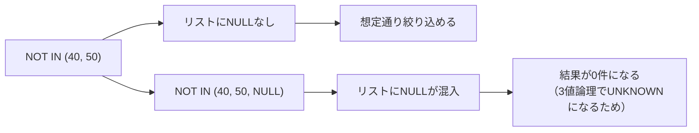

これは私も一度、動的に生成されたSQLの中でリストの一部が意図せずNULLになっていて、「なぜ除外条件を書いているのに結果が0件になるんだ」と原因を探すのに時間がかかったことがあります。`NOT IN` を使う際は、リストにNULLが紛れ込む可能性がないか、一度確認しておくことをおすすめします。

## 参考リンク
https://www.shift-the-oracle.com/sql/group-comparison-condition.html#group-comparison

----
<br><br>

# 問題4-5：複数条件の組み合わせ（AND）
### 難易度：★☆☆☆☆ (Lv.1)
## 問題
HRスキーマにある **`EMPLOYEES`** テーブルから、以下の **すべての条件** を満たす従業員データを取得してください。
なお、レコードの表示順序は問いません。
* **`JOB_ID`** が **'IT_PROG'** である
* **`SALARY`**（給与）が **4,500 より大きい**
* **`MANAGER_ID`** が **102 ではない**

## 期待する結果
| FIRST_NAME | JOB_ID  | SALARY | MANAGER_ID | 
| ---------- | ------- | ------ | ---------- | 
| Bruce      | IT_PROG | 6000   | 103        | 
| David      | IT_PROG | 4800   | 103        | 
| Valli      | IT_PROG | 4800   | 103        | 

## 解答例
```sql
SELECT
    first_name,
    job_id,
    salary,
    manager_id
FROM
    hr.employees
WHERE
        job_id = 'IT_PROG'
    AND salary > 4500
    AND manager_id <> 102
```

## 解説
複数の条件をすべて満たす行を抽出したい場合は、条件の間を `AND` でつなぎます。
```sql
WHERE [条件1]
  AND [条件2]
  AND [条件3]
```
`AND` を重ねるたびに、検索結果のふるいが細かくなっていくイメージです。

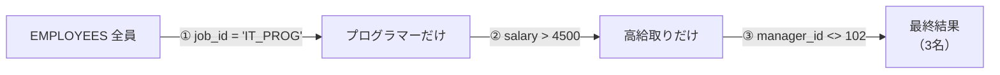

今回の例では、まず `job_id = 'IT_PROG'` でプログラマーだけに絞り、次に `salary > 4500` でその中の高給取りだけを残し、最後に `manager_id <> 102`（Lex De Haanさんの部下ではない人）で絞り込んでいます。

条件が3つになると、書き方にも気を配りたくなります。私は次のように `AND` を行頭に揃えて改行するスタイルをよく使います。

```sql
WHERE
        job_id = 'IT_PROG'
    AND salary > 4500
    AND manager_id <> 102
```
こうしておくと、条件がいくつあるか、何で絞っているかがひと目でわかり、後から条件を追加・削除するときの修正も楽になります。

なお、今回は `AND` だけの単純な組み合わせなので気にする必要はありませんが、`AND` と `OR` を混在させる場合は要注意です。`AND` は `OR` よりも先に処理されるため、意図した順序で評価させたいときはカッコで囲む必要があります（この話は問題4-12で詳しく扱います）。

:::message
### 「WHERE 1=1」に最初に出会ったときの話
以前、あるプロジェクトで見たSQLスクリプトに `WHERE 1 = 1` と書かれているのを見つけて、何のことか全くわからず、書いた本人に「これ何ですか」と聞いたことがあります。

`WHERE 1=1` は、一見無意味（常に真になる条件）に見えますが、実はプログラムで動的にSQL文を組み立てる際の定石として重宝されています。

理由は、SQLを文字列として連結して組み立てるときのロジックをシンプルにできるからです。もし `1=1` がないと、「最初の条件だけは`WHERE`で始めて、2つ目以降は`AND`でつなぐ」という分岐処理が必要になります。
```sql
-- 1=1がない場合、最初の条件かどうかを気にする必要がある
SELECT * FROM users WHERE name = '田中' AND age >= 20;
SELECT * FROM users WHERE age >= 20;  -- 名前の指定がないと書き方が変わってしまう
```
一方「常に`WHERE 1=1`から始める」と決めておけば、以降の条件はすべて機械的に`AND`でつなぐだけで済みます。
```sql
SELECT * FROM users 
WHERE 1=1 
  AND name = '田中' 
  AND age >= 20;
```
もう一つのメリットは、動作確認中に特定の条件だけをコメントアウトしたいときです。`1=1`があれば、行頭にハイフンを足すだけで条件を無効化でき、`WHERE`句自体が壊れる心配がありません。
```sql
SELECT * FROM products
WHERE 1=1
-- AND category = '家電'  <-- ここを消してもWHERE句が壊れない
   AND price <= 5000
```
私自身は、SQLが複雑で条件が3つ以上ある場合や、自分がその場で使うテスト用のスクリプトを書くときには、好んでこの書き方を使っています。逆に、シンプルな1〜2条件のクエリにまで機械的に付けるほどのものでもないと思っています。
:::

----
<br><br>

# 問題4-6：あいまい検索（LIKE演算子）
### 難易度：★☆☆☆☆ (Lv.1)
## 問題
HRスキーマにある **`EMPLOYEES`** テーブルから、**`EMAIL`**（メールアドレス）に **「AB」** という文字列が含まれている従業員のデータを取得してください。
なお、レコードの表示順序は問いません。
## 期待する結果
| FIRST_NAME | EMAIL   | 
| ---------- | ------- | 
| Ellen      | EABEL   | 
| Amit       | ABANDA  | 
| Alexis     | ABULL   | 
| Anthony    | ACABRIO | 
## 解答例
```sql
SELECT
    first_name,
    email
FROM
    hr.employees
WHERE
    email LIKE '%AB%'
```
## 解説
「正確な名前は忘れたけど、途中にあの文字が入っていたはず」という、実務でよくある「うろ覚え」の状態を解決してくれるのが `LIKE` 演算子です。

`=`（等号）の代わりに `LIKE` を使い、ワイルドカードと呼ばれる特殊な記号と組み合わせて検索します。`%`（パーセント）は「0文字以上の任意の文字列」を表す記号です。今回の条件 `'%AB%'` は、「前に何があってもよく、途中にABがあり、後ろに何があってもよい」という意味になり、結果として「どこかにABという文字列が含まれているものすべて」がヒットします。

`%` を置く位置によって検索の性質が変わります。
| パターン | 意味 | 例（一致するもの） |
| :--- | :--- | :--- |
| `'AB%'` | 前方一致（ABで始まる） | ABANDA, ABULL |
| `'%AB'` | 後方一致（ABで終わる） | SCARAB, TAXIAB |
| `'%AB%'` | 部分一致（どこかにABがある） | EABEL, ACABRIO, ABANDA |

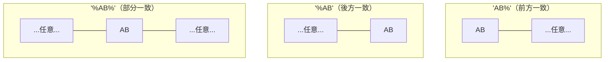

期待する結果にある `ACABRIO` は、一見ABがないように見えますが、3文字目と4文字目（A-**C**-**A**-**B**-R-I-O）にきちんとABが含まれています。こういう「見た目では気づきにくい一致」があるのが、部分一致検索の面白いところです。

もう一つのワイルドカード `_`（アンダースコア）は「任意の1文字」を表します。例えば `LIKE 'A_C'` なら「ABC」や「ADC」はヒットしますが、「ABBC」はヒットしません。こちらは次の問題で詳しく扱います。

実務上の注意点も2つ挙げておきます。

1つ目は大文字・小文字の区別です。Oracleでは引用符 `' '` で囲まれた文字列は大文字・小文字を厳密に区別するため、`LIKE '%ab%'` と小文字で書くと、テーブル内のデータが `ABANDA`（大文字）であってもヒットしません。この対策として、`UPPER(email) LIKE '%AB%'` のように検索前に大文字へ変換して比較するテクニックがよく使われます。

2つ目はパフォーマンスです。`LIKE '%AB%'` のようにパターンの先頭に `%` を付ける中間一致・後方一致は、インデックスが効きにくく、検索速度が大きく落ちることがあります。

| LIKEの種類 | インデックスの効きやすさ |
| :--- | :--- |
| 前方一致 `'AB%'` | ⭕ 効きやすい |
| 後方一致 `'%AB'` | ❌ 効きにくい |
| 部分一致 `'%AB%'` | ❌ 効きにくい |

私が過去に見た事例では、開発環境の数百件のデータでは一瞬で終わっていたクエリが、本番環境の数千万件のデータに対して実行された途端、処理が返ってこなくなったことがありました。原因はまさにこの前方に`%`を置いたLIKE検索です。大量データを扱う際は、可能な限り前方一致（`AB%`）で書けないかを検討するのが安全です。

----
<br><br>

# 問題4-7：特定の文字数とパターンでの検索（LIKE）
### 難易度：★★☆☆☆ (Lv.2)
## 問題文
HRスキーマにある **`EMPLOYEES`** テーブルから、以下の条件をすべて満たす **`EMAIL`**（メールアドレス）を持つ従業員のデータを取得してください。
なお、レコードの表示順序は問いません。
* **「S」** から始まる
* **「S」** で終わる
* **全部で 7 文字** である

## 期待する結果
| FIRST_NAME | EMAIL   | 
| ---------- | ------- | 
| Susan      | SJACOBS | 
| Stephen    | SSTILES | 
| Sigal      | STOBIAS |

## 解答例
```sql
SELECT
    first_name,
    email
FROM
    hr.employees
WHERE
    email LIKE 'S_____S'
```

## 解説
前問の `%` に続いて、もう一つの重要なワイルドカードである `_`（アンダースコア）の出番です。`%` が「0文字以上の任意の文字列」を表すのに対し、`_` は「ちょうど1文字」を表します。この違いが、文字数を厳密に指定したいときに効いてきます。

今回の「Sから始まり、Sで終わる7文字」というパターンを分解すると、次のようになります。

| 位置 | 1文字目 | 2〜6文字目 | 7文字目 |
| :---: | :---: | :---: | :---: |
| パターン | `S` | `_____`（5個） | `S` |
| 文字数 | 1文字 | 5文字 | 1文字 |

合計 1 + 5 + 1 = 7文字になります。

**例：SJACOBS への当てはめ**

| S | J | A | C | O | B | S |
| :-: | :-: | :-: | :-: | :-: | :-: | :-: |
| `S`固定 | `_` | `_` | `_` | `_` | `_` | `S`固定 |

もし `LIKE 'S%S'` と書いてしまうとどうなるでしょうか。`SJACOBS`（7文字）はヒットしますが、`SS`（2文字）や `SUPERSONICS`（11文字）もヒットしてしまいます。`%` は文字数を問わないため、「7文字限定」という条件には使えません。文字数と位置の両方を固定したいときこそ、アンダースコアの出番です。

| ワイルドカード | 意味 | 文字数の制約 |
| :--- | :--- | :--- |
| `%` | 0文字以上の任意の文字列 | なし（何文字でもOK） |
| `_` | ちょうど1文字 | あり（必ず1文字） |

アンダースコアは、フォーマットが決まっているデータの検索にも威力を発揮します。真ん中が3文字の製品コードを探す `LIKE 'AB-___-99'` や、特定月の1日だけを抜き出す `LIKE '2026/__/01'` のような使い方です。

一つ実務的な注意点として、SQLエディタによってはアンダースコアが並ぶと1本の線のように見えてしまい、何個書いたか数えづらいことがあります。私自身、コードレビューで「アンダースコアの数が1個足りない」というミスを見逃しかけたことがあるので、文字数指定が長くなる場合は、代わりに `LENGTH(email) = 7` のような条件を `AND` で組み合わせて、意図を明示的に書くようにしています。

----
<br><br>

# 問題4-8：条件分岐（CASE式）
### 難易度：★★☆☆☆ (Lv.2)
## 問題
HRスキーマにある **`COUNTRIES`** テーブルを使用し、**`REGION_ID`** の値に応じて新しい列 **「地域」** を算出して表示してください。
また、出力するデータは **`COUNTRY_ID` の頭文字が A 〜 C** のものに絞り込んでください。

**【「地域」の分類ルール】**
* `REGION_ID` が **10 または 20**　→　**'欧米'**
* `REGION_ID` が **30 または 50**　→　**'アジア・アフリカ'**
* **上記以外**　→　**'その他'**
#
# 期待する結果
| COUNTRY_ID | COUNTRY_NAME | REGION_ID | 地域             | 
| ---------- | ------------ | --------- | ---------------- | 
| AR         | Argentina    | 20        | 欧米             | 
| AU         | Australia    | 40        | その他           | 
| BE         | Belgium      | 10        | 欧米             | 
| BR         | Brazil       | 20        | 欧米             | 
| CA         | Canada       | 20        | 欧米             | 
| CH         | Switzerland  | 10        | 欧米             | 
| CN         | China        | 30        | アジア・アフリカ | 

## 解答例
```sql:例1：検索 CASE 式
SELECT
    country_id,
    country_name,
    region_id,
    CASE
        WHEN region_id IN ( 10, 20 ) THEN
            '欧米'
        WHEN region_id IN ( 30, 50 ) THEN
            'アジア・アフリカ'
        ELSE
            'その他'
    END AS "地域"
FROM
    hr.countries
WHERE
    country_id BETWEEN 'A' AND 'CZ'
```
```sql:例2：単純 CASE 式
SELECT
    country_id,
    country_name,
    region_id,
    CASE region_id
        WHEN 10 THEN
            '欧米'
        WHEN 20 THEN
            '欧米'
        WHEN 30 THEN
            'アジア・アフリカ'
        WHEN 50 THEN
            'アジア・アフリカ'
        ELSE
            'その他'
    END AS "地域"
FROM
    hr.countries
WHERE
    country_id BETWEEN 'A' AND 'CZ'
```

## 解説
SQLの中で「もし～ならA、そうでなければB」という条件分岐を行うのが `CASE` 式です。これを使うと、テーブルには存在しない新しい分類項目を、クエリの結果として作り出すことができます。

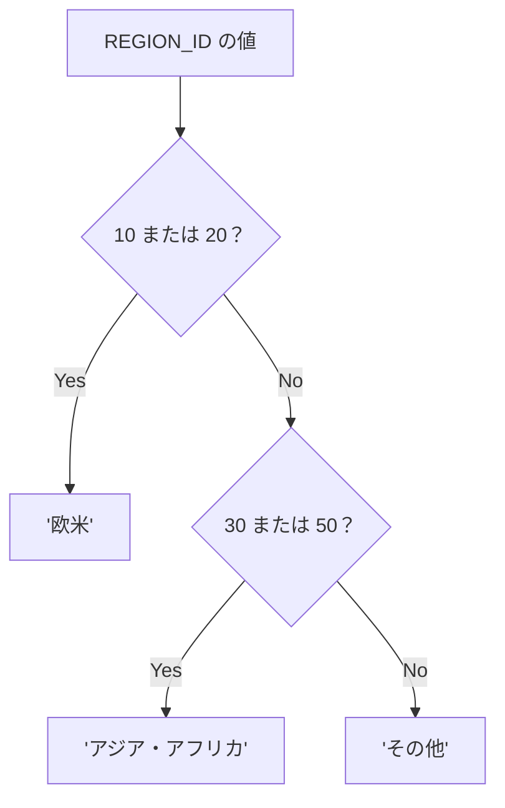

書き方は大きく2種類あります。1つ目の「検索CASE式」（例1）は、`WHEN` の後ろに `IN` や比較演算子など自由な条件式を書ける、最も汎用的な書き方です。
```sql
CASE
    WHEN [条件1] THEN [結果1]
    WHEN [条件2] THEN [結果2]
    ELSE [それ以外の結果]
END
```

2つ目の「単純CASE式」（例2）は、特定の列の値が何であるかを判定する場合に短く書ける方法ですが、`=`（等号）による比較しかできません。
```sql
CASE [列名]
    WHEN [値1] THEN [結果1]
    WHEN [値2] THEN [結果2]
    ...
END
```

| 種類 | 書ける条件 | 向いている場面 |
| :--- | :--- | :--- |
| 検索CASE式 | `IN`、比較演算子など自由な条件式 | 複数値のグループ化、範囲判定など |
| 単純CASE式 | `=`（等号）のみ | 1つの値ごとに単純に振り分けたいとき |

基本的には検索CASE式をおすすめします。`IN` を使って `WHEN region_id IN (10, 20)` とまとめて書けるため、条件が増えても記述量が少なく済みます。

もう一つ、WHERE句の `country_id BETWEEN 'A' AND 'CZ'` という書き方も押さえておきたいポイントです。SQLでは文字列も辞書順で比較されるため、`BETWEEN 'A' AND 'C'` と書いてしまうと、`CA`（Canada）や `CH`（Switzerland）は「C」より後ろの文字列と判定され、対象から漏れてしまいます。そこで「Cで始まるものすべて」を含めるために、Cの中でほぼ最後に来る文字列である `CZ` を上限に設定しています。`LIKE 'A%' OR LIKE 'B%' OR LIKE 'C%'` と書いても同じ結果になりますが、`BETWEEN` の方がすっきり書けます。

CASE式は、年代別の集計（`CASE WHEN age < 20 THEN '10代' ...`）や、売上ランクの分類（`CASE WHEN amount > 1000000 THEN '優良顧客' ...`）、ステータスフラグの日本語変換など、データの「ラベル付け」で幅広く使われます。この先の章でGROUP BYと組み合わせると、集計レポートの幅がさらに広がります。

## 参考リンク
https://www.shift-the-oracle.com/sql/case-when-expression.html

----
<br><br>

# 問題4-9：取得件数の制限（ROWNUM / FETCH FIRST）
### 難易度：★☆☆☆☆ (Lv.1)
## 問題
HRスキーマにある **`EMPLOYEES`** テーブルから、**任意の 5 件** のデータを取得してください。
なお、レコードの表示順序は問いません。

## 期待する結果
| EMPLOYEE_ID | FIRST_NAME | LAST_NAME | 
| ----------- | ---------- | --------- | 
| 199         | Douglas    | Grant     | 
| 200         | Jennifer   | Whalen    | 
| 201         | Michael    | Martinez  | 
| 202         | Pat        | Davis     | 
| 203         | Susan      | Jacobs    | 

※任意の５件が取得できていればOK

## 解答例
```sql:例1：ROWNUMを使用
SELECT
    employee_id,
    first_name,
    last_name
FROM
    hr.employees
WHERE
    ROWNUM <= 5
```
```sql:例2：FETCH FIRSTを使用
SELECT
    employee_id,
    first_name,
    last_name
FROM
    hr.employees
--ORDER BY     -- 通常、ORDER BYをつけますが、任意の５件のため、ここでは敢えてコメントアウトしています
--    employee_id
FETCH FIRST 5 ROWS ONLY
```
## 解説
膨大なデータの中から「とりあえず最初の数件だけ見たい」というときに便利なのが、今回の「取得件数の制限」です。開発中にテーブルの中身をサッと確認したいときや、ランキングの上位だけを表示したいときなど、実務での出番はかなり多いです。

Oracleには件数を制限する書き方が大きく分けて2つあります。

1つ目は `ROWNUM`（疑似列）を使う方法（例1）です。
```sql
WHERE ROWNUM <= 5
```
`ROWNUM` は、抽出された各行に上から順番に振られる仮の番号のようなものです。1行目が見つかると `ROWNUM=1`、2行目は `ROWNUM=2`……とカウントされ、条件（今回は5以下）を満たさなくなった時点で抽出が止まります。

2つ目はOracle 12cから導入された `FETCH FIRST` 句（例2）です。
```sql
FETCH FIRST 5 ROWS ONLY
```
「最初の5行だけ取ってきて」という英語の文章に近い書き方で、`ROWNUM` よりも意図が伝わりやすいのが特徴です。

今回は「任意の5件」なので問題ありませんが、「給与が高い順に5件」のようなTop-Nクエリを作るときは要注意です。

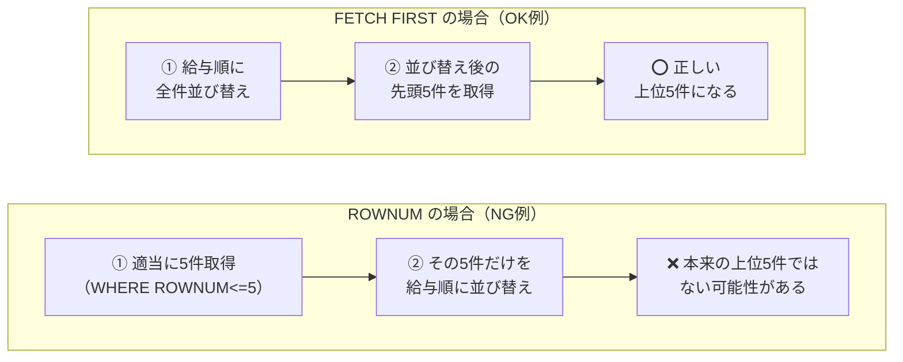

`ROWNUM` は `ORDER BY` よりも先に処理されるため、`WHERE ROWNUM <= 5 ORDER BY salary DESC` と書くと、「適当に5件取ってきてから、その5件だけを並び替える」という意図しない結果になります。正しく並び替えたTop-Nを取るにはサブクエリを使う必要があります。一方 `FETCH FIRST` は `ORDER BY` の後に処理されるため、`ORDER BY salary DESC FETCH FIRST 5 ROWS ONLY` と書くだけで正しく「高給取りトップ5」が取得できます。

| 用途 | おすすめ |
| :--- | :--- |
| 単純な存在確認・サンプリング | `ROWNUM` でも十分 |
| ランキング表示・最新N件のようにORDER BYとセット | `FETCH FIRST` が安全 |

使い分けとしては、単純な存在確認やサンプリングなら `ROWNUM` でも十分ですが、ランキング表示や最新N件の表示のように並び替えとセットになる場面では `FETCH FIRST` の方が事故が少なく、安心して使えます。

なお `ROWNUM` にはもう一つクセがあり、`ROWNUM = 5` や `ROWNUM > 5` と書いてもデータは1件もヒットしません。`ROWNUM` は1番目から順に確定していく性質があるため、いきなり5番目だけを指定するような書き方はできない、と覚えておいてください。

## 参考リンク
https://www.shift-the-oracle.com/sql/column/rownum.html

----
<br><br>

# 問題4-10：指定範囲のデータ取得（OFFSETとFETCH）
### 難易度：★★☆☆☆ (Lv.2)
## 問題
HRスキーマにある **`EMPLOYEES`** テーブルを使用します。
データを **`EMPLOYEE_ID` の昇順** で並べた際、最初の **10 件をスキップ** し、その後に続く **5 件** のデータを取得してください。
> **ヒント**：Webサイトの「次のページを表示」といったページング処理でよく使われる手法です。

## 期待する結果
| EMPLOYEE_ID | FIRST_NAME  | LAST_NAME | 
| ----------- | ----------- | --------- | 
| 110         | John        | Chen      | 
| 111         | Ismael      | Sciarra   | 
| 112         | Jose Manuel | Urman     | 
| 113         | Luis        | Popp      | 
| 114         | Den         | Li        | 

## 解答例
```sql
SELECT
    employee_id,
    first_name,
    last_name
FROM
    hr.employees
ORDER BY
    employee_id
OFFSET 10 ROWS
FETCH NEXT 5 ROWS ONLY
```
## 解説
今回のテーマは「ページング（Pagination）」です。Webサイトの検索結果で「11件目〜15件目を表示する」といった、大量データを分割表示する機能でおなじみのテクニックです。

Oracle 12cから導入された `OFFSET` / `FETCH` を使うと、データの「読み飛ばし」と「取得」をシンプルに書けます。
```sql
SELECT ...
FROM ...
ORDER BY [カラム名]
OFFSET [スキップする行数] ROWS
FETCH NEXT [取得する行数] ROWS ONLY
```

**イメージ図：EMPLOYEE_ID 昇順に並んだ全データのうち、どこを取得するか**

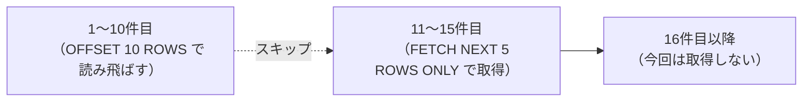

`OFFSET 10 ROWS` は結果セットの先頭から10行分を読み飛ばし、`FETCH NEXT 5 ROWS ONLY` はそこから続く5行だけを取得します。「FIRST」と書いても「NEXT」と書いても動作は同じですが、`OFFSET` と組み合わせる場合は「飛ばした次を取る」というニュアンスで `NEXT` がよく使われます。

ここで一つ、絶対に外せないポイントがあります。**`ORDER BY` 句は必ず指定してください。** SQLでは、並び順を指定しない限りデータの並びは不定、つまり実行のたびに変わる可能性があります。もし `ORDER BY` を省略すると、1ページ目を見たときと2ページ目を見たときで並び順が変わってしまい、「さっき1ページ目にいた人が2ページ目にも出てきた」という重複や、逆にデータが漏れる原因になります。

この構文が登場する前のOracleでは、範囲指定のために3重のサブクエリを書く必要がありました。
```sql
SELECT * FROM (
  SELECT a.*, ROWNUM rnum FROM (
    SELECT * FROM hr.employees ORDER BY employee_id
  ) a WHERE ROWNUM <= 15
) WHERE rnum > 10;
```
これに比べると `OFFSET 10 ROWS FETCH NEXT 5 ROWS ONLY` がいかにシンプルかがわかると思います。私も昔このサブクエリ3重の書き方に苦労した記憶があるので、`OFFSET`/`FETCH`が使えるバージョンでは積極的にこちらを使うようにしています。

プログラムからこのSQLを発行する場合、1ページあたりの表示件数を`SIZE`、見たいページ番号を`PAGE`とすると、次の対応関係になります。

| ページ番号（PAGE） | OFFSET（読み飛ばす行数） | FETCH（取得する行数） |
| :---: | :---: | :---: |
| 1ページ目 | `(1-1) * SIZE = 0` | `SIZE` |
| 2ページ目 | `(2-1) * SIZE = SIZE` | `SIZE` |
| 3ページ目 | `(3-1) * SIZE = SIZE*2` | `SIZE` |

一般化すると、`OFFSET`は`(PAGE - 1) * SIZE`、`FETCH`は`SIZE`という計算式で当てはめるのが一般的です。

なお文法上、`ROWS`（複数形）の代わりに `ROW`（単数形）と書いてもエラーにはなりません。`FETCH NEXT 1 ROW ONLY` のように書きたいときに、英語として自然に見えるようにという配慮のようです。

----
<br><br>

# 問題4-11：特殊文字を含む検索（LIKE ... ESCAPE）
### 難易度：★★☆☆☆ (Lv.2)
## 問題
SHスキーマの **`SUPPLEMENTARY_DEMOGRAPHICS`** テーブルから、コメントに **「%」** という記号が含まれているデータを特定する必要があります。
**`COMMENTS`** 列にパーセント記号（`%`）そのものが文字として含まれているデータを取得してください。対象は **`OCCUPATION`** が「Sales」のものとしてください。
## 期待する結果
| CUST_ID | OCCUPATION | COMMENTS                                                                                      | 
| ------- | ---------- | --------------------------------------------------------------------------------------------- | 
| 102494  | Sales      | Even with the new 10% card, your prices are still too expensive. I am tired of your gimmicks. | 
| 102910  | Sales      | Even with the new 10% card, your prices are still too expensive. I am tired of your gimmicks. | 
| 100793  | Sales      | Even with the new 10% card, your prices are still too expensive. I am tired of your gimmicks. | 
| 100641  | Sales      | Even with the new 10% card, your prices are still too expensive. I am tired of your gimmicks. | 
| 101114  | Sales      | Even with the new 10% card, your prices are still too expensive. I am tired of your gimmicks. | 
| 101203  | Sales      | Even with the new 10% card, your prices are still too expensive. I am tired of your gimmicks. | 
| 101354  | Sales      | Even with the new 10% card, your prices are still too expensive. I am tired of your gimmicks. | 
| 103063  | Sales      | Even with the new 10% card, your prices are still too expensive. I am tired of your gimmicks. | 
| 104429  | Sales      | Even with the new 10% card, your prices are still too expensive. I am tired of your gimmicks. | 
## 解答例
```sql
SELECT
    cust_id,
    occupation,
    comments
FROM
    sh.supplementary_demographics
WHERE
    comments LIKE '%#%%' ESCAPE '#'
    AND occupation = 'Sales'
```

## 解説
通常、`LIKE` 演算子において `%` や `_` はワイルドカードとして扱われます。今回のように「%」という文字そのものを探したい場合は、その特別な意味を打ち消す「エスケープ」という処理が必要になります。

今回のポイントは、この一行に集約されています。
```sql
WHERE comments LIKE '%#%%' ESCAPE '#'
```

`'%#%%'` という文字列は3つのパーツに分解できます。

| パターン内の文字 | 役割 | 意味 |
| :---: | :--- | :--- |
| 1文字目 `%` | ワイルドカード | 任意の0文字以上の文字列（前方） |
| 2文字目 `#` | エスケープ文字 | 直後の文字を「特殊な意味なし」にする合図 |
| 3文字目 `%` | エスケープされた文字 | `#`の直後なので、単なる「%」という文字として扱われる |
| 4文字目 `%` | ワイルドカード | 任意の0文字以上の文字列（後方） |

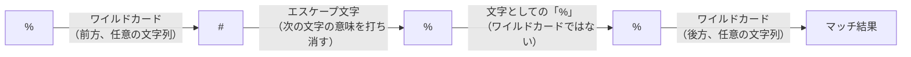

全体としては「前後に何があってもいいから、途中に『%』という文字が含まれているもの」という条件になります。

もし単に `LIKE '%%%'` と書いてしまうと、SQLは「3つのワイルドカードが並んでいる」と解釈してしまい、「任意の3文字以上のデータ」や「空でないデータ」という、意図とは違う検索結果になってしまいます。「ここから先は記号そのものとして扱ってほしい」と合図を送るのが `ESCAPE` 句の役割です。

エスケープ文字として使う記号に決まりはなく、データの中に登場する可能性が低いものであれば `$` や `!` でも構いません。
```sql
LIKE '%!%%' ESCAPE '!'   -- これでも正解
LIKE '%$%%' ESCAPE '$'   -- これでも正解
```
実務では、データの中に含まれる可能性が極めて低い記号（`#` や `^` など）を選ぶのが一般的です。

今回の `%` と同様に `_`（アンダースコア）も「任意の1文字」を表すワイルドカードなので、文字として`_`を探したいときも同じ手法が使えます。例えば「A_01」というIDを検索したい場合、`LIKE 'A#_0%' ESCAPE '#'` のように書きます。これを知らずに `LIKE 'A_01%'` と書いてしまうと、「A-01」や「AB01」まで意図せずヒットしてしまうので注意が必要です。

----
<br><br>

# 問題4-12：論理演算の優先順位（カッコ付きAND/OR）
### 難易度：★☆☆☆☆ (Lv.1)
## 問題
HRスキーマの **`EMPLOYEES`** テーブルから、以下のいずれかの条件を満たす、**給与（`SALARY`）が 10,000 以上**の従業員を取得してください。
* **`JOB_ID`** が **'SA_REP'** である
* **`JOB_ID`** が **'SA_MAN'** である

## 期待する結果
| LAST_NAME | JOB_ID | SALARY | 
| --------- | ------ | ------ | 
| Singh     | SA_MAN | 14000  | 
| Partners  | SA_MAN | 13500  | 
| Errazuriz | SA_MAN | 12000  | 
| Cambrault | SA_MAN | 11000  | 
| Zlotkey   | SA_MAN | 10500  | 
| Tucker    | SA_REP | 10000  | 
| King      | SA_REP | 10000  | 
| Vishney   | SA_REP | 10500  | 
| Ozer      | SA_REP | 11500  | 
| Bloom     | SA_REP | 10000  | 
| Abel      | SA_REP | 11000  | 

## 解答例
```sql
SELECT
    last_name,
    job_id,
    salary
FROM
    hr.employees
WHERE
    (job_id = 'SA_REP' OR job_id = 'SA_MAN')
    AND salary >= 10000
```

## 解説
SQLの `AND` と `OR` には、算数の掛け算と足し算のような優先順位の関係があります。`AND` は掛け算のように先に評価され、`OR` は足し算のようにその後に評価されます。

今回の問題の意図は「（営業担当かマネージャーのどちらか）かつ（給与が1万以上）」という組み合わせです。そのため、先に評価してほしい `OR` の部分をカッコで囲む必要があります。

もしカッコを忘れて次のように書くと、全く別の意味になってしまいます。
```sql
-- 悪い例：カッコがない場合
WHERE job_id = 'SA_REP' OR job_id = 'SA_MAN' AND salary >= 10000
```

**カッコの有無で結果がどう変わるか**

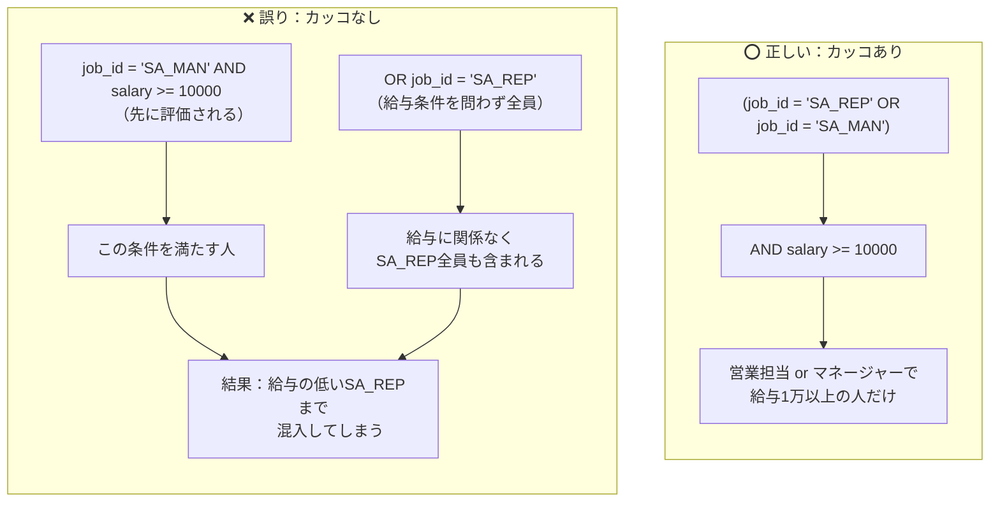

`AND` が優先されるため、これは「（職種がSA_MANで、かつ給与が10,000以上）の人」に加えて、「職種がSA_REPの人を給与に関係なく全員」連れてくる、という意味になります。結果として給与の低いSA_REPまで含まれてしまい、人事評価や給与計算のレポートであれば大きな問題になりかねません。私も一度、レビューでこのカッコ抜けを見逃しかけたことがあり、それ以来「ORとANDが混在するときは機械的にカッコを付ける」をルール化するようにしています。

今回のように同じ列に対して複数の `OR` を並べる場合は、`IN` 句を使う書き方も実務ではよく使われます。
```sql
WHERE job_id IN ('SA_REP', 'SA_MAN')
  AND salary >= 10000
```
カッコの優先順位を気にする必要が減り、対象の職種が5つ、10個と増えてもコードがすっきりするのがメリットです。

条件が3つ、4つと増える複雑なクエリでは、「自分では優先順位を理解していても、あえてカッコを付ける」という習慣が有効です。誰が読んでもどの条件とどの条件がセットなのかが一瞬で伝わるように書くことが、後から修正しやすいクエリにつながります。

---
<br><br>

# 問題4-13：複数値による分岐処理（DECODE関数）
### 難易度：★★☆☆☆ (Lv.2)

## 問題
次の`WITH`句で作成する**`SALES_STAFF`**（営業スタッフの歩合データ）を使用します。

```sql
WITH sales_staff AS (
    SELECT 1001 AS employee_id, 'Tanaka'    AS employee_name, 'SA_REP'   AS job_id, 0.10 AS commission_pct FROM dual UNION ALL
    SELECT 1002, 'Suzuki',    'SA_REP',   0.15 FROM dual UNION ALL
    SELECT 1003, 'Sato',      'SA_MAN',   0.20 FROM dual UNION ALL
    SELECT 1004, 'Takahashi', 'SA_MAN',   0.25 FROM dual UNION ALL
    SELECT 1005, 'Ito',       'SA_MAN',   0.30 FROM dual UNION ALL
    SELECT 1006, 'Watanabe',  'SA_MAN',   0.35 FROM dual UNION ALL
    SELECT 1007, 'Yamamoto',  'SA_MAN',   0.40 FROM dual UNION ALL
    SELECT 1008, 'Nakamura',  'ST_CLERK', NULL FROM dual UNION ALL
    SELECT 1009, 'Kobayashi', 'AD_ASST',  NULL FROM dual UNION ALL
    SELECT 1010, 'Kato',      'SA_REP',   0.12 FROM dual
)
SELECT * FROM sales_staff
```

`COMMISSION_PCT`（歩合率）の値に応じて、以下のルールで「歩合ランク」列を追加してください。**`DECODE`関数**を使って実現してください。

**【歩合ランクの分類ルール】**
* `0.10` または `0.15` → **`'Cランク'`**
* `0.20` または `0.25` → **`'Bランク'`**
* `0.30` または `0.35` → **`'Aランク'`**
* `0.40` → **`'Sランク'`**
* **`NULL`（歩合なし）** → **`'歩合なし'`**
* **上記のいずれにも一致しない** → **`'区分外'`**

なお、レコードは`EMPLOYEE_ID`の昇順で表示してください。

## 期待する結果
| EMPLOYEE_ID | EMPLOYEE_NAME | JOB_ID   | COMMISSION_PCT | 歩合ランク | 
| ----------- | ------------- | -------- | -------------- | ---------- | 
| 1001        | Tanaka        | SA_REP   | 0.1            | Cランク    | 
| 1002        | Suzuki        | SA_REP   | 0.15           | Cランク    | 
| 1003        | Sato          | SA_MAN   | 0.2            | Bランク    | 
| 1004        | Takahashi     | SA_MAN   | 0.25           | Bランク    | 
| 1005        | Ito           | SA_MAN   | 0.3            | Aランク    | 
| 1006        | Watanabe      | SA_MAN   | 0.35           | Aランク    | 
| 1007        | Yamamoto      | SA_MAN   | 0.4            | Sランク    | 
| 1008        | Nakamura      | ST_CLERK |                | 歩合なし   | 
| 1009        | Kobayashi     | AD_ASST  |                | 歩合なし   | 
| 1010        | Kato          | SA_REP   | 0.12           | 区分外     | 

## 解答例
```sql
WITH sales_staff AS (
    SELECT 1001 AS employee_id, 'Tanaka'    AS employee_name, 'SA_REP'   AS job_id, 0.10 AS commission_pct FROM dual UNION ALL
    SELECT 1002, 'Suzuki',    'SA_REP',   0.15 FROM dual UNION ALL
    SELECT 1003, 'Sato',      'SA_MAN',   0.20 FROM dual UNION ALL
    SELECT 1004, 'Takahashi', 'SA_MAN',   0.25 FROM dual UNION ALL
    SELECT 1005, 'Ito',       'SA_MAN',   0.30 FROM dual UNION ALL
    SELECT 1006, 'Watanabe',  'SA_MAN',   0.35 FROM dual UNION ALL
    SELECT 1007, 'Yamamoto',  'SA_MAN',   0.40 FROM dual UNION ALL
    SELECT 1008, 'Nakamura',  'ST_CLERK', NULL FROM dual UNION ALL
    SELECT 1009, 'Kobayashi', 'AD_ASST',  NULL FROM dual UNION ALL
    SELECT 1010, 'Kato',      'SA_REP',   0.12 FROM dual
)
SELECT
    employee_id,
    employee_name,
    job_id,
    commission_pct,
    DECODE(commission_pct,
        NULL, '歩合なし',
        0.10, 'Cランク',
        0.15, 'Cランク',
        0.20, 'Bランク',
        0.25, 'Bランク',
        0.30, 'Aランク',
        0.35, 'Aランク',
        0.40, 'Sランク',
        '区分外'
    ) AS "歩合ランク"
FROM
    sales_staff
ORDER BY
    employee_id
```

## 解説
問題4-8では「CASE式」による条件分岐を扱いましたが、今回はOracle独自の関数である**`DECODE`**を使った分岐処理です。基本構文は次の通りです。

```sql
DECODE(対象の値,
    検索値1, 結果1,
    検索値2, 結果2,
    ...
    デフォルト値
)
```

「対象の値」を先頭から順に「検索値」と比較していき、最初に一致したところの「結果」を返します。どの検索値にも一致しなかった場合は、最後に置いた「デフォルト値」が返されます（省略した場合はNULLになります）。

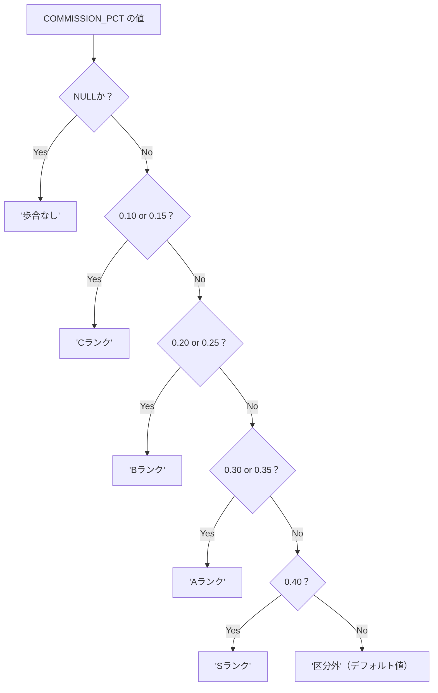

今回の問題文だけを見ると「これはCASE式でも書けるのでは？」と思われるかもしれません。実際その通りで、`DECODE`は等価比較による分岐しかできない分、検索CASE式の完全な下位互換です。しかし今回あえて`DECODE`を扱ったのは、**「NULLの扱いだけは、DECODEとCASE式で挙動が違う」**という、Oracle特有の重要な性質を紹介するためです。

### DECODEはNULLを「値」として比較できる

4-1の解説で「NULLは`=`で判定できない（`col = NULL`は常にUNKNOWN）」と説明しました。ところが`DECODE`だけは特別扱いで、**`DECODE(対象, NULL, 結果, ...)`と書くと、対象がNULLのときにきちんとその行にマッチします。**

```sql
-- 通常の比較では常にUNKNOWNになり、絶対に真にならない
WHERE commission_pct = NULL        -- ✕ 常にヒットしない

-- DECODEの中でだけは、NULL同士を「一致」とみなしてくれる
DECODE(commission_pct, NULL, '歩合なし', ...)  -- ⭕ NULLの行が'歩合なし'になる
```

これは`DECODE`が古くからOracle独自の関数として実装されており、内部的に`=`演算子とは異なる特別な比較ロジック（NULL-safeな等価判定）を持っているためです。今回の期待する結果で、`Nakamura`さんと`Kobayashi`さんの`COMMISSION_PCT`が`NULL`であるにもかかわらず、きちんと「歩合なし」と表示されているのはこの性質のおかげです。

### 同じことを単純CASE式でやろうとすると失敗する

この性質を知らずに、4-8で扱った「単純CASE式」で同じロジックを書こうとすると、意図しない結果になります。

```sql:❌ 失敗例：単純CASE式でNULLを分岐しようとした場合
SELECT
    employee_id,
    commission_pct,
    CASE commission_pct
        WHEN NULL THEN '歩合なし'   -- ← これは絶対にマッチしない
        WHEN 0.10 THEN 'Cランク'
        WHEN 0.15 THEN 'Cランク'
        -- （中略）
        ELSE '区分外'
    END AS "歩合ランク"
FROM
    sales_staff
```

単純CASE式の`WHEN NULL THEN ...`は、内部的に`commission_pct = NULL`という比較として処理されるため、**絶対にTRUEになりません。** 結果として`Nakamura`さんと`Kobayashi`さんは「歩合なし」ではなく、`ELSE`句の「区分外」に落ちてしまいます。一見エラーにもならず、それらしい結果が返ってくるため、テストデータにNULLが含まれていないと気づきにくい、非常に厄介な間違いです。

正しく単純CASE式・検索CASE式でNULLを分岐したい場合は、次のように**`IS NULL`を明示的に条件へ含める**必要があります。

```sql:⭕ 正しい書き方：検索CASE式でNULLを明示的に判定
CASE
    WHEN commission_pct IS NULL THEN '歩合なし'
    WHEN commission_pct IN (0.10, 0.15) THEN 'Cランク'
    WHEN commission_pct IN (0.20, 0.25) THEN 'Bランク'
    WHEN commission_pct IN (0.30, 0.35) THEN 'Aランク'
    WHEN commission_pct = 0.40 THEN 'Sランク'
    ELSE '区分外'
END AS "歩合ランク"
```

| 書き方 | NULLの分岐 | 備考 |
| :--- | :--- | :--- |
| `DECODE(col, NULL, ...)` | ⭕ そのまま書ける | Oracle独自のNULL-safe比較 |
| 単純CASE式 `WHEN NULL THEN ...` | ❌ 絶対にマッチしない | `col = NULL`と同じ扱いになるため |
| 検索CASE式 `WHEN col IS NULL THEN ...` | ⭕ 明示すれば書ける | 一番安全な書き方 |

### DECODEとCASE式、結局どちらを使うべきか

`Kato`さんの`COMMISSION_PCT`（0.12）のように、どのルールにも該当しない値は、`DECODE`・CASE式のどちらでも最後の「デフォルト値／ELSE句」にきちんと落ちて「区分外」になります。この点は両者に差はありません。

| 観点 | DECODE | CASE式 |
| :--- | :--- | :--- |
| 比較条件 | 等価（`=`）のみ | `IN`、`BETWEEN`、`IS NULL`など自由 |
| NULLの扱い | そのまま比較値として書ける | `IS NULL`を明示する必要がある |
| 標準SQLとしての可搬性 | ❌ Oracle独自関数 | ⭕ ANSI標準 |
| 可読性（条件が複雑な場合） | 条件が増えると読みにくい | WHEN句で意味が明確 |

実務では、5-9の解説でも触れた通り、新規に書くコードでは`CASE`式が推奨されます。ただし`DECODE`は今も多くの既存システムに残っており、特に **「NULLを他の値と同列に並べて分岐したい」** というピンポイントな場面では、`IS NULL`を書かずに済む`DECODE`の簡潔さが今でも重宝されることがあります。古いコードを保守する際に「なぜここだけDECODEなんだろう」と思ったら、このNULLの挙動が理由になっているケースが多いです。

:::message
### DECODEのNULL-safe比較は「その他の値同士」には効かない
今回紹介した「NULLも普通の値として比較できる」という性質は、あくまで**NULL同士の比較に限った特例**です。通常の数値・文字列同士の比較（`0.10`と`0.10`が一致するかなど）は、ごく普通の`=`比較と同じ扱いです。「DECODEは中身をすべて曖昧に比較してくれる」という誤解をしないよう注意してください。

なお、この「NULLを値として比較できる」という考え方は、ISO SQL標準にも`IS NOT DISTINCT FROM`という形で存在します（Oracleでは`DECODE`や、19c以降であれば `col1 IS NOT DISTINCT FROM col2` に相当する書き方が可能です）。DECODEの一風変わった挙動は、実は「NULL-safe比較」という一般的なSQLの概念の、Oracle流の実装だったというわけです。
:::

## 参考リンク
https://www.shift-the-oracle.com/sql/functions/decode.html

---
<br><br>

# 問題4-14：複数列の組み合わせでの一致判定（行値式）
### 難易度：★★★☆☆ (Lv.3)

## 問題
HRスキーマにある**`JOB_HISTORY`**テーブルから、次の**`(EMPLOYEE_ID, JOB_ID)`の組み合わせに完全一致する**履歴のみを抽出してください。

**【抽出したい組み合わせ】**
* `EMPLOYEE_ID` が **101** かつ `JOB_ID` が **'AC_ACCOUNT'**
* `EMPLOYEE_ID` が **200** かつ `JOB_ID` が **'AD_ASST'**

> **ヒント**：`EMPLOYEE_ID`のリストと`JOB_ID`のリストをそれぞれ別々に`IN`で指定すると、意図しない組み合わせまで一致してしまいます。1回の`IN`で「複数列のペア」を丸ごと判定する書き方があります。

なお、レコードは`EMPLOYEE_ID`の昇順で表示してください。

## 期待する結果
| EMPLOYEE_ID | START_DATE           | END_DATE             | JOB_ID     | DEPARTMENT_ID | 
| ----------- | -------------------- | -------------------- | ---------- | ------------- | 
| 101         | 2007-09-21T00:00:00Z | 2011-10-27T00:00:00Z | AC_ACCOUNT | 110           | 
| 200         | 2005-09-17T00:00:00Z | 2011-06-17T00:00:00Z | AD_ASST    | 90            | 

## 解答例
```sql
SELECT
    employee_id,
    start_date,
    end_date,
    job_id,
    department_id
FROM
    hr.job_history
WHERE
    (employee_id, job_id) IN (
        (101, 'AC_ACCOUNT'),
        (200, 'AD_ASST')
    )
ORDER BY
    employee_id
```

## 解説
問題4-4で`IN`演算子を扱いましたが、あれは「1つの列」に対する複数候補の指定でした。今回はその発展形で、**複数の列をペアにして、そのペア単位で候補と一致するかどうか**を判定する書き方です。

```sql
WHERE (列1, 列2) IN (
    (値1a, 値1b),
    (値2a, 値2b)
)
```

`(employee_id, job_id)`という「列の組」を作り、その組がカッコで囲まれた候補リストの**どれか1つとセットで完全一致するか**を判定します。これは一般に「行値式（Row Value Constructor）」と呼ばれる書き方です。

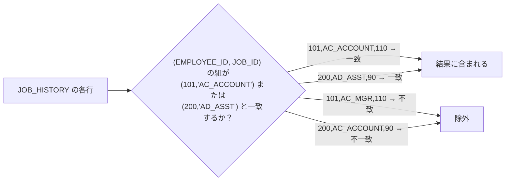

### なぜ列ごとに別々の`IN`ではダメなのか

今回の問題のように「特定の従業員と特定の職種のペア」を狙って抽出したい場合、次のように列ごとに`IN`を分けて書きたくなるかもしれません。しかし、これは**危険な間違い**です。

```sql:❌ NG例：列ごとに別々のINで組み合わせを表現しようとした場合
SELECT
    employee_id,
    job_id,
    department_id
FROM
    hr.job_history
WHERE
        employee_id IN (101, 200)
    AND job_id IN ('AC_ACCOUNT', 'AD_ASST')
```

このNG例を実行すると、次の3行がヒットしてしまいます。

| EMPLOYEE_ID | JOB_ID     | DEPARTMENT_ID | 判定 |
| ----------- | ---------- | ------------- | :---: |
| 101         | AC_ACCOUNT | 110           | ⭕ 本来欲しかった組み合わせ |
| 200         | AD_ASST    | 90            | ⭕ 本来欲しかった組み合わせ |
| 200         | AC_ACCOUNT | 90            | ❌ 意図しない組み合わせが混入 |

`EMPLOYEE_ID`のリストと`JOB_ID`のリストは、それぞれ「独立した候補群」として評価されます。そのため、`employee_id = 200`という行と`job_id = 'AC_ACCOUNT'`という行が、たとえ「本来ペアにしたかった組み合わせ」でなくても、両方の条件をそれぞれ満たしてさえいれば結果に含まれてしまいます。

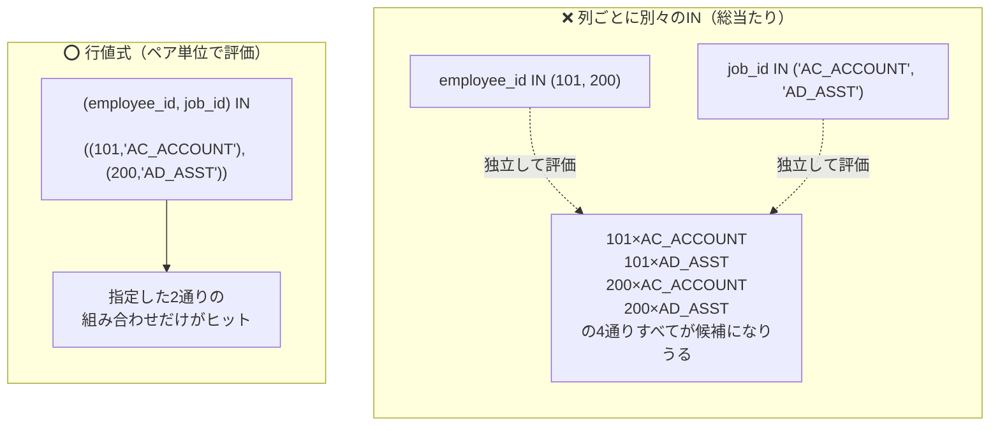

この現象は、`EMPLOYEE_ID`の候補が2件、`JOB_ID`の候補が2件あることで、内部的には最大2×2＝4通りの「掛け合わせ」が許容されてしまうために起こります。今回はたまたま`JOB_HISTORY`の中に`(200, AC_ACCOUNT)`という余計な組み合わせの行が実在したため、意図しないデータが紛れ込みました。候補の数が増えれば増えるほど、この「掛け合わせ」による誤ヒットのリスクは指数関数的に高まります。

一方、行値式`(employee_id, job_id) IN ((101,'AC_ACCOUNT'), (200,'AD_ASST'))`は、リストの中の各要素が最初から「ペアそのもの」として定義されているため、指定した組み合わせ以外は一切マッチしません。

### AND/ORの組み合わせで書き換えることもできる

行値式が使えない古いバージョンのOracleや、他のRDBMSへの移植を考える場合は、`OR`で個々のペアをつなぐ書き方でも同じ結果を再現できます。

```sql:行値式と同じ結果を、ANDとORの組み合わせで表現
SELECT
    employee_id,
    job_id,
    department_id
FROM
    hr.job_history
WHERE
       (employee_id = 101 AND job_id = 'AC_ACCOUNT')
    OR (employee_id = 200 AND job_id = 'AD_ASST')
```

これは問題4-12で扱った「カッコによる`AND`/`OR`の優先順位制御」そのものです。1ペアごとに`(条件1 AND 条件2)`とカッコで束ね、それを`OR`でつなぐことで、行値式と全く同じ「ペア単位の一致判定」を表現しています。

| 書き方 | 可読性 | ペア数が増えたときの記述量 |
| :--- | :--- | :--- |
| 行値式 `(col1, col2) IN ((...),(...))` | ⭕ 意図が一目でわかる | ペアを1行追加するだけで済む |
| `(条件A AND 条件B) OR (条件C AND 条件D)` | △ ペアが増えると長くなる | ペアごとにカッコとORが増えていく |

候補ペアが2〜3件程度ならどちらでも大差ありませんが、10件、20件と増えていく場面では、行値式の方が圧倒的に短く、書き間違いも起きにくくなります。

:::message
### 行値式は左右の「列数」と「型」を揃える必要がある
`(employee_id, job_id) IN ((101, 'AC_ACCOUNT'), ...)`のように、左側のカッコ内の列数と、右側の各候補タプルの要素数は必ず一致させる必要があります。列数が食い違うと`ORA-00913: 値の数が多すぎます`のようなエラーになります。また型についても、`employee_id`（数値）の位置には数値を、`job_id`（文字列）の位置には文字列を置く必要があり、順序を入れ替えると正しく比較されないので注意してください。

なお、この行値式は`WHERE`句の`IN`だけでなく、`=`との組み合わせ（`WHERE (col1, col2) = (SELECT ...)`）や、後の章で扱うサブクエリとの比較でも登場します。「複数列をひとまとまりの単位として扱う」という考え方は、この先も繰り返し出てくる重要な概念です。
:::

## 参考リンク
https://www.shift-the-oracle.com/sql/group-comparison-condition.html#group-comparison

---
<br><br>

# 問題4-15：条件によって判定基準を変える（CASE式をWHERE句で使う）
### 難易度：★★★☆☆ (Lv.3)

## 問題
次の`WITH`句で作成する**`EMPLOYEE_EVAL`**（従業員評価用データ）を使用します。

```sql
WITH employee_eval AS (
    SELECT 1  AS employee_id, 'Tanaka'    AS last_name, 'SA_REP'   AS job_id, 9500  AS salary FROM dual UNION ALL
    SELECT 2, 'Suzuki',    'SA_REP',   10500 FROM dual UNION ALL
    SELECT 3, 'Sato',      'SA_MAN',   15000 FROM dual UNION ALL
    SELECT 4, 'Ito',       'IT_PROG',  4800  FROM dual UNION ALL
    SELECT 5, 'Watanabe',  'IT_PROG',  6000  FROM dual UNION ALL
    SELECT 6, 'Yamamoto',  'ST_CLERK', 2800  FROM dual UNION ALL
    SELECT 7, 'Nakamura',  'ST_CLERK', 3200  FROM dual UNION ALL
    SELECT 8, 'Kobayashi', 'AD_ASST',  2900  FROM dual UNION ALL
    SELECT 9, 'Kato',      'MK_REP',   3500  FROM dual UNION ALL
    SELECT 10, 'Kimura',   'SA_MAN',   9800  FROM dual
)
SELECT * FROM employee_eval
```

このデータから、**「昇給推薦の対象となる従業員」** を抽出してください。ただし、給与の基準（ボーダーライン）は職種のカテゴリによって異なります。

**【推薦基準（SALARYがこの金額以上）】**
* `JOB_ID` が **'SA_'で始まる**（営業系）　→　**`10000`以上**
* `JOB_ID` が **'IT_'で始まる**（技術系）　→　**`5000`以上**
* **上記以外**（その他の職種）　→　**`3000`以上**

なお、レコードは`EMPLOYEE_ID`の昇順で表示してください。

## 期待する結果
| EMPLOYEE_ID | LAST_NAME | JOB_ID   | SALARY | 
| ----------- | --------- | -------- | ------ | 
| 2           | Suzuki    | SA_REP   | 10500  | 
| 3           | Sato      | SA_MAN   | 15000  | 
| 5           | Watanabe  | IT_PROG  | 6000   | 
| 7           | Nakamura  | ST_CLERK | 3200   | 
| 9           | Kato      | MK_REP   | 3500   | 

## 解答例
```sql
WITH employee_eval AS (
    SELECT 1  AS employee_id, 'Tanaka'    AS last_name, 'SA_REP'   AS job_id, 9500  AS salary FROM dual UNION ALL
    SELECT 2, 'Suzuki',    'SA_REP',   10500 FROM dual UNION ALL
    SELECT 3, 'Sato',      'SA_MAN',   15000 FROM dual UNION ALL
    SELECT 4, 'Ito',       'IT_PROG',  4800  FROM dual UNION ALL
    SELECT 5, 'Watanabe',  'IT_PROG',  6000  FROM dual UNION ALL
    SELECT 6, 'Yamamoto',  'ST_CLERK', 2800  FROM dual UNION ALL
    SELECT 7, 'Nakamura',  'ST_CLERK', 3200  FROM dual UNION ALL
    SELECT 8, 'Kobayashi', 'AD_ASST',  2900  FROM dual UNION ALL
    SELECT 9, 'Kato',      'MK_REP',   3500  FROM dual UNION ALL
    SELECT 10, 'Kimura',   'SA_MAN',   9800  FROM dual
)
SELECT
    employee_id,
    last_name,
    job_id,
    salary
FROM
    employee_eval
WHERE
    salary >= CASE
        WHEN job_id LIKE 'SA_%' THEN 10000
        WHEN job_id LIKE 'IT_%' THEN 5000
        ELSE 3000
    END
ORDER BY
    employee_id
```

## 解説
問題4-8では、`CASE`式を**「SELECT句で新しい列（表示用のラベル）を作る」**という使い方で紹介しました。今回はその応用編として、**`CASE`式を`WHERE`句の中で、比較する「値そのもの」を動的に作り出すために使う**という使い方を扱います。

今回の業務ルールは、「職種によって、昇給推薦のボーダーラインとなる給与額そのものが変わる」というものです。これは`salary >= 数値`という単純な比較の右側（判定基準値）を、行ごとに切り替える必要がある、という点がポイントです。

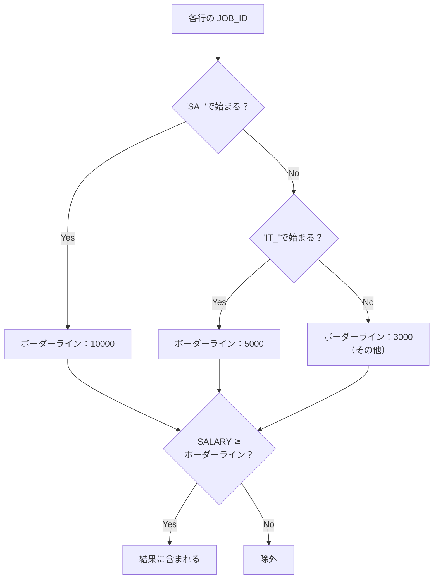

解答例の`CASE`式は、`SELECT`句ではなく`salary >=`の右側、つまり**比較演算子のオペランド（比較対象の値）の位置**に書かれています。

```sql
WHERE
    salary >= CASE
        WHEN job_id LIKE 'SA_%' THEN 10000
        WHEN job_id LIKE 'IT_%' THEN 5000
        ELSE 3000
    END
```

`CASE`式は「値を返す式」であるという本質を思い出してください。`SELECT`句だけでなく、`WHERE`句・`ORDER BY`句・関数の引数など、「値を書ける場所」ならどこにでも埋め込むことができます。今回はその性質を利用し、「行ごとに異なる基準値」を`CASE`式でその場で計算し、それを`salary`と比較しています。

### なぜAND/ORの組み合わせでは書きにくいのか

同じ業務ルールを、問題4-12で扱った「カッコによるAND/OR」だけで表現しようとすると、次のように条件がかなり冗長になります。

```sql:AND/ORの組み合わせで同じ結果を再現する場合
SELECT
    employee_id,
    last_name,
    job_id,
    salary
FROM
    employee_eval
WHERE
       (job_id LIKE 'SA_%' AND salary >= 10000)
    OR (job_id LIKE 'IT_%' AND salary >= 5000)
    OR (job_id NOT LIKE 'SA_%' AND job_id NOT LIKE 'IT_%' AND salary >= 3000)
ORDER BY
    employee_id
```

動作としては解答例と全く同じ結果になりますが、`job_id`に関する条件（`LIKE 'SA_%'`など）を、カテゴリの数だけ**繰り返し書く**必要があります。特に3つ目の「その他」の条件では、「SA_でもIT_でもない」という否定条件をわざわざ書き下さなければならず、カテゴリが増えるたびにこの否定条件の羅列がどんどん長くなっていきます。

| 書き方 | 職種条件の重複 | カテゴリ追加時の修正量 |
| :--- | :--- | :--- |
| `CASE`式でボーダーラインを算出 | なし（`job_id`の判定は1回だけ） | `WHEN`を1行追加するだけ |
| `AND`/`OR`の組み合わせ | あり（カテゴリの数だけ`job_id`条件を書く） | 新しい`OR`ブロックを丸ごと追加 |

`CASE`式を使う書き方では、「`job_id`から基準値を導く」というロジックと、「導いた基準値と`salary`を比較する」というロジックがきれいに分離されているため、カテゴリが4つ、5つと増えても`WHEN`句を追加するだけで対応できます。

### Oracleでは「CASE式が直接TRUE/FALSEを返す」わけではない

ここで注意したいのが、他のプログラミング言語の感覚で次のように書きたくなるケースです。

```sql:❌ これは書けない（構文エラー）
WHERE
    CASE
        WHEN job_id LIKE 'SA_%' THEN salary >= 10000
        WHEN job_id LIKE 'IT_%' THEN salary >= 5000
        ELSE salary >= 3000
    END
```

Oracle SQLの`CASE`式は、あくまで**「値」を返す式**であり、TRUE/FALSEという真偽値そのものを`THEN`句の結果として直接使うことはできません（`salary >= 10000`という比較式自体を`THEN`の結果に置くことは、SQLの構文上サポートされていません）。そのため今回の解答例のように、`CASE`式には**「比較したい値（今回は基準となる給与額）」を返させ**、その結果を`WHERE`句の比較演算子で評価する、という組み立て方が基本になります。

もし真偽値そのものを`CASE`式で扱いたい場合は、次のように「合格なら1、不合格なら0」といった値を返させ、それを`=`で比較する形に変換する必要があります。

```sql:参考：真偽値を1/0に置き換えて判定する書き方
WHERE
    1 = CASE
        WHEN job_id LIKE 'SA_%'  AND salary >= 10000 THEN 1
        WHEN job_id LIKE 'IT_%'  AND salary >= 5000  THEN 1
        WHEN job_id NOT LIKE 'SA_%' AND job_id NOT LIKE 'IT_%' AND salary >= 3000 THEN 1
        ELSE 0
    END
```

ただしこの書き方は、結局`AND`/`OR`版と同じように`job_id`の判定を繰り返す必要が出てきてしまうため、今回のような「基準値そのものを切り替えたい」ケースでは、解答例のように**CASE式に基準値を返させて比較演算子の相手にする**方が、圧倒的にシンプルで見通しの良いSQLになります。

期待する結果を見ると、`Kimura`さん（SA_MAN、給与9800）は、営業系の基準である10000に届かないため除外されています。一方`Ito`さん（IT_PROG、給与4800）も、技術系の基準である5000に届かず除外されています。カテゴリごとに異なる基準値がきちんと適用されていることが確認できます。

:::message
### CASE式は「値が必要な場所」ならどこでも使える万能選手
今回はWHERE句での活用でしたが、同じ考え方は`ORDER BY`句（並び替えの基準を条件によって変える）や、`GROUP BY`句（集計の単位を条件によってまとめる）でも応用できます。例えば「職種によって並び替えの優先順位を変えたい」場合、`ORDER BY CASE WHEN job_id LIKE 'SA_%' THEN 1 ELSE 2 END, salary DESC`のような書き方が可能です。「CASE式は値を返す式であり、値を置ける場所ならどこにでも埋め込める」という発想を持っておくと、複雑な業務ルールをSQL一本で表現できる場面がぐっと広がります。
:::

## 参考リンク
https://www.shift-the-oracle.com/sql/case-when-expression.html
