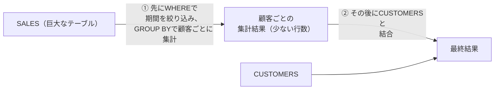
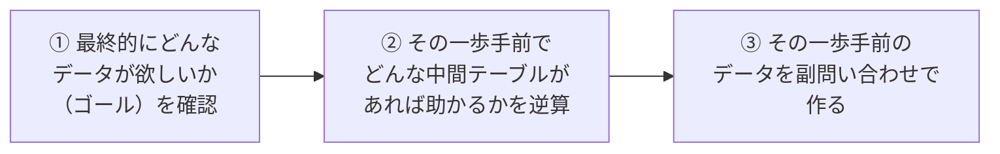
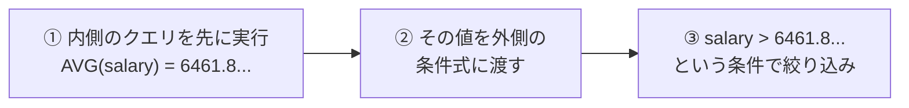
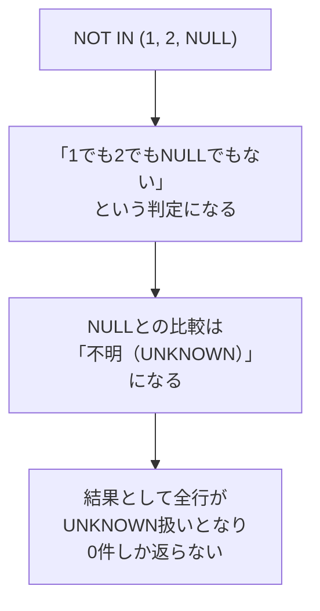
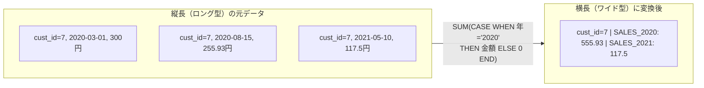
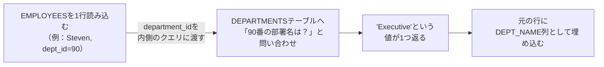
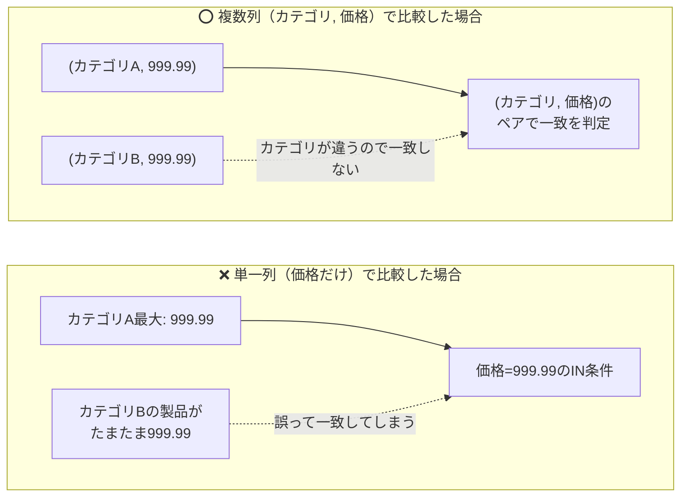
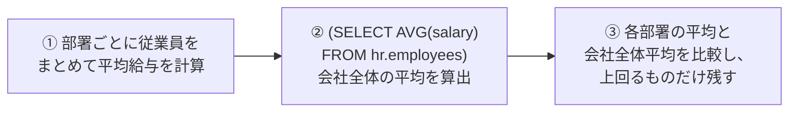
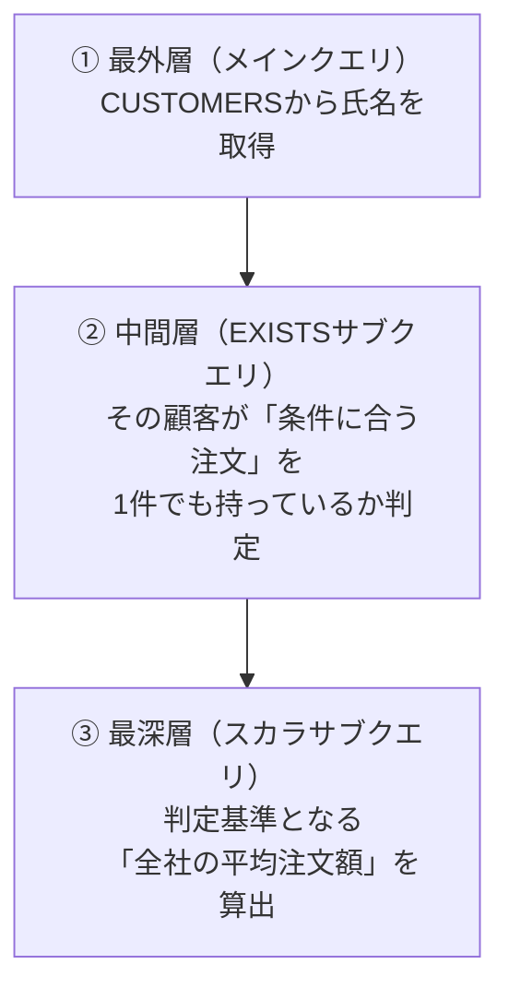

# 問題9-1：副問い合わせの基本
### 難易度：★★☆☆☆ (Lv.2)
## 問題
SHスキーマの`SALES`テーブルと`CUSTOMERS`テーブルを使用して、**2019年1月1日から2019年3月31日まで**の期間における、顧客ごとの売上集計データを取得してください。
集計および抽出にあたっては、以下のルールに従ってください。

**【抽出・編集ルール】**
* **集計内容**：顧客ごとに「合計売上個数（`QUANTITY_SOLD`の合計）」と「合計売上金額（`AMOUNT_SOLD`の合計）」を算出すること。
* **抽出条件**：上記期間内の合計売上個数が**70個を超える**顧客のみを表示すること。
* **NAME**：`CUST_FIRST_NAME`と`CUST_LAST_NAME`を半角スペースで結合して表示すること。
* 結果の表示順は問いません。

## 期待する結果
| CUST_ID | NAME             | SUM_QUANTITY_SOLD | SUM_AMOUNT_SOLD |
| ------- | ----------------- | ------------------- | ----------------- |
| 12783   | Rose Lehman        | 80                   | 33676.07           |
| 12539   | Lucas Gilboy        | 72                   | 9647.59             |
| 25244   | Rufus Rokus         | 74                   | 9710.03             |
| 2760    | Luana Crisp         | 72                   | 9652.08             |
| 5696    | Sabrina Pack        | 71                   | 9595.62             |
| 2791    | Madra Leary         | 74                   | 5194.77             |
| 9038    | Marvel Bakerman     | 72                   | 45103.24            |
| 3720    | Michael Lincoln     | 73                   | 9675.79             |
| 1255    | Sally Filbert       | 74                   | 9710.03             |

## 解答例
```sql:例1：インラインビューを使用
SELECT
    c.cust_id,
    c.cust_first_name || ' ' || cust_last_name AS name,
    sa.sum_quantity_sold,
    sa.sum_amount_sold
FROM
    sh.customers c
    INNER JOIN (
        SELECT
            cust_id,
            SUM(quantity_sold) AS sum_quantity_sold,
            SUM(amount_sold)   AS sum_amount_sold
        FROM
            sh.sales
        WHERE
            time_id BETWEEN DATE '2019-01-01' 
                        AND DATE '2019-03-31'
        GROUP BY
            cust_id
    ) sa ON c.cust_id = sa.cust_id
WHERE
    sa.sum_quantity_sold > 70
```
```sql:例2：WITH句を使用
WITH sa AS (
    SELECT
        cust_id,
        SUM(quantity_sold) AS sum_quantity_sold,
        SUM(amount_sold)   AS sum_amount_sold
    FROM
        sh.sales
    WHERE
        time_id BETWEEN DATE '2019-01-01' 
                    AND DATE '2019-03-31'
    GROUP BY
        cust_id
)
SELECT
    c.cust_id,
    c.cust_first_name || ' ' || cust_last_name AS name,
    sa.sum_quantity_sold,
    sa.sum_amount_sold
FROM
    sh.customers c
    INNER JOIN sa 
       ON c.cust_id = sa.cust_id
WHERE
    sa.sum_quantity_sold > 70
```

## 解説
SQLの「入れ子構造」、副問い合わせ（サブクエリ）の領域に入ります。これまでは1つのテーブル、あるいは単純な結合を扱ってきましたが、ここからは「クエリの結果を、あたかも1つのテーブルのように扱う」という発想が必要になります。これができるようになると、SQLで表現できる範囲が大きく広がります。

今回のポイントは、「売上の集計（合計）」と「顧客名の結合」をどのタイミングで行うか、という点にあります。



例1のインラインビューは、`FROM`句の中に直接`SELECT`文を書く手法です。
```sql
FROM sh.customers c INNER JOIN ( SELECT ... FROM sh.sales ... ) sa
```
データベース内部で、まずカッコの中の集計処理（2019年1Qの売上計算）を行い、その結果を`sa`という名前の一時的な仮想テーブルとして展開し、その後にその仮想テーブルと顧客テーブルを結合します。その場限りの使い捨ての集計に向いており、クエリの流れが上から下へと直感的に読めます。

例2のWITH句（CTE：共通テーブル式）は、クエリの冒頭で仮想テーブルを定義しておく手法です。
```sql
WITH sa AS ( SELECT ... FROM sh.sales ... ) SELECT ... FROM sh.customers c INNER JOIN sa ...
```
最初に`sa`という「部品」を作っておき、後続のメインクエリでその部品を呼び出します。

| 方式 | 書く場所 | 特徴 |
| :--- | :--- | :--- |
| インラインビュー（例1） | `FROM`句の中に直接書く | 使い捨ての集計に向く。上から下へ直感的に読める |
| WITH句（例2） | クエリの冒頭で先に部品を定義 | 複雑になるほど構造を把握しやすく、何度も再利用できる |

複雑なクエリになるほど、インラインビューよりもWITH句の方が構造を把握しやすくなりますし、同じ部品をクエリ内で何度も再利用できるのも強みです。

「最初から`SALES`と`CUSTOMERS`を結合して、最後に`GROUP BY`すればいいのでは」と思うかもしれません。もちろんそれも可能ですが、今回の解答例のように「先に集計してから結合する」ことには理由があります。`SALES`テーブルのような巨大なデータ（ファクトテーブル）を扱う場合、先に結合してしまうと「大量の行×大量の行」の重い処理が発生します。カッコの中で先に「2019年の3ヶ月分だけ」に絞り込み、かつ「顧客IDごとに1行」に集約してから結合することで、データベースの作業量を抑えることができます。

現代の現場では、WITH句（例2）が好まれる傾向にあります。複数の場所で同じ集計結果を使いたいとき、WITH句なら一度書くだけで済みます。また、カッコが何重にもなるインラインビューは「どのカッコがどこで閉じているか」を見失いやすいのに対し、WITH句は「部品」ごとに独立しているため、テストや動作確認がしやすいです。

:::message
### 副問い合わせの理解は、SQL初心者脱却への第一歩
SQLを自在に操るための鍵は、単に構文を覚えることではなく、「思考のプロセス」を切り替えることにあります。

SQLの真髄は、「ある表を加工して、また別の新しい表を作り出す」というプロセスの繰り返しにあります。この「塊（集合）」を直感的に捉える感覚こそが、いわゆる「右脳思考」です。副問い合わせは、このプロセスを具現化するための重要なツールと言えます。

SQLを難しく感じてしまう原因の多くは、「一度のクエリで一気に最終的な答えを出そうとする」ことにあると考えています。初心者ほど複雑な条件を一つの塊に詰め込もうとして途中で混乱しがちですが、副問い合わせを活用し「まずはこの中間データ（表）を作ろう」と段階を踏むことで、一つ一つのステップがシンプルになります。

仮想的な途中結果（オレンジ色）を得るために使用するのが副問い合わせのイメージです。インプットは左の緑色の4テーブル、アウトプットは右の最終結果（FINAL OUTPUT）です。


複雑な問題にぶつかったときは、次の手順で考えてみてください。



まず最終的にどのようなデータが欲しいかというゴールを確認し、その結果を得るために一歩手前でどんな中間テーブルがあれば助かるかを逆算し、その一歩手前のデータを副問い合わせで作る、という3段階です。「ゴールに辿り着くためのパーツを副問い合わせで作っていく」という発想を持つだけで、SQLのハードルはぐっと下がります。
:::

## 参考リンク
https://www.shift-the-oracle.com/sql/with.html

----
<br><br>

# 問題9-2：単一行サブクエリ
### 難易度：★★☆☆☆ (Lv.2)
## 問題
HRスキーマの`EMPLOYEES`テーブルより、**全従業員の平均給与よりも高い給与**を受け取っている従業員を取得してください。
ただし、抽出対象は2018年1月1日以降に入社した（`HIRE_DATE`）従業員に限定します。

**【出力・編集ルール】**
* **EMPLOYEE_NAME**：`FIRST_NAME`と`LAST_NAME`を半角スペースで結合して表示すること。
* **SALARY**：給与を表示すること。
* 結果は給与（`SALARY`）の降順で表示すること。

## 期待する結果
| EMPLOYEE_NAME   | SALARY |
| ---------------- | ------ |
| Eleni Zlotkey     | 10500   |
| Mattea Marvins    | 7200    |
| David Lee         | 6800    |

## 解答例
```sql
SELECT
    first_name  || ' ' || last_name AS employee_name,
    salary
FROM
    hr.employees
WHERE
    salary > (
        SELECT
            AVG(salary)
        FROM
            hr.employees
        )
    AND hire_date >= DATE'2018-01-01'
ORDER BY
    salary DESC;
```

## 解説
サブクエリの中でも基本的で使用頻度の高い「単一行サブクエリ（Single-row Subquery）」の解説です。「平均より売上が高い商品」「最も高い給与の社員」など、動的に決まる基準値を使ってデータを絞り込みたいときに欠かせないテクニックです。

その名の通り、カッコ内のクエリ（内側のクエリ）が「たった1つの値（1行1列）」だけを返すサブクエリのことです。
```sql
WHERE salary > ( SELECT AVG(salary) FROM employees )
```



データベースは、まず内側のサブクエリを実行して`hr.employees`全体の平均給与を計算し（例：6461.8...）、その結果を外側のクエリに渡し、渡された値をもとに「`salary > 6461.8...`」という条件で最終的な絞り込みを行う、という順序で処理します。

初心者がやってしまいがちなミスとして、次のような書き方があります。
```sql
-- これはエラーになります
WHERE salary > AVG(salary)
```
`WHERE`句の中で直接「集計関数（`AVG`や`SUM`）」を使うことはできないというルールがあるためです。`WHERE`句は1行ずつチェックするための場所ですが、`AVG`関数は全行を計算しないと結果が出ません。「全行計算し終わった結果」を「1行ずつのチェック」に持ち込むために、サブクエリというワンクッションが必要になるわけです。

単一行サブクエリは「1つの値」として扱われるため、`>`, `<`, `=`, `<>`, `>=`, `<=`といった通常の比較演算子がすべて使えます。ただし、もし内側のクエリが「部署ごとの平均」などで複数行を返してしまった場合、単一行比較演算子はエラーを出して停止します。その場合は複数行サブクエリ（`IN`や`ANY`）の出番になりますが、これは次の問題で扱います。

期待する結果を見ると、平均（約6,461円）を超えており、かつ2018年以降に入社した3名が抽出されています。Eleni Zlotkeyさんの10,500円など、平均値を大幅に上回る「高給与かつ新しい世代」のメンバーが特定できました。

----
<br><br>

# 問題9-3：複数行サブクエリ
### 難易度：★★☆☆☆ (Lv.2)
## 問題
HRスキーマの`EMPLOYEES`テーブルより、部門名（`DEPARTMENT_NAME`）が「**IT**」である部門に所属する従業員を取得してください。
部門名は`DEPARTMENTS`テーブルに格納されているため、サブクエリを用いて対象となる部門IDを特定してください。

**【出力・編集ルール】**
* **EMPLOYEE_NAME**：`FIRST_NAME`と`LAST_NAME`を半角スペースで結合して表示すること。
* 部門IDが不明な（NULLの）従業員は含めないこと。
* 結果の表示順は問いません。

## 期待する結果
| EMPLOYEE_NAME    | JOB_ID  | DEPARTMENT_ID |
| ----------------- | ------- | -------------- |
| Alexander James    | IT_PROG | 60              |
| Bruce Miller        | IT_PROG | 60              |
| David Williams      | IT_PROG | 60              |
| Valli Jackson       | IT_PROG | 60              |
| Diana Nguyen        | IT_PROG | 60              |

## 解答例
```sql:例1：INを使用
SELECT
    first_name || ' ' || last_name AS employee_name,
    job_id,
    department_id
FROM
    hr.employees
WHERE
    department_id IN (
        SELECT
            department_id
        FROM
            hr.departments
        WHERE
            department_name = 'IT'
    )
```
```sql:例2：EXISTSを使用
SELECT
    first_name || ' ' || last_name AS employee_name,
    job_id,
    department_id
FROM
    hr.employees e
WHERE
    EXISTS (
        SELECT
            'X'
        FROM
            hr.departments d
        WHERE
            e.department_id = d.department_id
            AND department_name = 'IT'
    )
```

## 解説
今回は「複数行サブクエリ」です。前問は結果が1つだけ（平均値など）でしたが、今回は「IT部門のID」という、複数返ってくる可能性があるリストを相手にする方法です。別々のテーブルにある情報を組み合わせて絞り込む際、実務で頻繁に使うテクニックです。

サブクエリが複数の値を返す場合、通常の`=`ではなく`IN`を使います（例1）。
```sql
WHERE department_id IN ( SELECT department_id FROM ... )
```
イメージとしては、内側のクエリが「IT部門のIDは60です」というリスト（名簿）を作成し、外側のクエリが「この従業員のIDは、名簿の中に載っているかな」と一人ずつ照合していく動きです。


もう1つの書き方が`EXISTS`演算子（例2）で、こちらは相関サブクエリという少し中級者向けの構文になります。
```sql
WHERE EXISTS ( SELECT 'X' FROM ... WHERE e.dept_id = d.dept_id )
```
内側のクエリの中に`e.department_id`（外側のテーブルの列）が登場しています。このように「外側と内側がリンクしている」状態を相関サブクエリと呼びます。`EXISTS`は「条件に合うデータが1件でも存在するかどうか」だけを判定します。外側の`EMPLOYEES`を1行読み込み、その人の`department_id`を内側に持ち込んで「IT部門で、かつこのIDのデータはある？」と`DEPARTMENTS`テーブルに聞きに行き、1件でも見つかった瞬間に「合格（TRUE）」として、その従業員を表示する、という流れです。


`EXISTS`は中身の内容（値）には興味がなく、単に「行があるかないか」だけを見ます。そのため、列名を書く代わりに`'X'`や`1`などの適当な文字を書くのがよく見る慣習です。

現場での判断基準を整理します。

| 観点 | `IN` | `EXISTS` |
| :--- | :--- | :--- |
| 向いている場面 | 内側（サブクエリ）の結果が少ないとき | 外側が巨大で内側でインデックスが効くとき |
| 読みやすさ | 直感的（リストの中にあるか） | やや中級者向け（相関サブクエリの理解が必要） |
| NULLの扱い | サブクエリにNULLが含まれると危険（問題9-4で詳述） | NULLの影響を受けにくく安全 |

内側（サブクエリ）の結果が少ないときは`IN`が直感的で読みやすく、外側が巨大で内側でインデックスが効くときは`EXISTS`が有利になりやすいです。またNULLの扱いにも違いがあり、`IN`はサブクエリにNULLが含まれると結果が空になる危険がありますが（詳しくは問題9-4で扱います）、`EXISTS`はNULLの影響を受けにくく安全です。

----
<br><br>

# 問題9-4：差分の抽出（NOT演算子）
### 難易度：★★☆☆☆ (Lv.2)
## 問題
SHスキーマの`CUSTOMERS`テーブルより、**2021年に一度も商品を購入していない顧客**（離脱者）を特定してください。
具体的には、`SALES`テーブルの`TIME_ID`に2021年のデータが一度も存在しない顧客が対象となります。

**【抽出条件】**
* 1924年生まれ（`CUST_YEAR_OF_BIRTH` = 1924）の顧客に限定して取得してください。
* サブクエリ（`NOT IN` または `NOT EXISTS`）を使用して、「売上データが存在しないこと」を判定してください。
* 結果の表示順は問いません。

## 期待する結果
| CUST_ID | CUST_GENDER | CUST_YEAR_OF_BIRTH |
| ------- | ------------ | -------------------- |
| 102011  | M            | 1924                  |
| 102258  | F            | 1924                  |
| 103921  | M            | 1924                  |
| 102555  | M            | 1924                  |
| 101256  | M            | 1924                  |

## 解答例
```sql:例1：INを使用
SELECT
    cust_id,
    cust_gender,
    cust_year_of_birth
FROM
    sh.customers
WHERE
    cust_id NOT IN (
        SELECT
            cust_id
        FROM
            sh.sales
        WHERE
            time_id BETWEEN DATE'2021-01-01' AND DATE'2021-12-31'
    )
    AND cust_year_of_birth = 1924;
```
```sql:例2：EXISTSを使用
SELECT
    cust_id,
    cust_gender,
    cust_year_of_birth
FROM
    sh.customers
WHERE
    NOT EXISTS (
        SELECT
            'X'
        FROM
            sh.sales
        WHERE
                sh.sales.cust_id = sh.customers.cust_id
            AND time_id BETWEEN DATE'2021-01-01' AND DATE'2021-12-31'
    )
        AND cust_year_of_birth = 1924;
```

## 解説
今回は「何かがないこと」を条件にする「差分の抽出（アンチジョイン）」のテクニックです。「昨日は買ったのに今日は買っていない人」「キャンペーン対象外の人」など、マーケティング分析ではこの「引き算」の考え方がよく登場します。

`NOT IN`（例1）は「リストの中に存在しないこと」を確認します。サブクエリが「2021年に購入した人のIDリスト」をまず作り、外側のクエリが自分の`cust_id`がそのリストに載っていないことをチェックする、という流れです。

`NOT EXISTS`（例2）は「条件に合う行が1行も見つからないこと」を確認します。外側の顧客を1人ずつ見て、その人のIDをサブクエリに持ち込み、`SALES`テーブルに「この人の2021年の購入履歴」を探しに行き、見つからなかった（空だった）場合のみ合格とします。

ここで、実務でつまずきやすい「NOT INの落とし穴」に触れておきます。もしサブクエリ（`SALES`テーブル）の`cust_id`に1つでもNULLが含まれていた場合、`NOT IN`は1行も結果を返さなくなります。



これは、SQLの論理で`NOT IN (1, 2, NULL)`が「1でも2でもNULLでもない」となり、NULLとの比較が「不明（UNKNOWN）」になってしまうためです。一方`NOT EXISTS`はNULLが含まれていても正しく動作します。

| 方式 | サブクエリにNULLが混入した場合の挙動 |
| :--- | :--- |
| `NOT IN` | ❌ 結果が0件になる（危険） |
| `NOT EXISTS` | ⭕ 正しく動作する（安全） |

これは私も一度、集計結果が急に0件になって原因を探ったところ、サブクエリ対象のカラムにNULLが混入していたことがあり、それ以来「NOT INを使うときは対象列にNULLがないか確認する」という癖がつきました。実務では、より安全な`NOT EXISTS`が好まれる傾向にあります。

現代のOracleであれば、どちらで書いても内部的に近い実行計画に変換されることが多いですが、迷ったら`NOT EXISTS`を選んでおくと、バグの少ないコードになりやすいです。

期待する結果を見ると、1924年生まれ（かなりのご高齢）の顧客の中で、2021年に一度も購入がなかった方々がリストアップされています。こうしたデータは、「この年代のお客様向けのサービスが最近利用されていないのでは」といったビジネス上の気づきにつながります。

## 参考リンク
https://www.shift-the-oracle.com/sql/exists-condition.html
https://www.shift-the-oracle.com/inside/in-exists-difference.html

----
<br><br>

# 【完全版】問題9-5：特定データの取得（購入額が減少した顧客）
### 難易度：★★★☆☆ (Lv.3)
## 問題
SHスキーマの`SALES`テーブルより、過去（2020年）と比較して購入額が減少している顧客を特定してください。
具体的には、以下のすべての条件を満たす顧客データを取得してください。なお、結果の表示順は問いません。

**【抽出条件】**
* 顧客ID（`CUST_ID`）が**50より小さい**こと。
* **2021年の合計購入額**が、**2020年の合計購入額**よりも下回っていること。
* **2021年の合計購入額**が0より大きいこと（まだ完全に離脱していない顧客）。

**【算出方法のヒント】**
* 年別の購入額を算出するには、`SUM`関数の中で`CASE`式を使用（条件付き集計）し、年度ごとの売上を列として持たせると比較が容易になります。

## 期待する結果
| CUST_ID | SALES_2020 | SALES_2021 |
| ------- | ----------- | ----------- |
| 7       | 555.93       | 117.5        |
| 27      | 29541.89     | 2849.03      |
| 32      | 15877.21     | 112.89       |
| 33      | 997.57       | 102.62       |
| 49      | 705.37       | 302.56       |
| 19      | 662.74       | 18.9         |
| 20      | 7263.94      | 77.98        |

## 解答例
```sql:例1：インラインビューを使用
SELECT 
    v.cust_id,
    v.sales_2020,
    v.sales_2021
FROM (
    -- 顧客ごとに年別の売上を横持ちにする集計用ビュー（副問合せ）
    SELECT 
        cust_id,
        SUM(CASE WHEN to_char(time_id, 'YYYY') = '2020' 
                    THEN amount_sold ELSE 0 END) as sales_2020,
        SUM(CASE WHEN to_char(time_id, 'YYYY') = '2021' 
                    THEN amount_sold ELSE 0 END) as sales_2021
    FROM sh.sales
    GROUP BY cust_id
) v
WHERE v.sales_2020 > v.sales_2021
  AND v.sales_2021 > 0
  AND v.cust_id < 50
```
```sql:例2：WITH句を使用
WITH v AS (
    SELECT 
        cust_id,
        SUM(CASE WHEN to_char(time_id, 'YYYY') = '2020' 
                    THEN amount_sold ELSE 0 END) AS sales_2020,
        SUM(CASE WHEN to_char(time_id, 'YYYY') = '2021' 
                    THEN amount_sold ELSE 0 END) AS sales_2021
    FROM sh.sales
    GROUP BY cust_id
)
SELECT 
    v.cust_id,
    v.sales_2020,
    v.sales_2021
FROM v
WHERE v.sales_2020 > v.sales_2021
  AND v.sales_2021 > 0
  AND v.cust_id < 50
```

## 解説
この問題は、実務の「データ分析」で頻繁に遭遇するパターンの1つです。単にデータを出すだけでなく、「2020年と2021年の数値を比較して、その差に意味を見出す」という、ビジネスインテリジェンス（BI）の基礎が詰まっています。

このクエリの核となるのは、サブクエリ（仮想テーブル`v`）の中にある`SUM(CASE ...)`です。通常、売上データは「1行1伝票」の縦長（ロング型）データですが、比較を行うためには「2020年の列」と「2021年の列」を持つ横長（ワイド型）データに変換する必要があります。



```sql
SUM(CASE WHEN to_char(time_id, 'YYYY') = '2020' THEN amount_sold ELSE 0 END)
```
1行ずつ「これは2020年のデータか」を判定し、2020年なら金額を、そうでなければ0を出し、それらを顧客ごとに合計します。これにより、本来は別々の行にある「去年の数字」と「今年の数字」を、同じ行の隣同士に並べることができます。この操作は「ピボット（旋回）」と呼ばれます。

一点補足しておくと、`TO_CHAR(time_id, 'YYYY')`のように日付列に関数をかけると、そのカラムに貼られたインデックスが効きにくくなる、という話は問題7-8や問題8-2でも触れました。本来であれば`time_id BETWEEN DATE '2020-01-01' AND DATE '2020-12-31'`のような範囲指定の方がインデックスを活かしやすく、SALESテーブルのような巨大なファクトテーブルではその差が大きく出ることがあります。今回は「条件付き集計でピボットする」という考え方を分かりやすく示すためにTO_CHARを使っていますが、実運用でパフォーマンスが問題になる場合は、範囲指定に書き換えることを検討してみてください。

「サブクエリを使わずに`HAVING`句で書けないの」と思うかもしれません。実は`HAVING`句でも書けないことはないのですが、今回のように「計算した結果同士をさらに比較する（`sales_2020 > sales_2021`）」場合、一度サブクエリで「確定した値」としてテーブル化してしまった方がSQLが読みやすく、ミスも少なくなります。内側（仮想テーブル`v`）で複雑な条件から「去年の売上」と「今年の売上」というシンプルな表を作り、外側ではそのシンプルな表に対して普通の`WHERE`句で条件をかける。この「複雑なことは内側でやり、外側はシンプルに保つ」という設計は、複雑なクエリを整理するときの基本方針として覚えておくと役立ちます。

ビジネス視点での絞り込み条件も見ておきましょう。

| 条件 | ビジネス上の意味 |
| :--- | :--- |
| `v.sales_2021 > 0` | 完全に辞めてしまった人（離脱客）を除外する |
| `v.sales_2020 > v.sales_2021` | 買ってはいるが勢いが落ちている（要注意客）を特定する |

`v.sales_2021 > 0`という条件を入れることで、「完全に辞めてしまった人（離脱客）」を除外し、「まだ買ってくれているが、勢いが落ちている人（要注意客）」だけを特定しています。`v.sales_2020 > v.sales_2021`は減少の度合いをチェックする条件です。

CUST_ID = 27の顧客を見てください。2020年は29,541も買っていた優良客なのに、2021年は2,849まで激減しています。もしあなたがこのショップの店長なら、このデータを見た瞬間に「何か不満があったのか」「競合他社に流れたのか」と、個別のフォローを検討したくなるはずです。

実務では、この後に「減少率」を計算したり顧客名と結合したりと、さらに処理が続くことが多いです。そのため、ロジックを独立させて管理できるWITH句（例2）を好んで使う人が多い印象です。

----
<br><br>

# 問題9-6：最新の履歴取得
### 難易度：★★☆☆☆ (Lv.2)
## 問題
SHスキーマの`SALES`テーブルより、**顧客（`CUST_ID` = 2）が最後に購入した日**の販売明細を取得してください。

**【ポイント】**
* 最初にサブクエリで対象顧客の「最大の `TIME_ID`（最新の購入日）」を特定します。
* その日付に一致する明細をメインクエリで抽出してください。
* 最新の日に複数の購入レコードがある場合は、そのすべてを表示します。
* 結果の表示順は問いません。

## 期待する結果
| CUST_ID | TIME_ID               | PROD_ID | AMOUNT_SOLD |
| ------- | ----------------------- | ------- | ------------ |
| 2       | 2022-09-05T00:00:00Z    | 18      | 1499.06       |
| 2       | 2022-09-05T00:00:00Z    | 18      | 1491.56       |
| 2       | 2022-09-05T00:00:00Z    | 18      | 1204.26       |

## 解答例
```sql:例1：MAXを使用
SELECT 
    s.cust_id, 
    s.time_id, 
    s.prod_id, 
    s.amount_sold
FROM sh.sales s
WHERE 1=1
  AND s.time_id = (
    SELECT MAX(time_id) 
      FROM sh.sales sub 
     WHERE sub.cust_id = s.cust_id
  )
AND s.cust_id = 2;
```
```sql:例2：ALLを使用
SELECT 
    s.cust_id, 
    s.time_id, 
    s.prod_id, 
    s.amount_sold
FROM sh.sales s
WHERE 1=1
  AND s.time_id >= ALL(
    SELECT time_id 
      FROM sh.sales sub 
     WHERE sub.cust_id = s.cust_id
  )
  AND s.cust_id = 2;
```

## 解説
実務では「最新の住所を取得したい」「最後に発注した時の単価を知りたい」といった場面が多く、この「最新履歴の特定」はSQLの中でも定番のテクニックです。今回のポイントは、サブクエリを使って「最新の日付」という基準を動的に作り出している点です。

解答例のどちらにも共通しているのは、内側のクエリが外側のクエリと連動している相関サブクエリであることです。

MAX関数を使う方法（例1）では、内側で顧客ごとに「一番大きい（新しい）日付」を1つだけ探し出し、外側でその日付にぴったり一致する行だけを表示します。もっとも直感的で、多くのエンジニアが好んで使う書き方です。
```sql
WHERE s.time_id = (SELECT MAX(time_id) FROM ... WHERE sub.cust_id = s.cust_id)
```

ALL演算子を使う方法（例2）は、少し発想が異なります。
```sql
WHERE s.time_id >= ALL (SELECT time_id FROM ... WHERE sub.cust_id = s.cust_id)
```
`>= ALL`は「サブクエリが返すすべての値以上であること」を意味します。「自分自身の日付が、その顧客の全購入日の中で誰よりも大きい（あるいは等しい）」＝「一番新しい」という論理になります。

| 方式 | 考え方 |
| :--- | :--- |
| `= (SELECT MAX(...))`（例1） | 「一番大きい値」を1つ求めて、それと一致する行を探す |
| `>= ALL (SELECT ...)`（例2） | 「他のすべての値以上である」ことを条件にする |

解答例に出てくる`WHERE 1=1`は、第4章でも触れた通り、プログラムで動的にSQLを組み立てる際に条件をすべて`AND`でつなげられるようにする定石です。条件をコメントアウトして一時的に無効化する際にも、どこを消しても`WHERE`句自体が壊れにくいというメリットがあります。

期待する結果を見ると、2022年9月5日のデータが3行並んでいます。「最新の1日」を特定しても、その日に複数の商品（`prod_id`=18が3つ）を購入している場合、このように「その日の詳細すべて」が正しく取得されるのが、このクエリの良いところです。

なお、今回のサブクエリ以外にも、`RANK()`や`ROW_NUMBER()`といった分析関数を使って「日付の新しい順に1, 2, 3...と番号を振り、1番だけを取る」という書き方もあります。Oracle 12c以降ではこちらの方がパフォーマンスが良い場合も多いので、こうした分析関数を学んだ後に、同じ問題を別のアプローチで解いてみるのもよい練習になると思います。

----
<br><br>

# 問題9-7：スカラ・サブクエリ
### 難易度：★★☆☆☆ (Lv.2)
## 問題
HRスキーマの`EMPLOYEES`テーブルより、`EMPLOYEE_ID`が110より小さい従業員の「名前（`NAME`）」と「給与（`SALARY`）」を取得してください。
あわせて、その従業員が所属する「部門名（`DEPARTMENTS`テーブルの`DEPARTMENT_NAME`）」も取得してください。なお、結果の表示順は問いません。

**【ポイント】**
* SELECT句の中で別のテーブル（`DEPARTMENTS`）を参照する**スカラ・サブクエリ**を使用して部門名を取得してください。
* 比較として、通常の内部結合（INNER JOIN）を用いた記述方法も確認してください。

## 期待する結果
| EMPLOYEE_ID | NAME             | SALARY | DEPT_NAME |
| ----------- | ----------------- | ------ | ---------- |
| 100         | Steven King        | 24000   | Executive   |
| 101         | Neena Yang         | 17000   | Executive   |
| 102         | Lex Garcia         | 17000   | Executive   |
| 103         | Alexander James    | 9000    | IT          |
| 104         | Bruce Miller       | 6000    | IT          |
| 105         | David Williams     | 4800    | IT          |
| 106         | Valli Jackson      | 4800    | IT          |
| 107         | Diana Nguyen       | 4200    | IT          |
| 108         | Nancy Gruenberg    | 12008   | Finance     |
| 109         | Daniel Faviet      | 9000    | Finance     |

## 解答例
```sql:例1：スカラ・サブクエリを使用
SELECT
    e.employee_id,
    e.first_name || ' ' || e.last_name AS name,
    e.salary,
    -- ここで部署テーブル(departments)から部署名を1つだけSELECTする
    (SELECT d.department_name 
     FROM hr.departments d 
     WHERE d.department_id = e.department_id) AS dept_name
FROM
    hr.employees e
WHERE
    e.employee_id < 110
```
```sql:例2：結合を使用
SELECT
    e.employee_id,
    e.first_name || ' ' || e.last_name AS name,
    e.salary,
    d.department_name AS dept_name
FROM
    hr.employees e
    INNER JOIN hr.departments d
       ON d.department_id = e.department_id
WHERE
    e.employee_id < 110
```

## 解説
今回はユニークな存在である「スカラ・サブクエリ（Scalar Subquery）」の解説です。これまでのサブクエリは`FROM`句や`WHERE`句で使ってきましたが、今回は`SELECT`句の中で「1つの列」として扱うという手法です。

`SELECT`句の中にカッコ書きでクエリを埋め込みます。このサブクエリは「1行1列（1つの値）」だけを返さなければならないという厳格なルールがあるため、「スカラ（単一値）」と呼ばれます。



データベースは、メインの`EMPLOYEES`テーブルを1行読み込むたびに、その人の`department_id`を使って「部署名は何？」と内側のクエリ（DEPARTMENTSテーブル）へ一瞬だけ聞きに行きます。従業員100番（Steven）を読み込み、その人の`department_id = 90`を内側に渡し、内側が90番に対応する`Executive`を探し出して列に埋める、というルックアップを1行ずつ繰り返すイメージです。

解答例2のように、同じ結果は`INNER JOIN`でも得られます。

| 方式 | 向いている場面 | 注意点 |
| :--- | :--- | :--- |
| スカラ・サブクエリ（例1） | 1つだけ情報を足したい。メインの行数を変えたくない | 大量データでは行ごとの検索になり遅くなりがち |
| `INNER JOIN`（例2） | 複数の列を足したい | 結合条件によっては行数が増減する可能性がある |

スカラ・サブクエリは「1つだけ情報を足したい」ときに直感的に書けて、メインのテーブルの行数が絶対に変わらないという安心感があります。一方JOINは複数の列を足す場合に適しており、結合条件によっては行数が増減する可能性がある点には注意が必要です。パフォーマンス面では、スカラ・サブクエリは大量データで「行ごとに検索」するため遅くなりがちですが、JOINは大量データを一気に処理するのに向いています。

「わざわざJOINでテーブルを繋げるほどでもないけど、ちょっとだけ別のテーブルから値を持ってきたい」という場面で重宝します。今回のようにIDに対応する名前（部署名や商品名）を添えるだけの場合や、各従業員の横に「全社の平均給与」を表示して比較したい場合などです。
```sql
SELECT name, salary, (SELECT AVG(salary) FROM employees) as avg_sal FROM employees
```

スカラ・サブクエリには「値は1つ（スカラ）」という制約があります。もし内側の`SELECT d.department_name`の結果が、ある`department_id`に対して2件以上ヒットしてしまった場合、Oracleは「列の箱に1つの値を入れたいのに、2つ来た」という状態になり、実行エラー（ORA-01427）で停止します。これを防ぐには、必ず`WHERE`句で主キー（ID）などを指定して1件に絞り込む必要があります。

期待する結果を見ると、Steven Kingさんは`Executive`、Alexander Jamesさんは`IT`と、各従業員の横に所属部署名が添えられています。`EMPLOYEES`テーブルには部署IDしかありませんが、スカラ・サブクエリという「窓」から別のテーブルを覗き見ることで、追加の情報を表示できています。

----
<br><br>

# 問題9-8：複数列サブクエリ（製品マスタの最高値抽出）
### 難易度：★★★☆☆ (Lv.3)
## 問題
マーケティング部門より、各製品カテゴリ（`PROD_CATEGORY`）における「最も定価（`PROD_LIST_PRICE`）が高い製品」を特定してほしいとの依頼がありました。
`SH.PRODUCTS` テーブルを使用し、複数列サブクエリ（ペア比較）を用いて、各カテゴリで最高値を持つ製品の情報を抽出してください。

**【抽出・編集ルール】**
* サブクエリで「カテゴリ」ごとの「最大定価」を算出すること。
* メインクエリで「カテゴリ」と「定価」の**ペアが一致する**行を抽出すること。
* 表示項目：`PROD_CATEGORY`, `PROD_NAME`, `PROD_LIST_PRICE`
* 結果はカテゴリ名の昇順で表示してください。

## 期待する結果
| PROD_CATEGORY      | PROD_NAME                                | PROD_LIST_PRICE |
| -------------------- | ------------------------------------------ | ----------------- |
| Baseball              | Pitching Machine and Batting Cage Combo    | 999.99              |
| Cricket                | English Willow Cricket Bat                  | 199.99              |
| Golf                   | Lithium Electric Golf Caddy                 | 1299.99             |
| Soccer / Football      | Soccer Goal - Official                      | 1099.99             |
| Tennis                 | Match Used Autograph Racquet                | 599.99              |

## 解答例
```sql
SELECT
    p.prod_category,
    p.prod_name,
    p.prod_list_price
FROM
    sh.products p
WHERE
    -- カテゴリと定価の組み合わせ(ペア)で判定
    (p.prod_category, p.prod_list_price) IN (
        SELECT
            sub_p.prod_category,
            MAX(sub_p.prod_list_price)
        FROM
            sh.products sub_p
        GROUP BY
            sub_p.prod_category
    )
ORDER BY
    p.prod_category
```

## 解説
「複数列サブクエリ」は、実務で「グループごとの最大値や最新値に紐付く、他の列（今回の場合は製品名など）を取得したい」ときによく使われるテクニックです。

もしこれを`PROD_LIST_PRICE IN (SELECT MAX(...) ...)`のように単一列だけで比較してしまうと、「カテゴリAの最大価格」と偶然同じ価格を持つ「カテゴリBの製品」まで抽出されてしまうリスクがあります。



`(category, price)`というペアで比較することで、「そのカテゴリにおける、その最大価格」という一貫性を保証しています。

「カテゴリごとの最大値リストを作り、それに合致する行をメインテーブルから探す」という思考プロセスが、そのままSQLの構文（`IN`句の中身）に反映されているため、後から見直したときに意図が伝わりやすいのもこの書き方のメリットです。

このクエリを書く際に意識しておきたいのが「もし、同じカテゴリ内に最大価格の製品が2つあったらどうなるか」という点です。今回の複数列サブクエリの場合、最大価格の製品が複数あれば、そのすべてが抽出されます。マーケティング資料として「最高値製品リスト」を作るならこれで正解ですが、「必ず1カテゴリ1製品に絞りたい」という場合は、製品ID（`PROD_ID`）でさらに絞り込むか、分析関数（`ROW_NUMBER`など）への切り替えを検討することになります。

----
<br><br>

# 問題9-9：集計結果のフィルタリング（HAVING句での副問い合わせ）
### 難易度：★★★☆☆ (Lv.3)
## 問題
経営層から「部門ごとの平均給与」のレポートを求められています。ただし、今回は単に平均を出すだけでなく、「会社全体の平均給与よりも、部門平均が高い部門」だけをピックアップして、給与水準の高い部門を特定してください。
HRスキーマの `EMPLOYEES` テーブルおよび `DEPARTMENTS` テーブルより、以下の条件で取得してください。
* 部門名（`DEPARTMENT_NAME`）ごとに平均給与を算出する。
* その部門平均が、**全従業員の平均給与**を上回っている部門のみを表示する。
* 結果は「部門名」と「部門平均給与（四捨五入して整数）」を表示し、平均給与の高い順に並べてください。

## 期待する結果
| DEPARTMENT_NAME   | DEPT_AVG_SALARY |
| ------------------- | ----------------- |
| Executive             | 19333               |
| Accounting            | 10154               |
| Public Relations      | 10000               |
| Marketing             | 9500                |
| Sales                 | 8956                |
| Finance               | 8601                |
| Human Resources       | 6500                |

## 解答例
```sql
SELECT
    d.department_name,
    ROUND(AVG(e.salary)) AS dept_avg_salary
FROM
    hr.departments d
    INNER JOIN hr.employees e ON d.department_id = e.department_id
GROUP BY
    d.department_name
HAVING
    AVG(e.salary) > (SELECT AVG(salary) FROM hr.employees)
ORDER BY
    dept_avg_salary DESC
```

## 解説
「部門ごとの平均」を出しつつ、比較対象として「会社全体の平均」を裏側で計算してぶつける、二段構えのロジックです。

このクエリのポイントは、`HAVING`句の中で副問い合わせを使っている点です。



処理の順序としては、まず部署ごとに従業員をまとめて部署ごとの平均給与を計算し、続いて`(SELECT AVG(salary) FROM hr.employees)`が実行されて会社全体の平均値（例：6462ドル）が算出され、最後に各部署の平均とこの6462を比較して大きいものだけを残す、という流れになります。

「絞り込み」といえば`WHERE`ですが、今回は`WHERE`は使えません。

| 句 | 適用されるタイミング | 今回で言えば |
| :--- | :--- | :--- |
| `WHERE` | グループ化される前の行 | 個人の給与を判定するならこちら |
| `HAVING` | グループ化された後の集計結果 | 部署の平均を判定するならこちら |

「平均が〜以上の部署」のように集計関数（`AVG`, `SUM`, `COUNT`など）の結果を条件にしたいときは、必ず`HAVING`を使います。

`HAVING`の右側には、単なる数値だけでなく、今回のようにカッコで囲んだクエリを書くこともできます。これにより、「平均が8000以上の部署」といった固定の条件ではなく、「データが変わるたびに基準値も変わる動的な条件」を作ることができます。

今回のクエリは書き方としてはスマートですが、実務でデータ量が数千万件を超えるような場合は、副問い合わせを何度も実行させないための工夫（共通テーブル式`WITH`句の使用など）を検討することもあります。

----
<br><br>

# 【完全版】問題9-10：条件付きフラグ立て（CASE式内での副問い合わせ）
### 難易度：★★★★☆ (Lv.4)
## 問題
顧客管理システム（OEスキーマ）において、顧客の一覧を表示する際、その顧客が「優良顧客」かどうかを判定するフラグを動的に表示したいと考えています。
今回は、「全注文の平均合計額（ORDER_TOTAL）を超える注文を、一度でも行ったことがある顧客」を `'VIP'`、そうでない顧客を `'Standard'` と定義して表示してください。
OEスキーマの `CUSTOMERS` テーブルより、`CUSTOMER_ID`が120以下の人に対して、以下の項目を取得してください。
* `CUSTOMER_ID`
* `CUST_FIRST_NAME` || ' ' || `CUST_LAST_NAME` (氏名)
* **CLASS**: 以下のルールで判定
  * その顧客が `OE.ORDERS` テーブルに「全体の平均 `ORDER_TOTAL`」を超える注文を1件でも持っていれば `'VIP'`。
  * 持っていなければ `'Standard'`。
    
* 結果は、氏名の昇順で表示してください。
## 期待する結果
| CUSTOMER_ID | FULL_NAME             | CLASS     |
| ----------- | ----------------------- | ---------- |
| 111         | Charlie Pacino           | Standard    |
| 110         | Charlie Sutherland       | Standard    |
| 109         | Christian Cage           | VIP         |
| 101         | Constantin Welles        | VIP         |
| 113         | Daniel Costner           | Standard    |
| 120         | Diane Higgins            | Standard    |
| 114         | Dianne Derek             | Standard    |
| 116         | Geraldine Martin         | Standard    |
| 115         | Geraldine Schneider      | Standard    |
| 117         | Guillaume Edwards        | VIP         |
| 112         | Guillaume Jackson        | Standard    |
| 102         | Harrison Pacino          | VIP         |
| 104         | Harrison Sutherland      | VIP         |
| 103         | Manisha Taylor           | Standard    |
| 107         | Matthias Cruise          | VIP         |
| 106         | Matthias Hannah          | Standard    |
| 105         | Matthias MacGraw         | Standard    |
| 119         | Maurice Hasan            | Standard    |
| 118         | Maurice Mahoney          | VIP         |
| 108         | Meenakshi Mason          | VIP         |

## 解答例
```sql
SELECT
    c.customer_id,
    c.cust_first_name || ' ' || c.cust_last_name AS full_name,
    CASE 
        WHEN EXISTS (
            SELECT 1 
            FROM oe.orders o 
            WHERE o.customer_id = c.customer_id
              AND o.order_total > (SELECT AVG(order_total) FROM oe.orders)
        ) THEN 'VIP'
        ELSE 'Standard'
    END AS class
FROM
    oe.customers c
WHERE
    c.customer_id <= 120
ORDER BY
    full_name
```

## 解説
今回の問題は、サブクエリを入れ子（ネスト）にして使う、テクニカルで実用性の高い内容です。「顧客一覧を出したいけれど、その判定基準に別テーブル（注文）の統計データ（平均値）が必要」という、実務で要件が重なりがちなパターンです。解答例の構成を3つの階層に分けて解説します。

このクエリは、3つのクエリが重なって動いています。



最外層（メインクエリ）は`CUSTOMERS`テーブルから氏名を取得し、中間層（EXISTSサブクエリ）はその顧客が「条件に合う注文」を1件でも持っているか判定し、最深層（スカラサブクエリ）は判定基準となる「全社の平均注文額」を算出します。

今回のポイントは「1件でも持っていればVIP」という点で、`EXISTS`は条件に合う行が1件見つかった瞬間に探索を終了して`TRUE`を返す特性があります。全注文をカウントしたり合計したりする必要がないため、大量の注文データがある場合に効率よく動きます。

中間層の`WHERE o.customer_id = c.customer_id`の部分が相関サブクエリです。外側の顧客テーブル（`c`）のIDを内側の注文テーブル（`o`）に渡すことで、「今見ているその人だけの注文データ」をピンポイントでチェックできます。一方、最深層の`(SELECT AVG(order_total) FROM oe.orders)`は非相関サブクエリで、外側のデータに依存せず単独で「全社平均」を計算します。Oracleはこの値を一度だけ計算してキャッシュしてくれるため、全顧客に対して何度も平均を出し直すような無駄は発生しません。

| サブクエリの種類 | 例 | 外側への依存 |
| :--- | :--- | :--- |
| 相関サブクエリ | `WHERE o.customer_id = c.customer_id` | あり（外側の行ごとに再計算） |
| 非相関サブクエリ | `(SELECT AVG(order_total) FROM oe.orders)` | なし（一度だけ計算してキャッシュ） |

同じ結果を`LEFT JOIN`と`GROUP BY`で作ることも可能ですが、今回のような`CASE + EXISTS`のパターンが選ばれることも多いです。JOIN形式は集計値をそのまま列として表示したい場合に強い一方、EXISTS形式は「いるか・いないか」のフラグを立てるだけなら、重複（1人が複数注文しているケース）を気にしなくて済むため、比較的バグが起きにくいという特徴があります。顧客数が非常に多く注文数も膨大な場合、`JOIN`してから`DISTINCT`や`GROUP BY`で行を絞り込むよりも、`EXISTS`でさっと判定を終わらせる方が速いケースが多いです。