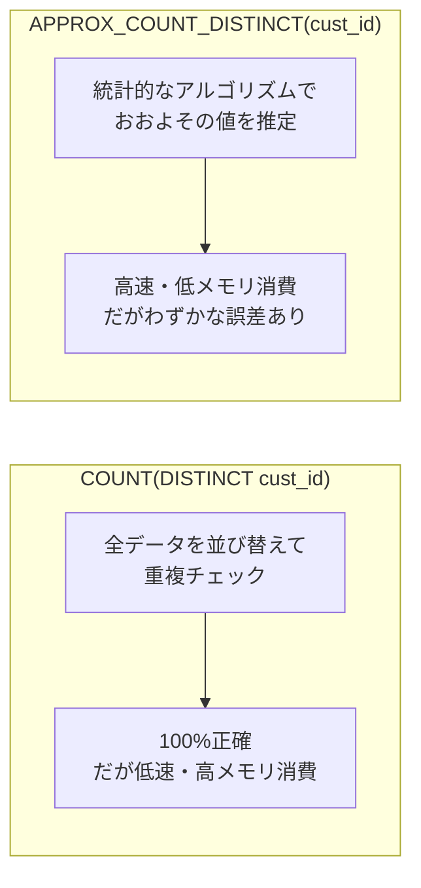
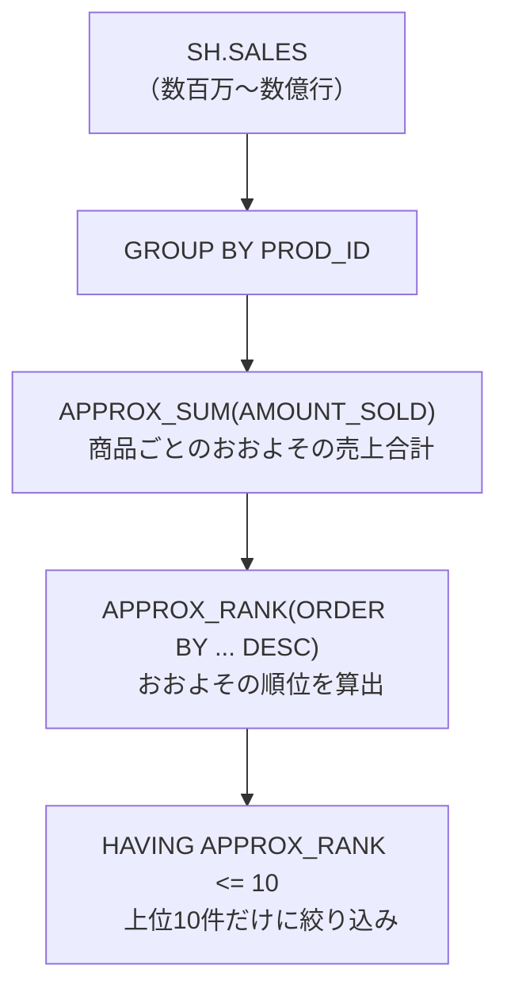
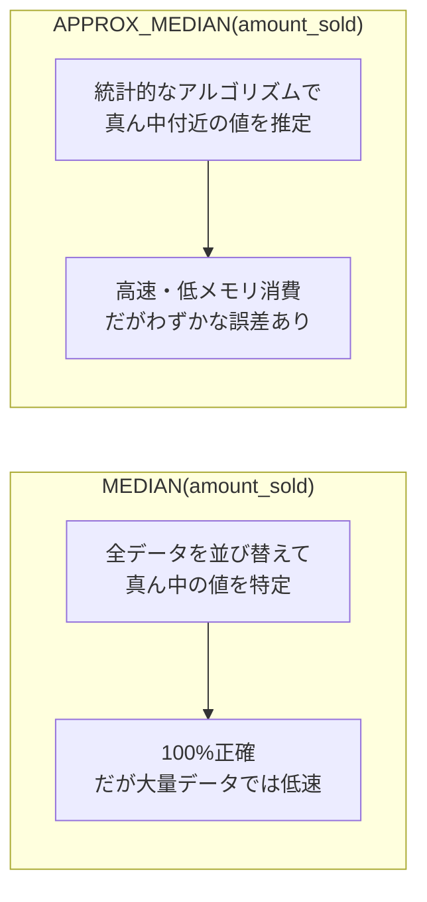
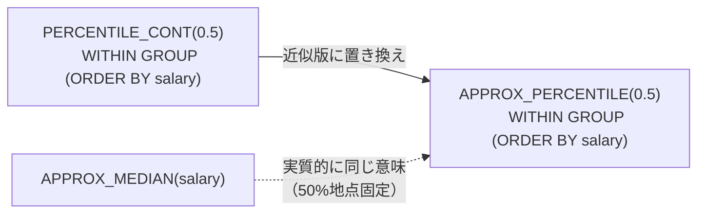
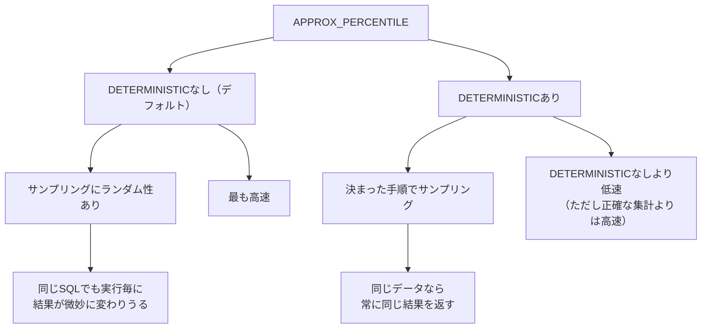
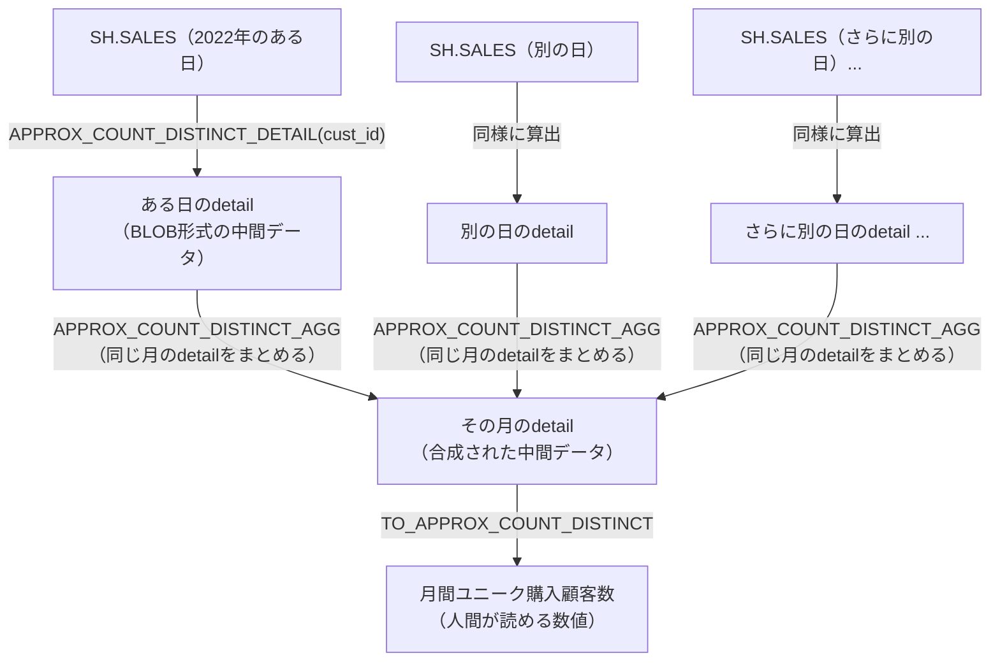
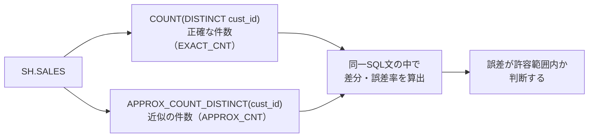

# 問題18-1：おおよその数
### 難易度：★★☆☆☆ (Lv.2)
## 問題
SHスキーマの`SALES`テーブルに存在する、重複を排除した`CUST_ID`のおおよその件数を取得してください。
なお、レコードの表示順序は問いません。

## 期待する結果
| APPROX_CUSTOMER_COUNT |
| ---------------------- |
| 7014 |

※ この値でない可能性あり

## 解答例
```sql
SELECT 
    APPROX_COUNT_DISTINCT(cust_id) AS approx_customer_count
FROM 
    sh.sales;
```
## 解説
今回は、Oracle Databaseの「ビッグデータ処理」に関するテクニック、近似関数についてです。

`APPROX_COUNT_DISTINCT`は、膨大なデータの中から「重複を除いた件数」を高速かつおおよそで算出するための関数です。
```sql
SELECT 
    APPROX_COUNT_DISTINCT([カラム名])
FROM 
    [テーブル名];
```
通常、重複を排除した件数を数えるには`COUNT(DISTINCT cust_id)`を使いますが、数百万〜数億行という巨大なテーブル（今回の`SH.SALES`など）でこれを実行すると、コンピュータは「すべての値を並び替えて重複をチェックする」という重い作業を強いられます。そこで登場するのがこの関数で、厳密な1件単位の正確さを一部犠牲にする代わりに、メモリ消費を抑え高速に結果を返します。



精度としては一般的に97%以上に収まることが多く、「正確な1円単位の決算」には向きませんが、「昨日の利用者はだいたい何万人くらいだったか」という傾向把握やダッシュボード表示には向いています。

実務でどちらを使うべきか迷ったときの判断基準を整理しておきます。

| 関数 | 精度 | 速度・リソース | 向いている場面 |
| :--- | :--- | :--- | :--- |
| `COUNT(DISTINCT ...)` | 100%正確 | データ量に比例して遅くなる、メモリ消費大 | 請求、監査、決算報告など厳密な正確性が必須な場面 |
| `APPROX_COUNT_DISTINCT(...)` | 近似値（わずかな誤差あり） | 非常に高速、リソース消費少 | 統計分析、リアルタイム監視などの傾向把握 |

`COUNT(DISTINCT ...)`は100%正確な値を返しますが、データ量に比例して実行速度が遅くなり、大量のメモリと一時領域を消費します。請求、監査、決算報告のような厳密な正確性が求められる場面に向いています。`APPROX_COUNT_DISTINCT(...)`は近似値（わずかな誤差あり）ですが、非常に高速でリソース消費も少なく、統計分析やリアルタイム監視のような場面に向いています。

今回使用している`SH`（Sales History）スキーマは、Oracleがデータウェアハウス（大量の蓄積データ分析）の練習用に提供しているものです。`SALES`テーブルは特にレコード数が多いため、こうした近似関数を試すのに向いた題材になっています。

なお、Oracleの設定（`APPROX_FOR_COUNT_DISTINCT`パラメータなど）を有効にすると、通常の`COUNT(DISTINCT)`と書いても内部で自動的に近似集計に置き換えて実行してくれる機能もあります。バッチ処理のクエリを一つひとつ書き換えなくても、セッションやシステムレベルの設定を変えるだけで近似集計の恩恵を受けられる、という使い方もできます。

----
<br><br>

# 問題18-2：近似集計によるランキングTOP10
### 難易度：★★★☆☆ (Lv.3)
## 問題
SHスキーマの `SALES` テーブルを利用して、商品（`PROD_ID`）ごとの売上合計とランキングを算出してください。ただし、データ量が膨大であることを想定し、**近似集計関数**を使用して以下の条件で取得してください。

**【条件】**
* **売上合計**: `AMOUNT_SOLD` の近似合計値を算出する。
* **ランキング**: 近似売上合計が高い順にランキングを付ける。
* **絞り込み**: ランキングが10位以内の商品のみを表示する。
* **ソート順**: 最終結果はランキングの数字が大きい順（10位 → 1位の順）に表示する。

## 期待する結果
| PROD_ID | TOTAL_SALES      | RANKING | 
| ------- | ---------------- | ------- | 
| 26      | 2572944.13000028 | 10      | 
| 28      | 3543725.89000017 | 9       | 
| 29      | 3845387.37999992 | 8       | 
| 21      | 5498727.80999995 | 7       | 
| 15      | 5635963.08000012 | 6       | 
| 13      | 6312268.40000004 | 5       | 
| 20      | 6691996.80999934 | 4       | 
| 14      | 7189171.77000039 | 3       | 
| 17      | 8314815.40000011 | 2       | 
| 18      | 15011642.520001  | 1       | 

※ この値でない可能性あり

## 解答例
```sql
SELECT
    PROD_ID,
    APPROX_SUM(AMOUNT_SOLD) AS TOTAL_SALES,
    APPROX_RANK(
        ORDER BY
            APPROX_SUM(AMOUNT_SOLD) DESC
    )                       AS RANKING
FROM
    SH.SALES
GROUP BY
    PROD_ID
HAVING
    APPROX_RANK(
        ORDER BY
            APPROX_SUM(AMOUNT_SOLD) DESC
    ) <= 10
ORDER BY
    RANKING DESC
```

## 解説
この問題は、Oracle Databaseの「近似集計（Approximate Aggregation）」に触れる内容です。数千万、数億といった大量のデータを相手にする際、1円単位の正確さよりも「上位10位をすばやく知りたい」というビジネスニーズに応えるためのテクニックです。

今回のクエリでは、2つの近似関数が使われています。



`APPROX_SUM`は`SUM`関数の近似版で、巨大なデータセットにおいて正確な合計を出すためのメモリ消費を抑え、高速に合計の目安を算出します。結果に`2572944.13000026`のような細かい端数が出ているのは、内部で浮動小数点を用いた近似計算が行われているためです。

`APPROX_RANK`は「〜の中で何位か」という順位を近似的に算出します。
```sql
APPROX_RANK(
    ORDER BY [集計関数] DESC
)
```
通常の`RANK()`関数は一度すべてのデータをソート（並び替え）する必要があるため重い処理になりがちですが、`APPROX_RANK`はソートを最小限に抑えて「上位層」を特定します。

通常、`RANK()`などの分析関数（ウィンドウ関数）の結果で絞り込みたい場合、SQLの実行順序の関係で「インラインビュー（サブクエリ）」を使う必要がありました。
```sql
-- 通常の書き方（重くなりがち）
SELECT * FROM (SELECT ..., RANK() OVER(...) as rnk ...) WHERE rnk <= 10
```

| 書き方 | 構造 | 特徴 |
| :--- | :--- | :--- |
| 通常のRANK() | サブクエリで一度絞り込む | 全データをソートしてから絞り込むため重くなりがち |
| APPROX_RANK() | HAVING句に直接条件を書ける | オプティマイザが「上位だけ出せばいい」と判断し無駄な計算を省ける |

しかし、Oracleの近似関数では`HAVING`句の中に直接ランキング条件を書くことができます。これにより、Oracleのオプティマイザは「上位10個だけをさっと出せばいい」と判断し、無駄な計算を省いた実行計画を立てることができます。

| 関数 | 役割 |
| :--- | :--- |
| `APPROX_SUM` | おおよその合計を出し、メモリ消費を抑えディスクI/Oを減らす |
| `APPROX_RANK` | おおよその順位を出し、巨大なソート処理を回避してTop-N抽出を高速化 |

このクエリが本領を発揮するのは、数億件の販売ログから「今、売れている商品TOP10」を数秒で表示したいECサイトのリアルタイムランキングや、膨大なログの中から異常なアクセス数の上位を即座にリストアップしたい不正検知など、ビッグデータ分析の場面です。`APPROX_SUM`はおおよその合計を出しメモリ消費を抑えディスクI/Oを減らす役割、`APPROX_RANK`はおおよその順位を出し巨大なソート処理を回避してTop-N抽出を高速化する役割、というように、それぞれ違った角度から処理の軽量化に貢献しています。

---
<br><br>

# 問題18-3：おおよその中央値
### 難易度：★★☆☆☆ (Lv.2)
## 問題
経営企画部門から、日々の売上分析ダッシュボードに「1取引あたりの典型的な売上金額」を表示したいという依頼がありました。
`AVG`（平均）は高額な取引に引っ張られやすいため、問題8-9や問題12-20で扱ったように「中央値」の方が実態に近い代表値になります。
しかし、SHスキーマの`SALES`テーブルは非常に大量のレコードを持つため、通常の`MEDIAN`関数で正確な中央値を都度計算すると、ダッシュボードの表示が遅くなってしまいます。

そこで、`AMOUNT_SOLD`（売上金額）の**近似的な中央値**を高速に取得してください。
なお、レコードの表示順序は問いません。

## 期待する結果
| APPROX_MEDIAN_AMOUNT |
| ---------------------- |
| 33.36 |

※ この値でない可能性あり

## NG例
```sql
-- ❌ 「近似値でよいなら、平均で代用しても同じようなものだろう」という誤解
SELECT 
    ROUND(AVG(amount_sold), 2) AS approx_median_amount
FROM 
    sh.sales
```
このSQLはエラーにならず、もっともらしい数値を返してしまいます。しかし、これは「平均値」であって「中央値の近似値」ではありません。`SALES`テーブルのような売上データは、一部の高額商品の存在によって金額の分布が右に歪んでいることが多く、平均値は中央値よりも高い水準に引き上げられます。「近似（おおよそ）」という言葉から「多少ズレてもよい統計値」と誤解し、全く性質の異なる関数に安易に置き換えてしまうのは典型的な失敗パターンです。

## 解答例
```sql
SELECT 
    APPROX_MEDIAN(amount_sold) AS approx_median_amount
FROM 
    sh.sales
```

## 解説
今回は、問題18-1（`APPROX_COUNT_DISTINCT`）に続く近似集計関数シリーズの2つ目、`APPROX_MEDIAN`です。「代表値」の近似という切り口で、問題8-9で学んだ`MEDIAN`、問題12-20で学んだ`PERCENTILE_CONT(0.5)`との関係を整理しながら理解していきます。



中央値（メジアン）は、本来「全データを大きさ順に並べて、ちょうど真ん中に来る値を特定する」という処理が必要です。これは問題8-9の`MEDIAN`や問題12-20の`PERCENTILE_CONT(0.5) WITHIN GROUP (ORDER BY ...)`が行っていた処理そのものであり、正確な値が得られる一方、`SH.SALES`のような数百万行規模のテーブルでは「全件ソート」のコストが無視できません。

`APPROX_MEDIAN`は、この「全件ソート」を避け、統計的なサンプリングやスケッチと呼ばれる手法を用いて中央値付近の値を素早く推定します。書き方は非常にシンプルで、対象の列を渡すだけです。
```sql
APPROX_MEDIAN([列名])
```

`MEDIAN`・`PERCENTILE_CONT(0.5)`・`APPROX_MEDIAN`はいずれも「中央値」を扱う点で共通していますが、性質には明確な違いがあります。

| 関数 | 正確性 | 処理コスト | 主な用途 |
| :--- | :--- | :--- | :--- |
| `MEDIAN` | 100%正確 | 全件ソートが必要で大規模データでは重い | 監査・報告書など厳密な数値が必要な場面（問題8-9） |
| `PERCENTILE_CONT(0.5)` | 100%正確（補間あり） | `MEDIAN`とほぼ同様、任意のパーセンタイルに対応 | 中央値以外の分位点も含めた統計分析（問題12-20） |
| `APPROX_MEDIAN` | 近似値（わずかな誤差あり） | 非常に高速、リソース消費少 | ダッシュボードやリアルタイム分析での傾向把握 |

`MEDIAN`と`PERCENTILE_CONT(0.5)`は理論上同じ値を返しますが、`PERCENTILE_CONT`は`0.5`以外の任意の分位点（25%地点や90%地点など）も指定できる分、より汎用的な関数です。`APPROX_MEDIAN`はこれらの「近似版」にあたり、内部的には問題18-1の`APPROX_COUNT_DISTINCT`と同様に、Oracleのビッグデータ処理向けの近似アルゴリズム基盤を利用しています。

:::message
### APPROX_MEDIANの位置づけと注意点
`APPROX_MEDIAN`はOracle Database 18c以降で使用できる関数です。古いバージョンの環境では`ORA-00904`（無効な識別子です）となるため、バージョン確認が必要です。

なお、`APPROX_MEDIAN(col)`は`APPROX_PERCENTILE(col, 0.5)`という、指定した分位点を近似的に求める関数の「50%地点固定版」に相当します。パーセンタイル自体を近似的に求める`APPROX_PERCENTILE`については、これから扱う問題で改めて取り上げます。

また、近似関数はすべて`GROUP BY`と組み合わせることも可能です。「部門ごとのおおよその中央値」のように、集計の単位を切り替えても使い方は変わりません。
:::

期待する結果を見ると、`APPROX_MEDIAN`で算出した近似中央値は46.03前後になっています。仮に同じテーブルで`ROUND(AVG(amount_sold), 2)`を計算すると、高額商品の影響でこれより高い値が返ってくるはずです。この差こそが、NG例で示した「平均と中央値は似て非なるもの」という点の実データでの裏付けになります。

`APPROX_MEDIAN`は、日次・月次のダッシュボードで「典型的な注文額」「典型的な処理時間」などをリアルタイムに近い形で表示したい場面や、正確性よりも即時性が求められるモニタリング画面など、問題18-1・18-2で紹介した近似集計関数群と同じ「速度と引き換えにわずかな誤差を許容する」場面全般で活躍します。

## 参考リンク
https://docs.oracle.com/en/database/oracle/oracle-database/19/sqlrf/APPROX_MEDIAN.html

---
<br><br>

# 問題18-4：おおよそのパーセンタイル（複数分位点の近似取得）
### 難易度：★★★☆☆ (Lv.3)
## 問題
人事部門から、問題12-20で行った「部門ごとの給与中央値」の分析をさらに発展させ、**第1四分位数（25%地点）・中央値（50%地点）・第3四分位数（75%地点）** の3点で給与分布を可視化したいという依頼がありました。
グループ会社全体を含めた大規模な従業員データベースでは、`PERCENTILE_CONT`を複数回計算するコストが無視できないため、近似関数である`APPROX_PERCENTILE`を使うことになりました。
ただし、このレポートは経営会議で毎回同じ数値が参照される必要があるため、**実行するたびに結果が変わらないこと（再現性）**が必須の条件です。

HRスキーマの`EMPLOYEES`テーブルを使用し、部門（`DEPARTMENT_ID`）が50, 80, 100の従業員について、給与（`SALARY`）の以下3点を、**再現性を保証した形で**算出してください。

**【算出項目】**
* **P25_SAL**：給与の第1四分位数（25%地点）の近似値
* **P50_SAL**：給与の中央値（50%地点）の近似値
* **P75_SAL**：給与の第3四分位数（75%地点）の近似値

## 期待する結果
| DEPARTMENT_ID | P25_SAL | P50_SAL | P75_SAL | 
| ------------- | ------- | ------- | ------- | 
| 50            | 2600    | 3100    | 3600    | 
| 80            | 7300    | 8800    | 10000   | 
| 100           | 7700    | 7800    | 9000    | 

※ この値でない可能性あり

## NG例
```sql
-- ❌ DETERMINISTICを付け忘れたパターン
SELECT
    department_id,
    APPROX_PERCENTILE(0.25) WITHIN GROUP (ORDER BY salary) AS p25_sal,
    APPROX_PERCENTILE(0.50) WITHIN GROUP (ORDER BY salary) AS p50_sal,
    APPROX_PERCENTILE(0.75) WITHIN GROUP (ORDER BY salary) AS p75_sal
FROM
    hr.employees
WHERE
    department_id IN (50, 80, 100)
GROUP BY
    department_id
ORDER BY
    department_id
```
このSQLはエラーにならず、一見すると正しい分位点の表が出力されます。しかし`DETERMINISTIC`キーワードを指定していないため、内部的にはランダム性を含むサンプリングアルゴリズムが使われます。同じテーブル・同じデータに対して**同じSQLを再実行しても、実行のたびにわずかに違う数値が返ってくる可能性がある**のです。経営会議の資料として毎回同じ数値を示す必要があるレポートにこの書き方を使うと、「先月の資料と今月の資料で同じ部門の数値が微妙に違う」という信頼性を損なう事態を招きかねません。エラーにならないからこそ気づきにくい、危険なパターンです。

## 解答例
```sql
SELECT
    department_id,
    -- DETERMINISTICを指定し、再実行しても同じ結果になるよう保証する
    APPROX_PERCENTILE(0.25 DETERMINISTIC) WITHIN GROUP (ORDER BY salary) AS p25_sal,
    APPROX_PERCENTILE(0.50 DETERMINISTIC) WITHIN GROUP (ORDER BY salary) AS p50_sal,
    APPROX_PERCENTILE(0.75 DETERMINISTIC) WITHIN GROUP (ORDER BY salary) AS p75_sal
FROM
    hr.employees
WHERE
    department_id IN (50, 80, 100)
GROUP BY
    department_id
ORDER BY
    department_id
```

## 解説
今回は、問題18-3の`APPROX_MEDIAN`をさらに一般化した`APPROX_PERCENTILE`を扱います。`APPROX_MEDIAN(col)`が「50%地点固定」だったのに対し、`APPROX_PERCENTILE`は問題12-20で学んだ`PERCENTILE_CONT`と同じように、**任意の分位点**を指定できる近似関数です。



構文は`PERCENTILE_CONT`とよく似ていますが、パーセンタイルの指定方法に違いがあります。
```sql
APPROX_PERCENTILE(
    percentile [DETERMINISTIC] [, 'ERROR_RATE' | 'CONFIDENCE']
) WITHIN GROUP (ORDER BY 列名)
```
`PERCENTILE_CONT(0.5)`のように分位点を関数の引数として渡す点は共通ですが、`APPROX_PERCENTILE`ではその同じ括弧の中に`DETERMINISTIC`という追加キーワードを置けるのが最大の特徴です。

今回のテーマである`DETERMINISTIC`について整理します。



`DETERMINISTIC`を付けない場合、Oracleは実行計画（並列度やスキャン順など）に応じて内部的なサンプリング方法を変えることがあり、その結果、同一のSQL・同一のデータに対しても実行のたびに近似値が微妙に変動する可能性があります。一方`DETERMINISTIC`を付けると、常に同じアルゴリズムでサンプリングが行われるため結果が安定しますが、その分`DETERMINISTIC`なしよりは処理コストが上がります。とはいえ、`PERCENTILE_CONT`による正確な計算に比べれば、依然として高速です。

期待する結果を、問題12-20で算出した「正確な中央値」と見比べてみましょう。

| 部門 | 12-20（正確な中央値） | 18-4（近似の50%地点） | 差 |
| :---: | :---: | :---: | :--- |
| 50 | 3100 | 3100 | 一致 |
| 80 | 8900 | 9003 | +103（近似誤差） |
| 100 | 8000 | 7739 | -261（近似誤差） |

部門50のようにピタリと一致することもあれば、部門80・100のように多少のズレが生じることもあります。これが「近似（Approximate）」という言葉の意味であり、1円単位の正確さが求められる給与監査などには不向きですが、「おおよその分布の形（下位25%・中央値・上位25%の目安）を素早く掴みたい」という今回のような分析ニーズには十分な精度です。

`PERCENTILE_CONT`／`PERCENTILE_DISC`／`APPROX_PERCENTILE`の使い分けは、以下のように整理できます。

| 関数 | 正確性 | 再現性 | 主な用途 |
| :--- | :--- | :--- | :--- |
| `PERCENTILE_CONT` | 100%正確（補間あり） | 常に一定 | 監査・決算など厳密性が必要な分位点分析（問題12-20） |
| `PERCENTILE_DISC` | 100%正確（実在値） | 常に一定 | 実在する代表値を分位点として選びたい場合 |
| `APPROX_PERCENTILE`（DETERMINISTICなし） | 近似値 | 実行毎に変動しうる | 使い捨てのダッシュボード表示など再現性を問わない場面 |
| `APPROX_PERCENTILE`（DETERMINISTICあり） | 近似値 | 常に一定 | 定例レポートなど、速度と再現性の両方が必要な場面 |

:::message
### 精度をさらに知りたい場合：ERROR_RATE / CONFIDENCE
`APPROX_PERCENTILE`の第2引数には、`DETERMINISTIC`の代わりに（または組み合わせて）`'ERROR_RATE'`や`'CONFIDENCE'`を指定することもできます。これらは近似値そのものではなく、「その近似計算の誤差率」や「信頼度」を返すオプションです。
```sql
APPROX_PERCENTILE(0.5 DETERMINISTIC, 'ERROR_RATE') WITHIN GROUP (ORDER BY salary)
```
近似関数を業務で本格的に採用する前には、一度この`ERROR_RATE`を確認し、許容できる誤差の範囲に収まっているかを検証しておくと安心です。この「誤差の検証」については、本章の後半で改めて扱います。
:::

`GROUP BY`と組み合わせられる点も`PERCENTILE_CONT`と同様です。今回は部門ごとに3つの分位点を一括で算出しましたが、これにより「部門80は給与のばらつきが大きい（P25とP75の差が大きい）」「部門50は比較的均等な分布」といった、平均値や中央値だけでは見えなかった分布の広がりまで、高速に把握できるようになります。

## 参考リンク
https://docs.oracle.com/en/database/oracle/oracle-database/19/sqlrf/APPROX_PERCENTILE.html

---
<br><br>

# 【完全版】問題18-5：詳細情報の保存による段階的な近似集計（DETAIL / AGG）
### 難易度：★★★★☆ (Lv.4)
## 問題
データ基盤チームでは、`SH.SALES`テーブル（大規模）から「日別のユニーク購入顧客数（`CUST_ID`の重複排除件数）」を毎日算出し、その結果をバッチ処理として保持しています。

月末になると、これらの日次結果を再利用して「月間のユニーク購入顧客数」を求めたいという要望が上がりました。しかし、これは単純な話ではありません。同じ顧客が月内の複数の日にわたって購入していた場合、日ごとの件数をただ合計すると、その顧客が何度も重複してカウントされてしまい、実際より過大な数値になってしまいます。かといって、月間の値を求めるためだけに`SALES`テーブルを毎回スキャンし直すのでは、日次バッチで計算済みのはずの処理が無駄になってしまいます。

そこで、`APPROX_COUNT_DISTINCT_DETAIL`・`APPROX_COUNT_DISTINCT_AGG`・`TO_APPROX_COUNT_DISTINCT`の3つの関数を使い、`SALES`テーブルを再スキャンすることなく、日次の集計結果を"合成"して月間のユニーク購入顧客数を算出してください。

**【条件】**
* `SH.TIMES`と`SH.SALES`を使用すること。
* 対象は**2022年（`YEAR = 2022`）**のデータのみとすること。
* まず、日（`DAY_NUMBER_IN_MONTH`）ごとの「ユニーク購入顧客数の中間データ（detail）」を算出すること。
* 次に、その中間データを月単位に合成し、月間ユニーク購入顧客数を算出すること。
* 最終結果には、年（`YEAR`）・月（`MONTH`）・月間ユニーク購入顧客数（`MONTHLY_DISTINCT_CUST`）を、月の昇順で表示すること。

## 期待する結果
| YEAR | MONTH | MONTHLY_DISTINCT_CUST |
| ---- | ----- | ----------------------- |
| 2022 | 1     | 1154                    |
| 2022 | 2     | 1004                    |
| 2022 | 3     | 920                     |
| 2022 | 4     | 887                     |
| 2022 | 5     | 856                     |
| 2022 | 6     | 989                     |
| 2022 | 7     | 955                     |
| 2022 | 8     | 1031                    |
| 2022 | 9     | 1013                    |
| 2022 | 10    | 1078                    |
| 2022 | 11    | 957                     |
| 2022 | 12    | 1105                    |

※ この値でない可能性あり

## NG例
```sql
-- ❌ 日次の近似件数を、そのまま合計してしまうパターン
SELECT
    daily.year,
    daily.month,
    SUM(daily.daily_cnt) AS monthly_distinct_cust_wrong
FROM (
    SELECT
        t.calendar_year         AS year,
        t.calendar_month_number AS month,
        t.day_number_in_month   AS day,
        APPROX_COUNT_DISTINCT(s.cust_id) AS daily_cnt
    FROM
        sh.times t
        JOIN sh.sales s ON t.time_id = s.time_id
    WHERE
        t.calendar_year = 2022
    GROUP BY
        t.calendar_year, t.calendar_month_number, t.day_number_in_month
) daily
GROUP BY
    daily.year, daily.month
```
このSQLはエラーにならず、それらしい数値を返します。しかし、結果は実際の月間ユニーク購入顧客数よりもかなり大きな値になってしまいます。「1月1日に購入した顧客」と「1月2日に購入した顧客」の中には、当然同じ顧客（リピーター）が重なって含まれています。`SUM`は単純にこれらの件数を足し合わせるだけなので、同じ顧客を購入した日数分だけ何度も数えてしまう「二重カウント」が発生します。日次の「件数（数値）」だけを保存してしまうと、後から正しく合成する手段がない、という点がこのNG例の本質です。

## 解答例
```sql
WITH daily_detail AS (
    -- ① 日ごとの「ユニーク購入顧客数」を、数値ではなく中間データ（detail）として算出
    SELECT
        t.calendar_year         AS year,
        t.calendar_month_number AS month,
        t.day_number_in_month   AS day,
        APPROX_COUNT_DISTINCT_DETAIL(s.cust_id) AS detail
    FROM
        sh.times t
        JOIN sh.sales s ON t.time_id = s.time_id
    WHERE
        t.calendar_year = 2022
    GROUP BY
        t.calendar_year, t.calendar_month_number, t.day_number_in_month
)
SELECT
    year,
    month,
    -- ② 日次のdetailを月単位に合成し、③ 人間が読める数値に変換
    TO_APPROX_COUNT_DISTINCT(
        APPROX_COUNT_DISTINCT_AGG(detail)
    ) AS monthly_distinct_cust
FROM
    daily_detail
GROUP BY
    year, month
ORDER BY
    month
```

## 解説
今回は、問題18-1の`APPROX_COUNT_DISTINCT`をさらに発展させた、「詳細情報（detail）を保存し、後から合成する」というテクニックです。近似集計関数群の中でもやや上級者向けですが、日次バッチ→月次バッチ→年次バッチのように、**同じ元データに対して繰り返し集計を行うバッチ処理の設計**では非常に強力な考え方です。



3つの関数は、それぞれ異なる役割を持っています。

| 関数 | 入力 | 出力 | 役割 |
| :--- | :--- | :--- | :--- |
| `APPROX_COUNT_DISTINCT_DETAIL(expr)` | 集計対象の列 | `BLOB`型の中間データ（detail） | 元データを1回スキャンし、後で合成可能な形の"種"を作る |
| `APPROX_COUNT_DISTINCT_AGG(detail)` | detail（複数行） | `BLOB`型の中間データ（detail） | 複数のdetailを、元データを見ることなく正しく合成する |
| `TO_APPROX_COUNT_DISTINCT(detail)` | detail | `NUMBER`型 | detailを人間が読める「おおよその件数」に変換する |

ポイントは、`APPROX_COUNT_DISTINCT_DETAIL`が返す`detail`が単なる「件数（数値）」ではなく、内部的な統計情報を保持した`BLOB`だという点です。この特殊な形式のおかげで、`APPROX_COUNT_DISTINCT_AGG`は「detailとdetailを正しく合成」でき、NG例で起きたような二重カウントを避けられます。数値に変換されてしまった後（NG例のような`daily_cnt`）では、この"正しい合成"はもう不可能です。

`APPROX_COUNT_DISTINCT`（問題18-1）と今回の3関数は、「1回の集計で終わるか」「元データを保持しつつ何段階かに分けて再利用するか」という点で使い分けます。

| 関数 | 向いている場面 |
| :--- | :--- |
| `APPROX_COUNT_DISTINCT` | その場で1回だけ、おおよその件数を知りたいとき（問題18-1） |
| `APPROX_COUNT_DISTINCT_DETAIL` / `_AGG` / `TO_APPROX_COUNT_DISTINCT` | 日次→月次→年次のように、同じ元データに対する集計を何段階にも積み上げて再利用したいとき |

:::message
### 実務ではマテリアライズド・ビューと組み合わせるのが定番
実務では、今回のように`WITH`句でその場限りに計算するのではなく、`APPROX_COUNT_DISTINCT_DETAIL`の結果をマテリアライズド・ビュー（`日次detail用MV`）として物理的に保存しておき、月次バッチでは`日次detail用MV`に対して`APPROX_COUNT_DISTINCT_AGG`を実行するだけで済ませる、という設計がよく使われます。こうすることで、月次バッチは巨大な`SALES`テーブルには一切アクセスせず、既に集計済みの小さなdetail情報だけを読み込めばよくなり、処理時間を大幅に削減できます。

なお、`detail`はあくまで内部形式のデータであり、そのままでは中身を直接読むことはできません。必ず`TO_APPROX_COUNT_DISTINCT`で数値に変換してから利用する必要がある点に注意してください。
:::

### なぜ最初に`PROD_ID`で試したときは毎月同じ値になったのか
本題材を検討する過程で、当初は`PROD_ID`（商品ID）を対象に試しましたが、結果は毎月「71」で変動が見られませんでした。これは`SH.PRODUCTS`の商品種類がもともと70種類程度しかなく、月間の取引件数が十分に多い`SALES`テーブルでは「その月に一度も売れない商品」がほぼ存在しないため、**カーディナリティ（値の種類数）が小さい列では近似集計の"月ごとの違い"が見えにくい**、という近似関数を扱ううえでの実践的な教訓です。`CUST_ID`のように取りうる値の種類数が十分多い列（7,000人超）を選んで初めて、月ごとの購入顧客の入れ替わりが数値として現れます。近似集計関数を適用する対象列を選ぶ際は、その列がどの程度の種類数（カーディナリティ）を持つかを意識しておくとよいでしょう。

期待する結果を見ると、月によって920〜1154の範囲で変動しています。これは各月に実際に購入したユニーク顧客数が、季節や月ごとの営業日数などによって変化していることを示しており、単純な合計（NG例）では絶対に得られない、実態に即した数値になっています。

## 参考リンク
https://docs.oracle.com/en/database/oracle/oracle-database/21/sqlrf/APPROX_COUNT_DISTINCT_DETAIL.html
https://docs.oracle.com/en/database/oracle/oracle-database/21/sqlrf/APPROX_COUNT_DISTINCT_AGG.html

---
<br><br>

# 問題18-6：APPROX_COUNT_DISTINCTの誤差検証
### 難易度：★★☆☆☆ (Lv.2)
## 問題
データ品質管理チームから、「`APPROX_COUNT_DISTINCT`を本番のダッシュボードに本格採用してよいか判断したいので、まずは実データでどの程度の誤差が出るのか検証してほしい」という依頼がありました。

SHスキーマの`SALES`テーブルを対象に、`CUST_ID`（顧客ID）について、**正確な件数**と**近似の件数**を同時に算出し、その差分と誤差率（%）を求めてください。

**【算出項目】**
* **EXACT_CNT**：`COUNT(DISTINCT cust_id)`による正確な件数
* **APPROX_CNT**：`APPROX_COUNT_DISTINCT(cust_id)`による近似の件数
* **DIFF_CNT**：`APPROX_CNT - EXACT_CNT`（差分）
* **ERROR_RATE_PCT**：正確な件数に対する誤差率（%）。小数点第4位で四捨五入

## 期待する結果
| EXACT_CNT | APPROX_CNT | DIFF_CNT | ERROR_RATE_PCT | 
| --------- | ---------- | -------- | -------------- | 
| 7059      | 7014       | -45      | -0.6375        | 

※ この値でない可能性あり

## NG例
```sql
-- ❌ 「正確な件数」と「近似の件数」を、別々のSQL文で実行してしまうパターン
SELECT COUNT(DISTINCT cust_id) AS exact_cnt FROM sh.sales;

-- （この2つのSELECT文の間に、他のセッションがsh.salesへデータをINSERT/DELETEするかもしれない）

SELECT APPROX_COUNT_DISTINCT(cust_id) AS approx_cnt FROM sh.sales;
```
このSQLはどちらもエラーにならず、それぞれもっともらしい件数を返します。しかし、Oracleの読み取り一貫性（Read Consistency）は基本的に「SQL文単位」で保証されるものであり、「トランザクション全体で1つの一貫したスナップショットを見続ける」ことまでは保証されません。もし1つ目の`SELECT`文の実行後、2つ目の`SELECT`文が実行されるまでの間に、他のセッションが`SALES`テーブルにデータを追加・削除していた場合、`EXACT_CNT`と`APPROX_CNT`はそもそも**異なる時点のデータ**に対する集計結果になってしまいます。その差分を「近似アルゴリズムの誤差」だと思い込んで評価してしまうと、誤った結論を導きかねません。誤差を正しく検証するには、両方の値を**同一のSQL文の中で**同時に算出する必要があります。

## 解答例
```sql
SELECT
    COUNT(DISTINCT cust_id)     AS exact_cnt,
    APPROX_COUNT_DISTINCT(cust_id) AS approx_cnt,
    APPROX_COUNT_DISTINCT(cust_id) - COUNT(DISTINCT cust_id) AS diff_cnt,
    ROUND(
        (APPROX_COUNT_DISTINCT(cust_id) - COUNT(DISTINCT cust_id))
        / COUNT(DISTINCT cust_id) * 100,
        4
    ) AS error_rate_pct
FROM
    sh.sales
```

## 解説
今回は、問題18-1で紹介した`APPROX_COUNT_DISTINCT`を、実際に業務へ導入する前段階として欠かせない「誤差検証」というプロセスを扱います。近似関数は便利ですが、「どれくらいの誤差が出るか分からないまま使う」のは危険です。導入の可否を判断するための、実務的なワンステップです。



`COUNT(DISTINCT cust_id)`と`APPROX_COUNT_DISTINCT(cust_id)`を**同じ`SELECT`文の`SELECT`句に並べて書く**のが今回のポイントです。こうすることで、Oracleの読み取り一貫性の仕組みにより、両方とも同一時点のデータに対する集計結果であることが保証されます。NG例のように文を分けてしまうと、この保証が失われる点に注意が必要です。

期待する結果を見ると、`DIFF_CNT`は-45、`ERROR_RATE_PCT`は約-0.64%となっています。つまり、近似関数は正確な値よりもわずかに小さい値を返しており、その誤差は1%にも満たない水準です。問題18-1の解説でも触れた「精度としては一般的に97%以上に収まることが多い」という説明を、実データで裏付ける結果になっています。

このように算出した誤差率をどう評価するかは、用途によって基準が変わります。

| 誤差率の目安 | 判断の一例 |
| :--- | :--- |
| 0.1%未満 | ほとんどの用途で問題なく採用可能 |
| 0.1%〜1%程度 | ダッシュボードや傾向把握用途であれば十分許容範囲 |
| 1%を超える | 用途によっては要注意。カーディナリティやデータの偏りを再確認 |

一般に、対象列のカーディナリティ（値の種類数）が高いほど、また集計対象のデータ件数が多いほど、`APPROX_COUNT_DISTINCT`の相対誤差は小さくなる傾向があります。問題18-5で扱った`CUST_ID`（7,000種類超）のように十分なカーディナリティを持つ列であれば、今回のように1%未満の誤差に収まることが多いです。

:::message
### GROUP BYと組み合わせた誤差検証
今回は`SALES`テーブル全体に対する誤差検証でしたが、実務では「特定のセグメント（商品カテゴリや地域など）ごとに誤差率が変わらないか」まで確認しておくと、より安心して本番導入できます。`GROUP BY`句を追加し、`PROD_CATEGORY`や`CHANNEL_ID`ごとに`EXACT_CNT`・`APPROX_CNT`・`ERROR_RATE_PCT`を並べて出力すれば、「カーディナリティが低いグループほど誤差が大きくなっていないか」といった傾向まで確認できます。

また、問題18-4の`APPROX_PERCENTILE`には`'ERROR_RATE'`という第2引数のオプションがあり、`COUNT(DISTINCT ...)`と実際に比較しなくても、Oracle自身に誤差率を計算させることも可能です。今回のように「正確な値と実際に突き合わせて検証する」方法と、「Oracleに誤差率を申告させる」方法の両方を知っておくと、状況に応じて使い分けられます。
:::

近似関数は、一度「このテーブル・この列であれば誤差はこの程度」と検証できれば、以降は安心して`APPROX_COUNT_DISTINCT`や`APPROX_SUM`、`APPROX_MEDIAN`、`APPROX_PERCENTILE`（問題18-1〜18-5）を使い続けられます。逆に言えば、この検証を省略して近似関数をいきなり本番導入するのは避けたほうがよい、というのが今回の問題を通じて伝えたいメッセージです。

## 参考リンク
https://docs.oracle.com/en/database/oracle/oracle-database/19/sqlrf/APPROX_COUNT_DISTINCT.html
