# 問題6-1：四則演算
### 難易度：★☆☆☆☆ (Lv.1)
## 問題
HRスキーマの`EMPLOYEES`テーブルより、`EMPLOYEE_ID`が100のデータに対して、給与（`SALARY`）を用いた以下の計算結果を算出してください。

**【算出内容】**
* `SALARY`に`1000`を加算した値（別名：`+`）
* `SALARY`から`1000`を減算した値（別名：`-`）
* `SALARY`に`2`を乗算した値（別名：`*`）
* `SALARY`を`3`で除算した値（別名：`/`）
* `SALARY`を`7`で除算した際の余り（別名：`余り`）

## 期待する結果
| EMPLOYEE_ID | SALARY | +     | -     | *     | /    | 余り |
| ----------- | ------ | ----- | ----- | ----- | ---- | ---- |
| 100         | 24000  | 25000 | 23000 | 48000 | 8000 | 4    |

## 解答例
```sql
SELECT
    employee_id,
    salary,
    salary + 1000     AS "+",
    salary - 1000     AS "-",
    salary * 2        AS "*",
    salary / 3        AS "/",
    MOD(salary, 7)    AS "余り"
FROM
    hr.employees
WHERE
    employee_id = 100
```

## 解説
ここからは数値データの加工、いわゆる「計算（算術演算）」のセクションです。SQLは単にデータを取ってくるだけでなく、電卓のようにその場で計算して結果を出すことができます。

Oracle SQLの四則演算（`+` `-` `*` `/`）は、算数やプログラミングとほぼ同じ書き方です。SELECT句の中に直接数式を書くことで、行ごとに計算結果を表示できます。

割り算の「余り」を出したい場合は、記号ではなく `MOD` 関数を使います。

```sql
MOD(被除数, 除数)
-- 例: MOD(salary, 7) は「給与を7で割った余り」を返す
```

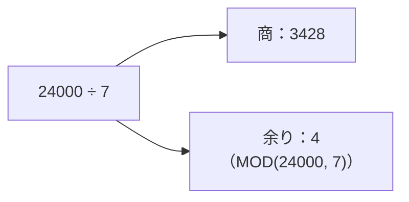

実務では「偶数行だけ抽出したい（`MOD(ID, 2) = 0`）」といった判定によく使われます。

今回の解答例で少し面白いのが、別名の付け方です。
```sql
salary + 1000 AS "+"
```
通常、SQLの別名に`+`や`-`のような演算記号をそのまま使うことはできません（SQLが「計算の指示かな」と誤解してしまうためです）。ただ、ダブルクォーテーション（`" "`）で囲むことで、記号そのものを列名として表示させることができます。個人的には、レポートのヘッダーとして見やすくする以外の場面ではあまり使わない書き方ですが、知っておくと表現の幅が広がります。

数値計算で忘れてはいけないのが、NULLとの計算です。もし`SALARY`がNULL（未定義）だった場合、どんな計算をしても結果はすべてNULLになります。

| 計算式 | 結果 |
| :--- | :--- |
| `NULL + 1000` | NULL |
| `NULL - 1000` | NULL |
| `NULL * 2` | NULL |
| `NULL / 3` | NULL |

実際の開発では、`NVL`関数などを使って「NULLだったら0として扱う」という工夫を組み合わせるのが一般的です。私も一度、集計クエリで一部の行だけ合計が抜け落ちていて、原因を調べたらそのカラムにNULLが混ざっていたことがありました。数値計算をするときは、対象のカラムにNULLが入り得るかどうかを一度確認しておくと安心です。

複数の計算を組み合わせる場合は、算数と同じく「掛け算・割り算」が「足し算・引き算」より先に計算されます。

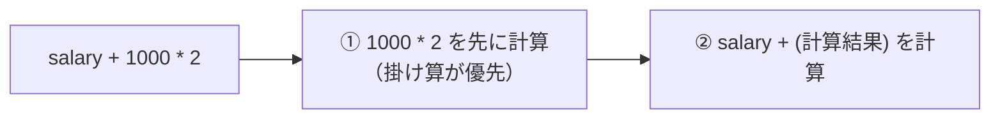

もし足し算を先にしたい場合は、カッコを使って明示的に順序を指定してください（`salary + 1000 * 2` と `(salary + 1000) * 2` は結果が変わります）。

## 参考リンク
https://www.shift-the-oracle.com/sql/functions/mod-remainder.html

----
<br><br>

# 問題6-2：端数処理
### 難易度：★☆☆☆☆ (Lv.1)
## 問題
HRスキーマの`EMPLOYEES`テーブルより、`EMPLOYEE_ID`が100のデータに対して、給与（`SALARY`）を「7」で除算した結果に対し、以下の端数処理を行ってください。

**【算出内容】**
* **/**：`SALARY`を`7`で除算した生の値
* **小数点切り捨て**：小数点第2位以下を切り捨て（小数点第1位までを表示）
* **切り捨て**：小数点以下を切り捨てて整数にする
* **四捨五入**：小数点以下を四捨五入して整数にする
* **切り上げ**：小数点以下を切り上げて整数にする

## 期待する結果
| EMPLOYEE_ID | SALARY | /                  | 小数点切り捨て | 切り捨て | 四捨五入 | 切り上げ |
| ----------- | ------ | ------------------ | -------------- | -------- | -------- | -------- |
| 100         | 24000  | 3428.5714285714300 | 3428.5         | 3428     | 3429     | 3429     |

## 解答例
```sql
SELECT
    employee_id,
    salary,
    salary / 7           AS "/",
    TRUNC(salary / 7, 1) AS "小数点切り捨て",
    TRUNC(salary / 7)    AS "切り捨て",
    ROUND(salary / 7)    AS "四捨五入",
    CEIL(salary / 7)     AS "切り上げ"
FROM
    hr.employees
WHERE
    employee_id = 100
```

## 解説
前問の四則演算に続き、今回は算出された数値を「どう見せるか」を制御する端数処理（丸め処理）の解説です。請求書の金額計算や統計レポートなど、実務では「小数点以下をどう扱うか」というルールが厳密に決まっていることが多いため、これらの関数の使い分けは押さえておきたいスキルです。

**元の値：`3428.5714285714300`（24000 ÷ 7）を各関数で処理するとどうなるか**

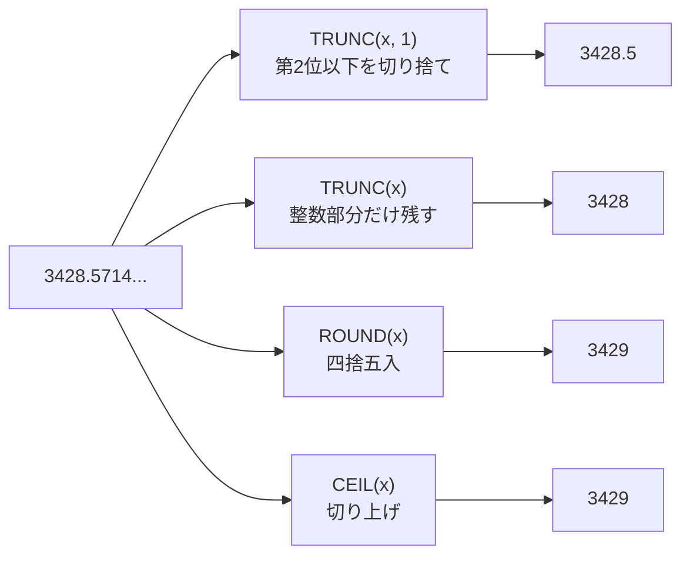

| 関数 | 意味 | 桁数指定 | 今回の結果 |
| :--- | :--- | :---: | :---: |
| `TRUNC(x, 1)` | 指定した桁数より右側を切り捨て | できる | 3428.5 |
| `TRUNC(x)` | 整数部分だけ残す（0桁扱い） | 省略可（0とみなす） | 3428 |
| `ROUND(x)` | 四捨五入 | できる | 3429 |
| `CEIL(x)` | その数値以上の最小の整数（切り上げ） | できない（常に整数） | 3429 |

`TRUNC`関数は、指定した桁数より右側を切り捨てます。
```sql
TRUNC( [数値], [桁数] )
```
`TRUNC(salary / 7, 1)` は小数点第1位までを残し、第2位以下を捨てます。`TRUNC(salary / 7)` のように第2引数を省略すると「0」とみなされ、整数部分のみが残ります。

`ROUND`関数は、指定した桁数で一般的な四捨五入を行います。今回は24000÷7≈3428.5714…なので、整数への四捨五入（桁数0）の結果は3429になります。

`CEIL`関数は「天井（Ceiling）」という意味の通り、その数値以上の最小の整数を返します。小数点以下が少しでもあれば、正の数の場合は次の整数に繰り上がります。`CEIL`には`TRUNC`や`ROUND`のような桁数指定はできず、常に整数へ切り上げる点に注意してください。

実務での使い分けとしては、消費税計算では`TRUNC`（切り捨て）が使われることが多いですが、業界や契約によって`ROUND`や`CEIL`が指定されることもあります。平均値の表示では見やすくするために`ROUND(n, 1)`（小数点第1位まで四捨五入）がよく使われます。ページ数の計算も分かりやすい例で、全105件のデータを10件ずつ表示する場合、必要なページ数は105÷10=10.5です。ここで`CEIL(10.5)`を使うと「11ページ必要」という正しい答えが出ます。

もう一つ知っておくと便利なのが、`TRUNC`や`ROUND`の第2引数にマイナスの値を指定すると、「10の位」や「100の位」での処理もできるという点です。

| 書き方 | 意味 | 結果 |
| :--- | :--- | :---: |
| `ROUND(3428, -2)` | 100の位で四捨五入 | 3400 |
| `TRUNC(3428, -3)` | 1000の位で切り捨て | 3000 |

「10円未満は切り捨て」といった商習慣を表現する際に便利です。

:::message
### Oracleの NUMBER型と浮動小数点誤差の話
「0.1 + 0.2 が 0.3 にならない」というのは、プログラミングの世界でよく語られる話です。これは、コンピュータが内部的に2進数で計算していて、10進数の0.1を2進数に変換すると循環小数になり、有限のメモリに保存する際に途中で切り捨てが発生するために起こります。

ただし、ここで一つ補足しておきたいことがあります。この現象は主に`BINARY_FLOAT`/`BINARY_DOUBLE`型（IEEE754の2進浮動小数点数）や、JavaScript・Pythonなど2進浮動小数点を採用する言語で発生するものです。**今回の演習で使っているOracleの標準的な`NUMBER`型は、10進数を正確に扱うように設計されているため、通常この種の誤差は発生しません。** `0.1 + 0.2 = 0.3` は`NUMBER`型であればそのまま`0.3`になります。

| 型 | 内部形式 | 0.1 + 0.2 の結果 |
| :--- | :--- | :---: |
| Oracle `NUMBER` | 10進数を正確に扱う | 0.3（誤差なし） |
| `BINARY_FLOAT`/`BINARY_DOUBLE` | 2進浮動小数点（IEEE754） | 0.30000000000000004 のような誤差が出うる |

とはいえ、`NUMBER`型を使っていても、金額のように厳密な精度が求められるカラムでは、桁数の指定を明示しておく方が安全です。
* `NUMBER(10, 2)`（全体10桁、うち小数2桁）のように桁数を明示する。
* 小数を扱わず、あらかじめ「最小単位（円なら1円、ドルなら1セント）」を整数として保存し、表示するときだけ割る、という方法もあります。

もし`BINARY_FLOAT`/`BINARY_DOUBLE`型を扱う場面に出会ったら、`=`での比較は避けて、`WHERE price BETWEEN 0.29999 AND 0.30001` のように範囲で判定するのが安全です。私自身、この違いを知らずに他言語からOracleに移ってきたとき、「Oracleは誤差が出ない」と最初は少し驚いた記憶があります。
:::

## 参考リンク
https://www.shift-the-oracle.com/sql/functions/trunc.html
https://www.shift-the-oracle.com/sql/functions/round.html
https://www.shift-the-oracle.com/sql/functions/mod-remainder.html

----
<br><br>

# 問題6-3：数値の書式設定（カンマ・通貨・ゼロ埋め）
### 難易度：★★☆☆☆ (Lv.2)
## 問題
HRスキーマの`EMPLOYEES`テーブルより、`DEPARTMENT_ID`が30の従業員を対象として、給与（`SALARY`）を以下のフォーマットで表示してください。なお、レコードの表示順序は問いません。

**【表示ルール】**
* **ID**: `EMPLOYEE_ID`を表示。
* **RAW_SALARY**: `SALARY`をそのまま表示。
* **FORMAT_1**: 3桁ごとにカンマを入れ、先頭に「$」を付与する（例：$12,000）。
* **FORMAT_2**: 3桁ごとにカンマを入れ、先頭に通貨記号「¥」を付与する。
 ※セッション設定に依存せず、SQL内で明示的に「¥」を指定すること。
* **FORMAT_3**: 全10桁とし、空いた左側の桁を「0」で埋めて表示する。

## 期待する結果
| ID  | RAW_SALARY | FORMAT_1 | FORMAT_2 | FORMAT_3   |
| --- | ---------- | -------- | -------- | ---------- |
| 114 | 11000      | $11,000  | ¥11,000  | 0000011000 |
| 115 | 3100       | $3,100   | ¥3,100   | 0000003100 |
| 116 | 2900       | $2,900   | ¥2,900   | 0000002900 |
| 117 | 2800       | $2,800   | ¥2,800   | 0000002800 |
| 118 | 2600       | $2,600   | ¥2,600   | 0000002600 |
| 119 | 2500       | $2,500   | ¥2,500   | 0000002500 |

## 解答例
```sql
SELECT
    employee_id AS id,
    salary      AS raw_salary,
    TO_CHAR(salary, 'FM$999,999')  AS format_1,
    TO_CHAR(salary, 'FML999,999', 'NLS_CURRENCY = ''¥''')  AS format_2,
    TO_CHAR(salary, '0000000000') AS format_3
FROM
    hr.employees
WHERE
    department_id = 30
```

## 解説
`TO_CHAR`関数で数値を書式化する際、書式モデルの記号一つ一つに厳格な意味があります。

| 記号 | 意味 | 有効な数字がない場合 |
| :---: | :--- | :--- |
| `9` | 数字の位置 | 空白を返す |
| `0` | 数字の位置（ゼロ埋め） | ゼロを返す |
| `$` | 常にドル記号を表示 | - |
| `L` | セッションの`NLS_CURRENCY`に基づくローカル通貨記号 | - |
| `,` | 3桁区切りのカンマ | - |
| `FM` | 先頭の余分な空白（符号用スペース）を除去 | - |

`9`は有効な数字があれば表示し、なければ空白を返します。`0`は有効な数字があれば表示し、なければゼロを返します。`FORMAT_3`のように「固定桁数でゼロ埋めしたい」場合は、`0`を並べるのが正解です。

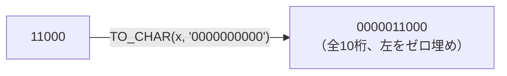

通貨記号については、`$`は常にドル記号を表示し、`L`はセッションの`NLS_CURRENCY`パラメータに基づいた「ローカル通貨記号」を表示します。第3引数で通貨記号を明示的に指定しておくと、環境（OSやセッション設定）によって記号が化けるのを防げます。ここで一点注意が必要で、`NLS_CURRENCY`に渡す通貨記号はSQLの文字列リテラルとして扱われるため、内側をシングルクォーテーションでもう一段囲む必要があります。
```sql
TO_CHAR(salary, 'FML999,999', 'NLS_CURRENCY = ''¥''')
```
`'¥'`をさらに`''¥''`のように囲むのは少し見慣れない書き方ですが、SQL文字列の中で単一引用符自体を表現するには、引用符を2つ並べてエスケープする必要があるためです。ここを1重のクォートのまま書いてしまうと構文エラーになるので、私も最初にこの書き方を試したときは何度か書き直した記憶があります。

もう一つ実務で知っておくと差がつくのが`FM`（Fill Mode）修飾子です。`TO_CHAR`は正負の符号（−）を表示するためのスペースをあらかじめ1文字分確保する仕様になっており、これを付けないと結果の先頭に余分な空白が入ってしまいます。

| 書き方 | 結果（例：11000） |
| :--- | :--- |
| `TO_CHAR(salary, '$999,999')`（FMなし） | `　$11,000`（先頭に余分な空白） |
| `TO_CHAR(salary, 'FM$999,999')`（FMあり） | `$11,000`（余分な空白なし） |

フォーマットの先頭に`FM`を付けることで、この空白を除去して左詰めの表示にできます。Webアプリケーションの画面やレポートで扱う際は、この`FM`を付けておくと表示がタイトになり、余計な調整が不要になります。

## 参考リンク
https://www.shift-the-oracle.com/sql/functions/to_char.html

----
<br><br>

# 問題6-4：データのグループ分け（バケット処理）
### 難易度：★★☆☆☆ (Lv.2)
## 問題
HRスキーマの`EMPLOYEES`テーブルを使用して、部署IDが「90」または「100」の従業員を対象に、給与（`SALARY`）に基づいた「給与ランク」を割り振ってください。
ランク付けは、以下のルールに従って算出してください。

**【グループ化のルール】**
* 給与の範囲を **「2,000以上 〜 22,000未満」** とします。
* この範囲を **「4つの等間隔なグループ（バケット）」** に分割してください。
* 各従業員が属するグループ番号（1〜4）を `SALARY_RANK` として表示します。
* なお、指定した範囲の最大値（22,000）以上の給与を受け取っている場合は、自動的に

次のランクである `5` と表示されるようにしてください。

**【表示・ソート条件】**
* 氏名は `FIRST_NAME` と `LAST_NAME` を半角スペースで結合し、列名を `NAME` としてください。
* レコードの表示順序は、**「給与（`SALARY`）の降順」** としてください。

## 期待する結果
| NAME              | SALARY | SALARY_RANK |
| ----------------- | ------ | ----------- |
| Steven King       | 24000  | 5           |
| Neena Yang        | 17000  | 4           |
| Lex Garcia        | 17000  | 4           |
| Nancy Gruenberg   | 12008  | 3           |
| Daniel Faviet     | 9000   | 2           |
| John Chen         | 8200   | 2           |
| Jose Manuel Urman | 7800   | 2           |
| Ismael Sciarra    | 7700   | 2           |
| Luis Popp         | 6900   | 1           |

## 解答例
```sql
SELECT
    first_name || ' ' || last_name AS name,
    salary,
    WIDTH_BUCKET(salary, 2000, 22000, 4) AS salary_rank
FROM
    hr.employees
WHERE
    department_id IN (90, 100)
ORDER BY
    salary DESC
```

## 解説
大量の数値を分析する際、一つひとつの数字を見るのではなく「どの層に何人いるか」を把握したいことがあります。これを実現するのが`WIDTH_BUCKET`関数です。統計処理やレポート作成で、数値を一定の範囲でグループ分け（バケツ分け）したいときに重宝します。
```sql
WIDTH_BUCKET(対象カラム, 最小値, 最大値, 分割数)
```
この関数は、指定した範囲を等間隔に区切り、対象の数値がどの区間に入るかを計算します。範囲外の値についても自動的にバケツを割り振る性質があり、最小値より小さい場合は`0`、範囲内なら`1`〜`分割数`、最大値以上なら`分割数 + 1`が返されます。

今回の条件（2,000〜22,000を4等分）では、1つあたりのバケツの幅は5,000（(22,000 - 2,000) ÷ 4）になります。

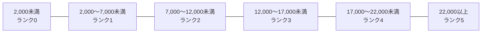

| 給与の範囲 | SALARY_RANK |
| :--- | :---: |
| 2,000以上 〜 7,000未満 | 1 |
| 7,000以上 〜 12,000未満 | 2 |
| 12,000以上 〜 17,000未満 | 3 |
| 17,000以上 〜 22,000未満 | 4 |
| 22,000以上 | 5 |

問題文にある「22,000以上の場合は5と表示する」という条件は、この関数の標準仕様をそのまま使うだけで満たせます。

よく似た関数に`NTILE`がありますが、動作が全く異なります。

| 関数 | 区切り方 | 各グループの人数 |
| :--- | :--- | :--- |
| `WIDTH_BUCKET` | 値の範囲を等間隔に分ける | バラバラになる可能性あり |
| `NTILE` | 全体の行数を等分に分ける | 均等になるように値を割り振る |

今回のように「給与額という絶対的な基準でランク付けしたい」場合は`WIDTH_BUCKET`が適していますが、「上位10%の社員を抽出したい」というような相対的な区切りであれば`NTILE`の方が向いています。私も最初この2つを混同していて、意図した結果と違う集計になったことがあるので、「絶対値の範囲か、相対的な人数割りか」で選ぶ関数が変わる、という点は覚えておくと役に立つと思います。

----
<br><br>

# 問題6-5：符号判定と絶対値による在庫分析（SIGN / ABS）
### 難易度：★★★☆☆ (Lv.3)
## 問題
物流倉庫の在庫管理において、各製品の現在の在庫数（`PRODUCT_INVENTORY`）が、設定されている「適正在庫レベル（今回は一律10個と仮定）」に対して、どの程度乖離しているかを評価するスクリプトが必要です。
単に引き算を行うだけでなく、経営陣へのレポート用に「過剰（プラス）」「不足（マイナス）」「適正（ジャスト）」という状態のラベル分けと、その純粋な乖離の幅（絶対値）を同時に算出し、一目で状況を把握できる高度な数値加工を行います。
COスキーマの`INVENTORY`テーブルより、店舗ID（`STORE_ID`）が `20` のデータを対象に、適正基準値である **「10」** と現在の在庫数（`PRODUCT_INVENTORY`）を比較し、以下のルールで一覧を作成してください。

**【算出のルール】**
* **DIFF（差分）**: `PRODUCT_INVENTORY - 10` の計算結果を表示。
* **STATUS（在庫状態）**: 差分がプラスなら `'過剰'`、マイナスなら `'不足'`、ぴったり `0` なら `'適正'` という文字列を表示してください。
* **ABS_DIFF（乖離幅）**: 不足・過剰を問わず、適正値から「何個ズレているか」の**絶対値**を算出してください。

## 期待する結果
| PRODUCT_ID | PRODUCT_INVENTORY | DIFF | STATUS | ABS_DIFF |
| ---------- | ----------------- | ---- | ------ | -------- |
| 11         | 0                 | -10  | 不足   | 10       |
| 14         | 1                 | -9   | 不足   | 9        |
| 26         | 1                 | -9   | 不足   | 9        |
| 1          | 2                 | -8   | 不足   | 8        |
| 5          | 3                 | -7   | 不足   | 7        |
| 17         | 3                 | -7   | 不足   | 7        |
| 8          | 4                 | -6   | 不足   | 6        |
| 20         | 5                 | -5   | 不足   | 5        |
| 25         | 6                 | -4   | 不足   | 4        |
| 18         | 7                 | -3   | 不足   | 3        |
| 23         | 12                | 2    | 過剰   | 2        |
| 29         | 10                | 0    | 適正   | 0        |

## 解答例
```sql 
SELECT
    product_id,
    product_inventory,
    product_inventory - 10 AS diff,
    CASE SIGN(product_inventory - 10)
        WHEN 1 THEN '過剰'
        WHEN -1 THEN '不足'
        WHEN 0 THEN '適正'
        ELSE NULL END AS status,
    ABS(product_inventory - 10) AS abs_diff
FROM
    co.inventory
WHERE
    store_id = 20
ORDER BY
    abs_diff DESC, product_id
```

## 解説
今回の主役は`SIGN`関数（符号判定）と`ABS`関数（絶対値）です。実務のダッシュボードやレポート作成では、単に計算結果の数値を出すだけでなく、「異常値（大きくズレているデータ）」を目立たせたり、人間が読みやすいラベルに変換したりする処理が求められます。

`SIGN`関数は、与えられた数値の符号に応じて`1`（プラス）、`-1`（マイナス）、`0`（ゼロ）のいずれかだけを返す関数です。

| `product_inventory - 10` の値 | `SIGN(...)` の戻り値 | STATUS |
| :--- | :---: | :---: |
| プラス（例：+2） | 1 | 過剰 |
| マイナス（例：-10） | -1 | 不足 |
| ゼロ | 0 | 適正 |

```sql
CASE SIGN(product_inventory - 10)
    WHEN  1 THEN '過剰'
    WHEN -1 THEN '不足'
    WHEN  0 THEN '適正'
END
```
これを利用することで、`CASE`式を`WHEN 1`、`WHEN -1`というシンプルな値の一致判定（単純CASE式）で書けるようになります。

`ABS`関数は絶対値（Absolute value）を返す関数で、数値からプラス・マイナスの符号を取り除き、「0からどれだけ離れているか」という純粋な距離に変換します。

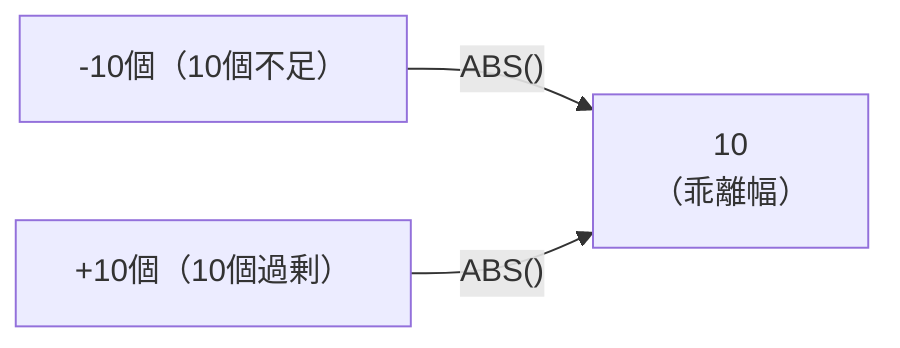

これにより、在庫が「10個足りない（-10）」場合も「10個余っている（+10）」場合も、同じ「10」という乖離幅として扱うことができます。

`SIGN`を使わなくても、次のように`CASE WHEN`（検索CASE式）で同じ結果を得ることは可能です。

```sql
-- SIGN関数を使わない場合
CASE 
    WHEN product_inventory - 10 > 0 THEN '過剰'
    WHEN product_inventory - 10 < 0 THEN '不足'
    ELSE '適正'
END
```

| 書き方 | 条件式を書く回数 | 修正時の手間 |
| :--- | :--- | :--- |
| `SIGN`関数を使う | 1回だけ（`SIGN(...)`の中） | 1箇所を直すだけで済む |
| `CASE WHEN`で毎回書く | 3回（各WHENごと） | 3箇所すべて直す必要があり事故りやすい |

これでも動作は同じですが、条件式（`product_inventory - 10`）を何度も書く必要があり、数式が複雑になったときに記述ミスを誘発しやすくなります。`SIGN`関数で条件式を一箇所にまとめておくと、後から数式を変更する際の修正箇所も1箇所で済み、事故が減ります。

今回のソート順は`ORDER BY abs_diff DESC`（乖離幅の大きい順）になっています。在庫管理で本当に問題視すべきなのは「適正値から大きく外れている商品」なので、このソート順にすることで重大な在庫不足や過剰在庫がレポートの上部に来て、担当者が優先順位を判断しやすくなります。

この`SIGN`と`ABS`のコンビは、予算実績管理（予算に対する実績の上振れ・下振れの判定とそのインパクト測定）、品質・温度管理（基準値からのズレの監視）、株価や為替の前日比判定など、「基準値とのブレ」を監視する業務全般で使われます。

----
<br><br>

# 問題6-6：比率の算出と0除算（ゼロディバイド）対策
### 難易度：★★★☆☆ (Lv.3)
## 問題
人事部門から、営業職のインセンティブ（歩合給）が総支給額に対してどの程度の割合を占めているかを調査したいという依頼がありました。
インセンティブが設定されていない（`NULL`）社員や、基本給・歩合給の合計が0になる（実務上想定される）イレギュラーなデータに対しても、SQLエラー（`ORA-01476: 除数がゼロです。`）を発生させずに、安全に比率を算出する堅牢なクエリを構築します。
HRスキーマの`EMPLOYEES`テーブルより、`JOB_ID`が「SA_MAN」の従業員、またはIDが`100`の従業員を対象として、以下の計算を行ってください。
* **TOTAL_SALARY（総支給額）**: 基本給(SALARY) + 歩合給(SALARY × COMMISSION_PCT) を計算してください。なお、歩合給が`NULL`の場合は`0`として扱ってください。
* **COMMISSION_RATIO（歩合比率）**: 総支給額に占める歩合給の割合（%）を小数点第1位まで（2位以下切り捨て）で算出してください。
* **0除算対策**: 実務でのデータ不備を想定し、万が一「総支給額」が`0`または`NULL`になった場合でもエラーにせず、結果を`NULL`（または空欄）として安全に処理できるようにしてください。

## 期待する結果
| EMPLOYEE_ID | LAST_NAME | SALARY | TOTAL_SALARY | COMMISSION_RATIO |
| ----------- | --------- | ------ | ------------- | ----------------- |
| 100         | King      | 24000  | 24000         | 0                 |
| 145         | Singh     | 14000  | 19600         | 28.5              |
| 146         | Partners  | 13500  | 17550         | 23                |
| 147         | Errazuriz | 12000  | 15600         | 23                |
| 148         | Cambrault | 11000  | 14300         | 23                |
| 149         | Zlotkey   | 10500  | 12600         | 16.6              |

## 解答例
```sql 
SELECT
    employee_id,
    last_name,
    salary,
    salary + NVL(salary * commission_pct, 0) AS total_salary,
    TRUNC(
        (NVL(salary * commission_pct, 0) / 
         NULLIF(salary + NVL(salary * commission_pct, 0), 0)) * 100, 
        1
    ) AS commission_ratio
FROM
    hr.employees
WHERE
    job_id = 'SA_MAN'
    OR employee_id = 100
ORDER BY
    employee_id
```

## 解説
今回のテーマは、実務のレポート作成や給与計算システムで避けて通れないバグ対策、0除算（ゼロディバイド）の回避です。システムを運用していると、「基本給のマスター設定漏れで合計が0になっていた」「一時的な休職者で支給額が0だった」といったイレギュラーなデータがどうしても発生します。そんなとき、クエリがエラー（`ORA-01476`）で落ちてシステムを止めてしまわないよう、SQLの側で安全に受け流すテクニックを見ていきます。

このクエリのポイントは、不備のあるデータ（NULLや0）を段階的に安全な形へ加工している点です。

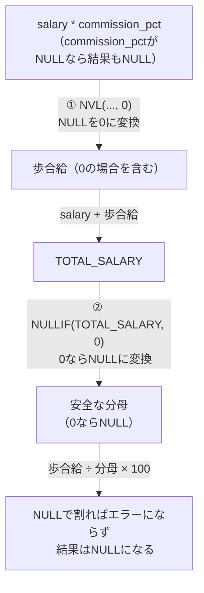

総支給額は「基本給 + NVL(基本給×歩合率, 0)」、歩合比率は「NVL(基本給×歩合率, 0) ÷ NULLIF(総支給額, 0) × 100」という式で計算されています。この分母の部分に施された工夫が、今回のクエリの心臓部です。

SQLでは、数値を`0`で割ると即座にシステムエラーが発生します。これを防ぐために`NULLIF`関数を使います。`NULLIF(A, B)`は「AとBが等しい場合はNULLを返し、異なる場合はAをそのまま返す」という関数です。
```sql
NULLIF(salary + NVL(salary * commission_pct, 0), 0)
```

| 状況 | `NULLIF(合計, 0)` の結果 | 割り算の結果 |
| :--- | :--- | :--- |
| 合計が0でない（例：24000） | 24000（そのまま） | 通常通り計算される |
| 合計が0 | NULL（0からNULLに変換） | エラーにならず結果はNULL |

総支給額の計算結果がもし`0`だった場合、この`NULLIF`によって分母が丸ごとNULLに変換されます。SQLには「どんな数値もNULLで割り算をすると結果はNULLになる（エラーにはならない）」という特性があり、これを利用してエラーを発生させずに結果をNULLに落ち着かせています。

歩合給の比率（`commission_pct`）が設定されていない一般社員の場合、この列にはNULLが入っています。SQLでは、NULLが含まれる掛け算や足し算は結果がすべてNULLになってしまう（NULLの伝播）ため、`NVL(..., 0)`で明示的に0に変換しています。`NVL`なしだと`24000 + NULL = NULL`となって総支給額が消えてしまいますが、`NVL`ありなら`24000 + 0 = 24000`と正しく計算できます。

問題文に「小数点第1位まで（2位以下切り捨て）」とあるため、四捨五入の`ROUND`ではなく、指定した桁数未満をそのまま切り捨てる`TRUNC`関数を使い、第2引数に1を指定しています。

実務で比率（シェア、達成率、前年比など）を計算するクエリを書くときは、「分母にくる列や数式には無条件で`NULLIF(..., 0)`をセットする」というのを手癖にしておくと、思わぬエラーで処理が止まる事故を減らせると思います。

----
<br><br>

# 問題6-7：複数列の横並び比較（GREATEST / LEAST）
### 難易度：★★★☆☆ (Lv.3)
## 問題
マーケティング部門から、商品のプロモーション価格を決定するためのデータ抽出依頼が来ました。
商品ごとに、定価（`LIST_PRICE`）から一律で「20ドル引き」にした値引き価格を検討していますが、あまりに引きすぎると最低販売保証価格（`MIN_PRICE`）を割り込んでしまい、赤字になってしまいます。
「値引き価格」と「最低価格」を横並びで比較し、より高い方の金額を「実際の販売価格」として自動採用するスマートなクエリを実装します。
OEスキーマの`PRODUCT_INFORMATION`テーブルより、`CATEGORY_ID`が`11`の商品を対象として、以下のルールで価格シミュレーションを行ってください。

**【算出のルール】**
* **PROMO_PRICE（仮の値引き価格）**: カタログ価格（`LIST_PRICE`）から一律で `20` を差し引いた金額を計算してください。
* **FINAL_PRICE（最終決定価格）**: 「仮の値引き価格（`PROMO_PRICE`）」と、その商品の最低販売保証価格（`MIN_PRICE`）を比較し、**いずれか大きい方の金額**を最終価格として採用してください。

## 期待する結果
| PRODUCT_ID | LIST_PRICE | MIN_PRICE | PROMO_PRICE | FINAL_PRICE |
| ---------- | ---------- | --------- | ----------- | ----------- |
| 1726       | 259        | 208       | 239         | 239         |
| 2236       | 964        | 863       | 944         | 944         |
| 2243       | 350        | 302       | 330         | 330         |
| 2245       | 512        | 420       | 492         | 492         |
| 2252       | 889        | 717       | 869         | 869         |
| 2359       | 249        | 206       | 229         | 229         |
| 3054       | 600        | 519       | 580         | 580         |
| 3057       | 369        | 320       | 349         | 349         |
| 3060       | 299        | 250       | 279         | 279         |
| 3061       | 499        | 437       | 479         | 479         |
| 3064       | 1023       | 909       | 1003        | 1003        |
| 3065       | 999        | 875       | 979         | 979         |
| 3155       | 49         | 42        | 29          | 42          |
| 3234       | 39         | 34        | 19          | 34          |
| 3331       | 879        | 785       | 859         | 859         |
| 3350       | 740        | 630       | 720         | 720         |

## 解答例
```sql 
SELECT
    product_id,
    list_price,
    min_price,
    list_price - 20 AS promo_price,
    GREATEST(list_price - 20, min_price) AS final_price
FROM
    oe.product_information
WHERE
    category_id = 11
ORDER BY
    product_id
```

## 解説
今回は、知っているとコード量が減り条件分岐がすっきりする`GREATEST`関数の解説です。実務では「下限値を下回ったら下限値に固定する」「上限値を超えたら一律で丸める」といった価格やポイントの計算が頻繁に発生します。これを`CASE`式で愚直に書くと長くなりがちですが、この関数を使えば一撃で済みます。

このクエリの核心は、`FINAL_PRICE`を決定している`GREATEST`関数の動きです。
```sql
GREATEST(list_price - 20, min_price) AS final_price
```

**製品ID 1726（通常ケース）と 3155（下限割れケース）の比較**

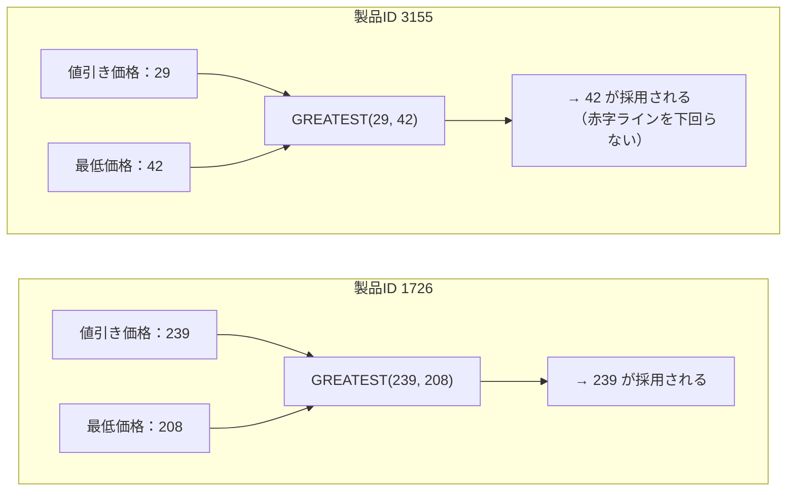

期待する結果を見ると、この関数の効果がよくわかります。製品ID 1726のような通常の値引きでは、定価259ドルから20ドルを引いた値引き価格239が最低価格208より大きいため、そのまま最終価格239として採用されます。一方、製品ID 3155のようなケースでは、定価49ドルから20ドルを引くと値引き価格は29まで落ち込んでしまいますが、最低価格は42のため、`GREATEST(29, 42)`が実行されてより大きい42が自動採用されます。「もし値引き価格が最低価格を下回ったら〜」という条件分岐を`CASE`式で書くことなく、「赤字ラインを下回らせない」というビジネスルールを1行で実現しているわけです。

SQLには最大値を求める関数として`MAX`と`GREATEST`の2つがありますが、比較する方向が違います。

| 関数 | 比較する方向 | 典型的な使い方 |
| :--- | :--- | :--- |
| `MAX(列名)` | 縦方向（複数行） | `GROUP BY`等と組み合わせ、テーブル全体から最大値を探す |
| `GREATEST(値1, 値2, ...)` | 横方向（同じ行の複数列・数式） | 1行内にある異なる列や計算結果を比較する |

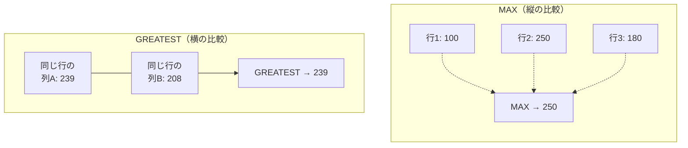

この2つを混同すると意図しない結果になるので、「縦の比較か、横の比較か」で区別すると覚えやすいと思います。

`GREATEST`（および最小値を選ぶ`LEAST`）を使う際に忘れてはいけないのが、「比較対象の中に1つでもNULLがあると、結果が強制的にNULLになる」という性質です。もし新商品などで`MIN_PRICE`が未入力（NULL）のデータが紛れ込んでいると、値引き価格がいくらであれ`FINAL_PRICE`が消えてしまいます。実務で使う場合は、次のように`NVL`で防御しておくのが安全です。
```sql
-- MIN_PRICEがNULLなら0として安全に比較する書き方
GREATEST(list_price - 20, NVL(min_price, 0))
```
私も一度、このNULL混入に気づかず本番データで検証していて、なぜか一部の商品だけ`FINAL_PRICE`が空欄になっているのを見て慌てて調べたことがあります。`GREATEST`/`LEAST`を使うときは、比較対象の列にNULLの可能性がないか一度確認しておくことをおすすめします。

この`GREATEST`と`LEAST`のコンビは、システムのロジックに「制限」をかけるときによく使われます。

| 制御したい内容 | 使う関数 | 書き方の例 |
| :--- | :--- | :--- |
| 上限（天井）の制御（例：ポイント付与は最大5,000まで） | `LEAST` | `LEAST(purchased_amount * 0.1, 5000)` |
| 下限（床）の制御（例：出荷日数は最低1日確保） | `GREATEST` | `GREATEST(ship_date - order_date, 1)` |

---
<br><br>

# 問題6-8：FLOORとTRUNCの違い（マイナス値の丸め落とし穴）
### 難易度：★★★☆☆ (Lv.3)
## 問題
経理部門から「予算差異率」の丸め処理について、新人担当者が実装したクエリの検算依頼が来ました。

社内の会計ルールでは、予算に対する差異率（%）を扱う際、**「必ず安全側（実績がより悪く見える方向）に丸める」**という規定があります。具体的には、超過（プラス）・未達（マイナス）を問わず、小数点以下の端数は**マイナス方向（数直線の左側）に切り捨てる**ことになっています。

以下の`budget_data`（`WITH`句による疑似データ）を対象に、各部署の予算（`BUDGET`）と実績（`ACTUAL`）から差異率を算出し、上記ルールに則った丸め処理を行ってください。あわせて、他の丸め関数との結果の違いも比較できるようにします。

```sql
WITH budget_data AS (
    SELECT '営業部' AS dept_name, 200000 AS budget, 207000 AS actual FROM dual UNION ALL
    SELECT '総務部', 150000, 145500 FROM dual UNION ALL
    SELECT '開発部', 300000, 291600 FROM dual UNION ALL
    SELECT '人事部', 80000,  83280  FROM dual UNION ALL
    SELECT '経理部', 120000, 114000 FROM dual UNION ALL
    SELECT '物流部', 90000,  86850  FROM dual
)
SELECT * FROM budget_data
```

**【算出内容】**
* **DIFF_RATE**：差異率 `(ACTUAL - BUDGET) / BUDGET * 100` を小数点第1位まで表示。
* **FLOOR_RATE**：会計ルールに従い、`FLOOR`関数で安全側（マイナス方向）に丸めた整数値。
* **TRUNC_RATE**：比較用として、`TRUNC`関数でゼロ方向に丸めた整数値。
* **ROUND_RATE**：比較用として、`ROUND`関数で四捨五入した整数値。

**【表示・ソート条件】**
* レコードの表示順序は、`DIFF_RATE`の**昇順**（マイナスの大きいものが先頭）としてください。

## 期待する結果
| DEPT_NAME | BUDGET | ACTUAL | DIFF_RATE | FLOOR_RATE | TRUNC_RATE | ROUND_RATE | 
| --------- | ------ | ------ | --------- | ---------- | ---------- | ---------- | 
| 経理部    | 120000 | 114000 | -5        | -5         | -5         | -5         | 
| 物流部    | 90000  | 86850  | -3.5      | -4         | -3         | -4         | 
| 総務部    | 150000 | 145500 | -3        | -3         | -3         | -3         | 
| 開発部    | 300000 | 291600 | -2.8      | -3         | -2         | -3         | 
| 営業部    | 200000 | 207000 | 3.5       | 3          | 3          | 4          | 
| 人事部    | 80000  | 83280  | 4.1       | 4          | 4          | 4          | 

## 解答例

まず、新人担当者が実際に書いてしまった誤りのクエリを見てみましょう。

```sql:失敗例：「切り捨て」＝TRUNCだと思い込んでしまうケース
WITH budget_data AS (
    SELECT '営業部' AS dept_name, 200000 AS budget, 207000 AS actual FROM dual UNION ALL
    SELECT '総務部', 150000, 145500 FROM dual UNION ALL
    SELECT '開発部', 300000, 291600 FROM dual UNION ALL
    SELECT '人事部', 80000,  83280  FROM dual UNION ALL
    SELECT '経理部', 120000, 114000 FROM dual UNION ALL
    SELECT '物流部', 90000,  86850  FROM dual
)
SELECT
    dept_name,
    budget,
    actual,
    ROUND((actual - budget) / budget * 100, 1) AS diff_rate,
    TRUNC((actual - budget) / budget * 100)    AS floor_rate  -- ★本来はFLOORにすべき箇所
FROM
    budget_data
ORDER BY
    diff_rate
```

このクエリを実行すると、物流部が本来`-4`になるべきところ`-3`に、開発部が本来`-3`になるべきところ`-2`になってしまいます。「小数点以下を切り捨てる」という言葉のイメージだけで`TRUNC`を選んでしまうと、マイナス値では意図と逆方向に丸まってしまうのです。

正しい解答は以下の通りです。

```sql
WITH budget_data AS (
    SELECT '営業部' AS dept_name, 200000 AS budget, 207000 AS actual FROM dual UNION ALL
    SELECT '総務部', 150000, 145500 FROM dual UNION ALL
    SELECT '開発部', 300000, 291600 FROM dual UNION ALL
    SELECT '人事部', 80000,  83280  FROM dual UNION ALL
    SELECT '経理部', 120000, 114000 FROM dual UNION ALL
    SELECT '物流部', 90000,  86850  FROM dual
)
SELECT
    dept_name,
    budget,
    actual,
    ROUND((actual - budget) / budget * 100, 1) AS diff_rate,
    FLOOR((actual - budget) / budget * 100)    AS floor_rate,
    TRUNC((actual - budget) / budget * 100)    AS trunc_rate,
    ROUND((actual - budget) / budget * 100)    AS round_rate
FROM
    budget_data
ORDER BY
    diff_rate
```

## 解説
6-2では`TRUNC`・`ROUND`・`CEIL`の3つの端数処理関数を扱いましたが、実はもう一つ、丸め処理の基本セットとして欠かせない関数があります。それが今回登場する`FLOOR`（床、切り捨て）です。

`FLOOR`と`TRUNC`は、どちらも「小数点以下を切り捨てる関数」としてしばしば同一視されますが、その定義は明確に異なります。

| 関数 | 正式な定義 | 桁数指定 |
| :--- | :--- | :---: |
| `TRUNC(x)` | **ゼロ方向**に切り捨てる（小数部分を単純に捨てる） | できる |
| `FLOOR(x)` | その数値**以下の最大の整数**を返す（数直線上で常に左側＝マイナス方向） | できない（常に整数） |

正の数を扱っている限り、「ゼロ方向」も「マイナス方向（数直線の左）」も同じ向きなので、この2つの関数は同じ結果を返します。今回の営業部（3.5）や人事部（4.1）で`FLOOR_RATE`と`TRUNC_RATE`が一致しているのはこのためです。

しかし、負の数になった途端に両者の挙動は分かれます。

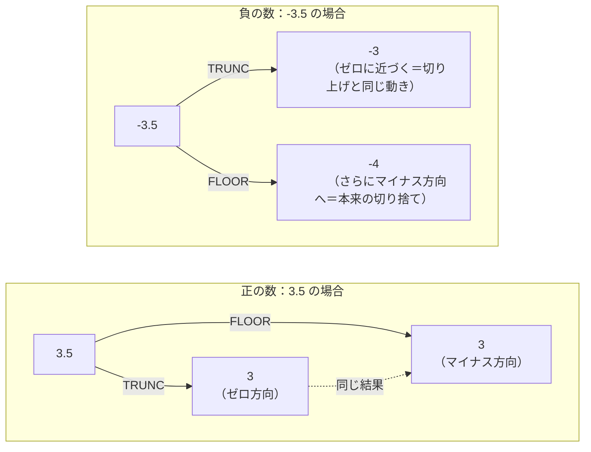

数直線でイメージすると分かりやすくなります。`-3.5`という値は、`-3`と`-4`という2つの整数に挟まれています。`TRUNC`は符号を無視して小数部分を単純に切り落とすため、絶対値が小さくなる方向（`-3`）に動きます。一方`FLOOR`は「その数値以下の最大の整数」という定義通り、数直線上で必ず左側（より小さい・よりマイナスの`-4`）を選びます。

| DIFF_RATE | FLOOR_RATE（左＝マイナス方向） | TRUNC_RATE（ゼロに近づく方向） | 差 |
| :---: | :---: | :---: | :---: |
| -5.0（整数） | -5 | -5 | なし |
| -3.5 | **-4** | **-3** | **あり** |
| -3.0（整数） | -3 | -3 | なし |
| -2.8 | **-3** | **-2** | **あり** |
| 3.5（正の数） | 3 | 3 | なし |

この表から分かる通り、両者の差が生まれるのは「負の数」かつ「小数部分を持つ」場合に限られます。整数値（経理部の`-5.0`、総務部の`-3.0`）では、どちらの関数を使っても同じ結果になるため、テストケースに整数値しか含まれていないとこのバグは発見できません。**「正常なケースでは気づかないが、境界条件（負の小数）でだけ表面化するバグ」**の典型例であり、今回の失敗例のように「小数点以下を切り捨てる＝TRUNC」という思い込みだけでコードを書いてしまうと、レビューでもすり抜けやすい点に注意が必要です。

6-2で扱った`ROUND`と`CEIL`も合わせて、4つの端数処理関数の関係を整理すると以下のようになります。

| 関数 | 丸める方向 | -3.5 の結果 | 3.5 の結果 |
| :--- | :--- | :---: | :---: |
| `CEIL` | 常にプラス方向（数直線の右） | -3 | 4 |
| `FLOOR` | 常にマイナス方向（数直線の左） | -4 | 3 |
| `TRUNC` | 常にゼロに近づく方向 | -3 | 3 |
| `ROUND` | 最も近い整数（四捨五入） | -4 | 4 |

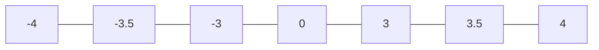

`CEIL`と`FLOOR`は常に「天井」と「床」、つまり数直線上の右と左という決まった方向にしか動かない一方、`TRUNC`は原点（0）を基準にどちらの方向にも動く、という違いを意識しておくと混同を防げます。

今回のような「安全側（保守的）に丸める」という要件は、会計・与信管理（実績が悪く見える方向に丸めて楽観視を防ぐ）だけでなく、在庫の引当可能数計算（半端な数量は切り捨てて過剰な引当を防ぐ）など、幅広い業務ロジックに登場します。「切り捨て」という日本語だけで関数を選ばず、「ゼロ方向なのか、マイナス方向なのか」を要件から正確に読み取ることが重要です。

## 参考リンク
https://www.shift-the-oracle.com/sql/functions/trunc.html
https://www.shift-the-oracle.com/sql/functions/round.html

---
<br><br>

# 問題6-9：TO_NUMBERによる文字列データの数値変換
### 難易度：★★☆☆☆ (Lv.2)
## 問題
経費精算システムの改修を担当することになりました。旧システムからエクスポートされたCSVを取り込んだところ、金額列が下記のような「`$`記号とカンマ付きの文字列」のまま格納されてしまっていることが判明しました。このままでは金額の合計（`SUM`）や大小比較ができないため、正しい`NUMBER`型に変換する処理を実装してください。

以下の`expense_data`（`WITH`句による疑似データ）を対象に、文字列の金額（`STR_AMOUNT`）を数値に変換してください。

```sql
WITH expense_data AS (
    SELECT 'システム開発部' AS dept_name, '$12,500'  AS str_amount FROM dual UNION ALL
    SELECT 'マーケティング部',           '$8,300'   FROM dual UNION ALL
    SELECT '経理部',                     '$45,000'  FROM dual UNION ALL
    SELECT '人事部',                     '$3,750'   FROM dual UNION ALL
    SELECT '総務部',                     '$120,000' FROM dual
)
SELECT * FROM expense_data
```

**【算出内容】**
* **NUM_AMOUNT**：`STR_AMOUNT`（`$`記号・カンマ付きの文字列）を、正しい`NUMBER`型の数値に変換してください。

**【表示・ソート条件】**
* レコードの表示順序は、`NUM_AMOUNT`の**降順**としてください。

## 期待する結果
| DEPT_NAME        | STR_AMOUNT  | NUM_AMOUNT | 
| ---------------- | ----------- | ---------- | 
| 総務部           | $120,000.00 | 120000     | 
| 経理部           | $45,000.00  | 45000      | 
| システム開発部   | $12,500.00  | 12500      | 
| マーケティング部 | $8,300.00   | 8300       | 
| 人事部           | $3,750.00   | 3750       | 

## 解答例

まず、多くの人が最初につまずく書き方を見てみましょう。

```sql:失敗例：フォーマットモデルなしでTO_NUMBERを使う
WITH expense_data AS (
    SELECT 'システム開発部' AS dept_name, '$12,500'  AS str_amount FROM dual UNION ALL
    SELECT 'マーケティング部',           '$8,300'   FROM dual UNION ALL
    SELECT '経理部',                     '$45,000'  FROM dual UNION ALL
    SELECT '人事部',                     '$3,750'   FROM dual UNION ALL
    SELECT '総務部',                     '$120,000' FROM dual
)
SELECT
    dept_name,
    str_amount,
    TO_NUMBER(str_amount) AS num_amount  -- ★フォーマットモデルの指定がない
FROM
    expense_data
ORDER BY
    num_amount DESC
```

このクエリを実行すると、結果が返る前に **`ORA-01722: 数値が無効です`** というエラーで処理が止まってしまいます。`$12,500`という文字列は、`$`や`,`を含んだままでは単純な数値としては解釈できないためです。

正しい解答は以下の通りです。

```sql
WITH expense_data AS (
    SELECT 'システム開発部' AS dept_name, '$12,500'  AS str_amount FROM dual UNION ALL
    SELECT 'マーケティング部',           '$8,300'   FROM dual UNION ALL
    SELECT '経理部',                     '$45,000'  FROM dual UNION ALL
    SELECT '人事部',                     '$3,750'   FROM dual UNION ALL
    SELECT '総務部',                     '$120,000' FROM dual
)
SELECT
    dept_name,
    str_amount,
    TO_NUMBER(str_amount, 'FM$999,999,999') AS num_amount
FROM
    expense_data
ORDER BY
    num_amount DESC
```

## 解説
6-3では`TO_CHAR`関数を使い、数値を「`$12,000`」のような見やすい文字列に変換する方法を学びました。今回の`TO_NUMBER`はその**逆方向**の変換、つまり「`$12,000`」のような整形済みの文字列から、計算や集計に使える生の数値（`12000`）を取り出す関数です。

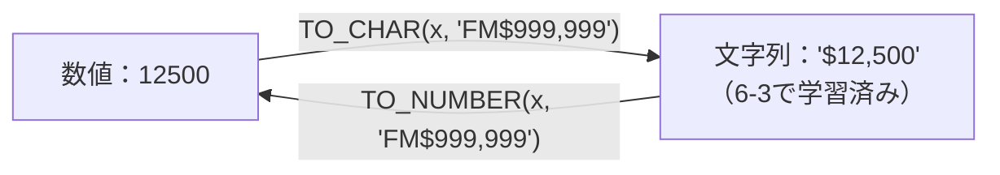

`TO_CHAR`と`TO_NUMBER`は表裏一体の関係にあり、**同じフォーマットモデル（`$`, `9`, `,`などの記号）をそのまま使い回せる**という点が重要です。6-3で登場した書式記号の意味を、今回は「読み取り」の視点で振り返ってみましょう。

| 記号 | `TO_CHAR`（数値→文字列）での役割 | `TO_NUMBER`（文字列→数値）での役割 |
| :---: | :--- | :--- |
| `9` | 数字の位置を出力 | その位置に数字があるものとして読み取る |
| `$` | ドル記号を出力 | 文字列側に`$`がある前提で、その分をスキップして読み取る |
| `,` | 3桁区切りのカンマを出力 | 文字列側にカンマがある前提で、その分をスキップして読み取る |
| `FM` | 余分な空白を除去して出力 | 前後の余白を許容せず、厳密な桁詰めで読み取る |

なぜ失敗例のようにフォーマットモデルを省略するとエラーになるのか、`TO_NUMBER`の読み取りプロセスに沿って見てみます。

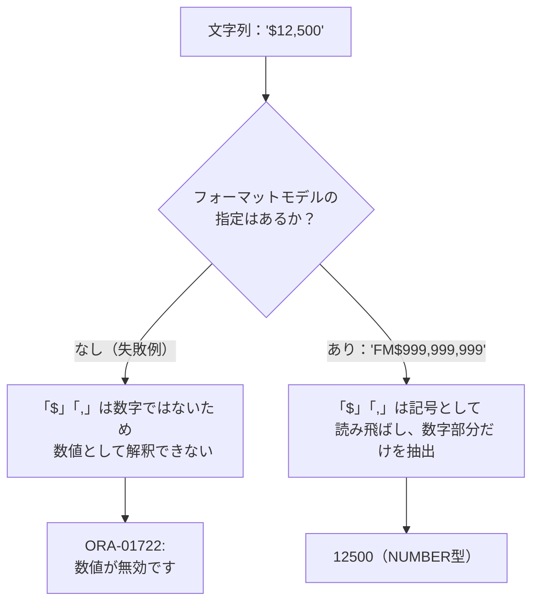

`TO_NUMBER`にフォーマットモデルを渡さない場合、Oracleは文字列を「純粋な数字の並び」としてしか解釈できません。`$`や`,`のような記号が混ざっていると、それを数値の一部として認識できずにエラーになります。フォーマットモデルを渡すことで初めて、「この位置には`$`記号がある」「この位置にはカンマ区切りがある」ということをOracleに教えてあげられるわけです。

ここで注意したいのが、フォーマットモデルは**文字列の見た目と正確に対応している必要がある**という点です。桁区切りのカンマの位置がずれていたり、想定していない記号が紛れ込んでいたりすると、フォーマットモデルを指定していても同じ`ORA-01722`エラーが発生します。

| STR_AMOUNTの実際の値 | 使用するマスク | 結果 |
| :--- | :--- | :---: |
| `'$12,500'` | `'FM$999,999,999'` | 12500（成功） |
| `'12,500円'` | `'FM$999,999,999'` | エラー（`$`がなく`円`という未対応の文字がある） |
| `'$ 12,500'`（$の後に半角スペース） | `'FM$999,999,999'` | エラー（スペースの分だけ構造がずれる） |

実務では、CSVの出力元システムが変わったり、途中でフォーマットのバージョンが変わったりすると、この「マスクと実データの不一致」によるエラーに突き当たることがよくあります。私も一度、連携先システムの仕様変更で桁区切りの記号がカンマからピリオドに変わっていたことに気づかず、朝のバッチ処理がエラーで止まっていた、ということがありました。外部データを`TO_NUMBER`で変換する処理を書く際は、想定外のフォーマットが紛れ込む可能性を考慮し、後述するようなエラーハンドリングを組み合わせておくと安全です。

:::message
### 実務での安全策：変換できないデータへの対処
今回のデータはすべて綺麗な`$`形式でしたが、実際のCSV取込では「一部の行だけ書式が崩れている」「空文字が混ざっている」といった不正データに遭遇することが珍しくありません。1件でも変換に失敗すると`ORA-01722`でクエリ全体が停止してしまうため、Oracle 12c以降であれば`DEFAULT ... ON CONVERSION ERROR`句を使い、変換できない値だけを安全な既定値（例：`NULL`や`0`）に落とすという方法があります。

```sql
TO_NUMBER(str_amount DEFAULT NULL ON CONVERSION ERROR, 'FM$999,999,999')
```

こうしておけば、不正な文字列が混ざっていてもバッチ処理全体が止まることなく、該当行だけを`NULL`として後続の調査に回すことができます。
:::

こうして数値型に変換できれば、`SUM(num_amount)`で部門横断の合計を出したり、`num_amount > 10000`のような大小比較でフィルタしたりと、6-1〜6-8で学んだ数値演算の武器がすべて使えるようになります。文字列のままでは「`'$8,300'`と`'$45,000'`のどちらが大きいか」を辞書順（文字コード順）でしか比較できず、正しい大小関係が得られない点も、変換の必要性を裏付けています。

## 参考リンク
https://www.shift-the-oracle.com/sql/functions/to_number.html
https://www.shift-the-oracle.com/sql/functions/to_char.html

---
<br><br>

# 問題6-10：MODとREMAINDERの符号の違い
### 難易度：★★★☆☆ (Lv.3)
## 問題
出荷管理システムの改修を担当することになりました。このシステムでは、注文数量（`ORDER_QTY`）を5個入りのケース単位で梱包し、ケースに入りきらない端数分は「バラ出荷」として別扱いにするというルールがあります。

新人担当者が実装したクエリをテスト環境で動かしたところ、一部の注文で「バラ出荷数」が**マイナス**という、業務上あり得ない値になってしまうという報告がありました。原因を調査し、正しいクエリに修正してください。

以下の`orders_data`（`WITH`句による疑似データ）を対象に、ケースサイズ「5」で割った際の端数（バラ出荷数）を算出してください。

```sql
WITH orders_data AS (
    SELECT 9  AS order_qty FROM dual UNION ALL
    SELECT 12 FROM dual UNION ALL
    SELECT 18 FROM dual UNION ALL
    SELECT 23 FROM dual UNION ALL
    SELECT 31 FROM dual UNION ALL
    SELECT 47 FROM dual
)
SELECT * FROM orders_data
```

**【算出内容】**
* **CASE_SIZE**：ケースサイズとして固定値`5`を表示。
* **REMAINDER_QTY**：注文数量をケースサイズで割った際の「バラ出荷数」を、業務ルールに沿った正しい方法（**常に0以上の値**になる）で算出してください。

**【表示・ソート条件】**
* レコードの表示順序は、`ORDER_QTY`の**昇順**としてください。

## 期待する結果
| ORDER_QTY | CASE_SIZE | REMAINDER_QTY | 
| --------- | --------- | ------------- | 
| 9         | 5         | 4             | 
| 12        | 5         | 2             | 
| 18        | 5         | 3             | 
| 23        | 5         | 3             | 
| 31        | 5         | 1             | 
| 47        | 5         | 2             | 

## 解答例

新人担当者が実際に書いてしまったクエリを見てみましょう。関数名に「REMAINDER（余り）」という単語がそのまま使われているため、真っ先にこちらを選んでしまったようです。

```sql:失敗例：関数名の響きだけでREMAINDERを選んでしまうケース
WITH orders_data AS (
    SELECT 9  AS order_qty FROM dual UNION ALL
    SELECT 12 FROM dual UNION ALL
    SELECT 18 FROM dual UNION ALL
    SELECT 23 FROM dual UNION ALL
    SELECT 31 FROM dual UNION ALL
    SELECT 47 FROM dual
)
SELECT
    order_qty,
    5 AS case_size,
    REMAINDER(order_qty, 5) AS remainder_qty  -- ★これが誤り
FROM
    orders_data
ORDER BY
    order_qty
```

このクエリを実行すると、注文数量9のバラ出荷数が`-1`、18が`-2`、23が`-2`という、個数としてあり得ないマイナスの値が発生してしまいます。

正しい解答は以下の通りです。

```sql
WITH orders_data AS (
    SELECT 9  AS order_qty FROM dual UNION ALL
    SELECT 12 FROM dual UNION ALL
    SELECT 18 FROM dual UNION ALL
    SELECT 23 FROM dual UNION ALL
    SELECT 31 FROM dual UNION ALL
    SELECT 47 FROM dual
)
SELECT
    order_qty,
    5 AS case_size,
    MOD(order_qty, 5) AS remainder_qty
FROM
    orders_data
ORDER BY
    order_qty
```

## 解説
6-1で`MOD`関数を学んだ際は「割り算の余りを求める関数」とシンプルに紹介しましたが、Oracleには`MOD`とよく似た`REMAINDER`という関数も存在します。名前だけを見ると`REMAINDER`（余り）の方が直感的に正しそうに思えますが、実は両者は**商をどちら向きに丸めてから引き算するか**という点で計算方法が根本的に異なります。

| 関数 | 内部的な計算式 | 商の丸め方 |
| :--- | :--- | :--- |
| `MOD(n1, n2)` | `n1 - n2 * TRUNC(n1/n2)` | **ゼロ方向**に切り捨て（6-8の`TRUNC`と同じ考え方） |
| `REMAINDER(n1, n2)` | `n1 - n2 * ROUND(n1/n2)` | **四捨五入**して最も近い整数に丸める |

この定義の違いを、今回マイナスになってしまった `ORDER_QTY = 9` のケースで具体的に追ってみます。

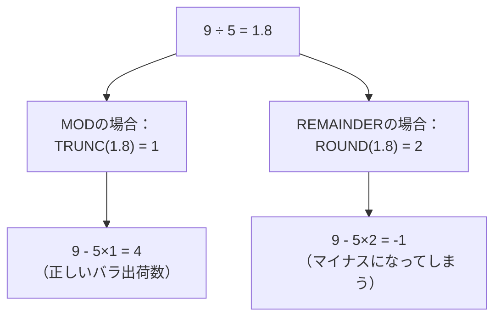

`9 ÷ 5 = 1.8`という商に対して、`MOD`は小数部分を切り捨てて商を`1`とみなします（ケース1個分＝5個を確保し、残り4個がバラ）。一方`REMAINDER`は商を四捨五入して`2`とみなしてしまいます（ケース2個分＝10個を確保しようとするが、実際の注文は9個しかないため1個分マイナスになる）。この「商をどちらに丸めるか」という差が、そのまま余りの符号のズレとして表面化しているわけです。

この違いが実際に発生するかどうかは、商の小数部分が`0.5`以上か未満かで決まります。

| ORDER_QTY | 商（÷5） | 小数部分 | MODとREMAINDERの結果 |
| :---: | :---: | :---: | :--- |
| 9 | 1.8 | 0.8（0.5以上） | 異なる（4 と -1） |
| 12 | 2.4 | 0.4（0.5未満） | 同じ（2 と 2） |
| 18 | 3.6 | 0.6（0.5以上） | 異なる（3 と -2） |
| 23 | 4.6 | 0.6（0.5以上） | 異なる（3 と -2） |
| 31 | 6.2 | 0.2（0.5未満） | 同じ（1 と 1） |
| 47 | 9.4 | 0.4（0.5未満） | 同じ（2 と 2） |

小数部分が`0.5`未満であれば四捨五入しても切り捨てても商は変わらないため、両者の結果は一致します。しかし`0.5`以上になると`REMAINDER`は商を1つ繰り上げてしまうため、割られる数（`ORDER_QTY`）を超える量を引き算することになり、結果がマイナスに転じてしまうのです。

「余りの個数」を扱う実務のほとんどのケース——今回のような梱包の端数、ページネーションの残り件数、ローテーション勤務の割り当てなど——では、`MOD`が返す「`0`以上、割る数未満」という値の範囲がそのまま業務上の個数として扱えるため、標準の選択肢は`MOD`一択と考えて問題ありません。

:::message
### REMAINDERが本来向いている使い道
一見出番のなさそうな`REMAINDER`ですが、「原点（0）からの最短距離としての余り」が欲しい場面では真価を発揮します。代表例が**角度の正規化**です。

例えば「190度」という角度を、方位計算などでよく使う「-180度〜180度」の範囲に変換したいとします。
```sql
SELECT MOD(190, 360) AS mod_result, REMAINDER(190, 360) AS remainder_result FROM dual;
-- MOD_RESULT: 190（0〜360の範囲に収まるだけで、正規化はされない）
-- REMAINDER_RESULT: -170（-180〜180の範囲にきれいに正規化される）
```
`REMAINDER`は商を四捨五入することで、常に「絶対値が割る数の半分以下」に収まる余りを返します。この性質が、角度や位相のように「ゼロを中心とした符号付きのズレ」を求めたい場面と噛み合うのです。今回のような個数計算では不向きでも、関数そのものが無意味というわけではなく、**適材適所**であることは覚えておくとよいでしょう。
:::

関数名の響きだけで機能を判断せず、「商をどちら向きに丸めているか」という定義まで踏み込んで理解しておくことが、今回のような符号の事故を防ぐ一番の近道です。

## 参考リンク
https://www.shift-the-oracle.com/sql/functions/mod-remainder.html

---
<br><br>

# 問題6-11：NaN/Infinityの検出と安全な集計（BINARY_DOUBLE）
### 難易度：★★★☆☆ (Lv.3)
## 問題
研究部門のセンサーデータ解析システムを担当することになりました。このシステムでは、信号値（`SIGNAL`）とノイズ値（`NOISE`）から**信号対雑音比（S/N比 = SIGNAL ÷ NOISE）**を算出していますが、両方とも`BINARY_DOUBLE`型で扱われています。

センサーの故障などにより、まれに`NOISE`が`0`になったり、`SIGNAL`と`NOISE`の両方が`0`になったりするデータが混入することが分かっています。6-6で学んだ`NULLIF`による0除算対策は`NUMBER`型が前提でしたが、`BINARY_DOUBLE`型ではそもそも0除算がエラーにならないため、別のアプローチで異常値を検出し、後続の統計処理に影響を与えないよう安全に処理してください。

以下の`sensor_data`（`WITH`句による疑似データ）を対象に、S/N比の算出と異常値判定を行ってください。

```sql
WITH sensor_data AS (
    SELECT 1 AS sensor_id, CAST(100 AS BINARY_DOUBLE) AS signal_val, CAST(5  AS BINARY_DOUBLE) AS noise_val FROM dual UNION ALL
    SELECT 2, CAST(80  AS BINARY_DOUBLE), CAST(0  AS BINARY_DOUBLE) FROM dual UNION ALL
    SELECT 3, CAST(0   AS BINARY_DOUBLE), CAST(0  AS BINARY_DOUBLE) FROM dual UNION ALL
    SELECT 4, CAST(60  AS BINARY_DOUBLE), CAST(3  AS BINARY_DOUBLE) FROM dual UNION ALL
    SELECT 5, CAST(45  AS BINARY_DOUBLE), CAST(0  AS BINARY_DOUBLE) FROM dual UNION ALL
    SELECT 6, CAST(0   AS BINARY_DOUBLE), CAST(10 AS BINARY_DOUBLE) FROM dual
)
SELECT * FROM sensor_data
```

**【算出内容】**
* **RATIO**：`SIGNAL ÷ NOISE`（S/N比）をそのまま表示。
* **RATIO_TYPE**：`RATIO`の値が`'NaN'`（非数）、`'Infinity'`（無限大）、`'数値'`（正常な数値）のいずれに該当するかを判定してください。
* **SAFE_RATIO**：`RATIO_TYPE`が`'数値'`の場合はそのままの値を、`'NaN'`または`'Infinity'`の場合は`NULL`を表示してください（後続の`AVG`などの集計処理を汚染しないための安全策）。

**【表示・ソート条件】**
* レコードの表示順序は、`SENSOR_ID`の昇順としてください。

## 期待する結果
| SENSOR_ID | SIGNAL | NOISE | RATIO    | RATIO_TYPE | SAFE_RATIO | 
| --------- | ------ | ----- | -------- | ---------- | ---------- | 
| 1         | 100    | 5     | 20       | 数値       | 20         | 
| 2         | 80     | 0     | Infinity | Infinity   |            | 
| 3         | 0      | 0     | NaN      | NaN        |            | 
| 4         | 60     | 3     | 20       | 数値       | 20         | 
| 5         | 45     | 0     | Infinity | Infinity   |            | 
| 6         | 0      | 10    | 0        | 数値       | 0          | 

## 解答例

まず、新人担当者が書いてしまった、一見それらしく見える誤りのクエリを見てみましょう。

```sql:失敗例：NANVLだけで対策したつもりになるケース
WITH sensor_data AS (
    SELECT 1 AS sensor_id, CAST(100 AS BINARY_DOUBLE) AS signal_val, CAST(5  AS BINARY_DOUBLE) AS noise_val FROM dual UNION ALL
    SELECT 2, CAST(80  AS BINARY_DOUBLE), CAST(0  AS BINARY_DOUBLE) FROM dual UNION ALL
    SELECT 3, CAST(0   AS BINARY_DOUBLE), CAST(0  AS BINARY_DOUBLE) FROM dual UNION ALL
    SELECT 4, CAST(60  AS BINARY_DOUBLE), CAST(3  AS BINARY_DOUBLE) FROM dual UNION ALL
    SELECT 5, CAST(45  AS BINARY_DOUBLE), CAST(0  AS BINARY_DOUBLE) FROM dual UNION ALL
    SELECT 6, CAST(0   AS BINARY_DOUBLE), CAST(10 AS BINARY_DOUBLE) FROM dual
)
SELECT
    sensor_id,
    signal_val AS signal,
    noise_val  AS noise,
    ratio,
    NANVL(ratio, NULL) AS safe_ratio  -- ★NaNは救えるが、Infinityはすり抜ける
FROM (
    SELECT
        sensor_id,
        signal_val,
        noise_val,
        signal_val / noise_val AS ratio
    FROM
        sensor_data
)
ORDER BY
    sensor_id
```

このクエリを実行すると、`SENSOR_ID = 3`（`NaN`）は`NULL`に変換されるものの、`SENSOR_ID = 2`と`5`（`Infinity`）はそのまま`Inf`という値が残ってしまいます。`NANVL`という名前から「危険な値は全部これで救える」と誤解してしまうのが、この失敗の典型的な原因です。

正しい解答は以下の通りです。

```sql
WITH sensor_data AS (
    SELECT 1 AS sensor_id, CAST(100 AS BINARY_DOUBLE) AS signal_val, CAST(5  AS BINARY_DOUBLE) AS noise_val FROM dual UNION ALL
    SELECT 2, CAST(80  AS BINARY_DOUBLE), CAST(0  AS BINARY_DOUBLE) FROM dual UNION ALL
    SELECT 3, CAST(0   AS BINARY_DOUBLE), CAST(0  AS BINARY_DOUBLE) FROM dual UNION ALL
    SELECT 4, CAST(60  AS BINARY_DOUBLE), CAST(3  AS BINARY_DOUBLE) FROM dual UNION ALL
    SELECT 5, CAST(45  AS BINARY_DOUBLE), CAST(0  AS BINARY_DOUBLE) FROM dual UNION ALL
    SELECT 6, CAST(0   AS BINARY_DOUBLE), CAST(10 AS BINARY_DOUBLE) FROM dual
)
SELECT
    sensor_id,
    signal_val AS signal,
    noise_val  AS noise,
    ratio,
    CASE
        WHEN ratio IS NAN THEN 'NaN'
        WHEN ratio IN (BINARY_DOUBLE_INFINITY, -BINARY_DOUBLE_INFINITY) THEN 'Infinity'
        ELSE '数値'
    END AS ratio_type,
    CASE
        WHEN ratio IS NAN THEN NULL
        WHEN ratio IN (BINARY_DOUBLE_INFINITY, -BINARY_DOUBLE_INFINITY) THEN NULL
        ELSE ratio
    END AS safe_ratio
FROM (
    SELECT
        sensor_id,
        signal_val,
        noise_val,
        signal_val / noise_val AS ratio
    FROM
        sensor_data
)
ORDER BY
    sensor_id
```

## 解説
6-2のコラムで「Oracleの`NUMBER`型は10進数を正確に扱うため誤差が出にくいが、`BINARY_FLOAT`/`BINARY_DOUBLE`型はIEEE754の2進浮動小数点数を採用しているため事情が異なる」という話に触れました。今回はその伏線を回収し、`BINARY_DOUBLE`型ならではの「0除算がエラーにならない」という特殊な挙動と、その安全な扱い方を見ていきます。

`NUMBER`型で`0`除算を行うと、6-6で見た通り`ORA-01476: 除数がゼロです。`という実行時エラーが即座に発生します。ところが`BINARY_FLOAT`/`BINARY_DOUBLE`型は、IEEE754という国際標準規格に準拠しており、この規格では「0で割る」という演算そのものにも意味のある結果を定義しています。

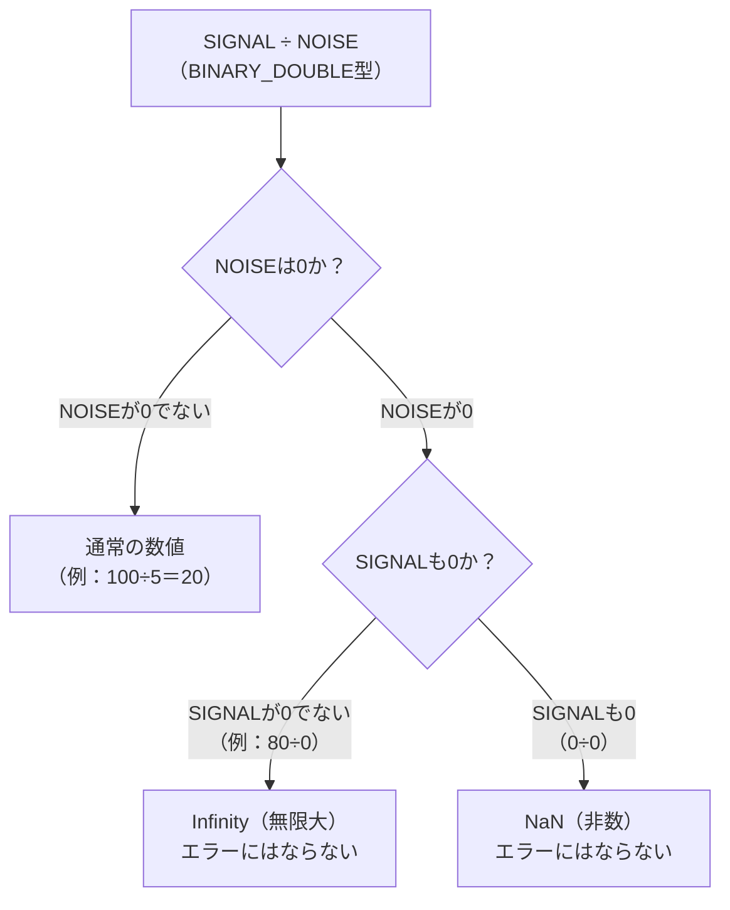

| 演算 | `NUMBER`型の結果 | `BINARY_DOUBLE`型の結果 |
| :--- | :--- | :--- |
| `80 / 0` | `ORA-01476`エラー | `Inf`（Infinity・無限大） |
| `0 / 0` | `ORA-01476`エラー | `Nan`（NaN・非数） |
| `100 / 5` | `20`（通常通り） | `20`（通常通り） |

エラーにならないというと一見便利に思えますが、これは諸刃の剣です。`Inf`や`Nan`はクエリを止めずにそのまま後続の処理に流れ込んでしまうため、**気づかないうちに集計結果全体を汚染する**という別の危険をはらんでいます。

ここで失敗例の`NANVL`がなぜ不十分なのかを整理します。`NANVL(expr, 代替値)`は、その名の通り**NaN専用**の変換関数であり、「非数」だけを対象にしています。`Infinity`は「数値ではあるが有限ではない」という別のカテゴリの値であり、`NaN`ではないため`NANVL`の網には引っかかりません。

| 異常値の種類 | 意味 | `NANVL`で検出できるか |
| :--- | :--- | :---: |
| `NaN` | 「数値として定義できない」演算結果（例：`0/0`） | できる |
| `Infinity` | 「有限の数値で表現できない」演算結果（例：`80/0`） | **できない** |

`Infinity`を確実に検出するには、`BINARY_DOUBLE_INFINITY`という組み込み定数（正の無限大を表す）との比較が必要です。負の無限大も考慮し、`ratio IN (BINARY_DOUBLE_INFINITY, -BINARY_DOUBLE_INFINITY)`という形で両方をカバーしているのが、今回の解答例のポイントです。

一方`NaN`の判定には、`IS NAN`という専用の述語（`WHERE`句や`CASE`式の条件として使える構文）を使います。`NaN`はIEEE754の仕様上「自分自身とすら等しくない（`NaN = NaN`が`FALSE`になる）」という特殊な性質を持つため、`= `のような通常の比較演算子では判定できず、この専用構文が用意されています。

:::message
### 検出漏れが引き起こす集計汚染の実例
なぜ`Infinity`の検出漏れが危険なのか、`AVG`関数で実際に確認してみましょう。

```sql
-- 失敗例のSAFE_RATIO（NaNのみNULL化）でAVGを取った場合
-- 値：20, Inf, NULL, 20, Inf, 0 → AVGは "Inf" になる
SELECT AVG(NANVL(ratio, NULL)) FROM (...);
-- 結果：Inf（1件でもInfinityが混ざると、平均値全体がInfinityに汚染される）

-- 正しいSAFE_RATIO（NaN・Infinity両方をNULL化）でAVGを取った場合
-- 値：20, NULL, NULL, 20, NULL, 0 → NULLはAVGの計算から自動的に除外される
SELECT AVG(safe_ratio) FROM (...);
-- 結果：13.333...（正常な3件の平均）
```

`AVG`をはじめとする集計関数は`NULL`を自動的にスキップしてくれますが、`Infinity`という「異常だが数値ではある」値はスキップしてくれません。異常値混入時に検出漏れが1件でもあると、母数の大きい集計であっても結果全体が一発で意味をなさなくなる、という点が、この種のバグの怖さです。
:::

センサーデータや金融のティックデータのように、`BINARY_FLOAT`/`BINARY_DOUBLE`型で0除算が起こりうる集計処理を書く際は、「`NaN`と`Infinity`は別物であり、両方を明示的にケアする必要がある」ということを、今回のクエリのように`CASE`式で網羅的に判定しておくことをお勧めします。

## 参考リンク
https://www.shift-the-oracle.com/sql/functions/nanvl.html

