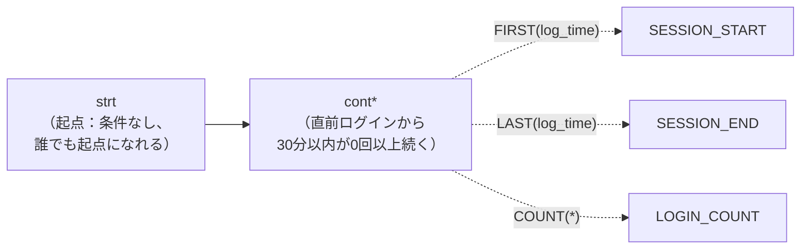
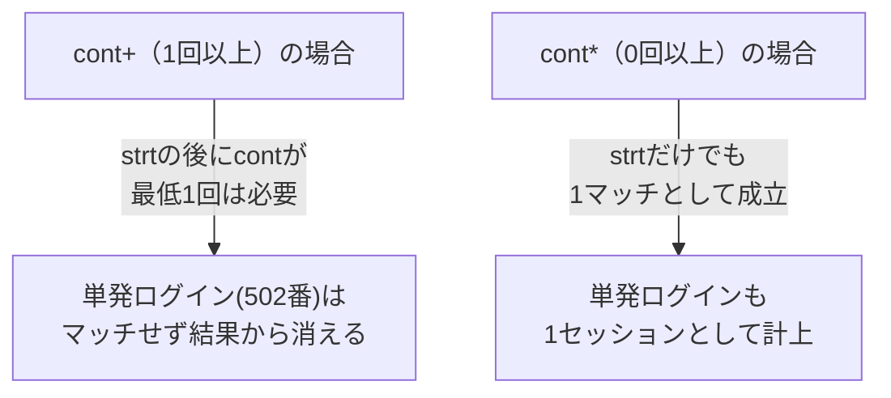
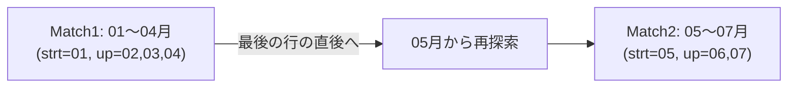
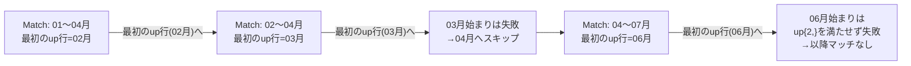
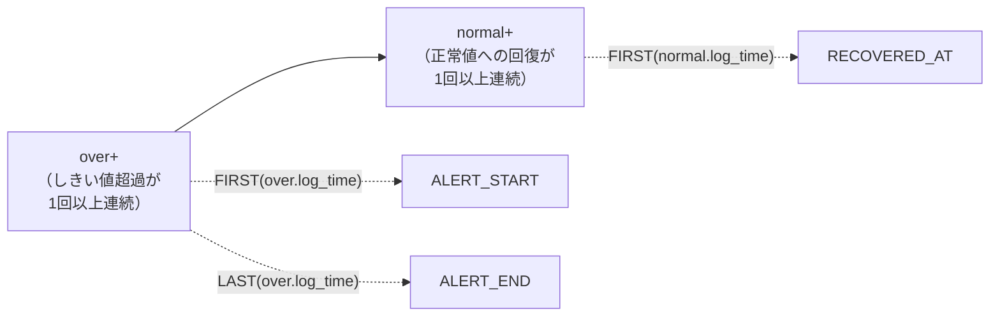
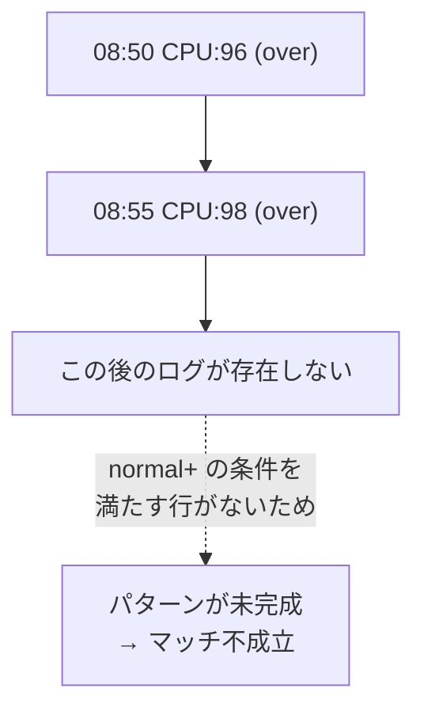
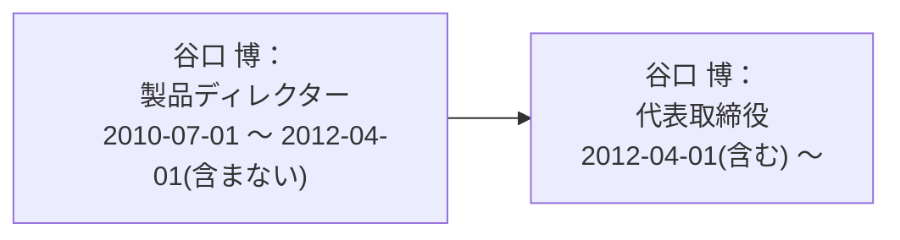
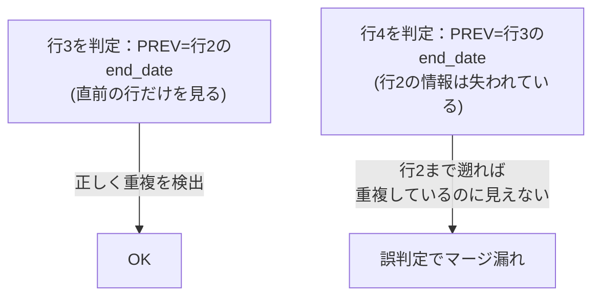
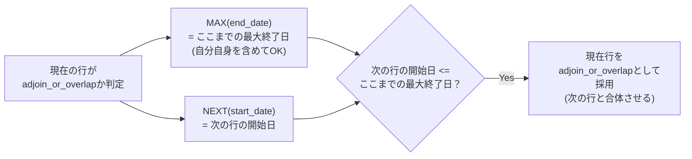
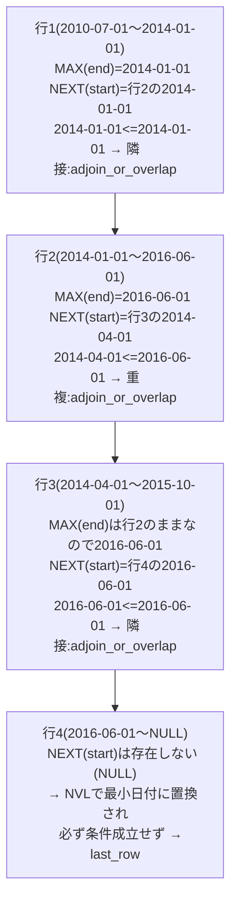

# 【完全版】問題16-12：ログイン試行のセッション化（ギャップ検出）
### 難易度：★★★★☆ (Lv.4)
## 問題
セキュリティ部門から、「ユーザーごとのログイン履歴を分析し、**"連続したログイン行動"のまとまり（セッション）** を特定したい」との依頼がありました。ここでいう「連続」とは、時間的に近接している（前回のログインから30分以内）ログインは同じ一連の行動とみなし、30分以上間隔が空いた場合は「別のセッション」として区切る、という定義です。

以下の`LOGIN_LOGS`（ログイン履歴）を`WITH`句で定義し、`MATCH_RECOGNIZE`句を使用して、ユーザーごとにセッションを特定してください。出力には、ユーザーID・セッション番号・セッション開始時刻・セッション終了時刻・セッション内のログイン回数・セッションの継続時間（分）を含めてください。
なお、結果は`USER_ID`の昇順、次いで`SESSION_START`の昇順でソートしてください。

```sql
WITH login_logs AS (
    SELECT 501 AS user_id, TO_DATE('2026-02-10 09:00:00','YYYY-MM-DD HH24:MI:SS') AS log_time FROM dual UNION ALL
    SELECT 501, TO_DATE('2026-02-10 09:10:00','YYYY-MM-DD HH24:MI:SS') FROM dual UNION ALL
    SELECT 501, TO_DATE('2026-02-10 09:25:00','YYYY-MM-DD HH24:MI:SS') FROM dual UNION ALL
    SELECT 501, TO_DATE('2026-02-10 10:10:00','YYYY-MM-DD HH24:MI:SS') FROM dual UNION ALL
    SELECT 501, TO_DATE('2026-02-10 10:15:00','YYYY-MM-DD HH24:MI:SS') FROM dual UNION ALL
    SELECT 502, TO_DATE('2026-02-10 14:00:00','YYYY-MM-DD HH24:MI:SS') FROM dual UNION ALL
    SELECT 502, TO_DATE('2026-02-10 14:45:00','YYYY-MM-DD HH24:MI:SS') FROM dual UNION ALL
    SELECT 503, TO_DATE('2026-02-10 08:00:00','YYYY-MM-DD HH24:MI:SS') FROM dual UNION ALL
    SELECT 503, TO_DATE('2026-02-10 08:29:00','YYYY-MM-DD HH24:MI:SS') FROM dual UNION ALL
    SELECT 503, TO_DATE('2026-02-10 09:00:00','YYYY-MM-DD HH24:MI:SS') FROM dual
)
-- ここに MATCH_RECOGNIZE を使ったSELECT文を記述してください
```

## 期待する結果
| USER_ID | SESSION_NO | SESSION_START        | SESSION_END          | LOGIN_COUNT | DURATION_MIN | 
| ------- | ---------- | -------------------- | -------------------- | ----------- | ------------ | 
| 501     | 1          | 2026-02-10T09:00:00Z | 2026-02-10T09:25:00Z | 3           | 25           | 
| 501     | 2          | 2026-02-10T10:10:00Z | 2026-02-10T10:15:00Z | 2           | 5            | 
| 502     | 1          | 2026-02-10T14:00:00Z | 2026-02-10T14:00:00Z | 1           | 0            | 
| 502     | 2          | 2026-02-10T14:45:00Z | 2026-02-10T14:45:00Z | 1           | 0            | 
| 503     | 1          | 2026-02-10T08:00:00Z | 2026-02-10T08:29:00Z | 2           | 29           | 
| 503     | 2          | 2026-02-10T09:00:00Z | 2026-02-10T09:00:00Z | 1           | 0            | 

## 解答例
```sql
WITH login_logs AS (
    SELECT 501 AS user_id, TO_DATE('2026-02-10 09:00:00','YYYY-MM-DD HH24:MI:SS') AS log_time FROM dual UNION ALL
    SELECT 501, TO_DATE('2026-02-10 09:10:00','YYYY-MM-DD HH24:MI:SS') FROM dual UNION ALL
    SELECT 501, TO_DATE('2026-02-10 09:25:00','YYYY-MM-DD HH24:MI:SS') FROM dual UNION ALL
    SELECT 501, TO_DATE('2026-02-10 10:10:00','YYYY-MM-DD HH24:MI:SS') FROM dual UNION ALL
    SELECT 501, TO_DATE('2026-02-10 10:15:00','YYYY-MM-DD HH24:MI:SS') FROM dual UNION ALL
    SELECT 502, TO_DATE('2026-02-10 14:00:00','YYYY-MM-DD HH24:MI:SS') FROM dual UNION ALL
    SELECT 502, TO_DATE('2026-02-10 14:45:00','YYYY-MM-DD HH24:MI:SS') FROM dual UNION ALL
    SELECT 503, TO_DATE('2026-02-10 08:00:00','YYYY-MM-DD HH24:MI:SS') FROM dual UNION ALL
    SELECT 503, TO_DATE('2026-02-10 08:29:00','YYYY-MM-DD HH24:MI:SS') FROM dual UNION ALL
    SELECT 503, TO_DATE('2026-02-10 09:00:00','YYYY-MM-DD HH24:MI:SS') FROM dual
)
SELECT
    user_id,
    session_no,
    session_start,
    session_end,
    login_count,
    ROUND((session_end - session_start) * 24 * 60) AS duration_min
FROM login_logs
    MATCH_RECOGNIZE (
        PARTITION BY user_id
        ORDER BY log_time
        MEASURES
            MATCH_NUMBER()   AS session_no,
            FIRST(log_time)  AS session_start,
            LAST(log_time)   AS session_end,
            COUNT(*)         AS login_count
        ONE ROW PER MATCH
        -- パターン：起点(strt)の後、直前ログインから30分以内(cont)が0回以上続く
        PATTERN ( strt cont* )
        DEFINE
            cont AS (log_time - PREV(log_time)) * 24 * 60 <= 30
    )
ORDER BY user_id, session_start
```

## 解説
これまでの16-3〜16-11では、`DEFINE`の条件はもっぱら「**値そのもの**」（売上・給与・工程名）の比較でした。今回は少し視点を変え、「**行と行の時間差（ギャップ）**」を条件にする、実務で頻出の**セッション化（sessionization）** を扱います。Webアクセスログの解析や、行動ログからの利用シーン抽出などで非常によく使われるテクニックです。



### ギャップを条件にする`DEFINE`
```sql
DEFINE
    cont AS (log_time - PREV(log_time)) * 24 * 60 <= 30
```
Oracleの`DATE`型同士を引き算すると、結果は「日数（小数）」を表す数値になります。そこで`* 24 * 60`をかけることで「分」に変換し、`30`分以内かどうかを判定しています。`PREV(log_time)`は文字通り「1つ前の行のログイン時刻」を指すため、`cont`は「直前のログインから30分以内に発生したログインである」という条件になります。

16-8（給与の停滞）では`same AS salary = PREV(salary)`のように「**値が変化しないこと**」を連続性の条件にしていましたが、今回は「**時間差が一定以内であること**」を連続性の条件にしている点が対比的です。「連続」の定義を変数の`DEFINE`だけで自由に切り替えられるのが、`MATCH_RECOGNIZE`の柔軟なところです。

| 問題 | 連続性の条件 | 何を検出するか |
| :--- | :--- | :--- |
| 16-3（連続増加） | `revenue > PREV(revenue)` | 値の増加トレンド |
| 16-8（プラトー） | `salary = PREV(salary)` | 値の据え置き（横ばい） |
| 16-12（今回：セッション） | `(log_time - PREV(log_time)) * 24 * 60 <= 30` | 時間的な近接性（間隔） |

### `PATTERN (strt cont*)` の量化子が`*`である理由
16-3や16-8では`up{3,}`や`same+`のように「1回以上」を意味する`+`系の量化子を使っていましたが、今回は`cont*`と **`*`（0回以上）**を使っています。これは、**「1回もログインが続かなかった（＝1回だけのログインで終わった）」場合でも、それを"1件のセッション"として認めたい**ためです。実際、期待結果の502番ユーザーは1回ずつしかログインしていませんが、それぞれ独立した1件のセッション（`LOGIN_COUNT=1`）として出力されています。もし`cont+`（1回以上）にしてしまうと、直後に別のログインが続かない単発のアクセスがマッチせず、結果から漏れてしまいます。



### 境界値の挙動：503番ユーザーに注目
503番ユーザーのログを見てみましょう。

| ログイン時刻 | 直前との差 | 判定 |
| :--- | :--- | :--- |
| 08:00:00 | - | `strt`（起点） |
| 08:29:00 | 29分 | `29 <= 30` → `cont`（継続） |
| 09:00:00 | 31分 | `31 <= 30` は偽 → 新しい`strt` |

08:29から09:00までの間隔は31分であり、30分以内という条件を1分だけ超えているため、ここでセッションが分断されています。`DEFINE`の条件が`<=`（以下）なのか`<`（未満）なのかで、ちょうど30分ぴったりのケースの扱いが変わる点は、実務で仕様を詰める際に必ず確認すべきポイントです。今回は「30分**以内**」という要件どおり`<=`としています。

### `MATCH_NUMBER()`によるセッション番号の付与
```sql
MATCH_NUMBER() AS session_no
```
16-11では`ALL ROWS PER MATCH`使用時の"マッチのキー"として`MATCH_NUMBER()`を使いましたが、今回のように`ONE ROW PER MATCH`でも問題なく利用できます。`PARTITION BY user_id`によってユーザーごとに独立してカウントされるため、501番ユーザーは1番目・2番目のセッション、502番・503番ユーザーもそれぞれ1番目から数え直されます。ダッシュボードなどで「このユーザーの何回目のセッションか」を表示したい場合に、そのまま使える値です。

:::message
### AFTER MATCH SKIP TO を省略した場合の挙動（復習）
今回の解答例には`AFTER MATCH SKIP TO`を明示的に書いていません。これは、デフォルトの`AFTER MATCH SKIP PAST LAST ROW`の挙動がそのまま今回の要件に合致するためです。

`strt cont*`というパターンが一度マッチすると、そのマッチは「起点から、続く`cont`が途切れる直前の行まで」を1つの塊として消費します。デフォルトの`SKIP PAST LAST ROW`は「消費し終えた塊の**直後の行**」から次の探索を再開するため、次の`strt`は自動的に「ギャップで区切られた次のログイン」から始まります。16-3や16-6のような"連続する変化"を検出する問題では明示的に`SKIP TO LAST xxx`を書くケースが多くありましたが、`strt cont*`のように**起点自体に条件がなく、かつ`*`で0回以上を許容するパターン**では、デフォルトのままで意図通りに動作することも多いです。「本当にデフォルトの挙動で十分か」を都度確認する癖をつけておくと、無駄な指定を減らせます。
:::

### 実務での応用例
| 分野 | セッション化したいログの例 |
| :--- | :--- |
| Webアクセス解析 | ユーザーのページ閲覧履歴を「1回の訪問（セッション）」単位に区切る |
| コールセンター分析 | オペレーターへの問い合わせ履歴を「1つの用件」単位にまとめる |
| 不正検知 | 短時間に集中する連続アクセスを1つの"バースト"として異常検知の単位にする |

「一定時間内の出来事は同じまとまりとみなす」というセッション化の考え方は、Webアクセス解析でユーザーの1回の訪問を特定する用途や、コールセンターで断続的な問い合わせ履歴を1つの用件としてまとめる用途、あるいは不正検知で短時間に集中するアクセスを1つの"バースト"として扱う用途など、幅広い業務で応用されています。`MATCH_RECOGNIZE`を使えば、`LAG`関数とウィンドウ関数を駆使した複雑な自己結合を書かずとも、「ギャップが空いたら区切る」という直感的なルールをそのままSQLに落とし込める点が大きな利点です。

---
<br><br>

# 問題16-13：AFTER MATCH SKIP TO の挙動比較 ― PAST LAST ROW / NEXT ROW / FIRST
### 難易度：★★★☆☆ (Lv.3)
## 問題
以下の`MONTHLY_KPI`（月次の指標データ）を`WITH`句で定義し、`MATCH_RECOGNIZE`句を使用して、「起点（`strt`）の後、横ばい（`flat`）が0回以上続き、その後に上昇（`up`）が2回以上連続する」というパターン（`PATTERN (strt flat* up{2,})`）を検出してください。

このパターンに対して、`AFTER MATCH SKIP TO`の指定を以下の3パターンに変えて、それぞれ実行してください。
1. **指定なし**（デフォルトの`SKIP PAST LAST ROW`）
2. **`SKIP TO NEXT ROW`**
3. **`SKIP TO FIRST up`**

出力には、パターンの開始月（`START_MONTH`）・終了月（`END_MONTH`）・そのマッチに含まれる上昇（`up`）行の数（`UP_COUNT`）を含め、それぞれ`START_MONTH`の昇順でソートしてください。

**【学習のポイント】**
3つのクエリを実行した結果の**件数や範囲がどう変わるか**を比較し、「次の探索をどこから再開するか」という指定１つで、検出されるマッチがどう変わるのかを体感してください。

```sql
WITH monthly_kpi AS (
    SELECT '2026-01' AS month, 100 AS revenue FROM dual UNION ALL
    SELECT '2026-02', 110 FROM dual UNION ALL
    SELECT '2026-03', 120 FROM dual UNION ALL
    SELECT '2026-04', 130 FROM dual UNION ALL
    SELECT '2026-05', 130 FROM dual UNION ALL -- 前月と同額（横ばい）
    SELECT '2026-06', 140 FROM dual UNION ALL
    SELECT '2026-07', 150 FROM dual UNION ALL
    SELECT '2026-08', 140 FROM dual UNION ALL
    SELECT '2026-09', 145 FROM dual
)
-- ここに MATCH_RECOGNIZE を使ったSELECT文を、SKIP TOの指定を変えて3通り記述してください
```

## 期待する結果

### ① 指定なし（デフォルト：SKIP PAST LAST ROW）
| START_MONTH | END_MONTH | UP_COUNT |
| ----------- | --------- | -------- |
| 2026-01 | 2026-04 | 3 |
| 2026-05 | 2026-07 | 2 |

### ② SKIP TO NEXT ROW
| START_MONTH | END_MONTH | UP_COUNT |
| ----------- | --------- | -------- |
| 2026-01 | 2026-04 | 3 |
| 2026-02 | 2026-04 | 2 |
| 2026-04 | 2026-07 | 2 |
| 2026-05 | 2026-07 | 2 |

### ③ SKIP TO FIRST up
| START_MONTH | END_MONTH | UP_COUNT |
| ----------- | --------- | -------- |
| 2026-01 | 2026-04 | 3 |
| 2026-02 | 2026-04 | 2 |
| 2026-04 | 2026-07 | 2 |

## 解答例
```sql:① 指定なし（デフォルト：SKIP PAST LAST ROW）
WITH monthly_kpi AS (
    SELECT '2026-01' AS month, 100 AS revenue FROM dual UNION ALL
    SELECT '2026-02', 110 FROM dual UNION ALL
    SELECT '2026-03', 120 FROM dual UNION ALL
    SELECT '2026-04', 130 FROM dual UNION ALL
    SELECT '2026-05', 130 FROM dual UNION ALL
    SELECT '2026-06', 140 FROM dual UNION ALL
    SELECT '2026-07', 150 FROM dual UNION ALL
    SELECT '2026-08', 140 FROM dual UNION ALL
    SELECT '2026-09', 145 FROM dual
)
SELECT * FROM monthly_kpi
MATCH_RECOGNIZE (
    ORDER BY month
    MEASURES
        FIRST(month)     AS start_month,
        LAST(month)      AS end_month,
        COUNT(up.month)  AS up_count
    ONE ROW PER MATCH
    -- AFTER MATCH SKIP TO は指定しない（デフォルト = PAST LAST ROW）
    PATTERN ( strt flat* up{2,} )
    DEFINE
        flat AS revenue = PREV(revenue),
        up   AS revenue > PREV(revenue)
)
ORDER BY start_month
```
```sql:② SKIP TO NEXT ROW
WITH monthly_kpi AS (
    SELECT '2026-01' AS month, 100 AS revenue FROM dual UNION ALL
    SELECT '2026-02', 110 FROM dual UNION ALL
    SELECT '2026-03', 120 FROM dual UNION ALL
    SELECT '2026-04', 130 FROM dual UNION ALL
    SELECT '2026-05', 130 FROM dual UNION ALL
    SELECT '2026-06', 140 FROM dual UNION ALL
    SELECT '2026-07', 150 FROM dual UNION ALL
    SELECT '2026-08', 140 FROM dual UNION ALL
    SELECT '2026-09', 145 FROM dual
)
SELECT * FROM monthly_kpi
MATCH_RECOGNIZE (
    ORDER BY month
    MEASURES
        FIRST(month)     AS start_month,
        LAST(month)      AS end_month,
        COUNT(up.month)  AS up_count
    ONE ROW PER MATCH
    AFTER MATCH SKIP TO NEXT ROW
    PATTERN ( strt flat* up{2,} )
    DEFINE
        flat AS revenue = PREV(revenue),
        up   AS revenue > PREV(revenue)
)
ORDER BY start_month
```
```sql:③ SKIP TO FIRST up
WITH monthly_kpi AS (
    SELECT '2026-01' AS month, 100 AS revenue FROM dual UNION ALL
    SELECT '2026-02', 110 FROM dual UNION ALL
    SELECT '2026-03', 120 FROM dual UNION ALL
    SELECT '2026-04', 130 FROM dual UNION ALL
    SELECT '2026-05', 130 FROM dual UNION ALL
    SELECT '2026-06', 140 FROM dual UNION ALL
    SELECT '2026-07', 150 FROM dual UNION ALL
    SELECT '2026-08', 140 FROM dual UNION ALL
    SELECT '2026-09', 145 FROM dual
)
SELECT * FROM monthly_kpi
MATCH_RECOGNIZE (
    ORDER BY month
    MEASURES
        FIRST(month)     AS start_month,
        LAST(month)      AS end_month,
        COUNT(up.month)  AS up_count
    ONE ROW PER MATCH
    AFTER MATCH SKIP TO FIRST up
    PATTERN ( strt flat* up{2,} )
    DEFINE
        flat AS revenue = PREV(revenue),
        up   AS revenue > PREV(revenue)
)
ORDER BY start_month
```

## 解説
16-5のメッセージボックスで表にまとめただけだった`AFTER MATCH SKIP TO`の各オプションを、今回は実際にデータへ当てはめて、**「結果が何行になるか」「範囲がどう重なるか」** を目で確認していきます。同じ`PATTERN`・同じ`DEFINE`のまま、`SKIP TO`の指定だけを変えるとどうなるかに注目してください。

### データとパターンの確認
今回使うデータをグラフ化すると、以下のような形になっています。


`PATTERN (strt flat* up{2,})`は、「起点（`strt`：誰でもOK）→ 横ばいが0回以上（`flat*`）→ 上昇が2回以上連続（`up{2,}`）」という形です。この中で、**05月の「横ばい（FLAT）」がどのマッチに取り込まれるか、あるいは取り込まれないか**が、`SKIP TO`の指定によって変わる、という点が本問のキモです。

### ①デフォルト（PAST LAST ROW）：重複なしのシンプルな結果

デフォルトの`PAST LAST ROW`は、1つのマッチが見つかったら「そのマッチの最後の行の直後」から次を探すため、マッチ同士が絶対に重複しません。01月を起点にすると02〜04月の3連騰を拾って1つ目のマッチが確定し、続きは05月から再開されます。05月は（この時点では）新たな起点として扱われ、06〜07月の2連騰を拾って2つ目のマッチになります。結果は過不足なく**2件**、これが最も直感的な「イベントの分割」です。

### ②SKIP TO NEXT ROW：起点を1行ずつずらす「総当たり」

`SKIP TO NEXT ROW`は、「見つかったマッチの**最初の行の次の行**」から必ず再探索します。そのため、01月始まりのマッチが見つかった後も、02月始まり・（03月始まりは失敗するので自動的に）04月始まり・05月始まりと、**起点になり得る行をほぼ総当たりで試す**ことになります。特に注目したいのが3件目の「04〜07月」です。ここでは起点04月の直後にある05月の`FLAT`（横ばい）が`flat*`によって取り込まれ、06〜07月の2連騰につながっています。デフォルトの探索では見えなかった「04月を起点とした場合の姿」が、ここで初めて表に出てきます。結果は最も多い**4件**で、重複を許すぶん「その地点を起点にしたら、どこまでのトレンドが成立するか」を漏れなく確認したい場合に向いた設定です。

### ③SKIP TO FIRST up：デフォルトとNEXT ROWの"中間"

`SKIP TO FIRST up`は、「マッチの中で**変数`up`が最初に一致した行**」から次を探します。1件目（01〜04月）では`up`の最初の行は02月なので、これは`SKIP TO NEXT ROW`（起点の次の行＝02月）と偶然同じ位置になり、同じ結果（02〜04月）が得られます。ところが3件目の「04〜07月」（`strt`=04月, `flat`=05月, `up`=06月,07月）では、`up`が最初に一致するのは**06月**です。`SKIP TO NEXT ROW`なら「起点の次の行」である05月まで戻って再探索しますが、`SKIP TO FIRST up`は`flat`で消費された05月を飛び越えて06月から再開します。その結果、05月を起点とする「05〜07月」のマッチはここでは検出されず、結果は**3件**という、デフォルト（2件）とNEXT ROW（4件）の中間の件数に落ち着きます。

| SKIP TOの指定 | 再開位置の考え方 | 今回の結果件数 | 重複の度合い |
| :--- | :--- | :---: | :--- |
| `PAST LAST ROW`（デフォルト） | マッチの最後の行の直後 | 2件 | なし |
| `SKIP TO FIRST up` | マッチ内で`up`が最初に現れた行 | 3件 | 変数の登場位置に依存 |
| `SKIP TO NEXT ROW` | マッチの最初の行の次の行（固定） | 4件 | 最大限（起点をほぼ総当たり） |

:::message
### FIRST/LAST variable が NEXT ROW と同じ結果になることもある
今回の①〜③件目のマッチ（01〜04月、02〜04月）では、`SKIP TO FIRST up`と`SKIP TO NEXT ROW`が**たまたま同じ結果**になっています。これは、`flat*`が0回しかマッチしなかった（横ばいが挟まらなかった）ケースでは、「`up`が最初に現れる行」と「起点の次の行」が同じ位置を指すためです。両者が明確に違う結果を生むのは、今回の04〜07月のマッチのように、**`strt`と目的の変数（`up`）の間に、別の変数（`flat`）が挟まっている場合**に限られます。

このことから分かるのは、`SKIP TO FIRST/LAST variable`は「その変数が実際にどこにマッチしたか」というデータの実態に依存して再開位置が変わる、**動的な**スキップだということです。一方`SKIP TO NEXT ROW`は、マッチの中身がどうであれ機械的に「2行目」から再開する、**固定的な**スキップです。この違いを理解しておくと、「なぜこのマッチが検出されて、あのマッチは検出されなかったのか」を正しく説明できるようになります。
:::

### 実務でどう使い分けるか
| 目的 | 適した`SKIP TO`指定 |
| :--- | :--- |
| 「1つのトレンド＝1つのイベント」として重複なく集計したい（例：売上好調期間のレポート） | `PAST LAST ROW`（デフォルト） |
| ある地点を起点にした場合、どこまでパターンが継続するかを漏れなく確認したい（デバッグ・検証目的） | `SKIP TO NEXT ROW` |
| パターンの「本質的な部分（今回なら上昇そのもの）」を基準に、前後の付随的な状態（横ばいなど）をまたいで次を探したい | `SKIP TO FIRST/LAST variable` |

`MATCH_RECOGNIZE`は`PATTERN`と`DEFINE`にばかり目が行きがちですが、`AFTER MATCH SKIP TO`は「同じデータ・同じパターン定義でも、結果の件数や範囲を大きく左右する」という点で、実は非常に重要な設定です。特に業務要件が「重複を許さない集計」なのか「起点ごとの網羅的な検証」なのかによって、選ぶべき`SKIP TO`は変わります。クエリを書く前に、「1つのマッチが見つかったら、次はどこから探すべきか」を要件として明確にしておくことが、この構文を正しく使いこなす近道です。

---
<br><br>

# 【完全版】問題16-14：アラート発報の抑制（同一障害の再通知防止）
### 難易度：★★★★☆ (Lv.4)
## 問題
インフラ運用チームから、「CPU使用率の監視アラートが、しきい値超過中に何度も重複して発報されてしまい、運用担当者が疲弊している」との相談がありました。求められているのは、以下のようなロジックです。

* CPU使用率が**80%以上**の状態（`OVER`）が1回以上続いたら、それを1つの「障害イベント」とみなす。
* CPU使用率が80%未満（`NORMAL`）に**回復するまでの間は、たとえ何回計測しても再アラートを出さない**（＝1つの障害イベントにつき、通知は1回でよい）。
* CPU使用率が一度80%未満に回復した後、再び80%以上になった場合は、それは**新しい別の障害イベント**として扱う。

以下の`SERVER_METRICS`（5分間隔のCPU使用率ログ）を`WITH`句で定義し、`MATCH_RECOGNIZE`句を使用して、上記ロジックによる障害イベントを検出してください。出力には、サーバーID・アラート開始時刻・アラート終了時刻（しきい値超過の最後の計測時刻）・回復時刻（80%未満に戻った最初の計測時刻）・超過中の計測回数・超過継続時間（分）を含めてください。
なお、結果は`SERVER_ID`の昇順、次いで`ALERT_START`の昇順でソートしてください。

```sql
WITH server_metrics AS (
    SELECT 'WEB01' AS server_id, TO_DATE('2026-03-01 08:00:00','YYYY-MM-DD HH24:MI:SS') AS log_time, 60 AS cpu_usage FROM dual UNION ALL
    SELECT 'WEB01', TO_DATE('2026-03-01 08:05:00','YYYY-MM-DD HH24:MI:SS'), 65 FROM dual UNION ALL
    SELECT 'WEB01', TO_DATE('2026-03-01 08:10:00','YYYY-MM-DD HH24:MI:SS'), 85 FROM dual UNION ALL
    SELECT 'WEB01', TO_DATE('2026-03-01 08:15:00','YYYY-MM-DD HH24:MI:SS'), 90 FROM dual UNION ALL
    SELECT 'WEB01', TO_DATE('2026-03-01 08:20:00','YYYY-MM-DD HH24:MI:SS'), 88 FROM dual UNION ALL
    SELECT 'WEB01', TO_DATE('2026-03-01 08:25:00','YYYY-MM-DD HH24:MI:SS'), 75 FROM dual UNION ALL
    SELECT 'WEB01', TO_DATE('2026-03-01 08:30:00','YYYY-MM-DD HH24:MI:SS'), 70 FROM dual UNION ALL
    SELECT 'WEB01', TO_DATE('2026-03-01 08:35:00','YYYY-MM-DD HH24:MI:SS'), 95 FROM dual UNION ALL
    SELECT 'WEB01', TO_DATE('2026-03-01 08:40:00','YYYY-MM-DD HH24:MI:SS'), 92 FROM dual UNION ALL
    SELECT 'WEB01', TO_DATE('2026-03-01 08:45:00','YYYY-MM-DD HH24:MI:SS'), 60 FROM dual UNION ALL
    SELECT 'WEB01', TO_DATE('2026-03-01 08:50:00','YYYY-MM-DD HH24:MI:SS'), 96 FROM dual UNION ALL
    SELECT 'WEB01', TO_DATE('2026-03-01 08:55:00','YYYY-MM-DD HH24:MI:SS'), 98 FROM dual UNION ALL
    SELECT 'DB02',  TO_DATE('2026-03-01 09:00:00','YYYY-MM-DD HH24:MI:SS'), 50 FROM dual UNION ALL
    SELECT 'DB02',  TO_DATE('2026-03-01 09:05:00','YYYY-MM-DD HH24:MI:SS'), 82 FROM dual UNION ALL
    SELECT 'DB02',  TO_DATE('2026-03-01 09:10:00','YYYY-MM-DD HH24:MI:SS'), 84 FROM dual UNION ALL
    SELECT 'DB02',  TO_DATE('2026-03-01 09:15:00','YYYY-MM-DD HH24:MI:SS'), 80 FROM dual UNION ALL
    SELECT 'DB02',  TO_DATE('2026-03-01 09:20:00','YYYY-MM-DD HH24:MI:SS'), 79 FROM dual UNION ALL
    SELECT 'DB02',  TO_DATE('2026-03-01 09:25:00','YYYY-MM-DD HH24:MI:SS'), 81 FROM dual UNION ALL
    SELECT 'DB02',  TO_DATE('2026-03-01 09:30:00','YYYY-MM-DD HH24:MI:SS'), 60 FROM dual
)
-- ここに MATCH_RECOGNIZE を使ったSELECT文を記述してください
```

## 期待する結果
| SERVER_ID | ALERT_START          | ALERT_END            | RECOVERED_AT         | OVER_COUNT | DURATION_MIN | 
| --------- | -------------------- | -------------------- | -------------------- | ---------- | ------------ | 
| DB02      | 2026-03-01T09:05:00Z | 2026-03-01T09:15:00Z | 2026-03-01T09:20:00Z | 3          | 10           | 
| DB02      | 2026-03-01T09:25:00Z | 2026-03-01T09:25:00Z | 2026-03-01T09:30:00Z | 1          | 0            | 
| WEB01     | 2026-03-01T08:10:00Z | 2026-03-01T08:20:00Z | 2026-03-01T08:25:00Z | 3          | 10           | 
| WEB01     | 2026-03-01T08:35:00Z | 2026-03-01T08:40:00Z | 2026-03-01T08:45:00Z | 2          | 5            | 

※WEB01の08:50・08:55の超過（CPU 96%・98%）は、その後に80%未満へ回復した記録が存在しない（ログがそこで途切れている）ため、「障害イベントとして完結していない」とみなされ、結果には含まれません。

## 解答例
```sql
WITH server_metrics AS (
    SELECT 'WEB01' AS server_id, TO_DATE('2026-03-01 08:00:00','YYYY-MM-DD HH24:MI:SS') AS log_time, 60 AS cpu_usage FROM dual UNION ALL
    SELECT 'WEB01', TO_DATE('2026-03-01 08:05:00','YYYY-MM-DD HH24:MI:SS'), 65 FROM dual UNION ALL
    SELECT 'WEB01', TO_DATE('2026-03-01 08:10:00','YYYY-MM-DD HH24:MI:SS'), 85 FROM dual UNION ALL
    SELECT 'WEB01', TO_DATE('2026-03-01 08:15:00','YYYY-MM-DD HH24:MI:SS'), 90 FROM dual UNION ALL
    SELECT 'WEB01', TO_DATE('2026-03-01 08:20:00','YYYY-MM-DD HH24:MI:SS'), 88 FROM dual UNION ALL
    SELECT 'WEB01', TO_DATE('2026-03-01 08:25:00','YYYY-MM-DD HH24:MI:SS'), 75 FROM dual UNION ALL
    SELECT 'WEB01', TO_DATE('2026-03-01 08:30:00','YYYY-MM-DD HH24:MI:SS'), 70 FROM dual UNION ALL
    SELECT 'WEB01', TO_DATE('2026-03-01 08:35:00','YYYY-MM-DD HH24:MI:SS'), 95 FROM dual UNION ALL
    SELECT 'WEB01', TO_DATE('2026-03-01 08:40:00','YYYY-MM-DD HH24:MI:SS'), 92 FROM dual UNION ALL
    SELECT 'WEB01', TO_DATE('2026-03-01 08:45:00','YYYY-MM-DD HH24:MI:SS'), 60 FROM dual UNION ALL
    SELECT 'WEB01', TO_DATE('2026-03-01 08:50:00','YYYY-MM-DD HH24:MI:SS'), 96 FROM dual UNION ALL
    SELECT 'WEB01', TO_DATE('2026-03-01 08:55:00','YYYY-MM-DD HH24:MI:SS'), 98 FROM dual UNION ALL
    SELECT 'DB02',  TO_DATE('2026-03-01 09:00:00','YYYY-MM-DD HH24:MI:SS'), 50 FROM dual UNION ALL
    SELECT 'DB02',  TO_DATE('2026-03-01 09:05:00','YYYY-MM-DD HH24:MI:SS'), 82 FROM dual UNION ALL
    SELECT 'DB02',  TO_DATE('2026-03-01 09:10:00','YYYY-MM-DD HH24:MI:SS'), 84 FROM dual UNION ALL
    SELECT 'DB02',  TO_DATE('2026-03-01 09:15:00','YYYY-MM-DD HH24:MI:SS'), 80 FROM dual UNION ALL
    SELECT 'DB02',  TO_DATE('2026-03-01 09:20:00','YYYY-MM-DD HH24:MI:SS'), 79 FROM dual UNION ALL
    SELECT 'DB02',  TO_DATE('2026-03-01 09:25:00','YYYY-MM-DD HH24:MI:SS'), 81 FROM dual UNION ALL
    SELECT 'DB02',  TO_DATE('2026-03-01 09:30:00','YYYY-MM-DD HH24:MI:SS'), 60 FROM dual
)
SELECT
    server_id,
    alert_start,
    alert_end,
    recovered_at,
    over_count,
    duration_min
FROM server_metrics
    MATCH_RECOGNIZE (
        PARTITION BY server_id
        ORDER BY log_time
        MEASURES
            FIRST(over.log_time)  AS alert_start,
            LAST(over.log_time)   AS alert_end,
            FIRST(normal.log_time) AS recovered_at,
            COUNT(over.log_time)  AS over_count,
            (LAST(over.log_time) - FIRST(over.log_time)) * 24 * 60 AS duration_min
        ONE ROW PER MATCH
        AFTER MATCH SKIP TO LAST normal
        -- パターン：しきい値超過(over)が1回以上続いた後、正常値(normal)に回復するまで
        PATTERN ( over+ normal+ )
        DEFINE
            over    AS cpu_usage >= 80,
            normal  AS cpu_usage < 80
    )
ORDER BY server_id, alert_start
```

## 解説
これまでの16-6（V字回復）や16-9（確変期間）は「値の推移そのもの」を対象にした波形検出でしたが、今回はこれを応用し、**「1つの障害＝1回の通知」という運用ルールをSQLだけで実装する**という、より実務色の強い問題です。監視システムの世界では、しきい値を超えている間ずっとアラートを出し続けると、担当者に無用なノイズを与えてしまいます。「状態が変化した瞬間だけ通知する」という設計は、Slack通知やメール通知の抑制ロジックとしてもよく使われる考え方です。



### `PATTERN (over+ normal+)`が表す「1つの障害イベント」
`PATTERN (over+ normal+)`は、「しきい値超過（`over`）が1回以上続いた後、正常値（`normal`）への回復が1回以上続く」という、**"発生"から"収束"までの一往復**を1つの塊として定義しています。16-6の`PATTERN (strt down+ up+)`と形は似ていますが、決定的に違うのは**起点（`strt`）に相当する変数がなく、`over`が直接パターンの先頭に来ている**点です。今回はしきい値という明確な絶対基準（`cpu_usage >= 80`）があるため、「無条件の起点」を用意する必要がなく、超過が始まった瞬間そのものがパターンの開始点になります。

```sql
DEFINE
    over    AS cpu_usage >= 80,
    normal  AS cpu_usage < 80
```
`over`と`normal`は互いに排他的な条件（80%以上か、未満か）になっており、どの行も必ずどちらか一方に分類されます。16-10で学んだ「`DEFINE`に登場しない変数は無条件でTRUE」という仕組みは今回使っていませんが、代わりにこのように**条件を網羅的（MECE）に設計しておく**ことで、パターンの継ぎ目に判定漏れの行が発生しないようにしています。

### `AFTER MATCH SKIP TO LAST normal` が「再発防止」の要
```sql
AFTER MATCH SKIP TO LAST normal
```
ここが本問の核心です。1つの障害イベント（`over+ normal+`）が確定すると、次の探索は「回復（`normal`）が続いた区間の最後の行」から再開されます。これにより、**しきい値超過中に何度CPU使用率を計測していても、回復するまでは新しいマッチの起点にはなりません**。もし`SKIP TO LAST normal`を指定せず、デフォルトの`PAST LAST ROW`（マッチ全体の直後）にしていたとしても、実は今回の`PATTERN`定義では偶然同じ結果になります。しかし、明示的に「どこまでを1つの障害として扱い、次はどこから探すか」を書いておくことで、コードを読む人（未来の自分を含む）に **「回復するまでは再通知しない」という業務ルールがSQLの構造として意図的に表現されている** ことが伝わります。

| 指定 | 挙動 | 今回のケースでの結果 |
| :--- | :--- | :--- |
| `SKIP TO LAST normal`（採用） | 回復区間の最後まで飛ばす | 障害中の重複行は無視され、1イベント1行 |
| `PAST LAST ROW`（デフォルト） | マッチ全体の直後から再開 | 今回はパターン構造上、結果は同じになる |
| `SKIP TO NEXT ROW` | 起点の次の行から総当たり | 超過中の各行がそれぞれ起点となり、大量の重複アラートが発生してしまう |

もし誤って`SKIP TO NEXT ROW`を指定してしまうと、超過している行（85, 90, 88...）のそれぞれが新たな起点として再評価されてしまい、「1つの障害につき1回の通知」という要件が崩れてしまいます。16-13で学んだ`SKIP TO`の違いが、実務要件を満たせるかどうかに直結する好例です。

### なぜWEB01の08:50・08:55のアラートは結果に出てこないのか

`PATTERN (over+ normal+)`は、`over`だけでなく**その後に`normal`が最低1回続くこと**を要求しています。WEB01の08:50・08:55は連続してしきい値を超えていますが、その後に80%未満へ回復した記録がログ上に存在しないため、パターンとして完結せず、マッチが成立しません。

これは一見すると「進行中の障害が結果から漏れてしまう欠点」に見えるかもしれませんが、実務的にはむしろ理にかなった挙動です。**「まだ収束していない障害は、"1つのイベントとして集計する"には早すぎる」** というのがこのロジックの前提だからです。リアルタイム監視システムでこの種のクエリを使う場合は、「過去に完結したイベントの集計」と「現在進行中の超過を検知する即時アラート」は、そもそも目的が異なる別クエリとして用意するのが一般的です。後者には、例えば「直近の行が`over`かどうか」を単純に`WHERE`句でチェックするクエリを別途組み合わせる、といった設計になります。

:::message
### 「発生」と「収束」をセットで扱うことのメリット
`over`だけを検知する単純な`WHERE cpu_usage >= 80`と比較して、`over+ normal+`という「発生から収束まで」をワンセットで捉える設計には、以下のようなメリットがあります。

| 観点 | `WHERE`句だけの単純検知 | `MATCH_RECOGNIZE`によるイベント化 |
| :--- | :--- | :--- |
| 通知の回数 | 超過している行の数だけ通知（ノイズ大） | 1障害につき1回（ノイズ小） |
| 継続時間の算出 | 別途、開始・終了を特定するロジックが必要 | `FIRST`/`LAST`で同時に取得可能 |
| 「解決したか」の判定 | 別クエリで最新状態を都度確認する必要がある | `normal+`が続いた時点で自動的に「解決済み」と判定 |

`WHERE`句だけの単純な検知では超過している行の数だけ通知が発生してノイズが大きくなり、継続時間の算出には開始・終了を特定する別ロジックが必要で、「解決したかどうか」も別クエリで都度確認する必要があります。一方`MATCH_RECOGNIZE`でイベント化すれば、1障害につき通知は1回に抑えられ、`FIRST`/`LAST`で開始・終了時刻を同時に取得でき、`normal+`が続いた時点で自動的に「解決済み」と判定できます。単なる「超過検知」から一歩進んで「イベントのライフサイクル管理」までSQLで表現できるのが、`MATCH_RECOGNIZE`をこの種の要件に使う一番のメリットだと言えます。
:::

### 実務での応用例
| 分野 | 「発生〜収束」で1イベント化したい対象 |
| :--- | :--- |
| インフラ監視 | CPU・メモリ・ディスクI/Oのしきい値超過から復旧までを1インシデントとして記録 |
| ECサイト運用 | 在庫切れ（在庫0）から再入荷までの欠品期間を1イベントとして集計 |
| コンプライアンス監査 | 規定超過の残業時間が続いた期間を、是正措置完了までの1件として管理 |

インフラ監視でのCPU・メモリ・ディスクI/Oのしきい値超過から復旧までを1インシデントとして記録する用途、ECサイト運用での在庫切れから再入荷までの欠品期間を1イベントとして集計する用途、コンプライアンス監査での規定超過の残業時間が是正措置完了までの1件として管理される用途など、「状態がある基準を超えてから、元に戻るまで」を1つのまとまりとして扱いたい場面は多岐にわたります。今回学んだ`over+ normal+`という形と`SKIP TO LAST normal`の組み合わせは、そうした「発生〜収束型」のイベント検出における汎用的なテンプレートとして、そのまま応用が利く構文です。

---
<br><br>

# 【完全版】問題16-15：雇用期間の重複・隣接期間のマージ
### 難易度：★★★★☆ (Lv.4)
## 問題
人事部門から、「同一従業員が複数回にわたって雇用契約を結んでいる場合、契約期間が**隣接（切れ目なく連続）**または**重複（同時に2つ以上の役職を兼務）** しているものを1つの雇用期間としてまとめたレポートが欲しい」との依頼がありました。

以下の`EMP_HIRE_PERIODS`（雇用期間データ）を`WITH`句で定義してください。データには以下のルールがあります。
* `START_DATE`は契約開始日（**その日を含む**）、`END_DATE`は契約終了日（**その日を含まない**）を表す、いわゆる「半開区間」です。
* `END_DATE`が`NULL`の場合、その役職は**現在も継続中**であることを意味します（＝終了日が「無限の未来」）。
* 同一従業員が同時に複数の役職を兼務することもあるため、期間は重複することがあります。

`MATCH_RECOGNIZE`句を使用し、従業員（`EMP_ID`）ごとに、隣接または重複する期間をすべて1つの行にマージしてください。出力には、従業員ID・氏名・マージ後の開始日・マージ後の終了日（現在も継続中なら`NULL`）・マージされた契約件数（`JOBS`）を含めてください。
なお、これ以上マージできない期間（他のどの期間とも隣接・重複しない期間）は、それぞれ単独の1行として出力してください。結果は`EMP_ID`の昇順、次いで`START_DATE`の昇順（`NULL`は最後）でソートしてください。

```sql
WITH emp_hire_periods AS (
    SELECT 100 AS emp_id, '谷口 博'   AS name, DATE '2010-07-01' AS start_date, DATE '2012-04-01' AS end_date, '製品ディレクター' AS title FROM dual UNION ALL
    SELECT 100, '谷口 博',   DATE '2012-04-01', NULL,              '代表取締役'       FROM dual UNION ALL
    SELECT 101, '持田 元気', DATE '2010-07-01', DATE '2014-01-01', 'ITテクニシャン'   FROM dual UNION ALL
    SELECT 101, '持田 元気', DATE '2014-01-01', DATE '2016-06-01', 'システム管理者'   FROM dual UNION ALL
    SELECT 101, '持田 元気', DATE '2014-04-01', DATE '2015-10-01', 'コードテスター'   FROM dual UNION ALL
    SELECT 101, '持田 元気', DATE '2016-06-01', NULL,              'ITマネージャー'   FROM dual UNION ALL
    SELECT 102, '出目 篤',   DATE '2010-07-01', DATE '2013-07-01', '営業マネージャー' FROM dual UNION ALL
    SELECT 102, '出目 篤',   DATE '2012-04-01', NULL,              '製品ディレクター' FROM dual UNION ALL
    SELECT 103, '東尾 ゾエ', DATE '2014-02-01', NULL,              'ITデベロッパー'   FROM dual UNION ALL
    SELECT 103, '東尾 ゾエ', DATE '2019-02-01', NULL,              'スクラムマスター' FROM dual UNION ALL
    SELECT 104, '林 トクロー', DATE '2014-10-01', DATE '2016-02-01', 'フォークリフト作業員' FROM dual UNION ALL
    SELECT 104, '林 トクロー', DATE '2017-03-01', NULL,              '倉庫マネージャー'     FROM dual UNION ALL
    SELECT 105, '上住 うるす', DATE '2014-10-01', DATE '2015-05-01', '配送マネージャー'     FROM dual UNION ALL
    SELECT 105, '上住 うるす', DATE '2016-05-01', DATE '2017-03-01', '倉庫マネージャー'     FROM dual UNION ALL
    SELECT 105, '上住 うるす', DATE '2016-11-01', NULL,              'オペレーションチーフ' FROM dual
)
-- ここに MATCH_RECOGNIZE を使ったSELECT文を記述してください
```

## 期待する結果
| EMP_ID | NAME        | START_DATE           | END_DATE             | JOBS | 
| ------ | ----------- | -------------------- | -------------------- | ---- | 
| 100    | 谷口 博     | 2010-07-01T00:00:00Z |                      | 2    | 
| 101    | 持田 元気   | 2010-07-01T00:00:00Z |                      | 4    | 
| 102    | 出目 篤     | 2010-07-01T00:00:00Z |                      | 2    | 
| 103    | 東尾 ゾエ   | 2014-02-01T00:00:00Z |                      | 2    | 
| 104    | 林 トクロー | 2014-10-01T00:00:00Z | 2016-02-01T00:00:00Z | 1    | 
| 104    | 林 トクロー | 2017-03-01T00:00:00Z |                      | 1    | 
| 105    | 上住 うるす | 2014-10-01T00:00:00Z | 2015-05-01T00:00:00Z | 1    | 
| 105    | 上住 うるす | 2016-05-01T00:00:00Z |                      | 2    | 

## 解答例
```sql
WITH emp_hire_periods AS (
    SELECT 100 AS emp_id, '谷口 博'   AS name, DATE '2010-07-01' AS start_date, DATE '2012-04-01' AS end_date, '製品ディレクター' AS title FROM dual UNION ALL
    SELECT 100, '谷口 博',   DATE '2012-04-01', NULL,              '代表取締役'       FROM dual UNION ALL
    SELECT 101, '持田 元気', DATE '2010-07-01', DATE '2014-01-01', 'ITテクニシャン'   FROM dual UNION ALL
    SELECT 101, '持田 元気', DATE '2014-01-01', DATE '2016-06-01', 'システム管理者'   FROM dual UNION ALL
    SELECT 101, '持田 元気', DATE '2014-04-01', DATE '2015-10-01', 'コードテスター'   FROM dual UNION ALL
    SELECT 101, '持田 元気', DATE '2016-06-01', NULL,              'ITマネージャー'   FROM dual UNION ALL
    SELECT 102, '出目 篤',   DATE '2010-07-01', DATE '2013-07-01', '営業マネージャー' FROM dual UNION ALL
    SELECT 102, '出目 篤',   DATE '2012-04-01', NULL,              '製品ディレクター' FROM dual UNION ALL
    SELECT 103, '東尾 ゾエ', DATE '2014-02-01', NULL,              'ITデベロッパー'   FROM dual UNION ALL
    SELECT 103, '東尾 ゾエ', DATE '2019-02-01', NULL,              'スクラムマスター' FROM dual UNION ALL
    SELECT 104, '林 トクロー', DATE '2014-10-01', DATE '2016-02-01', 'フォークリフト作業員' FROM dual UNION ALL
    SELECT 104, '林 トクロー', DATE '2017-03-01', NULL,              '倉庫マネージャー'     FROM dual UNION ALL
    SELECT 105, '上住 うるす', DATE '2014-10-01', DATE '2015-05-01', '配送マネージャー'     FROM dual UNION ALL
    SELECT 105, '上住 うるす', DATE '2016-05-01', DATE '2017-03-01', '倉庫マネージャー'     FROM dual UNION ALL
    SELECT 105, '上住 うるす', DATE '2016-11-01', NULL,              'オペレーションチーフ' FROM dual
)
SELECT
    emp_id,
    name,
    start_date,
    end_date,
    jobs
FROM emp_hire_periods
    MATCH_RECOGNIZE (
        PARTITION BY emp_id
        -- NULLは「開始日の最小値」「終了日の最大値」として扱うため、ソート順を明示する
        ORDER BY start_date NULLS FIRST, end_date NULLS LAST
        MEASURES
            MAX(name)       AS name,
            FIRST(start_date) AS start_date,
            -- 終了日がNULL(無限大)を含む場合、9999年に置き換えて集計し、最後にNULLへ戻す
            NULLIF(
                MAX(NVL(end_date, DATE '9999-12-31')),
                DATE '9999-12-31'
            ) AS end_date,
            COUNT(*) AS jobs
        ONE ROW PER MATCH
        -- パターン：隣接・重複が0回以上続き、最後にそれ以上続かない行(last_row)で確定する
        PATTERN ( adjoin_or_overlap* last_row )
        DEFINE
            -- 「次の行の開始日」が「これまでの最大終了日」以前なら、隣接・重複とみなす
            adjoin_or_overlap AS
                NVL(NEXT(start_date), DATE '-4712-01-01')
                    <= MAX(NVL(end_date, DATE '9999-12-31'))
    )
ORDER BY emp_id, start_date NULLS LAST
```

## 解説
この問題は、これまでの16章の問題群の中でも屈指の難問です。単に「連続」を検出するだけでなく、**「複数の期間が複雑に重なり合っている塊を、もれなく1つにまとめる」** という要件のために、`MATCH_RECOGNIZE`の設計を何段階か練り直す必要があります。ここでは、あえて「うまくいかない試み」から順に見ていくことで、最終形がなぜこうなっているのかを理解していきます。

### そもそも「半開区間」とは何か

`START_DATE`は「その日から有効」、`END_DATE`は「その日から無効（＝前日いっぱいまで有効）」という区間の定義を**半開区間（[start, end)）** と呼びます。この設計のおかげで、「製品ディレクターが終わった瞬間に代表取締役が始まる」という関係を、両方の日付を`2012-04-01`という同じ値にするだけで、切れ目なく表現できます。閉区間（両端を含む）で設計すると、終了日を「前日の23:59:59」のように表現する必要があり、タイムスタンプの精度次第で「一瞬だけ無職の時間」が発生してしまう問題があります。今回のマージ処理では、この「開始日 = 前の終了日」の場合も「隣接」とみなす必要がある点を覚えておいてください。

### 試み①：PREV関数で前の行と比較する（失敗）
16-3や16-8で使ってきたような、`PREV`で前の行と比較する素朴な方法をまず試してみます。

```sql
-- 【うまくいかない例】
PATTERN ( strt adjoin_or_overlap* )
DEFINE
    adjoin_or_overlap AS start_date <= PREV(end_date)
```
持田さんのデータで考えてみましょう。

| 行 | START_DATE | END_DATE | 役職 |
| :--- | :--- | :--- | :--- |
| 1 | 2010-07-01 | 2014-01-01 | ITテクニシャン |
| 2 | 2014-01-01 | 2016-06-01 | システム管理者 |
| 3 | 2014-04-01 | 2015-10-01 | コードテスター |
| 4 | 2016-06-01 | (NULL) | ITマネージャー |

`ORDER BY start_date`で並べると1〜4の順になりますが、行3（コードテスター：2014-04-01開始）を判定する際、`PREV(end_date)`は**行2の終了日（2016-06-01）** であり、行3の開始日2014-04-01はこれより前なので確かに`adjoin_or_overlap`と判定されます。ところが行4（ITマネージャー：2016-06-01開始）を判定する際、`PREV(end_date)`は **行3の終了日（2015-10-01）** になってしまい、行4の開始日2016-06-01はこれより後なので「重複していない」と誤判定されてしまいます。



つまり`PREV`は「直前の1行」しか見えないため、**行2の期間が行3によって"上書き"されているように見えてしまい、行2までさかのぼった重複関係を見失ってしまう**のです。これが、`ORDER BY`を`end_date`優先に変えてみても解決しない、この問題の本質的な難しさです。

### 試み②：MAX(end_date)と自分自身を比較する（さらに失敗）
「それなら、直前の1行だけでなく、これまでのマッチ全体の最大終了日と比較すればいいのでは」と考え、以下のように書き換えたとします。

```sql
-- 【これも危険：実行してはいけない例】
PATTERN ( strt adjoin_or_overlap* )
DEFINE
    adjoin_or_overlap AS start_date <= MAX(end_date)
```
一見良さそうに見えますが、これは**絶対に実行してはいけません**。`DEFINE`の条件を評価する際、Oracleは「その行を`adjoin_or_overlap`だと**仮定した上で**」条件式を評価します。つまり`MAX(end_date)`を計算する時点で、判定対象の行自身がすでに集計に含まれてしまっており、「自分の`START_DATE`を、自分自身を含む最大値と比較する」という循環参照に陥ります。これは接続が切断されるような致命的なエラーの原因になることがあるため、絶対に使わないでください。

### 正解のアプローチ：「次の行」を見る発想の転換
ここで発想を転換します。**「今の行が、これまでの重複グループに属するか」を自分自身で判定するのではなく、「次の行が、今の行までの重複グループに入ってくるかどうか」を判定する**という、視線を1歩先に進める設計にします。

```sql
DEFINE
    adjoin_or_overlap AS
        NVL(NEXT(start_date), DATE '-4712-01-01')
            <= MAX(NVL(end_date, DATE '9999-12-31'))
```

`MAX(end_date)`は「これまでの行（現在行を含む）の中で、一番遅い終了日」です。これを、**次の行の開始日**と比較します。「次の行の開始日が、これまでの最大終了日以前である」ならば、次の行は今の重複グループに合流できる、つまり**現在の行を「合体対象」として確定してよい**と判定するのです。この「今の行の判定材料に、次の行の情報を使う」という発想が、この問題を解く最大のポイントです。

`PATTERN`もこれに合わせて変える必要があります。

```sql
PATTERN ( adjoin_or_overlap* last_row )
```
`strt`（無条件の起点）から始めるのではなく、`adjoin_or_overlap`が0回以上続いた後、**最後に必ず1行、無条件の`last_row`で締めくくる**という形にします。`last_row`に`DEFINE`がない（＝常にTRUE）ため、「もう`adjoin_or_overlap`とは判定されなかった行」が自動的にここに収まり、マッチが確定します。

### 持田さんのケースをステップごとに追う

行3を判定する時点で`MAX(end_date)`は「行1〜3の中の最大終了日」である**行2の2016-06-01**のままです（行3の終了日2015-10-01はそれより小さいため更新されません）。この"過去の最大値を保持し続ける"という`MAX`集計の性質のおかげで、行4の開始日2016-06-01と正しく比較でき、行2までさかのぼった重複関係が正しく捕捉されます。最終行（行4）は次の行が存在しないため`NEXT(start_date)`が`NULL`になり、`NVL`で無限の過去（`-4712-01-01`）に置き換えられることで条件が必ず不成立となり、`last_row`として無条件にマッチを締めくくります。結果、4件すべてが1つのマッチとしてまとめられ、`JOBS=4`となります。

### NULL（無限大）の扱いが必要な理由
東尾ゾエさんのケースは、両方の期間の`END_DATE`が`NULL`（現在も継続中）です。もし`NVL`による置き換えをせず単純に`NEXT(start_date) <= MAX(end_date)`と書いてしまうと、`NULL`同士・`NULL`を含む比較はすべて`UNKNOWN`（不明）判定になり、本来重複しているはずの2つの役職がマージされずに残ってしまいます。

| 対象 | 置き換えのルール | 理由 |
| :--- | :--- | :--- |
| `START_DATE`が`NULL`の場合 | `-4712-01-01`（Oracleで表現できる最小の日付） | 「最も過去」を意味させるため |
| `END_DATE`が`NULL`の場合 | `9999-12-31` | 「最も未来（無限）」を意味させるため |

`MEASURES`句の`END_DATE`の算出でも同様の配慮が必要です。`MAX(NVL(end_date, DATE '9999-12-31'))`で一旦「無限大」も含めて最大値を計算した後、`NULLIF(..., DATE '9999-12-31')`で「もし結果が9999-12-31だったら、それはNULLだったということなので、出力時にはNULLへ戻す」という後処理を行っています。この「NVLで置き換えて計算し、NULLIFで元に戻す」という往復の発想は、`NULL`を含む集計計算の定番テクニックとして覚えておくとよいでしょう。

:::message
### なぜORDER BYにもNULLS FIRST/LASTの指定が必要か
```sql
ORDER BY start_date NULLS FIRST, end_date NULLS LAST
```
仮に`START_DATE`にも`NULL`が存在するデータだった場合、`NULL`はOracleのデフォルトの並び順では「最大値」として扱われ、本来「一番過去」であるはずのデータが末尾に来てしまいます。`NULLS FIRST`を明示することで「`START_DATE`が`NULL`の行は、最も古い行として先頭に来る」という、`DEFINE`側で行っている`-4712-01-01`への置き換えと整合した並び順にしています。今回のデータには`START_DATE`に`NULL`は存在しませんが、他データへの応用を考える際に必要になる指定です。
:::

### 結果の確認
| 従業員 | 元の行数 | マージ後 | ポイント |
| :--- | :---: | :---: | :--- |
| 谷口 博 | 2 | 1行（JOBS=2） | 単純な隣接 |
| 持田 元気 | 4 | 1行（JOBS=4） | `PREV`比較では検出できない多重の重複 |
| 出目 篤 | 2 | 1行（JOBS=2） | 単純な重複 |
| 東尾 ゾエ | 2 | 1行（JOBS=2） | `NULL`同士の重複（無限大の考慮が必須） |
| 林 トクロー | 2 | 2行のまま | 期間の間にギャップがあり、マージ不可 |
| 上住 うるす | 3 | 2行（1件はそのまま、2件がJOBS=2にマージ） | 一部だけ重複、一部は独立 |

林さんと上住さんの結果が示すように、このクエリは「マージできるところだけを正しくマージし、独立した期間はそのまま残す」という、実務のレポーティングで求められる挙動を正確に再現しています。

### 実務での応用例
| 分野 | マージしたい期間の例 |
| :--- | :--- |
| 人事・給与 | 兼務・異動・再雇用などで分断された在籍期間を、実質的な在籍履歴として集約 |
| 生産管理 | 同一製品を連続する複数の受注ロットで生産する場合の、実質的な稼働期間の集約 |
| 契約・サブスクリプション管理 | 途切れなく更新され続けている契約を、実質的な契約継続期間として集約 |

「隣接・重複する期間をまとめる」という要件は、一見単純そうに見えて、`PREV`だけの素朴な発想では正しく解けない落とし穴があることを、この問題で体感していただけたかと思います。`MAX`と`NEXT`を組み合わせて「これまでの最大値」と「次に来る値」を比較するという発想、そして`NULL`を「無限大・無限の過去」として明示的に扱うという2つのテクニックは、期間データを扱うSQLの中でも特に応用範囲が広いものです。この構文が書けるようになれば、単なる時系列の連続性だけでなく、より複雑な「区間の集合」を扱う問題にも対応できるようになります。
