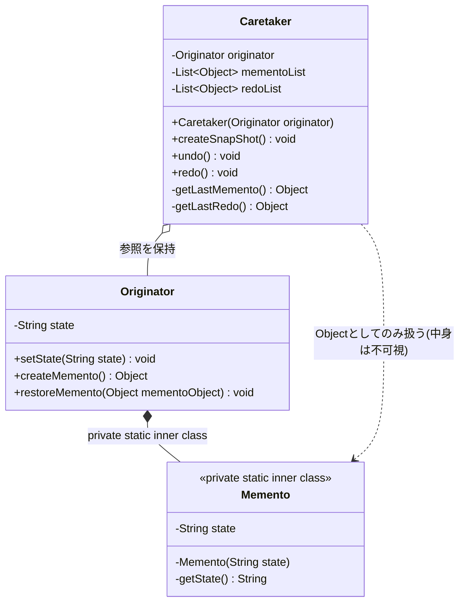
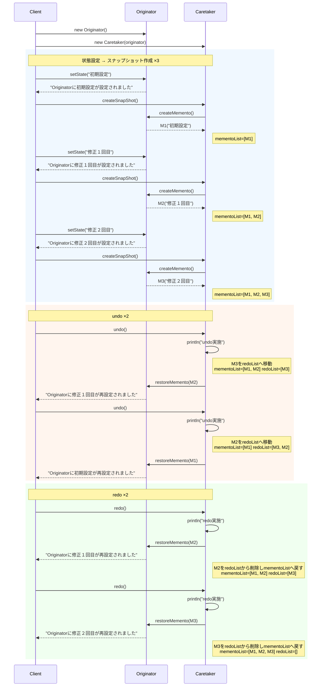

## 概要

Memento（メメント）パターンは、「**オブジェクトのある時点の状態を保存しておき、後から元に戻せるようにする**」ためのデザインパターンです。「メメント」とはラテン語で「形見」や「思い出」を意味します。一言でいえば、強力な「やり直し（Undo）」機能を実現するための仕組みです。

分かりやすい例えは、アクションゲームやRPGの「セーブ機能」です。

- あなた（プレイヤー）：今のレベル、所持金、現在地などの複雑な状態を持っている
- セーブデータ：その瞬間の状態をギュッと固めたデータ。中身はシステムにしか解読できない
- メモリーカード：セーブデータを預かっておく場所。自分では中身をいじらない

もしボス戦で負けてしまっても（状態が最悪になっても）、メモリーカードからデータを読み込めば、セーブした瞬間の状態に完全に巻き戻すことができますよね。

## クラス構造



## イメージ


### 図の見方

#### Originator：状態を持つ本体

画像右上の青いボックスです。「保存したい状態」を持っている本体で、自分の今のスナップショットをMementoとして作成したり、過去のMementoを渡されて元の状態に復元したりします。状態を一番よく知っているのは自分自身なので、自分でスナップショットを作るのがポイントです。

#### Memento：思い出・スナップショット

画像右下のピンクのボックスです。特定の時点の状態を記録した「情報のパッケージ」です。ここで重要なのが、Mementoは「情報のブラックボックス」であるべきだという点です。後述するCaretakerには中身を見せず、Originatorだけが中身を理解できる仕組みにする必要があります。

#### Caretaker：世話人・管理者

画像左上の青いボックスです。Mementoをリストなどで預かっておくだけの存在で、Originatorに「今の状態を保存して」と指示し、作られたMementoを受け取って保管します。また、必要に応じて「この時のMementoに戻して」と指示を出します。大切なのは、Caretaker自身は保存されたデータの中身（状態）を一切いじらない（見られない）という点です。

### まとめ

この仕組みのキモは、「直接状態をいじるのではなく、専用のパッケージ（Memento）を介してやり取りする」という距離感にあります。Caretakerは「身の回りの世話（保存のタイミング管理）」はするけれど、主人のプライベートな日記（中身の状態）は読まない、という絶妙な関係性がこのパターンの本質です。

## メリット

通常、オブジェクトの状態を保存しようとすると、その内部データ（変数など）を外部に公開（getterなど）しなければなりません。しかし、Mementoパターンを使えば、内部構造を秘密にしたまま状態を外部（Caretaker）に預けることができます。

「今の状態を保存」してリストに入れておき、ユーザーが「戻したい」と言ったらリストから古いデータを取り出して適用するだけで済むため、「やり直し（Undo/Redo）」の履歴管理のロジックが非常にシンプルになります。

状態を持っている「本人（Originator）」は、履歴の管理（何個保存するか、いつ捨てるか）を考える必要がありません。履歴管理は「管理者（Caretaker）」に任せられるため、単一責任の原則に則った綺麗な設計になります。

## デメリット

状態を保存するたびに新しいオブジェクト（Memento）を作るため、保存するデータのサイズが大きかったり、履歴を大量に残したりすると、あっという間にメモリを使い果たしてしまう可能性があります。

状態をまるごとコピーして保存するため、頻繁にスナップショットを撮るような設計にすると、コピー処理自体がプログラムの動作を重くする原因になります。

履歴を管理する側（Caretaker）は、保存されたMementoの中身を見ることはできませんが、それらをいつ破棄するか、最大何個まで持つかといった「ライフサイクル」を適切に制御しなければならない、という負担もあります。

## サンプルソース

`Memento`クラスを`Originator`の`private static`なインナークラスとして定義しています。こうすることで、`Caretaker`は`Memento`という型の存在自体にアクセスできなくなり、中身（`getState()`）を覗き見ることも一切できなくなります。これによって、解説で強調した「ブラックボックス」を、コンパイラのレベルで強制できます。

```java:Originator.java
public class Originator {
    private String state;

    public void setState(String state) {
        this.state = state;
        System.out.println("Originatorに" + state + "が設定されました");
    }

    public Object createMemento() {
        return new Memento(state);
    }

    public void restoreMemento(Object mementoObject) {
        Memento memento = (Memento) mementoObject;
        this.state = memento.getState();
        System.out.println("Originatorに" + state + "が再設定されました");
    }

    // privateなインナークラスにすることで、Originatorの外側（Caretakerなど）からは
    // 中身（getState）どころか、このクラスの存在自体に一切アクセスできなくなる
    private static class Memento {
        private final String state;

        private Memento(String state) {
            this.state = state;
            System.out.println("Mementoに" + state + "が設定されました");
        }

        private String getState() {
            return state;
        }
    }
}
```

`Caretaker`は`Memento`という型を直接扱えないため、`Object`型としてそのまま保管し、`Originator`に渡すときもキャストせずそのまま渡します。中身を型として見ることすらできないので、うっかり覗いてしまう心配がありません。

```java:Caretaker.java
import java.util.ArrayList;
import java.util.List;

public class Caretaker {
    private final Originator originator;
    private final List<Object> mementoList = new ArrayList<>();
    private final List<Object> redoList = new ArrayList<>();

    public Caretaker(Originator originator) {
        this.originator = originator;
    }

    public void createSnapShot() {
        // undoの作業が一旦切れるのでredoリストを一旦リセット
        if (!redoList.isEmpty()) {
            redoList.clear();
        }
        this.mementoList.add(this.originator.createMemento());
    }

    public void undo() {
        int index = mementoList.size();
        if (index > 1) {
            System.out.println("undo実施");
            redoList.add(mementoList.get(index - 1));
            mementoList.remove(index - 1);
            Object memento = this.getLastMemento();
            originator.restoreMemento(memento);
        }
    }

    public void redo() {
        int index = redoList.size();
        if (index > 0) {
            System.out.println("redo実施");
            Object memento = this.getLastRedo();
            originator.restoreMemento(memento);
            redoList.remove(index - 1);
            // やり直した内容を、再びundoできるようundo履歴にも戻しておく
            mementoList.add(memento);
        }
    }

    // 直近のMementoを取得
    private Object getLastMemento() {
        int index = mementoList.size();
        if (index < 1) {
            return null;
        }
        return mementoList.get(index - 1);
    }

    // 直近のRedoListを取得
    private Object getLastRedo() {
        int index = redoList.size();
        if (index < 1) {
            return null;
        }
        return redoList.get(index - 1);
    }
}
```

```java:Client.java
public class Client {
    public static void main(String... args) {
        Originator originator = new Originator();
        Caretaker caretaker = new Caretaker(originator);

        originator.setState("初期設定");
        caretaker.createSnapShot(); // 思い出作成

        originator.setState("修正１回目");
        caretaker.createSnapShot(); // 思い出作成

        originator.setState("修正２回目");
        caretaker.createSnapShot(); // 思い出作成

        caretaker.undo();
        caretaker.undo();

        caretaker.redo();
        caretaker.redo();
    }
}
```

### 実行結果

```
Originatorに初期設定が設定されました
Mementoに初期設定が設定されました
Originatorに修正１回目が設定されました
Mementoに修正１回目が設定されました
Originatorに修正２回目が設定されました
Mementoに修正２回目が設定されました
undo実施
Originatorに修正１回目が再設定されました
undo実施
Originatorに初期設定が再設定されました
redo実施
Originatorに修正１回目が再設定されました
redo実施
Originatorに修正２回目が再設定されました
```

### シーケンス図



### 補足：Undo/Redo実装で見落としやすいポイント

`redo()`を実装する際は、`redoList`から取り出したMementoを`Originator`に復元するだけでなく、そのMementoを`mementoList`（undo履歴）にも戻しておく必要があります。これを忘れると、「undoしたあとにredoする」という一連の操作そのものは一見正しく動いているように見えても、その後さらに`undo()`しようとしたときに`mementoList`の中身と実際の状態が噛み合わなくなり、本来戻れるはずの状態まで戻れなくなってしまいます。上のサンプルコードでは、`redo()`の最後で`mementoList.add(memento)`を行うことで、やり直した内容を再びundoできる状態に保っています。

あわせて、`mementoList`や`redoList`が空の状態で`get(-1)`のような不正なインデックスにアクセスしてしまわないよう、`getLastMemento()`・`getLastRedo()`のような取得用メソッドの先頭では、`if (index < 1) { return null; }`という形でリストが空かどうかを必ず確認してから要素を取り出すようにしています。こうした境界チェックは地味ですが、Undo/Redoのような「リストの前後を行き来する」実装では特に重要です。