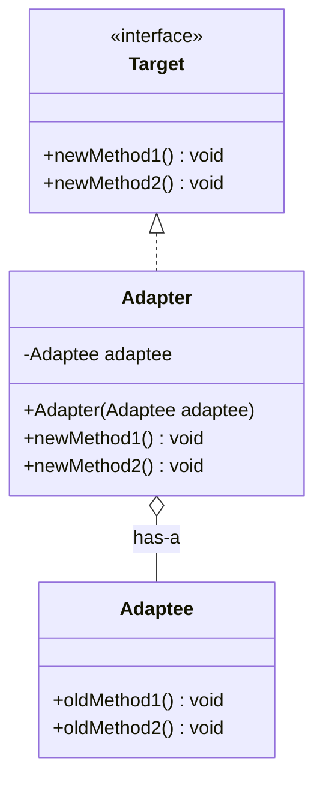
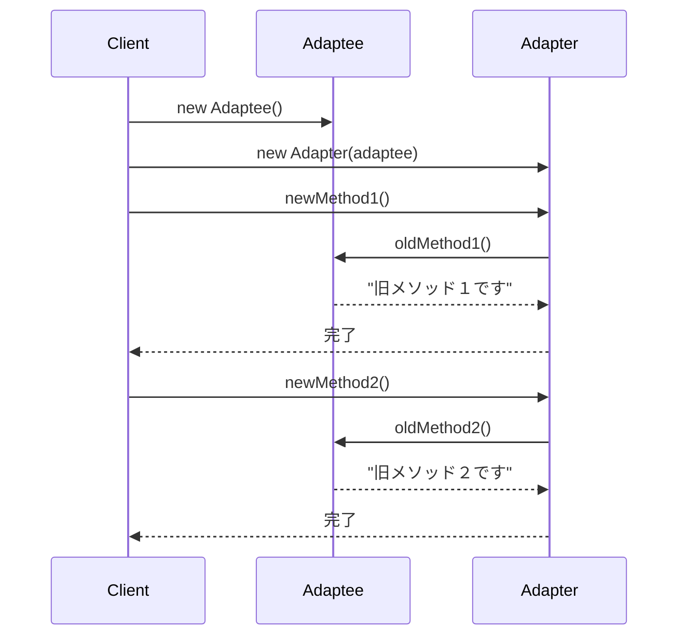

## 概要

Adapter（アダプター）パターンを一言でいうと、「**インターフェースのズレを埋めて、つながらないもの同士をつなげる**」ためのデザインパターンです。別名「Wrapper（ラッパー）パターン」とも呼ばれます。

一番わかりやすい例えは、海外旅行用の電源変換プラグです。

- あなたが持っているもの：日本の家電（コンセントの形は「平型2ピン」）
- 訪れた国のコンセント：海外の壁（形は「丸型3ピン」）
- 問題：形が違うので、そのままでは差し込めない
- 解決策：間に「変換アダプター」を挟む

この「変換アダプター」の役割をそのままコードに落とし込んだものが、Adapterパターンです。「日本の家電（既存のクラス）」も「海外の壁（新しいシステム）」も一切改造せず、間につなぎ役を挟むだけで動くようになる、というのが最大の特徴です。

## クラス構造



## イメージ


ここからの解説は上のイメージ図に合わせて、「気象衛星システムの気圧データ」を例に進めます。後述するサンプルコードでは、話をシンプルにするために`newMethod1()`のような汎用的な名前を使っていますが、まずはイメージを掴みやすい具体例で仕組みを理解してください。

### 図の見方

#### Targetインターフェース：今のルール

図の右上にある、Clientが直接やり取りする窓口です。「気圧は`getPressureForPascal()`（パスカル）という名前で取得する」という、新しいルールが定義されています。

#### Adaptee：古いけれど使える遺産

図の中央下にある「既存気象衛星システム」です。中身は非常に優秀なのですが、設計が古く、「気圧は`getPressureForBar()`（バール）で返す」という古いルールで動いています。このままでは、パスカルの値を欲しがっているClientとは話が噛み合いません。

#### Adapter：通訳者

ここがこのパターンの心臓部です。

1. Clientから`getPressureForPascal()`が呼ばれる
2. 裏側でこっそり古いシステムの`getPressureForBar()`を呼ぶ
3. 得られた「バール」の値を計算して「パスカル」に変換する
4. 何食わぬ顔でClientにパスカルの値を返す

この「呼び出す窓口を合わせるだけでなく、必要なら値そのものも変換する」という点が、Adapterパターンの単なる名前の付け替え以上の価値です。これにより、Clientは相手が古いシステムであることを一切気にせず、新しいルールで通信できるようになります。

### まとめ

この図のポイントは、既存システム（Adaptee）に一切手を加えていないという点です。「古いから作り直そう」ではなく「アダプターを被せて今のルールに合わせよう」という考え方は、大規模なシステム開発や、中身を変更できない外部ライブラリを導入する際に特に重宝します。

## メリット

既存のクラスを修正せずに再利用できる、というのが最大のメリットです。すでにテスト済みで安定している古いクラスや、中身を触れない外部ライブラリを、一切変更することなく新しいシステムに組み込めます。

本体のプログラムは「アダプター」という窓口だけを知っていればよく、その奥にある古いクラスの具体的な実装を気にする必要がなくなります。これにより、新しい仕組みと古い仕組みを切り離すことができます。

既存のコードに手を加えないため、修正によって意図せず元の動作が壊れてしまったり、思わぬところに影響が及んだりするリスクも抑えられます。

## デメリット

本来やりたかった処理にたどり着くまでに「アダプター」という中間層を通ることになるため、その分クラスの数が増え、構造が一段階複雑になります。

メソッドを呼び出す際にアダプターを経由するため、直接呼び出す場合に比べてわずかに実行コストが増えます。とはいえ、現代のJavaであれば無視できるレベルのオーバーヘッドです。

そして、アダプターはあくまで「つなぎ役」であって、古いクラスが抱えている技術的な負債そのものを解消してくれるわけではありません。あまりに多用すると、システムのあちこちが変換器だらけになり、全体像がかえって把握しにくくなることもあります。

## サンプルソース

以下のサンプルでは、話をシンプルにするために`newMethod1()`・`oldMethod1()`のような汎用的な名前を使い、「呼び出す窓口を合わせる」という基本の仕組みだけを示しています。

```java:Target.java
public interface Target {
    void newMethod1();
    void newMethod2();
}
```

```java:Adapter.java
public class Adapter implements Target {
    private final Adaptee adaptee;

    // 既存のAdapteeインスタンスを外部から受け取る形にすることで、
    // より柔軟で疎結合な実装になる（コンストラクタ注入 / DI）
    public Adapter(Adaptee adaptee) {
        this.adaptee = adaptee;
    }

    @Override
    public void newMethod1() {
        adaptee.oldMethod1();
    }

    @Override
    public void newMethod2() {
        adaptee.oldMethod2();
    }
}
```

```java:Adaptee.java
public class Adaptee {
    public void oldMethod1() {
        System.out.println("旧メソッド１です");
    }

    public void oldMethod2() {
        System.out.println("旧メソッド２です");
    }
}
```

```java:Client.java
public class Client {
    public static void main(String... args) {
        Adaptee adaptee = new Adaptee();
        Target target = new Adapter(adaptee);
        target.newMethod1();
        target.newMethod2();
    }
}
```

`Adapter`の中で`new Adaptee()`をハードコーディングせず、外部で作った`Adaptee`のインスタンスをコンストラクタで受け取る形にしている点がポイントです。こうしておくことで、すでにどこかで生成済みの`Adaptee`インスタンスをそのまま渡せたり、`Adaptee`のサブクラスを渡してポリモーフィズムを活かせたりと、コンポジションを使うObject Adapterならではの柔軟性を実際に活用できます。もし`Adapter`が内部で`new Adaptee()`を直接実行してしまうと、Adapterと特定の`Adaptee`インスタンスが強く結びついてしまい、この柔軟性が失われてしまいます。

### 実行結果

```
旧メソッド１です
旧メソッド２です
```

### シーケンス図


## 補足：実際に値を変換する例

先ほどの解説で触れた「気圧データの単位変換」を、実際にコードで書くと次のようになります。単に呼び出す窓口を合わせるだけでなく、Adapterの中で本当にデータを加工できる、という点が伝わりやすいと思います（1バールはちょうど100,000パスカルに相当します）。

```java:PressureTarget.java
public interface PressureTarget {
    double getPressureForPascal();
}
```

```java:LegacyWeatherSatellite.java
public class LegacyWeatherSatellite {
    public double getPressureForBar() {
        // 実際には衛星からの実測値を返す想定
        return 1.013;
    }
}
```

```java:PressureAdapter.java
public class PressureAdapter implements PressureTarget {
    private static final double PASCAL_PER_BAR = 100_000.0;

    private final LegacyWeatherSatellite legacySatellite;

    public PressureAdapter(LegacyWeatherSatellite legacySatellite) {
        this.legacySatellite = legacySatellite;
    }

    @Override
    public double getPressureForPascal() {
        // ここで単位変換という「実際の仕事」をしている
        return legacySatellite.getPressureForBar() * PASCAL_PER_BAR;
    }
}
```

このように、Adapterは「窓口の名前を揃える」だけでなく「中身のデータ形式を変換する」役割も担えます。名前を揃えるだけの単純な委譲に見えても、実際の現場では単位変換・型変換・例外の変換など、こうした「翻訳作業」こそがAdapterの本領発揮どころになることが多いです。

## 補足：Object AdapterとClass Adapter

ここまで紹介してきた実装は、Adapterが`Adaptee`をフィールドとして持つ（コンポジションを使う）タイプのもので、**Object Adapter**と呼ばれます。GoFの書籍では、これとは別に**Class Adapter**という、継承を使った実装方法も紹介されています。

```java:ClassAdapter.java
// Adapteeを継承しつつ、Targetも実装する
public class ClassAdapter extends Adaptee implements Target {
    @Override
    public void newMethod1() {
        oldMethod1();
    }

    @Override
    public void newMethod2() {
        oldMethod2();
    }
}
```

Javaでは、クラスの継承は1つまでしかできませんが、インターフェースの実装は複数できるため、「`Adaptee`を継承しつつ`Target`を実装する」というClass Adapterの形が成立します。

ただし、以前のStrategyパターンの記事でも触れた「継承よりコンポジションを優先せよ」という設計原則から考えると、一般的にはObject Adapter（コンポジションを使う方式）のほうが好まれます。Class Adapterは`Adaptee`の実装に強く依存してしまい、`Adaptee`のサブクラスに対して柔軟に対応しづらいという弱点があるためです。特別な理由がない限り、まずはObject Adapterでの実装を検討するとよいでしょう。