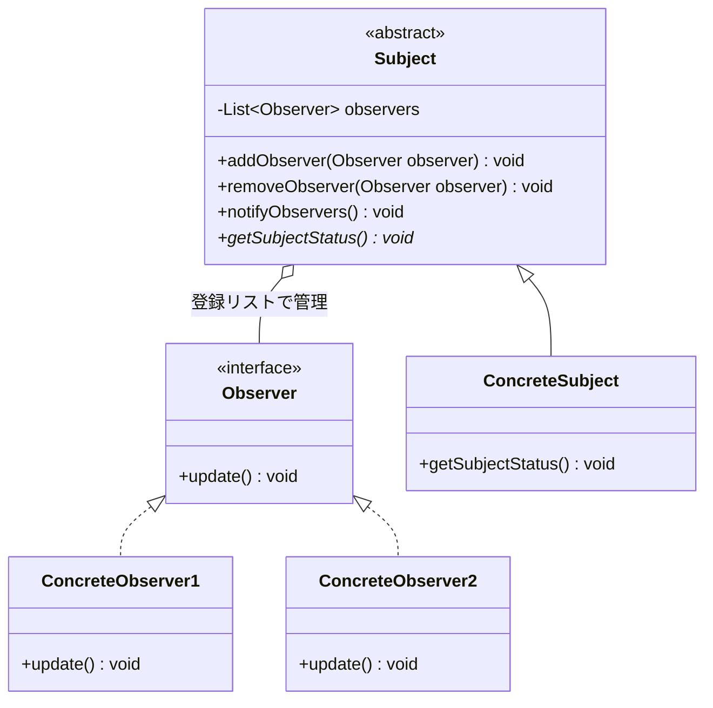
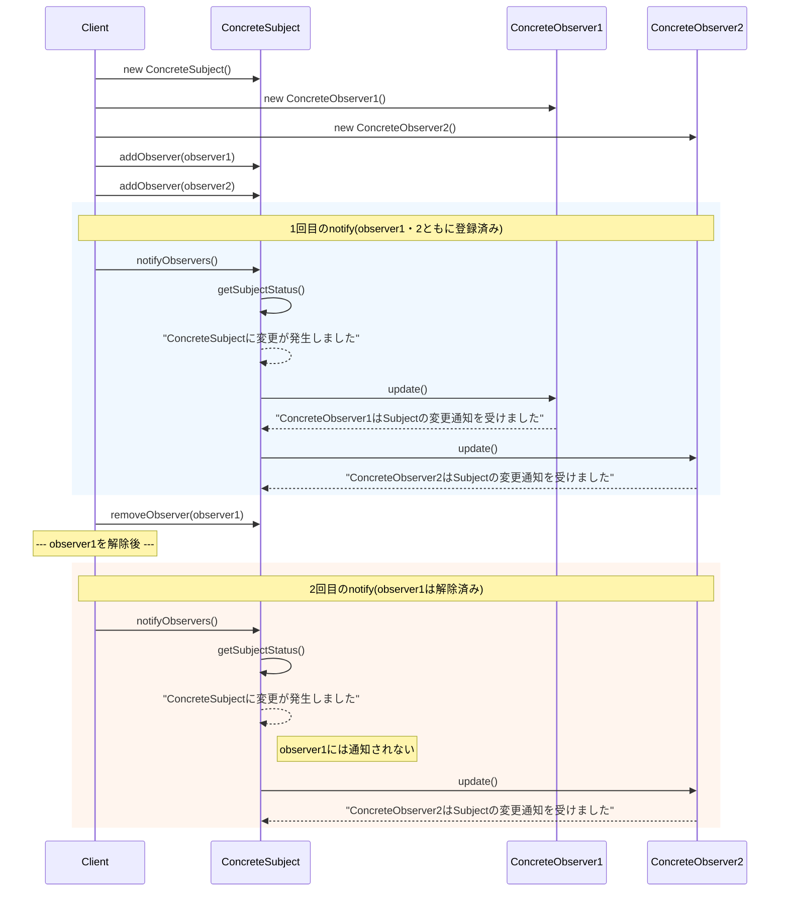

## 概要

Observer（オブザーバー）パターンは、「**誰かが変わったら、登録メンバー全員に自動で通知する**」ためのデザインパターンです。別名「出版-購読（Publish-Subscribe）モデル」とも呼ばれます。

日常的なサービスに置き換えるとイメージが湧きやすくなります。

- YouTuber（Subject）：動画を投稿する側。誰が自分のチャンネルを登録しているか（Observerのリスト）は知っていますが、視聴者一人ひとりのプライベートな生活までは知りません
- 視聴者（Observer）：チャンネル登録ボタンを押した人たち
- 通知（Update）：YouTuberが動画を投稿した瞬間、登録者全員のスマホに「新着動画あり」という通知が一斉に届く

視聴者が「登録解除」をすれば、次からは通知が届かなくなります。このように、相手を詳しく知らなくても（疎結合）情報をやり取りできるのがこのパターンの肝です。

※厳密には、「出版-購読（Publish-Subscribe）モデル」とObserverパターンは少し違うものとして区別されることもあります。詳しくは記事の最後で補足します。

## クラス構造



## イメージ


### 図の見方

#### Subject：データの持ち主

画像左側の「データA・B」を持っている部分です。ここは純粋なデータを管理します。重要なのは、「自分のデータを誰がどんなグラフで見ているか」をSubject自身は詳しく知らないという点です。データが変わった瞬間に「変わったよ」と叫ぶ（通知する）のが仕事です。

#### Observer：表示担当

画像右側の「観察者A・B・C」です。棒グラフ、円グラフ、折れ線グラフなど見た目はバラバラですが、みんな共通の「通知を受け取る窓口（インターフェース）」を持っています。「データが変わったよ」という通知を受け取った瞬間に、自分のグラフを最新の状態に描き直します。

#### Controller：仲介役

画像の一番上です。「このデータ（Subject）を、このグラフ（Observer）で監視してね」と紐付け（登録）を行う役割です。一度セットしてしまえば、あとはデータとグラフが自動で連携し始めます。

### まとめ

この図で最も重要なメッセージは、Subjectは具体的なObserverオブジェクトを意識していない、という点です。

## メリット

通知を送る側（Subject）は、通知を受け取る側（Observer）が「具体的に誰なのか」「何をするのか」を知る必要がありません。ただ「リストに入っている人たちに通知を送る」という仕事に専念できます。これが疎結合（ルーズカップリング）と呼ばれる状態です。

1つの変化に対して、複数のオブジェクトを同時に動かせるのも利点です。たとえば、ユーザーが設定を変更したら「画面の背景色を変えるクラス」「ログを記録するクラス」「サーバーに通知するクラス」が一斉に動き出す、といった処理がスマートに書けます。

データが更新された瞬間に自動で通知が行くため、常に最新の状態を保つことができます。自分で何度も「更新された？」と聞きに行く（ポーリング）必要がなくなるのも見逃せないメリットです。

## デメリット

基本的には「登録されている順」などで通知が行きますが、特定のObserverが処理に時間をかけると、全体のパフォーマンスに影響したり、予期せぬ順序で画面が更新されたりすることがあります。

Aの変化がBに通知され、Bの変化がCに通知され……という連鎖が起きると、どこで何が起きているのか把握するのが困難になります。最悪の場合、無限ループに陥る危険もあります（この「通知の連鎖による無限ループ」は、以前Mediatorパターンの記事で紹介した循環呼び出しの問題と本質的に同じ構造です）。

Observerを登録（購読）したまま解除し忘れると、Subjectがそのobserverへの参照を持ち続けてしまい、ガベージコレクションで解放されなくなります。これは「Lapsed Listener問題」と呼ばれる有名なバグの原因です。

## サンプルソース

```java:Observer.java
public interface Observer {
    void update();
}
```

```java:Subject.java
import java.util.ArrayList;
import java.util.List;

public abstract class Subject {
    private final List<Observer> observers = new ArrayList<>();

    public void addObserver(Observer observer) {
        observers.add(observer);
    }

    // 登録解除の手段も用意しておく（Lapsed Listener問題を避けるために必須）
    public void removeObserver(Observer observer) {
        observers.remove(observer);
    }

    public void notifyObservers() {
        getSubjectStatus();
        for (Observer observer : observers) {
            observer.update();
        }
    }

    public abstract void getSubjectStatus();
}
```

```java:ConcreteObserver1.java
public class ConcreteObserver1 implements Observer {
    @Override
    public void update() {
        System.out.println("ConcreteObserver1はSubjectの変更通知を受けました");
    }
}
```

```java:ConcreteObserver2.java
public class ConcreteObserver2 implements Observer {
    @Override
    public void update() {
        System.out.println("ConcreteObserver2はSubjectの変更通知を受けました");
    }
}
```

```java:ConcreteSubject.java
public class ConcreteSubject extends Subject {
    @Override
    public void getSubjectStatus() {
        System.out.println("ConcreteSubjectに変更が発生しました");
    }
}
```

```java:Client.java
public class Client {
    public static void main(String... args) {
        Subject subject = new ConcreteSubject();
        Observer observer1 = new ConcreteObserver1();
        Observer observer2 = new ConcreteObserver2();

        subject.addObserver(observer1);
        subject.addObserver(observer2);
        subject.notifyObservers();

        // 登録解除すれば、以降は通知が届かなくなる
        subject.removeObserver(observer1);
        System.out.println("--- observer1を解除後 ---");
        subject.notifyObservers();
    }
}
```

### 実行結果

```
ConcreteSubjectに変更が発生しました
ConcreteObserver1はSubjectの変更通知を受けました
ConcreteObserver2はSubjectの変更通知を受けました
--- observer1を解除後 ---
ConcreteSubjectに変更が発生しました
ConcreteObserver2はSubjectの変更通知を受けました
```

### シーケンス図


`removeObserver()`で`observer1`を解除したあとは、2回目の`notifyObservers()`で`ConcreteObserver1`にはメッセージが表示されず、`ConcreteObserver2`にだけ通知が届いていることが分かります。デメリットで説明した「Lapsed Listener問題」は、まさにこの`removeObserver()`を呼び忘れたときに起こる問題です。

## 補足：通知中に登録・解除を行うと起きる`ConcurrentModificationException`

今回の`notifyObservers()`は、`for (Observer observer : observers)`という拡張for文で`observers`リストを順番に処理しています。ここで注意したいのが、もし`Observer.update()`の処理の中から`subject.removeObserver(this)`を呼び出し、「通知を受け取った瞬間に自分自身を解除する」という実装をしてしまうと、ループの実行中にリストの中身が変化することになり、Javaでは`java.util.ConcurrentModificationException`が発生してクラッシュしてしまいます。

これは、拡張for文が内部で使っているIteratorが「ループ中にリストの構造が変わっていないか」をチェックしているために起きる、Javaではよく知られた事故パターンです。実務では、次のような方法で回避します。

- `notifyObservers()`の中で`observers`のコピー（`new ArrayList<>(observers)`）を作成してから、そのコピーに対してループを回す
- `observers`フィールド自体を、読み取り時にスナップショットを取ってくれる`CopyOnWriteArrayList`にしておく

```java
public void notifyObservers() {
    getSubjectStatus();
    // observersのコピーに対してループすることで、
    // ループ中にobserversの中身が変わっても影響を受けないようにする
    for (Observer observer : new ArrayList<>(observers)) {
        observer.update();
    }
}
```

「通知を受け取ったObserverが、自分自身の登録を解除する」というのは実務でもよくある要件なので、あらかじめこうした対策を知っておくと安心です。

## 補足：「プッシュ型」と「プル型」の通知スタイル

今回の`update()`メソッドは引数を取らないシンプルな作りになっているため、Observerは「何かが変わった」ということしか分かりません。どう変わったのかを知りたければ、Observer側であらかじめSubjectへの参照を持っておき、自分で問い合わせにいく必要があります。このやり方は「プル型（Observer側が取りに行く）」と呼ばれます。

もう1つのやり方として、`update()`の引数に変更内容やSubject自身を渡してしまう「プッシュ型（Subject側から押し付ける）」もよく使われます。

```java
public interface Observer {
    void update(Subject subject); // 変更元のSubjectを直接渡す
}
```

こうしておけば、Observerは渡された`Subject`から必要な情報を直接読み取れるため、都度Subjectへの参照を自前で持っておく必要がなくなります。どちらが優れているというより、「通知のたびに毎回渡したいデータがあるか」で使い分けるとよいでしょう。

## 補足：`java.util.Observer`と、その後継

実は、Javaには昔から`java.util.Observer`と`java.util.Observable`という、このパターンをそのまま言語標準でサポートするクラス・インターフェースが存在していました。ただし、`Observable`がインターフェースではなくクラスであるために他のクラスを継承できなくなる、スレッドセーフ性が保証されていないといった設計上の問題が指摘され、**Java 9で非推奨（deprecated）** になっています。

現在では、同じような「変更通知」の仕組みが必要な場合、`java.beans`パッケージの`PropertyChangeListener`／`PropertyChangeSupport`を使ったり、非同期のデータストリームを扱いたい場合はJava 9で導入された`java.util.concurrent.Flow`（Reactive Streamsという標準仕様に沿った`Publisher`/`Subscriber`インターフェース）を使ったりするのが一般的です。今回自作したような`Subject`／`Observer`インターフェースは学習用としてとても分かりやすい一方、実務でゼロから自作する前に、まずはこうした標準・準標準の仕組みで十分かどうかを検討してみるとよいでしょう。

## 補足：ObserverパターンとPublish-Subscribe（Pub/Sub）パターンの違い

概要では「別名、出版-購読（Publish-Subscribe）モデルとも呼ばれる」と紹介しましたが、一般的な会話の中ではほぼ同じ意味で使われる一方、厳密なアーキテクチャの文脈では区別されることもあります。

- **Observerパターン**：SubjectとObserverが、お互いの存在（インターフェース）を直接知っている「直結型」の関係です。今回のサンプルコードのように、SubjectはObserverのリストを直接持ち、直接`update()`を呼び出します
- **Publish-Subscribe（Pub/Sub）パターン**：PublisherとSubscriberの間に、Message Broker（Event BusやMQ＝メッセージキューなど）と呼ばれる中間コンポーネントが挟まります。PublisherはBrokerに向けてメッセージを送るだけで、そのメッセージを誰が受け取るかを一切知りません。Subscriberも同様に、誰が送ったメッセージかを気にせず、興味のある種類のメッセージだけを受け取ります

つまり、「変化があったら関係者に知らせる」という概念自体は共通していますが、Observerパターンは送り手と受け手が直接繋がっているのに対し、Pub/Subは間にブローカーが入ることで、送り手と受け手が完全に疎結合になっている、という違いがあります。システム構成やアーキテクチャを議論する場面では、「それはObserverパターンの話なのか、それともメッセージブローカーを使ったPub/Subの話なのか」を意識して使い分けると、話が噛み合いやすくなります。