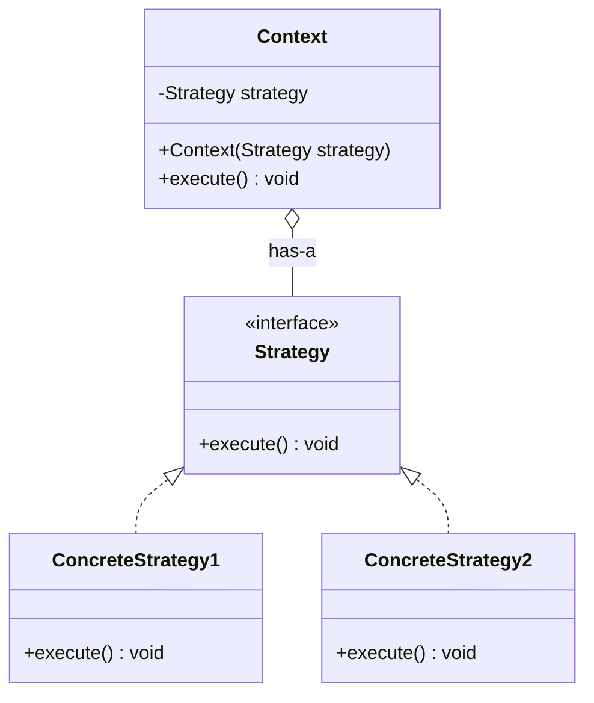
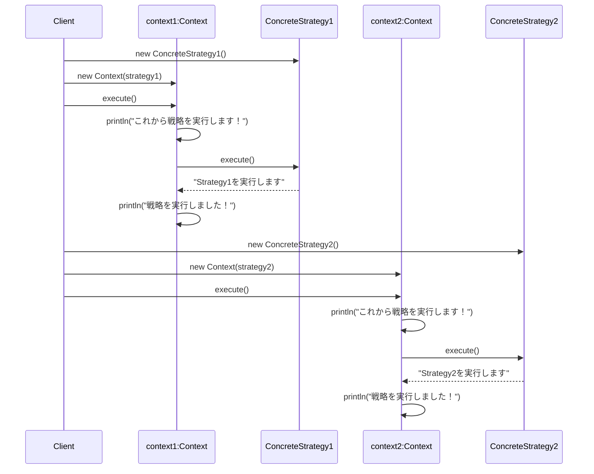

## 概要

Strategy（ストラテジー）パターンを一言でいうと、「**アルゴリズム（処理のやり方）を、後から自由に差し替えられるようにする**」ためのデザインパターンです。

身近な例でいうと、ネットショップの支払い方法をイメージすると分かりやすいです。レジ本体の仕組みは変えないまま、「クレジットカードで払う」「PayPayで払う」といった支払い方法（＝作戦）だけを、その場に応じて差し替えて使うことができます。レジ側は「支払いを実行する」という命令を出すだけで、実際にどう処理されるかは選ばれた支払い方法クラスに任せる、という関係です。

## クラス構造



## イメージ


ここからは、上のイメージ図に合わせて「戦国武将の陣形」を例に解説します。支払い方法の例とは題材が変わりますが、話している構造（仕組み）はまったく同じです。「クレジットカード」を「鶴翼の陣」に、「PayPay」を「魚鱗の陣」に置き換えて読んでも、構造としては何も変わりません。

### 図の見方

#### Strategyインターフェース：共通のルールだけを決める

図の中央にあるオレンジの部分です。ここでは「戦うときは`battle()`という名前の命令を呼び出す」という**ルール（型）だけ**を決めています。具体的にどう戦うかは、ここには一切書かれていません。

#### 具体的な陣形クラス：作戦の中身を実装する

下にある3つのボックス（鶴翼・魚鱗・長蛇）です。Strategyインターフェースで決められた`battle()`というルールに従いつつ、「うちはV字に並ぶ」「うちは一列で突撃する」といった**具体的な中身**を、それぞれのクラスが個別に持っています。

#### Contextクラス：作戦を実行する側

図の右上のボックスです。ここがこのパターンの一番のポイントになります。

Contextは、特定の陣形（たとえば長蛇の陣）を自分の内部に直接書き込んでいるわけではありません。「何らかの陣形（Strategyインターフェース）を差し込める場所」だけを持っています。つまり**Context側は、今セットされているのがどの陣形なのかを一切知らなくていい**ということです。

図に書かれている「has-a関係」というのは、「ContextはStrategyを部品として持っている」という意味です。似た言葉に「is-a関係（継承関係）」がありますが、Strategyパターンでは継承ではなく、こうした「持つ」関係（コンポジション）を使うのが特徴です。

#### Client：どの作戦を使うか決める側

「今は敵が少ないから『長蛇の陣』で行こう」というように、**使う作戦を選んでContextに渡す**役割を持ちます。

### まとめ

このパターンの面白いところは、Context（実行者）が「自分が今どの陣形で戦っているか」を詳しく知らなくてもよい、という点です。Contextは「とにかくセットされた作戦の`battle()`を呼べばいい」とだけ割り切ることで、新しい陣形を追加してもContext側のコードには一切手を加えずに済むようになります。

## メリット

`if`や`switch`の分岐地獄から抜け出せるのが、まず分かりやすい利点です。「支払い方法がAならこの処理、Bならこの処理」と1つの大きなクラスに条件分岐を書き連ねていくと、読みづらくなるうえに修正のたびに壊れないか不安になります。Strategyパターンでは、それぞれの作戦を独立したクラスに切り出すため、メインのコードがすっきりします。

新しい作戦を追加しやすいのも大きな強みです。たとえば新しい支払い方法（仮想通貨払いなど）を追加したいとき、既存のクラスを一切いじる必要はありません。新しいクラスを1つ追加するだけで済むので、既存の動作を壊す心配がなく、安心して機能を拡張できます（これはオブジェクト指向設計の原則の1つである、いわゆる「開放閉鎖の原則（OCP）」にも合致する考え方です）。

さらに、プログラムの実行中に作戦を切り替えられる点も特徴です。「急いでいるから最短ルート」「景色を見たいから観光ルート」というように、ユーザーの選択に応じて、動いている途中でも中身のロジックを入れ替えることができます。

※ただし、これは「Strategyパターンという仕組み自体が持つ可能性」の話です。後述するサンプルコードでは、Contextのフィールドを`final`にしており、コンストラクタで渡した戦略をあとから変更できない（イミュータブルな）実装になっています。実行中の切り替えを実際に行いたい場合は、`final`を外して`setStrategy()`のようなメソッドを用意する必要があります。具体的な実装は、サンプルソースの節で補足します。

## デメリット

一方で、作戦の数だけクラスが増えていくというのは避けられません。作戦が10個あれば、クラスも最低10個は必要になり、プロジェクト全体としては少し見通しが悪くなることがあります。

※ただし、これはJavaの歴史的な事情もあります。Java 8以降では、Strategyインターフェースのように**抽象メソッドを1つしか持たないインターフェース（関数型インターフェース）**であれば、わざわざ`ConcreteStrategy`クラスを新しく作らなくても、**ラムダ式**を使ってその場で処理を渡すことができます。ちょっとした処理を1つ追加したいだけなのに、そのためだけにクラスファイルを1つ増やす……というのを避けたい場合には、有効な選択肢です。

```java:Strategy.java（関数型インターフェースとして明示）
// @FunctionalInterfaceを付けておくと、抽象メソッドが2つ以上にならないよう
// コンパイル時にチェックしてもらえる
@FunctionalInterface
public interface Strategy {
    void execute();
}
```

```java
// Client側：ConcreteStrategyクラスをわざわざ作らず、ラムダ式で直接渡す
Context context = new Context(() -> System.out.println("ラムダ式による作戦の実行"));
context.execute();
```

もちろん、処理が複雑になってきて名前を付けて管理したい場合や、状態（フィールド）を持たせたい場合は、これまで通りクラスとして実装したほうが見通しがよくなります。「シンプルな処理はラムダ式で手軽に」「複雑な処理はクラスとしてきちんと定義」という使い分けができる、という点を覚えておくとよいでしょう。

また、「どの作戦を使うか」を決める役割は、多くの場合Client側にあります。つまり、**利用する側が各作戦の特徴をある程度理解していないと、適切な選択ができない**という負担が生じます。

もう1つ地味に厄介なのが、データの受け渡しです。すべての作戦は共通のインターフェース（窓口）に従う必要があるため、「ある作戦ではデータが1つで足りるのに、別の作戦では3つ必要」といった差がある場合、それらをどう共通の窓口でやり取りするかに設計の工夫が求められます。

## サンプルソース

コードでは、先ほどの「陣形」の例からさらに一歩踏み込んで、より汎用的な名前（`ConcreteStrategy1`、`ConcreteStrategy2`）で実装しています。メソッド名も、画像の`battle()`ではなく、より一般的な`execute()`という名前にしています。「陣形Aを実行する」も「支払い方法Aを実行する」も、突き詰めれば「何らかの処理を実行する」という点では同じだからです。

```java:Context.java
public class Context {
    // ContextクラスはStrategyを持つ。持つのはクラスではなくインタフェース。
    // 大事なのは、Contextクラスが具体的にどのStrategyかを意識しなくてよいこと。
    private final Strategy strategy;

    public Context(Strategy strategy) {
        this.strategy = strategy;
    }

    public void execute() {
        System.out.println("これから戦略を実行します！");

        // 何らかの戦略のexecuteメソッドを実行する。
        // Context自身は、これが具体的にどの戦略なのかを知らない。
        strategy.execute();

        System.out.println("戦略を実行しました！");
    }
}
```

```java:Strategy.java
public interface Strategy {
    void execute();
}
```

```java:ConcreteStrategy1.java
public class ConcreteStrategy1 implements Strategy {
    @Override
    public void execute() {
        System.out.println("Strategy1を実行します");
    }
}
```

```java:ConcreteStrategy2.java
public class ConcreteStrategy2 implements Strategy {
    @Override
    public void execute() {
        System.out.println("Strategy2を実行します");
    }
}
```

```java:Client.java
public class Client {
    public static void main(String... args) throws Exception {
        Context context1 = new Context(new ConcreteStrategy1()); // 戦略1を渡す
        context1.execute();

        System.out.println("----------------------------------------------------");

        Context context2 = new Context(new ConcreteStrategy2()); // 戦略2を渡す
        context2.execute();
    }
}
```

### 実行結果

```
これから戦略を実行します！
Strategy1を実行します
戦略を実行しました！
----------------------------------------------------
これから戦略を実行します！
Strategy2を実行します
戦略を実行しました！
```

### シーケンス図


## 補足：実行中に戦略を切り替えたい場合

上のサンプルコードは、コンストラクタで渡した戦略をあとから変更できない、いわば「不変（イミュータブル）」な実装になっています。これはこれで、「一度作ったContextの挙動が途中で変わらない」という安心感があり、valid な設計です。

一方、メリットの節で触れたように「実行中にユーザーの操作に応じて戦略を切り替える」ことを実現したい場合は、`strategy`フィールドから`final`を外し、戦略を差し替えるための`setStrategy()`のようなメソッドを用意します。

```java:Context.java（可変版）
public class Context {
    // finalを外すことで、生成後にも差し替え可能にする
    private Strategy strategy;

    public Context(Strategy strategy) {
        this.strategy = strategy;
    }

    // 実行中に戦略を変更できるようにするメソッド
    public void setStrategy(Strategy strategy) {
        this.strategy = strategy;
    }

    public void execute() {
        strategy.execute();
    }
}
```

どちらの実装が正解というわけではなく、「Contextの状態を途中で変えたくない」なら不変版、「利用者の操作に応じて柔軟に切り替えたい」なら可変版、というように、実際のユースケースに応じて選択するとよいでしょう。

## 補足：Template Methodパターンとの違い

以前の記事で紹介したTemplate Methodパターンと、このStrategyパターンは、どちらも「処理の一部を後から差し替えられるようにする」という似た目的を持っているため、しばしば混同されます。両者の決定的な違いは、**継承（is-a）を使うか、コンポジション（has-a）を使うか**という点です。

- **Template Method**：抽象クラスを`extends`（継承）し、サブクラスが親クラスの一部メソッドをオーバーライドすることで処理を変える
- **Strategy**：Contextクラスの中にStrategyインターフェースを部品として持たせ（コンポジション）、その部品を丸ごと差し替えることで処理を変える

継承を使うTemplate Methodは、クラスの設計時点で「どのサブクラスを使うか」が決まっている場合に向いています。一方、Strategyはコンポジションを使うため、プログラムの実行中に「どの部品（Strategy）を差し込むか」を動的に切り替えられる、という柔軟性の違いがあります。オブジェクト指向設計の世界でよく言われる「継承よりコンポジションを優先せよ（Favor composition over inheritance）」という原則を体現しているパターンの1つが、このStrategyパターンだと言えます。