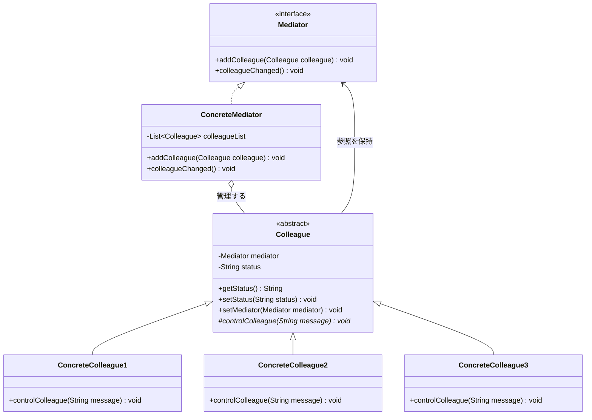
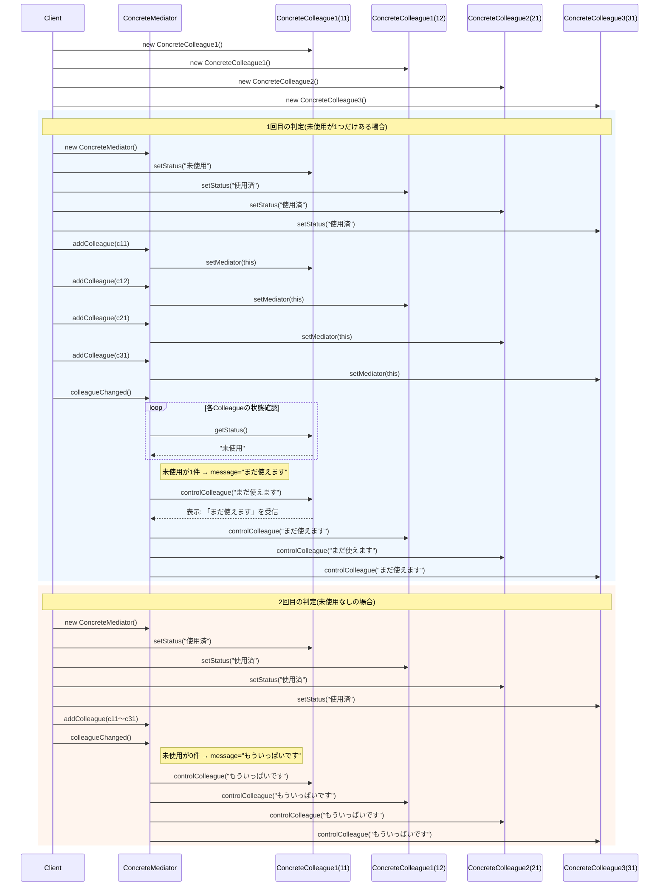

## 概要

Mediatorは「仲裁者」という意味の英単語です。Mediator（メディエーター）パターンを一言でいうと、「**バラバラに動くオブジェクトたちの中心に立ち、連絡係を引き受ける**」ためのデザインパターンです。

たくさんのオブジェクト（部品）がお互いに直接メッセージを送り合うと、関係が網の目のように複雑になっていきます。Mediatorパターンでは、各オブジェクトは「仲裁者（Mediator）」にだけ報告し、指示もそこから受け取るようにします。

分かりやすい例えは、飛行機と航空管制塔の関係です。もし管制塔がなければ、すべてのパイロットが他のすべてのパイロットと直接無線でやり取りし、「今から着陸するよ」「え、私も」「どいて」と収拾がつかなくなります。飛行機の数が増えるほど、通信網はスパゲッティのように絡まっていきます。

管制塔（Mediator）がある場合は話が変わります。パイロットは管制塔だけに報告し、指示を仰げばよく、他の飛行機がどこにいるかを自分で把握する必要はありません。管制塔が全体を俯瞰して、「A機は着陸、B機は旋回待機」と交通整理をしてくれるからです。

## クラス構造




## イメージ


### 図の見方

#### 登場人物：同僚（Colleague）

画像の中の「名前入力テキスト」「住所入力テキスト」「送信ボタン」がこれに当たります。それぞれ自分の仕事（文字が入力された、クリックされた）は分かりますが、他のパーツの状況は知りません。

#### 調停者：Mediator

真ん中の「Mediator」が司令塔です。テキスト欄に文字が入ると、Mediatorに「入力がありました」と報告が上がります。Mediatorは「名前も住所も埋まったな」と判断し、送信ボタンに対して「送信していいよ」と合図を送ります。

#### 直接参照しないことの意味

ここがこのパターンの肝です。もし送信ボタンが直接テキスト欄の中身を見に行こうとすると、「ボタンはテキスト欄の存在を知っていなければならない」という依存関係が生まれます。入力項目が増えるたびに、ボタン側のコードまで書き直すことになりかねません。

Mediatorがいれば、各パーツは「Mediatorに報告するだけ」で済みます。パーツ同士が互いを知らなくてよいので、部品を後から入れ替えたり、増やしたりするのが簡単になります。

### まとめ

この仕組みが説いているのは、「オブジェクト間の複雑な結びつきをほどき、一箇所で管理する」ことの重要性です。「送信ボタンが押せるかどうか」という判断ロジックをボタン自身に持たせず、Mediatorという第三者に預けることで、画面全体の制御がすっきりします。

## メリット

各オブジェクト（Colleague）は他のオブジェクトを誰一人知る必要がなく、知っているのは仲裁者だけです。これにより「多対多」だった依存関係が「1対多」に整理され、コードの見通しが良くなります。

特定のオブジェクトが他の特定のオブジェクトに依存していないため、その部品を別の場所に持っていって再利用するのも簡単になります。

「Aが変化したらBとCを更新する」といった複雑な連携ルールを、仲裁者クラスの中に集約できるのも利点です。挙動を変えたいときは、仲裁者のコードだけを修正すれば済みます。

## デメリット

すべての通信を1つのクラスに集約する以上、システムが大規模になるほど仲裁者クラスが肥大化しやすいという弱点があります。これは「神オブジェクト（God Object）」と呼ばれるアンチパターンに陥りやすいということでもあり、Mediatorパターン最大のデメリットとしてよく挙げられます。

「何でも知っている」クラスは、どこか一箇所を直すと全体に影響が出るリスクも高まります。本来バラバラにしておきたかった複雑さが、仲裁者という一点に凝縮されてしまう、というのがこのパターンの難しいところです。

## サンプルソース

```java:Mediator.java
public interface Mediator {
    void addColleague(Colleague colleague);
    void colleagueChanged();
}
```

```java:ConcreteMediator.java
import java.util.ArrayList;
import java.util.List;

public class ConcreteMediator implements Mediator {
    private List<Colleague> colleagueList = new ArrayList<>();

    @Override
    public void addColleague(Colleague colleague) {
        colleagueList.add(colleague);
        // このMediatorを、Colleague側にも覚えておいてもらう
        colleague.setMediator(this);
    }

    @Override
    public void colleagueChanged() {
        int unUsedCount = 0;
        for (Colleague colleague : colleagueList) {
            if (colleague.getStatus().equals("未使用")) {
                unUsedCount += 1;
            }
        }

        String message;
        if (unUsedCount == 0) {    // 「未使用」が1つもない場合
            message = "もういっぱいです";
        } else {                   // 「未使用」がある場合
            message = "まだ使えます";
        }

        // Colleagueへメッセージを渡す
        for (Colleague colleague : colleagueList) {
            colleague.controlColleague(message);
        }
    }
}
```

```java:Colleague.java
public abstract class Colleague {
    private Mediator mediator;
    private String status;

    public String getStatus() {
        return this.status;
    }

    public void setStatus(String status) {
        this.status = status;
    }

    public void setMediator(Mediator mediator) {
        this.mediator = mediator;
    }

    protected abstract void controlColleague(String message);
}
```

```java:ConcreteColleague1.java
public class ConcreteColleague1 extends Colleague {
    @Override
    public void controlColleague(String message) {
        System.out.println("ConcreteColleague1が「" + message + "」のメッセージを受けました");
    }
}
```

```java:ConcreteColleague2.java
public class ConcreteColleague2 extends Colleague {
    @Override
    public void controlColleague(String message) {
        System.out.println("ConcreteColleague2が「" + message + "」のメッセージを受けました");
    }
}
```

```java:ConcreteColleague3.java
public class ConcreteColleague3 extends Colleague {
    @Override
    public void controlColleague(String message) {
        System.out.println("ConcreteColleague3が「" + message + "」のメッセージを受けました");
    }
}
```

```java:Client.java
public class Client {
    public static void main(String... args) {

        Colleague colleague11 = new ConcreteColleague1();
        Colleague colleague12 = new ConcreteColleague1();
        Colleague colleague21 = new ConcreteColleague2();
        Colleague colleague31 = new ConcreteColleague3();

        // 1回目の判定（1つだけ未使用あり）
        Mediator mediator1 = new ConcreteMediator();
        colleague11.setStatus("未使用");
        colleague12.setStatus("使用済");
        colleague21.setStatus("使用済");
        colleague31.setStatus("使用済");

        mediator1.addColleague(colleague11);
        mediator1.addColleague(colleague12);
        mediator1.addColleague(colleague21);
        mediator1.addColleague(colleague31);

        mediator1.colleagueChanged();

        // 2回目の判定（未使用なし）
        Mediator mediator2 = new ConcreteMediator();

        colleague11.setStatus("使用済");
        colleague12.setStatus("使用済");
        colleague21.setStatus("使用済");
        colleague31.setStatus("使用済");

        mediator2.addColleague(colleague11);
        mediator2.addColleague(colleague12);
        mediator2.addColleague(colleague21);
        mediator2.addColleague(colleague31);

        mediator2.colleagueChanged();
    }
}
```

### 実行結果

```
ConcreteColleague1が「まだ使えます」のメッセージを受けました
ConcreteColleague1が「まだ使えます」のメッセージを受けました
ConcreteColleague2が「まだ使えます」のメッセージを受けました
ConcreteColleague3が「まだ使えます」のメッセージを受けました
ConcreteColleague1が「もういっぱいです」のメッセージを受けました
ConcreteColleague1が「もういっぱいです」のメッセージを受けました
ConcreteColleague2が「もういっぱいです」のメッセージを受けました
ConcreteColleague3が「もういっぱいです」のメッセージを受けました
```

### シーケンス図


## 補足：Colleagueは本当に「自分から報告」しているか

先ほどの解説では「テキスト欄に文字が入ると、Mediatorに報告する」という、Colleague自身が能動的に動くイメージで説明しました。ですが、上のサンプルコードをよく見ると、実際にMediatorへ判定を依頼しているのは`Colleague`自身ではなく、**すべてのステータスをセットし終えたあとにClientが明示的に呼び出している`mediator.colleagueChanged()`**です。`Colleague`が持っている`setMediator()`は、Mediatorへの参照を保持するためだけに使われており、今回のサンプルではその参照を使って自発的に報告する処理までは実装していません。

これは間違いというより、「判定のタイミングをClientが完全にコントロールできる」という、分かりやすさを優先したシンプルな実装だと捉えてください。もし解説通りに「ステータスが変わった瞬間に、Colleague自身がMediatorへ自動的に報告する」という動きを再現したいなら、`setStatus()`の中で保持している`mediator`を使って通知する形に変更します。

```java:Colleague.java（自動報告版）
public abstract class Colleague {
    protected Mediator mediator;
    private String status;

    public String getStatus() {
        return this.status;
    }

    public void setStatus(String status) {
        this.status = status;
        // 自分の状態が変わったことを、自分自身でMediatorに報告する
        if (mediator != null) {
            mediator.colleagueChanged();
        }
    }

    public void setMediator(Mediator mediator) {
        this.mediator = mediator;
    }

    protected abstract void controlColleague(String message);
}
```

ただし、この形にする場合は「Mediatorに登録してから（`addColleague()`を呼んでから）ステータスを変更する」という順番を守る必要があります。先に`setStatus()`を呼んでしまうと、その時点では`mediator`がまだ`null`のため、報告が発生しません。実際のGUIアプリケーションのように「入力のたびに即座に画面全体をチェックし直したい」場合はこちらの自動報告版、「複数の変更をまとめてから、最後に1回だけ判定したい」場合は今回のサンプルのような明示呼び出し版、というように使い分けるとよいでしょう。

もう1つ、自動報告版を実務で使うときに注意したいのが、**循環呼び出し（無限ループ）**です。GUI開発では非常によく使われる実装パターンである一方、`StackOverflowError`の原因としてもよく知られています。典型的なハマり方は次のような流れです。

1. `ColleagueA`の`setStatus()`が呼ばれ、`Mediator`に報告される
2. `Mediator`が全体を調整するため、`ColleagueB`の`controlColleague()`を呼ぶ
3. `ColleagueB`の`controlColleague()`の中で、うっかり自分自身の`setStatus()`を呼んでしまう
4. それがまた`Mediator`への報告を引き起こし、`ColleagueA`側の`controlColleague()`が呼ばれ……という具合に、報告と命令が延々と往復してクラッシュする

これを避けるには、「`Mediator`からの命令を受け取るメソッド（`controlColleague()`）の中では、状態変更を伴う`setStatus()`を呼ばない」というルールを徹底するか、どうしても呼ぶ必要がある場合は「今まさに通知処理中かどうか」を表すフラグを持たせて、通知の連鎖を途中で断ち切るといった対策が必要になります。「状態が変わったら自動的に報告する」という便利な仕組みほど、こうした循環に注意が必要だという点は覚えておくとよいでしょう。

## 補足：Observerパターンとの違い

「複数のオブジェクトが連携する」という点で、MediatorパターンはObserver（オブザーバー）パターンとよく比較されます。両者の狙いは似ていますが、関係の作り方が異なります。

- **Observer**：1つの「発信者（Subject）」の状態変化を、それを購読している複数の「観察者（Observer）」に一斉に知らせる、1対多の通知の仕組み
- **Mediator**：複数の異なるオブジェクト（Colleague）同士のやり取りを、中央の仲裁者がまとめて調整する仕組み

Observerは「誰か1人の変化を、みんなに伝える」ことに主眼があるのに対し、Mediatorは「複数の関係者の間で、条件に応じたやり取り（今回の例でいう『空きがあるかどうかの判定』のような複雑なロジック）を1箇所に集約する」ことに主眼があります。実際には、MediatorがColleagueたちに変化を知らせる部分にObserverパターンが組み合わせて使われることも多く、両者は排他的なものではなく、組み合わせて使われることもある関係だと捉えておくとよいでしょう。