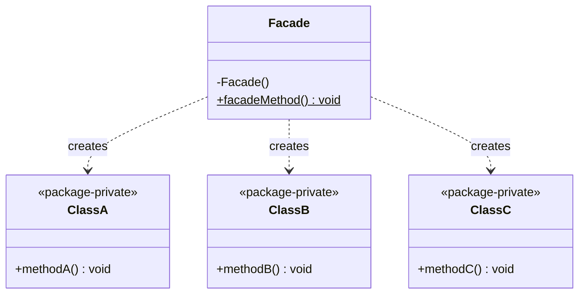
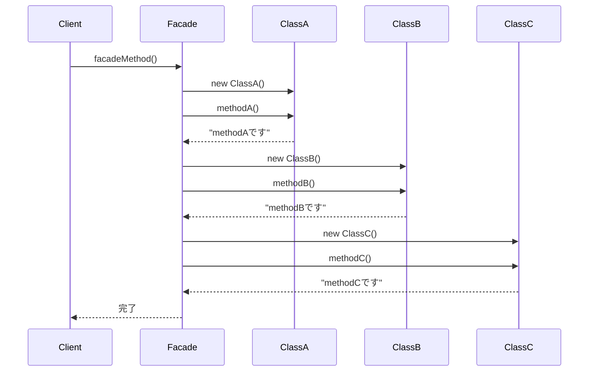

## 概要

Facade（ファサード）パターンを一言でいうと、「**複雑な内部処理を、1つのシンプルな窓口にまとめる**」ためのデザインパターンです。フランス語の「Facade」はもともと建物の「正面（顔）」を意味する言葉です。

身近な例では、ホテルのコンシェルジュや、パソコンの電源ボタンをイメージすると分かりやすいです。パソコンの内部では、CPUの初期化・メモリのチェック・OSの読み込みといった非常に複雑な処理が行われていますが、使う人は電源ボタンを1つ押すだけで済みます。この「ボタン」の役割を担うのがFacadeです。

## クラス構造


## イメージ


### 図の見方

#### Client（利用側）の負担が激減する

画像左側の青いボックスがClientです。もしFacadeがなければ、Clientは「クラスAのメソッドを呼んで、その結果をクラスBに渡して……」というように、右側に描かれている複雑な依存関係をすべて自分で把握し、正しい順番で呼び出さなければなりません。Facadeがあることで、Clientは「外部公開API」という1つの窓口を叩くだけで済むようになります。

#### Facade：外部との唯一の窓口

真ん中の赤い枠がFacadeです。ここには、クラスA・B・Cをどういう順番で呼び出せばよいかという「一連の手順」がまとめて書き込まれています。画像の中に建物の写真が使われているのは、「複雑な裏側を見せない、立派な正面玄関」というイメージそのものを表しています。

#### アクセス制限：内部クラスを直接触らせない工夫

画像下の注釈にある「枠内のクラスのアクセス制限をデフォルト（package-private）にする」という記述は、実はJavaで正確に実装しようとすると少しコツが要ります。

Javaのアクセス修飾子には次のような違いがあります。

- `public`：どのパッケージからでもアクセスできる
- `protected`：同じパッケージに加えて、別パッケージの**サブクラス**からもアクセスできる
- 修飾子なし（package-private）：**同じパッケージ内のクラスからしかアクセスできない**（最も厳しい制限）

「外部の人間が勝手にクラスAやDを触れないようにガードする」を徹底したいなら、メソッドの修飾子だけを気にするのではなく、**クラス宣言自体からも`public`を外して package-private にする**必要があります。クラス自体が`public`のままだと、別パッケージからでも普通に`import`して`new`できてしまうため、内部クラスを隠しきれません。この点は、後述のサンプルコードで実際に修正して示します。

### まとめ

このパターンの核心は、**裏側がどれだけ複雑に絡み合っていても、Clientにはそれを見せず、整えられた「窓口」だけを見せる**という点にあります。「用事があるなら必ずFacadeを通す」というルールを、設計だけでなくアクセス修飾子というコードレベルの仕組みでも強制できるのが、Javaで実装するときのポイントです。

## メリット

サブシステムの中に10個のクラスがあっても、使う人はFacadeクラスのメソッドを1つ呼ぶだけで済みます。「どのクラスをどの順番で呼べばよいか」という難しいルールを知らなくてよいので、使い勝手が劇的に向上します。

内部クラス（サブシステム）の仕様が変わっても、Facadeがその変化を吸収してくれれば、それを利用しているプログラム側を修正する必要はありません。これは「疎結合」と呼ばれる、システムの変更に強い構造です。

チームに新しい開発者が加わったときの学習コストを下げられるのも見逃せない利点です。複雑な内部構造をすべて理解しなくても、まずは「Facadeの使い方」さえ覚えれば作業を進められます。

## デメリット

便利にしようとあれもこれもFacadeクラスに詰め込みすぎると、そのクラス1つだけが何千行にも膨れ上がった「巨大で見通しの悪いクラス」になってしまう危険があります。こうした状態は「神オブジェクト（God Object）」と呼ばれ、設計上のアンチパターンとしてよく知られています。

Facadeは「よくある処理」を簡単にするためのものなので、「内部のこのクラスの、この設定だけを細かく変えたい」といった、こまかい要望には応えにくいことがあります（もちろん内部クラスへの直接アクセスを禁止しなければ回避できますが、その場合はFacadeを設けた意味が薄れ、ルールも曖昧になりがちです）。

表面上はシンプルに見えても、エラーが起きたときは結局Facadeの裏側にある複雑な処理を追いかけて調査する必要があります。「Facadeがあるから中身は適当でいい」というわけにはいかない、というのが難しいところです。

## サンプルソース

先ほどの「アクセス制限」の解説に合わせて、`ClassA`・`ClassB`・`ClassC`のクラス宣言自体から`public`を外し、同じパッケージ内からしかアクセスできないようにしています。クラス自体がpackage-privateになっている以上、メソッドは`public`にしても外部から直接呼ばれる心配はありません。

```java:Facade.java
public class Facade {

    // インスタンスの生成は不要
    private Facade() {
    }

    // 外部との窓口になるメソッド
    public static void facadeMethod() {
        ClassA classA = new ClassA();
        ClassB classB = new ClassB();
        ClassC classC = new ClassC();

        classA.methodA();
        classB.methodB();
        classC.methodC();
    }
}
```

```java:ClassA.java
// publicを付けず package-private にすることで、
// このクラス自体を別パッケージから直接使えないようにする
class ClassA {
    // クラス自体が非公開なので、メソッドはpublicにしてよい
    public void methodA() {
        System.out.println("methodAです");
    }
}
```

```java:ClassB.java
class ClassB {
    public void methodB() {
        System.out.println("methodBです");
    }
}
```

```java:ClassC.java
class ClassC {
    public void methodC() {
        System.out.println("methodCです");
    }
}
```

```java:Client.java
public class Client {
    public static void main(String... args) {
        Facade.facadeMethod();
    }
}
```

※注意点として、この仕組みが機能するのは`Facade`・`ClassA`・`ClassB`・`ClassC`が**すべて同じパッケージに属している**場合に限ります。パッケージが分かれていると、Facade自身も`ClassA`にアクセスできなくなってしまうので、フォルダ構成（パッケージ構成）にも気を配る必要があります。

※また、今回のサンプルコードでは、コピペしてそのまま1ファイルで動かせるように`ClassA`などを別ファイルの体裁で記載していますが、実際の現場開発では通常「1クラス1ファイル」で管理します。実プロダクトでは、`ClassA.java`・`ClassB.java`・`ClassC.java`・`Facade.java`をそれぞれ別ファイルに分け、各ファイルの先頭に同じ`package com.example.subsystem;`のようなpackage宣言を書くことで、同一パッケージに所属させます。ファイルが分かれていても、package宣言さえ揃っていれば、ここまで説明してきたアクセス制限は問題なく機能します。

### 実行結果

```
methodAです
methodBです
methodCです
```
### シーケンス図


## 補足：インスタンスを生成するタイミング

`facadeMethod()`の中では、呼び出されるたびに`new ClassA()`・`new ClassB()`・`new ClassC()`を実行しています。この点は、サブシステムの各クラスがどんな性質を持つかによって、適切かどうかが変わってきます。

- **状態を持たない（stateless）処理**：呼び出すたびに新しいインスタンスを作っても、動作にも性能にもほとんど問題はありません。今回のサンプルのように、単に決まった処理を実行するだけのクラスであれば、これで十分です。
- **状態を保持する（stateful）処理や、生成コストが高い処理**：たとえばデータベース接続や、重い初期化処理を伴うクラスの場合、呼び出すたびに`new`していると無駄が大きくなります。このような場合は、この後の「補足：静的メソッドとインスタンスメソッド」で紹介しているインスタンス版のコードのように、`Facade`自身のフィールドとしてサブシステムのインスタンスを保持し、使い回す設計にしたほうがよいでしょう。

## 補足：静的メソッドとインスタンスメソッド、どちらで作るか

今回のサンプルでは`facadeMethod()`を`static`メソッドとして実装し、Facadeクラス自体はインスタンス化させない作りにしています。呼び出し側がシンプルに書けるという利点がありますが、実務ではもう1つの選択肢として、Facadeを普通のインスタンスとして扱う設計もよく使われます。

```java
public interface Facade {
    void facadeMethod();
}

public class FacadeImpl implements Facade {
    private final ClassA classA = new ClassA();
    private final ClassB classB = new ClassB();
    private final ClassC classC = new ClassC();

    @Override
    public void facadeMethod() {
        classA.methodA();
        classB.methodB();
        classC.methodC();
    }
}
```

このようにインターフェースを介したインスタンスメソッドとして実装しておくと、テストのときに本物のFacadeの代わりにモック（偽物）を差し込みやすくなる、というメリットがあります。`static`メソッドはJavaの言語仕様上、テスト時に差し替える（モック化する）のが難しいという弱点があるため、「単純に使えればよい」場合は`static`、「テストのしやすさも重視したい」場合はインターフェース＋インスタンスメソッド、というように使い分けるとよいでしょう。