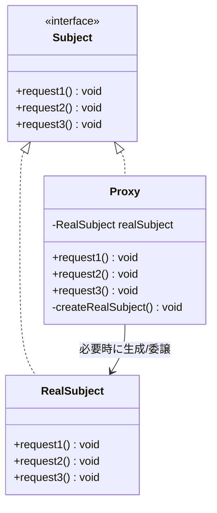
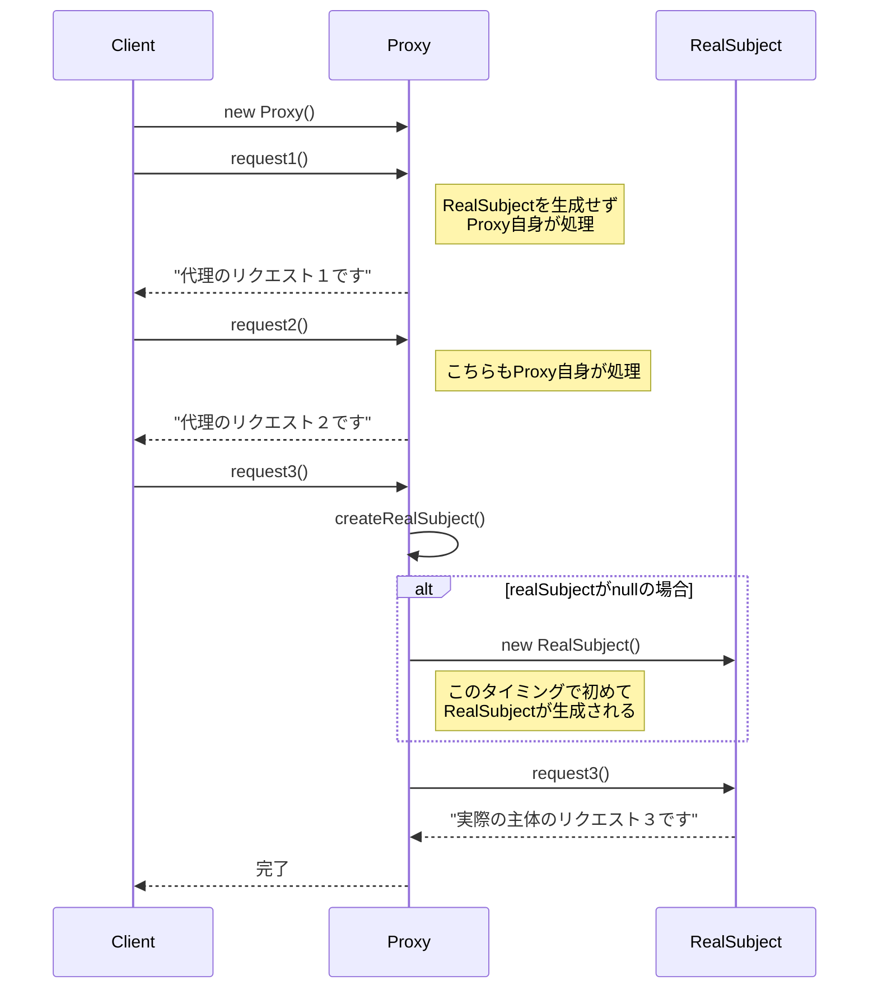

## 概要

Proxy（プロキシ）パターンを一言でいうと、「**本物のオブジェクトの前に『代理人』を立てて、アクセスをコントロールする**」ためのデザインパターンです。「プロキシ」は日本語で「代理」を意味します。

分かりやすい例えは、忙しい社長と、そのスケジュールを管理する秘書の関係です。あなた（クライアント）は社長に会ってハンコをもらいたいのですが、社長（本物のオブジェクト）は実際にハンコを押す権限を持っている一方、とても忙しい人です。そこで、秘書（代理人／プロキシ）が社長への窓口を務めます。

あなたが「社長に会いたい」と言ったとき、秘書は状況に応じてこんな動きをします。

- アクセス制限：「アポイントはありますか？」と確認する
- キャッシュ：「その件なら、以前社長が『OK』と言っていたので私が判を押しておきます」と代行する
- 遅延実行：「今は不在なので、戻ってきたら伝えておきます」と調整する

このように、本物を直接触らせず、代理人が状況に応じて適切に振る舞うのがProxyパターンです。

## クラス構造



## イメージ


### 図の見方

#### 本人と代理人が同一のインターフェースを持つ

画像右上の青いボックスにある通り、本人（RealSubject）と代理人（Proxy）は同じインターフェース（Subject）を実装します。これが非常に重要で、Client（利用側）からすれば、相手が「本人」か「代理人」かを見分ける必要がなく、同じ操作（メソッド呼び出し）で扱えるようになっています。

#### 代理人が自分で処理する場合

画像中央の「メソッド1」「メソッド2」は、Proxy自身がその場で処理してしまっています。「本人を出すまでもない簡単な用件」や「すでに知っている情報（キャッシュ）」であれば、代理人がその場でパッと返事をすることで、システム全体のレスポンスが上がります。

#### 代理人が本人に頼む場合

「メソッド3」の赤い矢印に注目してください。これは代理人だけでは手に負えない、重たい処理や重要な判断です。この時初めて、代理人は本人（RealSubject）をインスタンス化したり、処理をそのまま丸投げしたりします。

### まとめ

この仕組みのポイントは、Clientが本人の存在を意識しなくてよいという点と、代理人が賢く立ち回ることで本人の負担を減らしているという点にあります。プログラミングの世界では、ネットワーク越しにデータを取ってくる場面（リモートプロキシ）や、メモリを節約したい場面でよく使われます。

## メリット

画像データや巨大なファイルの読み込みなど、作成に時間がかかるオブジェクトがある場合、最初は軽い「代理人」だけを作っておき、本当に必要になった瞬間に初めて本物を作る（遅延初期化）ことができます。これは「仮想プロキシ（Virtual Proxy）」と呼ばれます。

本物のオブジェクトを操作させる前に、代理人が「あなたにその権限はありますか？」とチェックを入れることもできます。本物のクラスの中身を汚さずに、アクセス制御ロジックを分離できるこの使い方は「保護プロキシ（Protection Proxy）」と呼ばれます。

実際には別のサーバーにあるオブジェクトでも、手元にある「代理人」を操作している感覚で利用できるようにもできます。通信の複雑なコードを代理人の中に隠蔽できるこの使い方は「遠隔プロキシ（Remote Proxy）」と呼ばれます。

実行ログを録ったり、一度計算した結果をキャッシュ（保存）して使い回したりといった、本筋とは関係ないけれど必要な処理を代理人に任せることもできます。こうした付加機能を持つプロキシは「スマート参照（Smart Reference）プロキシ」と呼ばれます。

## デメリット

代理人を一枚挟むため、直接本物を叩くよりも「中継」の分だけオーバーヘッドが発生します。特にネットワーク経由の場合、この設計がボトルネックになる可能性もあります。

「インターフェース」「本物のクラス」「代理人クラス」とクラスの数が増えるため、単純なアクセスで十分な場所に導入すると、かえって構造が読みづらくなることがあります。

利用者は「本物」を触っているつもりでも、実は「代理人」が裏でキャッシュを返していたり、エラーを握りつぶしていたりすることがあります。デバッグ時に「なぜか最新のデータが反映されない」と混乱する原因になりやすいのも、覚えておきたい注意点です。

## サンプルソース

```java:Subject.java
public interface Subject {
    void request1();
    void request2();
    void request3();
}
```

```java:RealSubject.java
public class RealSubject implements Subject {
    @Override
    public void request1() {
        System.out.println("実際の主体のリクエスト１です");
    }
    @Override
    public void request2() {
        System.out.println("実際の主体のリクエスト２です");
    }
    @Override
    public void request3() {
        System.out.println("実際の主体のリクエスト３です");
    }
}
```

```java:Proxy.java
public class Proxy implements Subject {
    private RealSubject realSubject;

    @Override
    public void request1() {
        // 簡単な用件なので、代理人がその場で処理してしまう
        System.out.println("代理のリクエスト１です");
    }
    @Override
    public void request2() {
        System.out.println("代理のリクエスト２です");
    }
    @Override
    public void request3() {
        // Proxyが判断し、必要な場合のみRealSubjectを使用する
        createRealSubject();
        realSubject.request3();
    }

    private void createRealSubject() {
        // RealSubjectのインスタンスが存在しない場合のみインスタンス化する
        if (realSubject == null) {
            realSubject = new RealSubject();
        }
    }
}
```

```java:Client.java
public class Client {
    public static void main(String... args) {
        Subject subject = new Proxy();
        subject.request1();
        subject.request2();
        subject.request3();
    }
}
```

### 実行結果

```
代理のリクエスト１です
代理のリクエスト２です
実際の主体のリクエスト３です
```

### シーケンス図


`request1()`と`request2()`は代理人の中だけで完結し、`RealSubject`には一切触れていません。一方`request3()`が呼ばれた瞬間に初めて`RealSubject`が生成され、処理が委譲されます。これは「重い処理を、本当に必要になるまで遅らせる」という、仮想プロキシの考え方をそのままコードにしたものです。

## 補足：`createRealSubject()`のスレッドセーフ性について

`createRealSubject()`の中身をよく見ると、`if (realSubject == null) { realSubject = new RealSubject(); }`という、以前Singletonパターンの記事で紹介した「遅延初期化」とまったく同じ構造をしています。単一スレッドで動く分には問題ありませんが、複数のスレッドがほぼ同時に`request3()`を呼び出すと、両方のスレッドが同時に`realSubject == null`と判定してしまい、`RealSubject`が2つ作られてしまう可能性があります。

マルチスレッド環境でこのProxyを使う場合は、Singleton記事で紹介したダブルチェックロッキング（`volatile`修飾子と`synchronized`ブロックの組み合わせ）と同じ対策が必要になります。「代理人が本人をいつ・どうやって作るか」という問題は、Proxyパターンに限らず、遅延初期化を行うあらゆる場面に共通する注意点だと考えておくとよいでしょう。

## 補足：Javaに標準搭載されている「動的プロキシ」

実は、今回自作した`Proxy`クラスは、`java.lang.reflect`パッケージにある**動的プロキシ（Dynamic Proxy）**という仕組みを使うと、クラスを手書きしなくても実行時に自動生成できます。名前がそのまま`java.lang.reflect.Proxy`なのは偶然ではなく、まさにこのProxyパターンをJavaの言語機能として実装したものだからです。

```java:DynamicProxyClient.java
import java.lang.reflect.Proxy;

public class DynamicProxyClient {
    public static void main(String[] args) {
        Subject realSubject = new RealSubject();

        Subject proxy = (Subject) Proxy.newProxyInstance(
            Subject.class.getClassLoader(),
            new Class<?>[] { Subject.class },
            (proxyObj, method, methodArgs) -> {
                // 本物のメソッドを呼ぶ前後に、共通処理を挟める
                System.out.println("[ログ] " + method.getName() + "を呼び出します");
                return method.invoke(realSubject, methodArgs);
            }
        );

        proxy.request1();
        proxy.request2();
        proxy.request3();
    }
}
```

`Proxy.newProxyInstance()`に「インターフェース」と「呼び出しをどう処理するかを書いた処理（`InvocationHandler`）」を渡すだけで、そのインターフェースを実装したプロキシオブジェクトをJavaが実行時に自動的に組み立ててくれます。`InvocationHandler`は抽象メソッドを1つだけ持つ関数型インターフェースなので、上のコードのようにラムダ式で渡すこともできます。

自分で`Proxy`クラスを書く手間が省けるうえ、「どんなインターフェースに対しても同じログ出力処理を挟みたい」というような、汎用的な付加機能（ログ出力、トランザクション管理など）を実現するのに向いています。実際、SpringフレームワークのAOP（アスペクト指向プログラミング）機能なども、内部的にはこの仕組みを利用してプロキシオブジェクトを生成しています。ただし、動的プロキシは対象がインターフェースである必要があり、また今回のように「一部のメソッドだけ自前で処理し、残りだけ本物に委譲する」といった細かい作り込みをしたい場合は、これまで通り手書きのProxyクラスのほうが素直に書けることもあります。状況に応じて使い分けるとよいでしょう。

※実際に手元で試すときに1点だけ注意が必要です。ラムダ式`(proxyObj, method, methodArgs) -> ...`の第1引数`proxyObj`は、生成されたプロキシオブジェクト自身を指しています。うっかりこの`proxyObj`に対して`method.invoke(proxyObj, methodArgs)`のように実行してしまったり、`proxyObj.toString()`のようにメソッドを呼んでしまったりすると、プロキシの呼び出し処理がプロキシ自身を再び呼び出すことになり、無限に再帰して`StackOverflowError`が発生します。上のサンプルコードのように、必ず外部から保持している本物のインスタンス（`realSubject`）に対して`method.invoke(realSubject, methodArgs)`を実行するようにしてください。`proxyObj`を使うのは、「戻り値として自分自身（`this`）を返すメソッド」を実装するときなど、ごく限られた場面だけだと覚えておくとよいでしょう。

## 補足：クラス名の衝突にも注意

余談ですが、今回自作した`Proxy`という名前は、先ほど紹介した`java.lang.reflect.Proxy`とまったく同じです。以前Iteratorパターンの記事でも触れたように、自作クラスに標準ライブラリと同じ名前を付けると、同じファイルの中で両方を使いたくなったときに名前が衝突してしまいます。学習用に自作する分には問題ありませんが、実務でこの名前を使う場合は`MyProxy`や、対象を表す具体的な名前（`UserServiceProxy`など）にしておくと安全です。