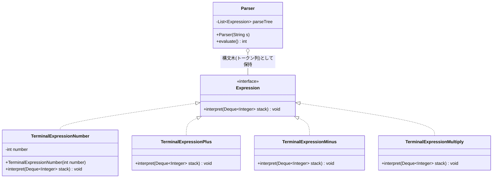
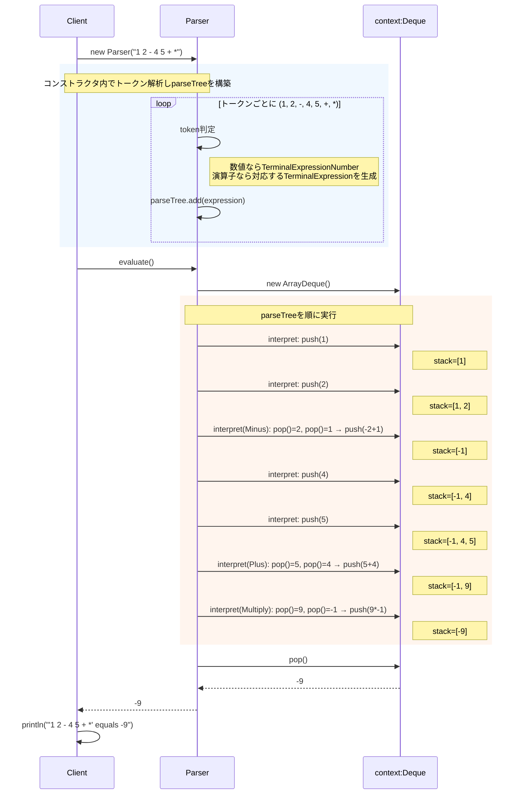

## 概要

Interpreter（インタープリタ）パターンは、「**独自の言語（ミニ言語）を作って、それを解釈・実行する**」ためのデザインパターンです。特定の形式で書かれた文（数式や検索条件など）を解析し、プログラムが理解できる形に翻訳して実行します。

分かりやすい例えは、楽譜（スコア）です。楽譜（命令）には「ド・レ・ミ」という記号が並んでいます。演奏家（インタープリタ）は、その記号を読み取り、「ドの音を鳴らす」「レの音を鳴らす」という実際の動作に変換します。

プログラムの世界では、「`1 + 2 - 3`」という文字列や、「`AかつB、またはC`」という検索条件などを、コンピュータが計算できる形に読み解く役割を担います。

## クラス構造



## イメージ


画像の上部にある「スタック」を使った計算の流れが、そのままインタープリタの動きになります。

### 図の見方

#### 文法：Expressionインターフェース

画像右下のピンクの枠です。「数字」「プラス」「マイナス」といったすべての要素に共通する`interpret(Stack)`という窓口を作ります。これにより、数字だろうが記号だろうが、同じように「解釈して」と命令できるようになります。

#### 各要素の仕事：具体的なクラス

数字クラスは「自分（数字）をスタックに積む（push）」という仕事を持ちます。プラス・マイナスクラスは「スタックから2つ取り出して（pop）、計算して、結果を戻す（push）」という仕事を持ちます。このように、1つの言葉（文字）に対して1つのクラスが責任を持つのがポイントです。

#### 2つのステップ：Parserの役割

画像中央下の青い枠にある通り、2段階で動きます。まず解析（文字列の解析）で、`1 2 - 4 5 + *`という文字列を見て、「これは数字クラス、これはマイナスクラス」と、オブジェクトのリストに変換します。次に実行（Interpret実行）で、そのリストを順番に叩いていくと、画像上部のスタック図のように、最終的な答え $-9$ が導き出されます。

### まとめ

この図のキモは、「式」そのものを、計算手順を知っているオブジェクトの集まりに変えている点にあります。スタックの中身が $$(1-2) \times (4+5)$$ という一般式を解いていく様子は、プログラムに「この計算式を解け」と直接命じるのではなく、「文法に従って自分たちで解決させる」という賢いアプローチを表しています。

## メリット

文法の各ルールがクラスとして独立しているため、新しいルールを追加したいときは新しいクラスを作るだけで済みます。既存のクラスを大幅に書き換える必要がないため、拡張性が高いのが特徴です。

バッカス・ナウア記法（BNF）などで定義された文法規則を、そのままクラス構造に落とし込むこともできます。文法書を読みながらプログラムを組むような感覚で実装できるため、ルールの再現性が高いのも利点です。

「特定の数式を計算する」「複雑な検索クエリを処理する」といった、限定的な範囲（ドメイン）での言語処理には非常に強力なツールとなります。

## デメリット

文法のルールが増えれば増えるほど、クラスの数も膨大になります。一般的なプログラミング言語のような複雑な文法をこのパターンだけで作ろうとすると、管理が不可能なほど巨大なクラス群が出来上がってしまいます。複雑な言語処理には、専用のパーサジェネレータ（ANTLRやyacc/lexなど）を使うのが一般的です。

抽象構文木（AST）を再帰的に巡回して処理を行うため、非常に多くのメソッド呼び出しが発生します。単純なループ処理などに比べると、パフォーマンス面では不利になりやすい点もデメリットです。

文法を解析して「木構造」を組み立てる部分（パーサ）を自前で作る必要があり、そこには高度なプログラミング技術が求められるため、初期の学習・実装コストも高くなりがちです。

## サンプルソース

数式をスタックで計算する、逆ポーランド記法（RPN）の電卓を例にしています。

```java:Expression.java
import java.util.Deque;

public interface Expression {
    void interpret(Deque<Integer> stack);
}
```

```java:TerminalExpressionNumber.java
import java.util.Deque;

public class TerminalExpressionNumber implements Expression {
    private final int number;

    public TerminalExpressionNumber(int number) {
        this.number = number;
    }

    @Override
    public void interpret(Deque<Integer> stack) {
        stack.push(number);
    }
}
```

```java:TerminalExpressionPlus.java
import java.util.Deque;

public class TerminalExpressionPlus implements Expression {
    @Override
    public void interpret(Deque<Integer> stack) {
        stack.push(stack.pop() + stack.pop());
    }
}
```

```java:TerminalExpressionMinus.java
import java.util.Deque;

public class TerminalExpressionMinus implements Expression {
    @Override
    public void interpret(Deque<Integer> stack) {
        stack.push(-stack.pop() + stack.pop());
    }
}
```

```java:TerminalExpressionMultiply.java
import java.util.Deque;

public class TerminalExpressionMultiply implements Expression {
    @Override
    public void interpret(Deque<Integer> stack) {
        stack.push(stack.pop() * stack.pop());
    }
}
```

```java:Parser.java
import java.util.ArrayList;
import java.util.ArrayDeque;
import java.util.Deque;
import java.util.List;

public class Parser {
    private final List<Expression> parseTree = new ArrayList<>();

    public Parser(String s) {
        for (String token : s.split(" ")) {
            if (token.equals("+")) {
                parseTree.add(new TerminalExpressionPlus());
            } else if (token.equals("-")) {
                parseTree.add(new TerminalExpressionMinus());
            } else if (token.equals("*")) {
                parseTree.add(new TerminalExpressionMultiply());
            } else {
                parseTree.add(new TerminalExpressionNumber(Integer.parseInt(token)));
            }
        }
    }

    public int evaluate() {
        Deque<Integer> context = new ArrayDeque<>();
        for (Expression e : parseTree) {
            e.interpret(context);
        }
        return context.pop();
    }
}
```

```java:Client.java
public class Client {
    public static void main(String[] args) {
        String expression = "1 2 - 4 5 + *";
        Parser parser = new Parser(expression);
        System.out.println("'" + expression + "' equals " + parser.evaluate());
    }
}
```

### 実行結果

```
'1 2 - 4 5 + *' equals -9
```

### シーケンス図


「1 2 - 4 5 + *」は逆ポーランド記法で、通常の書き方に直すと`(1 - 2) * (4 + 5)`にあたります。`(1 - 2)`は`-1`、`(4 + 5)`は`9`なので、`-1 * 9 = -9`となり、実行結果と一致します。`TerminalExpressionMinus`の`-stack.pop() + stack.pop()`という一見トリッキーな式は、「後に積まれた値」と「先に積まれた値」の順序を正しく`先に積まれた値 - 後に積まれた値`に組み替えるための実装です。

## 補足：`Stack`ではなく`Deque`（`ArrayDeque`）を使った理由

元々のJavaの入門書などでは、スタックを実装する際に`java.util.Stack`クラスがよく使われます。しかし、`java.util.Stack`は`Vector`を継承しているため、本来スタックには不要な同期化（synchronized）のオーバーヘッドを常に抱えている上、`Vector`由来の「途中への挿入」や「インデックス指定でのアクセス」までできてしまい、「後入れ先出し（LIFO）」だけを守らせたいスタックの抽象化としては緩すぎるという問題があります。Java公式のドキュメントでも、より一貫性のあるLIFOスタック操作の実装として、`Deque`インターフェース（とその実装である`ArrayDeque`）の使用が推奨されています。

幸い、`Deque`は`push(E e)`と`E pop()`という、`Stack`とまったく同じメソッド名でLIFO操作を提供しているため、`new Stack<Integer>()`を`new ArrayDeque<Integer>()`に置き換えるだけで、他のコードをほとんど変更せずに移行できます。今回のサンプルでも、最初から`Deque`ベースで実装しています。

## 補足：フラットなトークン列を使う実装と、再帰的な木構造（AST）を使う実装

今回のサンプルは、文字列を空白で区切った「トークンの列」を`Parser`が作り、それを順番に処理していく、比較的シンプルな実装になっています。これは、逆ポーランド記法という「計算の順序があらかじめ確定している」記法だからこそ選べる、実用的なアプローチです。

一方、GoFの原典で紹介されているInterpreterパターンでは、`Expression`同士が互いを部品として持ち合う、再帰的な木構造（抽象構文木、AST）として表現されることが多く、以前紹介したCompositeパターンとよく似た構造をとります。たとえば「足し算」を表す`Expression`が、左右にそれぞれ別の`Expression`（数値かもしれないし、また別の足し算や掛け算かもしれない）を持ち、`interpret()`が再帰的に呼び出されることで、`(1 + 2) * (3 - 4)`のような、計算順序が明示された式をそのまま木構造として表現できます。

今回のような「共有のスタックに演算結果を積み上げていく」実装は理解しやすく実用性も高い一方、「文法の構造そのものをオブジェクトの入れ子（木構造）として表現する」という、Interpreterパターン本来の考え方をより直接的に体験したい場合は、Compositeパターンと組み合わせた再帰的な実装も調べてみると、理解がさらに深まるはずです。