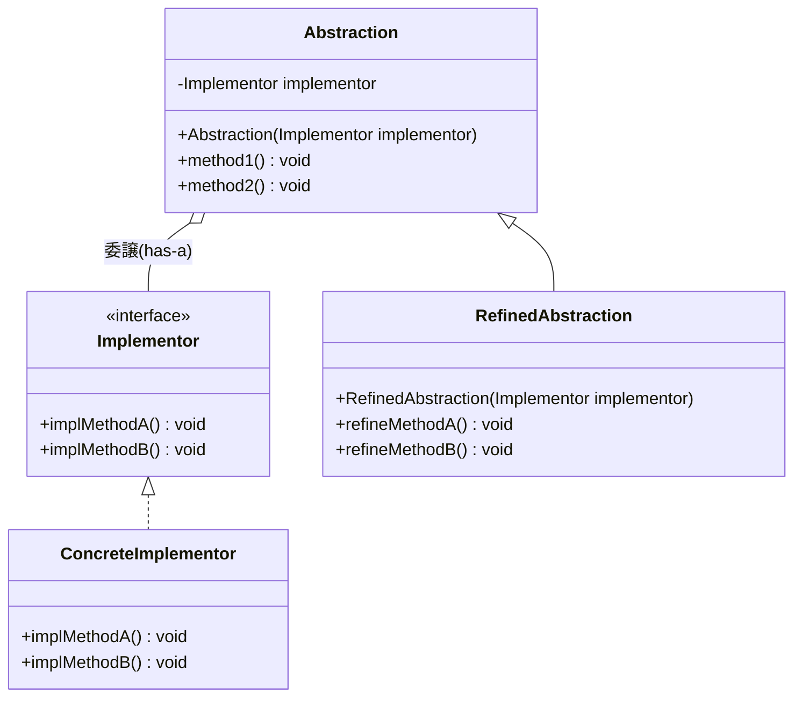
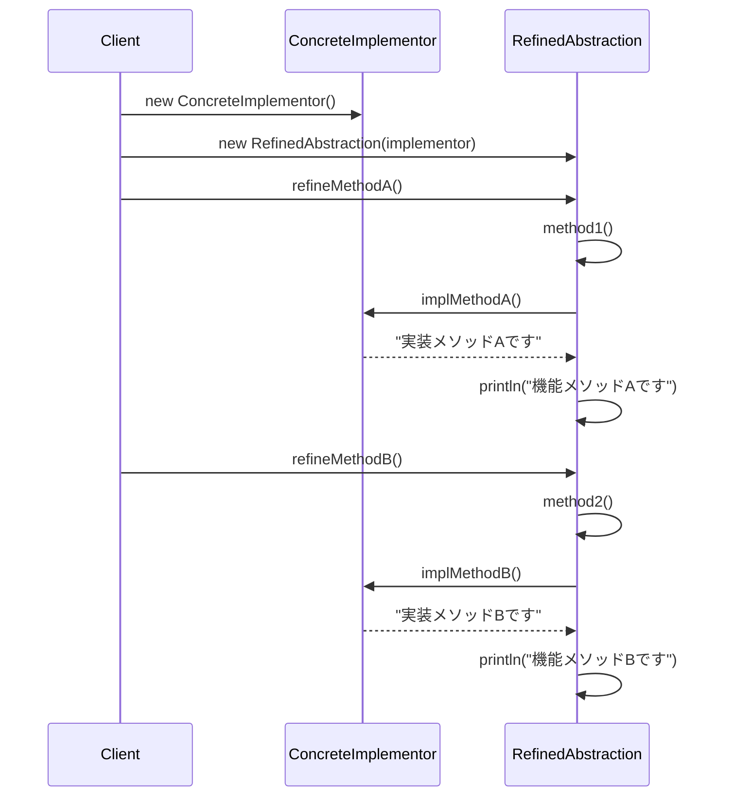

## 概要

Bridge（ブリッジ）パターンは、「**機能の追加」と「実装の追加」を切り離して、それぞれを独立して拡張できるようにする**」ためのデザインパターンです。「クラスの継承が爆発して収拾がつかない」という事態を救うための、文字通りの架け橋（Bridge）となります。

通常、機能を追加しようとすると「継承」を使いがちですが、そうすると「機能×実装」の組み合わせの数だけクラスが増えてしまいます。Bridgeパターンでは、これらを「抽象（何をするか）」と「実装（どうやるか）」の2つの階層に分離し、それらを橋渡し（委譲）でつなぎます。

分かりやすい例えは、リモコンとテレビです。

- リモコン（機能側）：「電源オン」「音量を上げる」という機能
- テレビ（実装側）：実際に電波を受信して映像を出す仕組み

リモコンとテレビは「端子や赤外線の仕様（Bridge）」でつながっているだけです。「多機能リモコン」に進化しても、テレビ本体の仕組みは変えなくていいのが機能の拡張、「ソニー製」から「パナソニック製」のテレビに買い替えても、同じリモコンの「電源ボタン」を押すという操作（機能）は変わらないのが実装の拡張にあたります。

## クラス構造



## イメージ


### 図の見方

#### 機能のクラス階層

画像左側です。「新しくこんな便利な機能を追加したい」というときに伸ばしていく階層で、「何ができるか」の種類を増やすのがこちらの役割です。基本となる「機能A」に対して、機能を増やした「機能B」というように広がっていきます。

#### 実装のクラス階層

画像右側です。「OSの違いや、使うライブラリの違いに対応したい」というときに伸ばしていく階層です。共通の窓口となるインターフェースに対して、赤・青・黄それぞれの具体的な実装が、「機能」を実際にどう動かすかというプログラムを担当します。

#### 橋渡し：has-a関係

中央の赤い矢印が、Bridgeパターンの名前の由来です。機能の階層が、実装の階層を部品として持っている（has-a）状態にすることで、左側の「機能」が増えても右側の「実装」が増えても、お互いに悪影響を及ぼすことなく、掛け算の組み合わせでバリエーションを増やせるようになります。

### まとめ

この図のキモは、「継承による機能拡張」と「インターフェースによる実装」を混ぜないという強い意志にあります。もしこれらを混ぜてしまうと、「Windows用の機能Bクラス」「Mac用の機能Bクラス」……とクラスの数が無限に増えて管理不能になってしまいます。それを防ぐための「分離と架け橋」こそがBridgeパターンです。

## メリット

「丸、四角」という図形があり、「赤、青」で塗りたい場合、継承だと「赤い丸」「青い丸」「赤い四角」「青い四角」と4つのクラスが必要です。ここに「三角」を追加するとさらに増えていきます。Bridgeなら「図形（機能）」と「色（実装）」を分けるので、足し算の数（2+2）だけクラスを作れば済むようになります。

「実装」の部分を書き換えても、それを利用する「抽象」側のコード（クライアント側）を修正したり再コンパイルしたりする必要がありません。修正の波及を最小限に抑えられます。

継承はコンパイル時に構造が決まってしまいますが、Bridgeは「委譲（持っているものを使う）」なので、プログラムの実行中に「今はWindows用の実装を使う」「次はMac用」といった具合に、中身を動的に差し替えることも可能です。

## デメリット

単純な継承で済むようなケースでも、わざわざインターフェースを定義して橋渡しを作るため、初動のコード量が増えます。「やりすぎ（オーバーエンジニアリング）」になりやすいパターンでもあります。

「機能の階層」と「実装の階層」という2つのピラミッドが並び立つ構造は、初心者にとって「今どっちのクラスをいじっているのか」という混乱を招きやすい点もデメリットです。

## サンプルソース

```java:Implementor.java
public interface Implementor {
    void implMethodA();
    void implMethodB();
}
```

```java:ConcreteImplementor.java
public class ConcreteImplementor implements Implementor {
    @Override
    public void implMethodA() {
        System.out.println("実装メソッドAです");
    }
    @Override
    public void implMethodB() {
        System.out.println("実装メソッドBです");
    }
}
```

```java:Abstraction.java
public class Abstraction {
    private final Implementor implementor;

    public Abstraction(Implementor implementor) {
        this.implementor = implementor;
    }

    public void method1() {
        implementor.implMethodA();
    }
    public void method2() {
        implementor.implMethodB();
    }
}
```

```java:RefinedAbstraction.java
public class RefinedAbstraction extends Abstraction {
    public RefinedAbstraction(Implementor implementor) {
        super(implementor);
    }

    public void refineMethodA() {
        method1();
        System.out.println("機能メソッドAです");
    }
    public void refineMethodB() {
        method2();
        System.out.println("機能メソッドBです");
    }
}
```

```java:Client.java
public class Client {
    public static void main(String... args) {
        RefinedAbstraction abstraction = new RefinedAbstraction(new ConcreteImplementor());
        abstraction.refineMethodA();
        abstraction.refineMethodB();
    }
}
```

### 実行結果

```
実装メソッドAです
機能メソッドAです
実装メソッドBです
機能メソッドBです
```

### シーケンス図


`Abstraction`が`Implementor`という実装の階層を部品として持ち（has-a）、`RefinedAbstraction`はその`Abstraction`をさらに継承して機能を拡張しています。「機能を継承で拡張する階層」と「実装をインターフェースで差し替え可能にする階層」が、独立しながらも`implementor`フィールドを通じて橋渡しされている様子が、このコードにそのまま表れています。

※今回のサンプルでは、`RefinedAbstraction`が`Implementor`を直接触ることはなく、必ず`Abstraction`の`method1()`／`method2()`という公開メソッドを経由して呼び出す形にしています。GoFの原典や他の教科書では、`Abstraction`側の`implementor`フィールドを`protected`にしたり、`protected Implementor getImplementor()`のようなメソッドを用意したりして、サブクラスである`RefinedAbstraction`から`implementor`に直接アクセスできるようにする設計もよく見られます。どちらも正しい実装で、優劣があるというより設計上の好みの違いです。「基底クラスのメソッド経由でカプセル化を保つか」「サブクラスに`implementor`への直接アクセスを許すか」という選択肢があることを、頭の片隅に置いておくとよいでしょう。

## 補足：Adapterパターンとの違い

以前紹介したAdapterパターンも、「インターフェースを介して別のクラスに処理を委譲する」という見た目がBridgeパターンとよく似ており、混同されがちです。両者の違いは、パターンを適用するタイミングと目的にあります。

- **Adapterパターン**：すでに存在している、互換性のない2つのインターフェースを、あとから無理やりつなぎ合わせるために使います。既存の資産（Adaptee）を変更せずに再利用したい、という「事後対応」的な性格が強いパターンです
- **Bridgeパターン**：最初から「機能」と「実装」がそれぞれ独立して変化していくことを見越して、設計段階で意図的に分離しておくパターンです。既存の互換性問題を解決するためというより、将来の拡張に備えるための「事前設計」的な性格が強いパターンです

似た構造を持つ両者ですが、「困ってから当てるのがAdapter」「最初から見越して設計するのがBridge」と覚えておくと区別しやすくなります。

## 補足：Strategyパターンとの違い

構造だけを見ると、Bridgeパターンは以前紹介したStrategyパターンともよく似ています。どちらも「あるクラスが、インターフェースを介して別のオブジェクトに処理を委譲する（has-a）」という形を取るからです。

違いは「何を目的として分離しているか」にあります。Strategyパターンは、1つのクラスが持つ「アルゴリズム（やり方）」を状況に応じて丸ごと差し替えられるようにすることが目的です。一方Bridgeパターンは、「機能を増やしたい階層」と「実装を増やしたい階層」という、本来別々の理由で変化する2つの階層を、あらかじめ分けておくことが目的です。

Strategyが「1つの軸（アルゴリズム）の切り替え」に注目しているのに対し、Bridgeは「2つの軸（機能と実装）がそれぞれ独立して増えていくこと」に注目している、という違いを意識しておくとよいでしょう。

## 補足：JDKにおけるBridgeパターンの実例

JavaのGUIライブラリであるAWT（Abstract Window Toolkit）には、`java.awt.Component`と、OSごとの描画処理を担う`ComponentPeer`という仕組みがあり、これがBridgeパターンの実例としてよく紹介されます。`Component`側（機能の階層）はWindowsでもMacでも同じAPIを提供しつつ、実際の描画は`ComponentPeer`側（実装の階層）がOSごとに用意した実装に委譲する、という構造になっており、今回のサンプルコードにおける「機能」と「実装」の関係とよく似た役割分担がなされています。