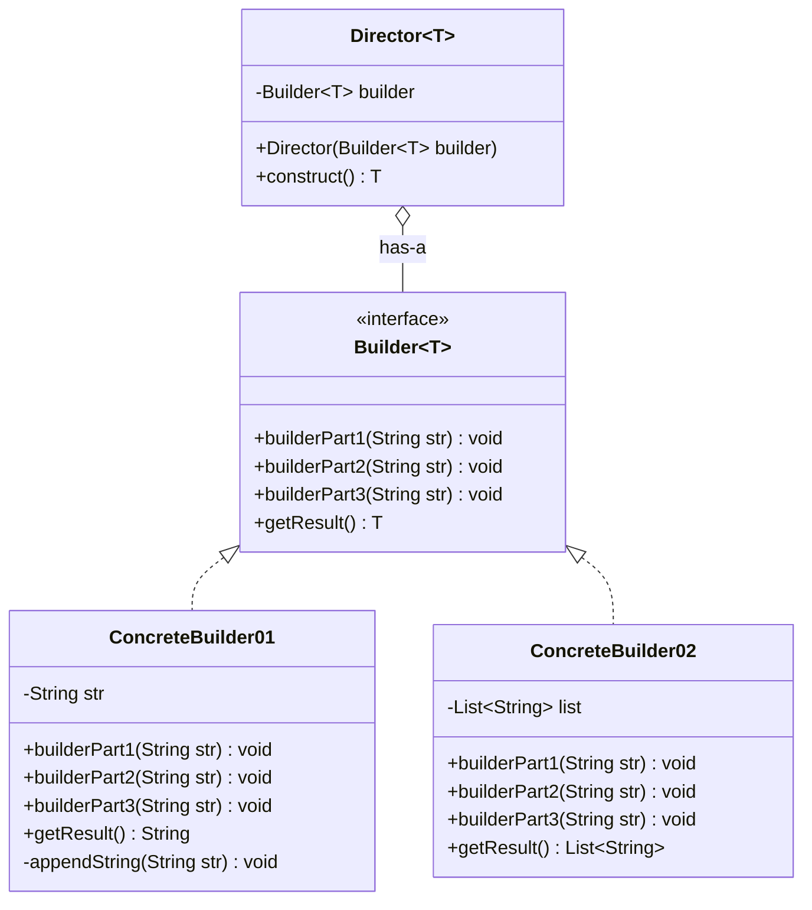
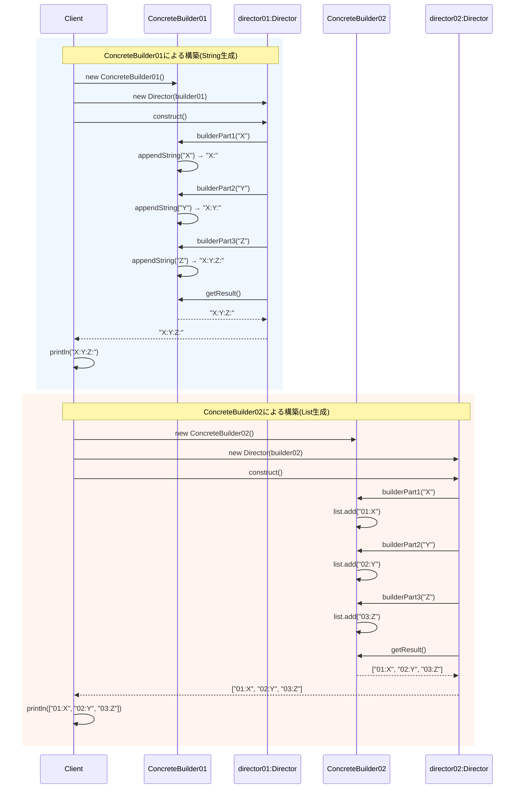

## 概要

Builder（ビルダー）パターンは、「**複雑なモノの組み立て工程を、専門の職人（Builder）に任せる**」ためのデザインパターンです。特に、設定項目（引数）が多すぎて「どの数字が何を意味しているのか分からない」という混乱を防ぎたいときに重宝されます。

オブジェクトを作るとき、普通は`new`を使ってコンストラクタを呼びますが、引数が10個もあると順番を間違えたり、意味を読み違えたりします。Builderパターンでは、「1つずつ部品をセットしていき、最後に『完成』と指示を出す」というステップを踏みます。

## クラス構造



## イメージ


### 図の見方

#### Director：組み立て手順の指揮者

画像左側の緑の枠です。ここが一番のポイントです。Directorは、オブジェクトを組み立てる「手順」にだけ責任を持ちます。`construct()`メソッドの中には「Aを呼び出し、次にBを呼び出し……」という作成手順が書かれていますが、Directorは「Aの中身が具体的に何（木材なのか石材なのか）」かは知りません。ただ「Aをしろ」と命令するだけです。

#### Builder：現場の作成者

画像右側の緑の枠です。Builderインターフェースは、指揮者からの命令（A、B、C）を受け取るための窓口です。実際に手を動かすのは「作成者A」「作成者B」といった具体クラスで、作成者Aは「青いパーツ」を使い、作成者Bは「黄色いパーツ」を使うといった具合に、具体的な中身を決めます。

#### getResult()：完成品の受け取り

画像右下のピンクのボックスです。すべての工程（A→B→C）が終わったあと、最後に完成品（Object）を渡す専用の出口です。

### まとめ

この図が最も強調しているのは、「作業の組み立て（手順）は指揮者が責任を持つ」という点です。家を建てるとき、大工さん（Builder）が勝手に手順を決めるのではなく、建築家（Director）が書いた設計図（`construct()`）の通りに作業を進める。この「設計と実行の分離」がBuilderパターンの真髄です。

## メリット

同じ組み立て手順（壁を作る→屋根を乗せる）のまま、「豪華な家を建てる職人」と「安い家を建てる職人」を切り替えるだけで、まったく異なる完成品を作れるのは大きな強みです。後述のサンプルコードでも、同じ`Director`の手順に対して`ConcreteBuilder`を差し替えるだけで、出力される完成品の形式がまったく変わることを確認できます。

全ての部品が揃うまで「完成（build）」させない仕組みにできるため、作りかけの壊れたオブジェクトがシステム内に紛れ込むのを防げます。また、完成した後は中身を変えられない「不変（Immutable）」なオブジェクトも作りやすくなります。

もう1つ、実務でよく語られるBuilderパターンのメリットに、「コードの可読性が上がる」というものがあります。`.name("田中").age(20).build()`のようにメソッドをつなげて書ける、いわゆる**メソッドチェーン**のスタイルを使うと、`new User("田中", 20, "男", true, false...)`のように意味の分からない引数の羅列を並べるより、どの値が何の項目にセットされているかが一目で分かります。ただし、これは後述するサンプルコードとは少し違う実装スタイルなので、補足として別途紹介します。

## デメリット

本来作りたいクラスの他に、「Builder専用のクラス」やその中のメソッドを大量に書く必要があります。単純なクラスに対して使うと、かえってコードが複雑になり、管理が面倒になります。

直接`new`する場合に比べて、Builderオブジェクトを経由する分だけ、ごくわずかにメモリや速度の面でコストがかかります。現代のコンピュータではほとんど無視できるレベルですが、極限のパフォーマンスを求める場合は注意が必要です。

元のクラスに新しい項目を追加すると、Builderクラス側にも同じ項目を追加し、セットするメソッドを書かなければなりません。二度手間になりやすいのが難点です。

## サンプルソース

```java:Director.java
public class Director<T> {
    private final Builder<T> builder;

    public Director(Builder<T> builder) {
        this.builder = builder;
    }

    public T construct() {
        builder.builderPart1("X");
        builder.builderPart2("Y");
        builder.builderPart3("Z");
        return builder.getResult();
    }
}
```

```java:Builder.java
public interface Builder<T> {
    void builderPart1(String str);
    void builderPart2(String str);
    void builderPart3(String str);
    T getResult();
}
```

```java:ConcreteBuilder01.java
public class ConcreteBuilder01 implements Builder<String> {
    private String str;

    @Override
    public void builderPart1(String str) {
        appendString(str);
    }
    @Override
    public void builderPart2(String str) {
        appendString(str);
    }
    @Override
    public void builderPart3(String str) {
        appendString(str);
    }
    @Override
    public String getResult() {
        return this.str;
    }

    private void appendString(String str) {
        if (this.str == null) {
            this.str = str + ":";
        } else {
            this.str += str + ":";
        }
    }
}
```

```java:ConcreteBuilder02.java
import java.util.ArrayList;
import java.util.List;

public class ConcreteBuilder02 implements Builder<List<String>> {
    private final List<String> list = new ArrayList<>();

    @Override
    public void builderPart1(String str) {
        list.add("01:" + str);
    }
    @Override
    public void builderPart2(String str) {
        list.add("02:" + str);
    }
    @Override
    public void builderPart3(String str) {
        list.add("03:" + str);
    }
    @Override
    public List<String> getResult() {
        return list;
    }
}
```

```java:Client.java
public class Client {
    public static void main(String... args) throws Exception {
        Director director01 = new Director(new ConcreteBuilder01());
        System.out.println(director01.construct());

        Director director02 = new Director(new ConcreteBuilder02());
        System.out.println(director02.construct());
    }
}
```

### 実行結果

```
X:Y:Z:
[01:X, 02:Y, 03:Z]
```

### シーケンス図


`Builder<T>`・`Director<T>`のようにジェネリクスを導入したことで、`director01.construct()`は`String`型を、`director02.construct()`は`List<String>`型を、それぞれキャストなしでそのまま受け取れるようになっています。学習用に`Object`で受け取る書き方も分かりやすくはあるのですが、実務で完成品の型を型安全に扱いたい場合は、こうしたジェネリクスを使ったBuilderにしておくのが一般的です。

同じ`Director`の`construct()`（AをセットしてBをセットしてCをセットする、という手順）を使い回しているにもかかわらず、渡す`Builder`の実装を`ConcreteBuilder01`から`ConcreteBuilder02`に変えるだけで、完成品の形式が文字列からリストにガラッと変わっています。これが、Builderパターンが持つ「同じ手順から違うバリエーションの完成品を作れる」という力を、そのまま体現した部分です。

## 補足：メソッドチェーンで書ける「Fluent Builder」

先ほどメリットで触れた「メソッドチェーンで読みやすくなる」という話は、実は上のサンプルコードとは異なるスタイルのBuilder実装を指しています。上のサンプルは、GoFの原典に忠実な「Directorが手順を決め、同じ手順から複数の異なる完成品を作り分ける」というスタイルです。一方、実務でよく見かける「Fluent Builder（流れるようなBuilder）」は、Directorを置かず、Builder自身のメソッドが`this`を返すことでメソッドチェーンを可能にする、少し異なる作りになっています。

```java:User.java（Fluent Builderの例）
public class User {
    private final String name;
    private final int age;
    private final boolean isMember;

    private User(Builder builder) {
        this.name = builder.name;
        this.age = builder.age;
        this.isMember = builder.isMember;
    }

    public static class Builder {
        private String name;
        private int age;
        private boolean isMember;

        public Builder name(String name) {
            this.name = name;
            return this; // 自分自身を返すことで、メソッドチェーンをつなげられる
        }

        public Builder age(int age) {
            this.age = age;
            return this;
        }

        public Builder isMember(boolean isMember) {
            this.isMember = isMember;
            return this;
        }

        public User build() {
            return new User(this);
        }
    }
}
```

```java
// メソッドチェーンでオブジェクトを組み立てられる
User user = new User.Builder()
        .name("田中")
        .age(20)
        .isMember(true)
        .build();
```

この形は、Joshua Bloch氏の著書『Effective Java』で紹介されたことで広く知られるようになりました。Java向けの補助ライブラリであるLombokの`@Builder`アノテーションも、内部的にはこれと同じ発想の`Builder`クラスを自動生成してくれます。「複数の異なる完成品を作り分けたい」場合はDirectorを使う原典スタイル、「1つのクラスを、読みやすい書き方で組み立てたい」場合はFluent Builderスタイル、というように、目的に応じて使い分けるとよいでしょう。