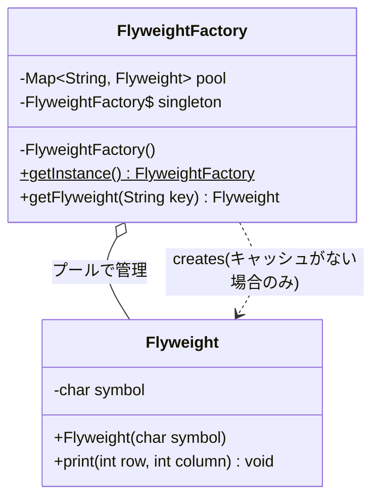
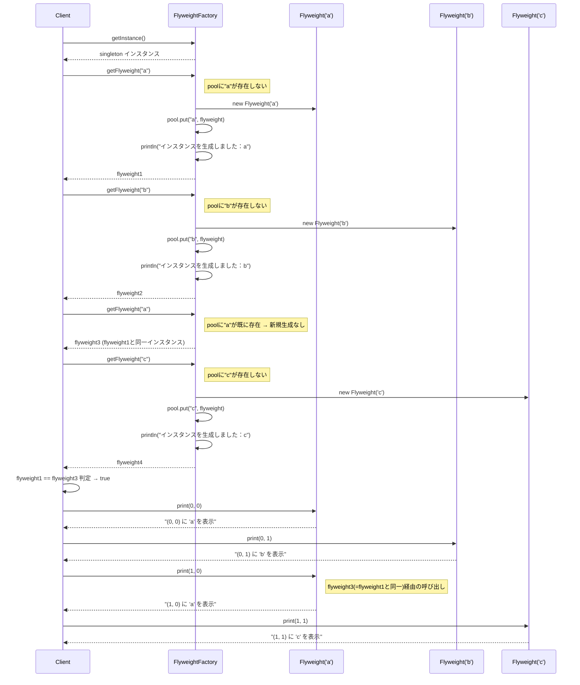

## 概要

Flyweight（フライウェイト）パターンは、「**大量の細かいオブジェクトを、みんなで共有してメモリを節約する**」ためのデザインパターンです。「フライウェイト」はボクシングの軽量級を意味し、その名の通りプログラムを「軽く」するための工夫です。

同じ内容のオブジェクトを何千、何万個も作るとメモリが足りなくなります。そこで、「共通の部分（内部状態）」を使い回し、「個別の事情（外部状態）」だけを後から外から与えることで、インスタンスの総数を劇的に減らします。

## クラス構造



## イメージ


### 図の見方

#### FlyweightFactory：工場の管理人

画像左側の大きなボックスです。ここは、以前解説したSingletonパターンで作られています。管理人は、Client（利用側）から「数字の『2』が欲しい」と言われたとき、次のように動きます。

- プールにない場合：「2」を新しく作って（`new`）、オブジェクトプール（保管庫）に保存してから渡す
- プールにある場合：新しく作らず、保管庫にあるものの参照（居場所）だけを教える

#### Flyweightのオブジェクトプール：保管庫

画像右側の緑の楕円部分です。ここには「2」「3」「5」「6」といった、作成済みのオブジェクトが大切に保管されています。

#### immutable（不変）であること

ここがこのパターンで最も重要なルールです。もし、共有しているスタンプ（数字の「3」）を誰かが勝手に書き換えて「8」にしてしまったら、他の「3」を使っている人全員に影響が出てしまいます。そのため、Flyweightオブジェクトは一度作ったら中身を絶対に変えられない（immutable）ように作る必要があります。

### まとめ

この仕組みのキモは、「無駄な`new`をさせない」という管理体制にあります。文字フォントの表示、ゲームの大量の木々や弾丸など、「見た目は同じだけどたくさん登場するもの」を扱うときに、このFlyweightパターンは大きな効果を発揮します。

## メリット

まったく同じデータを持つオブジェクトを重複して作らなくて済むため、メモリ消費を最小限に抑えられます。特に、数万個のキャラクターを出すゲームや、膨大な文字を扱うテキストエディタなどで真価を発揮します。

オブジェクトの生成数が減るため、メモリを確保する時間が短縮され、Javaなどの言語では「ガベージコレクション（GC）」の発生頻度を下げることにもつながります。

## デメリット

オブジェクトの情報を「全インスタンス共通のデータ（内部状態）」と「その時々で変わるデータ（外部状態）」に分ける設計が必要です。この切り分けが難しく、コードが複雑になりがちです。

共有オブジェクトを使う際、外部状態（座標や色など）をその都度計算したり引数で渡したりする必要があるため、メモリは節約できても、CPUの処理時間はわずかに増えることがあります。

1つのオブジェクトをみんなで共有しているため、ある場所で「中身を書き換えよう」とすると、それを使っている全箇所に影響が出てしまいます。基本的に共有部分は「不変（Immutable）」に保つ必要があります。

## サンプルソース

文字フォントの表示（テキストエディタで同じ文字を大量に表示する場面）を例に、「内部状態（文字そのもの）」と「外部状態（表示位置）」を分けた実装にしています。

```java:Flyweight.java
public class Flyweight {
    // 内部状態：どのインスタンスも共通で、一度作ったら変更しない（immutable）
    private final char symbol;

    public Flyweight(char symbol) {
        this.symbol = symbol;
    }

    // 外部状態（表示位置）は、呼び出しのたびに外から渡してもらう
    public void print(int row, int column) {
        System.out.println("(" + row + ", " + column + ") に '" + symbol + "' を表示");
    }
}
```

```java:FlyweightFactory.java
import java.util.HashMap;
import java.util.Map;

public class FlyweightFactory {
    private final Map<String, Flyweight> pool = new HashMap<>();

    private static final FlyweightFactory singleton = new FlyweightFactory();

    private FlyweightFactory() {
    }

    public static FlyweightFactory getInstance() {
        return singleton;
    }

    public synchronized Flyweight getFlyweight(String key) {
        Flyweight flyweight = pool.get(key);
        if (flyweight == null) {
            flyweight = new Flyweight(key.charAt(0));
            pool.put(key, flyweight);
            System.out.println("インスタンスを生成しました：" + key);
        }
        return flyweight;
    }
}
```

```java:Client.java
public class Client {
    public static void main(String... args) {
        FlyweightFactory flyweightFactory = FlyweightFactory.getInstance();

        Flyweight flyweight1 = flyweightFactory.getFlyweight("a");
        Flyweight flyweight2 = flyweightFactory.getFlyweight("b");
        Flyweight flyweight3 = flyweightFactory.getFlyweight("a");
        Flyweight flyweight4 = flyweightFactory.getFlyweight("c");

        // flyweight1とflyweight3は、どちらもキー"a"から取得した同じインスタンス
        System.out.println("flyweight1とflyweight3は同じインスタンスか：" + (flyweight1 == flyweight3));

        // 同じ内部状態（文字）を持つFlyweightを、異なる外部状態（位置）に使い回す
        flyweight1.print(0, 0);
        flyweight2.print(0, 1);
        flyweight3.print(1, 0); // flyweight1と同じインスタンスだが、別の位置に表示できる
        flyweight4.print(1, 1);
    }
}
```

### 実行結果

```
インスタンスを生成しました：a
インスタンスを生成しました：b
インスタンスを生成しました：c
flyweight1とflyweight3は同じインスタンスか：true
(0, 0) に 'a' を表示
(0, 1) に 'b' を表示
(1, 0) に 'a' を表示
(1, 1) に 'c' を表示
```

### シーケンス図



`getFlyweight("a")`は最初の1回しか新規生成されておらず（`インスタンスを生成しました：a`が1回しか表示されていません）、2回目に`"a"`を要求した`flyweight3`は、1回目に作った`flyweight1`とまったく同じインスタンスが返ってきています（`flyweight1 == flyweight3`が`true`）。それにもかかわらず、`flyweight1.print(0, 0)`と`flyweight3.print(1, 0)`では異なる位置に表示できています。これは、「文字そのもの（内部状態）」はFlyweightの中に固定で持たせつつ、「表示位置（外部状態）」は呼び出し側が`print()`の引数としてその都度渡しているからです。この「内部状態は共有、外部状態は都度渡す」という役割分担こそが、Flyweightパターンの本体です。

## 補足：SingletonとFlyweightの組み合わせ

`FlyweightFactory`は、以前紹介したSingletonパターンの「クラス読み込み時にインスタンスを1つだけ作っておく（eager initialization）」というスタイルで実装されています。`getInstance()`自体には`synchronized`が付いていませんが、これはSingleton記事で説明した通り、eager initializationであればJVMのクラス初期化の仕組みによって、追加の同期処理なしにスレッドセーフになるためです。

一方、`getFlyweight()`には`synchronized`が付いています。こちらは、`pool`フィールドが持つ`HashMap`自体がスレッドセーフではないため、複数のスレッドが同時に読み書きすると壊れてしまう可能性があるからです。「Singletonのインスタンス生成自体は同期が不要」「プールへの読み書きは同期が必要」という、2つの異なる理由から生じる同期の要不要が、1つのクラスの中に混在している点は、地味ながら理解しておく価値のあるポイントです。

## 補足：`ConcurrentHashMap`を使ったモダンな実装

`getFlyweight()`メソッド全体に`synchronized`を付ける方法は分かりやすい一方、呼び出しが集中すると「他のキーを取得したいだけのスレッド」まで待たされてしまうという弱点があります。Java 8以降では、`HashMap`の代わりに`ConcurrentHashMap`を使い、`computeIfAbsent()`メソッドで「取得、なければ生成」という一連の操作をアトミック（不可分）に行うことで、より細かい粒度のロックで済む実装にできます。

```java:FlyweightFactory.java（ConcurrentHashMap版）
import java.util.Map;
import java.util.concurrent.ConcurrentHashMap;

public class FlyweightFactory {
    private final Map<String, Flyweight> pool = new ConcurrentHashMap<>();

    private static final FlyweightFactory singleton = new FlyweightFactory();

    private FlyweightFactory() {
    }

    public static FlyweightFactory getInstance() {
        return singleton;
    }

    // synchronizedを付けず、ConcurrentHashMapのcomputeIfAbsentでアトミックに取得・生成する
    public Flyweight getFlyweight(String key) {
        return pool.computeIfAbsent(key, k -> {
            System.out.println("インスタンスを生成しました：" + k);
            return new Flyweight(k.charAt(0));
        });
    }
}
```

`computeIfAbsent()`は、「キーに対応する値がまだなければ、渡した関数で値を作ってマップに登録し、その値を返す」という処理を1つのメソッド呼び出しの中でアトミックに行ってくれます。メソッド全体を`synchronized`で囲むよりもロックの範囲が狭くなるため、アクセスが集中する場面ではこちらのほうが高速に動作します。学習の第一歩としては`synchronized`版のほうが処理の流れを追いやすいですが、実務でパフォーマンスを意識する場面ではこうしたモダンな書き方も選択肢に入れておくとよいでしょう。

## 補足：Java標準ライブラリに潜むFlyweightパターン

実は、普段何気なく使っているJavaの機能の中にも、Flyweightパターンと同じ考え方が使われています。

1つ目は`Integer.valueOf(int)`が行っている「Integerキャッシュ」です。Javaは`-128`から`127`までの範囲の整数について、あらかじめ`Integer`オブジェクトをキャッシュして使い回しています。そのため、次のコードは`true`になります。

```java
System.out.println(Integer.valueOf(100) == Integer.valueOf(100)); // true（キャッシュ範囲内）
System.out.println(Integer.valueOf(200) == Integer.valueOf(200)); // false（キャッシュ範囲外）
```

`100`はキャッシュの範囲内なので、`Integer.valueOf(100)`を2回呼んでも同じインスタンスが返ってきます。一方`200`は範囲外なので、呼び出すたびに新しいインスタンスが作られます。これは、頻繁に使われる小さな整数値を「内部状態」としてあらかじめ用意しておき、使い回しているという意味で、Flyweightパターンそのものです。

2つ目は、文字列リテラル（`"hello"`のように直接書かれた文字列）が管理される「文字列プール（String Pool）」です。同じ内容の文字列リテラルは、ヒープ上の専用領域で共有され、使い回されます。`new String("hello")`のように明示的に`new`した場合は別のインスタンスになりますが、リテラル同士であれば同じインスタンスを指します。

こうした標準ライブラリの仕組みを知っておくと、「Flyweightパターンは特別なゲームやテキストエディタだけの話ではなく、普段使っている言語機能の中にも息づいている」ということが実感しやすくなります。