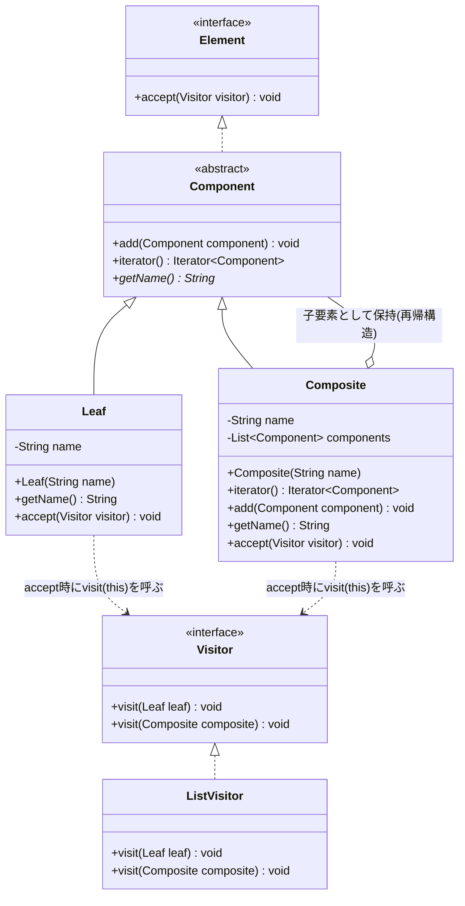
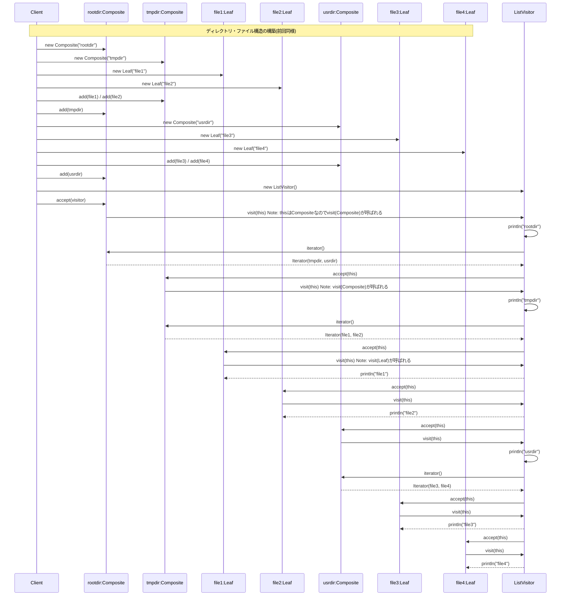

## 概要

Visitor（ビジター）パターンは、「**データ構造」と「処理」を切り離す**」ためのデザインパターンです。「モノ（データ）」の中に「やりたいこと（処理）」を書き込むのではなく、外部から「訪問者（Visitor）」がやってきて処理を代行するイメージです。

Visitorパターンを理解するには、「健康診断」を想像するのが分かりやすいです。

- データ構造（Element）：教室で待っている「生徒」たち
- 処理（Visitor）：学校にやってくる「お医者さん」

生徒（データ）は自分の体（構造）を持っていますが、自分で診察（処理）はしません。まず内科医（Visitor A）が教室を回り、全員を診察します。次に歯科医（Visitor B）がやってきて、同じ生徒たちを診察します。ここで重要なのは、新しい検査（眼科検診など）が増えても、生徒（データ構造）は自分自身を改造する必要がないという点です。ただ、新しいお医者さんを受け入れるだけで済みます。

## クラス構造



## イメージ


### 図の見方

#### Element：データ構造自体

Compositeパターンの木構造（LeafとComposite）が登場しています。`accept(Visitor)`は「玄関」にあたるメソッドで、訪問者（Visitor）を中に入れるためのものです。「私はLeafです、どうぞ」「私はCompositeです、どうぞ」と、自分が何者であるかを訪問者に伝えるだけで、具体的な計算などは自分では行いません。

#### Visitor：データ構造にさせたい処理

ここが「専門家（点検員）」の集まりです。`visit(Leaf)`／`visit(Composite)`には、対象がLeafだった場合、Compositeだった場合の具体的な処理（名前を取る、サイズを計算するなど）を書きます。データ構造の「外側」に処理を追い出すことで、データ構造を汚さずに新しい機能（Elementの集計、書き出しなど）を追加できます。

#### 連係の流れ

1. Clientが「サイズの計算をしたい」と思い、サイズ取得Visitorを作ります
2. そのVisitorをElementの`accept()`に投げ込みます
3. Element側で`visitor.visit(this)`を実行し、自分自身をVisitorに差し出します
4. Visitorがその中身を見て、計算を行います

### まとめ

この仕組みのキモは、「データ構造（Element）」と「アルゴリズム（Visitor）」の依存関係をひっくり返している点にあります。訪問者が相手を見て「あ、君はLeafだね。じゃあこの処理をするよ」と判断することで、データ構造側に`if-else`文を書かなくて済むようになります（この「訪問者が相手を見て判断する」仕組みの正体は、後述の補足で詳しく説明します）。

## メリット

データ構造側のクラス（Element）を一切修正することなく、新しいVisitorクラスを作るだけで機能を追加できます。「ファイル一覧」というデータ構造に対して、「検索機能」の次に「容量計算機能」を付けたくなったら、新しいVisitorを作るだけで済みます。既存の安定したコードを触らずに機能拡張できる（開放閉鎖の原則）のが最大の強みです。

バラバラのクラスに散らばっていた「似たような処理」を、1つのVisitorクラスにまとめられるのも利点です。「この機能のロジックはここにある」という見通しが良くなり、コードの保守性が上がります。

Visitorは各要素を順番に回る際、自分の中に「計算の途中経過」などを保持できます。たとえば、フォルダ構造を回りながら「ファイルサイズの合計」をカウントするといった処理がスマートに記述できます。

## デメリット

Visitorパターン最大の弱点は、新しい「データ（要素）」の追加に極めて弱いことです。データ側のクラス（Element）の種類が1つ増えると、すべてのVisitorクラスにその新要素用のメソッドを追加しなければなりません。「ファイル」「フォルダ」を扱うシステムに「ショートカット」という要素を追加すると、検索Visitor、容量計算Visitor、削除Visitor……すべてに修正が必要になります。

Visitorが外から処理を行うため、本来は隠しておきたいデータクラスの内部情報を、Visitorがアクセスできるように公開（getterの作成など）せざるを得ない場合があるのも弱点です。カプセル化を壊しやすい、という言い方もできます。

「データがVisitorを受け入れ（accept）、Visitorがデータを処理する（visit）」という、キャッチボールのような二重呼び出し（ダブルディスパッチ）という仕組みを使うため、慣れていないと処理の流れを追うのが難しく感じることもあります。

## サンプルソース

以前紹介したCompositeパターンと同じ`Component`／`Leaf`／`Composite`の構造をベースに、そこへ`accept()`と`Visitor`を組み合わせています。

```java:Element.java
public interface Element {
    void accept(Visitor visitor);
}
```

```java:Component.java
public abstract class Component implements Element {
    // Leafはadd()できないため、デフォルトでは「サポートしていない操作」として例外を投げる
    public void add(Component component) {
        throw new UnsupportedOperationException(getName() + "には子要素を追加できません");
    }

    public Iterator<Component> iterator() {
        throw new UnsupportedOperationException(getName() + "は子要素を持てません");
    }

    public abstract String getName();
}
```

```java:Leaf.java
public class Leaf extends Component {
    private final String name;

    public Leaf(String name) {
        this.name = name;
    }

    @Override
    public String getName() {
        return name;
    }

    @Override
    public void accept(Visitor visitor) {
        visitor.visit(this);
    }
}
```

```java:Composite.java
import java.util.ArrayList;
import java.util.Iterator;
import java.util.List;

public class Composite extends Component {
    private final String name;
    private final List<Component> components = new ArrayList<>();

    public Composite(String name) {
        this.name = name;
    }

    @Override
    public Iterator<Component> iterator() {
        return components.iterator();
    }

    @Override
    public void add(Component component) {
        components.add(component);
    }

    @Override
    public String getName() {
        return name;
    }

    @Override
    public void accept(Visitor visitor) {
        visitor.visit(this);
    }
}
```

```java:Visitor.java
public interface Visitor {
    void visit(Leaf leaf);
    void visit(Composite composite);
}
```

```java:ListVisitor.java
import java.util.Iterator;

public class ListVisitor implements Visitor {
    @Override
    public void visit(Leaf leaf) {
        System.out.println(leaf.getName());
    }

    @Override
    public void visit(Composite composite) {
        System.out.println(composite.getName());
        // 配下のComponent及びLeafを全て表示
        Iterator<Component> iterator = composite.iterator();
        while (iterator.hasNext()) {
            Component comp = iterator.next();
            comp.accept(this);
        }
    }
}
```

```java:Client.java
public class Client {
    public static void main(String... args) {
        // rootディレクトリ作成
        Component rootdir = new Composite("rootdir");
        // tmpディレクトリを作成し、file1, file2を作成
        Component tmpdir = new Composite("tmpdir");
        Leaf file1 = new Leaf("file1");
        Leaf file2 = new Leaf("file2");
        tmpdir.add(file1);
        tmpdir.add(file2);
        // rootディレクトリの直下にtmpディレクトリを置く
        rootdir.add(tmpdir);

        // usrディレクトリを作成し、file3, file4を作成
        Component usrdir = new Composite("usrdir");
        Leaf file3 = new Leaf("file3");
        Leaf file4 = new Leaf("file4");
        usrdir.add(file3);
        usrdir.add(file4);
        // rootディレクトリの直下にusrディレクトリを置く
        rootdir.add(usrdir);

        // ListVisitorを渡してファイル・ディレクトリの一覧を表示
        rootdir.accept(new ListVisitor());
    }
}
```

### 実行結果

```
rootdir
tmpdir
file1
file2
usrdir
file3
file4
```
### シーケンス図


## 補足：なぜ「ダブルディスパッチ」という遠回りが必要なのか

「`Leaf`か`Composite`かによって処理を分けたいだけなら、`Visitor`に`visit(Element element)`というメソッドを1つだけ用意して、その中で判定すればいいのでは？」と思うかもしれません。しかし、これがうまくいかないのがJavaのオーバーロード解決の仕組みです。

試しに、次のような「素朴だが動かない」実装を考えてみます。

```java
// うまく動かない例
public interface Visitor {
    void visit(Leaf leaf);
    void visit(Composite composite);
}

// Elementのリストをループしながら、直接visitを呼んでみる
List<Component> components = List.of(new Leaf("file1"), new Composite("dir1"));
for (Component component : components) {
    visitor.visit(component); // ← コンパイルエラー！
}
```

`component`は`for`文の中で`Component`型として宣言されているため、コンパイラは「`Visitor`には`visit(Component)`というメソッドはない」と判断してしまい、コンパイルエラーになります。仮にコンパイルが通る書き方にしたとしても、Javaのメソッドオーバーロードは**コンパイル時に、変数の宣言された型（静的型）だけを見て決定される**ため、実行時に実際の中身が`Leaf`なのか`Composite`なのかを見て`visit()`の呼び分けを行うことはできません。

そこで登場するのが、今回のサンプルコードにある`accept()`という一段階のクッションです。

```java
@Override
public void accept(Visitor visitor) {
    visitor.visit(this);
}
```

このメソッドは`Leaf`と`Composite`のそれぞれの中に**個別に定義**されています。`Leaf`の中に書かれた`accept()`の中では、`this`の型は間違いなく`Leaf`です。同様に`Composite`の中に書かれた`accept()`の中では、`this`の型は間違いなく`Composite`です。オーバーライドされた`accept()`が実行時にどちらのクラスのものが呼ばれるかは、Javaの標準的なポリモーフィズム（動的束縛）によって正しく解決されます。そのうえで、その`accept()`の中身から`visitor.visit(this)`を呼べば、その時点での`this`の静的型（`Leaf`または`Composite`）に応じて、コンパイラが正しい`visit()`のオーバーロードを選んでくれます。

つまり、

1. `accept()`の呼び出しで「実際の型」を確定させる（1回目のディスパッチ：ポリモーフィズムによる動的束縛）
2. 確定した型の中から`visit()`を呼ぶことで、正しいオーバーロードを選ばせる（2回目のディスパッチ：オーバーロード解決）

という2段階の型解決を経ることで、外部（Client）からは意識することなく、正しい`visit()`が呼ばれるようになっています。これが「ダブルディスパッチ」と呼ばれる仕組みの正体です。

## 補足：Java標準ライブラリにあるVisitorパターン——`java.nio.file.FileVisitor`

実は、今回のサンプルコードで扱った「ファイルとディレクトリの木構造を巡回する」というテーマは、Java標準ライブラリにもほぼそのままの形で存在しています。Java 7で追加された`java.nio.file.Files.walkFileTree(Path start, FileVisitor<? super Path> visitor)`です。

```java
import java.io.IOException;
import java.nio.file.*;
import java.nio.file.attribute.BasicFileAttributes;

Files.walkFileTree(Paths.get("."), new SimpleFileVisitor<Path>() {
    @Override
    public FileVisitResult visitFile(Path file, BasicFileAttributes attrs) {
        System.out.println(file.getFileName());
        return FileVisitResult.CONTINUE;
    }

    @Override
    public FileVisitResult preVisitDirectory(Path dir, BasicFileAttributes attrs) {
        System.out.println(dir.getFileName());
        return FileVisitResult.CONTINUE;
    }
});
```

`FileVisitor`インターフェースは、ファイルを訪れたときに呼ばれる`visitFile()`、ディレクトリに入るときに呼ばれる`preVisitDirectory()`、ディレクトリから出るときに呼ばれる`postVisitDirectory()`、エラー時に呼ばれる`visitFileFailed()`という4つのメソッドを持っています。`Files.walkFileTree()`がディレクトリ構造を再帰的に巡回しながら、実際のファイルやディレクトリの種類に応じて適切なメソッドを呼び分けてくれる、という点で、今回の`ListVisitor`とまったく同じ設計思想に基づいています。「巡回する側（`Files.walkFileTree`）」と「訪問時の処理内容（`FileVisitor`の実装）」が分離されているおかげで、ファイルの一覧表示、サイズの合計、特定の拡張子の検索など、さまざまな処理を`FileVisitor`の実装を差し替えるだけで実現できます。