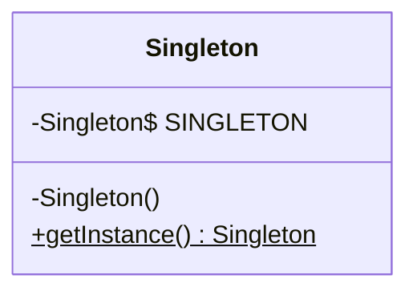
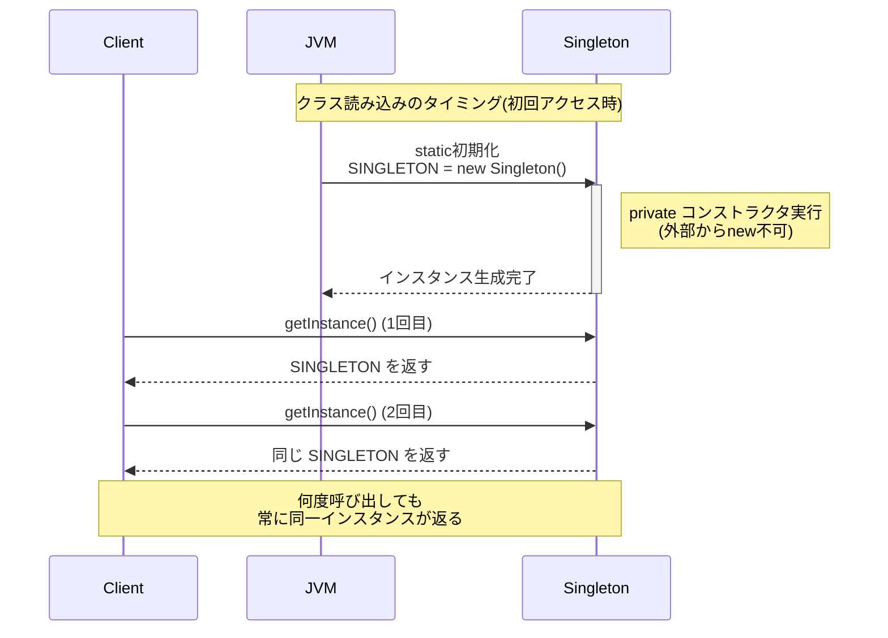

## 概要

Singleton（シングルトン）パターンを一言でいうと、「**そのクラスのインスタンスを、プログラム全体でただ1つだけに制限する**」ためのデザインパターンです。

「インスタンスが1つだけ」と言われてもピンとこない人のために例えると、一つの国に大統領が何人もいたら指示がバラバラになって困りますよね。会社の社長が同時に3人いても同じです。Singletonは、そうした「複数存在すると困るもの」をプログラム上でも確実に1つに保つための仕組みです。

具体的には、アプリ全体で共有する設定情報や、ログを1箇所にまとめて出力する仕組みなどでよく使われます。

## クラス構造



## イメージ


### 仕組みを3つのステップで理解する

#### ① コンストラクタをprivateにして、外部からの`new`を禁止する

普段クラスを使うときは`new クラス名()`で自由にインスタンスを作れますが、これができてしまうと「いくつでもインスタンスが作れる」状態になり、Singletonの前提が崩れてしまいます。

そこでSingletonでは、コンストラクタに`private`を付けます。こうすると、クラスの外側（上の図でいうClient側）からは`new Singleton()`と書けなくなります。

#### ② クラス自身の中で、こっそり1つだけインスタンスを作っておく

「外から作れないなら、そもそも誰が作るのか？」という話になりますが、答えは「クラス自身が、自分の内部で1回だけ作っておく」です。

そのインスタンスを、クラスの中の`static`なフィールドに保持しておきます。`static`というのは「そのクラス全体で共有される、1つしかない場所」というイメージを持っておくと理解しやすいです。

#### ③ `getInstance()`という窓口を通してだけ渡す

外部の人がこのインスタンスを使いたいときは、直接`new`する代わりに、`getInstance()`という専用のメソッドを呼び出します。このメソッドは、②で作っておいたインスタンスをそのまま返すだけです。

* すでに作られていれば、それをそのまま返す
* （実装によっては）まだ作られていなければ、ここで初めて作る

これにより、プログラムのどこから呼び出しても、必ず同じインスタンスに辿り着くようになります。

### まとめ

- 「外から勝手に作らせない」（`private`コンストラクタ）
- 「クラス自身が1つだけ持っておく」（`static`フィールド）
- 「決まった窓口からだけ渡す」（`getInstance()`）

この3つが揃うことで、「世界に1つだけ」の状態を実現しているのがSingletonパターンです。

## メリット

### メモリと資源を節約できる

同じ役割のオブジェクトを使うたびに`new`していたら、その分メモリを消費してしまいます。Singletonなら最初に作った1つを使い回すだけなので、無駄がありません。

### データの一貫性を保ちやすい

たとえばシステムの設定情報を管理するクラスがあちこちで別々に`new`されてしまうと、「あるクラスでは設定Aだけど、別のクラスでは設定Bになっている」というズレが起きかねません。Singletonなら、どこからアクセスしても同じインスタンス＝同じ状態を参照するので、こうした食い違いが起きません。

### どこからでも同じインスタンスにアクセスできる

「あの設定オブジェクト、どこで作ってどこに渡したっけ」と探し回る必要がありません。`Singleton.getInstance()`と書くだけで、いつでも同じインスタンスに辿り着けます。

## デメリット

### テストがしにくい

ユニットテストの基本は、テストごとに独立した状態で検証することです。しかしSingletonは状態をずっと保持し続けるため、「テストAで書き換えた状態が、テストBの結果に影響してしまう」という問題が起きやすくなります。テストの実行順序によって結果が変わってしまう、といった事故にもつながります。

### 密結合になりやすい

どこからでも呼べて便利な反面、裏を返せば「そのSingletonクラスに依存するコード」が至るところに増えていくということでもあります。後から「実装を差し替えたい」「テスト用のダミーに置き換えたい」と思っても、あちこちに直接依存している分、変更の影響範囲が大きくなりがちです。

### 遅延初期化を選ぶ場合は、マルチスレッド対応が必要になる

今回のサンプルコードのように「クラス読み込み時にあらかじめインスタンスを作っておく」方式（**eager initialization**）であれば、Javaの仕様上クラスの初期化はJVMによって1回だけ安全に行われることが保証されているため、追加の対策なしにスレッドセーフです。

一方、「実際に必要になるまでインスタンスを作らない」**遅延初期化（lazy initialization）** を選ぶ場合は話が変わります。複数のスレッドがほぼ同時に`getInstance()`を呼び出すと、タイミング次第で「一瞬だけインスタンスが2つ作られてしまう」という不具合が起こり得ます。この場合は`synchronized`やダブルチェックロッキングといった対策が別途必要になります。

「Singletonはマルチスレッドで事故りやすい」というのはよく言われる注意点ですが、正確には**遅延初期化を選んだ場合の話**である点は覚えておくとよいです。

## サンプルソース

まずは、今回解説してきた「eager initialization」方式のシンプルな実装です。インスタンスがクラス読み込み時に作られるため、`synchronized`は不要です。

```java:Singleton.java
public class Singleton {
    // クラス読み込み時に1度だけインスタンスが生成される。
    // JVMの仕様上、この初期化処理自体がスレッドセーフなので、
    // 以降のgetInstance()にsynchronizedは不要。
    private static final Singleton SINGLETON = new Singleton();

    // コンストラクタをprivateにし、外部からのnewと継承を禁止する。
    private Singleton() {
    }

    // このメソッドを通してのみインスタンスを取得できる。
    // 常に同じ、すでに作られているインスタンスを返すだけ。
    public static Singleton getInstance() {
        return SINGLETON;
    }
}
```

```java:Client.java
public class Client {
    public static void main(String... args) {
        Singleton singleton01 = Singleton.getInstance();
        Singleton singleton02 = Singleton.getInstance();

        // 2回取得したインスタンスが同じものかどうかを検証
        if (singleton01 == singleton02) {
            System.out.println("同じオブジェクトです");
        } else {
            System.out.println("違うオブジェクトです");
        }
    }
}
```

### 実行結果

```
同じオブジェクトです
```
### シーケンス図


## 補足：遅延初期化にしたい場合

「インスタンスの生成コストが高いので、使うときまで作りたくない」といった理由でeager initializationではなく遅延初期化を選ぶ場合は、`synchronized`を使って対応します。

```java:LazySingleton.java
public class LazySingleton {
    private static LazySingleton instance;

    private LazySingleton() {
    }

    // 複数スレッドが同時にここへ来ても、1つずつしか処理させない
    public static synchronized LazySingleton getInstance() {
        if (instance == null) {
            instance = new LazySingleton();
        }
        return instance;
    }
}
```

ただし、この書き方は`getInstance()`が呼ばれるたびにロックの処理コストがかかるというデメリットがあります。これを避けるために、「インスタンスがまだ無いときだけロックする」**ダブルチェックロッキング（Double-Checked Locking, DCL）** という手法もよく使われます。

```java:LazySingletonDCL.java
public class LazySingletonDCL {
    // volatileが必須。付けないと、命令の並び替え（reorder）によって
    // 「フィールドへの参照は代入済みだが、中身のコンストラクタ処理は
    // まだ完了していない」中途半端なインスタンスが他のスレッドから
    // 見えてしまうことがある。
    private static volatile LazySingletonDCL instance;

    private LazySingletonDCL() {
    }

    public static LazySingletonDCL getInstance() {
        if (instance == null) {                 // 1回目のチェック（ロックなし）
            synchronized (LazySingletonDCL.class) {
                if (instance == null) {          // 2回目のチェック（ロック内）
                    instance = new LazySingletonDCL();
                }
            }
        }
        return instance;
    }
}
```

ここで`volatile`を付け忘れるのが典型的な事故です。JVMやCPUは処理を最適化するために命令の順番を入れ替えることがあり、`volatile`を付けないと「フィールドにはインスタンスが代入されているのに、コンストラクタの中身がまだ実行し終わっていない」状態を他のスレッドが読んでしまう可能性があります。`volatile`は、こうした並び替えを防いで、常に完成した状態のインスタンスだけが見えるようにするためのものです。

## Singletonの「唯一性」が意外と簡単に崩れるケース

ここまでの実装で「唯一のインスタンス」は保証できたように見えますが、実はJavaにはこの前提を崩せる抜け道がいくつかあります。ここからは少し発展的な内容ですが、Singletonを実務で使うなら知っておきたいポイントです。

### リフレクション（Reflection API）による破綻

Javaのリフレクション機能を使うと、`Constructor`オブジェクトに対して`setAccessible(true)`を呼び出すことで、アクセス修飾子のチェックを迂回できてしまいます。つまり、`private`なコンストラクタであっても、リフレクション経由で強制的に呼び出し、2つ目のインスタンスを作られてしまう可能性があるということです。

**対策**：コンストラクタの中で「すでにインスタンスが存在するかどうか」をチェックし、2回目の呼び出しであれば`IllegalStateException`のような例外を投げるようにします。

```java
private Singleton() {
    if (SINGLETON != null) {
        throw new IllegalStateException("インスタンスは既に生成されています");
    }
}
```

### シリアライズ（Serialization）による破綻

クラスが`java.io.Serializable`を実装している場合も注意が必要です。一度インスタンスをファイルなどに書き出し（シリアライズ）、それを読み込んで復元（デシリアライズ）すると、コンストラクタを経由しない形で新しいインスタンスが作られてしまいます。

**対策**：クラスに`readResolve()`メソッドを実装し、デシリアライズ時には新しいインスタンスではなく、既存のインスタンスを返すように制御します。

```java
protected Object readResolve() {
    return SINGLETON;
}
```

### 複数のクラスローダー（ClassLoader）による破綻

アプリケーションサーバーなど、1つのJVMの中で複数のクラスローダーが使われる環境では、同じ`Singleton`クラスであっても、クラスローダーごとに別々の`static`フィールドを持つことになります。その結果、クラスローダーAでは1つ、クラスローダーBでも1つ……というように、JVM全体で見ると「ただ1つ」にはなっていないケースが起こり得ます。これはコード側の書き方だけでは解決しづらく、実行環境側の制約として理解しておく必要がある問題です。

## もっとも安全な実装：Enumを使ったSingleton

ここまで見てきたリフレクションやシリアライズによる破綻は、実は**Enum（列挙型）でSingletonを実装する**ことで、まとめて防ぐことができます。Joshua Bloch氏の著書『Effective Java』でも、Javaにおける最善のSingleton実装として紹介されている方法です。

```java:Singleton.java
public enum Singleton {
    INSTANCE;

    public void doSomething() {
        // 処理
    }
}
```

呼び出す側は`Singleton.INSTANCE`と書くだけで、唯一のインスタンスにアクセスできます。

なぜこれが安全なのかというと、Javaの仕様上、enumのコンストラクタはリフレクション経由でも呼び出すことができず（呼び出そうとすると例外になります）、シリアライズについてもJVMが特別扱いをして、デシリアライズ時に同じ定数（＝同じインスタンス）が返ることを保証しているためです。`readResolve()`を自分で書く必要すらありません。

コードの見た目がシンプルなわりに堅牢なので、「とりあえずSingletonが必要」という場面では、まずEnum Singletonを検討してみるとよいでしょう。