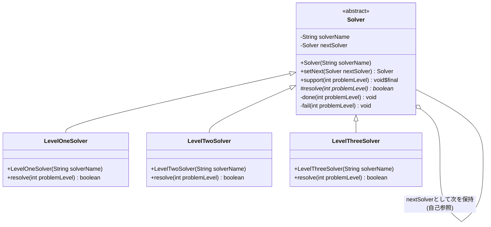
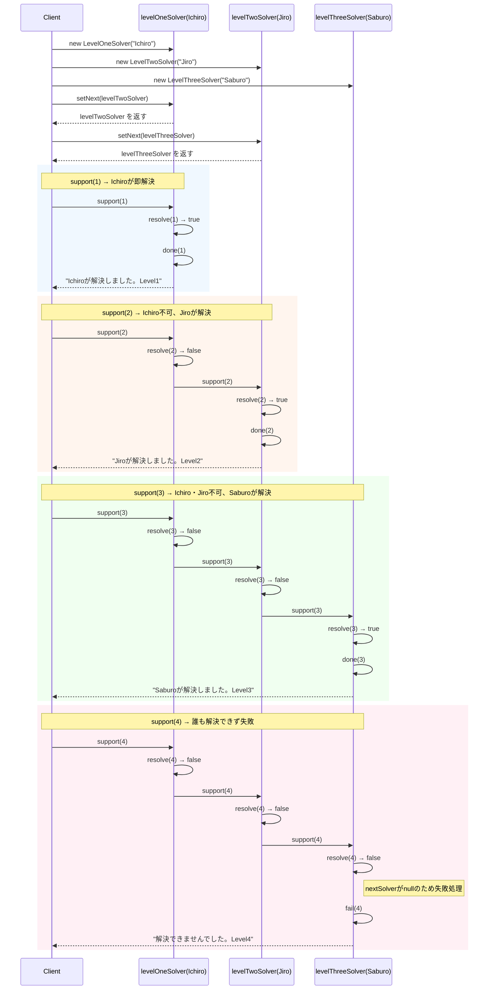

## 概要

Chain of Responsibility（責任の連鎖）パターンは、いわば「処理のたらい回し」を仕組み化したデザインパターンです。複数のオブジェクトを鎖（Chain）のようにつなぎ、リクエストが来たときに、自分ができるなら処理し、できないなら次の人へ回すという構造を作ります。

分かりやすい例えは、経費の精算フローです。

- 係長ハンドラ：1万円以下なら承認。それ以上なら課長へ
- 課長ハンドラ：10万円以下なら承認。それ以上なら部長へ
- 部長ハンドラ：全額承認

申請者（クライアント）は「誰がハンコを押すか」を細かく知らなくても、まずは係長のデスクに書類を置くだけで、適切な場所まで書類が流れていきます。

## クラス構造



## イメージ


### 図の見方

#### スーパークラス：解決者の共通ルール

画像上部の赤い枠です。ここには3つの重要な役割があります。`support()`は窓口メソッドで、「自分が解決できるか試して、ダメなら次の人へ」というチェーンの進行管理を行います。`setNext()`は「自分の次は誰にパスするか」を定義する、図にある「リンク（赤い矢印）」を作るための接着剤です。`resolve()`は抽象メソッドで、サブクラスごとに「何なら解決できるか」の判断基準を書きます。

#### 各レベルの解決者：具体的な担当者

画像下部の青い枠です。Level 1はLv1の問題なら自分で解決し、それ以外なら自動的にLevel 2へパスします。Level 2も同様に、Lv2以下なら解決し、手に負えなければLevel 3へパスします。このように、「自分ができることだけをやり、あとは任せる」というシンプルな設計になります。

#### Client（利用側）のメリット

Clientは、Level 1に依頼を投げれば、あとは勝手に鎖を流れて最適な担当者に届きます。「この案件はLevel 2だから、Level 2クラスを呼び出そう」という判断をClientがしなくていいのが最大の利点です。

### まとめ

この仕組みのキモは、「リンク」と「再帰的な構造」にあります。「解決者」という同じ種類のオブジェクトを縦につなぐことで、複雑な条件分岐（大量のif-else）を1つの「流れ」として整理しています。「resolve（判断）」と「support（進行）」を分けることで、美しいエスカレーション（上位への引き継ぎ）の仕組みが出来上がっています。

## メリット

リクエストを送る側は、「誰が処理してくれるか」を具体的に知る必要がありません。ただ鎖の入り口にリクエストを投げるだけで済むため、システムの構造がシンプルに保てます。

「この処理も追加したい」となった場合、新しい処理クラスを作って鎖のどこかに差し込むだけで済みます。既存の処理クラスを書き換える必要がないため、開放閉鎖の原則をきれいに実現できます。

プログラムの実行中に、状況に応じて「A→B→C」という順番を「A→C→B」に変えるといった操作が簡単にできるのも特徴です。

## デメリット

リクエストが鎖の最後までたどり着いても、誰も「自分の担当だ」と判断しなかった場合、そのリクエストは処理されないまま終わってしまいます。最後に「エラーを出す」といった番人を置いておく対策が必要です（後述するサンプルコードでは、この対策がすでに組み込まれています）。

「どのクラスで処理されたのか」を追うために、複数のクラスをまたいで処理を追いかける必要があるのもデメリットです。直接メソッドを呼ぶ形式に比べると、実行時の挙動が見えにくくなりがちです。

鎖が非常に長くなると、実際に処理する担当者にたどり着くまでに多くのオブジェクトを経由することになり、わずかですがオーバーヘッドが発生する場合もあります。

## サンプルソース

```java:Solver.java
public abstract class Solver {
    private final String solverName;
    private Solver nextSolver;

    public Solver(String solverName) {
        this.solverName = solverName;
    }

    public Solver setNext(Solver nextSolver) {
        this.nextSolver = nextSolver;
        return nextSolver;
    }

    public final void support(int problemLevel) {
        if (resolve(problemLevel)) {
            done(problemLevel);
        } else if (nextSolver != null) {
            nextSolver.support(problemLevel);
        } else {
            fail(problemLevel);
        }
    }

    protected abstract boolean resolve(int problemLevel);

    private void done(int problemLevel) {
        System.out.println(solverName + "が解決しました。Level" + problemLevel);
    }

    private void fail(int problemLevel) {
        System.out.println("解決できませんでした。Level" + problemLevel);
    }
}
```

```java:LevelOneSolver.java
public class LevelOneSolver extends Solver {
    public LevelOneSolver(String solverName) {
        super(solverName);
    }

    @Override
    protected boolean resolve(int problemLevel) {
        return problemLevel <= 1;
    }
}
```

```java:LevelTwoSolver.java
public class LevelTwoSolver extends Solver {
    public LevelTwoSolver(String solverName) {
        super(solverName);
    }

    @Override
    protected boolean resolve(int problemLevel) {
        return problemLevel <= 2;
    }
}
```

```java:LevelThreeSolver.java
public class LevelThreeSolver extends Solver {
    public LevelThreeSolver(String solverName) {
        super(solverName);
    }

    @Override
    protected boolean resolve(int problemLevel) {
        return problemLevel <= 3;
    }
}
```

```java:Client.java
public class Client {
    public static void main(String... args) {
        Solver levelOneSolver = new LevelOneSolver("Ichiro");
        Solver levelTwoSolver = new LevelTwoSolver("Jiro");
        Solver levelThreeSolver = new LevelThreeSolver("Saburo");

        // チェーンの形成
        levelOneSolver.setNext(levelTwoSolver).setNext(levelThreeSolver);

        levelOneSolver.support(1);
        levelOneSolver.support(2);
        levelOneSolver.support(3);
        levelOneSolver.support(4);
    }
}
```

### 実行結果

```
Ichiroが解決しました。Level1
Jiroが解決しました。Level2
Saburoが解決しました。Level3
解決できませんでした。Level4
```

### シーケンス図


`setNext()`が引数に渡した`nextSolver`をそのまま返すようになっているため、`levelOneSolver.setNext(levelTwoSolver).setNext(levelThreeSolver)`という1行で、「1→2」「2→3」という2つのリンクを一気に作れています。地味ですが、鎖を組み立てるコードをすっきりさせる工夫です。

## 補足：内部にTemplate Methodパターンが隠れている

`Solver`の`support()`メソッドに`final`が付いており、中で抽象メソッド`resolve()`を呼び出しているという構造に見覚えはないでしょうか。これは、以前紹介したTemplate Methodパターンそのものです。「鎖を1つ進める」という共通の手順（`support()`）は固定しつつ、「自分が解決できるかどうかの判断基準」（`resolve()`）だけをサブクラスに委ねています。Chain of Responsibilityパターンは、内部でTemplate Methodパターンを使って実装されることがよくある、という点を知っておくと、パターン同士のつながりが見えてきます。

## 補足：Decoratorパターンとの違い

「オブジェクトが次のオブジェクトへの参照を持ち、順番に処理をつないでいく」という見た目は、以前紹介したDecoratorパターンともよく似ています。両者の違いは、「鎖のすべてが必ず処理に関わるかどうか」にあります。

- **Decorator**：鎖に連なるすべてのオブジェクトが、必ず自分の処理を実行してから次に渡します（全員参加）
- **Chain of Responsibility**：鎖の中の誰か1人（あるいは0人）が処理を担当し、担当した時点で鎖の進行は止まります（適任者だけが対応）

今回のサンプルで言えば、Level2の問題が来たとき、Level1は「自分では無理」と判断してそのまま何もせずLevel2に丸投げしていますが、Decoratorであれば、Level1に相当する層も必ず何らかの処理（ログ出力や前処理など）を実行してから次に渡す、という違いがあります。

## 補足：JavaのServlet Filterに見るChain of Responsibility

Webアプリケーション開発をしたことがある人であれば、`javax.servlet.Filter`（Jakarta EE以降は`jakarta.servlet.Filter`）というインターフェースを目にしたことがあるかもしれません。この`Filter`が持つ`doFilter(request, response, chain)`メソッドの中で`chain.doFilter(request, response)`を呼び出す仕組みは、まさにChain of Responsibilityパターンの実例です。認証チェック用のFilter、ログ出力用のFilter、文字コード変換用のFilterなどを鎖のようにつなぎ、それぞれが「自分の処理をしたら次へ渡す」を繰り返すことで、1つのリクエストに対して複数の関心事を順番に処理しています。SpringのSecurityFilterChainなども、この考え方をベースにしています。