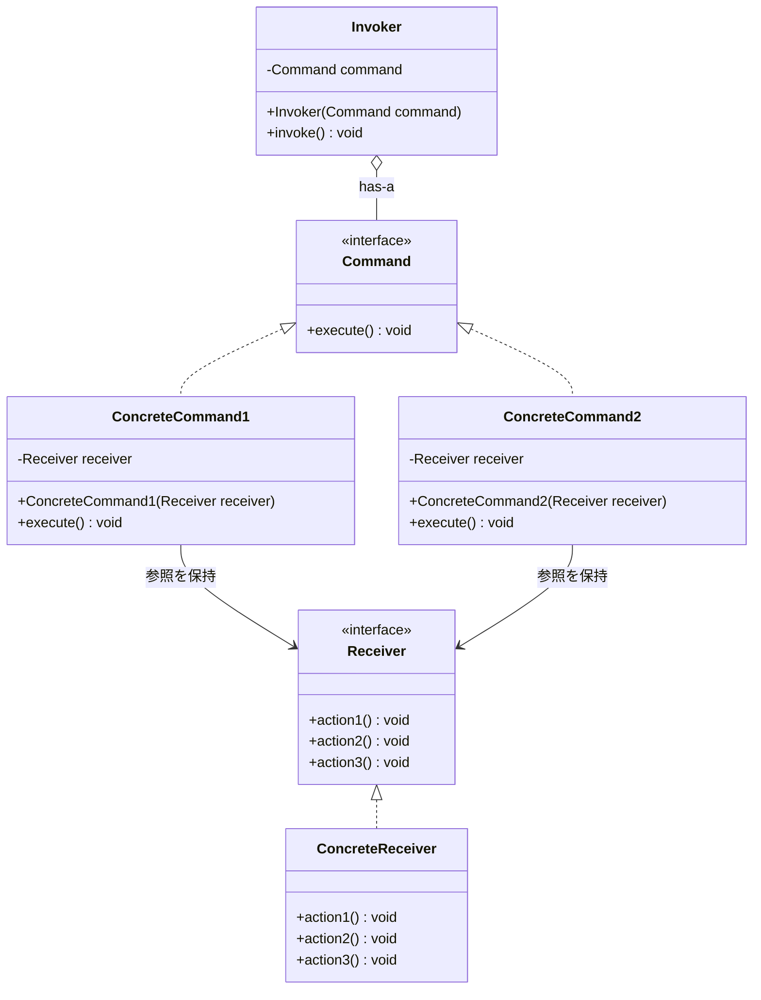
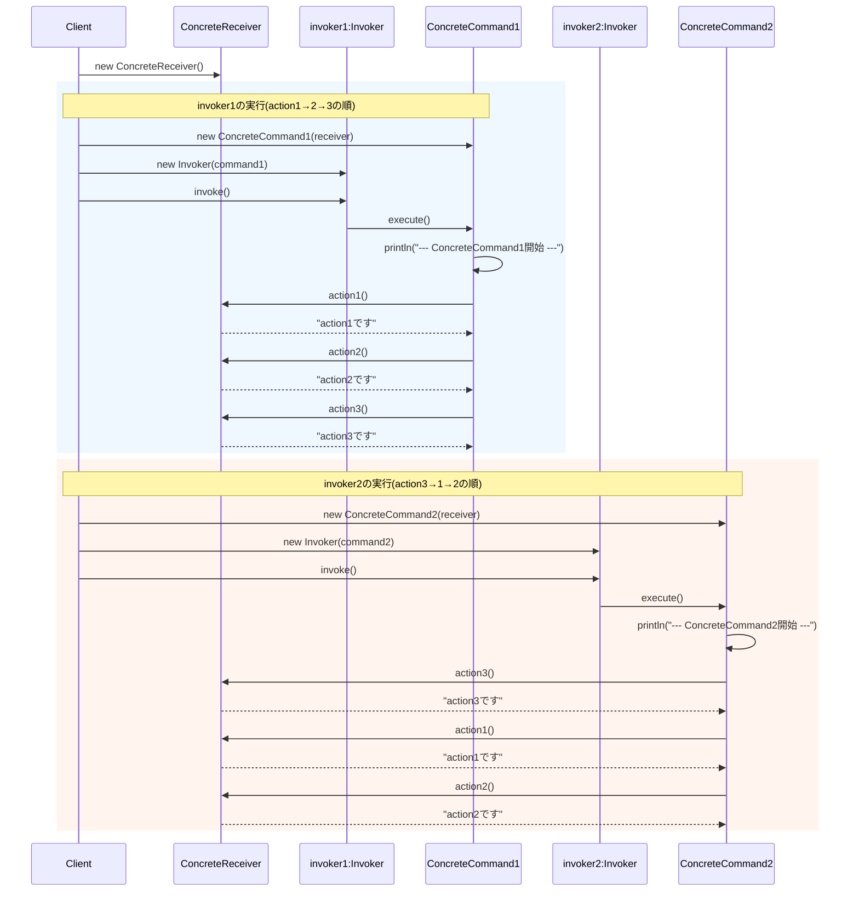

## 概要

Command（コマンド）パターンを一言でいうと、「**『何をするか』という命令そのものを、1つの独立したオブジェクトに閉じ込める**」ためのデザインパターンです。

通常、プログラムでは「関数を呼び出す」ことで処理を実行しますが、このパターンでは「関数呼び出し」という行為そのものを箱に入れて持ち運べるようにします。

## クラス構造



## イメージ


### 図の見方

#### 命令の「組み立て」を行うCommand

画像左側の緑枠です。ここには「玉子焼きレシピ」や「目玉焼きレシピ」があります。これらは、「どの順番でどのアクションを呼ぶか」を知っている、いわば知的な注文票です。玉子焼きなら「①割る→②かき混ぜる→……」というリストを持っています。

#### 命令の「実装」を行うReceiver

画像右側の青枠です。ここが実際に手を動かす「調理器具や技術」にあたります。「割る」「焼く」「ひっくり返す」といった具体的な動作の最小単位を持っています。Receiver自身は、自分が「玉子焼き」を作っているのか「目玉焼き」を作っているのかを気にしません。言われた動作を淡々とこなす職人です。

#### 呼び出し役（Invoker）と利用者（Client）

Clientは「今日は玉子焼きにしよう」と決め、Commandを作ります。Invokerは「実行！」とボタンを押す（Commandを呼び出す）役割です。

### まとめ

このパターンの最大の狙いは、「お願いする人」と「実行する人」を完全に切り離す（疎結合にする）ことにあります。画像の中で、CommandがReceiverの実装を呼び出している赤い矢印がありますが、これによって「レシピ（手順）」と「調理スキル（実装）」をバラバラに管理できるようになっています。

## メリット

「命令」がオブジェクト（モノ）になっているため、リストに入れて保存しておいたり、後で実行したり、キュー（行列）に並べて順番に処理したりといったことが自由自在にできます。

命令オブジェクトの中に「実行前の状態」や「戻し方」を持たせておけば、履歴をリストで管理するだけで、Ctrl+Zのような機能をスマートに実装できます。この用途は、状態のスナップショットを扱うMementoパターンとも相性が良く、両方を組み合わせて使われることがよくあります。

送り手（Invoker）と受け手（Receiver）を完全に切り離せるのも大きな利点です。ボタン（Invoker）は「このコマンドを実行しろ」と言うだけで済み、実際に誰がどう動くのか（Receiver）を知る必要がありません。これにより、同じ「保存コマンド」を、ツールバーのボタンにも、右クリックメニューにも、ショートカットキーにも使い回せます。

複数のコマンドを束ねた「マクロコマンド」を作るのも簡単です。既存のコマンドを組み合わせるだけで、新しい複雑な処理を組み立てられます（具体的な実装は後述します）。

## デメリット

「保存」「コピー」「貼り付け」「削除」……と、操作の種類ごとに新しいクラスを作る必要があります。単純な処理しかないアプリだと、コードがバラバラになりすぎて管理が面倒に感じるかもしれません。

「送り手→命令→受け手」という3つの登場人物が必要になるため、直接メソッドを呼ぶ場合に比べて、処理の流れを追うのに慣れが必要になる点もデメリットとして挙げられます。

## サンプルソース

```java:Command.java
public interface Command {
    void execute();
}
```

```java:Invoker.java
public class Invoker {
    private final Command command;

    public Invoker(Command command) {
        this.command = command;
    }

    public void invoke() {
        command.execute();
    }
}
```

```java:Receiver.java
public interface Receiver {
    void action1();
    void action2();
    void action3();
}
```

```java:ConcreteReceiver.java
public class ConcreteReceiver implements Receiver {
    @Override
    public void action1() {
        System.out.println("action1です");
    }
    @Override
    public void action2() {
        System.out.println("action2です");
    }
    @Override
    public void action3() {
        System.out.println("action3です");
    }
}
```

```java:ConcreteCommand1.java
public class ConcreteCommand1 implements Command {
    private final Receiver receiver;

    // Receiverを外部から受け取ることで、どのReceiverとでも組み合わせられるようにする
    public ConcreteCommand1(Receiver receiver) {
        this.receiver = receiver;
    }

    @Override
    public void execute() {
        System.out.println("--- ConcreteCommand1開始 ---");
        receiver.action1();
        receiver.action2();
        receiver.action3();
    }
}
```

```java:ConcreteCommand2.java
public class ConcreteCommand2 implements Command {
    private final Receiver receiver;

    public ConcreteCommand2(Receiver receiver) {
        this.receiver = receiver;
    }

    @Override
    public void execute() {
        System.out.println("--- ConcreteCommand2開始 ---");
        receiver.action3();
        receiver.action1();
        receiver.action2();
    }
}
```

```java:Client.java
public class Client {
    public static void main(String... args) throws Exception {
        Receiver receiver = new ConcreteReceiver();

        Invoker invoker1 = new Invoker(new ConcreteCommand1(receiver));
        invoker1.invoke();

        Invoker invoker2 = new Invoker(new ConcreteCommand2(receiver));
        invoker2.invoke();
    }
}
```

`ConcreteCommand1`・`ConcreteCommand2`は、それぞれが内部で`new ConcreteReceiver()`を直接生成するのではなく、コンストラクタで`Receiver`を受け取る形にしています。以前Adapterパターンの記事でも触れたように、こうしておくことで、テスト用のダミーReceiverに差し替えたり、別の実装のReceiverと組み合わせたりすることが自由にできるようになります。

### 実行結果

```
--- ConcreteCommand1開始 ---
action1です
action2です
action3です
--- ConcreteCommand2開始 ---
action3です
action1です
action2です
```

### シーケンス図



## 補足：マクロコマンドの実装例

メリットで触れた「複数のコマンドを束ねるマクロコマンド」は、`Command`インターフェース自身を実装した、コマンドの入れ物のようなクラスとして作ります。

```java:MacroCommand.java
import java.util.ArrayList;
import java.util.List;

public class MacroCommand implements Command {
    private final List<Command> commands = new ArrayList<>();

    public void append(Command command) {
        commands.add(command);
    }

    @Override
    public void execute() {
        // 束ねられているコマンドを、追加された順番に実行するだけ
        for (Command command : commands) {
            command.execute();
        }
    }
}
```

```java
Receiver receiver = new ConcreteReceiver();

MacroCommand macroCommand = new MacroCommand();
macroCommand.append(new ConcreteCommand1(receiver));
macroCommand.append(new ConcreteCommand2(receiver));

// 2つのコマンドを、あたかも1つのコマンドであるかのように実行できる
Invoker invoker = new Invoker(macroCommand);
invoker.invoke();
```

`MacroCommand`自身も`Command`インターフェースを実装しているため、`Invoker`側からは相手が「単一のコマンド」なのか「複数のコマンドの束」なのかを気にする必要がありません。この「全体と部分を同じ型として扱う」という考え方は、Compositeパターンと呼ばれる別のデザインパターンの考え方そのものです。CommandパターンとCompositeパターンを組み合わせることで、こうしたマクロ機能をシンプルに実現できます。

## 補足：Undo（取り消し）に対応する場合の拡張例

メリットで触れた「Ctrl+Zのような取り消し機能」を実現したい場合は、`Command`インターフェースに`undo()`メソッドを追加するのが定番のやり方です。

```java:Command.java（Undo対応版）
public interface Command {
    void execute();
    void undo(); // 実行前の状態に戻すためのメソッド
}
```

`execute()`を実行する前の状態を`ConcreteCommand`側で覚えておき、`undo()`が呼ばれたらその状態に戻す、という実装が一般的です。実行履歴を`List<Command>`のようなスタック構造で保持しておけば、末尾から順に`undo()`を呼んでいくだけで、複数回のCtrl+Zにも対応できます。

## 補足：Java 8以降のラムダ式との関係

ここまで紹介してきた（Undo対応版ではない）`Command`インターフェースは、抽象メソッドを`execute()`ただ1つしか持たない、いわゆる関数型インターフェースです。`@FunctionalInterface`を付けておくと、うっかり2つ目の抽象メソッドを追加してしまった際にコンパイルエラーで気づけるので安心です。

```java:Command.java（関数型インターフェースとして明示）
@FunctionalInterface
public interface Command {
    void execute();
}
```

関数型インターフェースになっているということは、状態（パラメータや直前の履歴）を持たないシンプルなコマンドであれば、わざわざ`ConcreteCommand`クラスを作らなくても、ラムダ式でそのまま`Invoker`に渡せるということです。

```java
Receiver receiver = new ConcreteReceiver();

// ConcreteCommandクラスを作らず、ラムダ式でその場でCommandを渡す
Invoker invoker = new Invoker(() -> receiver.action1());
invoker.invoke();
```

余談ですが、`Command`が持つ`execute()`は「引数なし・戻り値なし」というシグネチャなので、これはJava標準の`java.lang.Runnable`が持つ`run()`メソッドとまったく同じ形をしています。そのため、もし独自の`Command`インターフェースをわざわざ定義せず、`Invoker`が`java.lang.Runnable`を受け取るように設計しても、同じようにラムダ式を渡すシンプルなコマンド実行の仕組みを作ることができます。ただし、これはあくまで「メソッドの形が同じだから代用できる」という話であり、`Command`型の変数に`Runnable`のインスタンスをそのまま代入できるわけではない点には注意してください（あくまで、API側の引数の型として`Command`を使うか`Runnable`を使うかという設計判断の話です）。

なお、先ほど紹介したUndo対応版のように`undo()`を追加すると、抽象メソッドが2つになるため、`Command`インターフェースは厳密には関数型インターフェースではなくなり、ラムダ式で実装することはできなくなります。「シンプルなコマンドはラムダ式で手軽に」「Undoに対応したいコマンドはクラスとしてきちんと実装する」というように、要件に応じて設計を使い分けるとよいでしょう。