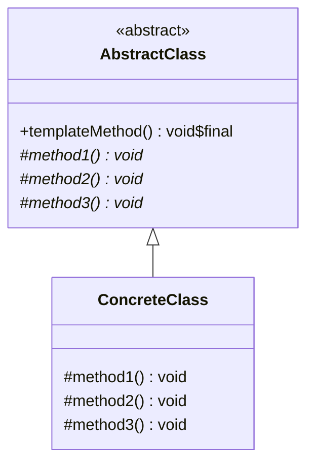
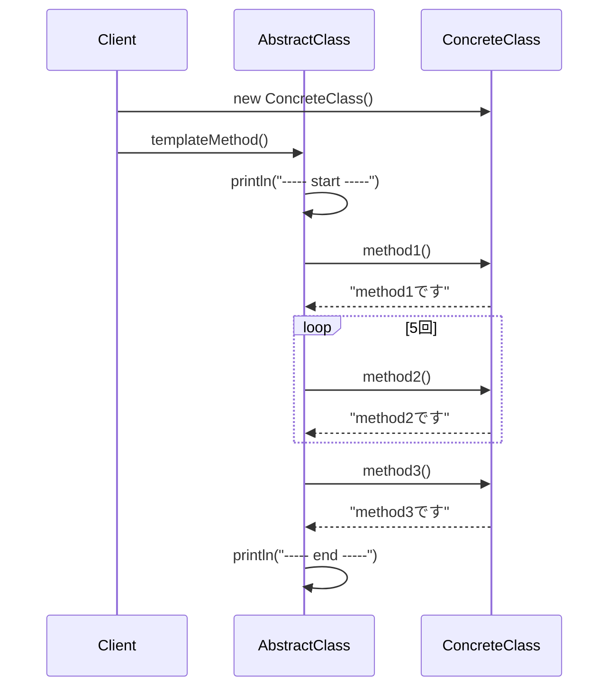

## 概要

Template Method（テンプレートメソッド）パターンを一言でいうと、「**処理全体の流れは親クラスが決めておき、その中の一部分だけを子クラスに任せる**」ためのデザインパターンです。GoFのデザインパターンの中では「振る舞いに関するパターン（Behavioral Patterns）」というグループに分類されています。

料理のレシピに例えるとイメージしやすいです。「カレーを作る」というレシピには、「具材を切る」「炒める」「煮込む」「味付けをする」という決まった手順があります。この手順自体は誰が作っても変わりません。一方で、「どんな具材を使うか」「ルーは甘口か辛口か」といった中身は、作る人によって変わりますよね。Template Methodパターンは、この「手順は固定・中身は可変」という関係をクラス設計に落とし込んだものです。

## クラス構造



## イメージ


### 図の見方

#### スーパークラス側：全体の流れを決める「司令塔」

図の左側、`templateMethod()`を持つクラスです。ここでの役割は大きく2つに分かれます。

- `templateMethod()`：処理全体の順番をコントロールするメソッドです。「どの処理を、どの順番で呼び出すか」はすべてここに書かれています。Template Methodパターンの本質は「この手順をサブクラスに書き換えさせない」ことにあるため、Javaでは`templateMethod()`に`final`修飾子を付けるのが標準的な書き方です。`final`を付ければ、サブクラス側で`templateMethod()`自体をオーバーライドすることができなくなり、「手順は絶対に変えられない」ことをコード上で保証できます。
- `method1()`、`method2()`、`method3()`：中身が空の**抽象メソッド**です。抽象メソッドとは、「このメソッドは存在するけれど、具体的な処理はまだ書かれていない」という状態のメソッドのことで、実装は必ずサブクラス側に書く必要があります。いわば「あとで誰かが埋める前提の空欄」です。

#### 抽象メソッドとフックメソッドの違い

サブクラス側に処理を委ねる方法には、実は2種類あります。

1つは、ここまで説明してきた**抽象メソッド**です。中身が一切用意されておらず、サブクラス側での実装が必須になります。「必ず何らかの処理を書いてもらう」ことを強制したい場合はこちらを使います。

もう1つは**フックメソッド（Hook Method）** と呼ばれるものです。こちらは親クラス側に「何もしない」あるいは「デフォルトの処理」をあらかじめ用意しておき、サブクラス側は必要なときだけオーバーライドすればよい、という任意参加のメソッドです。たとえば「カレーのレシピ」でいえば、「ルーを入れる」は必須（抽象メソッド）だけれど、「隠し味を入れるかどうか」は作る人の自由（フックメソッド）、といったイメージです。

このように、「必ず実装させたい処理」には抽象メソッドを、「任意でカスタマイズさせたい処理」にはフックメソッドを、というように使い分けることで、Template Methodパターンはより柔軟に設計できます。

#### サブクラス側：空欄を埋める「現場担当」

図の右側にあたる部分です。スーパークラスを`extends`（継承）することで、`templateMethod()`が持つ「決まった流れ」をそのまま受け継ぎます。そのうえで、親クラスが空けておいた`method1()`〜`method3()`の中身を、自分たちの実装で埋めていきます（これを**オーバーライド**と呼びます）。

#### Client側：呼び出すだけでよい利用者

利用する側は、どのサブクラスを使うかを選んで`templateMethod()`を呼び出すだけです。「その中で具体的にどんな順番で何が起きているか」を意識する必要はありません。呼び出した瞬間、親クラスが決めた順番通りに、子クラスが用意した処理が実行されます。

### まとめ

Template Methodパターンの要点は、`templateMethod()`の中に **「処理の順番」という共通ルールを閉じ込めてしまう** ことにあります。サブクラス側は、その順番を気にする必要がなく、自分たちが担当する「中身の実装」だけに集中できます。

このように「大枠は親が用意し、詳細だけを子に任せる」という考え方は、**ハリウッドの原則（Hollywood Principle）** と呼ばれることもあります。「Don't call us, we'll call you（こちらから呼ぶから、勝手に呼ばないで）」、つまり子クラス側が主導権を持つのではなく、親クラス側が処理の主導権を握っている、という関係性を表した言葉です。

## メリット

**コードの重複を減らせる**のが最大の利点です。「煮込む」「炒める」といった共通の処理を親クラスに一度書いておけば、どのサブクラスを使うときもそのコードがそのまま使い回せます。修正が必要になったときも、親クラスの該当箇所を直すだけで済みます。

また、**処理の順番が保証される**という安心感もあります。手順そのものは親クラスがコントロールしているので、サブクラス側が「煮込む前に味付けをしてしまう」といった順序の間違いを起こす余地がありません。

サブクラスを作る側の負担が小さいのも見逃せないポイントです。全体の処理がどう流れているかを完全に理解していなくても、親クラスが用意した「空欄（抽象メソッド）」を埋めるだけで、新しい機能を追加できます。

## デメリット

一方で、良いことばかりではありません。

まず、**サブクラスの数が増えやすい**という問題があります。「甘口カレー」「辛口カレー」「シーフードカレー」のように、少しの違いを表現するだけでもサブクラスを1つ作る必要があり、種類が増えるほど全体の見通しが悪くなります。

次に、Template Methodは仕組み上**継承（`extends`）を前提**にしています。Javaのように「クラスは1つしか継承できない」という言語では、このパターンを使ったことで「他に継承したいクラスがあったのに継承できない」という制約が生まれることがあります。

さらに、親クラスと子クラスの関係が**密結合**になりやすい点にも注意が必要です。親クラス側の処理の流れを少し変更しただけで、それに依存しているすべての子クラスに影響が及びます。特に大規模なシステムでは、「一部を直したつもりが、思わぬところまで壊れていた」という事故につながりやすい構造だと言えます。

## サンプルソース

```java:AbstractClass.java
public abstract class AbstractClass {

    // finalを付けることで、サブクラスによる「処理手順の書き換え（オーバーライド）」を防止する
    public final void templateMethod() {
        System.out.println("----- start -----");
        method1();                  // 具体的な処理内容はサブクラス任せ
        for (int i = 0; i < 5; i++) {
            method2();               // これも同様にサブクラス任せ
        }
        method3();                  // これも同様にサブクラス任せ
        System.out.println("-----  end  -----");
    }

    // 中身の実装はサブクラスに委ねる抽象メソッド
    protected abstract void method1();
    protected abstract void method2();
    protected abstract void method3();

}
```

```java:ConcreteClass.java
public class ConcreteClass extends AbstractClass {
    @Override
    protected void method1() {
        System.out.println("method1です");
    }
    @Override
    protected void method2() {
        System.out.println("method2です");
    }
    @Override
    protected void method3() {
        System.out.println("method3です");
    }
}
```

```java:Client.java
public class Client {
    public static void main(String... args) {
        AbstractClass clazz = new ConcreteClass();
        clazz.templateMethod();
    }
}
```

### 実行結果

`templateMethod()`の中で`method2()`を呼び出す`for`ループが5回まわるため、`method2です`が5回出力されます。

```
----- start -----
method1です
method2です
method2です
method2です
method2です
method2です
method3です
-----  end  -----
```
### シーケンス図


## 補足：インターフェースのdefaultメソッドとの違い

「デメリット」で触れた「継承の制約」は、Java 8以降であればインターフェースの`default`メソッドを使うことである程度回避できます。インターフェースであれば複数実装（`implements`）が可能なので、「テンプレート部分はインターフェースのdefaultメソッドとして持ち、詳細部分は各クラスに実装させる」という形にすれば、単一継承の制約を受けずに似たような構造を作ることもできます。

ただし、この代替案には見過ごせない弱点が2つあります。

1つ目は、**インターフェースの`default`メソッドには`final`を付けられない**という言語仕様上の制約です。先ほど「`templateMethod()`には`final`を付けて手順の書き換えを防ぐのがベストプラクティス」と説明しましたが、interfaceの`default`メソッドではこれができません。つまり、実装クラス側で`templateMethod()`自体を自由にオーバーライドできてしまい、「手順を絶対に変えさせない」というTemplate Methodパターン本来の目的が弱まってしまいます。

2つ目は、**抽象メソッドを隠しておけない**という点です。抽象クラスであれば`method1()`などのステップを`protected`にして、Client（利用側）からは直接呼べないように隠蔽できます。しかし、インターフェースで実装クラスにオーバーライドさせるメソッドは、必ず`public`として公開する必要があります。Java 9以降ではインターフェースに`private`メソッドを定義できるようになりましたが、これはインターフェース内部の共通処理を整理するためのものであり、実装クラス側でオーバーライドさせる用途には使えません。

こうした事情から、`default`メソッドはあくまで「単一継承の制約を回避したいときの代替手段」の1つに留まります。「手順を確実に固定したい」という、Template Methodパターン本来の意図を厳密に実現したい場合は、やはり抽象クラス＋`final`修飾子による古典的な実装のほうが適していると言えます。