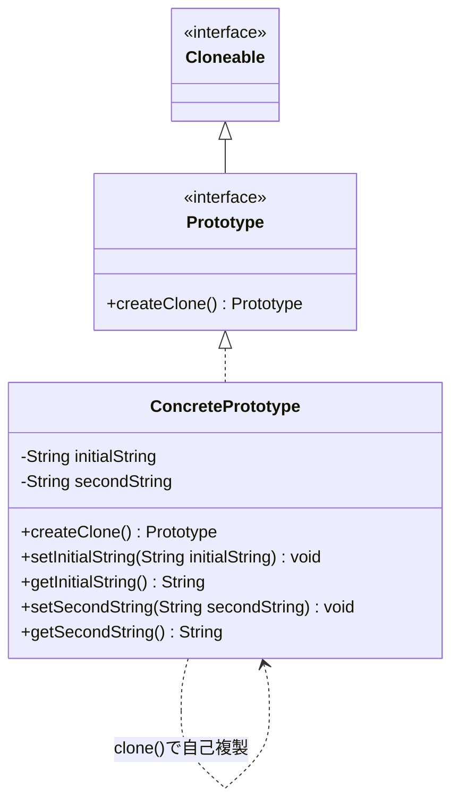
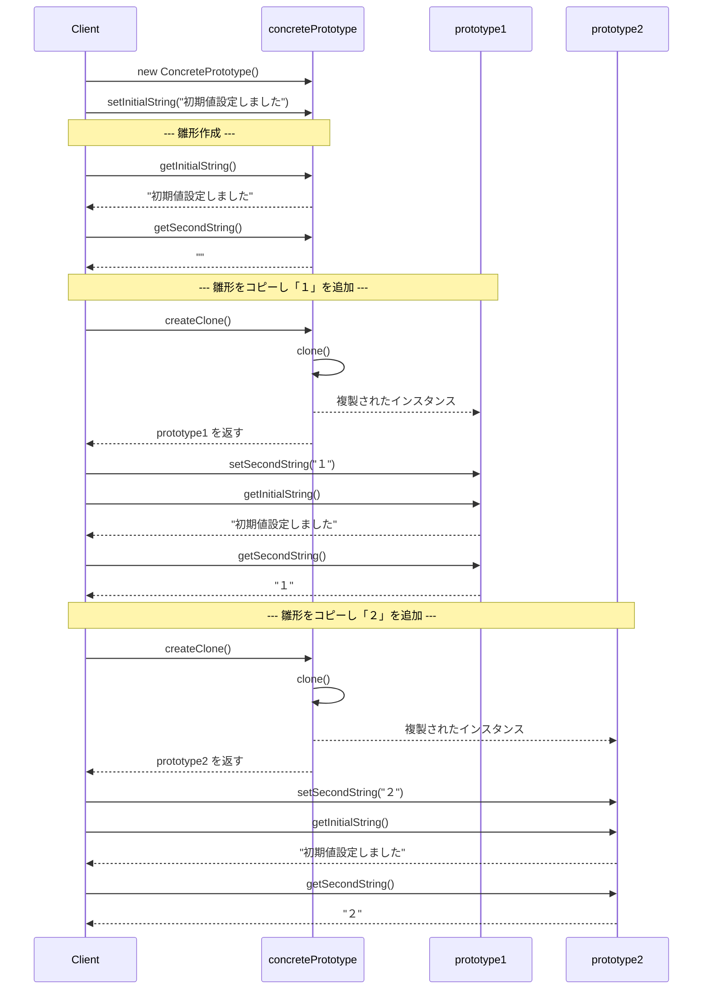

## 概要

Prototype（プロトタイプ）パターンは、「**新しいものを作るとき、ゼロから組み立てるのではなく、既存のものをコピー（複製）して作る**」ためのデザインパターンです。たい焼きを作るときに、毎回生地をこねて形を作るのではなく、金型を使って次々と複製していくイメージに近いです。

## クラス構造



## イメージ


### 図の見方

#### 考え方：共通部分は使い回す

星やハートがついた複雑な図形を3つ作りたいとき、毎回「青い円を描いて、星を置いて、ハートを置いて」と繰り返すのは非効率です。画像にある通り、「共通部分が完成している状態」をプロトタイプとして用意し、それをクローン（複製）してから数字などの一部分だけを変えるのが、もっともスマートなやり方です。

#### Cloneableインターフェース

Javaでは、「このクラスはコピーしてもいいですよ」という印として、`Cloneable`というインターフェースを実装します。これによって、複製の許可をシステムに伝えます。

#### クローンの3ステップ

Client（利用側）の動きに注目してください。

1. **原本作成**：まずはコピー元となるオブジェクトを作ります。
2. **クローン取得**：`createClone()`を呼び出します。中身を詳しく知らなくても、まったく同じものが手に入ります。
3. **編集**：取得したコピーに対して、必要な部分（画像でいう数字など）だけを上書きします。

### まとめ

この仕組みのポイントは、「初期化にかかる手間をショートカットする」という発想にあります。「クラスから新しくインスタンスを生成する」のではなく、「動いているインスタンスから、新しいインスタンスを作る」。この発想の転換が、Prototypeパターンの面白さです。

## メリット

クラスから`new`で新しくインスタンスを作る際、データベースへの問い合わせや複雑な計算が必要になる場合があります。Prototypeパターンなら、すでにメモリ上にある完成品をコピーするだけで済むため、処理が高速になります。

「設定項目が100個あり、そのうち90個は共通」というオブジェクトを作りたい場合、ゼロから作って90個設定するのは大変です。あらかじめ90個設定済みの「原型（プロトタイプ）」を用意しておけば、それをコピーして残り10個を変えるだけで済みます。

「赤い弾」「青い弾」「速い弾」など、状態が少し違うだけのオブジェクトを大量に作る場合にも、それぞれを別々のクラスにする必要がありません。1つの「弾クラス」のインスタンスを複数用意してコピーするだけで対応できます。

## デメリット

最大の難点は、「深いコピー（Deep Copy）」の罠です。オブジェクトが別のオブジェクト（リストや他のクラス）への参照を持っている場合、単純にコピーすると「参照先（住所）」だけがコピーされ、片方を変えるともう片方まで変わってしまうという事故が起きます。中身まで完全に複製する「深いコピー」の実装は、地味に面倒でバグの温床になりやすい部分です（具体的な例は後述します）。

複製したいすべてのクラスに、自分をコピーする仕組み（`clone`など）を実装しなければならないのも制約です。既存のライブラリのクラスなど、自分で中身を書き換えられないクラスには適用しにくいという弱点があります。

「AがBを持っていて、BがAを持っている」というような循環参照がある構造では、手作業で深いコピーを実装しようとすると処理が無限ループに陥ったり、構造が破綻したりするリスクもあります。

## サンプルソース

```java:Prototype.java
public interface Prototype extends Cloneable {
    Prototype createClone();
}
```

```java:ConcretePrototype.java
import java.util.logging.Level;
import java.util.logging.Logger;

public class ConcretePrototype implements Prototype {
    private String initialString = "";
    private String secondString = "";

    @Override
    public Prototype createClone() {
        Prototype prototype = null;
        try {
            prototype = (ConcretePrototype) clone();
        } catch (CloneNotSupportedException ex) {
            Logger.getLogger(ConcretePrototype.class.getName()).log(Level.SEVERE, null, ex);
        }
        return prototype;
    }

    public void setInitialString(String initialString) {
        this.initialString = initialString;
    }

    public String getInitialString() {
        return initialString;
    }

    public void setSecondString(String secondString) {
        this.secondString = secondString;
    }

    public String getSecondString() {
        return secondString;
    }
}
```

`ConcretePrototype`自身は`clone()`メソッドをオーバーライドしていませんが、`Prototype`インターフェースが`Cloneable`を継承しているため、`Object`クラスが持つ`clone()`（本来は`protected`）をそのまま呼び出せば、フィールドをそのままコピーした複製が作られます。`clone()`を呼び出しているのが`ConcretePrototype`自身のメソッド（`createClone()`）の中なので、`protected`のアクセス制限にも引っかかりません。

```java:Client.java
public class Client {
    public static void main(String... args) {
        // プロトタイプ作成
        ConcretePrototype concretePrototype = new ConcretePrototype();
        concretePrototype.setInitialString("初期値設定しました");
        System.out.println("--- 雛形作成 ---");
        System.out.println(concretePrototype.getInitialString());
        System.out.println(concretePrototype.getSecondString());

        System.out.println("--- 雛形をコピーし「１」を追加 ---");
        ConcretePrototype prototype1 = (ConcretePrototype) concretePrototype.createClone();
        prototype1.setSecondString("１");
        System.out.println(prototype1.getInitialString());
        System.out.println(prototype1.getSecondString());

        System.out.println("--- 雛形をコピーし「２」を追加 ---");
        ConcretePrototype prototype2 = (ConcretePrototype) concretePrototype.createClone();
        prototype2.setSecondString("２");
        System.out.println(prototype2.getInitialString());
        System.out.println(prototype2.getSecondString());
    }
}
```

### 実行結果

```
--- 雛形作成 ---
初期値設定しました

--- 雛形をコピーし「１」を追加 ---
初期値設定しました
１
--- 雛形をコピーし「２」を追加 ---
初期値設定しました
２
```

### シーケンス図


`concretePrototype`という1つの雛形から`createClone()`で複製を2つ作り、それぞれに別々の`secondString`を設定しています。複製後にどちらか一方の`secondString`を変えても、もう一方や元の雛形には影響しません。これは今回のフィールドがどちらも`String`（不変なオブジェクト）だからこそ、素直にうまくいっている例でもあります。次の補足で、可変なフィールドを持たせた場合に何が起きるかを見てみましょう。

## 補足：シャローコピーの罠を実際に確認する

デメリットで触れた「深いコピーの罠」は、フィールドが`String`のような不変オブジェクトだけの場合には表面化しません。試しに、`ConcretePrototype`に`List<String>`のような可変なフィールドを追加するとどうなるか見てみます。

```java:ConcretePrototypeWithList.java（シャローコピーが問題になる例）
import java.util.ArrayList;
import java.util.List;

public class ConcretePrototypeWithList implements Prototype {
    private String initialString = "";
    private List<String> tags = new ArrayList<>();

    @Override
    public Prototype createClone() {
        try {
            return (ConcretePrototypeWithList) clone();
        } catch (CloneNotSupportedException ex) {
            throw new RuntimeException(ex);
        }
    }

    public void addTag(String tag) {
        tags.add(tag);
    }

    public List<String> getTags() {
        return tags;
    }

    // setInitialString / getInitialStringは省略
}
```

```java
ConcretePrototypeWithList original = new ConcretePrototypeWithList();
original.addTag("元祖");

ConcretePrototypeWithList copy = (ConcretePrototypeWithList) original.createClone();
copy.addTag("追加分"); // コピー側にだけタグを追加したつもり

System.out.println(original.getTags()); // [元祖, 追加分] ← 元の方まで変わってしまう！
```

`Object`が提供するデフォルトの`clone()`は、フィールドを1つずつそのままコピーする「シャローコピー（浅いコピー）」です。`tags`フィールドにはリストの実体そのものではなく、リストへの「参照（住所のようなもの）」が入っているため、シャローコピーではこの参照だけがコピーされ、複製後も`original`と`copy`は同じ1つの`List`インスタンスを指したままになります。結果として、`copy`側にタグを追加しただけのつもりが、`original`側にまで影響してしまいます。

これを避けるには、`clone()`をオーバーライドし、参照を持つフィールドについては自分で新しいインスタンスを作って詰め替える「ディープコピー（深いコピー）」を実装する必要があります。

```java
@Override
public Object clone() throws CloneNotSupportedException {
    ConcretePrototypeWithList cloned = (ConcretePrototypeWithList) super.clone();
    cloned.tags = new ArrayList<>(this.tags); // 参照ではなく、新しいリストとして複製する
    return cloned;
}
```

`String`や`int`のような不変・プリミティブなフィールドだけならシャローコピーで十分ですが、リストや他のクラスへの参照を持つフィールドがある場合は、こうして明示的にディープコピーを行う必要がある、という点を覚えておくとよいでしょう。

## 補足：`Cloneable`の癖と、代替手段としての「コピーコンストラクタ」

ここまで`Cloneable`と`clone()`を使った実装を紹介してきましたが、実はこの仕組み自体、Java初期の言語設計における少し特殊な作りを持っています。`java.lang.Cloneable`はインターフェースでありながら、`clone()`というメソッド自体は宣言していません。`clone()`の実体は`java.lang.Object`クラスに`protected native`メソッドとして存在しており、`Cloneable`はあくまで「このクラスは複製してよい」という目印（マーカーインターフェース）としてのみ機能します。

このねじれた構造のため、Joshua Bloch氏の『Effective Java』などでは、`Cloneable`や`clone()`の利用には慎重であるべきだとされています。実務では、代わりに**コピーコンストラクタ（Copy Constructor）**や、それに類するコピー用のstaticファクトリメソッドを使って、同じ「既存のインスタンスを元に新しいインスタンスを作る」という目的を達成するアプローチも広く使われています。

```java:ConcretePrototypeWithList.java（コピーコンストラクタ版）
import java.util.ArrayList;
import java.util.List;

public class ConcretePrototypeWithList {
    private String initialString;
    private List<String> tags;

    // 通常のコンストラクタ
    public ConcretePrototypeWithList() {
        this.initialString = "";
        this.tags = new ArrayList<>();
    }

    // コピーコンストラクタ：既存のインスタンスからディープコピーして生成する
    public ConcretePrototypeWithList(ConcretePrototypeWithList source) {
        this.initialString = source.initialString;
        this.tags = new ArrayList<>(source.tags); // 新しいリストとして複製する
    }

    public ConcretePrototypeWithList createClone() {
        return new ConcretePrototypeWithList(this);
    }

    // その他のgetter/setterは省略
}
```

`clone()`のように`Object`の特殊な仕組みに頼らず、ただの`public`コンストラクタとして書けるため、`CloneNotSupportedException`のような検査例外への対応も不要になり、コードの見通しがよくなります。また、コピーの過程で何をディープコピーすべきかが、コンストラクタの中身を読むだけで一目瞭然になるのも利点です。

「`Cloneable`を使った標準的な実装」は、GoFの原典に沿ったPrototypeパターンの姿を理解するうえでは分かりやすい一方、実際にJavaでこのパターンを取り入れる際は、こうしたコピーコンストラクタによる実装のほうが選ばれることも多い、という点を覚えておくとよいでしょう。