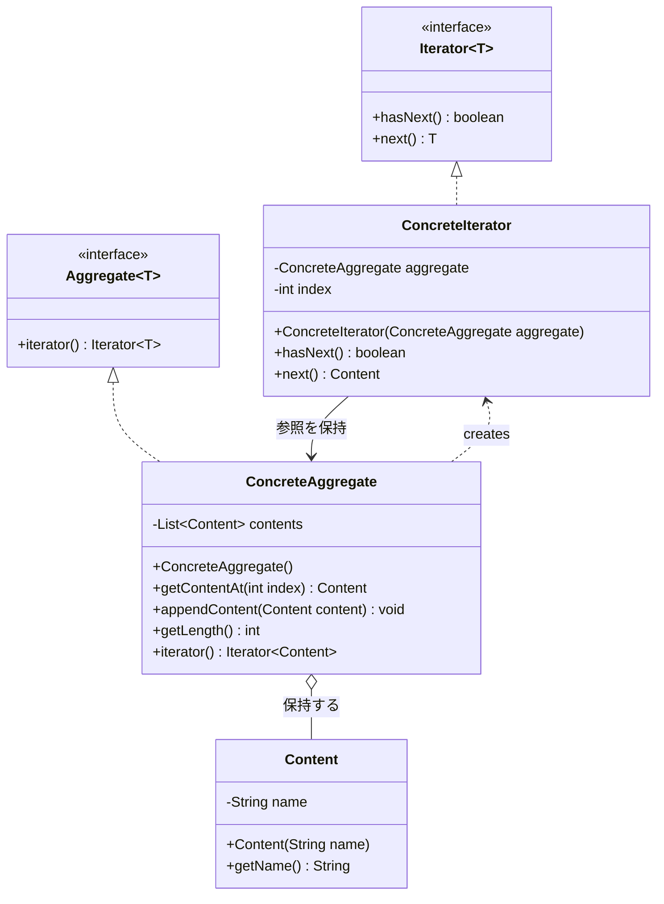
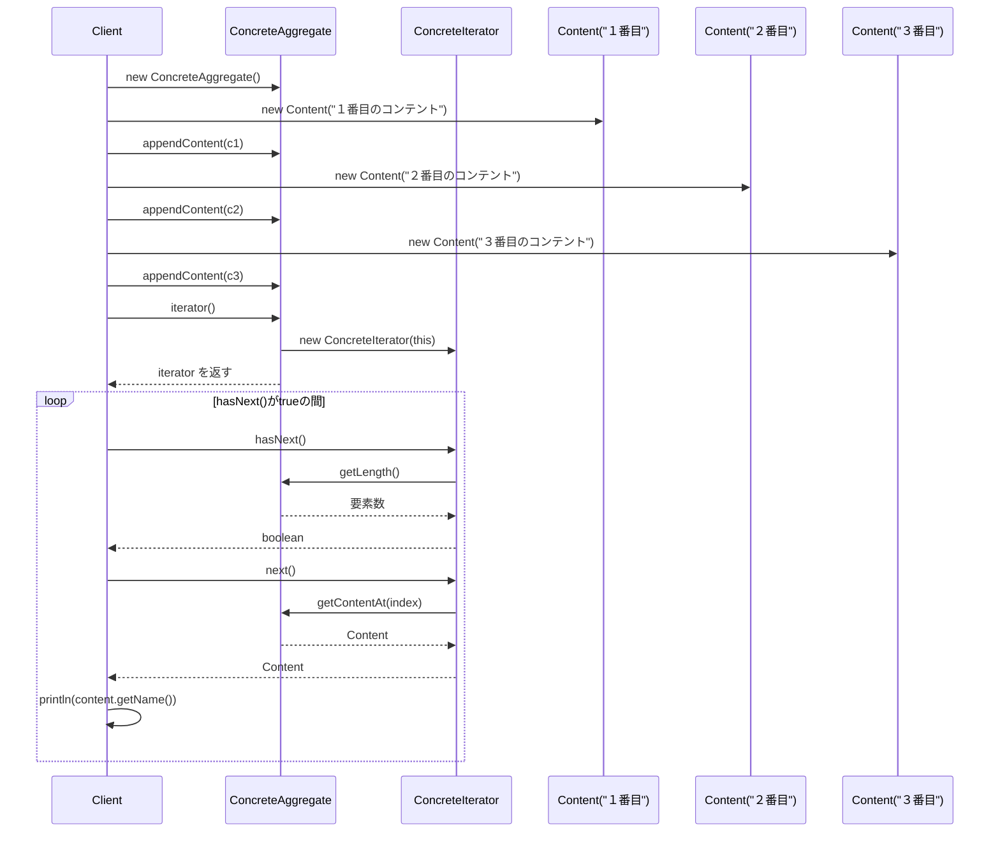

## 概要

Iterator（イテレータ）パターンを一言でいうと、「**中身がどう並んでいるか（配列、リスト、ツリーなど）を知らなくても、順番に1つずつ取り出せるようにする**」ためのデザインパターンです。

分かりやすい例えは、テレビのリモコンにある「チャンネル送りボタン」です。放送局のリストがメモリのどこに、どういう形式で保存されているかは視聴者には分かりません。分かるのは「次へ（Next）」というボタンがあることだけです。視聴者は「次へ」を押すだけで、中身の仕組みを知らなくてもすべてのチャンネルを順番に見ることができます。

もしテレビのメーカーが、中身のデータ保存方法を「配列」から「高度なデータベース」に変えたとしても、リモコンの「次へ」ボタンの使い方は変わりません。この「中身の実装が変わっても、使い方は変わらない」という点が、Iteratorパターンの本質です。

## クラス構造



## イメージ


### 図の見方

#### Aggregate：データの入れ物

右側の緑のボックスです。オブジェクトA、B、C……を詰め込んだ「宝箱」のようなものだとイメージしてください。ここには`iterator()`というメソッドがあり、「私の数え方を知っている専用のガイド（Iterator）を1人派遣します」という役割を持っています。

#### Iteratorインターフェース：数え方の共通ルール

左下の赤いボックスです。どんなデータの集まりであっても、数えるときは必ず次の2つの質問（メソッド）だけを使います。

- `hasNext()`：「次、まだある？」
- `next()`：「じゃあ、次のやつちょうだい」

このシンプルなやり取りだけで、どんなに複雑なデータ構造でも中身を走査できます。

#### 従来のループ処理との違い

画像中央にある`for`文の例に注目してください。従来の`for (int i = 0; ...)`のような書き方だと、数える側（Client）が「今は何番目で、全部で何個あって」と、データの内部構造（配列なのか、長さはいくつか等）を詳しく知っている必要があります。

Iteratorを使えば、Clientはデータの構造を一切知らなくてよくなるため、コードがすっきりし、内部構造が変わったときの修正箇所も減らせます。

### まとめ

この仕組みのポイントは、「数える手順を抽象化する」ことにあります。Javaなどの現代的な言語では、こうした仕組みが言語標準の機能（後述する`java.util.Iterator`など）として最初から取り込まれているため、実務で一から自作する機会は少ないかもしれません。それでも、「データの持ち主（Aggregate）」と「数える人（Iterator）」の役割を分けるという考え方は、保守しやすいコードを書くための基本の1つです。

## メリット

使う側（Client）は、データが「配列」に入っているのか「連結リスト」なのか、あるいは「木構造」なのかを知る必要がありません。ただ「次はある？」「次をちょうだい」と聞くだけで済みます。これにより、後からデータ構造を「配列」からより高速な別の実装に変更しても、使う側のコードを1行も直さずに済むようになります。

「どうやって数えるか（順番通りか、逆順か、特定の条件のものだけか）」というロジックを、データを持つクラスから切り離せるのも利点です。データを持つクラスは「データの保持」という本来の責務に専念でき、単一責任の原則を守りやすくなります。

1つのリストに対して、複数の「数え係（Iterator）」を同時に走らせられる点も見逃せません。たとえば「先頭から順に探す人」と「末尾から順に探す人」が、お互いの現在地に干渉することなく、同じリストを同時にスキャンできます。

## デメリット

ただの配列をループで回すだけで済むような単純な場面では、わざわざIteratorクラスを一式そろえるのは手間ですし、コード量も増えてしまいます。小規模なプログラムでは、いわゆる「オーバーエンジニアリング」になりがちです。

インデックス（`i++`）で直接アクセスする場合に比べると、メソッド呼び出し（`next()`や`hasNext()`）を毎回挟むため、極限の速度が求められる処理ではわずかなオーバーヘッドになります。

数え上げている途中で、元のデータから要素が削除されたり追加されたりすると、Iteratorが混乱してエラー（Javaの標準ライブラリでいう`ConcurrentModificationException`など）を出すことがあります。これを安全に防ぐための実装は、少し複雑になりがちです。

## サンプルソース

Javaの標準ライブラリにある`java.util.Iterator`と同じ考え方を、ジェネリクス（型パラメータ）を使って自作してみます。ジェネリクスを使うことで、`Object`型でのやり取りやキャストが不要になり、より型安全なコードになります。

```java:Iterator.java
public interface Iterator<T> {
    boolean hasNext();
    T next();
}
```

```java:Aggregate.java
public interface Aggregate<T> {
    Iterator<T> iterator();
}
```

```java:ConcreteIterator.java
public class ConcreteIterator implements Iterator<Content> {
    private final ConcreteAggregate aggregate;
    private int index;

    public ConcreteIterator(ConcreteAggregate aggregate) {
        this.aggregate = aggregate;
        this.index = 0;
    }

    @Override
    public boolean hasNext() {
        return index < aggregate.getLength();
    }

    @Override
    public Content next() {
        if (!hasNext()) {
            throw new java.util.NoSuchElementException("次の要素が存在しません");
        }
        Content content = aggregate.getContentAt(index);
        index++;
        return content;
    }
}
```

```java:ConcreteAggregate.java
import java.util.ArrayList;
import java.util.List;

public class ConcreteAggregate implements Aggregate<Content> {
    private final List<Content> contents;

    public ConcreteAggregate() {
        this.contents = new ArrayList<>();
    }

    public Content getContentAt(int index) {
        return contents.get(index);
    }

    public void appendContent(Content content) {
        this.contents.add(content);
    }

    public int getLength() {
        return contents.size();
    }

    @Override
    public Iterator<Content> iterator() {
        return new ConcreteIterator(this);
    }
}
```

```java:Content.java
public class Content {
    private final String name;

    public Content(String name) {
        this.name = name;
    }

    public String getName() {
        return name;
    }
}
```

```java:Client.java
public class Client {
    public static void main(String... args) {
        ConcreteAggregate concreteAggregate = new ConcreteAggregate();

        concreteAggregate.appendContent(new Content("１番目のコンテント"));
        concreteAggregate.appendContent(new Content("２番目のコンテント"));
        concreteAggregate.appendContent(new Content("３番目のコンテント"));

        Iterator<Content> iterator = concreteAggregate.iterator();
        while (iterator.hasNext()) {
            Content content = iterator.next();
            System.out.println(content.getName());
        }
    }
}
```

### 実行結果

```
１番目のコンテント
２番目のコンテント
３番目のコンテント
```

### シーケンス図


`next()`の冒頭で`hasNext()`をチェックし、次の要素がない状態で呼ばれた場合には`NoSuchElementException`を投げるようにしています。これはJavaの標準的なIteratorの規約（`java.util.Iterator`も同様の約束になっています）に合わせたものです。もしこのチェックを入れずに`aggregate.getContentAt(index)`だけを呼んでいた場合、範囲外のインデックスを渡すことになり`IndexOutOfBoundsException`が発生しますが、これは「呼び出し側が規約を破った」ことを伝えるエラーとしてはやや趣旨がぼやけてしまいます。「次の要素は存在しない」という状況にふさわしい専用の例外を投げておくことで、呼び出し側も何が起きたのかを判断しやすくなります。

## 補足：java.util.Iteratorとの名前の衝突に注意

今回自作した`Iterator<T>`は、実はJavaの標準ライブラリにある`java.util.Iterator<T>`とまったく同じ名前です。今回のサンプルコードでは`java.util`側の`Iterator`を`import`していないため問題なくコンパイルできますが、もし同じファイルの中で標準ライブラリの`ArrayList`などが持つ本物の`Iterator`も扱いたくなった場合、名前が衝突してしまいます。その場合は、自作した方に別の名前（`MyIterator`など）を付けるか、標準ライブラリ側を`java.util.Iterator`とフルパッケージ名で書き分ける必要があります。

実務でこのパターンを学習用に自作する際は、こうした名前の衝突を避けるため、`Iterator`という名前そのものをそのまま使うのではなく、ドメインに合わせた名前（`ContentIterator`など）にしておくのも1つの手です。

## 補足：Java標準のIterableインターフェースとの関係

Javaには、拡張for文（`for (Content c : aggregate)`のような書き方）を使えるようにするための`java.lang.Iterable<T>`という標準インターフェースが用意されています。これは「`iterator()`メソッドを持ち、必ず`java.util.Iterator<T>`を返す」という約束になっています。

今回自作した`Aggregate<T>`は、独自の`Iterator<T>`を返すため、このままでは拡張for文の対象にはできません。もし`ConcreteAggregate`を拡張for文で回せるようにしたい場合は、`Aggregate`の代わりに標準の`java.lang.Iterable<Content>`を実装し、`iterator()`が`java.util.Iterator<Content>`を返すようにする必要があります。

```java
import java.util.Iterator;

public class ConcreteAggregate implements Iterable<Content> {
    private final List<Content> contents = new ArrayList<>();

    // ...appendContentなどは省略...

    @Override
    public Iterator<Content> iterator() {
        return contents.iterator(); // ArrayList自身が持つIteratorをそのまま使う
    }
}
```

こうしておけば、`for (Content content : concreteAggregate)`という馴染みのある書き方で走査できるようになります。「学習のために仕組みを自作する」段階ではオリジナルのIteratorインターフェースを使い、「実務のコードに組み込む」段階では標準の`Iterable`／`Iterator`を活用する、という使い分けを意識しておくとよいでしょう。

## 補足：インナークラスによるカプセル化

ここまでのサンプルでは、`ConcreteIterator`が`ConcreteAggregate`の中身を数えられるようにするために、`getContentAt(int index)`や`getLength()`という、インデックスを指定してアクセスするメソッドを`ConcreteAggregate`側に`public`で公開していました。これはGoFの古典的なサンプルでもよく見られる構成ですが、厳密に考えると、Clientからも`concreteAggregate.getContentAt(0)`のように直接呼べてしまうため、「内部構造を完全に隠す」という意味では少し緩い実装になっています。

Javaでは、`ConcreteIterator`を`ConcreteAggregate`の**非staticなインナークラス**として定義することで、この公開範囲をさらに絞り込めます。非staticなインナークラスは、外側のクラス（この場合`ConcreteAggregate`）が持つ`private`フィールドに直接アクセスできるため、`getContentAt()`や`getLength()`といった橋渡し用のメソッドをそもそも用意する必要がなくなります。

```java:ConcreteAggregate.java（インナークラス版）
import java.util.ArrayList;
import java.util.List;
import java.util.NoSuchElementException;

public class ConcreteAggregate implements Aggregate<Content> {
    private final List<Content> contents = new ArrayList<>();

    public void appendContent(Content content) {
        this.contents.add(content);
    }

    @Override
    public Iterator<Content> iterator() {
        return new ConcreteIterator();
    }

    // 非staticインナークラスにすることで、外側のクラスが持つ
    // privateフィールド（contents）に直接アクセスできる
    private class ConcreteIterator implements Iterator<Content> {
        private int index = 0;

        @Override
        public boolean hasNext() {
            return index < contents.size();
        }

        @Override
        public Content next() {
            if (!hasNext()) {
                throw new NoSuchElementException("次の要素が存在しません");
            }
            return contents.get(index++);
        }
    }
}
```

`ConcreteIterator`が`private`なインナークラスになったことで、外部から`new ConcreteIterator(...)`と直接生成することもできなくなり、Clientは`iterator()`メソッド経由でしか`Iterator`を手に入れられません。あわせて`getContentAt()`や`getLength()`のような、本来はIteratorの実装のためだけに公開していた橋渡し用メソッドも不要になり、`ConcreteAggregate`の公開APIが`appendContent()`と`iterator()`だけになります。

最初に紹介した「独立したクラスとして`ConcreteIterator`を用意する」構成は、GoFの原典に忠実で、パターンの構造（AggregateとIteratorという2つの役割が分かれていること）が視覚的に分かりやすいという教育的なメリットがあります。一方、インナークラス版はJavaの言語機能を活かした、より実務的でカプセル化の強い実装です。パターンの仕組みを理解する段階では前者、実際にコードへ組み込む段階では後者、という使い分けを意識するとよいでしょう。